# 广西露天铝土矿区复垦地土壤重金属空间分布特征及风险评价

崔丽蓉1，叶丽丽¹，陈永山²，闫超凡¹，蒋金平13\*

1. 广西环境污染控制理论与技术重点实验室，广西桂林 541004；2. 泉州师范学院资源与环境科学学院，福建泉州 362000;3. 广西岩溶地区水污染控制用水安全保障协同创新中心，广西桂林541004

摘要：有色金属矿开采后复垦土地污染状况评估对其安全利用具有重要意义。为了查明广西典型露天铝土矿复垦土壤的环境质量状况，对平果铝矿采空区不同时期复垦土壤（A区1998年复垦：B区2003年复垦：C区2013年复垦）的肥力因子、重金属含量、空间分布、污染程度及生态风险进行研究。结果表明，铝土矿区复垦土壤肥力较低，与C区土壤养分相比，A区和B区土壤有不同程度的提高。不同复垦区土壤Hg、Cd、Cr、Pb、As平均含量均超过了广西土壤背景值，且Cd、As是农用地筛选值的6.67—16.03、2.42—4.10倍，重金属存在高度的空间变异。复垦土壤中A1含量较高，是广西背景值的1.51、1.65、1.36倍。活性A1质量分数最小，为4722.65mg·kg-1，已超过部分植物的铝毒临界值，对植物产生了一定的影响。污染负荷指数结果表明，铝土矿复垦区土壤均属于重度污染。潜在生态风险评价结果显示，B区处于中等环境风险水平，而A区和C区仍处于较强生态风险水平。健康风险评价结果表明，通过摄食途径重金属对儿童健康危害程度比成人高；致癌重金属As对人群危害大于Cd。平果铝矿复垦土壤受到重金属的污染，对周边环境及人群产生一定的危害。因此，该铝土矿复垦地在安全利用的过程中，需要不断改良以降低复垦土壤的生态风险。

关键词：复垦土壤；铝土矿；空间分布；重金属；风险评价

DOI: 10.16258/j.cnki.1674-5906.2021.11.014

中图分类号：X53; X820.4

文献标志码：A

文章编号：1674-5906（2021）11-2232-12

引用格式：崔丽蓉，叶丽丽，陈永山，闫超凡，蒋金平，2021.广西露天铝土矿区复垦地土壤重金属空间分布特征及风险评价[J]. 生态环境学报, 30(11): 2232-2243.

CUI Lirong, YE Lili, CHEN Yongshan, YAN Chaofan, JIANG Jinping, 2021. Spatial distribution characteristics and pollution assessment of heavy metals in reclaimed land of a Bauxite Mine Region in Guangxi [J]. Ecology and Environmental Sciences, 30(11): 2232-2243.

重金属是一种不可逆的、潜在的、隐蔽的重要污染物。土壤重金属可以直接或间接危害人体健康，因此成为近年来研究的热点(李忠义等，2009)。采矿是土壤中重金属的主要来源，伴随着矿山的开采，土壤结构发生改变，大量的地表植物被破坏，含着重金属的物质会随雨水淋洗、径流、沉降、迁移等方式进入土壤环境，造成了生态失衡、土壤环境质量退化（洪涛等，2019；梁玉祥等，2020)。因此，矿区废弃地成为了矿区农业生态环境实施可持续发展的首要障碍。实施矿区土壤复垦，一方面可以改善矿区环境生态质量，减少环境污染；另一方面可以增加耕地面积，提高粮食产量，促进社会发展，实现社会效益和生态效应的双赢（薛燕琴等，2013)。近几年，国内外学者针对矿厂周边复垦土壤重金属污染空间分布及来源解析进行了大量的研究(赵富强等，2014;尹炳等，2020)。吴健等(2018)对上海多个工业复垦区土壤质量研究发现土壤重金属Cu、Zn污染较为突出，考虑到毒性响应因素Cd、Hg更得引起关注。张菁等（2018）以露天煤矿排土场复垦3、8和20年的苜蓿地为研究对象发现，随着复垦年限的延长，土壤有机质增加，全磷递减。王锐等（2021）研究表明As、Cd、Zn、Hg和Ni是汞矿复垦过程中极易受人类活动影响的元素。矿区复垦地重金属含量及空间解析的研究，大多只针对于铅、锌、汞、煤矿区，对于金属铝矿区的研究较少（覃事娅等，2010；张连科，2016；王建波等，2019)。

铝土矿是国家重要的战略安全矿产资源之一，其提取出的金属铝是世界上仅次于钢铁的第二重要金属。平果铝矿是中国特大型铝土矿，已探明的铝矿储量有 $2 . 9 \times 1 0 ^ { 8 }$ t 氧化二铝含量高达 60.45%。对平果铝矿 $1 7 0 0 ~ \mathrm { k m } ^ { 2 }$ 的矿区进行综合规划，制订了30年科学规划，计划到2035年将供矿铝硅比由设计的15降至9，使得一些低品位矿区的数千万吨贫矿，经过贫富搭配，极大地延长了矿山寿命。然而，铝土矿矿石埋藏浅、易开采，且主要分布在坡地、台地、谷地、峰丛洼地的耕地内，其采矿用地呈现出“两多一高”的特点，即占地多、占用耕地多、占地速率高。面对日益尖锐的人地矛盾、矿地矛盾，对采矿用地供地方式进行改革，显得愈发重要和迫切(张文敏等，2000；李小平，2007)。平果县铝土矿采用“剥离-采矿-回填复垦-还地”一体化循环联合工艺系统和作业模式对土壤进行复垦，先将表层土壤剥离，采矿作业完成后用推土机平整，然后将剥离的土壤回填，铺设基层、耕作层（王太海等，2016；潘文灿，2017)。早期的复垦地大多已经通过改良用于农产品的生产，为了研究铝土矿复垦土壤的适耕性及关键的制约因子，以平果铝土矿区不同时期的复垦土壤为研究对象，分析了土壤肥力因子、金属污染物含量及空间分布特征，以期为铝土矿复垦土壤的安全利用提供参考依据。

## 1 材料与方法

## 1.1 研究区概况

平果铝矿位于广西西南部的百色市平果县(107°53′—108°18'E、23°12′—23°54N)。地处右江河畔中游，地势北高南低，南北低山丘陵，中部岩溶地貌。平果铝矿区主要分布在北部低山丘陵之间，矿体分布点多、面广，埋藏浅、矿层薄，呈“鸡窝”状。该地属高温多雨的亚热带季风气候，光照充足，年平均气温21.5℃，年平均日照时数1619.4h，无霜期345d以上，年均降雨量1359mm，雨量充沛，雨热同季。

在平果铝矿选取了3个复垦区为研究对象，分别为A区（1998年复垦）、B区（2003年复垦）和C区（2013年复垦）。A区主要种植玉米，复垦面积约为 $3 4 7 0 5 \mathrm { m } ^ { 2 }$ ；B区不仅有玉米红薯等农作物，还有芥菜、南瓜、豆角等蔬菜作物，复垦面积约为$1 1 5 0 3 \ \mathrm { m } ^ { 2 } ;$ C区主要种植双高甘蔗，复垦面积约为$6 0 2 4 1 \mathrm { m } ^ { 2 }$ 。A区和C区复垦时，对于黏土地板，先用推土机平整，再翻松，然后再铺耕作层；对于灰岩底板，先经爆破平整后，再铺基层土，最后再铺耕作层，B区除了上述复垦措施，部分地区还通过添加粉煤灰后在覆土进行复垦（文衍科等，2006）。

## 1.2 土壤采集与处理

本研究通过均匀布点法采集平果铝矿A、B、C复垦区表层土壤(0—20cm)。为确保样品的代表性，在每个样区采集多个土壤样品，每个样点由多点混合而成，共采集土壤124个（A区43个，B区33个，C区48个)，同时使用GPS仪记录采样点地理坐标。土壤样品去除砾石和动植物的残体后风干、研磨过100目筛。

土壤 pH 值采用水土质量比为 1:2.5 的 pH 电位法测定；土壤有机质采用水合热重铬酸钾氧化-比色法测定；全氮采用凯氏定氮法测定；全磷采用酸溶-钼锑抗比色法测定；全钾采用氢氧化钠熔融法测定。土壤样品重金属采用 $\mathrm { H N O } _ { 3 } – \mathrm { H } _ { 2 } \mathrm { O } _ { 2 }$ 法消解，电感耦合等离子体质谱仪 ICP-MS（美国 PerkinElmerNexION350型）测定；As、Hg采用王水消解，原子荧光形态分析仪（北京吉天SA-20型）测定。土壤A1形态采用郭天荣等（2013）的介绍的分级方法，即用KCl、 $\mathrm { N H } _ { 4 } \mathrm { A c }$ 、HCl、NaOH等4种浸提剂分别浸提Al，其中KCl浸提交换性 $\mathrm { A l } ^ { 3 + } ;$ 而 $\mathrm { N H } _ { 4 } \mathrm { A c }$ 浸提交换性 $\mathsf { A l } ^ { 3 + }$ 、单聚体羟基铝离子；HCl浸提出交换性 $\mathsf { A l } ^ { 3 + }$ 、单聚体羟基铝离子及胶体 $\mathrm { \sf A l ( O H ) } _ { 3 } { \mathrm { \Omega } } ^ { 0 } ;$ NaOH能浸取的活性铝包括所有能形成羟基铝化合物的无机铝及腐殖酸铝。土壤样品做3个平行样，取平均值作为样品重金属元素的最终测定值。测定过程中加入国家标准土壤参比物质(GSS-7)进行质量控制，从而保证数据的有效性和分析方法的准确性，所有元素测试结果的标准偏差(RSD)均在15%以内。分析时使用的化学试剂均为优级纯，所用玻璃器皿均在配置的10%硝酸溶液中浸泡24h以上。

运用 Microsoft Office 2016 软件对数据进行处理，SPSS 26软件进行相关性分析和主成分分析，Origin 2018 和 ArcGIS 10.7 进行作图。

## 1.3 污染评价方法

## 1.3.1 污染负荷法

以广西土壤环境背景值为参比（徐莉等，2016），采用Tomlinson提出的污染负荷（PLI）法对土壤重金属进行污染评价。该方法是所有重金属污染因子的几何平均值，可用于区域土壤重金属污染综合性评价，它可以直观反映各个重金属对污染的贡献程度，以及重金属在时间、空间的变化趋势（李一蒙等，2015；孙钦帮等，2017；张云芸等，2019)。其计算公式为：

$$
{ \cal F } _ { i } { = } c _ { i } / c _ { n }\tag{1}
$$

$$
I _ { \mathrm { P L } } = \sqrt [ n ] { F _ { \scriptscriptstyle 1 } \times F _ { \scriptscriptstyle 2 } \times \cdot \cdot \cdot F _ { \scriptscriptstyle n } }\tag{2}
$$

式中：

$F _ { i }$ 重金属i的污染指数；

$c _ { i }$ ——重金属i的质量分数；

$c _ { n }$ ——重金属i的评价标准。

$I _ { \mathrm { P L } }$ ——重金属污染负荷指数；

n参加评估的重金属元素个数。重金属的污染负荷分级标准见表1。

表 1 污染负荷指数分级标准  
Table 1 Classification standard of pollution load index
<table><tr><td>重金属i的污染指数 污染负荷指数  $\underline { { \mathrm { i n d e x } \left( F _ { i } \right) } }$ </td><td>Individual pollution Pollution load index  $\begin{array} { r } { \underline { { \mathbf { \Pi } } } ( I _ { \mathrm { P L } } ) } \end{array}$ </td><td>污染等级 Pollution degree</td></tr><tr><td> $F _ { i } { \le } 0 . 7$ </td><td> $I _ { \mathrm { P L } } { \le } 0 . 7$ </td><td>无污染 Clean (Safety)</td></tr><tr><td> $0 . 7 { < } F _ { i } { \leq } 1$ </td><td> $0 . 7 { < } I _ { \mathrm { P L } } { \leq } 1$ </td><td>轻微污染 Non-pollution (Security limit)</td></tr><tr><td> $1 { < } F _ { i } { \le } 2$ </td><td> $1 { < } I _ { \mathrm { P L } } { \leq } 2$ </td><td>轻度污染 Slight pollution</td></tr><tr><td> $2 { < } F _ { i } { \le } 3$ </td><td> $2 { < } I _ { \mathrm { P L } } { \leq } 3$ </td><td>中度污染 Moderate pollution</td></tr><tr><td> $F _ { i } { > } 3$ </td><td> $I _ { \mathrm { P L } } > 3$ </td><td>重度污染 Heavy pollution</td></tr></table>

## 1.3.2 潜在生态风险指数法

以农用地土壤污染风险筛选值（GB15618一2018，6.5<pH<7.5）参比值（陈同斌等，2020)，采用Hakanson（1980）从沉积学角度建立起来的潜在生态危害法对铝土矿复垦地进行评价。该方法不仅考虑土壤重金属含量，而且将重金属的生态效应、环境效应及毒理学联系在一起，采用具有可比性、等价属性指数分级法进行评价（陈秀端等，2012；周亚龙等，2021)。综合潜在生态风险指数 $I _ { \mathrm { R } j }$ 涉及重金属单项潜在生态风险指数 $E _ { j } ^ { i }$ 、重金属毒性响应系数以及重金属污染指数，其计算公式如下所示：

$$
I _ { \mathrm { R } j } = \sum _ { i = 1 } ^ { n } E _ { j } ^ { i } = \sum _ { i = 1 } ^ { n } T ^ { i } \times C _ { j } ^ { i } = \sum _ { i = 1 } ^ { n } T ^ { i } \times c _ { j } ^ { i } / c _ { r } ^ { i }\tag{3}
$$

式中：

$I _ { \mathrm { R } f }$ j样点多种重金属综合潜在生态风险指数；

$E _ { j } ^ { i }$ j样点重金属i单项潜在生态风险指数；

$C _ { j } ^ { i }$ —j样点重金属i的污染指数；

$c _ { j } ^ { i }$ —j样点土壤重金属i的实测质量分数；

$c _ { r } ^ { i }$ ——土壤重金属i的参比值；

$T ^ { i }$ 重金属i的毒性响应系数，它反映了某种物质的毒性水平和生物对它污染的敏感程度，分别为 $\mathrm { H g = 4 0 ; ~ C r = 2 ; ~ A s = 1 0 ; ~ C d = 3 0 ; ~ P b = 5 _ { \circ } ~ } E _ { j } ^ { i }$ 和 $\mathrm { R I } _ { j }$

## 1.3.3 健康风险评价

健康风险评价以风险度作为指标，把环境污染与人体健康联系起来，定量描述污染物对人体产生

表2 潜在生态风险指数和分级标准  
Table 2 Ecological risk index and classification of risk intensity
<table><tr><td>单项潜在生态风险 指数(Ej)</td><td>综合潜在生态风险 指数  $( I _ { \mathbb { R } j } )$ </td><td>潜在生态风险等级 Potential ecological</td></tr><tr><td>The single potential ecological risk index (Ej)</td><td>The potential ecological risk index  $( I _ { \mathbb { R } j } )$ </td><td>risk degree</td></tr><tr><td> $E _ { j } ^ { i } { \le } 4 0$ </td><td> $I _ { \mathrm { R } j } { \le } 1 5 0$ </td><td>轻微风险 Slight pollution</td></tr><tr><td> $4 0 { < } E _ { j } ^ { i } { \leq } 8 0$ </td><td> $1 5 0 { < } I _ { \mathrm { R } j } { \le } 3 0 0$ </td><td>中等风险 Medium pollution</td></tr><tr><td> $8 0 { < } E _ { j } ^ { i } { \le } 1 6 0$ </td><td> $3 0 0 { < } I _ { \mathrm { R } j } { \leq } 6 0 0$ </td><td>较强风险 Strong pollution</td></tr><tr><td> $1 6 0 { < } E _ { j } ^ { i } { \le } 3 2 0$ </td><td> $6 0 0 { < } I _ { \mathrm { R } j } { \le } 1 ~ 2 0 0$ </td><td>很强风险 Very strong pollution</td></tr><tr><td> $E _ { j } ^ { i } { > } 3 2 0$ </td><td> $I _ { \mathrm { R } j } { > } 1 \ 2 0 0$ </td><td>极强风险 Fortissimo pollution</td></tr></table>

健康危害的风险。不同类型污染物通过土壤摄食途径进入人体后所引起的健康风险分为致癌风险和非致癌风险（蔡刚刚等，2014）。计算公式如下：

非致癌风险：

$$
R = \frac { I _ { \mathrm { c d } } } { D _ { \mathrm { r f } } } { \times } 1 0 ^ { - 6 }\tag{4}
$$

致癌风险：

$$
R _ { \mathrm { c } } { = } I _ { \mathrm { c d } } \times F _ { \mathrm { s } }\tag{5}
$$

式中：

$R ^ { - }$ ——非致癌风险；

$I _ { \mathrm { c d } }$ —日均摄入量，mg·kg−1；

$D _ { \mathrm { r f } }$ ——化学污染物在某种暴露途径下的参考剂量， $\mathrm { m g \cdot ( k g \cdot d ) ^ { - 1 } }$ ;

$R _ { \mathrm { c } }$ ——致癌风险；

$F _ { \mathrm { s } }$ ——斜率因子，(kg·d)·mg−1。

5种重金属元素（Cd、As、Pb、Hg、Cr）中，只有Cd和As具有较强的致癌能力，故只对这两种元素进行致癌风险评价。各金属健康风险评价风险参考剂量及斜率系数如表3所示。

表3 各金属健康风险评价风险参考剂量及斜率系数  
Table 3 Reference dose and slope factor value for each heavy metal element in soil
<table><tr><td>Element</td><td> $\mathrm { H g }$ </td><td> $\mathbf { A } s$ </td><td>Pb</td><td> $\mathrm { C r }$ </td><td>Cd</td></tr><tr><td> $D _ { \mathrm { r f } }$ </td><td>0.0003</td><td></td><td>0.003 5</td><td>0.003</td><td></td></tr><tr><td> $F _ { \mathrm { s } }$ </td><td></td><td>1.5</td><td></td><td></td><td>6.1</td></tr></table>

土壤摄食暴露途径的重金属日慢性摄取剂的计算公式为：

$$
I _ { \mathrm { c d } } = { \frac { C _ { \mathrm { s } } \times R _ { \mathrm { i } } \times F _ { \mathrm { c } } \times F _ { \mathrm { i } } \times F _ { \mathrm { e } } \times D _ { \mathrm { e } } } { m _ { \mathrm { b } } \times t _ { \mathrm { a } } } }\tag{6}
$$

式中：

$C _ { \mathrm { { s } } } \mathrm { { \Omega } }$ —土壤表层污染物浓度， $\mathrm { m g { \cdot } k g ^ { - 1 } }$

$R _ { \mathrm { i } }$ 土壤摄取速率， $\mathbf { m g \cdot d \bar { \mathbf { \theta } } } ^ { - 1 } ;$

$F _ { \mathrm { c } }$ ——转换系数， $1 0 ^ { - 6 } \mathrm { k g { \cdot } m g ^ { - 1 } ; }$

$F _ { \mathrm { i } } { \mathrm { - } }$ ——摄取分数（为确保研究区人群健康，取FI=10), %;

$F _ { \mathrm { e } } { \mathrm { - } }$ 暴露频率， $\mathsf { d } { \cdot } \mathsf { a } ^ { - 1 } \mathsf { a } ^ { - 1 } \mathsf { a } ^ { - }$

$D _ { \mathrm { e } }$ ——暴露持续时间，a;

$m _ { \mathrm { b } } { \mathrm { - } }$ ——体质量，kg；

$t _ { \mathrm { a } } \mathrm { ^ { - } }$ ——平均接触时间， $\mathrm { { d } _ { \mathrm { { o } } } }$

本次评价的参数主要由美国EPA《暴露因子手册》查得，并结合研究区实际情况，确定了该区居民的暴露评价参数，见表4。

参照土壤养分含量分级标准(田绪庆等，2015;周伟等，2018)，平果铝矿复垦地土壤养分单项指标统计结果见表 $5 _ { \circ }$ 复垦区土壤pH、全钾差异不显著。pH在6.5—7之间，属于中性土壤，适合大多数作物的生长；全钾含量极低，处于极缺乏水平。不同复垦区有机质、全氮、全磷存在显著差异。A区土壤有机质质量分数大于 $2 0 \ \mathrm { g } { \cdot } \mathrm { k g } ^ { - 1 }$ ，处于中上水平；

表 5 土壤养分含量特征  
Table 5 Characteristics of soil nutrients
<table><tr><td>复垦区 Reclaimed</td><td> $\mathsf { p H }$ </td><td> $w _ { \mathrm { ( O M ) } } /$   $( \mathbf { g } { \cdot } \mathbf { k } \mathbf { g } ^ { - 1 } )$ </td><td> $w _ { ( \mathrm { T N } ) } /$   $( \mathbf { g } { \cdot } \mathbf { k } \mathbf { g } ^ { - 1 } )$ </td><td> $w _ { \mathrm { ( T P ) } } / $   $( \mathbf { g } { \cdot } \mathbf { k } \mathbf { g } ^ { - 1 } )$ </td><td> $w _ { \mathrm { ( T K ) } } /$   $( \mathbf { g } { \cdot } \mathbf { k } \mathbf { g } ^ { - 1 } )$ </td></tr><tr><td>land A</td><td></td><td>6.89±0.76A 27.14±5.16A 1.75±0.65A 0.83±0.42A 0.97±0.29A</td><td></td><td></td><td></td></tr><tr><td>B</td><td></td><td>6.95±0.38A 11.98±0.65B 2.97±0.53B 2.95±1.52B 1.21±0.25A</td><td></td><td></td><td></td></tr><tr><td>C</td><td></td><td>6.78±0.79A 11.84±2.18B 0.67±0.34C 1.49±0.22B 1.18±0.39A</td><td></td><td></td><td></td></tr></table>

## 2 结果与分析

## 2.1 土壤养分单项指标评价

全氮，全磷含量丰富；B区有机质呈现4级较缺乏水平，全氮、全磷含量很高；C区有机质含量处于中下水平，全氮含量呈现5级低水平，全磷含量丰富。与C区肥力情况相比，A区和B区养分有不同程度的提高。

## 2.2 土壤金属特征

## 2.2.1 土壤重金属含量

不同复垦区土壤重金属质量分数统计结果如表6所示。A区复垦地土壤Hg，As、Pb、Cr和Cd质量分数均值均超过了广西土壤背景值，且分别是背景值的10.16、6.00、1.95、2.18、10.37倍。Cd、As含量均值高于农用地土壤污染风险筛选值，是筛选值的9.3、4.1倍，Pb、Cr和Hg含量均值低于筛选值，Cr部分样品超标。从变异系数来看，Cd的变异系数为0.42，属于高变异，来源复杂，受人为活动干扰较大；Hg、As、Pb、Cr的变异系数小于0.3，均属于中等变异，说明分布较集中，空间分异性相对于Cd而言不显著。

表 4 健康风险评价暴露参数  
Table 4 Exposure parameter values of health risk assessment
<table><tr><td>暴露参数 Exposure parameter values</td><td>摄取速率 Ri/(mg·d⁻1)</td><td>暴露频率 Fe/(d·a−1)</td><td>暴露时间  $D _ { \mathrm { e } } / \mathrm { a }$ </td><td>体质量 mb/kg</td><td>平均接触时间（致癌） ta (carcinogenic)/d</td><td>平均接触时间（非致癌） ta (non-carcinogenic)/d</td></tr><tr><td>成人 Adults</td><td>100</td><td></td><td>30</td><td>62.5</td><td></td><td>30×365</td></tr><tr><td>儿童 Children</td><td>200</td><td>365</td><td>10</td><td>16</td><td>70×65</td><td>10×365</td></tr></table>

表6 不同复垦区土壤重金属质量分数统计  
Table 6 Statistics of heavy metal quality score in different reclamation areas soil
<table><tr><td>复垦区 Reclaimed land</td><td>项目 Items</td><td>Hg</td><td>As</td><td>Pb</td><td>Cr</td><td>Cd</td></tr><tr><td rowspan="4">A</td><td>范围 Range/(mg·kg−1)</td><td>0.75–2.08</td><td>88.5-173.66</td><td>31.21-103.73</td><td>87.82–267.16</td><td>0.42-7.18</td></tr><tr><td>均值 Mean/(mg·kg−1)</td><td>1.27</td><td>122.96</td><td>46.90</td><td>179.12</td><td>2.80</td></tr><tr><td>标准差 Standard deviation/(mg·kg−1)</td><td>0.32</td><td>17.25</td><td>11.14</td><td>42.11</td><td>1.18</td></tr><tr><td>变异系数 Variable coefficient</td><td>0.25</td><td>0.14</td><td>0.24</td><td>0.24</td><td>0.42</td></tr><tr><td rowspan="4">B</td><td>范围 Range/(mg·kg−1)</td><td>0.61-1.69</td><td>82.32-151.34</td><td>20.2–85.09</td><td>82.53–243.51</td><td>0.99–3.37</td></tr><tr><td>均值 Mean/(mg·kg−1)</td><td>0.90</td><td>116.60</td><td>46.01</td><td>161.02</td><td>2.00</td></tr><tr><td>标准差 Standard deviation/(mg·kg−1)</td><td>0.26</td><td>15.55</td><td>13.66</td><td>37.86</td><td>0.64</td></tr><tr><td>变异系数 Variable coefficient</td><td>0.29</td><td>0.13</td><td>0.30</td><td>0.24</td><td>0.32</td></tr><tr><td rowspan="4">C</td><td>范围 Range/(mg·kg−1)</td><td>0.48–3.87</td><td>51.66–97.24</td><td>26.46–65.01</td><td>12.89–262.30</td><td>0.66-11.58</td></tr><tr><td>均值 Mean/(mg·kg−1)</td><td>1.42</td><td>72.80</td><td>42.73</td><td>152.17</td><td>4.81</td></tr><tr><td>标准差 Standard deviation/(mg·kg-1)</td><td>0.71</td><td>11.37</td><td>8.06</td><td>39.15</td><td>2.84</td></tr><tr><td>变异系数 Variable coefficient</td><td>0.50</td><td>0.16</td><td>0.19</td><td>0.26</td><td>0.59</td></tr><tr><td colspan="2">背景值 Background value/(mg·kg−1)</td><td>0.152</td><td>20.5</td><td>24</td><td>82.1</td><td>0.27</td></tr><tr><td colspan="2">标准值 Standard value/(mg·kg−1)</td><td>2.4</td><td>30</td><td>120</td><td>200</td><td>0.3</td></tr></table>

背景值为广西土壤重金属背景值，标准值为农用地土壤污染风险筛选值（GB15618—2018，6.5<pH<7.5）  
The background value was the background value of soil heavy metals in Guangxi, The standard value was screening value of agricultural land soil pollution risk (GB 15618—2018, 6.5<pH<7.5)

B区复垦地土壤5种重金属质量分数均值高于广西土壤背景值，是背景值的5.92、5.69、1.92、1.96、7.41倍。Cd、As质量分数是筛选值的6.67、3.89倍，Pb、Cr和Hg均值低于筛选值，Cr部分样品超标。Cd、Pb的变异系数为 Cd>Pb>0.3，表现为强变异性，来源复杂，受人为活动干扰较大；Hg、As、Cr属于中等变异。

C区复垦地土壤5种重金属质量分数是背景值的9.34、2.43、1.78、1.85、16.03倍。Cd、As含量均值超过农用地土壤污染风险筛选值，是筛选值16.03、2.42倍。Pb、Cr和Hg质量分数均值低于筛选值，Cr部分样品超标。Hg、Cd的变异系数分别为0.50、0.59，说明其空间分布不均匀，存在点源污染，人为影响较为严重；As、Pb、Cr的变异系数小于0.3，均属于中等变异。

以上结果表明铝矿复垦区Cd，As污染严重，Pb、Cr和Hg存在不同程度的积累。人为活动导致不同复垦区重金属存在中等或高度变异。

## 2.2.2 土壤 A1 含量及其形态分析

不同植物对A1的敏感程度不一，铝敏感植物即使在低浓度下也会产生毒害作用，例如，玉米、燕麦、黄瓜等植物在铝质土壤中难以生长（孔繁翔等，2000)。由表7可知，平果铝矿复垦区铝全量远高于广西土壤背景值A1含量（6.53%），处于4.31%—15.63%之间，其质量分数均值分别是背景值的1.51、1.65、1.36倍。

在自然环境中，铝的迁移转化、生物可利用性及毒性不完全取决于总量，与其化学形态也有一定的关系。活性铝是较易被植物吸收的铝形态，包含交换态Al、单聚体羟基A1、酸溶无机Al和腐殖酸Al。交换态Al是指土壤胶体表面以静电引力吸附而被中性盐提取的铝，主要以Al³+离子形式存在于土壤中，活动性很大，易被植物直接吸收。单聚体羟基A1是有机阴离子与溶液中铝形成稳定的有机铝配合物，易迁移，对作物无害。酸溶无机A1是土壤中氢氧化铝的沉积物，主要以Al(OH)₃⁰的形态存在，稳定性较强，其含量主要与土壤母质或土壤类型有关。交换态A1和单聚体羟基A1的生物有效性较高，称为活性A1，它们较易被植物吸收或发生迁移，而酸溶无机A1和腐殖酸A1对植物的危害相对较小，是潜在的A1库（郭天荣等，2013）。平果铝土矿复垦区土壤溶出 A1 主要以毒性较小的酸溶无机铝和腐殖酸铝存在。各形态铝含量分布为腐殖酸铝>酸溶无机铝>单聚体羟基铝>交换态铝。复垦区可提取态铝总量含量大小为B>C>A，毒性较大的交换态铝是可提取态铝总量的0.04%、0.19%、0.03%。不同植物耐铝能力相差很大，当土壤有效铝浓度超过临界值时，植物表现出铝毒症状，其铝毒临界值为10—40 mg·kg−1（Macleod，1992)。可以得出，铝矿复垦区土壤相对于部分植物而言，已呈现铝毒症状。

表 7 不同复垦区土壤 AI 总量及活性铝形态含量表  
Table 7 Total amount and speciation content of soil Al in different reclamation areas
<table><tr><td rowspan="2">项目 Item</td><td rowspan="2">单位 Unit</td><td colspan="3">复垦区 Reclaimed land</td></tr><tr><td>A</td><td>B</td><td>C</td></tr><tr><td>Al 总量 Total Al (T-Al)</td><td>%</td><td>9.85</td><td>10.80</td><td>8.87</td></tr><tr><td>交换铝</td><td>mg·kg−1</td><td>1.77</td><td>14.85</td><td>2.18</td></tr><tr><td>Exchangeable aluminum (E-Al) 单聚体羟基铝 Sorbed inorganic</td><td></td><td></td><td></td><td></td></tr><tr><td>aluminum (S-Al)</td><td></td><td>mg·kg−1 106.21</td><td>66.32</td><td>99.90</td></tr><tr><td>酸溶无机铝</td><td></td><td></td><td></td><td></td></tr><tr><td>Hydrous oxide and hydroxide mg·kg−11 225.11 2 374.60 1 114.73 (Hy-Al)</td><td></td><td></td><td></td><td></td></tr><tr><td>腐殖酸铝</td><td></td><td></td><td></td><td></td></tr><tr><td>Humic acid aluminum (H-Al)</td><td></td><td></td><td>mg·kg−13389.565 462.45 5 644.75</td><td></td></tr><tr><td>活性铝 Total active aluminum mg·kg−14 722.65 7917.22 6 861.56</td><td></td><td></td><td></td><td></td></tr></table>

## 2.2.3 土壤金属空间分布

采用 ArcGIS 进行反距离加权插值分析法来绘制平果铝矿不同复垦区土壤金属空间分布图，结果见图1—3。A区污染物空间分布情况如图1所示：Hg、Cr、As、Al分布基本一致，于正南方位处于较高浓度，原因可能是位于坡下，经雨水冲淋使得重金属堆积；Pb含量在分布变化上较为平稳，基本均处于土壤环境筛选标准值120 mg·kg−1以下；Cd呈现块状分布，中部地区含量超标，是筛选值的10倍以上。由图2可知，B 区 Hg整体上处于0.7—1.2mg·kg−1之间；As呈现从西北和东南方向往中间递减；Cd和Pb呈斑点状分布，中间浓度较高；Cr基本均处于土壤环境筛选标准值200mg·kg−1以下；Al含量分布较为复杂，中部地带含量较高。由图3可知，C区As、Cr、Al存在一致的空间分布，Pb含量在分布变化上较为平稳，基本均处于土壤环境筛选标准值120 mg·kg−¹以下；Cd含量大于筛选值的10倍 $\left( \mathbf { \lambda } 3 \mathbf { m } \mathbf { g } \mathbf { \cdot k } \mathbf { g } ^ { - 1 } \right)$ 以上，中部地区高于筛选值的20倍以上。

## 2.2.4 土壤重金属来源及污染源分析

采用Pearson相关系数矩阵进一步探究平果铝矿金属间的相关性。相关性好的金属间可能存在某种同源关系或相似的迁移途径（徐慧秋，2016；徐玉霞等，2018)。由表8可知，Al-Pb、Al-Cr、Pb-Hg、Pb-Cr都达到了极显著正相关(P<0.01)，Al-As在0.05水平上显著相关，表明这些金属具有部分相似的来源。As-Cd存在极显著负相关（P<0.01)，表明As和Cd的来源不同或两类间相互抑制。其他元素之间相关性并不显著。

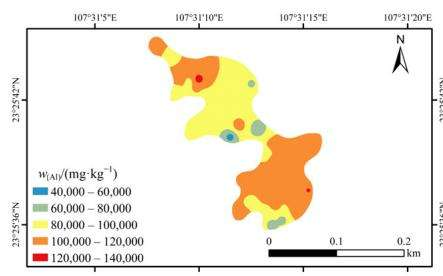

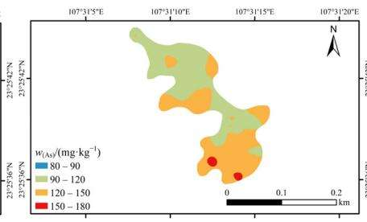

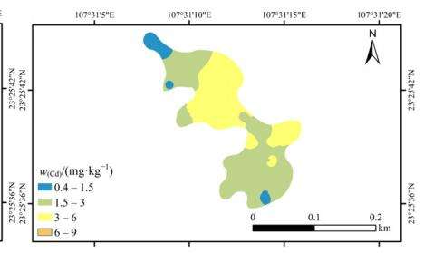

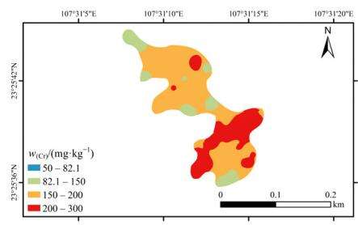

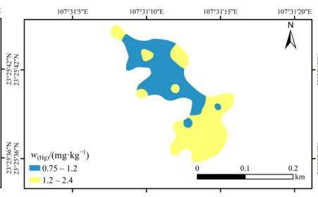  
图 1 A 区土壤金属空间分布

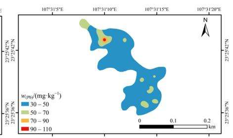

Fig. 1 Spatial distribution of soil metals in area a  
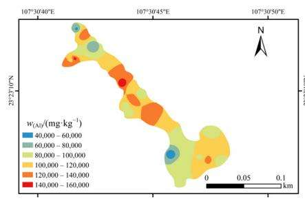

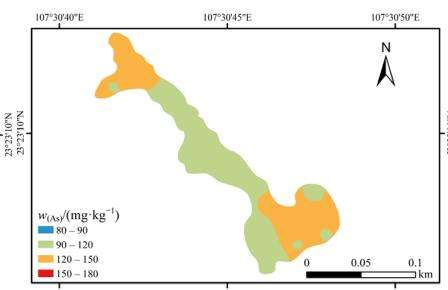

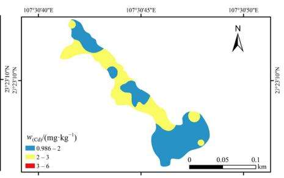

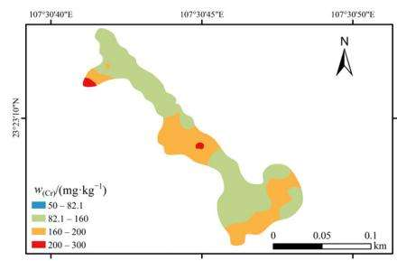

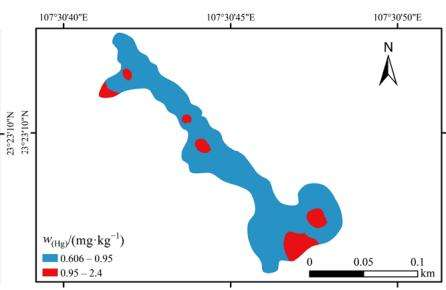  
图 2 B 区土壤金属空间分布

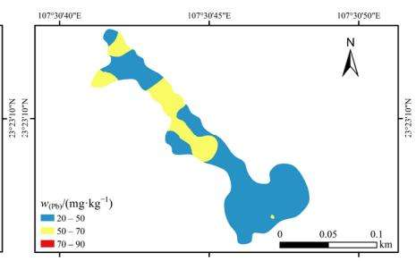  
Fig. 2 Spatial distribution of soil metals in area b

土壤重金属包括自然因素及人为因素，采用主成分分析来判定平果铝矿金属来源。主成分分析是一种能够通过简化数据（即用较少的综合指标代替原来具有一定相关性的较多的指标）来反映原来多变量的大部分信息（赵曦等， $2 0 1 5 ~ \mathrm { { ‰ } }$ 以土壤金属为变量，按照特征根大于1为主成分原则，研究区6种金属共提取了3个主成分（表9）。主成分累积方差贡献率为77.65%，可以反映原始数据的大部分信息。

主成分1（PC1）贡献率为36.07%，在3类主成分中所占比例最大，表明PC1显著影响研究区重金属分布。PC1的主要成分载荷包括As、Pb、Cr和A1，相应的因子载荷值为0.52、0.77、0.66和0.84。由于A1与As、Pb、Cr存在显著正相关关系，说明存在同源性。A1是矿区复垦土壤主要元素，受矿点影响，变异程度较大，As、Pb、Cr受外界干扰较小，由此可认为PC1主要来源于成土母质。第二主成分（PC2）的贡献率为23.61%，主要载荷为Cd。主成分3（PC3）的贡献率为17.97%，Hg在该成分上具有较高的载荷，为0.94，说明Hg、Cd表现出与其他重金属元素不同的地球化学行为特征，反映了Hg、Cd与其他金属元素来源存在较大区别，其重金属来源还需要进一步研究（张起源等，2020）。

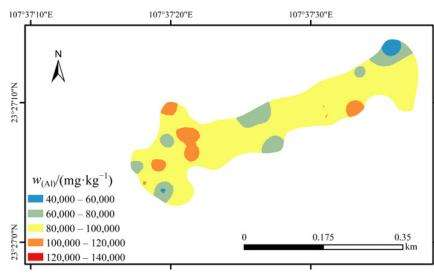

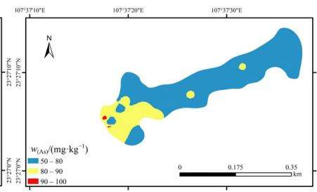

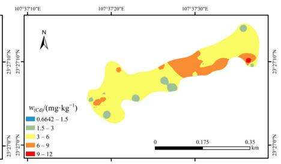

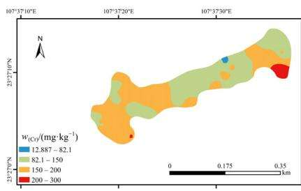

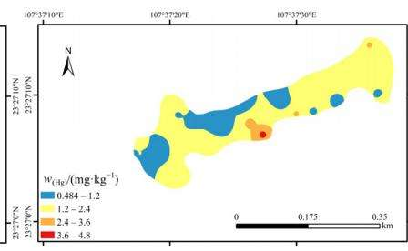  
图 3 C 区金属空间分布

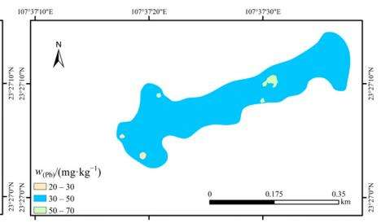  
Fig. 3 Spatial distribution of soil metals in area c

表8 土壤金属元素之间的相关系数  
Table 8 Correlation analysis between metals in soil
<table><tr><td>Element</td><td> $\mathbf { A } s$ </td><td> $\mathrm { H g }$ </td><td>Pb</td><td>Cd</td><td>Cr</td><td>Al</td></tr><tr><td>As</td><td>1.00</td><td></td><td></td><td></td><td></td><td></td></tr><tr><td>Hg</td><td>-0.08</td><td>1.00</td><td></td><td></td><td></td><td></td></tr><tr><td>Pb</td><td>0.18</td><td> $0 . 2 5 ^ { * * }$ </td><td>1.00</td><td></td><td></td><td></td></tr><tr><td>Cd</td><td> $- 0 . 5 5 ^ { * * }$ </td><td>-0.06</td><td>-0.07</td><td>1.00</td><td></td><td></td></tr><tr><td>Cr</td><td>0.16</td><td>0.05</td><td> $0 . 3 3 ^ { * * }$ </td><td>0.00</td><td>1.00</td><td></td></tr><tr><td>Al</td><td>0.21*</td><td>-0.05</td><td> $0 . 6 3 ^ { * * }$ </td><td>-0.11</td><td> $0 . 5 2 ^ { * * }$ </td><td>1.00</td></tr></table>

\*表示显著相关 $\left( \ P { < } 0 . 0 5 \ \right)$ ，\*\*表示极显著相关 $\left( \ P { < } 0 . 0 1 \right)$  
\*Indicates significant correlation (P<0.05), \*\*indicates extremely significant correlation (P<0.01)

表9 铝矿区土壤金属主成分分析  
Table 9 Principle component analysis of soil metal in Aluminum Mining Area
<table><tr><td rowspan="2">元素 Element</td><td colspan="3">主成分 Principle Component</td></tr><tr><td>PC1</td><td>PC2</td><td>PC3</td></tr><tr><td> $\mathrm { H g }$ </td><td>0.14</td><td>0.21</td><td>0.94</td></tr><tr><td>As</td><td>0.52</td><td>-0.71</td><td>-0.05</td></tr><tr><td>Pb</td><td>0.77</td><td>0.30</td><td>0.22</td></tr><tr><td>Cr</td><td>0.66</td><td>0.30</td><td>-0.23</td></tr><tr><td>Cd</td><td>-0.38</td><td>0.79</td><td>-0.21</td></tr><tr><td>Al</td><td>0.84</td><td>0.25</td><td>-0.24</td></tr><tr><td>特征根 Characteristic root</td><td>2.16</td><td>1.42</td><td>1.08</td></tr><tr><td>方差贡献率 Variance contribution rate/%</td><td>36.07</td><td>23.61</td><td>17.97</td></tr><tr><td>累积贡献率 Cumulative contribution rate/%</td><td>36.07</td><td>59.68</td><td>77.65</td></tr></table>

加粗字表示每一主成分主要影响成分  
Bold words indicate the main influencing components of each principal component

## 2.3 土壤重金属评价

## 2.3.1 污染负荷危害评价

以广西背景值为参比，根据污染负荷危害指数划分标准，对平果铝矿复垦地土壤进行评价，结果见表10。复垦区土壤 Cd、As、Hg单项污染指数（CF）污染指数 Cd>As>Hg>3，达到了重度污染水平；Pb属于中度污染；B区和C区Cr属于轻度污染水平，A区Cr达到了中度污染水平。从综合负荷指数PLI值来看，A区>C区>B区>3，所有复垦区土壤污染等级都达到了重度污染。

表10 铝矿区重金属污染负荷指数和潜在生态风险指数评价指数  
Table 10 Evaluation index of heavy metal pollution load index and potential ecological risk index in aluminum mining area
<table><tr><td rowspan="2">复垦区 Reclaimed</td><td rowspan="2">Hg</td><td rowspan="2">Cr</td><td rowspan="2">As Cd</td><td rowspan="2"></td><td colspan="2">Pb</td><td rowspan="2">污染等级 Class of pollution</td></tr><tr><td></td><td> $I _ { \mathrm { P L } }$ </td></tr><tr><td>land A</td><td>8.38</td><td>2.18</td><td>6.00</td><td>10.35</td><td>1.95</td><td>4.55</td><td>重度污染 Heavy pollution</td></tr><tr><td>B</td><td>5.90</td><td>1.96</td><td>5.69</td><td>7.42</td><td>1.92</td><td>3.84</td><td>重度污染 Heavy pollution</td></tr><tr><td>C</td><td>9.36</td><td>1.85</td><td>3.55</td><td>17.80</td><td>1.78</td><td>4.29</td><td>重度污染</td></tr><tr><td></td><td></td><td></td><td> $E _ { j } ^ { i }$ </td><td></td><td></td><td> $\underline { { I _ { \mathrm { R } _ { j } } } }$ </td><td>Heavy pollution</td></tr><tr><td>A</td><td>21.23</td><td>1.79</td><td></td><td>40.99 279.56 1.95 304.54</td><td></td><td></td><td>较强风险 Strong pollution</td></tr><tr><td>B</td><td></td><td></td><td></td><td>14.96 1.61 38.87 200.39 1.92 218.88</td><td></td><td></td><td>中等风险 Medium pollution</td></tr><tr><td>C</td><td></td><td></td><td></td><td>23.72 1.52 24.27 480.59 1.78 531.87</td><td></td><td></td><td>较强风险 Strong pollution</td></tr></table>

## 2.3.2 潜在生态风险指数评价

由表10可知，以农用地土壤污染风险筛选值(GB15618—2018)为参比，复垦地单项潜在生态风险指数均值表现为：Cd>As>Hg>Pb>Cr，A 区和 B区Cd的生态危害系数处于很强生态危害水平，而C 区的Cd污染指数等级达到了极强风险；As、Hg、Pb和Cr基本均处于轻微风险。不同复垦区综合潜在危害指数表现为：C区>A区>B区。C区和A区的综合风险都达到了较强风险，B区复垦地为中等风险。Cd 对不同复垦区重金属 RI 的贡献率高达90%以上。

## 2.3.3 健康风险评价

根据美国环境保护署（USEPA）推荐的健康风险评价方法，对研究区域农田土壤中的重金属通过摄食途径所导致存在健康风险的平均个人年风险见表11和表12。

表11 是土壤重金属对成人的健康危害的风险评价数据，在非致癌重金属元素分析中，非致癌金属元素对成人的健康危害风险均小于ICRP推荐的最大可接受水平 $5 . 0 { \times } 1 0 ^ { - 5 } { \mathrm { a } } ^ { - 1 }$ ，可知Hg、Pb、Cr对成人健康的危害较小，可以忽略不计。各非致癌重金属元素对成人健康危害的风险大小为 Cr>Pb>Hg，研究区域重金属对成人健康危害风险大小为：$\mathrm { A } { > } \mathrm { B } { > } \mathrm { C } _ { \circ }$ 通过致癌重金属元素对成人健康危害的风险分析可以看出，A、B区的健康危害风险均高于USEPA推荐的最大可接受水平 $1 . 0 { \times } 1 0 ^ { - 4 } ~ \mathrm { a } ^ { - 1 }$ ，可见A、B复垦土壤已经存在显著的健康风险；C区高于ICRP推荐的最大可接受水平，因此C区对成人的健康危害风险较小，基本处于可接受水平。各调查区重金属对成人的致癌风险大小为： $\mathrm { \Delta \mathrm { { A } { > } B { > } C _ { \circ } } }$ 两种致癌元素对成人的健康危害风险 $\mathbf { A } \mathbf { s } { \mathrm { > C d } }$ ，As的健康危害风险是Cd的3.73—14.29倍。

表12 是土壤重金属对儿童的健康危害的风险评价数据，在非致癌重金属元素分析中，非致癌金属元素对成人的健康危害风险均小于ICRP推荐的最大可接受水平 $5 . 0 { \times } 1 0 ^ { - 5 } { \mathrm { a } } ^ { - 1 }$ ，可知Hg、Pb、Cr对成人健康的危害较小，可以忽略不计。各非致癌重金属元素对成人健康危害的风险大小为Cr>Pb>Hg，研究区域重金属对儿童健康危害风险大小为：$\mathrm { \Delta \mathrm { A { > } B { > } C _ { \circ } } }$ 通过致癌重金属元素对儿童健康危害的风险分析可以看出，A、B、C区的健康危害风险均高于USEPA推荐的最大可接受水平 $1 . 0 { \times } 1 0 ^ { - 4 } ~ \mathrm { a } ^ { - 1 }$ ，可见A、B、C复垦土壤已经存在显著的健康风险。各调查区重金属对儿童的致癌风险大小为： $\mathrm { \Delta \mathrm { { A } { > } B { > } C _ { \circ } } }$ 两种致癌元素对成人的健康危害风险 $\mathbf { A s } { \mathrm { > C d , A s } }$ 的健康危害风险是 Cd的 3.72—14.31 倍。

综合以上可知，复垦区土壤对成人、儿童健康危害风险最大的致癌重金属元素为As，Cd也存在一定的健康风险。

## 3 讨论

## 3.1 铝土矿复垦土壤肥力因子特征

本研究中，复垦区土壤肥力不高，随着复垦年限的增加，土壤pH含量变化不明显，土壤SOM含量增加，TN、TP先增加后减少，TK含量降低。这可能是由于复垦前期，在外界作用的情况下，施肥较多，导致其N、P浓度增加；K含量逐渐减少原因可能是复垦区域植物对K的吸收及钾肥施用量较小导致的。张乃明等（2003）研究发现：随着铝矿复垦年限的增加，复垦土壤SOM、N均呈逐年增加趋势，土壤中TP、TK、pH变化不明显。薛燕琴等(2013)研究发现铝矿复垦后土壤有机质、全氮、速效磷含量均呈递增趋势，速效钾含量逐渐降低。本研究部分结论与其相似。说明经过复垦处理后土壤在长期的自然、人为及耕作措施等因素的影响下，土壤再次开始熟化，适于耕作。追肥、灌水等农事操作使得土壤肥力逐渐恢复，进而改善土壤有机质，逐渐趋于利于作物生长的方向。

## 3.2 铝土矿复垦土壤金属元素污染因子特征

铝是地壳中含量最丰富的金属元素，约占地壳组成的8%，是土壤中大量存在的一种元素。土壤中的铝是一种惰性元素，在风化过程中铝在土壤中相对富集(魏世清等，2007)。一般情况下铝元素对植物没有毒害作用，甚至会促进植物的生长，但是当土壤铝含量达到一定阈值时就会毒害植物（仝雅娜等，2008)。不同的植物，铝表现毒性的浓度不同，即不同植物对铝的耐受程度不同。马尾松在50$1 0 0 \mathrm { m g } { \cdot } \mathrm { k g } ^ { - 1 }$ 存在抑制作用(刘厚田等，1992)，杉木的毒害阈值 $\mathrm { A l ^ { 3 + } { \ge } 1 . 3 9 \ m m o l { \cdot } L ^ { - 1 } }$ (土壤溶液中)，柳杉阈值在 $1 . 5 { \mathrm { - } } 2 . 0 { \mathrm { m m o l / L } }$ -1之间(蒋时姣等，2015)马尾松阈值为 $4 . 0 \mathrm { m g ^ { - } L ^ { - } }$ 1（罗承德等，2000）小麦、玉米、油菜、大豆和花生交换铝含量大于5 cmol·kg−1就会表现出毒害作用（秦瑞君等，1999)。荞麦和金荞麦根际土壤铝毒害的阈值为活性铝溶出量$0 . 1 0 6 { \mathrm { - } } 0 . 1 4 3 ~ { \mathrm { m g } } { \cdot } { \mathrm { k g } } ^ { - 1 }$ 和 $0 . 0 4 6 { \mathrm { - } } 0 . 0 5 7 ~ { \mathrm { m g } } { \cdot } { \mathrm { k g } } ^ { - 1 }$ 之间(陈微微等，2007)。本研究中，铝土矿采空复垦区土壤A1质量分数是广西背景值的1.35倍以上，活性 A1 含量最小为 4 $7 2 2 . 6 5 ~ \mathrm { m g ^ { . } k g ^ { - 1 } }$ ，对于植物产生较大影响的交换态A1最小也达到 $\overline { { \mathrm { ~ J ~ } } } 1 . 7 7 \ : \mathrm { m g ^ { . } k g ^ { - 1 } }$ 说明活性A1 的溶出量已可以使部分植物产生铝毒症状。

表11 铝矿区土壤重金属对成人健康危害的平均年风险  
Table 11 Average annual risk values of heavy metals for adults in aluminum mining area
<table><tr><td>复垦区 Reclaimed land</td><td>Cd</td><td> $\mathbf { A } s$ </td><td>致癌风险指数  $\mathrm { C a r c i n o g e n i c } \mathrm { r i s k i n d e x } ( R _ { \mathrm { c } } )$ </td><td> $\mathrm { H g }$ </td><td>Pb</td><td>Cr</td><td>非致癌风险指数 Non-carcinogenic risk index (R)</td></tr><tr><td>A</td><td> $1 . 1 7 \times 1 0 ^ { - 5 }$ </td><td> $1 . 2 6 \times 1 0 ^ { - 4 }$ </td><td> $1 . 3 8 \times 1 0 ^ { - 4 }$ </td><td> $6 . 7 7 \times 1 0 ^ { - 9 }$ </td><td> $1 . 3 4 \times 1 0 ^ { - 8 }$ </td><td> $5 . 9 7 \times 1 0 ^ { - 8 }$ </td><td> $7 . 9 9 \times 1 0 ^ { - 8 }$ </td></tr><tr><td>B</td><td> $0 . 8 4 \times 1 0 ^ { - 5 }$ </td><td> $1 . 2 0 \times 1 0 ^ { - 4 }$ </td><td> $1 . 2 8 \times 1 0 ^ { - 4 }$ </td><td> $4 . 8 0 \times 1 0 ^ { - 9 }$ </td><td> $1 . 3 1 \times 1 0 ^ { - 8 }$ </td><td> $5 . 3 7 \times 1 0 ^ { - 8 }$ </td><td> $7 . 1 6 { \times } 0 ^ { - 8 }$ </td></tr><tr><td>C</td><td> $2 . 0 1 \times 1 0 ^ { - 5 }$ </td><td> $0 . 7 5 { \times } 1 0 ^ { - 4 }$ </td><td> $0 . 9 5 \times 1 0 ^ { - 4 }$ </td><td> $7 . 5 7 \times 1 0 ^ { - 9 }$ </td><td> $1 . 2 2 \times 1 0 ^ { - 8 }$ </td><td> $5 . 0 7 \times 1 0 ^ { - 8 }$ </td><td> $7 . 0 5 \times 1 0 ^ { - 8 }$ </td></tr></table>

表12 铝矿区土壤重金属对儿童健康危害的平均年风险  
Table 12 Average annual risk values of heavy metals for children in aluminum mining area
<table><tr><td>复垦区 Reclaimed land</td><td>Cd</td><td>As</td><td>致癌风险指数 Carcinogenic risk index (Rc)</td><td>Hg</td><td>Pb</td><td>Cr</td><td>非致癌风险指数 Non-carcinogenic risk index (R)</td></tr><tr><td>A</td><td> $3 . 0 5 \times 1 0 ^ { - 5 }$ </td><td> $3 . 2 9 \times 1 0 ^ { - 4 }$ </td><td> $3 . 6 0 \times 1 0 ^ { - 4 }$ </td><td> $5 . 2 9 \times 1 0 ^ { - 8 }$ </td><td> $1 . 6 8 \times 1 0 ^ { - 7 }$ </td><td> $7 . 4 6 \times 1 0 ^ { - 7 }$ </td><td> $9 . 6 7 \times 1 0 ^ { - 7 }$ </td></tr><tr><td>B</td><td> $2 . 1 8 \times 1 0 ^ { - 5 }$ </td><td> $3 . 1 2 \times 1 0 ^ { - 4 }$ </td><td> $3 . 3 4 \times 1 0 ^ { - 4 }$ </td><td> $3 . 7 5 \times 1 0 ^ { - 8 }$ </td><td> $1 . 6 4 \times 1 0 ^ { - 7 }$ </td><td> $6 . 7 1 \times 1 0 ^ { - 7 }$ </td><td> $8 . 7 3 \times 1 0 ^ { - 7 }$ </td></tr><tr><td>C</td><td> $5 . 2 4 \times 1 0 ^ { - 5 }$ </td><td> $1 . 9 5 \times 1 0 ^ { - 4 }$ </td><td> $2 . 4 7 \times 1 0 ^ { - 4 }$ </td><td> $5 . 9 2 \times 1 0 ^ { - 8 }$ </td><td> $1 . 5 3 \times 1 0 ^ { - 7 }$ </td><td> $6 . 3 4 \times 1 0 ^ { - 7 }$ </td><td> $8 . 4 6 \times 1 0 ^ { - 7 }$ </td></tr></table>

复垦土壤中 Cd、As 是农用地筛选值的 6.67—16.03倍和2.42—4.10倍，其余元素均值均未超标。Hg、Cd、Cr、Pb、As质量分数均值均超过了广西土壤背景值，存在一定程度的重金属积累；各重金属元素含量超过背景值的程度为：Cd>Hg>As>Cr>Pb，其中 Cd、Hg、As的超标程度明显高于其他元素，Cd污染范围最广。平果铝矿金属空间分布及相关分析表明，Al污染与As、Cr、Pb相关性较强，主成分分析来看，As、Cr、Pb、Al来源基本一致，说明其主要受到母土土质影响，在成矿过程中，重金属存在伴生关系，铝矿开采导致土壤中重金属的输入（王志杰等，2019）。Cd在PC2上具有较高的正载荷。有研究表明工矿企业生产中使用的原料、添加物、废物和大型货运车辆产生的尾气，以及肥料中都含有一定的Cd，导致Cd富集程度较高（钟雪梅等，2017；易文利等，2018)。王雄（2019）、聂兴山（2017；2018）研究孝义铝土矿复垦土壤，发现Cd是主要超标的重金属元素，且处于高风险水平，其污染源来自复垦所用的离石黄土。而广西铝土矿采用剥离-采矿-复垦一体化技术，且由于广西铝土矿呈鸡窝状分布，运输过程会经过复垦区，产生的矿粒粉尘极易对复垦区土壤造成重金属污染（王浩等，2020)，且由于复垦土壤肥力较差，通常会施用较多肥料对复垦土壤进行改良。综上，平果铝矿Cd污染较重的原因极有可能是矿区大型货运运输、肥料施用或是复垦用土复合作用的结果。PC3的主要正载荷是Hg，Hg进入土壤的途径可分为大气沉降、污水灌溉和农业活动这几种主要途径，且95%以上可以迅速被土壤吸收或固定（王锐等，2021)。Hg在PC2中正载荷为0.207，说明Hg与农业活动也有一定的关系。此外，复垦土壤与矿区废弃物之间的物质转移也会导致土壤重金属含量差异。而土壤中过量的重金属累积，不仅可以在植物体内残留，对植物生长发育产生严重危害，而且当人类长期食用含重金属超标的食物时，会产生各种各样的疾病。因此，在矿区复垦时，选择复垦用土及控制其土壤质量是复垦的关键。平果铝土矿复垦土地要进行安全利用及农业生产，必须经过不断改良，提高复垦土壤的适耕性。

## 3.3 铝土矿复垦土壤风险评估

土壤重金属是影响矿区土壤质量的重要因素。为了探究矿区土壤是否可以达到安全利用及农业生产的水平，需对其进行重金属风险评估。聂兴山（2017，2018）研究孝义铝矿复垦区土壤重金属Cd达到了5级重污染程度，属于严重污染水平。王雄（2019）研究表明孝义铝矿复垦土地耕作层综合潜在生态风险指数在属于中等程度潜在生态风险，而且主要污染因子是Cd，次要污染因子是 $\mathrm { P b } _ { \circ }$ 平果铝矿复垦区污染负荷危害指数表明：复垦区土壤主要污染元素Cd、As、Hg处于重度污染水平，且复垦区土壤污染等级达到了重度污染。潜在生态风险指数显示C区>A区>B区，说明与新复垦的土壤相比，早期复垦土壤的重金属污染有一定程度的减小。Cd对不同复垦区重金属RI的贡献率高达90%以上，是铝矿复垦区土壤最主要的生态风险因子，受人为活动影响较大。健康风险表明复垦土壤中对成人、儿童健康危害风险最大的致癌重金属元素为As，而Cd也存在一定的健康风险。非致癌重金属元素对成人和儿童的健康危害风险较小。多数农田土壤质量研究发现，区域重金属污染程度和潜在风险均由Cd引起，土壤Cd的污染治理急需得到政府与人们的重视(谢萍娟等，2014；王陆军等，2015)。

## 4 结论

广西壮族自治区平果县铝土矿部分采空区通过复垦重新用于耕种，但复垦土壤质量表现出较大的差异。不同时期复垦的土壤质量分析及风险评估结果表明养分含量及重金属污染可能是制约复垦土壤安全利用的关键制约因子。

（1）铝土矿采空区复垦土壤养分水平较低，与新复垦的土壤相比，早期复垦土壤的养分有一定程度的提高。

（2）铝土矿采空区复垦土壤中Hg、Cd、Cr、Pb、As超过了广西土壤背景值，而Cd、As是农用地筛选值的6.67—16.03倍和2.42—4.10倍，Cd污染严重，其次是As。复垦土壤高A1也是影响作物生长的因子之一。相关性和主成分分析结果表明该露天铝土矿采空区不同时期复垦土壤中金属存在高度的空间变异。

（3）铝土矿复垦土壤重金属污染评价结果表明所有的复垦土壤均属于重度污染。潜在生态风险评价指出B 区属于中等环境风险，而A 区和C区仍处于较强生态风险。Cd是铝矿复垦区土壤最主要的生态风险因子，其受人为活动影响较大。健康风险表明复垦土壤中对成人、儿童健康危害风险最大的致癌重金属元素为As，而Cd也存在一定的健康风险。因此，该调查区域的铝土矿复垦土地要进行安全利用及农业生产，必须经过不断改良，提高复垦土壤的适耕性。

## 参考文献：

HAKANSON L, 1980. An ecological risk index for aquatic pollution control. a sediment logical approach [J]. Water Research, 14(8): 975-1001.

MACLEOD D A, 1992. Plant adaptation to aluminum toxicity and its role in forage production [J]. Forages on red soil in China. ACIAR proceedings, 38:57-63.

蔡刚刚，张学洪，梁美娜，等,2014.南丹大厂矿区周边农田土壤重金属 健康风险评价[J]. 桂林理工大学学报,34(3): 554-559. CAI G G, ZHANG X H, LIANG M N, et al., 2014. Health risk assessment of heavy metals pollution in farmland soil surrounding Dachang ore district in Nandan [J]. Journal of Guilin University of Technology, 34(3): 554-559.

陈同斌，庞瑞，王佛鹏，等，2020.桂西南土壤镉地质异常区水稻种植安 全性评估[J]. 环境科学,41(4): 1855-1863. CHEN T B, PANG R, WANG F P, et al., 2020. Safety assessment of rice planting in soil cadmium geological anomaly areas in southwest Guangxi [J]. Environmental Science, 41(4): 1855-1863.

陈微微，陈传奇，刘鹏，等，2007.荞麦和金荞麦根际土壤铝形态变化及 对其生长的影响[J]. 水土保持学报,21(1):176-179. CHEN W W, CHEN C Q, LIU P, et al., 2007. Forms of aluminum in rhizosphere soil and its effect on growth of Fagopyrum esculentum and Fagopyrum cymosum [J]. Journal of Soil and Water Conservation, 21(1): 176-179.

陈秀端，卢新卫，杨光，等,2012. 西安市二环内表层土壤重金属污染评 价[J]. 干旱区资源与环境,26(11): 81-86. CHEN X D, LU X W, YANG G, et al., 2012. Assessment of heavy metal pollution in the urban topsoil of interior area of Xi’an [J]. Journal of Arid Land Resources and Environment, 26(11): 81-86.

郭天荣，王元元，刘金川，等，2013.铝，镉胁迫下不同大麦品种根际的 铝，镉形态分析[J]. 麦类作物学报,33(2): 377-381. GUO T R, WANG Y Y, LIU J C, et al., 2013. Forms of aluminum and cadmium in the rhizosphere of two barley genotypes with aluminum tolerances under aluminum and cadmium stresses [J]. Journal of Triticeae Crops, 33(2): 377-381.

洪涛，孔祥胜，岳祥飞,2019.滇东南峰丛洼地土壤重金属含量、来源及 潜在生态风险评价[J]. 环境科学,40(10): 4620-4627. HONG T, KONG X S, YUE X F, 2019. Concentration characteristics, source analysis, and potential ecological risk assessment of heavy metals in a peak-cluster depression area, southeast of Yunnan Province [J]. Environmental Science, 40(10): 4620-4627.

蒋时姣，钟宇，刘海鹰，等，2015. 铝胁迫对柳杉组培苗生长及生理特性 的影响[J]. 植物生理学报, 51(2): 227-232. JIANG S J, ZHONG Y, LIU H Y, 2015. Effect of aluminum stress on the growth and some physiological characteristics in Cryptomeria fortunei Tisssue culture seedlings [J]. Plant Physiology Communications, 51(2): 227-232.

孔繁翔，桑伟莲，蒋新，等，2000.铝对植物毒害及植物抗铝作用机理[J]. 生态学报, 20(5): 855-862.KONG F Y, SANG W L, JIANG X, et al., 2000. Aluminum toxicity andtolerance in plants [J]. Acta Ecologica Sinica, 20(5): 855-862.

李小平,2007. 平果铝赤泥堆场的边坡环境问题与治理对策研究[J]. 有色金属(矿山部分),59(2): 29-31.LI X P, 2007. Study on Side Slope Environment Problems and thecountermeasure of Pingguo red mud disposal field [J]. NonferrousMetals (Mine section), 59(2): 29-31.

李一蒙，马建华，刘德新，等,2015.开封城市土壤重金属污染及潜在生 态风险评价[J]. 环境科学, 36(3): 1037-1044. LI Y M, MA J H, LIU D X, et al., 2015. Assessment of heavy metal pollution and potential ecological risks of urban soils in Kaifeng City, China [J]. Environmental Science, 36(3): 1037-1044.

李忠义，张超兰，邓超冰，等，2009.铅锌矿区农田土壤重金属有效态空 间分布及其影响因子分析[J]. 生态环境学报,18(5):1772-1776. LI Z L, ZHANG C L, DENG C B, et al., 2009. Analysis on spatial distribution of soil available heavy metals and its influential factors in a lead-zinc mining area of Guangxi, China [J]. Ecology and Environmental Sciences, 18(5): 1772-1776.

梁玉祥，袁辉，谢瑞，等,2020.铝土矿区土壤中Cu、Zn、Mn的富集和迁移特征[J]. 河南科技, 703(5): 134-136.LIANG Y X, YUAN H, XIE R, et al., 2020. Enrichment and migrationof Cu, Zn, and Mn in the bauxite soil [J]. Journal of Henan Science andTechnology, 703(5): 134-136.

刘厚田，田仁生，1992. 重庆南山马尾松衰亡与土壤铝活化的关系[J]. 环境科学学报, 12(3): 297-305. LIU H T, TIAN R S, 1992. Relationship between decline of a masson pine forest and aluminum activation in Nanshan, Chongqing [J]. Acta Scientiae Circumstantiae, 12(3): 297-305.

罗承德，张健，刘继龙,2000.四川盆周山地杉木人工林衰退与铝毒害阈 值的探讨[J]. 林业科学, 36(1): 9-14. LUO C D, ZHANG J, LIU J L, 2000. Researches on the threshold of aluminum toxicity and the decline of Chinese fir plantation in hilly area around the Sichuan basin [J]. Forestry Science, 36(1): 9-14.

聂兴山,2017. 铝矿复垦土壤重金属含量变化及污染风险评价[J]. 水土 保持通报,37(2): 321-326. NIE X S, 2017. Contents and pollution risk assessment of heavy mentals in reclaimed soil [J]. Bulletin of Soil and Water Conservation, 37(2): 321-326.

聂兴山,2018. 孝义铝矿复垦土壤重金属污染潜在生态风险评价[J]. 中 国水土保持科学,16(1): 116-122. NIE X S, 2018. Potential ecological risk assessment of heavy metals in the reclaimed soil of Xiaoyi Bauxite Mine [J]. Science of Soil and Water Conservation, 16(1): 116-122.

潘文灿,2017. 对广西平果铝土矿采矿用地方式改革的建议——广西平 果铝土矿采矿用地改革试点10年的成效、问题及措施[J].中国国 土资源经济,30(2): 4-8. PAN W C, 2017. Suggestions for the reform with regard to the pattern of land use for mining bauxite in Pingguo of Guangxi: Introduction the results they have achieved, the problems they have faced in ten-year experimental reform of land use for mining bauxite in Pingguo of Guangxi, and some addressing methods [J]. Natural Resource Economics of China, 30(2): 4-8.

秦瑞君,陈福兴,1999.湘南红壤作物苗期铝中毒的研究[J]. 植物营养 与肥料学报, 5(1): 50-56. QIN R J, CHEN F X, 1999. The aluminum toxicity of some crop seedlings in red soil of southern Hunan [J]. Plant Nutrition and Fertilizer Science, 5(1): 50-56.

孙钦帮，张冲，乌立国，等，2017.广东红海湾表层沉积物重金属含量的 空间分布特征与污染状况评价[J]. 生态环境学报,26(5): 843-849. SUN Q B, ZHANG C, WU L G, et al., 2017. Concentration distribution and pollution assessment of heavy metals in surface sediments in Honghai Bay [J]. Ecology and Environmental Sciences,

26(5): 843-849.

覃事娅，陈建宏，唐常春,2010.广西壮族自治区平果铝土矿区待复垦土 地适宜性评价[J]. 水土保持通报,30(3): 211-215. QIN S Y, CHEN J H, TANG C C, 2010. Land suitability evaluation for reclamation of bauxite region in Pingguo County of Guangxi Zhuang Autonomous Region [J]. Bulletin Soil and Water Conservation, 30(3): 211-215.

田绪庆，陈为峰，申宏伟，等,2015. 日照市城区绿地土壤肥力质量评价 [J]. 水土保持研究, 22(6): 138-143. TIAN X Q, CHEN W F, SHENG H W, et al., 2015. Assessment on quality of soil fertility of the urban green space in Rizhao City [J]. Research of Soil and Water Conservation, 22(6): 138-143.

仝雅娜，丁贵杰,2008. 铝对植物生长发育及生理活动的影响[J].西部 林业科学,37(4): 56-60. TONG Y N, DING G J, 2008. Influences of aluminum on development and physiological activities of plants [J]. Journal of West China Forestry Science, 37(4):56-60.

王浩，叶丽丽，陈永山，等，2020.广西典型铝矿区复垦地蔬菜中重金属 含量特征及健康风险评价[J]. 西南农业学报,33(11): 2655-2661. WANG H, YE L L, CHEN Y S, et al., 2020. Heavy metal content characteristics and health risk assessment of vegetables in reclaimed land of bauxite mine region in Guangxi [J]. Southwest China Journal of Agricultural Sciences, 33(11): 2655-2661.

王建波，化伟，2019. 兰州某铝厂旧址周围土壤重金属污染及分布特征 [J]. 矿产勘查, 66(6): 288-292. WANG J B, HUA W, 2019. Pollution and distribution characteristics of heavy metals in soil around the former site of an aluminum plant in Lanzhou [J]. Mineral Exploration, 66(6): 288-292.

王陆军，范拴喜,2015. 宝鸡市城郊农田土壤重金属污染风险评估[J]. 中国农学通报,31(3):179-185. WANG L J, FAN S X, 2015. Risk assessment of heavy metals in farmland soil in the outskirts of Baoji City [J]. Chinese Agricultural Science Bulletin, 31(3): 179-185.

王锐，邓海，贾中民，等,2021.汞矿区周边土壤重金属空间分布特征、污染与生态风险评价[J]. 环境科学,42(6): 3018-3027.

WANG R, DENG H, JIA Z M, et al., 2021. Spatial distribution characteristics, pollution, and ecological risk assessment of soil heavy metals around mercury mining areas [J]. Environmental Science, 42(6): 3018-3027.

王太海，陈建宏，2016.堆积型铝土矿剥离-采矿-复垦一体化技术架构 [J]. 矿冶工程, 36(5): 147-149. WANG T H, CHEN J H, 2016. A framework of integrated technology of stripping, mining and reclamation for accumulative bauxite deposit [J]. Mining and Metallurgical Engineering, 36(5): 147-149.

王雄,2019. 铝矿区复垦土地重金属质量分数特征及潜在生态风险评价 [J]. 中国水土保持科学, 17(2): 98-106. WANG X, 2019. Characteristics and potential ecological risk assessment of heavy metals in reclaimed land of a bauxite mine [J]. Science of Soil and Water Conservation, 17(2): 98-106.

王志杰，柳书俊，郑杰，等,2019.草海流域土壤重金属污染及其生态风 险评价[J]. 生态环境学报,28(12): 2438-2446. WANG Z J, LIU S J, ZHENG J, et al., 2019. Ecological risk assessment of heavy metals in soils of Caohai Watershed [J]. Ecology and Environment Sciences, 28(12): 2438-2446.

魏世清，张磊，李艳宾，等,2007.生物措施缓解酸性土壤铝毒害研究进 展[J]. 土壤, 39(4): 536-540. WEI S Q, ZHANG L, LI Y B, et al., 2007. Advancements in the study on biologics means mitigating aluminum toxicity in acid soils [J]. Soil, 39(4): 536-540.

文衍科，杨海洋，程运材,2006.平果铝土矿采空区的工程复垦技术[J]. 金属矿山(8): 68-71. WEN Y K, YANG H Y, CHEN Y C, 2006. Engineering reclamation technology for mined area in Pingguo bauxite mine [J]. Metal Mine, (8): 68-71.

吴健，王敏，张辉鹏，等,2018.复垦工业场地土壤和周边河道沉积物重 金属污染及潜在生态风险[J]. 环境科学, 39(12): 5620-5627. WU J, WANG M, ZHANG H P, et al., 2018. Heavy metal pollution and potential ecological risk of soil from reclaimed industrial sites and surrounding river sediments [J]. Environmental Science, 39(12): 5620-5627.

谢萍娟,郭掌珍,2014. 宝鸡市近郊农田土壤重金属含量及风险评价[J]. 山西农业大学学报(自然科学版),34(5): 442-446. XIE P J, GUO Z Z, 2014. Heavy metal contents detection and risk assessment in farmland soil from Baoji [J]. Journal of Shanxi Agricultural University (Natural Science Edition), 34(5): 442-446.

徐慧秋，黄银华，吴志峰，等,2016.广州市农业土壤As和Cd污染及其 对景观异质性的多尺度响应[J]. 应用生态学报,27(10): 3283-3289. XU H Q, HUANG Y H, WU Z F, et al., 2016. Agricultural soil contamination from As and Cd and its responses to landscape heterogeneity at multiple scales in Guangzhou, China [J]. Chinese Journal of Applied Ecology, 27(10): 3283-3289.

徐莉，黄亮亮，吴志强，等,2016.广西会仙湿地土壤重金属分布特征及 风险评估[J]. 安徽农业科学,44(29): 35-38,101. XU L, HUANG L L, WU Z Q, et al., 2016. Distribution characteristics and risk assessment of heavy metals in Huixian Wetland of Guangxi Province [J]. Journal of Anhui Agricultural Sciences, 44(29): 35-38, 101.

徐玉霞，汪庆华，彭囿凯，等，2018.煤矿周边土壤重金属影响评价及来 源分析[J]. 环境监测管理与技术, 30(3): 32-37. XU Y X, WANG Q H, PENG Y K, et al., 2018. Impact assessment and source analysis of heavy metal pollution in soil around coal mine [J]. The Administration and Technique of Environmental Monitoring, 30(3): 32-37.

薛燕琴，冯婉君，2013.矿区复垦土地土壤肥力研究——以孝义矿区为例[J]. 安徽农业科学,41(28): 11361-11362, 11451.XUE Y Q, FENG W J, 2013. On soil fertility of reclamation land inXiaoyi mining area of Shanxi Province [J]. Journal of Anhui AgriculturalSciences, 41(28): 11361-11362, 11451.

易文利，董奇，杨飞，等，2018.宝鸡市不同功能区土壤重金属污染特 征、来源及风险评价[J]. 生态环境学报,27(11):2142-2149. YI W L, DONG Q, YANG F, et al., 2018. Pollution characteristics, sources analysis and potential ecological risk assessment of heavy metals in different functional zones of Baoji City [J]. Ecology and Environment Sciences, 27(11): 2142-2149.

尹炳，汪建飞，师胜，等，2020.矿业废弃地复垦土壤-作物硒吸收特征 及其对重金属拮抗效应[J]. 环境科学,41(4): 1904-1913. YIN B, WANG J F, SHI S, et al., 2020. Selenium uptake characteristics of reclaimed soil-crop from mining wasteland and its antagonistic effects on heavy metals [J]. Environmental Science, 41(4): 1904-1913.

张菁，江山，王改玲,2018.安太堡露天矿不同复垦年限苜蓿地土壤养分 和酶活性剖面特征[J]. 灌溉排水学报,37(1): 4042-4248. ZHANG J, JIANG S, WANG G L, 2018. Soil profile characteristics of soil nutrients and enzyme activity after reclaiming alfafa in Antaibao opencast coal mine [J]. Journal of Irrigation and Drainage, 37(1): 4042-4248.

张连科，李海鹏，黄学敏，等,2016.包头某铝厂周边土壤重金属的空间 分布及来源解析[J]. 环境科学,37(3): 1139-1146. ZHANG L K, LI H P, HUANG X M, et al., 2016. Soil heavy metal spatial distribution and source analysis around an aluminum plant in Baotou [J]. Environmental Science, 37(3): 1139-1146.

张乃明，武雪萍，谷晓滨，等，2003.矿区复垦土壤养分变化趋势研究 [J]. 土壤通报, 34(1): 59-61. ZHANG N M, WU X P, GU X B, et al., 2003. Variability in fertility of reclaimed soil in colliery regions [J]. Chinese Journal of Soil Science, 34(1): 59-61.

张起源，秦颖君，刘香华，等,2020.广东红树林沉积物有毒金属分布及 生态风险评价[J]. 生态环境学报,29(1): 187-195. ZHANG Q Y, QIN Y J, LIU X H, et al., 2020. Distribution characteristics and ecological risk assessment of toxic metals in mangrove sediments in Guangdong [J]. Ecology and Environmental Sciences, 29(1): 187-195.

张文敏，马彦卿，李小平，等,2000.平果铝土矿复垦技术研究[J].冶金 矿山设计与建设,32(5): 34-37,47. ZHANG W M, MA X Q, LI X P, et al., 2000. Research on reclamation technology for Pingguo bauxite mine [J]. Metal Mine Design and Construction, 32(5): 34-37, 47.

张云芸，马瑾，魏海英，等，2019.浙江省典型农田土壤重金属污染及生 态风险评价[J]. 生态环境学报,28(6): 1233-1241. ZHANG Y Y, MA J, WEI H Y, et al., 2019. Heavy metals in typical farmland soils of Zhejiang Province: levels, sources and ecological risks [J]. Ecology and Environment Sciences, 28(6): 1233-1241.

赵曦，黄艺，李娟，等，2015.大型垃圾焚烧厂周边土壤重金属含量水 平、空间分布、来源及潜在生态风险评价[J].生态环境学报,24(6): 1013-1021. ZHAO X, HUANG Y, LI J, et al., 2015. Environmental levels, spatial distribution, sources and potential ecological risk of heavy metals in soils surrounding a large solid waste incinerator [J]. Ecology and

Environmental Sciences, 24(6): 1013-1021.

中华人民共和国生态环境部,2018. 土壤环境质量农用地土壤污染风险管控标准(试行): GB15618—2018 [S]. 北京: 中国环境出版社.Ministry of Ecology and Environment of the People's Republic of China,2018. Soil Environmental Quality Standards for Agricultural Land SoilPollution Risk Control (Trial): GB 15618—2018 [S]. Beijing: ChinaEnvironmental Science Press.

钟雪梅，夏德尚，宋波，等,2017.广西土壤镉含量状况与风险评估研究 进展[J]. 自然资源学报,32(7): 1256-1270. ZHONG X M, XIA S D, SONG B, et al., 2017. Review on soil cadmium study and risk assessment in Guangxi [J]. Journal of Natural Resources, 32(7): 1256-1270.

周伟，王文杰，何兴元，等,2018.哈尔滨城市绿地土壤肥力及其空间特 征[J]. 林业科学, 54(9): 9-17. ZHOU W, WANG W J, HE X Y, et al., 2018. Soil fertility and spatial variability of urban green land in Harbin [J]. Forestry Science, 54(9): 9- 17.

周亚龙，杨志斌，王乔林，等，2021.雄安新区农田土壤-农作物系统重 金属潜在生态风险评估及其源解析[J]. 环境科学,42(4): 2003-2015. ZHOU Y L, YANG Z B, WANG Q L, et al., 2021. Potential ecological risk assessment and source analysis of heavy metals in soil-crop system in Xiong'an New District [J]. Environmental Science, 42(4): 2003-2015.

# Spatial Distribution Characteristics and Pollution Assessment of Heavy Metals in Reclaimed Land of A Bauxite Mine Region in Guangxi

CUI Lirong1, YE Lili1, CHEN Yongshan2, YAN Chaofan1, JIANG Jinping1, \*

1. Guangxi Key Laboratory of Environmental Pollution Control Theory and Technology, Guilin 541004, China; 2. School of Resources and Environmental Science, Quanzhou Normal University, Quanzhou 362000, China; 3. Guangxi Collaborative Innovation Center for Water Pollution Control and Water Safety in Karst Area, Guilin 541004, China

Abstract: The assessment of pollution status of reclaimed land after non-ferrous metal mining is of great significance to its safe utilization. In order to find out the environmental quality of reclaimed soil of typical open-pit bauxite mines in Guangxi, the fertility factors, heavy metal content, spatial distribution, pollution degree and ecological risk of reclaimed soil in different periods in minedout areas of Pingguo aluminum mine (area A: reclaimed in 1998; area B: reclaimed in 2003; area C: reclaimed in 2013) were studied. The results show that the soil fertility in reclamation area is low. Compared with the soil fertility in C area, the soil in area A and B has been improved to different extents. The average content of soil Hg, Cd, Cr, Pb and As in the reclaimed area exceeds the background values of Guangxi, and Cd and As are 6.67–16.03 times, 2.42–4.10 times of the screening values of agricultural land. There is a high degree of spatial variation of metals in the reclaimed soil. The content of Al in reclaimed soil is high, which is 1.51 times, 1.65 times and 1.36 times of the background value of Guangxi. The minimum content of active Al is 4 722.65 mg·kg−1, which has exceeded the toxicity threshold of some plants and has a certain impact on plants. The pollution load index results show that the soil in bauxite reclamation area is heavy pollution. The potential ecological risk assessment shows that the area B belongs to medium environmental risk, while the area A and area C is still at a strong level of ecological risk. The results of health risk assessment show that heavy metals are more harmful to children's health than adults through feeding, and carcinogenic heavy metal As is more harmful to people than Cd The reclaimed soil of Pingguo aluminum mine is polluted by heavy metal, which causes some harm to the surrounding environment and people. Therefore, in the process of safe utilization, the bauxite reclamation land needs continuous improvement to reduce the ecological risk of the reclaimed soil.

Keywords: reclamation land; bauxite; spatial differentiation; heavy metal; risk assessment