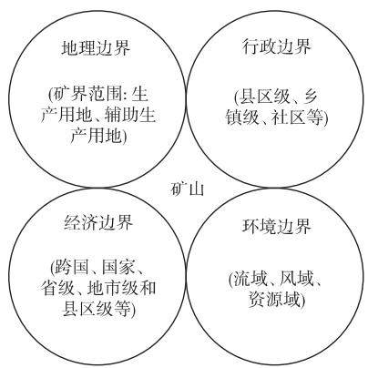
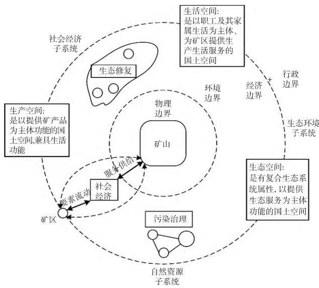
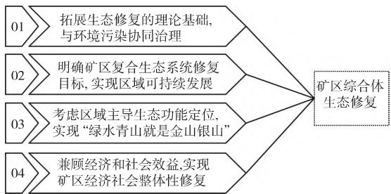
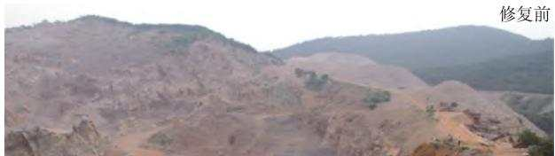
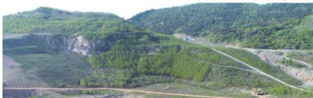
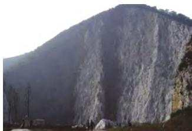
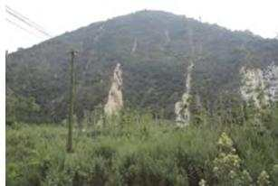
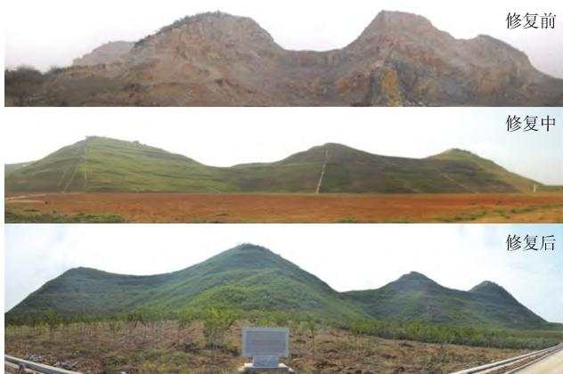
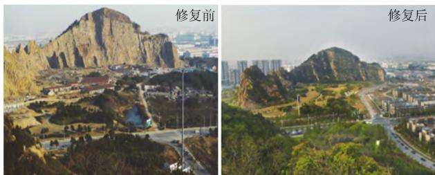
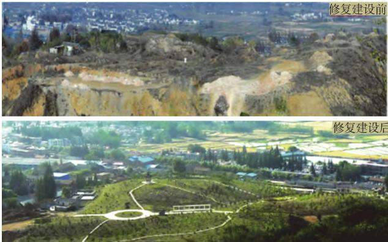

DOI: 10．19741 /j．issn．1673－4831．2022．0196

logical restoration in mining areas include two responsible bodies including local government and mining enterprises for eco-environment governance，and three scales including mining complex，ecosystem and site． Finally，the patterns and characteristics of the ecological restoration in the mining area are proposed，including four categories: natural landscape similarit restoration mode，land reclamation and reuse mode，natural ark construction mode and ecolo -oriented devel- opment ( EOD) mode． Among them，sustainable restoration modes include garden landscape，wetland park，green mine construction，geological relic protection，mine park construction，etc． Ecological security and the health of the human set- tlement environment in resource-based cities are the focal points in the construction of ecological civilization，this research gives the answers to the confusion in the scientific formulation of ecological restoration targets in mining areas，the syner- gistic governance of ecological restoration and environmental pollution，and the sustainable development of the region from the theoretical and practical levels，it is of reat si nificance for classifyin and promotin ‘ecolo ical conservation and restoration based on natural solutions ， integrated restoration of social-economic-natural complex ecosystems and eco- environment supervision in mining areas ’ ．

Key words: ecological restoration; target; mode; mining area; mine; synergistic governance

矿山地质环境恢复治理和地质灾害防治工作是国土空间生态修复的重点之一。 近年来，国际上生态修复理论不断完善，修复对象从自然要素转向社会－生态要素，目标从生态系统结构与功能优化转向人类生态福祉提升，尺度从局地生态系统健康改善转向多尺度生态安全格局塑造等［1－2］。 随着对采矿废弃地生态环境问题和恢复治理的认识不断深入［3］，我国矿山地质环境恢复治理和生态重建已提升至国土空间生态修复层面，有学者提出了 “地貌重塑、土壤重构、植被重建、景观重现、生物多样性重组与保护”的 “五元共轭论”［4］和 “包括实现修复后生态系统的自我维持能力 正向演替达到新的生态平衡和区域社会经济可持续发展”的矿山生态修复路径［5－6］，强调全要素统筹和系统性治理，突出“山水林田湖草是生命共同体”理念，为全面认识国土空间生态修复和矿山地质环境治理指明了方向然而，在具体实践和实际操作层面，不明确的矿山生态修复目标［7－8］、不健全的监管体制和不利的自然条件，在一定程度上阻碍了基于自然的解决方案实施［9］、人工修复投入－产出效益［2］和区域主导生态功能修复［10－11］。 恢复生态系统功能不是简单的土地复垦/植被恢复，要强调已经破坏或者退化生态系统功能的整体提升。 矿区生态环境协同治理不仅要考虑主导生态功能和自然生态系统修复，还要考虑与区域经济社会系统的匹配问题，即回答矿区生态修复目标与模式问题。 为此，该研究辨析了矿区生态修复相关概念，阐释了矿区生态修复目标的内涵，探析了矿区生态修复模式与特点，以期为矿山生态修复和区域可持续发展提供技术支撑。

## 1 研究背景与概念辨析

## 1. 1 矿山与矿区范围

矿山是开采矿石或生产矿物原料的场所，一般包括一个或几个露天采场、矿井和坑口，以及保证生产 所 需 要 的 各 种 辅 助 车 间［12］。 根 据 DZ/T0223—2011 《矿山地质环境保护与恢复治理方案编制规范 》 TD/T 1036—2013 《土地复垦质量控制标准》和2016 年 12 月原国土资源部发布的 《矿山地质环境保护与土地复垦方案编制指南》，矿山地质环境是指采矿活动所影响的岩石圈、水圈、生物圈相互作用的客观地质体。 目前，矿区没有统一的概念。 就矿山的边界而言，涉及地理边界 行政边界经济边界和环境边界( 图1) 。

  
图 1 矿山边界示意  
Fig. 1 Schematic diagram of mine pit boundaries

依托国家科技基础性工作专项重点项目 《西部重点矿区土地退化因素调查》，李海东等［13］为更好地突出矿山生态破坏与环境污染的特点，将矿区范围界定为矿山开采 选矿直接形成的生产作业区和生活区，以及由于生态破坏或环境污染产生的颗粒物随风力吹扬、流水运移等形成的间接影响区域，包括矿界范围( 指采矿许可证登记划定的范围，包括生产用地、辅助生产用地) ，以及废水、废气和固体废弃物污染，植被破坏和水资源破坏等生态介质影响区。 可以看出，从环境边界确定的矿区范围，不仅包括矿界范围，还包括生态破坏区和环境污染的直接影响区，其边界远大于传统意义上的矿界范围( 图2) 高吉喜等［14］研究指出，重要生态介质包括水 风和资源 矿区以水为生态介质形成流域，以空气为生态介质形成风域，以资源为生态介质形成资源域，体现出资源、环境与社会的综合性特征，基于区域生态学的生态供体－生态受体双耦合理论，可以认为矿区是一个区域综合体。 矿区综合体是指矿区范围内自然、经济、社会在内的多维组合体，包括自然资源子系统 生态环境子系统和社会经济子系统。

  
图 2 矿区范围、矿山边界与矿区综合体的关系  
Fig. 2 The relationship among the scope of the mining area，the boundary of the mine pit and the complex of the mining area

## 1.2 土地整治、植被恢复与矿山生态修复

《自然生态空间用途管制办法( 试行) 》( 国土资发 〔2017〕33 号) 指出，国土空间是指国家主权与主权权利管辖下的陆地国土和海洋国土空间，一般包括生态空间 农业空间 城镇空间 采矿空间等 根据 TD/T 1054—2018 《土地整治术语 》，土地整治是为满足人类生产 生活和生态功能的需要，对未利用 不合理利用 损毁和退化土地进行综合治理的活动。 当前，传统的土地整治正在向国土综合整治与生态保护修复转型，强调提升国土空间品质，关注国土空间全要素，以空间结构调整优化国土空间功能，以资源高效利用提升国土空间质量，以生态系统修复打造美丽生态国土，以整治修复制度体系建设筑牢美丽国土根基。 植被恢复是指以植物种植 配置为主，恢复或重建植物群落或天然更新恢复植物群落的过程 。 结合 GB/T 38360—2019 《裸露坡面植被恢复技术规范》，植被恢复亦指针对裸露坡面，通过技术措施在重建或改善植物生境的基础上，重新建植植被或通过促进植物繁殖体繁衍，使坡面达到植被覆盖的过程。 生态修复主要针对区域范围内严重受损 退化 崩溃的生态系统，主要工程措施包括地质灾害防治工程 林草生态工程 生物多样性恢复工程、水土污染治理工程等。 有学者认为，生态修复可分为层层递进的 5 个部分: 一是地貌重塑;二是土壤重构; 三是植被重建; 四是景观重现;五是生物多样性重组［4］。 就国土空间生态修复而言，应当处理好矿山地质环境治理 土地复垦 植被恢复 水土流失治理等相关活动的继承与发展，明确矿区生态修复的对象和目标，确定功能维 逻辑维和时间维的基本逻辑，深刻认识从土地整治向国土空间生态修复的转变。

2018 年国务院机构改革之后，原国土资源部调整为自然资源部，成立了国土空间生态修复司，“矿山生态修复”一词得到了广泛应用。 矿山生态修复是指通过科学 系统的修复工程对地质灾害隐患环境污染等问题进行治理，并采取生态抚育措施使已关闭的矿山环境功能逐步恢复，自身生态环境可持续良性发展［15］。 矿山生态修复在以往矿山土地复垦和矿山地质环境治理恢复的基础上进一步提升，按照完整的自然生态系统统一考虑，高度重视矿区生态系统和生态功能恢复［16］。 2019 年 10 月22 日，自然资源部发布 《关于建立激励机制加快推进矿山生态修复的意见( 征求意见稿) 》，提出需遵循“谁修复、谁受益”原则，通过赋予一定期限的自然资源资产使用权等奖励机制，吸引各方投入，推行市场化运作 开发式治理 科学性利用的模式，加快推进矿山生态修复。 根据 2021 年国务院办公厅发布的 《关于鼓励和支持社会资本参与生态保护修复的意见》( 国办发 〔2021〕 40 号) ，矿山生态保护修复是六大重点领域之一，为矿区生态环境治理提供了多元资金来源。

## 1. 3 协同治理与协同增效

协同治理 ( synergistic governance) 理 论 起 源 于20 世纪70 年代德国物理学家赫尔曼 · 哈肯创立的协同学［17］，其于1971 年提出协同的概念，用以反映复杂系统中子系统间的协调合作关系，1976 年系统地论述了协同理论，发表 《协同学导论》［18］。 无论是作为一种公共事务治理方式，还是作为理论研究的一个术语，协同治理都是全新的，关于其含义的理解仍存在一定的分歧［19］。 在学术研究层面，协同治理作为一个独立术语最早于 1978 年出现在教育杂志 《Theory into Practice 》 中，用以指代在职教育和教学中心的新结构［20］。 协同治理强调公共管理主体的多元化、 主体间共同参与的自愿平等与协同性，最终目标是促使公共利益的最大化［21］

协同控制是指具有物质的协同效果的控制措施［22］。 其中，控制措施是指所有可贡献于排放物控制的措施，不仅包括在具体生产过程各环节中有利于污染物减排的工程技术措施( 前端的控制措施、生产工艺改进 末端治理措施 综合措施等) ，也包括战略规划措施( 行业部门的结构与规模调控措施等) 近年来，生态环境领域的协同控制主要体现在大气污染和温室气体协同增效技术研究与管理政策制定方面［23－24］。

协同增效是协同效应的重要内容，也是生态环境协同治理和协同控制的目的。 联合国政府间气候变化专门委员会( IPCC) 第三次评估报告关于协同效应的定义为: 因各种理由而实施相关政策的同时获得的各种收益［23］。 协同效应包括协同增效和互斥效应 比如，当某一污染物减排措施可使得所有污染物都减排，则为协同增效，以货币化的价值来衡量协同效果的大小，就是协同效益。 当某一污染物减排措施可使得一类污染物减排而另一类增加，则是互斥效应，以货币化的价值来衡量互斥效果的大小，就是互斥效益。 换句话说，互斥效果/益是负的协同效果/益［22］。

## 2 矿区生态修复的目标与内涵

根据 《管理科学技术名词》定义，目标是指一定时期内，个人 小组或整个组织争取达到的状态或期望获得的成果。 目标具有主观性 方向性 现实性、社会性、实践性等特征。 生态修复亦指将因开采矿物资源所带来的环境污染和生态平衡的破坏，修复到生命系统( 动物 植物和微生物) 和环境系统之间处于相对平衡状态的整治活动［25］ 关于生态修复目标的研究较少［6，26－29］，在矿山生态修复的目标与方法方面，曾有报道，“矿山生态修复绝不是恢复自然生态系统，还必须考虑恢复与自然生态系统相匹配的经济和社会制度，这 2 种制度必须是相互关联和不可分割的”，“矿山生态修复不能刻意盲目地追求特定的恢复状态，必须根据矿山的面积、位置和生态适宜性来确定生态恢复的目标”［30］。

有研究指出，矿区生态环境综合治理作为一项综合而又系统的工程，需要从多角度考虑治理计划和主要方法策略，有效地修复生态环境，实现矿区经济发展与生态环境相平衡，并开展了治理协同机制与对策研究［31］。 李海东等［5］以长江经济带重点生态功能区为例，结合划定并严守生态保护红线的要求，剖析了矿山生态修复存在的主要问题，提出基于“山水林田湖草是生命共同体”理念，避免矿山地质环境治理、土地复垦/植被恢复、污染防治等传统单一要素的治理模式，制定矿山生态修复目标管理技术体系，明确不同主导生态功能的矿山生态修复目标，做到区域生态功能的整体性修复，并初步划分了矿山生态修复阶段及目标组成: 地质环境治理—土地复垦/植被恢复—生物多样性重建—区域生态功能修复 从协同机制来看，包括治理协同的形成机制 实现机制以及约束机制 形成机制表示治理行为中涉及的任何系统所追求的目标与治理目标在整体上要保持一致性; 实现机制是协同实现的基本过程，涉及到协同时机识别 要素协同评价信息沟通 要素整合 信息反馈等环节; 约束机制作为实现治理协同的重要手段而贯穿于整个治理协同过程中［31－32］

《山水林田湖草生态保护修复工程指南( 试行) 》( 自然资办发 〔2020〕 38 号) 指出，要综合考虑社会发展情况，相关规划、 标准，区域生态功能定位，生态现状 生态问题识别与诊断结果，参照生态系统属性等，根据不同保护修复尺度 层次和限制性因素阈值，设定生态保护修复总体目标和具体目标，并包括 3 个尺度目标和标准，即区域( 或流域)尺度 生态系统尺度 场地尺度

基于生态环境协同治理理论和 “山水林田湖草是生命共同体”理念，笔者认为，矿区生态修复目标是指地方政府以矿区为单元开展生态破坏和环境污染的协同治理，综合考虑生态修复与污染治理复合生态系统、主导生态功能和生态环境投入，科学制定矿区综合体社会－经济－自然复合生态系统的一体化修复总体目标、 具体目标和管理技术体系，兼顾经济和效益，采用基于自然的解决方案或人工良性干预措施等，实现矿区经济社会可持续发展;矿山企业根据地质环境治理、土地复垦/植被恢复、污染防治等相关政策和标准，实施生态系统尺度和场地尺度的生态环境工程，采用人工良性干预措施，推进矿区生态功能提升和人居环境改善，实现生态系统稳定和生态产品价值实现( 图 3) 矿区生态修复目标包括矿区综合体、生态系统和场地 3个尺度。

## 3 矿区生态修复模式

笔者结合前期工程实践，从地形整治与防护边坡与崖壁植被恢复 露天采场整治与利用 植被恢复、生态修复目标确定等方面，将主导生态功能修复和区域可持续发展有机结合，提出了景观相似性恢复模式 土地复垦再利用模式 自然公园营造模式和生态环境导向的开发( ecology-oriented devel-opment，EOD) 模式 。

  
图 3 矿区综合体生态修复目标制定  
Fig. 3 Setting basis of ecological restoration targets for mining complex

## 3. 1 景观相似性恢复模式

该模式采取“自然恢复为主，人工修复为辅”的措施，最大限度地使损毁土地和破坏植被恢复至地带性的生态景观，主要用在重要交通干线两侧可视范围、河流湖泊周边、自然保护地及风景名胜区周边，是常用的生态修复模式( 图4) 。

  
修复后

  
图 4 景观相似性恢复模式生态修复前后对比  
Fig. 4 Landscape similarity restoration mode: before and after ecological restoration

主要目标是通过植被恢复，提高植被覆盖率，改善生态环境，消除视觉污染。 特点是工艺技术单一( 以复绿为主) 见效快、投资相对较低。 技术措施包括挂网客土喷播 鱼鳞坑( 种植槽) 穴植 植生袋 藤蔓植物攀爬 苗木补植等。

(1) 土质贫瘠 坚硬陡坡 对坡度角较大( 一般大于35°) 的基岩边坡，需要通过削坡 降坡和清坡，以消除危岩及崩塌灾害隐患。 如边坡不大于 55°且坡面较平顺时，采用挂网客土喷播，并可结合苗木补植，快速恢复边坡植被; 如边坡大于 55°或坡面地形较复杂时，采用鱼鳞坑( 种植槽) 穴植 植生袋 藤蔓植物攀爬等方法恢复边坡植被。

(2) 土质较好 坚硬缓坡。 对坡度较小( 一般不大于35°) 的基岩边坡，通过清坡后一般采用普通喷播或苗木补植恢复边坡植被

采用混播 混种 栽植等形式进行生态复绿，复绿后第1 年种植的草种可快速成坪。 第 2 年后，混播的花草 灌木及乡土树种生长旺盛 根系盘结，生态防护作用显著 第 3 年后，逐步形成一个乔 灌草混交的近自然植物群落，生态效益突出( 图 5)通过对边坡进行复绿，使原有裸露的山体得到有效防护，不仅可防止水土流失和滑崩灾害发生，而且地表景观迅速复绿，减少视觉污染。

  
（a）复绿前地貌

  
（b）复绿后效果  
图 5 景观相似性恢复模式复绿前后对比  
Fig. 5 Landscape similarity restoration mode: before and after revgetation

## 3. 2 土地复垦再利用模式

该模式结合地域分异规律及不同生态区特点，以土地复垦和再利用为主，按照 “宜农造田、宜渔开塘、宜林植树、宜牧养殖、宜工建厂、宜居建房”的原则，进行采矿废弃地复垦或恢复到可供利用的状态，成为国土空间综合开发利用的组成部分( 图6)

( 1) 土地复垦 。 根据 TD /T 1036—2013 《土地复垦质量控制标准》，复垦目标可为林地、草地、人工水域与公园 建设用地 耕地和园地 采矿废弃地土地复垦需要因地制宜，可为经济林、果树、苗圃、鱼塘等，最大限度地发挥土地复垦的经济效益。

(2) 适度开发利用。 根据国土空间总体规划GB 36600—2018 《土壤环境质量 建设用地土壤污染风险管控标准( 试行) 》等，结合区域社会经济发展需要，明确采矿废弃地开发利用思路，对能适度开发利用的，在规划许可的条件下适度开发利用，建设厂房、休闲度假区、居民区等。

(3) 土地置换 出让或储备 基于国土空间和自然资源保护利用规划 土地利用规划等，将原采矿废弃地复垦、验收合格后纳入农用地管理，作为建设用地置换指标; 或将国有采矿废弃地整治为建设用地，纳入政府土地储备，通过土地出让或捆绑出让 土地储备 复垦置换为建设用地指标，吸引民间资本投资进行矿区生态环境治理。

(4) 综合整治 结合城市规划 旅游规划 新农村建设 土地利用现状与土地利用规划等相关规划，实施边坡生态复绿、 废弃地土地复垦、 景观营建 旅游开发及产业发展等，减少项目二次建设，节省资金，缩短工期，创造良好生态、经济与社会效益。

  
图 6 土地复垦再利用模式生态修复前后对比  
Fig. 6 Land reclamation and reuse mode: before and after ecological restoration

## 3.3 自然公园营造模式

(1) 园林景观。 该模式主要用于城市建设规划区或居民集中居住区，包括地质灾害治理、地形地貌改造 景观生态修复 配套设施营造4 个步骤。 主要是利用采矿遗留的地形地貌，在消除崩塌、滑坡、塌陷等地质灾害隐患，确保安全稳定的前提下，通过园林景观设计进行地形地貌改造，通过植被恢复和生态功能提升进行景观生态修复，辅以廊 亭道、泉、摩岩石刻等景观元素，形成以主题公园、文化游憩广场等主要形式的景观节点，在提升生态环境质量的同时改善周边人居环境 该模式特点是以景观建设为主，工艺相对复杂，投资相对较高( 图 7) 。

(2) 湿地公园 湿地公园是指拥有一定规模和范围，以湿地景观为主体，以湿地生态系统保护为核心，兼顾湿地生态系统服务功能展示、科普宣教和湿地合理利用示范，蕴涵一定文化或美学价值，可供人们进行科学研究和生态旅游，予以特殊保护和管理的湿地区域 该模式是针对采煤塌陷地治理所采取的景观再造模式。 塌陷地治理主要在稳沉区，治理措施主要采用分层剥离 交错回填 煤矸石充填等对 “田 水 路 林 村”进行综合治理 相关标准包括 LY/T 1755—2008 《国家湿地公园建设规范》 和 TD/T 1036—2013 《土地复垦质量控制标准》等 湿地公园模式的代表有徐州潘安湖等

  
图 7 园林景观模式生态修复前后对比  
Fig. 7 Garden landscape mode: before and after ecological restoration

(3) 地质公园。 地质遗迹是生态环境的重要组成部分，保护好地质遗迹，对国民经济发展和生态环境具有重要意义 采矿揭露的地质景观 典型地层 岩性 化石剖面或古生物活动遗迹等是不可再生的地质遗产，具有特殊的地学研究意义。 该模式以地质自然景观为主，以人文景观做必要的点缀，地质环境治理 人造景点应以不破坏地质遗迹与总体相协调为前提条件。 地质公园建设做到静态空间布局与动态序列布局紧密结合，景点的连续序列布局沿山势、河流、道路、森林、草地等生态景观展开，可运用“断续” “起伏曲折” “反复” “空间开合”等手法，构成多样统一的鲜明连续风景节奏。 地质公园模式的代表有江苏省六合国家地质公园等

(4) 矿山公园。 矿山公园是以展示矿业遗迹为主体，建成集矿业文化、地质环境保护、娱乐、游览、休闲、科普教育为一体，可供人们游览观赏、科学考察的特定空间地域。 通过矿山生态修复与景观改造，利用矿山多位于山区，周围多林木、奇石、秀水等特点，将矿区综合体建设成为符合国家或地方标准、与周围自然景观相协调的游览地，实现人与自然和谐共生。

矿业遗迹包括地质遗迹 开发史籍 生产遗址活动遗迹、矿业制品以及有关活动的人文景观。 现存的矿业遗迹已成为人类文明发展的重要标志，矿山公园合理利用宏伟壮观的地形地貌，揉合地域文化特色，突出对现有地质环境的利用及对矿业文化的感知。 通过矿山公园建设，展示人类文明与改造自然的客观轨迹，宣传和普及生态文明科学知识，使游人寓教于乐 寓教于游 图 8 为南京冶山生态修复前后的对比。

  
图 8 矿山公园模式生态修复前后对比  
Fig. 8 Mine park mode: before and after ecological restoration

## 3. 4 生态环境导向的开发模式

生态环境导向的开发模式以可持续发展为目标，以生态保护和环境治理为基础，以特色产业运营为支撑，以区域综合开发为载体，采取产业链延伸 联合经营 组合开发等方式，推动公益性较强收益性差的生态环境治理项目与收益较好的关联产业有效融合，统筹推进，一体化实施，将生态环境治理带来的经济价值内部化，是一种创新性的项目组织实施方式［33］。 根据 《关于同意开展生态环境导向的开发( EOD) 模式试点的通知》( 环办科财函〔2021〕201 号) 和 《关于同意开展第二批生态环境导向的开发( EOD) 模式试点的通知》，目前，矿区生态修复类 EOD 试点项目已资助 9 个( 表 1) EOD模式通过科学制定矿区生态修复目标，将生态环境治理项目与资源 产业开发项目有效融合，着力解决生态环境治理缺乏资金来源渠道、 总体投入不足、环境效益难以转化为经济收益等瓶颈问题，以期推动实现生态环境资源化、产业经济绿色化，提升区域可持续发展能力。

表 1 生态环境导向的开发模式试点项目  
Table 1 Pilot projects of ecology-oriented development mode in 2021 and 2022
<table><tr><td>序号</td><td>项目名称</td><td>年份</td><td>省份</td></tr><tr><td>1</td><td>阜新市百年国际赛道城废弃矿区综合治理项目</td><td>2021</td><td>辽宁</td></tr><tr><td>2</td><td>马鞍山市向山地区生态环境导向的开发项目</td><td>2021</td><td>安徽</td></tr><tr><td>3</td><td>唐山市东部开平采煤沉陷区生态环境导向的开发项目</td><td>2022</td><td>河北</td></tr><tr><td>4</td><td>辽源市北部采煤沉陷区生态环境导向的开发项目</td><td>2022</td><td>吉林</td></tr><tr><td>5</td><td>信阳市上天梯非金属矿山生态修复与绿色矿业开发项目</td><td>2022</td><td>河南</td></tr><tr><td>6</td><td>韶关市曲江区生态环境导向的煤矸石综合利用项目</td><td>2022</td><td>广东</td></tr><tr><td>7</td><td>个旧市有色金属矿区生态环境导向的开发项目</td><td>2022</td><td>云南</td></tr><tr><td>8</td><td>海西州大柴旦行委矿山综合治理生态环境导向的开发项目</td><td>2022</td><td>青海</td></tr><tr><td>9</td><td>第十二师西山新区生态环境导向的开发项目</td><td>2022</td><td>新疆</td></tr></table>

## 4 结论与展望

## 4. 1 结论

(1) 从环境边界上重新界定了矿区范围，包括矿界范围( 指采矿许可证登记划定的范围，包括生产用地、辅助生产用地) 和生态介质影响区。 矿区范围远大于传统意义上的矿界范围。 矿区是一个区域综合体，矿区综合体包括自然资源子系统 生态环境子系统和社会经济子系统。

(2) 基于协同治理理论和 “山水林田湖草是生命共同体”理念，研究提出了矿区生态修复目标的定义和内涵，包括矿区综合体 生态系统和场地 3 个尺度，地方政府和矿山企业 2 个责任主体，即 “三尺度两主体” 地方政府应以矿区为单元开展生态破坏和环境污染的协同治理，科学制定矿区综合体的社会－经济－自然复合生态系统一体化修复总体目标、具体目标和管理技术体系，兼顾经济和效益，实现矿区综合体经济社会可持续发展。 矿山企业应实施生态系统尺度和场地尺度的生态修复与环境污染治理工程，采用人工良性干预措施，实现生态系统稳定和生态产品价值实现。

(3) 结合矿山生态破坏与环境污染特点，阐释了矿区生态修复模式与特点，包括景观相似性恢复模式、土地复垦再利用模式、自然公园营造模式和生态环境导向的开发模式 4 大类，其中，自然公园营造模式主要包括园林景观、湿地公园、地质公园、矿山公园等。

## 4. 2 展望

矿山生态修复是 《全国重要生态系统保护和修复重大工程总体规划( 2021—2035 年) 》( 发改农经〔2020〕837 号) 的主攻方向和重点工程之一。 多年来，矿区生态修复主要围绕地质环境治理、次生灾害防治 植被恢复/土地复垦等，大都停留在 “以视觉治理为主，污染物防控则属于事后补救型”的景观型修复阶段，未能实现从末端治理向过程和源头延伸的全生态环境要素修复，尤其在污染治理方面的针对性不强［5，34］，矿区生态修复工程 “马马虎虎”“刷绿漆蒙混过关” “只顾短期内出政绩，简单快干”等形式主义问题时常受到媒体关注，而 “坚决杜绝生态修复工程实施过程中的形式主义”是生态环境部发布的 《关于加强生态保护监管工作的意见》( 环生态 〔2020〕73 号) 中提出的原则要求。 生态环境投入的主体，特别是如何解决 “挖矿挣钱”和 “修复掏钱”的难题，一直是政府 企业和学者关注的重点和难点 该研究从环境边界上重新界定矿区范围，明确了矿山与矿区的联系与区别，阐释了矿区生态修复目标的内涵和定义，结合景观相似性原则、可持续发展原则和生态经济学理论，建议地方政府和矿山企业科学界定矿区生态修复目标，积极利用景观相似性恢复模式 土地复垦再利用模式 自然公园营造模式和生态环境导向的开发模式，实施矿区生态环境协同治理工程，打通 “绿水青山就是金山银山”转化通道，实现主导生态功能修复和区域经济社会可持续发展。

## 参考文献:

［1］ BUDIHARTA S，MEIJAARD E，WELLS J A，et al．Enhancing Fea- sibility: Incorporating a Socio-Ecological Systems Framework into Restoration Planning［J］． Environmental Science ＆ Policy，2016， 64: 83－92．

［2］ LORITE J，BALLESTEROS M，GARCÍA-ROBLES H，et al． Economic Evaluation of Ecological Restoration Options in Gypsum Habitats after Mining［J］． Journal for Nature Conservation，2021， 59: 125935．

［3］ 李海东，沈渭寿，白淑英，等．西部矿区生态环境调查与评估M］．徐州: 中国矿业大学出版社，2019:1－9．

［4］ 白中科，周伟，王金满，等．再论矿区生态系统恢复重建［J］．中国土地科学，2018，32( 11) : 1 － 9．［BAI Zhong-ke，ZHOU Wei，WANG Jin-man，et al．Rethink on Ecosystem Restoration and Reha-bilitation of Mining Areas［J］．China Land Science，2018，32( 11) :1－9．］

［5］ 李海东，高媛赟，燕守广．生态保护红线区废弃矿山生态修复监管［J］． 生态与 农村环境学报，2018，34 ( 8) : 673 － 677．［LIHai-dong，GAO Yuan-yun，YAN Shou-guang．Supervisory Counter-measures of Ecological Restoration of Abandoned Mine Areas in theEcological Conservation Redline Area［J］． Journal of Ecology andRural Environment，2018，34( 8) : 673－677．

［6］ 卞正富，于昊辰，韩晓彤．碳中和目标背景下矿山生态修复的

路径选择［J］．煤炭学报，2022，47( 1) : 449－459．［BIAN Zheng-fu，YU Hao-chen，HAN Xiao-tong． Solutions to Mine EcologicalRestoration under the Context of Carbon［J］．Journal of China CoalSociety，2022，47( 1) : 449－459．

［7］ 李海东，马伟波，胡国长．矿区修复生态学理论与实践［M］．北京: 中国环境出版集团，2022: 19－29．

［8］ 田佳榕，代婷婷，徐雁南，等．基于地基激光雷达的采矿废弃地生态修复的植被参数提取［J］．生态与农村环境学报，2018，34( 8) : 686－691．［TIAN Jia-rong，DAI Ting-ting，XU Yan-nan，et al．Extraction of Vegetation Parameters in Different Stages ofEcological Restoration on Abandoned Mine Area Based on T-LiDAR［J］． Journal of Ecology and Rural Environment，2018，34( 8) : 686－691．

［9］ United Nations． Compendium of Contributions Nature-BasedSolutions［G］．New York，USA: United Nations，2019: 142－147．

［10］ LI Y，JIA Z J，SUN Q Y，et al．Ecological Restoration Alters Micro- bial Communities in Mine Tailings Profiles［J］．Scientific Reports， 2016，6: 25193．

［11］ FISCHER J，RIECHERS M，LOOS J，et al．Making the UN Decade on Ecosystem Restoration a Social-Ecological Endeavour ［J］． Trends in Ecology ＆ Evolution，2021，36( 1) : 20－28．

［12］ 全国科学技术名词审定委员会中华科学技术大词典 · 社会科学卷［M］．北京: 商务印书馆，2019: 102－103．

［13］ 李海东，沈渭寿，司万童，等 中国矿区土地退化因素调查: 概念 类型与方法［J］．生态与农村环境学报，2015，31( 4) : 445－451． ［LI Hai-dong，SHEN Wei-shou，SI Wan-tong，et al．Investigation of Driving Factors of Land Degradation in Mine Areasin China: Concept，Types and Approaches［J］． Journal of Ecologyand Rural Environment，2015，31( 4) : 445－451．

14］ 高吉喜．区域生态学［M］．北京: 科学出版社，2015:16－22

15］ 周连碧，王琼，代宏文．矿山废弃地生态修复研究与实践［M］．北京: 中国环境科学出版社，2010: 98－99．

［16］ 郭冬艳，杨繁，高兵，等．矿山生态修复助力碳中和的政策建议［J］．中国国土资源经济，2021，34 ( 10) : 50 － 54．［GUO Dong-yan，YANG Fan，GAO Bing，et al．Policy Suggestions for Mine Eco-logical Restoration Contributing to Carbon Neutrality［J］． NaturalResource Economics of China，2021，34( 10) : 50－54．

17］ 赫尔曼 · 哈肯．协同学: 大自然构成的奥秘［M］．上海: 上海译文出版社，2005: 12－18．

18］ 马丽．走向决策统一: 英国的协同政府改革［N］． 学习时报，2015－09－07( 5) ．

［19］ 田玉麒 协同治理的运作逻辑与实践路径研究: 基于中美案例的比较［D］．长春: 吉林大学，2017．［TIAN Yu-qi．Research on theOperational Logic and Practical Path of Collaborative Governance:Based on a Comparative Case Study between China and the UnitedStates［D］．Changchun: Jilin University，2017．］

［20］ EMERSON E，NABATCHI T． Collaborative Governance Regimes［M］． Washington DC，USA: Georgetown University Press，2015:157－159．

21］ 黄思棉，张燕华．国内协同治理理论文献综述［J］．武汉冶金管理干部学院学报，2015，25( 3) : 3－6．

22］ 胡涛，田春秀，毛显强．协同控制: 回顾与展望［J］．环境与可持续发展，2012，37 ( 1) : 25 － 29．［HU Tao，TIAN Chun-xiu，MAO

Xian-qiang． Co-Control: Lookback and Lookforward ［ J ］． Environment and Sustainable Develo ment，2012，37( 1) : 25－29．

［23］ 胡涛，田春秀，李丽平．协同效应对中国气候变化的政策影响［J］．环境保护，2004，32( 9) : 56－ 58．［HU Tao，TIAN Chun-xiu，LI Li-ping．Influence of Co-benefit on Policy in China［J］．Environ-mental Protection，2004，32( 9) : 56－58．

［24］ 田春秀，於俊杰，胡涛．环境保护与低碳发展协同政策初探［J］．环境与可持续发展，2012，37( 1) : 20－ 24．［TIAN Chun-xiu，YUJun-jie，HU Tao．Preliminary Study on Coordinated Policy for Envi-ronmental Protection and Low Carbon Development ［ J ］．Environment and Sustainable Development，2012，37( 1) : 20－24．

［25］ 全国科学技术名词审定委员会．资源科学技术名词［J］．中国科技术语，2008，10( 2) : 3．

［26］ 董哲仁．河流生态恢复的目标［C］∥水利部国际合作与科技司．河流生态修复技术研讨会论文集．北京: 水利水电出版社，2005．

［27］ 彭涛，张振明，刘俊国，等．基于生态服务功能的北京永定河生态修复目标研究［J］．中国农学通报，2010，26( 20) : 287－ 292．［PENG Tao，ZHANG Zhen-ming，LIU Jun-guo，et al．Discussion onthe Ecological Restoration Goals of the Yongding River in BeijingBased on Ecosystem Service Functions Analysis［J］．Chinese Agri-cultural Science Bulletin，2010，26( 20) : 287－292．

［28］ 吴建寨，赵桂慎，刘俊国，等．生态修复目标导向的河流生态功能分区初探［J］．环境科学学报，2011，31( 9) : 1843－1850．［WUJian-zhai，ZHAO Gui-shen，LIU Jun-guo，et al． River Eco-regional-ization Oriented by Ecological Restoration［J］． Acta Scientiae Cir-cumstantiae，2011，31( 9) : 1843－1850．

［29］ 彭建，李冰，董建权，等．论国土空间生态修复基本逻辑［J］．中

国土地科学，2020，34( 5) : 18－ 26．［PENG Jian，LI Bing，DONGJian-quan，et al． Basic Logic of Territorial Ecological Restoration［J］．China Land Science，2020，34( 5) : : 18－26．

30］ 西施生态．矿山生态修复的目标与方法［N/OL］．［2020－ 06－11］．http: ∥ www．chxsst．com /article / ksstxfdmby．html

［31］ 付薇．矿区生态环境综合治理协同机制与对策研究［D］．北京:中国地质大学( 北京) ，2010．［FU Wei． Synergy Mechanism andCountermeasures of Eco-environment Comprehensive Control inMining Area［D］．Beijing: China University of Geosciences，2010．

［32］ 付永光．矿区生态环境综合治理协同机制与对策［J］．世界有色金 属，2020 ( 7 ) : 199 － 200． ［FU Yong-guang． CoordinatedMechanism and Countermeasures for Comprehensive Managementof Ecological Environment in Mining Area［J］． World NonferrousMetals，2020( 7) : 199－200．

［33］ 生态环境部，国家发展和改革委员会，国家开发银行．关于推荐生态环境导向的开发模式试点项目的通知( 环办科财函〔2020 〕 489 号) ［Z］．北京: ［出版者不详］，2020．

［34］ 胡振琪，赵艳玲．矿山生态修复面临的主要问题及解决策略［J］．中国煤炭，2021，47( 9) : 2－7．［HU Zhen-qi，ZHAO Yan-lingMain Problems in Ecological Restoration of Mines and Their Solu-tions［J］．China Coal，2021，47( 9) : 2－7．

作者简介: 李海东( 1984—) ，男，安徽亳州人，研究员，博士，主要研究方向为碳中和与生态经济 生态修复与污染治理协同控制理论与技术创新 。 E-mail: lihd2020@ 163．com

( 责任编辑: 许 素)