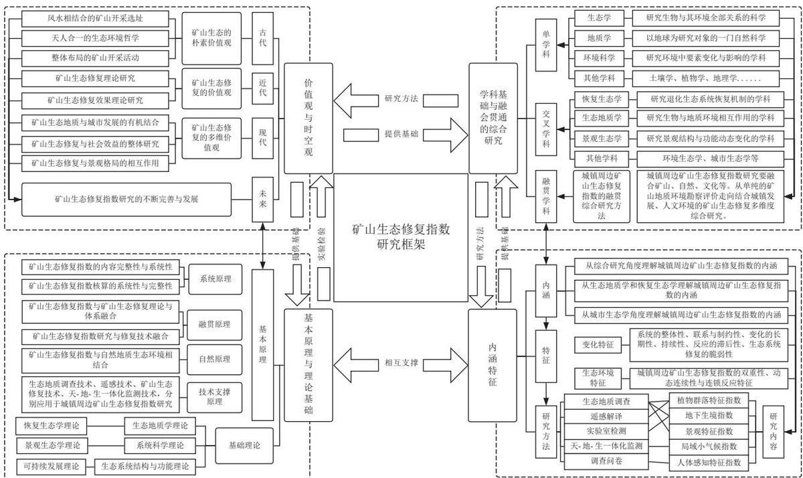
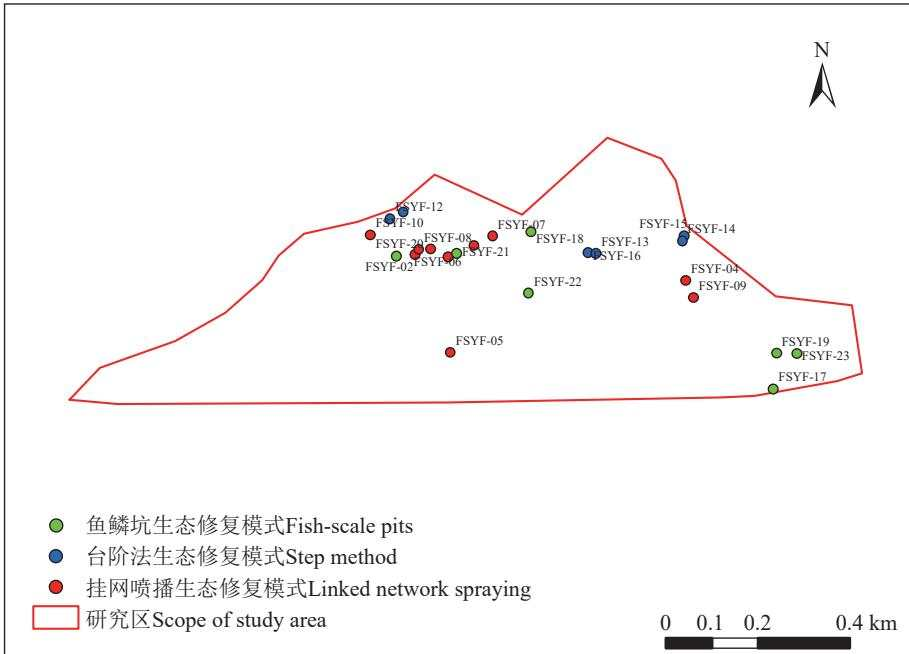

doi：10.12097/gbc.2025.07.059

王萍，宁凯滋，杜嘉昊，李喆，江益. 2026. 矿山生态修复指数概念框架及其在河南焦作市缝山公园的应用探析[J]. 地质通报, 45(7): 1360−1373. Wang Ping, Ning Kaizi, Du Jiahao, Li Zhe, Jiang Yi. 2026. Conceptual framework of mine ecological restoration index and its application in Fengshan Park of Jiaozuo City, Henan Province[J]. Geological Bulletin of China, 45(7): 1360−1373(in Chinese with English abstract).

# 矿山生态修复指数概念框架及其在河南焦作市缝山公园的应用探析

王萍1,2，宁凯滋3，杜嘉昊4\*，李喆1,2，江益5

（1. 河南省自然资源监测和国土整治院, 河南 郑州450018；2. 河南省焦作矿山生态修复野外科学观测研究站, 河南 焦作454150；3. 莫纳什大学理学院, 墨尔本 3800；4. 中国地质大学 (北京) 水资源与环境学院, 北京 100083；5. 中国地质大学 (武汉) 环境学院, 湖北武汉 430074）

摘要：【研究目的】矿山生态修复是实现良好生态环境的重要举措，但生态系统的结构和功能是否已修复需要进行科学评价。【研究方法】在文献梳理的基础上，提出生态修复指数的内涵及其概念框架，讨论其组成体系和评价标准，并以河南焦作市缝山公园为例进行分析。【研究结果】矿山生态修复指数是涵盖植被群落、地下生境、景观特征、局域小气候及人体感知五大维度，兼具主客观评价，突出矿山修复的特殊性与人地协调目标的统一的科学量化。矿山生态修复指数组成体系，由植物群落特征指数、地下生境特征指数、局域小气候特征指数、景观生态指数、人体感知特征指数组成。根据 法计算结果，缝山公园生态修复综合评价值为 0.605916，属于等级Ⅱ（生态修复指数良），表明修复工程整体效果较好，但仍存在一定提升空间，与实际情况相符。【结论】生态修复指数可以直观地、明确地量化生态修复工程效果，具有较强的科学性和可操作性，为矿山生态修复后的效益评估提供了新的思路。

关键词: 矿山；生态修复指数；生态环境；量化标准；缝山公园；河南

创新点: 矿山生态修复指数组成体系首次将人体感知纳入评价维度，强化了生态修复的社会服务价值，涵盖植被群落、地下生境、景观特征、局域小气候及人体感知五大维度，兼具主客观评价，突出矿山修复的特殊性与人地协调目标。

中图分类号：P5; X141　　文献标志码：A　　文章编号：1671−2552（2026）07−1360−14

# Conceptual framework of mine ecological restoration index and its application in Fengshan Park of Jiaozuo City, Henan Province

WANG Ping1,2, NING Kaizi3, DU Jiahao4\*, LI Zhe1,2, JIANG Yi5

(1. Henan Provincial Institute of Natural Resources Monitoring and Land Improvement, Zhengzhou 450018, Henan, China; 2. Jiaozuo Mine Ecological Restoration Field Scientific Observation Research Station of Henan Province, Jiaozuo 454150, Henan, China; 3. Monash University School of Science, Melbourne 3800, Australia; 4. China University of Geosciences (Beijing) School of Water Resources and Environment, Beijing 100083, China; 5. China University of Geosciences (Wuhan) School of Environment, Wuhan 430074, Hubei , China)

Abstract: [Objective] Mine ecological restoration is an important measure to achieve a good ecological environment, but whether the

structure  and  function  of the  ecosystem  are  repaired  needs  to  be  scientifically  evaluated. [Method] Based  on  the  review  of relevan literature, the connotation and conceptual framework of ecological restoration index were put forward, and its composition system and evaluation criteria were discussed. IResultsl The mine ecological restoration index covers five dimensions: vegetation community. underground  habitat,  landscape  characteristics,  local  microclimate  and  human  perception.  It  has  both  subjective  and  objective evaluation, highlighting the particularity of mine restoration and the unified scientific quantification of human−land coordination goals. The composition system of mine ecological restoration index is composed of plant community characteristic index, underground habitat characteristic  index,  local  microclimate  characteristic  index,  landscape  ecological  index  and  human  perception  characteristic  index According to the calculation results of TOPSIS method, the comprehensive evaluation value of ecological restoration of Fengshan Park is 0.605916, which belongs to grade II (good ecological restoration index), indicating that the overall effect of the restoration project is good,  but  there  is  still  some  room  for  improvement,  which  is  consistent  with  the  actual  situation. [Conclusions] The  ecologica restoration index can intuitively and clearly quantify the effect of ecological restoration projects, which is scientific and operable, and provides a new idea for the evaluation of the effect of mine ecological restoration.

Key words: Mine; ecological restoration index; ecological environment; quantitative criteria; Fengshan Park; Henan Province Key words: Mine; ecological restoration index; ecological environment; quantitative criteria; Fengshan Park; Henan Province

Highlights: The composition system of mine ecological restoration index includes human perception into the evaluation dimension for the  first  time,  which  strengthens  the  social  service  value  of ecological  restoration,  covering  five  dimensions:  vegetation  community, underground  habitat,  landscape  characteristics,  local  microclimate  and  human  perception.  It  has  both  subjective  and  objective evaluation, highlighting the particularity of mine restoration and the goal of human-land coordination.

About the first author: WANG Ping, female, born in 1978, senior engineer, engaged in mine ecological restoration research. E−mail: zzwangping2024@sina.com

About  the  corresponding  author: DU  Jiahao,  male,  born  in  1999,  Ph.D.  student,  engaged  in  mine  ecological  restoration  and ecological geological research work. E−mail: 2228585213@qq.com

Fund support: Supported by National Natural Science Foundation of China (No.42577056) and Henan Provincial Ministry of Natural Resources Provincial Cooperation Science and Technology Project (No. Henan Provincial Cooperation 2024-1)

矿山生态修复是实现良好生态环境的重要举措，生态修复指数则是修复效果评价的量化指标。生态修复效果评价作为衡量生态修复实施效果的重要环节，近年来在理论和实践上取得了一定进展（刘利年，1986；陈清运等，2004；方星等，2015）。目前学界尚未对“生态修复指数”形成明确的概念界定，但相关研究和技术规范已提供了可供借鉴的基础。其中，《生态环境治理评估技术规范》（DB32/T 44427—2022）（江苏省市场监督管理局，2022）以生态环境状况指数（EI）综合表征区域生态环境整体水平，《全国生态状况调查评估技术规范——生态系统质量评估》（HJ 1172—2021）（生态环境部，2021）则通过植被覆盖度、叶面积指数和总初级生产力的相对密度构建生态质量指数，以反映区域生态系统质量总体状况。与此同时，随着“山水林田湖草是生命共同体”理念的深化，矿山生态修复的目标已由侧重生态系统结构与功能优化，逐步转向兼顾人类生态福祉提升（Budiharta et al., 2016; Lorite, 2021)、生态系统稳定维持与生态产品价值实现（李海东等，2022；胡振

琪等，2023）。

尽管尚未有研究提出生态修复指数的概念，但是已有部分相关研究，例如《生态环境治理评估技术规范》（DB32/T 44427—2022）（江苏省市场监督管理局，2022）中提出的生态环境状况指数，生态环境状况评价利用一个综合指数（生态环境状况指数，EI）反映区域生态环境的整体状态。《全国生态状况调查评估技术规范——生态系统质量评估》（HJ1172—2021）（生态环境部，2021）提出，生态质量指数可以用于反映区域生态系统质量的整体状况，由植被覆盖度、叶面积指数和总初级生产力的相对密度构建。矿山生态修复遵循“山水林田湖草是生命共同体”理念，目标已从生态系统结构与功能优化转向人类生态福祉提升（Budiharta et al., 2016; Lorite,2021)，实现生态系统稳定和生态产品价值实现（李海东等，2022；胡振琪等，2023）。相应的矿山生态修复效果评估也从构建一般的指标体系向多种指数评估发展（武强等，2024），生态质量指数评估是对生态系统质量量化评估的应用，能够有效地评估“山水林田湖草”生态保护工程（刘浩等， ）；遥感生态指数（RSEI）集成了绿度、湿度、热度和干度四大生态因素对生态修复效果进行评估，深入分析提升生态质量的驱动因素（徐涵秋等，2013；陈文新等，2025；郭立明，2025）；生态环境影响指数（IISNE）通过 GIS 技术分析表征产业结构对区域生态环境的影响或干扰程度（彭建等，2005；张杨等，2011）。这些指数均是在构建指标体系的基础上通过相关数学工具进行量化计算而来，缺乏矿区生态修复综合体理念，没有将生态修复后的“绿水青山就是金山银山”转化和生态产品价值实现纳入评估体系（李海东等，2025）。矿区生态修复综合体的理念于近年出现，着重强调矿山生态修复的系统性、综合性、整体性，对修复目标除突出修复生态系统外，还应注重生态修复的经济效益和社会效益（李海东等，2022，2025；廖祥等，2025）。但矿区概念与矿山不同，矿区综合体指矿区范围内自然、经济、社会在内的多维组合体（李海东等，2025；童安琪等，2025），从地理边界看大于矿山。目前修复完成的较大比例尺的矿山均位于城镇周边，其修复的重要目标之一是为生态服务功能中人类福祉的实现（廖祥等，2025；童安琪等，2025），生态系统服务实现了自然系统与人类福祉之间的关键联结，生态系统依托其功能发挥，持续向人类输送各类产品和服务，以回应和支撑人类福祉需求。生态系统服务是连接自然系统与人类福祉的桥梁，生态系统通过生态功能持续为人类提供产品与服务来满足人类福祉需求（程宪波等，2021；郭迟辉等，2023），主要包括生物多样性维护、固碳释氧、涵养水土、改善局域小气候等（Schroeder et al., 2010)，而矿山生态修复实现的人类福祉主要通过人体感知表征（Summers and Vivian, 2018)，但目前的生态修复效果评估尚未将人体感知列入评估指标体系，更未指出人体感知的组成指标。

综上可以看出，目前的矿山生态修复效果研究缺乏综合性的评价指数，相关理论缺失，且生态修复指数概念框架不清晰、量化研究方法不明确。基于此，本文在生态修复指数理论内涵探讨的基础上，以河南焦作市缝山公园矿山生态修复工程为例，进行生态修复指数量化评价，为今后的矿山生态修复评价提供新的思路。

## 1 矿山生态修复指数的内涵

## 1.1 矿山生态修复指数的概念

生态修复是维护和提升区域生态系统功能的核心举措。对于矿山生态修复，其核心目标是确保生态系统的重建和可持续发展，从过往单一的植被恢复转变为由多要素、多功能构成的生态系统服务功能提升为导向的保护修复。生态系统结构构成功能发挥的基础，而功能状态又是结构特征的外在呈现，因此，生态修复应将生态系统结构恢复置于重要位置，重点涉及组分结构、时空结构、营养结构与功能，以及物质循环、能量流动、信息传递、调节功能等方面。矿山生态修复主要针对矿业活动扰动后受损的生态系统，其实质在于缓解生态系统长期承受的超负荷压力，并在遵循生态系统自身演替规律的前提下，借助其自适应、自组织和自调控能力，通过必要的人工干预，加快生态系统向与所在自然环境相适应的状态演进，进而恢复其原有生态功能及演变规律。

矿山生态修复指数则是对矿山生态修复成效进行量化表征的重要方式，其设置需与生态修复目标保持一致。《生态保护修复成效评估技术指南（试行）》（HJ1272—2022）（生态环境部，2022）提出了生态保护修复成效指数（ERI），并围绕重要生态系统面积、生态连通度、自然岸线保有率、植被覆盖度、环境质量、生物多样性、主导生态功能、人为胁迫、公众满意度等指标给出了评分细则。生态地质学、恢复生态学、城市生态学等不同学科的学者都对矿山生态修复效果评价进行了不同的解释与研究，植被指数被用作各类生态保护措施或工程实施的重要评价指标（Zucca et al., 2015）。矿山生态修复理论提出，通过优化生态资源配置，满足生物多样性需求和人民美好生活需要，实现生态价值和自然资本的提升（王金满等，2025）。因此，选取相关指标反映矿区开采影响及进行修复评价也具有一定的理论基础（王金满等，2025）。但植被指数的变化只是生态修复最直观的指标，植被的恢复与土壤的理化性质密切相关，因此土壤质地、肥力、酸碱度等环境因子也被认为是矿山生态修复中常见的限制因子（Vidal-Macua et al., 2020; Martinez-Ruiz and Fernandez-Santos, 2025）。对于干旱区的矿山而言，除受气候影响外，还会受到开采活动的扰动，因此在选取指标上应考虑土壤结构（Schroeder et al., 2010）、土壤养分（Olatuyi et al., 2015）、土壤水分等因素。基于此，笔者认为，矿山生态修复指数是涵盖植被群落、地下生境、景观特征、局域小气候及人体感知五大维度，兼具主客观评价，突出矿山修复的特殊性与人地协调

目标统一的科学量化。

## 1.2 矿山生态修复指数的构成体系

采用理论分析方法、文献统计法，在研究矿山生态修复效果评价相关文献的基础上，分析筛选矿山生态修复指数包含的指标，构成矿山生态修复指数组成体系（表1）。

由表 1 可以看出，在生态修复效果评价过程中，不同学者基于不同的价值理念，获得的评价指标也存在差异。土壤种子库指数在矿山生态修复中一般不作为生态系统功能恢复的目标之一，且出现频率为 0.08，属于较小范畴，予以舍去。营养循环过程处于人工维护的状态，故将营养循环、固碳能力舍去。矿山生态修复多数为基岩矿山，土地复垦、涵养水源的情况较少，无法作为矿山生态修复指数的量化指数，故将水源涵养指数、土地复垦指数等舍去。同时咨询专家意见，最终确定了矿山生态修复指数组成体系，由植物群落特征指数、地下生境特征指数、局域小气候特征指数、景观生态指数、人体感知特征指数组成。具体指数及组成因子见表2。

从认识论层面看，开展矿山生态修复指数研究的关键在于形成一个具有统摄性的概念框架，以整合既有相关研究和不同学科积累的理论认识，并据此推动该领域理论内涵的持续丰富与深化。现阶段，矿山生态修复指数研究仍处于起步阶段，其理论体系的成熟和完善尚需较长时间。基于此，本文综合矿山生态修复指数研究所涉及的学科技术与综合研究、价值观与时空观、内涵特征与理论原理等要素，在梳理其内在关联的基础上，初步构建了矿山生态修复指数的概念框架（图1）。

表 1    文献中矿山生态修复评价指标频度  
Table 1    Mine ecological restoration evaluation index frequency statistics table
<table><tr><td>生态修复指数指标</td><td>征指数</td><td>指数</td><td>征指数</td><td>征指数</td><td>植物群落特景观生态地下生境特 人体感知特 局域小气候 水源涵养 指数</td><td>指数</td><td>营养循环固碳能力土壤种子库</td><td></td><td></td><td>土地复垦 指数</td></tr><tr><td>张竹村(2019)</td><td>√</td><td>√</td><td></td><td></td><td>√</td><td>√</td><td></td><td></td><td></td><td></td></tr><tr><td>罗琦等(2020)</td><td></td><td></td><td></td><td>√</td><td></td><td></td><td></td><td></td><td></td><td></td></tr><tr><td>郝喆等(2019)</td><td>√</td><td></td><td>√</td><td></td><td></td><td></td><td></td><td></td><td></td><td></td></tr><tr><td>王江萍和张毅川(2015)</td><td>√</td><td>√</td><td>√</td><td></td><td>√</td><td></td><td></td><td>√</td><td></td><td></td></tr><tr><td>石丽丽(2014)</td><td>√</td><td></td><td>√</td><td></td><td></td><td>√</td><td>√</td><td></td><td></td><td></td></tr><tr><td>朱晓博(2015)</td><td></td><td>√</td><td></td><td>√</td><td></td><td>√</td><td></td><td></td><td></td><td></td></tr><tr><td>庄小静(2017)</td><td>√</td><td>√</td><td></td><td>√</td><td>√</td><td></td><td></td><td></td><td></td><td></td></tr><tr><td>甄博珺(2022)</td><td></td><td>√</td><td>√</td><td></td><td></td><td></td><td></td><td></td><td></td><td></td></tr><tr><td>刘永光(2012)</td><td>√</td><td></td><td>√</td><td></td><td></td><td></td><td></td><td></td><td>√</td><td></td></tr><tr><td>王超等(2015)</td><td>√</td><td>√</td><td></td><td>√</td><td></td><td></td><td></td><td></td><td></td><td></td></tr><tr><td>陈香兰(2010)</td><td>√</td><td>√</td><td>√</td><td></td><td></td><td></td><td></td><td></td><td></td><td>√</td></tr><tr><td>张文岚(2011)</td><td></td><td>√</td><td>√</td><td></td><td></td><td></td><td></td><td></td><td></td><td>√</td></tr><tr><td>出现频度</td><td>0.67</td><td>0.67</td><td>0.58</td><td>0.33</td><td>0.25</td><td>0.25</td><td>0.08</td><td>0.08</td><td>0.08</td><td>0.16</td></tr></table>

注：“√”表示文献采用了此指标

表 2    矿山生态修复指数评估指标说明  
Table 2    Evaluation index of mine ecological restoration index
<table><tr><td>核算指数</td><td>评估指标说明</td></tr><tr><td>植物群落特征指数</td><td>评估矿山生态修复区内植被高度、植被密度、丰富度指数、均匀度指数、多样性指数、优势度指数与植被覆盖度</td></tr><tr><td>地下生境特征指数</td><td>评估矿山生态修复区内土壤有机质、土壤pH值、土壤厚度、土壤含水量及土壤容重</td></tr><tr><td>景观生态指数</td><td>评估矿山生态修复区景观平均斑块面积、景观多样性指数、果色多样性指数、观花植物比重、彩叶植物比重</td></tr><tr><td>局域小气候指数</td><td>评估矿山生态修复区内大气温度、大气湿度、日平均光照度及平均风速</td></tr><tr><td>人体感知特征指数</td><td>评估矿山生态修复区游客、周边居民、工作人员对生态修复提供的审美价值、良好环境、避暑纳凉、空间布局， 以及区内产生的噪声、垃圾等不良因素所造成的直观体验</td></tr></table>

## 1.3 矿山生态修复指数的量化标准

矿山生态修复指数的量化是建立在修复目标的标准之上的，建立评价指标标准的依据可参考相关规范，如《山水林田湖草生态保护修复工程指南（试行）》（自然资办发〔2020〕38 号）（自然资源部办公厅、财政部办公厅、生态环境部办公厅，2020）、《矿山 生 态 环 境 保 护 与 恢 复 治 理 技 术 规 范 》（HJ651—2013）（生态环境部，2013）、《生态保护修复成效评估技术指南（试行）》（HJ 1272—2022）（生态环境部，2022）、《矿山土地复垦与生态修复监测评价技术规范》（GB-T 43935—2024）（国家市场监督管理总局，国家标准化管理委员会，2024）。以上规范将植被覆盖度、物种多样性提升率划分为 4 个等级。诸多学者也对生态修复评价的标准进行讨论（卢炜丽，2009; Schroeder et al., 2010; 杨爱军，2011；Olatuyi etal., 2015；朱兆华等，2017；车鲁平等，2020）。卢炜丽（2009）、杨爱军等（2011）、闫升（2020）将植物多样性指数、丰富度指数、均匀度指数、植被盖度、pH 值、土壤有机质等指标划分为优、良、中、差 4 个等级，其中将植物均匀度指数划分为优（＞0.7）、良（0.7\~0.5）、中（0.5\~0.3）、差（＜0.3）；将植物丰富度指数划分为优（＞10）、良（10\~7.5）、中（7.5\~5）、差（＜5）。刘永光（2012）将土壤含水量、土壤 pH 值、有机质、植物丰富度指数、多样性指数、优势度指数、均匀度指数等指标划分为优、良、中、差 4 个等级。以上研究在进行修复效果评估时，均以环境边界或地理边界为主，未考虑经济边界问题，这是因为目前的矿山生态修复工程多是公益性质的，资金来源于国家或地方财政，研究目标是生态系统结构和功能恢复与环境治理。本次研究以地理边界为主，即以矿山的开采边界为界。

地下生境特征中土壤有机质、土壤含水量等指标标准参考上述文献及农用地土壤质量标准（GB15618—2018）和全国土壤普查分级标准。大气温度、大气湿度根据生态修复区的气候特征和生态系统对温度的适应性进行分类，一般参考标准为低于0℃（植被无法生存）、0\~10℃（抑制生长）、10\~30℃（最佳生长）、＞25℃（植被可能造成热应激）。将大气湿度划分为干燥、舒适干燥、舒适湿润和湿润 4 个级别。根据《GB/T 28591—2012 风力等级》，将风速划分为微风、清风、和风及强风。光照度划分为微光、弱光、中等光照与强光。人体感知中 6 个指标依据问卷调查时提供的打分制进行划分。

  
图 1    矿山生态修复指数的概念框架  
Fig. 1    Concept framework of mine ecological restoration index

综上所述，根据上述国家规范与前人研究成果中的指标划分标准，结合生态修复目标，最终确定本次研究评价指标标准。将评价体系中各评价指标标准设为4个等级：优、良、中、差。具体划分情况见表3。

## 2 应用实例

缝山公园位于河南焦作市解放区和山阳区交界处，2010 年 4 月被自然资源部列为第二批国家矿山公园。公园前身为大范围的采石场，开采历史可以追溯到 19 世纪英国福公司的开采行为。在 20 世纪

表 3    矿山生态修复指数有机组成及内含因子分级标准  
Table 3    Organic composition of mine ecological restoration index and classification standard of inclusion factors
<table><tr><td rowspan=1 colspan=2>指数</td><td rowspan=1 colspan=1>因子</td><td rowspan=1 colspan=1>单位</td><td rowspan=1 colspan=1>优</td><td rowspan=1 colspan=1>良</td><td rowspan=1 colspan=1>中</td><td rowspan=1 colspan=1>差</td></tr><tr><td rowspan=1 colspan=2></td><td rowspan=1 colspan=1>植被高度</td><td rowspan=1 colspan=1>m</td><td rowspan=1 colspan=1>&gt;6</td><td rowspan=1 colspan=1>6~4</td><td rowspan=1 colspan=1>4~2.5</td><td rowspan=1 colspan=1>&lt;2.5</td></tr><tr><td rowspan=1 colspan=2></td><td rowspan=1 colspan=1>植被密度</td><td rowspan=1 colspan=1>棵/m²</td><td rowspan=1 colspan=1>&lt;1.5</td><td rowspan=1 colspan=1>1.5~1.0</td><td rowspan=1 colspan=1>1.0~0.5</td><td rowspan=1 colspan=1>&lt;0.5</td></tr><tr><td rowspan=1 colspan=2></td><td rowspan=1 colspan=1>丰富度指数</td><td rowspan=1 colspan=1>1</td><td rowspan=1 colspan=1>&gt;6</td><td rowspan=1 colspan=1>6~4</td><td rowspan=1 colspan=1>4~2.5</td><td rowspan=1 colspan=1>&lt;2.5</td></tr><tr><td rowspan=2 colspan=2>植物群落特征指数</td><td rowspan=1 colspan=1>均匀度指数</td><td rowspan=1 colspan=1>1</td><td rowspan=1 colspan=1>&gt;0.7</td><td rowspan=1 colspan=1>0.7~0.5</td><td rowspan=1 colspan=1>0.5~0.3</td><td rowspan=1 colspan=1>&lt;0.3</td></tr><tr><td rowspan=1 colspan=1>多样性指数</td><td rowspan=1 colspan=1>1</td><td rowspan=1 colspan=1>&gt;1.2</td><td rowspan=1 colspan=1>1.2~1</td><td rowspan=1 colspan=1>1~0.6</td><td rowspan=1 colspan=1>&lt;0.6</td></tr><tr><td rowspan=1 colspan=2></td><td rowspan=1 colspan=1>优势度指数</td><td rowspan=1 colspan=1>”</td><td rowspan=1 colspan=1>&gt;0.7</td><td rowspan=1 colspan=1>0.7~0.5</td><td rowspan=1 colspan=1>0.5~0.3</td><td rowspan=1 colspan=1>&lt;0.3</td></tr><tr><td rowspan=1 colspan=2></td><td rowspan=1 colspan=1>植被覆盖度</td><td rowspan=1 colspan=1>%</td><td rowspan=1 colspan=1>&gt;75</td><td rowspan=1 colspan=1>75~50</td><td rowspan=1 colspan=1>50~25</td><td rowspan=1 colspan=1>&lt;25</td></tr><tr><td rowspan=2 colspan=2></td><td rowspan=1 colspan=1>土壤有机质</td><td rowspan=1 colspan=1>g/kg</td><td rowspan=1 colspan=1>&gt;30</td><td rowspan=1 colspan=1>30~20</td><td rowspan=1 colspan=1>20~10</td><td rowspan=1 colspan=1>&lt;10</td></tr><tr><td rowspan=1 colspan=1></td><td rowspan=1 colspan=1>土壤pH</td><td rowspan=1 colspan=1>1</td><td rowspan=1 colspan=1>7~6</td><td rowspan=1 colspan=1>6~4.5;8~7</td><td rowspan=1 colspan=1>4.5~3.5;9~8</td><td rowspan=1 colspan=1>&lt;3.5;&gt;9</td></tr><tr><td rowspan=1 colspan=2>地下生境特征指数</td><td rowspan=1 colspan=1>土层厚度</td><td rowspan=1 colspan=1>cm</td><td rowspan=1 colspan=1>60</td><td rowspan=1 colspan=1>35</td><td rowspan=1 colspan=1>20</td><td rowspan=1 colspan=1>5</td></tr><tr><td rowspan=2 colspan=2></td><td rowspan=1 colspan=1>土壤含水量</td><td rowspan=1 colspan=1>%</td><td rowspan=1 colspan=1>&gt;20</td><td rowspan=1 colspan=1>20~15</td><td rowspan=1 colspan=1>15~10</td><td rowspan=1 colspan=1>&lt;10</td></tr><tr><td rowspan=1 colspan=1>土壤容重</td><td rowspan=1 colspan=1>g/cm³</td><td rowspan=1 colspan=1>1.0</td><td rowspan=1 colspan=1>1.2</td><td rowspan=1 colspan=1>1.5</td><td rowspan=1 colspan=1>1.8</td></tr><tr><td rowspan=5 colspan=2>景观生态指数</td><td rowspan=1 colspan=1>植物景观平均斑块面积</td><td rowspan=1 colspan=1>1</td><td rowspan=1 colspan=1>&gt;18</td><td rowspan=1 colspan=1>18~15</td><td rowspan=1 colspan=1>15~12</td><td rowspan=1 colspan=1>&lt;12</td></tr><tr><td rowspan=1 colspan=1>景观多样性指数</td><td rowspan=1 colspan=1>1</td><td rowspan=1 colspan=1>&gt;1.3</td><td rowspan=1 colspan=1>1.3~1.0</td><td rowspan=1 colspan=1>1.0~0.7</td><td rowspan=1 colspan=1>&lt;0.7</td></tr><tr><td rowspan=1 colspan=1>果色多样性指数</td><td rowspan=1 colspan=1>1</td><td rowspan=1 colspan=1>&gt;0.8</td><td rowspan=1 colspan=1>0.8~0.6</td><td rowspan=1 colspan=1>0.6~0.4</td><td rowspan=1 colspan=1>&lt;0.4</td></tr><tr><td rowspan=1 colspan=1>观花植物比重</td><td rowspan=1 colspan=1>1</td><td rowspan=1 colspan=1>&gt;0.8</td><td rowspan=1 colspan=1>0.8~0.6</td><td rowspan=1 colspan=1>0.6~0.4</td><td rowspan=1 colspan=1>&lt;0.4</td></tr><tr><td rowspan=1 colspan=1>彩叶植物比重</td><td rowspan=1 colspan=1>-</td><td rowspan=1 colspan=1>&gt;0.8</td><td rowspan=1 colspan=1>0.8~0.6</td><td rowspan=1 colspan=1>0.6~0.4</td><td rowspan=1 colspan=1>&lt;0.4</td></tr><tr><td rowspan=1 colspan=2></td><td rowspan=1 colspan=1>大气温度</td><td rowspan=1 colspan=1>℃</td><td rowspan=1 colspan=1>30~20</td><td rowspan=1 colspan=1>20~10</td><td rowspan=1 colspan=1>10~0</td><td rowspan=1 colspan=1>0;&gt;30</td></tr><tr><td rowspan=3 colspan=2>局域小气候指数</td><td rowspan=3 colspan=1>大气湿度光照度风速</td><td rowspan=1 colspan=1>%</td><td rowspan=1 colspan=1>70~60</td><td rowspan=1 colspan=1>60~50</td><td rowspan=1 colspan=1>50~40</td><td rowspan=1 colspan=1>&lt;40;&gt;70</td></tr><tr><td rowspan=1 colspan=1>lux</td><td rowspan=1 colspan=1>50000~40000</td><td rowspan=1 colspan=1>40000~25000</td><td rowspan=1 colspan=1>25000~10000</td><td rowspan=1 colspan=1>&lt;10000;&gt;50000</td></tr><tr><td rowspan=1 colspan=1>m/s</td><td rowspan=1 colspan=1>7</td><td rowspan=1 colspan=1>4~7</td><td rowspan=1 colspan=1>2~4</td><td rowspan=1 colspan=1>0~2</td></tr><tr><td rowspan=4 colspan=2>人体感知特征指数</td><td rowspan=1 colspan=1>审美价值</td><td rowspan=1 colspan=1>1</td><td rowspan=1 colspan=1>5</td><td rowspan=1 colspan=1>4</td><td rowspan=1 colspan=1>3</td><td rowspan=1 colspan=1>1~2</td></tr><tr><td rowspan=1 colspan=1>良好的环境</td><td rowspan=1 colspan=1>1</td><td rowspan=1 colspan=1>5</td><td rowspan=1 colspan=1>4</td><td rowspan=1 colspan=1>3</td><td rowspan=1 colspan=1>1~2</td></tr><tr><td rowspan=2 colspan=1>避暑纳凉噪声</td><td rowspan=1 colspan=1>1</td><td rowspan=1 colspan=1>5</td><td rowspan=1 colspan=1>4</td><td rowspan=1 colspan=1>3</td><td rowspan=1 colspan=1>1~2</td></tr><tr><td rowspan=1 colspan=1>1</td><td rowspan=1 colspan=1>1~2</td><td rowspan=1 colspan=1>3</td><td rowspan=1 colspan=1>4</td><td rowspan=1 colspan=1>5</td></tr><tr><td rowspan=2 colspan=2></td><td rowspan=1 colspan=1>垃圾</td><td rowspan=1 colspan=1>1</td><td rowspan=1 colspan=1>1~2</td><td rowspan=1 colspan=1>3</td><td rowspan=1 colspan=1>4</td><td rowspan=1 colspan=1>5</td></tr><tr><td rowspan=1 colspan=1>空间布局</td><td rowspan=1 colspan=1>-</td><td rowspan=1 colspan=1>5</td><td rowspan=1 colspan=1>4</td><td rowspan=1 colspan=1>3</td><td rowspan=1 colspan=1>1~2</td></tr></table>

80—90 年代中期，缝山国家矿山公园内有采石场12 家，采石行为严重破坏了该地区的生态环境。自2005 年以来，焦作市委、市政府关停该区域的所有采石场，大力投入资金进行生态环境综合整治和修复，至 2013 年公园修复完成，开始对外开放。目前，公园绿化面积占公园总面积的比例超过 80%，现有山桃、侧柏、杨树、松树、刺槐、紫穗槐等乔灌木近9 万株，形成了多样的群落结构，生态系统结构和功能得到了有效恢复。采用的修复技术有挂网喷播、鱼鳞坑、台阶法等。利用矿山生态修复指数量化评价该公园的修复效果包括植物群落特征指数、地下生境特征指数、景观生态指数、人体感知特征指数。

## 2.1 数据获取

## 2.1.1 植物群落特征指数

2024 年 9 月对焦作市缝山公园不同修复技术的样地进行了样方调查，设置的样方调查点均位于缝山公园北山南坡的修复区，属同一区域的不同修复技术。林分年龄为 14 a，环境状况相差不大，其中台阶法设置 6 个样方，挂网喷播法 10 个，鱼鳞坑法7 个，共 23 个样方。据此开展植物种类和数量调查，并对样方内的树木进行每木检尺，记录胸径（基径）、植被高度、植被密度、冠幅、花色、果色等指标，以及样方地点的基本情况（图2）。

植被高度通过野外样方数据统计获得。依据野外记录的植物名称、数量和冠幅等数据，参照已有植物群落调查研究中的常用方法（卢炜丽，2009；杨爱军等，2011；郑伟，2014；张和钰，2023；），计算各样方植物的密度、相对密度、频度、相对频度、盖度、相对盖度、重要值、物种丰富度等指标。具体见公式（1）\~（13），结果见表 4。

$$
\begin{array} { r l } & { \quad \frac { 2 3 5 } { 1 1 } \sqrt { 1 3 } \sqrt { 3 } \frac { 1 } { 2 } = \big ( \frac { 1 } { 2 5 } \uparrow \uparrow \cdot 4 9 7 \uparrow \uparrow \cdot \uparrow \downarrow \ast \downarrow \uparrow \uparrow \overrightarrow { 1 6 1 } \uparrow \uparrow \uparrow \uparrow \uparrow \uparrow \uparrow } \big ) \times 1 0 0 \% ( 1 )  \\ & { } \\ & { \quad \mathcal { H } \in \mathcal { I } \div \frac { 3 7 } { 1 1 } \sqrt { 3 } \times } \\ & { \quad \mathcal { H } = } \end{array}
$$

$$
( - \uparrow + \uparrow \uparrow + \downarrow \uparrow ) \uparrow + \downarrow \downarrow + \downarrow \downarrow / \uparrow + \uparrow \uparrow + \uparrow \uparrow + \downarrow \downarrow / \uparrow \uparrow - \uparrow + \downarrow \downarrow \downarrow ) \times 1 0 0 \% ( 2 )
$$

$$
\begin{array}{c} \begin{array} { r } { ( \frac { 4 1 } { \mathrm { \AA } } \hbar \hbar \hbar \dot { \phi } \dot { y } \dot { y } \dot { y } \dot { y } \dot { \mathrm { \downarrow } } + \frac { 4 9 } { 9 } \Delta \dot { \mathrm { \acute { H } } } \dot { \mathrm { \acute { H } } } \dot { \mathrm { \acute { y } } } \dot { \mathrm { \downarrow } } + \mathcal { J } \ddot { \mathrm { \ddot { \xi } } } \frac { 3 8 } { 3 } \Delta / \frac { 4 3 } { \mathrm { \AA } } \hbar \dot { \mathrm { \updownarrow } } + \mathcal { J } \ddot { \mathrm { \ddot { \xi } } } \dot { \mathrm { \updownarrow } } \dot { \mathrm { \xi } } \mathrm { \acute { \mathrm { \downarrow } } } \mathrm { \acute { \mathrm { \downarrow } } } } \end{array} \times 1 0 0 \%  \\ { ( 3 \ ) } \end{array}
$$

$$
\downarrow \downarrow \downarrow \downarrow \downarrow \downarrow \downarrow \downarrow \downarrow \downarrow \downarrow = ( \frac { \uparrow \downarrow } { \uparrow \downarrow } \uparrow \uparrow \downarrow \downarrow \downarrow \downarrow \downarrow \downarrow \downarrow \downarrow \downarrow \downarrow \downarrow \downarrow \uparrow \uparrow \uparrow \uparrow \uparrow \uparrow \uparrow \uparrow \uparrow \uparrow \uparrow \uparrow \uparrow \uparrow \uparrow \downarrow \uparrow \downarrow \downarrow \uparrow \downarrow \downarrow \downarrow ) \times 1 0 0 \% ,
$$

$$
\begin{array} { r } { \frac { 3 \frac { 1 } { 2 } } { \mathrm { f m } } \mathrm { f } \frac { \mathrm { d } \phi } { \mathrm { d } z } = \mathrm { ( ~ \overbrace { \sharp } ~ \# / \# \mathbb { E } \frac { \partial ~ \sharp ~ \# ~ \varSigma } { \partial ~ \cdot \partial ~ \xi ~ \in [ \mathbb { H } ~ \# , \Sigma ] } / \hbar \ne / \sharp \pm \pm \pm \underline { { \Sigma } } \frac { \partial ~ \cdot } { \partial ~ \cdot \partial ~ \cdot } | \mathbb { H } \frac { \partial ~ \cdot } { \partial ~ \cdot \setminus } ~ ) ~ } \times 1 0 0 \% } \\ { \mathrm { ( ~ 5 ~ ) } } \end{array}
$$

$$
H M X + I ^ { \sum \alpha \sum } \underset { m = 1 } { \overset { \quad } { \operatorname { a s t } } } \underset { q } { \longrightarrow } \underset { m = 1 } { \overset { \quad } { \operatorname { d e t } } } \underset { q } { \longrightarrow } \underset { m = 1 } { \overset { \quad } { \operatorname { d e t } } } \underset { q } { \longrightarrow } \underset { m = 1 } { \overset { \quad } { \operatorname { d e t } } } \underset { q } { \longrightarrow } \underset { m = 1 } { \overset { \quad } { \operatorname { d e t } } } \underset { q } { \longrightarrow } \underset { m = 1 } { \overset { \quad } { \operatorname { d e t } } } \underset { q } { \longrightarrow } \underset { m = 1 } { \overset { \quad } { \operatorname { d e t } } } \underset { q } { \longrightarrow } \underset { m = 1 } { \overset { \quad } { \operatorname { d e t } } } \underset { q } { \longrightarrow } \underset { m = 1 } { \overset { \quad } { \operatorname { d e t } } } \underset { q } { \longrightarrow } \underset { m = 1 } { \overset { \quad } { \operatorname { d e t } } } \underset { q } { \longrightarrow } \underset { m = 1 } { \overset { \quad } { \operatorname { d e t } } } \underset { q } { \longrightarrow } \underset { m = 1 } { \overset { \quad } { \operatorname { d e t } } } \underset { q } { \longrightarrow } \underset { m = 1 } { \overset { \quad } { \operatorname { d e t } } } \underset { q } { \longrightarrow } \underset { m = 1 } { \overset { \quad } { \operatorname { d e t } } } \underset { q } { \longrightarrow } \underset { m = 1 } { \overset { \quad } { \operatorname { d e t } } }
$$

相对优势度=

$$
\begin{array} { r } { \sharp \sharp \mathcal { J } \sharp \mathcal { J } \sharp | \mathcal { H } | \frac { \sharp \mathrm { H } } { \mathcal { K } } \sharp \sharp \mathcal { J } \sharp \mathcal { H } | \frac { \sharp } { \sharp } \jmath | \mathcal { H } | \frac { \mathrm { H } } { \lvert \Pi \rvert } \lVert \overline { { \Pi } } \rVert _ { 1 } \lVert \overline { { \mathbb { H } } } \rVert \lVert \overline { { \mathbb { H } } } \rVert / \lVert \overline { { \mathbb { H } } } \rVert / \lVert \overline { { \mathbb { H } } } \rVert / \lVert \overline { { \mathbb { H } } } \rVert / \lVert \overline { { \mathbb { H } } } \rVert _ { 1 } \lVert \overline { { \mathbb { H } } } \rVert _ { 1 } \lVert \overline { { \mathbb { H } } } \rVert _ { 1 } \lVert \overline { { \mathbb { H } } } \rVert _ { 1 } } \\ { ( \mathrm { ~ 7 ~ ) ~ } } \end{array}
$$

$$
( 1 ) [ \frac { 1 } { 1 1 } ] \times [ \frac { 1 } { 1 1 } ] \times [ \frac { 1 } { 1 1 } + \frac { 1 } { 1 1 } ] \times [ \frac { 1 } { 1 1 } + \frac { 1 } { 1 1 } ] \times [ \frac { 1 } { 1 1 } + \frac { 1 } { 1 1 } ] \times [ \frac { 1 } { 1 1 } ] \times [ \frac { 1 } { 1 1 } ] \times [ \frac { 1 } { 1 1 } ]
$$

  
图 2    植物样方调查点分布图  
Fig. 2    Distribution map of plant quadrat survey points

表 4    缝山公园植物密度、频度与盖度  
Table 4    Plant density, frequency and coverage Fengshan Park
<table><tr><td>修复工程</td><td>样地编号</td><td>密度/(株  $\cdot \mathrm { m } ^ { - 2 } )$ </td><td>盖度/%</td><td>频度/%</td></tr><tr><td rowspan="10">挂网喷播</td><td>FSYF-01</td><td>0.72</td><td>81.37</td><td>81.25</td></tr><tr><td>FSYF-02</td><td>0.96</td><td>446.11</td><td>114.58</td></tr><tr><td>FSYF-03</td><td>1.56</td><td>272.00</td><td>168.75</td></tr><tr><td>FSYF-04</td><td>1.16</td><td>285.68</td><td>162.50</td></tr><tr><td>FSYF-05</td><td>0.92</td><td>323.58</td><td>162.50</td></tr><tr><td>FSYF-06</td><td>1.60</td><td>223.84</td><td>168.75</td></tr><tr><td>FSYF-07</td><td>1.88</td><td>418.93</td><td>181.25</td></tr><tr><td>FSYF-08</td><td>2.12</td><td>23.33</td><td>162.50</td></tr><tr><td>FSYF-09</td><td>1.72</td><td>103.83</td><td>166.67</td></tr><tr><td>FSYF-10</td><td>1.04</td><td>75.96</td><td>181.25</td></tr><tr><td rowspan="6">台阶法</td><td>FSYF-11</td><td>1.04</td><td>93.68</td><td>220.83</td></tr><tr><td>FSYF-12</td><td>0.72</td><td>153.66</td><td>237.50</td></tr><tr><td>FSYF-13</td><td>0.60</td><td>92.17</td><td>110.42</td></tr><tr><td>FSYF-14</td><td>0.80</td><td>244.1</td><td>166.67</td></tr><tr><td>FSYF-15</td><td>0.88</td><td>221.69</td><td>225.00</td></tr><tr><td>FSYF-16</td><td>0.76</td><td>396.28</td><td>250.00</td></tr><tr><td rowspan="7">鱼鳞坑法</td><td>FSYF-17</td><td>0.92</td><td>101.79</td><td>62.50</td></tr><tr><td>FSYF-18</td><td>0.76</td><td></td><td></td></tr><tr><td>FSYF-19</td><td>0.92</td><td>306.12</td><td>195.83 131.25</td></tr><tr><td>FSYF-20</td><td>0.48</td><td>327.98 244.05</td><td>191.67</td></tr><tr><td>FSYF-21</td><td>0.68</td><td>541.92</td><td>160.42</td></tr><tr><td>FSYF-22</td><td>1.04</td><td>620.5</td><td>166.67</td></tr><tr><td>FSYF-23</td><td>1.80</td><td>179.74</td><td>154.17</td></tr></table>

灌木重要值=（相对密度+相对盖度+相对频度）/3（9）

$$
4 ) J ( 4 ) = J ^ { 2 } ( 5 ) J ^ { 2 } ( 6 ) = 0\tag{10}
$$

$$
\operatorname { S h a n n o n – W e i n e r } \mathcal { Z } \not \vdash | \Psi \downarrow \pm \Psi \downarrow \rangle \langle H \rangle : H = - \sum _ { \mathrm { i } = 1 } ^ { S } ( \operatorname { P _ { i } } \ln P _ { \mathrm { i } } )\tag{11}
$$

$$
\mathrm  S i m p s o n \ | \vec { \jmath } \vec { \Sigma } _ { \mathcal { H } } ^ { \pm \pm \chi } | _ { \mathcal { X } } ^ { \pm \pm } \vec { \Sigma } _ { \mathcal { H } } ^ { \pm \pm } \vec { \mathcal { X } } \left( \ D \ \right) : \ D = 1 - \sum _ { i = 1 } ^ { s } P _ { i } ^ { 2 }\tag{12}
$$

$$
\mathrm { P i e l o u ~ ^ { f } : } \int \Sigma \ \mathrm { J } { \stackrel {  } { \times } } \ \mathrm { f } _ { \boxplus } ^ { \Sigma } { \rlap / { } } { \rlap / { } } { \rlap / { } } \chi ( E ) : \ E = { \frac { H } { \mathrm { l n } S } }\tag{13}
$$

式中：S为群落中物种总数； $P _ { i }$ 为物种 i 的相对重要值，i=1,2,…,S。

在野外调查数据的基础上，缝山公园植物群落特征指数指标计算方法见公式（1）\~（13）。收集缝山公园范围的 GF1 号 1m 级遥感影像，通过 ENVI 软件将无人机三维模型提取的波段数据与遥感影像融合，经过预处理后，计算归一化植被指数与植被覆盖度。缝山公园植物群落特征指数计算结果见表 $5 _ { \circ }$

## 2.1.2 地下生境特征指数

每个植被调查设置的样方取不少于 3 个表层土样，每个群落设置 2～3 个土壤剖面，一般采样深度0～20 cm，分 2～3 层进行取样。野外土壤样品共取44 份，每个样品重量 500 g，装入密封袋带回实验室，用于土壤有机质和土壤含水量测定。另用环刀在各土层中部采集环刀土，送至实验室使用烘干法测定土壤容重与土壤含水率。土壤样品采用重铬酸钾法测定有机质含量，使用 $\mathsf { p H }$ 指示剂测 $\mathsf { p H }$ 值。植物地下生境特征各指标计算结果见表6。

## 2.1.3 景观生态指数

景观评价指对景观质量的评价。园林植物景观并非单一植物个体的简单叠加，而是由多个植物个体组合形成的整体性景观单元，其审美特征与植物个体的美学属性之间具有密切联系。基于植物景观花色特征与景观结构基本属性理论，选择花色多样性指数、植物景观平均斑块面积、景观多样性指数反映植物景观质量，观花植物比重与彩叶植物比重通过野外调查记录数据进行计算（张婉嬿，2014），缝山公园野外景观生态指数指标调查结果见表 7，景观生态指数指标计算公式见(14)\~(18)，计算结果见表8。

表 5    缝山公园植物群落特征指数指标结果  
Table 5    Results of the plant community characteristic index of Fengshan Park
<table><tr><td>指标</td><td>结果</td></tr><tr><td>植被高度/m</td><td>2.98</td></tr><tr><td>植被密度/(棵  $\cdot \mathrm { m } ^ { - 2 } )$ </td><td>1.09</td></tr><tr><td>丰富度指数</td><td>5</td></tr><tr><td>均匀度指数</td><td>0.893</td></tr><tr><td>多样性指数</td><td>1.326</td></tr><tr><td>优势度指数</td><td>0.635</td></tr><tr><td>植被覆盖度/%</td><td>80.7</td></tr></table>

表 6    缝山公园地下生境特征指数

Table 6    Underground habitat characteristics index of Fengshan Park
<table><tr><td>地下生境特征指数</td><td>结果</td></tr><tr><td>土壤有机质  $/ ( \mathbf { g } { \cdot } \mathbf { k } \mathbf { g } ^ { - 1 } )$ </td><td>11.723</td></tr><tr><td> $\pm \frac { \mathrm { \sf d e f } } { \sf t e } \mathrm { \sf p H }$ </td><td>8.23</td></tr><tr><td>土层厚度/cm</td><td>33</td></tr><tr><td>土壤含水量/%</td><td>12</td></tr><tr><td>土壤容重/  $\mathsf { \Gamma } ( \mathsf { g } \cdot \mathsf { c m } ^ { - 3 } )$ </td><td>1.38</td></tr></table>

景观评价即对景观质量的综合评定。园林植物景观并非植物个体的机械组合，而是由多个个体协同构成的、具有整体性的景观单元，其整体审美特征与植物个体美学属性密切相关。基于植物景观花色特征及景观结构的基本属性理论，本次选取花色多样性指数、植物景观平均斑块面积及景观多样性指数作为表征植物景观质量的核心指标。其中，观花植物比重与彩叶植物比重 2 项数据来源于野外样方调查记录（张婉嬿，2014）。缝山公园野外调查获得的景观生态指数原始指标值见表 7，各指数具体计算见公式（14）\~（18），计算结果汇总于表8。

彩叶植物比重=彩叶植物覆盖面积/植物覆盖总面积（14）

观花植物比重=观花植物覆盖面积/植物覆盖总面积

（15）

$$
\nVDash \bigoplus _ { \mathcal { X } } \bigoplus _ { \mathcal { X } } \bigoplus _ { \mathbb { Z } } \bigoplus _ { \mathbb { Z } } \bigoplus _ { \mathbb { H } } \bigoplus _ { \mathbb { H } } \bigoplus _ { \mathcal { X } } ^ { \mathbb { N } } { \big / } \complement = - \sum _ { i = 1 } ^ { n } ( p _ { i } \ln p _ { i } )\tag{16}
$$

$$
x _ { A } + 3 x _ { A } = x _ { A } - 1 = x _ { A } + 1 = x _ { A } - 1 =
$$

$$
x _ { A } + y _ { A } = \pm \frac { 2 } { \mathrm { m } } , \mp \frac { 1 } { \mathrm { m } } , \mp \frac { 1 } { \mathrm { m } } , \mp \frac { 1 } { \mathrm { m } } , \mp \frac { 1 } { \mathrm { m } } , \mp \frac { 1 } { \mathrm { m } } , \mp \frac { 1 } { \mathrm { m } } + \frac { 1 } { \mathrm { m } } , \mp \frac { 1 } { \mathrm { m } } + \frac { 1 } { \mathrm { m } } - \frac { 1 } { \mathrm { m } }\tag{17}
$$

$$
\sharp \sharp \mathtt { M } \sharp \sharp \mathtt { K } \sharp \sharp / \sharp \sharp \sharp \sharp \sharp \mathtt { K } \sharp \mathtt { K } \sharp \ = - \sum _ { i = 1 } ^ { m } \left( p _ { i } ^ { ^ { \prime } } \ln p _ { i } ^ { ^ { \prime } } \right)\tag{18}
$$

式中： $p _ { i }$ i是果色 在景观中出现的概率，以某一i n果色植物 的面积占植物覆盖总面积的比例表示，是景观中果色类型的总数。 $p _ { i } ^ { ' }$ i是植物种类 在景观i中出现的概率，以植物种类 的面积占植物覆盖总面积的比例表示； $m$ 是景观中植物种类的总数。

## 2.1.4 局域小气候指数

在缝山公园设置 MQ-BXQX-DZ2 便携式气象站，进行局域小气候的实时监测，同步上传云端进行数据存储，便于统计分析。从数据库中提取一年内的风速、大气温度、大气湿度与光照度进行统计，缝山公园局域小气候指数结果见表9。

## 2.1.5 人体感知特征指数

人体感知作为矿山生态修复的主观效果体现，对其进行指标量化具有重要意义。本次研究的人体感知采用调查问卷现场打分的形式进行，涵盖周边居民、游客、周边商户及工作人员，包含审美价值、良好的环境、避暑纳凉作为正向因素，以及噪声、垃圾、空间布局作为负向因素，将其分为 1\~5 五个等级进行打分。将调查问卷加分结果取平均值得出人体感知各项指标所获取的分值，计算结果见表10。

## 2.2 矿山生态修复指数核算及评价

TOPSIS 法属于多目标分析方法，其基本思路是通过比较各评价对象与最优样本、最劣样本之间的相对距离判别样本优劣（姚瑶等，2025）。本文采用基于组合权重的 TOPSIS 评价方法，对研究区破损山体不同复绿工程模式下的生态修复效果进行评估。具体而言，将表 3 中优、良、中、差 4 个等级对应的评价标准值与缝山公园各项评价指标值一并纳入计算，得到综合评价值。评价等级划分结果见表 11，其中Ⅰ\~Ⅳ级分别对应生态修复效果优、良、中、差。缝山公园生态修复指数综合评价值见表 12。根据 TOPSIS 法计算结果，缝山公园生态修复综合评价值为 0.605916，属于等级Ⅱ（生态修复指数良），表明修复工程整体效果较好，但仍存在一定的提升空间。

表 7    缝山公园样方观花植物花色、果色统计结果  
Table 7    Statistical results of flower color and fruit color of flower plants in Fengshan Park
<table><tr><td rowspan=1 colspan=1>复绿方法</td><td rowspan=1 colspan=1>分类</td><td rowspan=1 colspan=1>名称</td><td rowspan=1 colspan=1>花色</td><td rowspan=1 colspan=1>果色(成熟期)</td></tr><tr><td rowspan=5 colspan=1>鱼鳞坑</td><td rowspan=1 colspan=1></td><td rowspan=1 colspan=1>刺槐</td><td rowspan=1 colspan=1>白色</td><td rowspan=1 colspan=1>褐色</td></tr><tr><td rowspan=1 colspan=1></td><td rowspan=1 colspan=1>火炬树</td><td rowspan=1 colspan=1>红色</td><td rowspan=1 colspan=1>深红色</td></tr><tr><td rowspan=1 colspan=1>乔木</td><td rowspan=1 colspan=1>棟树</td><td rowspan=1 colspan=1>紫色</td><td rowspan=1 colspan=1>绿色</td></tr><tr><td rowspan=1 colspan=1></td><td rowspan=1 colspan=1>女贞</td><td rowspan=1 colspan=1>白色</td><td rowspan=1 colspan=1>橙黄色</td></tr><tr><td rowspan=1 colspan=1></td><td rowspan=1 colspan=1>山桃</td><td rowspan=1 colspan=1>红色</td><td rowspan=1 colspan=1>淡黄色</td></tr><tr><td rowspan=2 colspan=1></td><td rowspan=2 colspan=1>灌木</td><td rowspan=1 colspan=1>黄荆</td><td rowspan=1 colspan=1>紫色</td><td rowspan=1 colspan=1>黑褐色</td></tr><tr><td rowspan=1 colspan=1>连翘</td><td rowspan=1 colspan=1>黄色</td><td rowspan=1 colspan=1>黄棕色</td></tr><tr><td rowspan=3 colspan=1>台阶</td><td rowspan=1 colspan=1></td><td rowspan=1 colspan=1>刺槐</td><td rowspan=1 colspan=1>白色</td><td rowspan=1 colspan=1>褐色</td></tr><tr><td rowspan=2 colspan=1>乔木</td><td rowspan=1 colspan=1>棟树</td><td rowspan=1 colspan=1>紫色</td><td rowspan=1 colspan=1>绿色</td></tr><tr><td rowspan=1 colspan=1>栾树</td><td rowspan=1 colspan=1>黄色</td><td rowspan=1 colspan=1>橘红色</td></tr><tr><td rowspan=1 colspan=1></td><td rowspan=1 colspan=1></td><td rowspan=1 colspan=1>山桃</td><td rowspan=1 colspan=1>红色</td><td rowspan=1 colspan=1>淡黄色</td></tr><tr><td rowspan=1 colspan=1></td><td rowspan=1 colspan=1>灌木</td><td rowspan=1 colspan=1>黄荆</td><td rowspan=1 colspan=1>紫色</td><td rowspan=1 colspan=1>黑褐色</td></tr><tr><td rowspan=10 colspan=1>挂网喷播</td><td rowspan=1 colspan=1></td><td rowspan=1 colspan=1>白杜</td><td rowspan=1 colspan=1>白色</td><td rowspan=1 colspan=1>粉红色</td></tr><tr><td rowspan=1 colspan=1></td><td rowspan=1 colspan=1>刺槐</td><td rowspan=1 colspan=1>白色</td><td rowspan=1 colspan=1>褐色</td></tr><tr><td rowspan=1 colspan=1>乔木</td><td rowspan=1 colspan=1>火炬树</td><td rowspan=1 colspan=1>红色</td><td rowspan=1 colspan=1>深红色</td></tr><tr><td rowspan=1 colspan=1></td><td rowspan=1 colspan=1>棟树</td><td rowspan=1 colspan=1>紫色</td><td rowspan=1 colspan=1>绿色</td></tr><tr><td rowspan=1 colspan=1></td><td rowspan=1 colspan=1>栾树</td><td rowspan=1 colspan=1>黄色</td><td rowspan=1 colspan=1>橘红色</td></tr><tr><td rowspan=1 colspan=1></td><td rowspan=1 colspan=1>胡枝子</td><td rowspan=1 colspan=1>紫色</td><td rowspan=1 colspan=1>深褐色</td></tr><tr><td rowspan=1 colspan=1></td><td rowspan=1 colspan=1>木蓝</td><td rowspan=1 colspan=1>红色</td><td rowspan=1 colspan=1>棕褐色</td></tr><tr><td rowspan=1 colspan=1>灌木</td><td rowspan=1 colspan=1>盐麸木</td><td rowspan=1 colspan=1>白色</td><td rowspan=1 colspan=1>红色</td></tr><tr><td rowspan=1 colspan=1></td><td rowspan=1 colspan=1>紫穗槐</td><td rowspan=1 colspan=1>紫色</td><td rowspan=1 colspan=1>棕褐色</td></tr><tr><td rowspan=1 colspan=1></td><td rowspan=1 colspan=1>黄荆</td><td rowspan=1 colspan=1>紫色</td><td rowspan=1 colspan=1>黑褐色</td></tr></table>

表 8    缝山公园景观生态指数计算结果

Table 8    Calculation results of landscape ecological index of Fengshan Park
<table><tr><td>景观生态指数</td><td>结果</td></tr><tr><td>植物景观平均斑块面积  $/ \mathrm { m } ^ { 2 }$ </td><td>13.66</td></tr><tr><td>景观多样性指数</td><td>0.8643</td></tr><tr><td>果色多样性指数</td><td>0.6101</td></tr><tr><td>观花植物比重</td><td>0.7719</td></tr><tr><td>彩叶植物比重</td><td>0.8252</td></tr></table>

植物群落特征指数指标显示，缝山公园植被生长良好，具有一定的高度，植被覆盖度较密集，整体植物群落多样性较好，较高的植被覆盖度对土壤保持和生态功能的恢复具有积极作用。地下生境指标显示，土壤有机质为 11.723 g/kg，处于中等水平。土壤偏碱性，可能限制部分植物生长，建议选择耐碱植物（如刺槐、侧柏）或进行土壤改良。土壤含水量为12%，容重 $1 . 3 8 ~ \mathrm { g / c m } ^ { 3 }$ ，说明土壤水分保持能力一般，需要注意人工灌溉。景观生态指数指标显示，缝山公园的景观结构较多样，公园在景观设计上注重观赏性植物得到配置，能够满足城镇居民及游客的审美需求，提高文化效益。人体感知特征指数显示，周边居民和游客对公园景观和环境满意度较高，空间分布也较合理。综合评价值未达到“优”，说明缝山公园生态修复工程仍有提升空间，特别是在土壤改良与植被多样性和景观优化方面。

表 9    缝山公园局域小气候指数结果  
Table 9    Results of local microclimate index in Fengshan Park
<table><tr><td>局域小气候指数</td><td>结果</td></tr><tr><td>大气温度/℃</td><td>16.5</td></tr><tr><td>大气湿度/%</td><td>9.7</td></tr><tr><td>光照度/lux</td><td>43904</td></tr><tr><td>风速/(m·s−1)</td><td>2.3</td></tr></table>

表 10    人体感知特征指数计算结果  
Table 10    The calculation results of human perception characteristic index
<table><tr><td>人体感知特征指数</td><td>结果</td></tr><tr><td>审美价值</td><td>4.3</td></tr><tr><td>良好的环境</td><td>4.0</td></tr><tr><td>避暑纳凉</td><td>3.8</td></tr><tr><td>噪声</td><td>1.7</td></tr><tr><td>垃圾</td><td>1.4</td></tr><tr><td>空间布局</td><td>3.8</td></tr></table>

表 11    基于TOPSIS法的生态修复指数等级划分

Table 11    Classification of ecological restoration index based on TOPSIS method
<table><tr><td>生态修复指数等级划分区间</td><td>评价等级</td></tr><tr><td>1~0.866982</td><td>优</td></tr><tr><td>0.866982~0.596264</td><td>良</td></tr><tr><td>0.596264~0.325102</td><td>中</td></tr><tr><td>0.325102~0</td><td>差</td></tr></table>

## 3 讨　论

矿山生态修复指数是矿山生态修复效果评估的量化，是结合生态修复目标、生态系统的结构与功能、生态系统服务价值综合得出的一个值，可以直观地认识和评估矿山生态修复效果。不同的矿山生态修复目标会有所差别，但基本目标，如生态系统结构与功能的恢复、服务价值的实现等是一致的，所以本次研究的生态修复指数概念框架以生态系统的修复为主。矿山生态修复效果评估有区域（流域）尺度、生态系统尺度、场地尺度，鉴于修复矿山的情况不同，修复效果的评价指标也有所不同，所以本文提出的评价尺度一般是在地理边界的基础上开展一矿一评，对于大型矿山生态修复工程应充分考虑工程所在地的复杂性，分门别类进行生态修复指数的评价。本文探讨的矿山以城镇周边的露天矿山为主，其他类型矿山修复的目标和方法虽然不同，但也可以参考本文提出的生态修复指数方法评估修复效果。

矿区生态修复综合体理论主要由李海东等（2018，2022，2025）提出，是一个多维度、多学科交叉的综合性概念，侧重于“社会—经济—自然”复合生态系统的一体化修复，旨在恢复生态平衡，实现可持续发展。本文提出的矿山生态修复指数概念框架与此理念相似，均遵循“山水林田湖草沙是生命共同体”的思想和协同治理理念，为矿山生态修复效果评估奠定了理论依据和指标选择参考。本文提出矿山生态修复指数的目的是为矿山生态修复效果评估服务，其理论依据为系统科学、恢复生态学、生态地质学等，评估对象强调矿山而非矿区的生态修复工程，评估指标体系侧重修复后生态系统的结构和功能、生态服务价值的实现等。

对于矿山生态修复效果评估，近期有多个提法，如矿山生态修复效果指数和矿山生态修复现状指数，与本文的矿山生态修复指数在评估思路上相似，都是对矿山生态修复若干时间后的效果进行评估，差别在于本文所提概念框架更丰富、全面，更具可操作性，所得结果也更简洁和直观。本次研究是在中纬度地区进行的，所提的指标体系具有一定的局限性，个别指标的可操作性也有待改进，甚至整个指标体系可以更丰富，如增加景观可持续性指标等。

## 4 结　论

（1）矿山生态修复指数组成体系，由植物群落特征指数、地下生境特征指数、局域小气候特征指数、景观生态指数、人体感知特征指数 5 个指标有机组成。评价体系中各评价指标标准设为 4 个等级：优、

表 12    基于组合权重的 TOPSIS 法评价结果  
Table 12    Evaluation results of TOPSIS method based on combined weights
<table><tr><td>最优欧式距离</td><td>最劣欧式距离</td><td>缝山公园生态修复指数核算结果</td><td>生态修复效果评价等级</td></tr><tr><td>0.080129</td><td>0.125801</td><td>0.605916</td><td>良</td></tr></table>

良、中、差。

（2）河南焦作缝山公园的应用说明，生态修复指数可以直观地、明确地量化生态修复工程效果，具有较强的科学性和可操作性，为矿山生态修复后的效果评价提供了新的思路。

致谢：感谢中国地质大学（武汉）环境学院王全荣教授的大力支持。

## References

Budiharta S, Meijaard E, Wells J A, et al. 2016. Enhancing Fea−sibility: Incorporating  a  Socio−Ecological  systems  framework  into  restoration planning[J]. Environmental Science & Policy, 64: 83−92.

Che L P, Feng K, Zhou Y Y, et al. 2020. Risk evaluation of traffic facility PPP  projects  based  on  DEMATEL−ANP[J]. Journal  of  Civil Engineering  and  Management, 37(6): 152−157 (in  Chinese  with English abstract).

Chen  Q  Y,  Cai  S  J,  Ming  S  X,  et  al. 2004. Numerical  simulation  of surface  deformation  in  underground  mining[J]. Metal  Mine,  (6): 19−21 (in Chinese with English abstract).

Chen  W  X,  Yan  C,  Lu  J  J,  et  al. 2025. Monitoring  and  assessment  of ecological  restoration  effect  of  abandoned  mines  based  on  remote sensing  ecological  index:  A  case  study  of  Wutianshan  ecological restoration  area  in  Changtai  District,  Zhangzhou  City[J]. Environmental  Ecology, 7(8): 29−37 (in  Chinese  with  English abstract).

Chen  X  L.  2010.  Ecological  benefit  evaluation  of land  reclamation  in mining areas: A case study of Puding National Coal Mine in Guizhou[D]. Master  Thesis  of  Guizhou  University  (in  Chinese  with  English abstract).

Cheng X B, Tao Y, Ou W X. 2021. Research progress on the relationship between  ecosystem  services  and  human  well−being[J]. Journal  of Ecology  and  Rural  Environment, 37(7): 885−893 (in  Chinese  with English abstract).

Fang X, et al. 2015. Theory and methods of mine land reclamation[M]. Beijing: Geological Publishing House: 14−18 (in Chinese).

Guo  C  H,  Zhang  M  S,  Wang  Y,  et  al. 2023. National  land  space ecological restoration in the middle reaches of the Yellow River based on  nature−based  solutions:  A  case  study  of  Yulin  City,  Shaanxi Province[J]. Geological  Bulletin  of  China, 42(10): 1745−1756 (in Chinese with English abstract).

Guo L M, Shi G Y, Du H H, et al. 2025. Spatiotemporal evolution and driving mechanism of ecological environment quality in Yinchuan City based on remote sensing ecological index[J]. Resources Environment & Engineering,39(3): 335-343 (in Chinese with English abstract).

Hao  Z,  Cao  M  J,  Yang  Q  C. 2019. Evaluation  of restoration  effect  in ecological degradation area of tailings pond[J]. Mining Research and Development, 39(10): 143−147 (in Chinese with English abstract).

Hu Z Q, Li Y Y, Li G S, et al. 2023. Opportunities and challenges of land reclamation and ecological restoration in mining areas under the goal of

carbon  neutrality[J]. Coal  Science  and  Technology, 51(1): 474−483 (in Chinese with English abstract).

Jiangsu Provincial Market Supervision and Administration Bureau. 2022. DB32  /  T  44427-2022,  Technical  Specification  for  Ecological Environment  Governance  Assessment[S].  Beijing:  China  Standard Publishing House (in Chinese with English abstract).

Li H D, Gao Y Y, Yan S G. 2018. Supervision of ecological restoration of abandoned mines in ecological protection red line areas[J]. Journal of Ecology  and  Rural  Environment, 34(8): 673−677 (in  Chinese  with English abstract).

Li  H  D,  Hu  G  C,  Yan  S  G. 2022. Research  on  ecological  restoration targets  and  models  in  mining  areas[J]. Journal  of Ecology  and  Rural Environment, 38(8): 963−971 (in Chinese with English abstract).

Li  H  D,  Wang  N,  Yan  Q  W,  et  al. 2025. Construction  of  ecological restoration  complex  in  urban  industrial  and  mining  areas  from  the perspective  of restoration  ecology[J]. Journal  of Ecology  and  Rural Environment, 41(1): 1−10 (in Chinese with English abstract).

Liao X, Yang X, Jiao M J, et al. 2025. Coupling coordination research on ecosystem  services  and  human  well−being  from  the  perspective  of sustainable development: A case study of Chengdu−Chongqing urban agglomeration[J]. Areal  Research  and  Development, 44(3): 127−136 (in Chinese with English abstract).

Liu  H,  Hao  H  G,  Zhang  W  G,  et  al. 2022. Assessment  of ecological protection  and  restoration  effectiveness  based  on  pattern− quality−service: A case study of the Irtysh River Basin[J]. Research of Environmental Sciences, 35(11): 2495−2507 (in Chinese with English abstract).

Liu  L  N. 1986. Consequences  of  domestic  and  foreign  mining  area development  and  reclamation  experience[J]. Bulletin  of  Soil  and Water Conservation, (2): 75−80 (in Chinese with English abstract).

Liu Y G. 2012. Research on artificial restoration effect and evaluation of closed  and  abandoned  mines  in  mountainous  areas  of  Beijing [D]. Doctoral  Dissertation  of Beijing  Forestry  University(in  Chinese  with English abstract).

Lorite  J,  Ballesteros  M,  García−Robles  H,  et  al. 2021. Economic evaluation  of ecological  restoration  options  in  gypsum  habitats  after mining[J]. Journal for Nature Conservation, 59: 125935.

Lu W L. 2009. Study on plant community structure and species diversity of  Simian  Mountain  in  Chongqing[D].  Doctoral  Dissertation  of Beijing Forestry University (in Chinese with English abstract).

Luo Q, Zhen L, Yang W N, et al. 2020. Study on the impact of ecological governance projects on the perception of cultural services in Xilinguole grassland ecosystem[J]. Journal of Natural Resources, 35(1): 119−129 (in Chinese with English abstract).

Martinez−Ruiz  C,  Fernandez−Santos  B. 2005. Natural  re−vegetation  on topsoiled  mining−spoils  according  to  the  exposure[J]. Acta Oecologica, 28(2): 231−238.

Ministry  of  Ecology  and  Environment.  2013.  HJ651-2013,  Technical Specification  for  Protection  and  Restoration  of  Mine  Ecological Environment[S].  Beijing:  China  Environmental  Science  Press  (in Chinese with English abstract).

Ministry  of Ecology  and  Environment.  2021.  HJ  1172-2021,  Technical Specification  for  National  Ecological  Status  Survey  and  Assessment-Ecosystem  Quality  Assessment[S].  Beijing:  China  Standards Publishing House(in Chinese with English abstract).

Ministry  of Ecology  and  Environment.  2022.  HJ  1272-2022,  Technical Guidelines  for  Evaluation  of  Ecological  Protection  and  Restoration Effectiveness (Trial)[S]. Beijing: Institute of Environmental Standards, Ministry  of  Ecology  and  Environment(in  Chinese  with  English abstract).

Olatuyi S O, Leskiw L A. 2015. Evaluation of soil reclamation techniques at  the  Key  Lake  uranium  mine[J]. Canadian  Journal  of Soil  Science, 95: 153−176.

Peng J, Wang Y L, Ye M T, et al. 2005. Changes in regional industrial structure and their eco−environmental effects: A case study of Lijiang City, Yunnan Province[J]. Acta Geographica Sinica, (5): 798−806 (in Chinese with English abstract).

Schroeder P D, Daniels W L, Alley M M. 2010. Chemical and physical properties  of  reconstructed  mineral  sand  mine  soils  in  Southeastern Virginia[J]. Soil Science, 175: 2−9.

Shi L L. 2014. Research on vegetation restoration effect and its evaluation of  abandoned  limestone  quarry  in  Western  Beijing [D].  Doctoral Dissertation  of  Beijing  Forestry  University  (in  Chinese  with  English abstract).

State  Administration  for  Market  Supervision  and  Administration, National Standardization Management Committee. 2024.GB-T 43935- 2024, Technical Specification for Monitoring and Evaluation of Mine Land  Reclamation  and  Ecological  Restoration[S].  Beijing:  China Standards Publishing House(in Chinese with English abstract).

Summers  J  K,  Vivian  D  N. 2018. Ecotherapy:  A  Forgotten  Ecosystem Service: A Review[J]. Frontiers in Psychology, (9): 1389.

The  General  Office  of the  Ministry  of Natural  Resources,  the  General Office of the Ministry of Finance, the General Office of the Ministry of Ecology  and  Environment.  2020.  Natural  Resources  Office  issued No.38,  Guidelines  for  Ecological  Protection  and  Restoration Engineering  of Mountains,  Rivers,  Forests,  Fields,  Lakes  and Grasses (Trial)[S]. General Office of the Ministry of Natural Resources of the People 's Republic of China (in Chinese with English abstract).

Tong A Q, Xu L H, Ma Q W, et al. 2025. A review of the relationship between  urban  green  space  ecosystem  services  and  human well−being[J]. Ecological  Science, 44(2): 248−259 (in  Chinese  with English abstract).

Vidal-Macua  J  J,  Nicolau  J  M,  Vicente  E,  et  al.  2020.  Assessing vegetation recovery in reclaimed opencast mines of the Teruel coalfield (Spain)  using  Landsat  time  series  and  boosted  regression  trees[J]. Science of the Total Environment, 717: 137250.

Wang  C,  Bi  J,  You  H  Z. 2015. Research  on  evaluation  of ecological governance  effect  of  iron  ore  wasteland  in  Eastern  Hebei[J]. Environmental  Science  &  Technology, 38(S2): 432−435,444(in Chinese with English abstract).

Wang  J  M,  Wu  D  W,  Ye  T  T,  et  al.  2025.  Discussion  on  integrated ecological  restoration  in  mining  areas[J/OL].  Coal  Science  and

Technology.  https://link.cnki.net/urlid/11.2402.TD.20251204.1345.004 (in Chinese with English abstract).

Wang J P, Zhang Y C. 2015. From abandoned land to high-quality land: Ecological restoration and landscape reconstruction of suburban chalk mining  wasteland [J].  Chinese  Garden,  31(4):  20-24(in  Chinese  with English abstract).

Wu Q, Zhang S C, Liu H L, et al. 2024. Theory and method of suitability evaluation  for  development  and  utilization  of  mine  environment positive  effect[J]. Journal  of China  Coal  Society, 49(1): 114−130 (in Chinese with English abstract).

Xu  H  Q. 2013. A  remote  sensing  urban  ecological  index  and  its application[J]. Acta Ecologica Sinica, 33(24): 7853−7862 (in Chinese with English abstract).

Yan  S.  2020.  Evaluation  of ecological  benefits  of different  vegetation restoration modes for dry discharge iron tailings in Zhangxuan mining area[D].  Doctoral  Dissertation  of  Beijing  Forestry  University  (in Chinese with English abstract).

Yang A J, Fan J S, Wang Y J, et al. 2011. Plant community diversity in giant  panda  habitat  of  Guanyinshan  Nature  Reserve,  Qinling Mountains[J]. Journal  of  Northwest  Forestry  University, 26(1): 47−51(in Chinese with English abstract).

Yao  Y,  Li  Y  Q,  Tang  S  Q,  et  al. 2025. Soil  quality  evaluation  of limestone  mining  areas  in  Beijing  and  Hebei  based  on  entropy weight−TOPSIS  model[J]. Hydrogeology  &  Engineering  Geology, 52(4): 87−97 (in Chinese with English abstract).

Zhang W L. 2011. Study on ecological restoration evaluation of mining wasteland  in  Pingshuo  mining  area[D].  Master  Thesis  of Shandong Normal University (in Chinese with English abstract).

Zhang W Y. 2014. Study on the quantitative evaluation system of urban park  plant  landscape[D].  Master  Thesis  of  Nanjing  Agricultural University (in Chinese with English abstract).

Zhang  Y,  Liu  Y  F,  Gu  J  P,  et  al. 2011. Land  use/cover  change  and  its eco−environmental  effects  in  Wuhan  City[J]. Scientia  Geographica Sinica, 31(10): 1280−1285 (in Chinese with English abstract).

Zhang  Z  C. 2019. Research  on  the  construction  of  evaluation  index system  for  urban  ecological  restoration  effect[J]. Chinese  Landscape Architecture, 35(11): 36−40 (in Chinese with English abstract).

Zhen  B  J.  2022.  Research  on  ecological  restoration  effect  of different reclamation modes in open−pit mine dump. [D]. Doctoral Dissertation of Liaoning Technical University (in Chinese with English abstract).

Zhu  X  B.  2015.  Evaluation  of urban  river  ecological  restoration  effect [D].  Doctoral  Dissertation  of Beijing  Forestry  University  (in  Chinese with English abstract).

Zhu  Z  H,  Lai  T,  Chen  X  R,  et  al. 2017. Ecological  restoration  process selection,  target  community  design  and  effect  evaluation  of damaged slopes[J]. Journal of Northwest Forestry University, 32(3): 78−83 (in Chinese with English abstract).

Zhuang X J. 2017. Comprehensive benefit evaluation of reuse of mining wasteland for green space[D]. Doctoral Dissertation of Fujian Normal University (in Chinese with English abstract).

Zucca  C,  Wu  W,  Dessena  L,  et al. 2015. Assessing  the  effectiveness  of

land  restoration  interventions  in  dry  lands  by  multi−temporal  remote sensing: A case study in Ouled Dlim (Marrakech, Morocco)[J]. Land Degradation & Development, 26(1): 80−91.

## 附中文参考文献

车鲁平, 冯珂, 周尧尧, 等. 2020. 基于 DEMATEL-ANP 的交通设施PPP 项目风险评价[J]. 土木工程与管理学报, 37(6): 152−157.

陈清运, 蔡嗣经, 明世祥, 等. 2004. 地下开采地表变形数值模拟研究[J]. 金属矿山, (6): 19−21.

陈文新, 严宸, 卢姣姣, 等. 2025. 基于遥感生态指数的废弃矿山生态修复效果监测及评估——以漳州市长泰区吴田山生态修复区为例[J].环境生态学, 7(8): 29−37.

陈香兰. 2010. 矿区土地复垦的生态效益评价——以贵州普定民族煤矿为例[D]. 贵州大学硕士学位论文.

程宪波, 陶宇, 欧维新. 2021. 生态系统服务与人类福祉关系研究进展[J]. 生态与农村环境学报, 37(7): 885−893.

方星等. 2015. 矿山土地复垦理论与方法[M]. 北京: 地质出版社: 14−18.

郭迟辉, 张茂省, 王尧，等. 2023. 基于自然解决方案的黄河中游国土空间生态修复——以陕西榆林国土空间生态修复为例[J]. 地质通报,42(10): 1745−1756.

郭立明, 施光耀, 杜慧慧, 等. 2025. 基于遥感生态指数的银川市生态环 境质量时空演变及驱动机制[J]. 资源环境与工程, 39(3): 335-343.

国家市场监督管理总局，国家标准化管理委员会. 2024. GB-T43935—2024, 矿山土地复垦与生态修复监测评价技术规范[S]. 北京: 中国标准出版社.

郝喆, 曹明杰, 杨青潮. 2019. 尾矿库生态退化区修复效果评价[J]. 矿业研究与开发, 39(10): 143−147.

胡振琪, 理源源, 李根生, 等. 2023. 碳中和目标下矿区土地复垦与生态修复的机遇与挑战[J]. 煤炭科学技术, 51(1): 474−483.

江苏省市场监督管理局. 2022. DB32/T 44427—2022, 生态环境治理评估技术规范[S]. 北京: 中国标准出版社.

李海东, 高媛赟, 燕守广. 2018. 生态保护红线区废弃矿山生态修复监管[J]. 生态与农村环境学报, 34(8): 673−677.

李海东, 王楠, 闫庆武, 等. 2025. 修复生态学视角下城镇工矿区生态修复综合体建设[J]. 生态与农村环境学报, 41(1): 1−10.

李海东, 胡国长, 燕守广. 2022. 矿区生态修复目标与模式研究[J]. 生态与农村环境学报, 38(8): 963−971.

廖祥, 杨鑫, 焦孟杰, 等. 2025. 可持续发展视角下生态系统服务与人类福祉耦合协调研究——以成渝城市群为例[J]. 地域研究与开发,44(3): 127−136.

刘浩 郝海广 张文国 等 基于格局 质量 服务的生态保护修复成效评估: 以额尔齐斯河流域为例[J]. 环境科学研究, 35(11):2495−2507.

刘利年. 1986. 国内外开发工矿区造成的恶果和垦复经验[J]. 水土保持通报, (2): 75−80.

刘永光. 2012. 北京山区关停废弃矿山人工恢复效果及评价研究[D].北京林业大学博士学位论文.

卢炜丽. 2009. 重庆四面山植物群落结构及物种多样性研究[D]. 北京林业大学博士学位论文.

罗琦, 甄霖, 杨婉妮, 等. 2020. 生态治理工程对锡林郭勒草地生态系统文化服务感知的影响研究[J]. 自然资源学报, 35(1): 119−129.

彭建, 王仰麟, 叶敏婷, 等. 2005. 区域产业结构变化及其生态环境效应——以云南省丽江市为例[J]. 地理学报, (5): 798−806.

生态环境部. 2013. HJ651—2013,矿山生态环境保护与恢复治理技术规范[ ]北京 中国环境科学出版社

生态环境部. 2021. HJ 1172—2021, 全国生态状况调查评估技术规范-生态系统质量评估[S]. 北京: 中国标准出版社.

生态环境部. 2022. HJ 1272—2022, 生态保护修复成效评估技术指南（试行）[ ] 北京 生态环境部环境标准研究所

石丽丽. 2014. 京西石灰石采石场废弃地植被恢复效果及其评价研究[D]. 北京林业大学博士学位论文.

童安琪, 徐丽华, 马淇蔚, 等. 2025. 城市绿地生态系统服务与人类福祉关系研究综述[J]. 生态科学, 44(2): 248−259.

王超, 毕君, 尤海舟. 2015. 冀东地区铁矿废弃地生态治理效果评价研究[J]. 环境科学与技术, 38(S2): 432−435,444.

王江萍, 张毅川. 2015. 从废弃地到优质地:城郊白垩土矿业废弃地的生态恢复与景观重建[J]. 中国园林, 31(4): 20-24.

王金满, 吴大为, 叶甜甜, 等. 2025, 试论矿区一体化生态修复[J/OL].煤 炭 科 学 技 术 , https://link.cnki.net/urlid/11.2402.TD.20251204.1345.004.

武强, 张守成, 刘宏磊, 等. 2024. 矿山环境正效应开发利用适宜性评价理论与方法[J]. 煤炭学报, 49(1): 114−130.

徐涵秋. 2013. 城市遥感生态指数的创建及其应用[J]. 生态学报,33(24): 7853−7862.

闫升. 2020. 张宣矿区干排铁尾矿不同植被恢复模式生态效益评价[D]. 北京林业大学博士学位论文.

杨爱军, 樊金拴, 王玉珏, 等. 2011. 秦岭观音山自然保护区大熊猫栖息地植物群落多样性研究[J]. 西北林学院学报, 26(1): 47−51.

姚瑶, 李玉倩, 唐诗琪, 等. 2025. 基于熵权-TOPSIS模型的京冀灰岩矿区土壤质量评价[J]. 水文地质工程地质, 52(4): 87−97.

张婉嬿. 2014. 城市公园植物景观量化评价体系研究[D]. 南京农业大学硕士学位论文.

张文岚. 2011. 平朔矿区采矿废弃地生态恢复评价研究[D]. 山东师范大学硕士学位论文.

张杨, 刘艳芳, 顾渐萍, 等. 2011. 武汉市土地利用覆被变化与生态环境效应研究[J]. 地理科学, 31(10): 1280−1285.

张竹村. 2019. 城市生态修复效果评价指标体系构建研究[J]. 中国园林, 35(11): 36−40.

甄博珺. 2022. 露天矿排土场不同复垦模式生态修复效果研究[D]. 辽宁工程技术大学博士学位论文.

朱晓博. 2015. 城市河流生态修复效果评价[D]. 北京林业大学博士学位论文.

朱兆华, 赖涛, 陈晓蓉, 等. 2017. 受损边坡生态修复工艺选择、目标群落设计与效果评价[J]. 西北林学院学报, 32(3): 78−83.

庄小静. 2017. 矿业废弃地再利用为绿色空间综合效益评价[D]. 福建师范大学博士学位论文.

自然资源部办公厅、财政部办公厅、生态环境部办公厅. 2020. 自然资办发〔2020〕38号, 山水林田湖草生态保护修复工程指南（试行）[S].中华人民共和国自然资源部办公厅