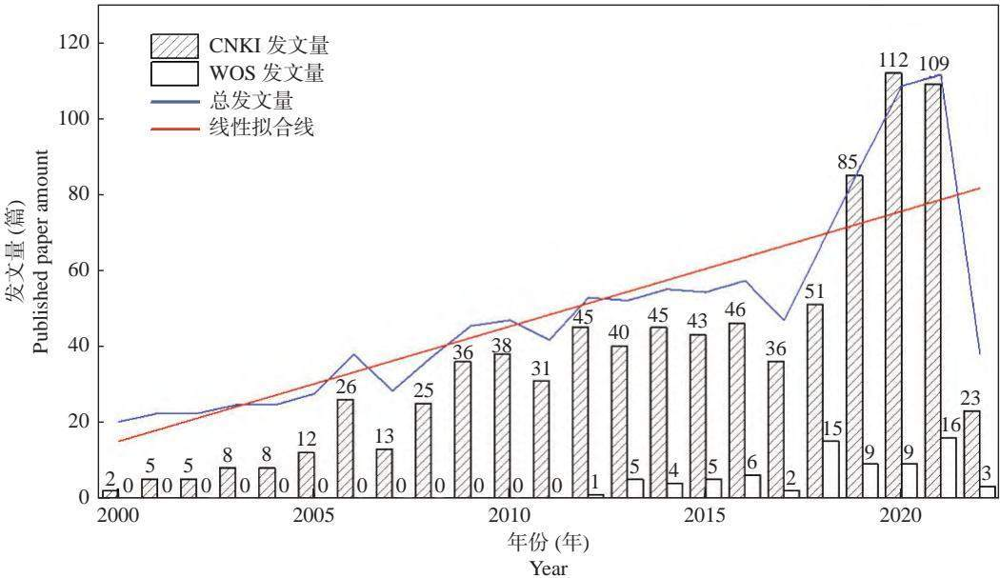
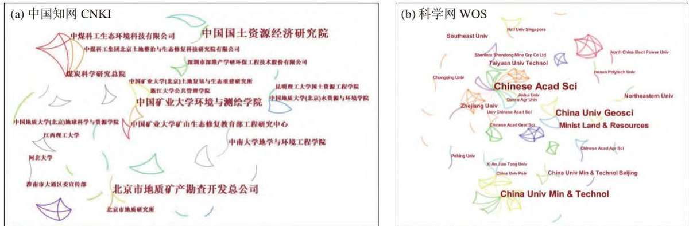
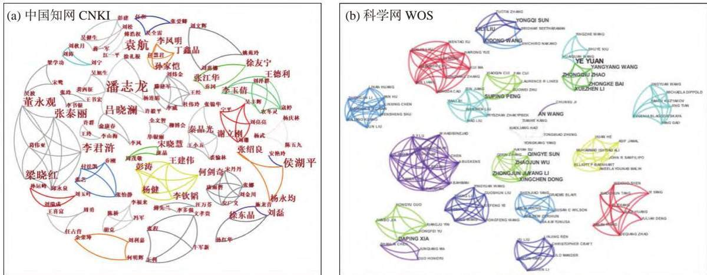
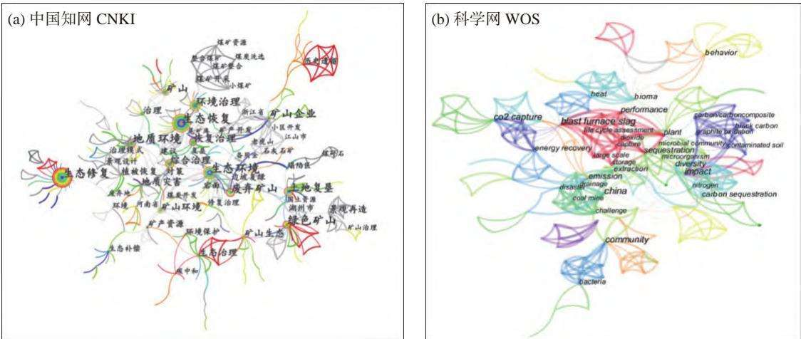
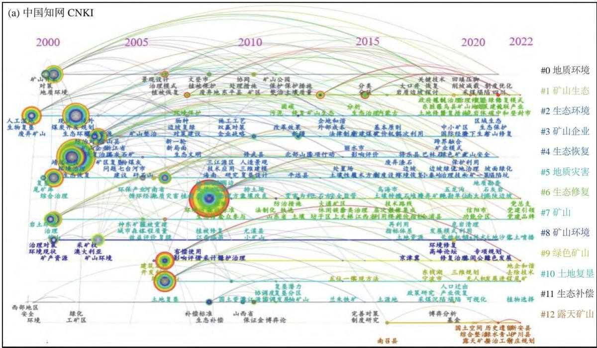
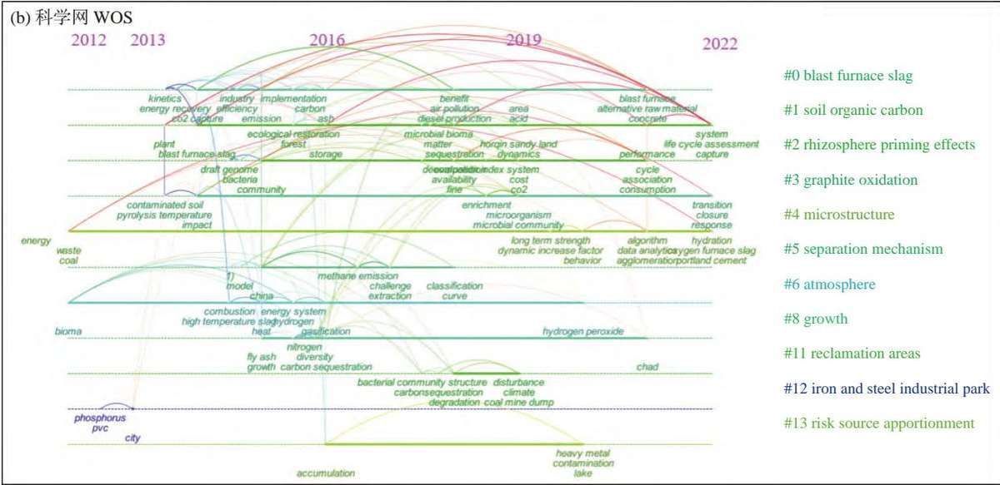

# 碳中和背景下矿山生态修复的文献计量分析

李超凡1, 2，尹　岩1\*，郗凤明1，王淑梅2，王娇月1，邴龙飞1，

胡琴琴1，张文凤1, 3，马铭婧1, 3，牛　乐1, 3

（1. 中国科学院沈阳应用生态研究所，辽宁沈阳 110016；2. 沈阳大学区域污染环境生态修复教育部重点实验室，辽宁沈阳 110044；3. 中国科学院大学，北京 100049）

摘　要：基于 Citespace工具，对碳中和背景下的我国矿山生态修复的文献进行知识图谱可视化分析。在中国知网和Web of science 网站中检索 2000 \~ 2022 年国内相关文献，应用 Citespace 5.8 R3 软件对作者、机构、关键词绘制知识图谱并进行分析。结果中英文文献分别纳入 844篇和 75篇，以寿立永等为代表的研究学者 765位；研究机构以中国科学院为代表；生态修复为关键词频次最高的关键词。突现关键词显示，废弃矿山是人们关注的重点对象，“碳中和”是矿山生态修复的重要背景，绿色矿山是未来矿山修复的目标之一。关键词时间图谱发现矿山的生态修复是一项因地制宜、政府企业合作的实现循环共赢的一项持久战。矿山生态修复的法律政策的改善、政府企业的加入、科技技术的创新和人民意识的强化是未来的研究趋势。

关　键　词：碳中和；矿山；生态修复；可视化分析；文献计量

中图分类号：X171.4

文献标识码：A

文章编号：0564−3945(2023)04−0955−11

DOI: 10.19336/j.cnki.trtb.2022050905

李超凡, 尹　岩, 郗凤明, 王淑梅, 王娇月, 邴龙飞, 胡琴琴, 张文凤, 马铭婧, 牛　乐. 碳中和背景下矿山生态修复的文献计量分析 [J]. 土壤通报, 2023, 54(4): 955 − 965

LI Chao-fan, YIN Yan, XI Feng-ming, WANG Shu-mei, WANG Jiao-yue, BING Long-fei, HU Qin-qin, ZHANG Wen-feng, MA Ming-jing, NIU Le. Bibliometric Analysis of Mine Ecological Restoration in the Context of Carbon Neutrality[J]. Chinese Journal of Soil Science, 2023, 54(4): 955 − 965

在 75届联合国大会上，国家主席习近平庄严承诺，中国二氧化碳排放力争于 2030年前达峰，努力争取 2060 年前实现碳中和[1]。据统计，2020 年中国碳排放量达到 105亿吨[2]。二氧化碳的排放年均增长率不断降低，但总体的排放量依旧升高[3]，导致全球的气温升高。我国是世界上最大的煤炭生产和消费国[4]，资料显示，国内矿山约有 103187 个[5]。能源的消耗是社会文明进步的关键之一。发展初期，大量煤炭开采导致矿区的泥石流和坍塌事件的发生、土地资源的浪费、环境重金属的迁移、地下水污染等环境问题，同时能源消耗和矿区开采也排放了大量的二氧化碳，据相关资料显示，煤矿排放的二氧化碳占我国总排放量的72%，占全球总排放量的19%[6]，是我国实现碳达峰、碳中和的责任主体。

在新的形势下，对矿山的生态修复提出新的要求和实现路径。有关矿山行业的碳排放源包括能源碳排放、采掘工业碳排放、土地利用碳排放及伴随的其他温室气体的排放[7]。碳中和下的矿山生态修复的内容包括对矿山的科学开采、矿产资源的再次利用、矿山环境的修复治理、矿山生态的绿化种植、煤炭能源的替代和矿山企业转型。矿山生态修复技术包括自然修复[8]、生态植被[9]、土壤改良[10−11] 等，不仅重塑矿山生态环境，也是提高矿区碳汇的有效措施。由于矿山的地质环境、污染程度、地理位置、形成类型、碳排放情况等条件不同，对其处理方法具有一定的差异。在此背景下，为高效的解决矿山问题，本研究分析了目前国内的符合碳中和背景的矿山生态修复研究的概况、热点及演变趋势，有助于厘清碳中和路径下的矿生态修复的研究方向，为后续研究提供参考和建议。

## 1    数据来源及研究方法

## 1.1    数据来源

矿山生态环境修复会间接实现源头减排、植被固碳、土壤固碳，因此，矿山生态环境修复与矿山减排增汇具有协同关系[7]。本研究检索文献类别包括中英文文献，时间跨度为 2000 \~ 2022 年，检索的时间为 2022年 3月 29日。中文文献数据来自中国知网检索平台（CNKI），文献类别选择中文期刊，检索方式为专业检索，检索式为SU=（‘矿山’ + ‘尾矿’ +‘矿业’ + ‘矿区’ + ‘煤矿’ + ‘矿渣’ + ‘土地复垦’）\*（‘生态修复’ + ‘生态恢复’ + ‘生态治理’ + ‘植物’ + ‘微生物’）\*（‘固碳’ + ‘低碳’ + ‘双碳’ + ‘碳中和’ + ‘高效利用’ + ‘能源替代’ + ‘环境治理’ + ‘节能减排’ + ‘科学开采’ + ‘绿色矿山’ + ‘综合治理’），检索到 1142篇中文文献，人工筛选剔除文献中无作者、不相关及重复文献298篇后，得到有效中文文献844篇。

英文文献数据来源 Web of science 检索平台（WOS），检索 3个并列主题词类别分别为矿山类（#1）、生态修复类（#2）和碳中和背景类（#3）。主 题 #1="min\*"OR"tail\*"OR"slag\*"OR"landreclamation\*"； 主 题 #2="ecosystem restoration\*"OR"ecological governance\*"OR"ecologicalremediation\*"OR"ecological environment\*"OR"eco-environment"OR"plant"OR"microbial"OR"microbe"OR"microbiology"；主题#3="carbon peaking\*"OR"carbonneutralization\*"OR"carbon sequestration\*"OR"low-carbon\*"OR"dual carbon Targets\*"OR"carbonneutrality\*"OR"efficient utilization\*"OR"alternativeenergy\*"OR"energy substitution\*"OR"environnmentcontrol\*"OR"energy conservation\*"OR"emissionreduction\*"OR"scientific mining\*"OR"green mining\*"OR"comprehensive control\*"，设置筛选条件为中国、论文和综述性文章，共检索出 93篇英文文献，经系统去重后共计75篇为有效数据。

## 1.2    研究方法

将来源于中国知网的中文文献数据以 Refworks格式导出，Web of science 英文文献以纯文本形式导出，利用 Citespace 软件（5.8R3 版本）将格式转换。根据文献计量和图谱分析的方法，将 CNKI 和 WOS的近 23年的符合碳中和背景下的矿山生态修复的国内数据进行可视化分析。根据分析的目的分别选择机构、作者和关键词为分析点，对文献发表时间、机构体系、作者体系、研究热点及未来研究趋势做分析和总结。

## 1.3    数据处理

检索参数的设计同时包含碳中和相关要求、生态修复相关技术与措施以及有关矿山内容。本研究图谱调整显示情况如下：文献按照合作机构数量选择合作机构；按照合作人数选择合作团队；通过网络修剪方式，选择 Path-finder 和 Pruning the mergednetwork去掉的关键词多余分支；突显关键词出现频次选择为至少一年。

## 2    结果与分析

## 2.1    文献年度分布

2000年前的文献数量较少，与本研究的低碳内容相关性较低，选择 2000年后的文献做系统分析，文献数量时间分布如图 1所示。由图可知，国内研究者对相关内容的发文主要在中国知网数据库中，根据发文量可分为 3个阶段，第一阶段（2000 \~2007年）平均发文量为 13.1篇、第二阶段（2008 \~2018年）平均发文量为47.4篇、第三阶段（2019 年 \~至今）平均发文量为 113.3篇（去除 2022年）。相关文献数量随着时间逐步增加，呈阶段性增长，在2019年后，研究人员对该方向的关注更加明显，每年的发文数量超过前几年的两倍以上。

## 2.2    文献机构分析

国内碳中和背景下的矿山生态修复领域研究文献机构的合作网络知识图谱如图 2所示。由表 1 和图2可知，核心机构为中国科学院，发文量为11 篇，首篇发文年份在 2013年。中国国土资源经济研究院的首次发文时间在 2006年，说明该机构在矿山领域的研究资质较高，从线条颜色看，2013年后的首次合作机构较多，表明更多机构参与到该领域的合作中来，该领域受到更多的关注。

碳中和背景下的矿山生态修复是交叉学科项目，包括经济类、工程类、科技类等，需要形成“研、管、产”的合作机构，目前参与的机构数量较多，其中研究院96所、高校208所、企业109所、政府130 所。从表 1可知，文献高产的机构中涵盖 4种类型，说明参与机构较全面。从图 2b）中可以看出，WOS中的合作队伍更加庞大，以中国科学院为中心的合作机构包含 30所，表明在矿山生态修复方面，国内已经具备高水平的研究团队。

  
图 1 文献数量年度分布图

Fig.1 Annual distribution of literature quantity  

注：Chinese Acad Sci：中国科学院；China Unit Geosci：中国地质大学；China Univ Min & Technol：中国矿业大学；Minist Land & Resources：国土资源部；Southeast Unit：东南大学；Northeastern Unit：东北大学；Zhejiang Unit：浙江大学；Taiyuan Univ Technol：太原理工大学；China Univ Min & Technol Beijing：北京科技大学；Shenhua Shendong Mine Grp Co. Ltd：神华神东矿玻璃钢有限公司；Henan Polytechnic Univ：河南理工大学；Chinese-Acad-Agr-Sci：中国农业科学院；Peking Univ：北京大学；Xi An Jiao Tong Univ：西安交通大学；China Univ Petr：中国石油大学；North China Elect Power Univ：华北电力大学；Chinese Acad Geol Sci：中国地质科学院；Gansu Agr Univ：甘肃农业大学；Anhui Univ：安徽大学；Chongqing Univ：重庆大学；Univ Chinese Acad Sci：中国科学院大学。

图 2 中国知网文献机构合作网络图谱  
Fig.2 CNKI document organization cooperation network map  
表 1 高产发文量的机构分布  
Table 1 Institutional distribution of high yield outcrops
<table><tr><td>排名 Rank</td><td>研究机构 Research institution</td><td>发文量（篇） Published paper amount</td><td>首次发文年份 Frist published paper year</td><td>文献来源 Literature resource</td></tr><tr><td>1</td><td>中国科学院</td><td>11</td><td>2013年</td><td>WOS</td></tr><tr><td>2</td><td>中国矿业大学</td><td>8</td><td>2017年</td><td>WOS</td></tr><tr><td>3</td><td>中国地质大学</td><td>8</td><td>2015年</td><td>WOS</td></tr><tr><td>4</td><td>中国国土资源经济研究院</td><td>7</td><td>2006年</td><td>CNKI</td></tr><tr><td>5</td><td>国土资源部</td><td>6</td><td>2015年</td><td>WOS</td></tr><tr><td>6</td><td>中国自然资源经济研究院</td><td>6</td><td>2019年</td><td>CNKI</td></tr><tr><td>7</td><td>北京市地质矿产勘查开发总公司</td><td>6</td><td>2017年</td><td>CNKI</td></tr><tr><td>8</td><td>中国建筑材料工业地质勘查中心陕西总队</td><td>5</td><td>2020年</td><td>CNKI</td></tr><tr><td>9</td><td>修武县国土资源局</td><td>5</td><td>2010年</td><td>CNKI</td></tr><tr><td>10</td><td>中国矿业大学环境与测绘学院</td><td>5</td><td>2011年</td><td>CNKI</td></tr><tr><td>11</td><td>中煤科工集团西安研究院有限公司</td><td>4</td><td>2014年</td><td>CNKI</td></tr></table>

## 2.3    作者分布

国内碳中和背景下的矿山生态修复领域研究文献作者的合作网络知识图谱如图 3所示，共现节点数量和连线数量分别代表作者总人数和合作团队数，合作团队数量占研究总人数的一半，反映出多数研究人员未形成合作团队，相对独立和封闭。根据普赖斯定[12]，核心作者发文数 $m = 0 . 7 4 9 ~ n _ { \mathrm { m a x } }$ ，其中$n _ { \mathrm { m a x } }$ 为发文最多作者的发文数[13]，因此核心作者的发文量最少为3篇（表2）。

  
图 3 文献作者合作网络图谱  
Fig.3 Collaborative network of authors

表 2 高产发文量的作者分布  
Table 2 Author distribution of high yield outposts
<table><tr><td>作者 Author</td><td>主要研究方向 Main research direction</td><td>发文量（篇） Published paper amount</td><td>首次发文年份 Frist published paper year</td></tr><tr><td>潘志龙</td><td>矿山生态环境治理</td><td>5</td><td>2004年</td></tr><tr><td>寿立永</td><td>绿色矿山</td><td>4</td><td>2020年</td></tr><tr><td>袁航</td><td>矿山资源开发与管理</td><td>4</td><td>2003年</td></tr></table>

国内矿山生态修复领域的作者有 765人，从首次发文时间来看，2019 \~ 2022 年间首次发文的作者有 222 人，2011 \~ 2018 年间的首次发文作者为348 人，2000 \~ 2010 年间的首次发文作者为 190 人。图中字体大小代表作者发文量的多少，核心作者为潘志龙、寿立永和袁航，发文次数分别为 5次、5次和 4次。核心作者中，潘志龙作者的发文年份在2000 \~ 2007年，主要研究内容为对矿山的工程规划利用和生态修复的研究。寿力永作者的发文年份在2020 \~ 2021年，主要研究内容为石灰岩矿产的资源利用和生态治理的研究。

图 3中的合作线条颜色代表作者首次合作年份，发现图中灰色合作线条占比较多，表示大部分作者在 2000 \~ 2013 年已经开始合作，红色线条为 2022年合作团队，3人以上的团队仅有 5组，反映出亟需研究人员对矿山生态修复领域的参与。从合作网络来看，部分论文作者形成了合作团队，最多团队为

9 人团队有 3组，其中一组 9 人团队中，参与人员包括核心作者潘志龙，平均发文年份在 2006年，反映出其团队在矿山生态修复上具有一定的先导性。除此外，团队中 3人以上开展合作的有 41 组。碳中和下的矿山生态修复是个多学科、多领域的研究方向，仍需团队的人员扩充和综合发展。

## 2.4    研究热点与演化趋势分析

2.4.1 研究热点分析 用 citespace 软件进行关键词分析可以表示该领域的研究热点。国内碳中和背景下的矿山生态修复领域研究文献关键词共现的网络知识图谱如图 4 所示。图 4a 共现节点数量为 536，连线数量为 906，图 4b 共现节点数量为 317，连线数量为 1405。频次超过 20 次的高频关键词如表 3 所示，根据关键词出现频次发现，相比历史遗留和地质灾害类矿山，废弃矿山、企业矿山及塌陷类的矿山开发类的环境问题受到更多关注，说明相比自然原因，人为导致的矿山生态污染受到的关注更多。采取的治理方法包括矿山绿化[14]、土地复垦[15]、矿山资源利用、景观再造[16] 及植被恢复的技术手段，与目前减排降碳、碳中和主题内容息息相关。

图 4a中，直接以“碳中和”为关键词的文章有6篇，透过碳中和视角，运用生态修复技术，加强露天废弃矿山的修复与治理[11]，其中煤炭矿区有关文献为 2篇，指出煤炭企业建设绿色矿山是实现“双碳”

  
注：China：中国；Heat：热能；Bioma：微生物；Performance：性能；CO Capture：碳捕获；Energy Recovery：能量回收；Emission：排放；Behavior：反应；Blast Furnace Slag：炉熔渣；Life Cycle Assessment：生命周期评价；Coal Mine：煤矿；Community:群落；Extraction：提取；Nitrogen：氮；Microorganism：微生物；Diversity：多样性；Contaminated Soil：污染土壤；Carbon Sequestration：碳固定；Dioxide：二氧化物；Storage：储存;Plant：植物；Black Carbon：炭黑；Disaster：灾难。

图 4 文献关键词共现的网络图谱  
Fig.4 Network atlas of co-occurrence of literature keywords  
表 3 频次超过10次的高频关键词  
Table 3 High-frequency keywords with frequency exceeding 10 times
<table><tr><td>排名 Rank</td><td>关键词 Key word</td><td>频次 Frequency</td><td>中心性 Centrality</td><td>首次发文年份 Frist published paper year</td><td>文献来源 Literature resource</td></tr><tr><td>1</td><td>生态修复</td><td>145</td><td>0.36</td><td>2008年</td><td>CNKI</td></tr><tr><td>2</td><td>生态恢复</td><td>85</td><td>0.2</td><td>2002年</td><td>CNKI</td></tr><tr><td>3</td><td>绿色矿山</td><td>55</td><td>0.17</td><td>2006年</td><td>CNKI</td></tr><tr><td>4</td><td>环境治理</td><td>53</td><td>0.09</td><td>2002年</td><td>CNKI</td></tr><tr><td>5</td><td>生态环境</td><td>53</td><td>0.15</td><td>2002年</td><td>CNKI</td></tr><tr><td>6</td><td>综合治理</td><td>42</td><td>0.09</td><td>2001年</td><td>CNKI</td></tr><tr><td>7</td><td>废弃矿山</td><td>40</td><td>0.11</td><td>2000年</td><td>CNKI</td></tr><tr><td>8</td><td>土地复垦</td><td>34</td><td>0.05</td><td>2006年</td><td>CNKI</td></tr><tr><td>9</td><td>地质环境</td><td>30</td><td>0.09</td><td>2001年</td><td>CNKI</td></tr><tr><td>10</td><td>恢复治理</td><td>28</td><td>0.08</td><td>2003年</td><td>CNKI</td></tr><tr><td>11</td><td>矿山</td><td>28</td><td>0.05</td><td>2001年</td><td>CNKI</td></tr><tr><td>12</td><td>治理</td><td>22</td><td>0.04</td><td>2001年</td><td>CNKI</td></tr><tr><td>13</td><td>矿山环境</td><td>22</td><td>0.05</td><td>2003年</td><td>CNKI</td></tr><tr><td>14</td><td>矿山生态</td><td>19</td><td>0.06</td><td>2013年</td><td>CNKI</td></tr><tr><td>15</td><td>矿山企业</td><td>19</td><td>0.1</td><td>2003年</td><td>CNKI</td></tr><tr><td>16</td><td>矿产资源</td><td>17</td><td>0.06</td><td>2001年</td><td>CNKI</td></tr><tr><td>17</td><td>生态治理</td><td>17</td><td>0.04</td><td>2015年</td><td>CNKI</td></tr><tr><td>18</td><td>地质灾害</td><td>13</td><td>0.02</td><td>2006年</td><td>CNKI</td></tr><tr><td>19</td><td>生态补偿</td><td>13</td><td>0.02</td><td>2008年</td><td>CNKI</td></tr><tr><td>20</td><td>对策</td><td>10</td><td>0.01</td><td>2001年</td><td>CNKI</td></tr><tr><td>21</td><td>环境保护</td><td>10</td><td>0.03</td><td>2007年</td><td>CNKI</td></tr></table>

的基础和关键[17]。图谱中以 2021 年提出的“碳中和”为中心点的网络关键词有“双碳目标”、“减排增汇”、“优化策略”、“环境保护”、“生态治理”、“政策建议”、“发展趋势”，指出矿山在生态修复、环境保护的同时实现"低碳源、高碳汇、高效益"的发展状态，有效助力碳中和的实现，“碳中和”策略既是政策建议，也是未来的发展趋势；以 2012年提出的“固碳”为支链的连接关键词有“内蒙古”、“污泥”、“修复”、

“高寒地区”，陈国清[18] 通过遥感方法了解了内蒙古3个露天矿区的固碳功能；以2012年提出的“碳减排”为支链的连接关键词有“塌陷区”、“充填复垦”、“煤矸石”。在碳中和的背景下，研究内容纷繁复杂，包括矿区土壤修复技术、矿区的碳储量和碳排放关系[19]、微生物及植物的土壤固碳作用[4,20]、矿山生态修复减排增汇途径及效果[21]、产业转型、能源替代[22]、政府的相关规划和政策[21]。从时间和内容上发现，碳中和背景下的矿山生态修复是一项长久的、复杂的、需要各个领域合作的可持续发展的技术。Web ofscience的关键词共现网络图谱中，关键词的中心性较低，与碳直接相关的关键词包括：“碳捕获”、“碳封存”、“二氧化碳”。以“碳捕获”为关键词的文章有 4篇，以其为中心点的网络关键词多为能源方向，包括“能量回收”、“氢”、“产电”等。以“碳封存”为关键词的文章有 4篇，2018年提出植被种植对矿区碳封存具有一定的效果，2021年提出利用发电厂的二氧化碳作为热采矿流体，并可能将二氧化碳封存到花岗岩深层地层中，以其为中心点的网络关键词有“多样性”、“酶活性”、“氮”等。以“二氧化碳”为关键词的文章有 5篇，以其为中心的网络关键词包括“碳组成”、“炭黑”、“排放”等。

表 3中的热点关键词主要由共现频次和中心性两个指标判定，可知“生态修复”、“生态恢复”、“绿色矿山”、“生态环境”、“废弃矿山”具有较高的中心性（出现频次超过 40次、中心性超过 0.1），其中“生态修复”的出现频次和中心性最高，分别为145和 0.36，与“生态修复”相关的网络中治理方向的关键词有“分类治理”、“生态破坏”、“环境污染”、“防治措施”、“复绿”；经济方向的关键词有“征收标准”和“收缴”；制度方向有“法制化”；资源利用方面有“利用模式”、“功能分区”、“上天梯”、“休闲娱乐”。以上表明碳中和背景下，研究者们关注最多的是废弃矿山，矿山的生态环境治理问题是更多关注的方向，是以生态修复、生态恢复的绿色手段为主，也是未来的矿山主要治理趋势。

2.4.2 演化趋势分析　关键词时间线图谱分析代表该领域的研究内容随时间的演化趋势，如图 5 所示。图中右侧红色字体为聚类关键词，水平线上的不同颜色的实线代表该聚类的首次出现时间，线上节点的大小代表关键词的强度，节点对应的横轴时间代表首次出现的时间。

CNKI #0“地质环境”从 2001 \~ 2021 年，提取的关键词有矿山开采（4次）、地质环境（30次）、治理模式（8次）等，主要包含了矿山公园、岩质边坡、采煤塌陷、露天矿的地质环境问题。2001 \~2018年提出地质环境危害问题，预防为主、治理为辅的原则、提出要加强管理和监测手段、根据实际的地质环境进项分区处理。2021年在中国的矿山的修复制度方面提出疑问，分别在依据、要求、底线、

保障和基础上提出建议[22]。

CNKI #1“矿山生态”从 2007 \~ 2022 年，提取的关键词有环境保护（10次）、矿山生态（19 次）、生态治理（17次）、碳中和（6次）等，主要内容包括土地修复和土壤固碳技术以及政府的规划和企业的参与。2007 \~ 2021年提出将高新的治理技术引入矿区污染问题，提出矿产绿化和采矿同步的重要性，实施全生产链条、全生命周期生态修复规划。2022年煤炭的消费导致碳排放量较高，科学的开采和生态修复能够实现减排增汇的效果，增加植被覆盖，实现由源到汇的过程。同时，研究提出在双碳的背景下，绿色矿山建设和绿色开采是未来的发展趋势[23]。

CNKI #2“生态环境”从 2000 \~ 2021 年，提取的关键词有废弃矿山（40次）、生态环境（30 次）、法律制度（3次）、矿山修复（3次）等。有关措施包括生态复垦、边坡复绿、企业战略。2000 \~ 2009年提出植物复垦、微生物处理、人工湿地处理、坡面挂网喷破的方法。2013 \~ 2014年提出民间资本参与、成立矿产投资公司，周转资金。2021年对京津冀的某矿山问题提出先削地和地形整治，再消除地质灾害加遮挡工程，最后绿化的改良措施[24]。

CNKI #4“生态恢复”从 2002 \~ 2021 年，提取的关键词有环境治理（53次）、生态恢复（85 次）、治理技术（5次）等，主要包含了人造景观、边坡绿化、一矿一策的治理方案。2002 \~ 2009年提出矿区的污染和经济问题，对矿山的生态补偿策略和景观再造法，同时提出保护近与恢复金制度[25]。2013 \~2020年提出了民间资本参与的方法，在生态恢复的政策方面提出建议，对矿山环境的保证金和恢复金提出问题和意见，对未来治理的因地制宜、环境企业经济双赢和监督执行方面提出展望。2021年实现了资源恢复、设置屏障和植被修复的多重治理手段。

CNKI #5“地质灾害”从 2001 \~ 2022 年，提取的关键词有综合治理（42次）、河南省（8次）、治理方案（5次）、高陡偏坡（3次）等，主要内容包括综合治理、循环经济、土壤改良和变废为利的改善措施。2001 \~ 2015年在矿山的地质问题上，提出系列的治理措施，包括生物与工程的协同治理[26]、综合治理、植物和土壤改良的措施，微生物技术引入方法[27] 和多种产业结合的治理模式。2019 \~ 2022 年提出地质的资源再利用问题，在基于法律、政策、注：Blast Fumace Slag：高炉矿渣；Soil Organic Carbon：土壤有机碳；Rhizosphere Priming Effects：根际启动效应；Graphite Oxidation：石墨氧化；Microstructure：微观结构；Separation Mechanism：分离机制；Atmosphere：大气；Growth：种植；Reclamation Area：填海区；Iron and Steel Industrial Park：钢铁工业园区；Risk Source Apportionment：分配风险源；Kinetics：动力学；Energy recovery：能量回收；CO Capture：碳捕获；Industry：工业；Carbon：碳；Air Pollution：空气污染；Diesel Production：柴油生产；Alternative Raw Material：替代原料；Ecological Restoration：生态恢复；Forest：森林；Storage：储存；MicrobiaBioma：微生物；Sequestration：固定；System：体系；Dynamics：动力学；Community：群落；Availability：有效性；Consumption：消耗；ContaminatedSoil：污染土壤；Pyrolysis Temperature：热解温度；Enrichment：丰富；Microbial Community：微生物群落；Transition：转换；Closure：闭合；Response：反应；Coal：煤；Energy：能量；Long Term Strength：长期强度；Algorithm：算法法则；Data Analytics：数据分析；Agglomeration：凝聚；Hydration：水合作用；Methane Emission：沼气排出；Classification：分裂；Curve：曲线；Combustion：燃烧；Energy System：能源系统；Hydrogen：氢；Gasification：气化；Hydrogen Peroxide:过氧化氢；Nitrogen：氮；Disturbance：干扰；Climate：气候；Coal Mine Dump：煤矿废渣；Degradation：退化；Heavy Metal：重金属；Contamination：污染；Accumulation：积累；Lake：湖。

图 5 关键词时间线谱图

Fig.5 Time-line spectrum of keywords

管理、技术四个方面提出了具体的综合治理对策，在评价、治理和监测的 3个方面提出改善，预防地

质灾害[28]。

CNKI #6“生态修复”从 2006 \~ 2022 年，其中，

2018 \~ 2021年的发文量较高。提取的关键词有生态修复（145次）、治理方案（5次）等，主要地点包括山东省、坊子区、江西省、合浦县和信阳市。主要内容包括矿山生态修复的复绿、分类治理、公共参与、利用模式、功能分布和客土喷播技术。2008 \~2012年提出矿山的污染问题和治理方法。2013 \~2021年对管理机制、法律建设、财政支持、生态补偿机制和市场介入[29] 的现状和问题进行了分析。同时，2018 \~ 2022年有研究提出煤炭废矿是个巨大的碳排放源，而植物修复是一项转为碳汇的有效手段。

CNKI #7“矿山”从 2001 \~ 2021 年，提取的关键词有治理（22次）、矿山（28次）等，主要内容包括矿山的治理、植被修复、土地资源和长效机制问题。2001 \~ 2003年提出了矿山开采环境负效应问题及改善措施。2006 \~ 2014 年从经济角度提出了新思路，解决资金周转问题。2016 \~ 2019 年提出将矿山治理与景观规划在一起，提出可持续开采的问题。2020 \~ 2021 年提出3S 技术在矿山环境治理中的应用，分析了投资现状，对治理多元化机制进行探讨[30−31]。

CNKI #8“矿山环境”从 2001 \~ 2021 年，提取的关键词有矿产资源（17次）、矿山环境（22次）、修复治理（7次）等，主要内容包括矿产资源的环境现状、治理对策、影响评估、开采计划、专项规划和绿色发展的问题。2003年香港规划署积累了矿山生态环境治理的管理工作经验和治理技术成果。2007 \~ 2014年实施了矿产资源有偿使用制度与政策。2019 \~ 2021年完善了生态快速恢复评价体系，提出通过边挖矿边治理的手段，经济与生态环境的双赢[32]。

CNKI #9“绿色矿山”从 2006 \~ 2022 年，提取的关键词有绿色矿山（55次）、矿山环境（22次）、修复治理（7次）等，主要内容包括绿色矿山的开发利用、实现方法、发展进程及相关技术问题。图中可知，绿色矿山与土地复垦和矿山生态联系密切，是实现矿山生态治理的主要目的之一。2010 \~ 2018年首次提出建设"绿色矿山"的明确要求，提出一系列连接体系，并将生态文明建设的背景与绿色矿山内容链接、将矿山的生态及经济效益结合、将绿色矿山与田园连接。2020 \~ 2022年是矿山转型发展的阶段[33]。

CNKI #10“土地复垦”从 2006 \~ 2022 年，提取的关键词有土地复垦（34次）、采煤沉陷（5次）等，主要内容包括对由于过度开采而导致的煤炭资源枯竭问题、重金属污染问题和地面下沉的塌陷问题进行土地复垦，生态修复的治理。其中在 2006 \~2008年提出塌陷、资源浪费、景观破坏的问题和土地复垦的方法。2011 \~ 2016年在经济方面提出土地复垦保证金制度，分别从经济效益、社会效益、生态效益三个方面进行综合分析。2019 \~ 2022年提出了塌陷区高效的土地利用模式，实现修复－经济协同发展的技术理念[15]。

CNKI #11“生态补偿”从 2000 \~ 2021 年，提取主要关键词为生态补偿（13次）、等，讨论了目前我国煤炭资源的生态补偿问题及实现生态补偿的对策，完善了生态法律补偿制度和补偿标准，为市场、社会、政府和企业分别提出相应的补偿管理策略[34−35]。

CNKI #12“露天矿山”从 2016 \~ 2022 年，提取的关键词有露天矿山（5次）、综合整治、历史遗留等，研究的内容是对河南省的南召县、新安县、伊川县、渭河平原地等露天矿山种植庄稼，果树的经济林等进行绿化，提出生态效益、经济效益和社会效益综合规划的治理方案，并在 2022年提到智慧城市和村庄规划[36]。

WOS #1“土壤有机碳”从 2014 \~ 2022 年，提取的关键词有生态恢复、封存、动力学等，研究的主要内容包括废弃矿渣的回收促进复垦矿区土壤碳固存[37]。

WOS #3“石墨氧化”从 2014 \~ 2022 年，提取关键词有污染土壤、微生物、肥沃等，其中 2019 年提出了自养细菌在矿山尾砂固碳中的作用的探究问题。

## 2.5    研究领域与发展方向分析

通过 Citespace 软件对突显关键词进行分析可以判断各个时间段的研究领域与研究方向。有关碳中和背景下的矿山生态修复的关键词突现分析如图 6所示，根据突现文字强度筛选出的中文文献中共有12个突现关键词，按强度由大到小分别为“生态修复”[38−39]、“绿色矿山”[40−41]、“矿山环境”[42−43]、“废弃矿山”[44−45]、“矿山生态”[46]、“生态补偿”[47]、“煤矸石”、“生态恢复”[48]、“生态治理”[46,49]、“生态环境”[50]、“矿产资源”[50]、“碳中和”[24,51]。根据突现关键词的突现时间段，把2000 \~ 2022年分为两个阶段：2000 \~ 2010年为第一阶段，突现关键词有“矿山环境”和“生态恢复”，其中矿山的生态恢复是指依靠生态系统的自我调节功能，采取人工参与促进措施，使矿山逐步恢复其生态功能[14]，表明这一时期的关注在矿山的环境污染问题，人为参与较少。2011 \~2018年间突显关键词为“生态补偿”、“煤矸石”、“生态治理”、“生态环境”、“矿产资源”，表明研究者们侧重在生态环境问题上，研究方向由传统的生态恢复技术转变为具体的生态补偿技术和生态治理技术，同时由煤矸石开采而导致的环境生态污染问题受到更多关注。2019 \~ 2022 年突显关键词为“生态修复”、“绿色矿山”、“废弃矿山”、“矿山生态”、“碳中和”，除“矿山生态”外，其他关键词仍然是目前的研究热点。在2021年提出“碳中和”的相关概念，同时也决定了将以“碳中和”为主要目的的矿山生态修复未来研究的热点方向和重点领域。

<table><tr><td>关键词</td><td>年份</td><td>强度起始</td><td>终止</td><td>2000~2022</td></tr><tr><td>生态修复</td><td>2000</td><td>22.18</td><td>2020</td><td>2022</td></tr><tr><td>绿色矿山</td><td>2000</td><td>6.82</td><td>2019</td><td>2022</td></tr><tr><td>矿山环境</td><td>2000</td><td>5.44</td><td>2003</td><td>2009</td></tr><tr><td>废弃矿山</td><td>2000</td><td>4.06</td><td>2020</td><td>2022</td></tr><tr><td>矿山生态</td><td>2000</td><td>4.03</td><td>2019</td><td>2020</td></tr><tr><td>生态补偿</td><td>2000</td><td>3.80</td><td>2013</td><td>2015</td></tr><tr><td>煤矸石</td><td>2000</td><td>3.75</td><td>2011</td><td>2013</td></tr><tr><td>生态恢复</td><td>2000</td><td>3.58</td><td>2009</td><td>2010</td></tr><tr><td>生态治理</td><td>2000</td><td>3.57</td><td>2015</td><td>2019</td></tr><tr><td>生态环境</td><td>2000</td><td>3.50</td><td>2014</td><td>2017</td></tr><tr><td>矿产资源</td><td>2000</td><td>3.31</td><td>2014</td><td>2015</td></tr><tr><td>碳中和</td><td>2000</td><td>3.24</td><td>2021 2022</td><td></td></tr></table>

图 6 关键词突现图谱  
Fig.6 Keyword emergence map

## 3    结论

“碳中和”的提出为矿山的生态修复指出了新的路径和目标，与绿色矿山发展的理念相一致。本研究基于 Citespace 5.8 R3 软件对 2000 \~ 2022 年间的有关符合碳中和理念的国内矿山生态修复的文章进行可视化分析，结论如下：

（1）2000年起，矿山环境污染问题受到越来越多的重视，2019年关注度明显上升。中国科学院为发文量最高机构，我国在矿山的治理问题上已有成熟且全面的团队，但近年出现合作团队较少，仍需新团队的构建，各类企业和政府参与的同时，相关的法律法规的完善更利于进度的加快。寿立永是发文数量最高的作者，发表时间在 2020 \~ 2021 年。

（2）煤炭矿是我国能源的重要来源，矿山的科学开采和合理修复技术可以使其实现碳的由源到汇的过程，主要的修复手段是植被栽种，未来植被类型可能是经济作物。

（3）未来会以“边开采边治理”为主要理念，以生态修复为主要手段，以实现经济绿色矿山为主要目标，推动矿山可持续发展。矿山的碳储存与封存技术的发展空间较大，“生态修复”、“绿色矿山”、“废弃矿山”和“碳中和”四大主题既是目前的主要研究领域，也是未来的主要研究方向。

## 参考文献：

毛晓杰, 徐　扬, 关国恒. 国际碳中和背景下我国开征碳税的策[ 1 ]略选择[J]. 银行家, 2022, (1): 4.

李　勇, 高　岚. 中国“碳中和”目标的实现路径与模式选择[J].[ 2 ]华南农业大学学报(社会科学版), 2021, 20(50): 77 − 93.

宋晓波, 胡　伯. 碳中和背景下煤炭行业低碳发展研究[J]. 中国[ 3 ]煤炭, 2021, 47(7): 17 − 24.

李树志, 李学良, 尹大伟. 碳中和背景下煤炭矿山生态修复的几[ 4 ]个基本问题[J]. 煤炭科学技术, 2022, 50(1): 7.

夏　可, 张世文, 沈　强, 等. 基于熵值组合模型的矿业复垦土[ 5 ]壤重金属高光谱反演[J]. 发光学报, 2019, 40(12): 1563 − 1573.

杨博宇, 白中科. 碳中和背景下煤矿区土地生态系统碳源/汇研[ 6 ]究进展及其减排对策[J]. 中国矿业, 2021, 30(5): 9.

尹　岩, 郗凤明, 王娇月, 等. “碳中和”背景下我国矿山生态环[ 7 ]境修复研究现状及发展趋势[J/OL]. 化工矿物与加工: 1-8[2022-04-09].

常俊杰, 刘　乐. 基于自然解决方案的矿山生态修复[J]. 科技创[ 8 ]新与应用, 2022, 12(3): 107 − 109.

[ 9 ] 沈维明, 张星辉. 浅谈北京市废弃矿山生态修复技术与措施[J].

水利水电技术, 2011, 42(1): 24 − 26.

陈进斌, 李　林, 陈建宏, 等. 矿山生态修复中微生物技术的应[ 10 ]用[J]. 能源与环境, 2020, (4): 102 − 103.

田占良. 碳中和视角下露天废弃矿山生态修复技术优化[J]. 能[ 11 ]源与环保, 2022, 44(2): 29 − 34.

叶　贵, 付　媛, 王玉合, 等. 行为视角下基于CiteSpace的建筑[ 12 ]安全研究综述[J]. 安全与环境工程, 2019, 26(4): 127 − 134.

郭晓剑, 胡　欢, 刘亦晴, 等. 基于CiteSpace的我国绿色矿山研[ 13 ]究可视化分析[J]. 黄金科学技术, 2020, 28(2): 203 − 212.

孟　猛, 宗美娟. 矿山生态恢复原理与技术[J]. 中国矿业, 2010,[ 14 ](9): 3.

殷澜格, 连海波, 刘　强, 等. 采煤沉陷区土地高效利用模式探[ 15 ]讨[J]. 陕西煤炭, 2022, 41(2): 78 − 81.

吕晓澜, 龚西征, 潘志龙. 废矿还绿变废为宝−浙江省“百矿[ 16 ]示范, 千矿整治”工作记实[J]. 浙江国土资源, 2009, (10): 16 −18.

高云飞, 王　义, 王国青, 等. “双碳”目标下煤炭企业绿色矿山[ 17 ]建设路径探究[J]. 中国煤炭, 2022, 48(01): 16 − 20.

陈国清. 基于遥感的矿区植被恢复生态成效评估研究[D]. 呼和[ 18 ]浩特: 内蒙古农业大学, 2016.

高晓云, 陈　萍. 淮南塌陷区煤矸石充填复垦的碳减排效益[J].[ 19 ]能源环境保护, 2012, 26(6): 6 − 9.

王丽萍, 张　弘, 钱奎梅, 等. 丛枝菌根真菌对矿区修复系统固[ 20 ]碳的作用[J]. 中国矿业大学学报, 2012, 41(4): 635 − 640.

郭冬艳, 杨　繁, 高　兵, 等. 矿山生态修复助力碳中和的政策[ 21 ]建议[J]. 中国国土资源经济, 2021, 34(10): 50 − 54.

卢　锟. 基于适应性管理的矿区生态环境修复制度优化研究[J].[ 22 ]中国矿业, 2021, 30(7): 58 − 63.

卞正富, 于昊辰, 韩晓彤. 碳中和目标背景下矿山生态修复的路[ 23 ]径选择[J]. 煤炭学报, 2022, 47(1): 449 − 459.

田园园, 颜冬娜. 废弃矿山生态环境治理措施探讨−以曲阳[ 24 ]县某废弃矿山为例[J]. 安徽农学通报, 2021, 27(5): 139 − 142.

崔雪梅. 煤炭资源开采环境治理与生态恢复补偿研究[J]. 中国[ 25 ]科技信息, 2009, (11): 16.

康　宁. 矸石山综合治理工程应用实践[J]. 中国环保产业, 2015,[ 26 ](7): 39 − 42.

侯养全. 微生物技术在煤矿瓦斯综合治理领域的应用[J]. 山西[ 27 ]化工, 2012, 32(6): 34 − 36.

李　立. 矿山生态环境恢复动态监测与综合治理[J]. 中国金属[ 28 ]通报, 2021, (5): 144 − 145.

罗　跃, 王国强, 翟如伟. 浅谈废弃矿山生态修复的做法[J]. 能[ 29 ]源技术与管理, 2021, 46(6): 3.

徐　丹, 蒋　磊, 于巾萃. 矿山废弃地生态修复中3S技术的应[ 30 ] 用[J]. 世界有色金属, 2021, (1): 197 − 198.

[ 31 ] 刘元佳. 3S技术在矿山生态建设中的应用[J]. 华北自然资源,

2020, (5): 80 − 81, 84.

高　丽. 植物修复技术在矿山环境治理中的应用−新形势下[ 32 ]矿山行业的发展方向[J]. 世界有色金属, 2021, (12): 170 − 171.

寿立永. 石灰岩矿山高陡边坡稳定性控制与生态修复研究[C]//.[ 33 ]第四届中国矿山地质环境保护学术论坛论文摘要集, 2021 : 16-17.

叶　武, 袁　航, 何贤辉, 等. 浙江省矿山地质环境治理恢复基[ 34 ]金制度实践[J]. 现代矿业, 2021, 37(11): 247 − 251.

田招龙, 张雄邦, 陈仕涛, 等. 矿山环境治理过程中资金运作模[ 35 ]式探索与实践[J]. 中国煤炭地质, 2019, 31(2): 77 − 81.

王伟灿. 撑起古都发展新天地−河南省资源环境调查二院助[ 36 ]力洛阳高质量发展纪实[J]. 资源导刊, 2022, (1): 42.

Ye, Yuan, Zhongqiu, et al. Characteristics of labile organic carbon[ 37 ] fractions in reclaimed mine soils: Evidence from three reclaimed forests in the Pingshuo opencast coal mine, China[J]. Science of The Total Environment, 2018, 613-614: 1196 − 1206.

文　卓, 皇甫玉辉, 孙天竹, 等. 我国矿山土地复垦与生态修复[ 38 ]存在的问题及建议[J]. 矿产勘查, 2019, 10(12): 3076 − 3078.

付广磊, 王耀华. 河南太行地区文峰石灰石矿山的绿色生态修[ 39 ]复研究[J]. 中国资源综合利用, 2021, 39(11): 139 − 141.

陈帮金, 赵晨阳, 瞿广飞, 等. 含重金属尾矿资源化利用研究进[ 40 ]展[J]. 有色金属(矿山部分), 2022, 74(2): 116 − 125.

杨彩琴. 矿山生态修复措施及合理的植物配置分析[J]. 农业与[ 41 ]技术, 2021, 41(8): 8109 − 8111.

刘德成. 京津冀矿山环境修复治理措施研究−以玉田县某矿[ 42 ]山为例[J]. 环境生态学, 2020, 2(11): 69 − 73.

李　磊, 金　超, 孟兆兴, 等. 石拐采煤沉陷区土地复垦技术研[ 43 ]究[J]. 中国资源综合利用, 2020, 38(3): 122 − 124.

程素珍, 张怡婧, 颜东旭. 济南市钢城区某废弃矿山生态修复治[ 44 ]理研究[J]. 安徽农学通报, 2021, 27(10): 139 − 142.

李钦韬, 彭　涛, 杨　健, 等. 京津冀地区废弃矿山地质环境治[ 45 ]理及生态修复方案研究[J]. 现代矿业, 2020, 36(6): 205 − 208.

武彩霞, 高存红, 杨　薇. 基于EOD理念的矿山修复模式应[ 46 ]用−以某矿山生态修复项目为例[J]. 中国工程咨询, 2022,(1): 96 − 100.

王轶峤. 面向全生命周期的矿产资源开发生态补偿机制研[ 47 ]究[D]. 北京: 北京科技大学, 2019.

张　洁. 以五阳煤矿为例谈采煤沉陷区生态恢复治理[J]. 山西[ 48 ]建筑, 2021, 47(16): 149 − 150.

郭　翔. 矿山地质环境保护与治理方式之研究[J]. 资源节约与[ 49 ]环保, 2019, (8): 11.

吴文盛, 李小英. 矿产资源开发与生态环境恢复治理[J]. 中国矿[ 50 ]业, 2021, 30(2): 21 − 24.

强海洋, 高　兵, 郭冬艳, 等. 碳中和背景下矿业可持续发展路[ 51 ]径选择[J]. 中国国土资源经济, 2021, 34(4): 4 − 11.

# Bibliometric Analysis of Mine Ecological Restoration in the Context of Carbon Neutrality

LI Chao-fan1, 2, YIN Yan1\*, XI Feng-ming1, WANG Shu-mei2, WANG Jiao-yue1, BING Long-fei1, HU Qin-qin1, ZHANG Wen-feng1, 3, MA Ming-jing1, 3, NIU Le1, 3

(1. Institute of Applied Ecology, Chinese Academy of Sciences, Shenyang 110016, China; 2. Key Laboratory of Regional Ecological Restoration of Polluted Environment, Ministry of Education, Shenyang University, Shenyang 110044, China; 3. University of Chinese Academy of Sciences, Beijing 100049, China)

Abstract: Based on the Citespace tool, the literature of mine ecological restoration in China under the background of carbon neutrality was visualized and analyzed by knowledge graph. The relevant literatures in China from 2000 to 2022 were retrieved from CNKI and Web of Science websites. Citespace 5.8 R3 software was used to draw and analyze the knowledge map of authors, institutions and keywords. The results showed that 844 Chinese and 75 English literatures were included, with 765 researchers, represented by Shou Liyong et al. The research institutes were represented by the Chinese Academy of Sciences. The key words with the highest frequency were ecological restoration. The key words showed that abandoned mines were the focus of attention, and the carbon neutrality was the important background of mine ecological restoration, and green mine was one of the goals of mine restoration in the future. Keyword time map indicated that mine ecological restoration was a sustainable battle, which is based on loca conditions and cooperation between government and enterprises to achieve a win-win cycle. The improvement of laws and policies in mine ecological restoration, the joining of government enterprises, the innovation of science and technology and the strengthening of people’s consciousness are the future research trends.

Key words: Carbon neutrality; Mine; Ecological restoration; Visual analysis; Bibliometric

[ 责任编辑：韩春兰 ]