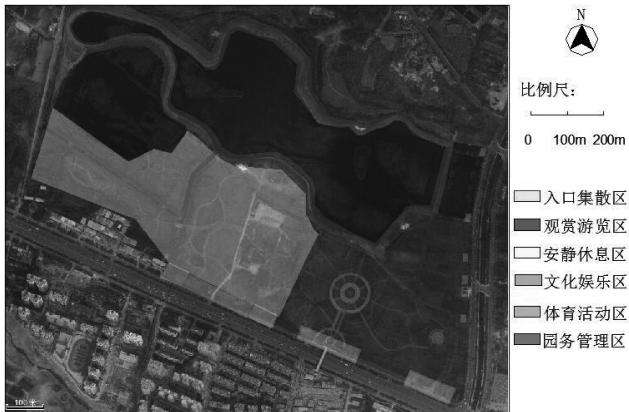
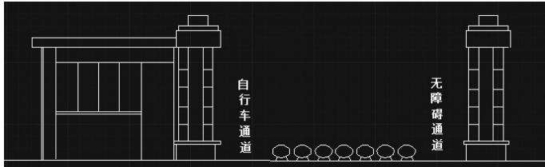
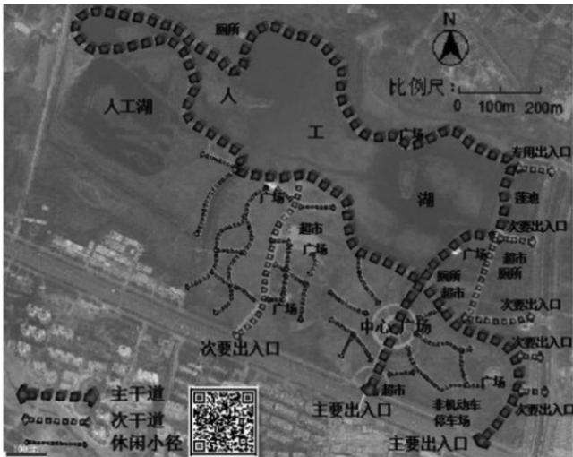
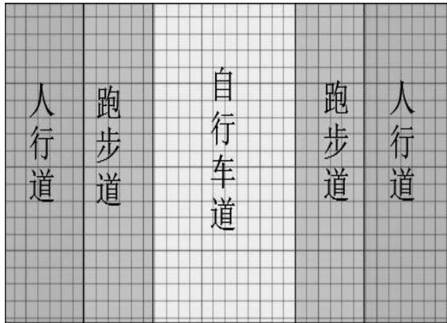
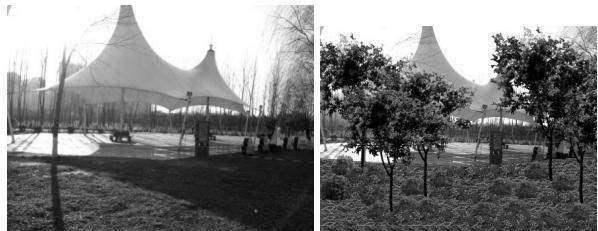

# 采煤塌陷地生态改造的综合评价与优化研究——以平顶山市白鹭洲国家城市湿地公园为例

柴佳佳 郭志永

（河南大学，河南 开封 475000）

摘 要：煤炭资源在人类生产和发展的过程中发挥着重要作用，但煤炭经大规模开采后，出现的采煤塌陷地造成了大量土地资源的浪费，给环境及人们的生产和生活带来了极大危害。随着人们对采煤塌陷地生态改造研究的不断深入，经过生态改造后的塌陷地现状引起了越来越多人的关注。本文以平顶山市白鹭洲国家城市湿地公园为研究对象，将湿地公园分为六个功能分区，对其进行改造现状评价。依据人居环境理论等理论，有针对性地提出优化措施，以实现生态效益、经济效益和社会效益，同时也为其他存在相似问题的湿地公园提供优化参考意见。

关键词：采煤塌陷地；生态改造；综合评价

中图分类号：X826

文献标识码：A

文章编号：1003-5168（2018）08-0118-04

# Study on Comprehensive Evaluation And optimization of Ecological Rehabilitation of Coal Mining Subsidence Land

——Pingdingshan Egret Island Country City Wetland Park as an Example

CHAI Jiajia GUO Zhiyong （Henan University，Kaifeng Henan 475000）

Abstract: Coal resources play a key role in the process of human production and development. However, after the large-scale exploitation of coal, the coal mining subsidence land has caused a lot of waste of land resources, which has brought great harm to the environment and people's production and life. With the deepening of the research on Ecological Transformation of coal mining subsidence, the present situation of the subsidence area after the ecological transformation has attracted more and more people's attention. This paper taken the National Urban Wetland Park of Pingdingshan Egret Island as the research object, divided the Wetland Park into six functional divisions, and appraised the reform status of the wetland park. According to the theory of human settlements and other theories, targeted measures were put forward to achieve sustainable development of ecological, economic and social benefits. At the same time, it also provides reference for other similar wetland parks.

Keywords: coal mining subsidence land；ecological transformation；comprehensive evaluation

## 1 研究背景

随着煤炭资源不断被开采，包括地表沉陷、矸石排放等在内的各种生态环境问题日益突出，已成为制约煤炭资源型城市社会、经济可持续发展的重要阻碍。基于此，因地制宜地治理采煤塌陷地对煤炭资源型城市的可持续

发展具有重要意义。

国外对采煤塌陷地环境整治的研究是从土地复垦研究和应用开始的。19世纪20年代，美国和德国开始土地复垦的研究和应用，到70年代复垦技术逐步成熟。19世纪中叶，“园林之父”奥姆斯特德提出“设计结合自然”的景观设计理念，主张对原有的自然状态进行最低限度的改造。1969年，美国景观建筑师麦克哈格出版《设计结合自然》一书，在该书中提出了景观生态设计理论。20世纪90年代，后工业景观设计获得迅速发展，成为一个新的景观设计领域［1］。

与国外一些发达国家相比，国内关于采煤塌陷地的研究起步较晚。改革开放以前，采煤所带来的一系列生态环境问题并未得到关注。改革开放以后，将采煤塌陷地的改造逐渐转向环境建设和生态恢复［2］。1999年至今，修订土地管理法，重视法律的作用，从制度上展开生态恢复研究。

本文拟在借鉴国内外采煤塌陷地生态景观恢复的科学理论与生态恢复模式的基础上，结合实践，对平顶山市白鹭洲国家城市湿地公园的生态改造进行评价，进而提出优化方案，使改造后的公园更加便于居民使用，并为其他相似塌陷地的生态改造提供借鉴。

## 2 平顶山市白鹭洲国家城市湿地公园生态改造现状评价

平顶山市白鹭洲国家城市湿地公园原址为平顶山市七矿的采煤塌陷地，因长年采煤，加之煤矿开采回填措施不到位，到2004年底，塌陷地面积达到266hm2。2005年1月，当地政府开始治理七矿的采煤塌陷地。

该公园是综合采煤塌陷地特有的湿地环境规划设计的环境优美供市民健身游玩，以运动健康为主题，突出休闲、生态、文化、娱乐等多种功能的城市休闲地。本文将公园大致分为六个功能区：入口集散区、观赏游览区、安静休息区、文化娱乐区、体育活动区和园务管理区（见图1）。

  
图1 平顶山市白鹭洲国家城市湿地公园功能分布图

## 2.1 入口集散区

该公园南侧紧邻城市主干道建设，设置3个出入口，包括2个非机动车出入口，1个机动车出入口。公园东侧紧邻道路，设置5个次要人行出入口，其中包括1个专用出入口，4个人行出入口。

本文以公园东南角的主要出入口为调查对象。经过问卷与实地调查可得出以下结论。①公园主要出入口设置较密集的石墩阻隔了机动车的进入，保证了游人安全。但同时，由于石墩间距过小，也给骑自行车进出公园的游人带来了不便，特别是老年人与残障人士。②虽然主要出入口处设立的公园名称立牌醒目、恰当，并设置了公园简介牌和规划效果图，便于游人熟悉公园的规划设计，但缺少公园的游览路线图。③公园的主要出入口采用欲扬先抑的设计手法，使游人对园内的景观产生遐想和期待，但弱化了主要出入口的集散功能。

## 2.2 观赏游览区

采煤塌陷地地势低，常年积水，使得土地肥力差，不适宜进行农业复垦。但是，若因地制宜，将其作为人工湿地，既解决了塌陷地复垦利用问题，又解决了水体利用问题，同时还能调节该地气候［2］。

为了使采煤塌陷地的资源得到重复利用，有效改善自然生态环境，该公园将水体合理利用作为景观生态改造的重要措施之一。该湿地公园的人工湖最浅为1m，最深为5m，平均水深2～3m，面积为105 333㎡，未设置水上娱乐项目，主要是结合公园的健康主题，美化公园的自然环境，为前来休闲运动的游人提供自然生态的美景享受。

但经过问卷与实地调查可得出：①人工湖外侧为健康步道，除在步道的转弯处及易发生危险处设置了隔离护栏或植被隔离带以保证游人安全外，其他路段均没有设置隔离护栏，一些地段的隔离带受损严重，并未及时维护修补，存在极大的安全隐患；②该功能区在植物配置的季相变化上较为单调；③许多游人携带宠物进入园中，包括一些大型犬类，对其他游人的安全造成威胁；④在人工湖的西部塌陷严重地段，即使在冬季降水量较少时，湖水水位上升即将超过防护外沿，在夏季降水量增加时湖水很有可能溢到路面。

## 2.3 体育活动区

体育活动区内的健康步道是该公园的环湖道路，全长3 000m，便于游人跑步健身或骑车锻炼。健康步道全程安装网络高清视频监控，以保障游人安全。另外，体育活动区内，位于健康步道东南角的健身器材多种多样，满足游人的不同健身需求。

但经过问卷与实地调查可得出：①由于塌陷地的地形随着时间的推移仍在变化，且园区管理人员在步道出现问题时并未及时修复，导致健康步道多处路面出现裂缝、沉陷及鼓包等现象，人行道砖松散、缺失、断裂等；②健康步道只划分了车道与人行道，不仅时常发生人车混行的现象，而且跑步锻炼的游人没有专用道，存在安全隐患。

## 2.4 文化娱乐区

为了满足不同年龄段、不同活动目的的游人使用需求，该公园在文化娱乐区设置了多个不同类型且风景宜人的活动广场。另外，文化娱乐区的休闲座椅、厕所、超市等基础设施较为齐全，便于游人使用。

文化娱乐区的部分道路和广场设置了健康知识宣传栏和倡导健康生活的标语等，引导人们形成健康的生活习惯。

但经过问卷与实地调查可得出：①文化娱乐区多为开放式与半开放式的活动广场，缺少私密空间；②文化娱乐区在植物配置中稍显单调；③健康知识宣传栏设置位置和间隔较为恰当，但形式单一，趣味性有待提高；④该公园的健康知识宣传栏内容更新的频率问题需要进一步解决。

## 2.5 安静休息区

安静休息区主要是供游人休息、交往或参与其他一些较为安静的活动，例如，太极拳、棋艺、聊天、漫步等。该区主要利用植物造景，植被主要包括合欢、银杏、紫丁香、西府海棠和木槿等，植物群落丰富，园路曲折自由，与周边景色相互呼应，使游人欣赏到不同美景，充分体现出该区的景观效果和生态效果。

但经过问卷与实地调查得出：①安静休息区缺乏凉亭和休闲座椅，无法满足游人的需求；②安静休息区出现多条人为踩踏出来的休闲小径，导致部分地块杂草丛生，植被稀疏；③安静休息区多处出现游人破坏花草树木的现象，缺少警示牌；④安静休息区虽然植物种类繁多，但是缺少植物简介牌，游人并不熟知。

经过生态改造后的采煤塌陷地，极大改善了该地区的生态环境，促进了人与自然的和谐发展，但在景观设计和后期维护等方面仍然存在不足。将上述五个功能分区的现状评价总结如下（见表1）。

表1 湿地公园现状评价表
<table><tr><td>湿地公园功能区</td><td>优点</td><td>缺点</td></tr><tr><td>入口集散区</td><td>人车分离，入口醒目</td><td>集散功能不明显，入口没有 设立专用通道，缺少游览路 线图</td></tr><tr><td>观赏游览区</td><td>湖水清澈，景色迷人</td><td>防护设施不完善，没有做到 动态规划设计，缺少提示牌 和警戒牌</td></tr><tr><td></td><td>路面平坦宽阔，供游人开展 体育活动区多种体育锻炼，环湖步道景 色宜人</td><td>路面有破损，人车混行，没有 区分出跑步道</td></tr><tr><td>文化娱乐区</td><td>广场类型多，满足游人不同 环保</td><td>的需求，设置多种多样的宣缺少私密空间，健康宣传栏 传栏，位置恰当，材质耐用更新不及时，表达方式单一</td></tr><tr><td></td><td>安静休息区样，自然美观，静谧整洁，景凉亭等，缺少保护植物警示 色宜人</td><td>园路曲折自由，植物多种多部分地段杂草丛生，无座椅、 牌，缺少植物介绍牌</td></tr></table>

## 3 平顶山市白鹭洲国家城市湿地公园生态改造优化方案

采煤塌陷地生态改造主要是通过人工湿地水质净化工程和生态改造工程建设，利用土壤、植物、微生物等协同作用，净化水体，提高物种多样性，恢复生态系统［3］。

由于塌陷地地形随着时间仍会发生变化，我们应重视湿地公园的后期维护，及时优化各个功能区的不足。本文以恢复生态学理论、城市绿地规划理论、可持续发展理论及人居环境理论为优化依据，对湿地公园提出优化方案，引导其成为生态型和综合型的湿地公园。

## 3.1 入口集散区

公园在主要出入口的设计中增加自行车通道与无障碍通道，为运动爱好者与特殊人群休闲健身提供便利。在进入大门后两侧的绿化应适当缩减，预留出集散用地，保证出入安全顺畅（见图2）。

  
图2 主要出入口效果图

公园出入口除了该公园的名称立牌和公园效果图外，还应竖立一个公园游览路线图（见图3），便于游人熟悉公园各个区域的功能和景观，并且根据自己的目的选择不同的游览路线。在路线图上增加了该湿地公园的二维码，扫码后可了解公园的详细信息。

  
图3 游览路线图

## 3.2 观赏游览区

观赏游览区在植物配置上以能适应本地区环境条件，能塑造本地区景观特色的属、种为重点。在突出常绿阔叶树景观特色的同时，注意采取多种手法增加造型、季相与色彩变化，提高植物的观赏性。塌陷地土壤呈微碱性，在选择植物时除了选择抗性强的品种外，必要时采取园林客土栽植，以保证成活率［4］。

为了增强人工湖的观赏性，同时提高对游人的安全防护，在人工湖的斜坡种植适应性强、耐修剪、耐寒的常绿低矮灌木，将灌木修剪为 ～ 高的绿篱灌木，既不影响游人观景视线，又避免游人穿越斜坡发生危险。

管理人员需及时修护破损护栏，并在易发生危险的地方设置护栏。同时，在人工湖附近的醒目位置竖立发生危险时紧急救护人员联系方式的提示牌。

管理人员需在公园的每个出入口处设立宠物管理条例的指示牌，避免宠物伤人事件的发生。

相关负责人员需要加高塌陷地段严重的人工湖西部区域的湖水防护外沿，防止湖水外溢。但要注意与其他地段协调统一，提高人工湖的观赏性。

## 3.3 体育活动区

在健康步道应划分出跑步道（见图4），协调好步行、跑步及骑车三种运动空间。

管理人员应及时修复平整塌陷严重地区，使用不易变形的铺路材料，延长道路使用寿命，节约人力、物力和财力，提高游人使用的舒适度。

  
图4 健康步道优化图

## 3.4 文化娱乐区

在规划设计该功能区时，要注重营造一些私密空间，使文化娱乐区更加富有多样性。不仅需要设置视野开阔的开放式空间供人们健身跳舞，也需要设置景色别致的私密空间供人们聊天休息。综合考虑距离游人密集区的远近、通达性及景观等因素，选择了四处较合适作为私密空间的区域［5］。

在设计该区域景观时，应丰富植物搭配，注重植物季相变化的特点，使广场一年四季都有景可赏，打造更加宜人的人居环境。在搭配植物时，应按照背景、主景、配景的组合原则种植植物，充分展示植物的自然美。依据可持续发展的原则，该区域在植物种类上需增加常绿乔木：广玉兰、石楠、枇杷、桂花等；落叶乔木：银杏、碧桃、紫薇、五角枫等；常绿灌木：凤尾柏、金叶女贞、栀子等；观光花卉：鸢尾、芍药、月季等（见图5）。

在设计健康知识宣传栏时，应图文并茂，以满足各个不同年龄段的需求。在宣传健康知识时可以附加二维码，扫码后即可了解某种健康知识的详情。另外，健康测试也颇受欢迎，在设计宣传栏时可增加一些趣味小测试。

  
图5 文化娱乐区活动广场绿化对比图

该公园的宣传栏应实现一季度更新一次，并根据流行病高发期、四季变化及游客量等多种因素灵活增加更新频率。

## 3.5 安静休息区

为满足该功能区的游人需求，将休闲座椅设置在不影响道路通行且景色优美的休闲小径，将凉亭设置在不影响交通与其他构筑物且通达性较好、景色宜人的空地。

在功能区的大片草坪、密集植物群及游人密集的地段设置提示牌，提高游人爱护花草树木的意识。为各种不同的花草树木悬挂介绍牌，使游人更好地了解不同植物的名称、生长习性等。

该功能区的部分地段杂草丛生，人迹罕至，管理人员应加强绿化，为游人提供更加舒适的休息环境。

## 4 结语

通过对平顶山市白鹭洲国家城市湿地公园的生态改造评价，得出其存在入口缺少游览路线图，健康步道人车混行等问题。依据人居环境理论和可持续发展等理论，有针对性地提出增加游览路线图，划分出跑步道等优化措施。塌陷地的生态改造不是一蹴而就的，其后期需要根据游人使用后的满意度调查等及时优化，切实满足人们的休闲、娱乐和健身等需求，切实改善人居生态环境，维持采煤塌陷地生态系统的稳定。

## 参考文献：

［1］王向荣，任京燕.从工业废弃地到绿色公园：景观设计与工业废弃地的史新［J］.中国园林，2003（3）：11-18.

［2］李宝军.采煤塌陷区的生态恢复研究进展［J］.应用科技，2014（18）：75.

［3］步高翔，鹿丙全.采煤塌陷地分类治理措施及运用［J］.科技推广及应用，2017（9）：30-31.

［4］张慧，高峰.基于循环经济理论的山东省采煤塌陷地生态修复研究［J］.区域经济，2017（15）：185-187.

［5］曾晓华.唐山市南部采煤塌陷区景观治理［J］.园林技艺，2014（11）：53-55.