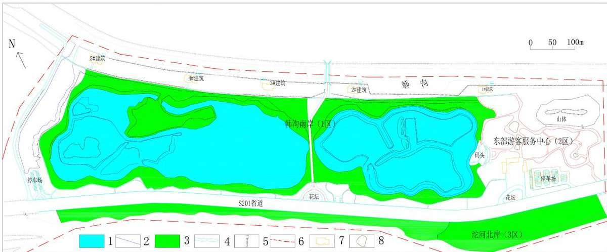
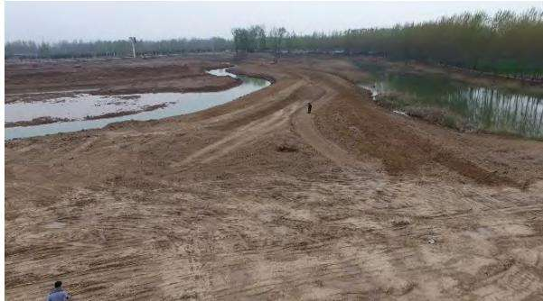
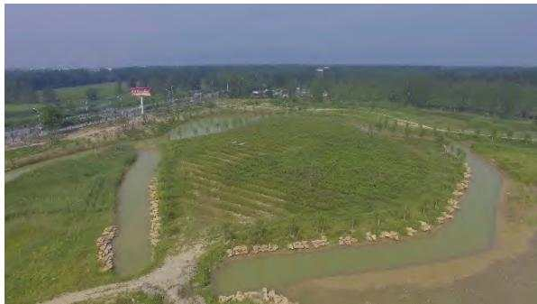
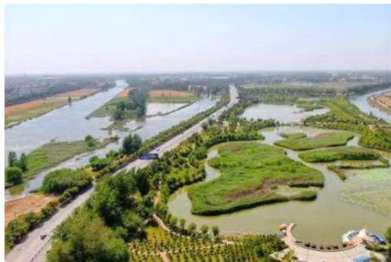

生态地质

# 采煤沉陷区生态修复技术探讨—以永城市某湿地公园项目为例❶

许来慧1 崔承洋 2 王春光 1 顾金钊 1

1 中化地质矿山总局河南地质局，河南 郑州 450003  
2 华北水利水电大学，河南 郑州 450046

摘 要 针对永城矿区平原地区塌陷区的特点及区域的特殊地理位置，采用传统复垦、生态修复、景观改造、农业种植、渔业养殖等基于自然的解决方案，将传统的注重经济效益开发转向兼顾人口、社会、经济、环境和资源可持续发展的注重复合生态整体效益的发展模式，形成集综合利用、蓄水防洪、生态环保等于一体的采煤沉陷区治理的“永煤模式”，取得了显著成效。研究成果可为采煤沉陷区综合治理与利用提供技术借鉴和实践应用参考。

关键词 生态修复 采煤沉陷区 永煤模式

中图分类号：TD99 文献标识码：A 文章编号：1006–5296（2023）03–0244–06

采煤沉陷区是指煤炭开采形成的采空区扩大到一定范围后，岩层移动发展到地表，使地表产生沉陷的区域[1]。采煤沉陷区生态修复治理在学术界不仅是热门话题，也是一个普遍难题[2]，常用治理方法有挖深垫浅法、划方整平法、泥浆吹填法、生态治理法、预复垦法、充填整平法等[3]，治理后能达到景观再造的效果[4]。

永城市位于河南省东部，东临安徽淮北，境内煤炭资源丰富，是一个新兴的能源基地[5]。近年来，永城坚持“山水林田湖草沙是一个生命共同体”的理念，通过治矿、建湖、增绿、护田等手段，积极构建工作运行模式和管理机制，全方位、多角度推进生态保护修复工作[6]。

本文结合永城矿区的采煤沉陷特点和生态修复治理模式，介绍了该生态修复模式的治理成效，以期为永城矿区乃至全国的采煤沉陷区治理提供参考与建议。

## 1 采煤沉陷区存在的问题

## 1.1 沉陷区概况

永城矿区南北长55km，东西宽 25km；煤炭地质储量 2.56×109t，均为优质无烟煤。矿区煤层开采 1～2个月即波及地表，沉降速度快，沉陷幅度大且不均匀，平均沉陷深度为 2.6m左右，平均沉陷率为 5533.33m2/104t。

矿区土地约 70%属耕地，易积水形成湖泊，耕地破坏面积大，沉陷区盐渍化趋势加重。矿区内村庄密集，村庄密度 5 个/km2，人口密度达到1067 人/km2，人均耕地不足 666.66m2。

永城矿区自1998 年形成采煤沉陷区以来，截至目前沉陷区已涉及永城市 11 个乡镇，67 个行政村，262 个自然村，塌陷面积约50km2，涉及人口约 9.6×104 人，每年新增 15～20 个塌陷村庄。

## 1.2 采煤沉陷的危害

永城矿区位于黄淮冲积平原，表土覆盖层厚，地下水位浅，煤层开采后采动影响快、沉陷系数大、水淹面积大，造成土地盐碱化，土地复垦费用高。加上沉陷区坡地拉伸变形严重，地表产生裂缝和塌陷坑，台阶较多，影响农民人身安全及牲畜安全，机械耕作更为困难，旱季无法浇灌，导致农作物大幅减产甚至绝收[7]。

## 2 采用的生态修复方案

## 2.1 治理思路

本技术方案的治理思路是通过构建“湿地公园”与沱河相沟通来治理矿山地质环境问题，同时实现湿地景观旅游与多用途用地等，既还当地居民一片青山绿水，又实现资源枯竭区的产业转型，以旅游带动多种产业的配套、协调发展。

此项目地处永城西城区北部，沱河及韩沟上游，可成为其净化水源、涵养湿地的区域环境节点；同时项目毗邻日月湖生态景区，作为外围生态环境的扩充，建立循环生态之间的有机联系，带动本区域社会经济的整体提升。

项目对研究区内存在的矿山地质环境问题进行治理恢复，主要采用人工河道工程、土地平整、道路工程及生物工程等手段进行塌陷区治理，改善研究区生态地质环境，建成沱河湿地公园。

## 2.2 生态修复方案

生态恢复治理的核心是进行正确的生态恢复治理分区[8]。本项目研究区分为 3 个功能区：湿地观光区、滨河游览区和游客服务中心，治理工程布置见图 1。依据“永城市西城区北部城市规划区矿山地质环境恢复治理工程”建设需要，对研究区“湿地观光区、滨河游览区和游客服务中心”三个功能区，按照“挖深垫浅”、“护坡加固”和“生态造景”的总体治理思路进行综合治理。针对 50km2 的沉陷区、一定面积的沉陷区外延，根据其分布特征，采取串并联方式形成滨河游览区和湿地观光区，主要治理工程为：人工观光河道、护坡、土地平整、道路、生物工程以及标志碑，可概括为“一湖多道路联，平整绿化多景点”。

  
1-人工观光河道工程（湿地观光区）；2-护坡工程；3-土地平整工程（滨河游览区）；4-道路台阶工程；5-护堤；6-研究区；7-拟建建筑；8-景观绿化分区  
图 1 治理总体工程布置示意图  
Fig.1 Layout schematic map of overall management project

对研究区中部（即湿地观光区）合理地布置挖填区域，保证挖方量与填方量大致持平。对研究区塌陷较深的区域实施开挖工程，建成人工观光河道，与现有湿地相结合，设计不同形状的河道，营造自然湿地景观体系，并对湖岸进行叠石、人工河道进行杉木桩护坡。在河、沟之间布设道路工程，连接三个功能区、联系研究区各个景点，方便游客旅游观光。对研究区垃圾进行外运，并进行土地平整，提升土地质量，并布置生物及湿地景观工程，种植景观树、湿地植物等，美化景点、提升旅游景点品质。

总体来说，通过工程治理，建设一个具有地域性、文化性、时代性的特色景观，与其东南部的“日月湖景观”相映成辉，形成“城在林中，道在绿中，人在景中”的湿地景观系统。

## 2.2.1 人工观光河道工程

项目治理设计人工观光河道总长 3772.75m，塌陷区、沱河及韩沟现有实测水面高水位为29.96m，低水位为 29.10m，确定人工河道常水位为 29.70m。由水文地质勘查资料可知，勘查区实测地下水位埋深 0.80～6.10m，地下水位标高28.23～28.58m，确定人工河道最低水位为 28.50m。雨季人工湖水位达到最高水位时，可通过沱河支流韩沟闸口向韩沟中排涝。

根据河道区最低和最高水位变化以及洪水期淹没范围，设计河道底高程 27.00m，河岸设计标高 30.30m。人工河道开挖的土方用于研究区土地平整区，多余土方运至东部游客中心东北部预留山体处。

整个河道区总的土方开挖工程量计算包括河岸线处的土方开挖工程量与河底区域面积的土方开挖工程量。利用CASS9.0中的方网格法土方计算，可得人工河道开挖土方量112380.0m3。

## 2.2.2 护坡工程

对现有湖岸进行叠石护坡和人工河道杉木桩护坡，一方面维护边坡的稳定性，另一方面起到美化湖岸带的作用。

## （1）现有湖岸叠石护坡

根据调查，设计湖水位常水位标高 29.7m，考虑到枯水期间湖水还可能继续下降，故变动带下线取 29.5m，丰水期湖水位可能上涨，上线则取常水位线 29.9m。依据湖水线变动的位置，在湖岸 29.5～30.0m 处进行叠石，铺设一层，铺设长度为 4159m，其中坡比1∶1坡度暂不铺设。

叠石规格大小不一，长度一般 0.9～1.1m，宽度 0.7～0.9m，厚度 0.4～0.6m，为简化计算，叠石规格大小取均值为 1.0m×0.8m×0.50m。叠石材料可选用景观黄河石。石料的长边（1.0m）沿湖横向铺设，短边（0.8m）沿湖纵向铺设，铺设时，对湖岸边坡进行基础开挖。

人工湖 1∶3湖岸护坡长度4159m，基础开挖457.34m3，回填 332.6m3，叠石量为 1634.77m3。

## （2）人工河道杉木桩护坡

依据湿地公园规划，在人工河道底部两侧采用杉木桩护坡，一方面减弱湖水对岸坡的冲刷，

另一方面增加湿地公园的自然美感。

木桩采用大小约为长 2m，直径约 10cm圆柱体杉木，围绕人工河道底边界两侧进行依次紧密布置，约需 75455 根，1184.65m3。

## 2.2.3 土地平整工程

研究区韩沟南岸（1 区）、沱河北岸（3 区）、东部游客服务中心（2 区）三个地段进行土地平整，三个区总面积为16.56hm2，地面标高为31.4～34.8m，设计土地平整工程回填高度确定分别为：韩沟南岸 32.50m、沱河北岸 32.50m、游客服务中心 35.00m。经统计三个区内需要的填方量129599.3m3，挖方 18103.6m3，平整压实土方量129599.3m3。

## 2.2.4 道路、台阶工程

## （1）道路工程设计

道路是联系湿地公园各景点的纽带，是构成园林景色的重要因素。本次在整个研究区范围内顺坡就势修建道路，连接河、沟以及游客中心等研究区各部分，形态多样。本次在湿地观光区、滨河游览区以及游客服务中心共设计道路6485.13m。

园区道路、城市支路路面采用沥青混凝土路面和 PC砖路面，满足后期景区运输通行。

## ①路面宽度

根据场地和通行需要，共设计 4 种宽度道路，分别为 5.0m、2.5m、1.8m 及 1.5m，其长分别为1852.85m、63m、3368.08m、1201.2m。

## ②路面高程

施工后，游客中心场地平均标高约 34m，其他地段标高 32m，道路修成后仍为此标高，故道路路基就势开挖，其深度与路面结构厚度一致。

## ③路面平整度

施工道路为高级路面，路面平整度要求较高，一般不大于 2cm。

## ④道路剖面结构形式

## a、沥青混凝土路面剖面结构

5.0m宽道路设计剖面结构分为六层：最下层素土夯实，密实度大于 95%；上部为碎石垫层；其上为素砼垫层；再上为乳化沥青结合层；路面采用 5cm中粗粒式及3cm细粒式沥青面层。剖面总厚度为 50cm。

## b、PC 路面剖面结构

设计 1.5～2.5m 宽道路剖面结构分为五层：

最下层素土夯实，密实度大于 95%；上部为碎石垫层；其上为素砼垫层；再上为水泥砂浆；路面采用 PC 砖。PC 砖尺寸为 250×250×50mm，断面总厚度为 33cm。

结合本项目降雨量不大、土质透水性稍好、地下水位埋深较浅的自然条件，路基经过冲击碾压后处于中湿状态以上，地下水、地表临时积水对路基、路面影响较小，结合路面厚度等因素，设计以开挖平整夯实后地面做为路基底层。

## （2）台阶工程

在湿地观光区和游客服务中心之间、省道S201与沱河北岸（南部滨河游览区）之间，因地形相差较大，故分别设计 2 处、7 处步道台阶以便游客上下行进。

台阶设计剖面结构分为五层：最下层素土夯实，密实度大于95%；上部为碎石垫层；其上为素砼垫层；再上为水泥砂浆；踏面及踢面均采用烧面花岗岩。

## 2.2.5 垃圾清运工程

对于研究区多处建筑垃圾、生活垃圾、煤矸石、粉煤灰进行外运，提升土地质量及整个景区的视觉效果。本次清运垃圾量为107420m3，分布于研究区的 9 个地方，垃圾堆放到东部游客服务中心，表层覆土 1.0m，植物绿化，需回填土方量37000m3。

## 2.2.6 生物及湿地景观工程

## （1）植物配置原则

①在湿地公园的植物选择上，将湿地系统的主要功能与植物特性、宜地性、观赏性、经济价值等因素综合起来考虑，只有这样才能发挥不同植物的优势。

②坚持“适地适树”的原则，大量应用在当地生长较好的植物种类作为骨干树种，如西府海棠、水杉、早园竹、红王子锦带等。

③通过增加植物种类的丰富度来增加生物多样性，种植能招蜂引蝶的花色艳丽的植物、能吸引鸟类的浆果类植物、便于鸟类栖息的高大植物以及为鸟类藏身的灌木丛。如朴树、早园竹、南天竹等。

④沿岸边缘带选用了优美的耐水湿植物，如垂柳、怪柳、水杉、紫薇等进行种植设计，用美学原则组织其色彩、线条、姿态等，创造出丰富的水岸之立面景色和水体空间景观构图效果，同时又能在水中产生一种动人的倒影美。

## （2）景观工程设计

根据湿地公园景观规划，设计在人工湖周边、人工河道、沱河北岸及游客游览中心进行绿化形成生物湿地景观，主要栽种乔木、灌木及水生植物等景观植被。景观树选择香樟、银杏树、榉树、黄栌、水杉等 73 树种，共51806株，种植间距为1.5～2.0m；灌木选取红叶石楠、金森女贞、花石榴、西府海棠等；在人工湖及沱河北岸种植水生植物形成湿地景观，主要选取芦苇、荷花、唐菖蒲等水生植物。草坪铺种及绿化面积 86990m2。

## 2.2.7 标志碑工程

在研究区入口处设立标志碑 1 个。标志碑由碑体与基座组成，碑体采用泰山石，碑体规格1.6m×0.3m×2.0m，基部采用二级 M10 浆砌标准砖，台阶自上至下高 0.60m、0.50m，宽 0.25m，其中 0.50m埋入地下，上部0.60m成杯形预留口与标志碑对接。标志碑刻上内容包括矿山地质环境保护标志、工程名称、工程简介、项目组织实施单位、承担单位、建碑日期等。

## 3 取得的成果与效益

## 3.1 项目实施效果

永城市沱河湿地公园项目的落地实施具有显著的减灾效益、经济效益和生态效益。既提升了永城市的城市品位，也为资源型城市生态环境修复闯出一条新路[9-10]。本项目已作为原河南省国土资源厅环境处及国土资源部地质环境司认可的煤矿塌陷区综合治理示范工程。

## （1）减灾效益分析

工程的实施有效改善了采煤沉陷区的环境，营造了湿地景观，为永城人民打造了一处旅游观光生态园区，环境效益非常显著。

## （2）经济效益分析

随着项目建设，研究区内设施标准和环境水平将大大改善，提高当地乃至河南省环境硬件整体水平，同时还可以进一步推动第三产业的发展，从而大力发展服务业，提高矿区人民生活水平。塌陷区生态旅游项目的修建拓展和开发，为发展服务业提供良机和空间。有利于增加社会就业岗位，带动下岗职工再就业，扩大服务行业的就业机会，最终带来餐饮、住宿、地方商品、劳务等诸多方面的发展，带来经济的繁荣，从而维护社会安定团结，经济效益十分显著。

## （3）生态环境效益分析

通过治理工程的实施，使矿区地质环境得到了改善、恢复，矿区居民和矿山企业的生产生活

  
a 施工前照片

环境大为改观，消除了地面塌陷、地裂缝隐患，也避免了垃圾堆积成山。

## 3.2 治理前后效果对比

治理工程实施前后对比如图2、图 3所示。

  
b 施工后照片  
图 2 施工前后对比照片

Fig.2 Contrast photos before and after construction  
  
图 3 治理后整体俯视图  
Fig.3 Overall view after treatment

点带面扩大示范辐射范围，引领和带动周边企业持续助力乡村振兴和地方经济发展，实现生态效益、经济效益和社会效益多赢。多措并举，综合治理。永城矿区在采煤沉陷区治理中，根据平原地区塌陷区的特点，采用传统复垦、生态修复、景观改造、渔业养殖、农业种植等多种治理措施，取得了显著成效，让赖以生存的土地发挥出了最大的效能。

## 4 结论

本技术方案有效解决了沉陷区民生问题，以

因地制宜，创新模式。根据区域的特殊地理位置，将传统的注重经济效益开发转向兼顾人口、社会、经济、环境和资源可持续发展的注重复合生态整体效益的发展模式，形成集综合利用、蓄水防洪、生态环保等于一体的“永煤模式”。

## 参 考 文 献

[1]陈永春, 袁亮, 徐翀. 淮南矿区利用采煤塌陷区建设平原水库研究[J]. 煤炭学报, 2016, 41(11): 2830-2835.

[2]杨晓玉, 苏立宁. 采煤沉陷区综合治理研究综述与展望[J]. 企业科技与发展, 2019(5): 183-185.

[3]姬宗皓, 贾秋双, 张红月, 等. 济宁采煤沉陷区现状及治理措施[J]. 资源环境与工程, 2020,34(1): 71-74.

[4]刘德成, 李玉倩, 刘学贤, 等. 废弃矿山环境治理的景观再造研究-以玉田县某采石场为例[J]. 化工矿产地质, 2021,43(1): 54-58.

[5]苏凯峰. 河南永城煤炭矿区环境地质问题及防治对策[J]. 中国地质灾害与防治学报, 2014, 25(1):77-81.

[6]刘鹏飞. 绿水青山还复来：山水林田湖草共治的“永城样板”[J]. 资源导刊，2019(4):14-17.

[7]李江. 采煤沉陷区生态环境恢复与治理永煤模式的构建[J]. 能源与节能, 2022(06): 40-42+86.

[8]张建瑞. 永城煤田塌陷区矿山地质环境恢复治理方法[J]. 现代矿业, 2019, 35(3): 187-189.

[9]李国超, 刘德成, 顾杰. 采煤沉陷区生态修复治理措施初探[J]. 环境生态学，2021, 3(7): 63-67.

[10]李凤明, 丁鑫品, 孙家恺. 我国采煤沉陷区生态环境现状与治理技术发展趋势[J]. 煤矿安全, 2021, 52(11):232-239.

# Discussion on Ecological Restoration Technology in Coal Mining Subsidence Area—A Case Study of a Wetland Park,Yongcheng City

Xu Laihui1，Cui Chengyang2，Wang Chungang1，Gu Jinzhao1

1 Henan Geological Bureau of CCGMB, Zhengzhou, Henan, 450003, China

2 North China University of Water Resources and Electric Power, Zhengzhou, Henan, 450046, China Abstract

In view of the characteristics of the subsidence areas in the plain area of Yongcheng mining area and the special geographical location of the area,Traditional reclamation, ecological restoration, landscape transformation, agricultural planting, fishery breeding and other nature-based solutions are adopted to shift the traditional development mode focusing on economic benefits to a development mode focusing on the overall benefits of compound ecology taking into account the sustainable development of population, society,economy, environment and resources, a "Yongmei model" for the process of coal mining subsidence areas integrating comprehensive utilization, water storage and flood control and eco-environment protection has been formed, and remarkable results have been achieved.The research results can provide technical reference and practical reference for comprehensive process and utilization of mining subsidence area.

Key words：Ecological restoration，Coal mining subsidence area，Yongmei model