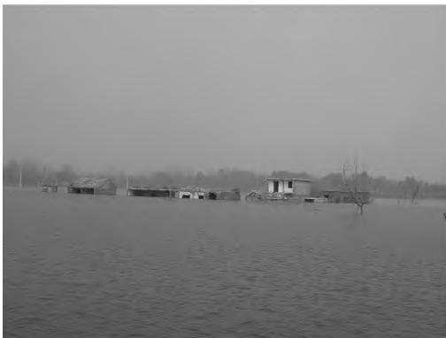
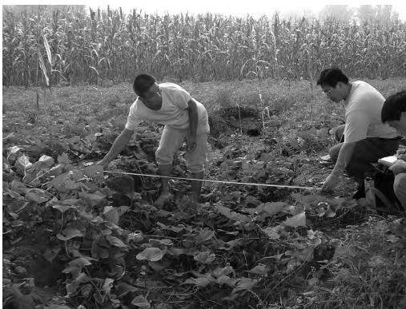
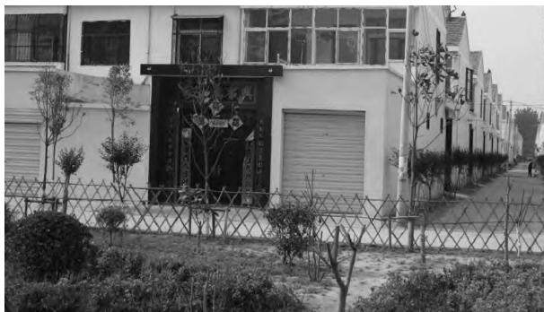
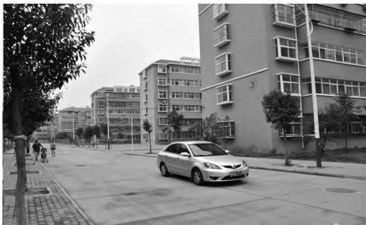
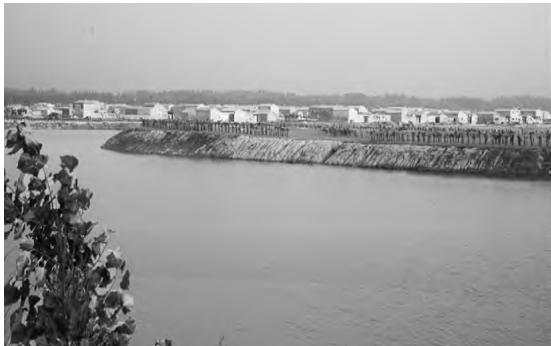
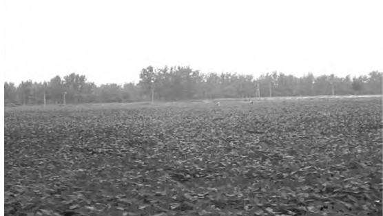
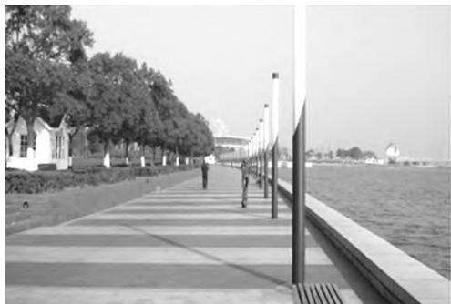
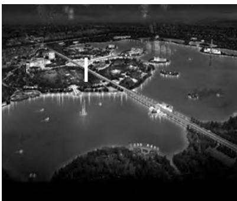

能源产业

# 采煤沉陷区生态环境恢复与治理永煤模式的构建

李 江

（河南能源化工集团永煤集团股份有限公司 河南 永城 476600）

摘 要： 针对永城矿区平原地区塌陷区的特点及区域的特殊地理位置 采用传统复垦 生态修复 景观改造 渔业养殖 农业种植等多种治理措施手段 将传统的注重经济效益开发转向兼顾人口 社会 经济 环境和资源可持续发展的注重复合生态整体效益的发展模式 形成集综合利用 蓄水防洪 生态环保等于一体的采煤沉陷区治理的“永煤模式”取得了显著成效

关键词： 永煤模式； 生态环境恢复； 土地复垦； 农业种植； 搬迁； 沉陷区治理

中图分类号： X171.4；TD8

文献标志码：

文章编号： 2095-0802-(2022)06-0040-0

# Construction of Yongmei Model for Ecological Environment Restoration and Treatment of Coal Mining Subsidence Areas

LI Jiang

(Yongcheng Coal Electricity Group Co. Ltd. Henan Energy and Chenical Group Yongcheng 476600 Henan China)

Abstract: In view of the characteristics of the subsidence areas in the plain area of Yongcheng mining area and the special geographical location of the area a variet of treatment measures such as traditional reclamation ecological restoration landscape transformation fishery breeding and agricultural planting are adopted to shift the traditional development mode focusing on economic benefits to a development mode focusing on the overall benefits of compound ecology taking into account the sustainable development of population, society, economy, environment and resources, a "Yongmei model" for the treatment of coal mining subsidence areas integrating comprehensive utilization water storage and flood control and ecological environmental protection has been formed and remarkable results have been achieved

Key words: Yongmei model; ecological environment restoration; land reclamation; agricultural planting; relocate; treatment of subsidence area

永城矿区地处黄淮平原，地势平坦，由于特殊地质条件和社会环境，随着开采量的增加，地下开和地表生态环境恢复的矛盾越来越突出，采煤村庄迁和沉陷区治理成为企业面临的一个重要问题[1]。永集团股份有限公司以矿区生态保护和改善民生为核心，从管理政策和配套制度建设出发，以生态恢复技术、绿色开发为重点，开展采煤沉陷区的综合治理，推矿区生态环境恢复治理工作。

## 1 永城沉陷区概况

## 1.1 沉陷区概况

永城矿区南北长55km，东西宽25km；煤炭地质量2.56×10t，均为优质无烟煤。矿区煤层开采1～2月即波及地表，沉降速度快，沉陷幅度大且不均匀，平沉陷深度为2.6m左右，平均沉陷率为5533.33m2/104t。矿区土地约70%属耕地，易积水形成湖泊，耕地破面积大，沉陷区盐渍化趋势加重。矿区内村庄密集，村庄密度5个/km2，人口密度达到1067人/km2，人耕地不足666.66m2。

## 1.2 采煤沉陷的危害

永城矿区位于黄淮冲积平原，表土覆盖层厚，地水位浅，煤层开采后采动影响快、沉陷系数大、水淹积大，造成土地盐碱化，土地复垦费用高[2-3]。加上陷区坡地拉伸变形严重，地表产生裂缝和陷坑，台阶多，影响农民人身安全及牲畜安全，机械耕作更为难，旱季无法浇灌，导致农作物大幅减产甚至绝收。

## 2 沉陷区治理资金筹措

沉陷区治理资金主要包括土地复垦、受损房屋搬补偿、青苗补偿、小区建设配套（水、电、桥梁、路）资金、小区建设征地资金。目前永煤集团共支付偿费用5.73×10元，用于房屋搬迁补偿、青苗理赔、区建设、生态公园建设、土地复垦。

## 3 沉陷区搬迁安置

## 3.1 管理流程

根据各矿井开采规划，确定整体搬迁村庄，制订迁计划和搬迁方案。选取安置社区地址，征得村民意，测量队进行实地测量，征地审核公示，签订征协议，办理用地手续。属地乡镇政府公开统一招投标，确定承建方。征迁办组织相关单位确定合理工程造价，组织相关部门深入施工现场进行监督，确保工程安及质量。

## 3.2 安置工程建设

采用原地搬迁安置方式，按照新农村标准重建区，沉陷区村庄地基采用了矸石回填进行基础加固，主要解决距离采煤边界300m附近的居民居住问题。2002年永城矿区首个塌陷安置示范村——练楼新村工建设，均为一层独院。2012年起采用集中搬迁安方式，建设了一批集居住、休闲、商贸为一体的高准综合性小区，新区实行统一规划、统一建设、统管理。

## 4 沉陷区生态环境恢复与治理

永城矿区自1998年形成采煤沉陷区以来，截至前沉陷区已涉及永城市11个乡镇，67个行政村，262自然村，塌陷面积约50km2，涉及人口约9.6×104人，每年新增15～20个塌陷村庄。

矿井地面塌陷积水与地裂缝如图1所示。

  
a) 地面塌陷积水

  
b) 地裂缝  
图1 矿井地面塌陷积水与地裂缝

近年来，永煤集团加大采煤沉陷区治理力度，持“绿水青山就是金山银山”的发展理念，逐步走了一条发展速度与发展质量相统一，经济效益、社效益和环境效益相统一的持续快速健康发展的道路。

## 4.1 统筹协调 加强组织领导

采煤沉陷区综合治理是一项涉及面广、涉及资量大的系统工程[7-10]，永煤集团专门成立了征迁复垦司，负责沉陷区的协调、补偿、搬迁、复垦等一系问题。

## 4.2 因地制宜 实施差别化搬迁

为加快村组搬迁进度，自2011年起，永煤集团塌陷村庄搬迁与新农村建设、城镇化建设相结合，后投资近2.7×109元，建成多个集居住、休闲、商贸一体的沉陷区综合性搬迁安置社区（见图2）。同时提高群众搬迁进入社区的积极性，永煤集团对安置内购买楼房的沉陷区群众，按350元/m2支付上楼补助。对搬迁后老村址进行复垦，使老村址的空心村、废地变成了农田，实现了新老村址的占补平衡。

  
a) 阳光小区

  
b) 民生小区  
图2 沉陷区综合性搬迁安置社区

## 4.3 提前规划 分段实施土地复垦治理恢复

按照沉陷区土地复垦优先用于农业的原则，永集团确定了以“耕地恢复为主，兼顾搬迁用地+水产殖”作为永城矿区沉陷区土地复垦的主导模式，同综合运用“挖深垫浅”“疏排法”和“矸石充填沉区”等复垦技术开展土地复垦治理工作。通过一系治理，达到动态平衡，形成“稳沉一块治理一块，付一块使用一块”的良性循环。

## 4.4 因地制宜 开展特色生态恢复

永煤集团全力配合永城市提出的“基本农田整理、采煤沉陷区复垦、生态环境修复、湿地景观开发”位一体的治理模式，针对辖区内塌陷地制定了不同治理方案，进行分类改造，对沉陷区土地进行最大率的利用，全方位建设美丽乡村。通过土地流转，展规模种养殖业，引进蔬菜、莲藕、水产等种养殖术，发展绿色种养殖业，大大增加了土地收益。适规划发展葡萄、草莓等水果采摘业，努力打造旅游光生态园区，将沉陷区治理为高科技养殖与旅游观相结合的经济生态区，实现综合治理可持续利用。时通过对沉陷区的开挖整治，形成人工岛屿、湖泊道、人文景观、生态农业等旅游休闲之地，提升城品位，也为资源型城市生态环境修复闯出一条新路[9-12]。

沉陷区治理后的鱼塘与土地复垦效果如图3所示。

a) 鱼塘  
  
b) 土地复垦效果  
图3 沉陷区治理后的鱼塘与土地复垦效果

## 4.5 种植水稻 沉陷区变成高产田

在适宜的沉陷区内开展水稻-鱼藕混合种养示范作，调整当地农业种植结构，优化当地生态环境，加农民收入。在河南省农业科学院的外协帮助下，2021年种植了3种水稻，研究人员定期观察和分析稻的生长情况，并对土肥、灌溉模式等进行调整。过种植实验，沉陷区水稻喜获丰收，经过实际产量收，亩产（1亩≈666.67m2）达到了600kg。

## 5 亮点工程

a)永煤集团利用城郊煤矿沉陷区建成了永城市月湖生态旅游景区（见图4），属于采煤沉陷区的综治理全国矿山地质环境和地质灾害治理示范工程，也是永城市创新采煤沉陷区综合治理模式而打造的端生态休闲旅游区和现代服务业集聚区。2014年永市日月湖生态旅游景区被中华人民共和国水利部评为国家水利风景区，是豫东地区一个集旅游、休闲、商务、金融于一体的生态公园，是永城未来的生态景带和第三产业集聚区，对进一步拓展城市规模、善生态环境、提高城市品味、发展生态旅游及实现济社会可持续发展，发挥巨大作用。

  
a) 日月湖观景走廊

  
b) 日月湖俯瞰夜景图  
图4 永城市日月湖生态旅游景区

b)还金湖项目。以车集煤矿沉陷区为基础，着打造以高效农业、生态旅游为一体的绿色、经济环治理项目——还金湖项目。2013年启动建设，该项治理面积约5.09km2，项目设计总资金1.285×108元，其中车集煤矿以地质环境治理保证金的方式支付资$0 . 7 5 { \times } 1 0 ^ { 8 } \overrightarrow { \mathcal { T } }$

c)沱河湿地公园项目。该项目属于永城市西城北沱滨路两侧沉陷区地质环境恢复治理项目，规划理面积1.7km2，已完成治理面积约0.4km2。通过生环境修复，将沉陷区打造为集观赏、休闲、娱乐、身于一体的综合性湿地公园。

d)水稻种植项目。为进一步提高沉陷区土地综利用率和综合效益，从2020年开始，永煤集团通过进第三方投资及技术治理，在沉陷区开展了水稻、藕种植和水产养殖技术试验，取得了良好效果。根土地平整进度及种植季节要求，2022年水稻种植面约0.253km2，水产养殖面积约0.299km2，莲藕种植积约0.138km2，其他种植面积约0.330km2。

（下转第 86 页）

体减排目标的设定，需要多方面协调统一，建议进步完善经济社会发展主要指标体系。

## 3.2 建立协同法规标准

补充现有法规，应对气候变化。现阶段要结合国传统环境问题尚未完全解决的基本国情，坚持基原则，统筹协调，分类管理，树立协同管理理念，确减污降碳的权责界限和协同管理的制度框架。将室气体管理纳入《中华人民共和国大气污染防治法》《中华人民共和国环境影响评价法》《排污许可管理例》等法律法规，为协同管理提供法律依据。

## 3.3 建立协同管理制度

着力从源头上实现协同管理，强调环境目标和候目标的双重约束，建立宏观规划落地的传导机制，强化关键排放领域的空间约束、减排降碳管理、能效率和其他方面的准入、保险要求。在规划建设项环境影响评价中引入温室气体排放评价指标，并与地大气污染控制指标相配套，同时对环境中新增污物和碳排放水平进行评价，优化污染防治和节能减的技术路径，提出减污降碳协同管控措施和应对方案。

加强对污染物和碳排放过程的管控，利用固定大气污染物治理体系与温室气体减排的整合协同效益，促进碳减排与污染防治。通过对大气污染防治过程统一管控，对减少温室气体排放产生协同效应，在有的许可体系中完善和补充资源消耗控制的要求。放许可制度中的污染防治、自行监测、核算、报告许可控制的要求也适用于温室气体，可以实施联合

（上接第 42 页）

## 6 结语

永煤集团构建的采煤沉陷区治理“永煤模式”，效解决了沉陷区民生问题，以点带面扩大示范辐射围，引领和带动周边企业持续助力乡村振兴和地方济发展，实现生态效益、经济效益和社会效益多赢。

多措并举，综合治理。永城矿区在采煤沉陷区理中，根据平原地区塌陷区的特点，采用传统复垦、生态修复、景观改造、渔业养殖、农业种植等多种理措施手段，取得了显著成效，让赖以生存的土地挥出了最大的效能。

因地制宜，创新模式。根据区域的特殊地理位置，将传统的注重经济效益开发转向兼顾人口、社会、济、环境和资源可持续发展的注重复合生态整体效的发展模式，形成集综合利用、蓄水防洪、生态环等于一体的“永煤模式”。

建设生态城市。永城作为河南省生态城市建设一个试点城市，把实施复垦工程作为生态城市建设重要组成部分，沉陷区治理成为生态城市建设的一亮丽风景线。

## 参考文献：

［1］ 姜之安.采煤塌陷区村庄搬迁工作存在问题及对策探讨［J］.矿

理。最后，逐步加强对碳减排的约束，实行污染物碳排放总量“双控”制度。

## 4 结语

大气污染物与温室气体同源，碳减排与污染防在管控思想、管理方法等方面非常一致，可统筹计划、一起推广、协同实施，共同降低成本，提高效率。外，可将现有减排体系作为碳减排的重要驱动力，碳减排措施作为长期源头减污的关键，推进减污降碳，改善资源配置，加大工作实施力度，努力提高质量效率。总而言之，在当前形势下，中国不仅要统筹进减污降碳工作，更要通过良好的联合统筹规划，现协同增效。

## 参考文献：

［1］ 欧坤良.新形势下工业园区水污染的防治问题与应对策略［J］.低碳世界 2021 11(7)：31-32.

［2］ 余广彬 张正芝 丁莹莹 碳达峰和碳中和目标下工业园区减污降碳路径探析［J］.低碳世界 2021 11(6)：68-69.

［3］ 吕一铮 田金平 陈吕军 基于人地关系的中国工业园区绿色发展思考［J］.中国环境管理 2021 13(2)：55-62.

［4］ 费伟良 李奕杰 杨铭 等 碳达峰和碳中和目标下工业园区减污降碳路径探析［J］.环境保护，2021，49(8)：61-63.

［5］ 张凤 基层环境保护工作存在的问题和对策［J］化工管理2021(9)：32-33.

［6］ 张鹂 工业园区挥发性有机物污染治理措施［J］资源节约与环保 2021(2)：77-78

（责任编辑： 高志凤）

山测量，2016，44(3)：77-79.

［2］ 张建瑞 永城煤田塌陷区矿山地质环境恢复治理方法［J］现代矿业 2019 35(3)：187-189.

［3］ 苏凯峰.河南永城煤炭矿区环境地质问题及防治对策［J］.中国地质灾害与防治学报 2014 25(1)：77-81.

［4］ 苏学武 常晓华 张绍良 等 大同矿区采煤沉陷区综合治理难点与对策［J］.中国煤炭，2021，47(9)：26-31.

［5］ 田得龙 协庄煤矿煤矸石回填治理塌陷区的环境可行性［J］煤炭技术 2020 39(4)：55-57

［6］ 胡炳南 刘祥宏 郑厚发 等 采煤沉陷区土地治理利用技术标准体系框架构建研究［J］.煤炭工程，2021，53(7)：114-118.

［7］ 李凤明 丁鑫品 孙家恺 我国采煤沉陷区生态环境现状与治理技术发展趋势［J］.煤矿安全 2021 52(11)：232-239.

［8］ 王宏 我国采煤沉陷区综合治理技术现状与展望［J］中国煤炭，2017，43(11)：116-119.

［9］ 李国超 刘德成 顾杰 采煤沉陷区生态修复治理措施初探［J］环境生态学 2021 3(7)：63-67.

［10］ 龙军 采煤沉陷区灾害综合治理技术分析［J］内蒙古煤炭经济，2021(13)：45-46.

［11］ 刘鹏飞绿水青山还复来：山水林田湖草共治的“永城样板”［J］资源导刊，2019(4)：14-17.

［12］ 李乐乐 谢慧婷.永城市日月湖“黑色”沉陷区蝶变“绿色”风景区［J］.河南水利与南水北调 2018 47(9)：106.

（责任编辑： 高志凤）