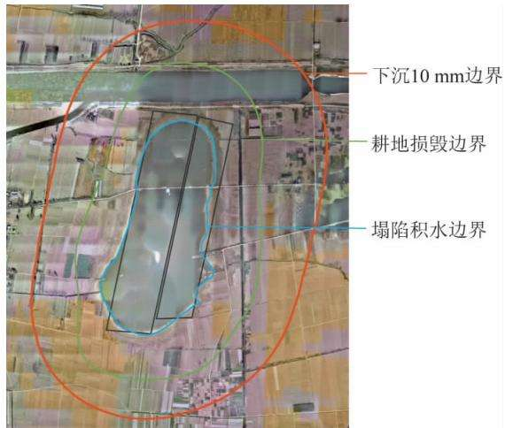
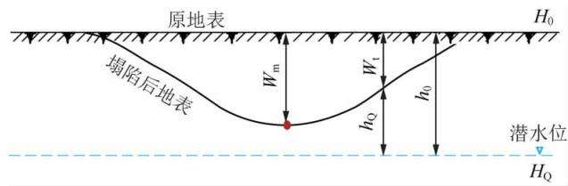
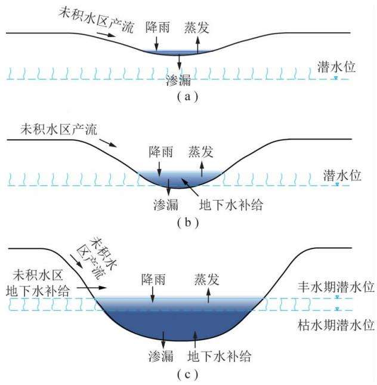
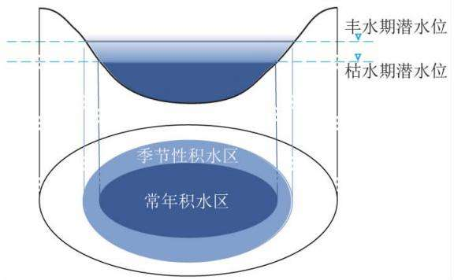
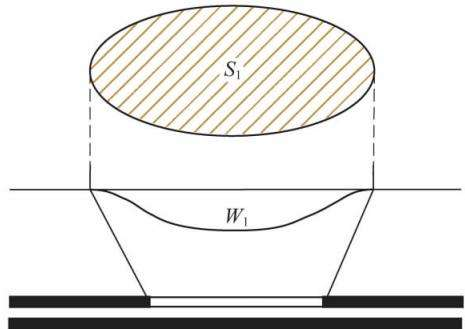
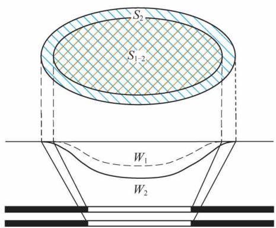
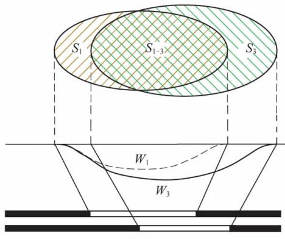
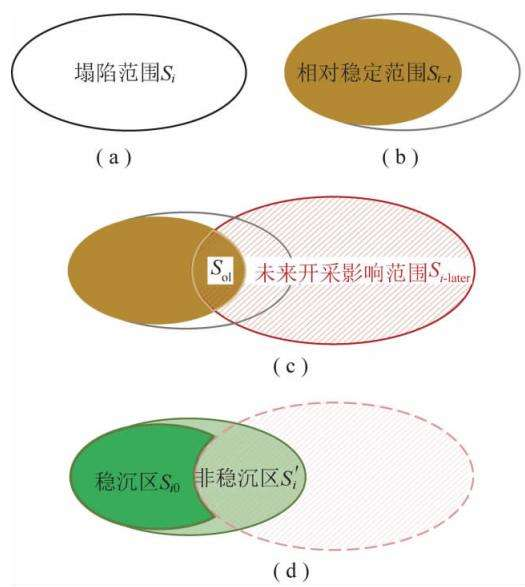

# 黄河下游平原煤矿区采煤塌陷地治理的若干基本问题研究

胡振琪1，2 袁冬竹1

( 1． 中国矿业大学( 北京) 地球科学与测绘工程学院 北京 100083; 2． 中国矿业大学 环境与测绘学院 江苏 徐州 221116)

摘 要: 黄河下游流经河南和山东两省 该区域为冲积平原地貌 既是我国的粮食主产区 也是重要的煤炭基地 平原煤矿区煤炭开采最主要的生态环境问题是采煤塌陷并严重积水 造成耕地面积减少 生态环境恶化 以黄河下游平原煤矿区采煤塌陷地为研究对象 针对治理范围 积水机理和稳沉性分析这三大采煤塌陷地治理的基础性问题进行探讨 并研究其治理措施。 研究表明: ① 采煤塌陷地治理范围是一个隐伏信息 比较难以精准确定 传统以下沉 10 mm 的沉陷边界作为治理范围往往过大 应以塌陷对建筑物和耕地的损毁边界作为采煤塌陷地治理范围对建筑物的损害边界以临界变形值: 倾斜 i=3 mm/m 水平变形 $\varepsilon { = } 2 ~ \mathrm { m m / m }$ 曲率 $K { = } 0 . 2 ~ \mathrm { m m } / \mathrm { m } ^ { 2 }$ 来确定 耕地损毁边界以对耕地生产力开始产生影响的临界下沉值 临界倾斜值 临界水平变形值的最小值来圈定 并提出耕地损毁临界变形值计算方法和治理范围圈定方法 ② 采煤塌陷地积水是平原矿区生态损毁的主要特征和优选治理技术的关键 它主要与地表下沉量 潜水位 气候 土壤结构和质地等因素有关 通过厘清塌陷后的地表与潜水位的关系 阐述了塌陷积水的机理及动态过程 并以是否积水作为土地损毁程度评价的重要标准 ③ 塌陷稳定性是治理措施和时机选择的关键 提出了基于治理阶段性和考虑未来( 周边与多煤层) 开采影响的塌陷稳定性分析方法 ④ 针对黄河下游平原煤矿区耕地损毁严重的问题 改变传统的 “末端治理理念”和 “零和博弈思维” 提出了 “采煤与耕地保护协同发展战略”和 “边采边复战略” 可有效保护和恢复耕地 实现煤炭开采与生态保护的协同发展。

关键词: 黄河流域; 平原煤矿区; 采煤塌陷地; 积水机理; 治理战略

中图分类号: TD88

文献标志码: A

文章编号: 0253－9993( 2021) 05－1392－12

# Research on several fundamental issues of coal mining subsidence control in plain coal mining area of the Lower Yellow River

HU Zhenqi1，2 ， YUAN Dongzhu1

( 1． School of Geosciences and Surveying Engineering China University of Mining and Technology ( Beijing) Beijing 100083 China; 2． School of Environment Science and Spatial Information China University of Mining and Technology Xuzhou 221116 China)

Abstract : The lower of the Yellow River Basin flows through Henan and Shandong Province ， and its landform is mainly alluvial plain． The area is not only the main grain-producing area in China but also an important coal base． The major eco-environmental problem in plain coal mining area is subsidence and serious water accumulation resulting in the de-

移动阅读

crease of cultivated land area and deterioration of the ecological environment． Taking the coal mining subsidence area in the lower Yellow River lain as the research ob ect the three basic roblems in the control of coal minin subsidence area are discussed such as the coverage of control water-ponding mechanism and stability analysis and studies on the control strategy． The research shows that: ① The control coverage of coal mining subsidence area is a hidden information which is difficult to identify accurately． The coverage is too large with the subsidence boundary of 10 mm． The damage boundary of subsidence buildings and cultivated land should be taken as the control coverage of coal mining subsidence． The damage to the building is usually determined by the critical deformation values ( i = 3 mm /m ε = 2 mm /m K= 0． 2 mm /m2) and the boundary of cultivated land damage should be delineated by the minimum of the critical vertical subsidence value the critical tilt deformation value and the critical horizontal deformation value． The calculation method of the deformation value and the delineation method of the control coverage are put forward． ② Water-ponding in coal mining subsidence area is the main characteristic of ecological damage in plain mining area and the key to optimize control technology． It is related to factors such as surface subsidence groundwater level climate soil structure texture and so on． The mechanism and dynamic process of water-ponding after subsidence is expounded by clarifying the relationship between surface and groundwater level． ③ The stability of the subsidence is the key to select control measures and timing． The method for analyzing the stability of subsidence is proposed based on the stage of control and considering the influence of surrounding and multi-seam mining． ④ Regarding the serious damage of cultivated land in coal mining areas in the lower reaches of the Yellow River the traditional “end management concept ” and “zero-sum game thinking” should be discarded． Therefore “the coordinated development strategy of coal mining and cultivated land protection ” and “concurrent mining and reclamation strategy ” are put forward which can effectively protect and restore the cultivated land and realize the coordinated development of coal mining and ecological protection．

Key words: Yellow River Basin; plain coal mining area; coal mining subsidence; water-ponding mechanism; control strategy

2019 年习近平总书记发表关于黄河流域的重要讲话 把 “黄河流域生态保护和高质量发展”上升为重大国家战略［1］ 黄河流域是我国重要的生态屏障 生态状况关系华北 东北 西北乃至全国的生态安全 黄河流域也是能源流域 其煤炭 石油 天然气资源丰富 具有突出的能源资源规模优势［2］ 尤其是煤炭资源 我国 14 个重点建设的大型煤炭基地中有 9个分布在黄河流域［3］ 。 流域生态环境保护和煤炭开采对区域的经济发展 民生发展至关重要

黄河流经9 个省区 全长 5 464 km 上中下游地形地貌 气候差异极大 资源赋存条件不一 所面临的生态环境问题也不同 流域生态环境保护与煤炭资源开采的协调发展 应当结合流域不同区段的特点及关键问题 因地制宜地提出不同举措 实现黄河流域上中下游的高质量发展

黄河下游始于河南郑州桃花峪 流经河南 山东两省 为典型冲积平原 地势平坦 土层深厚 土地肥沃 黄河下游是中国高度集约化农区和重要粮食主产区［4］ 近30 a 来对中国粮食增产贡献巨大［5］ 为确保国家粮食安全发挥了重要作用 黄河下游同时拥有国家两大煤炭基地: 河南和鲁西基地 煤炭资源丰富和优质 煤炭基础储量 161.25 亿 t 占全国基础储量的6.47% 是我国重要的能源供给基地 对保障我国南方经济快速发展地区的国民经济发挥了巨大作用 该区域广泛分布着郑州 焦作 鹤壁 平顶山 永夏 枣腾 兖州 济宁 巨野 黄河北等诸多矿区 煤矿数量众多 分布集中 开采历史较长 矿井产能大 煤层厚 开采煤层多 因此 该区域是典型的煤炭和粮食复合主产区［6－7］ 协调煤炭开采与耕地保护的矛盾十分艰巨

平原矿区煤炭开采最主要的生态环境问题是地表塌陷积水 导致大量耕地损失 生态环境恶化 尽管我国已经进行了30 多年的采煤塌陷地治理的研究和实践 取得了一定成绩［8］ 但由于采煤塌陷地数量巨大 新塌陷地不断涌现 治理理论远远落后于治理实践 大量治理的基础性难题没有得到很好的解决使得采煤塌陷地治理仍是我国矿区生态修复关注的焦点和难点

国外矿产开发多为露天开采 人地矛盾不及国内尖锐 复垦技术相对成熟 近年来 国外对矿区生态环境治理的研究主要集中在矿区土地污染治理［9－12］生态环境可持续发展［13－15］ 和新技术在复垦中的运用［16－18］ 采矿与复垦政策方面 国外也倾向于探索可持续发展的战略［19－21］ 针对矿区塌陷地或废弃地积水的问题 国外通过建立水文模型研究积水对土地的破坏机理 ［22－24］

由于平原煤矿区潜水位高 多煤层开采 塌陷地受到多次扰动 因此 塌陷稳沉性的判别 治理范围的确定 塌陷地积水的成因就至关重要 直接关系治理工程的投资 恢复耕地的数量和治理技术的选择 此外 现有的塌陷地治理都是稳沉后再治理 导致耕地恢复率低 是否需要改变这种传统的 “末端治理”理念 也需要从治理战略角度进行研究 因此 笔者围绕黄河流域下游平原区煤矿开采造成的采煤塌陷问题 深入研究采煤塌陷地治理范围 塌陷积水机理与损毁程度判别和稳沉性分析三大基础性难题 同时对平原煤矿区采煤塌陷地治理战略也进行了探讨 以期为黄河流域生态保护以及矿区采煤塌陷地治理提供科学支撑

## 1 治理范围的确定

任何生态修复工程 治理范围的确定至关重要它直接决定治理的任务和工程投资 因此 采煤塌陷地治理范围的确定是一个基础性的问题 常常被忽视。

治理是针对损毁而言的 治理范围取决于损毁边界的确定 现实中常常存在 2 种方法: ① 实地踏勘与农民协商确定 往往费力 费时 确定的都是损毁在地表显现明显的 因而确定的损毁边界往往较小② 采用开采沉陷学［25］ 中的沉陷边界作为损毁边界即将下沉10 mm 的地表移动盆地最外边界点作为治理范围 往往过大 在目前各地区的采煤塌陷地治理实践中 也常常以此为依据作为复垦责任范围或者治理范围 然而下沉 10 mm 并未对耕地产生明显影响 若按此边界作为征地 补偿边界将极大加重企业经济负担 而若按此边界进行治理方案规划设计 将增加治理工程费用 因此 采煤塌陷损毁边界一定是上述2 种边界之间的 实际上是一个隐伏的信息 难以精准确定( 图 1) 与下沉情况 土地利用 土壤 植物生长 潜水位等多种因素相关 需要深入研究

## 1.1 塌陷损毁边界的定义

采煤塌陷主要影响建筑物和耕地 对建筑物的损害范围是容易确定的 因为它有严格的标准 即常用临界变形值: 倾斜 $i = 3 \mathrm { \ m m } / \mathrm { m }$ 水平变形 $\varepsilon { = } 2 ~ \mathrm { m m / m }$ 曲率 $K { = } 0 . 2 ~ \mathrm { m m } / \mathrm { m } ^ { 2 }$ 来确定［26］ 采煤塌陷主要影响的是耕地 因此 常常用耕地损毁边界作为治理边界

为了准确合理地圈定耕地损毁范围 定义耕地损毁边界为: 由开采沉陷引起的地表移动或变形对耕地生产力开始产生影响的边界点所圈定的边界 即为耕地损毁边界。

  
图 1 治理范围示意  
Fig. 1 Sketch map of control coverage

下沉对耕地的影响主要为地表从原标高向下沉降 降低了地下水埋深 植物根系处的土壤含水量增加 容易导致根系腐烂 影响植物的生长 同时 土壤含水量增加还加剧土壤表层的蒸发 容易造成土壤盐碱化 直接影响着农作物的生长和产量［27］ 特别是地下水埋深较浅的区域 下沉量很大时容易产生季节性积水或常年积水 使耕地无法耕种或农作物减产绝产。

水平变形对耕地产生的影响主要为 水平变形使地面产生裂缝 改变了耕地的密实度 加剧水土流失程度 扰乱了原本相对稳定的土壤结构和地质环境水肥沿裂缝渗漏 流失 引起地面小气候和水 热 气肥等土壤肥力发生变化 使得土地的生产力下降 甚至丧失 影响农作物的产量 并且较大的裂缝影响了农作物的耕种及耕作［28］

倾斜对耕地的影响主要原因为地表倾斜产生的附加坡度使农作物灌溉时的流水方向和速度发生改变 导致水的渗透性 土壤的含水性及养分发生改变当倾斜方向与灌溉方向相同时 水流速度增加 土壤吸水性差 同时还会加剧土壤养分的流失 加剧土壤贫瘠 从而使作物减产 反之则灌溉速度减慢 不仅浪费水资源 还达不到灌溉的目的 除此之外 地表倾斜还容易导致水土流失 降低了土壤蓄水保墒能力 使耕地生产力下降 农作物减产［29］

综上所述 下沉 倾斜 水平变形是耕地损毁边界的主要影响因子 对耕地开始产生影响的数值称为耕地损毁临界值 对应的 3 个临界值为: 耕地损毁临界下沉值 $W _ { \mathrm { { P } } }$ 临界水平变形值 $\varepsilon _ { \mathrm { P } }$ 和临界倾斜值 $i _ { \mathrm { P } }$

## 1.2 耕地损毁范围获取方法

开采导致的地表移动变形改变地表土壤结构 含水量等理化性质 使得土壤肥力下降 从而影响耕地的生产力 通过当地耕地及土壤现状调查 分析作物生长刚开始受影响时对应的下沉 倾斜和水平变形的数值 再与该地质采矿条件下开采沉陷产生的地表变形最大值进行比较 判断是何种变形最先对耕地作物生长状况产生影响 再将相应的临界数值统一转换为下沉值 便于下一步圈定耕地损毁范围 基于此 提出耕地损毁边界获取方法

( 1) 进行现场调查 收集相关资料 根据耕地 土壤以及作物生长情况 确定耕地损毁边界值

临界下沉值 $W _ { \mathrm { P } }$ 主要取决于地面标高 潜水位标高及耕地的地下水临界深度 通常可使用式( 1) 进行估算 ［ 13］ :

$$
W _ { \mathrm { P } } = W _ { \mathrm { P F } } = H _ { \mathrm { 0 } } - H _ { \mathrm { q F } } - h _ { \mathrm { L } }\tag{1}
$$

式中 $W _ { \mathrm { P } }$ 为耕地损毁临界下沉值 m; $W _ { \mathrm { P F } }$ 为丰水期耕地损毁临界下沉值 m; $H _ { 0 }$ 为原始地表标高 m; $H _ { \mathrm { q F } }$ 为丰水期潜水位标高 m; $h _ { \mathrm { I } }$ 为土壤的地下水临界埋深 m 它与土壤 植物 潜水位等有关

临界水平变形值 $\varepsilon _ { \mathrm { P } }$ 和临界倾斜值 $i _ { \mathrm { P } }$ 可通过实测法 经验法等获取 在已知当地土体的物理性质的情况下 $\varepsilon _ { \mathrm { P } }$ 可通过式( 2) 计算 ［ 30－31］ :

$$
\varepsilon _ { \mathrm { { P } } } = { \cfrac { 2 } { E } } { \big ( } 1 - \mu ^ { 2 } { \big ) } c \tan { \bigg ( } 4 5 ^ { \circ } + { \cfrac { \varphi } { 2 } } { \bigg ) }\tag{2}
$$

式中 $\varepsilon _ { \mathrm { P } }$ 为耕地损毁临界水平变形值 mm/m; E 为弹性模量 $\mathrm { N } / \mathrm { c m } ^ { 2 } ; \mu$ 为土壤的泊松比; c 为土壤的黏聚力 ${ , } \mathrm { P a } ; \varphi$ 为内摩擦角 ( °) 。

$i _ { \mathrm { P } }$ 可通过厘清倾斜与附加坡度之间的关系来估算 下沉后地表坡度=原地表坡度±附加坡度 其中“±”表示产生坡度的方向 “+”表示与原坡度方向相同 “－”表示与原坡度方向相反［29］ 附加坡度 θ 可由经验公式求得:

$$
\theta = i ( \mathit { \Delta } x ) \mathit { \Delta } / 1 8\tag{3}
$$

式中 i( x) 为开采塌陷对耕地所 $\vec { j } ^ { \pm }$ 生的倾斜量

由此可得

$$
i _ { \mathrm { P } } = 1 8 \theta\tag{4}
$$

( 2) 为了耕地损毁边界获取简单 便于操作 可应用性 将临界水平变形 $\varepsilon _ { \mathrm { P } }$ 和临界倾斜值 $i _ { \mathrm { P } }$ 转换为相应的下沉值。 转换公式可参考式( 5) ( 6) :

$$
W _ { \varepsilon _ { \mathrm { p } } } ^ { \mathrm { } } = \frac { W _ { \mathrm { m a x } } } { \sqrt { \pi } } \int _ { - \sqrt { \ln ( \sqrt [ 3 ] { \varepsilon _ { \mathrm { P } } r / 2 / \pi } b W _ { \mathrm { m a x } } ) } } ^ { \infty } \mathrm { e } ^ { - \lambda ^ { 2 } } \mathrm { d } \lambda\tag{5}
$$

$$
W _ { i _ { \mathrm { p } } } = \frac { W _ { \mathrm { m a x } } } { \sqrt { \pi } } \int _ { - \sqrt { \ln ( \mathrm { \Omega } \sqrt [ 3 ] { i _ { \mathrm { p } } r / 2 W _ { \mathrm { m a x } } } ) } } ^ { \infty } \mathrm { e } ^ { - \lambda ^ { 2 } } \mathrm { d } \lambda\tag{6}
$$

( 3) 确定耕地损毁边界 所对应的下沉值为耕地损毁边界下沉值 用 $W _ { \mathrm { g } }$ 表示 $W _ { \mathrm { g } }$ 取 3 个临界值中最小的值:

$$
W _ { \mathrm { g } } = \operatorname* { m i n } \{ \ : W _ { \mathrm { P } } , W _ { \varepsilon _ { \mathrm { P } } } , W _ { i _ { \mathrm { p } } } \}\tag{7}
$$

( 4) 根据耕地损毁边界的下沉值 使用沉陷预计法或耕地损毁边界角法［32］ 圈定耕地损毁范围 即治理范围

## 2 平原煤矿区塌陷积水机理及损毁程度评价

黄河下游平原煤矿区矿井分布集中 煤层较厚且多为多煤层开采 在地下煤层采出后 在地表形成的地表塌陷范围广 塌陷深度深 且极易出现积水 较高的潜水位为塌陷区积水提供了涵养环境 塌陷区积水使耕地土壤长期处于水淹状态 抑制原有农作物等非水生植物的生长 造成农作物减产甚至绝产 塌陷区中部积水较深 土地更是无法继续利用 因此塌陷区积水是黄河下游平原煤矿区采煤损毁的主要特征和面临的最大问题 分析矿区地表塌陷积水的机理及其一般性规律 是对塌陷区损毁程度评价 综合治理和合理利用水资源的前提条件

地下煤层被采出后 在地下形成采空区 采空区周围岩体的应力平衡状态被破坏 应力重新分布直到再次达到平衡 在此力学变化过程中 上覆岩层发生移动和破坏 当岩层移动发展至地表 使得地表发生移动和变形 受采动影响的地表从原有标高向下沉降 最终在地表形成一个比采空区面积更大的塌陷盆地［25］ 。 后续受水文过程的影响 在塌陷盆地中出现积水 积水主要与地表下沉量 潜水位 气候 土壤结构和质地等因素有关 其中地表下沉与潜水位的关系是影响积水的关键( 图2) 地表土壤质地及结构特征和降雨是积水的客观条件

  
图 2 地表与潜水位的关系  
Fig. 2 Relationship between surface and groundwater table

图2 中 $H _ { 0 }$ 为地表原标高; $H _ { \mathrm { Q } }$ 为潜水位标高; $h _ { 0 }$ 为原始地下水埋深; $\smash { W _ { \mathrm { p } } }$ 为地表某一点的下沉值; $h _ { \mathrm { 0 } }$ 为地表某一点的地下水埋深 $W _ { \mathrm { m } }$ 为地表最大下沉值 设塌陷后地表任一点的标高为 $H _ { x }$ 与地表原标高的关系为: $H _ { x } = H _ { 0 } - W _ { \mathrm { t } }$ 与地下潜水位的关系为 $H _ { x } - H _ { 0 } = h _ { 0 }$ 即可得: $H _ { 0 } - W _ { \mathrm { t } } = H _ { \mathrm { Q } } + h _ { \mathrm { Q } }$ 。 由 于$H _ { 0 } ^ { } - H _ { \mathrm { q } } ^ { } = h _ { 0 }$ 可转化为

$$
H _ { 0 } \mathrm { ~ - ~ } H _ { \mathrm { Q } } \mathrm { ~ - ~ } W _ { \mathrm { t } } = h _ { 0 } \mathrm { ~ - ~ } W _ { \mathrm { t } } = h _ { \mathrm { Q } }\tag{8}
$$

若 $h _ { 0 } - W _ { \mathrm { t } } \geqslant 0$ 时 塌陷后的地表位于地下潜水面以上 地表不会在地下水的作用下产生积水 但是由于土壤中有许多细小的孔隙 会产生毛管现象 水分沿孔隙上升 增大潜水面上方土壤的含水率 影响作物根系生长 在保证土壤不发生盐渍化 不影响作物生长的情况下 要求潜水位埋深大于地下水临界埋深 ［ 33］ ， 即 $h _ { \mathrm { Q } } \geqslant h _ { \mathrm { L } }$ 即可得

$$
h _ { 0 } \mathrm { ~ - ~ } W _ { \mathrm { { t } } } \geqslant h _ { \mathrm { { L } } }\tag{9}
$$

其中 $h _ { 0 }$ 为原始地下水埋深 取决于原始地形和潜水位标高; $h _ { \mathrm { L } }$ 为地下水临界深度 主要受气候( 降水和蒸发) 土壤结构和质地 地下水矿化度 植被覆盖情况等自然条件和农业生产条件的影响［34］ 通常可使用土壤毛管水上升高度来计算地下水临界深度［35］ :

$$
h _ { \mathrm { L } } = h _ { \mathrm { r } } + \Delta\tag{10}
$$

式中 $\mathbf { \nabla } _ { , h _ { \mathrm { r } } }$ 为毛管水上升高度 m; Δ 为安全超高 即作物根系活动层厚度

若 $h _ { 0 } - W _ { \mathrm { { t } } } < 0$ 时 则表示塌陷后的地表位于潜水面以下 地下水会对地表进行补给

$\mathbb { W } _ { \mathrm { t } }$ 为地表塌陷的表征 是随时间动态变化的由于地表的下沉是一个缓慢的动态过程 因此塌陷盆地积水也呈现动态规律 塌陷区积水过程分析 就是要厘清塌陷后的地表与地下潜水位的动态位置关系重点在于分析 $\mathbb { W } _ { \mathrm { t } }$ 和 $h _ { 0 }$ 的关系

( 1) 当地面刚开始出现下沉 下沉值远小于原始潜水位埋深 即 $\textstyle \mathbb { W } _ { \mathrm { t } } < h _ { 0 }$ 如图 3( a) 所示 。

地表产生小幅度的附加坡度 但是地表距离地下潜水位还有一定距离 地面塌陷对地下水位无影响此时不会出现积水 当区域发生降雨 塌陷区的水文过程表现为降雨对塌陷地表进行直接补给 少部分降雨在附加坡度的影响下向塌陷坑中心汇入 坑底开始出现积水 另一方面 塌陷坑内积水一定程度上向下渗漏 对地下水进行补给 下渗速度及水量取决于土壤性质 若积水在经过较短时间的蒸发和下渗作用后排泄完毕 地表将不会出现积水; 若积水时间超过作物的耐淹能力( 一般为1～20 d 视作物及其生长期而定) ［36］ 作物将受涝减产 这种情况的积水可作为积水损伤的临界积水标高 也可视为季节性积水 这种积水的主要原因是降雨量大 土壤质地较黏 下渗慢。

( 2) 当地面下沉到最大下沉值超过潜水面， 即$W _ { \mathrm { t } } { > } h _ { 0 }$ 如图 3( b) 所示

此时地下水水头压力高于塌陷坑底部 浅层地下水在重力作用下 沿着潜水面坡度最大的方向流动地下水由地下径流开始转为侧向补给 塌陷坑成为地下水的排泄区 潜水出露地表 地表出现积水 地下水补给量取决于含水层的岩性 厚度 结构 导水性和富水性等［37］ 。 当区域发生降雨 塌陷坑坡度增大 更容易形成地表径流 向塌陷坑底部汇入 增加了塌陷区的水量 将在塌陷区形成长时间积水 即常年积水

  
图 3 塌陷区积水过程  
Fig. 3 Water-ponding process in subsidence area

( 3) 当地下煤层开采完 地面塌陷达到最终状态时 ， $W _ { \mathrm { t } } { \gg } h _ { 0 }$ 如图 3( c) 所示 。

黄河流域下游平原区煤层较厚 且存在多煤层开采 在地表形成的塌陷深度较深 往往达到 4～10 m甚至10 m 以上 平原区潜水位埋深较浅 通常在2～4 m 一些区域甚至在2 m 以下 因此 塌陷坑内的积水将达到数米以上 此时 塌陷区积水的补给为水面降雨 地下水竖向补给 地下水侧向补给和未积水区产流 塌陷区积水的排泄为蒸发和渗漏

塌陷区积水水位和地下潜水位的水位差是积水和地下水相互转化的驱动因素［38］ 冬季枯水期 地下水位有所下降 塌陷区积水水位高于地下水位 积水向地下水进行补给 积水区水位相对下降 夏季降雨较多 进入丰水期 浅层地下水水位上涨 地下水对塌陷区积水进行补给 积水区水位相对抬高 积水区水位的季节性变化 使得积水区的水量和积水面积发生变化 枯水期的积水区域为常年积水区 丰水期较枯水期多的积水区域称为季节性积水区 如图 4 所示 常年积水区积水较深 土地完全被水淹没 无法耕种 季节性积水区在丰水期积水较浅 但农作物长期处于水淹的影响下 造成减产或绝产 土壤养分在坡度的影响下随着地表径流向塌陷区底部汇集［39］枯水期不再积水 表层土壤含水率逐渐下降 但土壤质地改变 土壤中有机碳 全氮等含量减小 耕地质量下降 即使恢复耕种 产量也将有所下降

  
图 4 与潜水位有关的季节性积水区和常年积水区  
Fig. 4 Seasonal and permanent water-ponding related to groundwater table

对损毁土地进行损毁程度评价是采煤塌陷地治理工作中至关重要的环节［40－41］ 根据前述分析 塌陷区积水是黄河下游平原煤矿区耕地损毁的重要因素 因此 在进行区域性采煤塌陷地治理时 可将是否积水作为损毁程度评价的主要标准 不出现积水的区域 土地损毁形式为下沉 下沉值较小 地面破坏较小或者无破坏 为轻度损毁 出现季节性积水的区域下沉值较大 丰水期积水 造成农作物减产 或者土地无法耕种 枯水期耕地可继续耕种 但产量有所下降为中度损毁 出现常年积水的区域 地面完全被积水淹没 破坏严重 为重度损毁

以山东省采煤塌陷地综合治理专项规划为例 在损毁程度评价时 结合山东省平原区丰水期和枯水期的浅层地下水等水位线 划分各行政区差异化的评价标准 见表1 德州市和济南市的矿区由于距离黄河较近 周边地下水水位极高 塌陷 0.6 m 即出现季节性性积水 标准与其他地市差别较大 济宁市由于矿井分布较多 各区域潜水位不同 导致地面积水情况不一 因此济宁市共划分了3 个不同的标准

表 1 山东省平原区采煤塌陷地损毁程度评价标准  
Table 1 Evaluation standard for land damage of coal mining subsidence in plain area of Shandong Province m
<table><tr><td>行政区域</td><td>轻度损毁</td><td>中度损毁</td><td>重度损毁</td></tr><tr><td>济南市</td><td>0.1~0.6</td><td>0.6~1.5</td><td>&gt;1.5</td></tr><tr><td>枣庄市</td><td>0.3~1.0</td><td>1.0~3.0</td><td>&gt;3.0</td></tr><tr><td rowspan="3">济宁市</td><td>0.3~1.0</td><td>1.0~3.0</td><td>&gt;3.0</td></tr><tr><td>0.3~1.5</td><td>1.5~3.5</td><td>&gt;3.5</td></tr><tr><td>0.1~0.8</td><td>0.8~3.5</td><td>&gt;3.5</td></tr><tr><td>德州市</td><td>0.3~0.6</td><td>0.6~0.8</td><td>&gt;0.8</td></tr><tr><td rowspan="2">菏泽市</td><td>0.3~1.5</td><td>1.5~3.0</td><td>&gt;3.0</td></tr><tr><td>0.2~1.0</td><td>1.0~2.5</td><td>&gt;2.5</td></tr></table>

## 3 塌陷稳定性分析

地下煤层的采出会引起地表发生移动变形最终形成稳定的塌陷盆地 这一过程是渐进且相对缓慢的 在进行采煤塌陷地治理规划时 治理区域的稳定性决定了治理的时机以及技术的选择 近年来 全国多地出台的采煤塌陷地治理规划中开始划分稳沉塌陷地和未稳沉塌陷地分别安排治理任务 因此 在采煤塌陷地治理前 有必要进行科学的稳定性分析

## 3.1 采煤塌陷地沉陷稳定过程

采煤塌陷地是随着地下工作面的推进过程逐渐形成的 已有众多文献分析了地表动态下沉的变化特点和规律［42－44］ 通常将下沉盆地任一点的地表移动过程分为 3 个阶段: 开始阶段 活跃阶段和衰退阶段 开始阶段从地表下沉值达到 10 mm时起 到下沉速度小于 50 mm/月止 活跃阶段为下沉速度大于 50 mm/月的一段时间; 衰退阶段从活跃期结束时开始 到 6 个月内下沉值不超过30 mm 为止 在此基础上 将采煤塌陷地从形成到逐渐稳定的过程划分为下沉发展阶段 下沉充分阶段和下沉衰减阶段［45］ 。

( 1) 下沉发展阶段 一般情况下 当工作面推进到一定距离后 地表才开始出现下沉 这个距离称为启动距 为平均开采深度的 1/4～1/2 其后 随着工作面的继续推进 地表塌陷盆地的面积不断增大 下沉量和下沉速度也逐渐增大 这一阶段持续到工作面的开采达到充分采动

( 2) 下沉充分阶段 当工作面推进距离达到平均采深的1.2～1. 4 倍时 达到充分采动 地表塌陷盆地的发展开始进入下沉充分阶段 本阶段 最大下沉值不再增加 最大下沉速度点的位置滞后于工作面某一固定距离 随着工作面的推进 塌陷盆地沿工作面推进方向扩大

( 3) 下沉衰减阶段 当工作面停采后 塌陷盆地沿工作面推进方向扩大速度减慢 最大下沉速度迅速衰减 直至达到稳定状态

由于开采引起的地表移动变形是一个缓慢的过程 分析稳定性时不仅要考虑移动过程稳定后的终止状态 还必须考虑地表移动变形随时间的发展过程 ［ 46］ 。

地表移动持续时间是指在充分或接近充分采动的情况下 下沉值为最大的地表点从移动开始至移动稳定所持续的时间 影响地表移动持续时间的因素主要是岩石的物理力学性质 开采深度和工作面推进的速度［47］ 在其他条件相同的情况下 开采深度与移动持续时间之间的关系比较稳定 即深度越大移动总时间越长 因此地表移动的持续时间( t) 可根据下式计算:

$$
t = 2 . 5 H\tag{12}
$$

其中 $T$ 为地表移动的持续时间 d; $H$ 为工作面平均采深 $, \textrm { m } _ { \langle }$ 。

另一方面 由于黄河下游平原煤矿区煤炭分布较为集中 存在多煤层重复开采 且煤层较厚 部分矿区采用分层开采 时间间隔在 1 a 或数年不等 前期已经形成的塌陷地 还可能受到后续重复开采或者周边工作面或者采区开采的影响

如图 5 所示 $W _ { 1 }$ 为第 1 阶段开采造成的塌陷地 塌陷总面积为 $S _ { 1 \circ }$ 若该区域存在多煤层重复开采 当后续开采下层煤后 地面塌陷发展为 $\mathbb { W } _ { 2 }$ 塌陷总面积为 $S _ { 2 }$ 重复阴影面积为 $S _ { 1 - 2 }$ 如图 5( b) 所示此时 地面的变化更多的表现为塌陷深度增加 塌陷面积变化不大 则 $S _ { 1 }$ 区域均为不稳定区 在本阶段可不进行治理或考虑未来塌陷量采取合适的措施进行超前治理 若该区域周边工作面继续开采地面塌陷发展为 $\mathbb { W } _ { 3 }$ ，塌陷总面积为 $S _ { 3 }$ ，如图 $5 ( \mathrm { ~ c } )$ 所示 此时 地面的变化表现为塌陷面积扩大 塌陷深度变化不大 $S _ { 1 }$ 与 $S _ { 3 }$ 有重叠 面积为 $S _ { 1 - 3 }$ 表示该区域会受下一阶段开采影响 则 $S _ { 1 }$ 区域在本阶段的各部分治理分析如下: $S _ { 1 - 3 }$ 为不稳定区 可不进行治理或考虑未来塌陷量采取超前治理措施进行治理 $S _ { 1 }$ 中扣除重叠部分( 即 $S _ { 1 } { - } S _ { 1 - 3 } )$ 为稳定区可直接进行治理

  
(a)

  
(b)

  
图 5 地下煤层开采相互影响关系  
Fig. 5 Interaction of underground coal mining

## 3.2 采煤塌陷地治理稳定性分区的方法

在采煤塌陷地治理规划中 安排各个阶段的治理任务时 需要划分稳沉区和非稳沉区 有针对性地规划各区的治理目标和治理工程 目前 全国以及各省出台的治理规划通常要求各个治理阶段内稳沉塌陷地基本治理完毕 新增塌陷地达到同步治理 。

对于稳沉区 地表移动变形过程已经稳定 且不再受未来开采的影响 要实现全面治理 可根据损毁程度评价结果 进行土地适宜性分析 合理规划分区 直接采取工程措施对范围内的塌陷地进行治理。

对于非稳沉区 地表移动变形过程尚未稳定或已经相对稳定但还会受未来开采影响 要实现同步治理 可利用边采边复理念及技术 基于沉陷预计结果 选择合适的治理时机 合理安排治理工程及时序 使已经塌陷的土地恢复到可供利用状态并降低未来开采对其造成的影响 以达到理想的治理效果

为了在采煤塌陷地治理过程中更为方便地根据塌陷地稳定性安排治理任务 笔者基于治理阶段性 提出一种考虑地表动态变化及未来开采影响的稳定性分区的方法

( 1) 通过塌陷现状分析 确定规划基期的塌陷范围; 或者以塌陷现状及预测分析 确定某一规划阶段的塌陷范围 如图 $6 ( \mathrm { ~ a } )$ 所示。

规划阶段的塌陷面积用 $S _ { i }$ 表示 即: 截止到i 年已经在地面形成的塌陷地面积( 或预测得出的 i 年以前开采的工作面导致的塌陷总面积) 其中 i 为规划或者规划阶段开始的年份

( 2) 以工作面或者采区为单元 通过式( 6) 估算

各单元的地表移动持续时间 t

  
图 6 稳定性分区方法  
Fig. 6 Method of stability zoning

( 3) 根据矿山开采接续计划 选取各单元中( i－t) 年以前开采的工作面进行沉陷预计 得出的沉陷范围 即为截止到 i 年 已经相对稳定的塌陷地范围 面积为 $\mathrm { S } _ { i - t }$ 如图 6( b) 所示

( 4) 根据矿山提供的未来开采接续计划 选取 i年及以后将要开采的工作面 通过沉陷预计 圈定未来开采影响范围 面积用 $S _ { i - \mathrm { l a t e r } }$ 表示 如图6( c) 所示

( 5) 在该阶段的相对稳定范围 $S _ { i - t }$ 中去除与未来开采影响范围 $S _ { i - \mathrm { l a t e r } }$ 重叠部分 $S _ { \mathrm { o l } }$ 得到最终的已稳定且不再受未来开采影响的范围 即该阶段的稳沉区 $S _ { i 0 }$ 则 $S _ { i 0 } { = } S _ { i - t } { - } ( \ S _ { i - t } \cap S _ { i - \mathrm { l a t e r } } )$ 该阶段非稳沉区的面积 $S _ { i } { \mathrm { { = } } } S _ { i } { \mathrm { { - } } } S _ { i 0 }$ 如图 6( d) 所示

通过上述方法 可明确采煤塌陷地治理规划中各阶段的稳沉区面积和非稳沉区面积 便于进行分区治理 以 《山东省采煤塌陷地综合治理专项规划2019—2030 年 》为例 规划提出中期治理目标: 到2025 年 完成100%+30%的治理目标 即已稳沉塌陷地治理率达到100% 未稳沉塌陷地同步治理率达到30% 据测算 到2025 年 山东省采煤塌陷地总面积超过 9 万余 $\mathrm { h m } ^ { 2 }$ ( 包含已治理面积) 稳沉面积$7 8 \ 0 8 1 \ \mathrm { h m } ^ { 2 }$ 中期治理任务 $3 0 \ 3 9 4 \ \mathrm { h m } ^ { 2 }$ 治理已稳沉面积 $3 \ 7 7 3 \ \mathrm { h m } ^ { 2 }$ 治理未稳沉面积 $4 ~ 2 4 5 . 4 2 ~ \mathrm { h m } ^ { 2 }$ 可基本达到 $\mathrm { \ddot { 1 0 0 } } \% + 3 0 \% \mathrm { \ddot { } }$ 的目标。

## 4 黄河下游采煤塌陷区治理战略

黄河下游平原区作为典型的煤粮复合区 承担着国家粮食保障和煤炭资源供给的双重职责 当 2 者发生冲突时 是选择地上的 “粮” 还是选择地下的“煤” 是黄河下游平原煤矿区亟待解决的重大现实问题 此外 传统的采煤塌陷地治理方法是 “先塌陷 再治理” 治理需要等待的时间长 耕地恢复率低 生态环境恶化 导致 “旧账未还 又欠新账” 因此 必须要从理念和战略上探索新途径

## 4.1 采煤与耕地保护协同发展战略

黄河下游平原区 “煤”和 “粮”的关系 在过去其实是一种 “零和博弈”关系 要开采煤炭必将造成耕地的损失 要完全保护耕地就要限制或禁止煤炭的开采 这样的结果就是既无法实现煤粮复合区整体的利益最大化 也无法实现煤炭资源和耕地资源各自的最大效益 因此 需要改变 “零和博弈 思维 积极推动实现 “双赢机制” 即: 在保证煤炭开采的同时 尽可能地保护耕地 在煤炭与粮食之间寻找一个最优的平衡点 实现采煤与耕地保护的协同发展

“协调”是国家的五大发展理念之一 煤炭与粮食协调发展正是践行 “协调”发展理念的重要任务协同发展战略的首要任务是正确理解平原煤矿区的耕地损失问题 黄河下游平原煤矿区由于其地质采矿特点 已经不可避免地对耕地造成损毁 在明确损毁耕地已经不可能 100%全面恢复的情况下 应该面对现实 积极采取行动去处理 尤其是化害为利 将塌陷水域建设成鱼塘或湿地 增加土地利用类型的多样性和改善区域生态环境 首先需要摸清家底 科学地判断损毁耕地的真实数量以及耕地利用效率 有助于加强对采煤塌陷地治理的监管以及耕地生产潜力的提升 逐步完善耕地报损核减制度可以真实客观地反映采煤塌陷区耕地数量 耕地利用情况 及时变更采煤塌陷区耕地流转数量 从根本上缓解地方政府保护耕地的压力［48］ 在客观对待部分耕地损失的情况下 应要求矿山采取积极的 超前动态的修复治理措施 尽最大可能地恢复耕地 使恢复耕地率最大 同时 针对已经或可能严重损毁并积水的耕地 在进行治理规划时 应当优化水陆布局［49］ 改善塌陷区空间结构 协调水陆两相生态系统 在复垦耕地的同时 合理构造人工湿地 提高区域生物多样性 实现区域生态平衡

## 4.2 边采边复战略

传统的采煤塌陷地治理都是 “末端治理” 的思想 污染损毁状况持续很长时间 导致土地闲置荒芜资源浪费严重 尤其是黄河下游平原煤矿区 多煤层多次开采导致下沉大 积水深 损毁时间长 若塌陷完全稳定之后再开始治理 大量土地沉入水中 可恢复利用的土地不多 使得耕地恢复率低 因此 要改变现状 真正实现 “不欠新账” 需要从理念上进行变革 摈弃传统的末端治理的理念 立足当下 将 “源头控制”和 “过程治理”作为矿区生态环境治理的新理念［50］ 及早发现问题隐患 在 “病灶” 初期就开始“对症下药” 才是一种高效的治理思路 要实现矿区生态环境的 “源头和过程控制” 就应该在开采前或者开采过程中采取复垦或修复措施———即边开采边修复 ［ 51］

边采边复的基本内涵是采复耦合 即基于精准的采矿损毁预测 将采矿与生态修复有机结合 主要包括过程耦合 时空耦合和技术耦合 过程耦合是指采矿工序与修复工序耦合 时空耦合是指开采位置 修复位置的时空耦合与优化 技术耦合是指开采减损技术与生态修复技术的耦合

采复耦合包含 3 个层次: ① 在采矿计划不变的情况下 在地表沉陷之前或者过程中寻找一个时机去修复 即动态预复垦技术 ② 基于地面保护的需求地下采取相应措施 减轻地面损伤或者不损伤; ③ 地上地下同步进行 动态预复垦技术已经相对成熟 在复垦范围 ［52］ 复垦时机 ［32 ， 53－54］ 和复垦标高 ［55］ 等关键问题上已有相关研究 基于地面保护的边采边复主要在地下采矿减损和保护性开采方面进行突破 井上下耦合的边采边复技术仍需进一步研究 以实现井上下开采与治理的同步进行 最大限度的合理利用资源并保护矿区生态环境

近年来 在生态文明建设背景下边采边复理念和技术逐步得到广泛认可 在山东 安徽 河南等多地推广应用 采用边采边复技术 基于沉陷预计结果 预测未来损毁情况 提前进行治理 减小地面损伤 提前抢救土壤 恢复更多的土地

边采边复是采煤塌陷治理的治本之策 应当将边采边复作为采煤塌陷地治理的战略 合理有序地安排地下开采与地上修复治理的工序 有效地保护耕地 实现区域煤炭开采和耕地保护的总体利益最大化。

## 5 结 论

( 1) 改变以下沉 10 mm 沉陷边界作为治理边界的传统做法 提出了以塌陷对建筑物和耕地的损毁边界作为采煤塌陷地治理范围 定义了耕地损毁边界提出了获取耕地损毁边界的方法 即以耕地损毁临界下沉值 $W _ { \mathrm { { P } } }$ 临界水平变形值 $\varepsilon _ { \mathrm { P } }$ 和临界倾斜值 $i _ { \mathrm { P } }$ 中的最小值圈定耕地损毁范围 在采煤塌陷地治理工作实践中具有现实意义

( 2) 采煤塌陷地积水是平原矿区生态损毁的主要特征和优选治理技术的关键 它主要与地表下沉量 潜水位 气候 土壤结构和质地等因素有关 本文以塌陷后的地表与潜水位的关系为切入点 分析了黄河下游平原煤矿区采煤塌陷地积水的机理及动态过程 发现地表下沉与潜水位的关系是影响积水的关键 地表土壤质地及结构特征和降雨是积水的客观条件 潜水位随季节的变化导致了塌陷区季节性积水以积水情况作为土地损毁程度评价的标准 可用于黄河下游平原区区域性采煤塌陷地治理实践

( 3) 塌陷稳沉性直接关系治理的时机及治理技术的选择 是采煤塌陷地治理的基础性问题之一 首先应考虑塌陷滞后时间 t=2. 5H 获取治理阶段内塌陷稳定的区域 然后再减去未来塌陷影响区域与该稳定区域重叠的面积 依据精准预计和考虑阶段性塌陷影响 科学划分稳沉范围和非稳沉范围 为采取相应治理措施提供技术支撑

( 4) 黄河下游平原煤矿区是典型的煤炭－粮食复合区 应摒弃 “零和博弈”和 “先塌陷后治理的末端理念” 践行国家 “协调”发展理念 采取 “采煤与耕地保护协同发展战略”和 “边采边复战略” 尽可能多地保护和恢复耕地资源 保障煤炭开采与生态环境的同步发展。

## 参考文献( References) :

［1］ 习近平． 在黄河流域生态保护和高质量发展座谈会上的讲话［J］ ． 中国水利 2019( 20) : 1－3．XI Jinping． Speech at the symposium on ecological protectionand high-quality development of the Yellow River Basin ［ J ］ ． Chi-na Water Resources 2019( 20) : 1－3．

［2］ 文玉钊 李小建 刘帅宾． 黄河流域高质量发展: 比较优势发挥与路径重塑 ［J］ ． 区域经济评论 2021( 2) : 70－82．WEN Yuzhao LI Xiaojian LIU Shuaibin． High-quality developmentof the Yellow River Basin from the perspectives of comparative ad-vantage and development path ［ J ］ ． Regional Economic Review2021( 2) : 70－82．

［3］ 彭苏萍 毕银丽． 黄河流域煤矿区生态环境修复关键技术与战 略思考 ［J］ ． 煤炭学报 2020 45( 4) : 1211－1221． PENG Suping BI Yinli． Strategic consideration and core technology about environmental ecological restoration in coal mine areas in the Yellow River basin of China ［ J ］ ． Journal of China Coal Society 2020 45( 4) : 1211－1221．

［4］ 梅旭荣 康绍忠 于强 等． 协同提升黄淮海平原作物生产力与农田水分利用效率途径 ［J］ ． 中国农业科学 2013 46( 6) : 1149－1157．MEI Xurong ， KANG Shaozhong ， YU Qiang ， et al． Pathways to syn-chronously improving crop productivity and field water use efficiencyin the North China Plain ［ J ］ ． Scientia Agricultura Sinica 201346( 6) : 1149－1157．

［5］ 洪舒蔓 郝晋珉 周宁 等． 黄淮海平原耕地变化及对粮食生产

格局变化的影响 ［J］ ． 农业工程学报 2014 30( 21) : 268－277． HONG Shuman HAO Jinmin ZHOU Ning et al． Change of cultivated land and its impact on grain production pattern in Huang-Huai-Hai Plain ［J ］ ． Transactions of the Chinese Society of Agricultural Engineering 2014 30( 21) : 268－277．

［6］ 胡振琪 李晶 赵艳玲． 矿产与粮食复合主产区环境质量和粮食安全的问题 成因与对策 ［J］ ． 科技导报 2006 24( 3) : 21－24．HU Zhenqi LI Jing ZHAO Yanling． Problems reasons and counter-measures for environmental quality and food safety in the overlappedareas of crop and mineral production ［ J ］ ． Science and TechnologyReview 2006 24( 3) : 21－24．

［7］ 胡振琪 骆永明． 关于重视矿－粮复合区环境质量与粮食安全问题的建议 ［J］ ． 科技导报 2006 24( 3) : 93－94．HU Zhenqi LUO Yongming． Suggestions on environmental qualityand food safety in overlapped areas of crop and mineral production［J ］ ． Science and Technology Review 2006 24( 3) : 93－94

［8］ 胡振琪． 我国土地复垦与生态修复 30 年: 回顾 反思与展望［J］ ． 煤炭科学技术 2019 47( 1) : 25－35．HU Zhenqi． The 30 years ’ land reclamation and ecological restorationin China: Review rethinking and prospect ［ J ］ ． Coal Science andTechnology 2019 47( 1) : 25－35．

［9 ］ BALDRIANA Petr JOSEF Trgl JAN Frouz et al． Enzyme activities and microbial biomass in topsoil layer during spontaneous succession in spoil heaps afer brown coal mining ［J ］ ． Soil Soil Biology and Biochemistry 2008 40( 9) : 2107－2215．

［10 ］ LEE Sanghwan JI Wonhyun YANG Hunjae et al． Reclamation of mine-degraded agricultural soils from metal mining: lessons from 4 years of monitoring activity in Korea ［ J ］ ． Environmental Earth Sciences 2017 76: 720

［11 ］ FILCHEVA Ekaterina HRISTOVA Mariana HAIGH Martin et al． Soil organic matter and microbiological development of technosols in the South Wales Coalfield ［ J ］ ． Catena 2021 201: 105203．

［12 ］ HAZRATI Sajjad FARAHBAKHSH Mohsen HEYDARPOOR Ghasem et al． Mitigation in availability and toxicity of multi-metal contaminated soil by combining soil washing and organic amendments stabilization ［ J ］ ． Ecotoxicology and Environmental Safety 2020 201: 110807

［13］ HENDRYCHOVE Markéta SVOBODOVA Kamila KABRNA Martin． Mine reclamation planning and management: Integrating natural habitats into post-mining land use ［J ］ ． Resources Policy 2020 69: 101882．

［ 14 ］ JITENDRA Ahirwal SUBODH Kumar Maiti ASHOK Kumar Singh． Ecological restoration of coal mine-degraded lands in dry tropical climate: What has been done and what needs to be done? ［ J ］ ． Environmental Quality Management 2016 26: 25－36．

［15 ］ DOLEZALOVA Jana VOJAR Jiri SMOLOVA Daniela et al． Technical reclamation and spontaneous succession produce different water habitats: A case study from czech post-mining sites ［J ］ ． Ecological Engineering 2012 43: 5－12．

［16 ］ JUNG Dahee ， CHOI Yosoon． Systematic review of machine learning applications in mining: Exploration exploitation and reclamation

［J ］ ． Minerals 2021( 11) : 148．

［17］ PETROPOULOS George P PARTSINEVELOS Panagiotis MITRA-KA Zinovia． Change detection of surface mining activity and reclamation based on a machine learning approach of multi-temporal Landsat TM imagery ［ J ］ ． Geocarto International 2013 ( 28 ) : 323－342．

［18］ MAXWELL A E WARNER T A STRAGER M P et al． Assessing machine-learning algorithms and image-and lidar-derived variables for GEOBIA classification of mining and mine reclamation ［J ］ ． International Journal of Remote Sensing 2015 ( 36) : 954 － 978．

［19 ］ BAMPATSOU Christina HALKOS George． Dynamics of productivity taking into consideration the impact of energy consumption and environmental degradation ［ J ］ ． Energy Policy 2018 120: 276 － 283．

［20 ］ DELLA Bosca Hannah GILLESPIE Josephine． The coal story: Generational coal mining communities and strategies of energy transition in Australia ［J ］ ． Energy Policy 2018 120: 734－740．

［21 ］ ESPINOZA R David MORRIS Jeremy W F． Towards sustainable mining( part II) : Accounting for mine reclamation and post reclamation care liabilities ［J ］ ． Resources Policy 2017 52: 29－38．

［22 ］ MASON T J KROGHB M POPOVIC G C． Persistent effects of underground longwall coal mining on freshwater wetland hydrology ［J ］ ． Science of the Total Environment 2021 772 144772．

［23 ］ WILLIAMSON Tanja N BARTON Christopher D Bartonb． Hydrologic modeling to examine the influence of the forestry reclamation approach and climate change on mineland hydrology ［ J ］ ． Science of the Total Environment 2020 743: 140605

［24 ］ IGNACY Dariusz． Relative elevations of the surface of artificially drained mine subsidence areas as significant aspects in formulating environmental policy ［ J ］ ． Journal of Hydrology 2019 575: 1087－1098．

［25］ 何国清 杨伦 凌赓娣 等． 矿山开采沉陷学 ［M］ ． 徐州: 中国矿业大学出版社 1991: 30－42．

［26］ 国家煤炭工业局． 建筑物 水体 铁路及主要井巷煤柱留设与压煤开采规范 ［S］ ． 北京 煤炭工业出版社 2017

［27］ 张沛沛． 煤粮复合区采煤沉陷对土壤质量的影响研究 ［D］ ． 北 京: 中国矿业大学( 北京) 2016: 99－100． ZHANG Peipei． Study on the impact of coal mining subsidence on soil quality in the overlapped areas of cropland and coal resources ［D ］ ． Beijing: China University of Ming and Technology( Beijing) 2016: 99－100．

［28］ 陈超 胡振琪． 我国采动地裂缝形成机理研究进展 ［J］ ． 煤炭学 报 2018 43( 3) : 810－823． CHEN Chao HU Zhenqi． Research advances in formation mechanism of ground crack due to coal mining subsidence in China ［ J ］ ． Journal of China Coal Society 2018 43( 3) : 810－823．

［29］ 赵晓霞 李晶 刘子上 等． 矿－粮复合区采煤塌陷损毁耕地分级研究 ［J］ ． 环境科学与技术 2014 37( 7) : 177－181．ZHAO Xiaoxia ， LI Jing ， LIU Zishang ， et al． Evaluation of damagedfarmland extent in overlapped areas of farmland and coal resourceswith high phreatic water level ［J ］ ． Environmental Science ＆ Tech-nology ， 2014 ， 37( 7) : 177－181．

［30］ 杨光华． 高潜水位采煤塌陷耕地报损因子确定及报损率测算研究 ［D］ ． 北京: 中国矿业大学( 北京) 2014: 45－50YANG Guanghua． Study on impact factors determination and ratioof subsided farmland ubtracted losses calculation in mining areawith high groundwater level ［D ］ ． Beijing: China University of Mingand Technology( Beijing) 2014: 45－50．

［31］ 吴侃 周鸣 胡振琪． 开采引起的地表裂缝深度和宽度预计［J］ ． 辽宁工程技术大学学报 1997 16( 6) : 649－652WU Kan ZHOU Ming HU Zhenqi． The prediction of ground fis-sure depth and width by mining ［J ］ ． Journal of Liaoning TechnicalUniversity 1997 16( 6) : 649－652．

［32］ 赵艳玲． 采煤沉陷地动态预复垦研究 ［D］ ． 北京: 中国矿业大学( 北京) 2005: 34－47．ZHAO Yanling． Dynamic and previous reclamation in coal minesubsidence ［ D ］ ． Beijing: China University of Ming andTechnology( Beijing) 2005: 34－47．

［33 ］ 袁长极． 地下水临界深度的确定 ［ J ］ ． 水利学报 1964( 3) : 50－53．YUAN Changji． Determination of the critical depth of groundwater［J ］ ． Journal of Hydraulic Engineering 1964( 3) : 50－53．

［34］ 李明 宁立波 卢天梅． 土壤盐渍化地区地下水临界深度确定及其水位调控 ［J］ ． 灌溉排水学报 2015 34( 5) : 46－50．LI Ming NING Libo LU Tianmei． Determination and the controlof critical groundwater table in salinization area ［J ］ ． Journal of Irri-gation and Drainage ， 2015 ， 34( 5) : 46－50．

［35］ 李凤岭． 试论黄河下游平原地下水临界深度及其允许持续时间问题 ［J］ ． 哈尔滨师范大学自然科学学报 1990( 3) : 96－104．LI Fengling． On study the of groundwater critical depth and its al-lowable duration of the Yellow River cover reaches flatland ［ J ］ ．Natural Science Journal of Harbin Normal University 1990 ( 3) :96－104．

［36］ GB 50288—2018 灌溉与排水工程设计规范 ［S］ ． 北京: 中国计划出版社 2018

［37］ 边振兴 薛卫疆 王秋兵 等． 采空沉陷湿地形成动力过程的初步研究 ［J］ ． 湿地科学 2007 5( 2) : 124－127．BIAN Zhenxing XUE Weijiang WANG Qiubing et al． Process offormation of the mining subsidence wetland ［ J ］ ． Wetland Science2007 5( 2) : 124－127

［38］ 陆垂裕 陆春辉 李慧 等． 淮南采煤沉陷区积水过程地下水作用机制 ［J］ ． 农业工程学报 2015 31( 10) : 122－131．LU Chuiyu LU Chunhui LI Hui et al． Groundwater influen-cing mechanism in water-ponding process of Huainan coal miningsubsidence area ［J ］ ． Transactions of the Chinese Society of Agricul-tural Engineering 2015 31( 10) : 122－131．

［39］ 张沛沛 刘怡真． 煤炭开采沉陷与积水对土壤特性的影响研究［J］ ． 矿业安全与环保 2018 45( 3) : 33－36．ZHANG Peipei LIU Yizhen． Study on the impacts of coal miningsubsidence and ponding on the soil characteristics ［J ］ ． Mining Safe-ty ＆ Environmental Protection 2018 45( 3) : 33－36．

［40］ 李晶 刘喜韬 胡振琪 等． 高潜水位平原采煤沉陷区耕地损毁程度评价 ［J］ ． 农业工程学报 2014 30( 10) : 209－216．LI Jing LIU Xitao HU Zhenqi et al． Evaluation on farmland dam-age by underground coal-mining in plain area with high ground-wa-

ter level ［ J ］ ． Transactions of the Chinese Society of Agricultural Engineering 2014 30( 10) : 209－216．

［41］ 程琳琳 赵云肖 陈良． 高潜水位采煤沉陷区土地损毁程度评价 ［J］ ． 农业工程学报 2017 33( 21) : 253－260 CHENG Linlin ZHAO Yunxiao CHEN Liang． Evaluation of land damage degree of mining subsidence area with high groundwater level ［ J ］ ． Transactions of the Chinese Society of Agricultural Engineering 2017 33( 21) : 253－260．

［42］ 张子月 邹友峰 陈俊杰 等． 采煤塌陷区土地动态沉降预测模 型 ［J］ ． 农业工程学报 2016 32( 21) : 246－251． ZHANG Ziyue ZOU Youfeng CHEN Junjie et al． Prediction model of land dynamic settlement in coal mining subsidence area ［ J ］ ． Transactions of the Chinese Society of Agricultural Engineering 2016 32( 21) : 246－251．

［43］ 黄乐亭 王金庄． 地表动态沉陷变形规律与计算方法研究 ［J］ ．中国矿业大学学报 2008 37( 2) : 211－215．HUANG Leting WANG Jinzhuang． Research on laws and computa-tional Methods of dynamic surface subsidence deformation ［ J ］ ．Journal of China University of Mining and Technology ， 2008 ，37( 2) : 211－215．

［44］ 许国胜 李德海 侯得峰 等． 厚松散层下开采地表动态移动变形规律实测及预测研究 ［ J ］ ． 岩土力学 2016 37 ( 7) : 2056 －2062．XU Guosheng LI Dehai HOU Defeng et al． Measurement and pre-diction of the transient surface movement and deformation ［ J ］ ．Rock and Soil Mechanics 2016 37( 7) : 2056－2062．

［45］ 黄乐亭 王金庄． 地表动态沉陷变形的 3 个阶段与变形速度的研究 ［J］ ． 煤炭学报 2006 31( 4) : 420－424HUANG Leting ， WANG Jinzhuang． Study on the three stagesand deformation velocity of dynamic surface subsidence deformation［J ］ ． Journal of China Coal Society 2006 31( 4) : 420－424

［46］ 张曦沐． 采煤沉陷区稳定性区划与人居环境适宜性研究 ［D］ ． 北京: 中国矿业大学( 北京) 2011: 28－33 ZHANG Ximu． Research of stability division in mining subsidence and suitability for human settlements ［D ］ ． Beijing: China University of Ming and Technology( Beijing) 2011: 28－33．

［47］ 张广伟 魏耀军 朱强． 地表移动时间的计算方法研究 ［A］ ． 全国“三下”采煤学术会议论文集 ［C］ ． 中国煤炭学会矿山测量专业委员会 中国煤炭学会 2012: 92－96．

［48］ 黄先栋． 高潜水位采煤沉陷耕地报损核减标准与制度设计［D］ ． 北京: 中国矿业大学( 北京) 2017: 27－34．HUANG Xiandong． The verification-reduction standard and sys-tem design of subsided farmland in high groundwater coal mines［D ］ ． Beijing: China University of Ming and Technology( Beijing)2017: 27－34．

［49］ 张瑞娅 胡振琪 肖武 等． 基于两端逼近算法的边采边复基塘布局确定方法 ［J］ ． 煤炭科学技术 2019 47( 5) : 206－213．ZHANG Ruiya ， HU Zhenqi ， XIAO Wu ， et al． Determination of landand pond layout for concurrent mining and reclamation based onapproaching algorithm from basin center to edge ［ J ］ ． Coal Scienceand Technology 2019 47( 5) : 206－213．

［50］ 胡振琪 肖武． 关于煤炭工业绿色发展战略的若干思考———基于生态修复视角 ［J］ ． 煤炭科学技术 2020 48( 4) : 35－42

HU Zhenqi XIAO Wu． Some thoughts on green development strategy of coal industry: From aspects of ecological restoration ［ J ］ ． Coal Science and Technology 2020 48( 4) : 35－42．

［51］ 胡振琪 肖武 赵艳玲． 再论煤矿区生态环境 “边采边复” ［J］ ． 煤炭学报 2020 45( 1) : 351－359． HU Zhenqi XIAO Wu ZHAO Yanling． Re-discussion on coal mine eco-environment concurrent mining and reclamation ［ J ］ ． Journal of China Coal Society 2020 45( 1) : 351－359．

［52］ 肖武 胡振琪 杨耀淇 等． 井工煤矿边采边复施工敏感区域的确定方法 ［J］ ． 中国煤炭 2013( 9) : 107－111．XIAO Wu HU Zhenqi YANG Yaoqi et al． Determination of sensi-tive area for concurrent mining and reclamation construction in un-derground coal mines ［J ］ ． China Coal 2013( 9) : 107－111．

［53］ 肖武． 井工煤矿区边采边复的复垦时机优选研究 ［D］ ． 北京: 中国矿业大学( 北京) 2012: 49－62．

XIAO Wu． Optimization of reclamation time for concurrent mining and reclamation in underground coal mining area ［D ］ ． Beijing: China University of Ming and Technology( Beijing) 2012: 49－62．

［54］ 袁冬竹 胡振琪 胡家梁 等． 山东龙堌矿某单一工作面边采边复时机优选 ［J］ ． 金属矿山 2018( 1) : 187－192．YUAN Dongzhu HU Zhenqi HU Jialiang et al． Determinationof the concurrent mining and reclamation of a single working faceof Longgu Mine in Shandong Province ［J ］ ． Metal Mine 2018( 1) :187－192．

［55］ 张瑞娅 肖武 胡振琪． 边采边复耕地区动态施工标高模型构建 与实例分析 ［J］ ． 煤炭学报 2017 42( 8) : 2125－2133． ZHANG Ruiya XIAO Wu HU Zhenqi． Farmland dynamic construction elevation model of concurrent mining and reclamation and case study ［ J ］ ． Journal of China Coal Society ， 2017 ， 42 ( 8) : 2125－2133．