中文引用格式：徐红剑，姜旭桐，于正兴，等.某露天矿排土场稳定性分析及诱发泥石流演进过程模拟[J].中国安全科学学报，2025，35(增2):168-174.

英文引用格式: XU Hongjian, JIANG Xutong, YU Zhengxing, et al. Stability analysis of a certain open-pit mine's waste dump and simulation of evolution process of induced debris flow[ J]. China Safety Science Journal, 2025, 35(S2) : 168-174.

# 某露天矿排土场稳定性分析及诱发泥石流演进过程模拟

徐红剑1,2，姜旭桐1,2，于正兴\*\*1,2正高级工程师，张亦海12高级工程师，陈才贤3工程师

(1 中国安全生产科学研究院，北京100012；2 中安国泰(北京)科技发展有限公司，北京102209；3西藏巨龙铜业有限公司，西藏拉萨850200)

中图分类号:X936 文献标志码：A DOI:10. 16265/j.cnki.issn1003-3033.2025.S2.0019资助项目：非煤露天矿山灾害防控国家矿山安全监察局重点实验室开放基金资助(FMLTKS202409)。

【摘要】为提高露天矿排土场边坡的稳定性，以西藏某矿区排土场边坡为例，在深入了解矿区场地现状及工程地质条件的基础上，采用极限平衡法进行自重、降雨及地震工况条件下的排土场边坡稳定性分析，并基于快速质量运动模拟(RAMMS)软件模拟排土场诱发泥石流灾害，计算排土场诱发泥石流的运动演化过程，并进行泥石流强度分区。结果表明：排土场在自重+地下水+地震工况下处于不稳定状态，存在失稳滑动的风险，RAMMS数值模拟结果表明：泥石流的发生分为初始运动阶段、沟道流通阶段和堆积-最终阶段，其中，最大堆积深度为25.63m，最大流速为8.73m/s，高危险区区域面积占比为50.18%，主要分布于沟道流通区中线坡度稍陡地带。

【关键词】露天矿；排土场；稳定性分析；快速质量运动模拟(RAMMS)；泥石流

# Stability analysis of a certain open-pit mine's waste dump and simulation of evolution process of induced debris flow

XU Hongjian1,2, JIANG Xutong12, YU Zhengxing12, ZHANG Yihai1,2, CHEN Caixian3 (1 China Academy of Safety Science and Technology, Beijing 100012, China; 2 Cathay Safety Technology Co., Ltd., Beijing 102209, China; 3 Tibet Julong Copper Industry Co., Ltd., Lhasa Xizang 850200, China)

Abstract: To enhance the stability assessment of the open-pit mine's waste dump slope, a case study was conducted on a waste dump slope in a mining area located in Xizang. Based on a comprehensive analysis of site conditions and engineering geological characteristics, the limit equilibrium method was employed to evaluate slope stability under various loading conditions, including self-weight, rainfall infiltration, and seismic effects. Numerical simulations of debris flow hazards triggered by slope failure were subsequently performed using RAMMS software. Through these simulations, the dynamic evolution process of the induced debris flow was reconstructed, and hazard zoning based on flow intensity was accomplished. The results demonstrate that the waste dump slope remains unstable under the combined loading conditions

of self-weight, groundwater seepage, and earthquake, presenting a substantial risk of instability and sliding failure. The RAMMS simulation data further indicate that the debris flow development process consists of three distinct phases: initiation stage, channelized flow stage, and deposition stage. Maximum sediment accumulation depth is recorded at 25. 63 m, accompanied by peak flow velocity measurements of 8. 73 m/s. The high-hazard zone is quantified to encompass 50. 18% of the total affected area, with predominant distribution observed along moderately steep gradients adjacent to the central channel axis.

Keywords: open-pit mine; dump; stability analysis; rapid mass movement simulation (RAMMS) ; debris flow

## 0引言

露天矿开采中，排土场是集中堆放弃渣和固体废料的场所。在堆排过程中，平台边缘处形成的边坡容易发生变形和出现细微裂缝，严重时还可能诱发局部滑塌、滑坡或基底隆起等工程问题，危及排土场整体稳定，甚至引发大规模滑坡地质灾害，对周边环境及露天矿山安全生产构成威胁[1]。

露天矿排土场边坡稳定性受多因素综合影响，其工程特性具有复杂性、模糊性和不确定性，这些特性取决于各因素对稳定性的贡献程度[2-4]。目前，该类边坡稳定性分析主要采用极限平衡法，这类方法优势在于力学概念明确，经过长期发展已形成一套成熟的计算体系与软件工具，其精度在多数工程实践中能够满足要求[5-6]。马增等[7]以刚果金排土场为例，进行了长时间降雨后的渗流场和极限平衡分析，证明降雨对排土场稳定性的滞后效应。李耀宏等8开展了地震对排土场边坡稳定性影响，计算了不同震级的地震场景数值，揭示出排土场动态响应与边坡高度呈正相关，地震波在边坡传播中存在滞后效应，震级对边坡稳定性系数有显著影响。然而，在进行排土场稳定性分析后，对失稳排土场诱发的滑坡、泥石流等地质灾害的研究较少。快速质量运动模拟（Rapid Mass Movement Simulation，RAMMS)软件来自瑞士，可对排土场失稳诱发泥石流进行运动过程与影响范围的预测，为灾害风险评估与防灾减灾提供关键依据9]。

鉴于此，笔者以西藏某露天矿排土场边坡为例，选择特征剖面，采用极限平衡法进行自重、降雨及地震工况条件下的排土场边坡稳定性分析，通过RAMMS数值模拟软件动态演化模拟排土场失稳过程，以期为区域防治减灾提供参考依据。

## 1 工程概况

排土场设计容量 $4 \ 5 0 0 \times 1 0 ^ { 4 } \ \mathrm { m } ^ { 3 }$ ,其工程规模属中型，设计堆置标高5420m，设计有拦石坝和填埋区，分台阶堆排，单台阶高度50m，台阶间设30m宽安全平台，单台阶边坡边率1:1.5\~1：3.0,堆场最前端设拦石坝，坝高4.5m，顶宽4m，底宽9m，内外坡率1:1.5;排土场设计等级为一级，场内排洪设施按25年一遇防洪标准设防。

排土场按设计容量 $V = 4 ~ 5 0 0 \times 1 0 ^ { 4 } ~ \mathrm { m } ^ { 3 }$ 为二级排土场，按堆置高度H>180m为一级排土场，按照规范要求，取该排土场为一级排土场。

## 1.1 地形地貌

场地位于西藏荣木措沟中游东侧山腰部位的支沟中，按地貌单元属高山间冰碛凹地，场地处于海拔5000m以上中高山区。场地由南、东、西3面高山环绕封闭的山谷构成，地势南东高北西低，整体倾向北西。沟谷常年以干沟为主要特征，谷底夏季汛期有地表径流，冬季断流。谷体呈“U”形，长约1500 m,宽度10\~394m,地势起伏相对较大,地面标高4910\~5310 m,相对高差约为400m,沟底坡度10\~15°，谷口位于北偏西346°方向，呈V字形。谷内地表岩性主要为碎石，堆积厚度一般为20\~25m，下部为基岩，碎石层表部有分布不均厚约0.4m的腐植土。植被主要为高山草甸，植被覆盖率40%\~60%。

场地山顶高程为5160\~5530m，和谷底相对高差220\~540m。山体完整，坡面较陡，坡度一般为30\~42°。坡面均被坡积碎石覆盖，厚度不一，一般大于5.0m，下部为基岩。坡面植被发育较差，覆盖率15%\~40%。目前山体斜坡稳定，地形地貌如图1所示，场地属中等复杂地貌。

## 1.2 地质构造

场区大地构造位于冈瓦纳大陆北缘，是早期冈瓦纳大陆北缘前陆的一部份，即冈底斯-念青唐古拉板片中段南部边缘的冈底斯陆缘火山-岩浆弧的东段，属相对构造稳定区。

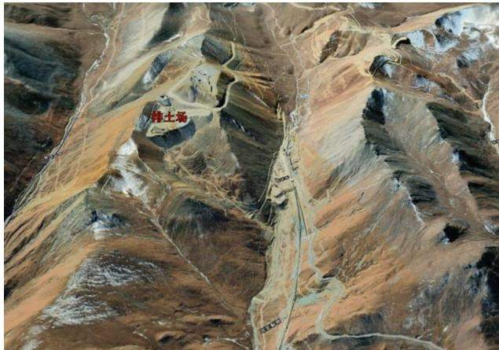  
图1 排土场地形地貌  
Fig.1 Landforms and topography of waste dump

## 1.3 地层岩性

根据勘察资料，场地地基岩土层自上而下划分单元层如下：单元层①—第四系全新统腐植土；单元层②—第四系全新统坡积块碎石 $\left( \mathbf { \Phi } \mathbf { Q } _ { 4 } ^ { \mathrm { d l } } \right)$ ；单元层③1—第四系全新统冲洪积块碎石 $\big ( \mathrm { Q } _ { 4 } ^ { \mathrm { a l + p l } } \big )$ ;单元层③2—第四系全新统冲洪积角砾 $\big ( \mathrm { { Q } _ { 4 } ^ { a l + p l } \big ) }$ ；单元层④1—第三系更新统冰水堆积块碎石 $\left( \mathbf { \sf { Q } } _ { 3 } ^ { \mathrm { { f g l } } } \right)$ ;单元层④2—第三系更新统冰水堆积角砾 $\left( \mathbf { \nabla } Q _ { 3 } ^ { \mathrm { f g l } } \right)$ ;单元层⑤1—侏罗系叶巴组二段 $\left( \mathbf { J } _ { 1 - 2 } \mathbf { y } ^ { 2 } \right)$ 强风化千枚岩；单元层⑤2—侏罗系叶巴组二段 $\left( \mathbf { J } _ { 1 - 2 } \mathbf { y } ^ { 2 } \right)$ 中等风化千枚岩；单元层⑥一侏罗系叶巴组二段 $\left( \mathbf { J } _ { 1 - 2 } \mathbf { y } ^ { 2 } \right)$ 中等风化糜棱岩。

## 1.4 水文地质条件

场地内有地表水径流和少量泉点出露，地表水位标高4912.1\~5316.5m，流向为 $3 4 6 ^ { \circ }$ ，沟长约1.5 km,流量为 $2 \ 6 7 8 . 6 0 \ \mathrm { m } ^ { 3 } / \mathrm { d } ,$ 。地表水主要由冰雪融水、大气降水和南、东、西3侧山体内基岩裂隙地下潜水渗流补给，其汇水面积为 $1 . 0 8 ~ \mathrm { k m } ^ { 2 }$ ,水量和水位受季节性影响较大，水质较好。地表水为季节性地表径流，丰水期的6、7、8、9这4个月强降雨条件下有地表径流，且流量较大。

## 2 排土场边坡稳定性分析

## 2.1 模型建立与参数选取

结合踏勘情况、矿山提供的勘探资料及露天矿后续采矿边坡形态，采用 GEO-studio分析软件评价矿区排土场A-A剖面的边坡稳定性，排土场A-A剖面如图2所示，各岩土体参数通过矿山岩土工程勘察报告以及工程类比相结合得到，见表1。

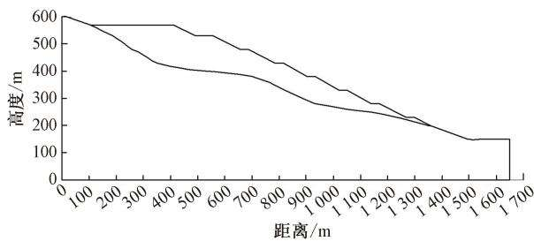  
图 2 A-A 剖面计算模型  
Fig.2 A-A section calculation model

表1 岩土体参数建议值  
Table 1 Suggested values of rock and soil mass parameters
<table><tr><td rowspan=1 colspan=1>岩性</td><td rowspan=1 colspan=1>黏聚力/kPa</td><td rowspan=1 colspan=1>内摩擦角/(°)</td><td rowspan=1 colspan=1>重度 $' ( \mathrm { { k N } \cdot { m } ^ { - 3 } ) }$ </td><td rowspan=1 colspan=1>饱和渗透系数 $^ { \prime } ( \mathrm { c m } \cdot \mathrm { s } ^ { - 1 } )$ </td><td rowspan=1 colspan=1>饱和含水率</td></tr><tr><td rowspan=1 colspan=1>中风化糜棱岩</td><td rowspan=1 colspan=1>700</td><td rowspan=1 colspan=1>39</td><td rowspan=1 colspan=1>25.4</td><td rowspan=1 colspan=1> $1 . 1 6 \times 1 0 ^ { - 5 }$ </td><td rowspan=1 colspan=1>0.010 2</td></tr><tr><td rowspan=1 colspan=1>堆积体</td><td rowspan=1 colspan=1>43.5</td><td rowspan=1 colspan=1>36.5</td><td rowspan=1 colspan=1>22.5</td><td rowspan=1 colspan=1> $1 . 2 0 \times { { 1 0 } ^ { - 2 } }$ </td><td rowspan=1 colspan=1>0.045</td></tr></table>

## 2.2 计算方法与荷载工况

计算采用通用边坡稳定性评价软件GEO-SLOPE，为考虑不同理论方法的计算结果不同，分别比较极限平衡法中的几种常用的方法，如bishop法、Morgenstern-Price法和 Sarma 法，Morgenstern-Price法和 Sarma法考虑了岩土体内部不同的地质结构和组成，更能反映实际情况并提供更准确的计算结果，因此，采用 Morgenstern-Price 法分析边坡稳定性。

根据当地多年气象观测资料，降雨工况按照日最大降雨量 47.3 mm/d 的 24 h 强降雨进行计算；根据《中国地震动峰值加速度区划图》（GB18306—

2015)、《中国地震动反应谱特征周期区划图》（GB18306—2015）和《建筑抗震设计规范》(GB50011—2010)可知：勘察区所处地区地震设防烈度Ⅶ度,地震动峰值加速度为0.15g(g为重力加速度)，设计地震分组为第三组，设计特征周期0.45s。

为验证边坡稳定性，计算A-A剖面模型，根据排土场的等级、边坡的安全影响因素将稳定性计算工况分为3种，分别为自重+地下水、自重+地下水+降雨、自重+地下水+地震，排土场等级为一级，根据《有色金属矿山排土场设计标准》（GB/T50421—2018)指出的排土场整体安全稳定性标准确定安全标准，3种工况选取及许用安全系数见表2。

表2 工况选取及许用安全系数  
Table 2 Selection of working conditions and allowable safety factor
<table><tr><td rowspan=1 colspan=1>工况</td><td rowspan=1 colspan=1>类型</td><td rowspan=1 colspan=1>许用安全系数</td></tr><tr><td rowspan=1 colspan=1>工况I</td><td rowspan=1 colspan=1>自重+地下水</td><td rowspan=1 colspan=1>1.25</td></tr><tr><td rowspan=1 colspan=1>工况Ⅱ</td><td rowspan=1 colspan=1>自重+地下水+降雨</td><td rowspan=1 colspan=1>1.20</td></tr><tr><td rowspan=1 colspan=1>工况Ⅲ</td><td rowspan=1 colspan=1>自重+地下水+地震</td><td rowspan=1 colspan=1>1.20</td></tr></table>

## 2.3 计算结果分析

通过以上模型建立、参数及工况，选取排土场中部的A-A剖面作为典型剖面进行稳定性分析，该剖面方位为NW向，平行于排土场最主要临空面方向，剖面下伏地基坡度最陡且承受的排土体负荷也相对较大，能最保守的评价排土场的稳定状态，计算得到的稳定性结果如图3所示。

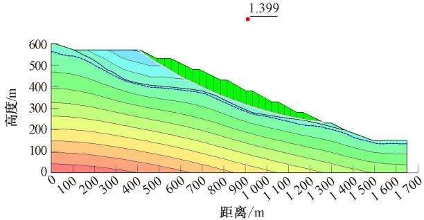  
(a)自重+地下水

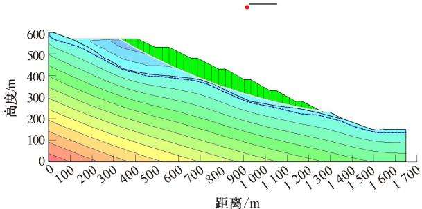  
(b)自重+地下水+降雨

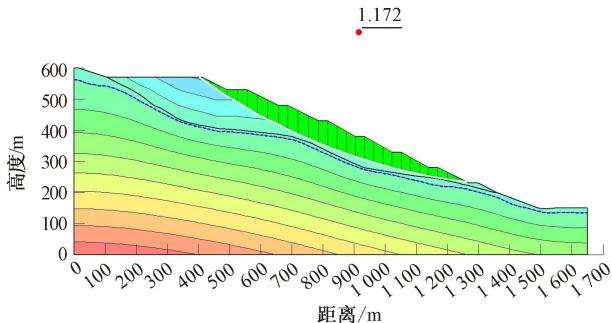  
(c)自重+地下水+地震  
图3 排土场 A-A 剖面不同工况下稳定性计算结果  
Fig.3 Stability calculation results of A-A section of waste dump under different working conditions

由图3可知：排土场在24h强降雨后，排土场整体压力水头变化不明显，水位线呈轻微升高趋势，排土料渗透性较强，降雨过程维持非饱和状态，稳定性系数由1.399变为1.300,仍大于许用安全系数，处于稳定状态：在地震作用下，最危险滑移面安全系数变为1.172,小于许用安全系数1.20,排土场边坡存在失稳滑动的风险。

排土场下方存在河流、道路，若排土场发生失稳滑动，3面环山的地形伴随降雨及冰川融水，可能产生局部泥石流灾害，因此，有必要分析排土场失稳诱发泥石流的动态演化过程。

## 3 排土场诱发泥石流危险性分析

## 3.1 基本原理

RAMMS 软件基于 Voellmy-Salm 流变连续介质模型将泥石流流体视为非均质、非稳定流体，以流深、流动速度2个主要流量参数表示质量平衡方程和X、Y方向上流体深度平衡方程，如下式：

(1)

$$
\begin{array} { r l } { { \partial _ { t } ( H ) \ + \ \partial _ { x } ( H U _ { x } ) \ + \ \partial _ { y } ( H U _ { y } ) = Q ( x , y , t ) } } \\ { { \ } } & { { \partial _ { t } ( H U _ { x } ) \ + \ \partial _ { x } \Biggl ( c _ { x } H U _ { x } ^ { 2 } \ + g _ { z } k _ { \alpha \gamma } \frac { H ^ { 2 } } { 2 } \Biggr ) \ + } } \\ { { \ } } & { { \partial _ { y } ( H U _ { x } U _ { y } ) \ = s _ { g _ { x } } - s _ { f _ { x } } } } \\ { { \ } } & { { \partial _ { t } ( H U _ { y } ) \ + \ \partial _ { y } \Biggl ( c _ { y } H U _ { y } ^ { 2 } \ + g _ { z } k _ { \alpha \gamma } \frac { H ^ { 2 } } { 2 } \Biggr ) \ + } } \\ { { \ } } & { { \partial _ { x } ( H U _ { x } U _ { y } ) \ = s _ { g _ { x } } - s _ { f _ { x } } } } \end{array}\tag{2}
$$

(3)

式中：H为泥石流深度， $\operatorname* { m } ; U _ { x }$ 和 $U _ { y }$ 为 $x _ { \cdot } y$ 方向上速度分量， $\mathrm { m } / \mathrm { s } ; Q$ 为初始物质量， $\mathbf { m } ^ { 2 } / \mathbf { s } ; c$ 为地形系数，由数字高程模型(Digital Elevation Model, DEM)决定： $\displaystyle { { \cal { k } } _ { a / p } }$ 为土压力系数；s。为有效重力， $s _ { g }$ $\mathbf { m } ^ { 2 } / \mathbf { s } ^ { 2 } ; s _ { f }$ 为摩擦阻力， $\mathrm { m } ^ { 2 } / \mathrm { s } ^ { 2 }$ O

采用 Voellmy-Fluid 摩擦模型将摩擦阻力分为摩擦系数 $\mu$ 和湍流系数 $\xi$ ，当流体快速运动时 $\xi$ 起主导作用，当流体接近停止运动时 $\mu$ 起主导作用。

$$
s _ { f } = \mu \cdot \rho \cdot h g \mathrm { c o s } ( \varphi ) + \frac { \rho g U ^ { 2 } } { \xi }\tag{4}
$$

式中 $: \mu$ 为干摩擦因数 $; \rho$ 为流体密度， $\mathrm { k g } / \mathrm { m } ^ { 3 } ; \varphi$ 为物质倾斜角度 $\mathopen : \xi$ 为湍流系数。

## 3.2 计算模型及参数

基于西藏自治区 30 m精度 DEM 数字高程数据，将 DEM 数据转化为 ASCII格式导入 RAMMS 软件,采用 $1 0 \ \mathrm { m } \times 1 0 \ \mathrm { m }$ 计算网格进行地形划分，通过多期遥感数据及排土场工程地质勘查资料圈定排土废料区域作为泥石流的物源条件，设置泥石流密度为 $2 ~ { \nu \mathrm m } ^ { 3 }$ ,计算时间步长设置为10s,土压力系数保持为默认值。在RAMMS泥石流数值模拟中，摩擦因数 $\mu$ 和湍流系数 $\xi$ 是影响泥石流运动的重要影响因素，以 $\mu { = } 0 . 2 0 , \xi { = } 2 0 0 ~ \mathrm { m / s } ^ { 2 }$ 作为默认值进行泥石流运动过程初始模拟，通过经验校核方法得到最终摩擦系数 $\mu$ 取值为0.15和湍流系数ξ取值为$2 2 0 \ \mathrm { m } / \mathrm { s } ^ { 2 } .$ 排土场计算模型如图4所示。

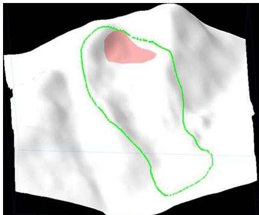  
图4 排土场计算模型  
Fig.4 Calculation model of waste dump

## 3.3 模拟结果分析

根据设定参数，模拟排土场诱发泥石流的爆发运动演进过程，得到泥石流不同步时的堆积特征与流速特征模拟结果，运动过程中的泥石流最大泥深为 25.63 m，最大流速为 8.73 m/s,分别取 t = 0、300、600、900、1200、1500 s共6个步时分析泥石流的运动过程(堆积高度、流速)，如图5、图6所示。

运动过程可分为3个阶段：第1阶段为初始运动阶段(0\~300s),在冰川融化和降雨条件下产生地表径流，带动排土场堆积物质开始运动，同时沟道两侧松散物源也开始汇入沟道中，沟道内平均流速约5 m/s,泥深为10\~12m;第2阶段为沟道流通阶段(300\~1200s）,泥石流大部分堆积物质集中于主沟流通区中推动沟道中其他物质向下运动，泥石流物质泥深达15m，由于沟道变宽坡度变缓，泥石流流速变慢，一部分泥石流物质堆积在沟道中央，另一部分继续向下倾泻，在泥石流沟口处坡度变大，流速再一次加快，最大流速可达8.73 m/s;第3阶段为堆积-最终阶段(1200\~1500 s)，泥石流尾部流速趋近于0，整体堆积高度小于流通阶段，由于流通区坡度较缓仅一部分物质在沟口处堆积，堆积深度0.5\~2.5m不等，沟口处形成堆积扇。

## 3.4 泥石流强度分区

泥石流强度为泥石流对环境造成破坏的能力，对于泥石流破坏能力的评价，选用数值模拟中所获取的最大流速、最大泥深等动力学参数来衡量泥石流在堆积区内的淤埋破坏能力和冲击破坏能力。模拟排土场失稳下诱发泥石流过程，以最大流速、最大泥深来表征泥石流强度，进而体现各区域的泥石流强度分区，泥石流运动过程中泥深、流速动力参数如图7所示。泥石流强度划分标准见表3。

由图5、图6可知：泥石流从开始到结束的整体

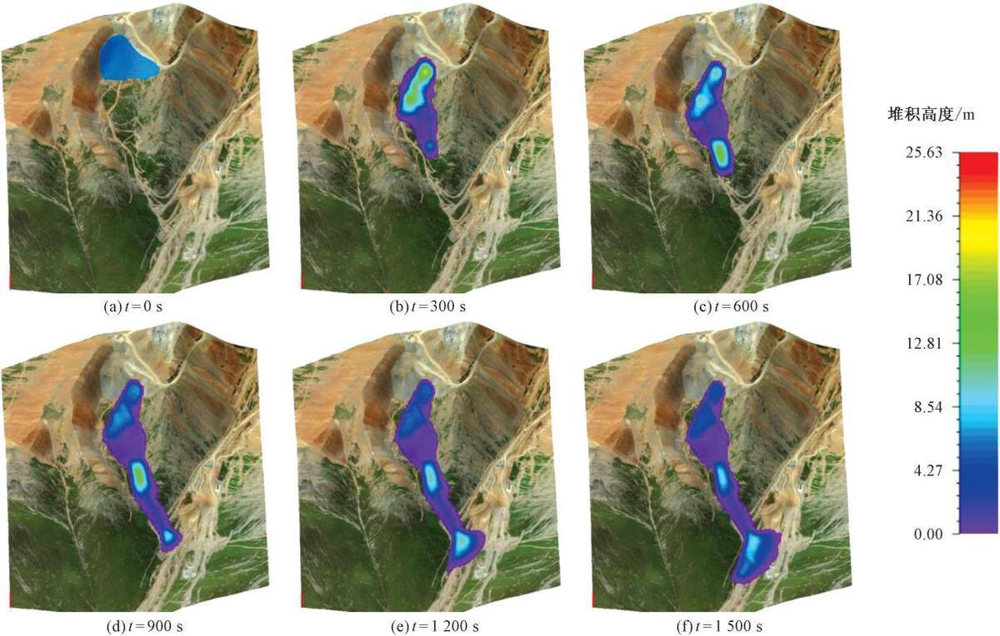  
图5 不同步时下泥石流运动堆积高度  
Fig.5 Accumulation height of debris flow movement under asynchronous conditions

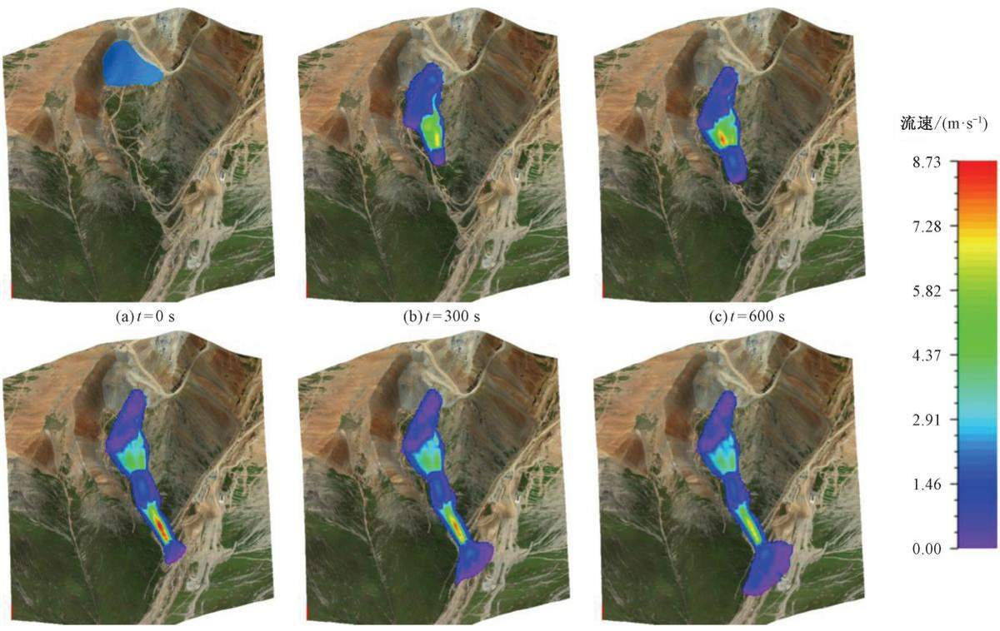  
(d) t =900 s  
(e)t=1 200 s  
(f) t= 1 500 s  
图6 不同步时下泥石流运动流速

Fig.6 Flow velocity of debris flow movement under asynchronous conditions  
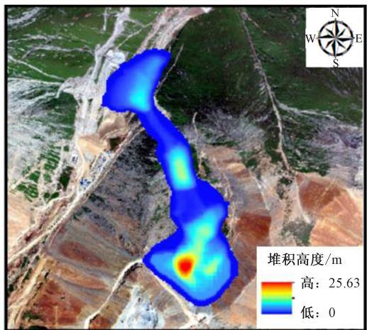  
(a)最大堆积高度

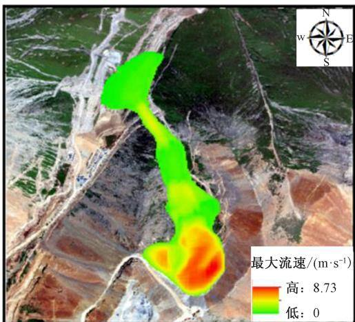  
(b)最大流速  
图7 泥石流运动过程中最大泥深、流速动力参数  
Fig.7 Dynamic parameters of maximum mud depth and flow velocity during movement of debris flow

表3 泥石流强度划分标准  
Table 3 Criteria for classification of debris flow intensity
<table><tr><td rowspan=1 colspan=1>强度</td><td rowspan=1 colspan=1>最大泥深 $H / \mathrm { m }$ </td><td rowspan=1 colspan=1>关系式</td><td rowspan=1 colspan=1>最大泥深与最大流速乘积 $H V / ( \mathbf { m } ^ { 2 } \cdot \mathbf { s } ^ { - 1 } )$ </td></tr><tr><td rowspan=1 colspan=1>高</td><td rowspan=1 colspan=1> $H \geqslant 1 0$ </td><td rowspan=1 colspan=1>OR</td><td rowspan=1 colspan=1> $H V \geqslant 1 0$ </td></tr><tr><td rowspan=1 colspan=1>中</td><td rowspan=1 colspan=1> $5 \leqslant H < 1 0$ </td><td rowspan=1 colspan=1>AND</td><td rowspan=1 colspan=1> $5 { \leqslant } H V { < } 1 0$ </td></tr><tr><td rowspan=1 colspan=1>低</td><td rowspan=1 colspan=1> $0 \leqslant H < 5$ </td><td rowspan=1 colspan=1>AND</td><td rowspan=1 colspan=1> $H V { < } 5$ </td></tr></table>

根据泥石流强度与危险性划分标准，结合最大堆积高度与最大流速，采用ArcGIS软件进行泥石流强度的划分，得到泥石流强度分区，如图8所示。

由图8可知：泥石流强度分区从排土场失稳区位置呈现向北扩张的趋势，其中，高强度区除排土场外主要集中于沟道流通区中部坡度稍陡地带，此处泥石流物质较为集中且流速较快，总高强度区占总区域面积的50.18%；中强度区位于排土场正下方坡度较缓区域和泥石流堆积扇中部，占总区域面积的32.29%；低强度区占总面积的17.53%，主要为泥石流倾泻物质两侧及沟口堆积扇部位，此区域泥石流物质量小且泥石流接近停止状态，故强度较低。

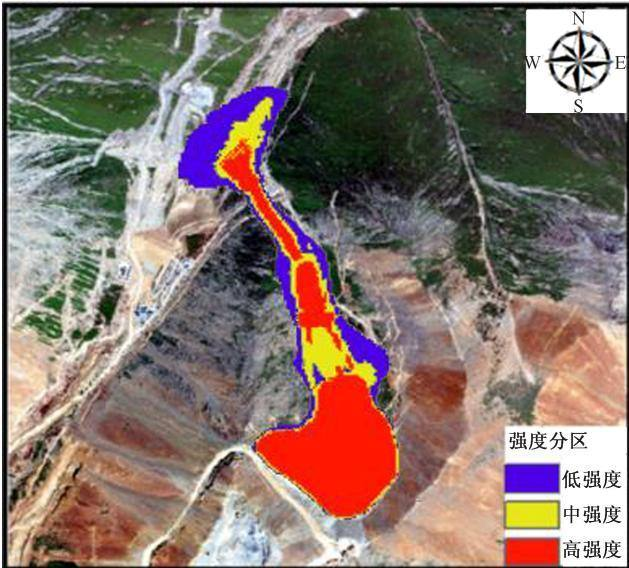  
图8 泥石流强度分区  
Fig.8 Debris flow intensity zoning

## 4 结论

1）排土场在3种工况下的稳定性系数分别为1.399、1.300和1.172,其中，在自重+地下水+地震工况下边坡稳定性系数小于许用安全系数，存在失稳风险。

2）根据排土场诱发泥石流的运动过程模拟，将泥石流从开始到结束的整体运动过程分为初始运动阶段(0\~300 s)、沟道流通阶段(300\~1200 s)和堆积-最终阶段(1200\~1500 s)，运动过程中的泥石流最大泥深为25.63 m,最大流速为 8.73 m/s,最终在沟口处形成堆积扇。

3）以模拟中最大流速、最大泥深动力学参数来衡量泥石流强度，划分为高强度、中强度和低强度3种分区，高强度占总区域面积的50.18%，中强度占总区域面积的32.29%，低强度区占总面积的17.53%。

## 参考文献

[1]蓝宇.基于数值模拟的露天矿排土场高陡边坡稳定性分析与治理[J].矿业研究与开发，2023,43(3):77-82.

LAN Yu. Stability analysis and treatment of high and steep slope in open-pit dump based on numerical simulation[J] Mining Research and Development,2023,43(3) :77–82.

[2]江松,李涛,李锦源，等.基于TrAdaBoost-GBDT 模型的排土场边坡稳定状态判别[J].中国安全科学学报，2024， 34(11):89-98. JIANG Song, LI Tao, LI Jinyuan, et al. Diserimination of dump slope stability state based on TrAdaBoost-GBDT model[J]. China Safety Science Journal ,2024,34(11) :89-98.

[5」子义度，际敏，于.路人排⊥场走性刀帆反有驭防石担爬LJ」.木找个，2025,25(1):39-01. [3]李文虔，陈敏，寇向宇.露天矿排土场稳定性分析及滑坡防治措施[J].采矿技术,2023,23(1):59-61

LI Wenqian , CHEN Min , KOU Xiangyu. Stability analysis of open-pit mine dump and landslide prevention measures[J]. Mining Technology ,2023,23(1) :59–61.

[4」包一」.排土场辺坡稳定性评价及潜在滑坡火害范围预测:以朱家包包排土场为例D」.长春：吉林大学，2020. BAO Yiding. Stability analysis and landslide failure potential forecasting of the waste dump :Zhujiabaobao waste dump case study[D]. Changchun: Jilin University ,2020.

[5] 谭星宇.尾矿库条件下排土场稳定性分析及治理研究[J].矿业研究与开发，2023,43(9):41-45.

TAN Xingyu. Study on stability analysis and treatment of waste disposal site under condition of tailings reservoir[J]. Mining Research and Development,2023,43(9) :41-45.

[6] 董建军，姜浩，闫斌，等.高海拔剧烈干湿循环在役排土场安全状态评价[J].中国安全科学学报，2023,33(10):94-103.DONG Jianjun ,JIANG Hao , YAN Bin, et al. Evaluation of safety state for dumpat high altitude J]. China Safety ScienceJournal.2023.33(10):94-103.

[7]马增，费汉强，孙春辉，等.长历时降雨后排土场边坡稳定性动态变化研究[J].矿业研究与开发，2025,45(7)：169-176. MA Zeng , FEI Hanqiang, SUN Chunhui , et al. Research on the dynamic changes of slope stability in waste dump after prolonged rainfall[J]. Mining Research and Development ,2025 ,45(7) : 169–176.

[8]李耀宏，张梓旭，李树勋，等.不同震级作用下排土场边坡动力响应特征与稳定性分析[J].有色金属：矿山部分，2025,77(1):31-37.LI Yaohong, ZHANG Zixu, LI Shuxun, et al. Analysis of dynamic response characteristics and stability of dump slopeunder different seismic magnitudes[J].Nonferrous Metals : Mining Section ,2025,77(1) :31-37.

[9]邸勇，魏云杰，谭维佳，等.基于RAMMS的滑坡堵江危险性评价[J].地学前缘,2025,32(5):546-556. DI Yong, WEI Yunjie , TAN Weijia, et al. Risk assessment of landslides blocking rivers based on RAMMS[J]. Earth Science Frontiers, 2025,32(5) :546–556.

作者简介：徐红剑（1999—)，男，河北承德人，硕士，主要从事岩土体稳定性评价等方面的工作。  
E-mail:【已脱敏邮箱】。