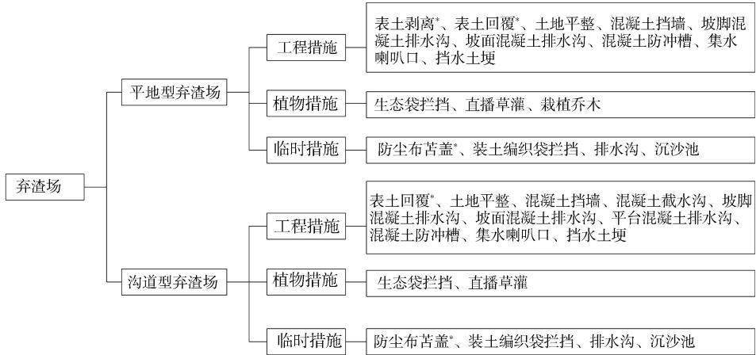

# 灌区工程弃渣场变更设计的关键环节——以河南省小浪底北岸灌区工程为例

袁月，彭飞

（河南省水利勘测设计研究有限公司，河南郑州450016)

[关键词]弃渣场变更；选址；减量化；资源化；灌区工程

[摘要]灌区工程在实施阶段易发生弃渣场变更的情况，以河南省小浪底北岸灌区工程为例，从水土保持角度对其弃渣场变更的原因进行了分析，在开展弃渣场变更工作时，充分论证，切实进行弃渣的减量化和资源化利用，确实无法利用的余方堆置在合理选址的弃渣场，完善相关手续，加强水土保持防护措施，减少因弃渣造成的水土流失。从弃渣减量化和资源化、弃渣场选址和弃渣场水土保持防护措施这几个关键环节对弃渣场变更工作要点进行了阐述。

[中图分类号]S157

[文献标识码]C

DOI:10.3969/j. issn.1000-0941.2024.09.013

[引用格式]袁月，彭飞.灌区工程弃渣场变更设计的关键环节：以河南省小浪底北岸灌区工程为例[J].中国水土保持，2024(9):36-38.

灌区工程具有渠道线路长、穿越地貌复杂、建筑物节点多、涉及范围广、占地面积大、出渣点分散等特点，实施阶段容易引起弃渣场变更。2023年1月17日《生产建设项目水土保持方案管理办法》(水利部令第53号)发布，规定“在水土保持方案确定的弃渣场以外新设弃渣场的，或者因弃渣量增加导致弃渣场等级提高的，生产建设单位应当开展弃渣减量化、资源化论证，并在弃渣前编制水土保持方案补充报告，报原审批部门审批”，对弃渣场变更的要求更为严格，因此是否做好弃渣场的变更工作关系到工程能否顺利通过验收。河南省小浪底北岸灌区工程在实施阶段弃渣场位置发生了变化，需开展弃渣场变更设计，现以该工程为例，对弃渣场变更原因进行分析，并从弃渣减量化和资源化、弃渣场选址和弃渣场水土保持防护措施这几个关键环节对弃渣场变更工作要点进行阐述，旨在为同类灌区工程提供参考。

## 1 工程概况

河南省小浪底北岸灌区工程是小浪底水利枢纽的配套工程，设计灌溉面积为3.45万hm²(51.7万亩)，补源面积为1.33万hm²(20万亩),引黄流量为 $3 0 ~ \mathrm { m } ^ { 3 } / \mathrm { s }$ 年均引黄水量为2.39亿 $\mathbf { m } ^ { 3 }$ ,共规划渠系工程32条、总长325.24 km,布设各类骨干建筑物 732座，属大(2)型灌区，Ⅱ等工程，涉及河南省的济源市和焦作市。工程于2017年7月获批水土保持方案报告书，2019年9月开工建设。实施阶段工程建设共产生余(弃)方231.90万 $\mathrm { m } ^ { 3 }$ ,其中工程自身减量化消纳14.71万 $\mathrm { m } ^ { 3 }$ ,资源化综合利用160.59万 $\mathbf { m } ^ { 3 }$ ，弃渣场弃渣

56.60万m³，与批复的水土保持方案相比，部分弃渣场位置发生了变化。

## 2 弃渣场变更原因

从水土保持角度对河南省小浪底北岸灌区工程弃渣场变更的原因进行分析，主要包括以下三个方面：

1)由于工程需借土的渠段周边多为永久基本农田，取土场难以征用，因此实施阶段为减少取土场取土.对主体工程设计进行了优化，将部分梯形渠道变更为钢筋混凝土矩形槽，导致需填土的方量大为减少；同时，调整了借土方式，原设计方式为取土场取土改为采用外购土的方式，原方案设计的取土场不再征用、利用取土坑弃渣的方案不再施行，导致工程需新设弃渣场，用于堆置原计划堆置于取土坑的弃渣。

2)实施阶段由于某隧洞下穿铁路，施工进度缓慢，因此为加快主体工程施工进度，进行了设计变更，在穿铁路处加设一座竖井，增加作业面的同时也增加了出渣点。为减少运距，避免新修运渣道路产生新的扰动，在出渣点附近新设了弃渣场。

3)原批复的弃渣场到实施阶段已进行了高标准农田建设，无法再弃渣，需新设弃渣场。

## 3 弃渣减量化和资源化

大量弃渣已成为我国现阶段水土流失的主要来源之一，不但影响生态环境、破坏水土资源，而且容易引发次生地质灾害1-3]。工程实施阶段应当开展弃渣减量化、资源化论证，以最大程度减少弃渣量和弃渣占地，尽可能减少水土流失，确实无利用途径的余方集中堆置于工程选定的弃渣场。河南省小浪底北岸灌区工程在实施阶段进行了现场调查分析，结合工程本身绿化需求，将部分余方用于渠道两侧永久占地范围内空闲地的土地整治，进行了弃渣减量化处理。项目建设单位积极组织、协调各参建单位充分开展调查，为尽可能减少工程弃渣寻求多种综合利用方案，签署了综合利用协议，进行了余方的资源化利用：部分余方由地方政府统一调配，结合其他建设项目进行综合利用；部分余方由施工单位与其他单位签署综合利用协议用于绿化建设；部分余方综合利用于当地土地整治、回填坑塘、整修道路、回填田间坑等。在余方综合利用的过程中，综合利用协议应明确水土流失防治责任，做好土石方临时堆放及后续利用期间的水土流失防治工作，加强临时防护。

## 4 弃渣场选址

灌区工程渠道线路长、穿越地貌复杂、建筑物节点多、涉及范围广、占地面积大、出渣点分散，与周边项目建设时序难以对接，较难实现土方平衡4]，弃渣场选址已成为合理处置弃渣的首要工作。设计阶段做好弃渣场选址工作可避免或减少实施阶段弃渣场的变更；实施阶段需变更的弃渣场也应做好选址工作，以便于变

更报告顺利获得审批。

河南省小浪底北岸灌区工程在新设弃渣场选址时，对相关约束性规定进行了分析评价(见表1），做到不涉及生态红线，严格避让禁止堆渣的区域，尽量少损坏水土保持设施，尽可能减少占压耕地面积，调查清楚渣场周边的道路建设情况，综合考虑弃渣运距，根据弃渣量和现状地形确定弃渣场征地面积、数量及弃渣的堆置方式，在节约投资的同时选出适宜弃渣的区域，以保证弃渣场选址的合理性。实施阶段，主体工程设计将部分梯形渠道变更为钢筋混凝土矩形槽，渠道断面缩窄，致使已征用永久占地的空闲区域范围扩宽，为减少弃渣临时占地，综合考虑运距后，优先将工程弃渣尽可能堆置在此部分永久占地范围内，贴矩形槽外侧堆置，保证不影响矩形槽的安全稳定和正常运行。剩余弃渣场选址结合出渣点位置确定，其中位于山丘区的济源市境内弃渣场优先选址荒沟、凹地、支毛沟，位于平原区的沁阳市、孟州市、温县、武陟县境内弃渣场优先选址凹地、荒地、砖窑坑等。同时，联合地勘、施工专业，开展现场调查，复核场地地质、运输条件及周边敏感目标等，进行渣场的稳定计算，确定各渣场堆渣方案。渣场下游一定范围内有敏感因素的，应进行论证且论证结论能够支撑选址合规要求[5]。

表1 河南省小浪底北岸灌区工程弃渣场选址分析评价
<table><tr><td>约束性规定</td><td>分析评价意见</td><td>约束性规定来源</td></tr><tr><td>严禁在对公共设施、基础设施、工业企业、居民点 等有重大影响的区域设置弃土(石、渣、灰、矸石、尾 矿)场</td><td>本工程选定的弃渣场不涉及相关区域</td><td rowspan="3">《生产建设项目水土保持技术标准》(GB 50433—2018)第4.3.8条</td></tr><tr><td>涉及河道的应符合河流防洪规划和治导线的规 定，不得设置在河道、湖泊和建成水库管理范围内</td><td>本工程选定的弃渣场不涉及相关区域</td></tr><tr><td>在山丘区宜选择荒沟、凹地、支毛沟，平原区宜选 择凹地、荒地，风沙区宜避开风口</td><td>本工程位于山丘区和平原区的弃渣场选址 优先选择相关区域</td></tr><tr><td>应充分利用取土(石、砂)场、废弃采坑、沉陷区等 场地</td><td>本工程无可回填的取土场，余方尽可能用 于回填废弃采坑</td><td rowspan="2"></td></tr><tr><td>应综合考虑弃土(石、渣、灰、矸石、尾矿)结束后 的土地利用</td><td>弃渣结束后进行临时用地复垦，恢复原 地貌</td></tr><tr><td>弃渣场应避开滑坡体等不良地质条件地段，不宜 在泥石流易发区设置弃渣场；确需设置的，应确保弃 渣场稳定安全</td><td>本工程选定的弃渣场不涉及相关区域</td><td rowspan="2">《水土保持工程设计规范》（GB51018— 2014)第12.2.2条</td></tr><tr><td>弃渣场不宜设置在汇水面积和流量大、沟谷纵坡 陡、出口不易拦截的沟道；对弃渣场选址进行论证 后，确需在此类沟道弃渣的，应采取安全有效的防护 措施</td><td>本工程选定的弃渣场不涉及相关区域</td></tr><tr><td>弃渣场不应影响河流、沟谷的行洪安全;弃渣不应 影响水库大坝、水利工程取用水建筑物、泄水建筑 物、灌(排)干渠(沟)功能；不应影响工矿企业、居民 区、交通干线或其他重要基础设施的安全</td><td>本工程选定的弃渣场不产生相关影响</td><td>《水利水电工程水土保持技术规范》(SL 575—2012)第4.1.5条</td></tr><tr><td>对违法违规占用永久基本农田建窑、建房、建坟、 挖沙、采石、采矿、取土、堆放固体废弃物或者从事其 他活动破坏永久基本农田，毁坏种植条件的，按《土 地管理法》《基本农田保护条例》等法律法规进行查 处，构成犯罪的，依法移送司法机关追究刑事责任</td><td>本工程选定的弃渣场不涉及相关区域</td><td>《自然资源部农业农村部关于加强和改进 永久基本农田保护工作的通知》(自然资规 [2019]1号)第(五)条</td></tr></table>

## 5 弃渣场水土保持防护措施

施工过程中需同步做好弃渣场水土保持防护，将因弃渣造成的水土流失影响降至最低，保证不产生水土流失危害。河南省小浪底北岸灌区工程新设的弃渣场均为5级，类型包括沟道型和平地型，其中平地型弃渣场最大堆高不超过6m。弃渣前对渣场进行表土剥离，平地型弃渣场和弃渣边坡低于10m的沟道型弃渣场，在坡脚处进行生态袋或挡墙拦挡，外侧设坡脚排水沟，周围无明显排水出路的在排水沟末端设防冲槽，将渣场汇水进行散排，有排水出路的将坡脚排水沟与排水出路相连通，弃渣顶面设挡水土埂，坡面设排水沟，坡面排水沟顶部与挡水土埂连接处设集水喇叭口，底部与坡脚排水沟相连通；沟道型弃渣场设计弃渣顶面不超过现状周边地形，在顶面根据汇水方向和面积设截排水沟，弃渣边坡高于10m的沟道型弃渣场还需对边坡进行分级，设分级平台和平台排水沟，平台排水沟与坡面排水沟相连通。施工过程中对裸露面进行苫盖保护，做好施工期间临时拦挡、排水、沉沙措施。弃渣结束后，各渣场利用自身剥离的表土进行回覆，无可剥离表土的弃渣场利用附近渠道或建筑物剥离的表土进行回覆。施工结束后，对渣场占压林、园、草地的区域和弃渣边坡进行植被恢复，由相关部门对占压耕地的区域进行复耕。河南省小浪底北岸灌区工程弃渣场水土保持防护措施体系见图1。

  
图1 河南省小浪底北岸灌区工程水土保持防护措施体系  
(注：图中标“\*”项表示主体设计已有此项水土保持措施)

## 6 结束语

灌区工程一般建设周期长，土石方量大，余方量也较大，实施阶段由于主体工程变更、施工方案调整及土地现状发生改变等，弃渣场容易产生变更。为促进生态文明建设，水土保持工作越来越受到重视，弃渣场作为水土保持设计的关键环节，其变更工作更是重中之重。《生产建设项目水土保持方案管理办法》(水利部令第53号)的颁布，进一步规范和加强了生产建设项目水土保持方案管理，明确了弃渣场变更的技术要求，提出了弃渣减量化、资源化论证的新要求；《水利部办公厅关于印发生产建设项目水土保持方案审查要点的通知》（办水保[2023177号）提出了弃渣场选址用地可行性手续办理的要求。因此，在开展弃渣场变更工作时，应充分论证，切实进行弃渣的减量化和资源化利用，确实无法利用的余方堆置在工程合理选址的弃渣场，完善相关手续，加强水土保持防护措施，以减少因弃渣造成的水土流失。

## [参考文献]

[1]张薇，鲍学英.铁路弃渣场绿色施工等级综合评价研究[D]. 兰州：兰州交通大学,2021:1.

[2]张子仪,徐华强.水利工程水土保持措施方案研究[J].水利技术监督,2020(6):244-247.

[3]童云深.山区高速公路工程弃渣与生态保护[J]. 公路，2013,58(12):213-217.

[4]李建明，王志刚，徐文胜，等.生产建设项目弃土弃渣资源化利用及生态修复研究[J]. 中国水土保持,2022(2):33-38.

[5]水利部办公厅.水利部办公厅关于印发生产建设项目水土保持方案审查要点的通知[J].中华人民共和国水利部公报,2023(3):40-47.

收稿日期：2024-03-16

第一作者：袁月(1991—)，女，河南南阳人，工程师，硕士，主要从事水土保持规划、设计工作。

E-mail： 642570134@ qq. com

(责任编辑 徐素霞)