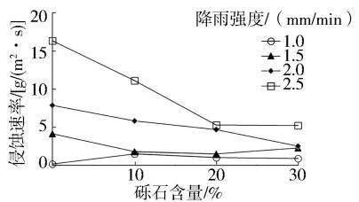
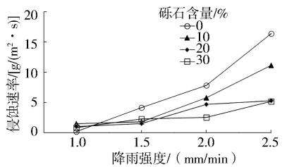
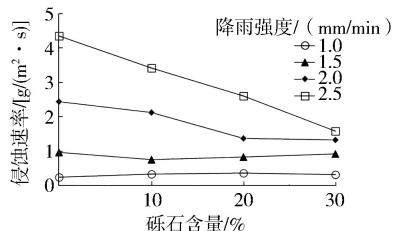
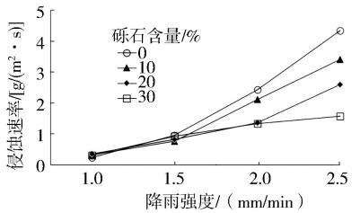

# 生产建设项目不同土质工程堆积体产流产沙特征分析

刘文祥1,2，申明爽²，闫建梅2，石劲松²，卢阳²，胡志东1，冯 松1

(1.重庆市渝发水利科学研究院有限公司，重庆400014;2. 长江水利委员会长江科学院重庆分院，重庆400026)

摘要：生产建设项目施工过程中会形成结构松散、颗粒组成复杂的工程堆积体，在暴雨及径流冲刷下易形成强烈的水土流失，甚至引发地质灾害。针对目前不同土质工程堆积体产流产沙特征分析方面的研究较少的问题，分别选取采自陕西省榆林市靖边县、江西省南昌市新建县、贵州省贵阳市花溪区石板镇、重庆市北碚区的风沙土、红壤、黄壤、紫色土4种土壤类型，将砾石按照0、10%、20%、30%4种质量分数分别与试验土壤均匀混合后装填，模拟不同砾石含量的工程堆积材料，在降雨试验和放水试验下分析不同土质堆积体的坡面径流流速、径流深、侵蚀动力特征和侵蚀速率等产流产沙特征，结果显示：1土壤类型、砾石含量、降雨强度均会对工程堆积体产流产沙造成影响，相较于红壤和紫色土，风沙土和黄壤堆积体更容易发生侵蚀：②当降雨强度和放水流量增加时，坡面径流流速、侵蚀动力学参数、侵蚀速率会随之增加：③砾石含量增加时，可减少坡面径流流速的增加幅度，进而控制堆积体坡面产沙量。

关键词：工程堆积体；产流产沙；风沙土；红壤；黄壤；紫色土；生产建设项目

中图分类号：S157

文献标识码：A

DOI:10.3969/j. issn.1000-0941.2025.04.017

引用格式：刘文祥，申明爽，闫建梅，等.生产建设项目不同土质工程堆积体土壤侵蚀产流产沙特征分析[J].中国水土保持，2025(4)：68-71.

生产建设项目施工过程中边坡和土地开挖会导致大量表土被剥离，形成结构松散、颗粒组成复杂的工程堆积体1，在暴雨及径流冲刷下，易产生强烈的水土流失，甚至引发地面塌陷、山体滑坡等地质灾害。因此，生产建设项目工程堆积体的水土流失问题需要得到充分关注。目前，我国关于工程堆积体水土流失问题的研究主要集中在坡面产流产沙规律和影响因素方面。相关研究表明，降雨强度、砾石含量、地形地貌等因素会对工程堆积体产流产沙量造成不同程度的影响[2-4]。然而，关于不同土壤类型或土壤质地的工程堆积体之间的产流产沙特征差异方面的研究较少。本研究通过试验设计的方法分析不同土壤质地堆积体的产流产沙特征，以期为生产建设项目工程堆积体土壤侵蚀机理研究提供支撑。

## 1 研究方法

## 1.1 不同土质堆积体选择

试验选择风沙土、红壤、黄壤、紫色土4种土壤类型，分别取自陕西省榆林市靖边县、江西省南昌市新建县、贵州省贵阳市花溪区石板镇、重庆市北碚区。采集的土壤经孔径2mm筛筛分后自然风干作为试验土壤，采用激光粒度仪测定颗粒组成，土壤颗粒组成特征见表1。风沙土、黄壤和紫色土的土壤质地为砂土，砂粒含量超过50%，黏粒含量偏低；红壤粉粒和砂粒含量较高，属于黏土质地。

表1 试验选用工程堆积体的土壤类型、  
质地和颗粒粒径组成
<table><tr><td rowspan="2">来源</td><td rowspan="2">土壤 类型</td><td rowspan="2">土壤 质地</td><td colspan="3">颗粒粒径组成/%</td></tr><tr><td>砂粒</td><td>粉粒</td><td>黏粒</td></tr><tr><td>陕西榆林靖边县</td><td>风沙土</td><td>砂土</td><td>57.64</td><td>36.46</td><td>5.90</td></tr><tr><td>江西省南昌市新建县</td><td>红壤</td><td>黏土</td><td>28.05</td><td>54.07</td><td>17.88</td></tr><tr><td>贵阳花溪区石板镇</td><td>黄壤</td><td>壤质砂土</td><td>57.71</td><td>30.95</td><td>11.34</td></tr><tr><td>重庆市北碚区</td><td>紫色土</td><td>砂土</td><td>53.55</td><td>39.99</td><td>6.46</td></tr></table>

## 1.2 试验设计

1)试验材料。基于堆积体土壤质地统计结果，发现粒径 $2 \sim < 1 4 \ \mathrm { m m } \ . 1 4 \sim < 2 5 \ \mathrm { m m } \ . \geqslant 2 5 \ \mathrm { m m }$ 的砾石分别占31%、48%、21%。将砾石粉碎后过孔径14、25、50mm筛,分为 $2 \sim < 1 4 \mathrm { \ m m } \cdot 1 4 \sim < 2 5 \mathrm { \ m m } \cdot 2 5 \sim < 5 0 \mathrm { \ m m } \stackrel { = } { = }$ 个等级，并按照质量比3：5：2进行混合，作为试验所用砾石。将砾石按照0、10%、20%、30%4种质量分数分别与试验土壤均匀混合后装填，模拟不同砾石含量的工程堆积材料。根据土壤侵蚀标准试验小区建设要求设计坡长和坡度，然后将提前混合均匀的土石体分层装入。

2)试验包括降雨试验和放水试验。降雨试验以风沙土、红壤为研究对象，基于区域多年降雨统计数据,设计4种降雨强度，分别为1.0、1.5、2.0、2.5mm/min。放水试验以紫色土和黄壤为研究对象，根据暴雨发生频率和产生的单宽流量，设计5、10、15 L/min3种放水流量，对应降雨强度分别为0.5、1.0、1.5mm/min,冲刷时间 30\~58 min。降雨试验和放水试验中坡面产流开始后，按照固定时间间隔在集流槽出口收集径流和泥沙样品，并记录接样时间、体积和质量。

## 1.3 数据处理

1)流速(v)和流宽(L)。流速测定采用 $\mathrm { K M n O } _ { 4 }$ 染色示踪法，通过修正系数得到边坡径流的平均流速；流宽采用精度为0.01m尺片测量。

2)径流深。由于水流断面的径流深度较小，直接人工测量误差较大，因此采用公式进行计算。边坡平均径流深的计算公式为

$$
h = { \frac { q } { v b t } }\tag{1}
$$

式中： $\cdot h$ 为径流深，单位m;q为接样时间内的径流量，单位 $\mathrm { m } ^ { 3 } { ; } v$ 为流速，单位m/s;b 为过水断面宽度,单位$\mathbf { m } { \ ; } t$ 为接样时间，单位 $\mathbf { S } _ { \textrm { \scriptsize C } }$

3)雷诺数 $( R e )$ 是径流惯性力和黏滞力的比值，是判断边坡径流是层流还是紊流的定量标准，计算公式为

$$
R e = \frac { v R } { \eta }\tag{2}
$$

式中： $R$ 为水力半径，单位m，本研究中采用径流深代替； $\eta$ 为水流黏滞性系数，单位 $\mathbf { m } ^ { 2 } / \mathbf { s } ,$ C

4)弗劳德数 $( F r )$ 是水流惯性力和重力的比值，它是判断缓、急流的定量指标，计算公式为

$$
F r = \frac { v } { \sqrt { g h } }\tag{3}
$$

式中 $\boldsymbol { : } \boldsymbol { g }$ 为重力加速度，单位 $\mathrm { m } / \mathrm { s } ^ { 2 }$ O

5) Darcy-Weisbach 阻力系数 $( f )$ 是径流流动过程中受到的来自于水土界面阻碍水流运动力的总称，计算公式为

$$
f = \frac { 8 g R J } { v ^ { 2 } }
$$

式中 $: J$ 为水力坡度，单位 $\mathrm { m } / \mathrm { m }$

6)径流剪切力表示径流在流动过程中对表层土壤颗粒分离的能力，计算公式为

$$
\tau = \rho g R J\tag{5}
$$

式中 $\romannumeral 7$ 为径流剪切力，单位 $\mathrm { N } / \mathrm { m } ^ { 2 } ; \rho$ 为水流密度，取各场次试验平均含沙量时对应的密度，单位 ${ \bf k g } / { \bf m } ^ { 3 }$ O

7)径流功率表示作用于单位面积水体水流的功率，反映水流流动时的挟沙能力，计算公式为

$$
\omega = \tau v\tag{6}
$$

式中 $: \omega$ 为径流功率，单位 $\mathrm { N } / ( \mathrm { m } \cdot \mathrm { s } )$ O

8)侵蚀速率表示单位时间一定面积内泥沙的输移质量，计算公式为

$$
E = { \frac { M } { b L t } }\tag{7}
$$

式中：E为侵蚀速率，单位 $\mathrm { { g } / ( \mathrm { ~ m } ^ { 2 } \cdot \mathrm { ~ s ~ } ) }$ ;M 为测量时间段内泥沙干质量，单位 $\mathrm { g } ; L$ 为坡长，单位 $\mathbf { m } _ { \odot }$

## 2 结果与分析

## 2.1 降雨试验下不同土质堆积体的坡面产流特征

1)流速。风沙土和红壤堆积体在不同降雨强度下的坡面径流流速见表 $2 _ { \circ }$ 结果显示，相同砾石含量和降雨强度下，风沙土堆积体坡面径流流速整体上大于红壤的，可以说风沙土堆积体相较于红壤堆积体更容易发生侵蚀。风沙土堆积体和红壤堆积体在不同降雨强度下的坡面径流流速整体上表现为流速随着降雨强度的增大而增大。砾石含量对流速的影响比较复杂，雨强为1.0、1.5mm/min时，风沙土堆积体坡面径流流速随砾石含量增加无显著变化，红壤堆积体坡面径流流速随砾石含量增加呈增大趋势；雨强为2.0、2.5 mm/min时，风沙土堆积体坡面径流流速随砾石含量增加而减小，红壤堆积体坡面径流流速随砾石含量增加呈先减小后增大的趋势，砾石含量为20%时流速最小。对于风沙土堆积体，砾石含量为0时，降雨强度从1.0 mm/min 增大至 2.5 mm/min 坡面径流流速增加了168.35%，而砾石含量为30%时，流速仅增加了45.57%；对于红壤堆积体，降雨砾石含量为0时，降雨强度从 1.0 mm/min 增大至 2.5 mm/min 坡面径流流速增加了159.18%，而砾石含量为30%时，流速仅增加了54.88%。可以说，降雨强度、砾石含量和土壤类型均会影响坡面径流流速，降雨强度越大，工程堆积体坡面径流流速越大，然而随着砾石含量增加，流速增加的幅度会下降。

表2 风沙土和红壤堆积体在不同降雨  
强度下的坡面径流流速
<table><tr><td rowspan="2">土壤 类型</td><td rowspan="2">砾石 含量/ %</td><td colspan="4">不同降雨强度下的坡面径流流速  $/ ( \mathrm { m / s } )$ </td></tr><tr><td>1.0 mm/ min</td><td>1.5 mm/ min</td><td>2.0 mm/ min</td><td>2.5 mm/ min</td></tr><tr><td rowspan="4">风沙土</td><td>0</td><td>0.079</td><td>0.114</td><td>0.143</td><td>0.212</td></tr><tr><td>10</td><td>0.074</td><td>0.088</td><td>0.111</td><td>0.156</td></tr><tr><td>20</td><td>0.074</td><td>0.104</td><td>0.121</td><td>0.155</td></tr><tr><td>30</td><td>0.079</td><td>0.114</td><td>0.123</td><td>0.115</td></tr><tr><td rowspan="4">红壤</td><td>0</td><td>0.049</td><td>0.078</td><td>0.108</td><td>0.127</td></tr><tr><td>10</td><td>0.065</td><td>0.066</td><td>0.103</td><td>0.114</td></tr><tr><td>20</td><td>0.060</td><td>0.077</td><td>0.095</td><td>0.101</td></tr><tr><td>30</td><td>0.082</td><td>0.092</td><td>0.106</td><td>0.127</td></tr></table>

2)雷诺数和弗劳德数。风沙土和红壤堆积体在降雨试验下的水力学参数—雷诺数和弗劳德数分别见表3和表 $4 _ { \circ }$ 风沙土和红壤堆积体雷诺数、弗劳德数均随雨强的增大而增大。降雨强度为1.0mm/min时，风沙土堆积体的雷诺数变化范围为36.6\~88.5,弗劳德数变化范围为0.72\~1.15.边坡径流为急流：红壤堆积体的雷诺数变化范围为47.9\~54.0,弗劳德数变化范围为0.53\~0.99。在相同降雨强度下，风沙土堆积体的弗劳德数随砾石含量增加而减小，与风沙土相反，红壤堆积体的弗劳德数随砾石含量增加而增大。

表3 风沙土和红壤堆积体在不同降雨强度下的雷诺数
<table><tr><td rowspan="2">土壤 类型</td><td rowspan="2">砾石 含量/ %</td><td colspan="4">不同降雨强度下的雷诺数</td></tr><tr><td>1.0 mm/ min</td><td>1.5 mm/ min</td><td>2.0 mm/ min</td><td>2.5 mm/ min</td></tr><tr><td rowspan="4">风沙土</td><td>0</td><td>36.6</td><td>55.7</td><td>257.1</td><td>657.1</td></tr><tr><td>10</td><td>38.3</td><td>54.8</td><td>207.9</td><td>293.6</td></tr><tr><td>20</td><td>80.1</td><td>117.1</td><td>209.3</td><td>292.2</td></tr><tr><td>30</td><td>88.5</td><td>177.6</td><td>220.6</td><td>238.1</td></tr><tr><td rowspan="4">红壤</td><td>0</td><td>54.0</td><td>84.9</td><td>130.8</td><td>170.8</td></tr><tr><td>10</td><td>65.5</td><td>71.9</td><td>109.6</td><td>128.8</td></tr><tr><td>20</td><td>58.5</td><td>77.3</td><td>103.2</td><td>122.2</td></tr><tr><td>30</td><td>47.9</td><td>79.6</td><td>112.1</td><td>143.8</td></tr></table>

表4 风沙土和红壤堆积体在不同降雨强度下的弗劳德数
<table><tr><td rowspan="2">土壤 类型</td><td rowspan="2">砾石 含量/ %</td><td colspan="4">不同降雨强度下的弗劳德数</td></tr><tr><td>1.0 mm/ min</td><td>1.5 mm/ min</td><td>2.0 mm/ min</td><td>2.5 mm/ min</td></tr><tr><td rowspan="4">风沙土</td><td>0</td><td>1.15</td><td>1.22</td><td>1.28</td><td>1.41</td></tr><tr><td>10</td><td>1.06</td><td>1.08</td><td>1.18</td><td>1.32</td></tr><tr><td>20</td><td>0.77</td><td>0.86</td><td>0.95</td><td>1.18</td></tr><tr><td>30</td><td>0.72</td><td>0.83</td><td>0.91</td><td>0.82</td></tr><tr><td rowspan="4">红壤</td><td>0</td><td>0.53</td><td>0.86</td><td>1.09</td><td>1.19</td></tr><tr><td>10</td><td>0.77</td><td>0.85</td><td>1.05</td><td>1.09</td></tr><tr><td>20</td><td>0.66</td><td>0.84</td><td>1.01</td><td>1.04</td></tr><tr><td>30</td><td>0.99</td><td>1.00</td><td>1.04</td><td>1.06</td></tr></table>

3)侵蚀速率。图1为风沙土和红壤堆积体侵蚀速率随砾石含量和降雨强度的变化特征。降雨强度相同时，风沙土和红壤侵蚀速率随砾石含量增加整体呈减小趋势；砾石含量相同时，风沙土和红壤堆积体侵蚀速率随降雨强度增大而增大，降雨强度达到2.5mm/min时，侵蚀速率达到最大。在相同降雨强度和砾石含量条件下，风沙土堆积体的侵蚀速率是红壤堆积体的1.9\~3.8倍，其中风沙土堆积体砾石含量为0时,在降雨强度为2.5 mm/min条件下侵蚀速率高达$1 6 . 3 7 ~ \mathrm { g } / ( \mathrm { m } ^ { 2 } \cdot \mathrm { s } )$ 0

  
（a）风沙土堆积体侵蚀速率随砾石含量的变化

  
（c）红壤堆积体侵蚀速率随砾石含量的变化

（b）风沙土堆积体侵蚀速率随降雨强度的变化  
  
（d）红壤堆积体侵蚀速率随降雨强度的变化  
图1 风沙土和红壤堆积体侵蚀速率随砾石含量和降雨强度的变化

## 2.2 放水试验下不同土质堆积体的坡面产流和侵蚀动力特征

表5为放水试验中紫色土和黄壤堆积体的产流和侵蚀动力特征。由表5可知，随放水流量增加，紫色土和黄壤堆积体坡面径流流速均增大，放水流量为15L/min 时的径流流速分别是放水流量为 5 L/min的1.09、1.99倍。当放水流量为5L/min时，紫色土堆积体边坡径流流速大于黄壤，而当放水流量超过5L/min时，紫色土堆积体边坡径流流速均小于黄壤，这表明在强降雨条件下黄壤更容易发生侵蚀。紫色土堆积体径流深和流宽均随放水流量增加呈增大趋势，放水流量为10L/min时，黄壤的径流深最小，流宽最大。紫色土堆积体阻力系数、径流剪切力随放水流量增加而增大，放水流量为15L/min时，径流功率最大，分别达到5和10 L/min流量时的1.64和1.37倍；黄壤堆积体阻力系数、径流剪切力随放水流量增加先减小后增加，放水流量为15L/min时，黄壤堆积体径流功率最大，分别达到 5 和 10 L/min流量时的 2.31 和1.93倍。

表5 放水试验中紫色土和黄壤堆积体的产流和侵蚀动力特征
<table><tr><td>堆积体质地</td><td>放水流量 /(L/min)</td><td>径流流速 /(m/s)</td><td>径流深 /cm</td><td>流宽 /cm</td><td>阻力系数</td><td>径流剪切力  $/ (  { \mathrm { N } } /  { \mathrm { m } } ^ { 2 } )$ </td><td>径流功率  $\big / \big [ \mathrm { N } / ( \mathrm { m } \cdot \mathrm { s } ) \big ]$ </td></tr><tr><td rowspan="3">紫色土</td><td>5</td><td>0.184</td><td>0.772</td><td>53.39</td><td>12.48</td><td>35.53</td><td>6.55</td></tr><tr><td>10</td><td>0.187</td><td>0.904</td><td>52.83</td><td>14.25</td><td>42.29</td><td>7.89</td></tr><tr><td>15</td><td>0.201</td><td>1.132</td><td>82.62</td><td>15.40</td><td>53.60</td><td>10.77</td></tr><tr><td rowspan="3">黄壤</td><td>5</td><td>0.155</td><td>0.711</td><td>45.53</td><td>16.25</td><td>32.56</td><td>5.05</td></tr><tr><td>10</td><td>0.219</td><td>0.533</td><td>51.25</td><td>6.10</td><td>27.63</td><td>6.05</td></tr><tr><td>15</td><td>0.309</td><td>0.733</td><td>42.67</td><td>6.60</td><td>47.34</td><td>11.69</td></tr></table>

## 3 讨论

通过对不同土质工程堆积体进行降雨试验和放水试验，分析其坡面产流产沙特征，结果表明生产建设项目工程堆积体的产流产沙与土壤质地、降雨强度、砾石含量有关。当降雨强度和放水流量增加时，流速、侵蚀速率会随之增加，可以说，上方来水和降雨会共同作用影响坡面径流和产沙过程[5-7]。工程堆积体的土壤质地和砾石含量会直接影响堆积体的结构和物理性质，进而影响坡面产流产沙过程。在相同的降雨强度下风沙土堆积体的径流流速大于红壤堆积体，当放水流量超过5L/min时黄壤的径流流速大于紫色土堆积体，风沙土堆积体、黄壤堆积体更容易发生侵蚀。在相同降雨强度和砾石含量条件下，风沙土堆积体的侵蚀速率可达到红壤堆积体的1.9\~3.8倍，若生产建设项目会造成大量风沙土堆积体，则该项目的水土流失防治工作需得到高度重视。砾石含量同样可对流速、侵蚀动力参数和侵蚀速率产生影响[8-9]，当砾石含量增加时，可减缓坡面径流流速，进而控制堆积体坡面产沙量。郑腾辉等[10]的研究表明岩溶区石灰土质堆积体坡面侵蚀量随砾石含量的增加而减小.这与本研究的结果相一致。本研究是在模拟多场次径流冲刷条件下进行的工程堆积体产流产沙特征分析，对于实际土壤侵蚀机理的探索还有待加强，且土壤侵蚀速率作为衡量水土流失情况的重要数据，如何提升其监测精度是亟待解决的问题。

## 参考文献：

[1]罗璟，裴向军，黎俊豪，等.模拟降雨条件下角砾和圆砾对

陡峭路堑边坡产流产沙的影响[J].水土保持通报,2023， 43(3):1-10.

2]景民晓，谢永生，赵暄，等.土石混合弃土堆置体产流产沙模拟研究[J].水土保持学报,2013,27(6):11-15,20.

「3]牛耀彬，高照良，齐星圆，等.不同工程堆积体坡面治理措施对土壤抗冲刷侵蚀能力的影响[J].农业工程学报，2019,35(2):134-143.

[4]李瑞栋，王文龙，娄义宝，等.模拟降雨条件下砾石含量对壤土工程堆积体坡面产流产沙的影响[J].应用生态学报，2022,33(11):1-11.

[5]丁亚东，谢永生，景民晓，等.轻壤土散乱锥状堆置体侵蚀产沙规律研究[J].水土保持学报,2014,28(5):31-36.

[6]李建明，王一峰，张长伟，等.三种土壤质地工程堆积体坡面流速及产沙特征[J].长江科学院院报,2019,36(12):28-35.

7]史东梅，蒋光毅，彭旭东，等.不同土石比的工程堆积体边坡径流侵蚀过程[J]. 农业工程学报，2015,31（17)：152-161.

[8]陈卓鑫，王文龙，康宏亮，等.砾石对红壤工程堆积体边坡径流产沙的影响[J].生态学报,2019,39(17):6545-6556.

9]赵满，王文龙，郭明明，等.不同砾石含量㙘土堆积体坡面侵蚀特征研究[J].土壤学报,2020,57(5):1166-1176.

10]郑腾辉，周旺，刘涛，等.连续模拟降雨下岩溶区含砾石堆积体坡面径流产沙特征[J].水土保持学报,2020,34(3)：55-60.

(责任编辑 李佳星)