文章编号：1000-5641(2025)06-0063-08

# 露天煤矿排土场复垦的土壤改良与植被恢复联用模式研究

全民1，朱向前2，达良俊3

(1. 国能准能集团有限责任公司，内蒙古鄂尔多斯 010300;2. 华东师范大学生态与环境科学学院上海200241;3. 西安建筑科技大学交叉创新研究院干旱半干旱区生态科学与工程研究院，西安 710055)

摘要：针对西北地区露天煤矿排土场土壤肥力低下、植被恢复困难的问题，通过开展大田试验，探究不同土壤-植被恢复模式对排土场土壤理化性质和地下生物量的影响.结果表明：土壤改良剂(在上层30cm土壤中添加保水剂和有机肥）与人工植被复垦(牧草复垦或作物复垦或林木复垦）措施联用1年后，可以显著提升土壤养分含量和地下生物量，比添加土壤改良剂后依靠植被自然恢复的方式效果更好：但土壤改良和植被复垦措施联用在短期内并没有改善土壤pH条件，对电导率也没有显著影响：土壤有机质和有效磷含量与地下生物量之间呈现显著的正相关关系.土壤改良剂与林木复垦联用的方式是最佳的快速提升排土场土壤肥力的修复模式，可为西北地区露天煤矿排土场的生态修复提供科学参考.

关键词:黑岱沟；露天煤矿；植被复垦；土壤修复；根系生物量

中图分类号： S156.2

文献标志码：A

DOI: 10.3969/j.issn.1000-5641.2025.06.008

# Coupled models of soil amendments and vegetation restoration for waste dump reclamation of open-pit coal mines

QUAN Min¹, ZHU Xiangqian2, DA Liangjun³

(1. CHN Energy Zhunneng Group Co. Ltd., Ordos, Inner Mongolia 010300, China; 2. School of Ecological and Environmental Sciences, East China Normal University, Shanghai 200241, China; 3. Institute of   
Science and Engineering of Ecology in Arid and Semi-arid Areas, Institute for Interdisciplinary Innovation Research, Xi'an University of Architecture and Technology, Xi'an 710055, China)

Abstract: Soil fertility is low and vegetation recovery is sluggish at the waste dumps in open-pit coal mines in Northwest China. Although soil amendment strategies for waste dumps are well-developed, vegetation restoration methods after soil amendment have been little explored. To address this, we conducted field experiments at a waste dump in the Heidaigou open-pit coal mine in Inner Mongolia. The experiments included three artificial vegetation reclamation approaches (establishing pastures, crops, or forests) and one natural vegetation recovery, all applied after soil amendment. We assessed the effects of combining soil amendment strategies with various vegetation restoration methods on the physicochemical attributes and belowground biomass at waste dumps. The results demonstrated that integrating soil amendments incorporating water-retaining substances and organic fertilizer into the upper 30 cm of the soil with artificial vegetation reclamation (establishing pastures, crops, or forests) substantially improved the soil

nutrient profiles and belowground biomass within one year. This strategy was more effective than relying solely on natural vegetation recovery after soil amendment. However, none of the combinations of soil amendment and artificial vegetation reclamation quickly improved the soil pH level or electrical conductivity. Additionally, we observed positive correlations among soil organic matter, available phosphorus, and belowground biomass. The optimal strategy for rapidly augmenting soil fertility at waste dump sites is pairing soil amendments with forest reclamation. These insights provide valuable scientific guidance for the restoration of the waste dumps of open-pit coal mines throughout Northwest China.

Keywords: Heidaigou; open-pit coal mines; vegetation reclamation; soil remediation; root biomass

## 0 引 言

我国作为一个煤炭大国，长时间对煤炭资源保持高强度的开采，也因此形成了大量的矿山毁坏土地，导致了矿区生态环境的严重破坏，排土场是露大煤矿生产过程中进行剥离岩土体和部分废弃材料排弃的场所，以矿山露天开采时剥离的表层土和岩石为主，普遍存在着水土流失、肥力低下等问题和原始地貌相比，排土场在结构、坡度、坡型、地表物质等方面存在着巨大差异，遇到降雨和大风，容易造成大量的水土流失，发生山体滑坡等自然灾害β.因此，对排土场进行修复是矿区生态修复的重中之重.

矿区的生态修复主要是通过植被复垦和恢复，重构已发生退化或破坏的生态系统.在植被恢复的过程中不仅可以改善土壤的结构、孔隙和微生物环境，还可以增加水分入渗和土壤养分含量，使生态系统的结构和功能重新恢复到稳定的状态4，植被复垦的基础在于土壤改良，添加土壤改良剂可以改善土壤结构和肥力，加速植被恢复，保水剂是一种高分子聚合材料，具有吸水性强、改善土壤结构、增加土壤含水率、增强土壤涵养水分能力的功能5，还可以增加土壤肥力，减少养分淋溶，提升土壤肥力，起到改善土壤质地和促进植物生长的作用[6-7.有研究表明，在黄棉土中添加保水剂可以显著改善土壤的抗侵蚀能力[8]；土壤中施入有机肥可以使碱解氮含量提升50%，磷素、钾素含量也显著提高[9-11]；同时，植物在生长过程中会从土壤中吸收营养物质，凋亡时又会以凋落物的形式返还到土壤表面12，在土壤微生物的作用下分解为腐殖质，可以进一步改善土壤结构和提升土壤肥力[13].

本研究针对西北地区露大煤矿排土场土壤肥力低下、植被恢复困难等问题，使用前期开发的土壤保水剂和有机肥配施方案14，开展大田土壤改良与植被复垦联用实验，通过比较不同联用模式下恢复1年后的土壤肥力和植株地下生物量，筛选出最适宜的植被恢复模式，为露天煤矿排土场的植被恢复与生态修复提供参考.

## 1 材料与方法

## 1.1 实验设计

实验地点位于内蒙古鄂尔多斯市准格尔旗黑岱沟一露天煤矿排土场.排土场经土层重构，土层结构自上而下为1m厚黄棉土、1m厚红黏土和传统填埋土层，上层30 cm土壤添加保水剂(聚谷氨酸，$6 . 5 ~ \mathrm { k g } / \mathrm { m } ^ { 3 } )$ 及有机肥(有机质含量 $\geq 4 5 \% , 0 . 1 3 ~ \mathrm { t / m ^ { 3 } } )$ ，改良土壤场地大小为 $\mathrm { 1 0 0 ~ m \times 5 0 ~ m , ~ 2 0 2 1 }$ 年10月初对排土场进行植被恢复，包括4种实验处理: 牧草复垦(S1)、作物复垦(S2)、林木复垦(S3)和自然恢复(S4)(图1). 其中，牧草复垦、作物复垦和林木复垦处理均为 $3 0 \mathrm { ~ m ~ } \times \mathrm { ~ 4 6 ~ m ~ }$ 的长方形，两两间隔5m，间隔出的区域不作任何种植处理，作为自然恢复处理区域，上下空出2m区域作为道路；并以实验地上方同期未经土壤改良和植被复垦的新建排土场为对照(CK).各处理在复垦过程中均未额外施肥、浇水.此外，选择实验地附近已自然恢复10年的排土场(S5)作为植被自然恢复的参照系.具

体信息见表1.

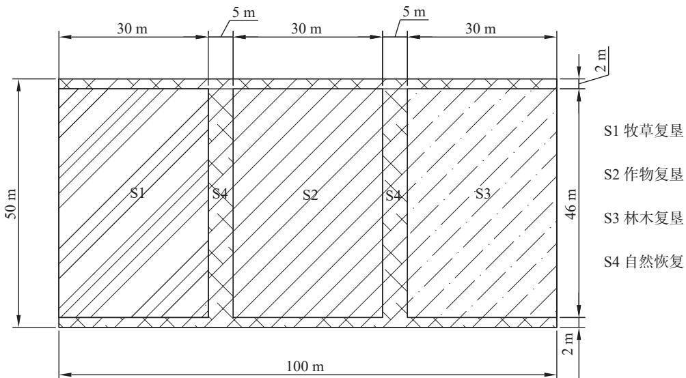  
图1 实验地植被恢复方案示意图  
Fig. 1 Experimental design for different vegetation restoration methods

表 1 样地信息表  
Tab. 1 Information on the six sample sites
<table><tr><td>样地编号</td><td>恢复年限/a</td><td>恢复方式</td><td>优势物种</td></tr><tr><td>CK</td><td>1</td><td>自然恢复</td><td>植物稀疏，无显著优势种</td></tr><tr><td>S1</td><td>1</td><td>牧草复垦</td><td>紫苜蓿(Medicago sativa)</td></tr><tr><td>S2</td><td>1</td><td>作物复垦</td><td>冬小麦(Triticum aestivum)</td></tr><tr><td>S3</td><td>1</td><td>林木复垦</td><td>新疆杨 (Populus alba var. pyramidalis)、丁香 (Syringa oblata)、 白榆 (Ulmus pumila)、樟子松 (Pinus sylvestris var. mongholica)</td></tr><tr><td>S4</td><td>1</td><td>自然恢复</td><td>植物稀疏，无显著优势种</td></tr><tr><td>S5</td><td>10</td><td>自然恢复</td><td>狗尾草(Setaria viridis)</td></tr></table>

## 1.2 土壤理化性质测定

2022年7月，分别在6个样地随机选取3个样点，分层采集0—10 cm、10—20 cm两层的土壤样品.带回实验室后，风干保存，用于理化性质测定.土壤pH值采用电位法测定；土壤电导率使用电极法测定；土壤有机质含量用重铬酸钾容量法测定；土壤速效氮用碱解扩散法测定；土壤速效磷用碳酸氢钠提取-钼锑抗比色法测定；土壤速效钾用乙酸铵浸提-火焰光度法测定.每个土壤样品均重复测定3次取其平均值作为本研究的原始数据.

## 1.3 地下生物量测定

2022年12月在土壤样品采集点周边，使用根钻法采集0—10 cm和10—20 cm 土壤样品.带回实验室后置于0.2～0.5mm筛网过筛，先除去大部分土壤，再水洗获得干净的根系，放入70℃烘箱中烘干至恒重并称重.

## 1.4 数据统计分析

所有数据的录入整理在 Excel 2007 中完成. 使用方差分析和 LSD (Least Significant Difference)多重检验法检验不同样地之间土壤理化性质和地下生物量的差异显著性 $\left( p < 0 . 0 5 \right)$ .采用简单线性回归

分析土壤理化性质和地下生物量相关性.以上统计分析均在SPSS17.0软件中完成.

## 2 结果与分析

## 2.1 不同植被恢复模式下土壤理化性质差异

土壤改良后采用人工复垦植被的 3 个实验处理样地(S1、S2、S3)，其0—10 cm和 10—20 cm 土层的有机质、速效氮、有效磷和速效钾含量均显著高于CK样地；有机质、有效磷和速效钾含量是CK的2～3倍；速效氮是CK的15～25倍；S4仅速效钾含量显著高于CK，有机质、速效氮和有效磷的含量与CK无显著差异.土壤改良后的4个实验处理样地，其土壤pH值和电导率与CK样地无显著差异(图2).

与S5相比，S1、S2、S3的速效氮、有效磷和速效钾含量显著较高；S3的土壤有机质含量显著较高；S4的速效钾含量显著高于 S5,其他养分含量无显著差异；但所有土壤改良样地(S1、S2、S3、S4)的土壤 pH值显著高于 S5; 此外，CK样地除了pH值显著高于 S5 以外，其他指标没有显著差异(图2).

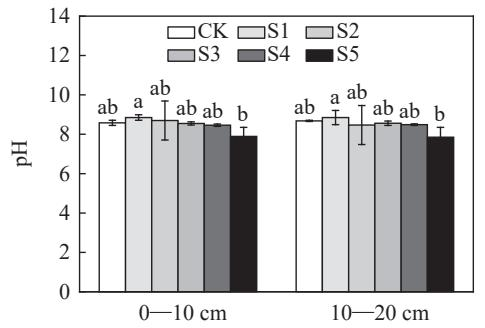

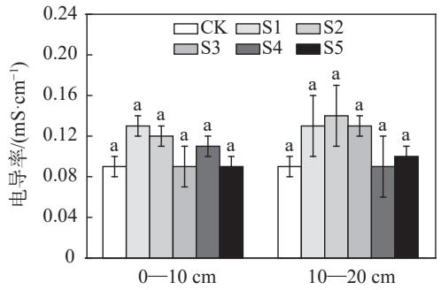

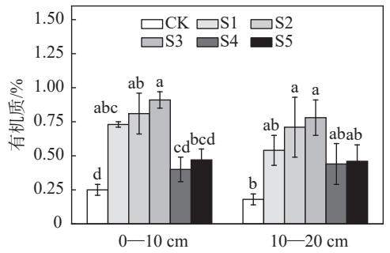

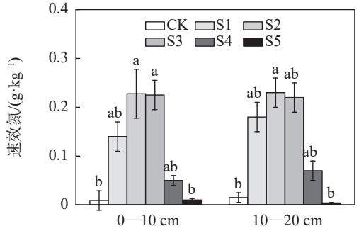

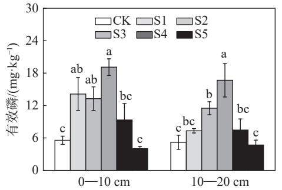

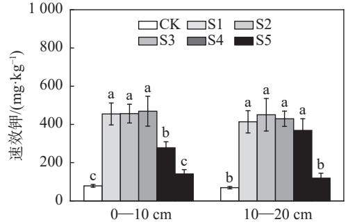  
注:以小写字母表示相同深度下不同样地间差异是否显著.  
图2 各样地不同土层土壤理化性质的差异  
Fig. 2 Differences in average physicochemical properties of soils in different layers and locations

这些结果表明，土壤改良和人工植被复垦措施在实施1年后已经有效地改善了土壤养分条件，其中林木复垦方式(S3)效果最好，但在短期内并没有改善土壤pH值和电导率.

## 2.2 不同植被恢复模式下地下生物量差异

土壤改良后采用人工复垦植被的 3 个实验处理样地(S1、S2、S3)，其 0—10 cm 和 10—20 cm 土层的地下生物量显著高于CK样地，是其2～5倍.S4的10—20 cm土层的地下生物量显著高于CK.与S5相比，仅S3的地下生物量显著较高（(图3). 这表明，土壤改良措施可以有效地促进植物根系生物量积累，并且采用林木复垦可以在短期内使地下生物量的恢复程度超过自然恢复10年的效果.

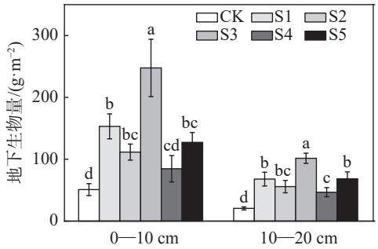  
注:以小写字母表示相同深度下不同样地间差异是否显著  
图3 各样地不同土层土壤地下生物量均值  
Fig. 3 Average subsurface biomass in different soil layers

## 2.3 地下生物量与土壤理化性质的关系

在0—10cm土层处，地下生物量和有机质、有效磷和速效钾含量呈极显著正相关 $\left( p < 0 . 0 1 \right)$ ，和速效氮含量呈显著正相关 $\left( p < 0 . 0 5 \right)$ (图 4). 其中，有机质对 $0 { - } 1 0 ~ \mathrm { c m }$ 土壤地下生物量变化的解释度最高 $( R ^ { 2 } = 0 . 4 8 )$ ，大于速效氮 $( R ^ { 2 } = 0 . 2 5 )$ 、有效磷 $\left( R ^ { 2 } = 0 . 3 8 \right)$ 和速效钾 $( R ^ { 2 } = 0 . 3 6 )$ .在 10—20 cm土层处，地下生物量和有机质、有效磷含量呈极显著正相关 $\left( p < 0 . 0 1 \right)$ (图 5). 其中，有效磷对$1 0 { - } 2 0 ~ \mathrm { c m }$ 土壤地下生物量解释度最高 $( R ^ { 2 } = 0 . 3 7 )$ ，大于有机质 $\left( R ^ { 2 } = 0 . 3 5 \right)$ 、速效氮 $( R ^ { 2 } = 0 . 1 5 )$ 和速效钾 $( R ^ { 2 } = 0 . 1 4 )$ .这表明不同植被模式对土壤养分的改良效果与植物地下生物量密切相关.

## 3 讨 论

土壤有机质和营养元素可以反映土壤的肥力水平，以往许多研究表明，在土壤中添加有机肥和植被恢复可以有效增加土壤的有机质和养分含量[]，且不同植被对土壤理化性质影响具有差异[12].本研究结果显示，添加有机肥和植被恢复均可以增加土壤的有机质和养分含量，且两者协同作用显著大于单独添加有机肥.这表明植被的恢复进一步促进了土壤养分的提升，其主要原因是植物根系与土壤的交互作用.

根系作为土壤与植物地上部分之间物质、能量流动与信号传导的关键纽带，在保持水土、涵养水源、养分循环等方面具有重要的生态系统服务功能.一方面，根系的增多可以增加植物对养分的吸收面积：另一方面，根系的生长可以形成通道改善土壤的结构和通气透水能力[15].本研究中，不同植被恢复土壤的地下生物量均显著高于对照组.其中，林木复垦土壤的地下生物量最高，显著高于其他处理组，说明植被复垦加速了当地的植被恢复，且林木复垦的恢复速度大于其他植被恢复.矿区的生态恢复有赖于植被的恢复，植被恢复过程的实质是植被与环境相互影响和相互作用的过程6，本研究中十壤地下生物量与有机质、速效氮、有效磷和速效钾含量呈正相关，和pH值、电导率无显著相关关系，这与杜锋等[17]对陕北黄土丘陵区牧草复垦模式下生物量与土壤养分效应的研究一致，即随着土壤有机质、全氮、磷、钾、氨氮、速效钾和有效磷含量的增大，地上、地下生物量均会增高.本研究中由于土壤酶活性差异不大，未与地卜生物量显示出明显的相关性，然而其他一些研究表明，在土壤生态系统恢复过程中，土壤酶活性与有机质、速效氮等养分含量存在显著相关关系，酶活性的提高可以促进土壤生态环境和土壤肥力的改善18-19，土壤肥力改善的同时又进一步促进了植被的生长

但本研究只是评估了土壤改良与植被恢复联用模式的短期影响.由于复垦时间较短，不同植被复垦土壤的有机质和养分含量差异不大，不同植被复垦间的土壤养分差异未体现出来，此外，植被恢复措施没有明显改善土壤 $\mathrm { p H }$ 值和电导率，以往的研究表明土壤 $\mathrm { p H }$ 值随着复垦年限的增加而降低20，本研究中10年期自生草地相较实验田土壤也存在类似的现象.长期复垦后土壤动物和微生物会产生酸性代谢物，此外，凋落物腐烂分解产生有机酸会导致土壤 $\mathrm { p H }$ 值下降21].因此，实验地由于复垦时间短导致 $\mathrm { p H }$ 改良效果尚未显现.

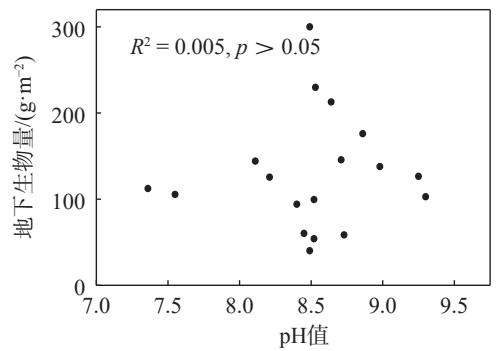

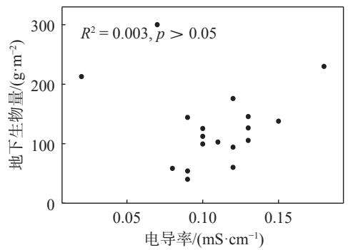

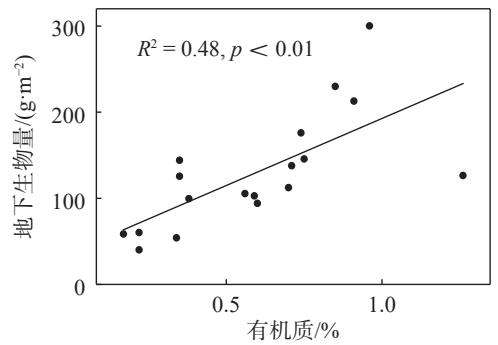

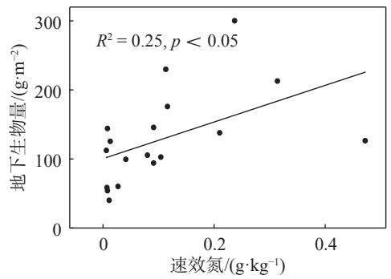

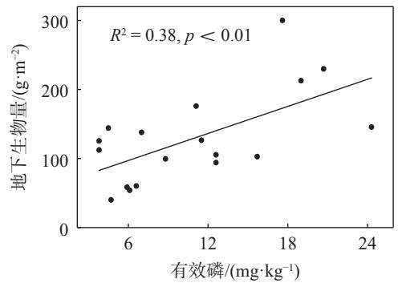

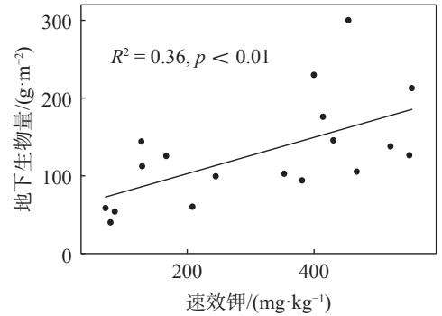  
图4 0—10 cm 土壤地下生物量与土壤理化性质的相关分析  
Fig. 4 Results of correlation analysis of subsurface biomass and physicochemical soil properties in 0–10 cm soil layer

## 4 结 论

本研究通过大田实验检验了土壤改良和不同植被恢复措施联用对西北地区露天煤矿排土场生态修复的促进作用，研究结果发现，土壤改良剂的使用显著增加了土壤养分含量，促进了植物根系的生长；人工植被复垦较自然植被恢复而言，能在短期内进一步固化提升土壤养分改良的成效，其中林木

复垦的效果优于牧草复垦和作物复垦的效果.

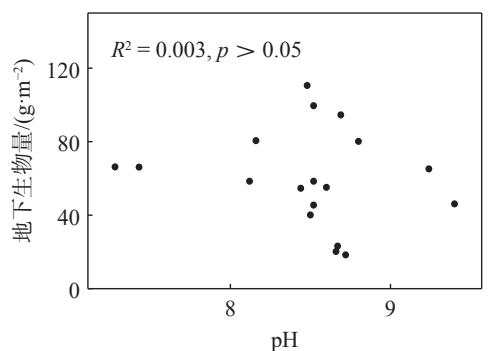

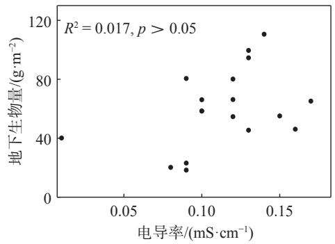

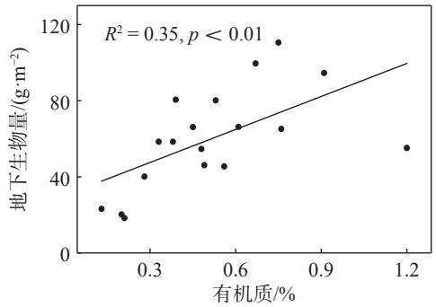

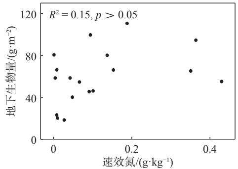

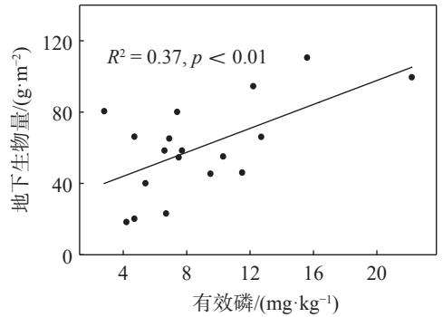

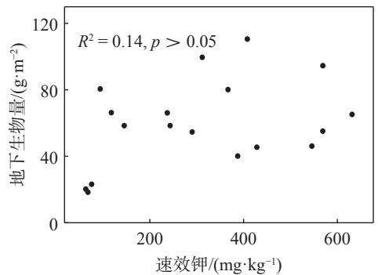  
图 5 10—20 cm 土壤地下生物量与土壤理化性质的相关分析  
Fig. 5 Results of correlation analysis of underground biomass in 10–20 cm soil layer and physical and chemical soil properties

## [参考文献]

[1]王庆刚，徐燕飞，朱美华，等. 煤矿区土地复垦技术与发展方向探析[J]. 陕西煤炭，2019, 38(4):59-62.

[2] 赵洪宝，李岳，张鸿伟，等. 基于土壤肥力恢复力模型的河曲露天煤矿复垦治理效果评价[J]. 矿业科学学报，2024,9(1):77-87.

[3] 张莉，王金满，刘涛.露天煤矿区受损土地景观重塑与再造的研究进展[J]. 地球科学进展，2016,31(12):1235-1246.

[4] 郝文芳，梁宗锁，陈存根，等.黄土丘陵区弃耕地群落演替过程中的物种多样性研究[J]. 草业科学，2005,22(9):1-8.

[5] 张杨. 聚丙烯酰胺在农业中的应用[J]. 养殖技术顾问，2014(10):285.

[6] 曹远博，王百田，魏婷婷，等.2种型号保水剂的特性及其应用研究[J]. 水土保持学报，2014,28(4):283-288.

[7] 吴淑芳，陈循军，杜建军，等. 高吸水性树脂在农业生产中的应用研究进展[J]. 化工新型材料，2018,46(12):247-251.

[8] 刘杏兰，高宗，刘存寿，等. 有机-无机肥配施的增产效应及对土壤肥力影响的定位研究[J]. 土壤学报，1996,33(2):138-147.

[9 ] YANG X Y, REN W D, SUN B H, et al. Effects of contrasting soil management regimes on total and labile soil organic carbon fractions in a loess soil in China [J]. Geoderma, 2012, 177: 49-56.

[10]李中阳，徐明岗，李菊梅，等. 长期施用化肥有机肥下我国典型土壤无机磷的变化特征[J]. 土壤通报，2010,41(6):1434-1439.

[11] 王振宙，王改兰，张亮，等. 长期施肥土壤钾有效性与腐殖质组分相关性研究[J]. 山西农业大学学报(自然科学版)，2011,31(3)：200-204.

[12] BUTA M H, BLAGA G, PAULETTE L, et al. Soil reclamation of abandoned mine lands by revegetation in northwestern part of transylvania: A 40-year retrospective study [J]. Sustainability, 2019, 11(12): 3393.

[13] LI M S. Ecological restoration of mineland with particular reference to the metalliferous mine wasteland in China: A review of research and practice [J]. Science of the Total Environment, 2006, 357(1/2/3): 38-53.

[14] 王桂林，宫鹤忆，商侃侃，等. 保水剂和有机肥配施对露天煤矿排土场土壤持水性的影响[J]. 华东师范大学学报(自然科学版)，2023(3):64-70.

[15] 樊子豪. 黄河下游河岸带不同植被群落生物量与根系分布及其土壤理化性状研究[D]. 郑州:河南农业大学,2022.

[16] 刘爽，郭晋丽.煤矿区土壤—植被恢复过程及模式研究进展[J]. 山西农业科学，2017,45(10):1710-1713

[17] 杜峰，梁宗锁，徐学选，等. 陕北黄土丘陵区撂荒草地群落生物量及植被土壤养分效应[J]. 生态学报，2007,27(5):1673-1683

[18] PATI S S, SAHU S K. CO2 evolution and enzyme activities (dehydrogenase, protease and amylase) of fly ash amended soil in the presence and absence of earthworms (Drawida willsi Michaelsen) under laboratory conditions [J]. Geoderma, 2004, 118(3/4): 289-301.

[19] 安韶山，黄懿梅，刘梦云，等.宁南宽谷丘陵区植被恢复中土壤酶活性的响应及其评价[J]. 水土保持研究，2005，12(3):31-34.

[20] 邵田田，王明玖，齐雪.草原露天煤矿排土场重建植被与土壤相关性研究[J]. 草原与草业，2021,33(3):21-27.

[21] 万晓红，周怀东，刘玲花，等. 白洋淀湖泊湿地中氮素分布的初步研究[J]. 水土保持学报，2008,22(2):166-169.

(责任编辑: 张 晶)