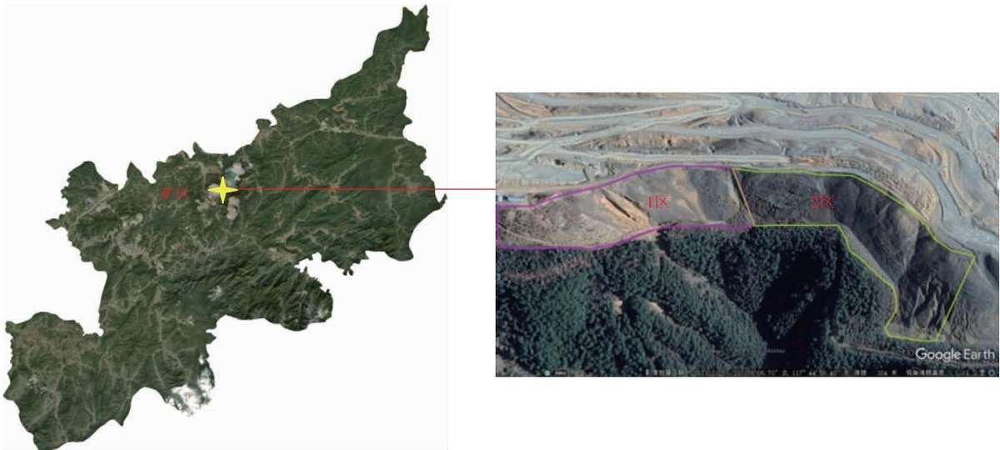
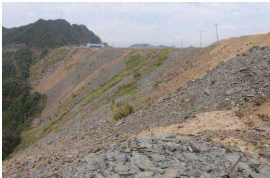
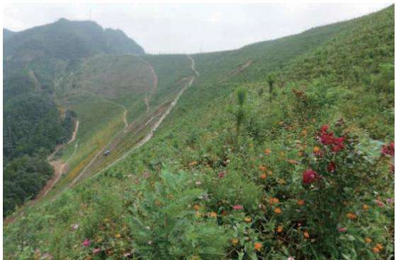
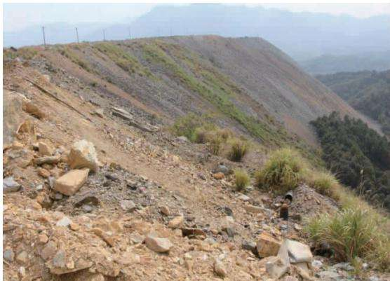
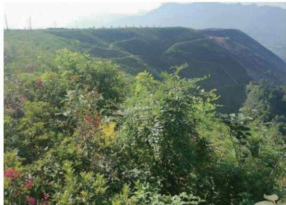
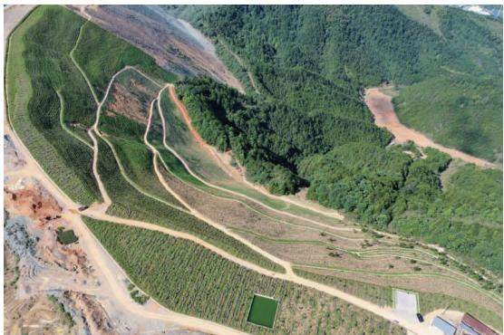
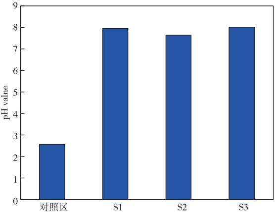

doi:10.3969/j. issn. 1671-4172. 2023.06.015

# 铜矿区排土场生态恢复工程实施效果评价

袁霜（江西铜业股份有限公司德兴铜矿，江西德兴334200)

摘要：以复垦后的某铜矿区排土场生态系统为研究对象，从植被恢复、水土保持、地形地貌、污染治理效果等方面，系统分析了其生态修复工程的实施效果。结果表明：生态恢复区土壤酸性问题得到有效改善，土壤pH值提高至7.64～8.01，区域酸性水源头减量化明显，年产生量减少约18.14万m³。治理区植物品种达17种，生物多样性高，植被覆盖度达95%以上。建设了截水沟、导水沟和排水沟，有效防止了地表汇水径流和平台积水对坡面土壤的冲刷作用。因势造形和修整坡面，提高了边坡稳定性和修缓坡面，复垦区域生态系统已进入正常的演替过程。本研究对生态恢复工程的实施效果进行系统评估，为矿区生态重建提供理论和实践依据。

关键词：铜矿排土场；生态恢复工程；植被；水土保持；地形地貌；污染治理

中图分类号：X171.5

文献标志码：A

文章编号:1671-4172(2023)06-0102-04

# Evaluation on implementation effect of ecological restoration project in copper mine dump

YUAN Shuang (Dexing Copper Mine,Jiangxi Copper Corporation Limited,Dexing Jiangxi 334200 ,China)

Abstract: Taking the ecological system of a copper mine after reclamation as the research object, the implementation effect of the ecological restoration project was systematically analyzed from the aspects of vegetation restoration,soil and water conservation,landform, pollution control effect, and so on. The results showed that the soil acidity problem in ecological restoration area was effectively improved with soil pH value increased to 7. 64—8. 01, and the effect of an ecological restoration project on acid water source reduction was significant, with an annual reduction of approximately 181 400 m³ in acidic water production. There were 17 plant species in the treated area, with high biodiversity and vegetation coverage of over 95% , and the construction of cutoff ditches,guide ditches,and drainage ditches effectively prevented the erosion of surface catchment runoff and platform water on slope soil. Due to the improvement of slope stability and gentle slope surface, the ecosystem in the reclaimed area has entered the normal succession process. This study systematically evaluated the implementation effect of ecological restoration projects, providing a theoretical and practical basis for ecological reconstruction in mining areas.

Key words: copper mine dump; ecological restoration project; plant cover; conservation of water and soil; topography;pollution control

矿产资源开发对国民经济发展发挥重要贡献的同时，也带来了严重的生态破坏、环境污染、土地占损等问题1-3]。我国重点金属矿山中约90%为露天开采，土地压占和土壤破坏问题尤为严重。据统计，我国露天矿山每年排弃废石量共约10亿t，占地面积约80000～86667hm²，其中，冶金露天矿每年排弃废石量约5亿t，排土场占地面积是矿山总占地的40%～55%[4]。排土场为矿山剥离废石土松散体的受纳场所，对排土场开展污染修复和生态复垦工作成为矿山可持续发展的关键[5]。

目前，国内外学者在生态复垦领域开展了大量研究，并取得了较好的成果[6-8]。本研究针对铜矿区排土场生态恢复问题，通过具体案例，梳理工程实施情况，评估生态恢复效果，以植被恢复、水土保持、地形地貌、污染控制等为指标，旨在对生态复垦工程的效果进行评价，总结工程治理经验，为合理选择生态修复技术提供支撑。

## 1 材料与方法

## 1.1 研究区概况

研究区地处江西省上饶地区德兴市境内，属亚热带季风气候，湿润多雨，气候温和。矿区排土场边坡原始地形地貌复杂，山势陡峭，采用电动轮汽车运输、推土机推排作业方式，就近、压坡脚式排土，排土段高大，最高排土标高为500m，最低排土标高为380m。采用高段排土形成的高陡边坡，边坡坡面长度达175m，治理区域范围周长约810m，该区域排土场边坡陡峭，约一半范围是土石相结合的排土形成的边坡，另一半坡面为全风化岩石和强风化岩废石料堆存形成的边坡，生态恢复面积为 $1 3 5 \ : \ : 0 0 0 \ : \mathrm { m ^ { 2 } }$ 。矿区位置及研究区卫星图如图1所示。

  
图1 矿区位置及研究区卫星图  
Fig. 1 Satellite map of Mine location and research area

## 1.2 评估方法

## 1.2.1 污染调查

在显著异质性的代表性地段取样，共采集4个土壤样品(包括对照点1个)，采集深度为 $0 \sim 2 0 ~ \mathrm { c m }$ 分析复垦前后土壤pH值。

## 1.2.2 植被调查

样方设置：在项目区域样地上中下三个区域，各区域随机设置3个样方，乔木群落样方面积为 $\mathrm { 1 0 \times 1 0 ~ m ^ { 2 } }$ 灌木样方为 $4 \times 4 ~ \mathrm { m ^ { 2 } }$ ，草本样方为 $1 \times 1 ~ \mathrm { m ^ { 2 } }$ 。以样方内的植物作为调查对象。

测定方法：采用对角线测量法。该方法是直接目估法的改进，分别估测两条对角线上植被的覆盖度(重叠部分只算1次），按算术平均计算样地的植被覆盖度，并采用无人机航拍照片对覆盖度数据进行复核。

## 2 结果与讨论

## 2.1 植被恢复效果

样方调查评估复垦区域植被覆盖度和多样性，结果显示，实施区域已形成多种植物匹配互长的生长态势，生物多样性高，已记录的植物品种达到17种，植被的整体覆盖度达95%以上，涵盖乔木、灌木、草本等(图2）。随着后期植物的生长和不断演替，研究区域植物种类数目不断增加，整个区域的植物群落结构将会接近周边区域内原生态山林，最终向森林生态系统转变，带动整个区域及周边生态环境质量显著提升。

  
位置一（实施前）

  
位置一（实施后）

  
位置二（实施前）

  
位置二（实施后）  
图 2 植被恢复效果对比  
Fig. 2 Comparison of vegetation restoration effect

## 2.2 水土保持效果

根据研究区域高差和水流走向分别于平台顶部、坡面和坡脚建设了截水沟、导水沟和排水沟，共计约3322m，同时为减弱汇水冲击作用，设计7个沉沙池，有效地防止了地表汇水径流和平台积水对坡面土壤的冲刷作用。

植物的地上部分能够减弱雨水对地表土壤的直接冲刷，延迟地表径流形成；植物地下茂密的根系能够增强土壤渗透率，有效实现地表水的截留，并通过水分的吸收降低水土流失，高达95%覆盖度的地表植被对水土保持效果起到有效保障作用。

## 2.3 地形地貌效果

排土场边坡生态恢复项目基于“原状修复，减少扰动”的原则，在保持原有地形地貌及边坡的固有稳定性，通过反削坡顶拉长坡面以减缓坡度等措施因势造形和修整坡面，用最少的扰动确保边坡地形地貌自然态，达到提高边坡稳定性和修缓坡面的目的。通过砌筑坡脚生态袋挡墙和植被生态恢复，有效改善了研究区及附近区域的生态环境和自然景观，同时有效抑制了区域水土流失、滑坡等地质灾害问题的发生。生态恢复后地形地貌见图3。

  
图3 生态恢复后地形地貌  
Fig. 3 Landform after ecological restoration

## 2.4 污染治理效果

由图4所知，对生态复垦区与未复垦区域土壤采样分析，未复垦区土壤pH值为2.56，复垦后土壤pH值为7.64～8.01，生态恢复工程有效改善了土壤酸性问题。

该区域采取植被恢复和清污分流工程措施后，显著减少降雨入渗量，大部分以地表径流形式导出，涉及汇水面积13.50万m²，平均径流系数按0.65考虑，基于汇水面积和区域年均降水量数据可知，生态恢复工程截排水沟的建设，年截排减少酸性水产生量约18.14万 $\mathrm { m ^ { 3 } }$ ，实现了源头截污减污，减少了酸性水产生。

  
图 4 土壤 pH 值监测结果  
Fig. 4 Soil pH value monitoring results

## 3 结论与建议

1)根据生态恢复工程评估结果，生态恢复效果等级均为优，达到了生态环境治理目标，植被覆盖度达到95%以上。通过场地和边坡修整、修建截排水设施、土壤改良、植被恢复和抚育等措施，有效地防止了地表径流对坡面的冲刷侵蚀和水土流失，提高了边坡稳定性，改善了治理区及周边生态环境和自然景观，抑制了滑坡等地质灾害问题发生。

2)土壤 $\mathrm { p H }$ 值为7.64～8.01，生态恢复工程有效改善了土壤酸性问题，年截排减少酸性水产生量约18.14万 $\mathrm { m ^ { 3 } }$ ，实现了源头截污减污目的。

3)植被恢复是大气温室气体增汇减排、缓解全球气候变化的重要措施之一，对碳中和具有一定的贡献。建议对研究区土壤和植被群落做定期跟踪监测，掌握土壤养分和重金属的逐年变化情况，明确植被恢复演替变化规律，为绿色矿山建设提供理论支撑。

## 参考文献

[1]韩煜，全占军，王琦，等.金属矿山废弃地生态修复技术研究[J].环境保护科学，2016,42(2):108-113,128.

HAN Yu, QUAN Zhanjun, WANG Qi, et al. Research of ecological restoration of metal mine abandoned lands [J]. Environmental Protection Science,2016,42(2):108-113,128.

[2] 翟文龙.国内外矿山生态修复现状与对策分析[J].有色金属 (矿山部分)，2022，74(4):115-118. ZHAI Wenlong. Analysis on the status and countermeasures of mine ecological restoration at home and abroad[J]. Nonferrous Metals(Mining Section),2022,74(4):115-118.

[3]代宏文.矿区生态修复技术[J].中国矿业，2010，19(8):58-61. DAI Hongwen. The techniques of ecological remediation and rehabilitation for derelict mine land [ J ]. China Mining Magazine,2010,19(8):58-61.

[4] 王运敏，项宏海.排土场稳定性及灾害防治[M].北京：冶金工 业出版社，2011. WANG Yunmin, XIANG Honghai. Waste dump stability and disaster prevention[M]. Beijing: Metallurgical Industry Press, 2011.

[5]邱宇，徐文彬，周玉新.我国冶金矿山排土场研究现状及展望[J].金属矿山，2016，45(9)：15-22.QIU Yu, XU Wenbin, ZHOU Yuxin. Research status andexpectation of the waste dump in metallurgical mine inChina[J]. Metal Mine,2016,45(9):15-22.

[6]程睿.基于生态复垦的铜矿排土场污染土壤修复效应研究[J]. 地球环境学报，2022，13(5)：631-640. CHENG Rui. Study on remediation effects of contaminated soil in copper mine waste-dumps based on ecological reclamation[J]. Journal of Earth Environment,2022,13(5):631-640.

[7] 周连碧.我国矿区土地复垦与生态重建的研究与实践[J].有色 金属，2007,59(2)：90-94. ZHOU Lianbi. Investigation and practice on mining land re-habilitation and ecological reconstruction in China [J]. Nonferrous Metals,2007,59(2):90-94.

[8]赵中秋，周增科，梁登，等.金属矿复垦中的污染防治与生态复 垦设计探讨：以广东云安县高枨铅锌矿为例[J].环境科学与技 术，2010,33(12):106-110. ZHAO Zhongqiu, ZHOU Zengke, LIANG Deng, et al. Contamination control and ecological reclamation design in land reclamation of metal mine: case study of Gaocheng zinc-lead mine, Yun'an county, Guangdong province[J]. Environmental Science & Technology,2010,33(12):106-110.

(编辑：周叶)