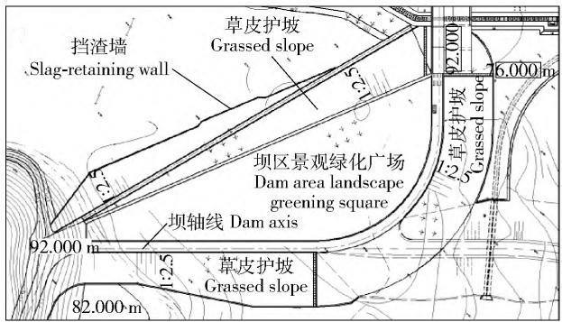
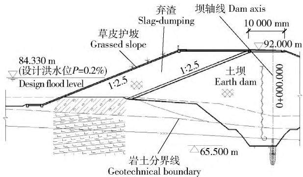
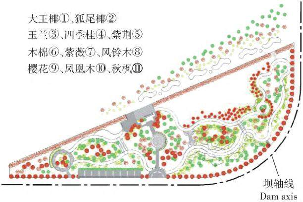
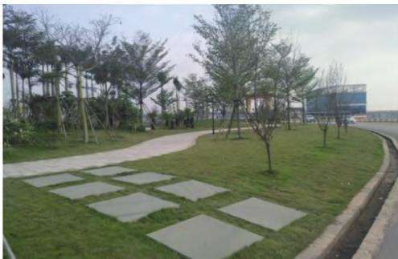

# 水利水电枢纽工程涉水型弃渣场处置方案

龙益辉，梁刚毅，唐玉峰，孙坤君，谢增武( 广西壮族自治区水利电力勘测设计研究院有限责任公司，530023，南宁)

摘要: 弃渣场安全及防护是水土保持重点关注问题，涉水型弃渣场受水位、水流流态变化的影响，安全风险更高。研究涉水型弃渣场处置方案，有助于在实践中规避风险，减少水土流失，并为弃渣场设计 施工 评估等提供借鉴针对已投入运行的水利水电枢纽工程涉水型弃渣场案例，依据现行水土保持及水利水电工程相关标准和规范，确定弃渣场稳定计算工况、允许安全系数和防护工程防洪标准，复核其稳定以及防护措施要求，并结合国内现有相关研究成果归纳总结 结果表明: 案例弃渣场稳定计算结果及措施布设均满足现行标准 规范要求 其中，综合利用型案例弃渣场抗滑稳定正常运用工况计算值为1.503，非常运用工况计算值为 1.507 和 1.410; 临河型案例弃渣场抗滑稳定正常运用工况计算值为1.23，非常运用工况计算值为1.10 和1.07;库区型案例弃渣场抗滑稳定正常运用工况计算值为1.34，非常运用工况计算值为1.14 分析认为: 涉水型弃渣场与枢纽工程设计条件关联度高，需综合考虑枢纽所处区域 运行方式及弃渣场与建筑物位置关系等，并应同时满足相关标准和规范要求

关键词: 弃渣场; 涉水型; 处置方案; 水土保持; 水利水电枢纽工程

中图分类号: S157; TV61 文献标志码: A 文章编号: 2096-2673( 2022) 01-0091-08

DOI: 10． 16843 /j． sswc． 2022． 01． 012

# Disposal scheme of residues disposal area of water system-related type in water conservancy and hydropower project

LONG Yihui，LIANG Gangyi，TANG Yufeng，SUN Kunjun，XIE Zengwu ( Guangxi Water and Power Design Institute Co． ，Ltd． ，530023，Nanning，China)

Abstract: ［Background］The safety and protection measures in residues disposal areas are key concerns during water and soil conservation in water conservation and hydropower projects． The water level and the water flow pattern increases the safety risk in water system-related disposal areas． Previous research on treatment options for the residues disposal areas focused on the design of protective measures． In this study，we focused on the designs for the safety and stability of water system-related disposal areas．

［Methods］We re-inspected current standards and specifications and the stability calculation conditions， allowable safety factors，flood control engineering standards，and protective measures requirements for these areas． We then summarized Chinese case studies of such conditions． ［Results］ The stability， safety，and design of safety measures for the residue disposal areas in each case met the current standards requirements． The slope stability against sliding for the comprehensive residues disposal area was 1. 503 under normal operating conditions，but 1. 507 ( check water level) and 1. 410 ( Rapid drawdown of water level) under abnormal operating conditions． The stability against sliding of the riverside residues disposal area was 1. 23 under normal operating conditions，1. 1 ( earthquake) ，and 1. 07 ( continuous rainfall period) under abnormal operating conditions． The stability against sliding of the reservoir-type residues disposal area was 1. 34 under normal operating conditions and 1. 14 ( continuous rainfall period) under

abnormal operating conditions． ［Conculsions］ There is a high correlation between the water system- related disposal areas and the design conditions of the water conservation and hydropower project． The residues disposal area should be designed based on the location，operation mode，and the relationships between the water conservation and hydropower project and the residues disposal area． The designs should not only meet the water and soil conservation regulations，but should also meet national standards and water conservation industry standards． Disposal areas that are designed to meet the stability calculation conditions，allowable safety factors，and flood control engineering standards can reduce risks in the residues disposal area．

Keywords: residues disposal area; water system-related type; disposal scheme; soil and water

conservation; water conservancy and hydropower project

水利水电枢纽工程具有建设周期长，取土弃渣量大的特点，弃渣场已成为水利水电工程水土流失防治重点区域［1］。 由于水利水电枢纽工程枢纽拦河布设的特殊性，弃渣场布置受工程所在河段地形条件的限制，会更多地考虑选择涉水型弃渣场;但涉水型弃渣场一旦失事，弃渣将直接进入河道，危及河流生态环境、涉河建筑物及人民生命财产的安全;较之常规弃渣场，涉水型弃渣场需考虑水位 水流流态变化等的影响，其安全稳定分析和防护措施设计就显得尤为重要。

虽然国内学者对弃渣场的选址 防护措施等作了大量的研究，例如，田育新等［2］对弃渣场进行分类，提出弃渣方式应优先选择填洼( 塘) 弃渣，平地弃渣次之，最后选择沟道弃渣或坡面弃渣; 吕钊等［3］通过分析弃渣场土壤侵蚀类型、特点及影响因素，提出需健全弃渣场水土流失防治措施体系;袁普金等［4］研究弃渣失稳后可能产生的滑移距离，提出弃渣场的安全选址防护距离。 刘冠军［5］提出利用弃渣造地或建设人造景观，美化拦河闸两端环境的思路;周林勇等［6］探讨西南高山区中小水电开发临河( 沟) 型弃渣场的工程措施; 操昌碧［7］分析研究水库型弃渣场的工程防护措施设计等。 但目前针对涉水型弃渣场安全稳定的研究尚不成熟，鉴于强制性条文 “弃渣场防护措施设计应在渣体稳定的基础上进行”的要求［8］，以及涉水型弃渣场的安全问题更为事关重大，笔者选取 3 个已运行的水利水电枢纽工程的涉水型弃渣场，基于安全稳定的处置方案进行研究，研究案例包括综合利用型、临河型及库区型弃渣场。 临河型及库区型弃渣场为SL575—2012 《水利水电工程水土保持技术规范》［8］弃渣场分类中的2 种类型，另外考虑坝区综合利用型弃渣场可能存在涉水情况，纳入案例研究 笔者依据现行标准和规范，针对涉水型弃渣场案例的弃渣场稳定计算工况 允许安全系数，防护工程防洪标准，及防护措施布设要求等进行复核，并结合国内现有涉水型弃渣场研究成果进行归纳和总结，以期在未来实践中规避风险，减少水土流失，并为此类弃渣场的设计 施工 评估等提供经验参考。

## 1 研究案例简况

## 1. 1 广西老口航运枢纽工程

老口航运枢纽工程坝址位于郁江上游，上距南宁市区约28 km，是一座以航运、防洪为主，结合发电，兼顾改善南宁市水环境等的大型综合利用工程。该工程产生弃渣约470 万 m3，其中 23 万 m3弃渣堆置在右岸接头土坝上游侧弃渣场，弃渣场与接头土坝构成右岸坝顶大平台，为坝区景观设计创造条件，属于典型综合利用型弃渣场。

## 1. 2 广西百色澄碧河水库除险加固工程

澄碧河水库工程坝址位于广西百色永乐乡澄碧河下游河段，是一座以供水为主，兼有发电、防洪、旅游等综合效益的大型水利枢纽工程。 工程在除险加固施工过程中产生永久弃渣 25 万 m3 。弃渣场布设在溢洪道下游河道与冲沟交界处，为临河型弃渣场。

## 1. 3 广西防城港市大垌水库工程

大垌水库工程位于防城河支流平垌江上，是一座以供水为主，兼顾发电 灌溉等综合利用的中型水库工程。 工程坝区永久弃渣 145. 5 万 m3，其中 55万 m3的坝基开挖料选址堆放在大坝上游左侧约1 km 的库区冲沟内，弃渣场底 顶面分别低于水库死水位及正常蓄水位，为典型的库区型弃渣场。 研究项目涉水型弃渣场特性见表1。

表1 研究项目涉水型弃渣场特性表  
Tab． 1 Characteristic table of residues disposal areas of water system-related type
<table><tr><td>工程名称 Project name</td><td>案例渣场 名称及类型 Name and type of the cases for residues disposal area</td><td>堆渣量 Slag amount / 104m³</td><td>堆渣最大 高度 Maximum height of slag dumping/m</td><td>渣场失事后 危害程度 Damage degree after slag field in accident</td><td>定级主控因素 Main control factor for grading</td><td>渣场级别 Slag field level</td><td>拦挡工 程级别 Slag-retaining engineering level</td><td>排洪工 程级别 Flood discharge engineering level</td></tr><tr><td>老口航运枢纽 工程 Laokou ship- ping hub project</td><td>老口坝区综合利 用型弃渣场Resi- dues disposal area of comprehensive utili- zation type on Laokou dam region</td><td>23</td><td>14</td><td>不严重 Not serious</td><td>危害程度 Damage degree</td><td>3</td><td>4</td><td></td></tr><tr><td>澄碧河水库除 险加固工程 Chengbi river res- ervoir reinforce- ment project</td><td>澄碧河水库临河 型弃渣场Residues disposal area of river- side type on Chengbi- he reservoir</td><td>25</td><td>22.3</td><td>较轻 Light</td><td>堆渣高度 Slag- dumping height</td><td>4</td><td>5</td><td>4</td></tr><tr><td>大垌水库工程 Dadong reservoir project</td><td>大垌库区型弃渣 场 Residues disposal area of reservoir type on Dadong reservoir</td><td>55</td><td>33</td><td>无危害 No harm</td><td>堆渣量 Slag amount</td><td>4</td><td>5</td><td>5</td></tr></table>

注: 表中 “—” 表示 “不涉及” Notes: The “— ” indicates “uninvolved ”.

## 2 涉水型弃渣场处置方案

根据 SL 575—2012 《水利水电工程水土保持技术规范》［8］及 GB 50433—2018 《生产建设项目水土保持技术标准》［9］，弃渣场独立分区，其综合防治体系由工程措施 植物措施及临时措施构成 本研究所述3 类涉水型弃渣场处置方案在满足渣体稳定前提下，措施各有侧重

## 2. 1 老口坝区综合利用型弃渣场

老口航运枢纽工程右岸接头土坝下游紧邻冲沟，受场地限制，利用围堰拆除的弃渣料在接头土坝上游侧回填成与坝顶等高的平台，形成坝区综合利用型弃渣场，渣体坡面布设有通往鱼道的连接道路。堆渣高度约14 m，堆渣坡比1∶2.5，坡脚设置混凝土挡渣墙，坡面植草护坡，渣顶及坡面布设排水系统，在渣顶与土坝坝顶形成的大平台布设园林绿化，营造坝区特色景观。 由于老口航运枢纽工程承担防洪任务，而渣场底高程低于防洪高水位( 84.2 m) ，渣体存在受库水浸泡及水位变幅影响的情况，弃渣场稳定分析是设计的关键点，渣顶的植物措施布设是工程特色。 老口弃渣场布置情况见图1 及图2。

2. 1. 1 土坝及弃渣场稳定性 右岸接头土坝建筑物级别为1 级，设计洪水标准为 500 年一遇，校核洪水标准为5 000 年一遇。 土坝坝高15 ～20 m，坝顶宽10 m，上、下游坡坡比均为 1∶ 2. 5。 接头土坝沿坝轴线垂直方向伸向上游山体封闭成库，土坝在坝轴线与垂线形成的直角转弯处以半径为100 m 的圆弧连接，坝区综合利用型弃渣场布设于转弯段范围，回填渣料与土坝之间通过60 cm 过渡层分区 现状土坝已与弃渣场浑然一体 原设计仅对接头土坝上 下游坝坡采用简化毕肖普法进行抗滑稳定性计算，坝体压实度为 0. 98。 原设计未对弃渣场稳定性进行计算，仅提出施工要求，要求渣体压实度达 0. 90，分层填筑厚度 ≤500 mm。笔者对弃渣场稳定性进行复核。 由于弃渣场位于土坝上游侧，受枢纽运行水位变幅影响，采用与土坝相同的稳定计算工况和抗滑稳定安全系数 对比 SL575—2012 《水利水电工程水土保持技术规范》［8］，SL 274—2020 《碾压式土石坝设计规范 》［10］增加了完建及水位骤降2 种控制稳定的计算工况，由于工程已运行多年，不再复核完建工况;依据枢纽运行调度要求，弃渣场稳定性计算存在水位骤降工况。 弃渣场抗滑稳定性计算采用简化毕肖普法。 稳定性计算采用的物理力学参数见表 2; 计算工况及稳定性计算结果见表 3。 表中 “允许值”，即抗滑稳定最小安全系数采用 SL 274—2020 《碾压式土石坝设计规范》中1 级坝所对应的数值。

  
图1 老口弃渣场平面布置图

Fig． 1 Floor plan of Laokou residues disposal area  
  
图 2 老口弃渣场剖面图  
Fig． 2 Cross-section of Laokou residues disposal area

表2 老口土坝及弃渣场稳定性计算参数  
Tab． 2 Calculating parameters of soil dam and residues disposal area stability in Laokou
<table><tr><td rowspan="2">土料名称 Name of</td><td colspan="2">密度 Density  $\rho / \big ( \mathrm { g } ^ { \bullet } \mathrm { c m } ^ { - 3 } \big )$ </td><td rowspan="2"></td><td colspan="4">击实后抗剪强度 Shear strength after compaction</td></tr><tr><td>天然 Natural</td><td>饱和 Saturatied</td><td colspan="2">水上 Above water 黏聚力 内摩擦角</td><td colspan="2">水下 Under water 黏聚力 内摩擦角</td></tr><tr><td>soil material 右岸接头坝土料</td><td></td><td></td><td></td><td>Cohesion c/kPa</td><td>Internal friction angle Φ/(°)</td><td>Cohesion c/kPa</td><td>Internal friction angle Φ/(°)</td></tr><tr><td>Soil materials of the joint dam on the right bank</td><td>1.90</td><td>1.95</td><td></td><td>13.0</td><td>22</td><td>11.0</td><td>20</td></tr><tr><td>弃渣料 Slag-dumping</td><td>1.95</td><td>2.00</td><td></td><td>7.5</td><td>26</td><td>5.5</td><td>24</td></tr></table>

表3 老口土坝及弃渣场抗滑稳定性计算结果

Tab． 3 Calculated stabilities against the sliding of soil dam and residues disposal area in Laokou
<table><tr><td rowspan="3" colspan="2">部位 Location</td><td colspan="4">正常运用工况 Normal operating conditions 完建工况</td><td colspan="4">非常运用工况 Abnormal operating conditions</td></tr><tr><td colspan="2">Completed construction</td><td colspan="2">防洪水位工况 Flood control water level</td><td colspan="2">校核水位工况 Check water level</td><td colspan="2">水位骤降工况 Rapid drawdown of water level</td></tr><tr><td>计算值 Calculated Permissible value</td><td>允许值 value</td><td>计算值 Calculated Permissible value</td><td>允许值 value</td><td>计算值 Calculated Permissible value</td><td>允许值 value</td><td>计算值 Calculated Permissible value</td><td>允许值 value</td></tr><tr><td rowspan="2">接头土坝 Joint earth dam</td><td>上游坝坡 Upstream dam slope</td><td>1.804</td><td>1.500</td><td>1.515</td><td>1.500</td><td>1.558</td><td>1.300</td><td>1.376</td><td>1.300</td></tr><tr><td>下游坝坡 Downstream dam slope</td><td>1.707</td><td>1.500</td><td>1.706</td><td>1.500</td><td>1.730</td><td>1.300</td><td>1.312</td><td>1.300</td></tr><tr><td>弃渣场 Residues disposal area</td><td>上游堆渣面 Upstream slag-dumping surface</td><td></td><td>1.500</td><td>1.503</td><td>1.500</td><td>1.507</td><td>1.300</td><td>1.410</td><td>1.300</td></tr></table>

注: 表中 “—” 表示 “不涉及” Notes: The “— ” indicates “uninvolved ”．

2. 1. 2 弃渣场植物措施设计 渣场上游坡面采用植草护坡。 渣顶大平台形成坝区景观广场，植物措施主要以乔、灌、草绿化为主，结合景墙、亭子、花池等景观小品点缀其间。 符合主要建筑物级别 1 级，相应枢纽永久占地区植被恢复级别采用1 级的水土保持要求。 老口弃渣场植物措施布设及效果见图 3及图 4 。

## 2. 1. 3 坝区综合利用型弃渣场研究结果与分析

1) 对比 SL 575—2012 《水利水电工程水土保持技术规范》 SL 274—2020 《碾压式土石坝设计规范》及 GB 50286—2013 《堤防工程设计规范 》，1 级弃渣场抗滑稳定安全系数分别与2 级土石坝及2 级土堤一致，以下级别依此类推。 老口综合利用型弃渣场位于接头土坝上游，受枢纽运行水位变幅影响，采用与相邻枢纽建筑物相同的计算工况及抗滑稳定安全系数允许值，在各种运用工况下，稳定计算结果均满足现行规范要求。

  
①Roystonea regia． ②Wodyetia bifurcata． ③Yulania denudata． ④ Osmanthus fragrans． ⑤Cercis chinensis． ⑥Bombax ceiba． ⑦Lagerstroemia indica． ⑧Handroanthus chrysanthus． ⑨Cerasus sp． ⑩Delonix regia． 11 Bischofia javanica

图3 老口弃渣场平台景观绿化图  
Fig． 3 Landscape greening map of Laokou residues disposal area platform  
  
图4 老口弃渣场平台绿化效果  
Fig． 4 Greening effect of Laokou residues disposal area platform

2) SL 274—2020 《碾压式土石坝设计规范 》 和GB 50286—2013 《堤防工程设计规范》中不同级别的土石坝及土堤分别对应不同的压实度值。 目前相关技术标准尚无渣体压实控制方面的规定［1］，老口弃渣场压实度为 0. 9，略低于 GB 50286—2013 《堤防工程设计规范》中的3 级土堤压实度值0.91［11］

3) 水利水电枢纽工程弃渣场往往由于地形 施工条件等原因选址困难。 邻近城镇的水利水电枢纽工程，虽不受限于地形、施工条件，但也存在周边土地开发程度高，弃渣场征地困难且征地费用高的问题，弃渣场选址本着以人为本、集约节约、绿色发展原则，可考虑在坝区内设置综合利用型弃渣场。 为减少水位变幅对于渣场安全的影响，弃渣场尽可能布设在坝址下游侧。 在弃渣场稳定的前提下，利用

其为坝区造景提供条件。

## 2.2 澄碧河水库临河型弃渣场

澄碧河水库临河型弃渣场呈 “L”型布置，“L”型短边侧临溢洪道下游河道，长边位于低洼冲沟内 上游汇水面积较大，汇水经324 国道路基下已埋设的暗涵排至弃渣场所处低洼冲沟内。 弃渣场临河侧最大堆渣高度22.3 m，分2 级台阶堆置，堆渣坡比1∶1.8，渣顶高程比路面高程低约0.5 ～0.7 m，为同时满足行洪与渣料堆存的要求，结合场地条件，采用挡渣堤进行拦渣及防洪。 坡面采用草皮护坡，渣顶亦采用草皮防护并待后期利用。 冲沟处渣体底部布设钢筋混凝土排水涵管与324 国道暗涵相接，将上游来水引至渣场“L”型拐点处，排至河道 本弃渣场稳定分析 临河侧拦挡及渣体下部排洪工程设计是关键点

2.2. 1 弃渣场稳定性 工程弃渣以石渣为主，根据地质资料，渣料密度为 1. 96 g/cm3，黏聚力2. 6 kPa，内摩擦角29° 弃渣场抗滑稳定性计算采用简化毕肖普法。 考虑弃渣场最大堆渣高度所对应的断面最危险，以此作为典型断面进行复核计算。 本弃渣场级别为 4 级，抗滑稳定安全系数允许值采用 SL 575—2012 《水利水电工程水土保持技术规范》弃渣场相应级别所对应的数值。 计算工况除考虑正常运用工况外，由于工程所处区域对应地震基本烈度值为Ⅶ度且为多雨地区，考虑遭遇地震的非常运用工况及连续降雨的非常运用工况。 弃渣场稳定性计算结果见表4。

2.2. 2 拦渣堤稳定性 “L”型渣场短边侧临溢洪道下游河道，需设置拦挡工程。 拦挡工程级别为 5级，设计防洪标准20 年一遇。 拦渣堤采用混凝土重力式结构，堤高8. 8 m，堤顶高于设计水位2. 2 m，顶宽 0. 5 m，背坡坡度 1∶ 0. 44，基底宽 5. 8 m 。

根据地质资料，基底摩擦系数 0.4，基础允许承载力250 kPa。 表5 为拦渣堤稳定计算结果。

2.2. 3 排洪工程 排洪工程通过布设在渣体底部的排水涵管将上游来水引至下游河道。 排洪工程级别为4 级，设计及校核防洪标准分别采用20 年一遇及30 年一遇。 弃渣场区集雨面积 0.22 km2，20 年及 30 年一遇洪峰流量分别为 3. 09 和 3. 33 m3 /s钢筋混凝土排水涵管管径 2. 4 m，在无压流情况下满足过流要求。

## 2. 2. 4 临河型弃渣场研究结果与分析

1) 澄碧河水库临河型弃渣场采用了高于防洪水位的拦渣堤型式，避免水位变幅对渣体的直接影响。 其弃渣场稳定计算、临河侧拦渣堤稳定计算结果满足现行规范要求，渣体底部排洪工程过流能力满足要求。

表4 澄碧河弃渣场抗滑稳定性计算结果  
Tab． 4 Calculated stabilities against the sliding of residues disposal area in Chengbi river
<table><tr><td rowspan="3">计算断面 Calculated cross-section</td><td colspan="6">抗滑稳定安全系数 Safety coefficient of stability against sliding</td></tr><tr><td colspan="2">正常运用工况 Normal operating condition</td><td colspan="2">非常运用工况1(地震) Abnormal operating condition 1( earthquake)</td><td colspan="2">非常运用工况2(连续降雨期) Abnormal operating condition 2 ( continuous rainfall period)</td></tr><tr><td>计算值 Calculated</td><td>允许值 Permissible value</td><td>计算值 Calculated</td><td>允许值 Permissible value</td><td>计算值 Calculated value</td><td>允许值 Permissible value</td></tr><tr><td>典型断面 Typical cross-section</td><td>value 1.23</td><td>1.20</td><td>value 1.11</td><td>1.05</td><td>1.07</td><td>1.05</td></tr></table>

表5 澄碧河拦渣堤稳定性计算结果

Tab． 5 Calculated stabilities of slag-retaining levee in Chengbi river
<table><tr><td rowspan="3">工况 Working</td><td colspan="4">稳定安全系数 Safety coefficient of stability</td><td rowspan="2" colspan="2">基底应力 Basement stress/kPa</td></tr><tr><td colspan="2">抗滑 Against sliding</td><td colspan="2">抗倾 Against toppling</td></tr><tr><td>计算值 Calculated value</td><td>允许值 Permissible value</td><td>计算值 Calculated value</td><td>允许值 Permissible</td><td>最大/最小 Maximum/ minimum</td><td>允许值 Permissible</td></tr><tr><td>完建工况 Completed construction</td><td>1.27</td><td>1.20</td><td>4.40</td><td>value 1.40</td><td>197.9/146.1</td><td>value 250</td></tr><tr><td>挡水工况Water retaining</td><td>1.22</td><td>1.20</td><td>2.08</td><td>1.40</td><td>162.6/103.2</td><td>250</td></tr><tr><td>地震工况 Earthquake</td><td>1.10</td><td>1.05</td><td>3.72</td><td>1.30</td><td>224.3/129.1</td><td>250</td></tr></table>

2) 陈伟等［12］主编的 《水工设计手册》第 3 卷王治国等［13］主编的 《水土保持设计手册》生产建设项目卷，以及周林勇等［6］相关论文中提及的临河型弃渣场中的防护措施均采用了高于防洪水位的拦渣堤，与 GB 50286—2013 《堤防工程设计规范》中的防洪墙结构型式相同，在地基条件允许且满足基础抗冲刷的前提下此种结构型式较为安全。

3) 临河型弃渣场由于防护措施需同时满足挡渣与防洪要求，当采用护脚挡墙 + 渣体斜坡防护的结构型式，即挡墙墙顶高程低于设计防洪水位时，建议弃渣场抗滑稳定安全系数提高一级别选取，即与GB 50286—2013 《堤防工程设计规范 》 保持一致。此外，由于渣料组成及压实度的不确定性，建议根据渣料组成 压实要求 施工工艺以及现场试验等确定渣料物理力学参数，经弃渣场稳定计算，提出适宜的堆渣坡比。

## 2. 3 大垌库区型弃渣场

大垌水库两侧为中低山峡谷地形，所在平垌江为山区性河流，是广西暴雨中心之一。 大垌库区型弃渣场底部高程低于死水位2 m，顶部高程低于水库正常蓄水位5 m。 最大堆渣高度33 m，堆渣坡比1∶3，分3级台阶堆置，坡脚设浆砌石拦渣墙，外围布置浆砌石截排水沟，坡面及顶部采用干砌块石进行防护。

大垌库区型弃渣场堆渣顶面高程低于正常蓄水位并与溢洪道堰顶高程齐平，弃渣场在运行期浸没于水下，且不受库水位骤降的影响，因此，运行期不存在安全问题。 施工期弃渣场及拦挡措施的稳定安全是设计重点。

大垌水库拦河坝施工采用隧洞导流 河床一次断流，土石围堰挡水的导流方式。 施工期弃渣场稳定分析需考虑河道天然洪水影响及施工期导流洪水的影响 河道天然洪水标准取30 年一遇;施工期导流洪水标准按度汛设计洪水标准采用 50 年一遇。本研究稳定复核计算采用50 年一遇洪水标准，其相应水位低于渣顶面13 m。

2.3. 1 弃渣场稳定性 弃渣料为土石混合料，堆渣过程中未严格碾压，采用分层堆放，运送机械碾压推平的方式。 根据地质资料，渣料密度为1.95 g/cm3，黏聚力6 kPa，内摩擦角22° 弃渣场抗滑稳定性计算采用简化毕肖普法。 考虑弃渣场最大堆渣高度所对应的断面最危险，以此作为典型断面进行复核计算本弃渣场级别为4 级，抗滑稳定安全系数允许值采用SL 575—2012 《水利水电工程水土保持技术规范》弃渣场相应级别所对应的数值 按前述分析，本弃渣场在运行期长期浸没于水下，也不存在水位骤降情况，计算工况仅考虑施工期间。 除施工期正常运用工况外，由于工程处于暴雨中心，考虑连续降雨的非常运用工况。 弃渣场抗滑性稳定计算结果见表6。

表6 大垌弃渣场抗滑稳定性计算结果  
Tab． 6 Calculated results of stabilities against the sliding of residues disposal area in Datong
<table><tr><td rowspan="3">计算断面 Calculated cross-section</td><td colspan="4">抗滑稳定安全系数 Safety coefficient of stability against sliding</td></tr><tr><td colspan="2">正常运用工况 Normal operating condition</td><td colspan="2">非常运用工况2(连续降雨期)</td></tr><tr><td>计算值</td><td>允许值</td><td>计算值</td><td>Abnormal operating condition 2 ( continuous rainfall period) 允许值</td></tr><tr><td rowspan="2">典型断面 Typical cross-section</td><td>Calculated value</td><td>Permissible value</td><td>Calculated value</td><td>Permissible value</td></tr><tr><td>1.34</td><td>1.20</td><td>1.14</td><td>1.05</td></tr></table>

2. 3. 2 挡渣墙稳定性 挡渣墙采用 M7.5 浆砌石重力式结构，墙高 1. 5 m，顶宽 0.5 m，墙背坡度1∶0. 4，基础高 0. 5 m，基础宽 1. 5 m 根据地质资料，基底摩擦系数 0. 4，基础允许承载力 210 kPa。挡渣墙级别为5 级，抗滑和抗倾稳定安全系数允许值采用 SL 575—2012 《水利水电工程水土保持技术规范》挡渣墙相应级别所对应的数值。 计算工况考虑施工期挡水工况 计算结果: 抗滑稳定计算值为1. 34，大于允许值1. 2;抗倾稳定计算值为10.38，大于允许值 1. 4; 最大及最小基底应力值分别为35. 77 kPa及 28. 45 kPa，均小于基础允许承载力值210 kPa 。

2. 3. 3 排洪工程 本渣场排洪工程主要考虑施工期的影响 排洪工程措施为在弃渣场外围设置截排水沟，排水标准采用 10 年一遇 1 h 暴雨，渣场汇水面积 0. 11 km2，相应洪峰流量 2. 92 m3 /s 。 截排水沟采用 M7. 5 浆砌石梯形结构，沟底宽 0.6 m，沟深0. 8 m，边坡1∶0.5。 断面尺寸满足过流要求。

## 2. 3. 4 库区型弃渣场研究结果与分析

1) 水利水电枢纽工程弃渣场选址困难时，可在不影响水库运行的前提下考虑在库区弃渣 库区型弃渣场的安全稳定与水库施工期导流及运行期调度运行方式密切相关。 渣场受暴雨洪水、河道天然洪水及施工期导流洪水的影响［14］。 经分析复核，大垌库区弃渣场及挡渣墙稳定计算结果满足现行规范要求，排洪工程过流能力满足要求。

2) 弃渣堆于水库淹没区，其防护措施自然与水库区各特征水位有密切关系［7］。 当渣顶面高于正常蓄水位时，稳定计算还需考虑运行期的水位骤降工况。 库区型弃渣场水位变幅区及以下坡面可采用干砌石或铅丝石笼网( 雷诺护垫) 护坡［14］;水位变幅区及以上坡面 渣顶面可采用耐淹植物措施，适应水位变幅影响的同时提升库区景观效果。

## 3 结论

水利水电枢纽工程涉水型弃渣场与枢纽工程设计条件关联度高 受枢纽所处区域位置 水库运行方式等影响，其处置方案除应符合水土保持标准 规范外，尚应符合国家标准及水利行业相关标准 规范要求 依据现行相关标准 规范要求，综合分析确定弃渣场稳定计算工况 允许安全系数及防护工程防洪标准等，可从设计源头规避弃渣场安全风险

## 4 建议

1) 水利水电枢纽工程通过在坝区内设置弃渣场综合利用弃渣，既解决弃渣场选址困难问题，又可利用弃渣场为坝区造景提供条件。 为减少水位变幅对弃渣场安全的影响，建议弃渣场尽可能布设在坝址下游侧;确需布设在坝址上游侧时，建议弃渣场稳定计算工况及抗滑稳定安全系数允许值取值按SL 274—2020 《碾压式土石坝设计规范》要求进行，压实标准参照 GB 50286—2013 《堤防工程设计规范》选取。

2) 临河型弃渣场防护措施建议采用 GB 50286—2013 《堤防工程设计规范》中的防洪墙结构型式; 确需采用护脚挡墙 + 渣体斜坡防护结构型式时，建议弃渣场抗滑稳定安全系数允许值取值与 GB 50286—2013 《堤防工程设计规范》保持一致，并提出压实要求。

3) 建议在库区型弃渣场的水位变幅区及以上坡面 渣顶面采用耐淹植物措施，在适应水位变幅影响的同时提升库区景观效果。

4) 水土保持相关规范未明确弃渣场的压实要求，由于压实要求是堆渣坡度控制的主控因素，建议有条件的项目，在实施时通过现场试验研究堆渣体压实度、施工工艺与物理力学参数间的关系，确定既安全又经济的堆渣坡比及防护措施，为弃渣场设计实施积累经验。

## 5 参考文献

［1］ 纪强，王治国． 新形势下加强水利水电工程弃渣场设计与审查的思考［J］． 水利规划与设计，2016( 12) :

117． JI Qiang，WANG Zhiguo． Thoughts on strengthen design and review of waste site of water conservancy and hydro- power project under the new situation ［J 〗 ． Water Re- sources Planning and Design，2016( 12) : 117．

［2］ 田育新，李正南，周刚，等． 开发建设项目借土场、弃渣场的分类、选择及防治措施布局［J］． 水土保持研究，2005，12( 2) : 149．TIAN Yuxin，LI Zhengnan，ZHOU Gang，et al． Classifi-cation selection and layout of soil pits and residue pits andthe control in development and construction project ［J］．Research of Soil and Water Conservation，2005，12( 2) :149．

［3］ 吕钊，王冬梅，徐志友，等． 生产建设项目弃渣( 土) 场水土流失特征与防治措施［J］． 中国水土保持科学，2013，11( 3) : 118．LÜ Zhao，WANG Dongmei，XU Zhiyou，et al． Soil erosioncharacteristic and prevention measures in abandoned dreg( soil) field of production and construction ［J 〗 ． Science ofSoil and Water Conservation，2013，11 ( 3) : 119．

［4］ 袁普金，姚赫，张勇，等． 生产建设项目弃渣场安全选址方案研究［J］． 水土保持通报，2018，38( 6) : 132．YUAN Pujin，YAO He，ZHANG Yong，et al． Investiga-tion of site selection for slag abandonment yard of produc-tion and construction projects ［J］． Bulletin of Soil andWater Conservation，2018，38 ( 6) : 132．

［5］ 刘冠军． 水利水电工程弃渣综合利用方式研究［J］． 中国水土保持，2013( 6) : 62．LIU Guanjun． Study on the comprehensive utilizationmode of waste residues in water conservancy and hydro-power projects ［J］． Soil and Water Conservation in Chi-na，2013( 6) : 6．

［6］ 周林勇，雷孝章． 我国西南山区中小水电站临河( 沟)型弃渣场处理措施研究［J］． 中国农村水利水电，2012( 9) : 75．ZHOU Linyong， LEI Xiaozhang． Study on treatmentmeasures of waste dump site of river ( gully ) type forsmall and medium-sized hydropower stations in southwestmountainous area of China ［J］． China Rural Water andHydropower，2012( 9) : 75．

［7］ 操昌碧． 水库型弃渣场水土保持工程措施的设计［J］．水电站设计，2009( 9) : 46CAO Changbi． Design of soil and water conservation engi-neering measures for reservoir type slag dump ［J］． De-sign of Hydroelectric Power Station，2009( 9) : 46．

［8］ 中华人民共和国水利部． SL 575—2012 水利水电工程水土保持技术规范［S］． 北京: 中国水利水电出版社，

2012: 46． Ministry of Water Resources of the People ’ s Republic of China． SL 575—2012 Technical specification on soil and water conservation for water conservancy and hydropower engineering ［S］． Beijing: China Water Power Press， 2012: 46．

［9］ 中华人民共和国住房和城乡建设部． GB 50433—2018生产建设项目水土保持技术标准［S］． 北京: 中国计划出版社，2018: 14 － 20．Ministry of Housing and Urban-Rural Development of thePeople ’ s Republic of China． GB 50433—2018 Technicalstandard of soil and water conservation for production andconstruction projects ［S］． Beijing: China PlanningPress，2018: 14 － 20．

［10］ 中华人民共和国水利部． SL 274—2020 碾压式土石坝设计规范［S］． 北京: 中国水利水电出版社，2020:41 － 45．Ministry of Water Resources of the People ’ s Republic ofChina． SL 274—2020 Design code for rolled earth-rockfill dams ［S］． Beijing: China Water Power Press，2020: 41．

［11］ 中华人民共和国住房和城乡建设部． GB 50286—2013堤防工程设计规范［S］． 北京: 中国计划出版社，2013: 4 － 19．Ministry of Housing and Urban-Rural Development of thePeople ’ s Republic of China． GB 50286—2013 Code fordesign of levee project［S］． Beijing: China PlanningPress，2013: 4 － 19．

［12］ 陈伟，朱党生． 水工设计手册．3 卷: 征地移民、环境保护与水土保持［M］． 北京: 中国水利水电出版社，2013: 460．CHEN Wei，ZHU Tangsheng． Hydraulic design hand-book． Volume 3: Land acquisition，migration，environ-mental protection and water and soil conservation ［M］．Beijing: China Water Power Press，2013: 460．

［13］ 王治国，闫俊平，等． 水土保持设计手册: 生产建设项目卷［M］． 北京: 中国水利水电出版社，2018:63．WANG Zhiguo，YAN Junping，et al． Soil and waterconservation design manual: Production and constructionproject volume ［M］． Beijing: China Water PowerPress，2018: 63．

［14］ 高宗昌，张亦冰． 库区型弃渣场洪水影响分析及水土保持措施设计［J］． 中国水土保持，2019(8) :27．GAO Zongchang，ZHANG Yibing． Analysis and designof water and soil conservation measures for flood impactof reservoir type slag dump ［J］． Soil and Water Conser-vation in China，2019( 8) : 27．