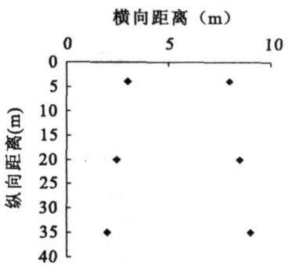
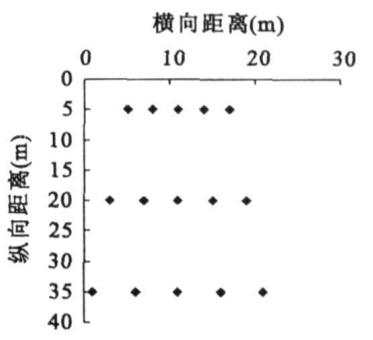

# 弃渣场边坡稳定性特征分析

刘建伟，史东梅，马晓刚，刘益军

(西南大学资源环境学院，重庆北碚400715)

摘要：针对弃渣场边坡容易发生细沟侵蚀的问题，采集弃渣场坡面不同坡位的弃渣样品，对弃渣容重，含水量，饱和导水率、饱和含水量、砂粒含量、碎石含量等物理指标进行测定；与此同时，还对各点的样品进行直剪试验，并以此对弃渣场边坡稳定性特征进行分析。结果表明：新形成弃渣场坡面由上而下，其土体内摩擦角逐渐增大，而土体粘滞系数C的变化与弃渣场坡面形成过程关系密切，一般而言，坡面的上部和下部粘滞系数C较小，说明弃渣场坡面上部土体的稳定性较中下部弱；对土体其他物理性质指标与土体的内摩擦角粘滞系数C进行相关性分析，结果显示内摩擦角 $\Psi \Xi > 0 . 0 7 5 _ { \mathrm { m m } }$ 细粒含量的相关系数为二0.427，粘滞系数C与饱和导水率的相关系数为0.514\*，表明饱和导水率和细粒物质含量对于弃渣场坡面土体稳定性具有重要影响。

关键词：弃渣场；边坡稳定性；土壤水分

中图分类号:S1524;S157.1

文献标识码：A

文章编号：1009-2242200705-0192-04

# Stability Characteristics Anal ysis on Sideslops of Excavation Waste Dump

LIU Jian wei, SHI Dong mei\* , MA Xiao gang, LIU Yi jun

(College of Resources and Environment, Southw est University, Beibei, Chongqing 400715

Abstract: Amid at the accured easily of the rill erosion at the sideslope of excavation waste dump, the paper col - lected soil samples on the differents slope positions, and tested bulk density, w ater content, saturated hydraulic con - ductivity, saturated water content, percent of sand, percent of rock fragment and other physical properties .While the direct shear test were adopted with every soil samples And then, we analysed the stability characteristics on sideslops of excavation waste dump The results shows: from the summit to the bottom of new slope, the internal friction angle( ) are increase gradually, betw een the change of coefficient of viscosity (C) and the fashion pro - cess have a closed relations Generally, at the upper and low slope position the coefficient of viscosity( C) smaller than middle, shows that the stability of upper slop position lower than middle and low er; The relations w ere anal - ysed, that shows the correlation coefficient is 0.427\* and 0.514%\* between internal friction angle( Ψ) and satu - rated hydraulic conductivity, betw een coefficient of viscosity( C) and percent of fine grain, respectively saturated hydraulic conductivity and fine grain have a important influence on stability of excavation w aste dump sideslops Key words: abandoned dregs; sideslope stability; soil w ater content

随着我国经济建设步伐的加快，各地基础设施建设的投入也不断加大，这些建设项目在施工过程中往往对原地貌造成剧烈扰动，并产生大量弃土弃渣。这些弃土弃渣结构松散，且在堆积的过程中形成较陡的坡面，其自然坡度大都在25～45之间，极不稳定，遇降雨易发生细沟侵蚀甚至坡面整体滑移。因此弃土弃渣的防护便成为开发建设项目水土流失治理的重点，特别在高速公路建设过程中弃渣场更是水土流失防治的重点区域。为清楚了解高速公路弃渣场坡面土体稳定特性，进而为合理布设拟建重庆绕城高速公路北段弃渣场坡面防护工程措施提供理论依据，根据类比工程法选择原则，本文选取了与重庆绕城高速公路北段项目区地理位置极近，目气候，地形，地貌，十壤，植被等自然条件相同的渝合高速公路及西南大学第二学生生活区建设工程所形成的共5个弃渣场作为类比试验样地进行前期研究。主要对不同时期弃渣场边坡不同坡位的十体常规物理性质和力学性质进行分析，并测定其抗剪切能力，进而对弃渣场坡面不同坡位的土体稳定性特征进行分析。

## 1 研究区概况

研究区属亚热带温暖湿润季风气候区，年总降雨量为1173.6mm，为典型的川东低山丘陵地形，本文所研究的5个弃渣场坡面土壤类型均为中生代侏罗纪沙溪庙组砂泥岩母质及其发育而成的紫色土，堆积形成的自然

安息角达36以上，形成时间长短为：2号弃渣场>3号弃渣场>4号弃渣场>5号弃渣场>号弃渣场1其中号弃渣场形成时间为3个月，2\~5号弃渣场形成时间均已超过2年，各弃渣场基本概况见表1。

## 2 研究方法

## 2.1 采样方法

本文主要在不同时期形成的5个弃渣场坡面上分上、中、下3个部位采样，其中号和4号坡面面积较大，纵向分别取列和冽采样，采样点分布见图1其它3个坡面由于新产生弃土弃渣的埋压，只有少部分

表1 弃渣场基本概况
<table><tr><td>弃渣场</td><td>土壤类型</td><td>植被覆盖度坡度 (%)</td><td>1°</td><td>边坡长度 (m)</td></tr><tr><td>1</td><td>未完全风化的紫色砂岩母质</td><td>0</td><td>43</td><td>34</td></tr><tr><td>2</td><td>紫色粘土</td><td>30</td><td>35</td><td>23</td></tr><tr><td>3</td><td>含有大量建筑碎屑沙土</td><td>0</td><td>37</td><td>30</td></tr><tr><td>4</td><td>风化较完全的沙土，有大石块</td><td>0</td><td>43</td><td>32</td></tr><tr><td>5</td><td>含有大量碎石的紫色粘土</td><td>5</td><td>36</td><td>28</td></tr></table>

原有弃土坡面裸露，所以采样时沿其坡面纵向只取采样。在每个采样点分别用铝盒和 $1 0 0 \mathrm { { _ { m m } } }$ 环刀取3个重复样，并采集 $1 _ { \mathbf { k } \mathbf { g } }$ 土样供其它物理性质分析。

## 2.2 试验方法

本文主要测定弃渣土体容重、含水量、饱和导水率、饱和含水量、细粒物质含量、砂粒含量、碎石含量及其抗剪强度等项指标并进行分析，进而反映弃渣场坡面不同坡位土体稳定性的强弱，以及各因子对于其影响程度的大小。其中容重测定采用环刀法，含水量测定采用烘干法，饱和导水率测定采用环刀法，饱和含水量由计算得来，细粒物质含量、砂粒含量、碎石含量测定均采用机械筛分法，抗剪强度利用直剪仪测定。

## 3 结果与分析

## 3.1 容重变化

容重是土壤的最基本物理性质之一，对土壤的透气性、入渗性能、持水能力、溶质迁移特征以及土壤的抗侵蚀能力都有非常大的影响。自然条件下土壤容重由于成土母质、成土过程、气候、生物作用及耕作的影响是一个高度变异的土壤性质[。本文对1\~5号坡面不同坡位的土体容重进行测定，其中号、4号坡面取每一坡位对应点的平均值，各坡面不同坡位土体容重测定结果见表 $2 _ { \circ }$ 由表

  
(b)4号坡面采样点分布示意图  
(a)1号坡面采样点分布示意图  
图1 弃渣场坡面采样点分布示意图

2可以看出，123号坡面土体容重为坡上<坡中<坡下，号坡面土体容重尽管由上而下逐渐增大，但差异并不明显。与其他几个坡面不同的是5号坡面的容重反而变小。这主要是因为2345号坡面由于形成时间均已达到两年以上，在降雨和重力作用下使坡面土石颗粒发生侵蚀搬运，造成弃渣场坡面各部分土体构成产生差异。234号坡面土体中的细粒成份向坡下发生位移，使坡下土体粗颗粒间的孔隙逐渐被堵塞，土体较坡中和坡上密实；5坡面土体容重变化之所以与其它几个坡面相反，经分析认为主要是由于5号坡面土体的组成与其它坡面有较大不同引起。号坡面的容重之所以没有明显变化，是因为号坡面是新形成坡面，构成坡面的土体在机械挖掘和运输的过程中使之混匀，在自然分选过程中，只有较大的土石块体滚落至坡脚，直径较小的土粒基本上没有经过分选。

## 3.2 粒径变化

弃渣场坡面的土石体由于分选作用及其在雨水作用下，土壤颗粒发生位移并在坡脚堆积，使得坡面各部分土体及其碎石粒径分布产生较大差异。从表可以看出，号坡面坡中部碎石含量较其上部和下部均低，而砂粒和细粒含量则是坡中最高，坡上次之，坡下最低，这与4号坡面的测试结果也较为相似；2号坡面各部分的土体粒径分布变化不甚明显，不同坡位间土体结构较其他几个坡面均匀；3号坡面碎石含量由上而下逐渐增加，而砂粒物质和细粒物质则逐渐减少；5坡面则同3号坡面截然相反。以上结果与土体容重的测定结果能够较好地对应，号坡面碎石，砂粒，细粒的分布主要与弃渣在堆弃过程中分选作用有关，碎石在分选过程中一旦达到其向下滚落的临界速度便滚至坡下，若达不到便滞留坡上。但对于砂粒和细粒物质而言，堆弃过程中以一种整体向下滑移的形式向下运动，当与原有土体摩擦力较大时逐渐停止运动，所以大多堆积在坡中位置；号坡面由于其土体构成较为均 $\overline { { \mathrm { C h } } }$ 加之形成时间较长，植被覆盖良好，风化比较完全，均为紫色粘土，且坡长较短，故分选不明显；3号坡面碎石分布与容重变化相似，与其含有大量建筑碎屑有关；4号坡面由于其坡度较大，且与一号坡面位置和形成时间均较接近，因此存在相似性；5坡面由于含有大量碎石，且为紫色粘土，其分选性较其他坡面差，碎石分布为上多下少。但降雨击溅及其薄层水流所造成的溅蚀和面蚀使得土体表层颗粒向坡下搬运。与同是粘土的号坡面相比，其植被覆盖度极低，坡长较长是土体粒级分布差异大的主要原因。

表2 不同坡位土体容重及其粒级分布
<table><tr><td rowspan="2">弃渣场</td><td colspan="2">容重  $\mathrm { ( g / c m \ ^ { 3 } }$ </td><td colspan="4">60~  $2 0 \mathrm { { \dot { m } m } }$  碎石(%)</td><td colspan="3">20~0.  $0 5 _ { \mathrm { m m } }$  砂粒(%)</td><td colspan="3">&lt; 0.075mm 细粒(%)</td></tr><tr><td>上</td><td>中</td><td>下</td><td>上</td><td>中</td><td>下</td><td>上</td><td>中</td><td>下</td><td>上</td><td>中</td><td>下</td></tr><tr><td>1</td><td>1.39</td><td>1.40</td><td>1.44</td><td>57.60</td><td>52.57</td><td>64.34</td><td>34.55</td><td>38.86</td><td>28.86</td><td>7.85</td><td>8.57</td><td>6.80</td></tr><tr><td>2</td><td>1.51</td><td>1.61</td><td>1.68</td><td>80.50</td><td>80.80</td><td>83.32</td><td>10.97</td><td>12.96</td><td>10.15</td><td>8.53</td><td>6.24</td><td>6.53</td></tr><tr><td>3</td><td>1.25</td><td>1.47</td><td>1.67</td><td>47.06</td><td>65.45</td><td>68.54</td><td>44.20</td><td>28.90</td><td>24.57</td><td>8.74</td><td>5.65</td><td>6.88</td></tr><tr><td>4</td><td>1.45</td><td>1.36</td><td>1.61</td><td>53.88</td><td>44.00</td><td>63.60</td><td>40.54</td><td>45.71</td><td>26.95</td><td>5.59</td><td>10.29</td><td>9.46</td></tr><tr><td>5</td><td>1.64</td><td>1.59</td><td>1.49</td><td>74.78</td><td>57.74</td><td>48.30</td><td>14.58</td><td>24.47</td><td>31.28</td><td>10.64</td><td>17.79</td><td>20.42</td></tr></table>

## 3.3 水分变化

3.3.1含水量变化 土壤含水量影响降雨入渗、产流过程，对土壤水分沿坡面的分布具有重要的作用，影响坡面降雨入渗，产流过程，因此坡面不同坡位土体中水分含量也是影响坡面稳定性的主要因子。特别是对于开发建设产生的大量弃土，弃渣，由于其结构极为松散，土体颗粒之间粘结力极弱，抵抗径流冲刷的能力也极弱，遇强降雨常常发生坡面整体滑移，对于大型坡面更容易形成滑坡。本文采用烘于法测定了坡面不同坡位土体的含水量，结果见表3.23号坡面从上至下十壤水分含量逐渐增大；5号坡面各部分十壤水分含量变化不大；只有号坡面坡上和坡下土壤含水量均比坡中部小，这主要是因为在弃土弃渣体的堆弃过程中，部分弃土弃渣因没有达到启动速度而滞留坡顶，其余部分顺坡面向坡脚滚落，在滚落过程中，较大颗粒由于分选作用滚落到坡脚，坡中部则主要由较为细小的颗粒构成，细颗粒由于其毛细作用而使得水分损失较粗颗粒少。

3.3.2 饱和导水率变化 土壤饱和导水率、土壤初始入渗率和土壤稳定入渗率是反映土壤入渗特性的主要指标，而土壤入渗特性是评价土壤抗侵蚀能力的重要指标[。由表3可见，在1号坡面中部土体的饱和导水率较坡上和坡下均低，但差异极小；2

表3 不同坡位土壤水分变化
<table><tr><td rowspan="2">弃渣场</td><td colspan="3">土体含水量(%)</td><td colspan="3">饱和导水率  $\mathrm { { c m } / \mathrm { { m i n } } ) }$ </td><td colspan="3">饱和含水率(%)</td></tr><tr><td>上</td><td>中</td><td>下</td><td>上</td><td>中</td><td>下</td><td>上</td><td>中</td><td>下</td></tr><tr><td>1</td><td>10.88</td><td>13.25</td><td>11.45</td><td>4.67</td><td>4.01</td><td>4.61</td><td>42.19</td><td>44.02</td><td>39.57</td></tr><tr><td>2</td><td>17.15</td><td>18.66</td><td>21.28</td><td>5.25</td><td>7.90</td><td>1.60</td><td>40.02</td><td>35.82</td><td>34.38</td></tr><tr><td>3</td><td>17.13</td><td>20.16</td><td>21.23</td><td>8.80</td><td>5.35</td><td>5.00</td><td>55.74</td><td>43.77</td><td>34.78</td></tr><tr><td>4</td><td>12.41</td><td>13.45</td><td>16.10</td><td>2.79</td><td>2.80</td><td>3.80</td><td>40.08</td><td>46.23</td><td>34.43</td></tr><tr><td>5</td><td>16.52</td><td>15.78</td><td>17.42</td><td>4.00</td><td>2.60</td><td>0.89</td><td>33.12</td><td>35.10</td><td>41.20</td></tr></table>

号坡面则是坡中>坡上>坡下；35号坡面由上至下呈减小趋势；4号坡面则坡下饱和导水率最大，饱和导水率直接关系到降雨条件下土壤表面是否产生径流或产流多少，是衡量土壤坡面是否发生面蚀和细沟侵蚀的关键指标。以上结果表明，各坡面不同坡位土壤饱和导水率差异明显，这与坡面土壤类型、结构组成均有直接关系。3.3.3 饱和含水率变化 土壤饱和含水率与土壤孔隙度关系密切，且土壤饱和含水率又是土壤水动力参数的重要影响因子之一，也是衡量土体稳定性及其可蚀性的重要指标，不同的土壤其饱和含水率差异显著。

由表可见，不同弃渣场坡面从坡顶至坡脚其饱和含水率的变化趋势并不一致，号坡面各部分饱和含水率相对均匀，仅坡中位置饱和含水率稍高，这主要是因为坡中位置的弃渣相对坡上和坡下而言其细颗粒更多，土体的总孔隙度较大的缘故，这与其粒级分布及含水量变化都有较高的一致性；号坡面从上而下其饱和含水率逐渐减小，这与其细颗粒含量的变化基本一致；3号坡面自上而下其饱和含水率变化极为明显，这主要是因为此坡面含有大量的建筑碎屑，经过分选后坡面土体各部分颗粒分布差异较为显著，且大量建筑碎屑分布于坡面的中下部所致；坡面由于形成时间与号坡面最近，且碎石含量相对较少，所以其不同坡位饱和含水率的变化情况与号坡面相似；5号坡面自上而下其饱和含水率增加显著，主要是因为5号坡面主要为土石混合体，且坡顶以上的地势较低，渣场顶部的积水对坡面造成一定冲刷，使细颗粒下移，并在坡下形成冲沟。

## 4 影响边坡稳定性的主要因素

由上文可见，弃渣场坡面不同位置土体各项物理性质指标不同，并目由于弃土弃渣来源不同，弃土弃渣体形成时间不同，使得弃渣场坡面土体物理性质变化规律并不十分明显。因此本文对坡面不同位置的土壤进行直剪试验。各点的剪切试验结果见表4、表5。

表4 号坡面土体内摩擦角和粘滞系数
<table><tr><td>列号</td><td colspan="3">第列</td><td colspan="3">第2列</td><td colspan="3">第3列</td><td colspan="3">第例</td><td colspan="3">第5列</td></tr><tr><td>测点</td><td>1</td><td>6</td><td>11</td><td>2</td><td>7</td><td>12</td><td>3</td><td>8</td><td>13</td><td>4</td><td>9</td><td>14</td><td>5</td><td>10</td><td>15</td></tr><tr><td>内摩擦角Ψ(</td><td>2.87</td><td>9.65</td><td>11.78</td><td>4.44</td><td>6.67</td><td>7.48</td><td>2.87</td><td>11.55</td><td>13.09</td><td>2.06</td><td>0.91</td><td>1.89</td><td>7.8</td><td>2.09</td><td>7.86</td></tr><tr><td>粘滞系数  $\underline { { C \ ( \mathrm { M P a } ) } }$ </td><td>4.9</td><td>10.5</td><td>一</td><td>3.6</td><td>25.1</td><td>14.6</td><td>6.5</td><td></td><td></td><td>2.7</td><td>12.45</td><td>7.85</td><td>17.5</td><td>5.75</td><td>18.95</td></tr></table>

表5 2\~ 5号坡面土体内摩擦角和粘滞系数
<table><tr><td rowspan="2">坡面 测点</td><td colspan="3">2号坡面</td><td colspan="3">3号坡面</td><td colspan="6">号坡面</td><td colspan="3">5号坡面</td></tr><tr><td>16</td><td>17</td><td>18</td><td>19</td><td>20</td><td>21</td><td>22</td><td>23</td><td>24</td><td>25</td><td>26</td><td>27</td><td>28</td><td>29</td><td>30</td></tr><tr><td>内摩擦角 Ψ(</td><td>5.07</td><td>2.26</td><td>2.34</td><td>1.78</td><td>4.71</td><td>3.19</td><td>12.93</td><td>3.34</td><td>1.74</td><td>2.98</td><td>1.79</td><td>1.38</td><td>3.47</td><td>1.7</td><td>5.41</td></tr><tr><td>粘滞系数  $\underline { { C \ ( \mathrm { M P a } ) } }$ </td><td>19.25</td><td>12</td><td>3.15</td><td>24</td><td>8.17</td><td>34</td><td>一</td><td>12.4</td><td>6.4</td><td>11.2</td><td>8.65</td><td>9.2</td><td>18.25</td><td>2.85</td><td>4.55</td></tr></table>

由表何以看出，号坡面除测点49，14成的第外，其他各列土体内摩擦角Ψ由上至下均呈逐渐增大的趋势，与号坡面土体容重的变化趋势相同，这说明在容重较大情况下土体较为紧实，颗粒之间相互作用力较强，同时也说明在弃置堆渣的过程中，可适当对堆置体进行压实，增强其稳定性；粘滞系数C除第列外其他均为中部大两端小，这与号坡面 $2 0 \sim 0 . 0 5 \mathrm { { m m } }$ 砂粒、 $< 0 . 0 7 5 \mathrm { _ { m m } }$ 细粒物质的分布、土体含水量等指标的变化基本一致，说明新形成弃渣场坡面土体粘滞系数的变化与土体颗粒组成、土体水分状况都有较大关系，如果土体中 $> 2 0 _ { \mathrm { m m } }$ 碎石含量太大，就会使得土体颗粒之间的接触面积减小，进而减弱其粘滞力。因此在弃渣堆置过程中适当使不同粒径土体颗粒相对均匀分布就更有利于弃渣场坡面稳定。表5中2\~5号4个坡面中4号坡面与1号坡面内摩擦角Ψ的变化规律比较一致，但粘滞系数C则是坡脚最小，主要是因为4号坡面与号坡面形成的时间极为接近，内摩擦角Ψ随坡位的变化规律相似，但是由于大量大石块的挡拦作用，使得渣体在堆置过程中的自然分选作用被限制，不同坡位土体性质变化规律性较差。3号和5号坡面土体内摩擦角均为中部最小;而号坡面的内摩擦角Ψ则是坡上部大、中下部小，这与弃渣场坡面的形成时间、渣体构成成分以及植被覆盖状况具有很大关系，在此不逐一论述。对以上各因子进行相关性分析，得出土体内摩擦角与其细粒含量呈极显著负相关，其相关系数为0.427，粘滞系数C与饱和导水率呈极显著相关，其相关系数为 $0 . 5 1 4 _ { \circ }$ 由此可见，土壤饱和导水率同其细粒含量均对弃渣体的抗剪能力产生重要影响。

## 5 结论

开发建设所形成的弃渣场坡面由于极度松散，结构性差，并且土体构成复杂，其稳定性难以用常用的团聚体含量、水稳性指数等与土壤结构有关的指标衡量。因此，本文以抗剪强度作为衡量其坡面稳定性的关键指标，考察影响土壤抗剪强度的两个重要参数二二内摩擦角Ψ和粘滞系数C，并分析影响了该参数的主要因子.研究表明，开发建设项目所形成的弃渣场坡面在不同条件的弃渣场之间存在以下共同的特点：

(1新形成的坡面不同坡位土壤的物理性质差异较小，变化规律较原来的坡面更明显，其土壤内摩擦角从上而下逐渐增大。

(除新形成坡面外，其他坡面土壤含水量从上而下均有增高的趋势。

(3土壤细颗粒含量及其饱和导水率是影响土壤稳定性的重要因素，内摩擦角与 $< 0 . 0 7 5 \mathrm { _ { m m } }$ 的土壤细颗粒含量呈显著负相关关系，相关系数为0.427;粘滞系数同土壤饱和导水率呈极显著相关关系，相关系数为0.514

（45坡面土壤容重、土壤粒径分布、饱和导水率等物理性质沿坡位变化与其他坡面相比均不同，与其含有大量碎石有密切关系。

除此之外，弃渣场坡面土壤物理性质的变化与土壤坡面形成时间、坡面土壤类别、土壤构成、植被盖度等均有较大关系，影响其稳定性的因素较为复杂，还需进行更深入研究。

## 参考文献：

[1] 李九苏，戴聆春.用巴雷特图法确定高速公路工程土壤流失重点部位初探[J].中国水土保持，20067：4一42.

[2] 李丛业，艾晓冬，李洪岩.开发建设项目施工中新增水土流失量预测方法探讨[J].黑龙江水利科技，20033：4952.

[3 郑纪勇，邵明安，张兴昌.黄土区坡面表层土壤容重和饱和导水率空间变异特征[J].水土保持学报，2004183：5356.

[4 陈洪松，邵明安，王克林.土壤初始含水率对坡面降雨入渗及土壤水分再分布的影响[J].农业工程学报，2006,22：44一47.

[5] 张永涛，杨吉华，夏江宝，等石质山地不同条件的土壤入渗特性研究[J]水土保持学报，2002164：123126.

(C)1994-2023 China Academic Journal Electronic Publishing House. All rights reserved. http://www.cnki.net