# 露天煤矿排土场覆土厚度对土壤水分入渗及植物水分利用的影响

张雅楠，吕刚

（辽宁工程技术大学环境科学与工程学院，辽宁阜新123000)

摘要：表土回覆是露天煤矿排土场生态修复的关键步骤，覆土厚度直接影响植物生长和复垦成本，为研究露天煤矿排土场不同覆土厚度对土壤水分入渗及植物水分利用的影响，采用室内土柱模拟试验，设置10，20，30，40，50cm共5个覆土厚度，分别进行垂直入渗试验和室内盆栽试验(玉米），并结合氢氧同位素稳定示踪技术，研究不同覆土厚度土壤入渗和玉米水分利用特征，筛选研究区排土场最佳覆土厚度。结果表明：覆土厚度为10\~30 cm(27.05\~33.02 mm/min)的初始入渗速率显著高于40～50cm(21.59～24.89mm/min)的初始入渗速率(p<0.05)，稳定入渗速率随覆土厚度的增加而增大，当覆土厚度高于40cm后，随着覆土厚度的增加稳定入渗速率维持在3mm/min左右。矸石层入渗过程受覆土层的影响较大，覆土厚度高于40cm后，矸石层入渗速率基本稳定在土层连接面的入渗速率上。不同覆土厚度下玉米木质部水氢氧同位素值与土壤水氢氧同位素随土层变化曲线交点主要集中在覆土层，因此，玉米生长水分主要来源于覆土层。覆土厚度越大，2条线交点增多、交点分布范围增大，玉米对土壤水分的利用范围越大，当覆土厚度超过40cm后，玉米水分利用范围基本维持在10～40cm。结合阜新市最大降雨强度190mm/h，该地区露天矿排土场覆土厚度应高于40 cm。

关键词：土柱试验；覆土厚度；水同位素示踪；土壤水分入渗

中图分类号：TD713

文献标识码：A

文章编号:1009-2242(2023)05-0345-07

DOI:10.13870/j.cnki.stbcxb.2023.05.042

# Effect of Soil Cover Thickness on Soil Water Infiltration and Plant Water Utilization in the Dump of Open Pit Coal Mine

ZHANG Ya'nan, LÜ Gang

(College of Environmental Science and Engineering, Liaoning Technical University , Fuxin, Liaoning 123000)

Abstract: Topsoil restoration is a key step in the ecological restoration of the dump of open pit coal mine, and the thickness of soil cover directly affects plant growth and reclamation cost. In order to study the influence of the thickness of soil cover on soil water infiltration and plant water utilization in open pit mine dump, indoor soil column simulation test was adopted in this study. Five cover thicknesses of 10 cm, 20 cm, 30 cm, 40 cm and 50 cm were set up, and vertical infiltration test and indoor pot test (corn) were conducted, respectively. Combined with hydrogen and oxygen isotope stable tracing technology, soil infiltration and water use characteristics of corn with different cover thicknesses were studied to screen the optimal soil cover thickness for the waste dump in the region. The results showed that: the initial infiltration rate with a soil cover thickness of 10\~30 cm (27.05\~33.02 mm/min) was significantly higher than that with a soil cover thickness of 40\~50 cm (21.59\~24.89 mm/min) $( \phi < 0 . 0 5 )$ . The stable infiltration rate increased with the increasing of soil cover thickness. When the soil cover thickness was greater than 40 cm, the infiltration rate remained at about 3 mm/min with the increasing of the soil thickness. The infiltration process of gangue layer was greatly affected by the soil cover thickness. When the thickness of overlying soil was greater than 40 cm, the infiltration rate of gangue layer was basically stable at the infiltration rate of soil layer interface. The intersection between water hydrogen and oxygen isotope values of maize xylem and soil water hydrogen

and oxygen isotope values with different soil thickness was mainly concentrated in the overlying soil layer. Therefore, the growth water of maize mainly came from the overlying soil layer. The greater the soil cover thickness was, the more intersection points of the two lines and the larger the distribution range of the intersection points, the larger the soil water utilization range of maize was. When the soil cover thickness was more than 40 cm, the water utilization range of maize was basically maintained within the range of 10\~ 40 cm. Considering the maximum rainfall intensity of 190 mm/h in Fuxin city, the optimal reclamation thickness of open-pit dump in this area should be higher than 40 cm.

Keywords: soil column test; cover soil thickness; water isotope trace; soil water infiltration

中国是煤炭生产大国，煤炭约占一次性能源消费的70%，因此，煤炭资源是国民经济和社会发展的重要物质基础。目前，露天煤矿开采总产量的比重已提高到30%[1]。然而，露天开采造成的土地破坏制约了矿区的可持续发展。根据中国地质调查局《全国矿山地质环境调查报告》[2]统计，我国矿山总面积1040hm²，采矿损毁土地面积约220万hm²，露天煤矿开采过程中直接挖掘和固体废弃物堆积损坏大片土地，破坏原始地貌和土壤结构，植被种群不复存在，生态环境难以恢复3]。在“绿水青山就是金山银山”和“双碳”的理念下，矿区生态重建成为当下学者研究的热点问题[4]。

排土场是由多个平台一边坡相间组成的巨型人工松散堆积体[5]，每个平台高度达15m，面积最大的顶部平台距离地面30m以上6]，由于排土场内部矸石层毛细作用较弱[7]，地下水很难补充到地表供农作物吸收。此外，玉米等农作物最大根深为230cm，且0～80cm根系占75%以上[8]，因此，排土场种植农作物更加依赖表层土壤水分。降雨一方面能为排土场植物提供水分[9]，另一方面，也影响着边坡的稳定性[10]。入渗过程能够影响土壤含水率和地表径流的产生，降水到达地面最先发生入渗过程，因此，相关学者就排土场表层土壤入渗方面开展了大量研究。李叶鑫等[11]采用3种测定方法分析排土场复垦区表层土壤的饱和导水率，结果显示，导水性能最佳的样地为榆树林地，Hood入渗仪法在排土场有较好实用性；杨政等[12]以露天煤矿排土场新土体为研究对象，分析不同草地土壤入渗性能指出，草灌混播可以提高土壤入渗性能；吕刚等[13]对排土场不同土地利用类型土壤入渗特征进行评价表明，乔木林地的入渗性能较强。排土场复垦土壤是人工堆积的新成土壤，表土回覆是露天矿排土场最常用的复垦措施，覆土厚度变化使得整个排土场土层结构发生变化，从而引起一系列的水文生态效应的改变，土层结构发生变化改变土壤的水分分布特征，表层覆土厚度改变影响土壤入渗特征，入渗速率随覆土厚度的增大而减小[14]；土层结构变化影响土壤的蒸发过程，对日蒸发量和累计蒸发量影响显著[15]。覆土厚度对土壤入渗和蒸发的影响使土壤水氢氧同位素在土壤中分馏发生改变[16]，同时覆土厚度也影响植物根系的空间分布[17]。

矿区排土场水文特征研究已取得诸多成果[8,10-11,18]，但针对不同覆土厚度对排土场土壤水分入渗的研究不多，尤其是土壤水分入渗对排土场植物水分利用来源的影响尚需进一步研究。基于此，本研究以海州露天煤矿排土场土壤为研究对象，以玉米为试验植物，采用室内垂直入渗模拟试验和室内盆栽试验，结合氢氧同位素示踪技术，揭示露天煤矿排土场不同覆土厚度对土壤水分入渗及植物水分利用的影响规律，以期为该地区土地复垦提供技术指导，也可为露天煤矿区水资源高效利用与生态修复提供科学支持和重要参考。

## 1 材料与方法

## 1.1 研究区概况

海州露天煤矿位于辽宁省阜新市东南部(121°40′12″E，41°57′36"N)，属于北温带大陆性半干旱季风气候。年均降水量511mm，蒸发量1790mm，年均气温7.3℃，超过10℃年积温约3476℃。排土场覆土多来源于周边农田，土壤类型以褐土为主，覆土厚度为20—40cm，覆土层下为矸石层，煤矸石产自海州露天煤矿，直径2～200mm。排土场自然植被介于蒙古植被与华北植被的区系之间，以灌木和草本为主，乔木主要为人工种植，包括白榆(Ulmus pumila L.)、刺槐(Robinia pseudoacacia L.)、樟子松(Pinus sylvestrisvar. mongholica Litv.)等，另外部分地区被复垦为农田，主要种植作物为玉米(Zea mays L.)。

## 1.2 研究方法

1.2.1 供试样品 供试土样于2020年4—5月采集，样地选择玉米种植区，随机选取3个样点，间距15m，平整去除表面植被后取深度为0—40 cm范围内的土壤。供试土样带回实验室风干，过2mm筛后备用。土壤类型为褐土，黏粒含量5.68%，粉粒含量45.98%，砂粒含量48.34%，有机质含量 $8 . 6 9 \ \mathrm { g / k g }$ 速效磷含量18.54mg/kg，速效钾含量 $6 7 . 3 2 ~ \mathrm { m g / k g }$ 碱解氮含量 34.28 mg/kg，全氮含量 103.98 g/kg。煤矸石来源为阜新海州露天矿未覆土区，供试煤矸石实验室风干过5mm筛后备用。

1.2.2 土壤垂直入渗模拟试验土壤垂直入渗模拟试验采用垂直定水头入渗法，试验装置由垂直土柱与供水系统组成，试验装置示意见图1。有机玻璃柱直径10 cm，高80 cm，马氏瓶容量5L，供水水头5 cm。土柱进水孔与马氏瓶相连，运用连通器的原理来保证土柱水位恒定。

试验对排土场覆土厚度设定5个不同水平（图2），分别为10，20，30，40，50cm，每个水平3个重复。土柱底部均匀布设直径为0.5cm的漏水孔，土柱装填前铺设1层滤纸防止煤矸石通过漏水孔，土柱按5cm1层由下至上分层装填夯实，煤矸石层容重为1.6$\mathrm { { g } / \mathrm { { c m } ^ { 3 } } }$ ，土壤层容重为 $1 . 4 ~ \mathrm { g / c m ^ { 3 } }$ ，整个土柱装填高度为60cm。试验过程中用马氏瓶提供恒定水头供水，向马氏瓶加水直至达到设计的水头高度。将马氏瓶的进水阀门打开，同时用秒表开始计时，试验开始。记录马氏瓶中的水面高度及土柱湿润锋的垂直深度

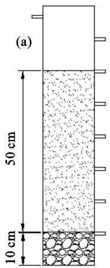

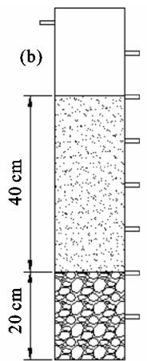

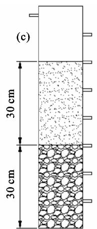  
图 2 土柱装填示意

1.2.3 含水率及氢氧同位素值测定入渗试验完成后土柱静置48h，待底部不再漏水后种植玉米，此时土柱土壤含水率达到田间持水量。每个土柱种植3粒玉米种子，发芽后采用称重法确保每次浇水时各个土柱保持一致，浇水频率为5次/天，每次浇水保持在各个土柱田间持水量的60%，5天后进行间苗，每个土柱中选取发育最好的植株，玉米生长60天后收集氢氧同位素样品。植物氢氧同位素取根茎结合部，土壤以每10cm1层收取，分别装入10mL玻璃瓶，用封口膜密封冷冻保存，将冷冻的样品解冻后放入LI一2100全自动真空冷凝抽提系统提取植物叶片水以及木质部水分，提取的水分用孔径为0.45μm、直径为13mm的针筒式滤膜过滤器过滤后装入2mL的样品瓶中待测。本次试验中所有的水样采用美国 LosGatosResearch 公司研发的DLT—100型液态水同位素分析仪进行同位素测定。其中，δD值的测试误差不超过±0.6%，$\delta ^ { 1 8 } \mathrm { O }$ 值的测试误差不超过±0.1%。，δ²H值的测试误差不超过±0.3%。分析得出的 $\delta ^ { 2 } \mathrm { H }$ $\delta ^ { 1 8 } \mathrm { O }$ 以相对随时间的变化，按照由密到疏的原则对试验过程进行记录，直至湿润峰到土柱最底部(滤纸湿润)试验结束。

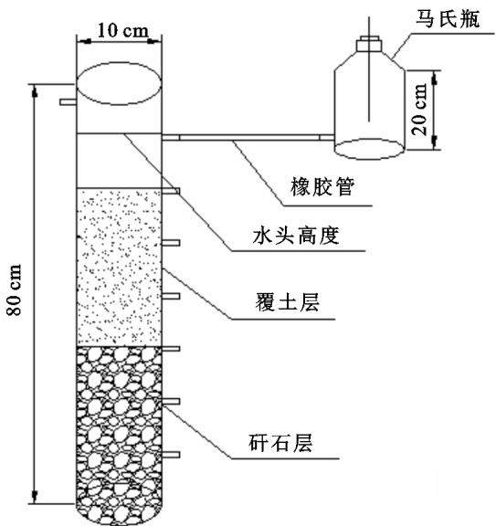

图1 试验装置示意  
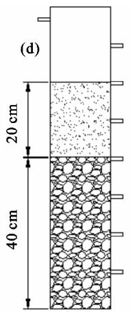

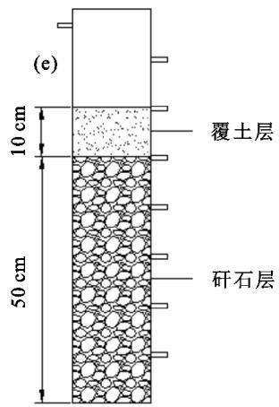  
于维也纳标准平均海洋水（vienna standard meanocean water，VSMOW)的千分差值表示：

$$
\delta { = } ( \frac { R _ { \mathrm { S a m p l e } } } { R _ { \mathrm { S t a n d a r d } } } { - } 1 ) { \times } 1 0 0 0 \%
$$

式中 $: \delta$ 表示对应样品的稳定氢氧同位素值； $R _ { \mathrm { { S a m p l e } } }$ 表示样品中重同位素与轻同位素的比值； $R _ { \mathrm { S t a n d a r d } }$ 表示国际通用标准物的重同位素与轻同位素比值。

## 1.3 数据统计

采用 Microsoft Excel 2016 进行数据整理及统计，采用SPSS25统计软件进行单因素方差分析，用Origin 2018 软件绘图。

## 2 结果与分析

## 2.1 不同覆土厚度土壤水分入渗特征

覆土层与煤矸石层的矿物质结构和孔隙状况不同，不同覆土厚度水分入渗特征不同，在入渗过程中，用入渗时间、初始入渗速率、稳定入渗速率和累计入渗量等来衡量入渗特征。从表1可以看出，整个入渗过程10，20，30，40，50cm覆土厚度分别用时7，20，

27，54，68min，表现为覆土厚度越大入渗时间越长，其中20，30 cm覆土厚度入渗时间差异不显著 $( \phi >$ 0.05)，其余处理间入渗时间差异显著 $( \phi < 0 . 0 5 ) ; 5$ 种覆土厚度入渗速率随时间变化均表现为先快速变小再趋于稳定的趋势，覆土厚度为 $1 0 { \sim } 3 0 ~ \mathrm { c m } ( 2 7 . 0 5 \sim$ 33.02 mm/min)的初始入渗速率显著高于40～50 cm(21.59\~24.89 mm/min)的初始入渗速率 $( \phi < 0 . 0 5 )$ 稳定入渗速率在覆土厚度为10(19.05mm/min)，20(10.79 mm/min),30(7.37 mm/min),40 cm(3.30$\mathrm { m m / m i n } )$ 中表现为随覆土厚度增加显著降低的趋势，这与马力等[13]的研究结果相同；而在40，50cm(3.43 $\mathrm { { m m / m i n } } )$ 覆土厚度的稳定入渗速率则无显著差异 $( \phi > 0 . 0 5 )$ ，这可能是由于随着覆土厚度的增加，覆土厚度小范围变化不足以影响稳定入渗速率；累计入渗量表现为10 cm覆土厚度最小为1 617mL，30cm覆土厚度最大为 $\mathrm { 2 7 8 0 m L , 4 0 , 5 0 c m }$ 覆土厚度的累计入渗量为 $2 \ 4 0 0 \ \mathrm { m L }$ ，除10cm覆土厚度外，其余4个覆土厚度累计入渗量无显著差异 $( \phi > 0 . 0 5 )$ .各覆土厚度累计入渗量5min内变化趋势相似，呈线性增长，5min后 $1 0 \sim 3 0 ~ \mathrm { c m }$ 覆土厚度的变化趋势相似为均匀增长， $4 0 { \sim } 5 0 ~ \mathrm { c m }$ 覆土厚度增长速度越来越慢，30min后增长速度趋于平稳。

## 2.2 不同覆土厚度对矸石层入渗速率的影响

不同覆土厚度覆土与煤矸石的接触面位置不同，

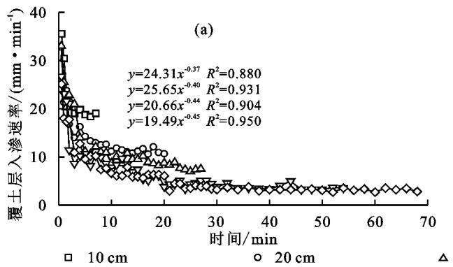

对湿润峰及覆土层与矸石层连接面入渗速率进行分析(图4)可知，覆土厚度越厚湿润峰增长速度越慢，说明覆土层能减缓水分的下渗速度，但除 $1 0 ~ \mathrm { { c m } }$ 覆土厚度外，其余4个覆土厚度在湿润峰到达覆土层与矸石层连接面时均出现拐点，对5个覆土厚度连接面位置的入渗速率进行单因素方差分析发现，覆土厚度为10 cm的连接面入渗速率显著高于 $2 0 \sim 3 0 , 4 0 \sim$ $5 0 ~ \mathrm { c m } ( \phi < 0 . 0 5 )$ ，说明每改变20 cm覆土才能对矸石层入渗速率产生显著差异。

不同覆土厚度土壤水δH和 $\delta ^ { 1 8 } \mathrm { ~ O ~ }$ 随土层深度的变化趋势不同，相同覆土厚度 $\delta ^ { 2 } \mathrm { H }$ 和 $\delta ^ { 1 8 } \mathrm { O }$ 随土层

## 2.3 不同覆土厚度对植物水分利用的影响

煤矸石持水能力弱，导水能力强，覆土层很大程度上影响煤矸石层的入渗特征，因此，将整个入渗速率分为覆土层入渗速率和矸石层入渗速率2个部分。从图3可以看出，除10cm覆土厚度外，其余4个覆土厚度覆土层入渗速率随入渗时间呈指数函数下降，拟合曲线R²均在0.88以上，说明不同覆土厚度对入渗速率的影响相似，但在矸石层入渗速率上，20cm覆土厚度随时间变化入渗速率呈logistics函数变化$( R ^ { 2 } = 0 . 9 8 4 ) , 3 0 , 4 0 \ \mathrm { c m }$ 覆土厚度入渗速率随入渗时间呈幂函数变化，变化幅度为15%～30%；40,50cm覆土厚度入渗速率基本稳定在 $3 . 1 7 \ \mathrm { m m / m i n }$ ，说明覆土厚度越厚，矸石层对入渗速率的影响越小，且在$1 0 ~ \mathrm { c m }$ 覆土厚度下产生较大影响，覆土厚度超过30cm后矸石层对入渗速率未产生影响。

表1 不同覆土厚度入渗参数特征
<table><tr><td>覆土 厚度/cm</td><td>入渗 时间/min</td><td>初始入渗速率/ 稳定入渗速率/  $( \mathrm { m m } \cdot \mathrm { m i n } ^ { - 1 } )$ </td><td> $( \mathrm { m } \mathrm { m } \cdot \mathrm { m i n } ^ { - 1 } )$ </td><td>累计 入渗量/mL</td></tr><tr><td>10</td><td> $7 \pm 0 . 4 0 \mathrm { d }$ </td><td> $3 2 . 4 6 \pm 1 . 0 6 \mathrm { a }$ </td><td> $1 9 . 0 9 \pm 1 . 0 9 \mathrm { a }$ </td><td> $1 6 1 7 \pm 9 2 \mathrm { a }$ </td></tr><tr><td>20</td><td> $2 0 { \pm } 2 . 1 0 \mathrm { c }$ </td><td> $2 7 . 2 5 { \pm 2 . 8 8 \mathrm { a b } }$ </td><td> $1 0 . 8 7 \pm 1 . 1 5 \mathrm { b }$ </td><td> $2 4 8 8 { \pm } 2 6 2 6$ </td></tr><tr><td>30</td><td> $2 7 \pm 3 . 7 5 \mathrm { c }$ </td><td> $2 9 . 6 5 \pm 4 . 1 6 \mathrm { a b }$ </td><td> $7 . 4 7 \pm 1 . 0 5 \mathrm { c }$ </td><td> $2 7 8 0 \pm 3 8 9 \mathrm { b }$ </td></tr><tr><td>40</td><td> $5 4 \pm 5 . 5 0 \mathrm { b }$ </td><td> $2 5 . 0 6 \pm 2 . 5 7 \mathrm { c d }$ </td><td> $3 . 3 2 \pm 0 . 3 4 \mathrm { d }$ </td><td> $2 4 7 3 \pm 2 5 3 \mathrm { b }$ </td></tr><tr><td>50</td><td> $6 8 \pm 7 . 2 5 \mathrm { a }$ </td><td> $2 1 . 7 5 { \pm } 2 . 3 3 { \mathrm { d } }$ </td><td> $3 . 4 6 \pm 0 . 3 7 \mathrm { d }$ </td><td> $2 4 8 7 \pm 2 6 6 \mathrm { b }$ </td></tr></table>

图3 不同覆土厚度覆土层与矸石层入渗速率拟合方程  
注：表中数据为平均值±标准差；同列数据后不同小写字母表示不同附图厚度差异显著 $( \phi < 0 . 0 5 )$

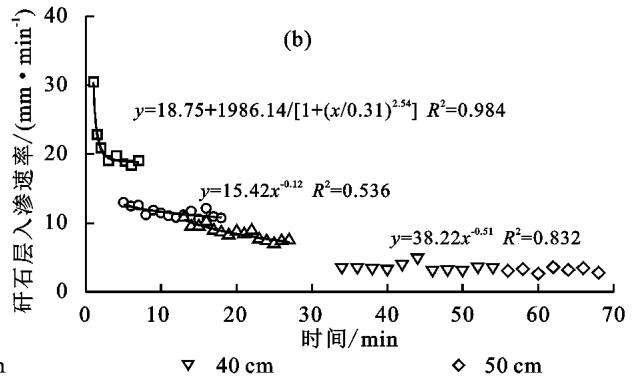

深度的变化规律基本相似。从图5可以看出，10cm覆土厚度玉米茎水的 $\delta ^ { 2 } \mathrm { H }$ 和 $\delta ^ { 1 8 } \mathrm { O }$ 与 $0 - 1 0 \ \mathrm { c m }$ 处的土壤水更为接近，说明该处理玉米水分来源主要为$0 ^ { - } 1 0 \ \mathrm { c m }$ 处土壤水；20 cm覆土厚度玉米水分主要来源为 $1 0 { - } 2 0 ~ \mathrm { c m }$ 处土壤水；30 cm覆土厚度玉米水分主要来源为 $1 0 ^ { - } 3 0 ~ \mathrm { c m }$ 处土壤水；40 cm覆土厚度玉米水分主要来源为 $1 0 { - } 4 0 ~ \mathrm { c m }$ 处土壤水；50 cm覆土厚度玉米水分主要来源为 $1 0 { - } 4 0 ~ \mathrm { ~ c m }$ 处土壤水。玉米生长需要水分主要来源于覆土层，说明覆土能够为植物提供良好的生长环境，这与毕银丽 $\frac { \hbar \wp } { \hbar } [ 1 9 ]$ 的研究结果相似。随覆土厚度的增加，玉米对土壤水分的利用范围不断扩大，覆土厚度大于10cm情况下，植物水分利用深度主要在10cm以下，覆土厚度超过40 cm后，玉米较少利用40 cm以下范围的水分，说明玉米水分利用范围基本在覆土层的10～40 cm 范围内。

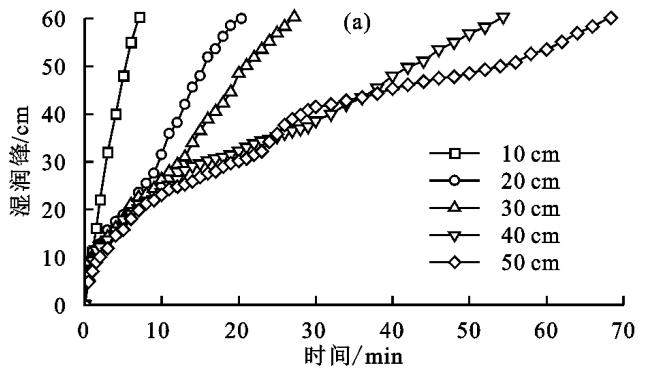

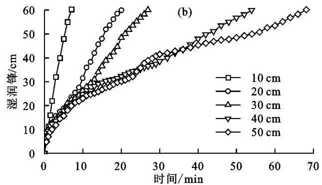  
图4 不同覆土厚度湿润峰变化特征及土层连接面入渗特征

## 3 讨论

## 3.1 不同覆土厚度对排土场水分入渗的影响

入渗是地表水进入土壤的过程，是地球表面最重要的过程之一，控制着地表水、地下水和土壤水库之间的水循环[20]，并对植物生长的供水[21]、向深层土壤和地下水的溶质运输[22]，以及地表径流和土壤侵蚀的发展23等一系列生态过程产生重大影响。天然降水是干旱半干旱地区农作物所需水分的主要来源[24]，露天矿排土场主要依靠覆土层为植物生长的基础6，覆土厚度是影响植物生长和复垦成本的关键指标。覆土厚度显著影响土壤水分的入渗过程(图3)，具体表现为稳定入渗速率随覆土厚度的增加而减小，入渗时间随覆土厚度的增加而增大，马力等[14]在研究排土场不同粒径及土层厚度对表土入渗规律影响中也得出相似的结论。随着覆土厚度的增加，其对土壤稳定入渗速率的影响越来越小，当覆土厚度超过40cm后稳定入渗速率不再显著变化。覆土层入渗速率除10cm覆土厚度外均随入渗时间变化，拟合呈指数函数(图4)，这与聂卫波等[25]对农田土壤入渗规律的研究结果一致。渗透性较小土层覆盖在渗透性较大土层，上层土壤入渗规律符合达西定律，下层土壤入渗规律受限于上层土壤[26]，本研究中矸石层入渗速率变化规律受覆土厚度影响较大，除10cm覆土厚度外，入渗速率在矸石层的变化幅度较小，当覆土厚度>40cm时矸石层入渗速率基本不变，通过监测覆土层与矸石层连接面入渗速率(图4)发现，10cm覆土厚度显著高于20～30 cm和40～50 cm覆土厚度。研究区降雨主要集中在夏季，最大降雨强度为190mm/h[27]，当覆土厚度为 40 cm 时的稳定入渗速率(198.73 mm/h)即可满足降水全部储存于土壤的需求。因此，从土壤入渗角度出发，该地区排土场覆土厚度选择应高于40cm。

## 3.2 不同覆土厚度对排土场植物水分利用的影响

水的氢氧同位素作为不同储层的“指纹”在生态水文领域研究中被广泛应用[28]。对比土壤水、河流水、植物水等不同水体的同位素组成，可以解释它们之间的补给关系，同时揭示局地尺度上的降水入渗机制[29]。入渗和蒸发导致土壤水氢氧同位素发生分馏现象，具体表现为在不同土层深度水氢氧同位素值不同[30]，本研究中不同覆土厚度土壤水δ2H和δ18O随土层深度的变化趋势总体在深层和浅层之间出现增减反复的现象(图6)，不同土层水氢氧同位素变化规律存在差异，这是由于不同覆土厚度改变土壤结构，使土壤水分入渗和蒸发发生变化，毕银丽等19在研究玉米接菌对重构土层水同位素分馏的影响时也得出相似结论。稳定同位素分馏在根系从土壤中吸收的过程无法观测[31]，因此，植物木质部水的同位素组成可以反映潜在水源的稳定同位素信息[32]。通过比较植物木质部水的同位素值与潜在水源的同位素值浓度，可以确定植物水分来源[33]，本文对比玉米茎水同位素和不同土层深度土壤水同位素发现，玉米水分主要来源于覆土层，且随着覆土厚度的增加植物水分来源范围不断增大，当覆土厚度≥40cm后玉米主要水分利用范围为10～40cm，这一范围已基本接近普通农田玉米水分的利用范围[34-36]。因此，从玉米对水分利用来源的角度出发，该地区排土场以农田为复垦目标的覆土厚度应≥40 cm。

本研究通过对不同覆土厚度土柱土壤入渗、水同位素进行分层分析，解释了不同覆土厚度土壤入渗及玉米水分利用规律，结合研究区气象条件和复垦目标，综合复垦成本和复垦效应，筛选出该地区露天煤矿排土场覆土厚度应高于40cm。但本研究尚未研究不同覆土厚度植物根系与水分入渗的相互作用关系，后期可进一步设计试验，深入揭示不同覆土厚度条件下排土场水分、土壤、植物三者之间的相互作用规律，对矿区排土场生态修复具有重要的生态意义。

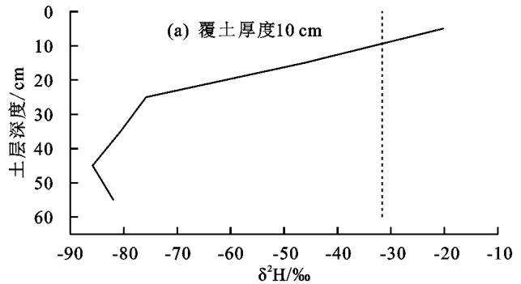

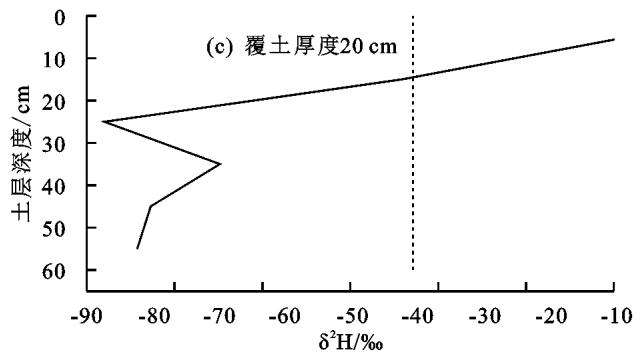

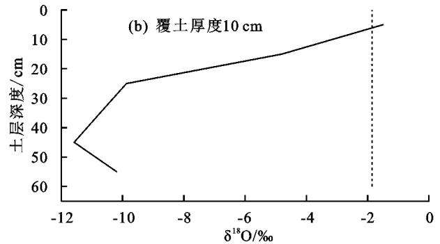

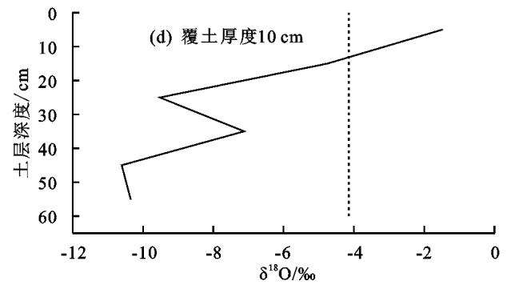

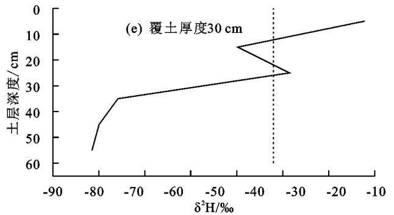

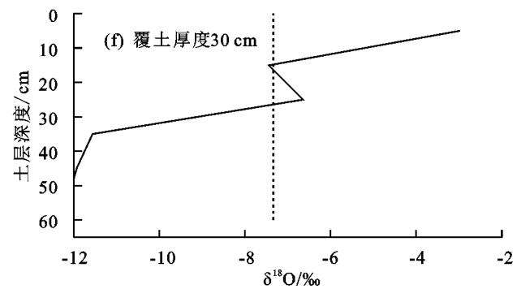

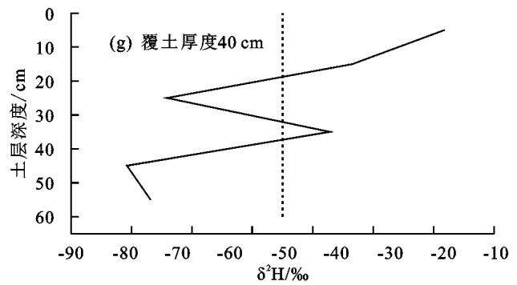

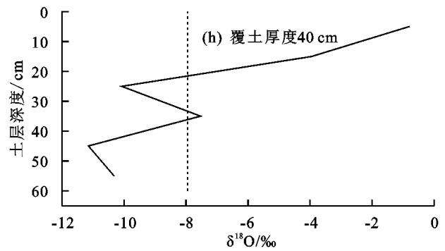

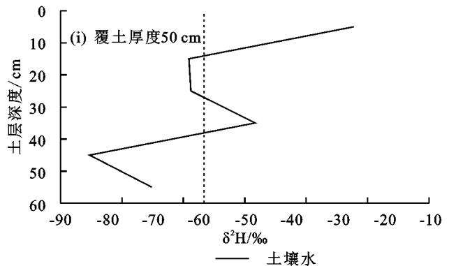

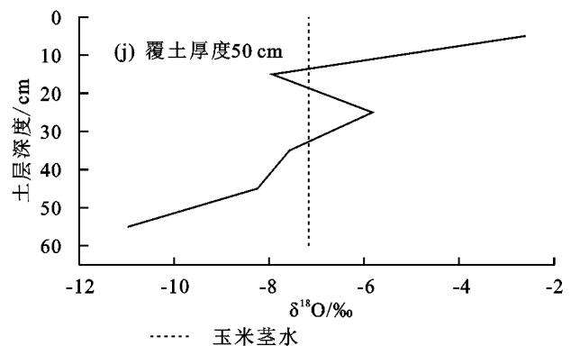  
图5 不同覆土厚度玉米茎水及土壤水氢氧同位素特征

## 4 结论

(1)土壤稳定入渗速率随覆土厚度的增大而减小，当覆土厚度高于40cm后，随着覆土厚度的增加稳定入渗速率不再发生显著变化。矸石层入渗过程受覆土厚度影响较大，覆土厚度高于40cm后，矸石层入渗速率基本稳定在土层连接面的入渗速率上。

(2)玉米生长水分主要来源于覆土层，覆土厚度越大，玉米土壤水分来源的范围越大，当覆土厚度超过40 cm后，玉米水分来源范围基本维持在10—40cm 土层范围内。

(3)阜新市露天矿排土场覆土厚度应高于40 cm。

## 参考文献：

[1] Li H, Shao H B, Li W X, et al. Improving soil enzyme activities and related quality properties of reclaimed soil by applying weathered coal in opencast-mining areas of the Chinese Loess Plateau[J]. Clean-Soil Air Water, 2012,40(3):233-238.

[2]王改玲，江山，张菁，等.安太堡露天矿不同复垦年限苜蓿地土壤养分化学计量特征[J].草地学报，2018，26(5)：1118-1123.

[3] Huang Y H, Kuang X Y, Cao Y G, et al. The soil chemical properties of reclaimed land in an arid grassland dump in an opencast mining area in China[J].RSC Advances,2018,8(72):41499-41508.

[4]高晓媚.毛乌素沙地采煤塌陷区土地生态质量变化及评价研究：以补连塔矿区为例[D].呼和浩特：内蒙古师范大学，2021.

[5]王金满，张萌，白中科，等.黄土区露天煤矿排土场重构土壤颗粒组成的多重分形特征[J].农业工程学报，2014，30(4):230-238.

6杨汉宏，张勇，郑海峰，等.不同人工植物配置对排土场边坡水土流失的影响[J.水土保持通报，2017,37(4)：6-11.

[7]刘晶淼，安顺清，廖荣伟，等.玉米根系在土壤剖面中的分布研究[J].中国生态农业学报，2009，17(3):517-521.

[8]陈敏，陈孝杨，王芳，等.容重对煤矸石水力特性的影响[J].煤炭技术，2017,36(3):52-54.

9张燕乐，甄庆，张兴昌，等.露天煤矿排土场不同植被土壤水分特征及其时间稳定性[J].水土保持学报，2020，34(3):212-218.

[10]林鸿州，于玉贞，李广信，等.降雨特性对土质边坡失稳的影响[J].岩石力学与工程学报，2009,28(1):198-204.

[11]李叶鑫，吕刚，王道涵，等.用3种测定方法分析排土场复垦区的表层土壤的饱和导水率[J].中国水土保持科学，2019,17(5):65-74.

[12]杨政，王冬，刘玉，等.矿区排土场人工草地土壤水分及入渗特征效应[J].草业学报，2015,24(12)：29-37.

[13]吕刚，傅昕阳，李叶鑫，等.海州露天煤矿排土场复垦区不同土地利用类型土壤入渗特征[J].水土保持学报，2017,31(3):123-128.

[14]马力，罗强，武璟，等.露天矿外排土场粒径及土层厚度对表土渗透规律影响[J].太原理工大学学报，2021，52(6):953-959.

[15]任志胜，解倩，王彤彤，等.晋陕蒙露天煤矿排土场不同新构土体土壤蒸发特征研究[J].土壤，2016，48(4)：824-830.

[16] Robertson J A, Gazis C A. An oxygen isotope study of seasonal trends in soil water fluxes at two sites along a climate gradient in Washington state (USA)[J].Journal of Hydrology,2006,328(1/2):375-387.

[17]郭利娜，姬鹏，孙宏彦，等.覆土厚度对城市园林植物生长的影响分析[J].中国园林，2022,38(3):112-117.

[18]毕银丽，李向磊，彭苏萍，等.露天矿区植物多样性与土壤养分空间变异性特征[J].煤炭科学技术，2020，48(12):205-213.

[19]毕银丽，田乐煊，柯增鸣.接菌影响模拟重构土层水分 布及水同位素分馏[J/OL].煤炭科学技术.https://doi. org/10.13199/j.cnki.cst.2022-1445.

[20] Horton R E. The Rôle of infiltration in the hydrologic cycle[J].Transactions, American Geophysical Union, 1933,14(1):e446.

[21] Lavee H, Imeson A C, Sarah P. The impact of climate change on geomorphology and desertification along a mediterranean-arid transect[J].Land Degradation and Development,1998,9(5):407-422.

[22] Jarvis N. Reflection on Jarvis (2007), “Review of nonequilibrium water flow and solute transport in soil macropores: Principles, controlling factors and consequences for water quality". European Journal of Soil Science, 58, 523-546[J].European Journal of Soil Science,2020,71(3):303-307.

[23] Roo A P J, Hazelhoff L, Burrough P A. Soil erosion modelling using 'answers' and geographical information systems[J].Earth Surface Processes and Landforms, 1989,14:517-532.

24杨磊，卫伟，莫保儒，等.半干旱黄土丘陵区不同人工植被恢复土壤水分的相对亏缺[J].生态学报，2011，31(11):3060-3068.

[25]聂卫波，武世亮，马孝义，等.农田土壤入渗特性研究[J].干旱地区农业研究，2013,31(4):31-37.

[26]王文焰，张建丰，汪志荣，等.砂层在黄土中的减渗作用及其计算[J].水利学报，2005,36(6)：650-655.

[27]谢媛，舒海燕，陶倩，等.阜新市主要气象灾害对农业生产的影响及防灾减灾有效措施[J].农业灾害研究，2022,12(10):134-136.

[28] Javaux M, Rothfuss Y, Vanderborght J, et al. Isotopic composition of plant water sources[J].Nature,2016, 536(7617):E1-E3.

[29] Zhao Y, Wang L. Plant water use strategy in response to spatial and temporal variation in precipitation patterns in China: A stable isotope analysis[J].Forests, 2018,9(3):e123.

[30]孙晓旭，陈建生，史公勋，等.蒸发与降水入渗过程中不同水体氢氧同位素变化规律[J].农业工程学报，2012，28(4):100-105.

(下转第 362 页)

1351-1358.

[7]郭龙，李陈，刘佩诗，等.牛粪有机肥替代化肥对茶叶产量、品质及茶园土壤肥力的影响[J].水土保持学报，2021,35(6):264-269.

[8] 王娜.微生物菌剂在矿山复垦土壤改良中的应用[J].环境保护前沿，2020,10(4):528-532.

[9]张金池，李翀，贾赵辉，等.功能性微生物在废弃矿山生态修复中的应用[J].南京林业大学学报(自然科学版)，2022,46(6):146-156.

[10]毕银丽，吴王燕，刘银平.丛枝菌根在煤矸石山土地复垦中的应用[J].生态学报，2007,27(9):3738-3743.

[11]林子然，张英俊.丛枝菌根真菌和磷对干旱胁迫下紫花苜蓿幼苗生长与生理特征的影响[J].草业科学，2018，35(1):115-122.

[12] 张会军.黄河流域煤炭富集区生态开采模式初探[J].煤炭科学技术，2021，49(12):233-242.

[13]关钊，谢红彬，罗琳，等.近30年中国矿业废弃地生态修复及再利用研究热点及趋势分析[J].中国矿业，2022,31(5):18-26.

[14]白一茹，张兴，包维斌，等.黄土丘陵区不同土地利用方式土壤碳氮磷及其生态化学计量特征[J].干旱地区农业研究，2019,37(4):117-123.

15高德新，张伟，任成杰，等.黄土高原典型植被恢复过程土壤与叶片生态化学计量特征[J].生态学报，2019，39(10):3622-3630.

[16]温晨，杨智姣，杨磊，等.半干旱黄土小流域不同植被类型植物与土壤生态化学计量特征[J].生态学报，2021，41(5):1824-1834.

「17]高平珍，陈双林，郭子武，等.毛竹林下苦参和决明幼苗生长和生物量分配的立竹密度效应[J.生态学杂志，2018,37(3):861-868.

[18] Persson J, Fink P, Goto A, et al. To be or not to be what you eat: Regulation of stoichiometric homeostasis among autotrophs and heterotrophs[J].Oikos, 2010, 119(5):741-751.

[19] Kerkhoff A J, Fagan W F, Elser J J, et al. Phylogenetic and growth form variation in the scaling of nitro-

## (上接第 351 页)

[31] Evaristo J, McDonnell J J, Scholl M A, et al. Insights into plant water uptake from xylem-water isotope measurements in two tropical catchments with contrasting moisture conditions [J]. Hydrological Processes, 2016,30(18):3210-3227.

[32] Tiemuerbieke B, Min X J, Zang Y X, et al. Water use patterns of co-occurring C3 and C4 shrubs in the Gurbantonggut Desert in northwestern China[J].Science of the Total Environment,2018,634:341-354.

[33] Dai Y, Zheng X J, Tang L S, et al. Stable oxygen iso-

gen and phosphorus in the seed plants[J].The American Naturalist,2006,168(4):E103-E122.

[20]陈文新.豆科植物根瘤菌一固氮体系在西部大开发中的作用[J].草地学报，2004，12(1):1-2.

19]周俊杰，陈志飞，杨全，等.黄土丘陵区退耕草地土壤呼吸及其组分对氮磷添加的响应[J].环境科学，2020，41(1):479-488.

[22]宁志英，李玉霖，杨红玲，等.科尔沁沙地主要植物细根和叶片碳、氮、磷化学计量特征[J].植物生态学报，2017,41(10):1069-1080.

[23]郑淑霞，上官周平.黄土高原地区植物叶片养分组成的空间分布格局[J].自然科学进展，2006，16(8):965-973.

[24]靳小莲，赵巍，李梦迪，等.黄土高原退耕还草土壤水分对植物地上部化学计量特征的影响[J].水土保持研究，2022,29(2):57-63.

「25戚德辉，温仲明，王红霞，等.黄土丘陵区不同功能群植物碳氮磷生态化学计量特征及其对微地形的响应[J]生态学报，2016,36(20)：:6420-6430.

[26] Koerselman W, Meuleman A F M. The vegetation N : P ratio: A new tool to detect the nature of nutrient limitation[J].The Journal of Applied Ecology,1996,33 (6):1441-1450.

27宋双双，孙保平，张建锋，等.保水剂与微生物菌剂对土壤水分、养分的影响[J].干旱区研究，2018,35(4):761-769.

[28] Tian H Q, Chen G S, Zhang C, et al. Pattern and variation of C : N : P ratios in China's soils: A synthesis of observational data[J].Biogeochemistry,2010,98:139-151.

[29] Li Y Q, Zhao X Y, Zhang F X, et al. Accumulation of soil organic carbon during natural restoration of desertified grassland in China's Horqin Sandy Land [J]. Journal of Arid Land,2015,7(3) :328-340.

[30]贾培龙，安韶山，李程程，等.黄土高原森林带土壤养分和微生物量及其生态化学计量变化特征[J].水土保持学报，2020,34(1):315-321.

[31]游惠明.氮添加对秋茄植物一土壤一微生物碳氮化学计量学及其稳态特征的影响[J].生态学杂志，2022，41(10):1909-1915.

topes reveal distinct water use patterns of two Haloxylon species in the Gurbantonggut Desert[J].Plant and Soil,2015,389(1):73-87.

[34]王冰洋，陈报章，孙少波，等.山东省禹城市夏玉米生长期水分利用特征分析[J].水土保持学报，2016，30(6)：153-161.

[35]张景文，陈报章.基于同位素分析研究山东禹城夏玉米水分来源[J].水土保持学报，2017,31(4)：99-104.

[36]杨永辉，邬佳宾，武继承，等.不同灌溉方式氢、氧同位素分布与夏玉米水分利用特征[J].节水灌溉，2023(1)：71-77,85.