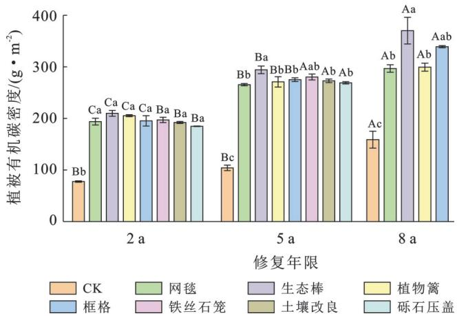
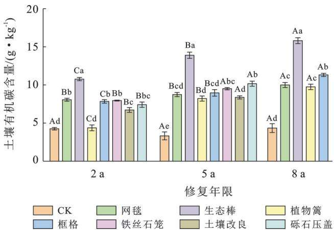
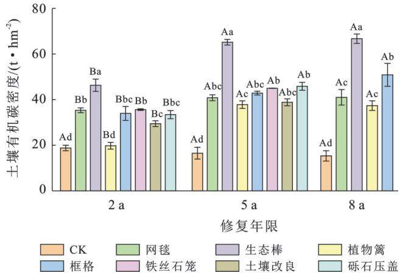
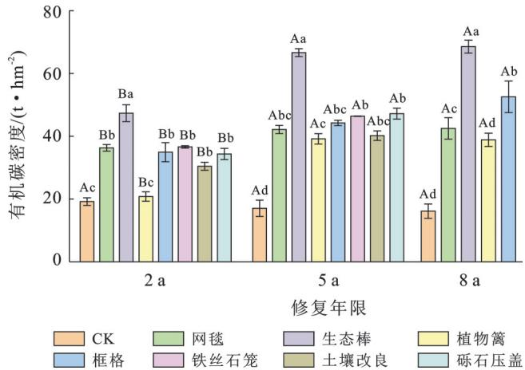
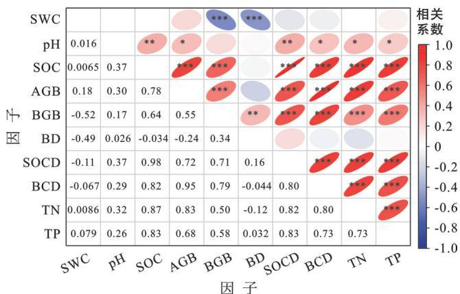

# 干旱矿区排土场边坡生态修复模式对植被一土壤有机碳密度的影响

吴禹希，潘嘉琛，张伟，郭小平(北京林业大学水土保持学院，北京100083)

摘要：目的探究不同生态修复技术模式对干旱矿区排土场边坡植被和土壤有机碳密度的影响，分析经过生态修复后的排土场边坡土壤有机碳变化状况，为推广生态修复技术、提升矿区碳汇能力提供理论依据。方法选取内蒙古乌海市示范工程蒙泰、新星、棋丰3个露天煤矿生态修复排土场边坡植被和土壤为研究对象，通过野外采样与室内试验结合，分析植被碳密度、土壤理化因子和土壤碳密度以及植被指标与土壤因子的相关性。结果①随着修复年限的增加，植被有机碳密度呈递增趋势，在2\~5a间，增长率处于31.91%\~45.62%，5年到8年处于11.80%\~36.67%之间。土壤有机碳含量及密度也呈增长的趋势，在2\~5a间，土壤有机碳密度增长率在15.55%\~91.28%之间，5\~8a增长率在0.4%\~11.70%之间；②生态棒修复技术模式在干旱矿区排土场对于改善土壤及植被有机碳积累状况效果最好，修复8a土壤有机碳密度达到最大，为66.70t/hm²，植被有机碳密度达到1.85t/hm²，植物篱修复技术模式的修复效果相比最差，修复8a土壤有机碳密度仅为37.36t/hm²，植物有机碳密度为1.48t/hm²，生态修复5a时，砾石压盖和铁丝石笼的植被一土壤有机碳密度分别为45.84和44.98t/hm²。结论在生态修复不超过8a的情况下，这7种生态修复技术模式修复后的植被一土壤有机碳密度随修复年限增加而增加，在修复8a时达到最大值，固碳效果明显。相比较之下，植物篱十生态袋截排水技术十播种十喷灌修复技术模式修复效果最差，生态棒+生态袋截排水技术+播种+喷灌、砾石压面+生态袋截排水技术+播种+喷灌、石笼水平拦挡+生态袋截排水技术+播种+喷灌这3种修复技术模式为低碳环保修复技术模式，固碳效果良好，适合推广应用，同时在修复前期，应注意土壤改良及施肥养护工作。

关键词：有机碳密度；固碳研究；排土场；生态修复技术模式；干旱矿区

文献标识码：A

文章编号：1000-288X(2025)03-0278-08

中图分类号：S157.2，X171.1

文献参数：吴禹希，潘嘉琛，张伟，等.干旱矿区排土场边坡生态修复模式对植被一土壤有机碳密度的影 响[J]. 水土保持通报,2025,45(3):278-285. Wu Yuxi, Pan Jiachen,Zhang Wei, et al. Effects of ecological restoration models on vegetation-soil organic carbon density of dump slopes in arid mining areas [J]. Bulletin of Soil and Water Conservation, 2025,45(3) :278-285. DOI:10.13961/j.cnki.stbctb.2025.03.032; CSTR: 32312.14.stbctb.2025.03.032.

# Effects of ecological restoration models on vegetation-soil organic carbon density of dump slopes in arid mining areas

Wu Yuxi, Pan Jiachen, Zhang Wei, Guo Xiaoping (College of Soil and Water Conservation, Beijing Forestry University, Beijing, 100083, China)

Abstract: [Objective] The effects of various ecological restoration technology models on plant and soil organic carbon density in the dump slopes in arid mining areas were investigated, and the changes in organic carbon after ecological restoration were analyzed, in order to provide theoretical basis for promoting ecological restoration technology and enhancing the carbon sequestration capacity of mining areas. [Methods] Vegetation and soil samples from the ecological restoration slopes of waste dumps in three open-pit coal mines (Mengtai, Xinxing, and Qifeng) in Wuhai City, Inner Mongolia Autonomous Region, were selected as research subjects. Field

sampling and laboratory experiments were conducted to analyze vegetation carbon density, soil physicochemical factors, soil carbon density, and the correlation between vegetation indicators and soil factors. [Results] ① With the increase in restoration years, vegetation organic carbon density showed an increasing trend. The growth rate ranged from 31.91% to 45.62% from two to five years and from 11.80% to 36.67% from five to eight years. Soil organic carbon content and density also exhibited an increasing trend. The growth rate of soil organic carbon density ranged from 15.55% to 91.28% from two to five years and from 0.4% to 11.70% from five to eight years. ② The ecological rod restoration technology model showed the best results in improving the soil and vegetation organic carbon accumulation in waste dumps in arid mining areas. After eight years of restoration, the soil organic carbon density reached a maximum of 66.70 t/hm², and the vegetation organic carbon density reached 1.85 t/hm². In contrast, the plant hedge restoration technology model performed the worst, showing soil organic carbon density of only 37.36 t/hm² and vegetation organic carbon density of 1.48 t/hm² after eight years of restoration. At five years of ecological restoration, the vegetation-soil organic carbon density for gravel cover and wire gabion were 45.84 t/hm² and 44.98 t/hm², respectively. [Conclusion] Under ecological restoration for no more than eight years, the vegetation-soil organic carbon density increased with the restoration years and reached its maximum at eight years, demonstrating significant carbon sequestration effects. The plant hedge + ecological bag interception and drainage technology + sowing + sprinkler irrigation restoration model performed the worst. The ecological rod + ecological bag interception and drainage technology + sowing + sprinkler irrigation, gravel cover + ecological bag interception and drainage technology + sowing + sprinkler irrigation, and gabion-horizontal barrier + ecological bag interception and drainage technology + sowing + sprinkler irrigation models were low-carbon and environmentally friendly restoration technologies with good carbon sequestration effects, making them suitable for promotion and application. Additionally, soil improvement and the maintenance of fertilization should be emphasized during the early stages of restoration.

Keywords: organic carbon density; carbon sequestration research; dumps; ecological restoration technology model; arid mining areas

中国西部干旱荒漠区蕴藏着丰富的煤炭资源，近年来已成为中国煤炭生产的重要基地[1]。煤炭开采在促进经济发展的同时，也会造成排土场土地占压、植被破坏和荒漠化等一系列问题，对生态环境造成了挑战[2-4]。当前，生态修复作为改善或恢复现有生态系统的结构和功能的一种综合的修复环境的技术，能够充分发挥土壤的固碳增汇作用，是实现碳达峰、碳中和目标的重要途径[5-7]。过去关于干旱矿区排土场生态修复已经有不少研究成果，但主要针对土体重构、植被重建等方面进行研究8]，考虑矿山生态修复技术模式的研究较少。因此，研究排土场边坡生态修复模式对植被和土壤碳密度的影响，筛选适宜的技术模式对实现西部干旱矿区排土场治理固碳增汇具有重要意义。

植被和土壤在全球碳循环中扮演着关键角色，植物通过光合作用吸收大气中的二氧化碳，将其固定在植被和土壤中，在微生物的作用下，分解的植物残留物的剩余部分，以微生物残体的形式固定在土壤中，形成土壤碳汇[9-10]。不同生态修复技术模式通过影响植被的生产力、土壤理化性质、微生物活性进而影响土壤的有机碳密度。董玉锟研究表明，采用沙柳方格修复措施，并搭配沙打旺种植，能够提升土壤孔隙度，优化土壤结构，增加土壤有机碳[11]。在青海木里煤田采用无纺布覆盖一灌溉养护的生态修复措施，能够快速恢复排土场植被，加速植被和土壤有机碳累积[12]。目前，矿区排土场边坡生态修复技术模式十分广泛，包括毯帘覆盖、砖砌框格、植物篱扦插、生态棒覆盖等固坡措施，生态袋截排水等截排水措施、种子撒播或植苗等植被恢复措施[13-14]。以往有研究15从经济成本的角度，对排土场生态恢复工程系统地进行技术模式评价，筛选出毯帘覆盖+生态袋排水+播种技术模式综合恢复效果都比较好，适宜推广应用。在绿色矿山的发展建设过程中，很少有学者从碳汇的角度研究排土场生态恢复技术模式对植被和土壤有机碳的影响，因此亟待开展排土场生态修复植被恢复和重建过程中有机碳累积及影响因素的研究。

为此，本研究选取内蒙古自治区乌海市蒙泰、新星、棋丰3个露天煤矿生态修复排土场边坡植被和土壤为研究对象，通过野外采样与室内试验结合，分析植被碳密度、土壤理化因子和土壤碳密度，以及植被指标与土壤因子的相关性。探讨干旱荒漠区排土场边坡生态恢复技术模式对植被和土壤有机碳密度的影响，旨在为国家生态文明建设与可持续发展推广低碳和环保生态修复技术，提升矿区碳汇能力提供理论依据。

34.50%。小型煤矿18处，产能 $9 . 9 3 \times 1 0 ^ { 6 } ~ \mathrm { t / a }$ ，占全市产能的22.18%。

## 1.2 样地调查及样品采集处理

## 1 材料与方法

## 1.1 研究区概况

研究区处于内蒙古自治区境乌海市(39°15′—$3 9 ^ { \circ } 5 2 ^ { \prime } \mathrm { N } , 1 0 6 ^ { \circ } 3 6 ^ { \prime } - 1 0 7 ^ { \circ } 0 5 ^ { \prime } \mathrm { E } )$ ，属于典型的大陆性气候；昼夜温差大，多年平均气温9.64℃；多年平均日照时间数为3138.6 h;多年平均降水量159.8mm;降水主要集中在7—9月。平均全年无霜期为156～165d；山地丘陵约占总面积的2/3；乌海市基本地形地貌特征是“三山两谷一条河”，东部是绵延百里的桌子山，中部为甘德尔山，西部为五虎山，三山成南北走向平行排列，中间形成两条平坦的谷地。黄河沿岗德尔山西谷流经市区，阻断 $\xrightarrow { \tilde { \square } }$ 兰布和沙漠进入河套地区。区域土壤以灰漠土、棕钙土和风沙土为主。该市属于国家规划矿区，其中矿区内现有煤矿整合区16个，资源整合煤矿19处，矿区面积 $8 8 3 . 3 3 \mathrm { k m ^ { 2 } }$ ，其中：大型煤矿12处，产能 $1 . 9 4 \times 1 0 ^ { 7 } ~ \mathrm { t / a }$ ，占全市产能的43.32%，中型煤矿16处，产能 $1 . 5 5 \times 1 0 ^ { 7 } ~ \mathrm { t / a }$ ，占全市产能的

选取乌海市已经修复的煤矿排土场边坡作为研究对象，3个示范区工程共有7种技术模式(表1—2)，生态修复2a和5a的包括CK(采煤损毁土地），网毯修复，生态棒修复，植物篱修复，框格修复，铁丝石笼修复，土壤改良修复和砾石压盖修复。生态修复8a的包括CK(采煤损毁土地），网毯修复，生态棒修复，植物篱修复，框格修复。2023年9月，在3个煤矿排土场不同修复技术模式处理的边坡设置 $1 \mathrm { m } \times 1 \mathrm { m }$ 样方，分别选取坡上、坡中、坡下3个样点作为重复，采用随机取样的方法进行土壤样品的采集，采集土层深度为15cm，采集土壤样品约1kg，去除石块根系等，磨碎过筛，进行土壤有机碳的测定。同时采用100cm³取土壤容重土。采用收获法测量地上生物量，利用工具齐根部将地上部分植物样品刈割，带回实验室于烘箱中85℃烘干至恒重，称量记为地上生物量；地下生物量采用全挖法，在样地内收集0—15cm土层的根系样品，带回实验室清洗后在烘箱内 $6 5 ~ \mathrm { { ^ \circ C } }$ 下烘干48h后称重，记为地下生物量。所有采样均重复3次。

表1 乌海市煤矿示范工程的基本信息  
Table 1 Basic information of coal mine demonstration projects of Wuhai City
<table><tr><td>示范区工程</td><td>地理位置</td><td>修复年限  $/ \mathrm { a }$ </td><td>坡度/(°)</td><td>坡长  $\cdot / \mathrm { m }$ </td><td>坡向</td><td>主要优势种</td></tr><tr><td>棋丰煤矿</td><td>39°39&#x27;N,106°49&#x27;E</td><td>2</td><td>37</td><td>25</td><td>西坡</td><td>白沙蒿、沙拐枣、霸王、狗尾草、柠条</td></tr><tr><td>新星煤矿</td><td>39°42&#x27;N,106°50&#x27;E</td><td>5</td><td>35</td><td>25</td><td>西坡</td><td>白沙蒿、沙拐枣、霸王、狗尾草、柠条</td></tr><tr><td>蒙泰煤矿</td><td>39°37&#x27;N,106°52&#x27;E</td><td>8</td><td>40</td><td>25</td><td>西坡</td><td>白沙蒿、沙拐枣、霸王、狗尾草、柠条</td></tr></table>

表2 各煤矿示范工程修复技术的模式

Table 2 Restoration technology mode of each coal mine demonstration project
<table><tr><td>技术模式</td><td>处理方式</td></tr><tr><td>CK</td><td>采煤损毁土地</td></tr><tr><td>网毯</td><td>无纺布覆盖+生态袋截排水技术+播种+喷灌</td></tr><tr><td>生态棒</td><td>生态棒+生态袋截排水技术+播种+喷灌</td></tr><tr><td>植物篱</td><td>沙柳网格+生态袋截排水技术+播种+喷灌</td></tr><tr><td>框格</td><td>骨架护坡+生态袋截排水技术+播种+喷灌</td></tr><tr><td>铁丝石笼</td><td>石笼水平拦挡+生态袋截排水技术+播种+喷灌</td></tr><tr><td>土壤改良</td><td>有机肥料混合撒施+生态袋截排水技术+播种+喷灌</td></tr><tr><td>砾石压盖</td><td>砾石压面+生态袋截排水技术+播种+喷灌</td></tr></table>

## 1.3 测定方法与数据分析

土壤pH值采用pH计测定，通过将风干土壤与蒸馏水按1:2.5比例混合，静置后测量其酸碱度；土壤容重采用环刀法测定，使用体积为100cm³的环刀采样，干燥称重后计算土壤容重；土壤有机碳使用重铬酸钾氧化一外加热法进行测定，通过重铬酸钾氧化土壤有机碳，在外加热条件下促进反应，根据氧化还原反应中消耗的重铬酸钾量计算有机碳含量；全氮测定使用微量凯氏定氮法，样品经凯氏消化后，将有机氮转化为铵态氮，通过比色法或滴定法测定氮含量；全磷测定采用硫酸一高氯酸消煮法，利用硫酸和高氯酸消解土壤样品，溶解磷后通过比色法测定其浓度；植被有机碳采用重铬酸钾一硫酸氧化法(湿热法)对样品进行含碳率测定16]，通过湿热条件下的氧化反应，计算样品的有机碳含量。植被有机碳密度采用公式计算[17]，计算公式为：

$$
C _ { \hbar } { = } B _ { 1 } { \bullet } C _ { f } { + } B _ { 2 } { \bullet } C _ { f }\tag{1}
$$

式中： $C _ { p }$ 为植被有机碳密度 $( \mathrm { k g / m ^ { 2 } } ) ; C _ { f }$ 为测定所得各植被含碳率(%)； $B _ { 1 }$ 为测定各地上植被生物量$( \mathrm { g / m ^ { 2 } } )  ; B _ { 2 }$ 为测定各地下根系生物量 $( \mathrm { g } / \mathrm { m } ^ { 2 } )$ O

土壤有机碳密度采用公式计算[18]，计算公式为：

$$
\mathrm { S O C D } = \sum _ { i } ^ { m } \mathrm { S O C } _ { i } \cdot \mathrm { B D } _ { i } \bullet D _ { i }\tag{2}
$$

式中：SOCD为土壤有机碳密度 $( \mathrm { k g / m ^ { 2 } } ) ; \mathrm { S O C _ { i } }$ 为第i层的土壤有机碳含量 $( \mathrm { g / k g ) }$ ；BDi为第i层的土壤容重 $\mathrm { ( g / c m ^ { 3 } ) }$ ；Di是第i层土层厚度(m)；m是土层的数量。

本研究利用 SPSS11.5单因素方差分析（one-way ANOVA),各处理之间显著性差异分析均设 $\scriptstyle \mathbf { \phi } \left. \mathbf { \tilde { \phi } } \right.$ 0.05水平，对不同指标间采用Pearson相关性分析，采用Origin 2022绘图。

## 2 结果与分析

## 2.1不同生态修复技术模式对植被有机碳密度的影响

如图1所示，经过生态修复后的植被有机碳密度均显著高于CK，在这7种不同生态修复技术下，随着修复年限的增加，植被有机碳密度呈递增趋势。3个修复年限下，生态棒修复技术模式表现最好，其植被有机碳密度均高于其他修复技术模式，依次为1.05，1.47和 $1 . 8 5 ~ \mathrm { t / h m ^ { 2 } }$ 。生态修复2a情况下，砾石压盖修复技术模式的植被有机碳密度最低，为 $0 . 9 2 ~ \mathrm { t / h m ^ { 2 } }$ 仅为生态棒修复的88.04%，土壤改良修复技术模式的植被有机碳密度仅高于砾石压盖，为 $0 . 9 6 ~ \mathrm { t / h m } ^ { 2 } \circ$ 生态修复5a情况下，网毯修复技术模式的植被有机碳密度最低，为 $1 . 3 3 ~ \mathrm { t / h m ^ { 2 } }$ ，与生态棒修复技术模式间有显著差异，植被有机碳密度大小排序为：铁丝石笼>框格>土壤改良>植物篱>砾石压盖。在生态修复8a情况下，生态棒修复技术模式的植被有机碳显著高于网毯修复和植物篱修复这2种修复技术模式，框格修复仅次于生态棒，其植被有机碳密度为$1 . 7 0 ~ \mathrm { t / h m ^ { 2 } }$ 。植物篱修复与网毯修复2种技术模式接近，分别为1.50和 $1 . 4 9 ~ \mathrm { t / h m ^ { 2 } }$ O

## 2.2 不同生态修复技术模式对土壤有机碳的影响

2.2.1 不同生态修复技术模式下土壤有机碳含量变化如图2所示，随着修复年限的增加，土壤有机碳含量呈现递增的趋势。除修复2a中的植物篱修复技术模式外，其他修复技术模式相比于CK，均显著提升土壤有机碳含量，而生态棒修复技术模式对于土壤有机碳含量的提升效果最好，植物篱修复技术模式对于提升土壤有机碳含量的效果最差。生态修复2a中，植物篱修复技术模式下土壤有机碳含量最低，为 $4 . 3 7 \mathrm { g / k g }$ ，仅比CK高出3%，而生态棒修复技术模式的土壤有机碳含量为 $1 0 . 7 7 \mathrm { g / k g }$ ,是CK的2.53倍，其余5种修复技术模式土壤有机碳含量大小依次为：

网毯修复>铁丝石笼修复>框格修复>砾石压盖修复>土壤改良修复。生态修复5a中，生态棒修复下土壤有机碳含量最高，为13.89g/kg，其在修复8a时，达到最高值 $1 5 . 8 0 ~ \mathrm { g / k g }$ ,同样植物篱修复技术模式下的土壤有机碳含量最低，修复5a和修复8a的有机碳含量分别为8.22,9.75g/kg。修复5a时其他5种修复技术模式土壤有机碳含量大小依次为：铁丝石笼修复>框格修复>网毯修复>土壤改良修复>植物篱修复。修复8a时，网毯修复>植物篱修复，分别为 9.99,9.75 g/kg。

  
注：不同大写字母表示同一修复技术模式不同修复年限植被有机碳具有显著差异(p<0.05);不同小写字母表示同一修复年限不同修复技术模式植被有机碳具有显著差异(ρ<0.05)。下同。

图1 不同修复年限不同修复技术模式植被的有机碳密度  
Fig.1 Vegetation organic carbon density in different restoration years and restoration technology patterns  
  
图2 不同修复年限不同修复技术模式土壤有机碳变化  
Fig.2 Changes of soil organic carbon in different restoration years and technology models

2.2.2 不同生态修复技术模式下土壤有机碳密度变化由图3可知，不同修复技术模式的土壤有机碳密度在3个年份间的变化较大，除修复2a中的植物篱修复技术模式外，其他几种修复技术模式在3个修复年限中，均表现为显著提升土壤有机碳密度。植物篱修复技术模式的土壤有机碳密度随着修复年限的增加呈现先增加后减小的趋势，而其他几种生态修复技术模式土壤有机碳密度随着修复年限增加而持续增加。生态棒修复技术模式在3个修复年限中，其土壤有机碳密度均显著高于其他修复技术模式，其在修复8a时达到最大值 $6 6 . 7 0 ~ \mathrm { t / h m ^ { 2 } }$ ，修复5a相比于修复2a间增长较快，具有显著差异，增长率为40.77%。植物篱修复技术模式在3个修复年限中表现最差，其土壤有机碳密度最低，3个年份的土壤有机碳密度分别为19.77,37.81和 $3 7 . 3 6 ~ \mathrm { t / h m ^ { 2 } }$ ,在修复5a时达到峰值。生态修复2a中，除植物篱外，土壤改良修复技术模式的有机碳密度最低，为 $2 9 . 4 6 ~ \mathrm { t / h m ^ { 2 } }$ 其他4种修复技术模式间的土壤有机碳密度无显著差异，表现为：铁丝石笼修复 $( 3 5 . 6 1 ~ \mathrm { t / h m ^ { 2 } } ) >$ 网毯修复 $( 3 5 . 3 3 ~ \mathrm { t / h m ^ { 2 } } ) >$ 框格修复(33.95 t/hm²)>砾石压盖修复 $\left( 3 3 . 4 2 ~ \mathrm { t / h m ^ { 2 } } \right)$ ，修复5a中，这5种修复技术模式间无显著差异，大小顺序依次为：砾石压盖修复>铁丝石笼修复>框格修复>网毯修复>土壤改良修复>植物篱修复。

  
图3 不同修复年限不同技术模式土壤有机碳密度  
Fig.3 Soil organic carbon density in different restoration years and technical models

## 2.3 不同生态修复技术模式对植被一土壤有机碳密度的影响

由图4可知，植物篱修复技术模式下，植被一土壤总有机碳密度呈先增加后减少的趋势，其他生态修复技术模式在不同修复年限下，其植被一土壤总有机碳密度随修复年限的增加，呈现递增的趋势。生态修复3个年限下，生态棒修复技术模式生态系统有机碳密度最高，随着修复年限增加，依次为47.34,66.63和$6 8 . 5 5 ~ \mathrm { t / h m ^ { 2 } }$ ，与其他几种修复技术模式及CK间存在显著差异。生态修复8a时，大小顺序依次为：生态棒修复>框格修复>网毯修复>植物篱修复>CK。

  
图4 不同修复技术模式植被一土壤有机碳密度  
Fig. 4 Vegetation-soil organic carbon density of different restoration technology models

## 2.4 植被与土壤有机碳密度及理化因子相关性分析

由图5可知，土壤有机碳含量与土壤有机碳密度呈极显著正相关 $( \phi { < } 0 . 0 0 1 )$ 地上生物量与地下生物量分别和植被有机碳密度呈显著正相关 $( \phi { < } 0 . 0 0 1 )$ 土壤全氮和土壤全磷均与土壤有机碳密度、植被有机碳密度呈显著正相关 $( p { < } 0 . 0 0 1 , F { > } 0 . 7 )$ 。地上生物量、地下生物量分别与土壤有机碳含量、植被有机碳密度间呈显著正相关关系 $( \phi { < } 0 . 0 0 1 )$ O

  
注：①\*表示显著性检验水平 $\rho { < } 0 . 0 5 ; { } ^ { \ast } { } ^ { \ast } { } ^ { }$ 表示显著性检验水平$0 . 0 1 { < } p { < } 0 . 0 5 ; { * } { * } { * }$ 表示显著性水平检验 $0 . 0 0 1 { < } p { < } 0 . 0 1$ 。②SWC为土壤含水率 $\textstyle { \mathfrak { s o c } }$ 为土壤有机碳含量 $\mathrm { ; A G B }$ 为地上生物量;BGB为地下生物量;BD为容重；SOCD为土壤有机碳密度;BCD为植被有机碳密度；TN为全氮；TP为全磷。

图5 土壤与植被有机碳密度及理化因子的相关关系

Fig.5 Correlation between soil and plant organic carbon density and physicochemical factors

## 3 讨论

## 3.1 不同修复年限对植被及土壤有机碳密度的影响

露天排土场初始的土壤水分、养分、结构等条件较差，通过施加物理工程措施和生物措施后，增加了地上、地下和总生物量，提高了植物覆盖率，促进植物生长发育，这与此前的研究一致[19]。植物通过光合作用吸收大气中的CO2，并以有机质的形式储存起来[6]。随着修复年限的增加，植被呈现灌丛化，提高了植被的碳吸收率，直接促进植被碳密度提升[20-21]。本研究结果表明，植被有机碳密度均随着修复年限的增加而增加，金立群等[22]李衍青等[23]对高寒露天煤矿植被建植发现随着种植年限的增长，植被高度、盖度、地上生物量均显著增加，这与本研究结果一致。土壤有机碳含量取决于凋落物、根系分泌物等碳输入和土壤呼吸、淋溶等碳输出的平衡[24]。本研究中施加生态修复措施后，土壤有机碳含量与密度显著增加。相关性分析发现，有机碳密度与植被生物量呈显著正相关关系(图5)。一方面，植被下层凋落物、根系生物量和分泌物能够促进土壤颗粒的团聚，提高土壤稳定性25]；另一方面，植被恢复提升了微生物活性，分解植物凋落物与微生物残体，提高土壤有机碳密度[26]。

## 3.2 不同修复技术模式对植被及土壤有机碳密度的影响

在生态修复的前两年，植被碳密度没有显著差异，但相比之下砾石压盖修复后植被有机碳密度最低，同时结果中表明地下生物量与土壤含水率间呈显著负相关(p<0.001)，原因可能是砾石压盖修复下，可供植被生长空间缩小，砾石前期影响植物幼苗光照，导致其植被恢复状况相对较差；或是其减流减沙效果相对较差，最终导致植被有机碳密度相对较低[27]。生态棒修复的鳍形布设结构对于拦截径流具有显著效果，减小坡面径流的汇水面积，有效防止土壤有机质流失，因此其对于土壤有机碳积累效果较好，土壤有机碳密度最大。同时有研究表明，植物篱在布设初期到真正形成具有良好水土保持作用时间较长，导致修复前期其土壤有机碳积累速度较慢，土壤有机碳密度最低[28]。

在生态修复的中期，矿山旱区植被呈现灌丛化，降低了土壤水分蒸发，有效保持了土壤水分29]，同时促进植被和土壤固碳能力的提升。框格修复通过对坡面进行支撑加固来达到生态修复的目的，具有高强度的结构稳定性。铁丝石笼修复主要通过加固边坡来拦截和减缓地表径流速度，可以有效防止土壤养分流失，其抗冲刷力强，透水性好，同时具有一定的柔性，其石笼间隙也可以很好地允许植物生长。网毯修复通过覆盖稳定表土的方式达到生态修复的目的，网毯对于地形变化具有较高的适应性，同时网毯的覆盖可以有效地减少雨水对表土的冲刷，防止水土流失。框格、铁丝石笼、网毯3种修复技术模式均通过修复基材与植被共同构成护坡主体结构，能够有效减缓土壤侵蚀与水土流失，提高土壤稳定性。由于修复基材特性较为相似，它们在改善土壤水分和促进植被一土壤养分循环方面修复效果接近。植物篱修复技术模式下土壤有机碳密度低于其他修复技术模式，原因可能是植物篱修复技术模式下，植物篱的覆盖影响植物幼苗的光照，导致植物幼苗及其根系不发达，无法在带中缠绕，固土能力弱，阻拦地表径流能力弱，使土壤养分及土壤颗粒流失[30]。

在生态修复进行到第8a,4种修复措施在植被和土壤碳密度表现出显著差异。植物篱修复的植物有机碳密度相比最低原因可能是随着修复时间增加，雨季突发降水会对土壤造成冲刷侵蚀，植物篱过滤带的径流阻拦作用下降或丧失，影响根系呼吸，植被生长，导致植被有机碳密度较低[31]。砾石压盖措施植被一土壤碳密度有所提升，干旱区昼夜温差较大，夜间石头表面温度下降到露点以下，空气中的水蒸气遇冷液化形成小水滴，为植被一土壤提供丰富的水源，促进有机碳形成。生态棒修复下植被有机碳密度最高，原因可能是生态棒对于截流固土效果较好，植被生长状况良好，植物有机碳密度较高[32]。但生态棒修复技术模式修复5a到修复8a间土壤有机碳密度增长缓慢，原因可能是生态棒修复技术模式下，初期生态棒未老化分解，具有截流保水等作用，而随着修复年限的增加，生态棒经过老化分解，其土壤水分保持及截流作用降低，水土流失可能破坏土壤结构，导致土壤容重降低，从而使土壤有机碳积累受到影响[33]。

## 4 结论

（1）经过这7种生态修复技术模式生态修复后，在修复年限不超过8a时，其植被一土壤有机碳密度随着修复年限的增加而增加，到修复8a时达到最大值，固碳效果明显。

（2）与采煤损毁区相比，采取不同生态修复技术模式可提高植被有机碳积累，在2～5a间显著增加，5\~8a间缓慢增长，生态棒+生态袋截排水技术+播种+喷灌修复效果最好，修复8a时最高，其植被有机碳密度为 1.85 t/hm²。

（3）生态修复技术模式在干旱矿区对于土壤碳积累和植被恢复均有积极作用，生态棒修复技术模式对于改善土壤及植被有机碳积累状况效果最好。植物篱修复措施由于截流固土能力较差，后期水土流失严重，土壤有机碳密度最低。框格、铁丝石笼、网毯3种修复技术模式，通过修复基材与植被共同构成护坡主体结构，能够有效减缓土壤侵蚀与水土流失，修复效果相近。

（4）综合各修复技术模式的植被一土壤固碳差异，可推广生态棒+生态袋截排水技术+播种+喷灌、砾石压面+生态袋截排水技术+播种+喷灌，石笼水平拦挡+生态袋截排水技术+播种+喷灌这3种修复技术模式为绿色低碳的生态修复技术模式。

## 参考文献(References)

[1] Feng Jian, Zhao Lingdi, Zhang Yibo, et al. Can climate change influence agricultural GTFP in arid and semi-arid regions of northwest China? [J]. Journal of Arid Land, 2020,12(5):837-853.

[2]马晨鑫，俞琦，刘永杰，等.内蒙古露天煤矿排土场植物 恢复根际土壤真菌群落特征[J].生态学报，2025,25(4): 1974-1986. Ma Chenxin, Yu Qi, Liu Yongjie, et al. Characteristics of fungal community in rhizosphere soil of plant restoration in dump of open-pit coal mine in Inner Mongolia [J]. China Industrial Economics, 2025,25(4):1974-1986.

[3]原野，赵中秋，白中科，等.露天煤矿复垦生态系统碳库 研究进展[J].生态环境学报,2016,25(5):903-910. Yuan Ye, Zhao Zhongqiu, Bai Zhongke, et al. Research advances in carbon sequestration of reclaimed ecosystems in opencast coal mining area [J]. Ecology and Environmental Sciences,2016,25(5):903-910.

[4] Huang Jianping, Yu Haipeng, Han Dongliang, et al. Declines in global ecological security under climate change [J]. Ecological Indicators, 2020,117:106651.

[5] Li Yuanyuan, Wen Hongyu, Chen Longqian, et al. Succession of bacterial community structure and diversity in soil along a chronosequence of reclamation and re-vegetation on coal mine spoils in China [J]. PLoS One, 2014, 9 (12):e115024.

[6]贾国栋，张龙齐，余新晓.生态修复的固碳机制、实现途径 及碳中和对策[J].水土保持通报,2022,42(5):393-397. Jia Guodong, Zhang Longqi, Yu Xinxiao. Carbon sequestration mechanism , realization way and carbon neutralization strategy of ecological restoration [J]. Bulletin of Soil and Water Conservation, 2022,42(5):393-397.

[7]孔凡婕，应凌霄，文雯，等.基于国土空间生态修复的固 碳增汇探讨[J].中国国土资源经济，2021，34(12)： 70-76. Kong Fanjie, Ying Lingxiao, Wen Wen, et al. Exploring carbon sequestration and sink enhancement based on ecological restoration of territorial space [J]. Natural Resource Economics of China, 2021,34(12):70-76.

[8] 张伟，郭小平，李文烨.干旱矿区重构土体蓄水层适宜粒径级配研究[J].水土保持研究,2024,31(6):290-298.Zhang Wei, Guo Xiaoping, Li Wenye. Study on suitable

particle size gradation of reconstructed soil aquifer in arid mining area [J]. Research of Soil and Water Conservation, 2024,31(6):290-298.

[9]余新晓，贾国栋，郑鹏飞.碳中和的水土保持实现途径和对 策[J].中国水土保持科学(中英文),2021,19(6):138-144. Yu Xinxiao, Jia Guodong, Zheng Pengfei. Ways and countermeasures to achieve carbon-neutral in soil and water conservation [J]. Science of Soil and Water Conservation, 2021,19(6):138-144.

[10]杨阳，王宝荣，窦艳星，等.植物源和微生物源土壤有机 碳转化与稳定研究进展[J].应用生态学报，2024,35 (1):111-123. Yang Yang, Wang Baorong, Dou Yanxing, et al. Advances in the research of transformation and stabilization of soil organic carbon from plant and microbe [J]. Chinese Journal of Applied Ecology, 2024, 35 (1) : 111-123.

[11] Liang Chao, Amelung W, Lehmann J, et al. Quantitative assessment of microbial necromass contribution to soil organic matter [J]. Global Change Biology, 2019, 25(11):3578-3590.

[12] 董玉锟.内蒙露天煤矿排土场边坡抗冲性及减水减沙 效益研究[D].陕西杨凌：西北农林科技大学，2015. Dong Yukun. Study on effects of sand opencast coal minein Inner Mongolia dump slope erosionresistance and reduction of water [D].Yangling, Shaanxi: Northwest A&F University, 2015.

[13]段新伟，左伟芹，杨韶昆，等.高寒缺氧矿区草原生态恢 复探究：以青海省木里煤田为例[J].矿业研究与开发， 2020,40(2):156-160. Duan Xinwei, Zuo Weiqin, Yang Shaokun, et al. Study on ecological restoration of grassland in alpine and anoxic mining areas: Taking the Muli Coalfield in Qinghai Province as an example [J]. Mining Research and Development,2020,40(2):156-160.

[14]李晓菲，郭小平，李鹏飞，等.灵武煤矿区排矸场生态系 统服务价值评估[J].中国水土保持科学(中英文）， 2023,21(2):25-32. Li Xiaofei, Guo Xiaoping, Li Pengfei, et al. Evaluation of ecosystem service value for gangue dump field in Lingwu mining areas [J]. Science of Soil and Water Conservation,2023,21(2):25-32.

[15]李青峰，郭小平，万亚俊，等.荒漠煤矿区排土场生态修 复工程技术模式评价[J].中国水土保持科学(中英 文),2022,20(6):94-108. Li Qingfeng, Guo Xiaoping, Wan Yajun, et al. Evaluation on the ecological restoration engineering modes of waste dump in the coal mine of desert area [J]. Science of Soil and Water Conservation, 2022,20(6):94-108.

[16」王鹏程，邢乐杰，肖文发，等.三峡库区森林生态系统有

机碳密度及碳储量[J].生态学报,2009,29(1):97-107. Wang Pengcheng, Xing Lejie, Xiao Wenfa, et al. Organic carbon density and storage of forest ecosystems in Three Gorges Reservoir Area [J]. Acta Ecologica Sinica, 2009,29(1):97-107.

[17]杨柳生，高若允，孙凡，等.泥石流频发流域失稳性坡面 植物群落特征及生态系统碳储量[J].山地学报，2022， 40(3):355-368. Yang Liusheng, Gao Ruoyun, Sun Fan, et al. Plant community and ecosystem carbon stocks in the unstable slopes subjected to high-frequency debris flow [J]. Mountain Research, 2022,40(3):355-368.

[18]张彦军，郁耀闯，牛俊杰，等.秦岭太白山北坡土壤有机 碳储量的海拔梯度格局[J].生态学报，2020,40(2)： 629-639. Zhang Yanjun, Yu Yaochuang, Niu Junjie, et al. The elevational patterns of soil organic carbon storage on the northern slope of Taibai Mountain of Qinling [J]. Acta Ecologica Sinica, 2020,40(2):629-639.

[19] Dang Han, Li Jiahao, Xu Jinshi, et al. Differences in soil water and nutrients under catchment afforestation and natural restoration shape herbaceous communities on the Chinese Loess Plateau [J]. Forest Ecology and Management, 2022,505:119925.

[20]珊丹，何京丽，刘艳萍，等.草原矿区排土场恢复重建人 工植被变化[J].生态科学,2017,36(2):57-62. Shan Dan, He Jingli, Liu Yanping, et al. Artificial vegetation changes on vegetation restoration in coal mine dump slope of typical steppe [J]. Ecological Science, 2017,36(2):57-62.

[21] 项元和，于晓杰，魏勇明.露天矿排土场生态修复与植被 重建技术[J].中国水土保持科学,2013,11(S1):48-54. Xiang Yuanhe, Yu Xiaojie, Wei Yongming. Techniques ecological restoration and plant restoration on spoil dump of modern strip mine [J]. Science of Soil and Water Conservation, 2013,11(S1):48-54.

[22]金立群，李希来，孙华方，等.不同恢复年限对高寒露天 煤矿区渣山植被和土壤特性的影响[J].生态学杂志， 2019,38(1):121-128. Jin Liqun, Li Xilai, Sun Huafang, et al. Effects of different years of recovery on vegetation and soil characteristics of open-pit coal mine dumps in alpine region [J]. Chinese Journal of Ecology, 2019,38(1):121-128.

[23]李衍青，蒋忠诚，罗为群，等.植被恢复对岩溶石漠化区 土壤有机碳及轻组有机碳的影响[J].水土保持通报， 2016,36(4):158-163. Li Yanqing, Jiang Zhongcheng, Luo Weiqun, et al. Effects of revegetation on soil organic carbon and lightfraction organic carbon in karst rocky desertification region [J]. Bulletin of Soil and Water Conservation,

2016,36(4):158-163.

[24]龙启霞，蓝家程，姜勇祥.生态恢复对石漠化地区土壤 有机碳累积特征及其机制的影响[J].生态学报，2022， 42(18):7390-7402 Long Qixia, Lan Jiacheng, Jiang Yongxiang. Effects of soil organic carbon fractions on aggregates under ecological restoration in rocky desertification region [J]. Acta Ecologica Sinica, 2022,42(18):7390-7402.

[25]刘均阳，周正朝，苏雪萌.植物根系对土壤团聚体形成作用机制研究回顾[J].水土保持学报，2020,34(3）：267-273.Liu Junyang, Zhou Zhengchao, Su Xuemeng. Reviewof the mechanism of root system on the formation of soilaggregates [J]. Journal of Soil and Water Conservation,2020,34(3):267-273.

[26] Yang Yang, Dou Yanxing, Wang Baorong, et al. Increasing contribution of microbial residues to soil organic carbon in grassland restoration chronosequence [J]. Soil Biology and Biochemistry, 2022,170:108688.

[27]薛东明，郭小平，张晓霞.干旱矿区排土场不同边坡生 态修复模式下减流减沙效益[J].水土保持学报，2021， 35(6):15-21. Xue Dongming, Guo Xiaoping, Zhang Xiaoxia. Runoff and sediment reduction under different slope ecological restoration modes of waste dump in arid mining area [J]. Journal of Soil and Water Conservation, 2021, 35 (6):15-21.

[28]薛东明.干旱荒漠矿区排土场生态修复模式效益评价 [D].北京：北京林业大学，2022. Xue Dongming. Benefit evaluation of ecological restoration model of dump in arid desert mining area [D]. Beijing : Beijing Forestry University , 2022.

[29]丁颖，刘小伟，郭梁，等.黄土高原草地灌丛化对土壤有 机碳、氮磷养分及酶活性的影响[J].水土保持通报， 2024,44(5):243-250. Ding Ying, Liu Xiaowei, Guo Liang, et al. Effects of shrub encroachment on soil organic carbon, nitrogen and phosphorus nutrients, and enzyme activity in Loess Plateau [J]. Bulletin of Soil and Water Conservation, 2024,44(5):243-250.

[30]黄小芳，丁树文，柯慧燕，等.三峡库区植物篱模式对土 壤理化性质和可蚀性的影响[J].水土保持学报，2021， 35(3):9-15. Huang Xiaofang, Ding Shuwen, Ke Huiyan, et al. Effects of hedgerow patterns on soil physical and chemical properties and erodibility in Three Gorges reservoir area [J]. Journal of Soil and Water Conservation, 2021, 35(3):9-15.

(下转第306页)