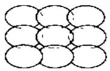
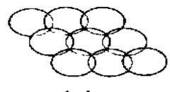
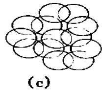
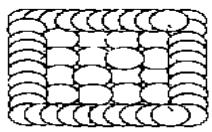
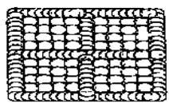
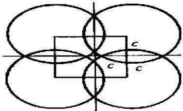
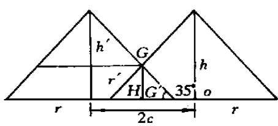
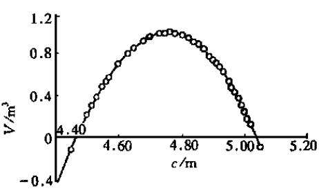

文章编号：0253—9993(2001) 01-0018—04

# 露天煤矿排土场平台“堆状地面’土壤重构方法

魏忠义1，2，胡振琪¹，白中科²

(1.中国矿业大学北京校区，北京 100083；2.山西农业大学林学院，山西太谷 030801)

摘要：露天煤矿新建排土场是一个人工巨型松散堆积体，往往存在严重的水土流失、表层土壤的压实以及排土场本身的稳定等问题：排土场平台“堆状地面土壤重构方法避免了表层土壤压实，并最大限度地增加了水分入渗和分散了地表径流，是解决上述问题的有效途径：阐述了排土场平台堆状地面土壤重构方法的概念，并以安太堡大型露天煤矿排土场为例，通过水文分析计算进一步研究了堆状地面的侵蚀控制机理，据此提出了优化的堆状地面排土方式：

关键词：露天煤矿；堆状地面；土壤重构；侵蚀控制

中图分类号：TD824.8

文献标识码：A

露天采煤剧烈扰动地表，直接破坏地表景观，从而导致更为严重的水土流失、土地破坏、植被破坏、河床淤积、洪水泛滥、沙漠化等一系列环境问题，影响到十壤、植被、地质、地貌、水文甚至区域气候等各个方面．安太堡露天煤矿位于山西省平鲁县境内，地处黄土高原，桑干河流域上游，丘陵地貌，寒温带季风大陆性气候，年均温6.2℃，年均降水量450mm，时间分布很不均匀，其中65%降水量集中在6～9月份，年均蒸发量2160mm，冬春季节多风沙，地带性植被属干旱草原类型，地带性土壤为栗钙土和黄绵土，土壤有机质含量低、结构差、抗蚀能力弱，水土流失极为严重，是桑干河流域土壤侵蚀最为严重的地区，侵蚀模数高达 $1 0 ~ 1 2 0 \mathrm { t } / \left( \mathrm { k } \mathrm { m } ^ { 2 } \mathbf { \cdot } \mathrm { a } \right)$ ．安太堡露天煤矿是一个典型的现代化露采矿山，是晋、陕、蒙接壤区第一个投产的世界级大型露天煤矿，剥采比为5.6:1，设计年产原煤1500万t，规划开采时间为99a·其工程开发和设计与美国西部的露天矿类似，采用单头挖掘机一卡车运输的采排工艺.

## 1 露天矿排土场堆状地面土壤重构方法

安太堡露天煤矿排土场是经过剥离、运输、堆垫而形成的：外排土场采用堆山式排土，在原地貌基础上堆起，下面垫有黄土、红土及岩石等：出于减少占地面积的考虑，设计高程较国内同类型排土场要高：内排土场是在采空区堆置而逐渐回填采坑，基底石质，地形平缓：排土场平台与边坡相间分布，平台宽数十米至百余米，台阶高20～40m，台阶坡面角为30～42°．排土场为岩土混排，原来的土体和上覆岩层经过剧烈的扰动混合后以松散堆积状态堆置在内外排土场，形成人工巨型松散堆积地貌景观：由于排土场堆置时间迅速，排弃岩土的自然固结时间短、稳定性差，原有土壤的理化特性及其相关的地质、地貌及水文条件等均发生了根本变化．平台表层土壤严重压实，干密度达 $1 . 5 \sim 1 . 9 \mathrm { g } \mathrm { / c m } ^ { 3 }$ ，渗透系数为0.3～0.4mm/min；相比之下，平台之间的边坡土体松散，干密度仅为 $0 . 9 { \sim } 1 . 2 _ { \mathrm { { g } } } / \mathrm { { c } } \mathrm { { m } } ^ { \mathfrak { T } } ^ { \mathfrak { T } }$

按土地法规定，排土场大部分区段的最终利用方向是农耕地．黄土区土源丰富，在达到设计标高前，排十场表层土壤重构以往通常采取厚层覆十方式并用重型机械碾压：这不仅造成了平台表层土壤的严重压实，不利于植被恢复；而目坚硬的平台表面不利于水分入渗，暴雨时很容易形成地表集中的暴雨径流：集中的径流不仅冲蚀了排十场松散的边坡，引起边坡面切沟、崩塌、滑坡，而目还可能沿着排十场内部的大孔隙、不稳定沉陷产生的裂缝以及水流侵蚀形成的盲沟陷穴深入到排土场深层甚至基底，成为排土场稳定的隐患：侵蚀控制是排土场初期复垦的最关键任务：以往尽管采取填穴、填缝、围堰、覆盖、打坝、设置排水渠道等水土保持工程措施，但由于排土场初期的不稳定性，常规水土保持措施很难发挥有效作用，侵蚀控制效果不是很理想：因此，必须针对具体情况，在进行系统的调查、研究和分析的基础上，提出一种适合当地情况的解决办法

露天煤矿排土场堆状地面土壤重构方法是一项创新性的排土场侵蚀控制和土壤重构技术，它是针对上述问题，并基于对安太堡露天煤矿排十场土地复垦具体情况的科学分析和长期的研究与实践而提出的：它是在顶层平台上将一车车覆盖十壤按一定排列方式疏松堆积而不碾压，利用松散黄十吸纳大量雨水，最大限度地增加水分入渗，将其储存于土体内，并借助堆与堆之间形成的众多凹坑的容纳来分散暴雨径流，从而保证在暴雨条件下不会形成大量集中的径流，可防止大面积水流的汇集和钻缝，同时也为快速恢复植被创造了条件：另外，堆状地面还兼具提供填缝填穴土源和在一定程度上自动弥补沉陷裂缝及陷穴的作用，其效果在安太堡露天煤矿排土场复垦实践中得到了初步证实：根据对安太堡露天煤矿外排土场堆状地面的实地调查， $5 \mathbf { a }$ 内未发生过顶层平台水流对边坡的明显侵蚀及大量集中水流的灌缝现象：基于安太堡露天煤矿排土场土地复垦研究实践而提出的堆状地面土壤重构方法同样适用于相同类型排土场的初期复垦：下面的水文分析计算可具体确定其增渗减流及分散径流效果

## 2 堆状地面土壤重构方法的水文依据

## 2.1 堆状地面松散堆状体的几何形状

单车倒土所形成堆积体的实际形状是一个底面椭圆的劈状体，但与单锥体形状近似，可简单地视其为锥形，表1是安太堡露天煤矿西排土场堆状体的实测值

表1 安太堡露天煤矿西排土场单堆状体实测值  
Table 1 The val ues measured on site of loess piles in the west stackpile of Antai bao Open pit Coal Mne
<table><tr><td>堆状体实测序号</td><td>底面椭圆长轴直径  $/ \mathrm { m }$ </td><td>底面椭圆短轴直径  $/ _ { \mathrm { m } }$ </td><td>堆积体的高度  $/ _ { \mathrm { m } }$ </td><td>单个堆积体的体积  $/ \mathrm { m } ^ { 3 }$ </td></tr><tr><td>1</td><td>11.2</td><td>9.7</td><td>3.2</td><td>91.4</td></tr><tr><td>2</td><td>10.9</td><td>10.1</td><td>3.1</td><td>89.5</td></tr><tr><td>3</td><td>10.1</td><td>9.3</td><td>3.5</td><td>86.2</td></tr><tr><td>4</td><td>10.8</td><td>10.3</td><td>3.1</td><td>90.3</td></tr><tr><td>5</td><td>12.0</td><td>10.2</td><td>2.8</td><td>92.7</td></tr><tr><td>均值</td><td>11.0</td><td>9.9</td><td>3.1</td><td></td></tr><tr><td>锥体平均值</td><td colspan="2"> $\overline { { R } } = 5 . 2 \mathrm { m }$ </td><td> $\overline { { H } } = 3 . 1 \mathrm { m }$ </td><td> $\overline { { V } } = 9 0 . 0 \mathrm { ~ m ~ } ^ { 3 }$ </td></tr></table>

以大型排土汽车每车土体积均值 $9 0 \mathrm { ~ m ~ } ^ { 3 }$ 计算，排弃土壤的安息角定为 $3 5 ^ { \circ }$ ，则锥体高度 $h = r \mathrm { t a n } 3 5 ^ { \circ }$ 单个锥体体积 $V = \pi r ^ { 2 } h / 3 = 9 0 { \mathrm { m } } ^ { 3 }$ ，则 $r = 4 . 9 7 { \mathrm { m } } , h = r { \mathrm { t a n } } 3 5 ^ { \circ } = 3 . 4 8 { \mathrm { m } }$ ，即此近似单锥体的底面半径为 $4 . 9 7 \mathrm { m }$ ，高为3.48m：实际的堆积形状是多个锥体的联合，其排列组合状况可以有多种形式，如图1所示的正方形排列、三角形排列、多边形排列、优化排列等：锥体排列的凹形区域构成了堆状地面的基本微集水单元，可视为一个个微小流域

  
(a)

  
(b)

  
(d)

  
(e)  
图1 排土场顶层平台堆状地面的堆排土方式  
Fig ·1 The sket ch map of loose heaped ground on t he top platf or m of st ackpiles

## 2.2 堆状体水文计算

堆状地面相邻锥体构成一个个微集水单元，以微集水单元为计算单位，分析计算在一定设计频率的暴雨下，单元内产流量的多少，配合后面堆土形式的几何计算，可以确定堆状地面的最优堆积方式

(1) 松散(黄土)堆积物的入渗速率确定根据实测降雨径流资料和实地模拟降雨条件下入渗测定数据，考虑到入渗速率与所选择的暴雨时间段长短有关，取产流计算时段的平均入渗速率 $f = 0 . 5 5 \ : \mathrm { m m / m i n }$

(2) 设计暴雨计算 根据平鲁县1951～1980年共22a 暴雨资料，进行水文统计计算并作频率曲线分析，拟定设计暴雨时段 ${ T = } 3 0 \mathrm { { \ m i n } }$ ，设计频率按 $1 0 \mathbf { a }$ 一遇和 $2 0 \mathbf { a }$ 一遇（即 $P = 5 ^ { ( }$ %和10% 分别讨论，则由水文适线法得到 $\overline { { i } } _ { \mathrm { ~ 3 0 ~ m i n } } = 0 . 5 7 \ : \mathrm { m m } / \mathrm { m i n } , \ : \ : C _ { \mathrm { v } } = 0 . 4 0 , C _ { \mathrm { s } } = 2 . 5 C _ { \mathrm { v } }$ ，从而 $i _ { \ 3 0 , 5 \% } = K _ { 5 \% \bar { i } \ 3 0 \mathrm { m i n } } = 1 . 7 5 \times$ $0 . 5 7 = 1 . 0 0 \mathrm { { \ m m } / \mathrm { { m i n } } , ~ i \Omega _ { 3 0 , 1 0 } \% = K _ { 1 0 \% } = \Omega _ { 3 0 \mathrm { { \ m i n } } } = 1 . 5 4 \times 0 . 5 7 = 0 . 8 8 \mathrm { { \ m m } / \mathrm { { m m } } } }$

(3 微集水单元产流量的计算以正方形堆排土形式为例，如图1（a）所示，其微集水单元水平投影面为正方形（图2，是由相邻4个锥体各1/4部分围成的一个闭合集水区域.如果两两锥体的间距以 $2 _ { c }$ 来表示，则闭合正方形集水单元的面积 $s = ( \ 2 c ) \ ^ { 2 }$ ·由下面的产流计算可以知道在设计暴雨条件下各集水单元是否因溃决而相互串通形成侵蚀水流·

  
图2 正方形排列形成的微集水单元

单个微集水单元面积很小，汇流时间很短：根据水文学一般原理，在设计暴雨条件下单个微集水单元的产流量为 $Q _ { 3 0 , 5 \% } =$ $K ( i ~ 3 0 , 5 \% { - f } ) ~ S T$ ，其中，i 30,5%为 $2 0 \mathbf { a }$ 一遇 $3 0 \mathrm { { \ m i n } }$ 暴雨强度， $\mathbf { m m } ^ { \prime }$ $\operatorname* { m i n } { \mathrm { ~ ; ~ } } f$ 为计算时段内的平均入渗速率， $\mathbf { m } \mathbf { m } / \mathbf { m } : s$ 为产流面积，$\mathbf { m } ^ { 2 }$ ；T为暴雨历时，min；K为单位转换系数， $K = 1 0 ^ { - 3 }$ 由以上拟定的各参数可以得到： $Q _ { 3 0 , 5 \% } = K ( i \ 3 0 , 5 \% - f ) S T \ =$ $0 . 0 5 4 \ 0 _ { c } { } ^ { 2 } , Q _ { \ 3 0 , 1 0 \% } = K ( i \ _ { 3 0 , 1 0 \% } - f ) S T = 0 . 0 3 9 \ 6 _ { c } { } ^ { 2 }$

Fig ·2 A tiny catch ment unit for med by square arrange ment  

(4) 微集水区域的容水体积计算 集水区曲面很难用单一数学方程表达，可用几何方法计算集水区域的容水体积（图3·

图3 微集水单元的几何分析

微集水区域控制点G相对锥体底面的高度 $H = (  { \boldsymbol } { r }  { \mathrm { ~ \textrm ~ { ~ ~ } ~ } }  { \boldsymbol } { c } ) \sin  { \mathrm { ~ 3 5 } } ^ { \circ }$ 其中， $c$ 为 $O G ^ { ' }$ 两点间的距离；微集水区域G 点水平面以下锥体底面以上的总容积 $V _ { \mathrm { z } } = ( ~ 2 c ) ~ ^ { 2 } H = 4 c ^ { 2 } ( r ~ ^ { - } c ) \mathrm { s i n } ~ 3 5 ^ { \circ }$ ；微集水区域G点水平面以下锥体底面以上土的体积 $V _ { \mathrm { t } } ~ = ~ 9 0 - \pi r ^ { \ \prime 2 } h ^ { \ \prime } / 3 = 9 0 -$ $\pi _ { c } \left[ \mathrm { ~ h ~ } - ( \mathrm { ~ r ~ } - \mathrm { ~ c ~ } ) \mathrm { s i n ~ } \ 3 5 \right] / 3$ ，则微集水区域的容水体积 $V _ { \mathrm { ~ s ~ } } = V _ { \mathrm { ~ z ~ } }$ $V _ { \mathrm { t } } = 4 _ { c } \dot  \left( \right. r \left( \mathrm { \bf ~ r } - \mathrm { \boldsymbol ~ \rho } _ { c } \right) \mathrm { \bf s i n } 3 5 ^ { \circ } - 9 0 + \pi _ { c } \left\{ \mathrm { \bf ~ h } - ( \mathrm { \bf ~ r } - \mathrm { \bf ~ c } ) \mathrm { \bf s i n } 3 5 \right\} / 3 = 1 2 . 0 6 \times$ $c ^ { 2 } - 1 . 6 9 c ^ { 3 } - 9 0$

Fig .3 The geo metrical anal ysis map of a tiny cat ch ment unit  

(5) 微集水区域的最大容积的确定 微集水区域的容水体积随c的变化如图4所示．对微集水区域的容水体积计算公式 $V _ { \textrm { s } }$ 求一阶导数 $V _ { \textrm { s } } ^ { ' } = 2 4 . 1 2 c - 5 . 0 7 c ^ { 2 }$ ，令 ${ V _ { \mathrm { s } } } ^ { \prime } { = } 0$ ，解得： $c = 4 . 7 6$ ，即当 $c =$ 4.76m时，微集水区域的容水体积最大， $V _ { \mathrm { s m a x } } = 0 . 9 8 \mathrm { { m } ^ { 3 } }$

图4 微集水容积 V 随间距c 的变化

(6) 不同设计暴雨条件下产流量的计算 按 $1 0 \mathbf { a }$ 一遇30min暴雨计算，由上面相应的产流计算公式可得 $Q _ { 3 0 , 1 0 \% } = 0 . 0 3 9 \ 6 _ { c } { } ^ { 2 } =$

Fig ·4 The change of t he cubage of tiny catch ment unit wit h c

$0 . 9 0 \mathrm { m } ^ { 3 } < 0 . 9 8 \mathrm { m } ^ { 3 }$ ，即微集水区域内产流量小于微集水区域的最大容水体积，在此暴雨条件下不会产生集中的侵蚀径流；按 $2 0 \mathbf { a }$ 一遇30min暴雨计算，由上面相应的产流计算公式可以得到： $Q _ { 3 0 , 5 \% } = 0 . 0 5 4$ $\mathrm { 0 } _ { c } { } ^ { 2 } = 1 . 2 2 \mathrm {  m } { } ^ { 3 } > 0 . 9 8 \mathrm { m } { } ^ { 3 }$ ，即微集水区域内的产流量大于微集水区域的最大容水体积，在此暴雨条件下将会产生伞量集忠的侵蚀径流ic 应该进E花采取相密的措施House. All rights reserved. http://www.cnki.net

## 3 结果与讨论

堆状地面的分散径流及入渗减流效果明显，大暴雨时可有效防止径流的产生和汇集，从而在很大程度上避免了集中水流对排土场的侵蚀：但常规倒土方式形成的微集水单元（凹坑 的容积还不是很大，特大暴雨时仍有出现积水溃坑形成少量集中水流的可能：为了彻底解决集中径流对排十场的冲刷侵蚀，可采取堆状地面与常规的围堰措施相结合的方法：具体措施是：在堆状地面或排十场顶层平台边缘以密集堆积的方式设置十埂，用来拦挡可能出现的暴雨径流（图1（d)）；进一步地还可以在整个平台用大方格状密集堆积的方式来分散径流，达到更好的效果（图1（e)）：在倒十方式上，应该使cr（即堆堆相连，以便凹坑下有一定数量的松散土壤来吸纳雨水，同时在cr的情况下，堆状表面也较为平整，起伏小，有利于植被生长恢复：最后需要指出的是，本文的分析计算是在一定的数学简化的基础上进行的，计算结果可能与实际情况存在一些差距：另外，表层黄土的松散堆积在春冬季节有可能引起剧烈风蚀，应该同时采取覆盖措施或快速的植被恢复措施

致谢：本研究承蒙山西农业大学赵景逵教授协助

## 参考文献：

[』赵景逵，白中科，王治国·安太堡露天煤矿土壤侵蚀的特征及防治对策[A]·黄土高原地区露天煤矿土地复垦研究论文集（第一集)「C]．北京：中国科学技术出版社，1995.100～109.

[2赵景逵.露天矿复垦技术[M]·北京：农业出版社，1993. 135～141.

[3吴明远，詹道江，叶守泽.工程水文学[M]．北京：水利电力出版社，1987. 15～20，68～72.

## 作者简介：

魏忠义（1967一)，男，河北河间人，讲师．1989年毕业于太原理工大学水资源专业，1998年获山西农业大学土壤学硕士学位：研究方向为矿区土地复垦与生态重建

# The loose heaped ground met hod of soil reconstruction on the stackpiles of open pit coal mine

WEI Zhong yi 1, 2, HU Zhen qi ¹, BAI Zhong ke2

( 1. Beiji ng Ca mp us , Chi na University of Mi ni ng and Technology , Beiji ng 100083, Chi na ; 2.Shanxi Agricult urαl University, Taigu 030801, China)

Abstract : The ne wly construct ed st ackpiles of large open pit coal mi ne , which are man made huge loose du mps , often have t he proble ms of severe soil erosion , wat er loss , topsoil co mpaction and unst able · The loose heaped - ground met hod of soil reconstruction on t he platfor m can avoid t he topsoil to be co mpact ed , and greatly increase rain water infiltration and disperse surface run off · Thus it is an effective way of solving t he proble ms above and has been preli mi naril y confir med in t he recla mation practice of Ant ai bao Large Open pit Coal Mine · In t he case of t he st ackpiles of Ant ai bao Large Open pit Coal M ne , t he ne w met hod is explai ned in det ail , t he erosion con trol mechanis mis st udied by means of hydrological anal ysis , and opti mal loose heaped ground is furt her brought for ward according to t he calculation result ·

Keycyp94-20penChinaAcaiemnilopserharped@roundPuoilshngnstrustioAergisnresetved. http:/www.cnki.net