矿山环境保护

# 暴雨作用下排土场边坡水土保持工程措施的 减流减沙效益

张宇宁，吕刚，张泰瑜，熊姝臻(辽宁工程技术大学环境科学与工程学院,辽宁阜新 123000)

摘要：露天煤矿排土场具有坡度较陡、结构松散、稳定性较差等特点，在暴雨作用下水土流失强度较大，以往采用布设植物篱等的方法对控制边坡水土流失具有积极作用，但植被在未达到预期覆盖度前边坡的土壤侵蚀依然严重，而采取水土保持工程措施相较采取植物措施的施工时间短，且竣工后即可达到最大水土保持效益，进而达到快速控制水土流失的目的。为探明不同雨强作用下水土保持工程措施(水平沟、土工袋)对排土场边坡产流产沙的影响，以海州露天矿排土场边坡几何参数为基础构建排土场模型，并布设水土保持措施，基于阜新当地暴雨强度式计算值，以设计重现期50a、降雨历时45min为参数，设置降雨强度为60、90和120mm/h，结合室内人工模拟降雨的方式，选取径流率、产沙量、减流效益和减沙效益等因子分析排土场工程措施控制侵蚀的效益。结果表明：①不同雨强下，采取水土保持工程措施显著减弱了坡面径流的生成，增强了边坡的抗蚀能力，径流率相较对照组最多降低65.18%，产沙量相较对照组最多降低92.23%，低密度土工袋覆盖措施的减流减沙效果均优于其他工程措施。②以降雨强度为60mm/h时的对照组产流率、平均产沙量为基准值，窄埂水平沟组、低密度土工袋覆盖组、高密度土工袋覆盖组的产流率、平均产沙量2项指标与雨强均呈等比例增长。③产沙量与径流功率之间的关系在不同水土保持工程措施下存在差异，但总体而言，通过径流功率预测边坡产沙量更为合理。在无水土保持工程措施和宽埂水平沟处理下，径流率与产沙量的线性关系较强且成正比，这表明在没有水土保持工程措施或措施较弱的情况下，径流率的增加直接导致产沙量的增加；采取窄埂水平沟和不同密度土工袋覆盖的措施后，径流率与产沙量之间的线性关系显著减弱，从而说明水土保持工程措施的实施有效地减弱了径流率对产沙量的直接影响。采取水土保持工程措施后，边坡的水流动力学特性发生了变化，该措施影响了边坡水流的径流剪切力和径流功率，进而影响产沙量；而水平沟则通过分散水流和减缓流速，降低了边坡水流的径流剪切力和径流功率，从而降低了产沙量。

关键词：排土场；产流产沙；模拟降雨；径流功率；径流剪切力；边坡侵蚀

中图分类号：TD164

文献标志码：A

文章编号：0253-9993(2025)05-2622-13

# Research on sediment reduction benefits of engineering measures on waste rock slope under different rainfall intensities

ZHANG Yuning, LYU Gang, ZHANG Taiyu, XIONG Shuzhen

收稿日期：2024-06-23 策划编辑：韩晋平责任编辑：刘雅清 DOI: 10.13225/j.cnki.jccs.2024.0717

基金项目：辽宁省“兴辽英才计划”资助项目(XLYC2007046)

(College of Environmental Science and Engineering, Liaoning Technical University, Fuxin 123000, China)

Abstract: The dump slope of open-pit coal mines is characterized by steep gradients, loose structure, and poor stability, leading to severe soil erosion under heavy rainfall. While past methods like vegetative hedges have shown some effectiveness in erosion control, soil erosion remains significant before vegetation reaches the desired coverage. In contrast, soil and water conservation engineering measures (SWCEMs) require shorter construction time and achieve immediate maximum benefits upon completion, enabling rapid erosion mitigation.To investigate the influence of SWCEMs (horizontal ditches, geotextile bags) on runoff and sediment yield under varying rainfall intensities, a dump slope model was constructed based on the geometric parameters of Haizhou open-pit mine's dump slope. Rainfall intensities of 60, 90, and 120 mm/h were set according to the local storm intensity formula in Fuxin (50-year return period, 45-minute duration). Indoor artificial rainfall simulations were conducted, and factors including runoff rate, sediment yield, flow reduction benefit, and sediment reduction benefit were analyzed to evaluate erosion control efficacy. 1 Under varying rainfall intensities, SW-CEMs significantly reduced slope runoff generation and enhanced erosion resistance. The maximum reductions in runoff rate and sediment yield compared to the control group were 65.18% and 92.23%, respectively. Low-density geotextile bag cover outperformed other measures in both flow and sediment reduction. ② At 60 mm/h rainfall intensity, the runoff rate and sediment yield of narrow-ridge horizontal ditches, low-density geotextile bags, and high-density geotextile bags increased proportionally with rainfall intensity, using the control group's baseline values as reference. 3 The relationship between sediment yield and runoff power varied across measures, but runoff power provided a more robust predictor of sediment yield overall. Under no measures or wide-ridge horizontal ditches, runoff rate and sediment yield exhibited a strong linear proportionality, indicating direct causality. However, narrow-ridge horizontal ditches and geotextile bags weakened this relationship, demonstrating their efficacy in decoupling runoff from sediment transport. By dispersing flow and reducing velocity, SWCEMs lowered runoff shear stress and power, thereby mitigating sediment yield.The findings underscore the critical role of appropriate selection and design of SWCEMs in dump slope erosion control, offering a scientific basis for deploying targeted mitigation strategies.

Key words: dump slope; production of miscarriage sand; simulating rainfall; runoff shear force; runoff power; slope erosion

## 0 引 言

我国是世界上最大的煤炭生产国和消费国，我国煤炭资源的开采方式主要有地下和露天2种，其中露天开采具有成本低、安全性高、资源利用率高和开采方便等优点，其产量约为我国煤炭总产量的15%1]。但露天开采活动通常需要剥离煤层上方的全部表土和岩层，会导致地表土壤损伤、上覆岩层破坏、地质构造扰动、水资源破坏和地表植被死亡等问题2]。此外，露天矿排土场占用土地，用于堆放剥离物，直接破坏了原有的地貌生态及自然土体结构，导致土地退化、生物多样性降低和生态环境失衡等问题]，石土混合堆积而成的排土场具有土壤瘠薄、层次紊乱、结构不良[4]等特征，加之排土过程中重型卡车碾压使地表土被严重压实，造成植物扎根困难，进而导致生态环境恶化，增加了水土流失与土地荒漠化等不良生态反应，严重制约了矿区煤炭开采与生态环境协调的可持续发展5]。排土场作为人工堆砌的地貌，因其结构较为松散，稳定性较差，故侵蚀过程具有复杂性与特殊性，其坡面的可蚀性是原自然坡面的10～100倍，土壤侵蚀速率为撂荒地的43.6\~239.2倍6],较容易诱发滑坡、泥石流等地质灾害[7-8],严重影响矿区安全和地区经济的发展。

在排土场形成过程中，受到弃土弃渣等排弃方式的影响，排土场平台地表致密、平坦，具有容重大、易产流和产流量大等特点，而排土场边坡具有坡度较陡和质地疏松的特点，降雨易在排土场平台形成汇水，这些汇水流至边坡会引起严重的水土流失。吕刚等[9]研究认为露天排土场土壤侵蚀泥沙的来源主要是排土场的边坡，且边坡的土壤侵蚀量随雨强的增加而增大。白中科等1研究安太堡露天煤矿不同区段水土流失特征，发现排土场侵蚀模数高达 $1 5 0 6 0 \mathrm { t / ( k m } ^ { 2 } \cdot \mathrm { a } )$ 且边坡越陡，土壤抗冲性和抗蚀性越差，平台处汇水形成的地表径流冲刷坡面会形成面蚀、沟蚀等水力侵蚀现象]，且边坡在降雨入渗条件下常发生坡体表面破坏，进而引发滑坡、坡面泥石流等侵蚀，进而危及矿山安全。因此，控制边坡的土壤侵蚀对排土场土壤侵蚀的总体控制有重要意义。

目前，关于边坡水土保持措施的研究，多聚焦于微地形塑造、植物恢复以及采用植物措施控制坡面径流与土壤侵蚀等[12-13]。近年来，国内许多学者开展了微地形改造的相关研究，微地形塑造属于工程措施是通过对地表下垫面原有形态结构进行的二次改造和整理，从而形成大小、形状不同的微地形和集水单元，其空间尺度大多在1m范围内。在水力侵蚀过程中，微地形通过增加地表起伏度、降低坡面漫流的连通性，从而减缓流速，改变其对地表的冲刷力，达到减流减沙的目的[14]。研究发现[15],整地引起的微地形的改变，通过人工方式形成“小水库”，可储蓄水分，故修建有鱼鳞坑的林地能提高 58%～90%的地表径流拦蓄能力。此外，由于被翻动土体的非毛管孔隙率的增加，使得土壤渗透能力增强，降水能够迅速渗入较深层的土壤中进行续存，水平沟微地形改造措施能减少25.7%\~40.5%的径流量和 33.7%\~56.1%的土壤侵蚀量。王悦等1通过在坡面设置水平阶、鱼鳞坑等工程措施并进行模拟降雨试验，对土壤不同深度土层的水分进行动态监测，结果表明微地形塑造可以增加地面粗糙度、减小径流流程，从而便于对落到地表的降雨进行再分配，在露天煤矿排土场进行微地形塑造有利于土壤水分的补给和储存。梁潇瑜等[12]通过监测设置不同水土保持工程措施的坡面土壤水分，发现由于微地形改变了坡面的构造，相对削弱了坡位和海拔对土壤水分的影响，其中微地形主要影响大于30cm的土层中的土壤水分含量，并且是影响坡面土壤水分异质性的主控因素，其相对贡献率达81.2%。郭建英等[17]以设置了不同治理措施的排土场为研究对象，探究植被生长及坡位对边坡产流产沙的影响，认为降雨强度和降雨强是边坡产流产沙的主控因子，植物可以通过削减降雨动能，并利用植被根系改善坡面土壤结构，从而增强土壤的入渗能力，故提出合理的植物-工程措施，该措施是控制矿区排土场边坡土壤侵蚀的最有效途径之一。针对堆积体坡面土壤侵蚀的问题，杜捷等[18]通过在不同坡度的坡面上布设植物篱，并进行防水冲刷试验，来探究植物篱对减少径流和泥沙效果的影响，结果表明植物篱对减少坡面水土流失具有积极作用。国外一些研究表明，微地形的改变会影响降雨入渗，控制土壤侵蚀。SOLE等19]通过激光微地形量化及模拟降雨试验对植被与微地形的交互作用进行探究，结果表明，低密度的植物对地表的保护性较弱，无法抵消微地形导致的水流集中效应。植被措施有助于提高区域生态系统服务的功能，其初期投入较低，但植物生长需要一定时间，而植被在未达到预期覆盖度时，其维护和管理的成本较高，且措施的效果易受气候、坡度、土壤条件及其他因素的影响；在植被覆盖度未达到理想状态时，堆积体坡面的土壤侵蚀依然严重20]，工程措施可以快速解决紧迫的环境问题，仅需考虑其耐久性、对区域环境的影响及经济效益，虽初期投资较高，但施工时间短，竣工后即可达到最大效益，且长期维护成本较低，因此，笔者以露天煤矿的排土场为研究对象，探讨水土保持工程措施在不同降雨条件下，排土场坡面的水动力学参数变化，分析土壤侵蚀过程，并评估不同水土保持工程措施的减流减沙效果，旨在为矿区排土场的水土保持工程措施设计提供科学支持。

## 1 研究区概况

海州露天矿位于辽宁省阜新市，研究地点位于该矿矿坑西南部的西排土场(东经121°40'12”，北纬41°57′36"),属北温带大陆性半干旱季风气候，年平均降水量511.4mm,春秋2季干旱少雨，夏季雨量多集中在7月、8月，年蒸发量1790mm，年均气温7.3℃，≥10℃年积温 $3 4 7 6 \ { \mathrm { ~ } } { \mathrm { ~ C ~ } } ,$ 无霜期154d,年均日照时数2865.5h,年均风速3m/s。2004年国土资源部对此排土场实施了土地复垦工程，利用采矿复垦机械进行了土地的平整和压实，随后进行了客土回填。排土场呈梯形分布，陡坎坡平均坡度45°，平均海拔270 m,高差3\~60m。

## 2 研究方法

## 2.1 土壤样品采集

土料取自海州露天矿矿坑西南部的西排土场现场边坡，选择具有代表性的地点采集整群混合样，在边坡的不同位置以边长为20m的等边三角形设置3个取样点，各点按品字形设置3个1m×1m样方，现场测定排土场表层土壤、下层矸石层容重后采集样品，现场取样测得土壤容重为 $1 . 3 5 \mathrm { g } / \mathrm { c m } ^ { 3 }$ ，矸石层容重为$1 . 7 0 ~ \mathrm { g / c m } ^ { 3 }$ 。试验样品带回实验室风干后分别筛分，土壤样品取用标准为粒径小于等于10mm,煤矸石样品取用标准为粒径大于等于10mm且小于等于20mm。

## 2.2 排土场模型构建

以海州露天矿排土场边坡几何参数为基础，按照相似系数构建排土场模型21]。通过使排土场模型与原型材料相似和几何形状相似，从而达到模型与原型相似的目的。试验土槽模拟边坡坡度为35°，坡面长、宽分别为100、30cm。在试验土槽内填充海州露天矿排土场的下层煤矸石和表层覆土，矸石层取用筛选后的矸石，在试验土槽中，首先按每层10cm厚度分层填入煤矸石，并在填入第1层后对其表面进行打毛处理，再填充第2层矸石层，之后覆盖10cm厚的土壤层，通过控制各层填装厚度及质量的方式，分层控制模型各矸石层、土壤层容重接近或达到设计容重，并在平台及坡面土壤层取环刀样测量其容重，以模拟排土场的覆土情况。

## 2.3 水土保持工程措施布设

试验准备期，为保证各个组别试验背景的一致性，在水土保持工程措施布设前使用工具平整并压实坡面，均匀洒水，保证坡面水分饱和但不产流，随后采用苫布苫盖，静置1d后进行水土保持工程措施的布设。

试验中以裸坡为对照，采用2种常见坡面水土保持工程措施，分别是水平沟、10 cm×5 cm×3 cm (长×宽×高)土工布袋拦挡，每种措施下设置2个不同的水平：窄水平沟(沟埂宽10cm)、宽水平沟(沟埂宽20 cm),土工布袋覆盖密度为 30%、50%(覆盖密度以土工袋压占坡面面积计，土工袋按“工”字型堆叠，堆叠高度6 cm,堆叠宽度为10 cm),各个试验组别水土保持工程措施布设情况全称与简称对照详见表1,下文均以简称表述。

表1 不同水土保持工程措施布设情况  
Table 1 Deployment of different engineering measures
<table><tr><td>水土保持工程措施</td><td>布设情况</td><td>简称</td></tr><tr><td>无措施</td><td>无</td><td>CG</td></tr><tr><td>宽埂水平沟</td><td>埂宽200mm，间隔100mm</td><td>WF</td></tr><tr><td>窄埂水平沟</td><td>埂宽100mm，间隔100mm</td><td>NF</td></tr><tr><td>低密度土工袋覆盖</td><td>覆盖密度30%</td><td>LC</td></tr><tr><td>高密度土工袋覆盖</td><td>覆盖密度50%</td><td>HC</td></tr></table>

## 2.4 人工模拟降雨试验

模拟降雨设备由蓄水池、变频水泵、压力表及喷头等组成，为保证降雨均匀度及模拟降雨过程中的雨滴终速与天然降雨终速分布范围一致，需要在每个喷头的进水管上安装压力表，并通过调节阀门以确保供水压力均为0.04kPa,降雨均匀度在85%以上，此外，采用多套雨强筒多次率定降雨强度和均匀度，降雨强度相对误差控制在5%以内，以确保降雨的均匀度和降雨强度符合试验要求[22]。

文中试验雨强根据阜新市暴雨式进行确定。

$$
q _ { \mathrm { y } } = { \frac { 9 7 0 . 9 1 4 ( 1 + 0 . 8 6 7 \log { Y } ) } { ( t _ { \mathrm { y } } + 5 . 1 1 9 ) ^ { 0 . 6 4 2 } } }\tag{1}
$$

式中： $q _ { \mathrm { y } }$ 为暴雨强度， $\mathrm { L } / ( \mathrm { s } \cdot \mathrm { h m } ^ { 2 } ) ;$ Y为设计重现期，a;  
$t _ { \mathrm { y } }$ 为降雨历时，min。

由于近年来降水极端性强，按降雨历时45min，设计重现期为 50 a计算，其计算暴雨强度为 77mm/h，考虑实际情况下，极端降雨历时较短，且对计算结果的影响明显，故按采用计算值的1.5倍设置最大雨强，并取整为120mm/h。按照30mm/h为梯度，在计算值两侧分别设置阶梯雨强，故模拟降雨强度设置为60、90和 120mm/h,降雨历时45min。降雨试验装置示意图如图1所示。

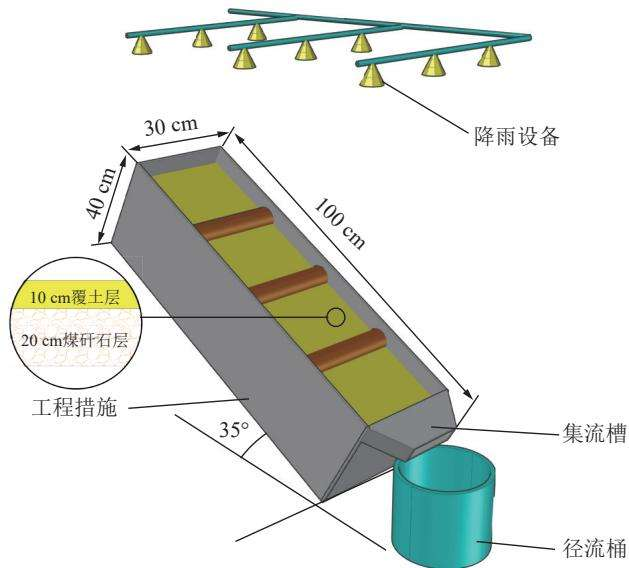  
图1 降雨试验装置示意  
Fig.1 Schematic diagram of rainfall test device

## 2.5 观测指标与计算

当排土场坡面产流后开始计时，每隔3min测定1次径流流速、径流宽和径流深等，同时，利用塑料桶收集坡面径流，用以测定径流泥沙含量。采用染色法测定流速，并将试验所得数据乘以矫正系数0.70,以作为坡面平均流速。试验结束后记录水温，利用量杯读取径流流量，并静置样本，静置1h后去除上清液，并对泥样进行称重、烘干等，计算径流率、产沙量等指标，文中试验不设置重复。水土保持工程措施布设情况如图2所示。

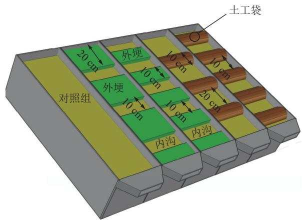  
图2 水土保持工程措施布设情况  
Fig.2 Deployment of engineering measures

径流率 $\mathcal { Q }$ 为地表径流流量，L/min。

$$
Q = \frac { M ^ { \prime } - M } { 6 \times 1 0 ^ { 4 } \rho t }\tag{2}
$$

式中： $M ^ { \prime }$ 为泥水总质量，g;M为泥样干重，g;ρ为水密度， $\mathrm { k g } / \mathrm { m } ^ { 3 } ; t$ 为时间，min。

产沙量 $S _ { \mathrm { { L } } }$ 为单位时间单位面积径流侵蚀泥沙干质量， $\mathrm { g } / ( \mathrm { m } ^ { 2 } \cdot \mathrm { s } )$ C

$$
S _ { \mathrm { { L } } } = { \frac { M _ { \mathrm { { g } } } } { b L t } }\tag{3}
$$

式中： $M _ { \mathrm { g } }$ 为泥沙干质量，g;L为坡长，m; b为径流宽，m; t 为时间， $\mathbf { S } _ { \subset }$

减流效益 $C _ { \mathfrak { q } } ,$ 减沙效益 $C _ { \mathrm { m } }$ 为布设有水土保持工程措施的坡面与对照组的产流量、产沙量的比值。

$$
C _ { \mathrm { q } } = \frac { q _ { 1 } - q _ { 2 } } { q } \times 1 0 0 \%\tag{4}
$$

$$
C _ { \mathrm { m } } = { \frac { m _ { 1 } - m _ { 2 } } { m } } \times 1 0 0 \%\tag{5}
$$

式中： $q _ { 1 }$ 为对照组坡面单位面积产流流量， $\mathrm { L } / \mathrm { m } ^ { 2 } ; q _ { 2 }$ 为水土保持工程措施坡面单位面积产流流量， $\operatorname { L } / \operatorname { m } ^ { 2 } ; m _ { 1 }$ 为对照组坡面单位面积产沙量， $\mathbf { g } / \mathbf { m } ^ { 2 } ; m _ { 2 }$ 为水土保持工程措施坡面单位面积产沙量， $\mathrm { g } / \mathrm { m } ^ { 2 }$ O

径流剪切力为坡面径流沿坡面梯度方向产生的作用力。

$$
\tau = \rho _ { \mathrm { s } } g R _ { \mathrm { s } } J\tag{6}
$$

式中：τ为径流剪切力， $ { \mathrm { N } } /  { \mathrm { m } } ^ { 2 } ;  { \rho _ { \mathrm { s } } }$ 为浑水密度， $\mathbf { k g / m } ^ { 3 } ;$ g为重力加速度， $\mathrm { m } / \mathrm { s } ^ { 2 } ; R _ { \mathrm { s } }$ 为水力半径，m;J为水力坡降。

径流功率表征水体水流功率，反映水流流动时的 挟沙能力。

$$
\omega = \tau V\tag{7}
$$

式中：ω为径流功率， $\mathrm { { N } / ( m } \cdot \mathrm { { s } ) }$ V为径流流速， m/s。

## 2.6 数据分析与处理

用 SPSS26 进行数据处理与分析，并用 origin2022软件进行数据绘图。

## 3 结果与分析

## 3.1 坡面径流率和产沙量

为评估边坡布设不同水土保持工程措施减流减沙的实际效果，分析布设了不同水土保持工程措施组别的径流率和平均产沙量数据，结果详见表2。相同水土保持工程措施在不同雨强条件下对坡面径流率的控制情况呈现出2种不同的趋势，如图3所示，以各组雨强为60mm/h时的平均径流率为基准值，当雨强增大50%、100%时，CG坡面平均径流率分别增加 12.24%、48.80%,WF的平均径流率分别增加了18.56%、53.69%，而其余布设了水土保持工程措施的组别径流率增加量则分别在55%、100%上下波动。与CG相比，水土保持工程措施最多可以使平均产沙量降低92.23%。平均产沙量随雨强变化如图4所示。

由图3和图5可知，在模拟土槽土壤蓄水至一定值后，由于CG、WF对坡面径流的控制效果较弱，其径流率迅速增大，并在降雨结束前总体保持增长的趋

表2 不同水土保持工程措施组别减流减沙效益  
Table 2 Runoff and sediment reduction benefits of different engineering measure groups
<table><tr><td>雨强  $/ ( \mathrm { m m } \cdot \mathrm { h } ^ { - 1 } )$ </td><td>水土保持工程措施</td><td>平均流速  $/ ( \mathbf { m } \cdot \mathbf { s } ^ { - 1 } )$ </td><td>径流率/(L  $\cdot \ \mathrm { m i n } ^ { - 1 } )$ </td><td> $\overrightarrow { \bf \Phi } ^ { * } \overrightarrow { \psi } _ { \bf \Phi } ^ { \mapsto } / ( \bf g _ { \alpha } \cdot \bf m ^ { - 2 } \cdot \bf s ^ { - 1 } )$ </td><td>减流效益/%</td><td>减沙效益/%</td></tr><tr><td rowspan="5">60</td><td>CG</td><td>0.04</td><td>0.72</td><td>12.10</td><td>一</td><td>一</td></tr><tr><td>WF</td><td>0.06</td><td>0.55</td><td>9.70</td><td>23.06</td><td>19.87</td></tr><tr><td>NF</td><td>0.04</td><td>0.28</td><td>2.23</td><td>61.50</td><td>81.59</td></tr><tr><td>LC</td><td>0.03</td><td>0.25</td><td>1.48</td><td>65.18</td><td>87.81</td></tr><tr><td>HC</td><td>0.02</td><td>0.41</td><td>0.94</td><td>43.25</td><td>92.23</td></tr><tr><td rowspan="5">90</td><td>CG</td><td>0.05</td><td>0.80</td><td>14.51</td><td>一</td><td>一</td></tr><tr><td>WF</td><td>0.10</td><td>0.65</td><td>14.86</td><td>18.73</td><td>-2.43</td></tr><tr><td>NF</td><td>0.07</td><td>0.43</td><td>3.55</td><td>46.75</td><td>75.56</td></tr><tr><td>LC</td><td>0.04</td><td>0.38</td><td>2.28</td><td>52.23</td><td>84.25</td></tr><tr><td>HC</td><td>0.03</td><td>0.65</td><td>1.48</td><td>19.45</td><td>89.79</td></tr><tr><td rowspan="5">120</td><td>CG</td><td>0.06</td><td>1.06</td><td>19.83</td><td>一</td><td>一</td></tr><tr><td>WF</td><td>0.16</td><td>0.85</td><td>19.42</td><td>20.53</td><td>2.05</td></tr><tr><td>NF</td><td>0.09</td><td>0.56</td><td>4.64</td><td>47.41</td><td>76.59</td></tr><tr><td>LC</td><td>0.05</td><td>0.51</td><td>3.06</td><td>52.50</td><td>84.59</td></tr><tr><td>HC</td><td>0.05</td><td>0.85</td><td>1.97</td><td>20.26</td><td>90.09</td></tr></table>

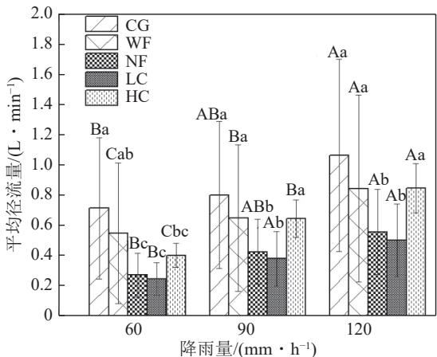  
注：数据差异性采用字母标记法进行标记，若2组数据无相同大写字母，表示相同水土保持工程措施下不同雨强的径流率或产沙量差异显著(P<0.05)，若2组数据无相同小写字母，表示相同雨强不同水土保持工程措施组别条件下径流率或产沙量差异显著(P<0.05)。

图3 不同水土保持工程措施条件下平均径流率随雨强的变化  
Fig.3 Variation of average runoff volume with rainfall intensity in the context of different engineering measures  
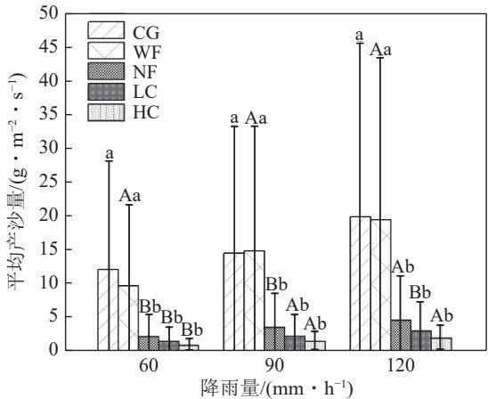  
注：数据差异性采用字母标记法进行标记，若2组数据无相同大写字母，表示相同水土保持工程措施下不同雨强的径流率或产沙量差异显著(P<0.05)，若2组数据无相同小写字母，表示相同雨强不同水土保持工程措施组别条件下径流率或产沙量差异显著(P<0.05)。

图4 不同水土保持工程措施条件下平均产沙量随雨强的变化

Fig.4 Variation of average sediment yield with rainfall intensity under different engineering measures

势，故其平均径流率在雨强为60mm/h条件下已经达到较大值，雨强增大至90、120mm/h时，其平均径流率的增幅较其余组别相对较少；其余可有效控制坡面径流率的水土保持工程措施组，具有一定的蓄水功能，延长土壤的入渗时间，对坡面径流的产生具有一定的延缓效果，故NF、LC、HC组的径流率较稳定，其坡面平均径流率与雨强呈等比例增加趋势。对比不同水土保持工程措施在相同雨强下的减流表现，以CG产流率为基准，LC的坡面径流控制效果最为明显，且在各种不同雨强下减流效果均大于 52%,NF的减流效果均大于 46%,HC在雨强为 60 mm/h时达到最佳减流效果，最佳减流为43.25%，当雨强增大至90mm/h后，HC的减流率便稳定至20%左右，NF、LC、HC均可以有效拦截坡面径流，并且LC由于土工袋覆盖的面积较少，对雨水入渗面积的影响较小，故雨强增大后，其减流的效果也较好，HC组覆盖度较高，压占较多的土壤面积，对雨水入渗有一定影响，故在雨强增大后，其减流效果相对减弱。

相同水土保持工程措施下，所有组别平均产沙量均随雨强的增大而增大，CG平均产沙量并不随着雨强的增加呈线性增加趋势，雨强为90、120mm/h时平均产沙量较雨强为60mm/h条件下增量分别为19.85%、63.82%,这与坡面平均径流率的增加幅度近似，而布设了水土保持工程措施的组别，其平均产沙量随雨强的增大而线性增大，并与雨强及平均径流率的增幅吻合。不同水土保持工程措施之间减沙效益差别较大，其中WF的减沙效果较差，雨强为90mm/h时，由于WF相较CG率先出现局部水土保持工程措施损毁的情况，这可能与布设水平沟时形成了一定的压实区，进而使汇集在沟埂处的降水沿压实区进入边坡内部形成浸润区有关[7],故 WF的平均产沙量大于CG，雨强为120mm/h时，CG同样出现滑坡现象，导致CG平均产沙量再次大于WF，其余组别中，由于LC、HC均有物理压占表面土壤的情况，且土工袋可有效降低了径流流速，故产沙相对NF组较低。

除宽埂水平沟外，其余各种水土保持工程措施在不同雨强条件下的减流效益、减沙效益较好，宽埂水平沟的减流效益及减沙效益最弱，且在雨强为90、120mm/h条件下出现水土保持工程措施损毁情况；高密度土工袋的减沙效益最强，但该措施的减流效益相对较弱，与宽埂水平沟相似；窄埂水平沟与低密度土工袋覆盖的减流效益、减沙效益显著，远大于宽埂水平沟，由此可以得，各类不同水土保持工程措施的组别里，窄埂水平沟和低密度土工袋覆盖可以大幅度减少坡面径流率和产沙量，且减水减沙效果优于其他组别。

径流率及产沙量的动态变化如图5所示。不同水土保持工程措施对径流率的影响差异显著(P<0.05),不同水土保持工程措施条件下坡面径流率随时间波动上升。HC由于土工袋压占土壤较多，影响雨水的入渗效果，故前期径流率增加最快，但迅速趋于稳定；随着降雨历时的增加，土壤的含水率趋近饱和，CG、WF的径流率在降雨25min左右快速增加，并远大于其他组别，LC、NF有较好的积存降水的能力，且土壤入渗面积较大，通过延长降水在坡面的停留时间从而增加了坡面的入渗量，故径流率增加速度较为稳定。在所有模拟的降雨条件下，窄埂水平沟和LC这2种水土保持工程措施在减少坡面径流率方面的效果都明显超过宽埂水平沟和 HC, NF 和 LC 相比于 CG其径流率降低超过40%。降雨强为 60 mm/h时，CG、WF与NF、LC的径流率有显著差异，CG与HC的径流率有显著差异，雨强为90、120mm/h时，NF、LC与其他组的径流率均小于其他组。

结合图5与表2来看，CG、WF的坡面产沙量随时间的变化基本相似，NF、HC、LC的坡面产沙量随时间的变化基本相似。总体来看，坡面产沙量变化大致分为3个阶段：缓慢增长期、迅速增长期、相对稳定期，降雨开始后的0～25min,所有组别的产沙量均维持在较低的程度，仅HC因降雨初期(0～5min)径流率增大迅速出现1个产沙高峰，但此高峰随径流率的稳定而迅速降低，在此阶段，由于坡面土壤含水率处于非饱和状态，土壤结构相对稳定；在降雨开始后的25～35min，随着降雨时间的增加，土体的抗剪强度和承载能力随坡面土壤含水率趋于饱和而降低，从而导致部分土体滑塌，因此CG、WF产沙量迅速增大，随后进入相对稳定期，其产沙量在最大值附近小范围波动，NF、LC、HC的缓慢增长期较其余组别延后了5min,在降雨开始后的30～40min时进入迅速增长期，并在降雨开始后的40min后进入相对稳定期。

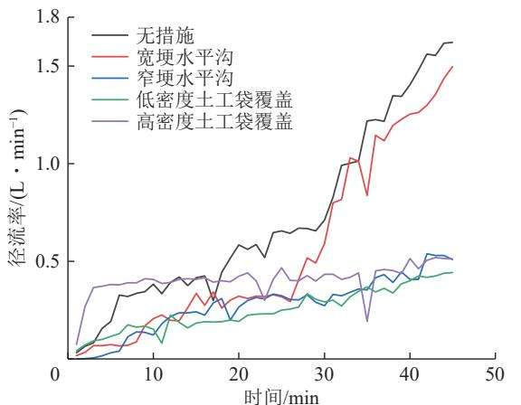  
(a)60mm/h雨强下不同水土保持措施的径流率动态变化对比

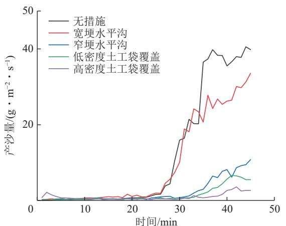  
(d)60mm/h雨强下不同水土保持措施的产沙量动态变化对比

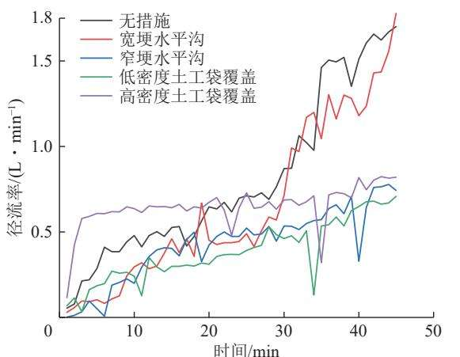  
(b)90mm/h雨强下不同水土保持措施的径流率动态变化对比

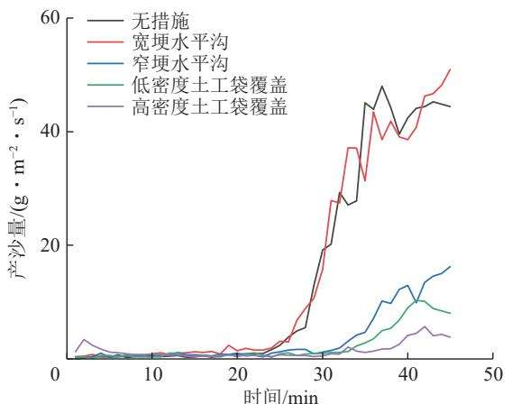  
(e)90mm/h雨强下不同水土保持措施的产沙量动态变化对比

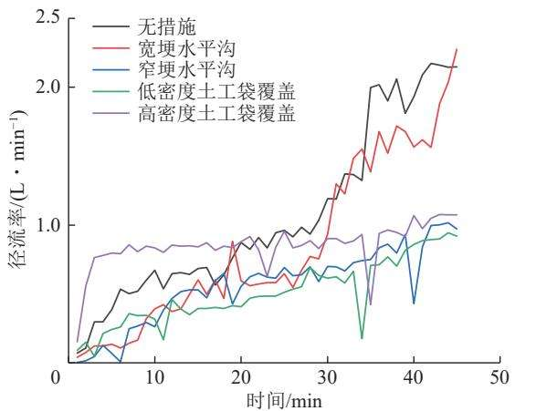  
(c)120mm/h雨强下不同水土保持措施的径流率动态变化对比

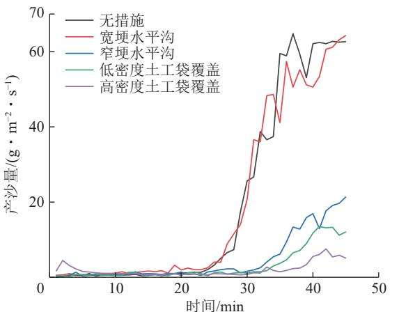  
(f)120mm/h雨强下不同水土保持措施的产沙量动态变化对比  
图5 不同水土保持工程措施下坡面产流率与产沙量  
Fig.5 Runoff rate and sediment yield under different engineering measures

由表2可知：不同雨强条件下各组别的平均流速大小关系表现相似，2个水平沟组的平均流速均大于CG,2个土工袋覆盖组的平均流速均小于CG,这可能是由于试验中水平沟的设置改变了坡面土壤的渗透性能，降雨初期使大量雨水在沟埂处积存蓄满，从而使径流流速加快，其中在雨强为90mm/h条件下，由于水平沟遭受侵蚀和冲刷，导致水平沟的形态改变，水流路径增加，从而使流速增大，并伴随产沙量的增大。

结果如图6所示，径流作为泥沙的输送载体，径流率与产沙量之间的关系反应了不同水土保持工程措施的减沙机制，为探究不同水土保持工程措施对产流和产沙的影响，进行了径流率与产沙量的回归分析。分析结果证实，在不同水土保持工程措施条件下，径流率与产沙量之间存在显著的线性正相关 $( P < 0 . 0 1 )$ 即产沙量随径流率增加而增加，决定系数大小关系为：宽埂水平沟的 $R ^ { 2 } ( 0 . 9 1 )$ >无措施的 $R ^ { 2 } ( 0 . 8 9 ) ^ { } > $ 低密度土工袋覆盖的 $R ^ { 2 } ( 0 . 7 3 ) >$ 窄埂水平沟为 $R ^ { 2 } ( 0 . 6 1 ) >$ 高密度土工袋覆盖为 $R ^ { 2 } ( 0 . 3 7 )$ ，仅WF组与 CG组线性关系相似，其余组别与CG组拟合函数特征均不相同，说明水土保持工程措施可以有效改变并减弱径流率与产沙量之间的线性关系，同一径流率下布设有水土保持工程措施的组别土壤流失量远小于CG。

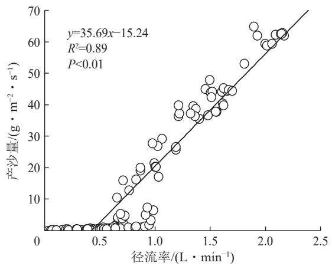  
(a) CG

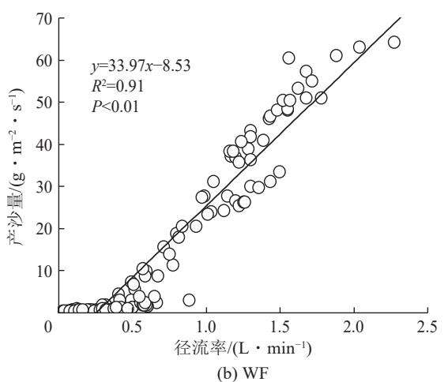

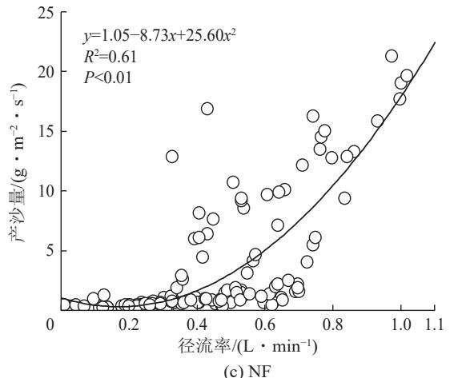

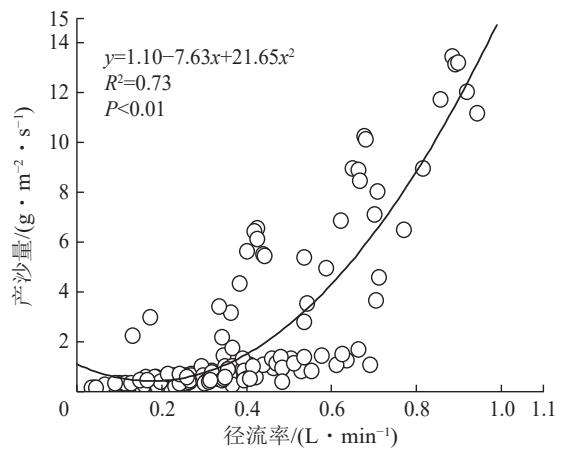  
(d) LC

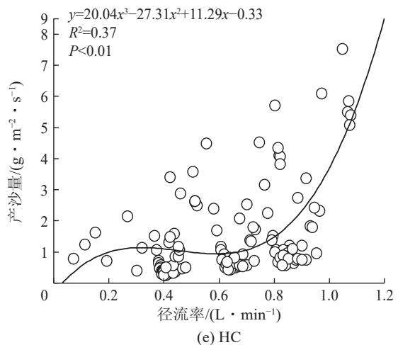  
图6 不同水土保持工程措施下径流率与产沙量的关系  
Fig.6 Relationship between runoff volume and sediment yield in the context of different engineering measures

## 3.2 不同水土保持工程措施组别侵蚀产沙量与径流剪切力、径流功率的关系

回归性分析布设了不同水土保持工程措施组别的产沙量数据分别与径流剪切力、径流功率数据行，选择拟合效果最好的函数建立回归方程如图7和图8

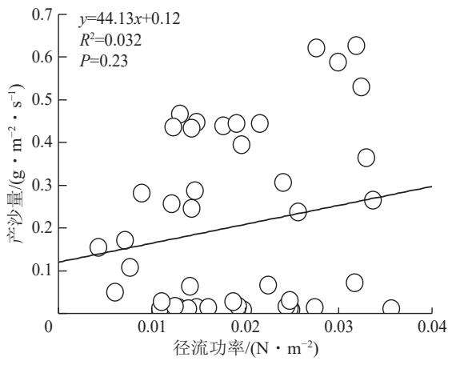

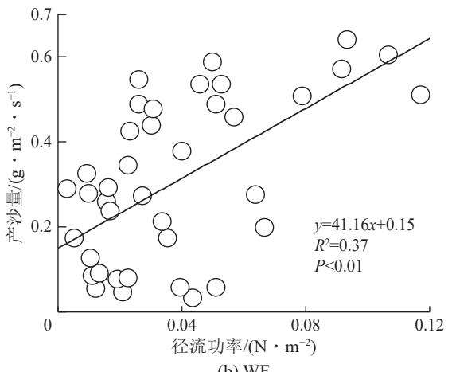  
(a) CG  
(b) WF

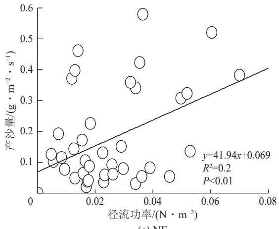

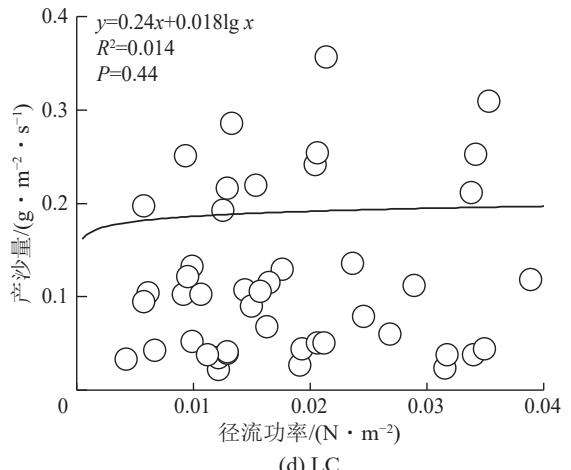  
(d) LC

(c) NF  
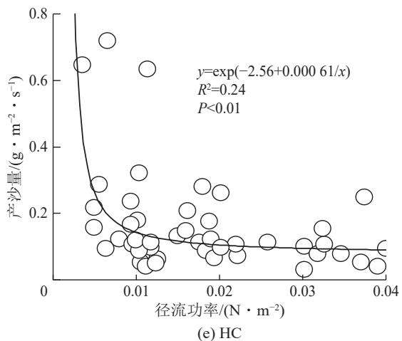  
图7 不同水土保持工程措施下坡面产沙量与径流功率的关系  
Fig.7 Relationship between sediment yield on slopes under different engineering measures and runoff power

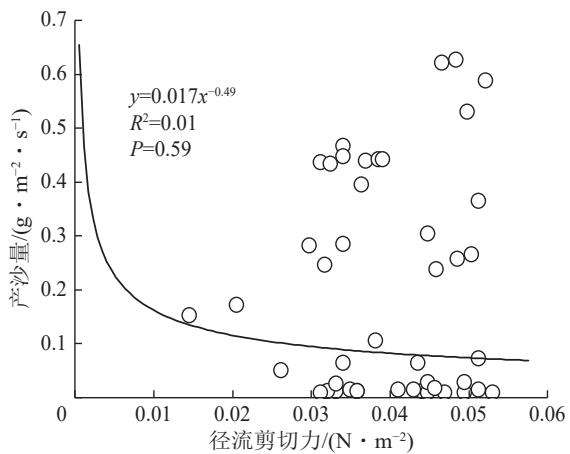  
(a) CG

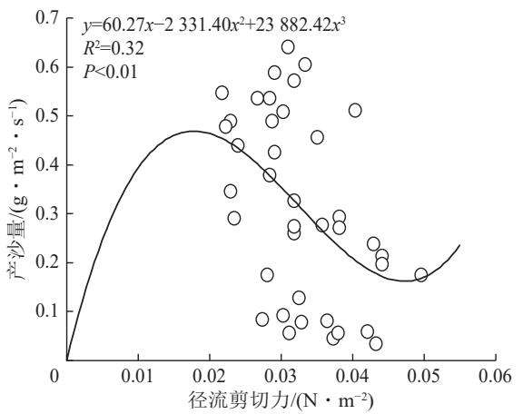  
(b) WF

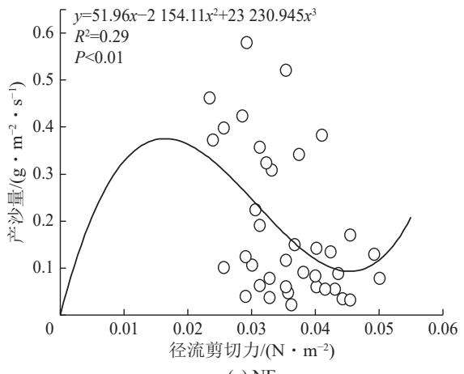  
(c) NF

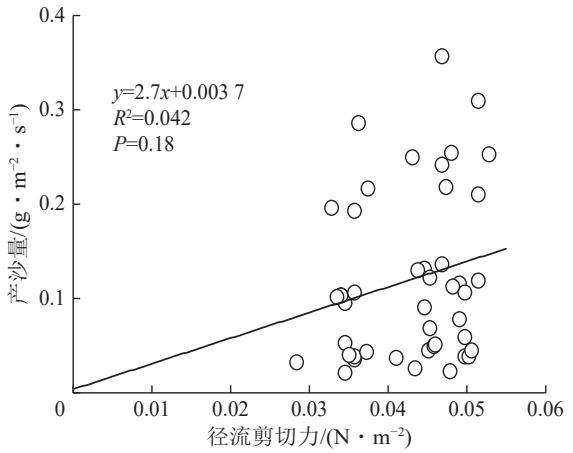  
(d) LC

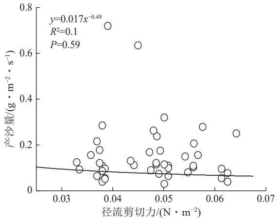  
(e) HC  
图8 不同水土保持工程措施下坡面产沙量与径流剪切力的关系  
Fig.8 Relationship between sediment yield on slopes under different engineering measures and shear stress

所示。由图7和图8可知：WF、NF的产沙量与径流功率、径流剪切力均显著相关 $( P < 0 . 0 1 )$ 且呈正比例关系，表明WF、NF的产沙量随着径流功率的增大而增大，同时当径流剪切力大于 $0 . 0 2 \mathrm { N } / \mathrm { m } ^ { 2 }$ 时，产沙量随径流剪切力的增加而减小，当径流剪切力大于$0 . 0 4 7 \mathrm { N } / \mathrm { m } ^ { 2 }$ 时，产沙量随径流剪切力的增大而增大，HC的产沙量与径流功率存在显著的相关关系 $( P <$ 0.01),该组别平均产沙量随着径流功率的增加而减弱。

通过对比施加水土保持工程措施的坡面与CG的数据可知：水土保持工程措施对坡面产沙量与径流功率及剪切力的关系有一定影响， $\mathrm { C G } \vec { p ^ { z } }$ 沙量与径流功率、径流剪切力的相关性并不显著 $( P { = } 0 . 3 )$ ，但水平沟措施显著提升了产沙量与径流功率、径流剪切力的相关性$( P < 0 . 0 1 )$ ，这是由于水土保持工程措施改变了坡面的纵断面构造及粗糙度，从而改变了坡面径流的水流路径及水力学特征，从而导致产沙量与径流功率及剪切力关系的变化。产沙量与径流功率、径流剪切力均显著相关,这与李鹏等[23]通过室内放水冲刷模拟试验得出的径流剪切力与平均输沙率的关系一致。结合产沙量与径流功率及径流剪切力的决定系数的整体分析可知，通过径流功率预测不同水土保持工程措施下坡面的产沙量更合理，这与NEARING等[24研究土壤分离过程和王瑄等[25]研究土壤剥蚀率得到的结果一致。

## 4 讨 论

## 4.1 不同水土保持工程措施减流减沙作用机制

试验中采用了不同的水土保持工程措施，通过改变坡面的地表情况、水流路径和速度，影响了径流的形成和土壤的侵蚀过程。通过回归分析表明，径流率与产沙量之间存在良好的线性关系，这与丁文斌等26]王瑄等25]的研究结果基本一致。在无措施和宽埂水平沟处理下，径流率与产沙量的线性关系较强 $( R ^ { 2 }$ 分别为0.896和0.911)且成正比关系，这表明在没有水土保持工程措施或措施较弱的情况下，径流率的增加将直接导致产沙量增加。然而，在采取了窄埂水平沟和不同密度土工袋覆盖的措施后，在降雨前中期，由于地表粗糙度相较CG、WF组增大，剥蚀土壤在水土保持工程措施处被拦蓄，故此时产沙量随径流率增大而降低，由于水土保持工程措施上游处蓄满水后与其脚部产生一定水头差，使径流对其下坡脚部产生一定掏蚀，进而对水土保持工程措施产生一定破坏，随着降雨历时的增长，产沙量随径流率的增加重新呈现增加的趋势，这使得径流率与产沙量之间的线性关系显著減弱 $( R ^ { 2 }$ 分别为 0.467、0.623和 0.259),从而说明水土保持工程措施的实施有效地减弱了径流率对产沙量的直接影响。

对比不同水土保持工程措施对坡面径流率和产沙量的影响，CG因坡面降雨直接冲击土壤，导致径流率和产沙量迅速增加。WF、NF在坡面上构建沟埂，通过改变地表微地形、增加表面粗糙度等的方式减少坡面径流27,沟埂可拦蓄部分水流并将水流分散从而减缓径流流速，减少了坡面径流率和产沙量，宽埂水平沟虽然也能分散水流，但因其相较窄埂水平沟一次性容纳的水量更多，致使其在降雨中期会出现局部塌方的情况，从而导致坡面径流率爆发式增大，进而使产沙量增加。土工袋覆盖组则在低密度与高密度组之间表现出不同的趋势，LC径流率在降雨初期增加较快，但随后迅速趋于稳定，其产沙量也表现出类似的趋势，HC的径流率和产沙量在降雨初期增加较快，但随后迅速降低，并在后续的降雨过程中保持较低的水平，此2组坡面径流率和产沙量表现趋势不同，原因是HC覆盖了更多的地表，有效地减少了雨水直接冲击土壤的情况，且土工袋覆盖可以提供物理保护以及结构的稳定性20]，从而降低了产沙量，但由于土工袋由合成材料制成，其表面具有疏水性，故而降雨初期其径流率增加较快。

## 4.2 不同水土保持工程措施水动力学特征与产流产沙的关系

对比不同水土保持工程措施下径流功率与产沙量的关系，可以发现采取水土保持工程措施有效降低了相同径流功率下的产沙量，并改变了径流功率与产沙量之间的关系，这与牛耀彬等28得出的研究结论相同。在CG中，相同径流功率下，产沙量的浮动较大，径流率的增加直接导致了产沙量的增加。采取了水土保持工程措施后，坡面的水流动力学特性发生了显著变化，影响径流剪切力和径流功率，进而影响产沙量，水平沟通过分散水流和减缓流速，降低了径流剪切力和径流功率，从而降低了产沙量，而土工袋覆盖则通过提供稳定的地表覆盖，减少坡面径流与土壤的直接接触，降低了径流的剪切力对土壤的直接作用面积，从而降低了产沙量。在采取水土保持工程措施后，由于坡面微地形变化，出现坡面径流被拦蓄致其流速减缓、局部地区水头差增大、地表覆盖、水土保持工程措施局部损毁等情况，间接影响径流功率与产沙量间的关系。

分析不同种类措施对坡面径流及产沙的控制效果对科学规划及布设水坡面土保持工程措施至关重要。植物措施的优势在于成本相对较低，并且具有一定的生态和景观功能，植物措施可以通过植被的覆盖保护作用、对降雨的再分配作用、对土壤的改良作用以及植物根系对土壤的固结作用防治水土流失，同时具有改善局部地区的微气候、与周边自然景观相协调的功能，但也存在一定的局限性，植物措施受气候和土壤条件限制，并且从布设到发挥效应需要较长的时间，尤其是在布设初期，植被尚未形成有效的根系和覆盖度时，对水土流失的控制能力有限，在后期维护和管理时，需要定期进行灌溉、施肥以及病虫害防治。水土保持工程措施优势在于能够立即提供物理保护，并且稳定性和持久性较好，但是相较于植物措施，水土保持工程措施的成本较高，其主要包含材料费、人工费、机械使用费、其他直接费及间接费，且需要一定的后期维护费用，但文中试验中采用的水平沟及土工袋覆盖属于成本较低的水土保持工程措施，根据《水土保持工程概算定额》(黄河水利出版社)中第03053、08020号定额计算，水平沟与土工袋覆盖的成本相对较低，且NF、LC的减流减沙效益显著，可以大幅度减少坡面径流率和产沙量。

文中试验通过模拟水土保持工程措施的方式进行，研究了不同水土保持工程措施条件下坡面减流减沙效益，并未将水土保持工程措施的控制侵蚀的效果与土壤类型、降雨条件、地形条件等联系起来，因此对实际工程的指导作用有限。在日后的研究工作中，应当考虑布设水土保持工程措施的多样化及模拟精细度，更精准的模拟实际情况下的水土保持工程措施，探讨其对坡面水土流失的影响。

## 5 结 论

1)不同雨强下，水土保持工程措施显著减弱了坡面径流的生成，增强了坡面的抗蚀能力，径流率相较CG最多降低65.18%，产沙量相较CG最多降低92.23%，低密度土工袋覆盖的减流减沙效果均优于其他水土保持工程措施，且避免了大雨强条件下水土保持工程措施的损毁，因此在进行坡面治理时，可优先选择采用低密度土工袋覆盖的方式进行防治以求达到最大效益。

2) 以雨强为 60 mm/h时的 CG产流率、平均产沙量为基准值，NF、LC、HC在雨强增加到90、100 mm/h时，径流率分别增加了55.25%、100.03%、53.98%、100.03%、59.31%、100.09%，其平均产沙量分别增加了59.13%、100.83%、54.79%、100.07%、58.15%、100.09%，WF则径流率则分别增加了18.56%、53.69%，与CG径流率增幅比例相近，其产沙量增幅分别为 53.21%、100.00%,径流率与雨强呈正比例关系，平均产沙量均随雨强增大等比例增大。

3)不同水土保持工程措施产沙量与径流剪切力、径流功率的线性相关性不同。在不同水土保持工程措施下，产沙量与径流功率的关系存在差异，综合产沙量与径流功率及径流剪切力的决定系数分析，通过径流功率预测不同水土保持工程措施下坡面的产沙量更为合理，文中研究结果可为排土场水土保持工程措施的合理布设提供科学依据和理论支撑。

## 参考文献(References):

[1] 胡振琪，位蓓蕾，林衫，等.露天矿上覆岩土层中表土替代材料的筛 选[J].农业工程学报,2013,29(19):209-214. HU Zhenqi, WEI Beilei, LIN Shan, et al. Selection of topsoil alternatives from overburden of surface coal mines[J]. Transactions of the Chinese Society of Agricultural Engineering, 2013, 29(19): 209–214.

[2] 彭苏萍,毕银丽.西部干旱半干旱煤矿区生态环境损伤特征及修复 机制[J].煤炭学报,2024,49(1):57-64. PENG Suping, BI Yinli. Properties of ecological environment dam-

age and their mechanism of restoration in arid and semi-arid coal mining area of western China[J]. Journal of China Coal Society, 2024, 49(1): 57–64.

[3] 毕银丽，柯增鸣，高学江.西部露天排土场有机生物改土对紫穗槐 水分利用效率影响[J].绿色矿山,2023(1):119-127. BI Yinli, KE Zengming, GAO Xuejiang. Effect of organic biological modification on water use efficiency of Amorpha fruticosa in the western open waste dump[J]. Journal of Green Mine, 2023(1): 119-127.

[4] 李军，王慧，张成业，等.基于Landsat遥感影像的平庄西露天矿植 被恢复效果与归因分析[J].绿色矿山,2024(1):31-40. LI Jun, WANG Hui, ZHANG Chengye, et al. Analysis of vegetation restoration effect and attribution of Pingzhuang West Open-Pit Mine based on Landsat remote sensing images[J]. Journal of Green Mine, 2024(1): 31-40.

[5] 郭明明，王文龙，李建明，等.神府矿区弃土弃渣体侵蚀特征及预测 [J]. 土壤学报,2015,52(5):1044-1057. GUO Mingming, WANG Wenlong, LI Jianming, et al. Erosion on dunes of overburden and waste slag in Shenfu coalfield and prediction[J]. Acta Pedologica Sinica, 2015, 52(5): 1044–1057.

[6] RILEY S. Aspects of the differences in the erodibility of the waste rock dump and natural surfaces, Ranger Uranium Mine, Northern Territory, Australia[J]. Applied Geography, 1995, 15(4): 309–323.

[7] 刘福明，才庆祥，周伟，等.露天矿排土场边坡降水入渗规律试验研 究[J].煤炭学报,2015,40(7):1534-1540. LIU Fuming, CAI Qingxiang, ZHOU Wei, et al. Experimental study on the rainfall infiltration rule in the dump slope of surface mines[J]. Journal of China Coal Society, 2015, 40(7): 1534–1540.

[8] 魏忠义，白中科.露天矿大型排土场水蚀控制的径流分散概念及其 分散措施[J].煤炭学报,2003,28(5):486-490. WEI Zhongyi, BAI Zhongke. The concept and measures of runoffdispersing on water erosion control in the large dump of opencast mine[J]. Journal of China Coal Society, 2003, 28(5): 486–490.

[9] 吕刚，李涵哲，董亮，等.暴雨作用下黑岱沟露天煤矿排土场土壤侵 蚀泥沙来源解译[J].煤炭学报,2022,47(S1):225-234. LYU Gang, LI Hanzhe, DONG Liang, et al. Interpretation of soil erosion and sediment source in Heidaigou open-pit coal mine dump under rainstorm[J]. Journal of China Coal Society, 2022, 47(S1): 225-234.

[10] 白中科，王文英，李晋川，等.黄土区大型露天煤矿剧烈扰动土地 生态重建研究[J]. 应用生态学报，1998,9(6):621-626. BAI Zhongke, WANG Wenying, LI Jinchuan, et al. Ecological rehabilitation of drastically disturbed land at large opencut coal mine in loess area[J]. Chinese Journal of Applied Ecology, 1998, 9(6): 621-626.

[11] 肖鹏，吕刚，王洪禄，等.不同植被恢复模式对露天煤矿排土场土 壤抗冲性的影响[J].水土保持研究,2019,26(6):18-24,31. XIAO Peng, LYU Gang, WANG Honglu, et al. Effects of different vegetation restoration models on soil scour resistance in dump of open-pit coal mine[J]. Research of Soil and Water Conservation, 2019, 26(6): 18–24,31.

[12] 梁潇瑜，信忠保，王志杰.北京土石山区坡面土壤水分动态及其对微地形的响应[J].水土保持学报,2022,36(3):94-99.

LIANG Xiaoyu, XIN Zhongbao, WANG Zhijie. Dynamics of soil moisture on slopes in rocky mountain areas of Beijing and its response to microtopography[J]. Journal of Soil and Water Conservation, 2022, 36(3): 94–99.

[13] ELTNER A, MAAS H G, FAUST D. Soil micro-topography change detection at hillslopes in fragile Mediterranean landscapes[J]. Geoderma, 2018,313: 217-232.

[14] 魏忠义，胡振琪，白中科.露天煤矿排土场平台“堆状地面”土壤 重构方法[J].煤炭学报,2001,26(1):18-21. WEI Zhongyi, HU Zhenqi, BAI Zhongke. The loose-heaped-ground method of soil reconstruction on the stackpiles of open-pit coal mine[J]. Journal of China Coal Society, 2001, 26(1): 18-21.

[15] 赵世伟，刘娜娜，苏静，等.黄土高原水土保持措施对侵蚀土壤发 育的效应[J]. 中国水土保持科学,2006,4(6):5-12. ZHAO Shiwei, LIU Nana, SU Jing, et al. Effects of soil and water conservation measures on eroded soil development in the Loess Plateau[J]. Science of Soil and Water Conservation, 2006, 4(6): 5-12.

[16] 王悦，王金满，时文婷，等.降雨强度与微地形塑造对露天煤矿排 土场边坡土壤水分的影响[J].水土保持学报，2022,36(6): 241-249. WANG Yue, WANG Jinman, SHI Wenting, et al. Effects of rainfall intensity and microtopography shaping on soil moisture of slopes in waste rock dumps of open-pit coal mines[J]. Journal of Soil and Water Conservation, 2022, 36(6): 241–249.

[17] 郭建英，何京丽，李锦荣，等.典型草原大型露天煤矿排土场边坡 水蚀控制效果[J].农业工程学报,2015,31(3):296-303. GUO Jianying, HE Jingli, LI Jinrong, et al. Effects of water erosion control on slopes of large waste rock dumps in typical grasslands[J]. Transactions of the Chinese Society of Agricultural Engineering, 2015,31(3): 296-303.

[18] 杜捷，高照良，王凯.布设植物篱条件下工程堆积体坡面产流产沙 过程研究[J].水土保持学报,2016,30(2):102-106. DU Jie, GAO Zhaoliang, WANG Kai. Study on process of runoff and sediment yield on slopes of engineering accumulation with measurement of hedgerows[J]. Journal of Soil and Water Conservation, 2016, 30(2): 102-106.

[19] SOLE A, CALVO A, CERDA A, et al. Influences of micro-relief patterns and plant cover on runoff related processes in badlands from Tabernas (SE Spain)[J]. Catena, 1997, 31(1-2): 23-38.

[20] 张志华，聂文婷，许文盛，等.不同水土保持临时措施下工程堆积 体坡面减流减沙效应[J].农业工程学报,2022,38(1):141-150. ZHANG Zhihua, NIE Wenting, XU Wensheng, et al. The effects of different temporary soil and water conservation measures on runoff and sediment reduction on slopes of engineered fill bodies[J]. Trans-

actions of the Chinese Society of Agricultural Engineering, 2022, 38(1): 141-150.

[21] 陶志刚，李华鑫，曹辉，等.降雨条件下全段高排土场边坡稳定性 实验研究[J].煤炭学报,2020,45(11):3793-3805. TAO Zhigang, LI Huaxin, CAO Hui, et al. Test on the slope stability of full-section high dump under rainfall[J]. Journal of China Coal Society, 2020, 45(11): 3793-3805.

[22] 苏微娜，田一梅，高波，等.人工模拟降雨装置的设计及其参数率 定[J].水土保持通报,2015,35(6):120-123. SU Weina, TIAN Yimei, GAO Bo, et al. Design and calibration of an artificial rainfall simulator[J]. Bulletin of Soil and Water Conservation, 2015, 35(6): 120–123.

[23] 李鹏，李占斌,郑良勇，等.坡面径流侵蚀产沙动力机制比较研究 [J]. 水土保持学报,2005,19(3):66-69. LI Peng, LI Zhanbin, ZHENG Liangyong, et al. Comparisons of dynamic meachanics of soil erosion and sediment yield by runoff on loess slope[J]. Journal of Soil Water Conservation, 2005, 19(3): 66-69.

[24] NEARING M A, SIMANTON J R, NORTON L D, et al. Soil erosion by surface water flow on a stony, semiarid hillslope[J]. Earth Surface Processes and Landforms, 1999, 24(8): 677–686.

[25] 王瑄，李占斌，尚佰晓，等.坡面土壤剥蚀率与水蚀因子关系室内 模拟试验[J].农业工程学报,2008,24(9):22-26. WANG Xuan, LI Zhanbin, SHANG Baixiao, et al. Indoor simulation experiment of the relationship between soil detachment rate and water erosion factor[J]. Transactions of the Chinese Society of Agricultural Engineering, 2008, 24(9): 22–26.

[26] 丁文斌，史东梅，何文健，等.放水冲刷条件下工程堆积体边坡径 流侵蚀水动力学特性[J].农业工程学报,2016,32(18):153-161. DING Wenbin, SHI Dongmei, HE Wenjian, et al. Hydrodynamic characteristics of engineering accumulation erosion under side slope runoff erosion process in field scouring experiment[J]. Transactions of the Chinese Society of Agricultural Engineering, 2016, 32(18): 153-161.

[27] 吕刚，吴祥云.土壤入渗特性影响因素研究综述[J].中国农学通报， 2008, 24(7): 494–499. LYU Gang, WU Xiangyun. Review on influential factors of soil infiltration characteristics[J]. Chinese Agricultural Science Bulletin, 2008, 24(7): 494–499.

[28] 牛耀彬，高照良，刘子壮，等.工程措施条件下堆积体坡面土壤侵 蚀水动力学特性[J]. 中国水土保持科学,2015,13(6):105-111. NIU Yaobin, GAO Zhaoliang, LIU Zizhuang, et al. Hydrodynamic characteristics of soil erosion on deposit slope under engineering measures[J]. Science of Soil and Water Conservation, 2015, 13(6): 105-111.