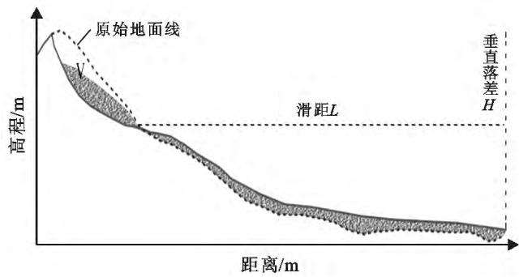
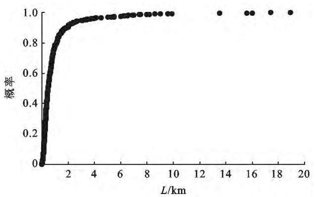
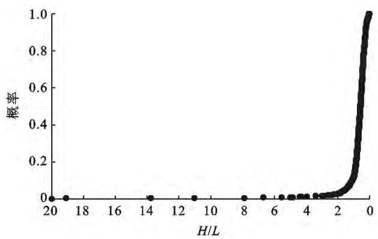
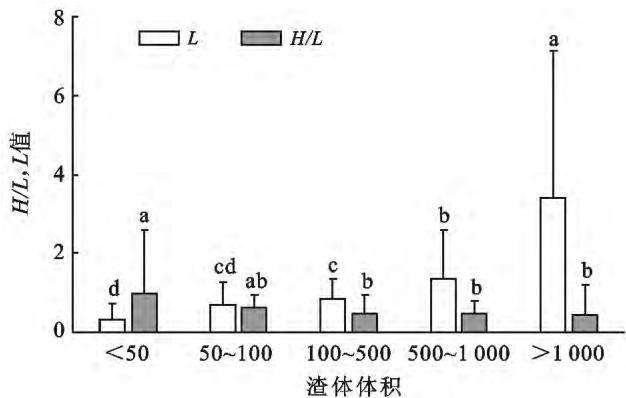

# 生产建设项目弃渣场安全选址方案研究

袁普金1， 姚 赫2， 张 勇2， 高旭彪1

（1．水利部 水土保持监测中心 100055 北京 ； 2．长江水利委员会 长江流域水土保持监测中心站 湖北 武汉430010）

摘 要 ： ［目的］ 研究弃渣失稳后可能产生的滑移距离 ， 为生产建设项目弃渣场安全选址提供参考依据［方法］ 收集了1032组国内外堆积体 滑坡体 火山流体数据 整理出有效数据882组 在此基础上 基于发生类似运动的概率提出了历史发生频率选址法 基于理论修正模型提出了模型预测选址法 ［结果］ 根据历史发生频率法 ，对5，4，1级弃渣场宜分别取2．78，5．88，14．29倍落差的安全距离 ，对2级 3级弃渣场宜取7．14倍的落差的安全距离 利用模型预测法 根据不同的渣场大小等级（AL）和岩质类型（RT） 可准确预测弃渣场选址的安全防护距离 ［结论］ 历史发生频率法操作较简单 容易推广和实施 模型法理论性强 判断较为准确 但需进行试算迭代 使用要求较高

关键词 ： 弃渣场 ； 滑坡 ； 预测模型 ； 水土保持

文献标识码 ： B

文章编号 ： 1000－288X（2018）06－0132－06

中图分类号 ： P642．22

（6） ：132－37．DOI：10．13961／j．cnki．stbctb．2018．06．020．YuanPujin， YaoHe， ZhangYong，etal．Investi－gationofsiteselectionforslagabandonmentyardofproductionandconstructionprojects［J］．BulletinofSoilandWaterConservation， 2018，38（6） ：132－137

# InvestigationofSiteSelectionforSlagAbandonment YardofProductionandConstructionProjects

YUANPujin1， YAOHe2， ZHANGYong2， GAOXubiao1

（1．The Center of Soil and Water Conservation Monitoring ， Ministry of ， 100055， ； 2． and Water Conservation , Changjiang Water Resources Commission , Wuhan , Hubei 430010, China)

Abstract： ［Objective］ Thepossiblemassmovementdistanceresultedfromtheinstabilityoftheabandoned dregsiteswasstudiedforlifeandpropertysecurityandenvironmentalprotection．［Methods］Inaccordance withthesummarizedhistoricaldataabout1032samplesfromsoilaccumulation landslidemassandvolcanic fluids， 882effectivedatawereselectedbystatisticalanalysis， andtwomodelswithregardtositeselection wereproposed．［Results］ Thecorrespondingsafedistanceforwasterockandsoilaccumulationinthedifferent scaleswascalculatedbythehistoricalfrequency．The2．78，5．88and14．29timesofitsdistancecorresponding tothewasterockandsoilaccumulationweresuggestedfor5， 4and1classabandoneddregsites．Andthe 7．14timesofitsdistancecorrespondingtothewasterockandsoilaccumulationwassuggestedfor2and3 classabandoneddregsites．Thenumericalpredictionmethodwithahighlyapplicationforloessaccumulation wasproposedtodeterminethesafedistancebythetheoreticalmodificationandevaluationoftheexisted experiencemodels， consideringthemassscale，landformandrockclassification．［Conclusion］ Thehistorical frequencymethodwithasimpleprocedurecanbewidelyusedandaccepted．Thenumericalpredictionmethod hashigherprecisionwithiterativecomputation

Keywords abandoneddregsites landslide predictionmodel soilandwaterconservation

弃渣场选址是水土保持方案中的重要内容 如果选址不当 可能造成重大的灾害 深圳市光明新区红坳渣土受纳场“12·20”滑坡事故 造成73人死亡 4人下落不明 17人受伤 90家企业生产受影响 直接经济损失为8．81亿元 国外发达经济体常将弃渣场纳入堆积体灾害风险评价中进行管理［1－5］ 因缺乏参照和基础研究 目前国内对弃渣场渣体失稳后运移距离的研究尚不成熟［6］ 有关机构在滑坡碎屑流 泥石流运动规律上作了一些相关的研究 但涉及运移距离方面的研究尚无定论 滑坡规模和影响范围是决定滑坡致灾强度的两个重要方面 ，滑坡滑动速度和滑动距离计算对防灾减灾工作意义重大［7］ 弃渣场作为一种松散堆积体 是一种具有不连续性 非均质性和各向异性等复杂特性的力学介质［8］ 在一定诱发因素下易产生滑坡灾害 ，通常的诱发因素有降雨 地震 人类活动等 表现形式根据滑坡时地形条件和含水量的不同 可分为崩塌 滑坡 滑坡碎屑流 泥石流等 对于弃渣场滑坡来讲 ，其失稳破坏常形式常表现为滑坡和滑坡碎屑流 其滑坡规模一般不会超过堆渣量 因此 弃渣场滑坡运动距离预测是弃渣场选址的核心内容 近几十年来 国内外学者为预测各种类型滑坡的滑距进行了大量研究 ， 建立了一系列经典模型， 如基于多元回归模型建立的黄土滑坡滑距预测模型［9］ 基覆型边坡滑坡模型［10］ 岩质修正地震致滑坡预测模型［11］等， 基于理论修正的经验模型 ， 如Scheidegger预测模型［12］ 黄土地震滑坡预测模型［13］ 地震致无阻碍滑坡预测模型［14］ 松散堆积体滑坡修正模型［6］ 等，由于多元回归模型的数据量受限 ，因此基于理论修正的经验模型具备更好的操作性和推广性 其中基于理论修正的经验模型中最为经典的是Scheidegger在1973年提出的Scheidegger经验模型，其模型理论性好 重复精度高 随后大量学者在此模型上进行修正Corominas［15］ Inokuchi［16］ Kokusho［17－18］ Finlay［19］Budetta［20］ Hunter［21］ Li［22］ Yang［23］ Chen［24］ 等学者分别提出了沟谷类 山坡类 有阻碍 无阻碍等地形修正经验模型 地震致 降雨致等诱发因素修正型 碎屑流 泥石流 火山泥流等发生形态修正模型 基于已有的滑体数据和不同滑体滑距预测模型 研究弃渣场滑坡滑距的分布情况 寻找弃渣场滑坡的运动规律探讨其渣场安全选址的要求 ， 不仅具有较强的可行性 也具有迫切的现实意义 本研究对于弃渣场滑坡规律研究总结和弃渣场选址具有重要的理论价值与指导意义。

## 1 数据与方法

## 1．1 数据采集

为量化评价弃渣场选址的安全范围 并考虑地形因素的影响 引入定量指标是必不可少的 引入滑坡的移动性指标有助于评价弃渣场滑坡的动态特征 滑坡移动性的一个著名指标是垂直落差 H 与水平距 L的比值常被称为等效摩擦系数 （H／L） 这一比例的倒数也可称为流动性指数（L／H 如图1所示）

  
图1 滑坡运动图示

通过统计整理1032组国内外堆积体 滑坡体火山流体数据［6］ 数据来源于期刊论文 书籍文献及国内外滑坡灾害数据库 共得到含有堆积体／滑体体积V 垂直落差 H 滑距 L 的有效数据882组 有效数据中体积V 分布区间 $1 5 0 \mathrm { \ m } ^ { 3 } \sim 2 . 0 0 \times 1 0 ^ { 1 0 } \mathrm { \ m } ^ { 3 }$ ， 垂直落差 H 分布区间0．01～4．4km 滑距 L 分布区间3m～18．9km，等效摩擦系数 H／L 分布区间0．02～20 其中等效摩擦系数 H／L 小于1的共计783组占比 88．76％ H／L 的平均数是 0．75 中位数是0．58 数据分布较为离散

## 1．2 处理模型

本研究模型回归的误差算法使用为 对线性回归模型和一般曲线回归模型使用最小二乘法估计参数对对数线性回归模型使用极大似然估计法估计参数

## 1．3 数据处理

试验数据整理和显著性检验使用SPSS18．0进行分析，模型建立算法控制和拟合使用 Matlab12，数据体采用Origin8．0绘制

## 2 结果与分析

## 2．1 弃渣场失稳滑坡特征值分布

2．1．1 滑距 L 的分布区间分析 统计滑坡滑距 L滑坡落差 H 滑坡体体积V 等特征值观测资料 按照其出现的稀有程度 来衡量它的大小和等级 即该特征值等于或超过某定量的可能出现次数 可折合成其可能出现的概率 ，即为发生频率 统计882组滑坡有效数据 其滑距 L 不超过某已发生值的发生概率分布如图2所示

  
图2 滑距 L发生概率图

其中 滑距 L≤500m的共计465组 概率52．72％滑距 L≤1000m的共计692组 概率78．46％； 滑距 L≤1500m 的共计772组 概率87．53％； 滑距 L≤2000m的共计808组，概率91．61％；滑距 L≤2500m的共计826组 概率93．65％；滑距 L≤3000m的共计836组 概率94．78％； 最大观测距离为 Said－marreh［25］ 的泥石流运动数 据 滑 距 为 18．9km90％概率以下发生的事件已很难发生 ，p＝0．1时，滑距 L 为1．829km，即90％的滑距 L 小于1．829km根据统计结果 95％的滑距 L 小于3．257km 即通常认为不可能发生滑距 L 大于3．257km的滑坡事件进一步的从滑体体积 V 划分滑距区间 可得不同体积的滑距 L 特征值详见表1。

表1 不同体积滑体的滑距 L（km）特征值
<table><tr><td>V/104m³</td><td>平均数AM</td><td>标准差 SD</td><td>变异系数  $C _ { v }$ </td><td>90%概率</td><td>95%概率</td><td>极值</td></tr><tr><td>≤50</td><td>0.35</td><td>0.40</td><td>1.15</td><td>0.612</td><td>0.806</td><td>6.3</td></tr><tr><td>50~100</td><td>0.71</td><td>0.58</td><td>0.82</td><td>1.107</td><td>1.65</td><td>4.5</td></tr><tr><td>100~500</td><td>0.85</td><td>0.50</td><td>0.59</td><td>1.4</td><td>1.72</td><td>3.879</td></tr><tr><td>500~1000</td><td>1.37</td><td>1.24</td><td>0.91</td><td>2.64</td><td>3.33</td><td>8.6</td></tr><tr><td>&gt;1 000</td><td>3.41</td><td>3.72</td><td>1.09</td><td>7.5*</td><td>13.5*</td><td>18.9</td></tr><tr><td>1000~5000</td><td>2.08</td><td>1.78</td><td>0.86</td><td>4.17</td><td>6.2</td><td>9</td></tr></table>

注 ：由于被统计的滑体运动数据V 超过1．00×107 m3 的过于分散 ，而弃渣场绝大多数不可能超过 $5 . 0 0 \times 1 0 ^ { 7 } \ \mathrm { m ^ { 3 } }$ ，故在 $> 1 . \ 0 0 \times 1 0 ^ { 7 } \ \mathrm { m ^ { 3 } }$ 的区间重点统计了 $1 . 0 0 { \sim } 5 . 0 0 { \times } 1 0 ^ { 7 } ~ \mathrm { m ^ { 3 } }$ 的数据。 下同。

2．1．2 等效摩擦系数 H／L 的分布区间分析 仅统计不同体积滑体的滑距 L， 而不考虑其地形影响情况显然是不合适的 统计882组滑坡有效数据 其等效摩擦系数 H／L 超过某已发生值的发生概率分布如图3所示。

  
图3 等效摩擦系数 H／L发生概率图

其中 等效摩擦系数 H／L≥1的共计99组 概率11．33％；等效摩擦系数 H／L≥0．5的共计539组，概率61．11％；等效摩擦系数 $H / L { \geqslant } 0 .$ ．4的共计663组概率75．17％； 等效摩擦系数 $H / L { \geqslant } 0 .$ ．3的共计747组 概率84．69％； 等效摩擦系数 H／L≥0．2的共计

828组 概率93．88％； 等效摩擦系数 H／L≥0．18的共计839组，概率95．12％；最小观测 H／L 为Pande－monium［26］的泥石流运动数据 H／L 为0．023 90％概率以下发生的事件已很难发生 ，p＝0．1时， H／L 为0．25 即90％的滑坡 H／L 大于0．25 根据统计结果，95％的滑坡 H／L 大于0．18，即通常认为不可能发生 H／L 大于0 $1 8 ( L / H { = } 5 . 5 6 )$ 的滑坡事件 等效摩擦系数（H／L）利于解释滑体运动机理 而流动性指数（L／H）则更利于评价选址合理性 不同体积的等效摩擦系数和流动性指数特征值 （表2） 制定不同的／ 参考标准 根据收集数据统计 结果详见表2

通过统计可知 $V { \lesssim } 5 . \ 0 0 \times 1 0 ^ { 5 } \ \mathrm { m } ^ { 3 } , L / H$ 平均值为1．01 变异系数1．6190％概率 L／H 在2．17以下 95％概率 L／H 在2．78以下 极值为16．67 可以认为 $V { \leqslant } 5 . 0 0 \times 1 0 ^ { 5 } \ \mathrm { m ^ { 3 } }$ 的滑体滑距一般不超过2．78；同样的 可以认为 $5 . \ 0 0 \times 1 0 ^ { 5 } < V { \leqslant } 1 . \ 0 0 \times 1 0 ^ { 6 } \ \mathrm { m } ^ { 3 }$ 的滑体滑距一般不超过 $5 . ~ 8 8 ~ H ; 1 . ~ 0 0 \times 1 0 ^ { 6 } < V { \lesssim }$ $5 . 0 0 \times 1 0 ^ { 6 } \ \mathrm { m ^ { 3 } }$ 的滑体滑距一般不超过7．14 H；5．00$\times 1 0 ^ { 6 } { < } V { \leqslant } 1 . \ 0 0 \times 1 0 ^ { 7 } \ \mathrm { m } ^ { 3 }$ 的滑体滑距一般不超过$5 . 8 8 \ H ; V { > } 1 . \ 0 0 \times 1 0 ^ { 7 } \ \mathrm { m } ^ { 3 }$ 的滑体滑距一般不超过14．29H

由于收集的 V 数据过大， 部分体积 V 达到数

$1 . 0 0 \times 1 0 ^ { 9 } ~ \mathrm { m ^ { 3 } }$ 对误差的贡献过大 数据分布离散度大 代表性不强 对弃渣场运动规律的统计典型性不强 建议以1 $\mathrm { . 0 0 } \times 1 0 ^ { 7 } \mathrm { ~ m } ^ { 3 } \sim 5 . 0 0 \times 1 0 ^ { 7 } \mathrm { ~ m } ^ { 3 }$ 之间的运动作为统计区间， 当 $1 . \ 0 0 \times 1 0 ^ { 7 } < V \leqslant 5 . \ 0 0 \times 1 0 ^ { 7 } \ \mathrm { m } ^ { 3 }$ ／ 平均值为2．38， 变异系数1．06，90％概率 ／在5．00以下，95％概率 L／H 在6．25以下 $( L / H >$ 6．25） 极值为33．33 可以认为 $1 . \ 0 0 \times 1 0 ^ { 7 } \ \mathrm { m } ^ { 3 } < V \leqslant$ $5 . 0 0 \times 1 0 ^ { 7 } ~ \mathrm { m ^ { 3 } }$ 的滑体滑距一般 $\left( \phi { = } 0 . 0 5 \right)$ 不超过6．25H

表2 不同体积滑体的等效摩擦系数和流动性指数征值
<table><tr><td rowspan="2"> $V / 1 0 ^ { 4 } \mathrm { ~ m } ^ { 3 }$ </td><td colspan="2">平均数 AM</td><td rowspan="2">标准差</td><td rowspan="2">变异 系数C</td><td colspan="2">90%概率</td><td colspan="2">95%概率</td><td colspan="2">极值</td></tr><tr><td>H/L</td><td>SD</td><td>H/L</td><td>L/H</td><td>H/L</td><td>L/H</td><td>H/L</td><td>L/H</td></tr><tr><td>≤50</td><td>0.99</td><td>1.01</td><td>1.59</td><td>1.61</td><td>0.46</td><td>2.17</td><td>0.36</td><td>2.78</td><td>0.06</td><td>16.67</td></tr><tr><td>50~100</td><td>0.61</td><td>1.64</td><td>0.34</td><td>0.56</td><td>0.33</td><td>3.03</td><td>0.17</td><td>5.88</td><td>0.06</td><td>16.67</td></tr><tr><td>100~500</td><td>0.49</td><td>2.04</td><td>0.44</td><td>0.90</td><td>0.24</td><td>4.17</td><td>0.14</td><td>7.14</td><td>0.03</td><td>33.33</td></tr><tr><td>500~1000</td><td>0.47</td><td>2.13</td><td>0.35</td><td>0.75</td><td>0.22</td><td>4.55</td><td>0.17*</td><td>5.88</td><td>0.02</td><td>50.00</td></tr><tr><td>&gt;1 000</td><td>0.43</td><td>2.33</td><td>0.78</td><td>1.81</td><td>0.11</td><td>9.09</td><td>0.07</td><td>14.29</td><td>0.03</td><td>33.33</td></tr><tr><td>1 000~5 000</td><td>0.42</td><td>2.38</td><td>0.44</td><td>1.06</td><td>0.2</td><td>5.00</td><td>0.16</td><td>6.25</td><td>0.03</td><td>33.33</td></tr></table>

2．1．3 不同滑体体积 V 的滑动特征值的典型性分析 从统计数据的总体分布规律上来看 基本符合滑体体积V 越大 滑距 L 越大 等效摩擦系数 H／L 越小 流动性系数 L／H 越大的规律 但按照不同体积提取特征值的典型性仍需讨论 将不同体积区段的滑体运动特征值进行显著性检验 结果如图4所示由图4可知 根据不同体积 V 进行滑距 L 的划分具有较强的依据 ：除第3组 $1 . \ 0 0 \times 1 0 ^ { 6 } < V { \leqslant } 5 . \ 0 0 \times 1 0 ^ { 6 }$ m3）与相邻2组 $( 5 . ~ 0 0 \times 1 0 ^ { 5 } < V { \leqslant } 1 . ~ 0 0 \times 1 0 ^ { 6 } , 5 . ~ 0 0 \times$ $1 0 ^ { 6 } { < } V { \leqslant } 1 . 0 0 { \times } 1 0 ^ { 7 } \ \mathrm { m } ^ { 3 } \ )$ 的滑距 L 差异不显著外 其余组别滑距 L 差异都达到极显著 $( \mathbf { \nabla } _ { \boldsymbol { p } } = 0 . \mathrm { ~ 0 1 ~ }$ ）水平，这也可以说明采用不同体积V 进行滑距 L 的划分有必要性 根据不同体积V 进行等效摩擦系数 H／L（或流动性指数 $L / H )$ 的划分具有一定的依据 除第一组和第5组差异达到极显著 $( \mathbf { \nabla } _ { \boldsymbol { p } } \mathbf { = } 0 . \mathrm { ~ } 0 1 )$ 水平外 其余组别的 H／L 差异不显著 造成此影响的主要原因可能是几个中间组别的个别点变异过大 即根据体积 V不同采用不同推荐滑距L 值具备更强的统计依据 而根据体积V 不同的推荐等效摩擦系数 H／L（或流动性指数 L／H）的统计学依据并不显著 缺乏基于滑体体积划分的典型性 这一点在进行不同体积滑体的滑距初步估计时需进行重点考虑

## 2．2 弃渣场失稳预测模型

2．2．1 弃渣场的失稳模型提出 本研究曾基于882组统计数据提出了 $L _ { \mathfrak { H } } = { \frac { H } { b V ^ { a } } } + c V \ { \sqrt { H } }$ 的理论修正模型［6］ ，模型考虑了弃渣场滑坡的2个理想阶段， 整体下滑阶段 $L _ { 1 } = \frac { H } { b V ^ { a } }$ ， 这一阶段由于弃渣体松散 ， 下垫面主要为滚动摩擦 ， 且可能产生气垫面 ， 进一步减小了摩擦阻力；第二阶段 $L _ { 2 } = c V \sqrt { H }$ ：渣体分散运动阶段，由于渣体结构性差 ，松散易碎，滑落的冲量造成渣体被分散而增大了影响面积 模型的 a b 为修正常数 而 c 为滑体内聚力 内摩擦角 下垫面摩擦角 含水率等渣体内外部基本性质相关的参数

  
注 ：数据采用DUNCAN检验 标有完全不同小写字母代表差异显著 $( \mathbf { \nabla } _ { \boldsymbol { p } } \mathbf { = } 0 . 0 1 )$ ）  
图4 不同组别 L与 H／L值显著性检验

通过大量不同类型松散堆积体 滑坡体 固液两项流体的数据拟合可知 大量类似运动符合提出的经验公式 即可用 c 值来模拟松散堆积体 滑坡体 固液两项流体等的基本性质 即通过 c 确定 c 值的区间来预测弃渣场失稳发生位移的大小是可行的

为更精确的预测不同类型弃渣场失稳发生位移大小的可行性，可通过更进一步优化 c 值代表区间，引入对滑距有显著影响的岩质［11］ 和水分因素［24］ 使其更适宜于不同弃渣场选址 可将模型中 c 值优化为：

$$
\begin{array} { l } { { \displaystyle L _ { \mathfrak { H } } = \frac { H } { b V ^ { a } } + _ { c _ { 0 } } \cdot \mathrm { R T } \cdot \mathrm { A L } \cdot V \ \sqrt { H } } } \\ { { \displaystyle c = c _ { 0 } \cdot \mathrm { R T } \cdot \mathrm { A L } } } \end{array}
$$

式中 $: L _ { \uparrow \tt G }$ 预测距离 （m） ； H———垂直落差 （m） ，———滑 体 体 积 $( \ 1 0 ^ { 4 } \ \mathrm { ~ m ~ } ^ { 3 } \ )$ ； RT———岩 质 类 型；AL———弃渣场等级； a———体积修正常数； b———落差修正常数； $c _ { 0 } ^ { \phantom { \dagger } }$ ———根据岩质 渣量修正的 c 值 考虑到式中对体积V 已经考虑 故 AL仅作区分 不作计算 根据大量相关研究和行业内区分标准 ，可以区分RT，AL的等级标准详见表3—4

表3 弃渣场岩土划分等级
<table><tr><td rowspan="2">质地</td><td rowspan="2">等级</td><td rowspan="2">取值</td><td colspan="2">风化程度和典型岩类</td><td>单轴抗压 强度/Mpa</td></tr><tr><td></td><td>未风化一微风化岩浆岩、闪长岩、玄武岩、安山岩、片麻岩、石英岩</td><td></td></tr><tr><td rowspan="2">岩质</td><td> $\mathrm { R T _ { 1 } }$   $\mathrm { R T _ { 2 } }$ </td><td>4 3</td><td>未风化一弱风化大理岩、板岩、石灰岩、白云岩、变质石英岩等</td><td></td><td> $\sigma > 6 0$   $3 0 { < } \sigma { \leqslant } 6 0$ </td></tr><tr><td></td><td></td><td>未风化一弱风化凝灰岩、千枚岩、泥灰岩、砂质泥岩等；</td><td></td><td></td></tr><tr><td rowspan="2">土质</td><td> $\mathrm { R T _ { 3 } }$ </td><td>2</td><td>适度强风化硬质岩</td><td></td><td> $1 5 { < } \sigma { \leqslant } 3 0$ </td></tr><tr><td>RT4</td><td>1</td><td>非风化一弱风化页岩、泥岩、泥质砂岩等；强风化硬质岩； 适度一强风化凝灰岩、千枚岩、泥灰岩砂、质泥岩等；土质</td><td></td><td>σ≤15</td></tr></table>

注 ：岩质划分参考自Guo（2014）等的研究［15］

表4 弃渣场等级划分
<table><tr><td>渣场规模</td><td>等级取值</td><td>堆渣量  $/ \mathrm { m } ^ { 3 }$ </td><td>数量</td></tr><tr><td rowspan="2">小型弃渣场</td><td> $\mathrm { { A L } _ { 5 } }$ </td><td>&lt;500000</td><td>小型弃渣场</td></tr><tr><td> $\mathrm { { A L } _ { 4 } }$ </td><td>500 000~1000000</td><td>中型弃渣场</td></tr><tr><td rowspan="3">大型弃渣场</td><td> $\mathrm { { A L } _ { 3 } }$ </td><td>1000000~5000000</td><td>中大型弃渣场</td></tr><tr><td> $\mathrm { { A L } _ { 2 } }$ </td><td>5000000~10 000000</td><td>大型弃渣场</td></tr><tr><td> $\mathrm { { A L } _ { 1 } }$  一</td><td>&gt;10 000 000</td><td>特大型弃渣场</td></tr></table>

注 ：渣场级别区分取自GB51018

2．2．2 弃渣场失稳模型验证 提取的失稳预测模型可由松散堆积体相关数据进行验证 固定常规运动 a值，即 ＝－0．182， ＝1．107［6］ ，基于以上区分标准和收集相关数据， 对修正 c 值的经验模型进行拟合 ，推荐 $c _ { 0 }$ 值取值详见表5 由表5可知，模型适宜于不同岩质和渣量的松散堆积体 拟合优度均表现出适宜性 其中对3级岩质 4级渣场的拟合优度高达0．88

根据不同的渣场大小等级（AL）和岩质类型（RT）查表取 $c _ { 0 }$ 值 可更准确的预测弃渣场选址的安全防护距离 如弃渣场堆渣5 $. 0 0 \times 1 0 ^ { 5 } \ \mathrm { m } ^ { 3 }$ ，即5级渣场；堆渣物主要为未风化—弱风化凝灰岩 千枚岩 泥灰岩 砂质泥岩或适度—强风化硬质岩 即可判断为3级岩质$( \mathrm { R T } { = } 2 )$ ；查表5可得 $c _ { 0 } = 0 . 1 2 1$ ，根据预测模型 $L _ { \{ \pm \} } =$ ${ \frac { H } { b V ^ { a } } } + c _ { 0 } \bullet \operatorname { R T } \bullet \operatorname { A L } \bullet V { \sqrt { H } } = { \frac { H } { 1 . 1 0 7 \times 5 0 ^ { - 0 . 1 8 2 } } } + 0 . 1 2 1$ $\times 2 \times 5 0 \sqrt { H }$ ，假设平坦区域落差为100m， 通过预测模型可得预测安全距离为305．10m。

表5 不同岩质不同等级弃渣场 c0 值取值矩阵
<table><tr><td rowspan="3">渣级</td><td colspan="8">岩质</td></tr><tr><td colspan="2"> $\mathrm { R T } _ { 1 } \left( \mathrm { R T } = 4 \right)$ </td><td colspan="2">RT2(RT=3)</td><td colspan="2"> $\mathrm { R T _ { 3 } } \left( \mathrm { R T } = 2 \right)$ </td><td colspan="2"> $\mathrm { R T _ { 4 } } \mathrm { ( R T = 1 ) }$ </td></tr><tr><td>c。值</td><td>拟合优度r²</td><td> $c _ { 0 }$  值</td><td>拟合优度r2</td><td> $c _ { 0 }$  值</td><td>拟合优度r2</td><td> $c _ { 0 }$  值</td><td>拟合优度  $r ^ { 2 }$ </td></tr><tr><td> ${ \mathrm { A L } } _ { 1 } ( { \mathrm { A L } } { = } 1 )$ </td><td>0.039</td><td>0.81</td><td>0.043</td><td>0.79</td><td>0.053</td><td>0.77</td><td>0.066</td><td>0.78</td></tr><tr><td> ${ \mathrm { A L } } _ { 2 } ( { \mathrm { A L } } { = } 2 )$ </td><td>0.061</td><td>0.75</td><td>0.071</td><td>0.81</td><td>0.088</td><td>0.81</td><td>0.081</td><td>0.58</td></tr><tr><td> ${ \mathrm { A L } } _ { 3 } \left( { \mathrm { A L } } { = } 3 \right)$ </td><td>0.063</td><td>0.73</td><td>0.073</td><td>0.72</td><td>0.092</td><td>0.76</td><td>0.083</td><td>0.83</td></tr><tr><td> ${ \mathrm { A L } } _ { 4 } { \mathrm { ~ } } ( { \mathrm { A L } } { = } 4 )$ </td><td>0.089</td><td>0.83</td><td>0.109</td><td>0.86</td><td>0.112</td><td>0.88</td><td>0.125</td><td>0.61</td></tr><tr><td> ${ \mathrm { A L } } _ { 5 } ( { \mathrm { A L } } { = } 5 )$ </td><td>0.106</td><td>0.58</td><td>0.132</td><td>0.67</td><td>0.121</td><td>0.68</td><td>0.156</td><td>0.57</td></tr></table>

## 3 讨 论

本文提出了两种渣场选址参考方法 第一种是根据散体运动的特征值的分布概率 确定弃渣场安全失稳运动距离的发生可能性 这种方法可被成为历史发生频率选址法 第二种基于理论模型的修正 检验 利用修正模型来预测不同类型不同大小弃渣场滑坡的运动距离 这种方法可被称为模型预测法

弃渣场选址与评价是一个复杂的问题 当前国内外暂无成熟方法参考 本文提出的方法是参考类似滑体运动数据进行统计分析所得 具有重要的参考价值 适宜于各类型的弃渣场 考虑到弃渣场独特的松散结构特征 在选址和评价时 应在预测安全距离上适当进行放大 如放大至1．3倍预测值 以确保一定的安全冗余度 保证弃渣场周边对象的安全

## 4 结 论

## 4．1 历史发生频率选址法

方法操作较简单 考虑了不同渣场的大小和地形条件 容易推广和实施 然而仅根据不同滑体体积进行滑距估计缺乏理论依据 容易造成选址困难或土地资源浪费；而根据不同滑体体积进行等效摩擦系数估计则缺乏体积划分的典型性 需进行综合考量 本文推荐对于 $V { \leqslant } 5 . 0 \times 1 0 ^ { 5 } \ \mathrm { m ^ { 3 } }$ 的弃渣场（5级弃渣场）宜取2．78倍的落差（2．78 H）的安全距离 对于 $5 0 { < } V$ $\leqslant 1 . 0 \times 1 0 ^ { 6 } \ \mathrm { m } ^ { 3 }$ 的弃渣场（4级弃渣场）宜取5．88倍的落差（5．88 H） 的安全距离， 对于 $1 0 0 { < } V { \leqslant } 1 . \ 0 \ X$ $1 0 ^ { 7 } ~ \mathrm { m ^ { 3 } }$ 的弃渣场（2～3级弃渣场）宜取7．14倍的落差（7．14H）的安全距离 对于 $V { > } 1 \ 0 0 0 \ \mathrm { m } ^ { 3 } \ \pmb { \mathcal { F } } \ \mathrm { m } ^ { 3 }$ 的弃渣场（1级弃渣场）宜取14．29倍的落差（14．29H）的安全距离

## 4．2 模型预测选址法

方法理论性强 判断较为准确 在考虑不同渣场大小和地形条件的同时 ， 进一步考虑了渣场的性质 ，适宜于连续陡坡或长沟道等特殊地形 ，具有较好的操作性和延展性 预测模型为 $L _ { \mathfrak { t } } = \frac { H } { b V ^ { a } } + c _ { 0 } \ \bullet \ \mathrm { R T } \ \bullet$ ${ \mathrm { A L } } \cdot V ~ { \sqrt { H } }$ 使用时需进行试算迭代 在推广中 可以转化为推荐选址表以降低使用难度。

## ［ 参 考 文 献 ］

［1］ RobinF， JordiC， ChristopheB， etal．Guidelinesfor landslidesusceptibility， hazardandriskzoningforland useplanning［J］．EngineeringGeology， 2008，102（3／4） ： 85－98

［2］ BobrowskyP HighlandL．TheLandslideHandbook： A Guideto Understanding Landslides A Landmark PublicationforLandslideEducationandPreparedness ［M］∥Landslides： GlobalRiskPreparedness．Springer BerlinHeidelberg 2013

［3］ WiseM MooreGD vanDineDF．Landslideriskcase studiesinforestdevelopmentplanningandoperations ［M］．British Columbia， MinistryofForests， Forest ScienceProgram， 2004

［4］ HarpEL MichaelJA LapradeW T etal．Shallow landslidehazardmapofSeattle， Washington［J］．Engi－ neeringgeologyandlandslidesoftheSeattle， Washing－ ton area： GeologicalSocietyofAmericareviewsinen－ gineeringgeology， 2008， 20： 67－82

［5］ PowellG．Landsliderisk managementconceptsandguidelines［J］．AustralianGeomechanics， 2002，35（1） ：105－110

［6］ 张勇 ，姚赫 ， 江宁 ， 等．基于经验统计的弃渣场失稳致灾距预测模型研究［J］．人民长江 ，2017，48（12） ：65－69

［7］ 陈晓东．单体边坡稳定分析与滑坡灾变强度预测［D］．北京 ：清华大学 2007

［8］ 陈红旗 ，黄润秋 ，林峰．大型堆积体边坡的空间工程效应研究［J］．岩土工程学报 200527（3） 323－328

［9］ 王念秦 张倬元 王家鼎．一种典型黄土滑坡的滑距预测方法［J］．西北大学学报 ： 自然科学版 ， 2003，33（1） ：111－114

［10］ 杨长卫．岩质边坡的地震动特性及基覆型边坡的滑坡成因机理 稳定性判识 危害范围评价体系的研究［D］四川 成都 西南交通大学 2014

［11］ GuoDeping， HamadaM， HeChuan， etal．Anempiri－ calmodelforlandslidetraveldistancepredictionin Wenchuanearthquakearea［J］．Landslides 2014 11 （2） 281－291

［12］ ScheideggerAE．Onthepredictionofthereachandvelocityofcatastrophiclandslides［J］．RockMechanics1973，5（4） ：231－236

［13］ 张振中．黄土地震灾害预测 ［M］．北京 ： 地震出版社 ，1999

［14］ ZhangS， ZhangLM， XiangB， etal．TravelDistances ofEarthquake－inducedLandslides［C］∥Geo－Congress， 2013991－1001

［15］ CorominasJ．Theangleofreachasamobilityindexforsmallandlargelandslides［J］．CanadianGeotechnicalJournal 199633（2） 260－271

［16］ InokuchiT．Propertiesofsector－collapseanddebrisav－alanchesonQuaternaryvolcanoesinJapan［J］．JournaloftheJapanLandslideSociety， 2006，42（5） ：409－420

［17］ KokushoT， IshizawaT．Energyapproachtoearth－ quake－inducedslopefailuresanditsimplications［J］ JournalofGeotechnicaland GeoenvironmentalEngi－ neering 2007133（7） ：828－840

［18］ KokushoT IshizawaT NishidaK．Traveldistanceof failedslopesduring2004Chuetsuearthquakeandits evaluationintermsofenergy［J］．SoilDynamics ＆ EarthquakeEngineering， 2009，29（7） ：1159－1169

［19］ FinlayPJ， MostynGR， FellR．Landslideriskassess－ment： prediction oftravel distance ［J］． CanadianGeotechnicalJournal 199936（3） 556－562

［20］ BudettaP， RisoR D．Themobilityofsomedebris flowsinpyroclasticdepositsofthenorthwesternCam－ panianregion（southernItaly） ［J］．BulletinofEngineer－ ingGeology ＆ theEnvironment， 2004，63（4） ：293－ 302

［21］ HunterG， FellR．Traveldistanceanglefor“rapid” landslidesinconstructedand natura［J］．Canadian GeotechnicalJournal 200340（6） 1123－1141

［22］ LiXiuzhen， KongJiming， LiShengwei．Traveldis－ tancepredictionoflandslidestriggeredbythe M8．0 Wenchuanearthquake［J］．AppliedMechanics＆ Mate－ rials 201171／78：1736－1740

（下转第143页）

［4］ 郭向红 孙西欢 马娟娟 等．不同入渗水头条件下的Green－Ampt模型［J］．农业工程学报 ，2010，26（3） ：64－68

［5］ 马娟娟 ，孙西欢 ， 郭向红．基于 Green－Ampt模型的变水头积水入渗模型建立及其参数求解 ［J］．水利学报 ，2010，41（1） ：61－67

［6］ 李京玲 ， 孙西欢 ， 马娟娟 ， 等．蓄水坑灌单坑土壤水分运动模型的有限体积法求解［J］．农业机械学报 201142（5） 63－67

［7］ 尹燕喆．蓄水多坑肥灌条件下复水对水氮运移规律的影响［D］．山西 太原 ：太原理工大学 ，2013

［8］ 冯晓波．蓄水坑灌条件下不同体系温度对水氮运移的影响［D］．山西 太原 ：太原理工大学 ，2014

［9］ 王军 ，马娟娟 ， 孙西欢 ， 等．蓄水坑灌条件下不同土温对土壤水氮运移规律的影响 ［J］．节水灌溉 2015（8） ：79－83

［10］ ZhaoYunge， MaJuanjuan， SunXihuan， etal．Spatial distributionofsoilmoistureandfinerootsofapple treesunderwaterstoragepitirrigation［J］．Journalof Irrigationand DrainageEngineering 2014 140（1） ： 333－340

［11］ 郑利剑 ，马娟娟 ，郭飞 ，等．蓄水坑灌下矮砧苹果园水分监测点位置研究［J］．农业机械学报 201546（10） ：160－166

［12］ 张学琴 ，马娟娟 ，孙西欢 ，等．不同灌水方法对苹果树果实膨大期根系生长和土壤酶活性的影响研究［J］．节水灌溉 2016（3） 1－5

［13］ 郭飞．蓄水坑灌下苹果树根系吸水深度与水分运移特性研究［D］．山西 太原 ：太原理工大学 ，2016

（上接第137页）

［23］ YangChangwei， ZhangJianjing， ZhangMing．Apre－ dictionmodelforhorizontalrun－outdistanceofland－ slidestriggeredby Wenchuanearthquake［J］．Earth－ quakeEngineering＆ EngineeringVibration， 2013，12 （2） ：201－208

［24］ ChenHongxin， ZhangLimin， GaoLiang， etal．Pres－ entingregionalshallowlandslidemovementonthree－ dimensionaldigitalterrain［J］．EngineeringGeology，

［14］ 桑永青 马娟娟 孙西欢 等．蓄水坑灌下不同灌水对新梢旺长期苹果园SPAC系统水势影响研究［J］．节水灌溉 ，2016（3） ：6－10

［15］ 李波．蓄水坑灌条件下幼龄苹果树的适宜灌水下限研究［D］．山西 太原 ：太原理工大学 ，2016

［16］ 张敏 ，孙西欢 ，郭向红 ，等．蓄水坑灌下苹果树光合日变化与影响因子的分析 ［J］．中国科技论文 ，2015（9） ：1095－1100

［17］ 王月玲 蔡进军 张源润 李生宝 蒋齐．宁南黄土丘陵区新型集流造林工程的规划设计与应用［J］．西北农业学报 200615（4） ：25－30

［18］ 李英武 柳晔 海钦．宁南山区抗旱集流整地及树种配置技术［J］．栽培技术 ，2008（5） ：23－24

［19］ 李子春 ，周长旭 ，张众 ，谢金岭．苹果需水量与灌溉管理［J］．节水灌溉 ，1998（4） ：21－23

［20］ 孙西欢 ，马娟娟 ，周青云 ，等．蓄水坑灌法技术要素初探［J］．沈阳农业大学学报 ，2004，35（5／6） ：405－407

［21］ 马娟娟 ， 孙西欢 ， 李占斌．蓄水坑灌降雨径流的产汇流特性研究［J］．水土保持学报 200519（4） ：57－59

［22］ 王晓红．均质土中蓄水单坑水分运动的数值模拟与试验分析［D］．山西 太原 ：太原理工大学 ，2001

［23］ 郭向红．蓄水坑灌条件下果园SPAC系统水分运移研究［D］．山西 太原 ：太原理工大学 ，2010

［24］ 姚彬．微灌工程技术［M］．河南 郑州 黄河水利出版社2012

［25］ 李龙昌 ，王彦军 ， 李永顺 ， 等．管道输水工程技术［M］北京 ：中国水利水电出版社 ，1998

［26］ 迟道才．节水灌溉理论与技术［M］．北京 ： 中国水利水电出版社 ，2009

2015，195：122－134

［25］ HayashiJN， SelfS．Acomparisonofpyroclasticflowanddebrisavalanchemobility［J］．JournalofGeophysi－calResearchAtmospheres， 1992，97（97） ：9063－9071

［26］ EvansSG ClagueJJ WoodsworthGJ etal．ThePandemoniumcreekrockavalanche BritishColumbia［J］．CanadianGeotechnicalJournal 198926（3） 427－446