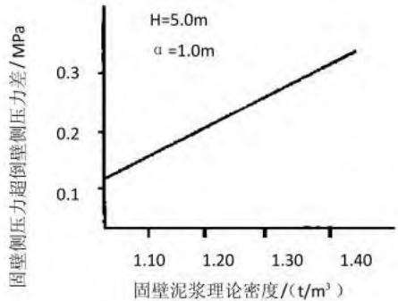
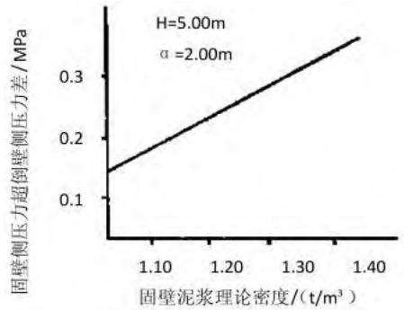
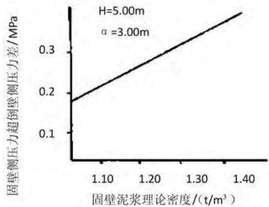

# 高速公路工程取土弃渣场水土保持分析评价

马晓宾，梁星光，黄诗雄（洛阳水利建设投资集团有限公司，河南 洛阳 471000）

摘 要：取土场及弃渣场选址是生产建设项目水土保持规划设计的关键内容。若选址不合理，则弃渣场可能对公共设施、基础设施、工业企业、居民点等产生重大影响，因此如何正确合理地进行弃渣场选址成为一项重要的课题。弃渣场选址及合规性不仅要考虑弃渣场场地条件，还要考虑下游防护对象、限制性条件等因素，文章对弃渣场进行了水土保持分析评价。

关键词：取土场；弃渣场；选址；水土保持；分析评价

中图分类号：U412

文献标识码：A

文章编号：1673-8853（2022）12-0104-02

# Analysis and Evaluation of Soil and Water Conservation in Soil Collection and Slag Dump of Expressway Project

MA Xiaobin, LIANG Xingguang, HUANG Shixiong（Luoyang Water Conservancy Construction Investment Group CO. LTD., Luoyang 471000, China）

Abstract：Site selection of soil collection and slag dump site is the key content of soil and water conservation planning and design of production and construction projects. If the site selection is not reasonable, the slag dump site may have a significant impact on public facilities, infrastructure, industrial enterprises, residential areas, etc. Therefore, how to correctly and reasonably select the site of slag dump site has become an important topic. The site selection and compliance of slag site should not only consider the site conditions, but also consider the downstream protection objects, restrictive conditions and other factors. The soil and water conservation of the slag dump are analyzed and evaluated in this paper.

Key words：soil collection site; slag dump site; site selection; soil and water conservation; analysis and evaluation

## 1 概况

某高速公路工程沿线横跨西淅、淅川两地，气候类型属北亚热带季风型大陆性气候，多年平均气温15.70 ℃，历史极端最高气温42.60 ℃，最低气温-13.20 ℃。全年不小于10 ℃有效积温 ℃，最大冻土深度 ，全年无霜期为 。多年平均降水量为804.30 mm，年平均日照时数2 019 h。多年平均蒸发量为1 508.90 mm，年平均风速2.60 m/s。路线所经区域土壤类型主要为褐土、潮土，植被类型亚热带落叶阔叶林带。工程全线位于丹江口库区及上游国家级水土流失重点预防区范围内。项目区属水力侵蚀类型区，土壤侵蚀类型属西南紫色土区，在河南水土保持规划一级分区中属西南紫色土区，二级分区中属秦巴山山地区，三级分区中属丹江口水库周边山地丘陵水质维护保土区，容许土壤流失量为500 t/（km2·a）。线路涉及土壤侵蚀强度以轻度侵蚀为主，综合确定沿线土壤侵蚀模数为1 000 t/（km·a2 ）。

## 2 取土场水土保持分析评价

根据工程现场实际情况，沿线实际布设 处取土场，取深11～19 m，为岗地取土，占地类型为林地，为批复水保方案设计范围外新增取土场，批复水保方案未布设取土场。取土场选址的水土保持分析评价表见表1。

综上所述，取土场选址除不满足3.2.4第1、3条规定外，实际布设取土场选址未设置在崩塌、滑坡危险区及泥石流易发区内，不涉及河道取土（石、砂）。方案依据水土保持相关规范要求，补充设计取土场，对取土边坡栽植攀缘植物，取土平台进行绿化。取土场选址符合水土保持限制性规定要求。

## 3 弃渣场水土保持分析评价

## 3.1 弃渣场选址分析

在实际施工中受线路变化、征地、渣场优化等因素影响，实际设置25处弃渣场与批复水保方案设计的19处弃渣场相比，弃渣场数量增加 处，全部为批复水保方案设计范围外新增弃渣场，弃渣总量471.71万m3，占地49.64 hm2。

## 3.2 弃渣场稳定性评估结论

根据水利部水土保持司关于印发《水利部水土保持设施验收技术评估工作要点的通知》的相关规定，原则上堆渣量超过 万 3或者最大堆渣高度超过 的弃渣场应开展稳定性评估，编制稳定性评估报告，其他弃渣场应根据弃渣场选址、堆渣量、堆渣高度和渣场周边重要防护设施情况，开展必要的稳定性评估。根据《水利部办公厅关于印发生产建设项目水土保持设施自主验收规程（试行）的通知》的相关要求，重要防护对象（指4级及以上弃渣场等容易发生水土流失危害及隐患的工程部位）需编制稳定性评估报告，明确安全稳定结论且结论为稳定。某高速公路实际布设25处弃渣场，沿线弃渣场等级为4～5级，其中4级弃渣场11处，5级弃渣场14处。

表1 取土场选址的水土保持分析评价表
<table><tr><td colspan="3">一、《中华人民共和国水土保持法》对取土(石、砂)场选址相关限制性规定</td></tr><tr><td>水保法相关规定</td><td>项目情况</td><td>分析意见</td></tr><tr><td>第十七条禁止在崩塌、滑坡危险区和泥石流 易发区从事取土、挖砂、采石等。可能造成水</td><td>实际布设取土场为岗地取土，未布设在崩塌、</td><td>符合要求。</td></tr><tr><td>土流失的活动。</td><td colspan="2">滑坡危险区、泥石流易发区内。</td></tr><tr><td></td><td>二、开发建设项目水土保持技术规范取土(石、砂)场选址相关限制性规定</td><td></td></tr><tr><td>技术规范相关规定</td><td>项目情况</td><td>分析意见</td></tr><tr><td>区内设置取土(石、砂)场。</td><td>3.2.3禁止在崩塌和滑坡危险区、泥石流易发实际布设取土场为岗地取土，未布设在崩塌、 滑坡危险区、泥石流易发区内。</td><td>符合要求。</td></tr><tr><td></td><td>3.2.41、应符合城镇、景区等规划要求，并与取土场选址远离城镇，目前已取土完毕，取土变更报告补充设计取土场取土边坡栽植攀缘植</td><td></td></tr><tr><td>周边景观相互协调。 3.2.42、在河道取土(石、砂)的应符合河道管</td><td>面为裸露面，且场内无排水及其他防护措施。</td><td>物，取土平台进行绿化。</td></tr><tr><td>理的有关规定。</td><td>不涉及。</td><td>1</td></tr><tr><td>3.2.43、应综合考虑取土（石、砂）结束后的土 地利用。</td><td>取土场取土切面为裸露面。</td><td>变更报告补充设计取土边坡坡脚栽植攀缘植物，</td></tr></table>

## 3.2.1 4级（含）以上弃渣场稳定性评估

## 3.2.1.1 稳定性评价方法。

根据弃渣场稳定性评估报告，报告中根据各弃渣场地质情况及《水利水电工程水土保持技术规范》、《滑坡防治设计规范》等相关规范，弃渣场抗滑稳定计算方法采用瑞典圆弧法对标段范围内渣场边坡进行稳定性分析计算。渣场正常工况下抗滑稳定安全系数允许最小值为1.15～1.20，非正常工况下抗滑稳定安全系数允许最小值为1.05。

## 弃渣场稳定性评估报告评估结论

根据弃渣场稳定性评估报告，通过对沿线 处 级弃渣场进行资料收集、地形测绘、地质勘查，根据收集相关数据、调查及勘查数据进行弃渣场稳定性评估分析工作，明确弃渣场稳定性结论，完成了弃渣场稳定性评估工作。评估报告主要结论为沿线11处弃渣场在规范要求的工况下，弃渣场抗滑稳定安全系数满足规范要求，弃渣场稳定。各弃渣场稳定分析评估结论详见表2。

表2 弃渣场稳定分析评估结果汇总表
<table><tr><td rowspan="2">项目</td><td rowspan="2">最大堆高/ m</td><td rowspan="2">弃渣性质</td><td rowspan="2">弃渣场等级</td><td colspan="3">抗滑稳定安全系数(正常工况)</td><td colspan="3">抗滑稳定安全系数(非正常工况)</td></tr><tr><td>计算值</td><td>允许最小值</td><td>判断</td><td>计算值</td><td>允许最小值</td><td>判断</td></tr><tr><td>NO.1</td><td>21.50</td><td>石渣</td><td>4</td><td>1.60</td><td>1.15</td><td>符合</td><td>1.34</td><td>1.05</td><td>符合</td></tr><tr><td>NO.4</td><td>28.50</td><td>石渣</td><td>4</td><td>1.30</td><td>1.20</td><td>符合</td><td>1.10</td><td>1.05</td><td>符合</td></tr><tr><td>NO.5</td><td>21.20</td><td>石渣</td><td>4</td><td>1.29</td><td>1.20</td><td>符合</td><td>1.10</td><td>1.05</td><td>符合</td></tr><tr><td>NO.6</td><td>36.40</td><td>石渣</td><td>4</td><td>1.33</td><td>1.20</td><td>符合</td><td>1.10</td><td>1.05</td><td>符合</td></tr><tr><td>NO.7</td><td>25.30</td><td>石渣</td><td>4</td><td>1.30</td><td>1.20</td><td>符合</td><td>1.09</td><td>1.05</td><td>符合</td></tr><tr><td>NO.9</td><td>21.60</td><td>石渣</td><td>4</td><td>1.80</td><td>1.20</td><td>符合</td><td>1.35</td><td>1.05</td><td>符合</td></tr><tr><td>N0.11</td><td>35.00</td><td>石渣</td><td>4</td><td>1.57</td><td>1.20</td><td>符合</td><td>1.33</td><td>1.05</td><td>符合</td></tr><tr><td>NO.12</td><td>33.70</td><td>石渣</td><td>4</td><td>1.43</td><td>1.20</td><td>符合</td><td>1.22</td><td>1.05</td><td>符合</td></tr><tr><td>N0.13</td><td>27.00</td><td>石渣</td><td>4</td><td>1.41</td><td>1.20</td><td>符合</td><td>1.16</td><td>1.05</td><td>符合</td></tr><tr><td>N0.14</td><td>34.50</td><td>石渣</td><td>4</td><td>2.90</td><td>1.20</td><td>符合</td><td>1.65</td><td>1.05</td><td>符合</td></tr><tr><td>NO.23</td><td>40.50</td><td>石渣</td><td>4</td><td>1.33</td><td>1.20</td><td>符合</td><td>1.34</td><td>1.05</td><td>符合</td></tr></table>

## 3.2.2 5级弃渣场稳定性评估

## 3.2.2.1 弃渣场边坡稳定计算方法

根据《某高速公路施工图》对弃渣场设计边坡进行稳定性分析计算。由于工程沿线弃渣以石渣为主，弃渣场边坡稳定分析按石渣场情况进行。渣场边坡稳定计算按瑞典圆弧滑动法（总应力法），采用理正岩土计算程序进行计算。计算工况考虑正常运用情况及非常运用情况。沿线弃渣场等级为5级，根据《水土保持工程设计规范》；5级弃渣场抗滑稳定安全系数正常运用为，非常运用为 。由于缺少弃渣场相关地质勘测报告，在进行边坡稳定分析时，参数指标采用《某高速公路施工图两阶段施工图设计》工程地质勘察报告中渣场附近相关地勘数据。

## 3.2.2.2 计算结果及分析

根据渣场边坡、开挖、填筑高度和上述边坡稳定计算公式进行边坡稳定分析。计算结果详见表3。

由表3可知，沿线5级弃渣场的边坡正常运用情况下稳定

系数为 ～ 大于 ，符合规范要求值；非常运用情况下稳定系数为1.10～1.52大于1.05，弃渣场抗滑稳定安全系数满足规范要求，弃渣场稳定。

## 3.3 弃渣场选址综合评价

经水土保持分析评价，沿线各弃渣场选址综合评价如下：NO.1、NO.2、NO.4～NO.7、NO.10～NO.19、NO.21～NO.25 号共处弃渣场坡脚下游无公共设施、基础设施、居民点等敏感因素，以上21处弃渣场选址合理，且11处弃渣场稳定性计算结论为稳定。NO.3处弃渣场坡脚下游约120 m处有居民点，根据《水利水、电水土保持工程技术规范》 弃渣场与居住区、城镇、工矿企业的安全防护距离大于等于2 H，经分析，NO.3弃渣场下游居民点均在安全防护距离之外，且该处处弃渣场稳定性计算结论为稳定，选址基本合理。

、 共 处弃渣场坡脚下游约 ～ 处有河道通过，弃渣场选址不在河道管理范围内， （下转第108页）

  
（a）造孔孔口高出地下水位1 m

  
（b）造孔孔口高出地下水位2m

  
（c）造孔孔口高出地下水位3 m  
图1 固壁侧压力超倒壁侧压力差和固壁泥浆密度关系曲线图

出地下水位3 m时［图1（c）］，固壁泥浆密度即使为1 t/m（即使3用清水），固壁侧压力超倒壁侧压力差也能升至0.15 MPa以上。故实际施工过程中，必须将安全点设置在固壁侧压力超倒壁侧压力差 以上，才能避免塌孔，保持孔壁稳定。

根据以上分析，射水造孔施工过程中孔壁稳定受地下水位的影响非常大，规范中有关造孔孔口应比地下水位高出 的规定是可靠的，但是在射水造墙工程实践方面，因设计及施工技术等方面的差异，在造孔孔口比地下水位高1 m、固壁泥浆密度 3以上时造孔施工也能取得孔壁稳定的效果。

## 4 结论

综上所述，射水造墙施工技术之所以工效高、质量事故少，很大原因在于成孔可靠、速度快。通过造孔过程控制、射流口紊流控制、泥浆固壁及地下水位控制等射水造孔护壁措施的实施，为嵩湖堤除险加固工程桩号3+400\~4+490堤段射水造墙施工过程的安全性及施工质量提供了可靠保证。文中的分析也为水利工程防渗墙渗漏加固施工提供了成功经验，射水造墙加固技术在江河堤防防渗、工民建深基坑开挖地下截水墙、围堰及水库除险加固等工程领域具有广阔的应用前景。

## 参考文献：

［1］聂玉锋.水利工程施工中堤坝防渗加固技术探究［J］.陕西水利，2021（9）：201-202.

［2］宁浩.射水法混凝土防渗墙在河道堤防防渗处理工程中的应用［J］.内蒙古水利，2015（5）：43-44.

［3］李超.堤防防渗加固工程中射水法造防渗墙的施工技术［J］.陕西水利，2015（S1）：122-123.

收稿日期：2022-6-8

编辑：刘长垠 侯鹏松

（上接第105页）

表3 弃渣场边坡稳定计算成果表
<table><tr><td rowspan="2">项目</td><td rowspan="2">最大堆高/ m</td><td rowspan="2">弃渣性质</td><td rowspan="2">弃渣场等级</td><td colspan="3">抗滑稳定安全系数(正常工况)</td><td colspan="3">抗滑稳定安全系数(非正常工况)</td></tr><tr><td>计算值</td><td>允许最小值</td><td>判断</td><td>计算值</td><td>允许最小值</td><td>判断</td></tr><tr><td>NO.2</td><td>6.90</td><td>石渣</td><td>5</td><td>1.41</td><td>1.15</td><td>符合</td><td>1.33</td><td>1.05</td><td>符合</td></tr><tr><td>NO.3</td><td>12.30</td><td>石渣</td><td>5</td><td>1.41</td><td>1.15</td><td>符合</td><td>1.34</td><td>1.05</td><td>符合</td></tr><tr><td>NO.8</td><td>10.30</td><td>石渣</td><td>5</td><td>1.42</td><td>1.15</td><td>符合</td><td>1.36</td><td>1.05</td><td>符合</td></tr><tr><td>NO.10</td><td>12.60</td><td>石渣</td><td>5</td><td>1.21</td><td>1.15</td><td>符合</td><td>1.13</td><td>1.05</td><td>符合</td></tr><tr><td>NO.15</td><td>17.30</td><td>石渣</td><td>5</td><td>1.79</td><td>1.15</td><td>符合</td><td>1.58</td><td>1.05</td><td>符合</td></tr><tr><td>NO.16</td><td>19.40</td><td>石渣</td><td>5</td><td>1.40</td><td>1.15</td><td>符合</td><td>1.23</td><td>1.05</td><td>符合</td></tr><tr><td>N0.17</td><td>18.50</td><td>石渣</td><td>5</td><td>1.52</td><td>1.15</td><td>符合</td><td>1.36</td><td>1.05</td><td>符合</td></tr><tr><td>NO.18</td><td>17.90</td><td>石渣</td><td>5</td><td>1.41</td><td>1.15</td><td>符合</td><td>1.25</td><td>1.05</td><td>符合</td></tr><tr><td>NO.19</td><td>19.80</td><td>石渣</td><td>5</td><td>1.33</td><td>1.15</td><td>符合</td><td>1.16</td><td>1.05</td><td>符合</td></tr><tr><td>NO.20</td><td>18.50</td><td>石渣</td><td>5</td><td>1.27</td><td>1.15</td><td>符合</td><td>1.11</td><td>1.05</td><td>符合</td></tr><tr><td>N0.21</td><td>18.10</td><td>石渣</td><td>5</td><td>1.79</td><td>1.15</td><td>符合</td><td>1.52</td><td>1.05</td><td>符合</td></tr><tr><td>NO.22</td><td>8.30</td><td>石渣</td><td>5</td><td>1.45</td><td>1.15</td><td>符合</td><td>1.24</td><td>1.05</td><td>符合</td></tr><tr><td>NO.24</td><td>16.60</td><td>石渣</td><td>5</td><td>1.28</td><td>1.15</td><td>符合</td><td>1.10</td><td>1.05</td><td>符合</td></tr><tr><td>NO.25</td><td>18.20</td><td>石渣</td><td>5</td><td>1.23</td><td>1.15</td><td>符合</td><td>1.12</td><td>1.05</td><td>符合</td></tr></table>

且2处弃渣场稳定性计算结论为稳定，因此NO.8、NO.9选址合理。 弃渣场坡脚下游约 处为 ，弃渣场选址在完全范围内，且该处弃渣场稳定性计算结论为稳定，因此NO.20选址合理。

## 4 结语

综上所述，经水土保持分析，取土场选址符合水土保持限制性规定要求。沿线 处弃渣场中下游有居民点及基础设施的均在安全防护距离之外，加强防护措施后基本不影响下游安全，选址基本合理，方案建议下阶段弃渣场整治施工时应严格按照施工图设计要求落实各项防护措施。

## 参与文献：

［1］张薇，鲍学英.基于改进灰靶的铁路弃渣场生态环境影响等级评价研究［J］.工程管理学报，2020（6）.

［2］陈永，黄英豪.山区铁路弃渣防护技术及资源化利用现状［J］.再生资源与循环经济，2020（12）.

［］郑六益，程云，莫默 高原铁路大型弃渣场工程特征与稳定性研究［J］.路基工程，2021（5）.收稿日期：2022-10-5

编辑：刘长垠