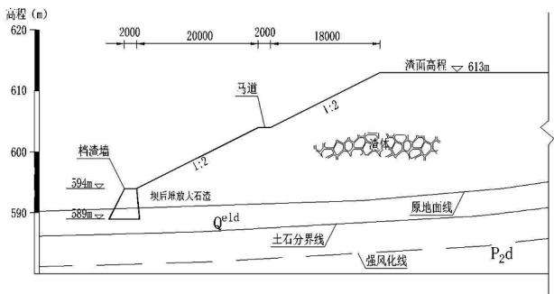
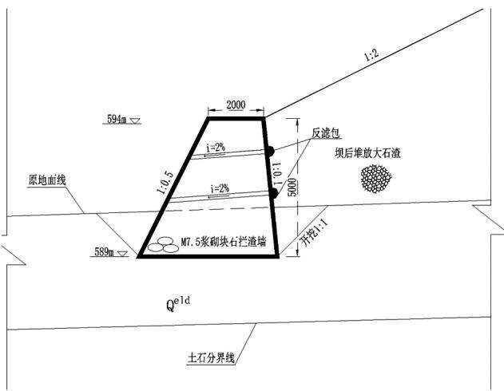

文章编号:1007-7596(2021)04-0129-02

# 某弃渣场挡渣墙及边坡安全稳定计算

董俐

(贵州省水利水电勘测设计研究院有限公司，贵阳550002)

摘要:弃渣场建设中，拦挡措施和渣体整体稳定性尤为重要，既要达到有效拦挡，同时也要做到经济安全。依照相关技术规范及标准的要求，以具体工程为例，对弃渣场在不同工况下的抗滑、抗倾覆及边坡稳定性进行了计算，确保挡渣墙及堆渣体安全稳定，正常发挥水土保持效益，减少水土流失。

关键词:弃渣场;挡渣墙;安全稳定

中图分类号： S157

文献标识码：B

DOI:10.14122/j.cnki.hskj.2021.04.042

## 0前言

弃渣场是项目建设过程中产生水土流失的重要区域，特别是在暴雨等特殊天气条件下，容易产生滑坡、垮塌现象，毁坏下游农田、道路，造成严重不利影响。根据渣体的性质和弃渣场所在位置的地质条件，制定合理的堆渣方案及有效拦挡是保证弃渣场安全稳定的关键，文章依照相关技术规范及标准的要求，对罗甸县某水库枢纽区弃渣场在不同工况下的抗滑、抗倾覆及边坡稳定性进行了计算，确保挡渣墙及堆渣体安全稳定，正常发挥水土保持效益，减少水土流失。

## 1 工程概况

## 1.1 弃渣场基本情况

弃渣场位于宽缓冲沟内，属冲沟型弃渣场，距离水库坝址2km，有通村公路直达，交通便利。工程弃渣量19.60万m³(松方)，设计库容19.76万m³，能够满足工程弃渣堆放要求，渣场下游有通村公路，距离挡渣墙29m，根据《水利水电工程水土保持技术规范》(SL575-2012)，需考虑1.5倍堆渣高度的安全防护距离。渣场堆渣高度19m，安全防护距离为28.5m，满足规范要求，此外，渣场下游无居民点及其他重要基础设施等敏感点。弃渣场级别确定为5级，挡渣墙工程建筑物级别为4级(提级)、截排水工程排水设计标准采用防洪标准取10a一遇设计。

渣场占地面积2.85hm²，集雨面积为0.27km²，在下游垭口采用M7.5 浆砌石重力式挡渣墙进行拦挡，墙顶以上按1:2放坡堆渣，间隔10m设一级2m宽马道，堆渣总高度19m。

## 1.2 地质条件评价

弃渣场所在冲沟近SN向呈“Y”型展布，长约200m，宽50-110m，最大深度20m，底部地形平缓，沟底及岸坡多为第四系残坡积层(Qeld)黏土夹碎石，厚2-7m，下伏基岩为二叠系上统( $\mathrm { P } _ { 2 } \mathrm { w } + \mathrm { c } + \mathrm { d } )$ 灰绿色层状火山碎屑岩、硅质岩、硅质页岩及燧石灰岩，推测强风化层厚5-6m,冲沟两侧边坡地形坡度30°-40°，自然边坡稳定；场地内无活动性断裂通过，也无滑坡、泥石流等不良地质体分布，场址稳定，适宜弃渣堆放。据《中国地震动参数区划图》(GB18306-2015)，该区地震动峰值加速度为0.10g，地震动反应谱特征周期值为0.35s,地震基本烈度为Ⅶ度，须按相关规范进行抗震设防。

## 2 计算过程

## 2.1 计算荷载

根据《水土保持工程设计规范》(GB51018-2014),对挡渣墙及渣场整体稳定计算分为正常工程、非常工况，因渣场所在区域地震基本烈度为Ⅶ

度，故非常工况考虑长期降雨和地震两种情况，具体

  
图1 挡渣墙典型断面图

荷载组合详见表2。

  
图2 弃渣场剖面图

表2 荷载组合表
<table><tr><td rowspan="2">荷载 组合</td><td rowspan="2">主要考 虑情况</td><td colspan="10">荷载类别</td><td rowspan="2">附注</td></tr><tr><td>自重</td><td>附加荷载</td><td>土压力</td><td>水重</td><td>静水压力</td><td>扬压力</td><td>土的冻胀力</td><td>冰压力</td><td>地震荷载</td><td>其他荷载</td></tr><tr><td>基本组合</td><td>正常挡渣情况</td><td>√</td><td>√</td><td>√</td><td>√</td><td>√</td><td>√</td><td></td><td></td><td></td><td></td><td>按正常挡渣 组合计算</td></tr><tr><td></td><td>I</td><td>长期降雨 √</td><td></td><td>V</td><td></td><td>√</td><td>√</td><td></td><td></td><td></td><td></td><td>考虑渣体</td></tr><tr><td>特殊</td><td></td><td></td><td></td><td>V</td><td>V</td><td></td><td></td><td></td><td></td><td></td><td></td><td>饱和含水</td></tr><tr><td>组合</td><td></td><td></td><td></td><td></td><td></td><td></td><td></td><td></td><td></td><td></td><td></td><td>按正常挡渣</td></tr><tr><td></td><td>Ⅱ 地震情况</td><td>√</td><td></td><td>√</td><td>V</td><td>√</td><td>√</td><td></td><td></td><td>√</td><td></td><td></td></tr><tr><td></td><td></td><td></td><td></td><td></td><td></td><td></td><td></td><td></td><td></td><td></td><td></td><td>组合计算</td></tr></table>

## 2.2 计算参数

计算参数主要包括挡渣墙尺寸及渣体物理参数，详见表3。

表3挡渣墙尺寸及物理参数
<table><tr><td colspan="2">挡渣墙断面尺寸</td><td colspan="3">物理参数</td></tr><tr><td>墙身高</td><td>5.0m</td><td>工况</td><td>正常运用工况</td><td>非常运用工况</td></tr><tr><td>顶宽</td><td>2.0m</td><td>渣体综合容重  $I \mathrm { k N } \cdot \mathrm { m }$  -3</td><td>20</td><td>21</td></tr><tr><td>面坡倾斜坡度</td><td>0.5</td><td>渣体湿容重  $/ \mathrm { k N } \cdot \mathrm { m } ^ { - 3 }$ </td><td>1</td><td>20</td></tr><tr><td>背坡倾斜坡度</td><td>0.1</td><td>渣体内摩擦角</td><td>15</td><td>12</td></tr><tr><td>墙底倾斜坡度</td><td>水平</td><td>墙背与墙后填土摩擦角</td><td>10</td><td>8</td></tr><tr><td>墙身截面积</td><td> $1 2 . 5 \mathrm { m } ^ { 2 }$ </td><td>基底摩擦系数f</td><td>0.30</td><td>0.30</td></tr><tr><td>基础挖深</td><td>2.2m</td><td>渣体黏聚力c/kPa</td><td>25</td><td>23</td></tr><tr><td>墙趾高</td><td>0</td><td>地基承载力/kPa</td><td>160</td><td>160</td></tr><tr><td>墙趾宽</td><td>0</td><td>砌体容重  $/ \mathrm { k N } \cdot \mathrm { m } ^ { - 3 }$ </td><td>23</td><td>23</td></tr><tr><td></td><td></td><td>地震烈度</td><td>1</td><td>Ⅶ度</td></tr></table>

## 2.3 计算内容

1)抗滑稳定计算：

$$
K _ { s } \ = \ { \frac { \Sigma F _ { y } \cdot \mu } { \Sigma F _ { x } } }\tag{1}
$$

式中: $\Sigma F _ { x }$ 为墙基底面平行力; $\Sigma F _ { \ast }$ 为墙基底面垂直力; $\mu$ 为基底摩擦系数。

2) 抗倾覆稳定计算：

$$
K t \ = \ { \frac { \Sigma M y } { \Sigma M x } }\tag{2}
$$

式中： $M y$ 为抗倾覆力矩; $M x$ 为倾覆力矩。

## 3)边坡稳定分析：

采用瑞典圆弧法进行分析，计算公式如下：

$$
K = \frac { M _ { R } } { M _ { T } } = \frac { R t g \varphi _ { i = 1 } ^ { n } Q _ { i } \mathrm { c o s } \alpha _ { i } + R c l } { R _ { i = 1 } ^ { n } Q _ { i } \mathrm { s i n } \alpha _ { i } }\tag{3}
$$

式中：K为稳定系数； $M _ { R }$ 为抗滑力矩； $M _ { \scriptscriptstyle T }$ 为滑动力矩；R为滑动圆弧半径； $\varphi$ 为土体内摩擦角；Q为第i条土条的自重； $\alpha _ { i }$ 为第i条土条的滑动角；c为土体黏聚力；l为滑动总弧长。

瑞典圆弧法条分土条的宽度为1m，试算圆心使用的步长为0.5m，试算半径使用的步长为1.0m。计算时分部考虑积水和地震影响，不考虑边坡外侧护坡的有利影响。

## 2.4 计算结果

各工况计算结果如表4,经计算，各工况安全稳定系数均满足标准要求。

(下转第148页)

几项指标值越高对于治理方案的影响度越大，其中生态性能指和环境综合协调的相对隶属度最高。

3）在各指标综合判定系数确定的基础上，对各治理方案的优选度进行综合计算，优选度最高的为最优方案，在具体应用时在分析评估基础上，还应加入专家综合研判的方式确定最优决策方案。

## 参考文献:

1]王红涛，邱宇，张洪波，等．长江下游某集镇黑臭河道综合治理方案研究Ⅱ．江苏建筑，2020(S1)：102-106.

2耿辉．浅析水利工程河道治理存在的问题与对策Ⅱ．清洗世界,2020,35(12):43-44.

B刘慧艳．基于中小河流的综合治理模式探析Ⅱ．黑龙江水利科技,2020,48(12)：80-83.

4刘瑛文．简析黑河市爱辉区阿尔滨河治理工程总体布置方案Ⅱ．水利科技与经济,2020,26(11)：32-35.

B罗军昌．甘德县东柯曲下藏科乡段河道生态治理措施研究0．水利科技与经济，2020,26(11)：36-40.

6赵博毅．河道治理工程环境影响评价及环保措施探讨0．住宅与房地产,2020(33)：57+62.

7杨翠华．河道治理工程中水土保持防治措施探讨Ⅱ．地

下水,2020,42(06):229–230+240.

8赵电雷．晋城市书院河上游河道治理堤防设计方案分析0．水利技术监督,2020(06)：71-74.

0谢玉霞．城市黑臭水体处理技术方案分析Ⅱ．工程建设与设计,2020(21):99-100,117.

[10]黄广玲．生态护坡技术在河道治理中的应用研究Ⅱ.水土保持应用技术,2020(05)：48-50.

[11]毛世伟．黄河老牛湾至龙口段航运建设综合治理方案研究0．中国水运：下半月,2020,20(10)：86-87,95.

[12]刘继芳．新疆车尔臣河防汛河道整治规划探析Ⅱ]．中国防汛抗旱,2020,30(11)：43-45,60.

[3]阳林，姜会浩，周颖颖，等．小流域清淤及淤泥处置技术在城市水环境治理中的应用Ⅱ．施工技术，2020，49(18) :37 –40.

[14] 邱祥书． 城市河道整治围堰施工及方案优选研究Ⅱ.内蒙古水利,2020(09)：25-26.

[15]周金岩．长江中下游河道崩岸治理方案比选与分析0.水利建设与管理,2020,40(09)：5-10.

[16]孙丽娜．祁连山国家公园体制试点项目河道生态治理措施研究Ⅱ.甘肃科技,2020,36(18)：41-44.

(上接第130页)

表4 各工况计算结果
<table><tr><td rowspan="2">工况</td><td colspan="9">参数</td></tr><tr><td></td><td>抗滑系数</td><td></td><td></td><td>抗倾覆系数</td><td></td><td></td><td>边坡稳定系数</td><td></td></tr><tr><td></td><td></td><td>计算结果 标准值</td><td>结论</td><td>计算结果</td><td>标准值</td><td>结论</td><td>计算结果</td><td>标准值</td><td>结论</td></tr><tr><td>正常工况</td><td></td><td>4.006 1.2</td><td>满足</td><td>64.80</td><td>1.4</td><td>满足</td><td>1.776</td><td>1.15</td><td>满足</td></tr><tr><td>非常</td><td>长期降雨</td><td>1.742 1.05</td><td>标准</td><td>4.650</td><td>1.30</td><td>标准</td><td>1.703</td><td>1.05</td><td>标准</td></tr><tr><td>工况</td><td>地震</td><td>12.00 1.05</td><td>要求</td><td>54.86</td><td>1.30</td><td>要求</td><td>1</td><td>1</td><td>要求</td></tr></table>

## 3 结语

弃渣场安全稳定主要考虑两个方面，一是挡渣墙稳定，二是堆渣体边坡的整体稳定性，需计算正常工况和暴雨工况，地震烈度大于等于Ⅶ度时，还需对地震情况下的渣场的安全稳定进行分析，并考虑抗震设计。稳定计算的结果和挡渣墙断面尺寸、堆渣方案及渣体物理参数息息相关，因此，合理选用技术参数和堆渣方案显得尤为重要，要做到有效拦挡，减少或避免水土流失，也要做到经济安全，有利于施工。

## 参考文献:

[1]中华人民共和国住房和城乡建设部，水土保持工程设计

规范：GB51018-2014β],北京：中国计划出版社，2014:20–24,81-89,148–151.

2中华人民共和国住房和城乡建设部，生产建设项目水土保持技术标准： GB 50433-2018§],北京： 中国计划出版社,2018:3-8.

B中华人民共和国水利部，水利水电工程水土保持技术规范：SL575-2012．北京：中国水利水电出版社，2012:5 – 16 ,46 -53 ,106 – 109.

4吴谦，毛雪松，刘龙旗，等．某弃渣场边坡稳定性的可靠度分析]]，桂林理工大学学报,2017,37(03)：475-480.

姜楠．降雨入渗条件下弃渣场稳定计算方法探讨，人民黄河,2020(10):96-99;

6杨家松．水土保持拦渣坝的典型设计及其安全稳定计算，亚热带水土保持,2013(03):51-53.