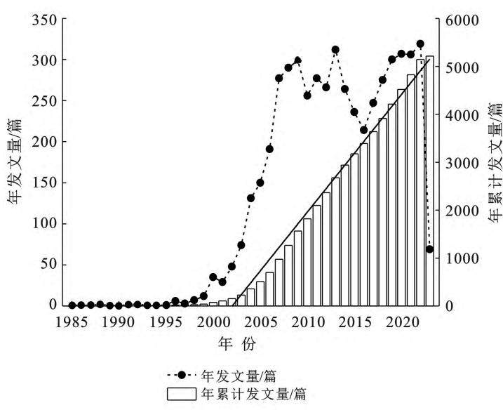
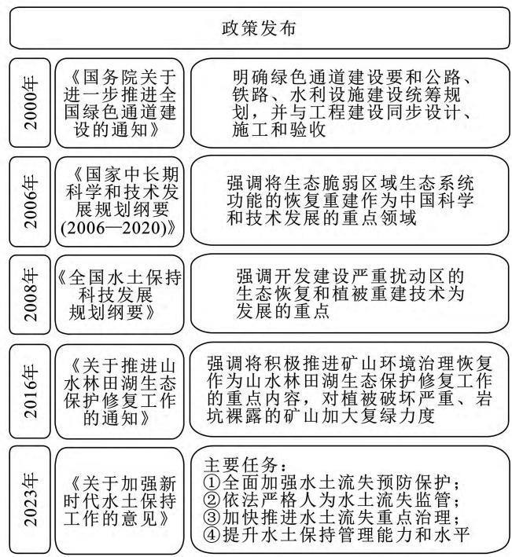
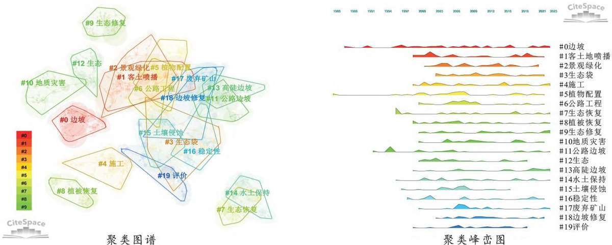
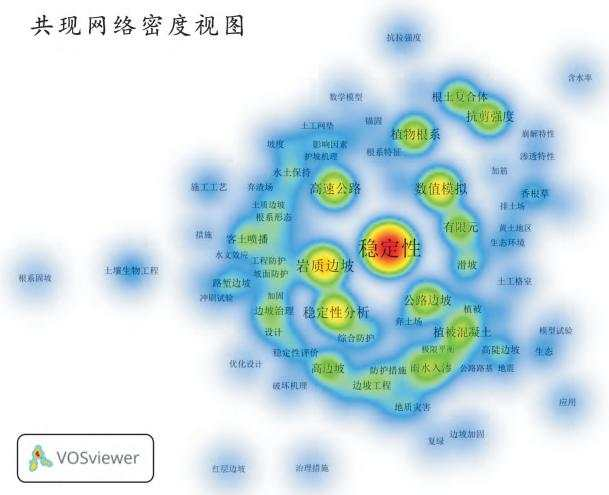
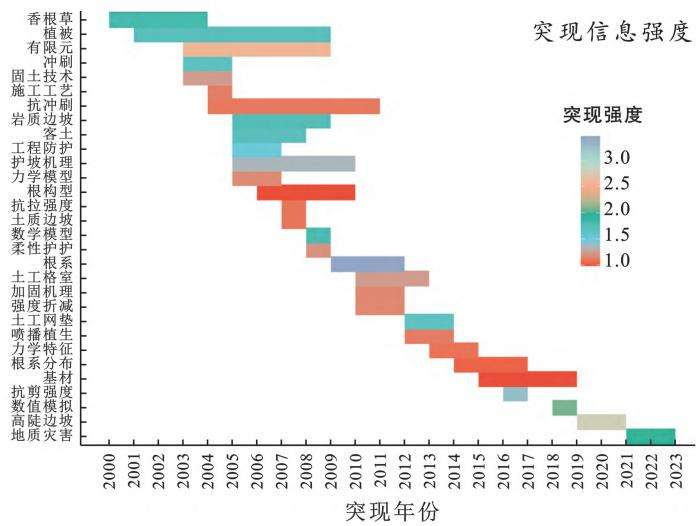
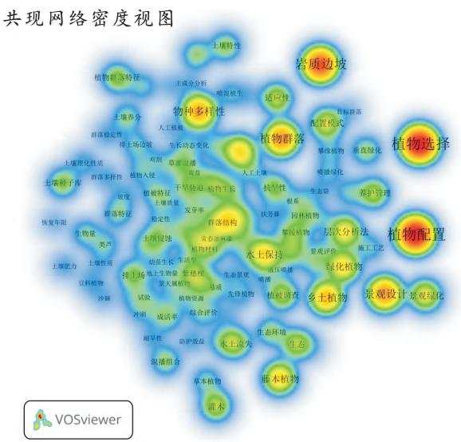
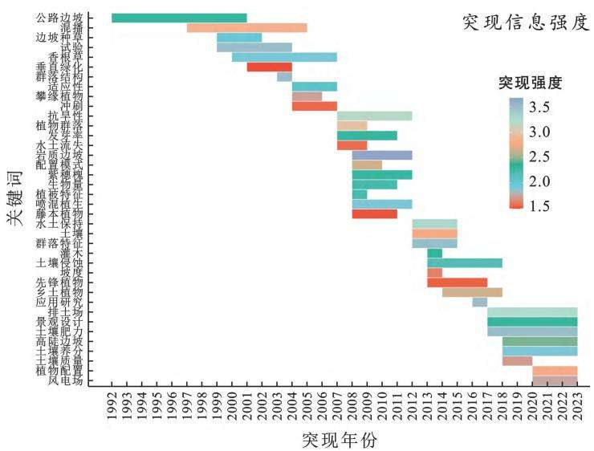
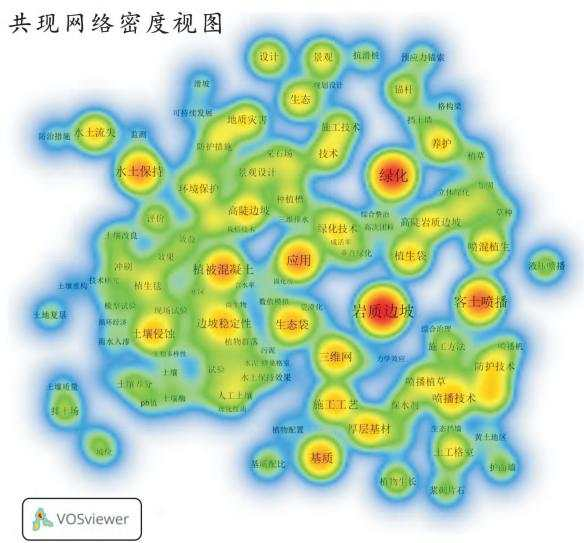
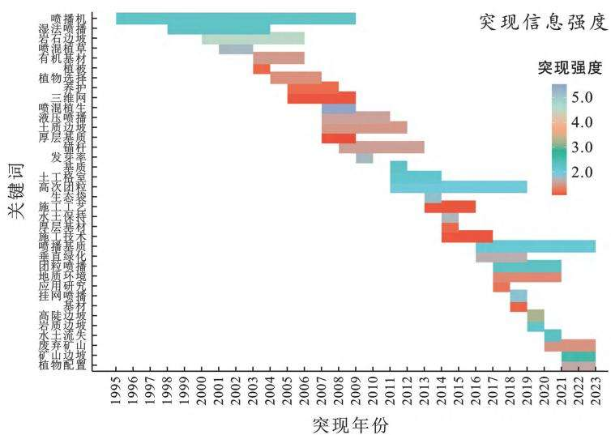

# 中国边坡绿化研究进展与展望基于CiteSpace和 VOSviewer的文献计量分析

张梦岩,郭小平,赵廷宁,冀晓东,魏天兴,史常青(北京林业大学 水土保持学院,北京 )

摘 要:[目的]探讨边坡绿化研究现状与热点趋势,为后续研究提供理论支撑和参考。[方法]运用专业文献计量工具 与 对中国知网收录的边坡绿化研究文献进行可视化分析 以发文量高频关键词、聚类主题和突现词等为主要指标,讨论坡面根系固持土体机理、边坡植物筛选及配置、边坡绿化技术应用的研究热点及趋势变化 结果 中国的边坡绿化领域的研究持续推进 积累了丰富的学术理论成果和实践经验 主要研究机构集中在农林类 理工类和综合类型的高等院校 作为一门多学科交叉的综合应用技术 还需发挥行业学会作用 结论 坡面稳定性的变化规律是重要的研究方向 数值模拟技术在坡面稳定性研究有望发挥更大作用 植物的生态适应性研究是植物筛选的基础工作 可以加强区域性乡土护坡植物的调查和繁育推广,探讨植物多样性变化的影响因素有助于植物配置的可持续性;喷播是最为广泛应用的绿化技术,基质材料的抗侵蚀性和稳定性是研究热点,未来还需从术语、工法、设备、资材的标准化和规范化入手,逐步建立具有中国特色的喷播绿化技术标准体系。

关键词:边坡绿化;文献计量学;CiteSpace;VOSviewer;中国

文献标识码:A

文章编号:1000-288X(2023)06-0248-08

中图分类号:U417.12,G252.7

文献参数:张梦岩,郭小平,赵廷宁,等 中国边坡绿化研究进展与展望[]水土保持通报, , (): 248-255.DOI:10.13961/j.cnki.stbctb.2023.06.030; Zhang Mengyan, Guo Xiaoping, Zhao Tingning, et al. Research progress and prospect in slope greening in China [J]. Bulletin of Soil and Water Conservation, 2023,43(6):248-255.

# ResearchProgressandProspectSlopeGreeninginChina —BibliometricAnalysisBasedonCiteSpaceandVOSviewer

ZhangMengyan,GuoXiaoping,ZhaoTingning,JiXiaodong,WeiTianxing,ShiChangqing (School of Soil and Water Conservation,Beijing Forestry University ,Beijing ,China)

Abstract: [Objective] The current status and hot trends of slope greening research were studied in order to provide theoretical support and references for subsequent research. [Methods  Professional bibliometric tools CiteSaceandVOSviewerwereusedtovisualizeandanalzesloe reenin researchliteratureindexedb the China National Knowledge Infrastructure (CNKI) database. The main indicators included publication volume, high-frequency keywords, keyword co-occurrence clusters, and burst keywords. The research hotsotsandchanesinresearchtrendswerediscussedfromthreeasects:mechanismsofsloerootfixation of soil, selection and configuration of slope plants, and application of engineering greening technology. [Results]Therehasbeena oodtrendof ublishin scientificresearchresultsinthefieldofsloe reenin in China. Research institutions were mostly higher education institutions (colleges and universities) with programsinthefieldsofagriculture,forestry,science,andengineering.Asa multidisciplinaryand comprehensiveapplicationtechnology,slopegreening hasavery necessaryroleto playinindustry associations.[Conclusion]At resent,thevariation atternofsloestabilit isanim ortantresearch direction. Numerical simulation technology is expected to play a greater role in the study of slope stability. Plantscreenin researchhasfocusedontheecoloicaladatabilit of lants,whichcanstrenthenfuture investigations and breeding efforts related to plants adapted to slope protection in the region. Determining the factors influencing plant diversity changes can contribute to the sustainability of plant configuration. Spraying

wasfoundtobethemostwidel used reenin technolo .Thetoicsoferosionresistanceandstabilit of substrate materials wereresearch hotsots.In thefuture,it willbe necessar to start with the standardizationofterminolo ,constructionmethods,euiment,andmaterialssoasto raduall establish a standard system for spraying and greening technology applicable to conditions found in China.

Keywords:slopegreening;bibliometrics;CiteSpace;VOSviewer;China

边坡绿化技术最早起源于日、美、澳、英等发达国家,在日本将其定义为“绿化工学”。 年,生态学者仓田益二郎[1]提出了 绿化工学 将其表述为 用树木和草 在土地的表层进行绿化 以防止土壤被侵蚀,并提高土地生产力的工程方法”。在欧美等国家将其定义为 土壤生物工程 可以用于土壤和水利工程领域,特别是在边坡、河岸的稳定和防治侵蚀中[2],将其定义为“一种将工程实践与综合生态学原理结合起来 以评估 设计 构建和维护活的植被系统 并迅速修复侵蚀和失稳造成的损害的技术或方法”[3-4]。国内常称作边坡生态修复、边坡植被恢复和边坡生态工程等 国内专业化边坡绿化技术研究始于 世纪年代,边坡绿化的概念和内涵在工程实践中不断丰富和明确。边坡绿化学是指开发建设、自然灾害形成的完全依赖自然修复困难的裸露坡面(或工程创面),遵循生态学原则,综合运用岩土力学、土壤学、植物学、水土保持学、景观规划设计原理以及土木工程技术手段,控制侵蚀、保护裸露边坡表层稳定;促进植物种子自然恢复力的发挥,恢复边坡自然生态系统多样性、稳定性的应用技术学科[5-6]。综合考虑边坡绿化技术本身涉及增加工程创面的地表稳定性、重建土壤基础、植被快速恢复重建技术方法等[7-8],笔者认为边坡绿化研究的核心理论与技术包括:边坡分类与微立地类型划分方法 植物根系固持边坡浅层土体机理与方法、适生植物筛选繁育、植被群落结构功能演替、建植养护技术 新型基材支护材料的研发 快速建植设备研发等。相关技术已广泛应用中国公路、铁路、矿山、能源、水电工程等开发建设导致大面积工程创面、裸露边坡的修复治理[9]。本文以 数据库为基础,采用 和 软件,围绕边坡绿化相关研究领域,对国内边坡绿化研究 至 年的 篇文献从文献数量分布、研究热点与关键词突现信息等内容进行计量分析,探讨边坡绿化研究现状与热点趋势,旨在为后续研究提供理论支撑和参考。

## 1 数据与方法

## 1.1 数据来源

本文数据来源于中国期刊 数据库,根据研究目标,在 数据库中分别以主题 (边坡 工程创面) 主题 (绿化 生态修复 植被恢复生态工程 生态防护 复绿 生态重建)构建检索式,进行精确检索,文献类型包括学术论文、学位论文与会议论文,所涉及文献的时间跨度为 —年,经除重和筛选后共获得有效数据 篇文献。

## 1.2 分析方法

本文对检索并下载的数据使用R3，VOSviewer及 RStudio实现文献计量可视化分析,综 合 得 到 边 坡 绿 化 研 究 概 况 与 发 展 趋 势。和 是目前使用较多的引文可视化分析软件,其以更直观的形象化图像将研究领域的热点及演变过程展现在网络图谱上[10-11]。

## 2 文献计量分析

## 2.1 文献产出分析

发文量是最基本的文献量度指标,包括年发文量与累积发文量,对年发文量和累积发文量进行分析,有助于判断该领域所处的研究阶段,进而明确该领域下一步的研究目标[12]。相关研究文献数量随时间整体呈现增加的态势(图 ),根据发表文献的数量变化,大致将该领域研究划分为 个阶段: 在 —年期间,该阶段年累计发文增量低于 篇,初步说明该时期是边坡绿化发展的起步阶段,最初是引入国外有关专家的代表性著作[1],这一阶段的研究重点在于探讨如何将国外理论 技术进一步吸收并转化为实践。 在 — 年期间,年累计发文量的数值变化呈显著的线性关系,R2 ,表明该阶段为研究的中高速发展期,自 年开始文献量缓慢上升, — 年的文献量年增幅最大,在年达到最高值,并且 — 年的发文量都在篇以上。 年《国家中长期科学和技术发展规划纲要》, 年《全国水土保持科技发展规划纲要》和 年《关于推进山水林田湖生态保护修复工作的通知》等政策发布为该领域的发展提供了一定的政策引导。边坡绿化期刊文献主要分布在公路与水路运输、环境科学与资源利用和林业等学科;硕博论文主要分布在道路与铁道工程、城市规划与设计(含风景园林规划与设计)、园林植物与观赏园艺和水土保持与荒漠化防治等学科专业。该领域核心的研究机构有北京林业大学、长安大学、三峡大学和西北农林科技大学等。

  
图1 边坡绿化研究年度及累计发文量  
Fig.1 Annualandcumulativepublicationsofslopegreeningresearch

## 2.2 高频关键词及主题聚类分析

通过 进行研究主题聚类分析和关键词突现分析,主题聚类分析可以反映研究边坡绿化的研究主题,关键词突现强度代表在该时间段内的研究热度,根据突现信息分析不同时间段的研究趋势变化;同时结合 的密度视图功能来判断各类研究主题内容中的研究热点,其中从冷色调(蓝色)过渡到暖色调(红色)代表着热度的从低到高。论文的关键词可以概括研究内容,关键词频次则反映研究热点,中心度是衡量关键词重要性的指标[13]。观察关键词的频次和中心度(表 ),相关研究主要集中在公路边坡和矿山边坡的生态修复,其中“公路边坡”“岩质边坡”“植物配置”和“喷播”等关键词的频次和中心度均 较 高。由 边 坡 绿 化 研 究 主 题 聚 类 图 谱(图 )可知,研究主题形成了植被恢复、客土喷播、植物配置、高陡边坡和稳定性等 个聚类。总体来看,中国边坡绿化研究主题聚类基本形成于 世纪初,客土喷播的应用研究较早出现,并在 — 年期间受到较多关注,随后出现了生态袋的应用研究。边坡适生植物筛选及配置研究主题的时间跨度较长,一直是边坡绿化研究的主要方向。考虑到主题词聚类内容间有一致性,根据关键词和主题聚类内容,再结合以往学者们的研究,本研究将边坡绿化的研究主题总结为坡面根系固持土体机理研究,边坡适生植物筛选及配置研究和边坡绿化技术应用研究 个方面。

表1 高频关键词及高中心度统计  
Table1 Keywordswithhighfrequencyandhighcentrality
<table><tr><td>年份</td><td>关键词</td><td>频次</td><td>中心度</td><td>年份</td><td>关键词</td><td>中心度</td><td>频次</td></tr><tr><td>1997</td><td>高速公路</td><td>704</td><td>0.03</td><td>1992</td><td>公路边坡</td><td>0.25</td><td>200</td></tr><tr><td>2003</td><td>岩质边坡</td><td>318</td><td>0.12</td><td>1995</td><td>喷播绿化</td><td>0.20</td><td>21</td></tr><tr><td>1992</td><td>公路边坡</td><td>200</td><td>0.25</td><td>1991</td><td>护坡</td><td>0.18</td><td>58</td></tr><tr><td>2001</td><td>水土保持</td><td>146</td><td>0.05</td><td>2001</td><td>植物配置</td><td>0.17</td><td>90</td></tr><tr><td>2002</td><td>客土喷播</td><td>139</td><td>0.04</td><td>2000</td><td>景观</td><td>0.15</td><td>52</td></tr><tr><td>2001</td><td>水土流失</td><td>97</td><td>0.05</td><td>1985</td><td>公路绿化</td><td>0.15</td><td>19</td></tr><tr><td>2001</td><td>植物配置</td><td>90</td><td>0.17</td><td>2002</td><td>保水剂</td><td>0.15</td><td>9</td></tr><tr><td>1999</td><td>景观设计</td><td>90</td><td>0.01</td><td>1996</td><td>环境保护</td><td>0.14</td><td>56</td></tr><tr><td>2003</td><td>植物选择</td><td>87</td><td>0.12</td><td>2007</td><td>矿山</td><td>0.14</td><td>38</td></tr><tr><td>2001</td><td>生态环境</td><td>70</td><td>0.08</td><td>2010</td><td>边坡工程</td><td>0.14</td><td>21</td></tr><tr><td>2007</td><td>施工技术</td><td>68</td><td>0.01</td><td>2005</td><td>乡土植物</td><td>0.13</td><td>28</td></tr><tr><td>2002</td><td>稳定性</td><td>66</td><td>0.07</td><td>2006</td><td>路基边坡</td><td>0.13</td><td>27</td></tr><tr><td>2003</td><td>生态</td><td>65</td><td>0.07</td><td>2003</td><td>岩质边坡</td><td>0.12</td><td>318</td></tr></table>

  
图2 研究主题聚类图谱及研究主题聚类峰峦图  
Fig.2 Co-occurrenceclusteranalysisofthekeywordsandlandscape

## 2.3 研究主题内容及趋势分析

坡面根系固持土体机理研究 植物以其力学效应和水文效应发挥着固土护坡的作用,力学效应主要表现在根系的“浅根加筋”和“深根锚固”,对于提高坡面稳定 性具 有非常重要的意义。图 为基于软件对文献的关键词进行共现的网络密度视图。

由图 可以看出,出现频次较高的关键词分别为稳定性、岩质边坡、稳定性分析、数值模拟、高速公路、植物根系和抗剪强度等。图谱基本上呈现以坡面稳定性研究为核心并向外发散的特点,研究者关注根土复合体增强抗剪强度和根系固土护坡的力学效应数值模拟等研究方向[14-16]。其中岩质边坡的植被恢复要先满足植物生长必需的土壤条件,恢复难度更大,因此岩质坡面稳定性的研究也更为重要。抗剪切强度也是坡面稳定性的重要指标,用于度量土壤抵抗剪切形变的能力。在工程实践中用以预测和评价不同技术措施的固土效果。如张晓航等[17]研究结果表明喷播绿化根土复合体的抗剪强度要大于其他施工技术下的根土复合体;刘治兴等[18]研究不同生长期根土复合体的抗剪强度,结果表明纤维毯根土复合体剪切测量指标较优。这些研究通过根土复合体剪切试验、数值模拟分析、根系形态分布和根系抗拉试验,不断推动植物固土护坡的力学机理研究[19]。

  
图3 关键词共现网络密度视图及关键词突现信息  
Fig.3 Keywordsdensityviewofco-occurrenceandinformationofburstkeywords

突现强度较高的关键词有根系、高陡边坡、有限元、数值模拟等,且高陡边坡在 — 年持续突现。在 年之前,香根草、植被和抗冲刷等处于突现期,在 — 年期间,力学模型、护坡机理、抗拉强度和数学模型等出现突现,说明植物根系固土数学模型的相关研究推动了根系固土机理的揭示过程。

近年来出现突现期的关键词有喷播植生、土工网垫、根系分布、基材、抗剪强度和数值模拟等,同时数值模拟的出现频次较高,表明利用数值模拟方法分析根土间相互作用是当下研究的侧重点,根系固土作用的数值模拟分析主要包括水文和力学两个方面,其中力学效应数值模拟的主要内容是根系增强边坡土体抗剪强度和提高坡面稳定性[20]。由关键词共现网络密度视图色调变化可知,坡面稳定性研究是核心热点,在工程应用中对岩质边坡、高陡边坡的坡面稳定性有更高、更严格的要求,之后也应探讨更多关于岩质高陡边坡的坡面稳定性问题,可以发挥数值模拟技术在根系—土壤、坡面—喷播层—根系、坡面—植被毯/垫—根系、坡面—生态袋—根系的整体力学稳定性分析方面的作用[21-22]。

边坡适生植物筛选及配置研究 植物物种的选择和配置是工程创面生态修复能否成功的关键条件,合理的物种选择和组合配置会对退化生态系统的恢复方向和速度产生积极的作用。植物筛选首先要明确土壤、水分、地形和气候等立地条件特征,根据立地条件特点筛选出适生的植物物种,其次基于生态适应性和种间关系理论研究生态型、景观型的植物配置模式[23]。

高频词主要围绕植物配置、植物选择、岩质边坡、植物群落、景观设计、物种多样性和乡土植物等展开(图 )。基于高频关键词分析结果,其中乡土植物的出现频次较高,表明乡土植物的调查与开发是植物筛选的研究热点;植物群落和多样性作为高频关键词出现,突出了以植物多样性为配置原则构建近自然群落的研究特点,物种组成是植物群落的基本特征之一,群落的物种多样性变化可以反映出植被的恢复程度,物种多样性可以反映出植物群落功能的复杂性和稳定性,对生态系统的功能和结构稳定起着至关重要的作用[24-25]。而丰富植物多样性并非盲目地增加物种数,要从更长远的植物群落功能和角度考虑,如优势种生态位和种间关系[26]。乔欧盟等[27]从立地因子的角度探讨植物多样性的变化,认为坡度可以间接影响植物群落分布。张琳等[28]在长时间序列上对矿区排土场植物群落的组成特征及稳定性进行评价,认为排土场边坡物种多样性整体随年限增加呈下降趋势,但多年生植物逐渐在演替过程中占据主导地位,在一定程度上探讨了植物多样性与生态系统稳定性之间的关系。方月等[29]探讨了不同恢复阶段植物多样性的差异变化。潘声旺等[30]研究表明恢复初期草本型植物的多样性指数要高于乔灌型配置。

  
图4 关键词共现网络密度视图及关键词突现信息  
Fig.4 Keywordsdensityviewofco-occurrenceandinformationofburstkeywords

观察关键词突现信息,突现强度较大的有岩质边坡、水土保持、排土场、抗旱性、植物群落、混播、植物配置和土壤,突现强度分别是 , , , ,, , , 。混 播 的 突 现 期 在 —年,在此期间更关注乔、灌、草和藤本植物等多物种的综合使用,为优化混播组合和混播配比等提供了一定的理论基础。适应性研究是指植物与环境的相互作用,通过抗逆性、抗旱性、抗贫瘠性和抗病虫害等指标判断植物是否适宜生存,适应性研究的突现期在 — 年,抗旱性研究的突现期在 —年,可以观察到中国在较长的时间内都侧重于植物适应性研究,目前有关研究通过盆栽控制试验模拟废弃地的环境条件来筛选适宜的植物种[31]。水土保持在 年开始突现,土壤侵蚀在 — 年出现突现,突现期持续了 ,该阶段主要围绕植物种类及配置与水土保持功能性能之间的关系。如杨汉宏等[32]通过坡面径流小区试验探究不同生长型植物配置对边坡土壤侵蚀的影响机制,得出结论乔灌草和灌草配置在控制坡面径流和坡面侵蚀量方面都有较好的效果。在 — 年期间出现突现的关键词分别有景观设计、土壤肥力、土壤养分和土壤质量等,该阶段更多关注植物生长、植物物种组成和结构等与土壤理化性质变化的耦合关系[33-35]。

分析高频热点和突现词信息,生态适应性研究是植物筛选的基础工作,而本土化树种引种、开发利用的工作较为滞后,限制了植物配置组合、组合配比的发展,不利于植物群落的发育,影响了生态效应的发挥。植物多样性变化影响因素的研究评估是热点,从植物多样性变化影响因素探讨 制定可持续的植物配置策略,有助于进一步探讨群落的演替过程及规律,今后还应继续探讨立地因子与植物多样性的相互关系,植物多样性的季节性变化,不同配置密度及不同恢复阶段中物种组成变化是否会对植物多样性造成影响等。

边坡绿化技术应用研究 早期中国在公路和水利工程的护坡中,常用的方法包括撒草种、穴播、铺草皮、片石骨架植草和栽植树木等[6]。自 世纪年代开始,通过借鉴国外先进技术和成功经验,中国在边坡绿化技术研究方面取得进一步发展,逐渐转向更加绿色的现代化技术 经过多年的工程实践和理论发展,中国的边坡绿化技术更加多样、边坡绿化技术体系更加完善[36]。

高频关键词主要围绕岩质边坡、绿化、客土喷播、水土保持、水土流失、植被混凝土、施工技术等展开(图 )。关键词共现密度视图整体呈现以“岩质边坡”的修复治理工作为重难点,“客土喷播”等喷播类技术,“生态袋”等枕袋技术,“三维网”“土工格室”等固土类技术的应用为基础的特点。喷播基质是保证喷播效果的关键因素,这与密度视图中热度较高的“基质”和“基质配比”相照应,基质是为满足植物生长,选用土、土砂、轻质颗粒物、有机物、肥料等配制而成的混合物[37]。中国在基质配制研究方面已经取得了很多成果,为工程渣土、绿化废弃物、污泥等资源化利用提供了科学依据[38-41]。密度视图中呈现暖色调的“土壤侵蚀”针对性地反映出边坡绿化技术措施的抗侵蚀性能和基质材料能否稳定地附着于坡面是研究的重要方向。降低坡面侵蚀产沙的主要策略是减少边坡的冲刷流量和提升土壤固结能力[42] 有关研究通过抗侵蚀试验展开,采用人工降雨模拟试验方法和现场布设径流小区观测方法探讨坡面的侵蚀特征,如陶玥琛等认为客土喷播边坡一般在喷播后 的雨季出现侵蚀现象[43]。陈兵等[44]建议在冲刷严重的区域使用三维网植草。张红日等[45]验证了稻秸秆泥皮材料能够有效减少降雨对坡面的冲刷;喻永祥等[46]认为添加聚氨酯有机高分子材料的复合基材抗冲刷性较强,为解决坡面基材滑落和水土流失问题提供参考

  
图5 关键词共现网络密度视图及关键词突现信息  
Fig.5 Keywordsdensityviewofco-occurrenceandinformationofburstkeywords

为明确喷播类技术在不同时期的发展趋势,单独分析喷播技术的突现词信息,其中喷播机在 —年期间突现,突现期长达 ,喷播机械的核心功能在于基材的混合搅拌和输送喷射方面[47],喷播机械的性能影响喷播的效果。喷混植生和液压喷播在 年开始突现;厚层基质喷播分别在 —年和 年出现突现期 该技术最早在年由日本提出,在基质中添加更适宜植物生长的有机质,在此基础上日本又开发了高维团粒 绿化工法,随后继续改进开发出连续纤维绿化工法,该技术添加植物纤维材料使得基质的抗侵蚀性能增强,中国引入该技术并大量应用于工程实践[6]。团粒喷播分别以强度 , 在 — 年和 —年期间出现突现,可以反映出团粒喷播技术在近些年的研究中热度较高。关键词研究趋势的变化表明随着基质材料的不断创新,喷播技术也在逐步提升。此外,三维网以突现强度 在 年开始突现,土工格室的突现强度为 ,土工合成材料在中国得到应用和发展。生态袋定义为天然或人工合成纤维质的袋状制品,便于就地取材,价格低廉,也方便施工[48],在 年开始突现,突现强度为 ,近年来在中国的工程应用中也发挥了重要的作用。

在中国,喷播技术广泛应用于多个领域,喷播基质的研究是喷播效果好坏的关键因素,尽管研究人员对现有基质进行改进和优化,取得了很大进展,仍然无法满足不同应用场景的需求,还需研究能适应于岩质高陡边坡、高寒地区的基质材料,同时也要以抗侵蚀性能为衡量指标,开发新材料,制定喷播基质材料的关键理化性质标准等。

## 3 结论与展望

国内边坡绿化研究文献的发文量与累计发文量随时间整体呈现增加的趋势,发展态势良好;研究机构分布范围较广且多集中在高等院校,还需要更多非高校科研机构的加入,专业学会、协会和联盟等平台是推进产学研深度融合的重要桥梁和纽带。边坡绿化涉及多学科交叉应用,且各学科的专业性较强,之后还需要进一步融合机械材料学科,有助于边坡绿化学科突破性发展。

()从文献整体关键词和聚类主题分析来看,岩质边坡、植物配置、喷播等关键词的频次和中心度均较高,中国边坡绿化研究主题聚类基本形成于 世纪初,研究主题聚类图谱主要为植被恢复、客土喷播、植物配置、高陡边坡和稳定性等。

()从研究热点分布和关键词演变情况的分析来看,主要包括以下几点:根系固土护坡研究的主要方向包括根土复合体增强抗剪强度和根系固土护坡的力学效应数值模拟等,之后的研究趋势可能会更加注重数值模拟技术,以深入探索坡面稳定性的变化规律;边坡植物筛选及配置的研究重点包括植物群落、乡土植物和植物多样性等,今后要推进区域性的乡土护坡植物调查 建立乡土树种数据库 并加强乡土护坡植物材料的繁育推广工作;边坡绿化技术应用的研究重点是喷播技术的发展,未来要重点发挥行业学会作用,聚集岩土工程、水土保持、规划设计、机械工程等专家,从术语、工法、设备、资材的标准化和规范化入手,逐步建立具有中国特色的喷播绿化技术标准体系,助力国土空间生态保护与修复的高质量发展。

## [ 参 考 文 献 ]

[] 仓田益二郎 绿化工程技术[ ] 顾宝衡,译 四川:四川科学技术出版社,

[] 刘瑛,高甲荣 土壤生物工程技术在河流生态修复中的应用[ ] 北京:中国林业出版社, :

[3] Stokes A, Sotir R, Chen W, et al. Soil bio-and ecoengineeringinChina:pastexperienceandfuturepriorities [J]. Ecological Engineering, 2010,36(3) :247-257.

[4] NorrisJE,StokesA,MickovskiSB,etal.SloeStabilit and Erosion Control:ecotechnoloicalsolutions [M]. Springer Science & Business Media, 2008.

[] 赵廷宁,辜再元,丁国栋,等 国内边坡绿化现状与发展[] 中国水土保持学会 发展水土保持科技、实现人与自然和谐:中国水土保持学会第三次全国会员代表大会学术论文集 中国农业科学技术出版社,

[] 郭小平,朱金兆,周心澄,等 植被护坡技术及其应用[] 中国水土保持科学, ():

[] 郭小平,赵廷宁,王玮璐,等 “工程绿化学术动态”课程教学改革探讨[]中国林业教育, , ():

[] 顾卫,崔维佳,许映军,等 工程创面生态恢复产业化问题 初探[]水利水电科技进展, , ():

[] 王晓宁 工程绿化图形信息管理系统的开发与应用[ ]北京:北京林业大学,2009.

[ ] 李杰,魏瑞斌 应用现状及其知识基础研究[]农业图书情报学报, , ():

[11] 陈悦,陈超美,刘则渊,等.CiteSace知识图谱的方法论功能[]科学学研究, , ():

[ ] 邱均平 文献计量学[ ] 版 北京:科学出版社, ,38-41.

[ ] 李杰,陈超美 :科技文本挖掘及可视化[ ]版 北京:首都经济贸易大学出版社,

[ ] 李国荣,胡夏嵩,毛小青,等 青藏高原东北部黄土区灌木植物根系护坡效应的数值模拟[J].岩石力学与工程学报, , ():

[ ] 田佳,及金楠,钟琦,等 贺兰山云杉林根土复合体提高边坡稳定性分析[]农业工程学报, , ( ):

[ ] 毛正君,耿咪咪,毕银丽,等 紫花苜蓿—黄土复合体抗剪强度时间效应研究[]煤炭科学技术, , ( ):234-247.

[ ] 张晓航,杨建英,赵惠恩,等 公路边坡喷播绿化初期根系特征及其对抗剪强度的影响[]生态学杂志, ,

38(5):1528-1537.

[ ] 刘治兴,杨建英,杨阳,等 高速公路不同植物防护边坡根土复合体抗剪能力研究[]生态环境学报, ,():

[ ] 张超波,蒋静,陈丽华 植物根系固土力学机制模型[]中国农学通报, , ( ):

[ ] 付江涛,李光莹,虎啸天,等 植物固土护坡效应的研究现状及发展趋势[]工程地质学报, , ():1146.

[21] 张家明,陈积普,杨继清,等.中国岩质边坡植被护坡技术研究进展[]水土保持学报, , ():

[ ] 夏冬,李富平,袁雪涛,等 露天矿岩质边坡生态重建技术研究现状及发展趋势[]金属矿山, ():

[ ] 赵廷宁,张玉秀,曹兵,等 西北干旱荒漠区煤炭基地生态安全保障技术[]水土保持学报, , ():

[ ] 刘若莎,王冬梅,李平,等 青海高寒区典型人工林植物多样性、地上生物量特征及其相关性[]生态学报,2020,40(2):692-700.

[ ] 韩煜,赵廷宁,陈琳,等 坡面植被恢复试验示范区植被群落特征初步研究[]水土保持研究, , ():188-194.

[ ] 刘尧尧,辜彬,王丽 北川震后植被恢复工程植物群落物种多样性及优势种生态位[]生态学杂志, ,(2):309-320.

[ ] 乔欧盟,陈璋 矿区不同类型生态护坡工程植物多样性对环境因子的响应[]应用生态学报, , ():742-8.

[ ] 张琳,陆兆华,唐思易,等 露天煤矿排土场边坡植被组成特征及其群落稳定性评价[J].生态学报,2021,41(14):5764-5774,

[ ] 方月,魏强,赵健,等 成兰铁路干旱河谷段边坡创面不同恢复阶段的植物多样性[]应用与环境生物学报,2022,28(5):1137-43.

[ ] 潘声旺,胡明成,罗竞红,等 绿化植物的生活型对边坡植被物种多样性及护坡性能的影响[]生物多样性,2015,23(3):341-350.

[ ] 罗胜南 重庆 种乡土植物环境适应特征研究[ ]重庆:西南大学,

[ ] 杨汉宏,张勇,郑海峰,等 不同人工植物配置对排土场边坡水土流失的影响[]水土保持通报, , ():6-11.

[ ] 刘洋,侯占山,赵爽,等 太行山片麻岩山区造地边坡植被恢复过程中植物多样性与土壤特性的演变[]生态学报, , ( ):

[ ] 刘涛,程金花,李宏钧,等 伊犁地区公路边坡植被恢复措施与土壤因子的耦合关系[]公路交通科技, ,38(4):28-35.

[ ] 韩颖,刘勇,乔欧盟,等 矿区岩质边坡人工土壤—植被特性研究[]山西大学学报(自然科学版), ,(3):733-742.

[ ] 孔东莲,郭小平,赵廷宁 植被护坡技术的研究[]水土保持研究, , ():

[ ] 国家林业和草原局 / 裸露坡面植被恢复技术规范 北京 中国标准出版社

[ ] 王赵明,奚成刚,王亮 城镇污水处理厂污泥堆肥对喷播基质物理性质的影响[]环境工程, , ( ):209.

[ ] 苗杰,曲炳鹏,王淑琦,等 护坡绿化基质不同配比对植物生长影响的盆栽试验研究[]中国水土保持,( ):

[ ] 刘冠宏,张森,郭小平,等 绿化废弃物堆肥配制喷播基 质的试验研究[]环境科学与技术, , ():

[ ] 邓川,郭晶晶,郭小平,等 工程渣土配制喷播基质的配方筛选研究[]土壤通报, , ():

[ ] 单永体,胡林,王琦,等 径流冲刷对高寒高海拔地区高等级公路边坡侵蚀的影响[]交通运输工程学报,2016,16(4):88-95.

[43] 陶玥琛.客土喷播防护路堑边坡的植被恢复与坡面侵蚀特征研究[ ]广东 广州:华南理工大学,

[ ] 陈兵,付金生,倪安辰,等 青藏公路边坡不同生态防护措施的水土流失防治效果研究[]公路交通科技,, ( ):

[45] 张红日,王桂尧,沙琳川.一种稻秸杆泥皮护坡材料及抗冲刷试验研究[]公路交通科技, , ():

[ ] 喻永祥,郝社锋,蒋波,等 基于聚氨酯复合基材的岩质边坡客土生态修复试验研究[]水文地质工程地质,2021,48(2):174-181.

[ ] 赵平 喷播技术设备的类型与性能比较[]公路,(1):200-206.

[ ] 简尊吉,郭泉水,马凡强,等 生态袋护坡技术在三峡水库消落带植被恢复中应用的可行性研究[]生态学报,2020,40(21):7941-7951.