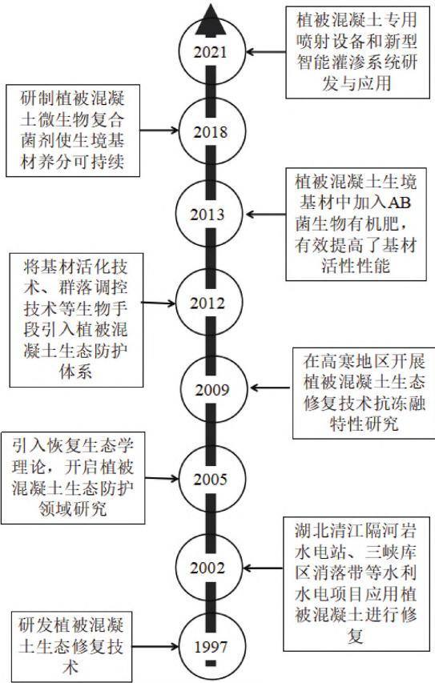
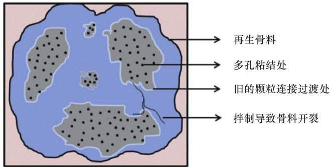
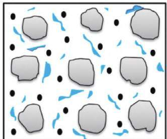
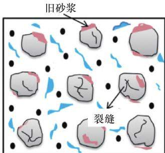

陈垚, 王重卿, 江世雄, 等. 基于再生骨料的多孔生态混凝土边坡防护及应用研究进展[J]. 水利水电技术(中英文), 2025, 56(S1): 768- 775.

CHEN Yao, WANG Chongqing, JIANG Shixiong, et al. Research review of slope protection and application of porous ecological concrete based on recycled aggregate[J]. Water Resources and Hydropower Engineering, 2025, 56(S1): 768- 775.

# 基于再生骨料的多孔生态混凝土边坡防护及应用研究进展

陈 垚1, 王重卿1, 江世雄1, 李 熙1, 张志华2, 3, 张文杰2, 3, 翁孙贤1, 陈 鸿1

(1. 国网福建省电力有限公司电力科学研究院, 福建 福州 350007; 2. 长江水利委员会 长江科学院, 湖北 武汉 430010; 3. 水利部山洪地质灾害防治工程技术研究中心, 湖北 武汉 430010)

摘 要: 随着新时期生态文明建设和绿色发展的不断推进, 如何合理有效地应用大量建筑废弃物是国内外学者关注的重点课题, 以废弃建筑物为原材料生产的再生骨料制备而成的多孔生态混凝土在边坡防护中发挥了巨大作用。 从多孔生态混凝土边坡防护技术发展、 多孔生态混凝土再生骨料及其在不同影响因素下的力学特征和生态经济的长期性等方面详细分析了多孔生态混凝土的研究现状和应用实践。 结合工程技术特点和生态文明建设, 展望了多孔生态混凝土边坡防护研究及发展趋势。 研究成果可为多孔生态混凝土在输变电站工程边坡生态防护应用提供技术参考。

关键词: 多孔生态混凝土; 边坡防护; 再生骨料; 配合比; 力学强度

DOI: 10. 13928/j. cnki. wrahe. 2025. S1. 112

中图分类号: U417. 12; TU528

文献标志码: A

文章编号: 1000- 0860(2025)S1- 0768- 08

# Research review of slope protection and application of porous ecological concrete based on recycled aggregate

CHEN Yao1, WANG Chongqing1, JIANG Shixiong1, LI Xi1, ZHANG Zhihua2,3, ZHANG Wenjie2,3, WEN Suxian1, CHEN Hong

(1. Electric Power Science Research Institute of State Grid Fujian Electric Power Co., Ltd., Fuzhou 350007, Fujian, China; 2. Yangtze River Science Institute of Yangtze River Water board, Wuhan 430010, Hubei, China; 3. Engineering Technology Research Center for Mountain Flood Geological Disaster Prevention, Ministry of Water Resources, Wuhan 430010, Hubei, China)

Abstract: With the continuous advancement of ecological civilization construction and green development in the new times, how to rationally and effectively apply a large amount of construction waste has been the key topic that scholars should pay more attention to. Recycled porous concrete prepared from recycled aggregate produced from abandoned buildings plays a great role in slope protection. A review of the research status and application of porous ecological concrete were analyzed, including the development of slope protection technology and recycled aggregate of porous ecological concrete, its mechanical characteristics under different influencing factors, and the long-term nature of ecological economy. Combined with the characteristics of engineering technology and the construction of ecological civilization, the development trend of porous ecological concrete used in slope protection is prospected. The research result can provide technical reference for the application of porous ecological concrete

in slope ecological protection of power transmission station.

Keywords: porous ecological concrete; slope protection; recycled aggregates; mix proportion; mechanical strength

## 0　 引　 言

如何回收再利用建筑固体废弃物是目前学术界研究的热点问题。 众所周知, 常见的建筑固体废弃物可以加工成再生砂继续应用到混凝土中, 实现固体废弃物的再利用。 再生混凝土得到了诸多学者的广泛关注[1-3]。 混凝土中骨料约占总体积的 60%\~75%, 因此, 利用再生材料不仅可以实现资源的重复利用还能减少固体废弃物的占地空间。 有学者研究指出[4], 用超过50%的再生砂会降低混凝土的强度, 主要原因是因为再生骨料与砂浆之间的黏结比较薄弱, 同时具有更大的孔隙率和更强的吸水性能。 再生多孔生态混凝土主要由再生骨料、 水泥、 外加剂和水组成, 其强度主要取决于水灰比和砂浆颗粒之间的有效黏结形式[5]。

国家电网有限公司在绿色建造背景下 输变电工程的边坡生态修复已经成为热点问题。 对于输变电工程的边坡修复有多种方法[6-8], 比如: 锚杆、 挡土墙和喷射混凝土等, 这些传统的修复方法不能保证原有生态系统, 使得原有生态系统无法恢复。 因此, 寻求既能满足边坡防护的稳定性要求还能保护边坡生态系统的生态混凝土材料势在必行。

多孔生态混凝土是在透水混凝土基础上开发的多孔混凝土材料, 可以有效解决上述问题, 其抗压强度为 10\~15 MPa, 孔隙率为 20% \~ 35%, 孔径范围为 5\~10 mm。 多孔生态混凝土可以满足营养物质与植被一起使用, 发挥混凝土的强度特性和满足植被生长需求,使得边坡既有更好的稳定性又能满足生态修复[9-11]。

文章主要从多孔生态混凝土经济性、 力学性能、耐久性和生态适用性等方面对系列研究现状进行论述, 对如何合理利用再生骨料制备成多孔生态混凝土材料在输变电工程边坡中的使用技术和应用现状进行分析, 并从节能环保和双碳目标的角度加以展望。 最后, 在总结和比较前人研究成果的基础上, 提出了多孔生态混凝土的研究方向 以期在更多方面推进多孔生态混凝土的研究及应用。

## 1　 多孔生态混凝土边坡防护技术

1973 年, 日本提出了纤维增强的土体绿化法,而后10 年, 学者们进一步改进了该方法[12], 主要由纤维、 土体和乳化沥青组成[13]。 20 世纪90 年代, 日本混凝土协会提出了植被混凝土的概念 植被混凝土也称为生态混凝土[14-15], 主要由两层组成: 基层以粗骨料、 胶凝材料和其他材料为主形成的多孔混凝土; 上层由土体、 生态有机质、 肥料、 保水剂和种子组成。 多孔生态混凝土内部有很多孔隙形成多孔蜂窝框架使其具有很好的透水性 透气性 内部孔隙可以满足植被根系的生长[16]。 多孔构造具有降尘、 通风、透水、 储热、 调温等功能, 可以让植被更好地生长,并且具有优良的环境友好型和生态相容性。 经过工程实践应用发现 多孔生态混凝土植物发芽率高 生长条件好, 利于边坡固土, 植被在此类混凝土上生长良好, 证明了用于边坡防护的可行性[17]。 随后, 英国发明了以乳化沥青为黏结剂的水力喷播技术, 促进了边坡生态修复技术的发展。 欧美一些国家同时发展了平面网、 三维土工网、 土工布、 水力喷播、 防蚀毯、树枝填料、 植被抛石等各类生态护坡技术。

随着种植混凝土工业的不断发展, 美国、 澳大利亚和欧洲一些发达国家也从 世纪末开始对植被混凝土进行研究, 并不断进行创新研究[18-20]。 目前来说, 主要有两类植被混凝土被广泛应用, 一种是多孔生态混凝土, 一种是喷射植被生态混凝土。 多孔生态混凝土主要由粗骨料、 胶凝材料、 外加剂和水组成,植被可以在此类混凝土中生长。 喷射植被生态混凝土主要是在边坡上安装钢丝网或者锚钉后使用, 直接喷射在裸露的边坡上, 钢丝网和锚钉可以提高混凝土与界面的接触强度, 增加其抗剪强度, 但是对边坡的坡度有一定要求。 本文主要研究多孔生态混凝土在边坡防护中应用和实践。

生态护坡技术早在 1591 年就在国内开展相关研究, 其中采用柳树作为护坡, 用来修复和加固河岸边坡[21]。 多孔生态混凝土已应用于输变电工程边坡、河湖大坝、 矿山绿化、 垃圾填埋场绿化等生态修复工程, 起到了美化环境、 固定土壤、 保留水分等作用[22], 边坡生态混凝土研发进程如图 1 所示。 自2000 年以来, 边坡生态混凝土修复技术被广泛应用于多项工程中, 总建筑面积多达 80 万 km2, 包括云南小湾水电站生态护坡项目、 贵州广照水电站生态护坡项目、 四川溪洛渡水电站生态护坡项目和河南花园口生态护坡项目[23]。 由于多孔生态混凝土的优越性,学者们[24-26]进行了系列研究, 主要集中在其力学性能和生态适用性方面。

  
图1 国内边坡生态混凝土修复技术发展进程

## 2　 再生骨料和再生混凝土

## 2. 1 再生骨料

基础设施建设产生大量的建筑物混凝土 预制混凝土构件、 砌体结构、 路基混凝土等固体废弃物。 再生骨料最原始成分通常由天然骨料、 胶凝材料和黏结砂浆组成。 天然骨料质量取决于原始混凝土的水灰比[27-28]和固体废弃物回收时采用的加工工艺。 黏结砂浆主要由固体废弃物中细骨料 已经充分反应的水泥和未充分反应的水泥颗粒组成。 受砂浆含量高、 颗粒分布不均匀 密度较低 多孔性等特点 黏结砂浆的强度一般较低[29-33] 。

LIMBACHIYA 等[34]通过试验研究得出再生骨料的相对密度比天然骨料的相对密度低约 7%\~9%。 由于通过各种类型的破碎机进行加工和破碎, 导致再生骨料由于粒径分布不合理, 通常级配较差[35]。 研究发现[28-36]由破碎机加工后再生骨料粒径普遍偏小, 在混凝土拌制中, 再生骨料周围存在旧的黏结砂浆或水泥浆组成旧的界面过渡区。 黏结砂浆中存在微小孔隙,在压碎过程中, 骨料内部出现连续裂缝和分散裂缝,导致其力学强度降低[37-38]。 再生骨料的内部连接如图2 所示, 由图2 可以看出, 再生骨料具有粗糙的表面纹理和不规则的形状, 与砂浆包裹时还存在原有的黏结界面。 再生骨料的力学强度低于天然骨料[39], 例如抗压强度、 抗冲击性和耐磨性。 由于再生骨料影响混凝土的和易性、 强度和耐久性。 因此, 在将再生骨料用于混凝土之前, 必须先对其级配、 骨料形状和尺寸、 孔隙率、 含水率、 刚度、 强度和杂质含量等进行评估[40]。

  
图2 再生骨料的内部连接

## 2. 2 再生骨料混凝土

利用废弃建筑物形成的再生骨料被广泛应用于土木工程、 输变电工程等各建设项目中, 主要是因为其具有更加环保的良好性能并更好的促进建筑业的生态可持续发展[1]。 用建筑废弃物生成的再生骨料部分替代或者完全替代原有混凝土中的骨料拌制的混凝土称为再生骨料混凝土。 再生骨料混凝土的强度主要取决于再生骨料、 胶凝材料和骨料与胶凝材料的界面连接强度[3]。 图 3(a)和(b)分别显示了天然骨料混凝土和再生骨料混凝土的示意图, 显示了两种混凝土之间黏结的基本差异, 也能间接的反映出再生骨料混凝土的力学强度关系 因此 在输变电工程边坡的防护中采用再生混凝土时, 需要更加关注混凝土本身的力学强度。

  
(a) 天然骨料混凝土

  
(b) 再生骨料混凝土  
图3 混凝土示意

## 3　 多孔生态混凝土特征及影响因素

## 3. 1 多孔生态混凝土的力学性能

用于输变电工程边坡防护的多孔生态混凝土需具有较好的力学强度, 用于承载不同的边坡荷载及其他条件。 现有研究结果表明[41], 多孔生态混凝土的强度主要取决于不同材料、 骨料级配、 生态有机质和外加剂等 这些参数会影响混凝土的抗压强度 弹性模量、 抗折强度和其他力学性能, 其中对力学性能起到关键作用的是水泥、 骨料、 再生材料、 生态有机质以及他们之间的黏结力。 多孔生态混凝土的制备方法与普通混凝土类似, 不同点在于其存在生态有机质和使用了再生骨料。 多孔生态混凝土的强度主要取决于颗粒与水泥之间的黏结力, 再生骨料与水泥之间和生态有机质与水泥之间的黏结力[10]。 对多孔生态混凝土进行力学强度试验时, 骨料与水泥之间的黏结处先破坏, 而后随着加载的持续, 裂缝不断延伸, 当骨料与水泥之间、 再生砂与水泥之间的黏结处裂缝断裂达到极限的时候, 多孔生态有机质试块发生破坏。

## 3. 1. 1 胶凝材料

混凝土中的胶凝材料-水泥是保证其强度的关键因素 不同类型的水泥在土木工程 水利工程等领域有着非常广泛的应用。 普通硅酸盐水泥被广泛应用到混凝土中, 普通硅酸盐水泥在拌制过程中水化热较大, 不利于形成多孔, 也不适合植被生长, 并对其强度有一定的影响。 研究发现在多孔生态混凝土中掺入的铝酸钙水泥后 混凝土在第 天和第 天强度提高约 30%[42]。 SHEN 等[43] 使用钢渣粉和磷石膏作为胶凝材料来制备多孔生态混凝土, 水泥本身的强度可以达到 82.6 MPa, 而混凝土的抗压强度约9.4 MPa。 除了引入工业废弃物来制备多孔生态混凝土以外, 还有学者引入了植物[44-45] 来制备混凝土,这些配料都可以降低混凝土的强度[46]。

水灰比(W/C) 比传统混凝土设计中的水灰比(W/C)相对较低, 其变化范围在 0. 20 \~ 0. 35 之间,主要目的在于胶凝材料能够包裹住各类骨料, 骨料的粒径在 不等 此外 在多孔植被混凝土中, 胶砂比(a/c)也有很大差异, 配制比例在 0.87 ∶1 \~ 6 ∶ 1之间均有应用案例[47-49] 。

胶凝材料在混凝土中的重要作用是提高其强度和耐久性。 然而, 由于硅酸盐水泥有水化热现象且混凝土中含碱量高, 植被不适合生长, 所以, 为了降低此类混凝土的含碱量研发了其他配比类型的混凝土, 可以有效改善酸碱度, 利于植被生长[50]。 有学者[9] 采用秸秆灰、 钢渣、 粉煤灰、 矿渣和建筑废料等材料代替常见的硅酸盐水泥, 通过系列试验研究, 通过加入的粉煤灰和矿渣等材料 植被混凝土的强度有变化且呈现降低的趋势, 碱性有改善并适宜植被生长。 采用建筑废弃料制备混凝土有利于环境保护和促进可持续发展。 在水化过程中产生钙矾石代替氢氧化钙, 为植物生长提供了良好的环境, 可以有效降低多孔植被混凝土中孔溶液的碱性。

## 3. 1. 2 骨 料

多孔生态混凝土中的骨料通常选择颗粒粒径比较大的骨料, 大粒径之间容易形成空隙, 利于植被根系的生长, 骨料粒径尺寸一般在10\~30 mm 不等, 粒径越大越能体现出混凝土的孔隙率, 其强度、 孔隙率、渗透性和耐久性都与骨料的粒径、 级配等因素有关。WANG 等[12]通过劈裂试验和抗压试验验证了多孔混凝土的力学强度随着骨料的粒径增大而增大, 并通过CT 扫描技术得出了粗骨料粒径越大, 则混凝土的孔隙率和渗透性也就越大的结论 除了骨料的粒径以外, 骨料的类型也对多孔生态混凝土有一定的影响。

除了骨料的粒径外, 骨料类型也显著控制着多孔生态混凝土的特性。 冀晓珊等[44-45] 采用玉米芯加入生态混凝土中 研究得出玉米芯颗粒在生态混凝土中的体积含量为30%\~47%时, 生态混凝土的抗压强度为 1. 5\~11 MPa, 干密度为 $1 ~ 0 0 0 { \sim } 1 5 0 0 ~ \mathrm { k g / m } ^ { 3 }$ , 导热系数为 0. 23 \~ 0. 29 W/(m·K)。

现有研究表明再生骨料对混凝土的强度有一定的影响[12-50]。 例如, 在相同骨料级配 5\~25 mm 的情况下, 使用再生骨料作为天然骨料的替代品, 多孔生态混凝土的抗压强度降低了 32%[12]。 此类骨料与天然骨料相比, 再生骨料经历了较长时间的机械磨损和化学降解, 破碎过程中产生的机械损伤在骨料中产生了更多的微裂纹 作为混凝土骨料的性能较差 另一个原因是再生混凝土骨料中的黏附砂浆和界面过渡区[36-50]。 这导致与水泥浆体与天然骨料之间的黏结相比, 再生骨料与水泥之间的黏结较弱[51]。

在输变电工程的边坡支护中 通常采用喷射混凝土的方式进行加固, 水泥是在凝结前后主要提供黏聚力和抗剪强度。 在凝固后, 可以有效防止外部侵蚀和散装土体的脱落, 混凝土中的生态有机质提供植被生长的营养和水分。

## 3. 1. 3 配合比

多孔生态混凝土的配合比设计通常取决于强度、孔隙率和和易性之间的稳定性 影响多孔生态混凝土强度和孔隙率的两个主要因素是水灰比和胶砂比。 由于多孔生态混凝土中含有多个空隙, 孔隙率较大, 这些空隙利于植被根系的生长, 植物根系可以比较顺利的穿越植被混凝土 进而扎根下方未扰动的土体中保证植被营养。 植被混凝土有一定的强度可以提高边坡的稳定性。 显而易见, 孔隙率和混凝土力学强度之间的关系是成反比的。

因此, 在制备和使用多孔生态混凝土用于输变电站边坡的支护时需要考虑其配合比问题。 目前, 多孔生态混凝土的配合比方法基本处于成熟状态 诸多学者根据各自的研究使用了不同的配合比应用于混凝土的拌制 如表 所列[52] 胶砂比在 和之间变化 此外 水灰比介于 和 之间[53]

## 3. 2 多孔生态混凝土收缩徐变

收缩徐变是生态混凝土的一个非常突出的特征,主要是因为在混凝土硬化过程中水泥基质需要大量水分子 使得内部孔隙产生毛细张力 随之而来的是导致内部的毛细水分的流失 这是引起混凝土收缩徐变的主要原因 新拌制的混凝土中的含水总量与混凝土的收缩徐变率有直接的关系, 特别是在多孔生态混凝土中表现得更加明显, 采用再生骨料拌制的混凝土的收缩徐变现象明显高于普通混凝土。 建筑废弃物生成的再生骨料具有较低的弹性模量 在反应时对水泥浆潜在收缩的抵抗力较小。 YANG 等[54] 研究表明, 骨料的刚度对混凝土收缩量有显著影响, 其随着再生骨料量的增加和水灰比的增加而增加。

再生骨料混凝土中再生骨料具有较强的吸水性能, 从而形成较大的孔隙率。 附着在再生骨料表面的旧砂浆有助于增加总浆体含量, 这比天然骨料混凝土对水泥浆体收缩的贡献更大[38]。 大量试验研究表明,由于再生骨料的吸水率较高, 再生骨料混凝土的收缩徐变比普通混凝土高得多。

DOMINGO-CABO 等[55]研究发现, 再生骨料混凝土的收缩率高出普通混凝土约 20%, 当再生骨料占比为50%时, 在 180 d 后, 再生骨料的收缩率达到70%。 同时, 在混凝土硬化早期, 再生骨料占比比较小时(约20%), 表现出与传统混凝土相当的收缩值。一些研究人员表示, 随着加入再生骨料的增多, 收缩徐 变 率 的 增 加 可 能 高 达 50%[29-55]。 然 而,LIMBACHIYA 等[56]提出, 早起掺入较少的再生骨料时, 对干缩没有主要影响, 直到替代料到 30%时,之后 随着再生骨料含量的增加 干缩特性显著增加。 BEHERA 等[40]统计分析得出当混凝土中完全用再生骨料替代原有骨料时, 相对于采用天然骨料混凝土的干缩变化可知, 完全用再生骨料拌制的混凝土的收缩徐变性能明显高于普通混凝土。 在混凝土配比中加入粉煤灰和超级增塑剂可以最大限度减少再生骨料混凝土的收缩徐变 主要是因为添加了粉煤灰 再生骨料混凝土收缩徐变的减少与水灰比的降低和粉煤灰颗粒产生的稀释效应有关[38]。

## 3. 3 多孔生态混凝土弹性模量

弹性模量是表示混凝土刚度的一个重要力学指标。 混凝土的弹性模量受到许多参数影响, 例如: 骨料粒径、 孔隙率、 密度和骨料与胶凝材料的连接等。其中, 骨料的孔隙率和密度决定了混凝土本身的强度。 生态混凝土中采用再生骨料代替天然骨料也会影响弹性模量。 配制的混凝土中再生骨料含量对弹性模量的影响比抗压强度的影响更为显著, 这是因为其多孔性、 低密度以及内部存在更多的毛细孔隙和裂缝,之前形成的旧的界面过渡区与再生骨料和胶凝材料之间形成的新的界面过渡区的结合比较弱。

再生骨料混凝土的弹性模量比普通混凝土显著降低, 并且随着再生骨料掺量的增加而降低[57]。

表 1 不同学者制备多孔生态混凝土的配合比
<table><tr><td>文献</td><td>密度/kg·m−3</td><td>胶凝材料/kg·m−3</td><td>水/kg·m−3</td><td>骨料/mm</td><td>胶砂比 A/C</td><td>水灰比 W/C</td></tr><tr><td rowspan="2">[48]</td><td>1 412</td><td>306</td><td>79</td><td>25</td><td>4.61:1</td><td>0.258</td></tr><tr><td>1 412</td><td>306</td><td>75</td><td>25</td><td>4.61:1</td><td>0.245</td></tr><tr><td>[49]</td><td>1 600</td><td>300</td><td>105</td><td>19</td><td>5.33:1</td><td>0.35</td></tr><tr><td>[50]</td><td>1 320</td><td>220</td><td>55</td><td>20~25</td><td>6.0:1</td><td>0.25</td></tr><tr><td></td><td>1 590</td><td>265</td><td>66</td><td>20~25</td><td>6.0:1</td><td>0.249</td></tr><tr><td>[50]</td><td>1 456</td><td>266.4</td><td>52.27</td><td>19~26.5</td><td>5.5:1</td><td>0.196</td></tr><tr><td>[51] [27]</td><td>1 538.6 1 750</td><td>311.2</td><td>62.24</td><td>19~26.5</td><td>4.94:1</td><td>0.20</td></tr><tr><td rowspan="6">[16]</td><td rowspan="6"></td><td>350</td><td>140</td><td>20</td><td>5.0:1</td><td>0.297</td></tr><tr><td></td><td>593.52 148.9</td><td></td><td>0.87:1</td><td>0.20</td></tr><tr><td>542.16 520.91</td><td>165.75</td><td>10~20</td><td>0.96:1</td><td>0.25</td></tr><tr><td>498.99</td><td>179.91</td><td></td><td>1.04:1</td><td>0.30</td></tr><tr><td>462.18</td><td>191.96</td><td></td><td>1.13 :1</td><td>0.35</td></tr><tr><td>562.83 514.13</td><td>142.78 158.74</td><td></td><td>0.96:1</td><td>0.20</td></tr><tr><td rowspan="2"></td><td>541.08</td><td></td><td>172.17</td><td>1.05:1 8~20</td><td></td><td>0.25</td></tr><tr><td></td><td>473.19 438.28</td><td>184.78</td><td></td><td>1.14 :1 1.23:1</td><td>0.30 0.35</td></tr></table>

BEHERA 等[40]总结了不同研究人员的天然骨料和完全是再生骨料(100%)替代原有骨料后的弹性模量结果分析得出没有添加再生骨料的混凝土, 其弹性模量普遍比添加的大。 同时, 含100%再生骨料的混凝土的弹性模量比天然骨料混凝土的弹性模量降低约 45%[57-59]然而, 相关研究[60]发现添加100%再生骨料的混凝土,弹性模量降低了 20%\~25%。

对再生骨料拌制的生态混凝土进行力学强度试验, 研究表明[3-61]再生骨料混凝土的力学强度普遍比普通混凝土更低, 这与弹性模量显示的规律性一致。LIMBACHIYA 等[62]研究的表明, 再生骨料混凝土弹性模量的较低的原因在于再生骨料的力学强度与天然骨料相比有减小很多。 XIAO 等[63-64]从新、 旧骨料的界面过渡区中黏结力的差异性进行了解释, 认为再生骨料的旧界面过渡区黏结力较弱, 且其弹性模量低于普通骨料。

## 4　 结论与展望

本文针对边坡多孔生态混凝土各个方面的性能进行了系统论述, 但针对多孔生态混凝土的应用中还有些突出问题有待进一步探索, 笔者认为未来应关注混凝土配合比、 生态环境的多样性、 边坡支护的稳定性、 多孔生态混凝土的力学强度和生态维持的经济性等各个方面的发展。

(1)多孔生态混凝土的制备: 就多孔生态混凝土的制备而言, 特别是其配合比方面, 不同的参数对混凝土本身的孔隙率 密度 弹性模量和力学强度等有影响, 尤其是力学性能和孔隙率的大小, 决定了混凝土能否在边坡防护中如何使用和植被能否生长。 然而, 多孔生态混凝土的配合比和试验方法没有相关标准规范, 因此, 无法建立统一有效的比对方法。 此外, 由于缺乏标准测试技术, 特别是多孔生态混凝土的测试技术, 使得比较各种研究更加困难。

(2)生态环境多样性的协调: 喷射在边坡上的混凝土厚度, 厚度较薄, 此类界面仅限于灌木和草, 不适合木本植物。 要想保证输变电工程边坡长期有效保护, 需要探索和研发适用于不同自然环境, 如气候、土壤和水文的木本植物、 灌木和草等具有生物多样性的多种植被并存的生态模式。 多孔生态混凝土在各类边坡防护中已被广泛应用, 但大多数研究通常持续数月至数年, 并未调查整个生命周期的性能和生态系统恢复性能。 因此, 需要在各种环境下建立对多孔生态混凝土的应用进行长期监测和追踪研究, 以便得出更加有规律性结论, 用于指导输变电工程边坡生态修复

的后续实践。

(3)边坡支护稳定性的建立: 由于输变电工程岩质边坡的下垫面环境条件较差, 采用生态护坡来确保边坡稳定性本身就具有挑战性 基岩边坡的稳定性需要采用锚杆支护、 连续墙支护等工程技术手段先行加固处理, 基岩因为风化时的空隙, 保水性较差, 可以选择根系发达的植被与边坡支护方法结合起来, 从而建立可靠且可持续的生态保护系统。

(4)多孔生态混凝土的强度: 多孔生态混凝土的力学强度性能受孔隙率影响较大 其孔隙率越大 多孔生态混凝土的强度越低。 如何通过材料性能的改善提高多孔生态混凝土的力学强度也是需要进一步解决的问题 同时 辅以有限元 离散元和边界元等数值计算软件对边坡稳定性进行力学分析, 判断多孔生态混凝土在输变电工程边坡防护中的结构整体稳定性。

(5)生态经济长期性的构建: 需要对防护后的边坡建立长期的监测、 观测系统, 用于收集和公布多孔生态混凝土的初始和维护成本 特别是植被的成活率、 植被的维养和对生态系统的贡献, 建立合适有效的评价机制, 以了解多孔生态混凝土生态修复技术的益处。 植被根系-多孔生态混凝土-边坡坡面之间的相互作用机制尚未得到充分揭示 此外 还应加强输变电工程岩质边坡对多孔生态混凝土的影响, 基岩裂缝保水性与水分蒸发的规律性分析。 同时, 多孔生态混凝土有机化学物质浓度的聚集、 化学侵蚀、 热传导性能对植被生长的影响机制尚未探索。

## 参考文献:

[1] 张莹. 废旧建筑材料制备路用改性再生骨料的性能探究[ J]. 中国公路, 2022 (24): 94-96.

[2] 冯春花, 黄益宏, 崔卜文, 等. 建筑再生骨料强化方法研究进展[J]. 材料导报, 2022, 36(21): 88-95.

[3] 黄莹. 再生粗骨料对混凝土结构耐久性影响机理研究[D]. 南宁: 广西大学, 2012.

[4] 解培睿, 吴绍奇, 周玉国, 等. 再生骨料多元化强化对植生混凝土性能的影响研究[J]. 混凝土, 2022 (9): 174-178.

[5] 刘君实, 李秋义, 张思雨, 等. 再生骨料多孔生态混凝土基本性能研究[J]. 建筑结构, 2019, 49(S1): 682-687.

[6] 管浩. 边坡开挖支护技术措施及应用[ J]. 河南水利与南水北调, 2019, 48(11): 51-52.

[7] 穆国锋. 边坡明挖支护技术在某水电站施工中的应用[ J]. 河南水利与南水北调, 2021, 50(5): 46-47.

[8] 刘强, 李熙, 江世雄, 等. 输变电工程边坡生态防护关键问题及发展趋势[J]. 人民长江, 2022, 53(S1): 16-20.

[9] 王超宇, 陈丽红. 掺秸秆灰、 钢渣等再生骨料混凝土性能研究[J]. 建筑节能(中英文), 2023, 51(1): 134-138.

[10] 全洪珠, 沈杨, 周广兴, 等. 多孔生态混凝土性能试验研究[J].

硅酸盐通报, 2017, 36(5): 1750-1754.

[11] 宋超, 刘筱玲, 苏炫溢, 等. 再生骨料多孔生态混凝土抗压强度试验研究[J]. 施工技术, 2016, 45(3): 19-21.

[12] WANG F, SUN C, DING X, et al. Experimental study on the vegetation growing recycled concrete and synergistic effect with plant roots[J]. Materials, 2019, 12(11): 1855.

[13] LEE J H, PARK C G. Effect of blast furnace slag, hwang-toh and reinforcing fibers on the physical and mechanical properties of porous concrete using blast furnace slag coarse aggregate[ J] . Journal of the Korean Society of Agricultural Engineers, 2010, 52(5) .

[14] 刘黎明, 宋岩松, 钟斌, 等. 植被混凝土生态修复技术研究进展[J]. 环境工程技术学报, 2022, 12(3): 916-927.

[15] 汤巍, 谢新生, 刘健, 等. 多孔生态混凝土试验研究[J]. 人民黄河, 2009, 31(12): 127-129.

[16] LIU Q, SU L, XIAO H, et al. Preparation of shale ceramsite vegetative porous concrete and its performance as a planting medium [ J] . European Journal of Environmental Civil Engineering, 2021, 25(11): 2111-2126.

[17] 杨钊, 王晓梅, 周云艳. 改性植被混凝土基材力学与植生试验研究[J]. 安全与环境工程, 2022, 29(1): 225-233.

[18] DEO O, NEITHALATH N. Compressive response of pervious concretes proportioned for desired porosities [ J ] . Construction Building Materials, 2011, 25(11): 4181-4189.

[19] LIAN C, ZHUGE Y. Optimum mix design of enhanced permeable concrete-An experimental investigation [ J ] . Construction Building Materials, 2010, 24(12): 2664-2671.

[20] SUMANASOORIYA M S, NEITHALATH N. Pore structure features of pervious concretes proportioned for desired porosities and their performance prediction[ J] . Cement Concrete Composites, 2011, 33 (8): 778-787.

[21] 王军, 王冬梅, 王晓英, 等. 岩质边坡植被混凝土生态防护技术的应用[J]. 湖南农业科学, 2011(15): 143-145.

[22] 李旭光, 毛文碧, 徐福有. 日本的公路边坡绿化与防护: 1994年赴日本考察报告[J]. 公路交通科技, 1995 (2): 59-64.

[23] 张俊云, 周德培, 李绍才. 高速公路岩石边坡绿化方法探讨[ J].岩石力学与工程学报, 2002 (9): 1400-1403.

[24] NORMANIZA O, AIMEE H, ISMAIL Y, et al. Promoter effect of microbes in slope eco-engineering: Effects on plant growth, soil quality and erosion rate at different vegetation densities[ J] . Applied Ecology Environmental Research, 2018, 16(3): 2219-2232.

[25] 兰虎林, 尹金珠, 彭国涛, 等. 岩质边坡植被恢复研究[J]. 四川大学学报(自然科学版), 2011, 48(3): 713-719.

[26] TANG W C, EHSAN M, WANG Z Y. Development of vegetation concrete technology for slope protection and greening [ J ] . Construction Building Materials, 2018, 179: 605-613.

[27] 李少丽, 王乾峰. 高性能混凝土配合比设计及力学强度试验研究[J]. 混凝土, 2020 (3): 117-118.

[28] 孟繁强. 新旧砂浆粘结性能及水分传输规律试验研究[D]. 青岛: 青岛理工大学, 2021.

[29] GÓMEZ-SOBERÓN J M V. Porosity of recycled concrete with substitution of recycled concrete aggregate: An experimental study [J]. Cement and Concrete Research, 2002, 32(8): 1301-1311.

[30] KATZ A. Properties of concrete made with recycled aggregate from partially hydrated old concrete [ J ] . Cement Concrete Research, 2003, 33(5): 703-711.

[31] LAM C S P. Effect of microstructure of ITZ on compressive strength of concrete prepared with recycled aggregates[ J] . Construction Building Materials, 2004, 461-468.

[32] BUTLER L, WEST J S, TIGHE S L. The effect of recycled concrete aggregate properties on the bond strength between RCA concrete and steel reinforcement [ J ] . Cement Concrete Research, 2011, 41 (10): 1037-1049.

[33] CASUCCIO M, TORRIJOS M C, GIACCIO G, et al. Failure mechanism of recycled aggregate concrete[ J] . Construction Building Materials, 2008, 22(7): 1500-1506.

[34] LIMBACHIYA M C, LEELAWAT T, DHIR R K. Use of recycled concrete aggregate in high-strength concrete [ J ] . Materials and Structures, 2000, 33(9): 574-580.

[35] MCNEIL K, KANG H K. Recycled concrete aggregates: A review [ J] . International Journal of Concrete Structures Materials, 2013, 61-69.

[36] 郭嘉, 高嵩, 班顺莉, 等. 再生混凝土单轴受压下多重界面过渡区的破坏机 理 研 究 [ J]. 硅 酸 盐 通 报, 2022, 41 ( 10): 3445-3457.

[37] OLORUNSOGO F T, PADAYACHEE N. Performance of recycled aggregate concrete monitored by durability indexes[ J] . Cement and Concrete Research, 2002, 32(2): 179-185.

[38] KOU S C, POON C S. Enhancing the durability properties of concrete prepared with coarse recycled aggregate [ J] . Construction Building Materials, 2012, 35(10): 69-76.

[39] LÓPEZ-GAYARRE F, SERNA P, DOMINGO-CABO A, et al. Influence of recycled aggregate quality and proportioning criteria on recycled concrete properties [ J ] . Waste Management, 2009, 29 (12): 3022-3028.

[40] BEHERA M, BHATTACHARYYA S K, MINOCHA A K, et al. Recycled aggregate from C&D waste & its use in concrete-A breakthrough towards sustainability in construction sector: A review [J]. Construction and Building Materials, 2014, 68: 501-516.

[41] 陈林, 陈双庆. 基于机器学习的橡胶改性再生骨料混凝土抗压强度预测研究[J]. 公路工程, 2022, 47(5): 169-175.

[42] SUN R, WANG D M, CAO H M, et al. Ecological pervious concrete in revetment and restoration of coastal Wetlands: A review [ J ] . Construction and Building Materials, 2021, 303: 124590.

[43] SHEN W G, LIU Y, WU M M, et al. Ecological carbonated steel slag pervious concrete prepared as a key material of sponge city[ J] . Journal of Cleaner Production, 2020, 256: 120244.

[44] 冀晓珊, 李秋义, 刘娟. 玉米芯骨料生态混凝土的制备及性能[J]. 农业工程学报, 2021, 37(6): 289-294.

[45] 冀晓珊, 李秋义, 刘娟, 等. 玉米芯-再生骨料复合生态混凝土收缩性能试验研究[J]. 低温建筑技术, 2021, 43(5): 29-33.

[46] LIU J, SHI B, JIANG H T, et al. Research on the stabilization treatment of clay slope topsoil by organic polymer soil stabilizer[ J] . Engineering Geology, 2011, 117(1): 114-120.

[47] KIM H, PARK C. Plant growth and water purification of porous

vegetation concrete formed of blast furnace slag, natural jute fiber and styrene butadiene latex [ J] . Sustainability, 2016, 8(4) : 386-386.

[48] BAO X H, LIAO W Y, DONG Z J, et al. Development of vegetationpervious concrete in grid beam system for soil slope protection [ J] . Materials, 2017, 10(2): 96.

[49] XIAO H L, HUANG J, MA Q, et al. Experimental study on the soil mixture to promote vegetation for slope protection and landslide prevention[J]. Landslides, 2017, 14(1): 287-297.

[50] 赵增丰, 姚磊, 肖建庄, 等. 再生骨料 CO 碳化强化技术研究进展[J]. 硅酸盐学报, 2022, 50(8): 2296-2304.

[51] BHUTTA M, HASANAH N, FARHAYU N, et al. Properties of porous concrete from waste crushed concrete [ J ] . Construction Building Materials, 2013, 47: 1243-1248.

[52] FAIZ H, NG S, RAHMAN M. A state-of-the-art review on the advancement of sustainable vegetation concrete in slope stability[ J] . Construction and Building Materials. 2022, 326: 126502.

[53] CHENG J, LUO X, SHEN Z, et al. Study on vegetation concrete technology for slope protection and greening engineering[ J] . Polish Journal of Environmental Studies, 2020, 29(6): 4017-4028.

[54] YANG K H, CHUNG H S, ASHOUR A. Influence of type and replacement level of recycled aggregates on concrete properties [ J] . ACI Materials Journal, 2008, 105: 289-296.

[55] DOMINGO-CABO A, LÁZARO C, LÓPEZ-GAYARRE F, et al. Creep and shrinkage of recycled aggregate concrete[ J] . Construction and Building Materials, 2009, 23(7): 2545-2553.

[56] LIMBACHIYA M, MEDDAH S, OUCHAGOUR Y. Performance of portland / silica fume cement concrete produced with recycled concrete

aggregate[ J] . ACI Materials Journal, 2012, 109: 91-100.

[57] GAO D Y, ZHANG L J, ZHAO J, et al. Durability of steel fibrereinforced recycled coarse aggregate concrete [ J] . Construction and Building Materials, 2020, 232: 117119.

[58] BUI N K, SATOMI T, TAKAHASHI H. Mechanical properties of concrete containing 100% treated coarse recycled concrete aggregate [ J] . Construction and Building Materials, 2018, 163: 496-507.

[59] SILVA R V, DEBRITO J, DHIR R K. Properties and composition of recycled aggregates from construction and demolition waste suitable for concrete production[ J] . Construction and Building Materials, 2014, 65: 201-217.

[60] CHAKRADHARA R M, BHATTACHARYYA S K, BARAI S V. Influence of field recycled coarse aggregate on properties of concrete [J]. Materials and Structures, 2011, 44(1): 205-220.

[61] 赵宏伟. 基于骨料强化的再生水泥稳定碎石性能试验研究[J].黑龙江交通科技, 2022, 45(10): 34-36.

[62] LIMBACHIYA M, MEDDAH M S, OUCHAGOUR Y. Use of recycled concrete aggregate in fly-ash concrete[ J] . Construction and Building Materials, 2012, 27(1): 439-449.

[63] XIAO J Z, LI W G, FAN Y H, et al. An overview of study on recycled aggregate concrete in China (1996-2011) [ J] . Construction and Building Materials, 2012, 31: 364-383.

[64] XIAO J Z, LI W G, POON C S. Recent studies on mechanical properties of recycled aggregate concrete in China: A review [ J ] . Science China Technological Sciences, 2012, 55(6): 1463-1480.

(责任编辑 康 健)