文章编号：1007-4929（2025）05-0034-05

灌溉工程与装备

# 多级过滤沉沙池对高浓度细颗粒泥沙沉降效果的影响

赵恕轲1，杨莉莉1，周 生2，刘 洋3

（ 山东省调水工程运行维护中心平度管理站，山东 青岛 ； 山东大学土建与水利学院，山东 济南 ；淮河水利委员会水文局，安徽 蚌埠 ）

摘 要：探究多级沉沙池过滤级数对高浓度黄河泥沙沉降的影响，明晰多级沉沙池的沉沙原理，明确多级沉沙池适宜运行工况和适宜布置级数。针对多级沉沙池对高浓度黄河泥沙的去除，设计了 级过滤沉沙池，选取黄河干渠淤积细颗粒泥沙配置浓度为 3的含沙水流，在 种运行流量下（ 、 、 3 ）开展原型沉沙试验，分析过滤级数对高浓度细颗粒黄河泥沙的沉降效果。 种运行流量下， 级沉沙池出口泥沙含量为 3，泥沙去除率为 ，出口泥沙粒径 $D _ { 9 0 } , \ D _ { 5 0 } , \ D _ { 1 0 }$ 分别为 39.87\~45.36、19.92\~24.50、2.86\~3.97 μm；1\~4 级沉沙池约有 的泥沙发生沉降，发挥主要沉降作用， 级沉沙池仅有 泥沙发生沉降，发挥次要沉降作用，这是由于泥沙在上一级沉沙池发生沉降后，下一级沉沙池对泥沙的沉降难度增大引起的；同时级通过溢流堰连通，第 级沉沙池进口水流为第 级末端表层水流进一步加大了 级沉沙池沉降泥沙的难度。研究表明，针对粒径范围 ，浓度 3左右的泥沙，在 、 、 3 流量下沉沙池模型适宜的过滤级数分别为4级、5级、6级，适宜运行流量为20 m3/h。

关键词：沉沙池；过滤级数；黄河泥沙；高浓度；细颗粒

中图分类号：S277.9

文献标识码：A

DOI：10.12396/jsgg.2024233

赵恕轲，杨莉莉，周 生，等. 多级过滤沉沙池对高浓度细颗粒泥沙沉降效果的影响［J］. 节水灌溉，2025（5）：34-38+50. DOI：10.12396/jsgg.2024233.ZHAO S K， YANG L L， ZHOU S， et al. Effect of multistage filtration sand sedimentation tank on the sedimentation effect of highconcentration fine particle sediment［J］. Water Saving Irrigation， 2025（5）：34-38+50. DOI：10.12396/jsgg.2024233.

# Effect of Multistage Filtration Sand Sedimentation Tank on the Sedimentation Effect of High Concentration Fine Particle Sediment

ZHAO Shu-ke1，YANG Li-li1，ZHOU Sheng2，LIU Yang3

（1.Pingdu Management Station， Operation and Maintenance Center of Shandong Water Diversion Project， Qingdao 266700， ShandongProvince， China；2.School of Civil Engineering and Water Conservancy of Shandong University， Jinan 250061， Shandong Province， China；3.Hydrology Bureau of Huaihe Water Conservancy Commission， Bengbu 233001， Anhui Province， China）

Abstract：To explore the influence of the filtration stage of desilting basin on the sediment sedimentation of the Yellow River, clarify the sedimentation principle of multi-stage sedimentation tank, and determine the suitable operating conditions and arrangement series of the multi-stage sedimentation tank. For the removal of high concentration of fine granular sediment in the multi-stage sediment sedimentation pool, an eight-stage desilting basin filtration system was designed to conduct the full-scale sedimentation experiment under three kinds of operating flow rates (20, 40 and 60 m3/h) to analyze the sedimentation effect of the sediment of fine particles of the Yellow River with high concentration. Under 3 operating flow rates, the sediment content at the outlet of the 8th level sedimentation tank was 0.80\~1.36 kg/m3, and

the sediment removal rate was 84.13%\~90.73%. The outlet sediment particle sizes $D _ { 9 0 } . D _ { 5 0 }$ and $D _ { 1 0 }$ were 39.87\~45.36, 19.92\~24.50 and 2.86\~ 3.97 μm, respectively; About 76.84% to 84.78% of the sediment in the first to fourth level sedimentation tanks settles, playing the main sedimentation role. Only 5.95% to 7.29% of the sediment in the fifth to eighth level sedimentation tanks settles, playing a secondary sedimentation role. This is because after the sediment settles in the previous level sedimentation tank, the difficulty of settling the sediment in the next level sedimentation tank increases; Furthermore, stages 4\~5 are connected through overflow weirs, and the inlet water flow of the fifth stage sedimentation tank is the surface water flow at the end of stage 4, further increasing the difficulty of settling sediment in stages 4\~5 sedimentation tanks. This study found that for sediment with a particle size range of 0\~350 μm and a concentration of about 8.5 kg/m³, the optimal number of stages for the sedimentation tank model at flow rates of 20, 40 and 60 m3/h are 4、5 and 6, respectively, and the suitable operating flow rate is 20 m3/h.

Key words： sand sediment pond；filter series；Yellow River sediment；high concentration；fine particle

## 0　引 言

黄河流域水资源短缺，农业灌溉用水约占流域用水总量的 [1]，高效利用黄河水灌溉是保障黄河流域粮食安全的重要途径[2]，然而由于黄河泥沙含量高、粒径细，极易造成灌溉系统失效[3]。因此有效去除黄河泥沙是保障灌溉系统长期健康运行的关键。

众所周知，沉沙池是传统的水沙分离有效手段。随着科研、工程应用的不断发展先后提出了大量不同类型沉沙池，其中直线形沉沙池因其结构简单、运行可靠的优点被广泛应用，但其往往存在结构庞大、沉沙率低的缺点。学者先后对直线形沉沙池进行了大量研究。张跟广[4]的研究表明将沉沙池底坡设计成逆坡可有效提高泥沙沉降效率。大量学者在直线形沉沙池的基础上改进提出了复合型沉沙池[5, 6]，例如山西禹门口引黄工程沉沙池。华根福等[7, 8]通过增加调流板、溢流槽等附属结构，提出了一种以处理悬移质泥沙为主的微灌用沉沙池。张杰武[9]研究了邢家渡引黄灌区迂回式沉沙池对黄河泥沙的沉降效果，显示迂回式的设计可以大幅提高泥沙去除率。[10]、 [11]等通过在沉沙池进水口处设置水流控制挡板改变池内水流分布，有利于增加泥沙沉降效率。[12]等的研究表明在沉沙池水流环流处设置挡板对提高沉沙池效率效果最佳，确定了在沉沙池底布置挡板的适宜角度与数量。华根福[13]、吴均[14]等通过在沉沙池中设置调流板改善池内水流流态、增加水流动能耗散，增加沉沙池内泥沙沉降。然而，以往直线沉沙池的研究主要集中在 级、 级沉沙池的结构设计优化，对多级数沉沙池对泥沙的沉降效果研究相对缺乏。

基于此，本文设计了一个 级沉沙池，配置高浓度黄河水在 种运行流量下进行水沙分离试验，分析了 种运行流量下级数对黄河泥沙沉降的影响，旨在得出多级沉沙池沉降黄河泥沙适宜的过滤级数以及适宜运行流量，明确不同粒径黄河泥沙在多级沉沙池中的沉降特性。

## 1　材料与方法

## 1.1　多级沉沙池过滤系统

多级沉沙池过滤系统如图 所示，其由 个相同池厢构成，包括进口、挡墙、溢流堰等，其中 数字编号分别代表级沉沙池。多级沉沙池系统整体长 、宽 、深

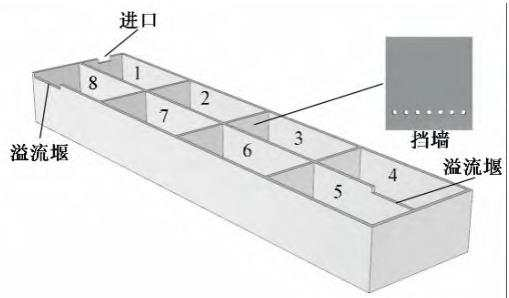  
图1　多级沉沙池结构原理图  
Fig.1 Schematic diagram of the multi-stage sediment tank structure

1.6 m，进口、出口、溢流堰高度为1.5 m；单个池厢的长为、宽 ，各级池厢通过挡墙分隔开。 级、 级沉沙池间通过引流孔连通， 级沉沙池间为溢流堰连通，级沉沙池的进口泥沙浓度为初始泥沙浓度，第 级沉沙池的泥沙进口浓度为 级沉沙池溢流堰位置泥沙浓度。

## 1.2　实验设置

试验用泥沙取自黄河支流渠道淤积泥沙，在配沙池配置浓度为8.5 kg/m3的含沙水流，其泥沙粒径特征曲线如图2所示。实验设置了3种运行流量 $( Q _ { 2 0 } , \ Q _ { 4 0 } , \ Q _ { 6 0 } )$ ，分别为20、40、60 m3/h。

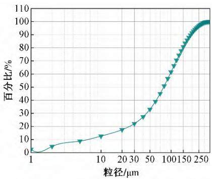  
图2　水源泥沙粒度级配  
Fig.2 Water source and sediment particle size grading

## 1.3　测定方法

## 1.3.1　泥沙量测定与计算

考虑经沉沙池沉淀后进入澄清池的水流为溢流堰流出的表层水流，同时考虑不同深度的水样的取样误差，在对各级沉沙池的泥沙含量进行测定时，取各级沉沙池末端表层深度0\~20cm的水样作为出口泥沙含量的样品，每个样品取3个重复。对所取水样进行沉淀 后，倒掉清水部分后采用烘箱进行烘干处理，采用精度为0.1 mg的天平称量烘干泥沙质量，并计算泥沙浓度。

## 1.3.2　泥沙粒度测量

采用激光粒度分析仪器（马尔文 ）对烘干后泥沙进行测试，分析仪的搅拌器速度和阴影范围分别保持在和 。试验前，称取 样品放入 三角瓶，加入少量去离子水浸润土壤，加入 过氧化氢去除有机质并进行短时间沙浴加热。向冷却后的三角瓶中加入mL分散剂（六偏磷酸钠）和35 mL左右去离子水，再次进行沙浴加热，样品冷却后即可测量。

## 1.3.3　泥沙去除率

为进一步探明级数对沉沙池沉降泥沙能力的影响，引入泥沙沉降率指标。泥沙沉降率为进口、出口泥沙浓度差值与进口泥沙浓度的比值。

## 1.3.4　泥沙粒度指标

为探明多级沉沙池对不同粒径泥沙的沉降效果，分别测

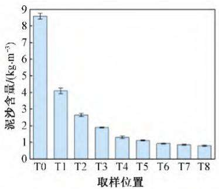  
(a) Q20

量了泥沙粒度指标 $D _ { 9 0 } , \ D _ { 5 0 } , \ D _ { 1 0 } ,$ ，其分别表示累计粒度分布百分数分别达到90%、50%、10%时所对应的粒径。

## 2　结果与分析

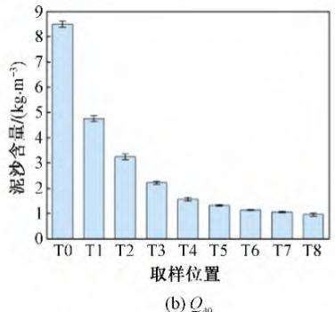

## 2.1　过滤级数对泥沙浓度的影响

种不同流量下各级沉沙池主要位置泥沙含量见图 。从图 中可知，第 级沉沙池对泥沙的沉降效果最明显， 级沉沙池的沉降效果依次减弱， 级沉沙池沉降效果趋于平缓。3种流量下，第4级沉沙池出口泥沙含量为1.31\~1.98 kg/$\mathrm { m } ^ { 3 }$ ，第 级沉沙池的出口泥沙含量为 3，表明第级沉沙池对泥沙起到了主要的沉降作用， 级沉沙池发挥次要沉降作用。不同流量下，运行流量为 3 时，出口泥沙含量为0.80 kg/m3，较运行流量为40、60 m3/h时分别减少了 17.38%、41.46%。

图3　主要位置泥沙含量  
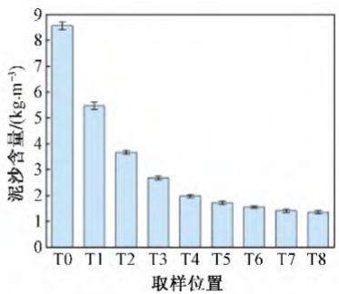  
(c) 260  
Fig.3 Sediment content at the main locations

## 2.2　过滤级数对泥沙去除率的影响

种不同流量下各级沉沙池主要位置泥沙去除率见图 。从图 中可知，随着过滤级数增加泥沙去除率增幅逐渐减小，其中 级沉沙池的泥沙去除率增幅明显， 级沉沙池的泥沙去除率增幅明显趋于平缓。第 级沉沙池的泥沙去除率达，较 级、 级沉沙池分别增加了、 ，这主要是由于第 级的进口泥沙含量低引起的。不同流量下，运行流量为 3 时，泥沙去除率为 ，较运行流量为 、 3 时分别增加了 、6.60%。

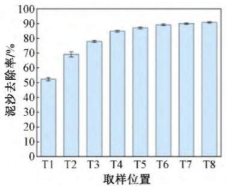  
(a) Q20

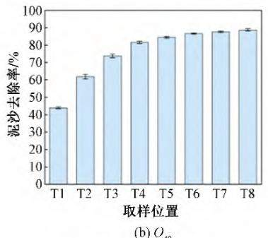  
(b) Q40

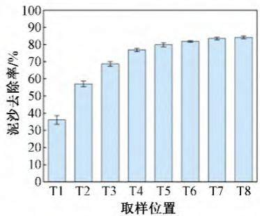  
图4　泥沙去除率沿程变化  
(c) Q60  
Fig.4 The sediment sedimentation rate changes along the path

## 2.3　过滤级数对泥沙粒度指标的影响

## 2.3.1　过滤级数对 $D _ { 9 0 }$ 的影响

种不同流量下各级沉沙池主要位置 $D _ { 9 0 }$ 见图 。从图 中可知， $D _ { 9 0 }$ 在第 级出现大幅减小，在第 级间减小明显，在级间逐渐趋于稳定。其中第 级、第 级、第 级沉沙池的出口泥沙 $D _ { 9 0 }$ 较进口分别减小了39.835%\~52.05%、66.60%\~、 。 种运行流量，运行流量为 3时，第8级沉沙池出口泥沙 $D _ { \mathfrak { g } _ { 0 } }$ 为39.87 μm，较运行流量为40、60 m3/h 时分别减小了 5.91%、12.09%。

## 2.3.2　过滤级数对 $D _ { 5 0 }$ 的影响

3种不同流量下各级沉沙池主要位置 $D _ { 5 0 }$ 见图 $6 _ { \circ }$ 与 $D _ { 9 0 }$ 类似， $D _ { 5 0 }$ 在第1级出现大幅减小，第2\~4级减小明显，5\~8级逐

(a) $\mathcal { Q } _ { 2 0 }$  
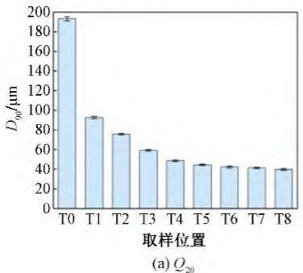

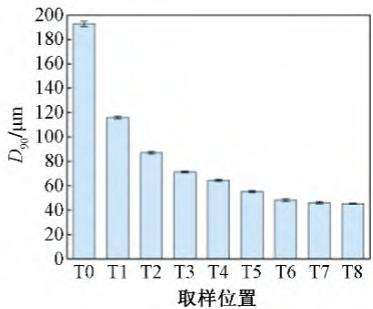  
图5 $D _ { 9 0 }$ 沿程变化

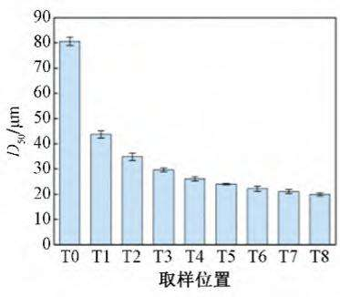  
Fig.5 The $D _ { 9 0 }$ varies along the path

$$
\phantom { } | \mathcal { Q } _ { \mathfrak { z o } }
$$

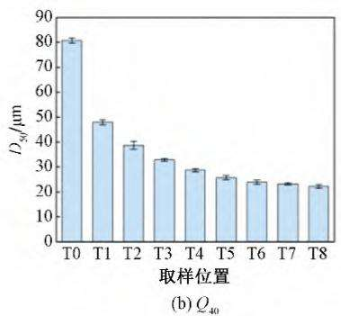  
Fig.6 The $D _ { 5 0 }$ changes along the path

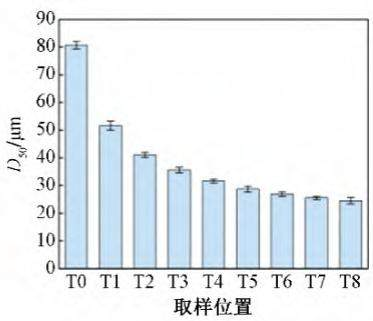  
图6 $D _ { 5 0 }$ 沿程变化

$$
\stackrel { \cdot } { \underbrace { \boldsymbol { \mathcal { O } } } } _ { 6 0 }
$$

渐趋于稳定。其中第1级、第4级、第8级沉沙池出口泥沙 $D _ { 5 0 }$ 较进口分别减小36.04%\~45.78%、60.78%\~67.64%、69.63%\~。 种运行流量下，运行流量为 3 时，第 级沉沙池出口泥沙 $D _ { 5 0 }$ 为19.92 μm，较运行流量为40、60 m3/h时分别减小了 10.13%、18.67%。

## 2.3.3　过滤级数对 $D _ { 1 0 }$ 的影响

3种不同流量下各级沉沙池主要位置 $D _ { 1 0 }$ 见图 $7 _ { \circ }$ 与 $D _ { 9 0 } ^ { }$

$D _ { 5 0 }$ 相似， $D _ { 1 0 }$ 在第 级出现大幅减小， $D _ { 1 0 }$ 在第 级沉沙池处减小趋势最明显，第 级减小趋势逐渐减缓，第 级逐渐趋于稳定。其中第 级、第 级、第 级沉沙池出口泥沙 $D _ { 1 0 }$ 较进口分别减小了22.36%\~35.08%、42.77%\~57.05%、51.76%\~65.20%。3种运行流量下，运行流量20 m3/h时，第8级沉沙池出口泥沙 $D _ { 1 0 }$ 为 ，较运行流量为 、 3 时分别减小了 、 。

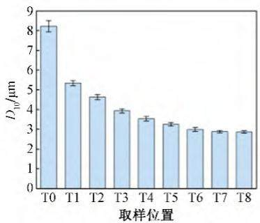

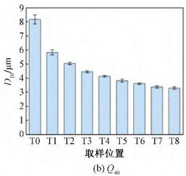  
图7 $D _ { 1 0 }$ 沿程变化  
Fig.7 The $D _ { 1 0 }$ varies along the path

## 2.4　综合评价分析

参考《微灌用沉沙池设计标准》，将出口泥沙浓度、出口泥沙去除率、出口泥沙粒径D90作为评价沉沙池适宜级数的指标（见表 ）。从表 中可以看出，运行流量为 、 3时，过滤级数分别为 、 可以满足过滤要求；运行流量为3 时，需要增加过滤级数或增加其他过滤措施。同时，多级沉沙池对泥沙粒径的控制效果明显，运行流量分别为20、、 3 时过滤级数分别为 级、 级、 级可以满足过滤要求。

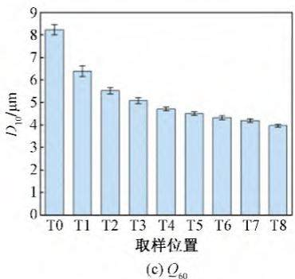

表1　沉沙池适宜过滤级数评价  
Tab.1 Evaluation of appropriate filtration series of sand sediment tank
<table><tr><td>流量工况</td><td> $C _ { \mathrm { o u t } } { < } 1 \mathrm { k g } / \mathrm { m } ^ { 3 }$ </td><td> $R _ { \mathrm { s } } { > } 8 5 \%$ </td><td> $D _ { 9 0 } { < } 5 0 ~ \mu \mathrm { m }$ </td><td>综合评价</td></tr><tr><td> $Q _ { 2 0 }$ </td><td>5</td><td>5</td><td>4</td><td>4</td></tr><tr><td> $Q _ { 4 0 }$ </td><td>7</td><td>6</td><td>5</td><td>5</td></tr><tr><td> $Q _ { 6 0 }$ </td><td>一</td><td>一</td><td>6</td><td>6</td></tr></table>

注： $C _ { \mathrm { o u t } }$ 为出口泥沙浓度； ${ \ ; R _ { \mathrm { s } } }$ 为泥沙沉降率（去除率）。

## 3　讨 论

本文研究发现，随着沉沙池级数增加，沉沙池对泥沙的沉降效果逐级减弱， 级沉沙效果明显， 级沉沙效果大幅减弱。其中1\~4级沉沙池约有76.84%\~84.78%的泥沙发生沉降，而 级沉沙池仅有 泥沙发生沉降，这主要是由于下一级的进口泥沙含量是上一级的出口泥沙含量，大部分大颗粒泥沙临界沉降速度小在前几级池厢中优先发生沉降。同时 级和 级沉沙池间通过引流孔的方式连通，级沉沙池间通过溢流堰连通，进入第 级沉沙池的水流含沙量为表层水流含沙量，泥沙含量低且粒径小，因此 级沉沙池可沉降的泥沙被减少。同时研究表明，泥沙粒径 $D _ { 9 0 } , \ D _ { 5 0 } ,$ $D _ { 1 0 }$ 在第 级减小明显，且随着级数增加逐渐减弱， 级趋于 平 缓 。 其 中 1\~4 级 分 别 减 小 66.60%\~74.82%、 60.78%\~67.64%、42.77%\~57.05%，5\~8级仅分别减小4.54%\~9.89%、7.65%\~8.85%、8.15%\~10.32%，这是因为泥沙粒径经过上一级沉沙池的减小后，下一级沉沙池对小粒径泥沙的沉降难度增大，因此泥沙粒径减小效果逐级减弱：同时，第5级沉沙池进口泥沙粒径为第 级沉沙池尾部表层水流的小泥沙粒径，泥沙粒径进一步减小， 级沉沙池减小泥沙粒径的难度进一步增大，因此 级沉沙池对泥沙粒径的减小效果不明显。

不同粒径之间，粒径 $D _ { \mathfrak { g } 0 }$ 的减小幅度最大， $D _ { 5 0 } , \ D _ { 1 0 }$ 依次次之，且随着级数增加粒径 $D _ { 9 0 } ^ { }$ 、 $D _ { 5 0 }$ $D _ { 1 0 }$ 的减小幅度逐渐减小，这是由于粗颗粒泥沙临界沉降速度大易于发生沉降，细颗粒泥沙沉降速度小不易发生沉降[15,16]；且随着级数增加细颗粒泥沙占比逐渐增多，沉降难度增大。不同流量工况下，3 的泥沙沉降效果最好， 、 3 依次次之，随着流量的增大，对泥沙粒径 $D _ { 9 0 } , \ D _ { 5 0 } , \ D _ { 1 0 }$ 的去除难度不断增大，尤其对 $D _ { 1 0 }$ 的去除难度增幅最明显，这主要是由于沉沙池的过流速度远大于细颗粒泥沙临界沉降速度引起的，因此选择适宜运行流量可有效沉降细颗粒泥沙。通过增加挡板等措施将长条渠方形沉沙池改造成多级沉沙池，与传统长条渠方形沉沙池相比，挡板改变了沉沙池内部流场分布，提高了消能效果，促进了泥沙在挡板位置发生沉降[17,18]。本文研究表明， 、、 3 流量下沉沙池适宜的过滤级数分别为 级、 级、级，在实际工程应用中，可根据实际情况扩大沉沙池规模，进行级数设置。建议每平方米过流断面流量为 3 为宜，如果在较大运行流量下运行时，沉沙池后需增加更精细过滤设备。

## 4　结 论

本文通过研究 种运行流量（ 、 、 3 ）下多级沉沙池模型对高浓度黄河泥沙沉降的影响，文中数据、结论仅适用于本文所设计研究的小型多级沉沙池，可为大型多级沉沙池设计提供思考。本文研究得出结论如下：

（1）3种运行流量下，第8级沉沙池的出口泥沙含量为0.80\~1.36 $\mathrm { k g / m } ^ { 3 }$ ，泥沙去除率达 ，出口泥沙粒径 $D _ { 9 0 }$ $D _ { 5 0 }$ $D _ { 1 0 }$ 分别为 39.87\~45.36、19.92\~24.50、2.86\~3.97μm。

（2） 1\~4级沉沙池约有76.84%\~84.78%的泥沙发生沉降，发挥主要沉降作用， 级沉沙池仅有 泥沙发生沉降，发挥次要沉降作用；同时 级通过溢流堰连通，第级沉沙池进口水流为第 级末端表层水流进一步加大了 级沉沙池沉降泥沙的难度。。

（）本文设置的小型 级沉沙池模型，针对粒径范围，浓度 3左右的泥沙， 在 、 、 3 流量下适宜的过滤级数分别为 级、 级、 级。

## 参考文献：

［1］ 王军涛，李根东，宋常吉，等. 黄河灌区高效节水灌溉发展对策与建议［］灌溉排水学报， ，（ ）：

［ ］ 孙景生，康绍忠 我国水资源利用现状与节水灌溉发展对策［］农业工程学报， 2000，16（2）：1-5. （SUN J S， KANG S Z. Presentsituation of water resources usage and developing countermeasuresof water-saving irrigation in China［J］. Transactions of the ChineseSociety of Agricultural Engineering， 2000，16（2）：1-5.）

［ ］ 侯　鹏，肖　洋，吴乃阳，等 黄河水滴灌系统灌水器结构 泥沙淤积 堵塞行为的相关关系研究［］水利学报， ，（ ）：1 372-1 382. （HOU P， XIAO Y， WU N Y， et al. Cascaderelationship between the emitter structure-sedimentation-cloggingbehavior in drip irrigation systems with Yellow River water［J］.Journal of Hydraulic Engineering， 2020，51（11）：1 372-1 382.）

［ ］ 张跟广 逆坡沉沙池沉淀效率的分析［］水资源与水工程学报，1991，2（4）：34-41. （ZHANG G G. Settling effect of basins withreverse slope ［J］. Journal of Water Resources and WaterEngineering， 1991，2（4）：34-41.）

［ ］ 王仁龙 大禹渡等冲洗式沉沙池技术改造效果分析［］人民黄河 ， 2013，35（7）：128-130. （WANG R L. Water conservancyproject flushing desilting basin irrigation stage of main parameters［］ ， ，（）： ）

［6］ 黎运棻，冯英颜，王振平，等. 黄河禹门口提水枢纽工程复合型沉沙池的布置与模型试验［］ 水利水电技术， ， （）：24-27.

［ ］ 华根福，刘焕芳，汤　骅，等 微灌沉沙池在新疆兵团节水灌溉中的应用研究［］节水灌溉， （）： （ ，LIU H F， TANG H， et al. Application of sand basin for micro-irrigation in water saving irrigation of Xinjiang production andconstruction corps［J］. Water Saving Irrigation， 2010（4）：44-46+51.）

［ ］ 华根福，刘焕芳 调流墙对微灌用沉沙池水流流态的影响分析研究［］中国农村水利水电， （ ）： （ ，LIU H F. Research on the effect of adjusting flow board on flow ofthe sand basin for micro-irrigation [J]. China Rural Water andHydropower， 2012（10）：13-16+21.）

［9］ 张杰武. 高含沙水泥沙分离系统设计与分析［J］. 节水灌溉， 2015（5）：88-91.

［10］ KREBS P. Success and shortcomings of clarifier modelling［J］.Water Science and Technology， 1995，31（2）：181-191.

[11 ] GOULA A M, KOSTOGLOU M, KARAPANTSIOS T D, et al. ACFD methodology for the design of sedimentation tanks in potablewater treatment Case study: The influence of a feed flow controlbaffle［J］. Chemical Engineering Journal， 2008，140（1-3）：110-121. （下转第50页）

strawberry［J］. Transactions of the Chinese Society for AgriculturalMachinery， 2020， 51（2）：267-276.）

［ ］ 杨　赟，郑　健，撒青林，等 温室番茄水 沼液一体化的非充分灌溉模式评价［］节水灌溉， （）： （Y， ZHENG J， SA Q L， et al. Evaluation of deficit irrigation modelfor greenhouse tomato water-biogas integration［J］. Water SavingIrrigation， 2024（6）：87-94+101.）

［22 ］ 邓云鹏，王猛猛，戴魁冠，等. 不同生育期曝气滴灌对温室番茄生长品质影响［］ 排灌机械工程学报， ， （）：193. （DENG Y P， WANG M M， DAI K G， et al. Effects of cyclicaeration underground drip irrigation on growth and quality ofgreenhouse tomatoes ［J］. Journal of Drainage and IrrigationMachinery Engineering, 2024,42(2):187–193.)

［ ］ 韩美琪，王振华，朱　艳，等 加气对西北旱区膜下滴灌棉花光合及水分利用效率的影响［］排灌机械工程学报， ，(1) : 64–70. (HAN M Q, WANG Z H, ZHU Y, et al. Effects ofaeration on photosynthesis and water use efficiency of cotton undermulched drip irrigation in arid area of Northwest China[J]. Journalof Drainage and Irrigation Machinery Engineering， 2024，42（1）：

## （上接第38页）

［12］ SHAHROKHI M， ROSTAMI F， SAID M A M， et al. Computational investigations of baffle configuration effects on the performance of primary sedimentation tanks ［J］. Water and Environment Journal, 2013,27(4) :484-494.

［ ］ 华根福，刘焕芳，汤　骅，等 新型平流式沉淀池沉淀效果试验研究［］中国水利， （）： （ ， ，TANG H， et al. Experimental study of effect on sedimentdeposition in the new-type rectangular settling tanks［J］. ChinaWater Resources, 2010(5) :8-9+35.)

［ ］ 吴　均，宗全利，刘焕芳，等 沉沙池中调流板对水流调节作用的试验研究［］ 水资源与水工程学报， ， （）：（WU J， ZONG Q L， LIU H F， et al. Experiment study of flow ′sadjusting with flow board in sediment basin [J]. Journal of WaterResources and Water Engineering， 2007，18（5）：6-9.）

## （上接第44页）

［17 ］ 韩　宇，孙志鹏，黄　睿，等. 基于回溯搜索算法的灌区优化配水模型［］ 工程科学与技术， ， （）： （Y， SUN Z P， HUANG R， et al. Optimized water distributionmodel of irrigation district based on the backtracking searchalgorithm［J］. Advanced Engineering Sciences， 2020，52（1）：29-37.）

［18］ SUN Z P， CHEN J， HAN Y， et al. An optimized water distributionmodel of irrigation district based on the genetic backtrackingsearch algorithm［J］. IEEE Access， 2019，7：145 692-145 704.

［19］ MUNIER S， BELAUD G， LITRICO X. Closed-form expression ofthe response time of an open channel［J］. Journal of Irrigation andDrainage Engineering， 2010，136（10）：677-684.

［20］ FAN Y， CHEN H R， GAO Z Y， et al. Canal water distribution optimization model based on water supply conditions ［J］.

64-70.）

［ ］ 朱　艳，蔡焕杰，宋利兵，等 基于温室番茄产量和果实品质对加气灌溉处理的综合评价［］中国农业科学， ，（ ）：2 241-2 252. (ZHU Y, CAI H J, SONG L B, et al.Comprehensive evaluation of different oxygation treatments basedon fruit yield and quality of greenhouse tomato［J］. ScientiaAgricultura Sinica, 2020,53(11):2 241–2 252.)

［ ］ 杨　赟，郑　健，齐兴贇 不同水 沼液一体化间接地下滴灌模式对番茄生长、产量和品质的影响［］节水灌溉， （）：37+45. （YANG Y， ZHENG J， QI X Y. Effect of different water/biogas integrated indirect subsurface drip irrigation patterns ontomato growth， yield and quality［J］. Water Saving Irrigation， 2022（）： ）

［ ］ 牛小霞，马忠明，陈　娟，等 灌溉量和滴灌方式对酿酒葡萄品质的影响及综合评价［］ 节水灌溉， （）：（NIU X X， MA Z M， CHEN J， et al. Effects of different irrigationamount and drip irrigation modes on wine grape fruit quality andcomprehensive evaluation［J］. Water Saving Irrigation， 2023（8）：136-142.）

［ ］ 许春阳，罗　雯，陈永平，等 细颗粒泥沙制约沉降速度计算方法综述［］泥沙研究， ， （）： （ ，W， CHEN Y P， et al. Review on calculation methods of hinderedsettling velocity for fine sediment ［J］. Journal of Sediment， ，（）： ）

［16］ CHEN D Y， LI Q X. Research and application of stratification theory for gravity separation［J］. Modern Mining， 2018.

［17］ KREBS P. Success and shortcomings of clarifier modelling［J］. Water Science and Technology, 1995,31(2) :181–191.

[ 18] GOULA A M, KOSTOGLOU M, KARAPANTSIOS T D, et al. A CFD methodology for the design of sedimentation tanks in potable water treatment case study： The influence of a feed flow control baffle [J]. Chemical Engineering Journal, 2008, 140 (1-3) : 110-121.

Computers and Electronics in Agriculture， 2023，205：107 565.

［ ］ 樊　煜，高占义，陈皓锐，等 基于 算法的灌区配水渠道轮灌分组优化调控研究［］灌溉排水学报， ，（）：130-135. （FAN Y， GAO Z Y， CHEN H R， et al. Optimizingwater distribution in irrigation canals using the NSGA-Ⅱ algorithm[J]. Journal of Irrigation and Drainage, 2023,42(2) : 130–135.)

［ ］ 周美林，吕宏兴，韩文霆 渠系配水优化模型和多目标遗传算法研究［J］. 中国农村水利水电， 2014（9）：5-7. （ZHOU M L，LÜ H X， HAN W T. Optimal water delivery scheduling model andmulti-objective genetic algorithm［J］. China Rural Water andHydropower， 2014（9）：5-7.）

［23］ FAN Y， CHEN H R， GAO Z Y， et al. Water distribution andscheduling model of an irrigation canal system［J］. Computers andElectronics in Agriculture， 2023，209：107 866.