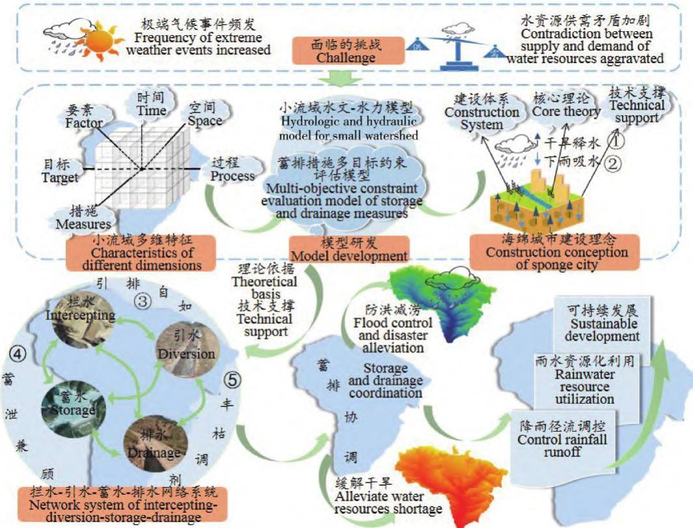

# 小流域水保蓄排措施布局研究综述

陈玉兰1，2，3，韩剑桥1，2，3，4，焦菊英1，2，3，4†，徐 倩4，陈同德4，李建军4，王 楠1，2，白雷超4( 1． 中国科学院教育部水土保持与生态环境研究中心，712100，陕西杨凌;

2． 中国科学院 水利部 水土保持研究所 黄土高原土壤侵蚀与旱地农业国家重点实验室，712100，陕西杨凌;3． 中国科学院大学，100049，北京;4． 西北农林科技大学水土保持研究所，712100，陕西杨凌)

摘要: 在全球气候变化的影响下极端气候事件呈现多发态势，导致流域水旱灾害频发 水资源匮乏，且随着人口和经济的持续增长，用水大幅度增加，水资源污染严重，水资源供需矛盾加剧 如何实现小流域雨水蓄排协调以缓解水资源短缺和减轻暴雨洪水灾害，是目前亟待解决的科学和现实问题 笔者总结小流域现有蓄排措施的类型及其调控作用，梳理现有的蓄排措施布局方法和布局目标，发现目前的蓄排措施布局存在着“布局机理认识与模型模拟量化不足” “蓄排不协调、过程分离和末端治理并存”等问题; 同时，也面临着水资源供需矛盾加剧和极端气候事件频发等挑战。 鉴于此，蓄排措施布局需立足于水资源供需矛盾和极端气候条件事件下的水循环过程，建立小流域水文 水力模型和蓄排措施多目标约束评估模型，为构建拦水 引水 蓄水 排水网络系统提供技术支撑，进而缓解水资源短缺，减轻暴雨洪水灾害，提高流域对全球气候变化和人为活动双重胁迫下的应变能力

关键词: 蓄排措施; 布局; 极端气候事件; 水资源; 洪水

中图分类号: TV122; S157. 2 文DOI: 10． 16843 /j． sswc． 2023． 02． 016

献标志码: A

文章编号: 2096-2673( 2023) 02-0132-12

# A review on the layouts of rainwater storage and drainage measures in small watersheds

CHEN Yulan1，2，3，HAN Jianqiao1，2，3，4，JIAO Juying1，2，3，4，XU Qian4，CHEN Tongde4， LI Jianjun4，WANG Nan1，2，BAI Leichao

( 1． The Research Center of Soil and Water Conservation and Ecological Environment，Chinese Academy of Sciences and Ministry of Education，   
712100，Yangling，Shaanxi，China; 2． State Key Laboratory of Soil Erosion and Dryland Farming on the Loess Plateau，Institute of Soil and Water Conservation，Chinese Academ of Sciences and Ministr of Water Resources，712100，Yan lin ，Shaanxi，China;   
3． University of Chinese Academy of Sciences，100049，Beijing，China;

4． Institute of Soil and Water Conservation，Northwest A＆F University，712100，Yangling，Shaanxi，China)

Abstract: ［Background］Due to the impact of global climate change，the frequency of extreme weather events increased，leading to flood and drought disaster frequently occurred and water shortage． With the growth of population and economy，water consumption increases greatly and water pollution is serious， which aggravated the contradiction between supply and demand of water resources． How to coordinate rainwater storage and drainage in a small watershed for alleviating water resource shortage and flood

disaster is a scientific and ractical issue to be solved ur entl ． ［Methods］ We collected all relevant literatures with the keywords of “storage and drainage measures ” and “rainwater resource utilization ” ， which come from CNKI，ScienceDirect，Springer and others． Based on those literatures at home and abroad，this paper summarized the types and regulating effects of existing storage and drainage measures in small watershed． This paper also sorted the methods and objectives in existing layout of storage and drainage measures，and analyzed their shortcomings and challenges． ［Results］1) Storage and drainage measures can be divided into intercepting，diversion，storage and drainage measures，which have different ways and effects on runoff regulation． It is necessary to optimize the layout of storage and drainage measures in order to effectively control rainfall runoff，achieve rainwater resource utilization and sustainable development in a small watershed． 2) The existing layout methods of storage and discharge measures mainly include experiential layout，multi-criteria decision making，machine learning and mode simulation． However，in addition to empirical layout，other layout methods mostly focused on the optima layout of intercepting and storage measures，and there was a lack of research on the optimal layout of diversion and drainage measures． 3) At present，there are some problems in the layout of storage and drainage measures，such as “insufficient cognition of layout mechanism and quantification of mode simulation” “emphasizing storage and neglecting drainage，process separation and terminal treatment coexist ”． At the same time，it is faced with challenges of intensified contradiction between water supply and demand and the frequent occurrence of extreme climate events． ［Conclusions］Therefore，the layout of storage and discharge measures should be based on the water cycle process under the contradiction between water supply and demand and extreme climatic events，and the characteristics of different dimensions such as time，space，process，factors and measures． Then the hydrologic and hydraulic mode of small watershed and multi-objective constraint evaluation model of storage and drainage measures are established to provide technical support for constructing the network system of intercepting-diversion- storage-drainage． In this way，the effects of storage and drainage measures on the accumulation，storage， dispersion，and utilization of runoff can be realized，and the purpose of storage and drainage coordination and rainwater resources can be achieved． Finally，water resources shortage and rainstorm flood disaster will be alleviated，so as to improve the watershed's ability to cope with global climate change and human activities and promote the sustainable development of society，economy and ecology in small watershed．

Keywords: storage and drainage measures; layout; extreme weather event; water resource; flood

淡水对人类生存和公共健康至关重要。 随着气候变化以及人口的持续增长，水资源日益短缺［1］，必须谨慎管理有限水资源的质量，以有效地开发可持续和可消耗的水。 降雨是淡水的潜在来源，但在强降雨期间易形成地表径流，导致地球陆地表土产生位移和搬运，引发洪水灾害，加之在气候变暖的影响下极端降雨事件可能会更加频发，加剧了洪水风险［2］。 洪水灾害对自然和人类生态系统产生巨大的影响，造成农业、生命、财产、居住区、水资源和自然栖息地的巨大的破坏［3］，已被广泛认为是世界上对生命最具威胁和代价最昂贵的自然灾害之一［4］。可见，降雨径流具有双重性，既是致灾的源动力，又是解决干旱缺水问题的物质资源［5］。 如何将潜在致灾源动力的降雨径流变成解决干旱缺水的水资源，是水旱灾害治理的难点和重点［6］。

小流域通常是指二 三级支流以下以分水岭和下游河道出口断面为界集水面积不超过50 km2的自然汇水区域 作为一个天然集水区，它既是水土流失的基本单元 水源涵养的地理单元，又是水源保护的管理单元［7 8］。 研究表明，以小流域为单元，合理布局蓄排措施，可在突出治理重点、克服治理分散弊端的同时，实现对降雨径流的调控作用，进而提高区域抵御洪水灾害风险能力和解决干旱缺水问题［9 11］。 但分析国内外的水旱灾害可知，蓄排措施布局缺乏协调性是水旱灾害治理长期面临的主要问题，加剧了水灾旱灾风险［12 13］，尤其近年来极端气候事件越来越频繁［14］，使如何实现小流域雨水蓄排协调以缓解水资源短缺和减轻暴雨洪水灾害，成为目前亟待解决的科学和现实问题 为此，笔者在总结不同蓄排措施类型调控作用的基础上，梳理国内外蓄排措施布局优化方法，阐述蓄排措施布局科学目标，同时，剖析蓄排措施布局中的不足和挑战，提出未来流域蓄排措施布局优化方向，以期为应对全球气候变化 防洪减灾 推动流域生态保护和高质量发展提供参考。

## 1 蓄排措施类型与作用

蓄排措施通过调控降雨地表径流，影响水资源的再分配，进而发挥土壤保持、 防洪减涝等的作用［8 9］。 依据对径流调控方式的不同，可分为拦水、引水 蓄水和排水措施

## 1. 1 拦水措施

拦水措施是指将分散的径流拦挡并汇集的措施，常见的主要有鱼鳞坑、 梯田、 淤地坝及林草等措施［15］。

鱼鳞坑是在坡面呈 “品”字形排列的半圆形坑穴，起到拦蓄径流 沉积泥沙和增加降雨入渗的作用，可为植被创造良好生存条件［16］。 其拦蓄调控效益与措施形态完整度 修建年限 降雨量和雨强等有关，在强降雨下会导致鱼鳞坑毁坏而失去拦蓄功能，并加剧土壤侵蚀［16］。

梯田是在丘陵或山坡地上修筑的台阶状田地，由于改变了径流形成条件，延长入渗时间，避免坡面径流在下坡位的叠加汇集和冲刷，实现了蓄水保土的目的［8，17］。 在不同降雨量和雨强下，梯田的减流减沙效益存在差异［18］，黄土高原多地的监测资料表明，梯田措施在质量完好的情况下，次雨量在100 ～200 mm 之间的降雨几乎可以完全被拦蓄［19］，但在特大暴雨下易出现田埂损坏和边坡失稳现象［13］另外，与梯田调控机理类似的水平阶，是沿坡面等高线修成的台阶状台面，其蓄水效益主要受台面宽度、间距和坡度等因子影响［20］; 而截水沟可分为水平沟 沿山沟 拦山沟，山圳及梯田内的边沟 背沟等，均可通过改变地形，拦蓄降水，减轻地表径流，增加土壤渗透和蓄水性能［21］。

淤地坝是指在沟道中修建的以控制沟道侵蚀拦泥淤地 减少洪水和泥沙灾害为主要目的沟道治理工程设施［9］。 对于历时较长，雨强较小的降雨，淤地坝对径流的削减量为 100%; 在暴雨期间，淤地坝减少 60% 的径流［22］。 同时，坝地中积累的雨水和洪水资源可以增加干旱地区的水资源［23］，缓解部分水资源危机。 但淤地坝只能抵御一定程度的洪水，超过防洪标准的洪水容易造成溃坝，且随着运行时间延长，溃坝风险增加。 谷坊、拦砂坝等沟道拦挡建筑物，也具有滞洪削峰、减轻山洪灾害的作用［21］。

林草措施的冠层和枯枝落叶层可减缓径流流速，促使水分入渗，根系固结土壤，改善土壤质量，增加土壤入渗量，在一定程度上具有消减流域河道洪峰、增加枯水期径流等作用，进而达到降低洪水灾害和充分利用雨水资源的目的［24］。 合理的林草配置可有效栏截降雨和地表径流，即使在特大暴雨条件下也能削峰滞洪，有效降低洪水灾害［18］。 但是在干旱和半干旱地区，过度的植被种植，不合理的选种和配置模式，会大量消耗深层土壤水分，造成土壤干燥化，并导致地表水与地下水联系中断 土壤深层储水减少，进而形成土壤干层［25］。

## 1. 2 引水措施

引水措施将拦截的坡面径流引入蓄水池( 塘)蓄存或者耕地中，或者将水源地的水引到需水地进行利用［15］。 主要有引水渠和引洪漫地等措施。

引水渠是调控地表径流的重要渠道之一，也是梯田 水库 蓄水池等拦蓄工程和灌溉工程的重要组成部分［26］。 引水效率主要受洪水量、坡面坡度和渠道宽度等因子影响［26］。 在特大暴雨或者渠道设计不合理等条件下，引水渠容易出现毁坏，可通过水力模型确定引水渠的结构特征，保证引水渠的运行安全［27］。

引洪漫地是指引用坡面、道路、沟壑与河流的洪水淤漫耕地或荒滩的工程措施，以达到集流抗旱、改良土壤、控制水土流失的效果［20］。

## 1. 3 蓄水措施

蓄水措施将拦截、引导的分散水及坡面径流集中储存并用于灌溉或人畜饮用［20］。 常见的有垄沟集雨系统、水窑和水库等措施。

垄沟集雨系统采用田间沟垄相间集雨和覆盖等技术，防止水土流失，提高作物产量和水分利用效率，但对径流的调控能力不仅受覆盖材料 垄沟比种植作物和垄高等因素影响，也受降雨量的影响［28］。 垄沟覆膜系统能将 ＜5 mm 的无效降雨转化为有效降雨并贮存于土壤中，但超过径流调节的临界降雨量，调控能力降低，甚至会损坏垄沟集雨系统［29］。

水窑是修建于地面以下并具有一定容积的蓄水建筑物，由水源 水管 管道 沉沙 过滤 窑提等构成，主要用于拦蓄雨水和地表径流，以供给人畜引水和灌溉旱地［20］。 蓄水池是通过拦截地表径流来满足人蓄用水和农业灌溉的一种蓄水措施［21］。 另外，堰塘是山区或丘陵地区修筑的一种小型蓄水塘，堰塘群和冲田( 水田) 共同构成“堰塘冲田系统”，可有效地综合解决雨水蓄滞和雨洪安全的难题［30］。

水库是指在山沟或河流的狭口处，以拦洪蓄水和调节水流为目的而修建的水利工程建筑物，通过拦洪蓄水，达到削峰滞洪和蓄丰补枯的目的，进而提高区域抗旱减灾的能力［31］。 水库蓄水能力受下游用水、上游来水和工程安全等因素影响［32］。 随着水库的长期运用，会陆续出现各种问题，如堤坡渗透严重、放水建筑物老化及建筑物强度不够等问题，不仅影响水库蓄水能力和防洪效益，也威胁着周边人民生命财产安全

## 1. 4 排水措施

排水措施是指将降雨径流排放到沟道和下游河流防止造成冲刷，或者将蓄存的余水集中利用，如灌溉、人蓄用水等［15］。 主要有排水沟/渠等措施。

排水沟/渠是用于排水泄洪或灌溉的过水通道，可改变流域水流梯度 水文连通性和水系格局，导致输水路径发生变化，进而促进了降水径流的重新分配，使整个流域对降水事件的响应更加迅速，减少洪灾的发生［33］。 排水沟/渠在防汛排涝的同时，也改善了生态环境和提高粮食产量，但在强降雨等条件下，土质排水沟/渠边坡的抗剪强度减弱，容易发生坍塌［34］，为确保排水沟/渠的正常运行，需及时修复和维护。

## 2 蓄排措施的布局方法

合理的蓄排措施布局，可有效增加雨水资源的利用率，解决水资源短缺和洪涝灾害等问题; 反之，不仅毁坏蓄排措施，还会进一步加剧水土流失，引发洪水灾害。 因此，利用科学合理的方法确定蓄排措施的布局是实现暴雨洪水灾害蓄排协调的关键。 目前，蓄排措施布局和优化主要的方法有经验知识 多准则决策、机器学习和模型模拟等方法。

## 2. 1 经验知识

早在20 世纪50 年代就开始了依据经验来确定蓄排措施的位置 类型及其组合 陈思章［35］ 提出“从坡面到沟底层层防设，做到蓄排结合”的布局理念;郭廷辅等［36］提出 “径流调控体系”，即以降雨径流调控作为指导思想，把各项径流调控工程进行优化组装，达到减轻水土流失和雨水资源化的目的;欧阳梦群［37］建议以流域为单元，充分考虑流域内气候、水文和地形地貌等特征，统一布局蓄排措施，分段治理，尽可能地就地拦截或处理。 考虑到水资源和水污染等问题，生态清洁小流域的理念得以提出，即将研究区分为生态治理区 生态保护区和生态修复区，依据分区特征进行治理［38］; 王秀英等［11］提出流域自上而下遵循 “源头蓄 渗，过程疏 滞，末端排 调”相结合的策略，确定海绵工程 排水工程和调蓄工程等措施的布局，以实现防洪排涝安全和雨水资源利用等综合目标。 为了协调生态保护和经济发展的关系，王丽贤［39］在流域布局理念的基础上，增加可持续发展原则对蓄排措施进行布局优化，以提高生态资源的利用效率。

## 2. 2 多准则决策

多准则决策是指在具有相互冲突 不可共度的有限( 无限) 方案集中进行选择的决策，可以管理多目标和多准则问题［40］。 采用多准则决策整合气候水文、地形地貌、土壤、土地利用和需水量等影响图层，有助于勾勒出拦蓄措施( 蓄水措施和拦水措施)的潜在位置，进而依据不同拦蓄措施的调控机理，构建位置约束集，以确定拦蓄措施的类型［41］。 近年来，已有多种多准则决策应用在塘坝、蓄水池和水窖等措施布局和优化中，包括加权叠加法、层次分析法 模糊 层次分析法 等序法 逆方差法 TOPSIS法 置信信念函数和因子交互法等［40 43］，其中，层次分析法因具有结构简单 所需定量信息较少等特点而应用最为广泛，而敏感性分析发现，因子交互法和等序法优于层次分析法［40］。 在模拟精准度方面，TOPSIS 方法和置信信念函数更加适合于拦蓄措施布局［42 43］。 虽然多准则决策在拦蓄措施布局中具有一定的优势，但在部分多准则决策中每个图层对布局的影响程度都是通过布局理论进行量化的，其结果信服度还有待进一步提高。

随着计算机运算速度的提高和空间信息科学的发展，分布式水文模型与多准则决策进行融合，广泛应用于拦蓄措施布局中，即选取能客观反映土壤类型、土地利用方式及前期土壤含水量等影响降雨径流的水文模型，来预估径流潜力或者雨洪资源量［44］，并结合坡度、流域形态参数及社会经济等主题层，运用遥感、地理信息系统技术和多准则决策等手段，确定拦蓄措施的空间布局［45］ 常用的分布式水文模型有 SCS CN 模型［44］、 WetSpa 模型［45］ 和HEC HMS 模型［46］等。 目前，有学者将 HEC HMS模型和 WetSpa 模型与层次分析法结合，确定屋顶蓄水池和池塘的潜在位置［46 47］; 也有学者将 SCS CN模型融入简单叠加、层次分析法等方法中，确定了淤地坝、池塘和蓄水池等措施的潜在位置［44，47］。 采用分布式水文模型和多准则决策相结合的方法，在一定程度上可增加预测结果的可信度。

## 2. 3 机器学习

机器学习是指运用大量的统计学原理来求解最优化问题的步骤和过程［48］。 有研究［49］发现在模拟精度和分析效率等方面，机器学习优于多准则决策方法。 随机森林、增强回归树、梯度提升树、支持向量机、多元自适应回归样条和混合判别分析等机器学习被引入水库和淤地坝等措施布局研究［48 50］。通过构建影响拦蓄措施布局的因子集，将因子集输入给机器学习算法，算法根据输入的数据生成最优模型，输出拦蓄措施布局的适应性图，确定拦蓄措施的布局［50］。 机器学习在水库和淤地坝布局中的预测精度可达80%以上，其中随机森林的预测优于其他机器学习，其次是支持向量法和多元自适应回归样条［48，50］。 然而，机器学习预测结果的正确性是建立在现有措施布局的合理性上［50］，同时机器学习是黑箱模型，难以发现拦蓄措施布局的机制。

## 2. 4 模型模拟

相关的水文模型也被应用在拦蓄措施布局中，利用水文模型模拟不同拦蓄措施配置下的水沙效应，分析不同拦蓄措施布局下的减流减沙效益，进而确定最优的拦蓄措施布局［51］。 常见模型有 SWAT模型 CA Markov 模型 WaTEM/SEDEM 模型和 In-HM 模型等。 SWAT 模型和 CA Markov 模型分别被用于优化梯田和林草措施的布局中［51 52］; Wa-TEM/SEDEM 模型和 InHM 模型被用于模拟不同坝系布局下的淤地坝拦沙效率，进而确定最优的坝系布局［53 54］; Quinonero 等［55］利用 WaTEM /SEDEM 模型模拟不同土地利用和淤地坝分布格局下的土壤侵蚀量，结果表明优化土地利用和淤地坝分布格局对控制流域水土流失至关重要。 利用水文模型实现拦蓄措施布局和优化，有利于实现雨洪资源利用和防洪减灾等效益的最大化。

在以往的蓄排措施布局和优化方法中，经验布局提供了总体布局思路和关键目标，但其布局技术体系和实践运用缺乏，而其余布局方法多集中在拦蓄措施的布局中，引排措施( 引水措施和排水措施)的布设鲜有研究。 引排措施是缓解水资源短缺和减轻暴雨洪水灾害的关键措施，可通过改变输水路径，优化流域水文连通性，使整个流域对降水事件的响应更加迅速，减少洪灾的发生，同时引排措施也可以促进降水径流的重新分配，实现水资源的均衡分配，进而缓解水资源短缺［26，33］ 鉴于此，未来还需考虑引排措施对降水径流的调控作用，构建健全的拦水引水 蓄水 排水网络系统。

## 3 蓄排措施布局的目标

长期以来，学者在如何合理布局蓄排措施以实现降雨径流调控、雨水资源化利用，最终达到区域可持续发展目标开展了大量的研究工作。

## 3. 1 降雨径流调控

以往对于水土流失的研究，是以土壤侵蚀与产沙量为主要研究内容，并重点考察土壤侵蚀过程，而对于水的流失则相对研究较少［56］。 随着对水土流失规律认识的不断深入和水土保持实践经验的不断总结，认识到控制水土流失的关键是科学调控坡面径流，进而提出了径流调控理论，就是科学调控和合理利用坡面径流，按照坡面径流的来源 数量和运行规律，因地制宜地布设径流聚集和分散的调配措施，形成一个完整的径流聚散工程体系，在不同降雨条件下，有序地聚集和分散坡面径流，削弱导致水土流失的原动力，达到控制水土流失和保护水土资源的目标［36］。 降雨径流调控强调从时间和空间 2 方面对坡面降雨径流进行科学聚集与分散，从而实现坡面降雨径流拦截 存贮与利用的统一，同步缓解水土流失与干旱缺水问题，但如何协调和解决各单项措施的科学组装、优化结构比例和对位配置，是降雨径流优化调控需要重点研究的关键问题［57］。

## 3. 2 雨水资源化利用

雨水资源化利用是指通过自然途径和人工措施对降雨径流消蚀降能，强化入渗、聚集、存储和运输，使雨水资源的分配方式和转化途径改变而产生社会经济效益和环境生态效益的过程［5］。 雨水资源化利用也可以起到消除水土流失的原动力，达到控制水土流失和保护水土资源的目标，同时，也可以缓解水资源短缺与解决水污染等问题

以雨水资源化利用为主要目标，已构建了生态清洁型小流域、生态海绵型流域［11，38］。 其中，生态清洁型小流域是以水源地保护为核心、以面源污染控制为重点，通过合理布设坡改梯工程 坡面水系工程( 拦 引 蓄 灌 排) 生态护岸工程和溪沟清理工程等，解决农业面源污染防控难题和提高了山区防洪减灾能力［38］。 生态海绵型流域是以流域水循环过程为主线，系统布局地表灰色基础设施与绿色基础设施，建设土壤水和地下水水库，实现地表 土壤 地下多过程、水量 水质 泥沙 水生态的联合调控，系统解决流域水污染，洪水灾害等问题［11］。 生态清洁型小流域和生态海绵型流域为目前的小流域治理提供了总体建设思路和关键任务，但需进一步构建其理论与技术体系，并在实践中进一步检验完善。

雨水资源化利用在城市建设中形成了丰富的模式，主要有澳大利亚的水敏感城市、美国的低影响开发 英国的可持续排水系统和中国的海绵城市等［7，58］。 其中，“海绵城市”是以控制雨洪风险及雨水综合利用为核心，遵循生态优先的原则，结合自然途径和人工措施，包括径流源头控制的透水铺装地面、雨水渗透池、雨水花园、雨水滞蓄池、绿色屋顶和植被浅沟等措施，增加城市绿色雨水设施，减少不透水铺装等灰色/黑色设施，补充地表水及地下水，净化初期雨水，保证城市能够像海绵一样，在适应环境变化和应对自然灾害等方面具有良好的 “弹性”，即下雨时吸水 蓄水 渗水 净水，需要时将蓄存的水释放并加以利用［58］。 海绵城市在防洪减涝、缓解水资源短缺中已具有较为成熟的理论和实践经验，其建设理念可为小流域暴雨洪水蓄排协调提供基础支撑，对发挥降雨径流源头调控 实现暴雨洪水蓄排协调具有重要意义。

## 3. 3 可持续发展

可持续发展是指秉承 “经济、社会发展与资源、环境协调统一”的原则，合理布局蓄排措施，建立地表 土壤 地下多过程立体化调控机制，平衡由自然主循环系统的“降水 坡面 河道 地下”和社会侧支循环系统的 “取水 供水 用水 排水”的 2 个过程，防止二者之间相互作用的物质、能量、信息传输与交换所带来的干旱、洪涝、生态破坏等过程发生［59］，最大限度实现水资源时空均衡分配，强化水源涵养功能，从而有效地防治水土流失，调节区域气候，促进社会 经济和生态高质量 可持续发展［38］。 可持续发展主要着眼于小流域社会经济发展和自然环境特征，强调了流域生态文明建设与人水和谐发展，为蓄排措施布局提供了总体指导与依据。 例如，依据“平衡蓄水量和灌溉需求”的可持续发展原则，可确定水库和灌溉区的位置［40］;针对小流域当前存在的水污染以及水土流失等问题，秉承经济与生态可持续发展原则，可构建小流域蓄排措施布局体系［39］。

## 4 蓄排措施布局中存在的不足和挑战

## 4. 1 布局机理认识与模拟量化不足

蓄排措施布局涉及措施、时间、 空间、 要素过程以及目标等多个维度，在措施维上，主要表现在不同措施类型及其组合的调控效果不同; 时间维上，强调措施的使用寿命和措施在不同时间段的调控能力; 空间维是指不同措施的布设位置; 要素维侧重于经济发展和环境变化特征等要素对措施调控效果的影响; 过程维主要体现在降雨产汇流过程、水循环过程及其伴生过程，目标维是指蓄排措施布局利用多目标进行约束。 这些不同的维度之间相互作用、关联耦合、动态反馈，组成一个复杂的系统，致使不同的措施类型、数量及其空间分布的组合配置模式蓄排调控效果具有差异性，且同一模式在不同下垫面特征的流域效果也不同。因此，科学认识这一复杂系统的机理，是蓄排措施布局达到协调的基础和前提 但是由于布局机理过于复杂，目前的蓄排措施布局方法均未考虑多维度交织在一起所带来的互作效应。 如，多准则决策方法通过整合环境因子影响图层以勾勒出拦蓄措施的潜在位置［41］，但拦蓄措施调控地表径流的能力不清楚，导致布局方法落地后存在着极大的不确定性和水沙调控能力不足等问题，致使流域难以抵御暴雨下的洪水灾害［60］; 同时，由于机理过于复杂和认识不足，现有的模型参数无法很好量化，导致多数模型只能模拟单一蓄排措施配置下的水沙效应［51］。 鉴于此，未来还需要综合考虑时间、空间、过程、要素、措施等不同维度特征，研发适宜的小流域水文 水力模型和蓄排措施多目标约束评估模型，提高不确定条件下机理认知与量化模拟的可靠性，以提升小流域水沙调控能力。

## 4.2 蓄排不协调、过程分离和末端治理并存

以往的蓄排措施布局优化方法多集中在拦蓄措施的布局上，对引排措施布局缺乏，例如多准则决策方法 机器学习和模型模拟均只对梯田 淤地坝和水库等拦蓄措施进行布局，忽视了引排措施对降水径流重新分配的促进作用［44，50 51］。 在部分干旱区的实际布局中，出现了 “重蓄轻排”的现象，主要表现为梯田 道路 坡面等径流汇集处无引排措施，且在沟道中修建的水库和淤地坝等拦蓄措施，排水不畅，致使小流域洪水连通性差，最终导致庄稼被淹埋，排水建筑物及坝体被冲毁，甚至淹没下游村庄 城镇，危及人民生命财产安全［13，23］。 但在湿润区则主要存在“重排轻蓄”的现象，导致雨水资源流失，当遭遇干旱事件时，抗旱水量不足，难以缓解干旱［11，61］。蓄排措施布局缺乏协调性是水旱灾害治理长期面临的主要问题。

蓄排措施布局存在坡面和河道措施未能有机衔接以及洪水和干旱分开治理等过程分离问题。 坡面河道与大气 地表 土壤 地下过程构成了天然水循环的有机整体。 但在实际布局中，以调控坡面水沙过程为核心的坡面措施与以调节河流汇水过程为核心的河道措施在布置上也未能有机衔接，导致部分河道工程的设计功能得不到充分发挥［60］ 同时，洪水和干旱是同一水文循环的 2 个极端，旱涝灾害并存也逐渐趋于常态化［61］，但在以往的洪水治理和干旱治理中，洪水治理侧重于土地利用和城市规划，而干旱治理侧重于供水和农业［62］，加之洪水和干旱过程及其伴生过程是一个复杂动态的大系统，在一定程度上致使措施布局多是针对单一灾害而构建，当遭遇旱涝急转事件时，流域对降水事件的响应迟钝，加剧了洪灾灾害［63］。

同时，以往的蓄排措施布局也忽视了源头调控的重要性，存在 “末端治理”的弊端。 在洪水治理中，多依托水库和河道防洪工程等进行河道汇流演进过程的调控，而对于从坡面到河道的层层削减等工程措施较少，未能充分发挥流域对暴雨产流过程的综合调节能力，属空间上的 “末端治理”; 在干旱治理中，往往是出现 “旱象”之后才采取应对措施，但由于未能通过有效的长序列调算，合理预留抗旱水量，流域难以有效应对干旱，属于时间上的 “末端应对 ”［60］ 。

蓄排不协调 过程分离和末端治理并存，致使流域对水资源调配和水沙过程的调节性能力不足，进一步导致在暴雨过程中难以最大限度减缓洪水灾害。 尽可能在暴雨落区进行原位调控暴雨径流，实现“源头蓄 渗”，并在 “源头蓄 渗”的基础上，自上而下遵循 “过程疏、滞，末端排、调”相结合的策略，可最大限度实现防洪抗旱。

## 4. 3 水资源供需矛盾加剧

在气候变暖的影响下极端气候事件呈现多发态势，导致干旱面积 频率和程度等在全球范围内不断增加［14］，使水资源日益匮乏; 且随着人口和经济的持续增长，用水需求大幅增加; 同时水污染、水环境恶化和水土流失等问题日益严重，加剧了水资源供需矛盾［1］。 如，在水资源匮乏的黄土高原地区，水资源开发利用已达到80% ，导致天然水循环过程被人工水循环过程大幅取代，引发流域生态环境系统与社会系统之间用水矛盾突出［60］; 且随着黄土高原在保障国家粮食安全中的作用逐渐凸显，灌溉面积和相应的灌溉水量难以大幅压缩，随着城镇人口增加，生活水平提升，该区生活需水仍将保持增长态势，工业化进程的发展也使流域工业需水逐渐达到峰值，加剧了水资源供需矛盾［64］; 加之黄土高原大规模植被建设，导致蒸散耗水上升，也造成土壤水分的过度消耗，出现以过度消耗深层土壤水分为代价的生态问题［25］;同时，受全球气候变暖的影响，黄土高原未来水资源量较基准期(1961—1990 年) 可能会略微偏少，水资源供需矛盾将进一步加剧［65］。 目前的蓄排措施布局模式是以历史某个时段的水生态与水环境状态为参照而构建，难以缓解目前水资源供需的矛盾。 同时，原有的蓄排措施布局模式在干旱期间也未能实现水资源的均衡分配，主要体现在水资源被上游区域拦截，在一定程度上加剧下游区域水资源供需矛盾。 构建合理的蓄排措施布局，统筹水土保持与高效旱作农业发展，在充分考虑节水的前提下，留足生态用水，合理分配生活、生产用水，以最大限度地实现蓄丰补枯和水资源均衡分配，进而在时间和空间尺度上，缓解水资源供需矛盾，是目前亟待解决的现实问题

## 4.4 极端气候事件频发，水旱灾害风险增大

在全球气候变化背景下，极端暴雨事件和干旱事件发生的强度和频率都在迅速增加。 但大多数蓄排措施布局优化由于没有立足于极端气候下的水循环过程，未能充分发挥流域对产流过程的综合调节能力，导致极端气候条件下的洪涝和旱灾等风险加大［61］。 例如，黄土高原榆林地区遭遇 2017 年 “7 ·26”极端暴雨条件时，从坡面 沟道到河道形成侵蚀洪水灾害链: 坡面因坡耕地占有较大的面积比例，加之多数坡面无截排水沟，地表径流造成坡耕地细沟广布，梯田严重破坏; 充当排水路径的道路路面，切割深度可达数米;淤地坝因排洪不畅，坝地庄稼被淹淤埋，放水建筑物及坝体甚至被冲毁，加剧水土流失和洪水灾害［13］ 在美国的加利福尼亚州，2014—2016 年干旱事件是该州 100 多年以来干旱最严重的一次，由于上游区水利基础设施系统和水资源法律法规健全等原因，受干旱影响较小; 相反，在下游区受旱灾影响较大［12］，主要表现为城市和灌溉用水短缺 地下水透支 河流流量极低，树木死亡率增加和野火风险增大等［62］; 然而干旱期在 2017 年 1 月和2 月被极端暴雨事件打破，并引发了大面积洪水灾害［63］。 因此，蓄排措施布局优化应立足于极端干旱和暴雨事件下的水循环过程，构建蓄泄兼顾 丰枯调剂、引排自如、多源互补的拦水 引水 蓄水 排水网络系统，以最大限度减轻极端暴雨条件下的洪涝灾害，并为干旱期提供足够的水资源。

综上所述，小流域蓄排措施布局存在着 “布局机理认识和模型模拟量化不足”与 “蓄排不协调 过程分离和末端治理并存”等问题，同时，也面临着水资源供需矛盾加剧，极端气候事件频发等挑战 因此，在气候变化和人为活动双重胁迫下，蓄排措施布局应该立足应对水资源供需矛盾及极端干旱和特大暴雨洪水事件，当雨水丰沛时，流域有足够的容量储存水资源而避免形成洪水灾害;当雨水短缺时，利用存储的水资源缓解用水紧张的局面，达到 “蓄排协调”，实现小流域的全新综合治理战略理念。 依据Meta-analysis 方法［7］定性分析，发现海绵城市建设中蓄排措施布局与小流域蓄排措施布局在基本概念 核心理论 建设体系 技术支撑等方面存在较多相似性，且海绵城市在防洪减涝 缓解水资源短缺中具有较为成熟的理论和实践经验，其建设理念可以作为小流域蓄排协调技术落地的基础支撑。 综上，笔者提出流域蓄排措施布局优化方向( 图 1) ，即基于海绵城市建设理念，依据流域地貌单元之间的汇水关系及水文连通性，研发适宜的小流域水文 水力模型和蓄排措施多目标约束评估模型，构建蓄泄兼顾 丰枯调剂 引排自如 多源互补的拦水 引水 蓄水 排水网络系统，对径流进行聚集 储存 分散 利用，从源头调控地表径流，达到蓄排协调和雨水资源化的目的，以促进流域社会、经济和生态可持续、高质量发展( 图1)

  
① Release water during drought ② Absorb water during rainfall ③ Unobstructed diversion and drainage ④ Juggle storage and drainage ⑤ Regulation of water during the wet and dry  
图1 小流域地表径流蓄排措施布局概念图  
Fig． 1 Concept diagram of layout of storage and drainage measures in small watershed

## 5 结论

1) 拦水、引水、蓄水和排水等蓄排措施对径流调控方式与效果不同，不同措施组合的效果差异较大，需要根据小流域自然社会禀赋和气候特点进行合理布局，才能有效调控降雨径流，达到雨水资源化高效利用，实现小流域的可持续发展目标。

2) 现有的经验布局 多准则决策方法 机器学习和模型模拟等蓄排措施布局方法，主要集中在拦蓄措施的布局上，对引排措施布局还需加强研究。

3) 目前的蓄排措施布局存在着 “布局机理认识与模型模拟量化不足”及 “蓄排不协调 过程分离和末端治理并存”等问题; 在水资源供需矛盾加剧、极端气候事件频发等背景下水土流失与干旱缺水的矛

盾更加放大。

4) 小流域蓄排措施布局需要立足于水资源供需矛盾和极端气候条件事件下的水循环过程，综合考虑流域时间、空间、过程、要素、措施等不同维度特征，研发适宜的小流域水文 水力模型和蓄排措施多目标约束评估模型，构建蓄泄兼顾 丰枯调剂 引排自如、多源互补的拦水 引水 蓄水 排水网络系统，达到缓解水资源短缺，减轻暴雨洪水灾害的目的，提高流域对全球气候变化和人为活动双重胁迫下的应变能力，促进流域社会 经济和生态可持续 高质量发展。

## 6 参考文献

［1］ WANG Xiaojun，ZHANG Jianyun，SHAHID S，et al． Adaptation to climate change impacts on water demand ［J］． Mitigation and Adaptation Strategies for Global Change，2016，21( 1) : 81．

［2］ SHAHID S，WANG Xiaojun，HARUN Bin Sobri，et al． Climate variability and changes in the major cities of Ban-gladesh: Observations，possible impacts and adaptation ［J］． Regional Environmental Change，2016，16 ( 2 ) : 459．

［3］ WU Qinglong，ZHAO Zhijun，LIU Li，et al． Response to comments on “Outburst flood at 1920 BCE supports histo- ricity of China's Great Flood and the Xia dynasty” ［J］． Science，2017，355( 6332) : 1382．

［4］ SAHARIA M，KIRSTETTER P E，VERGARA H，et al．Mapping flash flood severity in the United States［J］．Journal of Hydrometeorology，2017，18( 2) : 397．

［5］ 吴普特，高建恩． 黄土高原水土保持与雨水资源化［J］． 中国水土保持科学，2008，6( 1) : 107WU Pute，GAO Jian'en． Soil and water conservation andrainwater resource utilization in the Loess Plateau［J］．Science of Soil and Water Conservation，2008，6 ( 1 ) :107．

［6］ 严登华，王浩，周梦，等． 全球治水模式思辨与发展展望［J］． 水资源保护，2020，36( 3) : 1．YAN Denghua，WANG Hao，ZHOU Meng，et al． Scien-tific ideas and development prospects of global water man-agement modes［J］． Water Resources Protection，2020，36( 3) : 1．

［7］ 杨文婷． 基于水土保持小流域综合治理理论的海绵城市建设体系研究［D］． 广州: 华南理工大学，2020:10．YANG Wenting． Research into the construction system ofsponge city based on the theory of small watershed man-agement for soil and water conservation: A case study of

Pingshan district of Shenzhen［D］． Guangzhou: SouthChina University of Technology，2020: 10．

［8］ 刘震． 生态清洁小流域建设是我国小流域治理模式的创新［J］． 北京水务，2009 ( S2) : 7．LIU Zhen． The construction of ecologically clean smallwatershed is an innovation of small watershed governancemodel in China［J］． Beijing Water Affairs，2009 ( S2 ) :7．

［9］ BROWN A G，FALLU D，WALSH K，et al． Ending the Cinderella status of terraces and lynchets in Europe: The geomorphology of agricultural terraces and implications for ecosystem services and climate adaptation［J］． Geomor- phology，2021，379: 107579．

［10］ ABBASI N A，XU X，LUCAS-BORIJ M E，et al． The use of check dams in watershed management projects: Ex-amples from around the world［J］． Science of the Total Environment，2019，676: 683．

［11］ 王秀英，白音包力皋，崔巍，等． 基于生态海绵流域的防洪排涝体系研究: 以深圳市坪山河流域为例［J］．中国水利，2020( 22) : 34．WANG Xiuying，BAIYIN Baoligao，CUI Wei，et al．Study on flood control and drainage comprehensive systembased on eco-sponge watershed: A case study of the Ping-shan River Basin in Shenzhen city［J］． China Water Re-sources． 2020( 22) : 34．

［12］ STEWART I T，ROGERS J，GRAHAM A． Water securi- ty under severe drought and climate change: Disparate impacts of the recent severe drought on environmental flows and water su lies in central California［J］． Journal of Hydrology X，2020，7: 100054．

［13］ 王楠，陈一先，白雷超，等． 陕北子洲县“7 · 26”特大暴雨引发的小流域土壤侵蚀调查［J］． 水土保持通报，2017，37( 4) : 338．WANG Nan，CHEN Yixian，BAI Leichao，et al． Investi-gation on soil erosion in small watersheds under “7 · 26 ”extreme rainstorm in Zizhou county，northern Shaanxiprovince［J］． Bulletin of Soil and Water Conservation，2017，37( 4) : 338．

［14］ IPCC，2021: Climate Change 2021: The Physical Sci-ence Basis． Contribution of Working Group I to the SixthAssessment Report of the Intergovernmental Panel on Cli-mate Change［M］． Cambridge，UK: Cambridge Universi-ty Press，2021．

［15］ 张小峰． 小流域规划设计中水系，道路的布设［J］． 中国水土保持，2009( 8) : 61．ZHANG Xiaofeng． Layout of water system and road insmall watershed planning and design［J］． Soil and WaterConservation in China，2009( 8) : 61．

［16］ 吴淑芳，吴普特，宋维秀，等． 黄土坡面径流剥离土壤的水动力过程研究［J］． 土壤学报，2010，47( 2) :223．WU Shufang，WU Pute，SONG Weixiu，et al． Study onhydrodynamic process of runoff stripping soil on loesssloping surface ［J］． Acta Pedologica Sinica， 2010，47( 2) : 223．

［17］ VEECK G，LI Z． Terrace construction and productivityon loessal soils in Zhongyang county，Shanxi province［J］． Annals of the Association of American Geographers，2015，85( 3) : 450．

［18］ FU Suhua，YANG Yanfen，LIU Baoyuan，et al． Peak flow rate response to vegetation and terraces under ex- treme rainstorms［J］． Agriculture，Ecosystems ＆ Envi- ronment，2020，288: 106714．

［19］ 张元星． 流域水沙变化对水土保持梯田措施的响应研究［D］． 陕西杨凌: 西北农林科技大学，2014: 22．ZHANG Yuanxing． The research of watershed runoff andsediments variation toward to the soil and water conserva-tion terrace measure［D］． Yangling，Shaanxi: NorthwestA＆F University，2014: 22．

［20］ 刘宝元，刘瑛娜，张科利，等． 中国水土保持措施分类［J］． 水土保持学报，2013，27( 2) : 80．LIU Baoyuan，LIU Yingna，ZHANG Keli，et al． Classifi-cation for soil conservation practices in China［J］． Journalof Soil and Water Conservation，2013，27( 2) : 80．

［21］ 王秀茹． 水土保持工程学［M］． 北京: 中国林业出版社，2009: 13．WANG Xiuru． Soil and water conservation engineering［M］． Beijing: China Forestry Publishing House，2009:13．

［22］ POLYAKOV V O，NICHOLS M H，MCCLARAN M P，et al． Effect of check dams on runoff，sediment yield，and retention on small semiarid watersheds［J］． Journal of Soil and Water Conservation，2014，69( 5) : 414．

［23］ NORMAN L M，BRIKERHOFF F，GWILLIAM E，et al．Hydrologic response of streams restored with check damsin the Chiricahua Mountains，Arizona［J］． River Re-search and Applications，2016，32( 4) : 519．

［24］ ZHU T X． Effectiveness of conservation measures in re- ducing runoff and soil loss under different magnitude-fre- quency storms at plot and catchment scales in the semi-ar- id agricultural landscape ［J］． Environmental Manage- ment，2016，57( 3) : 671．

［25］ GAO Xiaodong，LI Hongchen，ZHAO Xining，et al． I- dentifying a suitable revegetation technique for soil resto- ration on water-limited and degraded land: Considering both deep soil moisture deficit and soil organic carbon se-

questration［J］． Geoderma，2018，319: 61．

［26］ ALOMARI N K，YUSUF B，MOHAMMAD T A，et al． Influence of diversion angle on water and sediment flow into diversion channel［J］． International Journal of Sedi- ment Research，2020，35( 6) : 600．

［27］ LAZARE K K，ALEXIS B L，YAO A B，et al． 1D-2Dhydraulic modeling of a diversion channel on the CavallyRiver in Zouan-Hounien，Cote d ＇Ivoire［J］． Journal ofWater Resource and Protection，2019，11( 8) : 1036．

［28］ 尹鑫卫，王琦，李晓玲，等． 半干旱区垄沟集雨系统点尺度土壤水分动态随机模拟［J］． 生态学报，2019，39( 1) : 13．YIN Xinwei，WANG Qi，LI Xiaolin，et al． Stochasticsimulation of soil moisture dynamics at a point scale in aridge-furrow rainwater harvesting system in a semiaridarea［J］． Acta Ecologica Sinica，2019，39( 1) : 13．

［29］ 任小龙，贾志宽，丁瑞霞，等． 我国旱区作物根域微集水种植技术研究进展及展望［J］． 干旱地区农业研究，2010，28( 3) : 83．REN Xiaolong，JIA Zhikuan，DING Ruixia，et al． Pro-gress and prospect of research on root-zone water micro-collecting farming for crop in arid region of China［J］．Agricultural Research in the Arid Areas，2010，28( 3) :83．

［30］ 戴芹芹，王志芳． 重庆堰塘—冲冲田系统对现代水资源管理的启示［J］． 中国水利，2015( 1) : 34．DAI Qinqin，WANG Zhifang． Modern water managementof pond-paddy field system in Chongqing［J］． China Wa-ter Resources，2015( 1) : 34．

［31］ 彭少明，王煜，张永永，等． 多年调节水库旱限水位优化控制研究［J］． 水利学报，2016，47( 4) : 552．PENG Shaoming，WANG Yu，ZHANG Yongyong，et al．Optimal control of drought limit water level for multi-yearregulating storage reservoir［J］． Journal of Hydraulic En-gineering，2016，47( 4) : 552．

［32］ 刘颖，梅亚东，王现勋，等． 水库蓄水问题研究进展［J］． 中国农村水利水电，2018( 1) : 111．LIU Ying，MEI Yadong，WANG Xianxun，et al． Re-search progress influencing factors and water storage ofreservoir impoundment［J］． China Rural Water and Hy-dropower，2018( 1) : 111．

［33］ KOZELOVA I，PULEROVA J，MIKLOSOVA V，et al． The role of artificial ditches and their buffer zones in in- tensively utilized agricultural landscape［J］． Environmen- tal Monitoring and Assessment，2020，192( 10) : 656．

［34］ 罗延峰． 盐渍农田典型排水沟边坡土壤特征及其与植被耦合关系研究［D］． 山东泰安: 山东农业大学，2020: 24．

LUO Yanfeng． Investigation of soil characteristics of the slope of typical drainage ditches in salted farmland and their coupling relationships with vegetation［D］． Tai' an， Shangdong: Shandong Agricultural University，2020: 24．

［35］ 陈思章． 川中丘陵地区一个水土保持田间蓄排工程的典型［J］． 中国水土保持，1988( 3) : 18．CHEN Sizheng． A typical example of a field storage anddrainage project for soil and water conservation in hilly ar-ea of central Sichuan［J］． Soil and Water Conservation inChina，1988( 3) : 18．

36］ 郭廷辅，段巧甫． 水土保持径流调控理论与实践［M］． 北京: 中国水利水电出版社，2004: 12．GUO Tingfu，DUAN Qiaofu． Theory and practice of run-off regulation of soil and water conservation ［M］． Bei-jing: China Water Power Press，2004: 12．

37］ 欧阳梦群． 小流域综合治理模式刍议［J］． 中国水土保持，2003( 3) : 37．OUYSNG Mengqun． A rustic opinion on comprehensivecontrol model in small watershed［J］． Soil and WaterConservation in China，2003( 3) : 37．

［38］ 毕小刚，杨进怀，李永贵，等． 北京市建设生态清洁型小流域的思路与实践［J］． 中国水土保持，2005( 1) : 18．BI Xiaogang， YANG Jinhuai， LI Yonggui， et al．Thoughts and practice of building ecological clean smallwatershed in Beijing［J］． Soil and Water Conservation inChina，2005( 1) : 18．

［39］ 王丽贤． 基于可持续发展原则下的小流域综合治理研究［J］． 绿色环保建材，2021( 2) : 195．WANG Lixian． Study on comprehensive management ofsmall watershed based on the principle of sustainable de-velopment［J］． Green Environmental Protection BuildingMaterials，2021( 2) : 195．

［40］ JAMALI I A，MOERTBERG U，BO O，et al． A spatialmulti-criteria analysis approach for locating suitable sitesfor construction of subsurface dams in northern Pakistan［J］． Water Resources Management，2014，28 ( 14 ) :5157．

［41］ TERENCIO D P，SANCHES F F，CORTES R M，et al． Rainwater harvesting in catchments for agro-forestry uses: A study focused on the balance between sustainability val- ues and storage capacity［J］． Science of the Total Envi- ronment，2018，613: 1079．

［42］ MOGAJI K A，OMOSUYI G O，ADELUSI A O，et al． Application of GIS-based evidential belief function model to regional groundwater recharge potential zones mapping in Hardrock Geologic Terrain［J］． Environmental Proces- ses，2016，3( 1) : 93．

［43］ JOZAGHI A，ALIZADEH B，HATAMI M，et al． A com- parative study of the AHP and TOPSIS techniques for dam site selection using GIS: A case study of Sistan and Balu- chestan province，Iran［J］． Geosciences，2018，8( 12) : 8120494．

［44］ RAJASEKHAR M，GADHIRAJU S R，KADAM A，et al． Identification of groundwater recharge-based potential rainwater harvesting sites for sustainable development of a semiarid region of southern India using geospatial，AHP， and SCS-CN approach［J］． Arabian Journal of Geosci- ences，2020，13( 11) : 297．

［45］ KARIMI H，ZEINIVAND H． Integrating runoff map of a spatially distributed model and thematic layers for identif- ying potential rainwater harvesting suitability sites using GIS techniques ［J］． Geocarto International， 2019， 36( 3) : 320．

［46］ AKTER A，AHMED S． Potentiality of rainwater harves-ting for an urban community in Bangladesh［J］． Journalof Hydrology，2015，528: 84．

［47］ NAPOLI M，CECCHI S，ORLANINI S，et al． Determi- ning potential rainwater harvesting sites using a continu- ous runoff potential accounting procedure and GIS tech- niques in central Italy［J］． Agricultural Water Manage- ment，2014，141: 55．

［48］ CHEN Wei，TSANGARATOS P，ILIA I，et al． Groundw- ater spring potential mapping using population-based evolu- tionary algorithms and data mining methods［J］． Science of the Total Environment，2019，684( SEP． 20) : 31．

［49］ Al-RUZOUQ R，SHANABLEH A，YILMAZ A G，et al．Dam site suitability mapping and analysis using an inte-grated GIS and machine learning approach［J］． Water，2019，11( 9) : 1880．

［50］ POERG H R，YOUSEFI S，SADHASIVAM N，et al． As- sessing，mapping，and optimizing the locations of sedi- ment control check dams construction［J］． Science of the Total Environment，2020，739: 139954．

［51］ BETRIE G D，MOHAMED Y A，VAN GRIENSVEN A，et al． Sediment management modelling in the Blue NileBasin using SWAT model［J］． Hydrology and Earth Sys-tem Sciences，2011，15( 3) : 807．

［52］ 潘欣． 基于 HEC － HMS 和 CA － Markov 的水土保持措施的水文响应研究［D］． 北京: 北京林业大学，2017:26．PAN Xin． Hydrology respond simulation of soil and waterconservation practice on basis of HEC － HMS and CA－Markov［D］． Beijing: Beijing Forestry University，2017:26．

［53］ PAL D，GALELLI S，TANG Honglei，et al． Toward im-

proved design of check dam systems: A case study in the Loess Plateau，China［J］． Journal of Hydrology，2018， 559: 762．

［54］ TANG Honglei，PAN Hailong，RAN Qihua． Impacts of filled check dams with different deployment strategies on the flood and sediment transport processes in a Loess Plat- eau Catchment［J］． Water，2020，12( 5) : 1319．

［55］ QUINONERO-RUBIO J M，BOIX-FAYOS C，NADEU E，et al． Evaluation of the effectiveness of forest restorationand check-dams to reduce catchment sediment yield［J］．Land Degradation and Development， 2014， 27( 4) :1018．

56］ 吴普特，汪有科，冯浩，等． 21 世纪中国水土保持科学的创新与发展［J］． 中国水土保持科学，2003，1( 2) : 84．WU Pute，WANG Youke，FENG Hao，et al． Innovationand development of soil and water conservation science ofChina in 21st century［J］． Science of Soil and WaterConservation，2003，1( 2) : 84．

［57］ 赵西宁，吴普特，黄俊，等． 黄土高原降雨径流调控利用应用基础研究评述［J］． 自然灾害学报，2015，24( 1) : 32．ZHAO Xining，WU Pute，HUANG Jun，et al． Review ofapplied basis research on regulation and utilization ofrainfall runoff in Loess Plateau of China［J］． Journal ofNatural Disasters，2015，24( 1) : 32

58］ 路琪儿，罗平平，虞望琦，等． ． 城市雨水资源化利用研究进展［J］． 水资源保护，2021，37( 06) : 80．LU Qi'er，LUO Pingping，YU Wangqi，et al． Researchprogress of urban rainwater resources utilization［J］． Wa-ter Resources Protection，2021，37( 6) : 80．

［59］ 褚俊英，王浩，周祖昊，等． 流域综合治理方案制定的基本理论及技术框架［J］． 水资源保护，2020，

36( 1) : 18． CHU Junying，WANG Hao，ZHOU Zuhao，et al． Basic theory and technical framework for formulation of integrat- ed watershed management plan［J］． Water Resources Protection，2020，36( 1) : 18．

60］ 王慧亮，秦天玲，严登华． 黄河流域水问题发展态势，症结及综合应对［J］． 人民黄河，2020，42( 9) : 107．WANG Huiliang，QIN Tianling，YAN Denghua． Devel-opment trend，crux and comprehensive response of waterissues in the Yellow River Basin ［J］． Yellow Rive，2020，42( 9) : 107．

［61］ WARD P J，RUITER M，MRD J，et al． The need to in-tegrate flood and drought disaster risk reduction strategies［J］． Water Security，2020，11( 6) : 100070．

［62］ RAIKES J，SMITH T F，JACOBSON C，et al． Pre-disas-ter planning and preparedness for floods and droughts: Asystematic review［J］． International Journal of DisasterRisk Reduction，2019，38: 1．

［63］ WANG S，YOON J H，BECKER E，et al． Californiafrom drought to deluge［J］． Nature Climate Change，2017，7( 7) : 465．

［64］ 王浩，赵勇． 新时期治黄方略初探［J］． 水利学报，2019，50( 11) : 1291．WANG Hao，ZHAO Yong． Preliminary study on harness-ing strategies for Yellow River in the new period［J］．Journal of Hydraulic Engineering，2019，50( 11) : 1291．

［65］ 王国庆，乔翠平，刘铭璐，等． 气候变化下黄河流域未来水资源趋势分析［J］． 水利水运工程学报，2020( 2) : 1．WANG Guoqing，QIAO Cuiping，LIU Minglu，et al． Thefuture water resources regime of the Yellow River basin inthe context of climate change［J］． Hydro-Science and En-gineering，2020( 2) : 1．