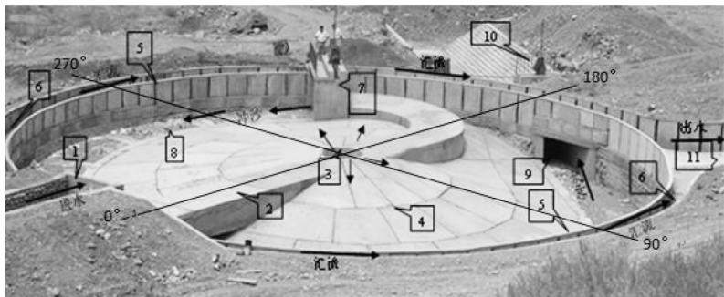
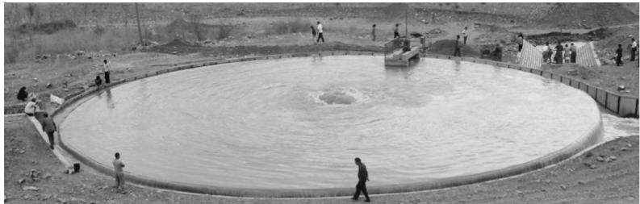
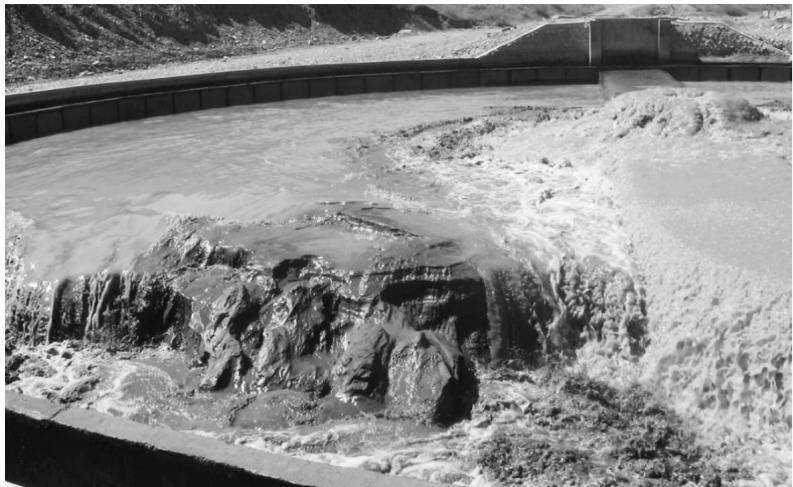
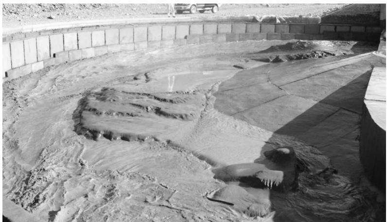
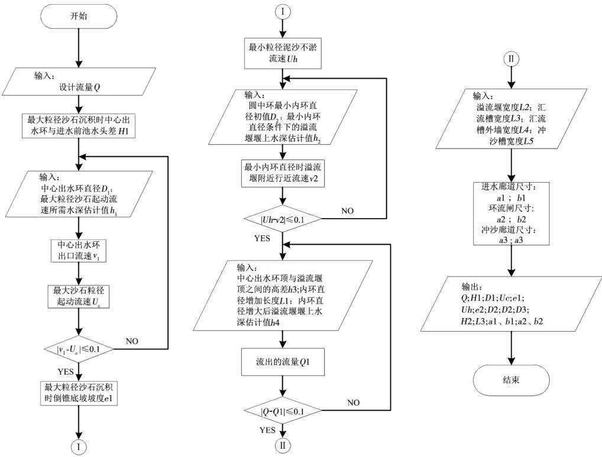
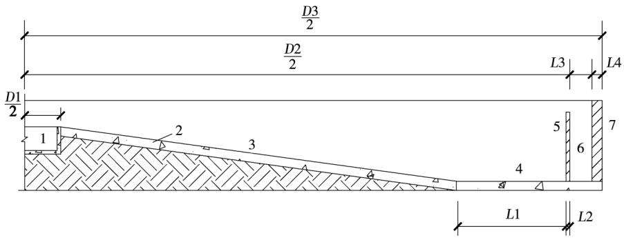
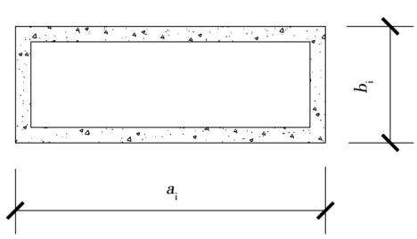
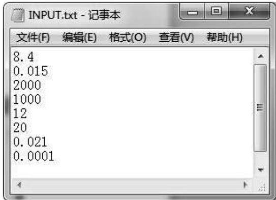
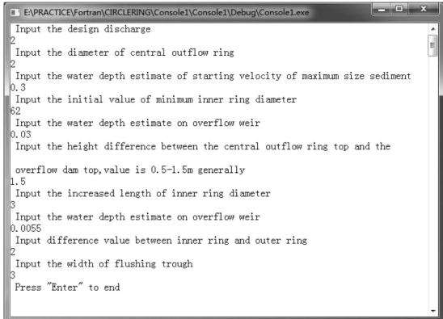
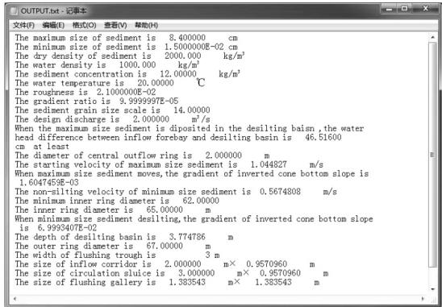

doi: 10.3969 /j. issn. 1006 –7175.2019.09.016

# 基于 Fortran的计算程序开发在圆中环沉沙排沙池结构设计中的应用

赵东宁，侍克斌，韩克武，石祥(新疆农业大学水利与土木工程学院，乌鲁木齐 830052)

摘要圆中环沉沙排沙池是一种新型的二级水沙分离设施，目前在对其进行结构设计的过程中，必须对泥沙粒径、含沙量、地形地质条件、流量等因素进行综合考虑后，通过手动计算的方式确定圆中环各结构的尺寸，包括平面尺寸(直径)、沉沙池深度、倒锥底坡坡度、冲沙槽宽度、进水廊道尺寸、冲沙廊道尺寸和闸内尺寸等。然而在圆中环结构设计计算过程中，涉及到的参数较多，应用到的计算公式多而复杂，如果采取手动计算的方式，不仅工作量大，工作效率较低，而且稍有不慎就会影响到计算结果的准确性。针对这一问题，以Fortran语言为基础编写的圆中环沉沙排沙池结构设计计算程序，可在圆中环沉沙排沙池结构设计过程中实现快速计算，不仅提高了工作效率，还能保证计算的准确率，为设计人员提供便利。

关键词 圆中环沉沙排沙池;结构设计;Fortran;计算程序

[中图分类号]TP39;TV673 文献标识码 A 文章编号] 1006 -7175(2019) 09 -0082 -07

# Application of Fortran Based on Computation Program in the Structural Design of Circular – Ring Sediment Desilting Basin

ZHAO Dong − ning, SHI Ke – bin, HAN Ke – wu, SHI Xiang ( College of Hydraulic and Civil Engineering, Xinjiang Agricultural University, Urumqi 830052, China)

Abstract: Circular – ring sediment desilting basin is a new type of secondary water – sediment separation facility , in the process of its structural design, it is necessary to take into account the factors such as sediment particle size, sediment content, topographic and geological conditions, discharge and so on. And the dimensions of structures in the circular – ring sediment desilting basin , including the plane size ( diameter) , the depth of the sediment basin , the slope of nverted cone bottom, the width of flushing trough , the size of inflow corridor, the size of flushing gallery , and gate size, are determined by manual calculation. However, in the design and calculation of the circular – ring

structure, there are many parameters involved, and many and complex calculation formulas are applied. If manual calculation is adopted, not only the workload is large and the work efficiency is low , but also a little carelessness will affect the accuracy of the calculation results. In order to solve this problem , the calculation program for the structure design of circular – ring sediment desilting basin, which is based on Fortran language, can realize fast calculation in the process of the structure design. It not only improves the working efficiency, but also ensures the accuracy of calculation , and provides convenience for designers.

Key words: circular – ring sediment desilting basin; structural design; Fortran; calculation program

## 0引言

圆中环沉沙排沙池(以下简称“圆中环”)作为一种新型的二级泥沙处理设施，具有截沙率高、排沙耗水率低、处理泥沙粒径范围大的特点，目前已在新疆多地得到应用。已建的圆中环自运行以来，沉沙排沙效果良好，而且在运行过程中管理也比较方便，还取得了比较好的经济效益，受到当地的好评。

目前，在圆中环的结构设计过程中，只能采取手动计算的方式，而且在计算过程当中需要进行多次试算，运用到的计算公式多而复杂，稍有不慎就会造成计算上的失误，降低计算结果准确性，影响结构设计进度。为了提高工作效率和计算精度，本文以Fortran作为开发平台，将圆中环结构设计过程当中运用到的计算过程融入到编写的程序当中，旨在为今后的圆中环结构设计提供便利，同时也有助于圆中环的推广。

## 1 “圆中环”简介

## 1.1 基本结构

以呼图壁河阿苇滩渠首圆中环为例，圆中环主要是由进水前池、进水廊道、中心出水环、环流闸、冲沙槽、冲沙廊道、冲沙闸、溢流堰、汇流槽和出水渠组成。其中，进水廊道首部连接进水前池，尾部连接环流闸，中心出水环堰位于其中间位置;倒锥底坡将中心出水环堰与冲沙槽相连接，环流闸和冲沙廊道分别位于冲沙槽首部和尾部，见图1。

  
1 - 进水前池;2 - 进水廊道; 3 - 中心出水环堰; 4 - 倒锥底坡; 5 - 溢流堰;  
6 - 汇流槽; 7 - 环流闸; 8 - 冲沙槽; 9 - 冲沙廊道; 10 - 冲沙闸; 11 - 出水渠  
图1 圆中环原型基本结构

## 1.2 工作原理

圆中环沉沙排沙池的运行过程主要是利用重力沉沙的原理，采取连续引水、间歇冲沙的作业方式，它的运行周期主要分为沉沙和排沙两个阶段。在沉沙阶段中，关闭环流闸及冲沙闸，携带泥沙的水流经进水前池进入有压的进水廊道，在压力的作用下携沙水流从中心出水环呈辐射状涌出进入圆中环；之后随着半径的增加，过水断面的面积不断加大，相应的挟沙水流流速变小,水流携沙力也随之降低，因此水流中携带的推移质泥沙和部分悬移质泥沙开始在倒锥底坡面上堆积，相对清水则经过溢流堰流出并通过汇流槽流入出水渠中，见图2。在排沙阶段中，首先打开冲沙闸，这时圆中环中的水位迅速下降，倒锥底坡上的大量淤积泥沙会随水流进入环形冲沙槽，同时冲沙槽中的部分泥沙通过冲沙廊道进入下游的河道中，见图3(a)。当倒锥底坡上的泥沙基本排净时再打开环流闸，此时环形水流将冲沙槽中的淤积泥沙完全通过冲沙廊道排出圆中环外的下游河道中，见图3(b)。至此圆中环一个沉沙排沙周期的运行结束，关闭冲沙闸和环流闸进入下一周期的运行。

图2 圆中环沉沙排沙池沉沙阶段  

（a）淤积泥沙随水流进入冲沙槽及下游河道  
  
（b）环形水流将淤积泥沙冲至下游河道  
图3 圆中环沉沙排沙池排沙阶段

## 1.3 手动计算的复杂性

在圆中环的结构设计过程当中，若采取手动计算的方式，则在计算过程当中应用到的计算公式较多，稍有不慎就会造成计算上的失误，最终影响到圆中环的结构设计。总的来说，圆中环的结构设计过程中的复杂性主要体现在最大粒径泥沙启动流速、最小粒径泥沙不淤流速和内环直径大小的计算过程当中。

## 1.3.1 最大粒径泥沙启动流速

为了确保最大粒径泥沙随水流经中心出水环堰涌出后能够在沉沙池内运动，同时也是为了确定倒锥底坡的最小坡度，以使在倒锥底坡上淤积的泥沙快速被溢出的水流冲到冲沙槽中，需要将中心出水环堰处的实际流速与最大粒径泥沙的启动流速进行比较。

在计算中心出水环堰处实际流速的时候，有一个对中心出水环堰上的堰上水深 $h _ { 1 }$ 进行试算的过程。每当确定一个 $h _ { 1 }$ 值时，都要计算中心出水环堰溢出水流的实际流速V与最大粒径泥沙启动流速 $U _ { c }$ ，并将两个计算结果进行比较，只有当这两个流速值相近时才能停止试算。在这一过程当中，主要用到的计算公式如下：

1) 中心出水环堰溢出水流的实际流速：

$$
V = { \frac { Q } { A } }\tag{1}
$$

式中: Q 为进水流量;A 为水流断面 $\bullet \mathrm { m } ^ { 2 }$

2) 最大粒径泥沙启动流速 $U _ { c }$

$$
U _ { c } = 1 . 1 4 \times \sqrt { \frac { \rho _ { s } - \rho } { \rho } } \mathrm { g } d \left( \frac { h } { d } \right) ^ { \frac { 1 } { 6 } }\tag{2}
$$

式中: $\rho _ { s }$ 为泥沙干密度 $\mathbf { , k g } / \mathbf { m } ^ { 3 } ; \rho$ 为水密度， $\mathrm { | k g / m ^ { 3 } ; }$ h为中心出水环堰堰上水深，m；d为沙石粒径，mm。

## 1.3.2 最小粒径泥沙不淤流速

计算最小粒径泥沙不淤流速，不仅仅是为了确定圆中环的内环直径大小，也是为了确定倒锥底坡的最大坡度值，使淤积泥沙被水流快速冲到冲沙槽中。在计算过程当中，应用到的计算公式多而复杂，具体如下：

$$
S = 2 8 . 3 3 \cdot \frac { V ^ { 1 . 3 1 } R ^ { 0 . 3 1 } } { \omega ^ { 0 . 1 7 } }\tag{3}
$$

$$
\omega = 8 9 \cdot \frac { d ^ { 2 } } { v }\tag{4}
$$

$$
v = { \frac { 0 . 0 1 7 7 5 } { 1 + 0 . 0 3 3 7 t + 0 . 0 0 0 2 2 1 t ^ { 2 } } }\tag{5}
$$

$$
R ^ { 0 . 6 7 } = \frac { V n } { \sqrt { J } }\tag{6}
$$

$$
n = 0 . \mathrm { ~ } 0 1 + \frac { 0 . \mathrm { ~ } 0 1 2 } { Q ^ { 1 / 3 } }\tag{7}
$$

式中: $\omega$ 为沉速， $\mathrm { c m } / \mathrm { s } ; d$ 为泥沙粒径，mm;ν为运 动黏滞系数 $\bullet \mathrm { c m } ^ { 2 } / \mathrm { s } ;$ 为水的温度， ${ } ^ { \circ } \mathrm { C } ; R$ 为水力半

径 $\mathbf { \omega } _ { \mathbf { \omega } } \mathbf { \omega } _ { \mathbf { \omega } } \mathbf { \omega } _ { \mathbf { \omega } }$ 为糙率；J为进水渠比降。

## 1.3.3 内环直径的确定

在圆中环拟建地经实地勘测确定进水流量Q之后，运用薄壁堰的堰流计算式(8)可计算出溢流堰的堰上水深 $h ;$ 假定内环直径大小为D，依据流量的基本公式(1)可算出溢流堰附近的行近流速V。按照此计算原理，最终可得出当圆中环进水流量一定时，内环直径D与溢流堰附近的行近流速V关系表(表1)；最后再从圆中环安全运行的角度考虑，根据计算的最小粒径泥沙不淤流速值在表中查得相应的内环直径大小值。

$$
Q = m b { \sqrt { 2 \mathbf { g } } } h ^ { \frac { 3 } { 2 } }\tag{8}
$$

式中: m 为流量系数，由雷白克(T. Rehock) 公式$m = 0 . 4 0 3 + 0 . 0 5 3 \frac { H } { p _ { 1 } } + \frac { 0 . 0 0 0 7 } { H }$ 计算得出；H 为堰上水头，m; $p _ { 1 }$ 为上游堰高，m;b为溢流堰的长度，m。

表1 当流量为Q时，不同直径条件下的流速数值表
<table><tr><td>编号</td><td>直径  $/ \mathrm { m }$ </td><td>流速  $/ _ { \textrm { m } } \cdot { } _ { \textrm { s } } ^ { \cdot }$  1</td></tr><tr><td>1</td><td> $D _ { 1 }$ </td><td> $V _ { 1 }$ </td></tr><tr><td>2</td><td> $D _ { 2 }$ </td><td> $V _ { 2 }$ </td></tr><tr><td>3</td><td> $D _ { 3 }$ </td><td> $V _ { 3 }$ </td></tr><tr><td></td><td></td><td></td></tr><tr><td>：</td><td></td><td>:</td></tr></table>

从以上3个方面可以看出，以手动计算的形式对圆中环进行结构设计，计算量较大，容易出现失误。因此，将结构设计过程当中运用到的计算公式以及各数值之间的关系进行整理后融入到编程当中，根据程序运行过程中的提示内容适当调整输入值，可减少大量的计算过程，同时还可以提高计算精度。

## 2 结构设计计算程序开发过程

## 2.1 程序流程图

在对相关学者的研究成果β5-进行分析的基础上，综合考虑影响圆中环结构设计的各项因素，得出圆中环结构设计过程中的流程图，见图4。

## 2.2 结构尺寸界线说明

利用Fortran语言对圆中环进行结构设计的计算过程进行编程时，各结构的尺寸边界线详见图5。

图4 圆中环沉沙排沙池结构设计流程图  

1 - 中心出水环堰；2 - 混凝土板;3 -倒锥底坡； 4 - 冲沙槽; 5 - 溢流堰; 6 - 汇流槽； 7 - 汇流槽外墙; D1 - 中心出水环堰直径; D2 - 内环直径; D3 - 外环直径; L1 - 冲沙槽宽度; L2 - 溢流堰宽度； L3 - 汇流槽宽度; L4 - 汇流槽外墙宽度

(a) 90°断面图  
  
ai-宽度(i为进水廊道,环流闸，冲沙廊道)；bi-高度(i为进水廊道,环流闸,冲沙廊道)  
(b)进水廊道/环流闸/冲沙廊道断面图  
图5 圆中环结构尺寸界线

## 2.3 计算过程

## 2.3.1 计算前准备

在计算程序所在的文件夹下分别新建一个文本格式的输入文件和输出文件，如“INPUT. txf’“OUTPUT. txt”。输入文件主要是记录在圆中环结构设计计算过程中运用到的设计参数，主要是在圆中环拟建地经实地勘测后所获得的数据，包括进入到圆中环的最大泥沙粒径、最小泥沙粒径、泥沙干密度、含沙量、水温、水密度、糙率、进水渠比降等。需要注意的是，由于在编写圆中环结构设计计算程序的过程中，已将计算过程中应用到的沙石粒径单位换算为“cm”，所以在录入以上设计参数时，泥沙粒径必须以“cm”为单位。输出文件的作用在于记录计算过程中的结果。

## 2.3.2 参数获取方式

计算程序运行之后，对于参数的获取主要通过两种方式。第一，计算过程中的固定参数通过READ语句直接从输入文件当中读取。第二，圆中环的相关设计参数需在弹出的窗口中根据PRINT语句提示进行输入。每输入一个参数后按Enter键方可出现下一个参数输入提示。

## 2.3.3 误差检验

在计算过程当中，为确保最大粒径泥沙、最小粒径泥沙均能在沉沙池内沉积，需要对中心出水环出口处流速与最大粒径泥沙启动流速、最小内环直径时的溢流堰附近行近流速与最小粒径泥沙不淤流速这两组流速数据进行误差检验;确定内环直径后，需要对设计流量和溢流堰流出的水流量进行误差检验，确保溢流堰堰上水深的合理性。进行误差检验时，采用块IF 和 GO TO语句实现当型循环，将误差的绝对值控制在0.1范围以内。若在计算的过程中所得到的流速误差符合要求，将会继续进行下一步计算；否则将会根据提示调整相关参数，直至达到要求。计算过程中的部分编程如下：

104 PRINT\* , 'Input the water depth estimate on   
overflow weir'   
READ(\* ,\*) h4   
v3 = Q/( PI\* D2\* h4)   
e2 =((v3\*\*2)\*(F\*\*2))/((PI\*D2\*   
h2) /( PI\* D2)\* \*(4/3))   
H2 = h3 + e2\* ( D2 /2)

Bm = 0.403 + 0.053\* h4/H2 + 0.007 /H2   
Q1 = Bm\* PI\* D2\* (2\* g) \* \* (0.5) \*   
(h4) \* \*(3/2)   
Q1Q = Q − Q1   
IF (Q1Q. LT. −0.1) THEN   
PRINT\* ,'The h4 needs to be decreased'   
GOTO 104   
ELSE   
IF( Q1Q. GT. 0. 1) THEN   
PRINT\* ,'The h4 needs to be increased'   
GOTO 104   
ELSE   
END IF   
END IF

## 2.3.4 输出形式

从图4的设计流程图中可以看出，圆中环的结构设计主要分为6个部分，计算程序运行过程中，输出形式包含PRINT 和WRITE 两种。每一部分在计算开始后，PRINT语句会将要输入的内容提示及输入的数值显示在电脑窗口上；计算结束之后，所得到的计算结果都会通过WRITE语句在输出文件中呈现。

## 2.3.5 运行结果

经验证，在相同条件下，将计算程序得到的结果与手动计算的结果相比较，基本一致。而且通过计算程序进行圆中环结构设计时，得到的计算精度更高，耗费的时间更短。

## 3 算例

为了将引水渠道中的泥沙进行处理后用于周边村庄的灌溉作业，某地拟修建一个圆中环沉沙排沙池对引水渠道中的泥沙进行处理。经实地勘测，进水渠的流量2m³/s,比降0.0001，含沙量 $1 2 ~ \mathrm { k g } / \mathrm { m } ^ { 3 }$ ,水温20℃，可进入到圆中环进水前池的最大泥沙粒径为84mm，泥沙干密度为$2 ~ 0 0 0 ~ \mathrm { k g } / \mathrm { m } ^ { 3 }$ ,水密度1 $0 0 0 ~ \mathrm { k g / m } ^ { 3 }$ ，修建时倒锥底坡采用浆砌块石，糙率为0.021。要求进入到灌溉区的最大泥沙粒径为0.15mm，试对圆中环进行结构设计。

解: 新建“INOUT. txf’“OUTPUT. txt”文件，依次将进入到圆中环进水前池的最大泥沙粒径、进入到灌溉区的最大泥沙粒径、泥沙干密度、水密度、含沙量、水温、糙率、进水渠比降输入“INPUT. txt”文件中，见图6。运行计算程序，在弹出的窗口中依据提示输入参数，见图7。最终得到的计算结果汇总在“OUTPUT. txt”文件中,见图8。

图6 已知参数输入界面  

## 图7 参数输入窗口

  
图8 计算结果输出界面

从圆中环安全运行的角度考虑，根据图8的计算结果，该拟建圆中环的相关结构尺寸信息可确定如下：

设计流量： $2 ~ \mathrm { m } ^ { 3 } / \mathrm { s }$

中心出水环直径: 2 m

内环直径: 65 m

外环直径: 67 m

沉沙池深度:3.8m

冲沙槽宽度:3m

进水廊道尺寸:2m×0.95m

环流闸尺寸：3m×0.95m

冲沙廊道尺寸：0.38m×1.38m

倒锥底坡的坡度:7.0%

在圆中环运行的过程中，为确保最大粒径沙石能够在沉沙池内沉积，进水前池与沉沙池之间的水头差至少为46.5cm。

将溢流堰宽度设计为0.1 m，汇流槽外墙宽度设计为0.2 m,根据图5(a)可得出汇流槽宽度为0.8m。

## 4 结语

对圆中环进行结构设计的过程中，将各结构尺寸的设计过程进行程序化，具有以下优点：

1)结构设计计算程序编写完成后，经验证与手动计算的结果相近，避免了手动计算出现的失误，保证了准确率，提高了计算精度。

2)利用编程完成在设计过程中的复杂计算，可以减少设计人员手工计算工作量，实现快速计算，提高工作效率，让设计人员更加专注于设计工作。

3)为今后的圆中环结构设计进一步提供了科学依据，有助于圆中环的推广应用。

## 参考文献

1] 张军．圆中环沉沙排沙池模型试验及流场数值模拟研究[D].乌鲁木齐:新疆农业大学，2015.

2 张军，侍克斌，高亚平，等．圆中环沉沙排沙池浑水沉沙特性研究.农业工程学报，2014,30(13)：86-93.

B赵东宁，侍克斌，张军，等．圆中环沉沙排沙池最大沉沙粒径研究0.水电能源科学,2018,36(12)：72-74,102.

4 钱宁，万兆惠．泥沙动力学[].北京：科学出版社，1983.

B焦文娟．圆中环沉沙排沙池结构尺寸设计准则及溢流堰优化试验研究[D].乌鲁木齐：新疆农业大学，2015.

6 陈治锋．圆中环沉沙排沙池的设计方法及结构优化研究D].乌鲁木齐:新疆农业大学,2016.

7谭浩强，田淑清.FORTRAN 语言: Fortran77 结构化程序设计.北京： 清华大学出版社，2014.

李炜．水力计算手册[].2版．北京：中国水利水电出版社，2006.