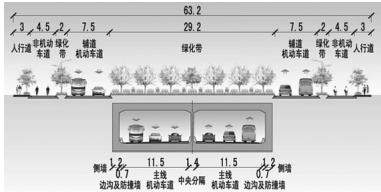
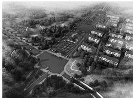
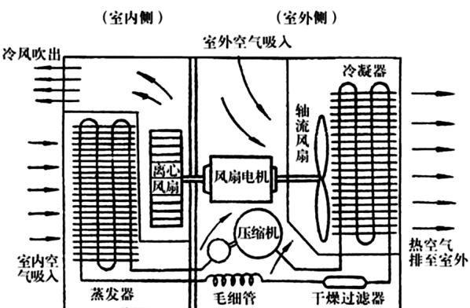

# 开发建设项目水土保持方案中的排水沟设计

以国道108线雅安至荥经界段芦山地震灾后恢复重建工程为例

黄晓亮四川省林业调查规划院，四川成都610081

摘要：截、排水沟是水土保持方案中常见工程，常存在截、排水沟工程级别、设计标准不明确，设计流量取值不同问题，本文以水土保持工程设计规范(GB51018-2014)规定结合《国道108 线雅安至荥经界段芦山地震灾后恢复重建工程》计算为例分析截、排水沟工程计算及参数取值，提出计算过程和参数取值建议。

关键词：设计流量截排水沟 标准 参数

## 1 项目概况

## 1.1 基本情况

国道108线雅安至荥经界段芦山地震灾后恢复重建工程是改建项目，全线位于雅安市境内，主要涉及雅安市名山区、雨城区和荥经县，公路等级包括一、二级公路。路线起于雅安市与成都市交界处，起点桩号为 G108 线K2336 +945，路线止于荥经、汉源交界处，终点桩号K2480+355，路线全长143.41km(其中新建泗坪过境段1.34km，改建段84.04km,完全利用段58.03km)。

本项目占用土地面积225.20hm²，其中永久性占用土地218.45hm²，临时占用土地 $6 . 7 5 \mathrm { h m } ^ { 2 }$ 。项目推荐方案总投资3.33亿元，平均每公里造价232.20万元。其中土建工程投资2.50亿元。本项目已于2014年1月动工，拟于2015年12月竣工，建设期24个月。

## 1.2 气象

雅安市多年平均气温16.5℃，≥10℃有效积温4713℃，年总日照时数北部6县(区)平均为1030.1h，南部两县平均1430.6h。项目区地势由西南向东北倾斜，西南部海拔高程在1010\~2550m，东北部名山区、雅安市等地海拔仅560\~1010m，海拔高度悬殊，地形条件有利于水汽输送和抬升。因而降水量较丰沛。但受地形作用，降水量各地相差较大。总体上看河谷地带较山坡雨量少。

## 1.3 土石方平衡

项目全长143.41km,挖方总量16.83万 $\mathrm { m } ^ { 3 } \left( \begin{array} { l l l } \end{array} \right.$ 自然方，下同)，回填方总量8.05万 $\mathrm { m } ^ { 3 }$ ,综合利用方总量为1.34万m³，主要用于农村路回填利用；区间调运总量1.92万 $\mathrm { m } ^ { 3 }$ ,均为石方；无借方;弃渣总量7.44万m³。

## 1.4 弃渣场设置

项目全线弃渣量10.59万 $\mathrm { m } ^ { 3 } \left( \begin{array} { l } { \begin{array} { r l r l } \end{array} } \end{array} \right.$ 松方)，土石方量主要集中在新建段，共设置弃渣场7处，共新增占地5.40hm²，占地类型主要是耕地。

## 2 排(洪)水工程设计

(1)设计标准。据《水土保持工程设计规范》GB51018-2014中弃渣场及拦挡工程的规定，弃渣场永久性截排水措施排水设计标准采用3年一遇\~5年一遇5min\~10min短历时暴雨，超高满足0.20m，断面采取矩形断面。

(2)设计径流量计算。永久截、排水沟设计排水流量按下式计算：式中：—设计洪峰流量 ${ \bf \nabla } _ { \bf { > } } \mathrm { m } ^ { 3 } / \mathrm { s } ;$ 径流系数，取值详见表1；—设计重现期和降雨历时内的平均降雨强度，mm/min；—汇水面积，km²，查阅1：10万地形图。

表1 径流系数参考值
<table><tr><td rowspan=1 colspan=1>地表种类</td><td rowspan=1 colspan=1>径流系数</td><td rowspan=1 colspan=1>地表种类</td><td rowspan=1 colspan=1>径流系数</td></tr><tr><td rowspan=1 colspan=1>沥青混凝土路面</td><td rowspan=1 colspan=1>0.95</td><td rowspan=1 colspan=1>起伏的山地</td><td rowspan=1 colspan=1>0.60~0.80</td></tr><tr><td rowspan=1 colspan=1>水泥混凝土路面</td><td rowspan=1 colspan=1>0.90</td><td rowspan=1 colspan=1>细粒土坡面</td><td rowspan=1 colspan=1>0.40~0.65</td></tr><tr><td rowspan=1 colspan=1>粒料路面</td><td rowspan=1 colspan=1>0.40~0.60</td><td rowspan=1 colspan=1>平原草地</td><td rowspan=1 colspan=1>0.40~0.65</td></tr><tr><td rowspan=1 colspan=1>粗粒土坡面</td><td rowspan=1 colspan=1>0.10~0.30</td><td rowspan=1 colspan=1>一般耕地</td><td rowspan=1 colspan=1>0.40~0.60</td></tr><tr><td rowspan=1 colspan=1>陡峻的山地</td><td rowspan=1 colspan=1>0.75~0.90</td><td rowspan=1 colspan=1>落叶林地</td><td rowspan=1 colspan=1>0.35~0.60</td></tr></table>

<table><tr><td rowspan=1 colspan=1>地表种类</td><td rowspan=1 colspan=1>径流系数</td><td rowspan=1 colspan=1>地表种类</td><td rowspan=1 colspan=1>径流系数</td></tr><tr><td rowspan=1 colspan=1>硬质岩石坡面</td><td rowspan=1 colspan=1>0.70~0.85</td><td rowspan=1 colspan=1>针叶林地</td><td rowspan=1 colspan=1>0.25~0.50</td></tr><tr><td rowspan=1 colspan=1>软质岩石坡面</td><td rowspan=1 colspan=1>0.50~0.75</td><td rowspan=1 colspan=1>粗砂土坡面</td><td rowspan=1 colspan=1>0.10~0.30</td></tr><tr><td rowspan=1 colspan=1>水稻田、水塘</td><td rowspan=1 colspan=1>0.70~0.80</td><td rowspan=1 colspan=1>卵石、块石坡地</td><td rowspan=1 colspan=1>0.08~0.15</td></tr></table>

因项目区缺乏自记雨量资料，利用标准降雨强度等值线图和有关转换系数，按计算降雨强度：，式中：—5年重现期和10min降雨历时标准降雨强度，mm/min;重现期转化系数，按《水土保持工程设计规范》GB51018-2014的规定，四川雅安地区取值为0.83;—降雨历时转换系数。经计算，各渣场采用5年一遇10min短历时设计暴雨标准下，其设计排水流量见表2。

表2 设计排水流量计算成果表
<table><tr><td rowspan=1 colspan=1>渣场编号</td><td rowspan=1 colspan=1>汇水面积(km2)</td><td rowspan=1 colspan=1>设计重现期和降雨历时内的平均降雨强度(mm/min)</td><td rowspan=1 colspan=1>径流系数</td><td rowspan=1 colspan=1>设计洪峰流量(m³/s)</td></tr><tr><td rowspan=1 colspan=1>1#渣场</td><td rowspan=1 colspan=1>0.032</td><td rowspan=1 colspan=1>0.45</td><td rowspan=1 colspan=1>0.5</td><td rowspan=1 colspan=1>0.12</td></tr><tr><td rowspan=1 colspan=1>2#渣场</td><td rowspan=1 colspan=1>0.023</td><td rowspan=1 colspan=1>0.45</td><td rowspan=1 colspan=1>0.5</td><td rowspan=1 colspan=1>0.09</td></tr><tr><td rowspan=1 colspan=1>3#渣场</td><td rowspan=1 colspan=1>0.036</td><td rowspan=1 colspan=1>0.45</td><td rowspan=1 colspan=1>0.7</td><td rowspan=1 colspan=1>0.19</td></tr><tr><td rowspan=1 colspan=1>4#渣场</td><td rowspan=1 colspan=1>0.022</td><td rowspan=1 colspan=1>0.45</td><td rowspan=1 colspan=1>0.7</td><td rowspan=1 colspan=1>0.12</td></tr><tr><td rowspan=1 colspan=1>5#渣场</td><td rowspan=1 colspan=1>0.054</td><td rowspan=1 colspan=1>0.45</td><td rowspan=1 colspan=1>0.6</td><td rowspan=1 colspan=1>0.24</td></tr><tr><td rowspan=1 colspan=1>6#渣场</td><td rowspan=1 colspan=1>0.093</td><td rowspan=1 colspan=1>0.45</td><td rowspan=1 colspan=1>0.6</td><td rowspan=1 colspan=1>0.42</td></tr><tr><td rowspan=1 colspan=1>7#渣场</td><td rowspan=1 colspan=1>0.085</td><td rowspan=1 colspan=1>0.45</td><td rowspan=1 colspan=1>0.5</td><td rowspan=1 colspan=1>0.32</td></tr></table>

(3)截排水沟设计。为保证渣场上方坡面洪水及沟道洪水排出，避免水流冲刷造成水土流失并危及渣场安全，堆渣前在场地周边布设截、排水沟及排洪渠，截排水沟及排洪渠底坡据渣场地形确定，但截排水沟应≥0.5%,施工时据实际情况作适当调整，以保证截排水沟水流顺畅。排水沟可承受的最大径流量可按以下公式计算：

$$
\mathrm { Q } _ { 2 } = \mathrm { A } ^ { * } \mathrm { \Delta C } \ \sqrt { \mathrm { R i } } = \frac { 1 } { \mathrm { \Omega n } } \mathrm { A } ^ { * } \mathrm { \mathrm { ~ R } } ^ { \frac { 2 } { 3 } * } \mathrm { \Delta i } ^ { \frac { 1 } { 2 } }
$$

式中：n—截排水沟地面糙率系数；A—截排水沟断面面积 $\bullet \mathrm { m } ^ { 2 } ;$ i 截排水沟底坡，结合项目渣场实际情况，取设计最小坡度0.005;R—截 排水沟水力半径。

据各渣场设计排水流量计算成果及各渣场地形地质条件，本工程 渣场截排水沟共设置6个典型断面，截排水沟特性见表3。

表3 渣场截排水沟及排洪渠特性表
<table><tr><td rowspan=2 colspan=1>类型</td><td rowspan=2 colspan=1>断面型式</td><td rowspan=2 colspan=1>材质</td><td rowspan=1 colspan=1>设计流量</td><td rowspan=1 colspan=1>流速</td><td rowspan=1 colspan=1>净宽</td><td rowspan=1 colspan=1>净深</td></tr><tr><td rowspan=1 colspan=1> $\mathrm { l m } ^ { 3 } / \mathrm { s }$ </td><td rowspan=1 colspan=1>m/s</td><td rowspan=1 colspan=1>m</td><td rowspan=1 colspan=1>m</td></tr><tr><td rowspan=1 colspan=1>沟1型</td><td rowspan=1 colspan=1>矩形</td><td rowspan=1 colspan=1>C20 混凝土</td><td rowspan=1 colspan=1>0.44</td><td rowspan=1 colspan=1>1.76</td><td rowspan=1 colspan=1>0.5</td><td rowspan=1 colspan=1>0.5</td></tr><tr><td rowspan=1 colspan=1>沟2型</td><td rowspan=1 colspan=1>矩形</td><td rowspan=1 colspan=1>C20 混凝土</td><td rowspan=1 colspan=1>0.69</td><td rowspan=1 colspan=1>1.91</td><td rowspan=1 colspan=1>0.6</td><td rowspan=1 colspan=1>0.6</td></tr><tr><td rowspan=1 colspan=1>沟3型</td><td rowspan=1 colspan=1>矩形</td><td rowspan=1 colspan=1>C20 混凝土</td><td rowspan=1 colspan=1>1.01</td><td rowspan=1 colspan=1>2.06</td><td rowspan=1 colspan=1>0.8</td><td rowspan=1 colspan=1>0.7</td></tr><tr><td rowspan=1 colspan=1>沟4型</td><td rowspan=1 colspan=1>矩形</td><td rowspan=1 colspan=1>C20 混凝土</td><td rowspan=1 colspan=1>1.41</td><td rowspan=1 colspan=1>2.21</td><td rowspan=1 colspan=1>0.9</td><td rowspan=1 colspan=1>0.9</td></tr><tr><td rowspan=1 colspan=1>沟5型</td><td rowspan=1 colspan=1>矩形</td><td rowspan=1 colspan=1>C20 混凝土</td><td rowspan=1 colspan=1>1.90</td><td rowspan=1 colspan=1>2.35</td><td rowspan=1 colspan=1>1.0</td><td rowspan=1 colspan=1>1.0</td></tr><tr><td rowspan=1 colspan=1>沟6型</td><td rowspan=1 colspan=1>矩形</td><td rowspan=1 colspan=1>C20 混凝土</td><td rowspan=1 colspan=1>2.49</td><td rowspan=1 colspan=1>2.49</td><td rowspan=1 colspan=1>1.1</td><td rowspan=1 colspan=1>1.0</td></tr></table>

(4)设计合理性检验。检验沟渠设计是否合理需要满足一下两个条件：沟渠泄水能力 $\mathrm { Q } _ { 2 } \geqslant$ 设计流量 $_ { \mathrm { Q _ { 1 } ; } }$ 沟渠水流流速V≥防淤流速$\mathrm { V _ { m i n } = 0 . 4 0 m / s _ { : } }$ 且≤沟渠冲刷流速 $\mathrm { V } _ { \mathrm { m a x } } = 3 . 0 0 \mathrm { m } / \mathrm { s }$ 。若流速小于产生淤积流速，则应增大沟渠纵坡，以提高流速。反之，则应采取加固措施，

或设法减小纵坡以降低流速。

(5)其他设计注意事项:①排水沟应布置在低洼地带，尽量利用天然河沟。②排水沟出口采用自排式，并与周边天然沟道或洼地顺接。③GB50288《灌溉与排水工程设计规范》规定:排水沟设计水位应低于地面≥0.20m。④排水沟设计应具有占地少、工程量小、施工和管理方便等特点；与道路等交会处，应设置涵管或盖板以利施工农具通行。⑤对平缓地形条件下设置排水沟，其断面尺寸可据当经验确定；必要时需在排水沟末端设置沉砂池。⑥排水沟沟道比降应据地形、地质条件、上下级沟道水位衔接条件、不冲不淤要求及承泄区水位变化等情况确定，并应与沟道沿线地面坡度接近。⑦上下级排水沟应按分段流量设计断面，排水沟分段处水面应平顺。因流速较大，沿排水沟每隔适当长度及最下游，视需要设置跌水等消能措施。

(上接第34 页)

(4)道路暗埋段。3m(人行道)+4.5m(非机动车道)+2m(绿化带)+7.5m(辅道机动车道)+29.2m(中央分隔带/或隧道遮光段)+7.5m(辅道机动车道)+2m(绿化带)+4.5m(非机动车道)+3m(人行道)=63.2m(道路红线)。

  
图13 道路暗埋段横断面

  
图14 道路暗埋段效果图

(上接第35页)

  
图2 室内空气循环简图

量巨大的太阳能进行有效的应用设计，例如利用太阳能集热板、光电板等对太阳能进行有效的收集，然后通过布置集热墙，实现建筑室内温度的调节，可节约暖通空调室内供热的能源损耗。

## 2.5 现代化自控技术设计

传统暖通空调在应用的过程中由于对人为调控的依赖性较强，即使其已经满足室内温度、湿度、空气流量等方面的舒适度要求，但仍会继续工作，这不仅对保持室内舒适度构成影响，而且造成不必要的能源

## 3 结束语

《水土保持工程设计规范》GB51018-2014对水土保持截排水工程设计标准和等级进行明确规定，因此在对生产建设项目截排水沟设计时，应按规范规定进行设计计算，最大限度确保工程安全，从而有效防治水土流失，有效控制工程造价。

## 参考文献

[1]中国水土保持学会水土保持规划设计专业委员会编著.生产建设项目水土保持设计指南

2《开发建设项目水土保持技术规范》GB50433-2008.

《水土保持工程设计规范》GB51018-2014.

## 5 结语

在规划建设条件分析的基础上，通过对扬州蜀冈西峰地道项目背景、地理位置的解读，结合交通量预测结果与分析，对蜀冈西峰地道方案进行设计研究。该工程的实施，对于提升扬州生态环境、缓解城市交通压力、加强蜀冈-瘦西湖风景名胜区旅游集散功能都具有重要的意义。同时，可为城市类似双层地道的总体方案设计提供实例参考。

## 参考文献

[1] 俞明健. 城市地下道路设计理论与实践 []. 北京：中国建筑工业出版社,2014.

作者简介：彭彬(1983年10月生)，男，汉族，江西赣州人，硕士，工程师，从事道路设计工作。

损耗，所以在进行暖通空调节能优化设计的过程中，需要积极利用现代化自控技术。现代化自控技术即积极利用现代信息手段，优化暖通空调的软硬件设施，使其自动化、智能化程度提升的现代技术。例如现阶段应用于暖通空调的中央监控软件，是利用电子信息技术对运行中的空调系统进行实时监控，结合监控数据对其运行状况进行判断，并结合室内舒适度标准对空调运行进行调节的结构，将其应用于暖通空调系统中,对提升暖通空调节能效果意义重大。

## 3 结论

通过上述分析可以发现，现阶段人们在享受暖通空调对室内环境调节的功能的同时已经认识到暖通空调能源损耗问题，并有意识的通过对其进行节能优化设计，在保证其功能发挥的同时缩减能源消耗，这是社会进步、人类环保理念提升的必然结果。

## 参考文献

[1] 高晓辉. 浅谈建筑暖通空调节能优化设计方法0]. 科技资讯，2015(02):87 –88.

2柴秀宇. 建筑暖通空调节能优化设计方法探微Ⅱ.科技创新导报，2015(26):87-88.

B师波，朱永鑫.暖通空调工程节能优化设计之我见.科技创新与应用,2012(31):239.