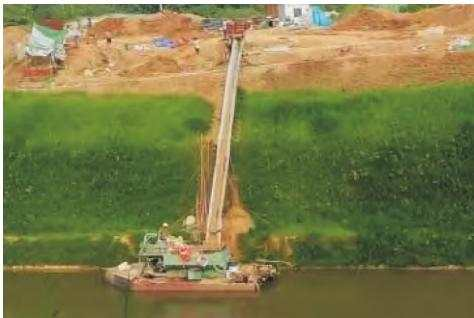
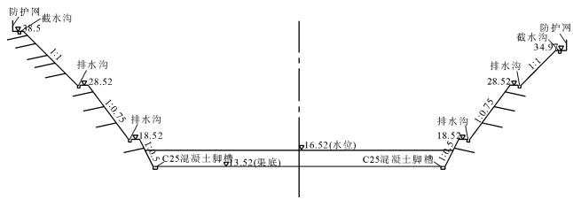
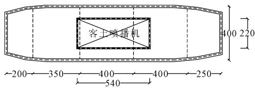
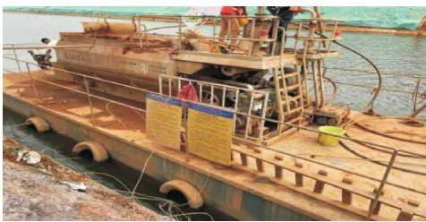
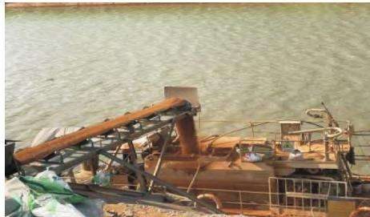
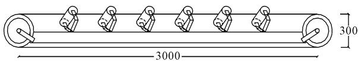
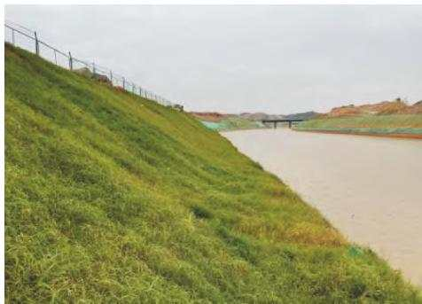

DOI: 10． 3969 /j． issn． 1672 － 1144． 2024． 01． 010

# 船载湿喷植被混凝土生态护坡技术完善与应用

叶建军1，2，冯江鑫1

(1． 湖北工业大学 土木建筑与环境学院，湖北 武汉 430068;2． 武汉春山生态园林建设有限公司，湖北 武汉 430068)

摘 要: 为了进一步完善船载湿喷植被混凝土生态护坡技术，从船只和传送装置等方面进行优化改进，详细介绍优化的技术参数和施工流程，并将其应用于湖北省鄂州市花马湖二期水系连通渠护坡工程工程应用验证表明: 船只速度提升50%，施工效率提升50% 。 施工完成1 个月后，锚杆、喷层、铁丝网均未发现脱落或损坏，陡坡区和缓坡区喷层冲刷深度分别为 0．8 cm 和 0．5 cm，平均侵蚀量分别为 7． 26$\mathrm { k g / m } ^ { 2 }$ 和 $6 . 0 5 ~ \mathrm { k g } / \mathrm { m } ^ { 2 }$ ，显示喷层具有较好的水土保持能力。 多级边坡植物覆盖率达90%以上，植物平均株高为8 cm～15 cm，其中黑麦草株高达1 m。 完善后船载湿喷植被混凝土生态护坡技术更有优势。

关键词: 船载;湿喷;植被混凝土;临水边坡;生态护坡

中图分类号: TV861

文献标识码: A

文章编号: 1672—1144( 2024) 01—0069—07

# Improvement and Application of Shipborne Ecological Slope Protection Technology of Wet-spraying Vegetation-compatible Concrete

YE Jianjun1，2，FENG Jiangxin

( 1． School of Civil Architecture and Environment，Hubei University of Technology，Wuhan，Hubei 430068，China; 2． Wuhan Chunshan Ecological Garden Construction Co． ，Ltd． ，Wuhan，Hubei 430068，China)

Abstract: By optimizing ship and conveyer design，the shipborne ecological slope protection technology of wet spraying vegetation-compatible concrete can be further improved． The optimized specific parameters and the construction process are introduced in detail firstly． Then the technology was applied to Huama Lake II water system connecting channel slope protection project in Ezhou City，Hubei province． Through engineering application，it is verified that the ship speed has been increased by 50% and the construction efficiency has been improved by 50% ． One month after the completion of construction，none of the bolts，spray layers，or barbed wire were found to be broken off or damaged． And the erosion depth of the sprayed layer in the steep slope area and gentle slope area is 0． 8 cm and 0． 5 cm，with an average erosion amount of $7 . 2 6 ~ \mathrm { k g } / \mathrm { m } ^ { 2 }$ and $6 . 0 5 ~ \mathrm { k g } / \mathrm { m } ^ { 2 }$ ，which shows that the sprayed layer has good water and soil conservation ability． The plant coverage rate on the multi-level slope is more than 90% ，and the average plant height is 8 cm ～ 15 cm，in which the ryegrass plant was as high as 1 m． The improved shipborne ecological slope protection technology of wet spraying vegetation-compatible concrete has been verified with more advantages．

Keywords: ship borne; wet-spraying; vegetation-compatible concrete; water-side slope; ecological slope protection

植被混凝土生态护坡技术是一种兼顾边坡防护和生态修复的技术［1 － 2］ 早期的植被混凝土生态护坡技术采用干喷工艺。 该技术的干喷工艺［3］是将水泥、壤土、有机质、植物种子、肥料和混凝土添加剂按照一定比例混合，利用喷射机在坡面上进行施工。该工艺具有施工设备就地取材、方便施工、良好的抗冲刷性能等优点，但也存在施工效率低 环境污染大 工作强度较大 喷枪手安全风险高 喷层基材板结、pH 值较高以及植物发芽率较低等问题。

为了克服这些问题，开发了湿喷植被混凝土生态护坡技术［4］ 该技术将土壤 水泥 湿喷植被混凝土添加剂［5］、有机质、长效肥料、普通复合肥和土壤粘合剂等材料加水搅拌成泥浆，然后利用湿喷机喷射到坡面上形成基材喷层 作为干喷工艺的升级版，湿喷技术能够解决干喷技术的存在的问题，施工效率是干喷工艺的 2． 5 倍以上，几乎没有喷射粉尘污染;操作工不用站在陡峭坡面，而只需站在载具上操作喷枪，更加安全，劳动强度也更低; 湿喷基材孔隙率更大，新开发添加剂引入微生物，更加利于植物发芽和生长。 湿喷工艺的总成本也比干喷工艺低10% 左右。

湿喷植被混凝土生态护坡技术于 2018 年—2019 年间开发，前期使用车载喷播机进行施工，然而，在一些特殊的场合，例如临水边坡周围没有道路接近的坡面，专门为施工修建施工道路成本过高，该技术就难以应用 为克服这些限制，提出一种新型的技术: 船载湿喷植被混凝土生态护坡技术［6］ 该技术以船只代替卡车作为喷播机载具，能在临近边坡的水面上航行和喷播施工。 相比传统的车载施工方式，船上喷播施工有许多优势。 如节省了修建施工道路的时间和成本，特别是减少了施工道路不佳时的轮胎破损故障。 该技术已于 2019 年应用于鄂州花马湖水渠生态护坡一期工程，其修复效果显著

然而，在早期应用中，船上湿喷植被混凝土生态护坡技术存在一些不足之处［6］。 首先，船只尺寸较小，船只容量有限，无法搭载足够设备和施工人员，导致施工效率低下，施工周期延长 其次，船只动力不够，行进速度较慢，导致施工时间增加。 此外，使用溜槽进行基材运输也存在问题。 为了提高技术的效率和安全性，需要对原技术进行完善和优化。

本文在简要介绍船载生态护坡技术的基础上，从机械设备的优化调整和施工工艺改进等入手，完善该技术，并将该技术用于湖北省鄂州市花马湖二期水系连通渠护坡工程，分析其在实际工程中的应用效果和存在的问题。

## 1 船载湿喷植被混凝土生态护坡技术

## 1． 1 新型护坡技术的提出

在花马湖水渠护坡一期工程中，遇到一个棘手难题: 前期作为施工道路的水渠渠底通水后被淹没，不能继续作为车载喷播机施工道路，而边坡坡顶也无现成施工道路可用 如果新建一条坡顶临时施工道路，需要至少一周时间，造价10 万以上，且开挖渣土需要寻找弃土场所。 而且，在施工道路在坡顶，需要接管喷播，喷枪手要站在坡面操作喷头，安全上也增加了风险。 为了克服这个难题，提出了船载湿喷植被混凝土生态护坡技术［6］

## 1．2 船载湿喷植被混凝土生态护坡技术

该技术利用船只作为施工平台，通过铲车或其他输送方式将水泥 土壤 有机质和植被混凝土绿化添加剂等材料从拌合平台输送至船上搭载的喷播机罐内，然后开动船上动力装置，完成喷播作业 喷枪在喷播过程中会产生反作用力，推动船只远离施工边坡，需要开动动力装置来抵消该反作用力。

施工前需完成坡面的清理 挂网( 用锚钉固定) 基材及种子配制，而施工后要确保及时将坡面进行覆盖和喷水养护［7 － 9］。 这些施工工艺与湿喷植被混凝土生态护坡技术施工工艺相似，此处不做详述 。

## 1． 3 质量验收标准

为确保湿喷混凝土生态护坡施工质量，建立一套验收标准体系。 即在材料进场时应该验收材料和施工机械的质量;在隐蔽工程结束时验收清坡、挂网施工质量;喷播完工时验收喷层施工质量;竣工后验收生态护坡整体质量。 生态护坡有4 个目的: 护坡生态修复 水土保持和景观重建在不同阶段的验收标准中各自会在1～2 个指标中体现［10］。

## 2 早期船载湿喷植被混凝土生态护坡技术存在的问题和完善思路

## 2． 1 存在问题

## 2． 1． 1 船只存在的问题

在早期施工中，面临以下具体问题: ①船只尺寸较小( 7 m( 长) × 4 m( 宽) × 1． 2 m( 高) ) ，设备集中堆放，供施工人员操作的空间有限; ②满载排水量较小( 原满载排水量为8．3 t，后续已做修改) ，基材及设备重量容易超过该数值，影响船只的稳定性和安全性; ③船只吃水深度仅0．5 m，在施工期间容易发生晃动或倾斜; ④船只配备功率 20．2 kW 的柴油机和5．9 kW 的船用挂机，速度 12 km/h，具有一定的航行速度，但船只采用的方形设计，会使得船只承受较大阻力，降低航行速度。

## 2． 1． 2 传送装置存在的问题

在早期工程中，使用铁皮制成的溜槽进行基材输送，该溜槽总长为14 m，放置在坡比1:0．75 的边坡上 溜槽示意图见图1 这种基材输送方式在工程中存在一些问题: ①基材仅依靠重力滑落至喷播机罐内，无法对滑落速度和装料量进行把控，装料过多，部分基材会冲出罐外，造成基材浪费，装料过少，基材会滞留在溜槽上 ②在制作和安装溜槽时，铁皮的搭接处不可避免地存在一定的间隙，这会导致基材在滑落过程中卡住或堵塞，从而影响基材的顺利输送。

  
图 1 溜槽

## 2． 2 完善思路

## 2． 2． 1 船只完善思路

为解决船只存在的问题，从以下几个方面对船只进行完善:

(1) 船体形状 优化船体前部几何形状，设计流线型船体，减小横截面积 加长船艏和减少船身曲率，以降低水流与船体的摩擦和阻力，提高航速和效率。

(2) 稳定性设计。 合理确定重心位置和载重分布，将重心靠近船只中心线，平衡船体载重分配，确保船只在不同工况下保持稳定，避免倾覆和不稳定情况的发生。

(3) 船体尺寸。 根据船只要求，适当调整船体长度 宽度和高度等参数，综合考虑稳定性 操纵性船舱尺寸和负载要求，达到最优的设计，减小阻力并提高船只性能。

(4) 吃水深度。 根据船只用途、工作条件和船体尺寸，调整合适的吃水深度 确定适当的吃水深度可减少水阻力，提高船只的航行速度，同时确保船只具备足够的稳定性和承载能力。

(5) 行船速度。 通过应用高效的动力装置、改进推进系统或采用节能技术等方法，提高船只的行船速度 采用更强大的发动机和先进的推进系统可增加推力，从而提高船只的速度。

## 2．2．2 传送装置完善思路

在施工过程中，通常拌合平台位于船只上方。为了更有效地传送基材，选择合适的传送方式至关重要 这需要考虑拌合平台和出料口之间的高度差和距离大小。 为解决现有问题并提高整体效率，根据工程实际有必要考虑采用多种可选的传送方式进行基材运输［11］:

(1) 重力传送方式 高度差较小且距离不远时，通过斜坡或溜槽，利用重力将基材从高处滑动或滚动下来。 这种方式无需电力和机械设备，并且成本较低，适用于简单 经济的传送需求

(2) 输送带方式。 高度差小，但距离较大时，通过安装一条输送带，将基材沿着设定的路径从起点运送到终点。 输送带可以根据施工需求挑战速度，适用于大规模施工和长距离传送，确保快速高效的物料输送。

(3) 升降机方式。 高度差较大但距离不远时，通过倾斜升降机，将基材从高处抬升或下降到目标位置 倾斜升降机结构稳固，可一次性传送较大批量的物料，适用于需要垂直运输的场景。

(4) 天车系统方式。 高度差较大且距离较远时，天车系统通过悬挂容器或托盘，利用吊车或电动机来移动基材。 这种方式具有较大的传送能力和灵活性，适用于跨越大距离、复杂地形或有限空间的运输需求。

## 3 新型护坡技术应用案例

## 3． 1 工程概况

花马湖二期水渠工程位于鄂州市东部，在鄂州花湖机场建设过程中，建设阻断了花马湖上湖和中湖的水流通道，导致上排片区洪水无法正常排入长江 为了减小花马湖二站抽排规模，保证上排区防洪安全，需要新建花马湖上—中湖连通工程 新建渠道位于永兴路东侧，与自上—中湖连通渠上段桩号LT3 +256．4 处相接，经过下姚、童家坝，最后进入中湖，全长为 2． 222 km，整体走向为北西方向。 施工总面积为63 892． 37 m2 岩石边坡段最大边坡高度约为35 m，过水层深度为 0 ～5 m，设计开挖坡比为1∶0．5;中等风化基岩设计开挖坡比为 1∶0．75; 全强风化基岩设计开挖坡比为 1∶ 1; 覆盖层设计开挖坡比为 1∶ 1． 5 。 渠底高程在 13． 47 m ～ 13． 57 m 之间，设计洪水位为 18． 04 m，渠道底宽为 36 m ～54m，水深3 m。 为了保护环境，边坡采取船载湿喷植被混凝土生态护坡技术进行生态防护。 该工程的典型断面图见图2。

  
图2 典型断面

## 3． 2 地层岩性

该工程沿线为第四系，主要有人工填土层、湖积层 冲洪积层和残坡积层，以童家坝沟槽为界，连通渠上游( 西北侧) 基岩为燕山期侵入二长岩，连通渠下游侧( 东南侧) 基岩为三叠系中上统蒲圻组泥质粉砂岩、 长石砂岩 。 其中 LTX1 + 300—LTX2 + 020段渠道右侧边坡为视顺向坡，岩性为层状泥质粉砂岩夹砂岩，局部夹有泥岩软弱夹层，岩层倾角小于坡角，对边坡整体稳定不利，需加强支护措施。 另外上部强风化岩体厚15 m～25 m，岩质疏松，岩体破碎，强度低，且局部夹有泥岩等软弱夹层，边坡稳定性较差，易沿软弱结构面产生局部垮塌变形，需采取喷锚措施加强支护，及时封闭坡面，并做好坡面及坡顶截排水措施。

## 3．3 土壤和植被情况

工程所在区域土壤以潮土 水稻土和红壤土为主，潮土是一种水分和有机物质含量较高的土壤类型 它富含氮 磷 钾等营养物质，适合于种植耐湿的植物，而 pH 值通常较低，容易对酸性植物有利。水稻土是适合于种植水稻的土壤类型，容易保存水分和养分，但排水不良。 红壤土呈褐色或赤黄色，质地较轻，透气性和排水性良好，富含铁和铝等矿物质，pH 值偏酸性。

据调查，该区域境内植物达 3 000 多种，草本、灌木 乔木 花卉类植物众多。

## 3．4 设备改进及基材选取

## 3． 4． 1 机械设备

在本工程中需要使用多种不同类型的机械设备，包括铲车、客土喷播机、吸水泵等。 这些机械设备的合理搭配能够有效提高工程建设效率。 对工程使用的机械进行数据收集，具体如表1 所示。

表1 施工机械参数
<table><tr><td>机械名称</td><td>型号</td><td>数量/台</td><td>外形尺寸/mm</td><td>额定功率/kW</td><td>净质量/kg</td><td>容积/m³</td><td>转速/(r·min−¹)</td></tr><tr><td>铲车</td><td>930</td><td>1</td><td>6100 ×2100 ×2960</td><td>74.90</td><td>5680</td><td>1.2</td><td></td></tr><tr><td>铲车</td><td>932</td><td>1</td><td>5900×2000 ×2580</td><td>65.00</td><td>4700</td><td>1.1</td><td></td></tr><tr><td>客土喷播机</td><td>PE8228</td><td>1</td><td>5400 ×2200×2500</td><td>228.00</td><td>4380</td><td>8.0</td><td>一</td></tr><tr><td>吸水泵</td><td>XG170/80-30</td><td>1</td><td>565×455×455</td><td>3.80</td><td>25</td><td>一</td><td>3600</td></tr><tr><td>三相异步电动机</td><td>YZS-5-6</td><td>1</td><td>370×272×265</td><td>0.37</td><td>50</td><td>一</td><td>955</td></tr><tr><td>柴油机</td><td>ZS1115G</td><td>2</td><td>814×480×618</td><td>6.18</td><td>180</td><td></td><td>2200</td></tr><tr><td>船用挂机</td><td>13.2</td><td>1</td><td>1000</td><td>22.00</td><td>106</td><td></td><td></td></tr></table>

为了高效完成工作，采用两台铲车，一台用于筛土，另一台用于将基材运输至传送装置。 另外，配备一台客土喷播机，用于船上的喷播作业 吸水泵提供搅拌用水，电动机使筛网抖动以协助筛土。 两台柴油机分别为传送装置和船上设备提供动力，而船用挂机则推进船只 这样的配置能够确保工作高效顺畅。

## 3． 4． 2 船只改进

在完善船载湿喷植被混凝土生态护坡技术时，船只是一个关键组成部分 为确保施工的顺利进行，需考虑船只与所需机械设备的协调配合以及施工站点选择、装卸设备等方面的限制问题。 因此在实施船载湿喷植被混凝土生态护坡技术时，需要选取适合的船只，同时进行周密的设计和施工方案。

为了满足船上机械设备的放置需求和操作空间，在船只设计中考虑了以下因素: 设备与设备之间至少50 cm 的间隔，机械与船边要预留至少 80 cm的行走空间。 根据设备和工程河道状况的要求，将船只设计为: 船长16 m，船宽4 m，深1．2 m，吃水深度为0．75 m。 为满足抽水需求，搭配了两根直径80mm 的水管。 这样的设计能够提供足够的空间和功能来支持工程作业。

船体用 Q235 钢材进行焊接，焊接完成后需要对焊缝位置进行检查，包括底部、甲板和舱壁等部位，检查结构焊缝焊脚尺寸是否满足最薄板强度的要求，检查是否存在明显的裂纹和烧穿现象。 同时需要提供损检报告。

安装机械设备时，要注意客土喷播机的重量和重心与船体相匹配，最好安装在船体中心或受力均衡的区域以保持平衡与稳定。 同时，安排专门的安全人员进行指挥和监控 抽水泵 发电机等设备布置要方便操作，稳固可靠，以提高工作效率和便于后续维修。 船只改进后，施工效率提升 50% 。 此外船只速度提升 50% ，运输速度可达 16 km /h。 船只甲板图、船只示意图见图3、图4。

  
图 3 甲板

  
图4 船只示意

## 3． 4． 3 传送装置

传送装置由进料装置、输送装置和支撑装置三个主要组成部分构成。

进料装置采用漏斗式设计，下部进料口的内径为600 mm，上部漏斗口的直径为1 500 mm，锥状角度为 60° 。

输送装置由一台功率为 6． 18 kW 的柴油机驱动 它包括两个直径为 300 mm 长度为 800 mm 的滚筒，滚筒表面覆盖橡胶花纹包胶。 传送带长6．95m，宽700 mm，采用耐磨橡胶材料制成，并覆盖橡胶花纹包胶。 输送装置下部设置有12 个辊子，用于支撑传送带，确保物料运输过程中的稳定性

支撑装置采用地面支撑式桥架的结构形式，由

Q235B 钢材制成。 桥架的高度为 2 000 mm，总长约6．2 m，并通过三角形的形式固定在混凝土墩上。 为加强支撑，顶部两端还设置了加固支撑，斜插入混凝土墩两端边坡。

该输送装置的输送能力受多种因素影响，如物料类型 密度 湿度 坡度 传送带长度 宽度 功率和支撑装置稳定性。 不同物料类型具有不同的堆积密度和粒度分布，高密度物料增加了阻力，湿度增加会降低流动性，坡度会影响物料的流动性 传送带的长度和宽度越大，能够容纳更多物料，支撑装置稳定性对安全性和稳定性至关重要，功率越高能提供更稳定的动力。 该输送装置的预估传送能力为 400t /h ～ 500 t /h，最大传送能力为 500 t /h，能够满足施工过程中的物料输送需求 进料装置 输送装置 支撑装置见图5、图6。

图5 传送装置  
  
图6 输送装置尺寸

## 3． 4． 4 基材和种子

对于不同的工程，基材和种子的配方也会有所变化。 以下是根据本工程提供的一个基材和种子配方的参考，具体的基材配方参见表2。

表 2 基材配制
<table><tr><td>材料</td><td>基层用量</td><td>表层用量</td><td>说明</td></tr><tr><td>植被混凝土绿化添加剂</td><td> $4 0 ~ \mathrm { k g } \sim 5 0 ~ \mathrm { k g }$ </td><td> $3 5 ~ \mathrm { k g } \sim 4 5 ~ \mathrm { k g }$ </td><td>专利号:ZL201910726453.5</td></tr><tr><td>砂壤土</td><td> $0 . 8 ~ \mathrm { m } ^ { 3 } \sim 0 . 9 ~ \mathrm { m } ^ { 3 }$ </td><td> $0 . 8 ~ \mathrm { m } ^ { 3 } \sim 0 . 9 ~ \mathrm { m } ^ { 3 }$ </td><td>沙壤土采用耕种表土，取土深度不大于3m。过筛，颗 粒不大于2 mm</td></tr><tr><td>水泥</td><td> $4 0 ~ \mathrm { k g } \sim 5 0 ~ \mathrm { k g }$ </td><td> $3 5 ~ \mathrm { k g } \sim 4 5 ~ \mathrm { k g }$ </td><td></td></tr><tr><td>有机质</td><td> $0 . 1 ~ \mathrm { m } ^ { 3 } \sim 0 . 2 ~ \mathrm { m } ^ { 3 }$ </td><td> $0 . 1 ~ \mathrm { m } ^ { 3 } \sim 0 . 2 ~ \mathrm { m } ^ { 3 }$ </td><td>采用 50%腐烂酒糟或碎锯末和 50%草纤维，草纤维为 稻草或麦草打碎而成，长度小于8cm</td></tr><tr><td>肥料</td><td> $1 ~ \mathrm { k g } \sim 2 ~ \mathrm { k g }$ </td><td> $1 ~ \mathrm { k g } \sim 2 ~ \mathrm { k g }$ </td><td>30%普通复合肥和70%长效肥</td></tr><tr><td>保水剂</td><td> $0 . 2 ~ \mathrm { k g } \sim 0 . 4 ~ \mathrm { k g }$ </td><td> $0 . 2 ~ \mathrm { k g } \sim 0 . 4 ~ \mathrm { k g }$ </td><td>树脂型保水剂</td></tr><tr><td>土壤粘合剂</td><td> $0 . 2 ~ \mathrm { k g } \sim 0 . 4 ~ \mathrm { k g }$ </td><td> $0 . 3 ~ \mathrm { k g } \sim 0 . 5 ~ \mathrm { k g }$ </td><td>专用土壤粘合剂</td></tr><tr><td>植物种子</td><td>0 g</td><td> $1 0 0 \ \mathrm { g } \sim 2 0 0 \ \mathrm { g }$ </td><td></td></tr><tr><td>水</td><td>适量</td><td>适量</td><td></td></tr></table>

在选择种子时，需考虑本地适应强的种子，以增加植物在当地生态系统中的生存能力。 为了提高生态系统的稳定性和抵抗力，采用多样性丰富的种子组合也是必要的 此外，在配制过程中，还需关注植物种子间的竞争关系，避免过度竞争带来的负面影响［12 － 13］。 根据已有文献提及的具体配方［6］，可以考虑使用多木兰花、紫穗槐、决明子、盐肤木、白茅、刺槐 构树 狗牙根 紫花苜蓿 黑麦草和南方野花等种子的组合 通过根据工程需求和季节特点进行合理的配比，确保种子选择和数量的合适性，以满足工程的需求。

## 3． 5 现场观测

2022 年4 月开始施工，2022 年10 月基本完工，随后开始于2022 年 11 月 6 号观测护坡、水土保持和植物生长情况。

(1) 护坡效果观测 在现场观测中，每 $1 0 0 0 ~ \mathrm { m } ^ { 2 }$ 随机抽取10 个1 m ×1 m 的面积，并对护坡结构( 长锚杆 植被混凝土喷层 铁丝网) 的数量 位置和状态进行观测。 注意是否出现松动、开裂、变形、倾斜等现象。

(2) 坡面冲刷深度观测。 选取两类边坡作为样地: 坡度 ＞ 1∶ 0． 75( 简称陡坡区) 和坡度 ≤ 0． 75( 缓坡区) 每个样地随机选取5 个1 m ×1 m 样方。 采用测树根法进行观测。 首先，在边坡上选择具有明显根系的植物作为观测目标，标记根系范围。 然后，在范围内均匀设置观测点，使用测量尺测量每个观测点到坡面的垂直距离，即根系深度 数据记录并求和后，计算观测点根系深度的平均值，得到坡面冲刷深度。

(3) 侵蚀量观测。 采用侵蚀桩法进行估算，以锚杆作为侵蚀桩 使用测量尺测量锚杆露出长度，并记录观测数据。 在规定的时间间隔内( 如一个月) ，再次测量露出长度。 通过不同时间点的数据，计算出每个样方的侵蚀量数值，并进行平均值取值 。

(4) 植物特征观测。 采用样方法，选取陡坡区和缓坡区作为样地，每个样地随机选取5 个1 $\mathrm { ~ m ~ } \times 1$ m 样方。 记录植物类型、种类、数量，以及每个样方中植物的平均高度( 随机选取15 株植物，测量坡面到植物顶部的距离，取平均值) 和植物盖度指标( 对样方内的植物垂直拍照，再对照片进行目视估测，进行多人判读，取平均值)

## 3．6 施工效果分析

## 3． 6． 1 护坡效果

根据观测样方，每 $1 ~ \mathrm { m } ^ { 2 }$ 范围内平均存在3 根状态良好的长锚杆。 这些锚杆没有出现松动、开裂或变形等问题 同时，植被混凝土喷层完整覆盖，没有明显的脱落现象。 边坡内的铁丝网没有脱落或损坏。 长锚杆为坡面结构提供有效的支撑和稳定性，植被混凝土喷层进一步加强护坡效果，而完好的铁丝网有助于维持结构的稳定性。

## 3． 6． 2 水土保持

经过测量和计算，陡坡区的坡面冲刷深度平均为0．8 cm，缓坡区的坡面冲刷深度平均为 0．5 cm。在施工期间，喷层成功地防止了水土流失，减缓了地表水的速度和径流量。 喷层在陡坡区的平均侵蚀量为 7． $2 6 ~ \mathrm { k g } / \mathrm { m } ^ { 2 }$ ，缓坡区的平均侵蚀量为 6． 05$\mathrm { k g / m } ^ { 2 }$ 。

同时，在建设过程中通过设置截水沟在坡顶，成功截取了山体汇聚的雨水，减少了坡面直接受水流侵蚀的可能性。 尽管在少数高陡边坡出现了喷层流淌和剥落的问题，但通过修复截水沟，已经取得了一定的效果。

在持续干旱的条件下，植物依然能够生长，并逐渐形成了坡面植被覆盖 植被起到了良好的保护作用，降低了坡面暴露于风化、雨蚀和冲刷等自然力量的风险。 植被的存在维持了坡面土壤的稳定性和保水性，增加了有机质含量，促进水分的渗透和循环尽管植被的生长速度可能会受到持续恶劣气候的影响，但其仍然能够发挥良好的水土保持作用

## 3． 6． 3 植物恢复

播种时间主要集中于 4 月和 7 月两月，根据现场观测，4 月播种区域和7 月播种区域在植株组成和植物高度方面存在一些差异。 植被观测指标见表3。

表3 植被观测指标
<table><tr><td>时间</td><td>坡比</td><td>植被盖度/%</td><td>植物平均高度/cm</td></tr><tr><td>4月</td><td>1:0.50</td><td>90</td><td>12.5</td></tr><tr><td>7月</td><td>1:0.75</td><td>90</td><td>10.0</td></tr></table>

在4 月播种区域，坡面覆盖率达 90% 以上，狗牙根是主要的植物种类，占据了60%以上的比例。

通过现场观测 4 月播种区域和 7 月播种区域，发现两区域在植株组成和植物高度方面略有不同。紫穗槐，紫花苜蓿，白茅等也有分布 植株的平均高度约为12．5 cm，补种的灌木大多存活。

而在 7 月播种区域，坡面覆盖率也达 90% 以上，但部分区域的覆盖率为60%～70%，极少部分为50% 。 黑麦草是该区域的优势物种，占据坡面70% 。 同时，紫穗槐和紫花苜蓿也有一定的分布。黑麦草的植株高度达 1 m，而灌木类植物的平均株高为10 cm 在阳光较为强烈的区域，黑麦草呈现成熟发黄状态，收割黑麦草后，补种的灌木也能发芽生长。

然而，在植物生长过程中，缓坡区出现了几种本地植物入侵，包括草木樨，蜀葵，野胡萝卜，凤仙花，马唐和牛筋草。 这些本地植物的入侵提高了坡面物种丰富度和物种多样性，同时也为整体的工程景观绿化增添了更加多样化的元素，并成功达到了预期的植物恢复效果。 图7 展示了施工恢复效果。

  
图7 恢复后效果

## 4 结 论

(1) 通过采用传送带运输基材和选用较大尺寸 速度更快的流线型船只，花马湖二期水渠工程的施工效率得到了显著提升。 改进后的船载湿喷植被混凝土生态护坡技术展现出了显著的效果。 边坡覆盖率达到了 90%以上，锚杆 混凝土喷层和铁丝网完好无损，有效提升了边坡的稳定性，同时减少了水土流失的问题。 边坡外来植物的入侵，增加了物种多样性，进一步促进了边坡的生态修复。 这一系列改进技术经过实践验证，证明了其良好的适用性和效果。

(2) 船载喷播技术作为一种创新的施工方法，有着广阔的发展前景 随着技术的不断推进，船载喷播技术将不仅局限于湿喷植被混凝土生态护坡技术，还可以应用于干喷、湿喷、客土喷播等不同方法进行施工，为临水边坡工程建设提供更多可行的选择 。

## 参考文献:

［1］ 许文年，王铁桥，叶建军． 岩石边坡护坡绿化技术应用研究［J］． 水利水电技术，2002，33( 7) : 35-36，40．

［2］ 王铁桥，许文年，叶建军，等． 挖方岩石边坡绿化技术与方法探讨［J］． 三峡大学学报( 自然科学版) ，2003，25( 2) : 101-104．

［3］ 水电工程陡边坡植被混凝土生态修复技术规范: NB/T35082—2016［S］． 北京: 中国电力出版社，2016．

［4］ 叶 建 军． 湿 喷 植 被 混 凝 土 生 态 护 坡 技 术:CN201910726433． 8［P］． 2021-09-17．

［5］ 叶建军． 湿喷植被混凝土添加剂: CN110451837B［P］． 2021-07-09．

［6］ 叶建军，姜泉泉，柯鹿鸣，等． 船上湿喷植被混凝土生态护坡技术应用研究［J］． 湖北工业大学学报，2021，36( 1) : 100-105．

［7］ 李少丽，许文年，刘立荣． 开挖岩质边坡生态修复研究———以宜昌求索众创中心项目为例［J］． 水利水电技术，2018，49( 4) : 130-137．

［8］ 陈 杰． 高陡边坡 CBS 植被混凝土生态恢复技术［J］．人民黄河，2021，43( S2) : 231-232，234．

［9］ 朱 炯，薛冬杰，刘 聃，等． 植生型生态混凝土护坡施工技术［J］． 施工技术，2014，43( 18) : 109-112．

［10］ 叶建军，姜泉泉，李 虎，等． 湿喷植被混凝土生态护坡技术施工质量验收标准［J］． 中国水土保持，2021( 6) : 27-30．

［11］ 叶建军，刘 迪，李 虎，等． 边坡治理工程中材料运输方式探讨［J］． 现代矿业，2022，38( 8) : 1-5．

［12］ 曹令立，董 钟，刘文静，等． 栓皮栎橡子虫蛀特征与种子雨进程的关系［J］． 河南农业科学，2013，42(1) :77-81．

［13］ 李 雪，王 静，张 静，等． 林龄和林分密度对华北落叶松人工林土壤养分和细菌群落的影响［J］． 中南林业科技大学学报，2022，42( 10) : 83-92