# 降雨历时动态变化对临时苫盖措施坡面减流减沙效益的影响

刘 超1， 孙亚荣1， 曹博召1， 广彗冰1， 封瑞坤1， 张艺茹1， 王 健2

（1．西北农林科技大学水土保持研究所 陕西 杨凌7121002．西北农林科技大学资源环境学院 陕西 杨凌712100）

摘要 ： 工程堆积体具有独特的物质组成 其土壤抗侵蚀能力差 受暴雨冲刷极易导致水土流失 密目网苫盖作为一种重要的临时措施 定量揭示密目网苫盖的蓄水保土机理具有重要意义 为分析降雨历时动态变化对工程堆积体密目网苫盖减流减沙效益的影响 试验设计6090120mm／h3个降雨强度 对5°15°25°35°共4个坡度的堆积体坡面在裸地和密目网苫盖处理下进行人工模拟降雨试验 结果表明 ：60mm／h降雨强度时 密目网苫盖处理在 $1 5 ^ { \circ } \sim 3 5 ^ { \circ }$ 对坡面产流历时抑制作用显著 $( \phi < 0 . 0 5 )$ 当大于60mm／h时 在 $1 5 ^ { \circ } \sim 2 5 ^ { \circ }$ 可显著延长坡面产流历时 $( \phi < 0 . 0 5 )$ ；不同坡度下 $6 0 \ \mathrm { m m / h }$ 与90，120mm／h降雨强度减沙效益差异显著 $( \phi <$ 0．05） 密目网苫盖处理减流减沙效益随降雨历时延长而减小 均在90mm／h降雨强度达阈值 幂函数可很好地描述减流减沙效益随降雨历时的变化关系 ， 效益衰减系数 （b） 随降雨强度增大陡增 ； 密目网苫盖处理减流减沙效益随降雨历时变化可分为高效阶段 递减阶段和稳定阶段 最佳减流效益历时总体小于30min，最佳减沙效益历时在20min附近 综上所述 ，考虑生产建设项目水土保持工作的开展 ，当生产建设项目施工区以短历时 $( < 3 0 \ \mathrm { m i n } )$ 强降雨 $( < 9 0 \mathrm { \ m m / h } )$ 为主要降雨类型时建议采用临时苫盖措施 ，可有效减少施工区水土流失 研究成果可为生产建设项目水土保持监管提供参考

关键词 ： 降雨历时 减流效益 减沙效益 密目网 工程堆积体

中图分类号 ：S157．1

文献标识码 ：A

文章编号 ：1009－2242（2023）01－0008－09

DOI：10．13870／j．cnki．stbcxb．2023．01．002

# InfluenceofRainfallDurationDynamicChangesonFlow ReductionandSedimentReductionBenefitsof FineMeshNetonConstructionSpoilDeposits

LIUChao1， SUNYarong1， CAOBozhao1， GUANGHuibing1，

FENGRuikun1 ZHANGYiru1 WANGJian

（1 Institute. of Water and Soil Conservation ， Northwest Agricultural and Forestry University ， Yangling ， Shaanxi 712100；2.College of Resources and Environment ， Northwest Agricultural and Forestry University ， Yangling ， Shaanxi 712100）

Abstract： Theconstructionspoildepositshaveauniquematerialcomposition， anditssoilerosionresistance ispoor whichiseasytocausewaterandsoillossowingtorainstorm．Hence itisimportanttoexplorethe mechanismofflowreductionandsedimentreductionoffinemeshnet．Toanalyzetheinfluenceofrainfall durationdynamicchangesonflowreductionandsedimentreductionbenefitsoffinemeshnetonconstruction spoildeposits，threerainfallintensities（60～120mm／h） andfourslopegradients $( 5 ^ { \circ } \sim 3 5 ^ { \circ } )$ wereconsidered onfinemeshnetroleofreducingsoilerosiononspoildeposits．Theresultsshowedthat： Underarainfall intensityof60mm／h coveringwiththefinemeshnethasasignificantinhibitoryeffectontheinitialrunoff timeat $1 5 ^ { \circ } \sim 3 5 ^ { \circ } ~ ( { \it p } \textless 0 . 0 5 )$ ， whileitcansignificantlyprolonginitialrunofftime $( 1 5 ^ { \circ } \sim 2 5 ^ { \circ } )$ whenarainfall intensitymorethan60 mm／h $( \phi < 0 . 0 5 )$ ．Therewasasignificantdifferenceinthesedimentreduction benefitsof60mm／hand90mm／h（120mm／h）rainfallintensityunderdifferentslopes $( \phi < 0 . 0 5 )$ ．Theflow reductionandsedimentreductionbenefitsoffinemeshnetweredecreasedwiththeprolongingofrainfall duration andreachedthethresholdatarainfallintensityof90mm／h．Thepowerfunctioncandescribethe relationshipbetweenthebenefitsofflowandsedimentreductionwiththerainfalldurationwell andthe

benefitattenuationcoefficient（b）increasedsharplywiththeincreaseofrainfallintensity．Theflowreduction andsedimentreductionbenefitsoffinemeshnetcovercanbedividedintohigh－efficiencystage， decreasing stageandstablestagewiththechangeofrainfallduration．Ingeneral consideringthedevelopmentofsoiland waterconservationworkinproductionandconstructionprojects，itisrecommendedtousetemporarycoverwhena short－duration （＜30min） andheavyrainfall（＜90mm／h）isthemainrainfallintheconstructionareaof productionandconstructionprojects whichcaneffectivelyreducesoilerosion．Theresearchresultscan providereferenceforthesupervisionofsoilandwaterconservationofproductionandconstructionprojects

Keywords： rainfallduration； flow reductionbenefit； sedimentreductionbenefit； fine meshnet； spoil deposits

生产建设活动推动着经济社会由高速发展向高质量发展转型 建设项目在促进我国经济社会转型的同时也带来一系列环境问题 已有研究［1］表明 生产建设项目在施工过程中开挖地表 产生大量弃土弃渣，形成特殊的地貌单元—工程堆积体 工程堆积体由于表层物质疏松 地表裸露 抗侵蚀能力极差［2］ 已成为当前新增水土流失的重要来源［3］ 加之弃土弃渣堆积的随意性 人类活动干扰频繁 使得这类水土流失侵蚀类型多样 危害严重， 在降雨等外营力作用下极易导致松散堆积体表层土壤发生剥蚀和运移 随着细沟侵蚀和细沟间侵蚀的不断发育 使堆积体固有平衡受到破坏 极易引发滑坡 泥石流等危害 已成为生态城市建设中一种新的环境威胁［4］ 因此 研究降雨等侵蚀外因作用下生产建设项目工程堆积体坡面防护措施效益对城市生态安全具有关键意义

降雨历时是重要的降雨特性 是影响泥沙运移的主要因素之一［5］ ，其与坡面径流泥沙的关系受到国内外学者的广泛关注 目前，关于降雨特性的研究主要集中于降雨量 降雨强度和雨滴特性等方面 而针对降雨历时的研究鲜见［6］ 已有研究［7－8］表明，短历时高强度降雨条件下坡面细沟形成迅速 引发剧烈的水土流失 且降雨强度一定时 随着降雨历时延长 降雨量增大 累计土壤侵蚀量也随之增加 ； 段剑等［9］ 以红砂岩侵蚀区为研究对象 通过野外长期定位试验认为大雨强 短历时的降雨雨型是坡面产流产沙的主要雨型，对坡面产流产沙的贡献可达50％；杨振奇等［10］通过对自然降雨分析发现 随着降雨历时的延长和降雨强度的增加 土壤侵蚀作用加剧 可见 降雨历时的差异对坡面径流泥沙发生机制具有重要影响 而多数学者所设计的人工模拟降雨试验不考虑降雨历时的差异 选择固定的降雨历时研究坡面径流泥沙规律［11－12］ ，导致对不同降雨历时下坡面水文过程和侵蚀机理的认识存在不足 ，促使水土保持工作人员在坡面防护措施配置时忽略局部降雨特性差异 ，难以因地制宜配置防护措施

生物措施和工程措施的侵蚀控制能力在不同降雨条件下得到有效证实［13］ 随着社会主义现代化建设实践和认识的不断深化 在推进生态文明建设与人与自然和谐发展进一步融合中 生物措施和生物工程措施在城市建设水土流失防治过程中已成为首要选择［14］ 已有研究［15］表明 成熟和广泛种植的植被可以有效防止与降雨事件相关的土壤侵蚀 然而，植物具有一定的生长周期 在植被覆盖度未达到理想状态时 生物措施防护下工程堆积体坡面侵蚀依旧严重甚至在短历时 强降雨条件下毁坏已布设的生物措施 加剧植被恢复的困难程度 因此 在植物生长早期应布设适宜临时措施 以最大限度减少侵蚀风险［16］苫盖在生产建设项目堆土区是一种常见的水土保持临时措施。 研究表明，苫盖可消除64．0％～99．6％的雨滴动能［17－19］ 使得细沟侵蚀量减少 1／2［20］ 郑粉莉等［21］研究认为 苫盖后坡耕地总侵蚀量减少31％～55％ 而工程堆积体在坡面苫盖后 侵蚀泥沙量在不同降雨强度下可减少79％以上［22］ 目前 针对临时苫盖措施减流减沙效益研究多以传统坡面为基本下垫面 而生产建设项目工程堆积体由于土壤结构遭到破坏 组成物质复杂等 导致工程堆积体坡面可蚀性和传统下垫面的土壤侵蚀规律有较大的差异［23］ ； 此外 降雨历时对密目网的土壤侵蚀控制性能有显著影响［24］ ，但鲜有报道探讨不同降雨历时条件下密目网苫盖的侵蚀控制效益

鉴于此 为了进一步理解密目网苫盖在不同降雨历时下的侵蚀控制效益 本研究通过室内人工模拟降雨试验 对不同降雨强度和坡度下密目网苫盖处理工程堆积体坡面土壤侵蚀特征进行分析 探究密目网苫盖减流减沙效益在不同降雨强度和坡度下随降雨历时变化规律 并结合区域降雨特点和堆积体堆置坡度，为工程堆积体坡面临时防护措施配置提供依据

## 1 材料与方法

## 1．1 试验用土

试验用土采自黄土高原公路建设项目弃土堆置场 $( 3 4 ^ { \circ } 1 6 ^ { \prime } 4 8 ^ { \prime \prime } \mathrm { N } , 1 0 8 ^ { \circ } 0 4 ^ { \prime } 2 7 ^ { \prime \prime } \mathrm { E } )$ 研究区属于暖温带季风半湿润气候区 年降水量635．1～663．9mm 年平均气温12．9℃ 土壤隶属黏壤土（美国农业部分类法） 代表研究地点的主要土壤类型 使用激光粒度仪Mastersizer2000（MalvernInstrumentsLtd．， Worcester－shire， UK） 测定土壤颗粒粒径分布， 黏粒 （＜0．002mm） 粉粒（0．002～0．05mm） 砂粒（＞0．05mm）含量分别为5．14％ 85．01％ 9．85％ 有机质含量为7．3％砾石含量为0

## 1．2 试验装置

模拟降雨试验在钢板制成的小区中进行 针对黄土高原典型工程堆积体的调查［25］ 表明 工程堆积坡长以2～8m居多，结合室内试验条件，设计小区尺寸为2m×1m 深0．45m（图1） 在小区中部采用钢板将其分成2个小区 最终宽度为0．5m 每个小区下端均布设1个“V”形出流口 用于在降雨期间收集坡面径流和侵蚀泥沙 箱底布设有直径为0．5cm的筛孔 用于排出渗水 箱体坡度采用液压升降机调整，在模拟降雨前采用坡度尺调节试验坡度

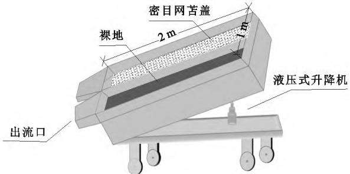  
图1 径流小区示意

模拟降雨采用中国科学院水土保持研究所制造的侧喷式降雨模拟器进行试验［26］ 该降雨系统由供水装置和2个独立降雨支架构成 其在雨滴大小分布和雨滴动能方面与天然降雨相似 降雨喷头离地高度6m，独立降雨支架距离7m，有效降雨高度7．5m，有效降雨面积5m×7m Christiansen均匀系数约为90％高于模拟降雨试验要求（80％）［27］

## 1．3 试验布设

模拟工程堆积体是将试验用土通过人工堆填形成 填土前 将试验用土过10mm土壤筛除去根系等杂物以保证不同组试验间相似的下垫面条件 随后在实验室风干 为保证坡面入渗和产流过程与实际情况吻合 每次填土前径流小区底部均铺设5cm干燥石英砂 在石英砂上部铺设纱布 以确保在降雨过程中下渗水分能及时排出；堆积体下部 $\left( { 2 0 - 4 0 \ \mathrm { c m } } \right)$ 土层采用分层压实的方法填土，每5cm为1层，控制容重为1．35～$1 . 5 0 ~ \mathrm { g / c m ^ { 3 } }$ 层与层之间打毛以防止在降雨过程中发生分层效应；表层 $\left( 0 - 2 0 ~ \mathrm { c m } \right)$ 填土方法与下部相似，容重在$1 . 0 5 { \sim } 1 . 1 0 ~ \mathrm { g / c m ^ { 3 } }$ 范围内 以保证人工堆填堆积体与天然堆积体相似，各层土壤质量含水量均在9．0％～10．0％在填土完成后 用木板将表面磨平 以最大程度保证不同组试验间表面粗糙度的一致性

密目网覆盖在小区的表面 ，并在试验过程中与表土保持紧密接触 该网由聚乙烯材料制成 密目网小孔平均尺寸为0．8cm×0．5cm（长×宽） ，开口面积百分比较大（约60％，GB5725－2009）［28］ 试验以无密目网覆盖的裸地作为对照 工程堆积体的坡度主要在25°～40°范围内［29］ 但在线性建设项目中也存在坡度＜25°的临时弃土堆积物 因此 将小区的坡度调整为5°，15°，25°，35°，试验选取坡度在黄土高原建设项目区较为常见

## 1．4 模拟降雨

在堆填试验用土和密目网布设完成后 用塑料布完全覆盖径流小区 并调整降雨模拟器 在降雨均匀度＞90％时开始人工模拟降雨 通过对当地多年降雨资料［30］分析 并结合前期降雨试验 共设计6090120mm／h3个降雨强度，每场降雨历时60min 当径流从土槽出口出流时 径流和泥沙样被连续收集到重量已知的6L塑料桶内 每1min更换1只空桶准确记录更换时间 在降雨结束时 对装有径流和泥沙样的塑料桶进行称重 随后 静置12h使泥沙颗粒下沉 在第2天倒出上清液 将下层侵蚀泥沙样置于铁盆中 在105℃下干燥至恒重 再次称量干燥沉积物样品质量 计算得到侵蚀泥沙质量 ； 径流量通过从径流泥沙样重量中减去泥沙质量得到 用于称重的电子秤的精度为0．01g。

## 1．5 数据处理

（1）减流效益表示对照组径流量与处理径流量的差值与对照组径流量的比值

$$
L P { = } \frac { M _ { \mathrm { 0 } } - M _ { i } } { M _ { \mathrm { 0 } } } { \times } 1 0 0 \%\tag{1}
$$

式中 ： $L P$ 为减流效益（％） ； $M _ { i }$ 为密目网苫盖堆积体径流量 $( \mathrm { L } ) { \mathsf { \Omega } } _ { 3 } M _ { \mathrm { c } }$ 为裸地径流量（L）

（2）减沙效益表示对照组侵蚀泥沙量与处理侵蚀泥沙量的差值与对照组侵蚀泥沙量的比值

$$
N P = \frac { W _ { \mathrm { 0 } } - W _ { i } } { W _ { \mathrm { 0 } } } \times 1 0 0 \%\tag{2}
$$

式中 ： $N P$ 为减沙效益（％） $; W$ i为密目网苫盖堆积体侵蚀泥沙量 $( \mathrm { k g } ) _ { } ; W _ { \mathrm { ( } }$ 0为裸地侵蚀泥沙量（kg） 。

（3）采用幂函数模型拟合不同降雨强度下降雨历时与减流效益和减沙效益的关系

$$
y = a x ^ { - b }\tag{3}
$$

式中 $: x$ 为降雨历时 $( \operatorname* { m i n } ) { \mathrm { : } } y$ 为减流效益或减沙效益$( \% ) _ { \dag a }$ 为待定系数 $\mathord { \mathfrak { s o } }$ 为效益衰减系数 幂函数模型的选取遵循拟合度最优原则 即通过对减流减沙效益与降雨历时进行模型预估 依据拟合度确定最优拟合模型

（4）突变点的确定 采用累计距平法确定非线性曲线突变点 通过计算 n 个时段的距平 并绘制累计距平曲线分析变化趋势［31］ 累计距平曲线呈上升趋势表示距平值增大 呈下降趋势则表示距平值减小从曲线的上下起伏可确定突变点 ，具体为 ：

$$
M _ { i } = \sum _ { i = 1 } ^ { n } { ( \eta _ { i } - \overline { { { \eta } } } ) }\tag{4}
$$

当 $M = \operatorname* { m a x } \left\{ M _ { i } \right\}$ 时，i 为最优二分割点 ，即为突变点。

式中 为第i min的减流或减沙效益 $\eta _ { i }$ $( \% ) ; \overline { { \eta } }$ 为研究时段的平均减流或减沙效益（％）

（5）侵蚀控制效益阶段划分原则 坡面侵蚀以径流泥沙离开出口断面作为界定准则 基于此 高效阶段指在降雨事件中密目网侵蚀控制效益达100％的降雨过程，以累计距平法所得的突变点作为递减阶段与稳定阶段划分的临界

采用 Excel2016软件对试验数据进行整理分析 使用SPSS22．0统计软件进行方差分析 检验密目网苫盖处理在同一坡度不同降雨强度下减流效益和减沙效益间差异性 Origin2021b软件绘制图表与相关方程拟合

## 2 结果与分析

## 2．1 密目网苫盖对产流的影响

临时苫盖处理可延迟坡面产流历时 ，但独立样本检验分析表明， 其对同一坡度不同降雨强度产流历时影响存在差异 $6 0 \ \mathrm { m m / h }$ 时 苫盖处理在5°时产流历时与裸地无显著差异 $( \phi > 0 . 0 5 )$ ， 随着坡度增加 密目网苫盖对产流历时影响显著 $( \phi < 0 . 0 5 ) ; 9 0$ 120mm／h时 苫盖处理在5°和35°时对坡面产流历时均无显著影响 $( \rho > 0 . 0 5 ) , 1 5 ^ { \circ } \sim 2 5 ^ { \circ }$ 时影响显著 $( \phi <$ 0．05） ，说明中坡度 $( 1 5 ^ { \circ } \sim 2 5 ^ { \circ } )$ 时密目网苫盖对坡面产流有显著抑制作用 密目网苫盖处理在大坡度（35°）和小坡度 （5°） 时对坡面产流历时抑制效应不佳 （图2） 此外，密目网苫盖在 $6 0 ~ \mathrm { { m m } / h }$ 时，对坡面产流历时抑制作用最大达 $4 0 0 \ \mathrm { s } ;$ 随着降雨强度增加 密目网苫盖抑制作用减弱 分别在 $8 { \sim } 4 9 \mathrm { ~ s ~ } ( 9 0 \mathrm { ~ m m / h } )$ 和17～57s（120mm／h）间波动 6090120mm／h时裸地和密目网苫盖处理坡面产流历时变化范围分别为596～1230s（苫盖）和477～830s（裸地） 291～368．5s（苫盖）和 $2 7 7 \sim 3 2 7 \mathrm { ~ s } ($ （裸地） 289～351s（苫盖）和 $2 4 5 \sim 3 2 7 ~ \mathrm { s } ($ （ 裸 地 ） 。

不同降雨强度下（60，90，120mm／h）坡面径流量随坡度增大而减小 且密目网苫盖处理坡面径流量低于裸地坡面径流量 ， 而在90，120mm／h降雨强度总体接近，这表明密目网苫盖措施径流调控能力受降雨强度的影响 且随着降雨强度的增大 调控能力减弱

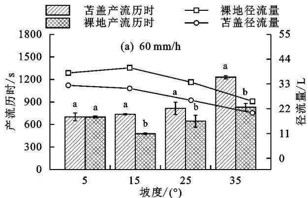  
苫盖产流历时 IロT 裸地径流量 裸地产流历时 苫盖径流量

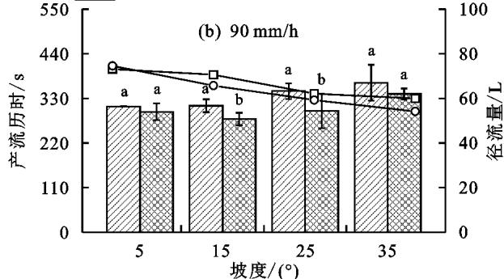  
苫盖产流历时 ロT 裸地径流量 裸地产流历时 苫盖径流量

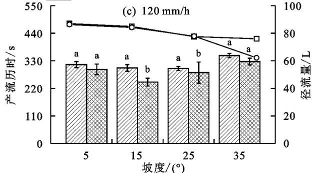  
注 ：图柱上方不同小写字母表示同一坡度不同处理间差异显著 $( \phi < 0 . 0 5 )$ 。  
图2 不同降雨强度产流历时及径流量

## 2．2 密目网苫盖减流效益特征

2．2．1 减流效益递变过程 同一坡度60mm／h与90$\mathrm { m m / h ( 1 2 0 ~ m m / h ) }$ 降雨强度减流效益差异显著 $( \phi <$ 0．05） 其中90mm／h和120mm／h降雨强度减流效益随降雨历时变化关系曲线接近 （图3） 方差分析表明，同一坡度90mm／h和120mm／h减流效益差异不显著 $( \phi { > } 0 . 0 5 )$ ，说明90mm／h时临时苫盖处理后坡面减流效益达到阈值 5°时，降雨历时＞30min，90mm／h降雨强度下减流效益与120mm／h相近 分别为3．14％～4．59％（90mm／h）和0．054％～5．65％ （120mm／h） ，其余减流效益均表现为60mm／h＞90mm／h＞120mm／h，分别在23．12％～100．00％4．62％～100．00％0．01％～100．00％间波动 此外，60，90，120mm／h降雨强度下密目网苫盖坡面减流效益变化趋势均表现为随降雨历时延长减流效益降低 其关系均可用幂函数描述（表1） 效益衰减系数（b）

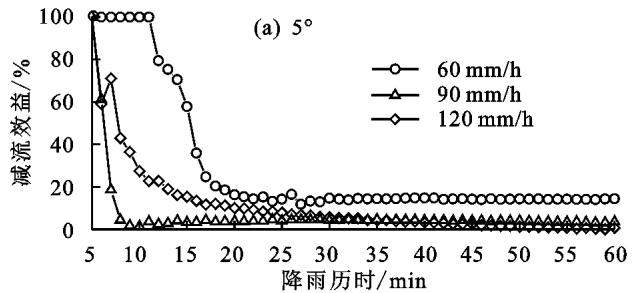

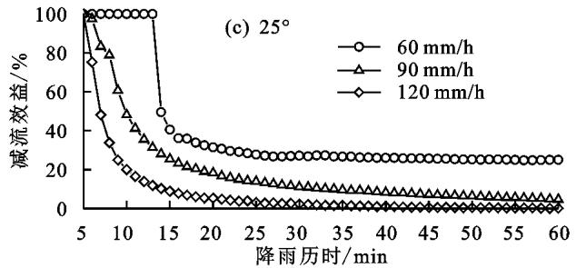

均表现为60mm／h＜90mm／h＜120mm／h，说明密目网 苫盖减流效益随降雨强度增大降幅陡增

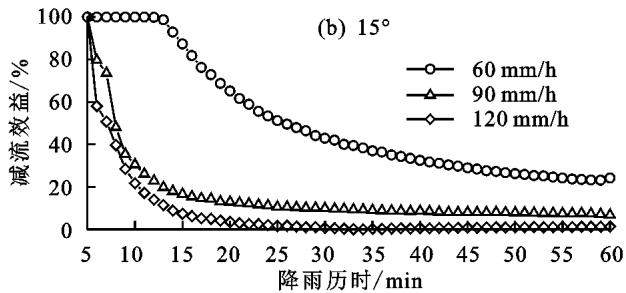

图3 不同降雨历时减流效益变化过程  
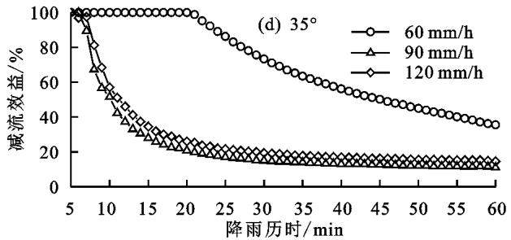

表1 减流效益与降雨历时模型拟合
<table><tr><td rowspan="2">坡度/ (°)</td><td rowspan="2">降雨强度/  $\mathrm { ( m m \cdot h ^ { - 1 } ) }$ </td><td colspan="2">回归模型</td><td rowspan="2"> $R ^ { 2 }$ </td><td rowspan="2">F</td><td rowspan="2">p</td></tr><tr><td>a</td><td>b</td></tr><tr><td rowspan="3">5</td><td>60</td><td>0.787</td><td>0.504</td><td>0.741</td><td>187.110</td><td>&lt;0.01</td></tr><tr><td>90</td><td>0.697</td><td>0.818</td><td>0.540</td><td>68.158</td><td>&lt;0.01</td></tr><tr><td>120</td><td>8.666</td><td>1.597</td><td>0.819</td><td>261.670</td><td>&lt;0.01</td></tr><tr><td rowspan="3">15</td><td>60</td><td>1.746</td><td>0.492</td><td>0.928</td><td>219.108</td><td>&lt;0.01</td></tr><tr><td>90</td><td>2.092</td><td>0.864</td><td>0.923</td><td>697.097</td><td>&lt;0.01</td></tr><tr><td>120</td><td>6.428</td><td>1.784</td><td>0.784</td><td>210.980</td><td>&lt;0.01</td></tr><tr><td rowspan="3">25</td><td>60</td><td>0.560</td><td>0.232</td><td>0.785</td><td>216.617</td><td>&lt;0.01</td></tr><tr><td>90</td><td>3.569</td><td>1.013</td><td>0.929</td><td>762.376</td><td>&lt;0.01</td></tr><tr><td>120</td><td>17.398</td><td>2.109</td><td>0.854</td><td>317.222</td><td>&lt;0.01</td></tr><tr><td rowspan="3">35</td><td>60</td><td>1.438</td><td>0.329</td><td>0.879</td><td>95.741</td><td>&lt;0.01</td></tr><tr><td>90</td><td>1.360</td><td>0.648</td><td>0.970</td><td>698.422</td><td>&lt;0.01</td></tr><tr><td>120</td><td>2.144</td><td>0.675</td><td>0.918</td><td>651.540</td><td>&lt;0.01</td></tr></table>

2．2．2 密目网减流效益阶段的确定 从上述分析可以看出 密目网苫盖对坡面径流的调控能力随降雨历时的延长可分为3个阶段（高效阶段 递减阶段和稳定阶段） 相同坡度下密目网苫盖调控坡面径流高效阶段历时随降雨强度的增大而缩短 稳定阶段历时总体随降雨强度增大而延长（图4） 其中在90120mm／h降雨强度下相近 最大极差为11min （5°） 递减阶段历时随降雨强度变化关系复杂 在2～17min内波动就苫盖措施而言 ，高效阶段和递减阶段是密目网调节坡面径流的关键 坡度为5°15°25°35°时 不同降雨强度（6090120mm／h）高效阶段和递减阶段累计总历时变化范围分别为7～18，14～28，15～22，18～36min。 表明1次降雨过程中密目网苫盖对坡面径流调控最佳历时大体小于30min 这也进一步佐证降雨历时对密目网调控效益具有重要影响

## 2．3 密目网苫盖减沙效益特征

2．3．1 减沙效益递变过程 60 mm／h与90120mm／h降雨强度下密目网苫盖处理减沙效益在不同坡度下均差异显著 $( \phi < 0 . 0 5 )$ ， 而90mm／h与120mm／h降雨强度减沙效益仅在25°时差异显著 （图5） 密目网苫盖减沙效益随降雨历时呈规律性变化，其中5°时 密目网苫盖处理减沙效益在0～20min总体表现为60mm／h＞90mm／h＞120mm／h 其随降雨历时延长减沙效益趋于平稳 分别在23．30％～41．54％30．52％～35．57％ 11．05％～16．77％间波动；15°时 不同降雨强度减沙效益均表现为60mm／h高于90，120mm／h 范围为39．95％～100．00％ 与120mm／h降雨强度减沙效益相比 在0～10min减沙效益表现为120mm／h＜90mm／h 随着降雨历时延长则表现为90mm／h＜120mm／h 分别在39．95％～62．01％和49．44％～59．27％间波动 25°～35°时 不同降雨强度下最小减沙效益分别为47．29％（60mm／h） 25．05％（90mm／h） ，19．69％（120mm／h） 此外， 通过对降雨历时和减沙效益进行幂函数模型拟合 结果见表2 由效益衰减系数（b）可知，密目网苫盖减沙效益随降雨历时延长均表现为减小趋势 相同坡度下其随降雨强度增加而增大 ，这表明密目网苫盖减沙效益随降雨强度的增大 ，减沙效益衰减程度加剧

2．3．2 减沙效益阶段的确定 径流是泥沙输移的载体，密目网苫盖减沙效益随降雨历时的递变过程可划分为与减流效益相似的3个阶段 （图6） 依据侵蚀控制效益阶段随降雨历时划分原则 减沙效益与减流效益高效阶段具有一致性 ， 通过累积距平法求得侵蚀控制效益随降雨历时在递减阶段与稳定阶段的降雨历时阈值表明 同一坡度和降雨强度下密目网苫盖的减流减沙效益所能达到稳定阶段的降雨历时不具有同时性

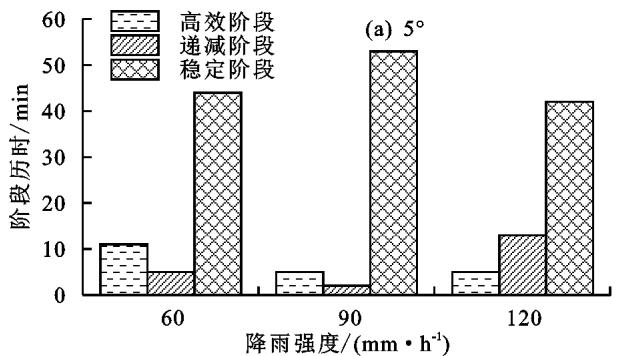

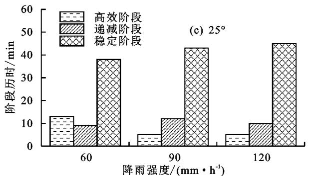

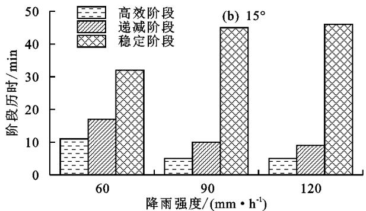

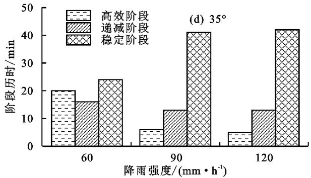

图4 减流效益随降雨历时变化阶段划分  
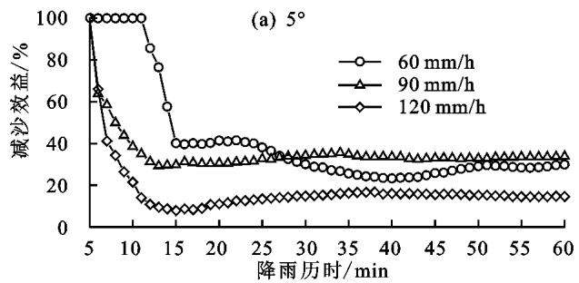

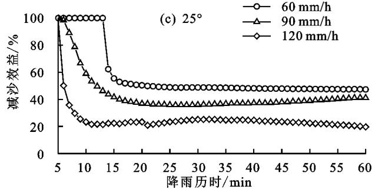  
图5 不同降雨历时减流效益变化过程

密目网苫盖减沙效益高效控制阶段随降雨强度增加而缩短 $5 ^ { \circ } , 1 5 ^ { \circ } , 2 5 ^ { \circ } , 3 5 ^ { \circ }$ 坡度下变化范围分别为$5 \sim 1 1 , 5 \sim 1 1 , 5 \sim 1 3 , 5 \sim 2 0 \ \mathrm { m i n } ;$ 递减阶段历时随降雨强度的增大也具有减小趋势 ，变化范围分别为5～15 $\operatorname* { m i n } ( 5 ^ { \circ } ) , 7 \sim 2 0 \ \operatorname* { m i n } ( 1 5 ^ { \circ } ) , 4 \sim 1 0 \ \operatorname* { m i n } ( 2 5 ^ { \circ } ) , 7 \sim 1 7$ min（35°） ； 稳定阶段历时随降雨强度增大而延长 且90，120mm／h降雨强度下相近 ，在40min附近波动（图6） 这表明，密目网类土工织物其对坡面侵蚀的控制性能受降雨历时的影响 一次降雨事件中密目网苫盖减沙效益在降雨20min左右达到最佳

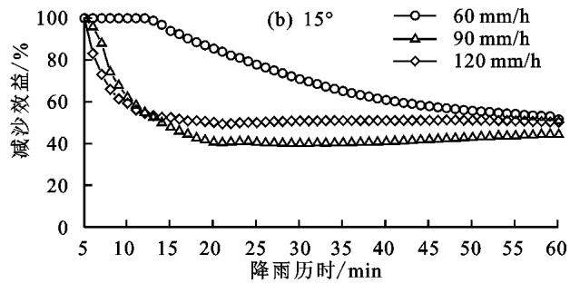

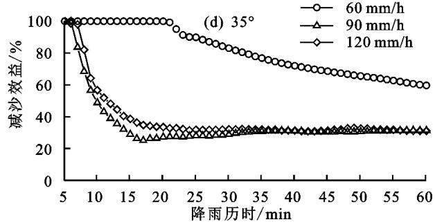

## 3 讨 论

## 3．1 密目网苫盖改变坡面产流历时作用原理

密目网苫盖处理对坡面产流历时具有显著抑制作用 Sutherland等［32］基于在椰壳土工布的研究也得到类似的结果；Shao等［14］ 通过室内模拟降雨发现 在50mm／h降雨强度下 土工布网（涤纶网）覆盖后坡面初始产流时间是裸地的1．4倍 差异分析表明 密目网苫盖在相同坡度不同降雨强度对产流历时抑制作用存在差异 且随着降雨强度的增大2种处理下产流历时差异逐渐缩小 原因可能是坡度较小时人工降雨下雨滴可均匀落到坡面的各个部位 在坡面形成薄层水流 紊乱程度低 对表层土壤的冲刷能力差 细沟侵蚀和细沟间侵蚀发育缓慢［33］ 导致坡面径流难以形成稳定的汇流路径 汇流时间较长 在苫盖后 由于密目网孔隙度较大 雨滴可直接穿透密目网打击地表 侵蚀条件与裸坡坡面具有一定的相似性但布设苫盖措施时 密目网与坡面紧密接触 在一定程度上相当于增加地表粗糙度 改变径流汇流路径径流流速减慢 对坡面径流汇流过程产生阻碍作用相反 随着坡度和降雨强度的增大 雨滴受到的重力沿坡面的分力增大 雨滴在坡面停滞的时间变短 径流沿坡面方向的运动速度快［34］ 对表层土壤的侵蚀能力加强 在坡面集中流的作用下更易形成稳定的汇流路径 进一步促进侵蚀沟的形成 最终形成密目网悬挂于坡面稳定汇流路径之上的景象 导致密目网对坡面径流的阻流作用显著降低 张志华等［35］ 通过模

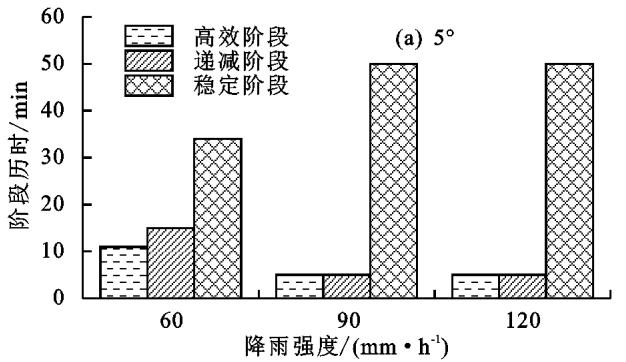

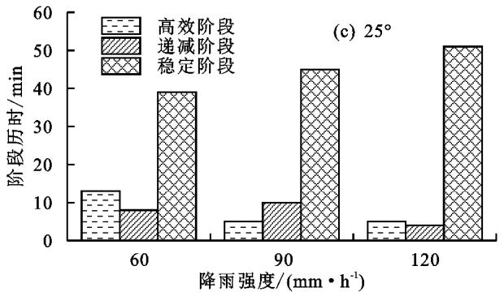  
图6 减沙效益随降雨历时变化阶段划分

## 3．2 密目网苫盖措施减流减沙效益作用原理

本试验研究表明 不同降雨强度和坡度组合条件下密目网苫盖在不同降雨历时均具有一定的减流减沙效益 相比减沙效益 随着降雨历时的延长密目网减流效益并不明显 这一结论在 Rickson等［36］ 的研究中得到证实 这是因为试验所用的密目网为聚乙烯材料生产加工而成的扁丝网 密目网空隙疏松透水性强，加之聚乙烯材料吸湿性小 ，持水性弱［37－38］ ，导致密目网苫盖对坡面径流的吸附和滞留能力较差 ；同时 径流在搬运 输移侵蚀泥沙的过程中受密目网细小网格的阻碍 大量泥沙颗粒在密目网网格中沉拟降雨发现，在产流初期， 土壤颗粒剥离大部分受股流的影响 导致产流初期侵蚀过程发育缓慢 与本文的结论一致 因此 密目网对坡面产流历时的抑制作用较差。

表2 减沙效益与降雨历时模型拟合
<table><tr><td rowspan="2">坡度 (°)</td><td rowspan="2">降雨强度/  $( \mathrm { m } \mathrm { m } \cdot \mathrm { h } ^ { - 1 } )$ </td><td colspan="2">回归模型</td><td rowspan="2"> $R ^ { 2 }$ </td><td rowspan="2"> $F$ </td><td rowspan="2"> $\boldsymbol { \phi }$ </td></tr><tr><td>a</td><td>b</td></tr><tr><td rowspan="3">5</td><td>60</td><td>0.733</td><td>0.282</td><td>0.789</td><td>240.965</td><td>&lt;0.01</td></tr><tr><td>90</td><td>0.933</td><td>0.292</td><td>0.636</td><td>101.592</td><td>&lt;0.01</td></tr><tr><td>120</td><td>0.822</td><td>0.492</td><td>0.497</td><td>57.403</td><td>&lt;0.01</td></tr><tr><td rowspan="3">15</td><td>60</td><td>1.306</td><td>0.220</td><td>0.903</td><td>195.801</td><td>&lt;0.01</td></tr><tr><td>90</td><td>1.164</td><td>0.281</td><td>0.768</td><td>191.895</td><td>&lt;0.01</td></tr><tr><td>120</td><td>1.014</td><td>0.193</td><td>0.746</td><td>170.285</td><td>&lt;0.01</td></tr><tr><td rowspan="3">25</td><td>60</td><td>1.222</td><td>0.260</td><td>0.755</td><td>174.647</td><td>&lt;0.01</td></tr><tr><td>90</td><td>1.175</td><td>0.310</td><td>0.735</td><td>160.738</td><td>&lt;0.01</td></tr><tr><td>120</td><td>0.878</td><td>0.379</td><td>0.650</td><td>107.672</td><td>&lt;0.01</td></tr><tr><td rowspan="2">35</td><td>60</td><td>1.160</td><td>0.162</td><td>0.919</td><td>111.484</td><td>&lt;0.01</td></tr><tr><td>90</td><td>1.145</td><td>0.371</td><td>0.681</td><td>123.584</td><td>&lt;0.01</td></tr><tr><td></td><td>120</td><td>2.144</td><td>0.675</td><td>0.918</td><td>264.267</td><td>&lt;0.01</td></tr></table>

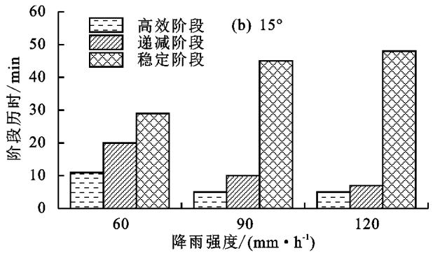

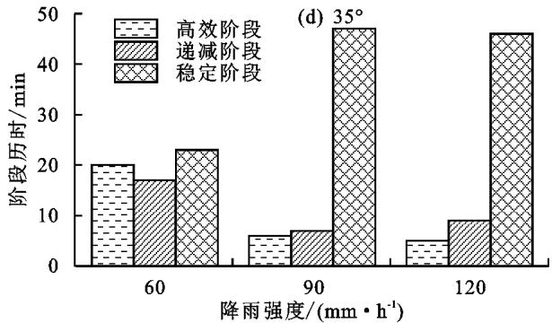

积，一定程度上增大坡面径流含沙量 ， 加之密目网这种覆盖层的特殊存在形式 也在一定范围内导致坡面径流的透气性降低 使得密目网苫盖的径流调控效益不明显， 甚至在一定的坡度和降雨强度共同作用下随着降雨历时的延长几乎丧失径流调控能力例如 当堆积体坡度为25°时 120mm／h降雨强度下降雨历时在30min以后密目网减流效益几乎趋于0 然而，这一结论与Giménez－Morera等［39］基于模拟降雨试验认为土工布覆盖后的坡面将会产生更多的径流相反 这主要与土工织物材料和土壤特性有关，先前的研究中土工织物由棉花制成 ， 具有低透水性，因而与具有高入渗能力的沙质裸地相比 ， 土工织物的覆盖增加了径流

不同降雨历时和坡度下密目网减沙效益随降雨历时的关系可用幂函数很好地拟合 趋于稳定的减沙效益在7．89％～74．60％范围内波动 密目网苫盖措施布设于堆积体坡面上 降雨时雨滴在自由落体的过程中打击密目网破裂 大雨滴与密目网接触后分散雨滴动能衰减［40］ ， 密目网在避免部分雨滴与坡面直接接触的同时也缓冲其对土壤表层的击溅侵蚀 能够避免堆积体坡面表层土壤颗粒在与雨滴接触过程中的直接侵蚀量［41］ 另一方面 由于密目网缠绕连接形成的特殊网目结构模式 在侵蚀发生前期 密目网网格可吸附拦截一定数量的侵蚀泥沙颗粒 在吸附拦截的泥沙不断淤积下 沉积泥沙与密目网网格相互绞结，从而形成“内网外沙”的微小拦挡结构 ， 这些微小结构不仅阻碍径流输移 降低坡面径流流速［42］ 在一定程度上进一步拦蓄泥沙颗粒 然而 试验结果表明 不同降雨强度和坡度组合下减沙效益随降雨历时延长均呈现降低趋势 这是由于随着降雨过程的进行 坡面径流稳定汇流路径逐步形成 在集中流的作用下侵蚀过程加快 细沟侵蚀不断发育 密目网悬挂于坡面细沟上方的景象不断发生 “内网外沙”的微小拦挡结构在雨滴打击和径流冲刷下进一步被破坏 导致密目网网格吸附拦截泥沙颗粒的数量减少 仅有部分细小泥沙颗粒被密目网吸附 但结合本文研究结果 密目网苫盖的减沙效益依旧显著 $( \phi < 0 . 0 5 )$ 同时，降雨历时延长的本质表现为降雨量和坡面承接雨量的增加 基于试验用土理化性质 密目网苫盖减流减沙效益与坡面承接雨量呈显著负相关关系 （表$3 , p { < } 0 . 0 5 )$ 这表明对于密目网苫盖这类坡面防护措施，随降雨历时的延长， 减流减沙效益降低的一个可靠原因可归因于坡面承接雨量的增大

表3 密目网苫盖减流减沙效益与坡面承接雨量相关性分析
<table><tr><td>指标</td><td> $P _ { 1 }$ </td><td> $P _ { 2 }$ </td><td> $P _ { 3 }$ </td><td> $L P _ { 1 }$ </td><td> $L P _ { 2 }$ </td><td> $L P _ { 3 }$ </td><td> $N P _ { 1 }$ </td><td> $N P _ { 2 }$ </td><td> $N P _ { 3 }$ </td></tr><tr><td> $P _ { 1 }$ </td><td> $1 . 0 0 0$ </td><td></td><td></td><td></td><td></td><td></td><td></td><td></td><td></td></tr><tr><td> $P _ { 2 }$ </td><td> $1 . 0 0 0 ^ { \ast \ast }$ </td><td>1.000</td><td></td><td></td><td></td><td></td><td></td><td></td><td></td></tr><tr><td> $P _ { 3 }$ </td><td> $1 . 0 0 0 ^ { \ast \ast }$ </td><td> $1 . 0 0 0 ^ { \ast \ast }$ </td><td> $1 . 0 0 0$ </td><td></td><td></td><td></td><td></td><td></td><td></td></tr><tr><td> $L P _ { 1 }$ </td><td> $- 0 . 8 0 9 ^ { \ast \ast }$ </td><td> $- 0 . 8 0 9 ^ { \ast \ast }$ </td><td> $- 0 . 8 0 9 ^ { \ast \ast }$ </td><td>1.000</td><td></td><td></td><td></td><td></td><td></td></tr><tr><td> $L P _ { 2 }$ </td><td> $- 0 . 6 8 9 ^ { \ast \ast }$ </td><td> $- 0 . 6 8 9 ^ { \ast \ast }$ </td><td> $- 0 . 6 8 9 ^ { \ast \ast }$ </td><td> $0 . 7 0 9 ^ { * * }$ </td><td>1.000</td><td></td><td></td><td></td><td></td></tr><tr><td> $L P _ { 3 }$ </td><td> $- 0 . 7 0 2 ^ { \ast \ast }$ </td><td> $- 0 . 7 0 2 ^ { \ast \ast }$ </td><td> $- 0 . 7 0 2 ^ { \ast \ast }$ </td><td> $0 . 7 4 3 ^ { \ast \ast }$ </td><td> $0 . 9 4 0 ^ { \ast \ast }$ </td><td>1.000</td><td></td><td></td><td></td></tr><tr><td> $N P _ { 1 }$ </td><td> $- 0 . 7 4 6 ^ { \ast \ast }$ </td><td> $- 0 . 7 4 6 ^ { \ast \ast }$ </td><td> $- 0 . 7 4 6 ^ { \ast \ast }$ </td><td> $0 . 9 6 5 ^ { \ast \ast }$ </td><td> $0 . 6 6 3 ^ { \ast \ast }$ </td><td> $0 . 6 7 6 ^ { \ast \ast }$ </td><td>1.000</td><td></td><td></td></tr><tr><td> $N P _ { 2 }$ </td><td> $\cdot 0 . 5 7 7 ^ { \ast \ast \ast }$ </td><td> $- 0 . 5 7 7 ^ { \ast \ast \ast }$ </td><td> $- 0 . 5 7 7 ^ { \ast \ast }$ </td><td> $0 . 5 8 4 ^ { \ast \ast }$ </td><td> $0 . 9 3 8 ^ { \ast \ast }$ </td><td> $0 . 8 5 7 ^ { \ast \ast }$ </td><td> $0 . 5 5 8 ^ { \ast \ast }$ </td><td>1.000</td><td></td></tr><tr><td> $N P _ { 3 }$ </td><td> $\cdot 0 . 4 9 9 ^ { \ast \ast } \ast$ </td><td> $\cdot 0 . 4 9 9 ^ { \ast \ast }$ </td><td> $- 0 . 4 9 9 ^ { \ast \ast }$ </td><td> $0 . 6 2 5 ^ { \ast \ast }$ </td><td> $0 . 8 2 9 ^ { \ast \ast }$ </td><td> $0 . 7 9 4 ^ { \ast \ast }$ </td><td> $0 . 6 7 9 ^ { \ast \ast }$ </td><td>0.852**</td><td>1.000</td></tr></table>

注 ： P1 P2和 $P _ { 3 }$ 3分别为60，90，120mm／h降雨强度坡面承接降雨量 ${ \mathrm { ( L ) } } _ { \vphantom { \mathrm { ( L ) } } } _ { \vphantom { \mathrm { ( L ) } } } _ { ; L P _ { 1 } , L P _ { 2 } }$ 2和 $L P _ { 3 }$ 分别为60，90，120mm／h降雨强度下的减流效益（％） ；NP1 NP2 NP3分别为6090120mm／h降雨强度下的减沙效益 $( \% ) : \ast$ 表示 p＜0．05； ＊ ＊ 表示 p＜0．01。

## 3．3 试验不足与改进

本研究评估了不同降雨强度和坡度下密目网苫盖减流减沙效益随降雨历时变化规律 密目网苫盖的减流减沙效益均随降雨历时延长而减小 最终趋于稳定 且不同降雨强度和坡度下密目网苫盖减沙效益显著 尽管如此 本试验在实验室条件下进行 所用土槽坡长仅为2m，多小于生产建设项目工程堆积体实际坡长 未来应在自然条件下的田间尺度上验证结果，以更好地为生产建设项目水土保持临时措施的配置和布设提供理论依据

## 4 结 论

（1） 60mm／h临时苫盖措施在5°时坡面产流历时与裸地坡面相近，90，120mm／h时仅在15°～25°对坡面产流历时有显著抑制作用（p＜0．05） 。

（2） 同一坡度60mm／h与90，120mm／h降雨强度下减流效益差异显著 $( \phi < 0 . 0 5 )$ ， 密目网苫盖处理坡面减流效益在90mm／h降雨强度达到阈值

（3） 密目网苫盖处理下，60 mm／h与90，120mm／h降雨强度坡面减沙效益在 $5 ^ { \circ } , 1 5 ^ { \circ } , 2 5 ^ { \circ } , 3 5 ^ { \circ }$ °时均表现为随降雨历时延长而减小 90mm／h降雨强度临时苫盖处理坡面减沙效益达到阈值

（4） 幂函数模型能很好地描述不同降雨强度和坡度下密目网苫盖减流减沙效益随降雨历时的变化关系 效益衰减系数（b）随降雨强度的增大而递增

（5） 密目网苫盖处理减流减沙效益随降雨历时变化可分为高效阶段 递减阶段和稳定阶段 苫盖后最佳减流效益与最佳减沙效益不具有同时性 最佳减流效益历时总体小于30min， 最佳减沙效益历时在20min附近。

## 参考文献 ：

［1］ 张文博 ， 吕佼容 ， 谢永生 ， 等．不同形态工程堆积体产流产沙对比研究［J］．水土保持学报 ，2020，34（3） ：49－54

［2］ 刘超 ，曹博召 ，王 健 ，等．基 于 WEPP模型的工程堆积体不同堆置方式的水土流失效应研究［J］．自 然 灾 害 学 报 ，2022，31（2） ：261－270

［3］ GilleyJE．Runoffanderosioncharacteristicsofsurface－ minedsitesinWesternNorthDakota［J］．Transactionsof

theASAE197720（4） 697－700

［4］ RicksM D， WilsonW T， ZechW C， etal．Evaluationofhydromulchesasanerosioncontrolmeasureusingla－boratory－scaleexperiments［J］．Water（Basel） 202012（2） ： e515

［5］ 沈奕彤 郭成久 李海强 等．降雨历时对黑土坡面养分流失的影响［J］．水土保持学报 ，2016，30（2） ：97－101

［6］ 赵玉丽 ，牛健植．人工模拟降雨试验降雨特性及问题分析［J］．水土保持研究 ，2012，19（4） ：278－283

［7］ 牛耀彬 ， 吴旭 ， 高照良 ， 等．降雨和上方来水条件下工程堆积体坡面土壤侵蚀特征［J］．农业工程学报 ，2020，36（8） ：69－77

［8］ ZhengFL， HeXB， GaoXT， etal．EffectsoferosionpatternsonnutrientlossfollowingdeforestationontheLoessPlateauofChina［J］．Agriculture， EcosystemsandEnvironment2005108（1） ：85－97

［9］ 段剑 ，王凌云 ，肖胜生．红砂岩侵蚀区典型水土流失治理模式减流减沙效应［J］．水资源与水工程学报 ，2018，29（6） ：227－233

［10］ 杨振奇 郭建英 秦富仓 等．裸露砒砂岩区降雨条件下坡面微地形变化规律［J］．水土保持学报，2021，35（3） ：111－118

［11］ 耿晓东 ，郑粉莉 ， 刘力．降雨强度和坡度双因子对紫色土坡面侵蚀产沙的影响［J］．泥沙研究 ，2010（6） ：48－53

［12］ 徐震 ，高建恩 ，赵春红 ，等．雨滴击溅对坡面径流输沙的影响［J］．水土保持学报 ，2010，24（6） ：20－23

［13］ SmetsT， PoesenJ， BhattacharyyaR， etal．Evaluation ofbiologicalgeotextilesforreducingrunoffandsoil lossundervariousenvironmentalconditionsusinglabo－ ratoryandfieldplotdata［J］．LandDegradationandDe－ velopment，2011，22（5） ：480－494

［14］ ShaoQ， GuW， DaiQY， etal．Effectivenessofgeo－ textilemulchesforsloperestorationinsemi－aridnorth－ ernChina［J］．Catena2014116：1－9

［15］ RicksonRJ OwensPN RicksonRJ etal．Control－ lingsedimentatsource： Anevaluationoferosioncon－ trolgeotextiles［J］．EarthSurfaceProcessesandLand－ forms，2006，31（5） ：550－560

［16］ BhattacharyyaR SmetsT FullenM A etal．Effec－tivenessofgeotextilesinreducingrunoffandsoilloss：Asynthesis［J］．Catena201081（3） ：184－195

［17］ LiuG ZhengFL JiaL etal．Interactiveeffectsof raindropimpactandgroundwaterseepageonsoilero－ sion［J］．JournalofHydrology，2019，578：e124066

［18］ LuJ， ZhengFL， LiGF，etal．Theeffectsofraindrop impactandrunoffdetachmentonhillslopesoilerosion andsoilaggregatelossintheMollisolregionofNortheast China［J］．SoilandTillageResearch，2016，161：79－85

［19］ MüglerC， RibolziO， JaneauJ， etal．Experimental andmodellingevidenceofshort－termeffectofraindrop impactonhydraulicconductivityandoverlandflowin－ tensity［J］．JournalofHydrology2019570：401－410

［20］ MeyerLD．Effectofflowrateandcanopyonrillerosion［J］TransactionsoftheASAE，1975，18（5） ：905－911

［21］ 郑粉莉 ，唐克丽 ， 张成娥．降雨动能对坡耕地细沟侵蚀影响的研究［J］．人民黄河 1995（7） ：22－24

［22］ 顾儒馨 倪九派 刘月娇．模拟降雨对工程建设区裸露坡地产流产沙及氮素流失的影响［J］．水土保持学报201731（2） 33－39

［23］ BeullensJ， vandeVeldeD， NyssenJ．Impactofslope aspectonhydrologicalrainfallandonthemagnitudeof rillerosioninBelgiumandnorthernFrance［J］．Catena， 2014114：129－139

［24］ KalibovaJ PetruJ JackaL．Impactofrainfallinten－sityonthehydrologicalperformanceoferosioncontrolgeotextiles［J］．EnvironmentalEarthSciences，2017，76（12） ：1－9

［25］ LiuC WangKH GaoLH etal．Influenceofrain－fallintensityandslopeonrunoffandsedimentreduc－tionbenefitsoffinemeshnetonconstructionspoilde－posits［J］．Sustainability，2022，14（9） ：e5288

［26］ ZhaoLS， LiangXL， WuFQ．SoilsurfaceroughnesschangeanditseffectonrunoffanderosionontheLoessPlateauofChina［J］．JournalofAridLand，2014，6（4） ：400－409

［27］ IserlohT， RiesJB， ArnaezJ， etal．Europeansmall portablerainfallsimulators： Acomparisonofrainfall characteristics［J］．Catena，2013，110：100－112

［28］ 中华人民共和国国家质量监督检验检疫总局 中国国家标准化管理委员会．安全网 ：GB5725－2009［S］．北京 中国质检出版社 2009

［29］ 史倩华 ，王文龙 ，郭明明 ，等．模拟降雨条件下含砾石红壤工程堆积体产流产沙过程［J］．应用生态学报 ，2015，26（9） ：2673－2680

［30］ 路培 王林华 吴发启．不同降雨强度下土壤结皮强度对侵蚀的影响［J］．农业工程学报，2017，33（8） ：141－146

［31］ 莫崇勋 ，黄怡婷 ，何嘉奇 ，等．基于汛期分期的洪峰流量特征研究［J］．水力发电 ，2018，44（3） ：5－9

［32］ SutherlandR A， ZieglerA D．Effectivenessofcoir－ basedrollederosioncontrolsystemsinreducingsedi－ menttransportfromhillslopes［J］．AppliedGeography， 200727（3） ：150－164

［33］ 贾莲莲 ，刘雅丽 ，朱冰冰 ，等．不同草带空间分布对坡面细沟侵蚀调控机制 ［J］．水土保持学报 ，2021，35（1） ：145－148

［34］ MardamootooT， duPreezCC， SharpleyAN．Phosphorus mobilizationfromsugarcanesoilsinthetropicalenvironment ofMauritiusundersimulatedrainfall［J］．NutrientCycling inAgroecosystems，2015，103（1） ：29－43

［35］ 张志华 聂文婷 许文盛 等．不同水土保持临时措施下工程堆积体坡面减流减沙效应 ［J］．农业工程学报 ，2022，38（1） ：141－150

（下转第30页）

tionpropertiesaffectedbytypicalplantcommunitieson steepgullyslopesontheLoessPlateauofChina［J］ JournalofHydrology，2020，590：e125535

［18］ 肖培青 姚文艺 申震洲 等．苜蓿草地侵蚀产沙过程及其水动力学机理试验研究［J］．水利学报 ，2011，42（2） ：232－237

［19］ 贾莲莲 刘雅丽 朱冰冰 等．不同草带空间分布对坡面细沟侵蚀调控机制 ［J］．水土保持学报 ，2021，35（1） ：145－148，153

［20］ 于国强 ，贾莲莲 ，朱冰冰 ，等．不同坡位的植被缓冲带对坡面侵蚀产沙来源的影响［J］．水土保持研究 202027（6） ：9－13

［21］ 王钰 ，朱冰冰 ， 冯起．草地坡面径流侵蚀动力特征模拟［J］．中国沙漠 ，2020，40（6） ：162－168

［22］ 潘成忠 上官周平．不同坡度草地含沙水流水力学特性及其拦沙机理［J］．水科学进展，2007，18（4） ：490－495

［23］ 王俊杰 张宽地 龚家国 等．不同覆盖度条件坡面水流阻力规律［J］．水土保持学报 ，2015，29（5） ：1－6

［24］ 张宪奎 ，许靖华 ，卢秀琴 ，等．黑龙江省土壤流失方程的研究［J］．水土保持通报 ，1992，12（4） ：1－9，18

［25］ GongJG， JiaYW， ZhouZH， etal．Anexperimentalstudyondynamicprocessesofephemeralgullyerosioninloesslandscapes［J］．Geomorphology， 2011，125（1） ：203－213

［26］ GuoTL， WangQJ， LiDQ， etal．Sedimentandsol－utetransportonsoilslopeundersimultaneousinfluenceofrainfallimpactandscouringflow［J］．HydrologicalProcesses，2010，24（11） ：1446－1454

［27］ GuoM M， ChenZX， WangWL， etal．Spatiotempo－ ralchangesinflowhydrauliccharacteristicsandsoil lossduringgullyheadcuterosionundercontrolledcon－ ditions［J］．Hydrologyand Earth System Sciences， 2021，25：4473－4494

［28］ SmithM W， CoxNJ， BrackenLJ．Applyingflowre－ sistanceequationstooverlandflows［J］．Progressin

## （上接第16页）

［36］ RicksonRJ， OwensPN， RicksonRJ， etal．Control－ lingsedimentatsource： Anevaluationoferosioncon－ trolgeotextiles［J］．EarthSurfaceProcessesandLand－ forms200631（5） ：550－560

［37］ KinlochAJ， LittleMSG， WattsJF．Theroleoftheinterphaseintheenvironmentalfailureofadhesivejoints［J］．ActaMaterialia，2000，48（18／19） ：4543－4553

［38］ LauKY ZafrullahSNRM IsmailIZ etal．Effectsof wateronbreakdowncharacteristicsofpolyethylenecom－ posites［J］．JournalofElectrostatics，2018，96：119－127

［39］ Giménez－MoreraA SinogaJDR CerdàA．Theim

PhysicalGeography，2007，31（4） ：363－387

［29］ XuXM， ZhengFL， WilsonG．V．Flowhydraulicsin anephemeralgullysystemunderdifferentslopegradi－ ents rainfallintensitiesandinflowconditions［J］．Cate－ na，2021，203：e105359

［30］ 田凯 ，李小青 ，鲁帆 ，等．坡面流侵蚀水动力学特性研究综述［J］．中国水土保持 ，2010（4） ：44－47，68

［31］ 杨庆楠 ，徐金忠 ，李志飞 ，等．典型黑土区陡坡植草水土流失防治效果研究 ［J］．水土保持通报 ，2019，39（6） ：117－123

［32］ BiY， ZouH， ZhuC W．Dynamicmonitoringofsoil bulkdensityandinfiltrationrateduringcoalminingin sandylandwithdifferentvegetation［J］．International JournalofCoalScienceandTechnology，2014，1（2） ： 198－206

［33］ 张炜 ，郝巍魏 ，闫文博 ，等．进水水力负荷对植被浅沟雨水径流控制效果的影响 ［J］．水电能源科学 ，2020，38（8） ：22－25

［34］ 龚家国 王文龙 郭军权．黄土丘陵沟壑区浅沟水流水动力学参数试验研究［J］．中国水土保持科学 20086（1） ：93－100

［35］ 车小力 王文龙 郭军权 等．上方来水来沙对浅沟侵蚀产沙及水动力参数的影响 ［J］．中国水土保持科学20119（3） ：26－31

［36］ SunJQ ZhangNG ShiM X etal．Theeffectsof tillageinducedsurfaceroughness， slopeanddischarge rateonsoildetachmentbyconcentratedflow： Anex－ perimentalstudy［J］．HydrologicalProcesses，2021，35 （6） ：e14261

［37］ AnJ ZhengFL HanY．Effectsofrainstormpat－ternsonrunoffandsedimentyieldprocesses［J］．SoilScience，2014，179（6） ：293－303

［38］ YangJH， LiuHQ， ZhangJP， etal．Labsimulation ofsoilerosiononcultivatedsoilslopes with wheat strawincorporation［J］．Catena，2022，210：e105865

pactofcottongeotextilesonsoilandwaterlossesfrom Mediterraneanrainfedagriculturalland［J］．LandDegra－ dationandDevelopment201021（2） 210－217

［40］ ShenES， LiuG， JiaYF， etal．Effectsofraindrop impactontheresistancecharacteristicsofsheetflow ［J］．JournalofHydrology ，2021，592：e125767

［41］ 杨春霞 姚文艺 肖培青 等．植被覆盖结构对坡面产流产沙的影响及调控机制分析 ［J］．水利学报 201950（9） ：1078－1085

［42］ RicksonRJ．Controllingsedimentatsource： Anevalu－ ationoferosioncontrolgeotextiles［J］．EarthSurface ProcessesandLandforms，2006，31（5） ：550－560