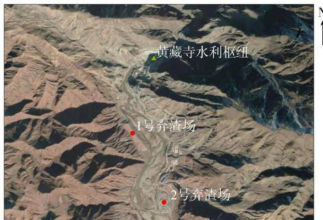
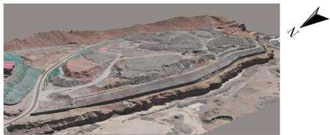
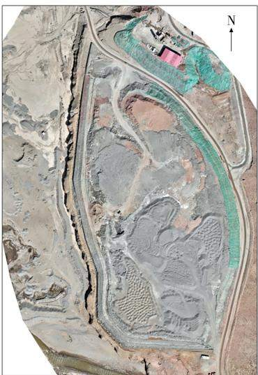
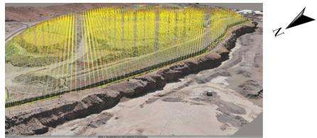
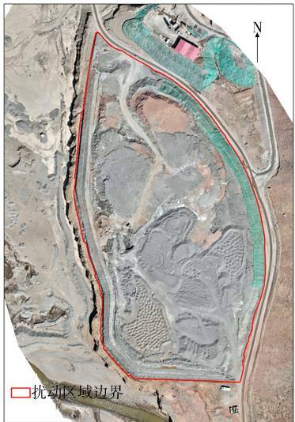
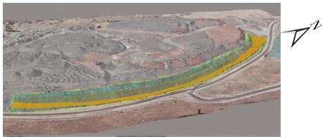
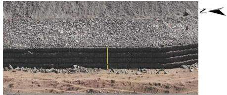
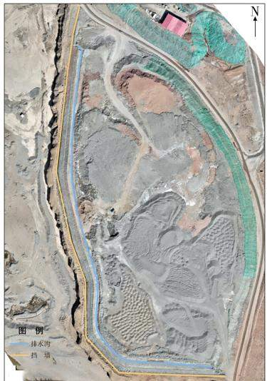

# 倾斜摄影三维模型在生产建设项目水土保持监测中的应用—以黄藏寺水利枢纽工程为例王玺圳1，程红刚²，曹雪峰1

(1. 水利部黄河水利委员会黄河上中游管理局，陕西西安710021；2. 西安黄河规划设计有限公司，陕西西安710021)

摘 要：为提升祁连山地区黑河流域生产建设项目全过程水土保持监测水平，选取黑河干流首座控制性调蓄工程—黄藏寺水利枢纽工程，应用无人机倾斜摄影测量技术，构建了高精度的弃渣场实景三维模型，在此基础上计算了弃渣量、弃渣高度、挡墙高度等指标，同时结合无人机正射遥感影像对弃渣场扰动面积及水土保持工程措施进行了解译计算，最后通过对比水土保持方案中弃渣场各指标的设计值，对水土保持措施落实情况进行了评价。结果表明：通过倾斜摄影测量技术构建的实景三维模型可精确计算弃渣场的各项水土保持措施指标，黄藏寺水利枢纽工程项目施工过程中实施的水土保持措施量基本符合水土保持方案设计值，土地扰动面积和弃渣量均在设计值之内。

关键词：倾斜摄影；水土保持；监测；黄藏寺水利枢纽工程

中图分类号：S157

文献标识码：A

DOI:10.3969/j. issn.1000-0941.2025.02.014

引用格式：王玺圳，程红刚，曹雪峰.倾斜摄影三维模型在生产建设项目水土保持监测中的应用：以黄藏寺水利枢纽工程为例[J].中国水土保持，2025(2):47-49.

传统生产建设项目水土保持监测多采用定位观测和实地调查的方式对项目扰动区域进行水土保持监测。在新时代水土保持工作的要求下，无人机遥感技术的应用在提高监测工作效率、提升监测结果直观性方面相比传统监测手段具有无可比拟的优势[1-3]，而现阶段多采用无人机全景或正射影像对生产建设项目进行监测45]，此方法只能反映地面监测对象的面积、长度等信息，无法对三维物体体积进行有效测量[6-7]。本研究在常用的无人机遥感监测方法基础上拓展使用倾斜摄影测量技术，构建高精度弃渣场实景三维模型，对黄藏寺水利枢纽工程开展水土保持监测，以期为强化水行政主管部门水土保持监测工作提供参考。

## 1 研究区概况

## 1.1 地理位置

黑河黄藏寺水利枢纽工程位于青海和甘肃两省交界的黑河上游峡谷，河段左岸是甘肃祁连山国家级自然保护区，右岸是青海祁连山省级自然保护区，水土流失防治责任重大。

## 1.2 气候及植被

受青藏高原气候影响，项目区气候类型为高寒半干旱气候。坝址海拔在2500m以上，多年平均降水量400mm,其中6—9月降水量占全年降水量的78%；多年平均气温0.7℃，极端最低气温-31.1℃，极端最高气温30.5℃。天然乔木林主要树种为青海云杉、祁连圆柏、青杨，灌木树种主要为沙棘、高山柳。山地阳坡多为山地草原和灌丛，河谷地区主要为耕作区，种植小麦、青稞、豌豆、油菜等农作物。

## 1.3 弃渣场概况

项目共设计有5座弃渣场，其中1、3、4、5号弃渣场级别为4级，2号弃渣场为3级；1、2号弃渣场为库区台地型弃渣场(见图1）,3、4、5号弃渣场为沟道型弃渣场。综合弃渣场级别、重要性和安全性等因素考虑，本次研究选取设计堆渣量最大的2号弃渣场为研究对象。

  
图1 黄藏寺水利枢纽工程1号、2号弃渣场位置

2号弃渣场位于黑河右岸，设计占地面积11.72$\mathrm { h m } ^ { 2 }$ 、弃渣总量116.02万 $\mathbf { m } ^ { 3 }$ ,弃渣场堆高 20 m，高程范围为2563\~2583 m,堆渣边坡比降为1： $2 _ { \circ }$ 施工期可过水，为保证弃渣场在施工期稳定，防止弃渣造成河道淤积，除设计铅丝石笼拦挡外，还在弃渣场坡面及顶面周边5m范围内采取干砌石护坡措施，护坡厚度0.3m,干砌石护坡工程量7273m³。

## 2 研究内容及方法

## 2.1 基于倾斜摄影生成弃渣场三维模型

利用倾斜摄影测量技术采集2号弃渣场扰动范围的无人机影像。飞行任务于2023年3月进行，选用大疆Mavic3E无人机，选取无风、晴朗的正午根据规划航线进行航拍，在航高60m条件下采集的数据精度为正射地面分辨率1.61 cm、倾斜地面分辨率2.28$\mathrm { { c m } _ { \mathrm { { o } } } }$ 采用 ContextCapture摄影测量软件对影像数据进行处理，该软件通过将收集到的影像数据进行预处理，对不同航线、不同时间拍摄的影像进行匹配，建立相应的影像配准模型；根据影像匹配结果，将每个像素点转换成对应的三维坐标点，形成点云数据；根据点云数据，采用曲面重建、体素化等方法，建立完整的三维模型。图2为本次建立的弃渣场三维模型。

  
图2 2号弃渣场三维模型

## 2.2 获取数字正射影像

在采集的倾斜摄影数据中筛选出正射影像，利用Pix4Dmapper 软件制作弃渣场的数字表面模型(DSM)

  
图3 2号弃渣场数字正射影像

和数字正射影像(DOM)（见图3)。Pix4Dmapper是一款图像重建软件，可以根据原始静态照片重建数字模型，再利用ArcMap软件计算弃渣场扰动土地面积和水土保持措施数量等数据。

## 2.3 利用三维模型及数字正射影像对弃渣场进行监测

利用 ContextCapture 软件中的 Acute3D Viewer 计算弃渣场堆渣体积。将Pix4Dmapper软件制作的弃渣场 DOM 影像导入 ArcMap 软件,再利用人工解译的方式统计弃渣场扰动区域面积及各项水保措施实施情况。

## 3 研究结果与分析

## 3.1 弃渣场堆渣体积计算

通过 Acute3D Viewer 打开弃渣场三维模型，利用软件中的体积测量工具沿弃渣场范围人工勾绘弃渣场范围。由于2号弃渣场类型为库区台地型，因此以弃渣场周边原地貌高程作为基准面，设置高程使得填方量为0，则挖方量即为弃渣量，据此计算得出弃渣量为105.33万m³(见图4)。

  
图 4 通过 Acute3D Viewer 测量 2 号弃渣场堆渣量

## 3.2 弃渣场扰动范围面积计算

通过 Pix4Dmapper 获得 DOM 影像后,将 DOM 导入ArcMap，人工解译弃渣场的扰动范围，利用图层属性表中的“计算几何”工具计算扰动范围面积，得到2号弃渣场的扰动面积为8.74 hm²(见图5)。

  
图 5 通过 ArcMap人工解译并计算 2 号弃渣场扰动面积

## 3.3 水土保持措施监测

通过 Acute3D Viewer 打开 2 号弃渣场三维模型，采用曲面面积测量工具勾绘临时苫盖面积(见图6)，获取到2号弃渣场的苫盖面积为 $5 ~ 2 9 8 . 3 7 ~ \mathrm { m } ^ { 2 }$ 。此方法可快速准确获取坡面水土保持措施的面积，相比传统正射遥感影像解译计算的措施投影面积更能精准反映实际水土保持措施数量。此外，还利用Acute3DViewer内置的长度测量工具对弃渣场最大堆渣高度、挡墙高度等进行了量算(见图7)，分别得出最大堆渣高度为17.38m,挡墙高度为4.01 $\mathbf { m } _ { \mathrm { ~ o ~ } }$

图 6 通过 Acute3D Viewer 测量 2 号弃渣场临时苫盖面积  
  
图 7 利用 Acute3D Viewer 获取 2 号弃渣场挡墙高度

## 3.4 水土保持方案措施落实情况评价

根据批复的项目水土保持设计方案，对照实景三维成果和正射遥感影像，可对项目区弃渣场及其周边的水土保持措施落实情况进行评价。以项目2号弃渣场为例，采用长度、高度、面积、体积等量算方法，将2号弃渣场正射遥感影像导入ArcMap，可解译并计算挡墙及排水沟的长度、宽度等指标(见图8)，其中挡墙长631.6m、宽0.82m,排水沟长536.7m、宽0.41m。

  
图 8 通过 ArcMap 测量2号弃渣场挡墙和排水沟指标

对项目各项水土保持措施完成情况进行评价，结果见表 $1 _ { \circ }$ 由表1可以看出，项目2号弃渣场的弃渣量、扰动面积及弃渣高度等重要指标均在设计值范围内，挡墙及排水沟的各项指标也与设计值基本一致。因此，可以判定项目2号弃渣场的实际弃渣量、扰动面积和各项水土保持措施均符合水保方案设计要求。

表1 项目2号弃渣场水土保持措施落实情况
<table><tr><td>措施名称</td><td>设计值</td><td>实施值</td></tr><tr><td>弃渣量/万  $\mathrm { m } ^ { 3 }$ </td><td>134.55</td><td>105.33</td></tr><tr><td>扰动面积  $\mathrm { \langle h m } ^ { 2 }$ </td><td>14.68</td><td>8.47</td></tr><tr><td>弃渣高度  $/ \mathrm { m }$ </td><td>20.00</td><td>17.38</td></tr><tr><td>挡墙高度  $\gamma _ { \mathrm { m } }$ </td><td>4.00</td><td>4.01</td></tr><tr><td>挡墙长度  $/ \mathrm { m }$ </td><td>672.0</td><td>631.6</td></tr><tr><td>挡墙顶宽  $/ \mathrm { m }$ </td><td>0.80</td><td>0.82</td></tr><tr><td>排水沟长度  $\gamma _ { \mathrm { m } }$ </td><td>540.0</td><td>536.7</td></tr><tr><td>排水沟宽度  $\dot { \gamma } _ { \mathrm { m } }$ </td><td>0.30</td><td>0.41</td></tr></table>

## 4 结束语

本研究在传统正射遥感影像的基础上，通过应用倾斜摄影测量技术，建立了生产建设项目弃渣场三维模型，并对水土保持措施类型及数量进行了解译，实现了对水土保持措施数量、分布及运行情况的精细化监测。同时，利用项目水保方案设计值对落实情况进行了评价，为水行政主管部门监督和管理提供了科学的数据支撑。相较于以往的监测手段，本研究所用方法可精准获取弃渣场的弃渣量、弃渣高度及挡墙高度等三维立体信息。此方法的应用能真实展示监测对象的细节与全貌，有助于水行政主管部门和项目建设单位直观了解项目区水土流失隐患及危害，对水土流失的预防和治理具有重要作用。

## 参考文献：

[1]许强，朱星，李为乐，等.“天-空-地”协同滑坡监测技术进展[J].测绘学报,2022,51(7):1416-1436.

[2]刘军，王磊.基于无人机倾斜摄影的黄土滑坡调查与危险 性评价[J].水土保持通报,2023,43(2):139-147.

[3]施明新.无人机技术在生产建设项目水土保持监测中的应用[J].水土保持通报,2018,38(2):236-240,329.

[4]胡云华，许海超，曲双锋，等.倾斜摄影测量技术在生产建设项目水土保持监管中的应用[J].水土保持研究，2022，29(6):438-443.

[5]程复，时宇，罗志东，等.生产建设项目水土保持监管新技术运用思考[J]. 中国水土保持,2023(3):44-47.

6]曾麦脉，赵院，李万能，等.无人机在生产建设项目水土保持“天地一体化”监管中的应用[J].中国水土保持,2016(11):28-31.

[7]习超，李开伟，文刚，等.无人机遥感技术在生产建设项目水土保持监测中的应用[J]. 中国水土保持，2023(6)：66-68.

(责任编辑

杨傲秋）