# 径流泥沙智慧监测系统研发与应用

赵方莹1,2，巩 潇1，李 枫，鲁明辉1，肖爱平3，李 璐1，唐金晶1，赵莹彦4，牛恩祥1

(1.北京圣海林生态环境科技股份有限公司，北京100192；

2. 中国水土保持学会科技产业工作委员会，北京100192；

3.北京林业大学工学院，北京100083;4.扬州大学水利科学与工程学院，江苏扬州225009)

摘 要：径流含沙量是水文和水土保持监测的重要指标。传统的含沙量测量方式无法及时获取全过程动态数据，效率低、准确性差。目前的径流泥沙监测设备主要适用于径流观测小区、沟道和河道等应用场景，只有个别设备适用于生产建设项目，此外还存在安装复杂、运维难度大等问题。选择峰值波长940nm左右的普通红外发光二极管作为红外光源，研制透射式红外泥沙传感器，并对传感器输出信号和含沙量进行标定试验，建立光电信号与含沙量的回归模型，利用回归模型验证泥沙传感器的测量范围和精度；在此基础上研发的径流泥沙智慧监测系统，可以在线对含沙量不超过60kg/m³的持续性径流，或间歇性径流的含沙量、径流量和泥沙总量等数据进行全过程的动态统计分析，以及根据相关指标设置警戒数值和预警信号，对水土流失、泥沙危害进行预警；系统适用于生产建设项目、径流观测小区和小流域沟(河)道等不同应用场景，可实现全过程、全流量、高精度的径流泥沙监测。

关键词：径流泥沙；智慧监测系统；研发与应用

中图分类号：S157

文献标识码：A

DOI:10.3969/j. issn.1000-0941.2025.01.011

引用格式：赵方莹，巩潇，李枫，等.径流泥沙智慧监测系统研发与应用[J].中国水土保持,2025(1):41-44,50.

径流含沙量是水文和水土保持监测的重要指标，连续、准确、快速地测量含沙量对于开展土壤侵蚀研究、加强水土保持工作、控制水土流失问题、保障水利工程安全运行等具有重要意义[1-2]。含沙量的测量方法较多，径流观测小区、沟道卡口站、河道断面的含沙量一般通过人工取样后烘干称量的方法进行测量，测量结果随机性较大，且烘干时间较长，效率低、误差大。传统的生产建设项目含沙量测量方法包括径流小区观测法、侵蚀沟体积量测法、侧钎桩钉法、沉积泥沙称重法等3]，这些方法均需要人工操作，测量结果的准确性受监测人员的专业水平影响较大，常出现误差较大的情况。目前，利用无人机、三维激光扫描的遥感监测方法逐渐得到应用，遥感监测方法技术含量、准确性较高，但操作比较复杂，需要大量内业工作，对监测人员的技术水平要求较高[4]。

根据《生态环境监测网络建设方案》及《全国水土保持信息化规划(2013—2020年)》，国家级水土保持监测点升级被列为重点建设项目，拟开展监测点数据采集智能化升级，配置自动化监测设备。2022年12月，中共中央办公厅、国务院办公厅印发的《关于加强新时代水土保持工作的意见》，提出建立水土保持监测设备计量制度，保证监测数据质量；推进现代信息技术与水土保持深度融合，提高管理的数字化、网络化、智能化水平，促进科技成果转化和技术推广。传统的含沙量测量方式需要人工操作，效率低、误差大，无法获取全过程动态监测数据，不能做到监测数据实时在线，制约了水土保持工作的效率。因此，笔者团队基于泥沙传感器和数据平台建立了径流泥沙智慧监测系统，适用于生产建设项目排水口、径流观测小区、沟道卡口站、河道断面等多种应用场景，可实现全过程、全流量、高精度、智慧化的径流泥沙监测。

## 1 智慧化径流泥沙监测设备研发进展

受限于泥沙组成复杂、监测环境多样、数据采集效率低、市场空间小等因素，径流泥沙监测设备尤其是智能化监测设备十分稀缺。目前常见的含沙量测量方法有烘干称重法、γ射线法、振动法、超声波法、电容法、光电法、激光法等[1-2,5]。展小云等[2]基于体积-质量转换原理研发了含沙量测量仪器，张勇等[4]基于比重法研发了含沙量测量设备，这些基于改良称重法的含沙量测量仪器主要适用于径流小区，在沟道应用场景下需配置动力泵进行提升作业再取样测量，操作复杂，并需建设配套管理用房等设施，而生产建设项目一般难以满足称重式设备的安装高差等空间要求。夏兵等]根据光的透射及散射原理，研发了具有智慧监测功能的径流泥沙测定设备，并在深圳市生产建设项目中进行了示范应用；这类光电式含沙量监测设备可测量的含沙量范围较小，无法测量高径流含沙量，还存在安装复杂、维护难度高等缺点，使其推广应用受到限制。此外，还有一些含沙量测量设备仍处于研发阶段，属于实验室理想状态下的测试产品，还未在野外复杂环境条件下进行验证，产品性能不稳定，市场化程度低，生产维护成本较高；部分产品缺乏无线传输能力和实时监测能力，无法实现径流泥沙全过程动态监测[4-5]。

利用泥沙传感器集成相关自动监测设备，将监测获取的含沙量传输至数据管理平台进行存储、处理等，可实现监测数据的共享应用。赵军等7提出了一种新型的含沙水流流量自动观测方法和测量系统，利用电子技术、机械制造技术，标定并验证了一种基于拉力传感的新型径流观测装置，开发的数据采集器和计算机管理软件可以方便地实现自动观测和远程控制，适用于径流小区的流量过程观测。刘琳等8]研发了一种适用于径流小区的自动观测系统，该系统集成了量水堰、水位计和泥沙传感器，并配套了数据自动采集、存储和传输设备。2014年，长春工程学院和吉林省水土保持科学研究院联合申报了“径流含沙量实时测量装置及测量方法”发明专利：然而，监测设备和数据管理平台的集成需要依托多个专业支撑，目前仅有少数产品且只具有数据的初步收集、存储和传输功能，只适用于径流小区应用场景。

## 2 径流泥沙智慧监测系统组成及原理

随着新技术的飞速发展，笔者团队研发的智慧化泥沙监测设备和集成系统以泥沙传感器为基础，配套无线传输单元，可将实时监测数据上传至在线数据管理平台，实现全过程实时监测、实时传输。

## 2.1 径流泥沙智慧监测系统功能目标及组成

径流泥沙智慧监测系统的功能目标是实时、连续测量径流泥沙量，且体量小、安装便捷。系统的硬件包括泥沙含量传感器、水位计、控制箱、监控系统、雨量计(气象站)、太阳能供电系统、立杆及安装支架等，各硬件功能见图1。各硬件组成了数据传输系统、数据分析系统、预警预报系统，分为PC端和手机端，可应用于径流小区、小流域沟(河)道和生产建设项目径流泥沙实时监测，为建设单位、监测单位、监管单位水土保持工作提供支撑。

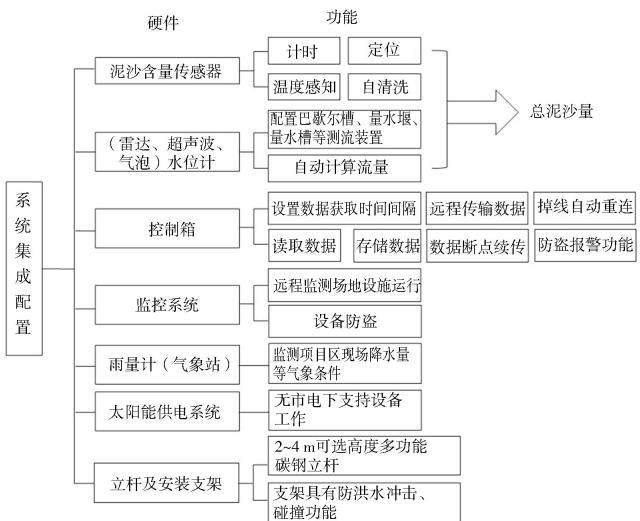  
图1 径流泥沙智慧监测系统硬件组成及功能

## 2.2 泥沙传感器测量原理

泥沙传感器是径流泥沙智慧监测系统的基础，监测系统采用红外光透射法泥沙传感器，其测量原理是：当传感器发出的红外光照射含沙水流时，一部分被水流及泥沙颗粒散射和反射，另一部分透射穿过含沙水流，在不同含沙量的水流中，穿透水体的红外光线强度会有所不同。根据水体中含沙量对光透射衰减的影响规律，通过标定传感器建立不同含沙量与透射光产生电压信号强度的对应关系。根据相关研究[1,9],选择峰值波长940nm左右的普通红外发光二极管作为红外光源，研制透射式红外泥沙传感器，并对传感器输出信号和含沙量进行标定试验，再结合不同土壤类型、粒径差异的数据库，建立光电信号与含沙量的回归模型，利用回归模型验证传感器的测量范围和精度。

## 2.3 测试与检验

1)测试。在实验室中采用高岭土均质土样，通过称量依次配置质量浓度为5、15、25、50、75、95、120、$1 4 0 , 1 6 5 , 1 8 5 , 2 0 5 , 2 3 0 , \mathrm { k g / m ^ { 3 } }$ 的泥沙混合溶液，在水杯中进行静态试验，根据不同浓度含沙量与对应含沙水流传感器输出光电信号数据的关系，建立输出电压-含沙量关系模型。实际含沙量为单位含沙水体中泥沙的质量，换算公式为

$$
C = C _ { \mathrm { d } } \times \frac { 1 } { 1 + C _ { \mathrm { d } } / \rho _ { \mathrm { s } } }\tag{1}
$$

式中：C为实际含沙量，单位 $\mathbf { k g } / \mathbf { m } ^ { 3 } ; C _ { \mathrm { d } }$ 为设计含沙量，单位 $\mathbf { k } \mathbf { g } / \mathbf { m } ^ { 3 } ; \rho _ { \mathrm { s } }$ 为泥沙颗粒密度，单位 ${ \bf k } { \bf g } / { \bf m } ^ { 3 }$ ,在本试验中取 $2 . 6 5 { \times } 1 0 ^ { 3 } \mathrm { k g } / \mathrm { m } ^ { 3 }$ 0

2)检验。在室外采用260目过筛均质壤土，利用自制径流泥沙试验循环水槽(见图2），用称重法配置特定含沙量的泥水进行不同浓度泥水的检验。称量依次配置质量浓度为5、10、20、30、35、40、45、50、55、$6 0 \ 、 6 5 、 7 0 、 7 5 \mathrm { ~ k g / m } ^ { 3 }$ 的泥水，在试验中待水槽水流运转稳定、悬浮泥沙均匀分布时读取泥沙传感器数据，待数据稳定时读取数值。同一浓度含沙量读取3次数值取平均值。试验中当含沙量大于 $5 0 ~ \mathrm { k g } / \mathrm { m } ^ { 3 }$ 时泥水在循环水槽发生明显沉积。然后采用自制的可调坡度不锈钢滑槽进行检验，用称重法配置质量浓度为$5 \mathrm { \ . 1 0 \ . 2 0 \ . 3 0 \ . 3 5 \ . 4 0 \ . 4 5 \ . 5 0 \ . 5 5 \ . 6 0 \ . 6 5 \ . 7 0 \ . 7 5 \ \mathrm { k g / m ^ { 3 } } }$ 泥水进行试验，通过人工3次重复迅速倾倒，形成快速高含沙水流，在水槽下部设置水桶回收泥水。在水流通过期间读取传感器上稳定的含沙量数值，读取3次数值取平均值，并对收集桶内泥水进行人工取样(见图3）、烘干称量，用于对泥沙传感器进行多重校准。

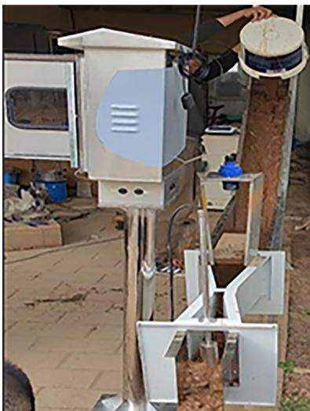  
图2 自制径流泥沙试验循环水槽

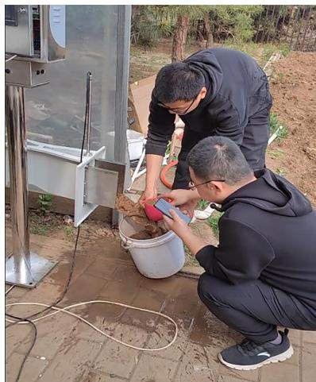  
图3 对收集桶内的泥水进行人工取样

经自制径流泥沙试验循环水槽、自制可调坡度不锈钢滑槽试验、烘干称重法检验，含沙量过大会有泥沙沉积，当含沙量大于 $6 0 ~ \mathrm { k g } / \mathrm { m } ^ { 3 }$ 时不再遵循数学回归模型。这也验证了泥沙传感器测定的只是泥水中的悬移质，不包含推移质部分。通过多重手段检验回归模型，进行参数修正，最终确认回归模型。根据不同土壤类型、不同粒径组成、不同比重，经大量数据试验，已经初步形成数据库，可为不同土壤条件下的设备参数标定提供支撑。

## 2.4 数据平台

在云端设置数据平台，用于接收、贮存各传感器远程传输的径流泥沙数据信息。平台服务器经过初步数据处理分析，实时获取各项指标数据。在现场控制箱显示屏选择测流堰槽类型，在数据平台根据自计水位计现场读数，按照测流堰槽类型，自动计算径流总量。再通过泥沙传感器上含沙量与径流量的即时读数，应用换算公式和微积分法获得径流含沙量。系统能够在线对不同时段的持续或间歇性径流的含沙量、径流量和泥沙总量等数据进行全过程、动态统计分析，以及根据相关指标设置警戒数值和预警信号，对水土流失、泥沙危害进行预警，提高径流泥沙监测的精准性和分析利用的高效性。

## 2.5 技术特性及参数

径流泥沙智慧监测系统准确率高、误差较低，可进行实时数据监控、远程获取实时数据、实时预报预警等，也可自动进行数据备份，依靠太阳能/蓄电池供电系统实现24h不间断在线监测，利用云计算技术实现水土流失监测的智能化、自动化和精准化。其技术参数见表1，实物照片见图4。

表1 径流泥沙智慧监测系统技术参数
<table><tr><td>指标</td><td>分项</td><td>技术参数</td></tr><tr><td rowspan="5">含沙量</td><td>测量范围</td><td> $0 . 1 { \sim } 6 0 . 0 \ \mathrm { k g / m } ^ { 3 }$ </td></tr><tr><td>采样间隔</td><td> $1 \sim 6 \ 0 0 0 \ \mathrm { s } \ \sharp \sharp ^ { \prime } \mathfrak { h } ^ { \pm } ]$ </td></tr><tr><td>灵敏度</td><td></td></tr><tr><td>测量精度</td><td> $\begin{array} { c } { 0 . 1 \ \mathrm { k g / m } ^ { 3 } } \\ { \geqslant 9 0 \% } \end{array}$ </td></tr><tr><td>测量范围</td><td> $0 \sim 1 \mathrm { ~ m ~ } ^ { \sharp } { \ddot { \chi } } \ : 0 \sim 2 \mathrm { ~ m ~ }$ </td></tr><tr><td rowspan="4">液位</td><td>采样间隔</td><td>实时</td></tr><tr><td>灵敏度</td><td>1 mm</td></tr><tr><td>测量精度</td><td></td></tr><tr><td></td><td>≥95%</td></tr><tr><td colspan="2">功率</td><td>8W</td></tr><tr><td colspan="2">温度范围</td><td>存放  $: - 4 0 \sim 8 0 ~ \mathrm { ‰ }$  ;工作  $: 4 \sim 6 0 ~ \mathrm { { \mathcal { C } } }$ </td></tr><tr><td colspan="2">数据显示</td><td>全彩7寸触摸屏，可显示、查询历史数据</td></tr><tr><td colspan="2">数据采集</td><td>嵌入式ARM 系统</td></tr><tr><td colspan="2">数据传输</td><td>2G/3G/4G远程无线传输</td></tr><tr><td colspan="2">数据存储</td><td>本地与云在线存储，本地可存储180d连续监测数据</td></tr></table>

## 3 径流泥沙智慧监测系统应用场景

径流泥沙智慧监测系统可以适用于多种应用场景，包括生产建设项目、径流观测小区和小流域沟(河)道，不同的应用场景需要有不同的配置安装方案。为了能够通过透射光来有效测量径流泥沙量，在安装时，应保证泥沙传感器垭口顺着水流方向；对于小流量的过流断面，应尽量将泥沙传感器头部接近堰槽底部，但又不发生接触。

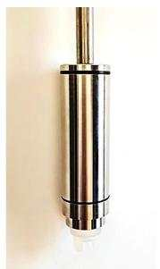  
(a)泥沙传感器

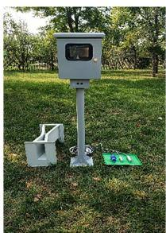  
（b）径流泥沙监测系统硬件

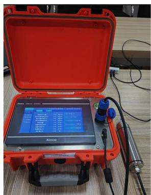  
(c）便携式径流泥沙监测设备

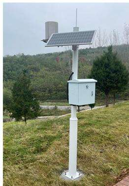  
(d)产品控制箱及太阳能供电系统、雨量计  
图4 径流泥沙智慧监测系统实物照片

1)生产建设项目。监测系统应用在生产建设项目时，要保证项目监测区的地表径流相对封闭，需要与沉沙池、巴歇尔槽或量水堰结合使用，在临时沉沙池下游、项目区地表径流主要输出口安装设备。对于点式生产建设项目可以进行整体监测或分区监测，对于线性生产建设项目可根据监测分区选择典型段进行监测。自项目开工起安装，项目竣工结束后拆除，强化生产建设项目施工全过程、全流量的径流泥沙监测。图5为径流泥沙智慧监测系统在北京顺义区林福科源农业园项目的应用场景。

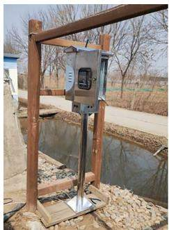  
(a)控制箱

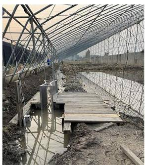  
(b)传感器及巴歇尔槽  
图5 径流泥沙智慧监测系统在北京顺义区  
林福科源农业园项目的应用

2)径流观测小区。在径流观测小区应用时，应注意含沙量量程及集流槽推移质泥沙的计算处理。利用巴歇尔槽结合自计水位计进行流量监测，为保证测流的精准性，需对巴歇尔槽进行封闭化处理，以克服人工随机取样造成的误差，提高精准度。图6(a)、(b)分别为径流泥沙智慧监测系统在北京门头沟区龙凤岭水土保持科技示范园和河南南阳南水北调渠首水土保持科技示范园的应用场景。

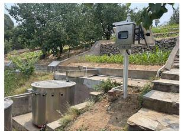  
（a）北京门头沟区龙凤岭  
水土保持科技示范园

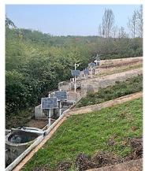  
（b）河南南阳南水北调渠首水土保持科技示范园  
图6 径流泥沙智慧监测系统在径流观测小区的应用

3)小流域沟(河)道。在沟(河)道安装泥沙传感器设备时，易有垃圾等漂浮物的监测场地应在上游设置截污拦污栅栏，有大型冲积物的应设置防冲防撞设施。在沟(河)道的监测可与水文监测站监测工作结合，以完善水利监测指标。对于尺寸较大的河道断面，需多点布置泥沙传感器。图7(a)、(b)分别为径流泥沙智慧监测系统在河北易县崇陵水土保持科技示范园和重庆缙云山水土保持监测试验站的应用场景。

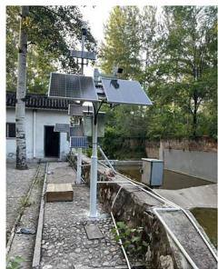  
(a)河北易县崇陵水土保持科技示范园

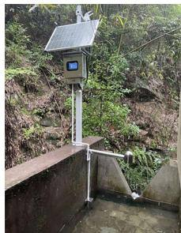  
(b)重庆缙云山水土保持监测试验站  
图7 径流泥沙智慧监测系统在小流域沟(河)道的应用

## 4 结束语

笔者团队研发的基于透射式红外泥沙传感器的径流泥沙智慧监测系统，实现在线对含沙量不超过60${ \bf k } { \bf g } / { \bf m } ^ { 3 }$ 的持续性径流，或间歇性径流的含沙量、径流量和泥沙总量等数据的全过程动态监测分析，并可以根据相关指标设置警戒数值和预警信号，对水土流失、泥沙危害进行预警。监测系统适用于生产建设项目、径流小区和小流域沟(河)道等不同应用场景，实现全过程、全流量、高精度径流泥沙监测，克服了传统监测方式不能做到监测数据实时在线，无法及时获取全过

(下转第50页)

计量法为基础的水土保持碳汇效益估算方法。经计算，2021年青海省新建水土保持工程总固碳效益为44731t，其中：小流域水土保持综合治理工程固碳效益为40443t,坡耕地水土流失综合治理工程固碳效益为 1139 t,淤地坝固碳效益 3 149 t。

单位面积平均固碳效益淤地坝工程>小流域水土保持综合治理工程>坡耕地水土流失综合治理工程，这是因为：淤地坝通常建设在沟道侵蚀较为剧烈、集水面积较大的流域，能够大量拦蓄流域产生的泥沙，单位面积产生的固碳效益较高，但淤地坝淤积完成后，不再持续产生拦泥固碳效益；小流域水土保持综合治理工程通常采取工程措施、植物措施综合治理，能够持续产生较明显的固碳效益；坡耕地水土流失综合治理工程主要是在较为平缓的坡面(农耕区)拦蓄地表径流、固定土壤，以梯田拦蓄泥沙为主，因此其固碳效益低于小流域水土保持综合治理工程。

## 参考文献：

[1]中共中央党校(国家行政学院). 习近平在第七十五届联合国大会一般性辩论上的讲话[Z/OL].（2020-09-22）[2023 − 10 − 10 ]. https://www. ccps. gov. cn/xxsxk/zyls/202009/t20200922\_143558.shtml.

[2]余新晓，贾国栋，郑鹏飞.碳中和的水土保持实现途径和对策[J].中国水土保持科学,2021,19(6):138-144.

[3]李智广，王海燕，王隽雄.碳达峰与碳中和目标下水土保持碳汇的机理、途径及特征[J].水土保持通报,2022,42(3)：312-317,380.

[4]李智广，王隽雄，王海燕.区域水土保持碳汇能力评估的指

(上接第44页)

程动态监测数据，以及操作误差大的问题，对支撑水文和水土保持科学研究等具有重要意义。

## 参考文献：

[1]雷廷武，张宜清，赵军，等.近红外反射高含沙量泥沙传感器研制[J].农业工程学报,2013,29(7):51-57.

[2]展小云，郭明航，赵军，等.径流泥沙实时自动监测仪的研制[J].农业工程学报,2017,33(15):112-118.

[3]汤召桃.提高生产建设项目土壤流失监测精度的探讨[J].中国水土保持,2020(6):59-61.

[4]张勇，李仁华，姚赫，等.水土保持自动监测设备现状及新设备研发[J].人民长江,2022,53(9):43-48.

标体系[J].中国水土保持科学,2023,21(1):64-72.

[5]国家林业和草原局.森林生态系统碳储量计量指南：LY/T2988—2018[S].北京：中国标准出版社,2018:2-14.

[6]青海省农业资源区划办公室.青海土壤[M].北京：中国农业出版社，1997:266.

[7]国家林业局.立木生物量模型及碳计量参数——云杉:LY/T 2655—2016[S]. 北京：中国标准出版社，2016:3,7，24-26.

[8]国家林业局.立木生物量模型及碳计量参数——桦树：LY/T 2659—2016[S].北京：中国标准出版社,2016:3,6,14.

[9]青海省草原总站.青海草地资源[M].银川:青海人民出版社,2012:262.

[10]王学福，郭生祥.祁连山青海云杉个体生长过程分析[J]林业实用技术,2014(7):10-13.

[11] 赵勇.不同环境青杨的生长比较[J].青海农林科技,2009(2):42-43.

[12]方月梅，姜鹏，商蕾，等.青杨插条繁殖林分生长量及生长期研究[J].河北林果研究,2013,28(3):237-240,244.

[13]郭欣雨，冯仲科，曹忠，等.甘肃省山杏山杨相容性一二元材积模型研建[J]. 林业资源管理,2015(2):65-70.

[14]王顺利，金铭，张学龙，等.不同封育条件下天然草地生物量对比研究[J]. 中南林业科技大学学报,2014,34(12):130-135.

15]北京市质量技术监督局.林业碳汇计量监测技术规程：DB11/T 953—2013[S]. 北京：北京市质量技术监督局，2013:7.

(责任编辑 徐素霞)

[5]王讷敏，洪美玲，单帅，等.径流泥沙监测方法研究进展[J].亚热带水土保持,2023,35(2):21-24,30.

[6]夏兵，张祯尧，蒋达，等.生产建设项目含沙量智慧监测设备研究与应用[J]. 中国水土保持,2024(2):23-26.

[7]赵军，屈丽琴，赵晓芬，等.称重式坡面径流小区水流流量自动测量系统[J].农业工程学报,2007,23(3):36-40.

[8]刘琳，屈丽琴，雷廷武，等.径流小区产流过程量水堰自动测量系统[J].农业工程学报,2011,27(12):79-83.

[9]李勇涛，陈英智，李立新等.基于940 nm普通红外光源的反射式泥沙测量传感器研究[J].水土保持应用技术,2015(6):10-12.

(责任编辑 李佳星)