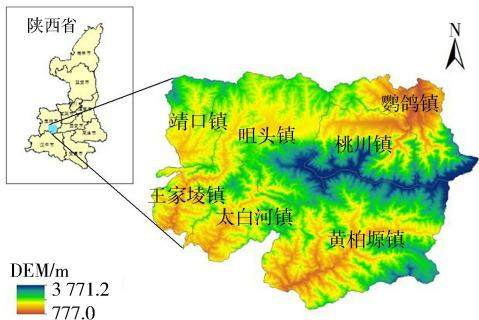
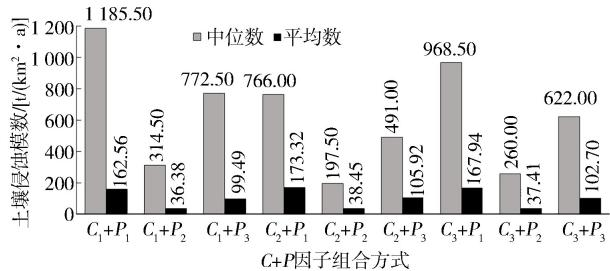
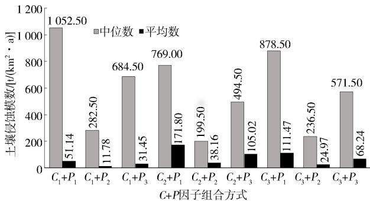
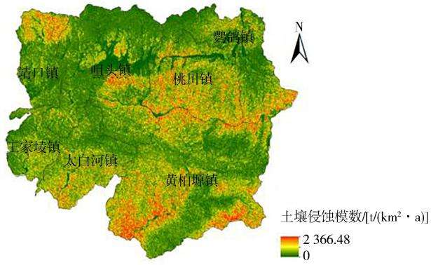
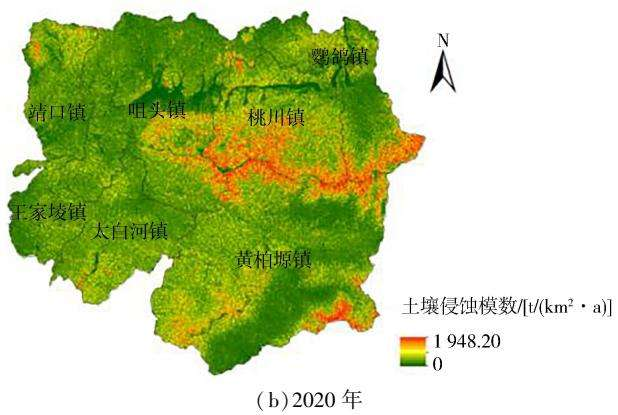
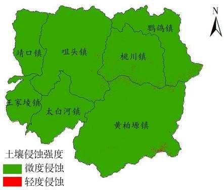
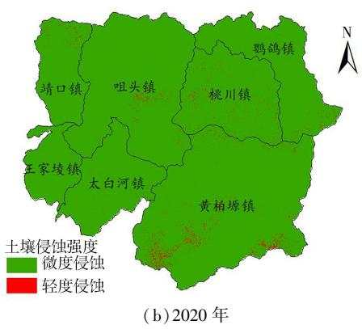
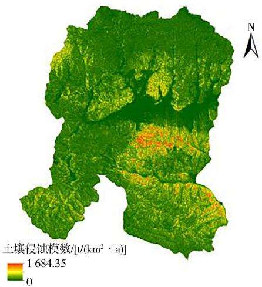
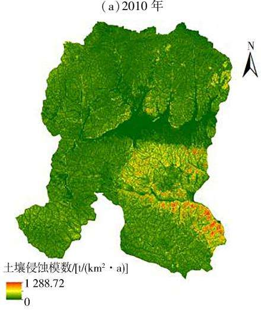

# 秦岭腹地县域RUSLE模型参数取值适应性分析——以太白县为例

刘添瑞，俱战省

(宝鸡文理学院地理与环境学院，陕西宝鸡721013)

摘 要：基于RUSLE模型各因子取值方法，以秦岭腹地太白县为例，探讨不同因子取值对RUSLE模型计算结果的影响，结果表明：19种组合方式下2010年、2020年秦岭腹地太白县土壤侵蚀模数中位数和平均数差异明显，均为强变异程度，表明不同因子取值对土壤侵蚀模数的计算结果不确定性明显，但采用中位数比平均数更具有代表性 $; \textcircled { 2 } C _ { 3 } { + } P _ { 3 }$ 组合方式下2010年、2020年土壤侵蚀模数中位数相对偏差最小，在其他因子不变情况下采用 $C _ { 3 } + P _ { 3 }$ 的组合方式更科学；③$C _ { 3 } { ^ + P } { _ 3 }$ 组合方式下计算得到2020年太白县水土保持率为97.17%，与依据2020年官方数据计算的水土保持率96.51%基本一致，表明 $C _ { 3 } { + } P _ { 3 }$ 组合为太白县最优组合；④将 $C _ { 3 } { + } P _ { 3 }$ 组合方式应用于太白县及其咀头镇，结果符合事实，表明此组合可推广应用于秦岭腹地其他地区，为水土保持规划提供技术支撑。

关键词：RUSLE模型；土壤侵蚀；参数取值；适应性；太白县；秦岭腹地

中图分类号：S157

文献标识码：A

DOI:10.3969/j. issn.1000-0941.2025.01.020

[引用格式]刘添瑞，俱战省.秦岭腹地县域RUSLE模型参数取值适应性分析：以太白县为例[J].中国水土保持，2025(1):76-80.

秦岭是我国重要生态屏障，是“华夏文明的龙脉”，被誉为“中国的中央水塔”。准确评估秦岭腹地土壤侵蚀情况，对该地区水土流失防治至关重要。近年来，学者们围绕秦岭腹地及其周边地区土壤侵蚀评估做了卓有成效的工作。马琪等[1]通过研究陕西省土壤侵蚀敏感红线，得出陕西省土壤侵蚀主要呈现由北向南逐渐加剧的特征。谢怡凡等[2]利用RUSLE模型对陕西省土壤侵蚀强度时空演变特征进行了分析，结果表明2000年后陕西省土壤侵蚀强度显著降低。张玉等[3]基于RUSLE模型研究了陕西省秦岭腹地太白县2000—2015年土壤侵蚀模数变化情况，结果表明2000—2010年太白县土壤侵蚀模数呈上升趋势，而2010—2015年有所下降，该结论与杨波等[4]的研究结果接近。部分学者对RUSLE模型因子取值进行了初步探索，如廖俊等[5]研究了RUSLE模型中各因子在黄土高原的不同常用算法之间的变换组合，模拟了144种因子组合下退耕植被恢复坡面的土壤侵蚀，结果表明RUSLE模型无法很好地适用于黄土高原退耕植被恢复坡面土壤侵蚀的模拟。少部分学者探讨了模型计算的不确定性，如 ZHANG et al.[6]基于 RUSLE模型，以云南省洱海流域为例，分析了不同坡长坡度因子LS公式的不确定性，并利用实测泥沙数据验证了模拟结果的可靠性，确定了L因子与S因子公式的最佳组合。基于RUSLE模型的研究成果虽多，但鲜有研究者在秦岭腹地开展RUSLE模型土壤侵蚀不确定性的研究。因此，笔者以秦岭腹地太白县为研究对象，应用C因子(植被覆盖管理因子)和P因子(水土保持措施因子)的不同组合方式，探讨适用于该区域的RUSLE模型因子组合的最优解。

## 1 研究区概况

太白县位于陕西省宝鸡市东南部，地处秦岭腹地，因秦岭主峰太白山在境内而得名，地理位置33°$3 8 ^ { \prime } \sim 3 4 ^ { \circ } 0 9 ^ { \prime } \mathrm { N } , 1 0 7 ^ { \circ } 0 3 ^ { \prime } \sim 1 0 7 ^ { \circ } 4 6 ^ { \prime } \mathrm { E }$ ，土地面积 2 780km²，辖7个镇44个行政村和2个社区。境内太白山海拔3771.2m，是我国中部第一高峰，居中隆起，向东西展布，形成中部高耸、北仰南缓之地势。全县地貌形态复杂多样，有高山、中山、中山丘陵、断陷盆地、山间盆地和冰川6种地貌类型。县内气候具有大陆性季风气候与高山气候交汇的特征，长冬无夏，春秋相连，气温差别显著，年均气温7.7℃，年均降水量776.8mm。全县横跨长江、黄河两大流域，境内主要河流有石头河、湑水河、红岩河、太白河和黄牛河。太白县北连秦川，南通巴蜀，是国家重要的生态安全屏障。境内野生动植物种类数以万计，资源丰富，素有“天然植物园”“天然动物园”“天然药园”之美称，森林覆盖率达到93.36%。研究区位置见图1。

  
图 1 研究区位置

## 2 数据来源

本研究采用的基础数据包括2010年、2020年太白县土地利用数据，气象数据， Landsat TM/OLI 遥感影像及DEM数据。土地利用数据来源于全国地理信息资源目录服务系统 GlobeLand30数据集（http://www. webmap.cn/);气象数据来源于中国气象科学数据共享服务网平台（http://data. cma.cn/)；LandsatTM/OLI 遥感影像及 DEM数据均来源于地理空间数据云平台(http:/www. gscloud.cn/)。所有数据空间分辨率均为30m。

## 3 研究方法

## 3.1 土壤侵蚀模型

基于GIS技术，采用RUSLE(修正的通用土壤流失方程)计算秦岭腹地土壤侵蚀模数，公式为

$$
A = R \cdot K \cdot L \cdot S \cdot C \cdot P\tag{1}
$$

式中：A为土壤侵蚀模数，单位 $V ( \mathrm { h m } ^ { 2 } \cdot \mathrm { a } )$ ;R 为降雨侵蚀力因子，单位 $\mathrm { M J ~ \cdot ~ m m / ( \ h m ^ { 2 } ~ \cdot ~ h ~ \cdot ~ a ~ ) ~ }$ ;K为土壤可蚀性因子,单位t·h/(MJ·mm);L、S、C、P分别为坡长因子、坡度因子、植被覆盖管理因子、水土保持措施因子，均无量纲。

## 3.2 各因子值的确定

## 3.2.1 R 因子

采用章文波等[7]研究成果中的降雨侵蚀力模型计算，记为 $R _ { i }$ ,公式为

$$
R _ { i } = \alpha \sum _ { j = 1 } ^ { k } { ( D _ { j } ) ^ { \beta } }\tag{2}
$$

$$
\alpha = 2 1 . 5 8 6 \beta ^ { - 7 . 1 8 9 1 }\tag{3}
$$

$$
\beta = 0 . 8 3 6 3 + \frac { 1 8 . 1 4 4 } { P _ { _ { \mathrm { d 1 2 } } } } + \frac { 2 4 . 4 5 5 } { P _ { _ { \mathrm { y 1 2 } } } }\tag{4}
$$

式中： $R _ { i }$ 为第i个半月的降雨侵蚀力，单位MJ·mm/$( \ln \mathbf { n } ^ { 2 } \cdot \mathbf { h } )$ ;α 和 $\beta$ 均为模型参数； $D _ { j }$ 为半月时段内第j天的侵蚀性降雨量(日降雨量≥12 mm)，单位 mm; k为半月内日降雨量 $\geqslant 1 2 \ \mathrm { m m }$ 的降雨天数，单位 $\mathrm { d } { \cdot } P _ { \mathrm { d } 1 2 }$ 为日降雨量≥12mm的日平均降雨量，单位 $\mathrm { m m } ; P _ { \mathrm { y l 2 } }$ 为日降雨量≥12 mm的年均降雨量，单位mm。

## 3.2.2 K因子

采用 WILLIAMS[8]研究成果中的 EPIC 模型计算研究区土壤可蚀性因子K,公式为

$$
{ \begin{array} { r l } { K = \{ 0 . 2 + 0 . 3 \exp \left[ - 0 . 0 2 5 \ 6 S _ { \mathrm { d } } ( 1 - S _ { \mathrm { i } } ) / 1 0 0 \right] \} \times } & { } \\ { \left( { \frac { S _ { \mathrm { i } } } { S _ { \mathrm { i } } + C L } } \right) ^ { 0 . 3 } \times } \\ { \left[ 1 . 0 - { \frac { 0 . 2 5 C _ { 0 } } { C _ { 0 } + \exp ( 3 . 7 2 - 2 . 9 5 C _ { 0 } ) } } \right] \times } & { } \\ { \left[ 1 . 0 - { \frac { 0 . 7 S _ { \mathrm { N } } } { S _ { \mathrm { N } 1 } + \exp ( - 5 . 5 1 + 2 2 . 9 S _ { \mathrm { N } 1 } ) } } \right] } & { ( 5 \ ) } \end{array} }
$$

$$
S _ { \mathrm { N } 1 } = 1 - S _ { \mathrm { d } } / 1 0 0\tag{6}
$$

式中： ${ \cdot } S _ { \mathrm { d } } \mathrm { } _ { \setminus } S _ { \mathrm { i } }$ 和CL分别为砂粒、粉粒和黏粒百分含量；  
$C _ { 0 }$ 为有机碳百分含量。

## 3.2.3 L、S因子

采取刘宝元等9]研究成果中的方法计算坡长、坡度因子，公式为

$$
S = \left\{ \begin{array} { l l } { { 1 0 . 8 \sin \theta + 0 . 0 3 } } & { { \qquad ( \theta < 5 ^ { \circ } ) } } \\ { { 1 6 . 8 \sin \theta - 0 . 5 0 } } & { { \quad ( 5 ^ { \circ } \leqslant \theta < 1 4 ^ { \circ } ) } } \\ { { 2 1 . 9 \sin \theta - 0 . 9 6 } } & { { \quad ( \theta \geqslant 1 4 ^ { \circ } ) } } \end{array} \right.\tag{7}
$$

$$
L = \left( { \frac { \lambda } { 2 2 . 1 3 } } \right) ^ { a }\tag{8}
$$

$$
a = { \frac { b } { b + 1 } }\tag{9}
$$

$$
b = { \frac { \sin \theta } { [ 3 . 0 \times ( \sin \theta ) ^ { 0 . 8 } + 0 . 5 6 ] \times 0 . 0 8 9 6 } }\tag{10}
$$

式中：θ为在DEM数据中提取的坡度值，单位(°)；λ为水平投影坡长，单位m;a为坡长指数;b为细沟侵蚀量与细沟间侵蚀量的比值。

## 3.2.4 C 因子

采取以下3种方法来确定研究区植被覆盖管理因子值。

1)采用蔡崇法等10研究成果中的植被覆盖度与植被覆盖管理因子关系式来计算，记为 $C _ { 1 }$ ，公式为

$$
f _ { \mathrm { c } } = \frac { N D V I - N D V I _ { \mathrm { m i n } } } { N D V I _ { \mathrm { m a x } } - N D V I _ { \mathrm { m i n } } }\tag{11}
$$

$$
C _ { 1 } = \left\{ \begin{array} { l l } { 1 } & { ( f _ { \mathrm { c } } = 0 ) } \\ { 0 . 6 5 0 ~ 8 - 0 . 3 4 3 ~ 6 \times \lg f _ { \mathrm { c } } } & { ( 0 ~ < f _ { \mathrm { c } } \leqslant 7 8 . 3 \% ) } \\ { 0 } & { ( f _ { \mathrm { c } } ~ > ~ 7 8 . 3 \% ) } \end{array} \right.\tag{12}
$$

式中 ${ \mathrm { : } } f _ { \mathrm { c } }$ 为植被覆盖度；NDVI为归一化植被指数；ND-${ { M } _ { \operatorname* { m i n } } } \mathrm { ~ } . N D { { V } } I _ { \operatorname* { m a x } }$ 分别为归一化植被指数的最小值、最大值。

2)采用鹿晨昱等[11]研究成果中建立的归一化植

被指数与植被覆盖管理因子的关系式来计算，记为$C _ { 2 }$ ,公式为

$$
C _ { 2 } = \exp \big [ - \rho \times N D V I / ( \sigma - N D V I ) \big ]\tag{13}
$$

式中 $: \rho _ {  } , \sigma$ 均为决定NDVI与 C 关系曲线的参数,较合理的设置是 $\rho { = } 2 , \sigma { = } 1$ O

3)借助 ArcGIS 10.8 软件中的栅格计算器模块，对以上两种方法计算的 $C _ { 1 } , C _ { 2 }$ 值取平均值,作为C因子值,记为 $C _ { 3 }$ o

## 3.2.5 P因子

采取以下3种方法来确定研究区的水土保持措施因子。

1)采取杨波等[4]研究成果中给土地利用类型赋值的方式来确定P因子，记为 $P _ { 1 \mathrm { ~ o ~ } }$ 对林地、草地、灌木地、裸地， $P _ { 1 }$ 赋值1;对湿地、水体、人造地， $P _ { 1 }$ 赋值0;对耕地， $P _ { 1 }$ 赋值0.2。

2)采用 LUFAFA et al.[12]研究成果中的经验方程来确定P因子，记为 $P _ { 2 }$ ,公式为

$$
P _ { \mathrm { 2 } } = 0 . 2 + 0 . 3 \varphi\tag{14}
$$

式中： $\varphi$ 为坡度百分比。

3)借助 ArcGIS 10.8 软件中的栅格计算器模块，对以上两种方法获取的 $P _ { 1 } , P _ { 2 }$ 值取平均值，作为P因子值,记为 $P _ { 3 } ,$ 0

## 3.3 相对偏差

相对偏差用来衡量单项测定结果对平均值的偏离程度，公式为

$$
d _ { \mathrm { r } } = { \frac { d _ { i } } { \mathit { \Pi } _ { x } } } \times 1 0 0 \%\tag{15}
$$

式中： $d _ { \mathrm { r } }$ 为相对偏差； $d _ { i }$ 为第i项数据的绝对偏差； $\stackrel { - } { x }$   
为某组合方法下测定数据的平均值。

## 3.4 土壤侵蚀强度分级分类标准

依据《土壤侵蚀分类分级标准》(SL190—2007)，土壤侵蚀强度划分为6个等级,即:微度侵蚀[>0\~500t/$\left( \mathrm { k m } ^ { 2 } \cdot \mathrm { a } \right) ]$ 、轻度侵蚀 $> 5 0 0 { \sim } 2 ~ 5 0 0 ~ \mathsf { t } / ( \mathrm { k m } ^ { 2 } \cdot \mathrm { a } ) ~ ]$ 、中度侵蚀 $\left[ > 2 ~ 5 0 0 { \sim } 5 ~ 0 0 0 ~ \mathsf { t } / ( \mathrm { k m } ^ { 2 } \cdot \mathrm { a } ) \right]$ 、强烈侵蚀 $[ > 5 ~ 0 0 0 { \sim } 8 ~ 0 0 0$ $V ( \mathrm { k m } ^ { 2 } \cdot \mathrm { a } ) ]$ 、极强烈侵蚀 $[ > 8 0 0 0 { \sim } 1 5 0 0 0 \ V ( \mathrm { k m } ^ { 2 } \cdot \mathrm { a } ) ]$ 1剧烈侵蚀[ $> 1 5 0 0 0 \ V ( \mathrm { k m } ^ { 2 } \cdot \mathrm { a } ) \ I$

## 3.5 因子组合方式

C、P因子各有3种取值方法，故 RUSLE模型中各因子有9种组合方式，即 $C _ { 1 } + P _ { \mathrm { ~ 1 ~ } \setminus } \ : C _ { 1 } + P _ { \mathrm { ~ 2 ~ } \setminus } \ : C _ { 1 } + P _ { \mathrm { ~ 3 ~ } \setminus } C _ { 2 } +$ $P _ { 1 \setminus } C _ { 2 } + P _ { 2 \setminus } C _ { 2 } + P _ { 3 \setminus } C _ { 3 } + P _ { 1 \setminus } C _ { 3 } + P _ { 2 \setminus } C _ { 3 } + P _ { 3 \setminus } C _ { 3 } .$

## 3.6 模型的率定和应用

采取水利部水土保持监测中心数据，率定模型中C、P因子最优组合，然后应用到太白县及咀头镇，分析土壤侵蚀情况。

## 4 太白县 RUSLE 模型因子最优组合

## 4.1 9种组合方式下太白县土壤侵蚀模数

9种组合方式下2010年、2020年太白县土壤侵蚀模数见图 $2 _ { \circ }$ 由图2可知，9种组合方式下太白县2010年、2020年土壤侵蚀模数中位数差异明显，数值范围分别为 $1 9 7 . 5 0 \sim 1 \ 1 8 5 . 5 0 \ . 1 9 9 . 5 0 \sim 1 \ 0 5 2 . 5 0 \ \mathrm { t } / ( \mathrm { k m } ^ { 2 } \cdot \mathrm { a } )$ 变异系数分别达到54.24%、52.14%；土壤侵蚀模数平均数差异大,数值范围分别为36.38\~173.32、11.78\~$1 7 1 . 8 0 ~ \mathrm { { ‰ } }$ ，变异系数分别达到55. 13%、$7 6 . 0 9 \%$ 。由此可见，9种组合方式下2010年、2020年太白县土壤侵蚀模数中位数与平均数均属于强变异程度，而平均数的变异程度更大，这表明基于不同组合方式计算的土壤侵蚀模数不确定性明显，但采用中位数比平均数更具有代表性。

  
(a)2010年

  
(b)2020年  
图2 2010年、2020年9种组合方式下太白县土壤侵蚀模数

## 4.2 最优组合的确定

相对偏差能较好地反映数据的准确程度，其值越小，数据结果越合理。以9种组合方式下土壤侵蚀模数中位数的平均值为基准，计算2010年、2020年太白县土壤侵蚀模数中位数的相对偏差(绝对值)，结果见表 $1 _ { \circ }$ 由表1可知，2010年相对偏差范围为0.37%\~91.30%,其中 $C _ { 3 } { + } P _ { 3 }$ 相对偏差最小，为0.37%;2020年相对偏差范围为0.49%\~83.26%,其中 $C _ { 3 } + P _ { 3 }$ 相对偏差最小，为0.49%。因此，在其他因子不变情况下，采用$C _ { 3 } { + } P _ { 3 }$ 组合方式计算太白县土壤侵蚀模数更科学。

## 4.3 最优组合的率定

根据水利部水土保持监测中心数据，2020年太白县轻度侵蚀以下面积为 $2 ~ 6 8 2 . 9 4 ~ \mathrm { k m } ^ { 2 }$ ，计算得到太白县水土保持率为96.51%,而 $C _ { 3 } + P _ { 3 }$ 组合方式下计算的太白县轻度侵蚀以下面积为2701.27 $\mathrm { k m } ^ { 2 }$ ,水土保持率为97.17%，两者基本一致，说明 $C _ { 3 } { + } P _ { 3 }$ 组合方式适用于太白县。

表1 2010年、2020年太白县土壤侵蚀模数中位数相对偏差
<table><tr><td rowspan="2">C+P组合方式</td><td colspan="2">相对偏差(绝对值)d/%</td></tr><tr><td>2010年</td><td>2020年</td></tr><tr><td> $C _ { 1 } { + } P _ { 1 }$ </td><td>91.30</td><td>83.26</td></tr><tr><td> $C _ { 1 } + P _ { 2 }$ </td><td>49.25</td><td>50.81</td></tr><tr><td> $C _ { 1 } + P _ { 3 }$ </td><td>24.65</td><td>19.18</td></tr><tr><td> $C _ { 2 } { + } P _ { 1 }$ </td><td>23.60</td><td>33.89</td></tr><tr><td> $C _ { 2 } + P _ { 2 }$ </td><td>68.13</td><td>65.26</td></tr><tr><td> $C _ { 2 } + P _ { 3 }$ </td><td>20.77</td><td>13.90</td></tr><tr><td> $C _ { 3 } { + } P _ { 1 }$ </td><td>56.28</td><td>52.96</td></tr><tr><td> $C _ { 3 } + P _ { 2 }$ </td><td>58.05</td><td>58.82</td></tr><tr><td> $C _ { 3 } + P _ { 3 }$ </td><td>0.37</td><td>0.49</td></tr></table>

## 5 应用

## 5.1 $C _ { 3 } + P _ { 3 }$ 组合方式下太白县土壤侵蚀强度分布特征

$C _ { 3 } { + } P _ { 3 }$ 组合方式下2010年、2020年太白县土壤侵蚀模数变化见图3。由图3可知，2010年、2020年太白县的土壤侵蚀模数最高分别为2366.48、1948.20$\nu ( \mathrm { k m } ^ { 2 } \cdot \mathrm { a } )$ ,2010—2020年土壤侵蚀模数最高值下降了 $4 1 8 . 2 8 ~ \mathrm { { ‰ } }$ ，土壤侵蚀强度整体呈现由南部向北部逐渐降低的分布特征。

  
(a)2010年

  
图3 2010年、2020年 $C _ { 3 } { + } P _ { 3 }$ 组合方式下太白县土壤侵蚀模数

$C _ { 3 } + P _ { 3 }$ 组合方式下2010年、2020年太白县土壤侵蚀强度空间分布见图 $4 _ { \circ }$ 由图4可知,2010年、2020年太白县土壤侵蚀强度以轻度、微度侵蚀为主，土壤侵蚀南部较为严重。2010年太白县轻度侵蚀集中分布于桃川镇、黄柏塬镇西南和东南部、靖口镇北部、咀头镇中部、鹦鸽镇南部和北部。与2010年相比，2020年太白县土壤侵蚀面积和强度明显降低，2020年太白县轻度侵蚀集中分布在桃川镇南部、黄柏塬镇东南部、咀头镇东南部、鹦鸽镇南部。

  
(a)2010年

  
图4 $C _ { 3 } { + } P _ { 3 }$ 组合方式下2010年、2020年  
太白县土壤侵蚀强度空间分布

## 5.2 $C _ { 3 } { + } P _ { 3 }$ 组合方式下太白县咀头镇土壤侵蚀强度分布特征

$C _ { 3 } { + } P _ { 3 }$ 组合方式下2010年、2020年咀头镇土壤侵蚀模数变化见图5，土壤侵蚀面积及占比见表2。由图5和表2可知，2010—2020年咀头镇土壤侵蚀强度和面积实现了双下降，土壤侵蚀模数最高值由1684.35t/$( \mathrm { k m } ^ { 2 } \cdot \mathrm { a } )$ 降至 $1 ~ 2 8 8 . 7 2 ~ \mathrm { { } } V ( \mathrm { { k m } } ^ { 2 } \cdot \mathrm { { \ a } } )$ ，轻度侵蚀面积由 $2 . 1 3 ~ \mathrm { k m } ^ { 2 }$ 降至 $0 . 7 0 ~ \mathrm { k m } ^ { 2 }$ ;相较于2010年,2020年咀头镇轻度侵蚀集中分布在咀头镇东部和中上部地区，土壤侵蚀强度下降地区集中在西北部和中下部。这表明，近年来在咀头镇实施翠矶山水土保持示范园建设、塘口小流域综合治理成效显著。

## 6 结论

1)基于RUSLE模型，计算了9种C、P因子组合方式下2010年、2020年秦岭腹地太白县的土壤侵蚀模数中位数和平均数，结果表明两者均为强变异程度，而平均数变异程度更大。这表明基于RUSLE模型的计算的土壤侵蚀模数不确定性明显，但采用中位数比平均数更具有代表性。

(a)2010年  
  
(b)2020年

图 5 $C _ { 3 } { + } P _ { 3 }$ 组合方式下2010年、2020年咀头镇土壤侵蚀模数表2 $C _ { 3 } { + } P _ { 3 }$ 组合方式下2010年、2020年  
咀头镇土壤侵蚀面积及占比
<table><tr><td rowspan="2">年份</td><td colspan="2">微度侵蚀</td><td colspan="2">轻度侵蚀</td><td rowspan="2">土壤侵蚀 模数中位数/  $\cdot V ( \mathbf { k m } ^ { 2 } \cdot \mathbf { a } )$ </td></tr><tr><td>面积  $/ \mathrm { k m } ^ { 2 }$ </td><td>比例/%</td><td>面积  $/ \mathrm { k m } ^ { 2 }$ </td><td>比例/%</td></tr><tr><td>2010</td><td>605.36</td><td>99.65</td><td>2.13</td><td>0.35</td><td>452.00</td></tr><tr><td>2020</td><td>606.76</td><td>99.88</td><td>0.70</td><td>0.12</td><td>385.50</td></tr></table>

2)9种组合方式下，计算2010年、2020年秦岭腹地太白县土壤侵蚀模数中位数相对偏差(绝对值)，2010年相对偏差范围为0.37%\~91.30%,2020年相对偏差范围为0.49%\~83.26%,其中均是 $C _ { 3 } + P _ { 3 }$ 组合方式下相对偏差最小。因此，在其他因子不变情况下,采用 $C _ { 3 } { + } P _ { 3 }$ 的组合方式更科学。

3) $C _ { 3 } { + } P _ { 3 }$ 组合方式下计算得到2020年太白县水土保持率为97.17%，与依据2020年官方数据计算的水土保持率96.51%基本一致，表明基于RUSLE模型$C _ { 3 } { + } P _ { 3 }$ 组合为太白县最优组合。

4)将基于 RUSLE模型的 $C _ { 3 } + P _ { 3 }$ 组合方式应用于太白县及咀头镇，通过计算分析两者2010年、2020年土壤侵蚀强度分布特征，结果符合事实，这表明此组合方式可推广应用于秦岭腹地其他地区，为水土保持规划提供技术支撑。

## 参考文献：

[1]马琪，李婷，贺成民.基于生态承载力预警的土壤侵蚀敏感红线划分研究：以陕西省为例[J].水土保持研究，2022,29(5):93-99.

[2]谢怡凡，姚顺波，丁振民，等.退耕还林和地理特征对土壤侵蚀的关联影响：以陕西省107个县区为例[J].生态学报,2022,42(1):301-312.

3]张玉,张用川，陈林.陕西省汉江流域2000—2015年土壤侵蚀时空分异特征研究[J].中国农村水利水电，2021(10):78-85,91.

[4]杨波，董莉丽，许晓婷，等.退耕还林后宝鸡市土壤侵蚀动态变化研究[J].咸阳师范学院学报,2017,32(2):75-79.

[5]廖俊，焦菊英，严增，等.RUSLE模型对黄土高原退耕植被恢复坡面土壤侵蚀的模拟效果分析[J].水土保持学报，2024,38(2):97-108.

[6] ZHANG Tianpeng, LEI Qiuliang, DU Xinzhong, et al. Adaptability analysis and model development of various LS-factor formulas in RUSLE model:A case study of Fengyu River Watershed , China[ J]. Geoderma, 2023 ,439 : 116664.

[7]章文波，谢云，刘宝元.中国降雨侵蚀力空间变化特征[J]. 山地学报,2003,21(1):33-40.

[8] WILLIAMS J R. The erosion-productivity impact calculator( EP-IC) model : A case history [ J ]. Philosophical Transactions of the Royal Society Biological Sciences,1990,329(1255) :421-428.

[9]刘宝元，毕小刚，符素华，等.北京土壤流失方程[M].北京:科学出版社,2010:56-60.

[10]蔡崇法，丁树文，史志华，等.应用USLE模型与地理信息系统IDRISI预测小流域土壤侵蚀量的研究[J]. 水土保持学报,2000,14(2):19-24.

[11]鹿晨昱，张琳，薛冰，等.基于GIS的太原市土壤侵蚀定量研究[J].水土保持通报,2013,33(6):247-251.

[12] LUFAFA A,TENYWA M M, ISABIRYE M, et al. Prediction of soil erosion in a Lake Victoria basin catchment using a GIS-based Universal Soil Loss model [ J]. Agricultural Systems,2003,76(3) :883-894.

(责任编辑 张绪兰)