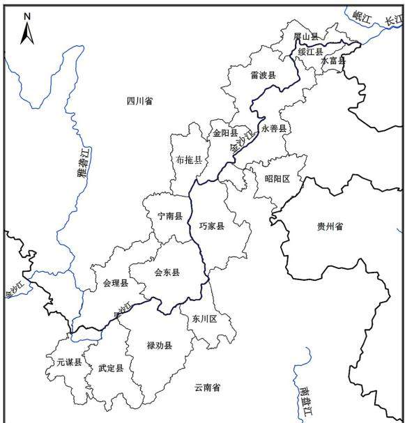
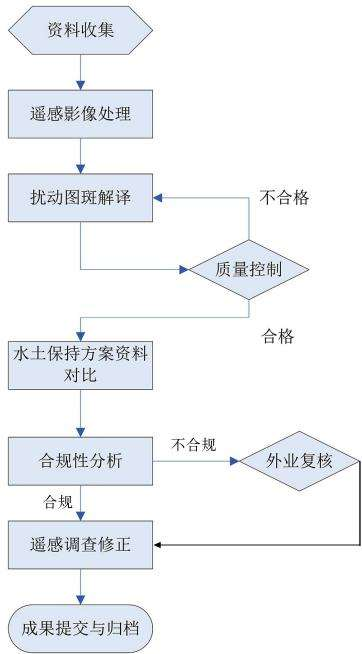
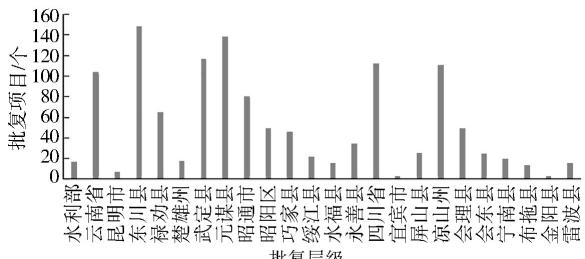

# 金沙江下游水电开发集中区生产建设项目水土保持“天地一体化”监管探索

周乐群1，徐公权²，韩凤翔³，赵继东¹，姬俊虎¹，鲁 勇1

（1. 长江水利委员会长江流域水土保持监测中心站，湖北武汉430010;

2.河南省地质局矿产资源勘查中心，河南郑州450053；3.长江水利委员会水土保持局，湖北武汉430010)

摘要：基于习近平总书记“十六字”治水思路，以2018年生产建设项目水土保持“天地一体化”监管项目为契机，探索新形势下水土保持监管的新体制新机制、先进实用的技术手段和方法，充分运用3S技术、数据库及信息系统技术、移动网络技术等，对金沙江下游水电开发集中区生产建设项目实施水土保持“天地一体化”全覆盖监管。监管成果显示：2011—2017年部、省、市(州)和县级批复生产建设项目水土保持方案共1247个，以县级为主，其次是市级；类型上，以公路工程、露天非金属矿和输变电项目为主：空间分布上，以云南省境内为主，占项目总数的69%。2018年集中区内面积大于0.1hm²的生产建设项目扰动图斑4921个，扰动总面积261.64km2，占集中区总面积的0.70%；从开发强度看，云南省绥江县、元谋县和昭阳区较大，扰动面积均超过县域面积的1%：合规性分析揭示了集中区合规的图斑数量和扰动面积分别仅占29.53%和43.36%，水土保持监督管理工作急需加强，尤其是云南省的武定县、元谋县、昭阳区和禄劝县。另外，通过试点研究，还形成了“行政与技术协作、上下协同”的监管新体制新机制。

关键词：监管；天地一体化；水土保持；生产建设项目；水电开发集中区；金沙江下游

中图分类号：S157

文献标识码：A

DOI:10.3969/j. issn. 1000-0941.2025.05.021

引用格式：周乐群，徐公权，韩凤翔，等.金沙江下游水电开发集中区生产建设项目水土保持“天地一体化”监管探索[J]

中国水土保持，2025(5)：79-83.

金沙江流域涉及西藏、青海、四川、云南、贵州5省(自治区)，面积35.5万km²，约占长江流域面积的20%,全长2316km,天然落差3300m,约为长江干流总落差的61%，水能资源非常丰沛，蕴藏量达1.124亿 kW,技术可开发水能资源达8 897万kW[1-2],年发电量5040亿kW·h，富集程度居世界之最，是我国最大的水电基地。流域内矿产资源丰富，其中规模以上储量的达80余种，是我国乃至世界罕见的“聚宝盆”，同时光热、风力和农业资源也非常充足，是一座得天独厚的自然资源宝库。“十一五”以来，金沙江干流逐渐进入大规模梯级开发阶段，对区域生态环境的破坏和影响较大，人为水土流失逐渐加剧。为此，水利部长江水利委员会将金沙江干流作为水电开发集中区加强水土保持监督管理，2018年在金沙江下游地区实施了生产建设项目水土保持“天地一体化”全覆盖信息化监管探索。

## 1 金沙江下游水电开发集中区概况

## 1.1 监管区域范围

金沙江下游指金沙江攀枝花雅袭江口至宜宾江段，流域面积21.4万 $\mathrm { k m } ^ { 2 }$ ,河道长约 768 km,落差712.6 m,比降0.93%o,水能蕴藏量2 908 万 kW[2],干流已建或在建的有乌东德、白鹤滩、溪洛渡、向家坝4座巨型梯级水电站。金沙江下游水电开发集中区监管区域范围为金沙江下游干流涉及的云南、四川2省5市(州)16县(区），面积3.74万km²，见表1和图1。

## 1.2 监管区域概况

金沙江于流水电开发集中区地处我国第二级台阶和第一、二级台阶的过渡带上，以高原、中山为主，主要位于川南山区和滇东北山区，在构造运动和河流等内外营力作用下地形破碎，河谷深切达1000\~3000m，河谷多呈V形，形成了山高谷深、地势陡峻的地貌环境。地层古老，各时代的地层均有出露，岩性复杂；构造上处于川滇南北向构造带中段西侧与滇、藏“歹”字形构造复合部位，褶皱、断裂发育；自晋宁期至燕山期均有岩浆岩侵入、火山喷发，至燕山期、喜山期构造活动仍然强烈，地震基本烈度为Ⅶ度。支流众多，金沙江南岸主要支流有横江、牛栏江、龙川江、普渡河、小江等，北岸主要支流有黑水河、西溪河、美姑河、参鱼河等。水资源丰富，多年平均径流量1522亿$\mathbf { m } ^ { 3 }$ ，占长江上游(发源地—宜昌)总径流量的34.7%，多年平均输沙量2.56亿t，占长江宜昌站输沙量的48.8%,其中83.5%来自攀枝花以下的金沙江下游。属亚热带季风气候区，冬春季受青藏高原南支西风气流控制，气候温暖干燥，雨量稀少，日照充足；夏秋季受孟加拉湾西南暖湿气流控制，多雨，日照少，湿度大。位于攀西裂谷成矿带，矿产资源丰富，主要有铁、铅锌、煤、铜、铁、砷、岩盐、芒硝、硫、石膏、石灰石、大理岩、花岗岩、金、银、石棉、磷、铂等。近年来，受水电开发、矿产开采、康养产业发展影响，区内房地产业，城镇化带动的城乡基础设施建设，光伏发电、风力发电及其输变电工程，以及农业林业开发等产业建设如火如荼，开发强度在长江流域乃至全国都较强、较集中，给生态环境造成了较大压力，人为水土流失较为严重，必须按新时期习近平总书记“节水优先、空间均衡、系统治理、两手发力”治水思路，加强水土保持监管，遏制水土流失的发生发展，保护区域生态环境。

表1 金沙江下游水电开发集中区监管范围统计
<table><tr><td colspan="2">行政区划</td><td rowspan="2">面积/km²</td></tr><tr><td>省</td><td>市(州) 县(区)</td></tr><tr><td rowspan="8">云南</td><td>元谋县 楚雄州</td><td>2 026.3</td></tr><tr><td>武定县 禄劝县</td><td>2 938.6 4 234.8</td></tr><tr><td>昆明市</td><td>东川区 1 871.1</td></tr><tr><td rowspan="5">昭通市</td><td>巧家县</td><td>3195.4</td></tr><tr><td>昭阳区</td><td>2155.8</td></tr><tr><td>永善县</td><td>2 777.9</td></tr><tr><td>绥江县</td><td>746.3</td></tr><tr><td>水富县</td><td>440.0</td></tr><tr><td rowspan="7">凉山州 四川</td><td></td><td>会理县 4527.7</td></tr><tr><td>会东县</td><td>3 226.9</td></tr><tr><td>宁南县</td><td></td></tr><tr><td>布拖县</td><td>1666.6</td></tr><tr><td></td><td>1 686.9</td></tr><tr><td>金阳县</td><td>1 586.6</td></tr><tr><td>雷波县 屏山县</td><td>2 835.1</td></tr><tr><td>宜宾市 合计</td><td></td><td>1504.0 37420.0</td></tr></table>

注：楚雄州为楚雄彝族自治州的简称，凉山州为凉山彝族自治州的简称，下同。

  
图1 金沙江下游水电开发集中区监管区域范围

## 2 集中区生产建设项目水土保持“天地一体化”监管内容和指标

## 2.1 监管内容

集中区生产建设项目水土保持“天地一体化”监管主要包括以下5个方面内容：一是初步查明2011年以来，各级水行政主管部门批复的金沙江下游水电开发集中区内各类生产建设项目，并完成防治责任范围上图和信息化工作；二是基本查清2011年以来金沙江下游水电开发集中区内各类生产建设项目对地表的扰动情况、分布及类型，建立本底数据库；三是开展合规性分析和处理：四是提出问题清单，通报相应水行政主管部门进行核查和处理；五是监管成果入库。

## 2.2 监管指标

集中区水土保持“天地一体化”监管指标主要有：扰动地块边界；扰动地块面积；扰动地块类型，包括弃渣场和其他扰动地块等；建设状态，指扰动地块所处的施工阶段，分为施工(含生产建设类项目运营期施工）、停工、完工;扰动合规性，包括合规、未批先建、超出防治责任范围和建设地点变更4种情况。

## 2.3 生产建设项目分类

根据生产建设项目所属行业和项目的特点，将集中区生产建设项目划分为36类，见表2。

表2 集中区生产建设项目类型划分
<table><tr><td>序号</td><td>生产建设项目类型</td><td>序号</td><td>生产建设项目类型</td></tr><tr><td>1</td><td>公路工程</td><td>19</td><td>其他露天开采矿</td></tr><tr><td>2</td><td>铁路工程</td><td>20</td><td>井采煤矿</td></tr><tr><td>3</td><td>涉水交通工程</td><td>21</td><td>井采金属矿</td></tr><tr><td>4</td><td>机场工程</td><td>22</td><td>井采非金属矿</td></tr><tr><td>5</td><td>火电工程</td><td>23</td><td>油气开采工程</td></tr><tr><td>6</td><td>核电工程</td><td>24</td><td>油气管道工程</td></tr><tr><td>7</td><td>风电工程</td><td>25</td><td>油气储存与加工项目</td></tr><tr><td>8</td><td>输变电工程</td><td>26</td><td>工业园区工程</td></tr><tr><td>9</td><td>其他电力工程</td><td>27</td><td>城市轨道工程</td></tr><tr><td>10</td><td>水利枢纽工程</td><td>28</td><td>城市管网工程</td></tr><tr><td>11</td><td>灌区工程</td><td>29</td><td>房地产工程</td></tr><tr><td>12</td><td>引调水工程</td><td>30</td><td>其他城建项目</td></tr><tr><td>13</td><td>堤防工程</td><td>31</td><td>林浆纸一体化项目</td></tr><tr><td>14</td><td>蓄滞洪区工程</td><td>32</td><td>农林开发项目</td></tr><tr><td>15</td><td>其他小型水利工程</td><td>33</td><td>加工制造类项目</td></tr><tr><td>16</td><td>水电枢纽工程</td><td>34</td><td>社会事业类项目</td></tr><tr><td>17</td><td>露天煤矿</td><td>35</td><td>信息产业类项目</td></tr><tr><td>18</td><td>露天金属矿</td><td>36</td><td>其他行业项目</td></tr></table>

## 3 集中区生产建设项目水土保持“天地一体化”监管技术路线和方法

## 3.1 技术路线

集中区生产建设项目水土保持“天地一体化”监管技术路线见图2。采用3S技术和现场调查等相结合的技术手段和方法，利用高分辨率卫星遥感影像对生产建设项目的扰动情况实施动态监管，建立监管本底数据库，构建监管信息系统(平台）：依托无线网络和互联网技术，实现定期监控和现场精准定位、督查勾绘实时上传、后台数据库自动更新等。

  
图2 集中区生产建设项目水土保持  
“天地一体化”监管技术路线

## 3.2 技术和方法

金沙江下游水电开发集中区生产建设项目水土保持“天地一体化”监管采用的具体技术包括3S技术、数据库及信息系统技术、移动网络技术等。未来计划在上述技术方法的基础上，打破传统数据库及信息系统的架构，运用云架构、分布式数据库和云计算等新技术构建新型的水土保持监管云平台；利用人工智能、大数据等技术实现长江流域片(含西南诸河)的水土保持“天地一体化”全覆盖，适时、快速、多周期、动态信息化监管；对重点工程或潜在危害较大的重点部位结合物联网、无人机等先进技术实施准实时的水土保持监控；完善和推行集中区生产建设项目水土保持“天地一体化”监管工作中形成的“行政与技术协作、上下协同”的监管新体制新机制，实现对违规违法建设行为的精准、高效查处，维护流域水土保持和生态环境。

## 3.3 技术流程

1)前期准备。收集处理金沙江下游水电开发集中区各级水行政主管部门2011—2017年批复的生产建设项目水土保持方案及其批复文件等资料，进行整理和处理，数字化并入库。

2)批复项目防治责任范围上图。建立金沙江下游水电开发集中区统一坐标体系，根据批复的水土保持方案资料，采用多种方法逐一进行项目数字化或坐标转换变换，构建批复项目防治责任范围图层，按规定输入相关属性，完成2018年防治责任范围图层和本底库。

3)遥感影像处理调查。根据需要对遥感影像进行专题信息增强、影像融合、影像镶嵌、分幅裁剪等处理。

4)遥感调查。建立影像解译标志，解译生产建设项目扰动图斑、分布及其相关属性。

5)外业复核。采用GPS技术和移动采集设备，对扰动图斑和批复生产建设项目有关建设情况进行现场调查复核，并根据现场复核情况完善扰动图斑信息，形成扰动图斑图层和本底库。

6)合规性分析。利用GIS技术对防治责任范围图层和扰动图斑图层进行空间叠加处理，完成合规性分析。

7)成果审核。对集中区遥感监管成果进行审核，并录入全国水土保持监督管理系统V3.0。

8)成果应用。按照行政区开展生产建设项目水土保持监督管理和执法工作。

## 4 集中区生产建设项目水土保持“天地一体化”监管成果与分析

## 4.1 批复生产建设项目情况

2011—2017年水利部、省、市(州）、县（区)四级水行政主管部门在金沙江下游水电开发集中区共批复了1247个生产建设项目水土保持方案，其中水利部批复17个，省级批复217个，市(州)级批复220个，县(区)级批复793个，见图3。

  
批复层级  
图3 2011—2017年生产建设项目水土保持方案批复情况

项目类型上，以公路工程、露天非金属矿和输变电项目为主，防治责任范围面积占比也是公路工程项目最高。两省又有所区别，云南省境内最多的为其他行业类型项目、露天非金属矿和加工制造类项目，占比为11.61%\~14.52%;四川省以公路项目、输变电项目、露天金属矿和露天非金属矿较多，占比为7.55%\~16.15%。

从防治责任范围分析，云南省以防治责任范围面积在 $1 0 0 \ \mathrm { h m } ^ { 2 }$ 以上的生产建设项目为主，累计达$4 2 ~ 0 6 3 . 1 1 ~ \mathrm { h m } ^ { 2 }$ ，占总防治责任面积的78.66%；四川省则以防治责任范围面积在 $1 0 0 \ \mathrm { h m } ^ { 2 }$ 以上和10\~100$\mathrm { h m } ^ { 2 }$ 的生产建设项目为主，面积分别为9708.50、$5 ~ 4 9 3 . 5 9 ~ \mathrm { \ h m } ^ { 2 }$ ，占总防治责任面积的56. 92%、32.21%。

空间分布上，以云南省境内为主，约占批复生产建设项目总数的69%，主要分布在西南部的元谋县、武定县、东川区和禄劝县，中部的昭阳区，以及东北部的绥江县和水富县；四川省境内主要分布在西南部的会理县，东北部的雷波县和屏山县。项目空间分布大体与自然资源分布相关，也在一定程度上反映了地方水行政主管部门水土保持监督管理工作的力度。

## 4.2 生产建设项目扰动情况

2018年集中区内面积大于 $\dot { \cdot } 0 . 1 \ \mathrm { h m } ^ { 2 }$ 的生产建设项目扰动图斑共4921个，扰动总面积 $2 6 1 . 6 4 ~ \mathrm { k m } ^ { 2 }$ ,占集中区总面积的0.70%(见表3)。其中：云南省境内扰动图斑2668个,扰动总面积 $1 5 9 . 6 6 ~ \mathrm { k m } ^ { 2 }$ ，占云南省境内面积的0.78%；四川省境内扰动图斑2253个，扰动总面积 $1 0 1 . 9 8 ~ \mathrm { k m } ^ { 2 }$ ，占四川省境内面积的0.60%。

从区县开发强度来看，以云南省的绥江县、元谋县和昭阳区较大，扰动面积均超过全县面积的1%；其次是四川省的金阳县和会理县，扰动面积均超过全县面积的0.8%；再次是云南省的武定县、东川区和水富县，均超过全县面积的0.6%，见表3。

对比各区县批复的项目分布情况，最突出的是四川省金阳县，境内批复生产建设项目不多，但扰动面积占比相对较高，违法违规的生产建设项目较多，水土保持监督管理工作有待加强。

从生产建设项目类型分析，数量最多的是其他行业和公路工程，以矿产资源开发和基础设施建设为主，与批复生产建设项目的总体情况基本一致。

## 4.3 生产建设项目完工情况

依据遥感影像特征，结合当地水务部门的信息、现场复核等，对扰动图斑建设状态进行判别。集中区完工项目图斑821个，占比16.68%，完工项目面积$5 ~ 6 6 0 . 2 6 ~ \mathrm { h m } ^ { 2 }$ ，占总扰动面积的21.63%。集中区生产

建设项目建设状态见表4。

表3 集中区扰动图斑分布情况统计结果
<table><tr><td colspan="2">行政区</td><td>总数/ 个</td><td>数量 占比/%</td><td>总面积/  $\mathrm { h m } ^ { 2 }$ </td><td>面积占 比/%</td><td>占县(区) 面积比/%</td></tr><tr><td rowspan="10"></td><td>东川区</td><td>311</td><td>11.66</td><td>1363.10</td><td>8.54</td><td>0.73</td></tr><tr><td>禄劝县</td><td>319</td><td>11.95</td><td>2 055.13</td><td>12.87</td><td>0.49</td></tr><tr><td>武定县</td><td>486</td><td>18.22</td><td>2 207.36</td><td>13.83</td><td>0.75</td></tr><tr><td>元谋县</td><td>431</td><td>16.15</td><td>3190.65</td><td>19.98</td><td>1.57</td></tr><tr><td>昭阳区</td><td>380</td><td>14.24</td><td>2 501.72</td><td>15.67</td><td>1.16</td></tr><tr><td>巧家县</td><td>235</td><td>8.81</td><td>1731.97</td><td>10.85</td><td>0.54</td></tr><tr><td>永善县</td><td>194</td><td>7.27</td><td>987.09</td><td>6.18</td><td>0.36</td></tr><tr><td>绥江县</td><td>195</td><td>7.31</td><td>1 643.26</td><td>10.29</td><td>2.20</td></tr><tr><td>水富县</td><td>117</td><td>4.39</td><td>285.78</td><td>1.79</td><td>0.65</td></tr><tr><td>小计</td><td>2 668</td><td>100</td><td>15 966.06</td><td>100</td><td>0.78</td></tr><tr><td rowspan="8">四川</td><td>会理县</td><td>523</td><td>23.21</td><td>3 730.91</td><td>36.58</td><td>0.82</td></tr><tr><td>会东县</td><td>330</td><td>14.65</td><td>1 688.86</td><td>16.56</td><td>0.52</td></tr><tr><td>宁南县</td><td>201</td><td>8.92</td><td>724.37</td><td>7.10</td><td>0.43</td></tr><tr><td>布拖县</td><td>333</td><td>14.78</td><td>915.15</td><td>8.98</td><td>0.54</td></tr><tr><td>金阳县</td><td>279</td><td>12.38</td><td>1390.92</td><td>13.64</td><td>0.88</td></tr><tr><td>雷波县</td><td>410</td><td>18.20</td><td>1217.85</td><td>11.94</td><td>0.42</td></tr><tr><td>屏山县</td><td>177</td><td>7.86</td><td>530.19</td><td>5.20</td><td>0.35</td></tr><tr><td>小计</td><td>2 253</td><td>100</td><td>10198.25</td><td>100</td><td>0.60</td></tr><tr><td colspan="2">合计</td><td>4 921</td><td></td><td>26164.31</td><td></td><td>0.70</td></tr></table>

表4 集中区生产建设项目建设状态统计结果
<table><tr><td>区域</td><td>建设 状态</td><td>总数/ 个</td><td>数量占 比/%</td><td>总面积/  $\mathrm { h m } ^ { 2 }$ </td><td>面积 占比/%</td></tr><tr><td rowspan="5">云南</td><td>施工</td><td>2 491</td><td>93.36</td><td>14194.00</td><td>88.90</td></tr><tr><td>停工</td><td>13</td><td>0.49</td><td>24.12</td><td>0.15</td></tr><tr><td>完工</td><td>164</td><td>6.15</td><td>1747.94</td><td>10.95</td></tr><tr><td>小计</td><td>2 668</td><td>100</td><td>15966.06</td><td>100</td></tr><tr><td>施工</td><td>1 173</td><td>52.06</td><td>4 592.86</td><td>45.04</td></tr><tr><td rowspan="4">四川</td><td>停工</td><td>423</td><td>18.78</td><td>1693.07</td><td>16.60</td></tr><tr><td>完工</td><td>657</td><td>29.16</td><td>3 912.32</td><td>38.36</td></tr><tr><td>小计</td><td>2 253</td><td>100</td><td>10198.25</td><td></td></tr><tr><td></td><td></td><td></td><td></td><td>100</td></tr><tr><td rowspan="4">集中区</td><td>施工</td><td>3664</td><td>74.46</td><td>18 786.86</td><td>71.81</td></tr><tr><td>停工</td><td>436</td><td>8.86</td><td>1 717.19</td><td>6.56</td></tr><tr><td>完工</td><td>821</td><td>16.68</td><td>5660.26</td><td>21.63</td></tr><tr><td>合计</td><td>4 921</td><td>100</td><td>26164.31</td><td>100</td></tr></table>

## 4.4 生产建设项目合规性分析

运用GIS空间分析技术，对集中区生产建设项目进行合规性分析，结果表明区内4921个生产建设项目扰动图斑中，合规图斑1453个，占图斑总数的29.53%,违规和疑似违规图斑3468个，占图斑总数的70.47%。从扰动图斑面积来看，合规图斑面积仅占43.36%，说明区内违规违法建设活动非常突出，见表5。

分省情况看，四川省生产建设项目合规图斑数据要好于云南省。四川省境内有大约50%的扰动图斑或面积属于合规项目，而云南省境内合规图斑数量不足20%、扰动面积不足40%，违法违规建设活动比较突出，当地水土保持监督管理部门监管工作需要大力加强。云南省境内以武定县、元谋县、昭阳区和禄劝县违规和疑似违规扰动图斑较多，都在270个以上，占比都在10%以上，而四川省境内则以雷波县与会理县违规与疑似违规扰动图斑较多，分别为323、258个。

表5 集中区生产建设项目合规性分析结果
<table><tr><td>区域</td><td>批复情况</td><td>合规性</td><td>图斑数量/个</td><td>数量占比/%</td><td>图斑面积/km²</td><td>面积占比/%</td></tr><tr><td rowspan="5">云南</td><td rowspan="3">有批复文件</td><td>合规</td><td>483</td><td>18.10</td><td>58.23</td><td>36.47</td></tr><tr><td>超出责任范围</td><td>103</td><td>3.86</td><td>12.48</td><td>7.82</td></tr><tr><td>建设地点变更</td><td>2</td><td>0.08</td><td>0.18</td><td>0.11</td></tr><tr><td>无批复文件</td><td>未批先建</td><td>2 080</td><td>77.96</td><td>88.77</td><td>55.60</td></tr><tr><td colspan="2">小计</td><td>2 668</td><td>100</td><td>159.66</td><td>100</td></tr><tr><td rowspan="5">四川</td><td rowspan="3">有批复文件</td><td>合规</td><td>970</td><td>43.00</td><td>55.23</td><td>54.20</td></tr><tr><td>超出责任范围</td><td>90</td><td>4.00</td><td>9.97</td><td>9.80</td></tr><tr><td>建设地点变更</td><td>54</td><td>2.40</td><td>0.86</td><td>0.80</td></tr><tr><td>无批复文件</td><td>未批先建</td><td>1139</td><td>50.60</td><td>35.92</td><td>35.20</td></tr><tr><td rowspan="5"></td><td rowspan="2">小计</td><td></td><td>2 253</td><td>100</td><td>101.98</td><td>100</td></tr><tr><td>合规</td><td>1 453</td><td>29.53</td><td>113.46</td><td>43.36</td></tr><tr><td rowspan="3">有批复文件</td><td>超出责任范围</td><td>193</td><td>3.92</td><td>22.45</td><td>8.58</td></tr><tr><td>建设地点变更</td><td>56</td><td>1.14</td><td>1.04</td><td>0.40</td></tr><tr><td>未批先建</td><td>3 219</td><td>65.41</td><td>124.69</td><td></td></tr><tr><td>无批复文件</td><td colspan="2">合计</td><td>4 921</td><td>100</td><td>261.64</td><td>47.66 100</td></tr></table>

## 4.5 人为水土流失情况

根据区内生产建设项目扰动情况、违规和疑似违规生产建设项目的比例、项目施工情况等综合分析，2018年扰动总面积261.64km²,其中约有 28.30 km²已完工且不存在水土流失，人为水土流失面积为233.34 km²，占集中区总面积的 0.62%,且以极强烈—剧烈流失为主。

空间分布上，集中区的人为水土流失主要分布于云南省境内，云南省境内人为水土流失面积约占集中区人为水土流失总面积的2/3。云南省境内人为水土流失面积150.92 km²，占境内面积的 0.74%，主要集中在绥江县、元谋县、昭阳区、东川区和武定县；四川省境内人为水土流失面积82.42 km²，占境内面积的0.48%，主要分布于金阳县和会理县。人为水土流失相对较轻的是云南省的永善县和四川省的屏山县。

## 5 结束语

区域性水土保持监督管理工作任务重、工作量大。且时效性要求高，传统的技术方法和监管体制机制难以适应新时代水土保持监管工作的要求。本项目试点研究探索形成了一套先进实用的基于3S、数据库技术的生产建设项目水土保持监管技术手段和方法，有效解决了上述难题。以往的监督管理工作基本上是以行政人员采取常规手段开展现场调查为主，难免存在以偏概全、耗时费力、效率低等不足。本项目探索了一种新型的监管体制机制，建立了事业单位向行政主管部门提供技术支持、上下级行政主管部门协同监管，即“行政与技术协作、上下协同”的生产建设项目水土保持监管新体制新机制，取得了较理想的效果。

金沙江下游水电开发集中区生产建设项目水土保持“天地一体化”监管过程中产生了大量的水土保持监管信息，这些信息的入库不仅将极大地丰富和充实国家水土保持监督管理系统，而且为各级水行政主管部门监督管理和行政执法提供了全面、客观、科学的依据。更重要的是，监管工作的实施转变了监管方式和观念，构建了信息化监管体系，初步建立了支撑有效、信息共享、监管有力的生产建设项目水土保持监管信息化体系，促进了现代空间技术、信息技术与生产建设项目水土保持监管业务的深度融合，推进了生产建设项目水土保持监督管理信息化和现代化。

## 参考文献：

[1] 王经国，张卫东，韩梅荣，等.中国江河[M].北京：中国科学技术出版社,2000:77-87.

[2]赵纯厚，朱振宏，周端庄，等.世界江河与大坝[M].北京：中国水利水电出版社,2000:3-15.

(责任编辑 李杨杨)