# 基于无人机遥感技术的坡地果园土壤侵蚀模数计算

魏奕晨1，李 浩2，刘素红1,3，谢 云1,3

(1. 北京师范大学珠海校区 文理学院，广东珠海 519087;

2. 北京师范大学珠海校区实验教学平台，广东珠海519087；3.北京师范大学地理科学学部，北京100875)

摘要：以位于南方红壤区的广东省珠海市香洲区某大型芒果种植基地为研究区，利用无人机遥感技术获取数字正射影像、DSM(数字表面模型)、DEM(数字高程模型)，得到土地利用类型数据和土壤侵蚀因子数据，采用ArcGIS软件对数据进行数字化处理后，基于中国土壤流失方程计算研究区土壤侵蚀模数并进行强度划分。结果表明：①研究区平均土壤侵蚀模数为 $7 . 9 7 \ : \mathrm { { V } ( \mathrm { { h m } ^ { 2 } \cdot { \mathrm { ~ a } } ) } }$ ，最大土壤侵蚀模数达到 $6 4 . 0 0 ~ \mathrm { { ‰ } }$ ；②土壤侵蚀强度以轻度侵蚀为主，东北部部分区域达到了中度甚至强烈侵蚀；③通过实地调查对土壤侵蚀计算结果进行验证，基于无人机遥感技术的坡地果园土壤侵蚀计算结果符合实际情况：④南方红壤区园地水土流失防治应采用工程措施和生物措施相结合的方式，在坡度较大的区域设置鱼鳞坑、果树坑、梯田等，并保留林间枯枝落叶以增加林下植被覆盖。

关键词：无人机遥感技术；坡地；果园；土壤侵蚀；南方红壤区

中图分类号：S157

文献标识码：A

DOI:10.3969/j. issn. 1000-0941.2025.06.021

引用格式：魏奕晨，李浩，刘素红，等.基于无人机遥感技术的坡地果园土壤侵蚀模数计算[J].中国水土保持，2025(6)：72-75,81.

土壤侵蚀是在风力、水力和重力等作用下，土壤及其母质被剥蚀、搬运和沉积的过程。人类对自然资源的不合理开发和利用导致土壤侵蚀加剧，生态环境问题日益凸显，给经济和社会发展带来了巨大危害。我国是全球受土壤侵蚀影响最严重的国家之一，水土流失问题已经成为迫切需要解决的环境问题之一，而南方红壤区土壤抗蚀性较差，是我国水土流失最严重的区域之一。

土壤侵蚀模型是模拟土壤侵蚀过程、估算侵蚀总量、指导土地规划的重要技术工具，是土壤侵蚀研究领域的重要方向。20世纪40年代以来，多种适用于不同空间和时间尺度的土壤侵蚀模型相继被开发，以通用土壤流失方程为代表的经验模型因其结构简单、输入参数较少、数据易获取、适用性强等优点在世界范围内得到广泛应用。中国土壤流失方程(Chinesesoil loss equation,以下简称“CSLE”)考虑了中国的地貌形态和水土保持措施的特点，更加适用于我国土壤侵蚀特征1]，在南方红壤区、黄土高原等地区都得到了广泛应用[2-3]，而高精度的土壤侵蚀因子数据获取是保证基于CSLE模型计算土壤侵蚀模数准确性的关键。

随着无人机技术的快速发展，其应用越来越广泛，无人机遥感技术也成为低空遥感不可缺少的一部分。许多研究表明无人机遥感技术在水土流失监测中发挥了较大作用，可为水土流失综合防治提供技术支撑。但目前无人机遥感技术大多是应用在流域尺度的水土流失评估4-5]，在小空间尺度应用较少，小空间尺度的土壤侵蚀因子数据获取手段仍在探索阶段。因此，本研究以位于南方红壤区的某坡地果园为研究区，应用高精度无人机低空遥感技术开展果园土壤侵蚀模数计算，并验证计算结果的准确性，旨在建立一套操作便捷、成本低、计算准确的基于无人机的小尺度土壤侵蚀评估方法，为提升水土流失综合治理的信息化水平提供支撑。

## 1 研究区概况

广东省珠海市濒临南海，地处南方红壤区，属典型的南亚热带海洋性季风气候区，年均气温22.5℃；气候湿润，年均相对湿度80%；降水量充沛，年均降水量2061.9mm。受夏季降水量大且集中，以及长期人为扰动因素影响，南方红壤区水土流失严重程度仅次于黄土高原6]，尤其是园地水土流失十分严重。本研究选取位于珠海市香洲区的某大型芒果种植基地作为研究区(见图1)，其地貌类型为丘陵，土壤类型为红壤，成土母质为花岗岩等风化物，富铝化作用显著。

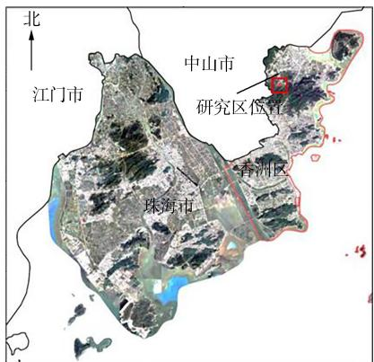  
图1 研究区地理位置

## 2 研究方法与数据来源

## 2.1 研究方法

本研究采用CSLE模型计算土壤侵蚀模数，计算公式为

$$
A = R \times K \times L \times S \times B \times E \times T\tag{1}
$$

式中：A为土壤侵蚀模数，单位 $V ( \mathrm { h m } ^ { 2 } \cdot \mathrm { a } )$ ;R 为降雨侵蚀力因子，单位 $\mathrm { M J ~ \cdot ~ m m / ( \ h m ^ { 2 } ~ \cdot ~ h ~ \cdot ~ a ~ ) ~ }$ ;K为土壤可蚀性因子，单位 $\mathrm {  ~ t ~ } \cdot \mathrm {  ~ h m ~ } ^ { 2 } \cdot \mathrm {  ~ h ~ } / ( \mathrm {  ~ h m ~ } ^ { 2 } \cdot \mathrm {  ~ M J ~ } \cdot \mathrm {  ~ m m } )$ ;L 为坡长因子，无量纲；S为坡度因子，无量纲；B为水土保持生物措施因子，无量纲，用于反映生物措施的水土保持效果；E为水土保持工程措施因子，无量纲，用于描述工程措施的水土保持效果：T为水土保持耕作措施因子，无量纲，用于描述农业耕作的水土保持效果。

坡长因子的计算公式为

$$
L _ { i } = \frac { \lambda _ { i } ^ { m + 1 } - \lambda _ { i - 1 } ^ { m + 1 } } { \lambda _ { i } - \lambda _ { i - 1 } \times 2 2 . 1 3 ^ { m } }\tag{2}
$$

式中： $L _ { i }$ 为第i个坡段的坡长因子值 ${ \bf \bullet } \lambda _ { i }$ 和 $\lambda _ { i - 1 }$ 分别为第i个、第i-1个坡段的坡长，单位 m;m 为坡长指数，依据坡度进行取值。

m的取值方法为

$$
m = \left\{ \begin{array} { l l } { { 0 . ~ 2 } } & { { \qquad \left( ~ \theta ~ < ~ 1 ^ { \circ } \right) } } \\ { { 0 . ~ 3 } } & { { \qquad \left( ~ 1 ^ { \circ } \leqslant \theta ~ < ~ 3 ^ { \circ } \right) } } \\ { { 0 . ~ 4 } } & { { \qquad \left( ~ 3 ^ { \circ } \leqslant \theta ~ < ~ 5 ^ { \circ } \right) } } \\ { { 0 . ~ 5 } } & { { \qquad \left( ~ \theta \geqslant 5 ^ { \circ } \right) } } \end{array} \right.\tag{3}
$$

式中：θ为坡度，单位(°)。

坡度因子的取值方法为

$$
S = \left\{ \begin{array} { l r } { { 1 0 . 8 \sin \theta + 0 . 0 3 } } & { { ( \theta < 5 ^ { \circ } ) } } \\ { { 1 6 . 8 \sin \theta - 0 . 5 0 } } & { { ( 5 ^ { \circ } \leqslant \theta < 1 0 ^ { \circ } ) } } \\ { { 2 1 . 9 \sin \theta - 0 . 9 6 } } & { { ( \theta \geqslant 1 0 ^ { \circ } ) } } \end{array} \right.\tag{4}
$$

根据《土壤侵蚀分类分级标准》(SL190—2007)，将区内土壤侵蚀强度划分为微度侵蚀、轻度侵蚀、中度侵蚀、强烈侵蚀、极强烈侵蚀、剧烈侵蚀6个等级，其对应的土壤侵蚀模数分别为 $< 5 . 5 \sim < 2 5 . 2 5 \sim < 5 0$ $5 0 \sim < 8 0 \dots 8 0 \sim < 1 5 0 \dots \geq 1 5 0 { \mathrm { ~ t } } / ( { \mathrm { h m } } ^ { 2 } \cdot { \mathrm { ~ a } } )$ O

## 2.2 数据获取

1)外业无人机数据采集。利用大疆精灵4RTK无人机获取低空高精度可见光图像，试验样地尺寸为500 m×500m,设置横向和纵向飞行航线，飞行高度为120m，航线总长度为5948m,共有277个航点。拍摄过程中镜头垂直朝下，进行多次航拍，见图2。

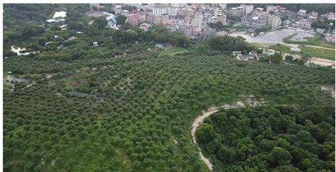  
（a）研究区俯视全貌

  
（b）大疆精灵4RTK无人机  
图2 研究区全貌及所用的无人机

2)内业数据处理。基于无人机拍摄影像制作研究区正射影像图、DSM(数字表面模型)、DEM(数字高程模型）。利用无人机遥感影像与DEM数据制作调查区野外调查底图，并根据水土保持调查中“三同一连续”的原则对调查区地块进行划分。由于果园大部分区域没有工程措施，且所有地块的耕作措施基本保持一致，因此主要依据林冠郁闭度和林下盖度来区分生物措施和土地利用类型，为外业实地考察提供依据。

3)野外实地调查。通过野外实地调查，填写野外调查表，识别研究区土地利用类型，制作研究区土地利用类型图，依据土地利用类型图进行B、E、T因子的赋值。

4)数字化处理。对所有数据进行数字化处理，形成土壤侵蚀因子的栅格数据集，再利用ArcGIS中 $\mathrm { S p a - }$ tial Analyst 的栅格计算器工具，基于 CSLE 模型进行土壤侵蚀模数计算。

## 3 结果与分析

## 3.1 正射影像和 DSM、DEM 数据

将无人机拍摄的照片导入 Agisoft PhotoScan 软件并选择WGS 84 坐标系统，通过对齐照片→建立密集点云→生成网格→生成纹理→建立数字高程模型→建立正射影像，导出研究区的正射影像和DSM。将导出的DSM减去研究区芒果树平均树高，并对其进行平滑处理，得到研究区DEM数据，结果见图3。

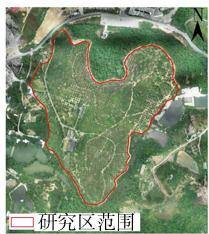  
(a)正射影像

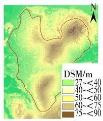  
(b) DSM

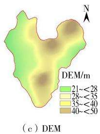  
图3 研究区正射影像和DSM、DEM数据

## 3.2 土壤侵蚀因子计算

依据中国大陆地区降雨侵蚀力空间分布数据集，研究区 R因子的平均值为 $2 1 ~ 4 7 2 ~ \mathrm { M J } \cdot \mathrm { m m } / ( \mathrm { h m } ^ { 2 }$ $\mathrm { ~ h ~ } \cdot \mathrm { ~ a ~ } )$ ;依据中国土壤可蚀性因子栅格数据集，研究区K因子的平均值为 $0 . \ 0 0 4 \ 9 \ \mathrm { ~ t ~ } \cdot \ \mathrm { h m } ^ { 2 } \ \cdot \ \mathrm { h } / ( \ \mathrm { h m } ^ { 2 } \ \cdot \ \mathrm { M J } \ ^ { . }$ mm);依据 DEM 数据,通过 ArcGIS 中的 Raster Surface工具计算出研究区的L和S因子(见图4);基于研究区土地利用类型图，得到研究区B、E因子赋值结果(见图5)。

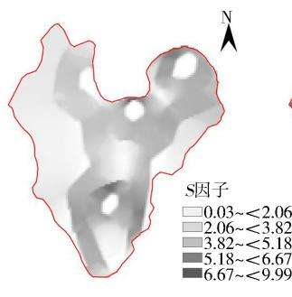  
(a) S因子

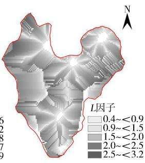  
(b) L因子  
图4 研究区 S 因子和 L 因子计算结果

## 3.3 土壤侵蚀模数计算

基于CSLE模型计算研究区土壤侵蚀模数，并进行土壤侵蚀强度分级，结果见图 $6 _ { \circ }$ 研究区平均土壤侵蚀模数为 $7 . 9 7 \ : \mathrm { { ‰ } }$ ，最大土壤侵蚀模数达到 $6 4 . 0 0 ~ \mathrm { { ‰ } ~ }$ ；土壤侵蚀以轻度侵蚀为主，东北部部分区域达到了中度甚至强烈侵蚀，土壤侵蚀强度整体呈现东部高于西部、北部高于南部的空间

特征。

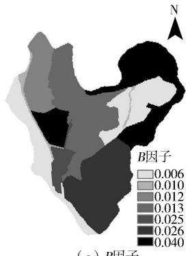  
(a) B因子

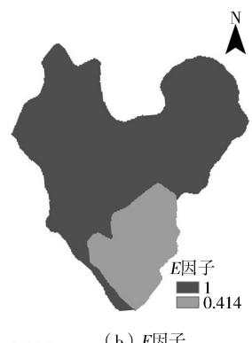  
(b) E因子  
图 5 研究区 B 因子和 E 因子赋值结果

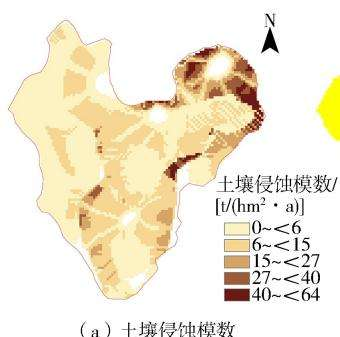

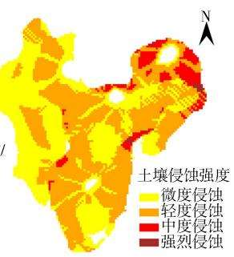  
(a)土壤侵蚀模数  
(b)土壤侵蚀强度  
图6 研究区土壤侵蚀模数和土壤侵蚀强度

## 4 讨论

经过实地调查，发现研究区不同区域的果树长势差异较大：东北部坡度较陡，林下盖度和果树密度均较低，果树长势较差；西北部坡度较缓，林下盖度和果树密度均较高，果树长势较好(见图7）。为进一步分析土壤侵蚀模数计算结果的准确性，选取4个典型区域，即自然坡度较大的区域A、道路一侧边坡裸露且陡峭的区域B、林下盖度较低的区域C和林下盖度较高的区域D进行验证(见图8)。结果表明：区域A、B、C土壤侵蚀模数较大，在实地调查中发现这些区域坡度大、果树长势差、郁闭度较低，水土流失严重；区域D土壤侵蚀模数较小，此区域植被覆盖和果树长势较好，无水土流失现象。实地调查结果验证了基于无人机遥感技术的小区域尺度土壤侵蚀模数计算方法是可行的。

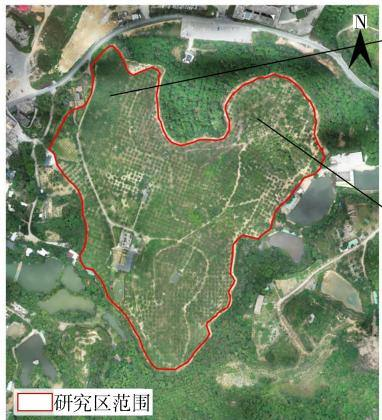

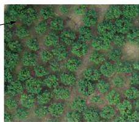

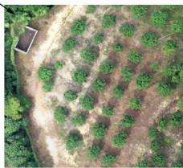  
图7 研究区东北部和西北部正射影像

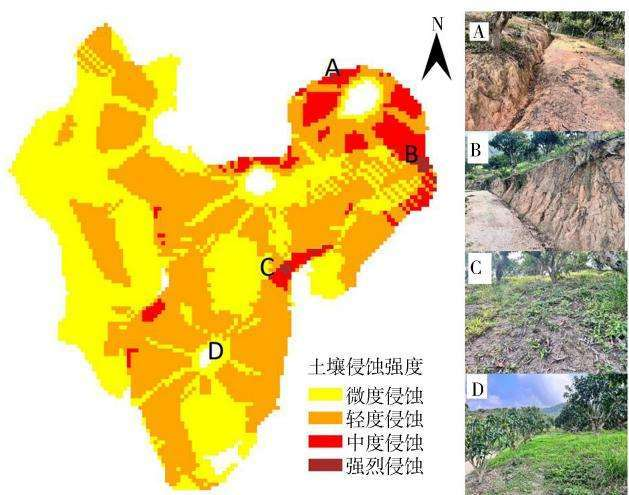  
图8 研究区实地验证结果

林下水土流失是多种因素综合作用的结果。我国南方红壤丘陵区地貌破碎、地形起伏大、成土母质复杂、土壤类型多样，土壤可蚀性因子K值较大，土壤的抗蚀性较差[2]，经果林幼林郁闭度较低，林下植被稀疏[7-8]，再加上侵蚀性降雨集中和频繁的人类扰动，林下水土流失比较严重。此外，研究区果园采用大水漫灌灌溉方式，经营管理方式相对粗放，大部分区域缺少保水保肥措施，只有局部区域有坡式梯田等水土保持工程措施；果园内交通设施用地和建设用地同样缺少水土保持措施，导致地表裸露，极易引发细沟侵蚀；另外，定期的剪枝和除草工作也在一定程度上加剧了水土流失。经果林对土壤条件要求较高，水土保持措施应以增加林下覆盖、拦截径流、固土保肥为主9]。通过在坡度较陡的区域设置鱼鳞坑、果树坑等，可汇集贮存雨水，有效拦截坡面降水径流，减轻坡面侵蚀；通过增加林下植被覆盖，可提高土壤持水能力，增强土壤团聚体稳定性，增加土壤有机碳含量，显著改善土壤条件[10-11]。本研究设计了3种水土保持方案(见图9)，通过GIS技术模拟不同水土保持方案下的土壤侵蚀模数变化。方案一为仅采取生物措施，使林下植被覆盖度保持在70%以上；方案二为仅采取工程措施，在坡度大于12°的区域布设大型果树坑；方案三为同时采取工程措施和生物措施。可以看到，同时采取工程措施和生物措施可显著减轻果园的土壤侵蚀强度，

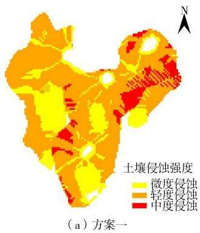

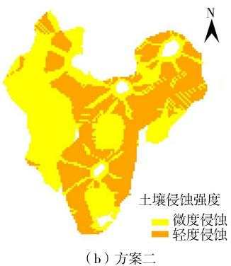  
图9 3种水土保持方案下的果园土壤侵蚀强度

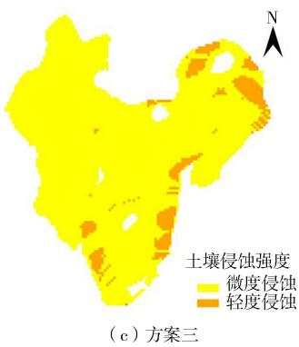

此情况下研究区以微度侵蚀为主，仅有小部分区域为轻度侵蚀；而在只采取生物措施的情况下，果园仍存在部分中度侵蚀区域，水土流失的控制效果有限。

## 5 结论

研究区为位于南方红壤区的典型缓坡园地，基于无人机遥感技术获取数字正射影像、DSM、DEM，进而得到土地利用数据和土壤侵蚀因子数据，再利用Arc-GIS进行数字化处理并计算土壤侵蚀模数。计算结果表明研究区平均土壤侵蚀模数为 $7 . 9 7 \ : \mathrm { t / ( \ h m ^ { 2 } \cdot { \dot { a } } ) }$ ,最大土壤侵蚀模数达到 $6 4 . 0 0 ~ \mathrm { { ‰ } }$ ,水土流失比较严重：土壤侵蚀强度以轻度侵蚀为主，东北部部分区域达到了中度和强烈侵蚀。通过实地调查对土壤侵蚀计算结果进行验证，发现东北部坡度较大，林下盖度和果树密度均较低，果树长势较差，西北部坡度较缓，林下盖度和果树密度均较高，果树长势较好，土壤侵蚀模数计算结果表现为东北部显著高于西北部；选取自然坡度较大的区域A、道路一侧边坡裸露且陡峭的区域B、林下盖度较低的区域C和林下盖度较高的区域D共4个典型区域进行验证，发现区域A、B、C的土壤侵蚀模数较大，区域D的土壤侵蚀模数较小，结果表明基于无人机遥感技术的坡地果园土壤侵蚀计算结果符合实际情况。此方法主要利用民用无人机，成本较低、(下转第81页)