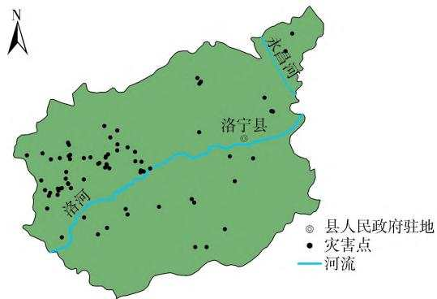
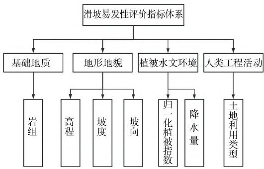
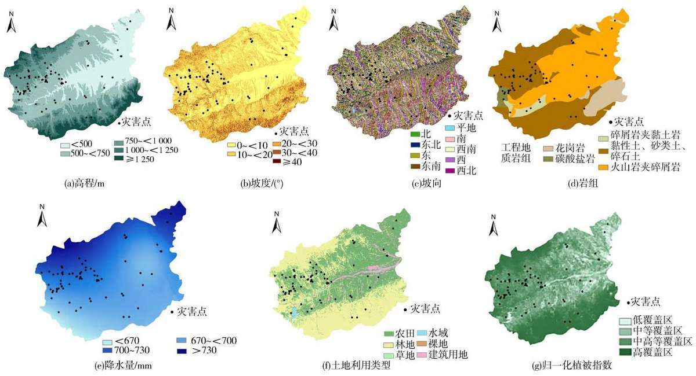
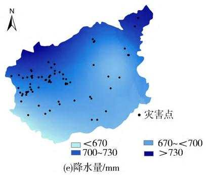
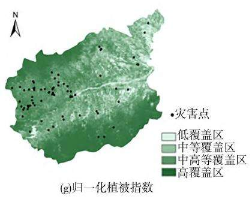
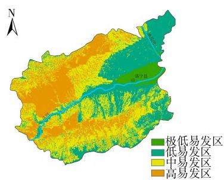
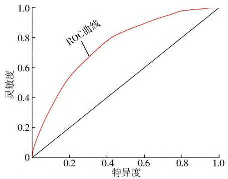

# 基于 GIS 的河南省洛宁县滑坡灾害易发性评价

何海洋

(华北水利水电大学 地球科学与工程学院,河南 郑州 450046)

摘 要: 洛宁县地处河南省西部山地丘陵区,地质构造复杂,加之近年来极端强降雨频发,滑坡灾害增多,造成了重大人员伤亡和经济损失,因此做好洛宁县滑坡灾害易发性分区可为科学防灾减灾提供数据支撑。 基于 空间分析获取研究区域高程、坡度、坡向、岩组、降水量、土地利用类型和归一化植被指数共 个指标因子,采用信息量模型对研究区进行栅格叠加后,利用自然断点法将研究区信息量值划分为极低、低、中、高易发区,结果表明:滑坡主要分布在高程 500\~<、坡度 的区域,且绝大部分滑坡所处的地貌为起伏山地;高易发区面积为 2,占全县总面积的;评价模型精度经 曲线检验,AUC 值为 ,说明基于 建立的信息量模型对洛宁县滑坡易发性评价效果良好。

关键词: 滑坡灾害;易发性评价;GIS;信息量模型;洛宁县

中图分类号: P208;P642. 22

文献标识码: A

DOI:10. 3969/j. issn. 1000-0941. 2025. 01. 021

引用格式: 何海洋. 基于 GIS 的河南省洛宁县滑坡灾害易发性评价[J]. 中国水土保持,2025(1):81-85.

在长达半个世纪的发展历程中 我国地质灾害评价工作取得了显著发展,随着全国地质灾害数据库动态管理的实现,如何构建高效精准的灾害评价模型意义深远[1-3]。 在 GIS 与 RS 技术的加持下,评价因子不仅可以定量化表达,还可以对评价结果进行空间叠加分析[4],从而使滑坡地质灾害评价结果更加准确。 洛宁县位于豫西山区,地处河南省地质灾害防控的关键地带,特别是近几年河南省内极端强降雨事件频发,导致洛宁县滑坡灾害增多,严重制约了洛宁县的城乡建设与人民生活。 因此,对该区域进行滑坡易发性评价具有重要价值,能为研究区经济持续发展与防灾减灾提供借鉴和参考。

地质灾害评价方法主要包括层次分析法、信息量法、频率比法、机器学习方法等[5- 7]。 其中:白志刚等[8]选取地层岩性 植被覆盖度 坡度 坡向等 个因子,利用耦合模型对渝北地区进行了易发性评价;对于甘肃省的滑坡灾害,申怀飞等[9] 选择了 10 个关键评价指标,结合信息量模型和层次分析法进行了更准确的易发性评价;陈飞等[10]提出将信息量与机器学习相结合的方法,通过叠加对比分析得到了上犹县的滑坡易发性分区图等。

信息量模型在众多模型中更为便捷且客观性更强[11- 12]。 本研究借助国内外相关文献、研究对象遥感数据和实地勘察报告,结合 GIS 技术与信息量模型,选择了 个指标因子 高程 坡度 坡向 岩组 降水量、土地利用类型及归一化植被指数来进行洛宁县的滑坡易发性评价,以期为城乡发展规划及防灾减灾预警提供科学参考。

## 1 洛宁县概况

## 1.1 地理环境

洛宁县地处豫西山区,土地总面积 2 305. 7 km2,地理坐标为 34°05′ \~ 34°38′N,111°08′ \~ 111°49′E,位于洛河中上游。 洛河自西向东贯穿全境,南北两岸有两大山系,南部为熊耳山,北部为崤山。 县域内多为山地,最高处海拔 2 103 m,地貌总体呈“七山二塬一分川 属于边缘性过渡地形区 山地呈不规则延伸状。

## 1. 2 水文条件

洛宁县属暖温带大陆性季风气候区,四季分明、雨热季节同步、气候类型多样、气象灾害频繁。 全县不同地点年平均气温13\~17 ℃,大气降水主要受夏季季风和地形综合影响,年降水量(2000—2020 年)649.55\~750. 41 mm,且季节分配不均匀、年际变化大。 降水集中在汛期,特别是每年的7 月末至8 月初,该时段被视为全县遭遇极端暴雨天气的高发时段,俗称“七下八上”,这一时期洪水导致滑坡灾害的风险显著

增加[13] 。

## 1.3 灾害点概况

地质灾害以降雨型滑坡为主 崩塌 泥石流与地面塌陷较少。 滑坡的分布呈现出时间集中和空间集中两大特征[14]。 时间上,每年 6—9 月,滑坡频发;空间上 大多灾害点分布在县域西部地质构造较为复杂的区域,以及常受河流侵蚀冲刷的洛河两岸。 通过查阅文献,并将实地勘查结果与遥感影像数据结合,经过细致的整合后 确定县域内共有 处滑坡 处崩塌、1 处泥石流、3 处地面塌陷,其中滑坡地质灾害占比达84%。 因此,本研究将以滑坡点为主要灾害点展开分析。 灾害点分布情况见图1。

  
图 1 洛宁县灾害点分布

## 2 研究方法与数据源

## 2.1 模型选取

选择滑坡灾害易发性评估方法时 要全面考虑土地面积、实地勘查信息的完备性、评估的精度等要求,此外还需要考虑评估模型的适用性 信息量模型的优点在于其物理意义清晰 操作简便 并且能够有效地融合主观与客观因素[15],本研究选择建立信息量模型进行全县滑坡易发性评价。 信息量计算公式为

$$
I ( x _ { i } , Y ) = \log _ { 2 } \frac { N _ { i } / N } { S _ { i } / S }\tag{1}
$$

式中: $. I ( x _ { i } , Y )$ 为评价因子 $x _ { i }$ 对灾害事件 Y 发生提供的信息量,共有7 个评价因子, $, i = 1 , 2 , 3 , \cdots , 7 ; N _ { i }$ 为 $x _ { i }$ 引发灾害的栅格单元数,单位个;N为研究区内发生灾害的栅格单元总数,单位个; $S _ { i }$ 为 $x _ { i }$ 类别的栅格单元数,单位个 $\mathsf { \Omega } _ { ; S }$ 为研究区内栅格单元总数,单位个。

通常情况下,滑坡灾害的发生受多种因素影响,在求得每个单元在所有因子条件下的信息量后,将所有因素进行叠加,即可求得单个单元内的总信息量值 建立易发性评价模型 对灾害易发性作出评价信息量模型认为灾害的发生是由多种影响因素造成的 信息量值越小说明灾害发生的可能性越小 信息量值越大说明灾害发生的可能性越大。

## 2.2 数据来源

基础数据主要包括洛宁县历史灾害点信息、30 m分辨率 ASTER GDEM 数字高程影像、近 20 a 年均降雨量、30 m 分辨率土地利用类型和区域植被指数等。

## 3 评价模型分析

## 3.1 滑坡易发性评价单元

较常见的评价单元主要有栅格单元 斜坡单元地域单元和均一条件单元等。 在评估滑坡的易发性时,涉及大量空间数据的整合、重新分类和叠加运算,而采用栅格单元作为基本评价单位,可以显著提升处理速度[16]。 本研究选择栅格单元作为整体的评价单元,分辨率为 30 m×30 m。

## 3.2 评价因子的选取与分析

滑坡地质灾害的影响因素较多,主要有地形地貌特征、地质构造、岩层组成、降雨诱发等[17]。 本研究选用7 个指标因子重分类后进行叠加分析,见图 2。 尽管本研究选用的指标因子的来源等存有差异,可能会导致各因子图层面积计算与灾害点统计的细微偏差,但这些偏差对最终结论的准确性影响较小。

  
图 2 易发性评价体系

## 3. 2. 1 高程

高程的变化对滑坡灾害的形成展现出多维度的影响,主要体现在地域性的土壤特征、水分保持能力以及植被覆盖度的差异。 此外,海拔增高伴随着人类工程活动的减少 这在一定程度上缓解了人为诱发滑坡灾害的风险 坡体内部的应力分布受高程的直接影响,通常随高程的升高而增大,这一变化与发生灾害的关系密不可分,进而影响坡体整体的稳定性。 灾害点主要集中在海拔 500\~750 m,随着高程的增加,灾害点数量明显减少,研究区绝大部分滑坡所处的地貌为中、大起伏山地。

## 3. 2. 2 坡度

滑坡的发生很大程度上受坡度的控制 通过对DEM 数据进行处理获取坡度信息,并生成县域坡度分

布图 重分类后叠加灾害点信息 大部分滑坡集中在坡度 $0 ^ { \circ } \sim 2 0 ^ { \circ }$ 的范围内,约占滑坡总数的90%。

## 3. 2. 3 坡向

坡向对斜坡的影响主要是不同坡向受到的太阳辐射强度不同 在日照充足的地带 斜坡含水率偏低 风化作用强 导致地表土质疏松 更易在雨水侵蚀下发生滑坡。 从 DEM 数据中提取研究区坡向信息,并将滑坡灾害点与坡向进行叠加,结果表明在南、西向上,滑坡的分布更为密集。

## 3. 2. 4 岩组

岩组是滑坡灾害形成的内部关键因素,不同的岩性具有不同的物理力学特征,从而影响坡体的整体稳定性。 根据不同岩土体力学特性的差异及岩石构造的特征,将全县岩组划分为 5 组,具体统计信息见表1。 由表1 可以看出,滑坡灾害多发生在由较脆弱的岩石组成的斜坡中,特别是因物理风化作用形成的碎屑岩、黏土岩区域,灾害发生更加集中。

表 1 岩组与滑坡灾害点统计
<table><tr><td>岩组</td><td>滑坡数量/个</td><td>灾害占比/%</td></tr><tr><td>黏性土、砂类土、碎石土</td><td>35</td><td>51.47</td></tr><tr><td>碎屑岩夹黏土岩</td><td>6</td><td>8.82</td></tr><tr><td>碳酸盐岩</td><td>9</td><td>13.24</td></tr><tr><td>火山岩夹碎屑岩</td><td>18</td><td>26.47</td></tr><tr><td>花岗岩</td><td>0</td><td>0</td></tr></table>

## 3. 2. 5 降水量

对于某一区域内的边坡而言,外部因素对坡体稳定性影响更大 降雨是滑坡灾害发生的主要诱因 根据相关资料,在 ArcGIS 中利用空间插值法并叠加灾害点得到了全县年平均降雨量与滑坡的关系 雨水渗透会导致边坡区域的土层物理力学性能变化,土壤饱和度上升,含水量增多,容重增大,进而导致土壤抗剪强度减小,诱发滑坡现象,因此滑坡数量随着降雨量增加而增加。

## 3.2.6 土地利用类型

将全县土地利用类型划分为 6 类,分别为农田、林地、草地、水域、裸地和建筑用地。 将县域灾害点数据与土地利用类型的栅格图层相结合,得到各类土地上发生滑坡的信息(见表 2)。 由表 2 可以看出,林地和农田发生滑坡比例较高,说明人类活动对滑坡的发生会产生较大影响。

## 3.2.7 归一化植被指数

归一化植被指数(NDVI)是衡量植被状态的一个指标,它间接揭示了人类活动的影响。 该指数值越高 意味着植被覆盖度越大 而植被覆盖的程度能在一定范围内影响滑坡灾害发生。 将全县 NDVI 分为 4个等级(低覆盖区、中等覆盖区、中高覆盖区、高覆盖区),并叠加灾害点信息,统计结果见表3。

表 2 土地利用类型与滑坡灾害点统计
<table><tr><td>土地利用类型</td><td>滑坡数量/个</td><td>灾害占比/%</td></tr><tr><td>农田</td><td>45</td><td>66.18</td></tr><tr><td>林地</td><td>11</td><td>16.18</td></tr><tr><td>草地</td><td>2</td><td>2.94</td></tr><tr><td>水域</td><td>3</td><td>4.41</td></tr><tr><td>裸地</td><td>4</td><td>5.88</td></tr><tr><td>建筑用地</td><td>3</td><td>4.41</td></tr></table>

表 3 植被指数与滑坡灾害点统计
<table><tr><td>NDVI</td><td>滑坡数量/个</td><td>灾害占比/%</td></tr><tr><td>&lt;0.3(低)</td><td>20</td><td>29.41</td></tr><tr><td>0.3~&lt;0.5(中)</td><td>25</td><td>36.77</td></tr><tr><td>0.5~0.7(中高)</td><td>16</td><td>23.53</td></tr><tr><td>&gt;0.7(高)</td><td>7</td><td>10.29</td></tr></table>

由表3 可知,较低的归一化植被指数更有利于滑坡的产生,随着归一化植被指数增大,滑坡数量迅速减少,符合客观事实。

## 4 滑坡灾害易发性评价

## 4.1 易发性评价结果

利用 ArcGIS 的空间分析及栅格统计功能,对滑坡各指标因子进行分级处理(见图 3),并计算各因子的栅格单元数量及灾害点数量。 通过多值提取到点计算对应的信息量值,将结果赋予对应滑坡的各指标因子图层 利用栅格计算器把滑坡各评价单元的信息量值图层叠加,得到全县综合信息量栅格图层。 使用自然断点法将最终信息量叠加栅格图层划分为极低、低、中、高易发区,由此得到全县滑坡灾害易发性分区(见图 4)。

对全县滑坡易发性分区进行栅格统计并换算为面积,所得结果见表 4。 由表 4 可知,极低易发区面积为 $1 0 8 . 2 6 ~ \mathrm { k m } ^ { 2 }$ ,占研究区总面积的 4. 70%;低易发区面积为 $7 6 5 . 1 2 ~ \mathrm { k m } ^ { 2 }$ ,占总面积的 33.18%;中易发区面积为 $8 0 4 . 3 7 ~ \mathrm { k m } ^ { 2 }$ ,占总面积的 34.89%;高易发区面积为 $6 2 7 . 9 5 ~ \mathrm { k m } ^ { 2 }$ ,占总面积的 27. 23%。 其中高易发区主要集中在西部以及洛河两侧。 高易发区占总面积的27.23%,却包含全县将近 60%的滑坡,说明该区域滑坡易发程度高且滑坡分布十分密集,与实际情况相吻合。

## 4.2 评价模型精度验证

本研究利用受试者工作特征曲线(ROC 曲线)来验证模型精度。 AUC 值作为评估模型精度的指标,通过 ROC 曲线下的面积大小来表征,取值范围通常为0.5\~1.0,AUC 值越高,意味着模型精度越高。 本研究所得信息量模型易发性评价结果的 ROC 曲线下所得到的AUC 值为0.803 4 (见图5),说明该模型预测的准确度较高,研究结果能够有效反映洛宁县滑坡灾害的分布特征情况及发育规律。

  
图 3 评价因子分级

  
图 4 滑坡灾害易发性分区

表 4 易发性评价结果与滑坡分布统计
<table><tr><td>易发性 分区</td><td>滑坡数 量/个</td><td>占总滑坡 比例/%</td><td>分区面积/km²</td><td>占总面积 比例/%</td></tr><tr><td>极低易发区</td><td>1</td><td>1.47</td><td>108.26</td><td>4.70</td></tr><tr><td>低易发区</td><td>7</td><td>10.30</td><td>765.12</td><td>33.18</td></tr><tr><td>中易发区</td><td>22</td><td>32.35</td><td>804.37</td><td>34.89</td></tr><tr><td>高易发区</td><td>38</td><td>55.88</td><td>627.95</td><td>27.23</td></tr></table>

  
图 5 基于信息量模型的滑坡易发性评价 ROC 曲线

## 5 结论

以河南省洛宁县为研究区域,基于 GIS 技术,结合前期资料搜集 遥感图像解析等方法 确定了研究区滑坡的空间分布,并融合信息量模型来评价该区域滑坡的易发性,得出以下结论:

1)将 ArcGIS 与信息量法相结合,完善了易发性评价结果的客观性和合理性 减少了评价过程中主观因素的影响。 通过对滑坡灾害点与各个影响因子叠加分析,发现滑坡多出现在海拔 500 \~ <750 m、坡度 0° \~<20°之间,其中南、西向的滑坡相对较多,且研究区绝大部分滑坡所处的地貌为中、大起伏山地,岩石组成主要为黏土岩、碎屑岩这样的软弱岩,同时降雨量越大的区域,滑坡发生的概率就越大,人类活动以及植被指数同样对滑坡的发生起到一定的影响。

2)根据研究区滑坡灾害易发性分区信息,将其划分成极低易发区(面积占 4. 70%)、低易发区(面积占33. 18%)、中易发区( 面积占 34. 89%)、高易发区( 面积占27.23%)4 类。 高易发区主要集中在研究区西部以及洛河两侧。 通过 ROC 曲线对结果进行验证,AUC值高达0.803 4,模型预测准确度较高。

## 参考文献:

[1] 朱浒. 中国灾害史研究的历程、取向及走向[J]. 北京大学

学报(哲学社会科学版),2018,55(6):120-130.

[2] 唐亚明,张茂省,李林,等. 滑坡易发性危险性风险评价例析[J]. 水文地质工程地质,2011,38 (2):125-129.

[3] 薛强. 对地质灾害易发性危险性易损性和风险性的探讨[J]. 工程地质学报,2007,15(增刊 1):124-128.

[4] 王小东,马静茹,袁广祥. 顾及空间非平稳性的地质灾害易发性评价[J]. 安全与环境学报,2023,23(12):4392-4401.

[5] 吴季寰,张春山,孟华君,等. 抚顺西露天矿区滑坡易发性评价与时空特征分析 [ J]. 地质力学学报,2021,27 ( 3):409-417.

[6] 田乃满,兰恒星,伍宇明,等. 人工神经网络和决策树模型在滑坡易发性分析中的性能对比[J]. 地球信息科学学报,2020,22(12):2304-2316.

[7] 潘汀超,戚蓝,田福昌,等. 组合赋权-模糊聚类算法的改进及其在洪灾风险评价的应用[J]. 南水北调与水利科技(中英文),2020,18(5):38-56.

[8] 白志刚,刘启蒙,刘瑜. 基于熵指数与随机森林模型的滑坡易发性评价[J]. 人民长江,2022,53(10): 95-102.

[9] 申怀飞,董雨,杨梅,等. 基于 AHP 与信息量法的甘肃省滑坡易发性评估[J]. 水土保持研究,2021,28(6):412-419.

[10] 陈飞,蔡超,李小双,等. 基于信息量与神经网络模型的滑坡易发性评价[J]. 岩石力学与工程学报,2020,39(增刊1):2859-2870.

(上接第59 页)面种植柔韧性较好的低阻流灌木和草本植物[10]。 ③桥涵改造。 对存在阻水风险的涵洞、涵管桥等跨沟桥涵进行改造[11] 桥梁尽量采用桩基础对于桥长小于25 m 的尽量一跨过河,提升过流能力,进一步保障行洪安全。

4)缓冲区营造。 南道村下游左岸农田和果园面积约 8 hm2,宽度 50\~160 m,在不改变现状土地利用性质的前提下 可利用该区域作为行洪缓冲区 在无洪水年份,村民可开展农作物种植等生产活动(建议购买农业保险 洪水发生时 缓冲区用于缓洪滞洪适量降低洪水流速,沉积部分沙石,一定程度上也减轻洪水对下游村庄设施的冲击。

## 5 结束语

特大暴雨对口儿村小流域造成严重损毁 经过现场调查和分析 核算调查洪水重现期 确定沟道治理标准,并按照小流域和山洪沟治理理念,结合损毁成因提出修复思路与措施,以提升沟道防洪能力并改善小流域生态环境,为沟域恢复重建提供借鉴及支撑,对提升山区小流域防洪安全和生态安全有一定指导意义。

## 参考文献:

[1] 董玫. 浅析小流域的防洪对策[J]. 中国水运,2011,11(2):

[11] PRADHAN B. A comparative study on the predictive ability of the decision tree,support vector machine and neuro-fuzzy models in landslide susceptibility mapping using GIS [ J ] . Computers & Geosciences,2013,51(2):350-365.

[12] PHAM,B T,PRADHAN B,BUI D T,et al. A comparative study of different machine learning methods for landslide susceptibility assessment: A case study of Uttarakhand area (India) [ J]. Environmental Modelling & Software, 2016, 84: 240-250.

[13] 河南郑州“7·20”特大暴雨灾害调查报告[J]. 中国安全生产,2022,17(2):52-53.

[14] 张勇. 河南省山地丘陵区滑坡的发育规律与成因模式研究[D]. 西安:长安大学,2018:35-40.

[15] 温鑫,范宣梅,陈兰,等. 基于信息量模型的地质灾害易发性评价:以川东南古蔺县为例[J]. 地质科技通报,2022,41(2):290-299.

[16] 丁丽,郭凯,张郝哲. 基于不同评价单元的地质灾害易发性评价对比[J]. 云南师范大学学报(自然科学版),2023,43(2):62-68.

[17] 王丽丽. 降雨型滑坡地质灾害易发性评价中的特征处理方法[D]. 杭州:浙江大学,2016:25-26.

(责任编辑 杨傲秋)

149-150.

[2] 苏强平,郝宝玉. 牤牛河小流域水毁修复建设初探[ J]. 人民黄河,2020,42(增刊 2):68,92.

[3] 张启义. 北京房山区“23·7”特大暴雨灾害的成因及启示[J]. 中国防汛抗旱,2023,33(10):43-47.

[4] 王玉平. 岷县迭藏河小流域“ 6·22” 暴雨洪水调查分析[J]. 地下水,2017,39(4):171-174.

[5] 北京市水利局. 北京市水文手册:第一分册(暴雨图集)[Z]. 北京:北京市水利局,1999:3-10,218-276.

[6] 北京市水务局. 北京市水文手册:第二分册(洪水篇)[Z].北京:北京市水务局,2005:5-7.

[7] 胡晓静,段淑怀,吴敬东,等. 房山区小流域主沟道“7·21”特大暴雨灾情调查与影响因素分析[J]. 北京水务,2012(5):16-19.

[8] 北京市质量技术监督局. 生态清洁小流域技术规范:DB11/T 548—2008[S]. 北京:中国水利水电出版社,2008:7-15.

[9] 中华人民共和国水利部. 山洪沟防洪治理工程技术规范:SL/T 778—2019[ S]. 北京:中国水利水电出版社,2019:10-18.

[10] 赵玉秀. 生态护岸在山洪沟防洪治理工程中的运用分析[J]. 工程建设与设计,2022(22):60-62.

[11] 梁春阳. 黑峪河山洪沟防洪工程治理方案探讨[J]. 海河水利,2023(8):54-56.

(责任编辑 李杨杨)