张晨，常潇笛，赵建林，等.基于无人机影像和三维曲面模拟的淤地坝泥沙量估算[J].水土保持研究，2025,32(5):48-58.

DOI:10.13869/j.cnki.rswc.2025.05.041;CSTR:32311.14.rswc.2025.05.041.

the highest accuracy, with root mean square errors (RMSE) of 1.305 m and 2.958 m for the simulated longitudinal and transverse gully slope lines, respectively. Additionally, $R ^ { 2 }$ values exceeded 0.994 and 0.967, respectively. (2) The three-dimensional surfaces of 30 virtual dams simulated using the Hutchinson spatial interpolation method had an RMSE of 1.03 m compared to the actual terrain, with $R ^ { 2 }$ exceeding 0.998. (3) The proposed model estimated sediment volume for the 30 virtual dams with an average error rate of 6.54%. [Conclusion] The proposed method demonstrates high accuracy and reliability, enabling rapid and accurate estimation of sediment deposition in single-gully check dams on the Loess Plateau.

Keywords: check dam; three-dimensional surface; unmanned aerial vehicle; sediment volume estimation

淤地坝是黄土高原水土流失治理和生态环境建设的重要工程措施之一，能够有效减沙入黄、淤地造田、防洪减灾、改善生态环境并促进经济发展[1-2]。过去70年黄土高原地区建造了5万多座淤地坝，大量的淤地坝建设不仅有效地控制黄土高原泥沙流失，同时淤积大量的高产农田3-4]。淤地坝泥沙淤积量是评估其减沙效益和安全性的关键指标，准确估算对于动态评价淤地坝拦沙效益及水土流失综合治理规划至关重要5-6]。此外，淤地坝泥沙淤积量是计算流域侵蚀产沙模数的基础，通过结合截流效率、流域面积及输沙比等数据，可快速估算流域土壤侵蚀速率[7-8]。因此，淤地坝泥沙淤积量的准确估算对黄土高原地区水土流失治理具有重要的意义[9-12]。

目前对于淤地坝泥沙淤积量的估算方法总体上有4类。第一类实地调查法，该方法涉及淤地坝的数量、建坝时间、库容及已淤积库容等信息，这些数据具有较高的可信度。然而，这种方法不仅耗时、耗力且费用较高。由于在黄土高原中淤地坝的数量较大，逐一细致调查困难[13]。此外，调查的间隔时间较长，导致错过淤地坝在调查期间发生的变化。第2类是地形测绘法，通过实测建立淤地坝所在沟道的地形图并基于3S技术获取淤地坝的相关信息，并对沟道进行插值。在此基础上，结合坝地的淤积高程，使用棱台和圆台等体积计算公式来估算淤地坝的沉积泥沙量[14]。Zeng等[15]在黄土高原地区，利用无人机摄影测量建立DEM，通过淹没分析研究空沟的虚拟坝和沉积泥沙的估算，并量化地形因子和拦沙量，并基于回归分析建立淤地坝沉积泥沙估算模型。该方法在黄土高原地区具良好的适用性，可准确估算不同尺度淤地坝的沉积泥沙，但依赖于高精度地形数据，不适用于缺乏地理相似性空沟的情况，且未考虑淤地坝周边已知地形数据。第3类是成因分析法，通过分析水土保持试验站的径流观测资料，可以确定淤地坝单位坝地的沉积泥沙量。随后，对各时段的淤地坝淤积面积与相应坝地的拦沙量指标进行乘积计算，并将乘积结果相加，从而得出流域内各时段的沉积泥沙量。冉大川等[16]在西柳沟流域，结合西柳沟流域自身情况以及地区相似性原则，指出1990—2010年流域内淤地坝坝地适当修正的减沙指标为650 t/hm²,淤地坝坝地拦蓄泥沙量为24.7万t。该估算方法简单，但是结果的准确性取决于单位坝地拦沙量指标和坝地面积之间的对应情况是否正确。第4类是模型模拟法，基于物理机制的水文模型对流域水文过程进行模拟，可区分各要素对水沙变化影响的方法，模型有SEDD、SWAT、MIKE系列、WEPP。黄志凯[17]在南小河沟流域的杨家沟内，基于Geo-WEPP模型对流域淤地坝建设前和建设后进行模拟，较好地反映流域侵蚀状况，并可通过设置不同工况来控制变量进而得到淤地坝对流域输沙变化。此方法在应用中尚存在问题，在实际情况中很难有完整的资料来构建符合条件的模型。

综上所述，当前传统方法在快速和准确估算黄土高原淤地坝淤积泥沙方面还存在不足。无人机(Unmanned Aerial Vehicle,UAV)摄影测量技术的快速进步为精确估算淤积泥沙提供了新的方法18]，通过无人机摄影测量，可以在较大范围内高效生成高分辨率数字高程模型(Digital Elevation Model, DEM)[19],并以高精度重建水库或沟渠的结构[20]。本文提出一种基于无人机影像结合三维曲面模拟方法，充分利用淤地已有的地形特征数据，拟合原始曲面的主要纵一横特征线，以此为基础重构淤地坝原始曲面，最后基于淤地坝淤积范围和坝高等信息估算淤地坝泥沙量，从而建立一套基于无人机高清地形数据和三维曲面建模的黄土高原淤地坝泥沙淤积量快速和准确估算技术框架体系，其优势在于充分结合淤地坝已知地形数据，速度快成本低等特点。

## 1 研究方法

## 1.1 技术框架

针对黄土高原淤地坝沉积泥沙准确估算问题，本文设计一种基于无人机高分辨率地形数据获取和三维曲面重构的技术方法。该方法主要包括4个模块：（1）无人机高分辨率影像获取及淤地坝区地表模型构建。结合摄影测量技术获取淤地坝所在区域空沟壑的高精度(厘米级)影像数据，构建坝区高精度DEM和DOM数据。（2）淤地坝区空沟纵向和横向地形特征重构。基于采集的淤地坝上下游高清DEM和DOM数据，通过水文分析及地形分析提取已知地形数据的主要地形特征线，并利用已知特征线数据模拟原始曲面地形特征，包括淤地坝沟壑纵向和横向地形特征重构。（3）淤地坝原始三维曲面构建。基于重构的纵向和横向的沟坡特征线，采用Hutchinson空间插值算法对淤地坝原始三维曲面进行构建；(4）淤地坝沉积泥沙量估算。基于构建的淤地坝淤积区的原始三维曲面，利用淤地坝的实测坝高和淤积范围，通过表面体积模型计算模拟曲面泥沙量体积。

## 1.2 无人机高分辨率遥感影像获取及处理

通过GoogleEarth选择具有黄土高原典型沟壑地形且建设有淤地坝的区域作为研究区，且研究区域尺度大小应考虑无人机本身的性能，在光照较好的时间段进行数据采集以保证数据采集的准确性和完整性。基于无人机获取得到的影像数据，利用Agisoftphotoscan Professional进行内业数据处理得到厘米级DEM数据及DOM数据。其次利用得到的DEM数据，对目标研究的淤地坝进行水文分析及地形分析，得到其主要的地形特征数据，作为模拟淤地坝淤积区原始曲面重构的数据基础。

## 1.3 淤地坝淤积区域原始三维地形重构

首先，本研究利用已采集的无人机影像结合摄影测量技术建立空沟区域的高分辨率三维模型，并得到淤地坝和该区域空沟壑地形数据。其次，在虚拟坝空沟壑三维地形模型基础上通过淹没分析建立，利用虚拟坝淤积区周围的已知地形特征数据拟合淤积区覆盖的纵向和横向特征地形数据。

1.3.1 纵向特征的沟谷线淤地坝建设在狭长的沟壑条形地带，淤积物在坝中的主要流动方向是从沟头到沟口，即在沟壑地形中的纵向流动。在二维平面中，很难用数学表达式明确刻画出沟壑地形的分布。本研究使用等间距点对中心线进行离散表达，并对沟壑中心线的离散点从沟头到沟口按照位置顺序进行编号，建立中心线离散点编号与中心线的坐标位置关系。中心线为淤地坝淤积区自沟头至沟口方向的两淤积边界中心位置线。中心线离散点的高程值为淤地坝上下游未被淤积物覆盖沟谷线的拟合值，并使沟谷线的拟合过程须保证下游离散点的高程值不大于上游离散点。

1.3.2 横向特征的沟坡线沟坡特征线实质是沟壑侵蚀区域形成的切沟山脊线和山谷线，可利用水文分析进行提取。山脊线即分水线，通过地表径流模拟计算得到栅格的水流方向仅具有流出方向，即栅格的汇流累积量为零。因此，通过对零值的提取得到山脊线。山谷线利用反地形进行计算，首先得到与原始DEM地形相反的数据，其次使得原始的DEM中的山脊变成反地形的山谷，而原始DEM中的山谷在反地形中就变成了山脊，最后利用山脊线的提取方法提取山谷线。

1.3.3 沟壑地貌纵—横向特征模拟黄土高原淤地坝沟壑地形受沟谷线纵向特征和侵蚀形成的横向地形特征影响。通过对比沟壑与河道地形，发现其中心线遵循下游高程点低于上游高程点的规律。Flanagin[21]和Schappi[22]等分别采用样条和双线性插值重建河道地形。试验表明，沟壑纵横特征线呈曲线形态，多项式拟合是常用方法。与河道地形不同，淤地坝沟口和沟头的地形数据已知，可作为纵向特征的下限和上限。因此，本文基于河道重构方法，选用二阶多项式、三阶多项式、平滑样条和二项指数4种方法对淤地坝特征线进行拟合，并评估其精度，选取最优模型进行建模。基于拟合特征线与实测值的均方根误差(RMSE)选取最优模型。其中：二阶多项式拟合旨在通过最小二乘法找到如公式(1)的多项式，以最小化实际数据点与拟合曲线之间的平方误差。最小二乘法通过求解以下目标函数来找到最优参数a,b和 $c _ { \circ }$

$$
y = b x ^ { 2 } + c x + d\tag{1}
$$

$$
S ( \ b , c , d ) { = } \sum _ { i = 1 } ^ { n } \Bigl [ y _ { i } { - } ( b x _ { i } ^ { 2 } + c x _ { i } + d ) \Bigr ] ^ { 2 }\tag{2}
$$

三阶多项式拟合扩展了二阶多项式，通过拟合形如公式(3)的多项式来更精确地捕捉数据的复杂性。最小二乘法通过求解以下目标函数来找到最优参数 $a , b , c$ 和 $d _ { \circ }$

$$
y = a x ^ { 3 } + b x ^ { 2 } + c x + d\tag{3}
$$

$$
S ( \ a , b , c , d ) { = } \sum _ { i = 1 } ^ { n } \Bigl [ y _ { i } - ( a x _ { i } ^ { 3 } + b x _ { i } ^ { 2 } + c x _ { i } + d \ O ^ { 2 } ) \Bigr ]\tag{4}
$$

式中 $: a$ 为三次项系数；b为二次项系数 ${ \bf ; } C$ 为一次项系数 $\div x$ 为水平距离(m);y为拟合高程 $( \mathrm { m } ) ; x _ { i }$ 为第i个数据点的距离值 $; y _ { i }$ 为第i个数据点的高程值： $; S ( a , b$ c)为二阶多项式误差平方和； $; S ( a , b , c , d )$ 为三阶多项式误差平方和。

平滑样条拟合是一种通过分段多项式实现平滑拟合的方法，每个区间上的拟合多项式被要求在节点处连续且具有连续的一阶和二阶导数。常用的平滑样条包括自然样条和平滑样条，以确保拟合曲线平滑的同时尽量减小误差。

二阶指数拟合用于捕捉数据中的指数增长或衰减趋势，该方法适用于数据增长或衰减呈现指数特征的情况。最小二乘法用于优化参数a，b和c来最小化拟合误差。

$$
y = a _ { 1 } e ^ { b _ { 1 } x } + c _ { 1 }\tag{5}
$$

式中： $; a _ { 1 }$ 为三次项系数 $; b _ { 1 }$ 为二次项系数 $; C _ { I }$ 为一次项系数 $; x$ 为水平距离 $( \mathrm { m } ) { : y }$ 为拟合高程(m)。

将得到的沟谷数据高程信息按照横断面编号分配到横断面剖面分析的每一个坐标点上，从而得到淤地坝沟谷线的三维坐标信息。

## 1.4 淤地坝原始曲面重构

基于1.3中最优模型得到虚拟坝原始三维信息格网，本文采用Hutchinson空间插值算法在数字地形网络基础上，构建淤地坝淤积区的三维曲面。Hutchinson空间插值算法使用有限差分插值技术进行迭代计算，通过使用反距离权重法简化局部插值计算过程、提升插值效率，同时也具有克里金法和样条函数法等全局插值方法创建连续曲面的优点。差分计算的差值是通过插值方法中的函数f的一阶和二阶偏导数决定的[23]，其数学表达式如下：

$$
J ( \ h ) = \frac { 1 } { 2 h ^ { 2 } } \int ( \ f _ { x } ^ { 2 } + f _ { y } ^ { 2 } ) \mathrm { d } x \mathrm { d } y + \int ( \ f _ { x x } ^ { 2 } + f _ { x y } ^ { 2 } + f _ { y y } ^ { 2 } ) \mathrm { d } x \mathrm { d } y\tag{6}
$$

## 1.5 误差分析

本文采用均方根误差(Root Mean Square Error，RMSE)和预测吻合度 $( R ^ { 2 } )$ 作为检验纵向和横向地形特征线以及三维曲面重构精度指标。RMSE定义为观测值与真值偏差的平方和与观测次数n比值的平方根，用来衡量观测值同真值之间的偏差。RMSE值越小，预测高程值越接近实测高程值。R²的值越接近1，填充精度越高。公式为：

$$
\mathrm { R M S E } = \sqrt { \frac { 1 } { n } \sum _ { i = 1 } ^ { n } ( \boldsymbol { y } _ { i } - \tilde { y } _ { i } ) ^ { 2 } }\tag{7}
$$

$$
R ^ { 2 } = 1 - \frac { { \displaystyle \sum _ { i = 1 } ^ { n } } ( { \bf \nabla } y _ { i } - \tilde { y } _ { i } ) ^ { 2 } } { { \displaystyle \sum _ { i = 1 } ^ { n } } ( { \bf \nabla } y _ { i } - \overline { { y } } _ { i } ) ^ { 2 } }\tag{8}
$$

式中 $\colon y _ { i }$ 为实测值 $; \tilde { y } _ { i }$ 为预测值 $; { \overline { { y } } } _ { i }$ 为实测值的平均值 $; n$ 为样本数量。

## 1.6 淤地坝泥沙量估算

本研究所讨论的坝面是指淤地坝中淤积物的平均高度(H)，淤积范围由淤积物与沟壑的边缘构成。结合坝面高程与坝深数据得到淤地坝的覆盖面作为估算淤地坝泥沙量的参考面，其次通过表面体积模型和淹没分析估算当前淤地坝的泥沙量体积。

## 2 案例研究

## 2.1 研究区概况

本文以黄土高原无定河流域中韭园沟小流域(110°16′—110°33′E，37°33′—37°38′N)为研究对象，该流域位于陕西省榆林市绥德县城北5km处(图1)，海拔820\~1180m，是无定河中游左岸的1个一级支流。该流域面积70.7 km²，其主沟长18km，200m以上支沟337条，沟道平均比降1.15%，沟壑密度为5.34km/km²。该流域梁峁起伏，沟壑纵横，水土流失严重，平均土壤侵蚀模数达到1.8万t/(km²·a)。该流域气候属于半干旱大陆性气候，多年平均降雨量为467.5mm，降雨年际变化大，多集中在7—9月，且多以暴雨的形式出现，一次暴雨产沙量往往为年产沙量的60%以上。韭园沟流域作为水土保持示范区，目前韭园沟大部分淤地坝使用效果良好，坝地面积与集水面积之比达1/24，修筑淤地坝241座。

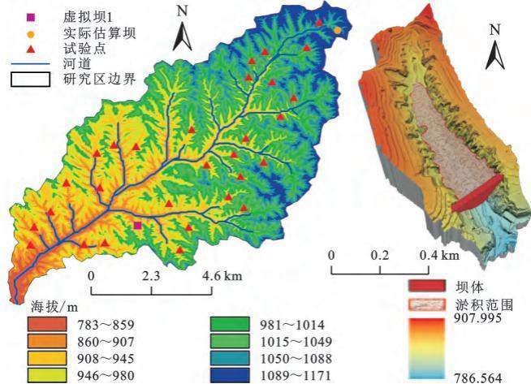  
图1 陕西省榆林市绥德县韭园沟研究区及虚拟坝1  
Fig. 1 Jiuyuangou study area (left) and virtual dam 1 (right) in Suide County, Yulin City, Shaanxi Province

## 2.2 数据采集

本研究于2024年5月采用大疆M3E无人机对研究区开展无人机摄影测量，覆盖整个韭园沟小流域，获取近5万张无人机影像数据，部分影像数据如图2所示。本次使用的大疆M3E无人机配备一台2000万像素的摄像头和一个多频率多星座GNSS接收器，可以接收 GPS，Galileo，BeiDou和 GLONASS 的导航信号。结合内置的网络RTK，可以进行厘米级精度的外业无人机影像采集，无人机参数见表1。

通过在航区进行多次预飞行，将飞行高度、航向重叠度和旁向重叠度分别设置为100～200m(取决于每个集水区的高差),80%和70%,并使用实时仿地功能以提高影像获取精度。采用 Agisoft Photoscan Professional1.2.6软件对无人机图像进行处理，包括影像对齐、密集点云构建、地面点分类、网格生成、DEM和DOM构建等。

已知沟谷线  
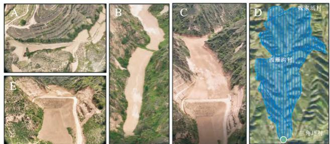  
图2 韭园沟无人机影像采集  
Fig. 2 UAV image acquisition in Jiuyuangou

表1 大疆无人机M3E参数表  
Table 1 Specifications of DJI M3 E
<table><tr><td colspan="2">类别</td><td>参数</td></tr><tr><td rowspan="5">大疆无人机 M3E</td><td>机身重量/kg</td><td>0.91</td></tr><tr><td>最大上升速度/(m·s−¹)</td><td>8</td></tr><tr><td>最大水平速度/(m·s−¹)</td><td>21</td></tr><tr><td>最长飞行时间/min</td><td>45</td></tr><tr><td>避障</td><td>APAS 5.0全向避障</td></tr><tr><td rowspan="3">电池</td><td>电池容量/mAh</td><td>5000</td></tr><tr><td>电池重量/kg</td><td>0.33</td></tr><tr><td>最短连续拍照间隔/s</td><td>0.7</td></tr><tr><td rowspan="2">相机</td><td>有效像素/万</td><td>2000</td></tr><tr><td>长焦镜头/万</td><td>1200</td></tr></table>

由于研究区沟壑纵横、地形复杂，且飞行航区数量众多，在每个航拍区域布置地面控制点（GroundControlPoint，GCP)具有一定难度。然而，由于缺乏地面控制点可能导致的厘米级误差，与坝沟长度/宽度(通常为百米级)相比，这种误差对生成的数字高程模型(DEM)和数字正射影像(Digital OrthophotoMap，DOM)的影响可忽略不计。

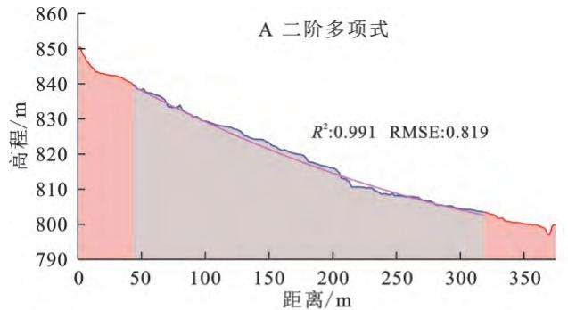

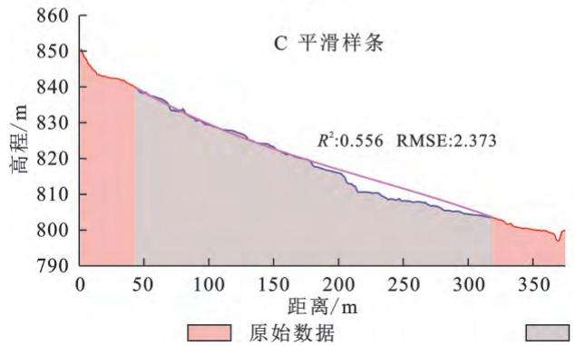

## 2.3 试验过程与结果

本文基于上述技术框架首先在研究区中随机选取30条沟道，在每条沟内建立一个一定高度的虚拟坝，通过三维分析得出虚拟坝的理论泥沙沉积量(V）。在此基础上，开展基于虚拟坝已知地形数据重构淤地坝建坝前原始曲面，并估算虚拟坝泥沙淤积量(Vs)。以虚拟坝1为案例，详细描述模拟坝纵向和横向地形特征数据的提取和重构，数字地形网络构成，淤地坝建坝前三维曲面重构及淤地坝泥沙量估算的试验过程与结果。

2.3.1 纵向特征的沟谷线重构图3为利用模拟坝1淤积区域上下游已知的实测沟谷数据对淤积区纵向特征分别采用二阶多项式、三阶多项式、平滑样条以及二项指数分别模拟的结果示意图。4种方法均能较准确地拟合沟谷的纵向特征，4种方法的RMSE依次分别为 0.819 m(图 3A),1.441 m(图 3B),2.373 m(图 3C)及0.792m(图3D),R²依次分别为：0.991,0.989,0.556及0.970。表明采用二项指数方法模拟的纵向特征的沟谷线结果与原始数据的接近程度和整体趋势最优。

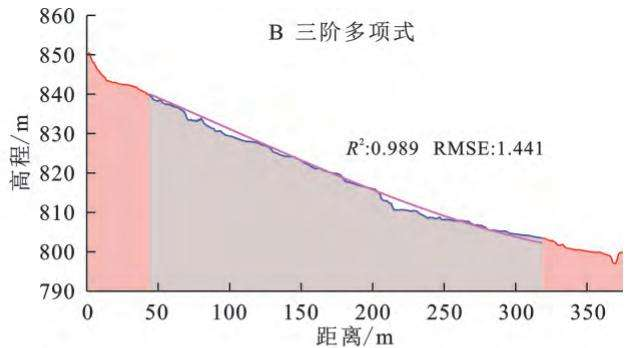

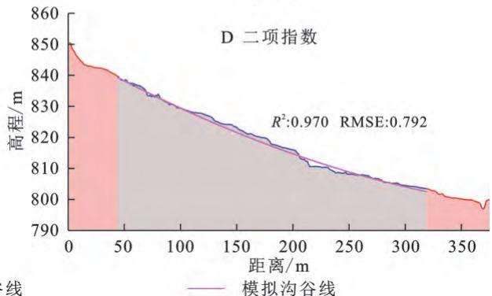  
图3 虚拟坝1纵向特征沟谷线拟合  
Fig. 3 Fitting of longitudinal characteristic valley lines for virtual dam 1

2.3.2 横向特征的沟坡线重构以最优拟合的沟道纵向特征以及淤积区域已知的沟坡地形数据为基础，对淤地坝淤积区进行横向特征数据拟合，图4为采用二阶多项式、三阶多项式、平滑样条及二项指数的拟合结果。4种方法的横向拟合RMSE值分别为2.785m(图 4A),2.720 m(图 4B),4.343 m(图 4C)及 2.594 m（图4D),R²依次分别为：0.936,0.939,0.845及0.949。同样结果表明采用二项指数方法模拟的纵向特征的沟谷线结果与原始数据的接近程度和整体趋势最优。

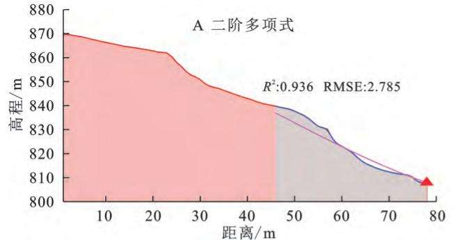

在此基础上，使用二项指数拟合得到的横向特征线(图5A)和纵向特征线(图5B)构成淤地坝淤积区的三维数字地形网络。

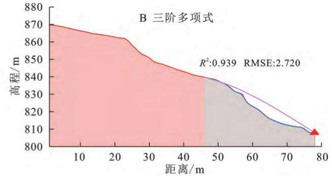

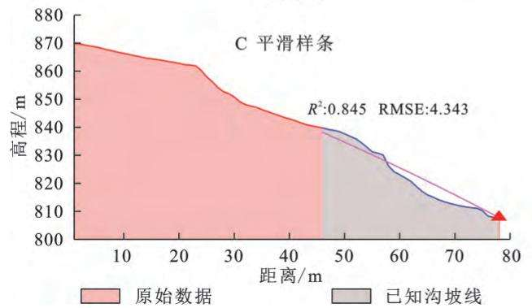

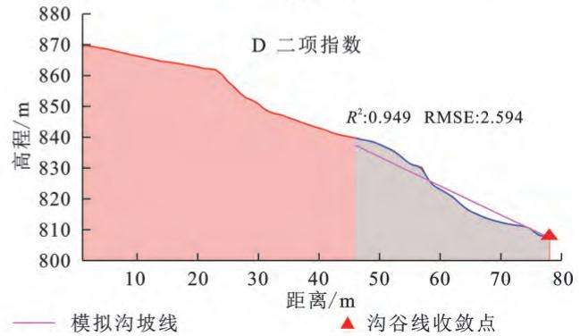  
图4 虚拟坝1横向特征沟坡线拟合

Fig. 4 Fitting of transverse characteristic gully slope lines for virtual dam 1  
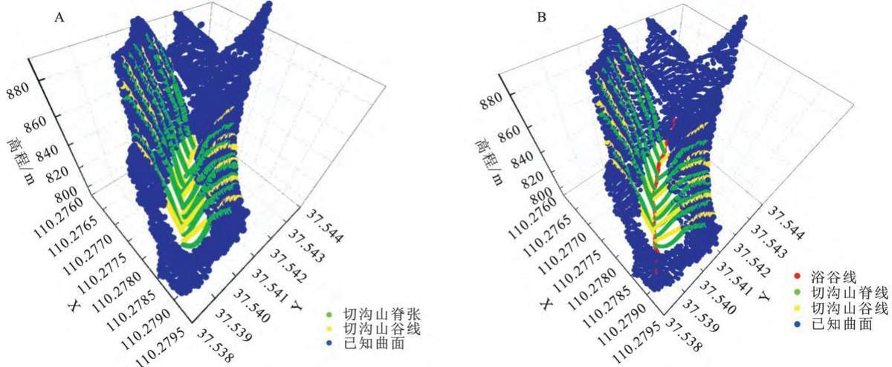  
图5 虚拟坝1数字地形网络  
Fig. 5 Digital terrain network of virtual dam 1

2.3.3 三维曲面拟合和泥沙估算精度基于2.3.1，2.3.2构建虚拟坝淤积区的三维数字地形网络，利用Hutchinson算法进行空间插值重构虚拟坝的模拟淤积三维曲面，并估算虚拟坝的淤积体积。模拟坝真实曲面(图6A)和模拟曲面(图6B)对比，其拟合的RMSE，R²分别为 1.56 m,0.996。

2.3.4 泥沙量估算和对比基于虚拟坝1的重构曲面和原始曲面，通过表面体积模型分别计算得到模拟泥沙体积 $( V _ { o } )$ 和真实泥沙量体积 $( V _ { s } )$ 分别为220

943.82 m³及246 052.98 m³,其虚拟坝1泥沙量估算误差率10.20%。

## 3 结果与分析

## 3.1 纵向沟谷线和横向沟坡线拟合精度

对非园沟流域随机选取的30条沟构建的虚拟坝采用4种方法分别进行淤积区域纵向沟谷线和横向沟坡线拟合，拟合的精度结果如图7所示。其中，二阶多项式、三阶多项式、平滑样条及二项指数的30个虚拟坝的纵向沟谷线 RMSE均值依次为 1.497 m，1.769 m，1.701m及1.305 m（图7A），R²均值依次为：0.991，0.991,0.987及0.996,对于横向沟坡线拟合结果,4种方法的30个虚拟坝横向沟坡线的平均RMSE精度指标均值分别为 6.412 m,11.559 m,3.246 m 及 2.958 m(图7B),R²均值依次为：0.888,0.621,0.965,及0.967。

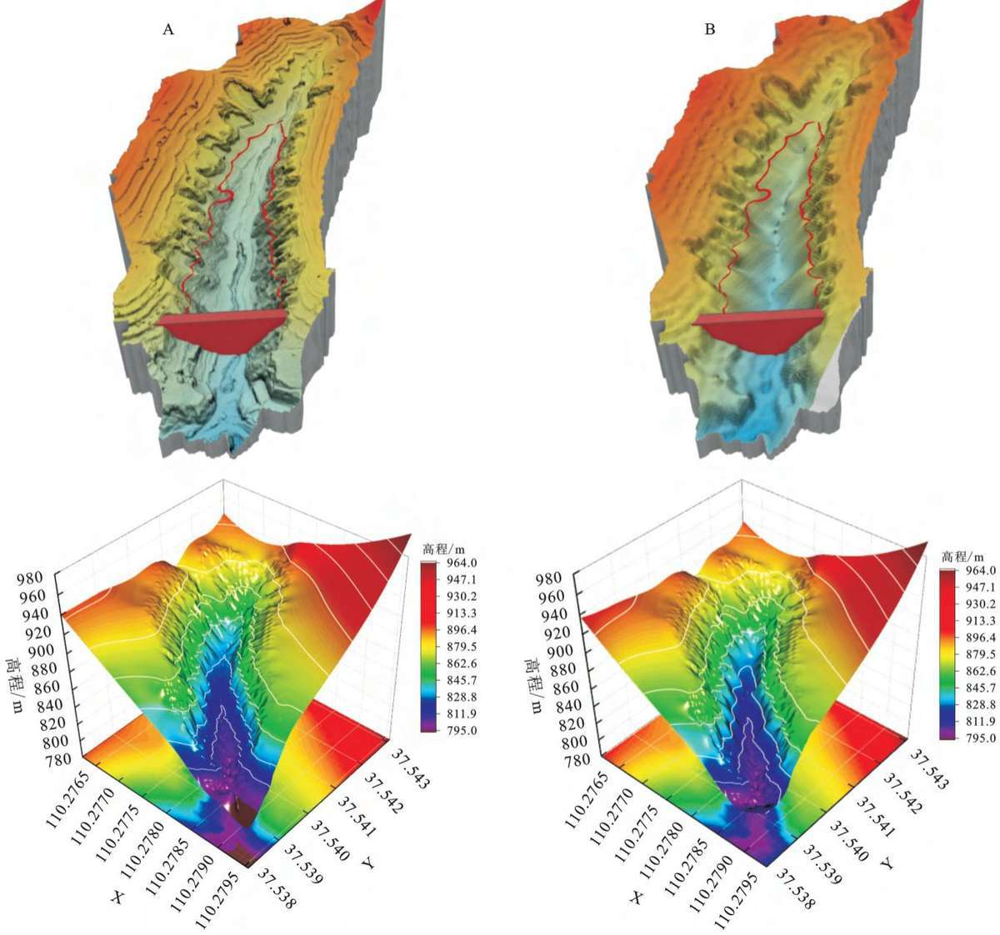  
图6 虚拟坝1原始曲面-重构后曲面对比图  
Fig. 6 Comparison between original surface and reconstructed surface of virtual dam 1

由R²数据结果表明利用二项指数拟合纵向沟谷线和横向沟坡线的数据拟合结果较好，并结合纵向沟谷线和横向沟坡线的RESE结果可知，二项指数拟合精度和稳定性均优于二阶多项式、三阶多项式、平滑样条3种方法。

## 3.2 三维曲面拟合和泥沙估算精度

基于最优拟合的30个虚拟坝的纵向沟谷线和横向沟坡线构成三维数字地形网络，采用Hutchinson算法进行空间插值重构30个虚拟坝淤积区的三维模拟曲面，与真实三维曲面相比，拟合的RMSE均值为1.03m，R²均值为0.998。表明三维曲面拟合结果具有较高精度。同时，基于模拟三维曲面，以一定坝高估算了淤积区泥沙淤积体积，结果如图8所示。30个虚拟坝的淤积泥沙量的估算值误差率为6.54%，相关系数R²为0.998。

## 3.3 真实淤地坝的模拟结果以及体积面积经验模型

陕西省榆林市绥德县韭园沟乡西坬村附近建有一座淤地坝(37°21′42″北110°36′33″东)（图9A)所示，淤积范围如图为9618.76m²，坝高12m。利用本研究所述方法重构的淤地坝建坝前数字地形网络见图9B，原始地形曲面9C和图9D，估算得到该坝的沉积泥沙量为 97 630.89 m³。

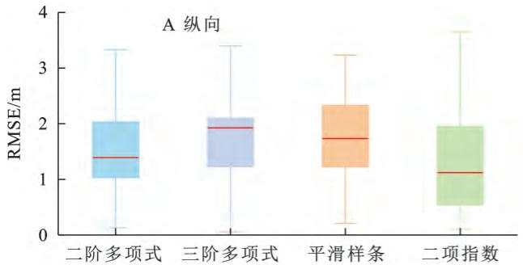

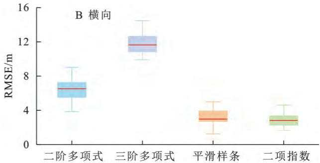  
图7 虚拟坝1纵向拟合精度-横向拟合精度

Fig. 7 Longitudinal fitting accuracy and transverse fitting accuracy of virtual dam 1  
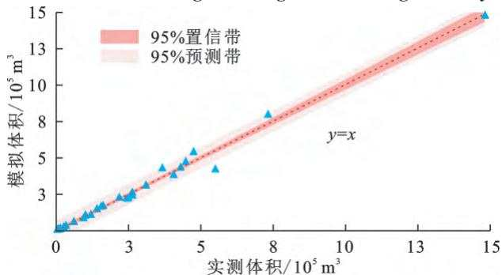  
图8 虚拟坝模拟体积相关性分析  
Fig. 8 Correlation analysis of simulated volumes for virtual dam

## 4 讨论

本研究基于无人机摄影测量技术采集了黄土高原淤地坝及空沟的高精度影像数据。基于得到的无人机数字产品通过淹没分析在空沟中建立大量的虚拟坝，通过水文分析方法提取去淤地坝沟壑中的已知纵向沟谷线和横向沟坡线，并基于二阶多项式、三阶多项式、平滑样条及二项指数等方法利用已知数据拟合被覆盖的地形特征线数据，对比了4种方法对于地形特的拟合精度，成功构建淤地坝原始数字地形网络，并基于数字地形网络通过Hutchinson算法进行空间插值重构得到淤地坝建坝前的原始地形曲面。最后，利用实测淤地坝的实际坝高和淤积范围基于建坝前的原始地形曲面和表面体积模型估算了淤地坝的泥沙量体积，并将上述方法体系成功应用于实际淤地坝泥沙量体积估算。

研究结果表明基于高分辨率地形数据拟合淤地坝纵向和横向地形特征构成的数字地形网络作为淤地坝原始曲面重构的基础，并通过空间插值的方法重构淤地坝原始曲面，以此为基础能够快速准确估算淤地坝的泥沙量体积。地形特征可以有效地描绘地面形态的分布情况，其中山脊线和山谷线被认为是最为重要的特征线，描绘了地形的骨架结构，并对最终的地貌形态产生重要影响[24-25]。准确完整提取淤地坝已知的纵向和横向特征线是拟合数字地形网络的重要前提，然而横向特征地形差异显著，通过水文分析汇水阈值的设定以及流向算法产生的不同流向的影响，导致横向特征提取有一定差异，这也是导致横向特征拟合误差偏大的原因(图7B)。淤地坝横向特征由骤发性降雨侵蚀山体的沟坡特征线构成，其主体趋势呈现线性并收敛于纵向特征线，然而其地形特征的复杂性与已知数据的集中性缺少导致，横向特征数据的拟合有一定的误差。

在以往的研究中，采用几何方法和地形方法来估算欧洲地区淤地坝的淤积沉积物[26]。该体积估算方法也广泛应用于中国黄土丘陵区(Loess Hilly Regionof China，LHRC),假设淤地坝的淤积区为金字塔形状或梯形，以估算堰塞湖淤积的沉积物。然而黄土高原中的淤地坝淤积深度通常为5\~50m，沉积物体积为 $( 0 . 0 1 { \sim } 5 ) \times 1 0 ^ { 6 } \mathrm { m } ^ { 3 }$ ，远远超过世界其他地区的淤地坝27]。通过假设淤积物为规则的几何形状估算黄土高原复杂地形淤地坝淤积物体积，其计算精度有待提高。通过基于淤地坝附近具有地理相似性的空沟，建立大量模拟坝并研究模拟坝如淤积面积、淤地坝高度等要素与模拟坝泥沙体积之间的关系从而建立相应的模型，进一步基于回归分析建立不同的淤地坝拦沙量估算模型，并验证模型的准确性，该方法估算淤地坝泥沙体积过程中未考虑到淤地坝附近不一定存在地理相似性空沟的可能。Fang等[28]在黄土高原地区选取6个典型淤地坝，通过高密度电阻率测量系统(electrical resistivity tomography，ERT)反演淤地坝库容地形，并结合挖掘淤积剖面、钻孔采样等方式进行验证，结果表明ERT具有较高精度(95.7%)，该方法提高了上述几何或地形方法的准确性。然而，这些方法需要大量人力和物质资源。本研究的创新点在于利用淤地坝所在沟壑未被淤积物覆盖的地形数据，通过构建原始曲面数字地形网络重构淤地坝原始曲面，并基于重构曲面估算淤地坝泥沙量体积，充分利用淤地坝所在沟壑的已知地形数据，并考虑了黄土高原复杂的地形特征影响并避免缺少参考空沟地形的问题且无人机数据获取便捷、精度高成本低。

A  
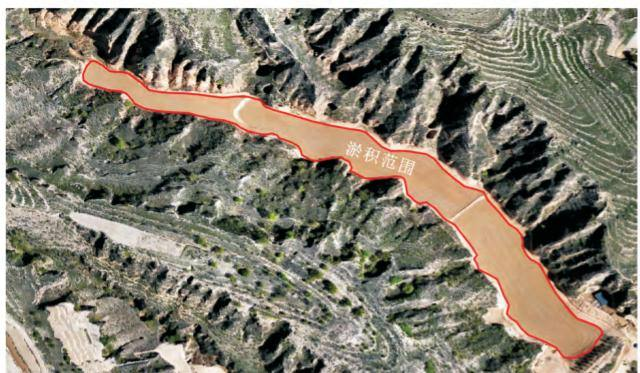

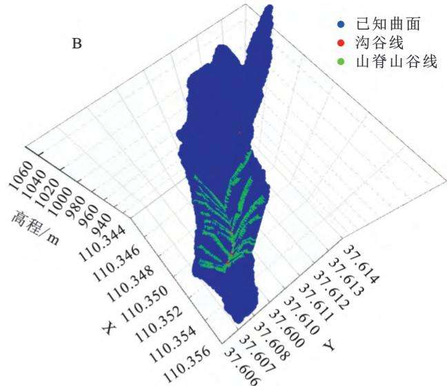

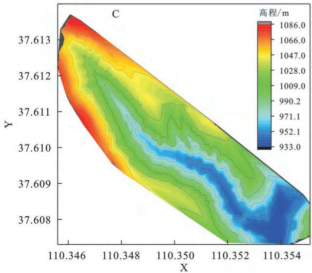  
图9 实际坝泥沙量估算

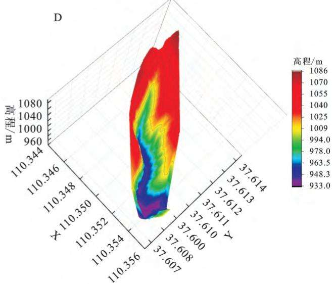  
Fig. 9 Sediment volume estimation for actual dam

然而本研究还存在一定的局限性，由于横向特征的复杂性，本研究中的4种特征数据拟合方法的数据拟合精度仍有待提高。下一步应研究横向特征的代表性地形因子，探索精度更高的横向特征拟合方法。

## 5 结论

本研究以黄土高原小流域为研究对象，基于无人机获取和处理高分辨率影像，重构淤地坝建坝前的地形特征的数字地形网络和三维曲面。并结合三维曲面和表面体积模型估算淤地坝的泥沙量。

选取陕西省榆林市绥德县韭园沟小流域为案例分析，将上述框架应用于30个虚拟坝，通过二阶多项式、三阶多项式、平滑样条及二项指数的地形特征模拟精度RMSE均值分别为：（1）纵向剖面精度1.497m，1.769 m,1.701 m 及 1.305 m，R²均值依次为 0.991，0.991，0.987及0.996。（2）横向剖面精度6.412m，11.559 m,3.246 m 及 2.958 m，R²均值依次为 0.888，

0.621,0.965,及0.967。(3）通过Hutchinson算法插值得到的三维曲面精度RMSE为1.03 m，R²为0.998。（4）体积估算精度的最大误差率、最小误差率以及平均误差率分别为23.42%,0.14%,6.54%;且二项指数拟合纵向剖面精度和横向剖面精度RMSE分别小于等于1.35 m和 3.00 m时，Hutchinson算法插值曲面RMSE≤1.100 m,体积估算精度误差率≤10%。

本文提出的通过无人机获取高精度影像数据并进行三维建模，重构淤地坝的原始地形特征，并利用空间插值重构淤地坝原始曲面，最后利用表面体积模型估算泥沙量的技术体系可广泛应用于黄土高原淤地坝泥沙量体积的估算。

## 参考文献(References):

[1] 高雅玉，黄枭，宋玉，等.黄土高原半干旱区淤地坝安全 监测方法[J].水土保持研究,2024,31(4):59-66,85. Gao Y Y, Huang X, Song Y, et al. Safety monitoring method of check dams in semi-arid area of the Loess Pla-

teau[J]. Research of Soil and Water Conservation, 2024, 31(4):59-66,85.

[2]马歆菲，王楠，屈创.鄂榆地区水土保持监测站点优化布 局探讨[J].中国水土保持,2023(10):35-39. Ma X F, Wang N, Qu C. Optimizing the layout of soil and water conservation monitoring stations in the Hubei and Chongqing Region[J]. Soil and Water Conservation in China, 2023(10):35-39.

[3] 王飞超.黄土高原淤地坝系安全运行与水沙资源利用潜 力研究[D].西安：西安理工大学，2023. Wang F C. Research on the safe operation of check dam system and resource utilization potential of water &. sediment on the Loess Plateau[D]. Xi'an: Xi'an University of Technology, 2023.

[4]李云飞.融合多源数据和地形特征的黄土高原流域淤地 坝识别研究[D].西安：长安大学,2023. Li Y F. Study on identification of check dams by combining multi-source data and topographic features in basin of the Chinese Loess Plateau[D]. Xi'an: Chang'an University, 2023.

[5]蒋凯鑫，莫淑红，于坤霞，等.黄土高原地区淤地坝拦沙分 析方法研究进展[J].水土保持学报,2023,37(6):1-10. Jiang K X, Mo S H, Yu K X, et al. Research progress on sediment retention analysis methods of yudiba dams in the Loess Plateau[J]. Journal of Soil and Water Conservation, 2023,37(6):1-10.

[6]张建国，董亚维，李晶晶，等.黄土高原地区淤地坝拦沙 淤积监测中存在的问题及方法探讨[J].水土保持通报， 2022,42(6):387-392,399. Zhang J G, Dong Y W, Li J J, et al. Discussion on problem and methods of monitoring sediment deposition of warping dams in Loess Plateau [J]. Bulletin of Soil and Water Conservation, 2022,42(6):387-392,399.

[7]王天巍，李念.泥沙连通性定量表征指数研究进展及发 展需求[J].生态学报,2024,44(24):11497-11511. Wang T W, Li N. Research progress and development demands of the quantitative index for sediment connectivity [J]. Acta Ecologica Sinica, 2024,44(24):11497-11511.

[8]李勉，杨二，李平，等.淤地坝赋存信息在流域侵蚀产沙 研究中的应用[J].水土保持研究,2017,24(3):357-362. Li M, Yang E, Li P, et al. Application of information recorded in check dams for soil erosion and sediment yield studies [J]. Research of Soil and Water Conservation, 2017,24(3):357-362.

[9]朱启明，王宁，刘俊娥，等.陕北生态脆弱区土壤水蚀变 化及驱动因子：以榆林市为例[J].水土保持研究，2023， 30(5):41-51,60. Zhu Q M, Wang N, Liu J E, et al. Soil water erosion changes and driving factors in ecologically fragile areas in northern Shaanxi Province: taking Yulin City as an example[J]. Research of Soil and Water Conservation,

2023,30(5):41-51,60.

[10]于坤霞，李天毅，贾路，等.黄土高原径流侵蚀功率输沙 模型的改进[J].农业工程学报,2024,40(10):107-116. Yu K X, Li T Y, Jia L, et al. Improvement of the sediment transport model based on runoff erosion power in the Loess Plateau[J]. Transactions of the Chinese Society of Agricultural Engineering, 2024,40(10):107-116.

[11] 刘亚星，郑梦桃，李家源，等.基于CSLE的陕北白于山 土壤侵蚀现状[J].中国水土保持科学(中英文）,2024， 22(5):22-30. Liu Y X, Zheng M T, Li J Y, et al. Soil erosion situation of Baiyu Mountain in northern Shaanxi province based on CSLE[J]. Science of Soil and Water Conservation, 2024,22(5):22-30.

[12]冯娟龙，吴川东，于洋，等.极端降雨对晋西黄土区农地 流域泥沙连通性的影响[J].水土保持研究，2023,30 (4):228-235. Feng J L, Wu C D, Yu Y, et al. Effects of extreme rainfall on sediment connectivity in a farmland watershed of the Gully Region in the western Shanxi Province of the Loess Plateau [J]. Research of Soil and Water Conservation, 2023,30(4):228-235.

[13]湖北省水利水电科学研究院.河湖保护与修复的理论与 实践[M].北京：中国水利水电出版社,2018:201810.761. Theory and practice of protection and restoration of rivers and lakes [M]. Beijing: China Water & Power Press, 2018:201810.761.

[14] 白雷超.黄土丘陵沟壑区淤地坝泥沙连通方式及其对拦 沙效益的影响[D].陕西杨凌：西北农林科技大学,2021. Bai L C. Sediment connection modes of check dams and its effects for sediment interception efficiency in the loess hill and gully region [D]. Yangling, Shaanxi: Northwest A&F University, 2021.

[15] Zeng Y, Meng X D, Zhang Y, et al. Estimation of the volume of sediment deposited behind check dams based on UAV remote sensing [J]. Journal of Hydrology, 2022,612:128143.

[16]冉大川，张栋，焦鹏，等.西柳沟流域近期水沙变化归因 分析[J].干旱区资源与环境,2016,30(5):143-149. Ran D C, Zhang D, Jiao P, et al. Analysis on the attribution of water and sediment changes in Xiliugou basin [J]. Journal of Arid Land Resources and Environment, 2016,30(5):143-149.

[17]黄志凯.固沟保塬工程(淤地坝)水土保持效应分析 [D].西安：长安大学,2021. Huang Z K. Analysis of soil and water conservation effect of gully consolidation and highland protection (check dam)[D]. Xi'an: Chang′an University, 2021.

[18] Javernick L, Brasington J, Caruso B. Modeling the topography of shallow braided rivers using Structurefrom-Motion photogrammetry [J]. Geomorphology,

2014,213:166-182.

[19] Uysal M, Toprak A S, Polat N. DEM generation with UAV Photogrammetry and accuracy analysis in Sahitler hill[J]. Measurement, 2015,73:539-543.

[20] Brosens L, Campforts B, Govers G, et al. Comparative analysis of SRTM, TanDEM-X and UAV-SfM DEMs to estimate lavaka(gully) volumes and mobilization rates in the Lake Alaotra region(Madagascar)[J]. Earth Surface Dynamics Discussions, 2021,2021:1-26.

[21] Flanagin M, Grenotton A, Ratcliff J, et al. Hydraulic splines: a hybrid approach to modeling river channel geometries [J]. Computing in Science &. Engineering, 2007,9(5):4-15.

[22] Schäppi B, Perona P, Schneider P, et al. Integrating river cross section measurements with digital terrain models for improved flow modelling applications [J]. Computers & Geosciences, 2010,36(6) :707-716.

[23] Huang T, Ding M T, Gao Z M, et al. Check dam storage capacity calculation based on high-resolution topogrammetry: case study of the Cutou Gully, Wenchuan County, China[J]. Science of the Total Environment, 2021,790:148083.

[24] Arseni M, Voiculescu M, Georgescu L P, et al. Testing different interpolation methods based on single beam echosounder river surveying. case study: Siret river[J]. ISPRS International Journal of Geo-Information, 2019,

## (上接第47页)

[22] 姚文艺，高亚军，张晓华.黄河径流与输沙关系演变及其 相关科学问题[J].中国水土保持科学,2020,18(4):1-11. Yao W Y, Gao Y J, Zhang X H. Relationship evolution between runoff and sediment transport in the Yellow River and related scientific issues [J]. Science of Soil and Water Conservation, 2020,18(4):1-11.

[23] Trenberth K E, Fasullo J T, Shepherd T G. Attribution of climate extreme events [J]. Nature Climate Change, 2015,5:725-730.

[24] 吴福婷，符淙斌.全球变暖背景下不同空间尺度降水谱 的变化[J].科学通报,2013,58(8):664-673. Wu F T, Fu C B. Change of precipitation intensity spectra at different spatial scales under warming conditions [J]. Chinese Science Bulletin, 2013,58(8):664-673.

[25]孔锋，吕丽莉，方建，等.中国不同时段气候变暖速率的时空分异研究(1961—2014)[J].北京师范大学学报：自然科学版,2017,53(4):426-435.

8(11):507.

[25]李嘉宁，张红丽，田昌园，等.长冲河小流域土壤侵蚀与 水文泥沙连通性分布特征及耦合关系分析[J].水土保 持学报,2024,28(6):79-88. Li J N, Zhang H L, Tian C Y, et al. Distribution characteristics and coupling relationship between soil erosion and hydrologic and sediment connectivity in Changchong River basin[J]. Journal of Soil and Water Conservation, 2024,28(6):79-88.

[26]张倬，杨娜，钱金良，等.基于物候特征的时序SAR水 稻指数构建及验证[J].农业工程学报，2024,40(20)： 157-164. Zhang Z, Yang N, Qian J L, et al. Construction and validation of paddy rice index using phenological features of SAR time series [J]. Transactions of the Chinese Society of Agricultural Engineering (Transactions of theCSAE),2024,40(20):157-164.

[27] Mongil-Manso J, Díaz-Gutiérrez V, Navarro-Hevia J, et al. The role of check dams in retaining organic carbon and nutrients: a study case in the Sierra de Ávila mountain range (Central Spain)[J]. Science of the Total Environment,2019,657:1030-1040.

[28] Fang N F, Zeng Y, Ni L S, et al. Estimation of sediment trapping behind check dams using high-density electrical resistivity tomography[J]. Journal of Hydrology, 2019,568:1007-1016.

Kong F, Lu L L, Fang J, et al. Spatiotemporal patterns of different period climate warming rate in China (1961—2014) [J]. Journal of Beijing Normal University: Natural Science, 2017,53(4):426-435.

[26]姬兴杰，刘美，吴稀稀，等.1961—2019年黄河流域降雨侵蚀力时空变化特征分析[J].农业工程学报，2022,38(14):136-145.Ji X J, Liu M, Wu X X, et al. Spatiotemporal variationcharacteristics of rainfall erosivity in the Yellow RiverBasin from 1961 to 2019[J]. Transactions of the ChineseSociety of Agricultural Engineering, 2022, 38 (14) :136-145.

[27]何绍浪，何小武，李凤英，等.近60年来江西省各等级侵蚀性降雨与降雨侵蚀力的关系[J].水土保持研究，2018,25(2):8-14.He S L, He X W, Li F Y, et al. Relationship betweenerosive rainfall and rainfall erosivity of each rainfall