开放科学OSID

# 河南省近十年来土壤侵蚀时空变化分析

黄硕文1，李健1\*，张欣佳1，邓联文2，张金萍2

（1.郑州大学地球科学与技术学院，郑州 450001；2.郑州大学水利科学与工程学院，郑州 450001）

摘 要：为定量评价河南省土壤侵蚀状况，实现河南省农业高质量发展，本研究以 模型为基础，利用多源遥感数据、数字高程模型、水文统计数据、气象数据等，系统分析了河南省 — 年土壤侵蚀的时空变化，并结合地理探测器方法探讨了研究区土壤侵蚀可能的驱动因素。研究表明：2008—2018年河南省土壤侵蚀以微度侵蚀为主，其面积占全省95%以上且逐年递增，轻度侵蚀区面积逐年递减，中度及以上侵蚀区域面积无明显变化；河南省西部、西南部及南部地区的土壤侵蚀状况近年来有明显改善，而西北部及北部黄河流域的土壤侵蚀模数维持相对较高状态；坡度对土壤侵蚀的解释力最强，且与其他因子具有强交互作用，是影响河南省土壤侵蚀的主要因素。本研究可以为河南省生态治理及环境保护政策制定提供科学依据。

关键词：河南省；土壤侵蚀；定量；RUSLE模型

中图分类号：S157.1

文献标志码：A

文章编号：2095-6819（2021）02-0232-09

doi: 10.13254/j.jare.2020.0258

# Analysis of spatial and temporal changes in soil erosion in Henan Province over the last ten years

HUANG Shuo-wen1, LI Jian1\*, ZHANG Xin-jia1, DENG Lian-wen2, ZHANG Jin-ping2

（1.School of Earth Science and Technology, Zhengzhou University, Zhengzhou 450001, China; 2.School of Water Science and Engineering, Zhengzhou University, Zhengzhou 450001, China）

Abstract：This study systematically analyzed the spatial and temporal changes in soil erosion in Henan Province from 2008 to 2018, using the RUSLE model, to quantitatively evaluate the soil erosion status and achieve high-quality agricultural development there. The possible factors driving soil erosion were discussed with a method using geographic detectors. The results showed that soil erosion in Henan Province was dominated by“slight erosion”over more than 95% of the province and that this increased year by year from 2008 to 2018. The area of“light erosion”decreased year by year while the area of“moderate and above erosion”showed no obvious change trend. The soil erosion situation in the western, southwestern, and southern regions of Henan Province improved significantly in recent years, while the soil erosion modulus in the northwestern and northern Yellow River basins had remained relatively high. The slope was the main factor affecting soil erosion due to its strong interpretation of and interaction with the former. This research can provide a scientific basis for the formulation of ecological governance and environmental protection policies to promote green and healthy development of the Yellow River basin.

Keywords：Henan Province; soil erosion; quantitative; RUSLE model

年 月，黄河流域生态保护和高质量发展被列为重大国家战略，水土流失相关研究是生态保护的重要组成部分。河南省处于黄河中下游，是农业大省和粮食主产区，但部分地区在气候、地形等因素的综合作用下极易发生土壤侵蚀，对耕地产生破坏，直接影响粮食作物的产量。为了更好地保护有限的耕地资源，实现区域高质量发展，有必要对河南省土壤侵蚀状况进行定量评价，分析其时空变化特征，探究引发土壤侵蚀的主导因素，并制定相关的保护措施。

对土壤侵蚀进行评价主要有实地观测和建立土壤侵蚀模型两种方法。在实际应用中，由于某些地区的客观条件限制难以进行实地观测，建立土壤侵蚀模型进行侵蚀量预报是常用的方法。根据建立的方法用途和所模拟的侵蚀过程可以将土壤侵蚀模型分为经验模型、物理模型和分布模型[1]。代表性的物理模型有水蚀预报模型WEPP[2]、欧洲土壤侵蚀预报模型 [3]、非点源地区流域环境反应模型ANSWERS[4]等，分布模型以SHE模型[5]最为典型。物理模型和分布模型由于面向过程建模，所需的资料和参数设置过多，难以在特定区域外进行推广。土壤侵蚀经验模型基于大量实测数据进行统计分析，结合土壤侵蚀过程的机理建立，国际上应用较广的主要有通用 水 土 流 失 方 程 USLE 和 其 修 正 形 式 RUSLE。RUSLE对USLE中各因子含义及计算方法进行了必要的修正，增加了复杂坡度下土壤流失量的计算方法，具有结构简明、计算因子含义明显的特点，且容易与GIS结合进行分析，在国内外土壤侵蚀定量评价中应用广泛[6-9]。土壤侵蚀过程中同时受到多种因素的影响，因此分析其内在驱动力对于水土保持政策的制定至关重要。地理探测器可用于分析不同自变量对因变量的解释能力，在土壤侵蚀领域的应用也得到了学者们的认可[10-11]。

本研究利用 模型与 技术相结合，对河南省全境土壤侵蚀强度进行定量评价，分析其时空变化情况，并利用地理探测器分析土壤侵蚀影响因素，为河南省水土流失防治重点保护区的划定和生态环境保护工作提供参考。

## 1 材料与方法

## 1.1 研究区概况

河南省（31°23′\~36°22′N，110°21′\~116°39′E）地处中原地区，是国家重要的粮食生产基地（图1），由于季风气候的影响以及跨海河、黄河、淮河、长江四大

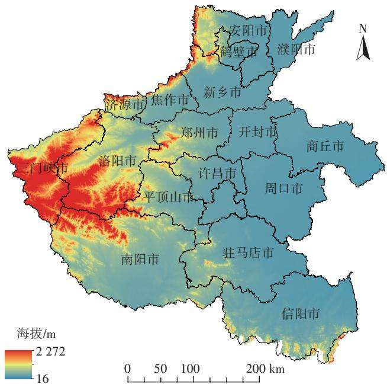  
图1 河南省行政区划及数字高程模型  
Figure 1 Administrative division and digital elevation model of Henan Province

水系的地理位置，研究区内常常出现局部土壤强侵蚀，对生态环境造成破坏，但近几年河南加强了水土保持措施的制定与实施，水土流失情况得到了一定改善。

## 1.2 数据来源

本研究所选用的数据为河南省行政区划图、降雨数据（ 、 、 年）、 卫星遥感数据、数字高程模型（DEM）数据、地貌类型数据和土壤数据。其中降雨数据为中国气象数据网（http：//data.cma.cn）的中国地面气候资料日值数据集；土壤数据（质地、有机质等）来源于黑河计划数据管理中心（http：//westdc.west⁃gis.ac.cn）的“基于世界土壤数据库的中国土壤数据集（V1.1）”，从中截取了河南省地区数据；DEM 90 m分辨率原始高程数据和ETM+卫星遥感影像来源于地理空间数据云平台（http：//www.gscloud.cn）；地貌形态类型数据来源于中国科学院资源环境数据中心（http：//www.resdc.cn）。将各个因子数据坐标系转化为高斯-克里格投影坐标系，栅格数据分辨率统一为90m×90m。

## 1.3 RUSLE模型

模型充分考虑了影响土壤侵蚀的多个因子，对复杂、分布广泛的土壤侵蚀及模型参数变异性等问题均提出较好的解决方案，其公式为：

$$
A { = } R { \times } K { \times } L { \times } S { \times } C { \times } P\tag{1}
$$

式中：A为模型计算得到的土壤侵蚀模数， $\mathrm { t } \cdot \mathrm { h m } ^ { - 2 } \cdot \mathrm { a } ^ { - 1 }$ 本研究乘以100，将单位换算为 $\mathrm { t } \cdot \mathrm { k m } ^ { - 2 } \cdot \mathrm { a } ^ { - 1 }$ ；R 为降雨侵蚀力因子；K为土壤可侵蚀性因子；L为坡长因子；S为坡度因子；C为作物覆盖和管理因子；P为水土保持措施因子[12]。 模型通过计算各个因子的指标值对土壤侵蚀强度进行定量评价。

降雨侵蚀力因子（R）：降雨通过对土壤进行冲击引发水力侵蚀，是进行土壤侵蚀预报的重要因子之一。本研究采用基于月平均降雨量和年平均降雨量数据的Wischmeier公式[13]进行降雨侵蚀力的计算，公式为：

$$
R { = } \sum _ { 1 } ^ { 1 2 } 1 . 7 3 5 \times 1 0 ^ { ( 1 . 5 \mathrm { l g } { \frac { P _ { i } } { P } } ) ^ { 0 . 8 1 8 8 } }\tag{2}
$$

式中：R为年降雨侵蚀力， $\mathrm { M J } \cdot \mathrm { m m } \cdot \mathrm { h m } ^ { - 2 } \cdot \mathrm { h } ^ { - 1 } ; P _ { i } \setminus P$ 分别为月平均、年平均降雨量，mm。

土壤可蚀性因子（K）：土壤可蚀性因子反映了土壤自身理化性质对于土壤侵蚀的抵抗能力。同等条件下，K值越大，土壤被冲蚀的可能性就越大。本研究根据已有参数采用Williams等[14]在EPIC模型中的算法，利用土壤机械组成和土壤有机质进行K值计算。具体计算公式为：

$$
\begin{array} { l } { { { \cal K } = \left\{ 0 . 2 + 0 . 3 \times \mathrm { e } ^ { - 0 . 0 2 5 6 \times S _ { \mathrm { d } } \times ( 1 - \frac { S _ { \mathrm { i } } } { 1 0 0 } ) } \right\} \times ( \frac { S _ { \mathrm { i } } } { C _ { \mathrm { 1 } } + S _ { \mathrm { i } } } ) \times } } \\ { { { \cal C } _ { \mathrm { 1 . 0 - } } \frac { 0 . 2 5 C } { C + \mathrm { e } ^ { 3 . 7 2 - 2 . 9 5 C } } ) \times ( 1 . 0 - \frac { 0 . 7 S _ { \mathrm { n } } } { S _ { \mathrm { n } } + \mathrm { e } ^ { - 5 . 5 1 + 2 2 . 9 S _ { \mathrm { n } } } } ) } } \end{array}\tag{3}
$$

式中： $S _ { \mathrm { n } } { = } 1 { - } S _ { \mathrm { d } } / 1 0 0 ; S _ { \mathrm { d } }$ 为砂粒含量，%；S 为粉粒含量，%；C为黏粒含量，%；C为有机质含量，%。

地形因子（LS）：地形因子直接影响坡面侵蚀的速率，是土壤侵蚀的动力因子。在RUSLE模型中通常将坡长L因子与坡度S因子合并为 地形因子进行计算。国内学者基于不同地貌类型区和径流小区的实测数据对模型中地形因子计算参数进行了修正[15]，本研究采用第四次土壤侵蚀普查算法[16]计算LS因子，公式如下：

$$
\mathrm { L S } \mathbf { = } \left( \frac { \lambda } { 2 2 . 1 } \right) ^ { m } \times \left\{ \begin{array} { l l } { 1 0 . 8 \sin { \theta } + 0 . 0 3 , \theta \leqslant 5 ^ { \circ } } \\ { 1 6 . 8 \sin { \theta } - 0 . 5 , \quad 5 ^ { \circ } < \theta \leqslant 1 0 ^ { \circ } \ ( 4 ) } \\ { 2 1 . 9 \sin { \theta } - 0 . 9 6 , \theta > 1 0 ^ { \circ } } \end{array} \right.
$$

$$
m = \left\{ \begin{array} { l l } { 0 . 5 , \ } & { \theta > 5 ^ { \circ } } \\ { 0 . 4 , \ } & { 3 ^ { \circ } < \theta \leqslant 5 ^ { \circ } } \\ { 0 . 3 , \ } & { 1 ^ { \circ } < \theta \leqslant 3 ^ { \circ } } \\ { 0 . 2 , \ } & { \theta \leqslant 1 ^ { \circ } } \end{array} \right.
$$

式中 $: \lambda$ 为坡长 $; \theta$ 为坡度 $; m$ 为坡长系数。

植被覆盖和管理因子（C）：植被覆盖与管理因子（0≤C≤1）反映了植被覆盖对土壤侵蚀的抑制作用，为无量纲数，其值越大则植被发挥减蚀的作用越小。C因子的值通常通过植被覆盖度计算，本研究使用归一化植被指数 来计算地表植被覆盖度c，计算公式如下：

$$
c { = } \frac { \mathrm { N D V I - N D V I _ { \mathrm { m i n } } } } { \mathrm { N D V I _ { \mathrm { m a x } } - N D V I _ { \mathrm { m i n } } } }\tag{5}
$$

C因子的计算采用蔡崇法等[17]算法的修正形式，避免了当c值在0\~0.1之间时异常值（C>1）的出现，如式（6）所示：

$$
C = \left\{ \begin{array} { l l } { 1 , } & { 0 \leqslant c \leqslant 9 . 6 \% } \\ { 0 . 6 5 0 8 - 0 . 3 4 3 6 , } & { 9 . 6 \% < c \leqslant 7 8 . 3 \% } \\ { 0 , } & { c > 7 8 . 3 \% } \end{array} \right.\tag{6}
$$

水土保持因子（P）：水土保持措施因子P（ P），其值越小代表水土保持措施越好，土壤侵蚀越不易发生。目前P的赋值主要由实地考察资料结合经验决定，本研究参照了美国农业部手册537号[18]和覃杰香等[19]的相关研究，对不同土地利用类型区域和不同坡度的耕地分别按表 和表 进行赋值。

## 1.4 地理探测器

地理探测器由因子探测器、风险探测器、生态探测器和交互作用探测器四部分组成。它通过探测要素的空间分层异质性来揭示其背后驱动力[20]。

因子探测器可用于探测某个因素X对因变量Y的解释程度，其大小可用 $q$ 值来度量（0≤q≤1），其值越大表示自变量X对因变量Y的解释力越强[20]。以此可以

表2 不同坡度耕地的水土保持因子（P值）  
Table 2 Water and soil conservation factors（P values）of cultivated land on different slopes
<table><tr><td>坡度Slope/ (°)</td><td>水土保持因子 Water and soil conservation factors(P)</td></tr><tr><td>0~5</td><td>0.100</td></tr><tr><td>5~10</td><td>0.221</td></tr><tr><td>10~15</td><td>0.305</td></tr><tr><td>15~20</td><td>0.575</td></tr><tr><td>20~25</td><td>0.705</td></tr><tr><td>&gt;25</td><td>0.800</td></tr></table>

表1 不同土地利用类型的水土保持因子（P值）

Table 1 Water and soil conservation factors（P values）of different land use types
<table><tr><td>林地</td><td>草地</td><td>水域</td><td>居民用地</td><td>建筑用地</td><td>未利用地</td></tr><tr><td>Woodland 1</td><td>Grass 1</td><td>Water 0</td><td>Residential land 0</td><td>Building land 0</td><td>Unused land 1</td></tr></table>

http://www.aed.org.cn

识别出影响土壤侵蚀的主导因素。

交互探测器用于识别不同自变量因子之间的交互作用[20]，其交互方式见表3。

表3 自变量对因变量的交互作用方式  
Table 3 Types of interaction between two covariates
<table><tr><td>判据 Criterion</td><td>交互作用Interaction</td></tr><tr><td> $q ( X 1 \cap X 2 ) { < } \mathrm { M i n } [ q ( X 1 ) , q ( X 2 ) ]$ </td><td>非线性减弱</td></tr><tr><td> $\mathrm { M i n } [ q ( X 1 ) , q ( X 2 ) ] { < q ( X 1 \cap X 2 ) } <$ </td><td>单因子非线性减弱</td></tr><tr><td> $\operatorname { M a x } [ q ( X 1 ) , q ( X 2 ) ]$ </td><td></td></tr><tr><td> $q ( X 1 \cap X 2 ) { > } \mathrm { M a x } [ q ( X 1 ) , q ( X 2 ) ]$ </td><td>双因子增强</td></tr><tr><td> $q ( X 1 \cap X 2 ) { = } q ( X 1 ) + q ( X 2 )$ </td><td>独立</td></tr><tr><td> $q ( X 1 \cap X 2 ) > q ( X 1 ) + q ( X 2 )$ </td><td>非线性增强</td></tr></table>

生态探测器可以对两个因子进行比较，判断它们的空间分布影响是否有显著差异[20]。风险探测器判断单个影响因子不同层间属性是否有显著差异，可用于识别土壤侵蚀高风险区。

本研究选取土壤侵蚀强度作为因变量，坡度、海拔、年平均降雨量、植被覆盖度、土地利用类型、地形地貌作为土壤侵蚀的影响因子，并对 类因子进行离散化处理。多年平均降雨量等间距分成9 类，植被覆盖度分为8类 $( < 0 . 3 , 0 . 3 { \sim } 0 . 4 , 0 . 4 { \sim } 0 . 5 , 0 . 5 { \sim } 0 . 6 , 0 . 6 { \sim } 0 . 7$ 0.7\~0.8、0.8\~0.9、0.9\~1），坡度分为 8 类 $( < 5 ^ { \circ } , 5 ^ { \circ } { \sim } 1 0 ^ { \circ }$ $1 0 ^ { \circ } \sim 1 5 ^ { \circ } \ : \mathrm { , ~ } 1 5 ^ { \circ } \sim 2 0 ^ { \circ } \ : \mathrm { , ~ } 2 0 ^ { \circ } \sim 2 5 ^ { \circ } \ : \mathrm { , ~ } 2 5 ^ { \circ } \sim 3 0 ^ { \circ } \ : \mathrm { , ~ } 3 0 ^ { \circ } \sim 3 5 ^ { \circ } \ : \mathrm { , ~ } > 3 5 ^ { \circ } \ : \mathrm { ) }$ 海拔分为4类 $( < 5 0 0 \mathrm { ~ m ~ } , 5 0 0 { \sim } 1 \ 0 0 0 \mathrm { ~ m ~ } , 1 \ 0 0 0 { \sim } 1 \ 5 0 0 \mathrm { ~ m ~ }$ $> 1 5 0 0 \mathrm { ~ m } )$ ，土地利用类型分为林地、草地、水域、居民用地、建筑用地、未利用地6个类别，地形地貌数据使用《中华人民共和国地貌图集（1∶100万）》中的类别编号。然后以河南省为范围进行随机采样，共选取

10 000个样本点，每个样本点赋予以上各类属性值作为地理探测器的输入数据。

## 2 结果与讨论

## 2.1 RUSLE模型土壤侵蚀分布计算结果

模型中降雨侵蚀力因子、土壤可侵蚀性因子、地形因子、植被覆盖与管理因子、水土保持因子计算结果如图2\~图6所示。

将以上各因子结果相乘，得到河南省 2008—

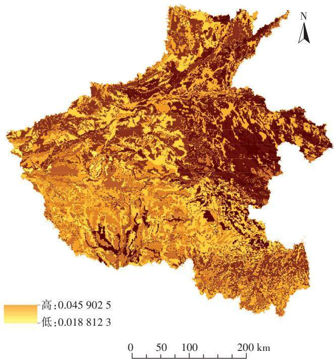  
图3 河南省土壤可侵蚀性因子分布  
Figure 3 Distribution of soil erosibility factors in Henan Province

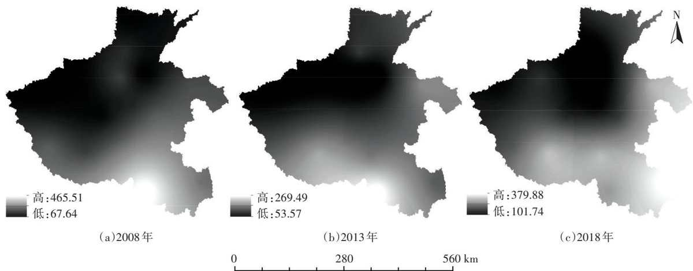  
图2 河南省2008—2018年降雨侵蚀力因子分布  
Figure 2 Distribution of rainfall erosivity factors in Henan Province from 2008 to 2018 http://www.aed.org.cn

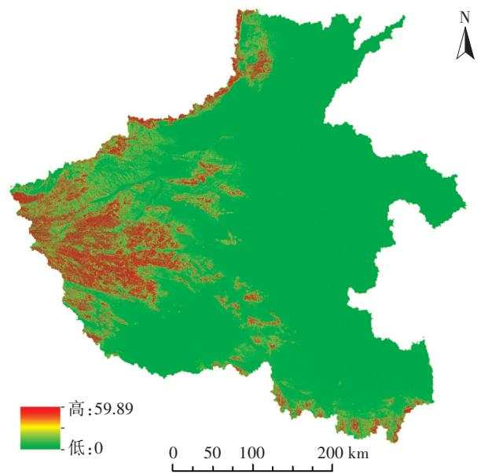  
图4 河南省地形因子分布  
Figure 4 Distribution of topographic factors in Henan Province

2018年的土壤侵蚀分布情况（图7）。

## 2.2 土壤侵蚀时空变化特征

根据《土壤侵蚀分类分级标准》（SL 190—2007），并结合河南省土壤侵蚀量实际分布情况对研究区土壤侵蚀强度进行分级：平均侵蚀模数 $0 { \sim } 5 0 0 \ \mathrm { t \cdot k m } ^ { - 2 } { \cdot } \mathrm { a } ^ { - 1 }$ 划分为微度侵蚀区；平均侵蚀模数 $5 0 0 { \sim } 2 5 0 0 \mathrm { t \cdot k m ^ { - 2 } }$ a-1划分为轻度侵蚀区；平均侵蚀模数 $2 \ 5 0 0 \ \mathrm { t \cdot k m ^ { - 2 } \cdot a ^ { - 1 } }$ 以上区域统一划分为中度及以上侵蚀区。河南省各类侵蚀区的面积占比见表4。

图 和表 显示，河南省 — 年土壤侵蚀分布广、程度低：整体以微度侵蚀为主，其面积占比超过95%，且2008年以来逐年递增，分布在东部及中部冲积平原区；轻度侵蚀地区主要分布在西部、南部山区及中部风沙平原区，其面积占比呈逐年下降趋势，从图7可以看出豫西部地区下降尤为显著；中度及以上侵蚀区域集中在西北及北部黄河流域，多年来总体

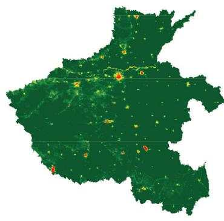

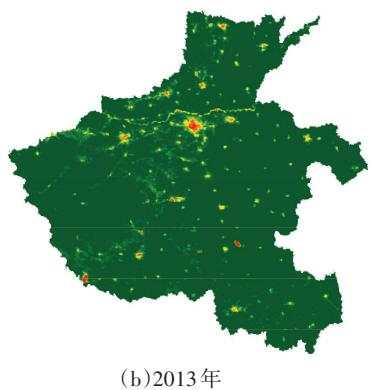

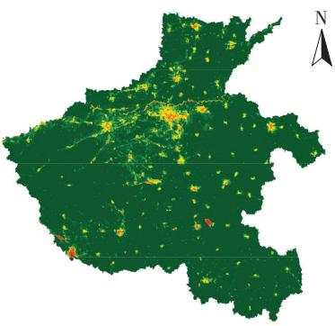  
（c）2018 年

图5 河南省2008—2018年植被覆盖与管理因子分布  
Figure 5 Distribution of vegetation cover and management factors in Henan Province from 2008 to 2018  
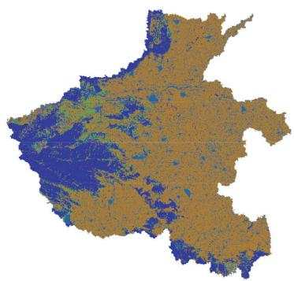

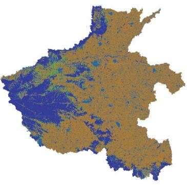

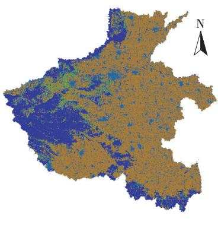  
图6 河南省2008—2018年水土保持因子分布  
Figure 6 Distribution of water and soil conservation factors in Henan Province from 2008 to 2018 http://www.aed.org.cn

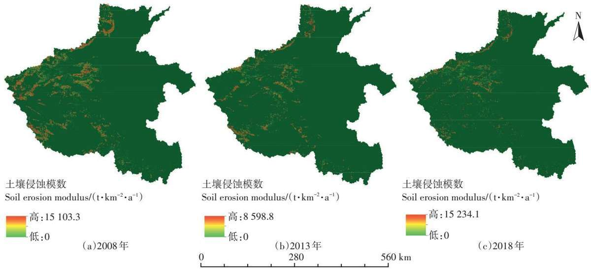  
图7 河南省2008—2018年土壤侵蚀模数分布  
Figure 7 Distribution of soil erosion modulus in Henan Province from 2008 to 2018

表4 2008—2018年河南省不同土壤侵蚀等级面积比例（%）  
Table 4 Proportion of area of different soil erosion levels in Henan Province from 2008 to 2018（%）
<table><tr><td>侵蚀等级 Erosion level</td><td>2008</td><td>2013</td><td>2018</td></tr><tr><td>微度侵蚀</td><td>95.53</td><td>96.45</td><td>97.14</td></tr><tr><td>轻度侵蚀</td><td>2.81</td><td>2.51</td><td>1.04</td></tr><tr><td>中度及以上侵蚀</td><td>1.66</td><td>1.04</td><td>1.82</td></tr></table>

变化不大。

对各年份土壤侵蚀分级图进行叠加分析得到2008—2013、2013—2018 年两个阶段的土壤侵蚀强度转移矩阵（表5、表6）和转移图（图8）。

根据图表显示，2008—2013年河南省共有2 738.01km2地区土壤侵蚀强度降低，243.88 km2侵蚀强度增加。侵蚀强度降低主要集中在轻度转化为微度，转化面积达2 324.77 km2。从前文分析可知侵蚀下降主要集中在西部地区，这与河南省近年来在西部山地生态区实施的一系列保护性措施有关。这些措施增加了植被面积，有效抑制了土壤侵蚀。侵蚀强度增加主要集中在微度侵蚀增强为轻度，主要是因为豫西北地区以山地为主，同时受河流侵蚀及耕地分布不合理等自然及人为因素的共同影响，治理难度较大。

2013—2018 年河南省共有 946.57 km2 地区土壤侵蚀强度减小，843.89 km2地区侵蚀强度加大。与2008—2013年相比，侵蚀强度明显加强。这可能是由于2018年河南省降雨量明显增加，水力侵蚀增强。

表5 河南省2008—2013年土壤侵蚀强度转移矩阵（km2）  
Table 5 Transfer matrix of soil erosion intensity in Henan Province from 2008 to 2013（km2）
<table><tr><td rowspan="2">2008年土壤侵蚀面积 Soil erosion area in 2008</td><td colspan="3">2013年土壤侵蚀面积 Soil erosion area in 2013</td></tr><tr><td>微度 Slight</td><td>轻度 Mild</td><td>中度及以上</td></tr><tr><td>微度</td><td>158 496.04</td><td>225.40</td><td>Moderate and above 17.61</td></tr><tr><td>轻度</td><td>2 324.77</td><td>840.99</td><td>0.87</td></tr><tr><td>中度及以上</td><td>295.03</td><td>118.21</td><td>55.93</td></tr></table>

表6 河南省2013—2018年土壤侵蚀强度转移矩阵（km2）

Table 6 Transfer matrix of soil erosion intensity in Henan Province from 2013 to 2018（km2）
<table><tr><td rowspan="2">2013年土壤侵蚀面积 Soil erosion area in 2013</td><td colspan="3">2018年土壤侵蚀面积 Soil erosion area in 2018</td></tr><tr><td>微度</td><td>轻度</td><td>中度及以上</td></tr><tr><td>微度</td><td>Slight 160 230.19</td><td>Mild 737.79</td><td>Moderate and above</td></tr><tr><td>轻度</td><td>887.15</td><td>248.82</td><td>58.27 47.83</td></tr><tr><td>中度及以上</td><td></td><td></td><td></td></tr><tr><td></td><td>57.23</td><td>2.19</td><td>14.97</td></tr></table>

## 2.3 土壤侵蚀影响因素分析

前述研究结果揭示了河南省土壤侵蚀的时空演变特征，借助地理探测器进一步探讨其驱动因子。

地理探测器中因子探测器结果如表 所示，不同影响因子对土壤侵蚀强度的解释力有明显差异，排序为坡度>土地利用类型>地貌类型>年平均降雨量>海拔>植被覆盖度。其中坡度对土壤侵蚀强度的解释力最强，高达39.63%，可以看作是影响河南省土壤侵蚀的主导因子；其次是土地利用类型，解释力为11.27%；植被覆盖度的q值最小，解释力不足1%，单因子作用下对土壤侵蚀的影响并不显著。

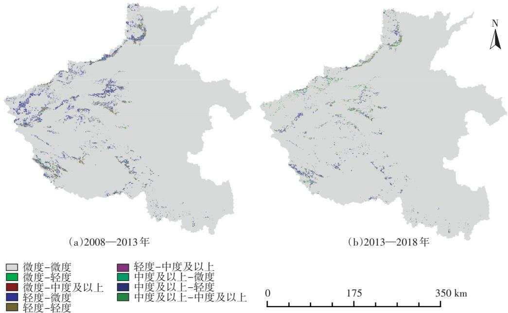  
图8 土壤侵蚀动态转移分布图  
Figure 8 Dynamic transfer map of soil erosion

表7 土壤侵蚀影响因子的解释力 $( q$ 值）  
Table 7 The q value of influencing factors of soil erosion
<table><tr><td>项目 Items</td><td>年平均降雨量 Average annual rainfall</td><td>坡度 Slope</td><td>植被覆盖度 Vegetation coverage</td><td>土地利用类型 Land use type</td><td>地貌类型 Landform type</td><td>海拔 Altitude</td></tr><tr><td>q值</td><td>0.044 9</td><td>0.396 3</td><td>0.0031</td><td>0.112 7</td><td>0.0541</td><td>0.014 3</td></tr><tr><td>Sig</td><td>&lt;0.0001</td><td>&lt;0.0001</td><td>0.0388</td><td>&lt;0.0001</td><td>&lt;0.0001</td><td>&lt;0.0001</td></tr></table>

根据交互探测器结果（表8），不同影响因子通过交互作用对土壤侵蚀空间分布的解释力远大于单因子。坡度与其他因子的交互作用明显大于剩余因子间的交互作用，其中与土地利用类型的协同作用是显著控制因子，解释力高达57.14%，明显高于坡度的单因子作用。此外，植被覆盖度与其他因子的交互作用大大增强了单因子对土壤侵蚀的解释力，特别是与坡度因子的交互作用，q值增幅极大，说明了在地形起伏较大的地区有必要加强植被建设，通过因子间交互作用抑制土壤侵蚀的发生。

通过风险探测器对不同影响因子各分类的土壤侵蚀平均强度进行统计，识别出高风险区，结果（表9）表明坡度>35°区域发生土壤侵蚀的风险最高。河南省土壤侵蚀强度随着坡度等级的增加而增大，坡度范围为0\~25°时增长缓慢，大于25°时土壤侵蚀强度急剧增加，这部分区域主要分布在河南省西部的三门峡以及南阳市，土地利用类型以耕地为主，植被覆盖度较低，极易引发水土流失。降雨量和地貌类型因子不同分类间平均土壤侵蚀强度无显著差异，植被覆盖度的高风险区分布在0\~0.3区间，且随着植被覆盖度的升高，土壤侵蚀强度明显降低，说明植被对研究区土壤侵蚀有重要影响。当海拔大于1 500 m时，侵蚀强度比前3个分类有明显提升，通过与降雨量图层的叠置分析，发现这些区域也对应着强降雨区，两因子间协同作用造成了强烈的侵蚀。

表8 土壤侵蚀影响因子交互作用下的解释力 $( q$ 值）  
Table 8 The q values of dominant interactions between soil erosion influencing factors
<table><tr><td>影响因子 Influencing factors</td><td>年平均降雨量 Average annual rainfall</td><td>坡度 Slope</td><td>植被覆盖度 Vegetation coverage</td><td>土地利用类型 Land use type</td><td>地貌类型 Landform type</td><td>海拔 Altitude</td></tr><tr><td>年平均降雨量</td><td>0.044 9</td><td>0.4988</td><td>0.0672</td><td>0.153 3</td><td>0.1197</td><td>0.061 6</td></tr><tr><td>坡度</td><td></td><td>0.396 3</td><td>0.423 5</td><td>0.571 4</td><td>0.426 9</td><td>0.403 5</td></tr><tr><td>植被覆盖度</td><td></td><td></td><td>0.0031</td><td>0.1247</td><td>0.082 7</td><td>0.019 5</td></tr><tr><td>土地利用类型</td><td></td><td></td><td></td><td>0.112 7</td><td>0.1587</td><td>0.1276</td></tr><tr><td>地貌类型</td><td></td><td></td><td></td><td></td><td>0.0541</td><td>0.062 7</td></tr><tr><td>海拔</td><td></td><td></td><td></td><td></td><td></td><td>0.0143</td></tr></table>

表9 各影响因子侵蚀高风险区域及平均侵蚀模数  
Table 9 High risk areas of soil erosion and its mean value of erosion modulus
<table><tr><td>项目 Items</td><td>年平均降雨量 Average annual rainfall</td><td>坡度 Slope</td><td>植被覆盖度 Vegetation coverage</td><td>土地利用类型 Land use type</td><td>地貌类型 Landform type</td><td>海拔 Altitude</td></tr><tr><td>高风险区</td><td>1 124.9~1 232.5 mm</td><td>&gt;35°</td><td>0~0.3</td><td>未利用地</td><td>大起伏山区</td><td>&gt;1 500 m</td></tr><tr><td>平均侵蚀模数  $/ \big ( \mathrm { t } { \cdot } \mathrm { k m } ^ { - 2 } { \cdot } \mathrm { a } ^ { - 1 } \big )$ </td><td>1 849.12</td><td>4 498.62</td><td>1 854.61</td><td>1 720.24</td><td>1792.55</td><td>2 486.44</td></tr></table>

生态探测器结果表明，降雨和坡度、降雨和土地利用类型、植被覆盖度和土地利用类型这三对因子对土壤侵蚀的空间分布影响具有显著差异，与前面分析相结合，可以推断出坡度、土地利用类型、植被覆盖度和降雨量因子对河南省土壤侵蚀具有主导作用，影响着土壤侵蚀空间分布格局。

总体来说，影响河南省土壤侵蚀的因素多种多样。河南地形复杂，虽大部分属于平原地区，但北部、西部、南部分别与太行山脉、秦岭余脉和大别山脉相接，这些区域多为丘陵和山地，坡度变化幅度大，降雨频繁且集中，两者间的协同作用加速了土壤侵蚀的过程。此外，河南作为农业大省，土地类型多为旱地，林地和草地占比较少，植被可以有效降低雨滴的动能，减少雨水的冲刷作用，避免对土壤的破坏，如果不注重耕作区的造林防护，势必会造成生态系统的破坏。为了推动黄河流域高质量发展，有必要转变土地利用方式：对于坡耕地，应加强退耕还林还草工程建设，提高植被覆盖率；对于暴雨易发地区，应设立监测站进行预警，避免由局部强降雨而引发的土壤侵蚀恶性循环；对于西部黄河流经的黄土区，可考虑建设大型的拦泥蓄水工程，控制泥沙下泄，同时又为耕作区提供水源保证。

## 3 结论

（1）河南省土壤侵蚀以微度侵蚀为主，且呈逐年递增趋势，轻度侵蚀区域面积逐年递减，中度及以上侵蚀区域随年降雨量小幅变化。整体土壤侵蚀状况呈改善趋势，其原因是河南省近年来积极实施一系列水土整治措施，取得了良好的成效。

（） — 年河南省土壤侵蚀分布主要由轻度侵蚀转变为微度侵蚀，地区主要集中在西部地区，山地区域土壤侵蚀得到抑制，但仍需注意由于局部强降雨而引发的水土流失。

（）各因子对土壤侵蚀的解释力大小依次为坡度土地利用类型>地貌类型>年平均降雨量>海拔>植被覆盖度。其中坡度的解释力最大，与其他因子的交互作用也最明显，是影响土壤侵蚀空间格局分布的主要因素，因此有必要加强地形复杂地区的水土治理工作，积极扩大森林面积，恢复生态平衡，从而实现高质量发展。

## 参考文献：

[1] 汪东川, 卢玉东. 国外土壤侵蚀模型发展概述[J]. 中国水土保持科学, 2004, 2（2）：35-40. WANG Dong-chuan, LU Yu-dong. Develop⁃ment of soil erosion models abroad[J]. Science of Soil and Water Conser⁃vation, 2004, 2（2）：35-40.

[2] Laflen J M, Lane L J, Foster G R. WEPP：A new generation of erosionprediction technology[J]. Journal of Soil & Water Conservation, 1991,46（1）：34-38.

[3] Morgan R P C, Quinton J N, Smith R E, et al. The european soil erosion model（EUROSEM）：A dynamic approach for predicting sediment transport from fields and small catchments[J]. Earth Surface Processes & Landforms, 1998, 23（6）：527-544.

[4] Beasley D B, Huggins L F, Monke E J. ANSWERS：A model for watershed planning[J]. Transactions ofthe ASAE, 1980, 23（4）：938-944.

[5] Bathurst J C, O ′ Connell P E. Future of distributed modelling：The système hydrologique Européen[J]. Hydrological Processes, 1992, 6 （3）：265-277.

[6] 赵明松, 李德成, 张甘霖, 等. 基于RUSLE模型的安徽省土壤侵蚀及 其 养 分 流 失 评 估 [J]. 土 壤 学 报 , 2016, 53（1）：28-38. ZHAOMing - song, LI De -cheng, ZHANG Gan - lin, et al. Evaluation of soilerosion and soil nutrient loss in Anhui Province based on RUSLEmodel[J]. Acta Pedologica Sinica, 2016, 53（1）：28-38.

[7] 杨冉冉, 徐涵秋, 林娜, 等. 基于RUSLE的福建省长汀县河田盆地区 土 壤 侵 蚀 定 量 研 究 [J]. 生 态 学 报 , 2013, 33（10）：2974 - 2982.YANG Ran-ran, XU Han-qiu, LIN Na, et al. RUSLE-based quantita⁃

tive study on the soil erosion of the Hetian basin area in County Changting, Fujian Province, China[J]. Acta Ecologica Sinica, 2013, 33 （10）：2974-2982.

[8] Mohammad Z, Ali A N S, Majid M, et al. Simulation of soil erosion under the influence of climate change scenarios[J]. Environmental Earth Sciences, 2016, 75（21）：1405.

[9] Yang X H, Gray J, Chapman G, et al. Digital mapping of soil erodibility for water erosion in New South Wales, Australia[J]. Soil Research, 2017, 56（2）：158-170.

[10] 陈锐银, 严冬春, 文安邦, 等. 基于GIS/CSLE的四川省水土流失重点防治区土壤侵蚀研究[J]. 水土保持学报, 2020, 34（1）：17-26.CHEN Rui-yin, YAN Dong-chun, WEN An-bang, et al. Research onsoil erosion in key prevention and control region of soil and water lossbased on GIS/CSLE in Sichuan Province[J]. Journal of Soil and WaterConservation, 2020, 34（1）：17-26.

[11] 王欢, 高江波, 侯文娟. 基于地理探测器的喀斯特不同地貌形态类型区土壤侵蚀定量归因[J]. 地理学报, 2018, 73（9）：1674-1686.WANG Huan, GAO Jiang-bo, HOU Wen-juan. Quantitative attribu⁃tion analysis of soil erosion in different morphological types of geomor⁃phology in karst areas：Based on the geographical detector method[J].Acta Geographica Sinica, 2008, 73（9）：1674-1686.

[12] Renard K G, Foster G R, Weesies G A, et al. Predicting soil erosion by water：A guide to conservation planning with the revised universal soil loss equation（RUSLE）[R]. Agricultural Handbook, 1997：703.

[13] Wischmeier W H. Predicting rainfall erosion losses from cropland east of the Rocky Mountain[R]. Agriculture Handbook, 1965：282.

[14] Williams J R, Jones C A, Dyke P T. A modeling approach to determining the relationship between erosion and soil productivity[J]. Transac⁃

tions ofthe ASAE, 1984, 27（1）：129-144.

[15] 梁晓珍, 符素华, 丁琳. 地形因子计算方法对土壤侵蚀评价的影响[J]. 水土保持学报, 2019, 33（6）：21-26. LIANG Xiao-zhen, FUSu-hua, DING Lin. The influence of terrain factors ′ calculationmethods on soil erosion evaluation[J]. Journal of Water and Soil Con⁃servation, 2019, 33（6）：21-26.

[16] 刘新华, 杨勤科, 汤国安. 中国地形起伏度的提取及在水土流失定量评价中的应用[J]. 水土保持通报, 2001, 21（I）：57-59. LIUXin-hua, YANG Qin-ke, TANG Guo-an. Extraction and applicationof relief of China based on DEM and GIS method[J]. Bulletin of Soiland Water Conservation, 2001, 21（I）：57-59.

[17] 蔡崇法, 丁树文, 史志华, 等. 应用USLE模型与地理信息系统ID⁃RISI预测小流域土壤侵蚀量的研究[J]. 水土保持学报, 2016, 14（2）：19-24. CAI Chong-fa, DING Shu-wen, SHI Zhi- hua, et al.Study of applying USLE and geographical information system IDRISIto predict soil erosion in small watershed[J]. Journal of Water and SoilConservation, 2016, 14（2）：19-24.

[18] Wischmeier W H, Smith D D. Predicting rainfall erosion losses：A guide to conservation planning[R]. Agricultural Handbook, 1978：537.

[19] 覃杰香, 王兆礼. 基于GIS和RUSLE的从化市土壤侵蚀量预测研究 [J]. 人 民 珠 江 , 2011, 32（2）：37 - 41. QIN Jie-xiang, WANGZhao - li. Study on Conghua soil erosion volume prediction with GISand RUSLE[J]. Pearl River, 2011, 32（2）：37-41.

[20] 王劲峰, 徐成东. 地理探测器：原理与展望[J]. 地理学报, 2017, 72（1）：116 -134. WANG Jin - feng, XU Cheng-dong. Geodetector：Principle and prospective[J]. Acta Geographica Sinica, 2017, 72（1）：116-134.