# 豫东北黄泛区2019年土壤侵蚀特征以河南省兰考县为例

高睿瑜1， 袁 利2， 张荣华1， 吴 迪2， 李明宇1， 李文龙1

（1．山东农业大学 林学院 山东泰山森林生态系统国家定位研究站

山东 泰安271018； 2．淮河水利委员会 淮河流域水土保持监测中心站 安徽 蚌埠233001）

摘 要 ： ［目的］ 探索豫东北黄泛区2019年土壤侵蚀时空特征 为区域水土流失防治 生态环境建设和经济社会发展提供数据参考 ［方法］ 选取兰考县为研究对象 以多源遥感影像为基础数据 通过风蚀模型CSLE模型计算土壤风蚀和水蚀模数 以半月为时间单元 研究土壤侵蚀及其影响因子2019年内变化规律 综合分析2019年土壤侵蚀特征 ［结果］ ①风力因子变化呈“M”型 第3—921—22个半月值较高 ；表土湿度因子半月变化呈“波浪型” 第13—18个半月值较高 ；降雨侵蚀力因子 林园草植被覆盖与生物措施因子 B 均值的变化为“先升高再降低” ，前者第9—16个半月值较高 ，后者第12—18个半月值较高 ②风蚀模数变化呈“M 型” ，第4—9，21—22个半月风蚀较强 ；全年累计风蚀模数在 $0 { \sim } 5 ~ 1 8 6 . 3 1 ~ \mathrm { t / ( k m ^ { 2 } \ ^ { \bullet } ~ a ) }$ 范围内 ，均值为 $1 5 3 . 2 6 ~ \mathrm { t / ( k m ^ { 2 } \cdot { \dot { a } } ) }$ ；仪封乡 张君墓镇风蚀模数较高 ，多分布在水浇地 采矿用地上 ③水蚀模数变化呈“先升高再降低”趋势 第12—18个半月水蚀相对较强 ； 全年累计水蚀模数在0～8028．86$\mathrm { t } / ( \mathrm { k m } ^ { 2 } \cdot \mathrm { a } )$ 范围内 均值为 $9 . 5 4 ~ \mathrm { t / ( k m ^ { 2 } \cdot { \Omega a } ) }$ ； 东坝头乡 城关镇存在水蚀较强区域 主要在采矿用地上④2019年兰考县共17个半月出现水土流失 占全年的70．83％ ；第4—9个半月水土流失面积最多 ；均为风蚀 全年水土流失面积为271．66km2 占全县面积的24．34％ ； 主要为轻度风蚀 占水土流失面积的96．83％ 风蚀主要在仪封乡 张君墓镇 谷营镇和东坝头乡 ， 水蚀主要在仪封乡 ［结论］ 兰考县2019年土壤侵蚀主要发生在第4—9，21—22个半月 ，以轻度风蚀为主 ，主要分布在仪封乡 张君墓镇 谷营镇和东坝头乡 水土流失监测与防治应重点关注此时间内水浇地 采矿用地上的侵蚀

关键词 ： 遥感监测 ； 土壤侵蚀 ； 风蚀模型 ； CSLE模型 ； 黄泛区

文献标识码 ： B

文章编号 ： 1000－288X（2021）05－0166－08

中图分类号 ： S157．1

文献参数 高睿瑜 袁利 张荣华 等．豫东北黄泛区2019年土壤侵蚀特征［J］．水土保持通报 202141（5） ：166－173．DOI：10．13961／j．cnki．stbctb．2021．05．023； GaoRuiyu YuanLi ZhangRonghua etal．SoilerosioncharacteristicsinYellowRiveralluvialareaofLankaoCountyinNortheastHe’nanProvincein2019［J］．BulletinofSoilandWaterConservation， 2021，41（5） ：166－173

# SoilErosionCharacteristicsinYellowRiverAlluvialAreain NortheastHe’nanProvincein2019

－TakingLankaoCountyasaCase

GaoRuiyu1， YuanLi2， ZhangRonghua1， WuDi2， LiMingyu1， LiWenlong1（1．Mountain Tai Forest Ecosystem Research Station of State Forestry ， College of Forestry ，  
， ’ ， 271018， ； 2．  
Water Resources Bengbu Anhui 233001 China ）

Abstract ［Objective］ ThetemporalandspatialcharacteristicsofsoilerosionintheYellowRiveralluvialarea ofNortheastHe’nanProvincein2019wereanalyzedinordertoprovidereferencedataforregionalsoil erosioncontrol ecologicalenvironmentconstruction andeconomicandsocialdevelopment．［Methods］ The studywasconductedinLankaoCounty．Themulti－sourceremotesensingimageswereusedasthebasicdata tocalculatedwinderosionandwatererosionmodulususingawinderosionmodelandtheCSLEmodel．Soil

erosionanditsinfluencingfactorsforeachhalf－monthin2019werestudied andthecharacteristicsofsoil erosionin2019werecomprehensivelyanalyzed．［Results］ ① Thehalf－monthUvalueschangedovertime， followingan“M”shape．Thevalueswerehigherduringthe3rd—9thandthe21st—22ndhalf－monthperiods Thehalf－monthvalueofWshoweda“wave－like”change， wherevalueswerehigherduringthe13th—18th half－monthperiods．ThevaluesofRandtheaveragevaluesofB withrespecttoforest， garden， andgrass firstincreasedandthendecreasedwithtimeduring2019；theformerhadhighervaluesinthe9th—16thhalf－ monthperiods， andthelatterhadhighervaluesinthe12th—18thhalf－monthperiods．② Thehalf－month winderosionmodulusinLankaoCountyshoweda wave－like”shape．Winderosionwasstronginthe4th— 9thandthe21st—22ndhalf－monthperiods．Thecumulativewinderosionmodulusfortheentireyearwasin therangeof $0 { \ - { \stackrel { - 5 } { \ - } } } 1 8 6 . 3 1 \mathrm { t } / ( \mathrm { k m } ^ { 2 } \bullet \mathrm { y r } )$ withanaveragevalueof $1 5 3 . 2 6 ~ \mathrm { t / ( k m ^ { 2 } \cdot y r ) }$ ．Thewinderosion modulusofYifengTownshipandZhangjunTombTownwasrelativelyhigh andthesehighvaluesweremostly locatedonirrigatedlandandminingland．③ Thehalf－monthwatererosionmodulusinLankaoCountyfirst increasedandthendecreased withtime．Duringthe12th—18thhalf－monthperiods， watererosion was relativelystrong．Theannualcumulativewatererosionmodulusrangedfrom $0 { - } 8 ~ 0 2 8 . 8 6 ~ \mathrm { t / ( k m ^ { 2 } \cdot y r ) }$ ， and theaveragevaluewas9．54t／（km ·yr）．TherewerestrongwatererosionareasinDongbatouTownshipand ChengguanTown， mainlyonminingland．④ SoilerosioninLankaoCountyin2019occurredin17half－month periods， accountingfor70．83％oftheyear．Duringthe4th—9thhalf－monthperiods， LankaoCountyhadthe largestsoilerosionarea， andalloftheerosioninthisareawaswinderosion．Theareaofsoilerosionwas 271．66km2in2019 accountingfor24．34％ ofthecounty’sarea．Erosionwasmainlydueto mildwind erosion， accountingfor96．83％ oftheareaofsoilerosion．WinderosionmainlyoccurredinYifengTownship， ZhangjunTombTown， GuyingTown， andDongbatouTownship．WatererosionmainlyoccurredinYifeng Township．［Conclusion］ SoilerosioninLankaoCountyin2019mainlyoccurredinthe4th—9thand21st—22nd half－months andwasmainlyintheformofmildwinderosion mainlydistributedinYifengTownship ZhangjunTombTown， GuyingTown， andDongbatouTownship．Futureeffortstomonitorandpreventsoil erosionshouldfocusonerosionoccurringonirrigatedlandandmininglandduringthesetimeperiods

Keywords： remotesensingmonitoring；soilerosion； winderosionmodel； CSLEmodel； YellowRiveralluvialarea

黄泛平原风沙区（以下称“黄泛区”）属国家级水土流失重点预防区 ， 长久以来， 风蚀和水蚀造成土壤养分流失 土地生产力下降［1］ 破坏区域生态环境 制约经济社会发展 黄泛区地处暖温带季风性气候区雨热同期 风旱同季 地势整体平坦 区域在1—5月和10—12月同时存在强风和干旱天气 ，导致耕地 林草地和沙地上易出现风蚀 降水集中在6—9月 加之局部存在沙丘 沙岗等微起伏地貌［2］ 易造成一定程度的水蚀 为摸清黄泛区风蚀规律 明确水土流失防治的的重点时间 ， 应对区域土壤侵蚀分布格局 年内变化特征进行研究

目前 国内关于黄泛区土壤侵蚀的研究侧重于风蚀 早期以试验分析和定位观测为主 比如赵存玉等［3］结合风洞模拟 野外调查阐明了鲁西北黄泛区农田与风蚀的作用机制；姬生勋等［4］证明了不同土地利用方式下土壤风蚀量变化规律存在差异 ；2017年 宋胜明等［5］通过定位观测研究了风速累积时间 农作物覆盖情况 地表粗糙度对兰考县耕地风蚀的影响 近

10a 遥感监测 模型计算被应用于黄泛区土壤侵蚀研究 内容涉及风蚀和水蚀 2012年 王友胜［2］ 借助遥感监测和野外调查研究了淮河流域黄泛区风水侵蚀格局及其驱动因子 为黄泛区土壤侵蚀后续研究提供了参考和有力依据 毛玉磊［6］利用遥感技术系统分析了河南黄泛区易风蚀性土地的现状及变化特征2019年，高分辨率（≤2m）遥感影像广泛应用于水土流失动态监测 ， 袁利等［7］ 张乐［8］ 以高分辨率遥感影像为数据源， 利用风蚀模型 CSLE模型分别研究了淮河流域黄泛区 鲁西北黄泛区的水土流失情况 随着基础数据质量和遥感影像分辨率提高 ，县域尺度土壤侵蚀研究增多［9－10］ 但目前黄泛区土壤侵蚀多以年为时间尺度进行现状和分布格局研究 有关土壤侵蚀年内变化特征关注较少 有待进一步丰富

本研究以河南省兰考县为研究区域 以高分辨率遥感影像 MODIS－NDVI和SMAP等影像为基础数据，借助风力侵蚀模型和CSLE模型对兰考县土壤侵蚀进行系统研究 探索土壤侵蚀及其影响因子2019年年内半月变化特征 综合分析区域全年侵蚀特征 以期丰富黄泛区土壤侵蚀研究成果 为确定黄泛区及黄河下游地区风蚀治理的重点时间 地区提供科学依据 为全国水土流失动态监测工作提供数据支持

## 1 研究区概况

河南省兰考县属于淮河流域黄泛区 地理位置位于34．44°—35．01°N 和 $1 1 4 . 4 0 ^ { \circ } - 1 1 5 . 1 6 ^ { \circ } \mathrm { E }$ 的范围内（具体情况见图1） 总面积为1116km2 包括仪封乡三义寨乡 城关镇 东坝头乡等15个乡镇 研究区属暖温带半湿润季风性气候 四季分明 雨热同期 冬春季降水少，大风较多；冬季平均风速为1．71m／s，春季平均风速1．89m／s2月风速值最高 为 $5 . 9 0 ~ \mathrm { m / s } \sim$ $1 0 . 9 5 ~ \mathrm { m } / \mathrm { s } ^ { [ 1 }$ 0］ 。 区域地貌以平原为主， 存在冲积扇、沙丘 沙岗等地貌景观；地形平坦，以平缓坡为主 豫东北黄泛区植被属暖温带落叶阔叶林带 种植农作物 农田林网 经济林 防风固沙林，常见树种为杨树苹果等 农作物多为一年两熟制耕作 ，主要为小麦与花生 玉米或地瓜轮作；部分区域存在一年一熟制 是风蚀易发生区域 农田风蚀与风沙化是区域的主要水土流失问题［10］

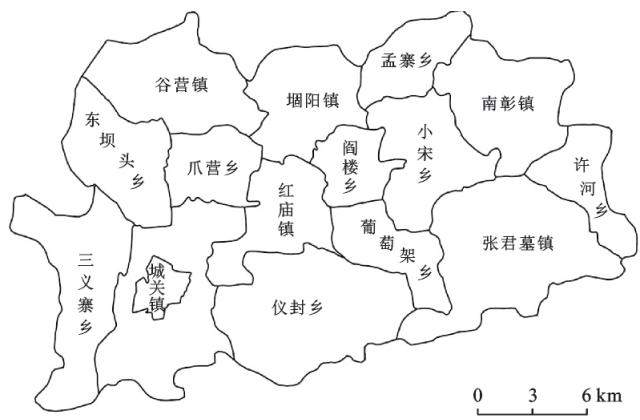  
图1 河南省兰考县乡镇分区

## 2 研究方法

## 2．1 数据类型及来源

本研究所用数据包括遥感影像 地形地貌数据土壤数据及气象数据和其他资料 ，具体情况见表1。

表1 河南省兰考县有关基础数据信息
<table><tr><td>数据类型</td><td>名称</td><td>数据来源</td><td>其他信息</td></tr><tr><td rowspan="3">遥感影像</td><td>GF-1,GF-2,ZY-3卫星遥感影像</td><td></td><td>淮河流域水土保持监测中心站 2m分辨率，时相以2018年12月为主，CGCS 2000坐标系</td></tr><tr><td>MODIS-NDVI</td><td>NASA 网站</td><td>250m分辨率，时相2017—2019年</td></tr><tr><td>SMAP Level 3 产品</td><td>(http:∥/earthdata.nasa.gov/)</td><td>9km分辨率，时相2015—2019年</td></tr><tr><td>气象数据</td><td>降雨侵蚀力因子数据</td><td>淮河流域水土保持监测中心站 30m 分辨率，tif格式，CGCS2000坐标系</td><td></td></tr><tr><td>土壤数据 地形地貌数据</td><td>土壤可蚀性因子数据</td><td>地理空间数据云</td><td>淮河流域水土保持监测中心站30m分辨率，tif格式，CGCS2000坐标系</td></tr><tr><td>定位观测数据</td><td>DEM 数据 兰考县及周边县市风速数据</td><td>山东农业大学</td><td>2013—2019年</td></tr><tr><td></td><td>兰考县粗糙度实测数据</td><td></td><td></td></tr><tr><td>其他资料</td><td>县界、乡镇边界 土壤类型图</td><td>山东农业大学</td><td>shp 格式</td></tr></table>

## 2．2 土壤侵蚀计算

本研究侵蚀模型计算 侵蚀因子数据的获取与处理均以水利部水土保持监测中心制定的《区域水土流失动态监测技术规定（试行） 》（以下称《技术规定》）为准则 并结合研究区域河南省兰考县实际情况进行。

## 2．2．1 侵蚀模型

（1） 风蚀模型 本研究借助第一次全国水利普查的风蚀模型计算2019年风蚀模数［7，11］ 该模型源于中科院大田推广模型［11］ 包括耕地 草（灌）地和沙地（漠）3种模型 模型在研究区的适用情况见表2计算公式如公式（1）—（3）所示 ：

$$
4 \# \# \sharp \underline { { { \sf { b } } } } : { \cal { Q } } _ { \mathcal { f } a } = 0 . 0 1 8 ( 1 - W ) \sum _ { j = 1 } ^ { 3 5 } T _ { j } \exp \left\{ - 9 . 2 0 8 + \frac { 0 . 0 1 8 } { Z _ { 0 } } + 1 . 9 5 5 \ ( 0 . 8 9 3 U _ { j } ) ^ { 0 . 5 } \right\}\tag{1}
$$

$$
\vec { \Xi } ( { ^ { \mathrm { * } } \mathrm { ` } } _ { } \vec { \Xi } ) { ^ { \mathrm { * } } \mathrm { ! } } \mathtt { i } \mathtt { b } _ { : } { Q _ { f \mathrm { g } } } = 0 . 0 1 8 ( 1 - W ) \sum _ { j = 1 } ^ { 3 5 } T _ { j } \exp \left( 2 . 4 8 6 ~ 9 - 0 . 0 0 1 ~ 4 V ^ { 2 } - \frac { 6 1 . 3 9 3 ~ 5 } { U _ { j } } \right)\tag{2}
$$

$$
' 3 ) \pm \mathbb { I } \pmb { \mathbb { I } } \pmb { \mathbb { I } } ( \pmb { \zeta } \pmb { \mathbb { R } } ) : \pmb { Q } _ { f s } = 0 . 0 1 8 ( 1 - W ) \sum _ { j = 1 } ^ { 3 5 } T _ { j } \exp \left\{ 6 . 1 6 8 ~ 9 - 0 . 0 7 4 ~ 3 V - \frac { 2 7 . 9 6 1 ~ 3 \ln ( 0 . 8 9 3 U _ { j } ) } { 0 . 8 9 3 U _ { j } } \right\}\tag{3}
$$

式中 ： $Q _ { f a } \ : , Q _ { f g } \ : , Q _ { f s }$ 分别为每半月耕地、 草地和沙地 风力侵蚀模数 $( \mathrm { t / h m ^ { 2 } \cdot { a } } )$ ； W 为每半月表土湿度因

子 取值范围为0～1； T 为每半月各风速等级的累积时间（min） ； Z 为地表粗糙度 无量纲； j 为风速

等级序号； $U _ { j }$ 为第j 个等级的平均风速 $\mathrm { ( m / s ) }$ ； V 为植被覆盖度（％）

表2 研究区风蚀模型适用范围
<table><tr><td>模型类型</td><td>土地利用类型</td></tr><tr><td>耕地风蚀模型</td><td>耕地中的水浇地</td></tr><tr><td>草(灌)地风蚀模型</td><td>园地中的果园；林地中的有林地、其他林地；草地中的人工牧草地、其他草地</td></tr><tr><td>沙地(漠)风力模型</td><td>其他土地中的沙地；建设用地中的采矿用地</td></tr></table>

（2） 水蚀模型 本研究运用刘宝元等［12］ 提出的的CSLE模型计算水蚀模数［7，12－15］ ，计算如公式（4） ：

$$
A = R \bullet K \bullet L \bullet S \bullet B \bullet E \bullet T\tag{4}
$$

式中 A 为土壤流失量 $( \mathrm { t / h m ^ { 2 } \cdot \ a } )$ ； R 为降雨侵蚀力因子 $\mathrm { ( M J \bullet \ m m / h m ^ { 2 } \ \bullet \ h \bullet \ a ) }$ ； K 为土壤可蚀性因子$\mathrm { { ( t \bullet h m ^ { 2 } \bullet h / M J \bullet h m ^ { 2 } \bullet m m ) } } ;$ L 为坡长因子； S 为坡度因子； B 为植被覆盖与生物措施因子 ； E 为工程措施因子； T 为耕作措施因子

## 2．2．2 模型因子获取及处理

（1） 土地利用与水土保持措施解译 根据遥感影像的色彩 形状 纹理等特征 结合实际进行人机交互解译 获取矢量及栅格数据

（2） 植被覆盖度计算 借助 MODIS－NDVI数据初步计算3a平均24个半月植被覆盖度FVC数据进行投影转换 裁剪和重采样等处理后 借助参数修订法计算，最终获取10m分辨率栅格数据

（3） 风蚀模型因子 依据兰考县风蚀定位观测站及周边县市2013—2019年风速数据 按 $1 ~ \mathrm { m / s }$ 间隔统计≥临界风速的各等级风速累积时间 获取风力因子U 数据 将SMAPL3数据进行投影转换 裁剪等预处理后相同半月取均值 提取表土湿度因子 W数据 以土地利用数据为基础 ，结合兰考县风蚀观测站定位观测数据与野外调查成果 对一年两熟 一年一熟制耕地进行粗糙度赋值 生成地表粗糙度因子0 数据 各因子数据为10m分辨率栅格数据，以半月为1期，共24期

（4） 水蚀模型因子 降雨侵蚀力因子 R 土壤可蚀性因子 K 数据由淮河流域水土保持监测中心提供 经重采样 投影转换等处理后可用于模型计算因子数据全年共24期；以DEM 数据为基础 运用北京师范大学开发工具初步提取坡长因子 LS 数据对林草地 LS 修正后获取最终数据 依据《 技术规定》初步计算园 林 草地的植被覆盖与生物措施因子数据 其余土地利用类型直接赋值 经栅格计算 镶嵌等处理后生成 B 因子数据 依据土地利用数据和《技术规定》中要求，赋值生成水土保持工程措施因子耕作措施因子 数据 各因子为10m 分辨率栅格数据，其中 R，B 以半月为1期，共24期。

2．2．3 侵蚀计算及强度评价 借助 ArcGIS的 $\mathrm { R a s ^ { - } }$ terCalcularor功能， 叠加各因子数据进行模型计算（风蚀模型需将3种模型计算结果进行镶嵌） 最终获取兰考县2019年24个半月及全年的风蚀模数 水蚀模数 将24个半月及全年累计的风蚀 水蚀模数按《土壤侵蚀分类分级标准》（SL190－2007）［16］ 判断侵蚀强度（当区域同时存在风蚀和水蚀时 ， 比较各栅格水蚀 风蚀强度 保留强度高的侵蚀类型 水蚀 风蚀强度相同时 保留水蚀） 得24个半月及全年土壤侵蚀数据和空间分布图 并在 Origin ArcGIS中进行数据分析。

## 2．3 各半月土壤侵蚀比例

为分析兰考县2019年24个半月土壤侵蚀变化特征，本研究参考植被覆盖与生物措施因子 B 相关研究中的 WR 的计算方法 计算 WA 和 WQ 以明确区域风蚀 水蚀较强时间 数据结果在 Excel和Origin中进行分析 计算公式如下 ：

$$
\mathrm { W A } _ { i } = \frac { A _ { i } } { \displaystyle \sum _ { i = 1 } ^ { 2 4 } A _ { i } } \times 1 0 0 \%\tag{5}
$$

$$
\mathrm { W } \mathrm { Q } _ { i } = \frac { Q _ { i } } { \displaystyle \sum _ { i = 1 } ^ { 2 4 } Q _ { i } } \times 1 0 0 \%\tag{6}
$$

式中 $\mathrm { W A } _ { i }$ 为某半月侵蚀（风蚀 水蚀）模数占全年累计模数比例（％） ； A 为某半月侵蚀（风蚀 水蚀）模数$( { \mathrm { t } } / { \mathrm { h m } } ^ { 2 } \cdot { \mathrm { a } } )$ ； WQi 为某半月水土流失面积占全年累计面积比例（％） ； Q 为某半月水土流失面积（km2）

## 3 结果与分析

## 3．1 侵蚀影响因子时间变化特征

气候 地形和植被等因素对土壤侵蚀发生 发展有重要影响 地形和土壤等因素短时间内不会变化而气候 植被一年内动态变化显著 在遥感监测中 ，风力因子 降雨侵蚀力因子等数据是侵蚀影响因素的直观反映 侵蚀影响因子值的变化影响土壤侵蚀模数和强度 若研究区域土壤侵蚀特征 应先分析侵蚀影响因子时间变化特征

风蚀模型和CSLE模型中 U W R 及林园草的 B因子数据以半月为单元 共24期 且存在各半月的动态变化 K L S 因子短时间内变化的可能性较小 其余因子则依据土地利用解译结果赋值生成 因此 本研究重点关注U W R 及林园草的 B 在 ArcGIS中获取其各半月的数值情况（图2—3） 分析其变化特征

（1） 风蚀模型因子 分析图2可知， 第13—18  
个半月（7—9月） 表土湿度值较高； 第1—4，23—24

个半月（1—2月 12月）值较低 第15个半月表土湿度值最高 变化范围为0．19～0．28 均值为0．23； 第3个半月值最低 同样由图2知 第3—921—22个半月（2—5 月 11 月） 风速 ≥5 m／s累积时间较高 ，第14—18个半月（7—9月）时间较低 第6个半月风速累积时间处于1442．96～1549．52min的范围内均值为1485．83min，高于其他时间，第16个半月值最低

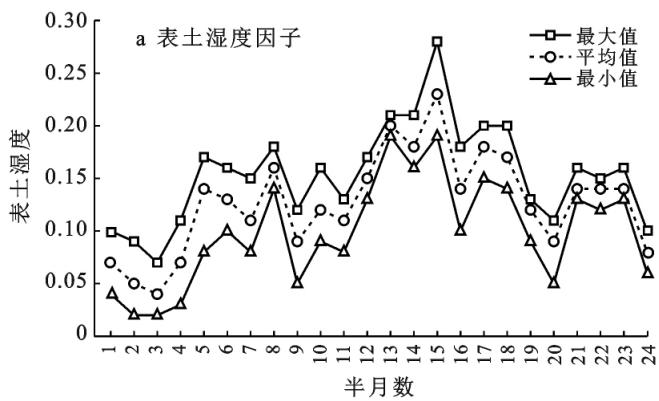

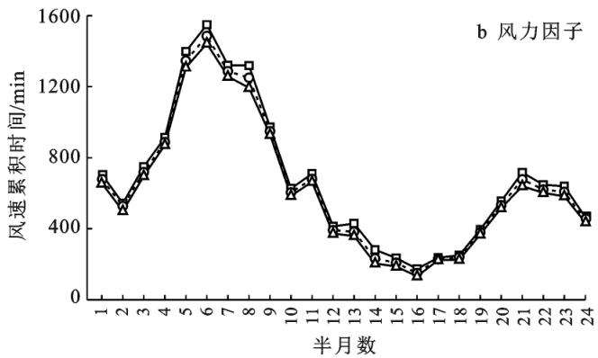  
图2 兰考县2019年24个半月风蚀模型因子

风速≥5m／s累积时间全年呈“M”型变化；W 值呈“波浪型”变化 风蚀模型因子变化与黄泛区季风性气候相关 2—5月及11—12月 区域干旱多风 此时风时间较长 土壤含水量较低， 造成 U 值较高，W值较低 7—9月区域降水增加， 且风力弱 风速小，还存在农田灌溉 此时起风时间短 土壤含水量升高导致W 值较高 U 值较小

（2） 水蚀模型因子。 由图3可知，第9—16个半月（5—8月） 林园草的 B 平均值较高 第1—323—24个半月 （1—2月 12月） 值较低 第13个林园草的均值最高 为0．005； 第24个半月值最低 同样由图3a知，第12—18个半月（6—9月）R 值较高， 第1—7，10—24个半月 （1—4月 10—12月） 值较低第14个半月 R 值最高 变化范围为522．51～562．81$\mathrm { M J } \cdot \mathrm { m m } \cdot \mathrm { ( h m ^ { 2 } \bullet h \bullet \mathrm { \bf ~ a } ) }$ ，均值为538．42MJ· mm ·$( \mathrm { h m ^ { 2 } \cdot h \cdot \ a } )$ ；第24个半月 R 值最低

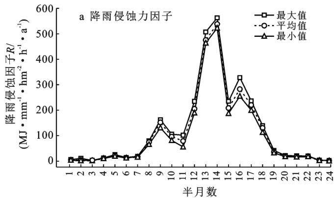

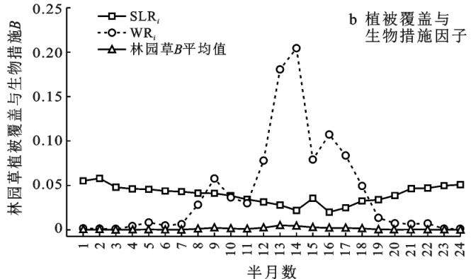  
注 ：SLRi 为第i 个半月园地 林地和草地的土壤流失比例 ； WRi 为第i 个半月降雨侵蚀力占全年侵蚀比例  
图3 兰考县2019年24个半月水蚀模型因子

R 值和林园草 B 平均值呈“先升高再降低”的趋势 其变化与黄泛区气候及植被特点有关 1—4月及10—12月， 区域降水较少， 植被处于生长阶段 ， 此时降雨造成的侵蚀较弱 植被覆盖度较低 造成 R 值和林园草 B 的均值较低 6—9月降水增加 植物进入茂盛期 此时植被覆盖度增加 且降雨造成侵蚀较强，导致 R 值和林园草 B 的均值较高

## 3．2 兰考县2019年风蚀模数特征

侵蚀模数是模型计算的原始数据 其时间和空间分布特征可直观反映区域风蚀强弱

（1） 时间特征 分析2019年兰考县各半月侵蚀模数情况（图4）知 第4—6921—22个半月（2—3月5月和11月）模数较高 第13—18个半月（7—9月）较低；模数均值 最大值呈“M型”变化 风蚀侵蚀模数全年累计值的变化范围为 $0 { \sim } 5 ~ 1 8 6 . 3 1 ~ \mathrm { t } / ( \mathrm { k m } ^ { 2 } ~ \bullet ~ \mathrm { a } )$ ，均值为 $1 5 3 . 2 6 ~ \mathrm { t / ( k m ^ { 2 } \cdot { \^ { a } } ) }$ 其中第9个半月侵蚀模数均值最高，为 $1 8 . 3 6 ~ \mathrm { t / ( ~ k m ^ { 2 } ~ \cdot ~ a ) }$ ； 第6个半月模数处于$0 { \sim } 6 5 9 . 6 1 \ \mathrm { t } / ( \mathrm { k m } ^ { 2 } \ { \bullet } \ \mathrm { a } )$ 范围内 存在全年最大值； 第17个半月模数均值最低 为 $0 . 9 1 ~ \mathrm { { t } / ( k m ^ { 2 } \cdot \mathrm { { a } ) } }$

风蚀模数的变化与风速累计时间 表土湿度 地表粗糙度相关 第4—921—22个半月 （2—5月和10—12月） 黄泛区风速大 风力强 且降水较少 造成风速累积时间长 表土湿度低 此外 此时耕地存在休耕 翻耕 部分区域粗糙度较小 因此 此时间段内侵蚀模数模数越高 ，风蚀较强

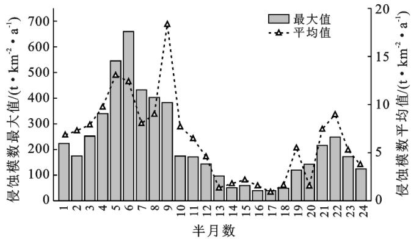  
图4 兰考县2019年24个半月风蚀模数

分析图5可知，风蚀全年 WA 值处于0％～59．12％范围内，第3—6，9—12，19—22个半月（2—3月 5—6月及10—11月）的时间段内 WA 平均值相对较高；第13—18个半月 （7—9月） 较低 其中第9个半月WAi 均值 最大值均高于其他时间； 第13个半月WAi 均值最低；第14，18个半月 WAi 最大值低于其他时间。

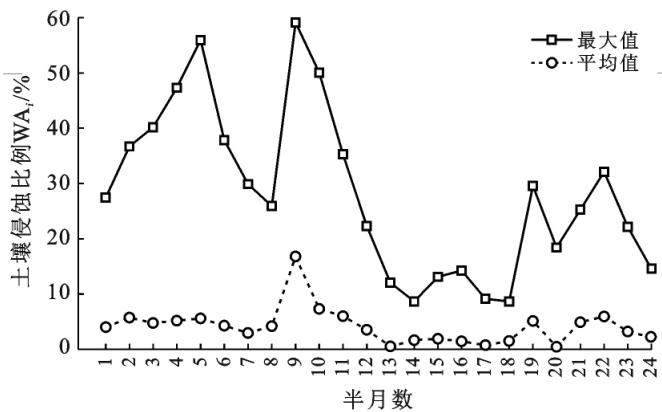  
图5 兰考县2019年风蚀24个半月 WAi

WA 最大值 均值变化趋势与风蚀模数相似 呈“M 型” 证明了2—3月 5月和11月兰考县风蚀较强 7—9月风蚀较弱

（2） 空间特征 由图6可知 东坝头乡 许河乡红庙镇 南彰镇存在侵蚀模数极高区域 仪封乡 张君墓 三义寨乡镇整体模数较高； 谷营镇 城关镇 孟寨乡整体模数较低 综合土地利用分析［10］ 可知 风蚀多发生在水浇地 采矿用地和沙地上； 兰考县水浇地约占全县面积的60．78％［10］ 且部分区域冬季休耕使水浇地易出现风蚀 而采矿用地 沙地周围堆积的沙土易被强风吹蚀搬运 导致范围内风蚀较强 城镇／农村建设用地 道路及水域不参与模型计算 风蚀模数为0 园地 林地和草地植被覆盖相对较高 模数不为0但数值偏小，不易出现风蚀

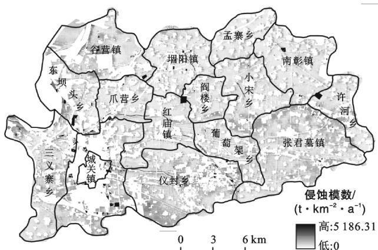  
图6 兰考县2019年风蚀侵蚀模数空间分布

## 3．3 兰考县2019年水蚀模数特征

（1） 时间特征 由图7可知 第12—18个半月（6—9月）模数较高 水蚀相对较强 第1—719—24个半月（1—4月 10—12月）较低 水蚀较弱； 模数均值 最大值呈“升高—降低”的变化 水蚀模数时间特征与风蚀相反 模数全年累计值处于0～8028．86$\mathrm { t } / ( \mathrm { k m } ^ { 2 } \cdot \mathrm { a } )$ 范围内，均值为 $9 . 5 4 ~ \mathrm { t } / ( \mathrm { k m } ^ { 2 } \cdot \mathrm { a } )$ 第14个半月模数最高 ，最高值为 $1 \ 5 1 8 . 1 6 \ \mathrm { { t / ( k m ^ { 2 } \bullet a ) } }$ ， 均值为 $1 . 8 2 ~ \mathrm { t / ( k m ^ { 2 } \cdot { \mu } a ) }$ ；第3个半月模数最低 均值为$0 . 0 1 ~ \mathrm { t } / ( \mathrm { k m } ^ { 2 } \cdot \mathrm { a } )$ 。

分析图8可知 水蚀全年 WA 值处于0％～77．46％范围内 第9—18个半月（5—9月）WA 值较高 其余时间较低 第13个半月 WA 最值高于其他时间 最大值为 77．46％； 第 14个半月 WA 均值最高 为20．34％ WA 最大值 均值变化趋势与水蚀模数相似，证明6—9月水蚀相对较强，其余时间水蚀较弱

（2） 空间特征 由图9可知 东坝头乡 城关镇仪封乡存在侵蚀模数较高区域 ；爪营乡 张君墓镇 孟寨乡整体模数较低 黄泛区非典型水蚀区，水蚀与自然条件相关 兰考县地势平坦 地形起伏较小 土层深厚 夏季降水多 生产建设活动频繁 故模数较高的区域多为采矿用地

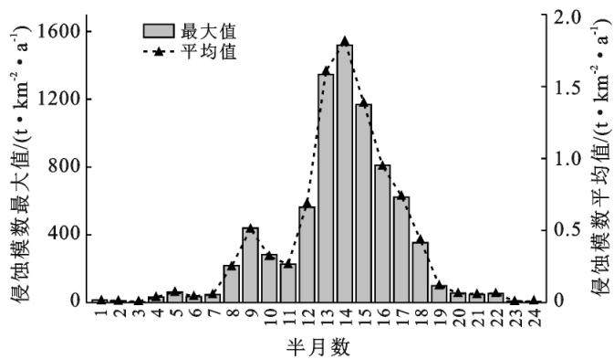  
图7 兰考县2019年24个半月水蚀模数

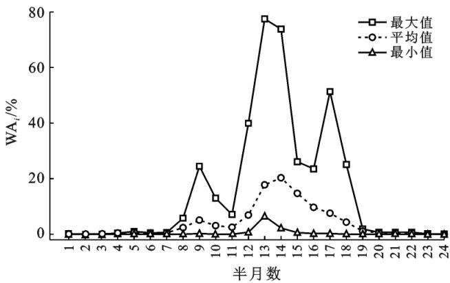  
图8 兰考县2019年24个半月水蚀 WAi

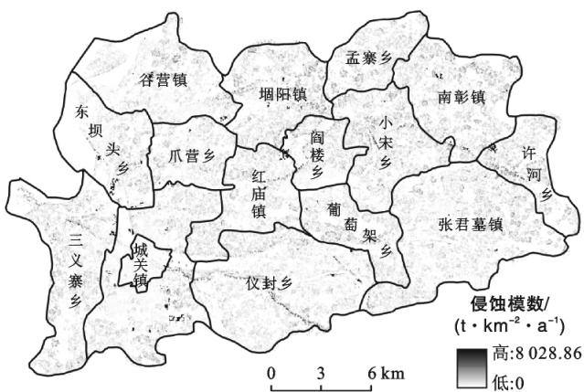  
图9 兰考县2019年水蚀侵蚀模数空间分布特征

## 3．4 兰考县2019年土壤侵蚀特征

兰考县同时存在风蚀和水蚀 研究区域土壤侵蚀特征时应依据相关要求和技术规范 ， 叠加风蚀、水蚀后进行综合分析 最终得兰考县2019年半月及全年土壤侵蚀特征

（1） 半月特征 分析兰考县2019年内各半月水土流失 情 况 （图 10） 可 知， 除 第 2，10—11，19—20，23—24个半月外 其余时间均产生水土流失 出现水土流失的半月数占全年的70．83％ 第4—9个半月（2—5月）水土流失面积较多 面积维持8．61km2 不变 且均为风蚀 第12—18个半月 （6—9月） 水土流失较少 产生水土流失的时间内 ， $\mathrm { W Q } _ { i }$ 值变化范围为0．01％～3．18％ 上述数据表明第4—921—22个半月（2—5月 11月）是兰考县土壤侵蚀较强时间

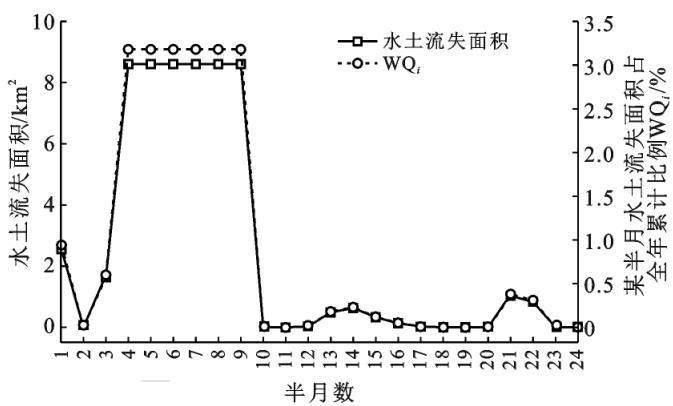  
图10 兰考县2019年24个半月水土流失面积

（2） 全年特征 由表3可知 兰考县2019年水土流失面积共271．66km2 占全县面积的24．34％ 主要由风蚀造成 其中， 风蚀造成水土流失 270．04km2 占总面积的99．40％；水蚀面积造成水土流失仅$1 . 6 2 ~ \mathrm { k m ^ { 2 } }$ 风蚀以轻度侵蚀为主 面积 $2 6 1 . 4 7 ~ \mathrm { k m ^ { 2 } }$ 占风蚀水土流失面积的96．83％； 其次为中度侵蚀和强烈侵蚀 水蚀以轻度侵蚀为主 面积1．58km2占水蚀水土流失面积的97．53％； 中度侵蚀最少 仅$0 . 0 4 ~ \mathrm { k m ^ { 2 } }$ 。

表3 兰考县2019年水土流失面积及比例
<table><tr><td rowspan="2">侵蚀强度</td><td rowspan="2"></td><td colspan="3">土壤侵蚀类型</td></tr><tr><td>水蚀</td><td>风蚀</td><td>合计</td></tr><tr><td rowspan="2">轻度</td><td>面积  $/ \mathrm { k m ^ { 2 } }$ </td><td>1.58</td><td>261.47</td><td>263.05</td></tr><tr><td>占水土流失面积比例/%</td><td>97.53</td><td>96.83</td><td>96.83</td></tr><tr><td rowspan="2">中度</td><td>面积  $/ \mathrm { k m } ^ { 2 }$ </td><td>0.04</td><td>8.49</td><td>8.53</td></tr><tr><td>占水土流失面积比例/%</td><td>2.47</td><td>3.14</td><td>3.14</td></tr><tr><td rowspan="2">强烈</td><td>面积  $/ \mathrm { k m ^ { 2 } }$ </td><td>0</td><td>0.08</td><td>0.08</td></tr><tr><td>占水土流失面积比例/%</td><td>0</td><td>0.03</td><td>0.03</td></tr><tr><td colspan="2">水土流失面积  $/ \mathrm { k m } ^ { 2 }$ </td><td>1.62</td><td>270.04</td><td>271.66</td></tr><tr><td colspan="2">占土地总面积比例/%</td><td>0.14</td><td>24.2</td><td>24.34</td></tr></table>

分析兰考县2019年土壤侵蚀图（图11）可知，轻度风蚀在全县广泛分布 仪封乡 张君墓镇 谷营镇和东坝头乡等面积相对较多； 孟寨乡 南彰镇分布相对较少；红庙镇 许河乡 东坝头乡和城关镇存在一定面积中度风蚀 水蚀面积较少， 分布较为分散， 在仪封乡相对较多。

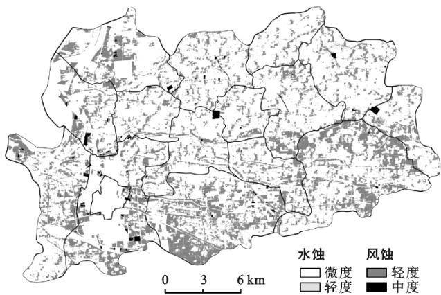  
注 ：中度水蚀和强烈风蚀的斑块分散 微小 正常比例尺下较难分辨 故图中没有表达

图11 兰考县2019年土壤侵蚀特征

## 4 讨论与结论

（1） 兰考县风力因子半月变化呈 “M” 型 第3—9，21—22个半月值较高； 表土湿度因子变化呈“波浪型” ，第13—18个半月值较高 降雨侵蚀力因子 林园草植被覆盖与生物措施因子 B 均值的变化为“先升高再降低” ， 前者第9—16个半月值较高， 后者第12—18个半月值较高

（2） 兰考县半月风蚀模数变化呈“波浪型” 全年累计风蚀模数在 $0 { \sim } 5 ~ 1 8 6 . 3 1 ~ \mathrm { t } / ( \mathrm { k m } ^ { 2 } ~ \bullet ~ \mathrm { a } )$ 范围内，均值为153．26t／（km2 · a） ； 第4—9，21—22个半月风蚀较强 仪封乡 张君墓镇等风蚀模数较高 风蚀多在水浇地、采矿用地上 与前人相似研究比较［7，10］ ， 风蚀空间分布特征相近

（3） 兰考县半月水蚀模数变化趋势为“先升高再降低”；全年累计水蚀模数在0～8028．86t／（km2 ·a）范围内 均值为9．54t／（km2 ·a） ；第12—18个半月水蚀相对较强；东坝头乡 城关镇存在水蚀模数较高区域 水蚀多在采矿用地上

（4） 2019年兰考县共17个半月出现水土流失占全年的70．83％； 第4—9个半月水土流失面积最多；均为风蚀 全年水土流失面积为271．66km2，占全县面积的24．34％ 主要为轻度风蚀 占水土流失面积的96．83％ 风蚀主要在仪封乡 张君墓镇 谷营镇和东坝头乡 水蚀主要在仪封乡 水土流失监测与防治应重点关注此时间内水浇地 采矿用地上的侵蚀 本研究所得兰考县水土流失面积与前人相似的研究［7，10］比较有所差异 由研究区域差异导致； 但风蚀空间分布特征相似 证明了本研究结果的准确性 合理性

## ［ 参 考 文 献 ］

［1］ 张洪江．土壤侵蚀原理［M］．2版．北京 ： 中国林业出版社2008

［2］ 王友胜．淮河流域黄泛区风水侵蚀格局及其驱动因子研究［D］．山东 泰安 ：山东农业大学 ，2012

［3］ 赵存玉．鲁西北风沙化农田的风蚀机制 防治措施 ： 以夏津风沙化土地为例［J］．中国沙漠 ，1992，12（3） ：46－50

［4］ 姬生勋 ，刘玉涛 ，董智 ，等．黄泛平原风沙区不同造林年限林地土壤风蚀与理化性质的变化 ［J］．水土保持研究 ，201118（3） ：158－161

［5］ 宋胜明 ， 刘霞 ， 张荣华 ， 等．黄泛风沙区耕地土壤风蚀影响因子的通径分析 ［J］．水土保持通报 ，2017，37（3） ：249－253

［6］ 毛玉磊．河南省黄泛平原风沙化土地形成及分布特征研究［D］．山东 泰安 ：山东农业大学 ，2015

［7］ 袁利 ，张春强 ，张芷温 ，等．淮河流域黄泛平原风沙区水土流失格局［J］．中国水土保持 ，2019（12） ：10－13

［8］ 张乐．鲁西北黄泛区土壤侵蚀研究［D］．北京 ：北京林业大学 ，2019

［9］ 樊爱鹏．山东黄泛平原风沙区风沙化状况与生态建设发展研究［D］．山东 泰安 ：山东农业大学 2013

［10］ 高睿瑜 张芷温 李文龙 等．2018—2019年河南省兰考县土地利用变化对耕地风蚀的影响［J］．水土保持通报 ，2021，41（1） ：112－117，124

［11］ 张国平．基于遥感和GIS的中国土壤风力侵蚀研究［D］北京 ：中国科学院研究生院（遥感应用研究所） ，2002

［12］ 刘宝元 ， 郭索彦 ， 李智广 ， 等．中国水力侵蚀抽样调查［J］．中国水土保持 ，2013（10） ：26－34

［13］ 曹月娥 ，吴芳芳 ，张婷婷 ，等．基于风蚀模型的准东地区土壤风蚀研究 ［J］．干旱区资源与环境 ，2018，32（3） ：94－99

［14］ 顾治家 ，谢云 ，李骜 ，等．利用CSLE模型的东北漫川漫岗区土壤侵蚀评价 ［J］．农业工程学报 202036（11） ：49－56

［15］ 李子轩 赵辉 邹海天 等．基于CSLE模型和抽样单元法的县域土壤侵蚀估算方法对比 ［J］．农业工程学报201935（14） 141－148

［16］ 中华人民共和国水利部．SL190－2007土壤侵蚀分类分级标准［S］．北京 ：中国水利水电出版社 ，2008