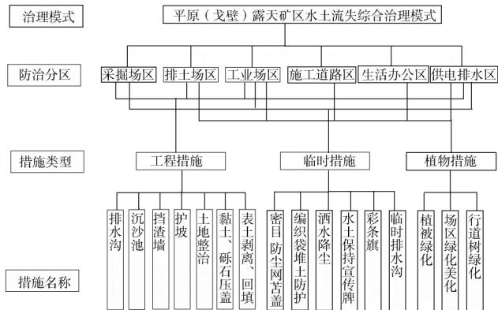
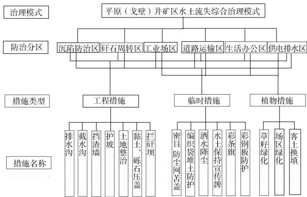
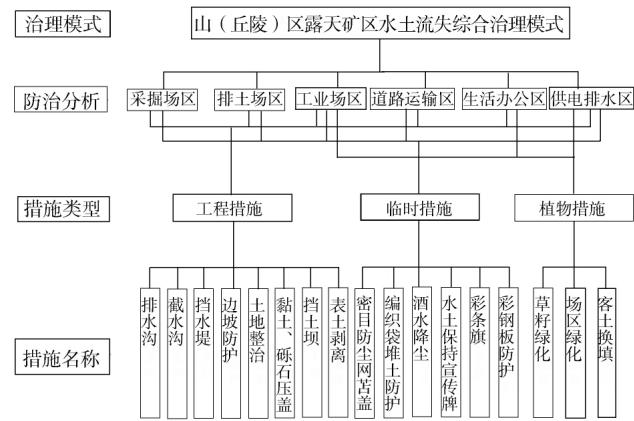
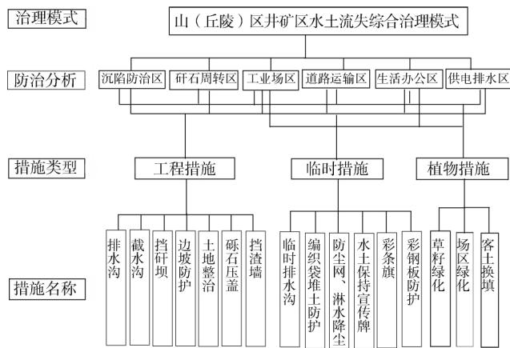

# 新疆煤矿水土流失及生态环境危害分析

曹彪，白云岗，李玉生，马英武

(新疆水利水电科学研究院，新疆 乌鲁木齐830049)

关键词 水土流失;生态环境危害;治理体系;煤矿；新疆

摘要新疆是我国水土流失最严重的省份之一，煤矿开采活动引发的水土流失问题日益突出，水土流失防治任务繁重。针对新疆煤矿水土流失问题，通过资料收集、实地调查、文献研究等方法，总结了新疆煤矿分布特征及其水土流失的形式、成因、特点，分析了煤矿建设、开采过程中水土流失引起的生态环境危害，将新疆煤矿水土流失治理模式概括为4种类型，建立了煤矿建设项目水土保持体系，以期为干旱内陆区煤矿生态文明建设提供依据。

中图分类号]S157

文献标识码C

文章编号1000-0941(2020)06-0011-05

DOI:10.14123/j.cnki.swcc.2020.0134

新疆是我国富煤省(区)之一，预测煤炭资源总量2.19 万亿t,约占全国的 40.5%。然而新疆地处亚洲大陆腹地，深居内陆，降雨稀少，全区年平均降水量154 mm,为全国的23%；气候干燥，蒸发强烈，蒸发量1600\~2200mm,大部分区域属于极端干旱大陆性气候区;地表主要为高山、草原、沙漠、戈壁，植被覆盖率低，生态环境极为脆弱。

新疆煤炭基地是我国第十四个大型煤炭基地，新疆是全国煤炭生产力西移的重要承接区。新疆具有极大的资源开发潜力，但限制条件多，开采难度大、生态可塑性低，一旦破坏严重，将面临难以恢复或永久性毁灭的后果。煤矿开采引起的地表沉陷、地下水位下降、植被破坏等一系列生态环境问题，严重影响矿区的生态环境，也严重影响地区的可持续发展。目前，针对新疆煤矿水土流失的研究多集中于单个煤矿或者是煤矿的重点治理区域2-4，未能全面考虑水土流失强度的不均衡性和环境影响因素，更没能反映出区域水土流失特点。受独特的环境及水土流失特点影响，新疆的水土流失治理难度非常大，目前还没形成成熟的水土流失防治体系和模式。将新疆煤矿分布特征和区域水土流失特点相结合，总结形成新疆煤矿水土流失综合治理体系，对最大可能地减轻煤矿生产对生态环境的破坏，合理高效地进行煤炭资源开采具有重要意义。

## 1 新疆煤矿分布特征及其水土流失形式

新疆煤炭资源呈“北富南贫”区域分布，大型煤矿主要分布在准噶尔、吐哈-巴里坤、伊犁地区、塔里木北缘等区域。根据《国家发展改革委关于新疆大型煤炭基地建设规划的批复》(发改能源（2014)387号)，新疆大型煤炭基地分吐哈、准噶尔、伊犁、库拜4个大区。

新疆四周高山环绕，在地形上高山与盆地相间，形成明显的地形单元，呈“三山夹两盆”之势。煤矿在新疆分布区域面积大、范围广，水土流失具有类型多样的特点(表1)。吐哈盆地干旱缺水，区域内多处于荒漠

表1 新疆典型煤矿水土流失特征
<table><tr><td rowspan="2">区域</td><td rowspan="2">煤矿</td><td rowspan="2">开采形式</td><td rowspan="2">地形地貌</td><td colspan="3">水土流失</td></tr><tr><td>形式</td><td>侵蚀类型</td><td>侵蚀强度</td></tr><tr><td rowspan="2">吐哈盆地</td><td>哈密大南湖矿区一号矿</td><td>井工</td><td>低山、丘陵</td><td>推移风蚀</td><td>风力侵蚀</td><td>中度</td></tr><tr><td>巴里坤县別斯库都克露天煤矿</td><td>露天</td><td>平原荒漠</td><td>溅蚀、面蚀、部分沟蚀</td><td>水力侵蚀</td><td>轻度</td></tr><tr><td rowspan="2">准噶尔盆地</td><td>昌吉硫磺沟煤矿</td><td>井工</td><td>山区、丘陵</td><td>面蚀、沟蚀</td><td>风力侵蚀、水力侵蚀</td><td>中度、轻度</td></tr><tr><td>准东大井矿区南露天煤矿</td><td>露天</td><td>平原荒漠、戈壁</td><td>推移风蚀</td><td>风力侵蚀、水力侵蚀</td><td>中度、微度</td></tr><tr><td rowspan="2">伊犁盆地</td><td>伊宁矿区四号煤矿</td><td>井工</td><td>低山丘陵</td><td>面蚀</td><td>水力侵蚀、风力侵蚀</td><td>中度、轻度</td></tr><tr><td>伊宁县庆华煤矿</td><td>露天</td><td>低山丘陵</td><td>沟蚀、溅蚀</td><td>水力侵蚀、风力侵蚀</td><td>中度、轻度</td></tr><tr><td>库拜煤田</td><td>拜城矿区一成煤矿</td><td>井工</td><td>山区</td><td>悬移风蚀、推移风蚀</td><td>风力侵蚀为主， 兼有水力侵蚀</td><td>中度</td></tr><tr><td rowspan="2"></td><td>苏拉合马煤矿</td><td>露天</td><td>山区</td><td>悬移风蚀、推移风蚀</td><td>风力侵蚀为主，</td><td>轻度</td></tr><tr><td></td><td></td><td></td><td></td><td>兼有水力侵蚀</td><td></td></tr></table>

半荒漠化状态，植被稀疏，地表土壤涵养水源能力差，生态环境十分脆弱，水土流失危害主要为水蚀和强风造成的风蚀。准噶尔盆地一般地形为中低山区和河谷台地，上游以水蚀为主，下游以风蚀为主，土壤侵蚀类型主要包括风力侵蚀、水力侵蚀和风力-水力交错侵蚀，风力侵蚀强度等级为中度。伊犁盆地主要开发伊宁矿区，水土流失类型以水力侵蚀为主，并有轻度风力侵蚀，表现为沟蚀和坡面侵蚀，强度等级为中度。库拜煤田位于南疆塔里木盆地西北缘，气候干燥、少雨，主要是风力侵蚀，侵蚀强度为微度和中度。

## 2 水土流失成因

## 2.1 人为因素

新疆煤矿在建设和生产过程中，人为水土流失的成因主要包括三方面内容：一是开挖、碾压使地表形成裸露面，原地表天然耐旱植被被破坏，极易发生风力侵蚀和水力侵蚀;二是开挖、碾压使土壤本身固结能力下降，土壤抗侵蚀能力降低；三是开挖、堆砌使新形成的地貌地面坡度加大，加剧水力侵蚀和风力侵蚀的发生。新疆煤矿建设和生产过程中，开挖、堆砌、机械碾压等人为因素是引起水土流失的重要原因。

## 2.2 自然因素

对新疆煤矿水土流失影响作用较大的自然因素包括地形地貌、地质土壤、降雨、风速、植被等。新疆“三山夹两盆”的地形特征，加剧了水土流失的发生。不同类型的土壤对水土流失的抵抗能力各不相同，新疆土壤类型自山区到荒漠分别按钙土-漠土-风沙土变化，其中：钙土土壤肥力较好，一般植被覆盖度较高，不易受到面蚀和风蚀;风沙土腐殖质含量少，土层松散，抵抗风蚀和水蚀能力都比较差。新疆属干旱地区，降水是影响水土流失的一个重要因素，风速是影响风蚀的关键性因素。植被贫乏，矮小，分布稀疏，覆盖度低，在降雨、强风等外力的作用下极易发生水土流失。自然环境恶劣，生态自我修复困难，自然因素对新疆煤矿水土流失发生起主要作用。

## 3 新疆煤矿水土流失特点

## 3.1 新疆自然条件恶劣，煤矿水土流失防治难度较大

新疆自然条件相对恶劣，主要矿区与国内煤矿相比，水土流失防治方法较为有限。国内露天矿排土场多采取覆土绿化措施，水土流失防治效果较好，但新疆吐哈盆地、准噶尔盆地、库拜煤田大多处于降水量少、蒸发强烈、四季多风、地下水埋藏较深且无地表径流区域，采取覆土绿化措施，灌溉水源无法得到保证，植物成活率极低，煤矿水土流失防治难度较大。

## 3.2 交错侵蚀较为常见

新疆干旱半干旱气候环境孕育了风、水及高寒气候环境，高海拔区域存在一定程度的冻融侵蚀。冻融侵蚀与水蚀交错、水蚀与风蚀交错，冻融侵蚀与风蚀交错是新疆高海拔地区煤矿水土流失的重要特征。在冻融侵蚀到水蚀过渡带，寒冷的冬天和冷暖交替的春季表现为冻融侵蚀，而夏秋季融水期则表现为水蚀;在水蚀到风蚀过渡带，受季节性降水、融水或短期洪水的影响，以及风力作用，侵蚀类型以水蚀和风蚀形式交错出现。新疆山区井工煤矿易受到冻融侵蚀和水蚀的交错影响，下游的露天煤矿则易受到水蚀和风蚀的交错影响。

## 3.3露天矿弃渣场排弃规模大、运行时间长，易形成

## 集中连片的水土流失区

新疆许多露天矿区因煤层赋存条件好、储量大，已形成大规模集中开发的态势。露天煤矿集中开采排土场的排弃量和占地面积大，运行时间长，势必造成地表破坏、植被覆盖度降低、建设运行过程中扬尘增加等现象。加之所在区域自然条件恶劣，风蚀作用强烈，偶发性的暴雨洪水会对排土场造成严重的威胁，若不采取必要的水土流失防治措施，极易造成风蚀和水蚀危害。该种形式的水土流失在准东露天矿开采中尤为明显。

## 4 新疆煤矿水土流失危害

露天煤矿施工建设扰动地表面积较大，建设期破坏地表植被和表层土壤结构，增大了土壤侵蚀强度。排土场堆弃的大量松散物质，加剧了水土流失，使周边的生态环境恶化。井工煤矿煤层开采引起上覆岩层的破坏，发生垮落，离层和下沉，且引起的破坏一般会通达地表，给生产生活和生态环境带来严重影响。此外，采煤引起塌陷性裂缝，引起地下水位下降，严重恶化生态环境。新疆煤矿水土流失危害可以概况为以下5个方面。

## 4.1 水土流失增加河流泥沙，泥沙淤积河床，加剧洪涝灾害

露天煤矿排土场堆放量大，暴雨季节水土流失加剧，易造成某一区域局部洪涝灾害。此外新疆伊犁盆地煤矿周边均为湿陷性黄土，黄土层在浸水的条件下，土体结构易发生破坏和形变，对建筑物的安全使用产生危害，而且一旦沟道切割形成后，水土流失将进一步加大，淤积下游河道，对河道安全造成影响。

## 4.2煤矿开采引发风蚀，加剧扬尘、沙尘天气的发生，

## 影响当地农牧民生产生活环境

煤矿项目建设期大规模的开挖、扰动，破坏植被及地表结皮，损坏表层土壤结构，临时堆土表面结构松散，为沙尘暴、扬沙天气提供物质源。煤矿开采对地表土层及植被造成新的破坏，采掘场、矿区道路、工业场地等生产活动引起的地表松动，排土场、储料场表土裸露，形成新的沙尘源地。同时固体废弃物风化后产生大量粉尘，在干旱地区极易发生风力侵蚀，形成扬沙或沙尘天气，造成当地生产生活环境质量下降。

## 4.3 露天矿周边引起重金属污染

由煤矿生产产生的煤灰，由风或地表径流携带进入周边环境，煤灰中的有害成分易造成周边土壤污染，影响周边植被的生长。ABLIZ et al.研究准东露天煤矿重金属空间特征和污染来源，发现煤矸石堆场是重金属Hg的重要来源。比拉力·依明等³分析了准东露天煤矿周围土壤重金属污染特征，发现研究区Zn、Cu、Pb、Cr、Hg和As含量均超出当地土壤背景值，分别超标了2.1%、14.9%、4.3%、68.1%、68.1%和95.8%。此外，矿石堆的淋溶水、选矿废水等排放量大且成分复杂，含有大量的悬浮物、重金属和放射性物质，废水进入周边环境会引起重金属污染，危害很大。

## 4.4 影响地下水环境

煤矿开采影响区域地下水环境，使当地地下水位下降，同时也使地下水水质下降。采煤过程破坏地表植被，导致水源涵养能力降低，地表水大量渗漏，地下深层储水结构被破坏，水损失由表层及深层；且煤矿开采过程中，需要不断将煤矿矿井或工作面的地下涌水排出，使区域地下水持续减少。矿井产生的工业废水直接排放，对区域地下水和周边环境产生污染。

## 4.5 破坏地表植被，影响动物生存环境

工程建设中占用土地，扰动地表，破坏植被，使表层砾幕遭到破坏，导致工程建设区及周边地区水土流失加剧，土壤养分流失，保水保肥能力下降，生产力降低，地表植被难以恢复，环境恶化。同时，开采区损坏了原地表植被，排土场埋压草场，改变了原地貌，损坏野生动物的栖息环境，地面沉陷、地下水疏干造成的植被破坏和土地荒漠化，使得大量珍稀动物的生存环境日益恶劣。特别是准噶尔盆地准东煤田地处卡拉麦里山前戈壁荒漠带，植被整体状况逐渐恶化，草地退化十分严重，劣草、杂草种类增多[10，保护区野生动植物种类和数量锐减，生物多样性受到严重破坏1]。

## 5 新疆煤矿水土流失治理体系

新疆煤矿分布在伊犁河谷水蚀治理区、准噶尔西北山区丘陵区水蚀风蚀治理区、东疆吐哈盆地风蚀治理区和南疆塔里木盆地风蚀治理区。不同分区地形地貌差异明显，同时不同矿型施工工艺不同，相应的水保措施也不同，根据新疆四大矿区水土流失特点和不同矿型开采形式，总结形成平原(戈壁)露天矿区水土流失综合治理模式、平原(戈壁)井矿区水土流失综合治理模式、山(丘陵)区露天矿区水土流失综合治理模式和山(丘陵)区井矿区水土流失综合治理模式。

## 5.1 平原(戈壁)露天矿区水土流失综合治理模式

根据平原(戈壁)露天矿区水土流失特点，矿区水土流失防治分区包括采掘场区、排土场区、工业场区、施工道路区、生活办公区、供电排水区，重点是做好排土场区水土流失治理。针对矿区建设施工活动引发水土流失的特点和危害程度，将水土保持工程措施和植物措施、永久措施和临时措施有机结合在一起，形成平原(戈壁)露天矿区完整、严密、科学的水土流失综合治理模式。平原(戈壁)露天矿区水土流失综合治理模式如图1所示。

  
图1 平原(戈壁)露天矿区水土流失综合治理模式

在沙化程度严重的戈壁沙漠区域，水土流失特点以风蚀为主，兼有风、水蚀交错侵蚀，防治措施体系以防风固沙为主，同时做好防洪排水。山前冲洪积平原戈壁区应做好上下游防洪排水措施，同时做好地表及植被恢复措施。沙漠及沙漠边缘区应做好防风固沙措施，如草方格、立式沙障等多种形式的固沙措施，同时做好硬化及地表恢复措施，严格限定施工期作业范围，及时采取各类临时防护措施，最大限度地减少风蚀危害，条件允许的区域可以适当布置植物措施，同时做好灌溉保障措施。

## 5.2 平原(戈壁) 井矿区水土流失综合治理模式

根据平原(戈壁)井矿区建设项目要求及作业特点，水土流失防治分区划分为沉陷防治区、矸石周转区、工业场区、道路运输区、生活办公区、供电排水区。对各分区采取切实可行的工程措施、植物措施和临时措施，确定平原(戈壁)井矿区水土流失综合治理模式如图2所示。

该区域风蚀和水蚀严重、自然环境破坏后不易恢复。主要措施以护坡防护、截排水、沉陷防护、拦矸坝等为主，施工期应采取完善的拦挡防护措施，减少施工对矿区的影响。

## 5.3 山(丘陵)区露天矿区水土流失综合治理模式

根据山(丘陵)区露天矿区建设和开采过程中水土流失特征，在综合分析评价建设项目主体工程设计中具有水土保持功能工程的基础上，把工业场区、废石场区、道路运输区和生活办公区等作为防治的重点区域，建立以水土保持工程措施和植物措施相结合的生态恢复体系，最大限度地减少水土流失量。山(丘陵)区露天矿区水土流失综合治理模式见图3。

  
图2 平原(戈壁)井矿区水土流失综合治理模式

  
图3 山(丘陵)区露天矿区水土流失综合治理模式

该区域海拔高、气温低、降雨量大，自然环境破坏后不易恢复。工程特点是挖填方量大、弃渣量大，线路工程距离长，该区域主要措施以弃渣防护、截排水、坡面防护和植被恢复为主，施工期应采取完善的拦挡措施，减少施工对下游造成的影响。

## 5.4 山(丘陵)区井矿区水土流失综合治理模式

根据山(丘陵)区井矿区开采过程中的水土流失特征，防治分区划分为沉陷防治区、矸石周转区、工业场区、道路运输区、生活办公区、供电排水区。矿区水土流失治理措施体系由工程措施、植物措施、临时措施构成。工程措施包括挡土墙和截排水工程等；植物措施包括场地绿化、客土换填等；临时措施为施工过程中采取的临时防护措施，包括临时排水沟、防尘网、洒水降尘等。通过系统的防治措施和合理布局，构建山(丘陵)区井矿区水土流失综合治理模式。山(丘陵)区井矿区水土流失综合治理模式见图4。

以南北疆沿天山、阿尔泰山一带浅山丘陵区为主，年均降雨量一般在200\~450mm之间，降雨量相对较大。其防治措施以护坡防护、弃渣拦挡、截排水和恢复植被为主，修建截排水沟、拦渣坝、挡水坝，种植林草。南疆沿昆仑山一带降水稀少，应根据具体情况实施植物措施。

  
图4 山(丘陵)区井矿区水土流失综合治理模式

## 6 结语

对新疆煤矿分布特征及煤矿水土流失形式、成因和特点作了分析探讨，重点分析了煤矿项目建设、开采对生态环境的负面影响，从地形地貌、施工工艺出发，将新疆煤矿水土流失治理确定为平原(戈壁)露天矿区水土流失综合治理模式、平原(戈壁)井矿区水土流失综合治理模式、山(丘陵)区露天矿区水土流失综合治理模式和山(丘陵)区井矿区水土流失综合治理模式，并针对不同矿区水土流失主要的影响因素及水土流失对自然生态的危害，总结出了新疆4种类型矿区综合防治措施体系。研究成果可为干旱内陆区煤矿开采提供借鉴。

## 参考文献

[1] 徐跃军.浅谈煤田火烧层钻井技术[0].新疆有色金属，2010,33(6) :25,27.

2 何高文.新疆伊宁矿区绿色发展评价研究[D].北京：中国矿业大学,2015:30-33.

B刘宏华.新疆准东露天煤矿外排土场水土流失防治措施探究〗.露天采矿技术,2012(3)：7-9,12.

4 马英武.准东矿区露天煤矿排土场水土流失防治措施分析0.水土保持应用技术,2013(3)：35-37.

李圣军.哈拉沟煤矿高强度开采覆岩与地表破坏特征研究[D].焦作: 河南理工大学,2015:25.

[6] ABLIZ A, SHI Q, KEYIMU M, et al. Spatial distribution source ,and risk assessment of soil toxic metals in the coal-mining region of northwestern China [i] .Arabian Journal of Geosciences ,2018,11( 24) : 793–799.

7比拉力·依明，阿布都艾尼·阿不里，师庆东，等．基于PMF模型的准东煤矿周围土壤重金属污染及来源解析Ⅱ.

# 生产建设项目水土保持区域监管的实践与思考

董亚维，王略，左强，徐钊，李骁

(黄河流域水土保持生态环境监测中心，陕西西安710021)

关键词水土保持；区域监管技术;强监管;生产建设项目

摘要结合生产建设项目水土保持区域监管实践，对设计资料矢量化、扰动图斑解译、合规性分析、现场复核等技术进行了归纳和总结，并根据区域监管的实践体会，提出了关于生产建设项目区域监管的几点思考，一是项目各方要顺畅沟通、协调和密切配合，这是监管工作顺利实施的重要保障;二是设计资料要尽可能详细，以保障矢量化结果的准确性：三是监管成果分析中，应对已批项目情况进行全面分析;四是现场复核中发现的疑似未批先建、未批先弃且信息不详的图斑如何认定处置仍需进一步研究;五是生产建设项目水土保持宣传力度要加大。

[中图分类号]S157

文献标识码C

文章编号1000-0941(2020)06-0015-03

DOI:10.14123/j.cnki.swcc.2020.0135

新水土保持法颁布实施后，各级水行政主管部内依据法律法规加强了对生产建设项目的日常性监督检查，对人为水土流失进行了有效控制，但是监督检查仍以现场调查为主，难以实现辖区内生产建设项目监督检查全覆盖，同时监督检查仍依据“谁审批、谁监督”的原则开展，监督检查信息不共享、监管技术标准不统一，尤其是对未批先建、未批先弃等情况不能实施有效监管。

遥感、无人机等新技术的快速发展及在各行各业的推广应用，使生产建设项目监管全覆盖、监督管理信息化和现代化、技术标准统一成为可能。水利部于2015年4月、2017年3月分别印发了《全国水土保持信息化工作2015—2016年实施计划》《全国水土保持信息化工作2017—2018年实施计划》，在大中型生产建设项目集中连片区域和生产建设项目活动多、地面扰动形式多样的区域开展生产建设项目水土保持“天地一体化”监管示范，探索生产建设项目水土保持监管业务技术流程和工作模式，以推进生产建设项目水土保持全覆盖监管、监督管理信息化和现代化。

农业工程学报,2019,35(9)：185-192.

师庆东，师庆三，刘曼.中国西部干旱区植被的遥感分类研究Ⅱ.新疆大学学报(自然科学版)，2012,29(4)：390-394,420.

0曹文洁.关于露天煤矿粉尘扩散模拟与分析Ⅱ.环境与可持续发展,2015,40(1)：108-111.

[10]陈香莲，李硕，彭向前，等.准东煤电煤化工产业开发建设对卡拉麦里山野生动物的影响Ⅱ].干旱区资源与环境，2013,27(1):185-189.

经过监管示范实施，基本实现了实施计划的既定目标，总结出区域监管、单个项目监管双管齐下，点、面相结合的全覆盖监管模式，不但可实现生产建设项目全过程监管，提高监管效率，更使人为水土流失可见、可控、可管。水利部综合各流域机构和省区监管示范与探索的经验，组织编写了《生产建设项目水土保持信息化监管技术规定(试行)》(以下简称《技术规定》)，于2018年1月印发，在全国范围内推广应用，基本实现了监管技术标准的统一。

在生产建设项目水土保持区域监管技术快速发展的几年中，笔者参与组织实施了西安市生产建设项目水土保持区域监管，在此略谈认识与体会。

## 1 区域监管实践

区域监管主要工作流程包括资料收集与处理、设计资料矢量化、生产建设项目解译标志建立、扰动图斑解译、合规性初步分析、现场复核、成果修正7个环节，其中生产建设项目解译标志建立参照《技术规定》执行，本文不涉及。

作者简介曹彪(1987—)，男，山西天镇县人，工程师，硕士，主要从事农业节水技术研究。

收稿日期2020-03-10

(责任编辑 孙占锋)