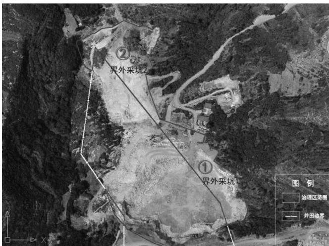
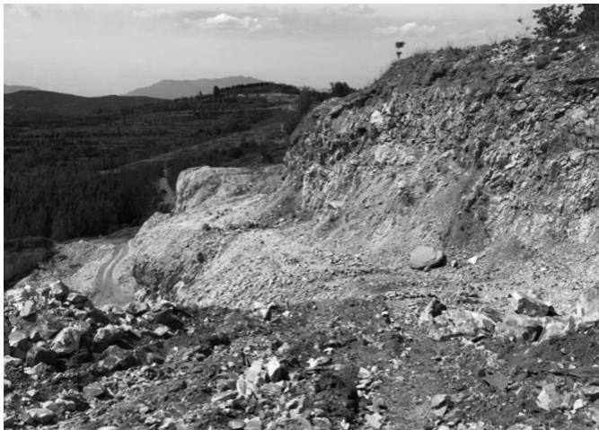
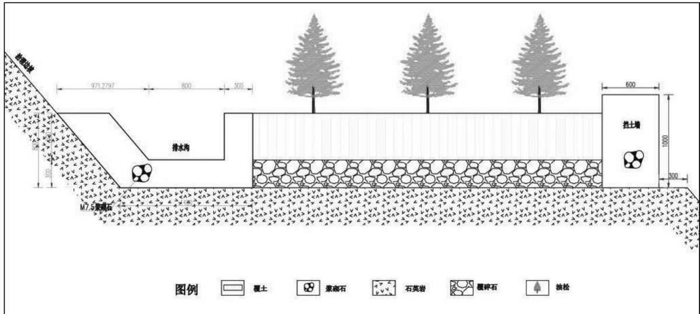

# 登封某石英岩矿界外采坑生态修复设计

周维，赵莉，余少凯，罗文启，秦旭龙

(河南省资源环境调查五院，河南 郑州 450000)

摘 要:露天矿山开采带来生态环境的破坏，主要表现为山体破损，存在次生地质灾害隐患、地形地貌景观破坏、植被及土地资源破坏现象。为推进生态文明建设，必须及时根据矿区特点因地制宜地进行生态环境修复，走可持续发展道路。本项目在对矿区全面勘查的基础上，以防灾减灾、因地制宜、技术可行为原则，针对项目区界外采坑设计了一套完整的矿山地质环境恢复治理方案，恢复林地面积15371.85m²，治理效果可取得良好的社会效益、环境效益及经济效益。

关键词：露天矿山;生态环境;恢复治理;可持续发展

中图分类号: F406.3;TD216

文献标识码： A

DOI:10.13487/j.cnki.imce.019697

经济社会的发展离不开工业的带动，对于玻璃行业而言，其原料主要来自玻璃用石英岩的开采。矿山开采必然带来生态环境的破坏，为打造绿色矿山，达到边开采边治理的目的，实现矿企在矿业活动中兼顾生态效益，矿山地质环境保护与恢复治理工作迫在眉睫。

## 1 工程概况

治理区位于登封市白坪乡，中心地理坐标为东经113°04'36″，北纬34°18'0.57"。北部有简易公路与白坪-徐庄乡村级公路相连，交通便利。该矿山为新建矿山，矿区周围存在历史遗留采坑，为贯彻边开采边治理政策要求，对界外遗留废弃采坑进行矿山环境恢复治理勘查设计，治理区面积26736.78m²。

## 2 勘查目的与方法

本次勘查工作目的在于查明治理区地形地貌、地层、水文地质、工程地质、矿山地质环境问题特征及发展趋势等，侧重于对采矿场分布的高陡边坡及危岩体情况的调查，为其生态修复治理施工设计提供可靠依据。

采用的勘查方法和手段主要包括资料收集、地形测绘、地质测量、航空遥感彩色摄影等。

## 3 矿山地质环境问题

根据现场勘查，区内采矿活动导致山体破损，基岩裸露，生态植被遭到破坏。采矿形成的矿坑及其四周高陡边坡上分布的危岩体对区内地质环境影响较大，造成的主要矿山地质环境问题是地形地貌景观破坏、土地植被资源破坏和矿山地质灾害隐患。

区内共分布有采坑2处(见图1)，地表植被已被严重损毁，特别是露天采场中部形成了开采陡坎，可见明显的台阶，高差为6\~30m，边坡坡度约64°，地表植被已被严重损毁，对地形地貌景观造成破坏;区内的废弃采石场、高陡边坡等区域也对土地植被资源造成了严重破坏(见图2)，致使区内植物失去生长的立地条件，植被稀少或不复存在，主要表现为采石场压占土地植被资源及采矿影响区域内土地植被资源损毁;矿山地质灾害主要为露天采坑高陡边坡开采面上的危岩体引发的安全隐患，露天采石场东西两侧边坡及矿区中部至西北部边界沿线采坑边坡一带分布大量危岩体，坡面石英岩呈破碎状，大部分危岩块浮于边坡上，部分已基本脱离山体，处于欠稳定状态[1-2]。

文章编号:1008-0155(2021)06-0061-02

图1 治理区分布范围图  
  
图2 治理区土地资源破坏现状

## 4 矿山生态修复工程设计

## 4.1 设计原则

设计遵循以人为本、防灾减灾；因地制宜、实事求是;技术可行、经济合理、安全第一的原则。以矿山地质环境治理为重点，找到资源开发、环境保护与灾害治理的最佳结合点。

## 4.2 设计标准

①根据采矿场的地形条件，遵循采矿场开采现状，采矿场设计恢复为边坡—平台结构，共设计2\~5级边坡[3-5]。

②边坡各级平台内侧设计排水沟，外侧设计浆砌石挡墙。

③在场地平整完成后，在边坡平台和采坑底部整理区因地制宜种植侧柏和油松，在边坡坡底种植爬山虎。

## 4.3 治理工程分项设计

针对矿区现状，制定如下分项工程：采坑及场地整理工程→挡土墙工程→覆碎石、土工程→排水工程→绿化工程→养护工程。

首先，采用挖高填低的方法，将采坑底部及场地平整区高凸破碎或孤立的岩石块回填于采场低洼处，进行场地平整，对边坡进行削坡放缓及坡面整理;在平台外围修建挡土墙，拦阻平台碎石土顺坡滑落或被雨水冲刷;对平台进行覆土绿化，设计林地覆土前，首先覆0.30m厚碎石，以利根系舒展，然后统一覆土0.50m;在平台内侧修建排水沟，治理平台断面设计规格见图36-10]。

  
图3 治理平台断面设计图(单位： mm)

采用乔草结合立体绿化模式对治理平台进行绿化，因地制宜的在平台分别种植侧柏与油松，平台地表全部植草，于边坡坡底种植爬山虎，以起到控制水土流失、美化坏境的作用。根据工程区气候条件和林木生长规律，对绿化工程区域实施管护，管护期定为3年。

## 5 结论

本项目区界外采坑生态修复工程，恢复林地面积15371.85m²。其价值具有间接性、潜在性和长久性特点，主要表现在恢复生态环境方面，有助于缓解矿业开发与环境保护之间的矛盾，适应经济社会可持续发展战略要求[11-15];治理工程的实施可以改善矿区地形地貌景观，恢复林地，改善当地居民的人居环境，环境效益显著；另外，治理工程实施后，将改善当地的生态环境，从而刺激人流量，促进当地旅游资源的开发，因此长期看来也能够带来一定的经济效益。

## 参考文献:

[1]曾振，蒋力，王文明，等.北京木林镇M15沙坑生态修 复勘察及治理[J].矿产勘查,2019,10(12):3083-3084.

[2]蒋力，曾振，王文明，等.北京顺义区某沙坑生态修复勘察及治理[J].矿产勘查，2019,10(12):3085-3087.

[3]贾羽娜，赵晓伟，朱鹏飞.玻璃原料矿山地质环境保护与恢复治理[J].玻璃,2019,46(10):49-55.

[4]刘向阳，邓卓智，王赟，等.北京市西郊砂石坑生态修复设计[J].水利发展研究,2016,16(01):70-73+77.

[5]李婉莹，孙畅，王丽.鞍山矿坑生态修复与肌理革新——以大孤山铁矿矿坑区域为例[J].城市建筑，2020，17(03):94-96.

[6王亨力，谢道雷，刘咏明，等.废弃矿山地质环境影响评

价与生态修复[J].绿色科技，2019(24):79-83

[7]季夏微，蔡永立，左俊杰，等.山东九龙山废弃采石坑生态和景观评价与修复方案[J].华东师范大学学报(自然科学版),2009(06):79-88.

[8]李安国.无锡“生态修复+”有效平衡经济社会发展与生态治理[J].中国土地，2021(05):55-56.

[9]饶相相，余婷，骆玉春，等.矿山废弃地环境生态修复研究——以六盘水汪家寨为例[J].清洗世界，2021,37(03):64-65+69.

[10]陈阳，王西平，甄娜，等.基于生态系统服务理论内涵的山水林田湖草生态保护修复实践—以河南省南太行地区试点工程为例[J/OL].环境工程技术学报：1-14[2021-06-08].http: //kns.cnki.net/kcms/detail/11.5972.X.20210330.0959.004.html.

[11]宇振荣，杨新民，陈雅杰.河南省南太行地区山水林田湖草生态保护与修复[J].生态学报,2019,39(23):8886-8895.

[12]郭宏峰，李瑛.废弃采石场的生态恢复和景观重建——以浙江省乐清市东山公园为例[J].华中建筑，2008(03):148-151.

[13]李峰，卫爱民，朱瑞赓.绿色生态材料与矿山复绿研究[J].安阳工学院学报,2005(06):1-3.

[14]罗松，郑天媛.采石场遗留石质开采面阶梯整形覆土绿化方法研究[J].中国水土保持，2001(02):38-39.

[15]任志军.矿山地质环境保护与恢复治理方案的编制[J].西部探矿工程,2014,26(02):93-94.

## 作者简介：

周维(1993-)，女，河南洛阳人，硕士研究生，助理工程师，研究方向：矿山环境恢复治理。