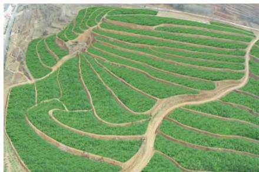
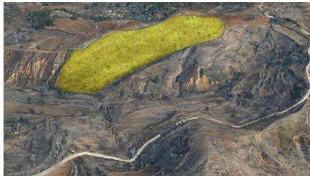
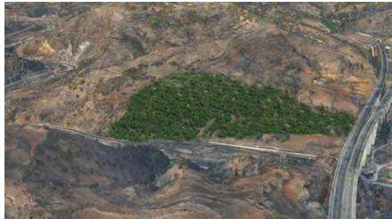
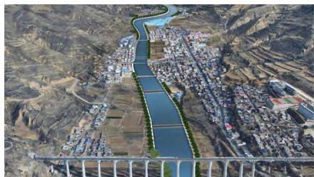

# “双碳”目标下洛河上游山水林田湖草沙一体化保护与修复技术模式研究

曹优明，杨 扬

( 黄河勘测规划设计研究院有限公司，河南 郑州 450003)

摘 要: 以卢氏县范里河等流域水土流失治理工程为研究对象，以“双碳”目标为导向，采用中小尺度问题识别与诊断方法对项目区生态基础条件和突出生态问题进行分析，得出主要生态问题为点 面状水土流失有加重趋势，山地森林低质低效导致生物多样性下降，坡耕地低效耕作尚未大规模改观，河流湖库重要湿地生态功能退化明显等。 提出“一个流域，六个片区;一个问题，一种方案;四条河流，多点治理”的总体部署方案，结合不同片区的突出问题，形成适合的措施布局，有序开展山水林田湖草沙整体保护 系统修复 综合治理 通过探索以生态修复工程为主 自然恢复工程为辅的方法，提出山水林田湖草沙一体化保护与修复治理模式，旨在提高项目区的碳汇功能及经济价值。

关键词: “双碳”目标;一体化保护与修复;山水林田湖草沙;洛河上游

中图分类号: S157

文献标识码: A

DOI: 10．3969 /j．issn．1000－0941．2025．03．017

引用格式］曹优明，杨扬．“双碳”目标下洛河上游山水林田湖草沙一体化保护与修复技术模式研究［J］．中国水土保持，2025( 3) : 59－62，66．

党的十九大报告提出，必须树立和践行绿水青山就是金山银山的理念，统筹山水林田湖草系统治理。从2016 年我国开始实施山水林田湖生态保护工程以来，系统治理的对象从最初的山 水 林 田 湖等要素，发展到增加了草、沙等，系统治理的概念得到了逐步完善。 山水林田湖草沙一体化保护与修复将山、水、林、田、湖、草、沙多个自然生态系统和人类社会系统按照系统原理有机联系起来，突出重点，强调山上山下综合治理、人与自然和谐共生，体现了系统之间的协同性和有机联系 《中共中央 国务院关于完整准确全面贯彻新发展理念做好碳达峰碳中和工作的意见 》( 中发 〔2021 〕 36 号) 和 《国务院关于印发 2030 年前碳达峰行动方案的通知》( 国发 〔2021〕 23 号) 明确，实施生态保护修复重大工程，开展山水林田湖草沙一体化保护和修复，以提升生态系统碳汇增量。 生态系统碳汇能力的巩固与提升是实现碳达峰 碳中和目标( 以下简称“双碳”目标) 不可或缺的重要途径之一［1］。

河南秦岭东段洛河流域山水林田湖草沙一体化保护和修复工程( 以下简称 “河南省山水项目”) 是国家“十四五”第二批山水林田湖草沙一体化保护和修复工程，范围涵盖郑州、三门峡、洛阳等 16 个县( 市、区) 卢氏县秦岭东段洛河流域山水林田湖草沙一体化保护和修复工程( 以下简称 “卢氏山水项目”) 是河南省山水项目的重要组成部分，包含 2 个子项目、7 个单位工程 本研究以卢氏县范里河等流域水土流失治理工程( 卢氏山水项目子项目——— Ⅱ －1 洛河上游丘陵沟壑区水土流失综合治理项目中的单位工程) 为研究对象，以“双碳”目标为导向，通过分析项目区生态环境问题，配置一体化保护和修复措施，助力河南省山水项目实现生态系统的稳定性提升及功能性保障。

## 1 项目及项目区概况

## 1．1 项目概况

卢氏县范里河等流域水土流失治理工程主要包括横涧乡 沙河乡 杜关镇 官道口镇 徐家湾乡 范里镇( 现范蠡镇) 等六个片区。 项目实施期限为 2022—2024 年，计划完成生态修复总面积 260 km2 以上，其中林地提质改造绩效目标占比 89%、新增园地绩效目标占比7%、土地综合整治绩效目标占比 3%等，下达图斑数量近 1 700 个。 项目建设内容主要包括坡改梯 封禁围栏 河道疏浚 生态护岸 河堤修复，以及栽植水源涵养林、水保林、经济林等。

## 1．2 项目区概况

1) 地质。 项目区位于华北与扬子两个板块的碰撞造山带北侧 华北地块南缘，大地构造复杂，岩浆活动频繁，以黑沟－栾川断裂为界，以北为华北地台区地层，以南为秦岭地槽区地层; 地层出露较全，主要有太古界、下元古界、中元古界、上元古界、古生界、中生界和新生界; 地震动峰值加速度为 0．05g，地震基本烈度为Ⅵ度，地壳稳定性为稳定

2) 地形地貌。 项目区地势西高东低、南高北低，主要由中低山 丘陵和河谷阶地组成，海拔 524～1 847m;按照地貌成因和形态可分为构造侵蚀剥蚀 构造侵蚀剥蚀堆积和侵蚀堆积三大类，主要表现为中低山、丘陵和河谷阶地。

3) 气象 项目区位于卢氏县中部和东北部，为暖温带大陆性季风气候区，四季分明，昼夜温差大，春季温暖多风，夏季炎热多雨，秋季阴雨连绵，冬季寒冷干燥，各季节热量分配不均，干旱与冰雹时有发生，对农业生产影响较大; 年均降水量 643．5 mm，最大年降水量 1 140． 0 mm ( 2021 年) ，最小年降水量 390． 3 mm( 2012 年) ，降水一般集中于 7—9 月，期间降水量占年降水量的51．4%，降水量自西南向东北呈递减趋势; 年均气温 11．8 ℃，年均无霜期 174 d。

4) 水文。 项目区属黄河流域，水系主要包括洛河水系和弘农涧河水系，涉及洛河及其支流横涧河、沙河、杜荆河、范里河等。

5) 土壤。 项目区土壤类型主要有红褐土、红石灰性褐土、钙质粗骨土、红土性土、黄砂石灰性褐土等，土壤整体质量偏低，有机质含量少。

6) 植被 项目区植物种类繁多，自然植被良好，分布有植物2 400 余种，其中野生中药材 1 200 余种，有“一步三药” “中华天然药库”之称，还有国家保护野生植物 21 种，其中国家一级重点保护植物 4 种( 银杏 红豆杉 南方红豆杉 水杉) ，国家二级保护植物 17种( 秦岭冷杉、油麦吊云杉等) 受人类活动影响，当地原始森林已不复存在，现有林木主要是人工种植林 飞播林 反复砍伐残留的次生林及次生灌草 草本植被群落。 丘陵沟壑区主要为侧柏 杨树等人工林及灌丛草地，局部植被覆盖度较低，水土流失较为严重河谷阶地及人类聚集区多种植玉米、小麦等农作物，核桃 竹 连翘等经济作物，以及山茱萸等中药材。 卢氏县森林覆盖率超过 70%。 项目区平均林草覆盖率为69%，平均森林覆盖率为 32%

## 2 中小尺度问题识别与诊断

项目区是洛河流域维护森林生态系统稳定性 生物多样性和水源涵养功能的重点区域，以伏牛山国家级自然保护区和熊耳山省级自然保护区为主体，主要生态问题是: 点、面状水土流失有加重趋势，山地森林低质低效导致生物多样性下降，坡耕地低效耕作尚无明显改观，河流湖库重要湿地生态功能退化等。

1) 水土流失有所加重。 项目区属北方土石山区－豫西南山地丘陵区－豫西黄土丘陵保土蓄水区，土壤侵蚀以面蚀为主，局部沟蚀严重，局部区域侵蚀模数可达 $4 ~ 0 0 0 ~ \mathrm { t } / ( \mathrm { \ k m } ^ { 2 } \cdot \mathrm { a } )$ 水土流失面积占总面积的22．59%，植被覆盖率低、土壤抗蚀性差、地形坡度大及人类活动频繁等是造成区内水土流失的主要原因。

2) 低质低效林分布广 项目区林地整体郁闭度低，局部甚至出现“开天窗”现象。 人工林群落结构单一 多样性差，单位面积蓄积量小，成林不成材，局部林地功能退化严重，林地质量较差。 调查发现，林地面积占项目区总面积的 77．3%，低质低效林面积占林地面积的61．4%，其中重度退化的占低质低效林面积的36．45%，中度退化的占低质低效林面积的53．77%，轻度退化的占低质低效林面积的 9．78%。

3) 低效耕作普遍存在 项目区人均耕地不足 单产较低 经济效益差，部分陡坡耕作区域甚至出现绝收现象。 主要原因是水资源不足，可利用水资源量以杜荆河地表水和少量地下水为主，灌溉保证率不足，靠天吃饭现象严重; 耕地以坡耕地为主，土壤水肥条件差，耕层薄;配套设施不足，除部分高标准农田建设项目配套设施较齐全外，其他区域均以群众自建设施为主，配套设施多为生产路和蓄灌排设施，整体数量和分布面积均较小; 低效耕作导致经济效益低下，群众种植意愿低，局部存在撂荒现象。

4) 水生态功能退化。 项目区内河流存在的主要生态问题是沿河居民点较多，生活垃圾倾倒、生活污水直排等现象普遍，水环境质量不容乐观 河道上游水土流失等现象导致河道淤积，碎石渣、建筑垃圾等侵占河道，雨水冲刷导致岸坡失稳，以及岸坡无防护、河道行洪能力差等，严重威胁河道两侧居民生产生活安全。

## 3 山水林田湖草沙一体化保护与修复方案

地表植被对生态系统碳汇功能的贡献大小不一，提高森林植被覆盖率 改善森林质量 提高系统稳定性是提高森林生态系统碳汇功能的最佳途径。 通过对项目区生态环境现状和突出问题的分析，划定生态保护与修复片区，提出 “一个流域，六个片区; 一个问题，一种方案; 四条河流，多点治理”的设计思路，以“双碳”目标实现为原则，构建区域生态安全格局。“一个流域”指范里河流域; “六个片区”指项目区划分的范里 横涧 沙河 杜关 官道口 徐家湾六个片区;“一个问题”指生态诊断的突出问题; “一种方案”指解决问题的治理方案; “四条河流”指研究区内四条生态廊道，为水生态功能退化严重的河流; “多点治理”指项目区内沟道、坡面等多区域的水土流失治理。

## 3．1 坡改梯综合整治区

针对低效耕作区，对坡度 $5 ^ { \circ } \sim 1 5 ^ { \circ }$ 集中连片且距村庄较近、交通便利的较缓耕地，实施坡改梯综合整治措施 坡改梯综合整治是根据坡耕地立地条件，沿等高线修筑梯田，在达到保水 保土 保肥作用的同时，为农业 林业发展创造条件; 以治理水土流失 改善农业生产条件为目标，通过对生态 社会 经济效益的综合考虑和方案比较，确定治理措施总体布局和配置。 垂直方向，根据项目区不同小流域的具体地块和地貌特征、水土流失现状，从分水岭至河沟分层布置，形成垂直综合防护体系; 水平方向，近路 近村 近水布置。

传统坡改梯田块布设原则应做到大弯就势 小弯取直，田面宜宽不宜窄，田块宜长不宜短。 对项目区现场走访调查发现，项目区人均坡耕地面积较小，如果采取整齐划一的原则，那么实际施工过程中会把群众的地块打乱，违背群众意愿。 因此，项目区坡改梯田块布置采取保留原农户田埂位置的方式，在此基础上，实施保留表土 田面修正 田坎整修等标准化措施。 梯田应根据地形坡度、土层厚度和田面宽度条件确定合理的表土剥离和回覆方案。 根据当地的实际情况，秋粮收割后至栽植烟草前土地有一个多月的空闲时间，为了不影响农作物的播种和收割，土地平整工作应抓住这个有利时机，安排在秋收后或冬种前进行。 坡改梯综合整治区实施效果见图 1。

  
图 1 坡改梯综合整治区实施效果

## 3．2 园地绿色经济发展区

针对项目区水土流失有加重趋势的区域，将近山 连片 交通便利的土质区域通过局部穴状整地后栽植经济林进行改造，实现生态保护修复与群众切身利益相结合。 传统的果树栽植耗水量大且需要精细管理，通过走访群众和咨询林业部门意见，树种选择能为群众带来经济效益又具有良好水土保持效果的连翘。 项目区立地条件较差，通过实施土壤改良、养护措施等，可提高苗木成活率。 园地绿色经济发展区实施效果见图2。

  
图 2 园地绿色经济发展区实施效果

## 3．3 林地提质生态发展区

根据 《造林技术规程 》( GB /T 15776—2023) 《退化林修复技术规程 》( LY /T 1690—2017) 《森林抚育规程 》( GB/T 15781—2015) ，针对项目区内低质低效林，设计通过自然恢复工程( 封禁措施为主) 、生态修复工程( 补植、补种为主) ，因地制宜实施保护性修复，促进林地提质增效。

自然恢复工程主要分布在封山育林及石质山坡区域，可通过封禁措施，辅以补植、补种措施促进自然恢复。 生态恢复工程主要分布在林分改造区，可通过补植 补种 抚育等措施促进生态恢复，辅以针阔树种混交，提高森林生态系统稳定性。 在交通条件较好的土质空地可采用苗木补植方式恢复植被，补植树种选择五角枫 连翘 刺槐 侧柏等; 在交通条件较差的土质区域可采用穴播补种方式恢复植被，种子选择刺槐、臭椿等，树坑密度为 $1 . 5 ~ \mathrm { m } { \times } 1 . 0 ~ \mathrm { m }$ ，每穴穴播经过处理的种子5～10 粒，种子穴播用量为 $4 0 ~ \mathrm { k g } / \mathrm { h m } ^ { 2 }$ 。 抚育工程主要针对郁闭度较高 无需补植补种但需进行管护的林地，主要采取修枝措施，其中油松林可根据需要采取喷药措施。 对项目区低质低效林进行改造，提升了森林生态系统的服务功能 林地提质生态发展区实施效果见图 3。

  
图 3 林地提质生态发展区实施效果

## 3．4 河道生态廊道改善区

针对水生态功能退化区，对水环境治理区存在岸坡侵蚀失稳隐患的河道采取修护岸、护地堤、滚水坝等措施，对淤积严重区采取局部清淤疏浚及生物工程等措施进行河道治理，可有效预防岸坡侵蚀，防止汛期洪水毁坏周边农田，同时减轻河道周边高陡边坡丘陵沟壑的水土流失。 河道生态廊道改善区实施效果见图4。

  
图 4 河道生态廊道改善区实施效果

## 3．5 局部水土流失治理区

针对项目区局部存在的支毛沟、裸露边坡等点、面状水土流失问题，采取点对点的治理措施，完善修复治理方案。

1) 支毛沟治理工程 支毛沟治理工程布置在水土流失严重且下游有耕地、 村庄等保护对象的支毛沟，主要措施包括谷坊 沟头防护工程 挡土墙等。

2) 红土山坡治理工程。 对产生水土流失的红土裸露坡面进行治理，根据实际情况在坡脚设计浆砌石挡墙，坡面采用缓坡段栽植乔木、陡坡段穴播树木种子的方式进行植被恢复

3) 局部塌岸边坡整治，河道局部塌岸岸坡可采取生态护坡进行土地整治，采用格宾挡墙+三维快速植生垫的解决方案 风化陡坡段采用格宾挡墙支挡，挡墙顶部覆土放坡，坡比 1 ∶ 1．5，坡顶与缓坡段平顺相接;格宾挡墙最大高度 6．0 m，墙面垂直，墙背每层按0．5 m 退台，坡面采用三维快速植生垫绿化; 三维快速植生垫采用轻质阻燃材料，坡面采用 U 形钉固定，U形钉采用直径8 mm 钢筋制作，梅花形布置，间距1 m。

## 4 效益分析

## 4．1 碳汇效益

参考 《森林生态系统碳储量计量指南 》 ${ \big ( } \ \mathrm { L Y } / \mathrm { T }$ 2988—2018) ，项目区碳汇效益包括乔木层地上部分碳汇效益和地下部分碳汇效益。

1) 乔木层地上部分碳汇效益。 乔木层地上部分碳储量应根据组成林分各树种的平均单位面积地上生物量 树种含碳量及林分面积计算，公式为

$$
C _ { \overrightarrow { \mathfrak { f r } } \star \overrightarrow { \mathfrak { h } } \mathfrak { h } \vdash \overrightarrow { \mathfrak { h } } \overrightarrow { \mathfrak { h } } \overrightarrow { \mathfrak { h } } \overrightarrow { \mathfrak { h } } } = \sum _ { k = 1 } ^ { n } \big ( \ B _ { \overrightarrow { \mathfrak { f r } } \star \overrightarrow { \mathfrak { h } } \sqcup \underline { { \star \overrightarrow { \mathfrak { h } } } } \sharp \smash {  } \mathfrak { h } \sharp \smash {  } \mathfrak { h } \index { \textbf { \small { x } } } \big ) } \ \times S \ ( \ 1 )
$$

式中: $C _ { \mp \kappa \star \pm \sharp \perp \sharp \sharp }$ 为林分乔木地上部分生物质碳储量，单位 $\mathrm { t } ; k$ 为 组 成 林 分 的 树 种， $\begin{array} { l l l } { k } & { = } & { 1 , 2 , \cdots , n ; } \end{array}$ $B _ { \mp \ast \pm \sharp \pm \frac { \cdot \cdot } { \cdot \cdot } \sharp B ^ { \prime } \pm , k }$ 为林分中树种 k 的平均单位面积地上生物量( 干物质) ，单位 $\langle { \mathrm { h m } ^ { 2 } } ; C _ { \mathrm { F } \overline { { \hbar } } \star , k } ,$ 为树种 k 的每吨干物质含碳量，单位t/t，取 $0 . 5 1 \mathrm { ~ t ~ } / \mathrm { t } ; S$ 为林分面积，单位 $\mathrm { h m } ^ { 2 }$ 。

2) 乔木层地下部分碳汇效益计算方法。 乔木层地下部分碳储量应根据组成林分各树种的平均单位面积地下生物量、 树种含碳量及林分面积计算，公式为

$$
C _ { \overrightarrow { \mathfrak { f f } } \star \overrightarrow { \mathfrak { h } } \overrightarrow { \mathfrak { h } } \overrightarrow { \mathfrak { h } } \overrightarrow { \mathfrak { h } } \overrightarrow { \mathfrak { h } } \overrightarrow { \mathfrak { h } } } = \sum _ { k = 1 } ^ { n } \big ( \ B _ { \overrightarrow { \mathfrak { f f } } \star \mathfrak { h } \overrightarrow { \mathfrak { h } } \overrightarrow { \mathfrak { h } } \overrightarrow { \mathfrak { h } } \overrightarrow { \mathfrak { h } } \overrightarrow { \mathfrak { h } } \overrightarrow { \mathfrak { h } } \overrightarrow { \mathfrak { h } } \overrightarrow { \mathfrak { h } } \overrightarrow { \mathfrak { h } } \overrightarrow { \mathfrak { h } } \overrightarrow { \mathfrak { h } } \overrightarrow { \mathfrak { h } } \big { \ \times }  { S } \big ( 2 \big ) }
$$

式中: $C _ { \mp \kappa \star \pm \underline { { { \sf t b } } } \ll \underline { { { \sf a } } } \ll \underline { { { \sf b } } } \ll \underline { { { \sf a } } } }$ 为林分乔木地下部分生物质碳储量，单位 t; $B _ { \mp \star \pm \sharp \sf T F B S } , _ { k }$ 为林分中树种 k 的平均单位面积地下生物量( 干物质) ，单位 $\mathrm { t } / \mathrm { h m } ^ { 2 }$

3) 碳汇效益计算。 利用 InESVT 模型来验证一体化保护与修复工程实施增加的碳储量。 项目区补植乔木585 万株，换算为有效补植面积 $2 \ 3 4 2 \ \mathrm { h m } ^ { 2 }$ ，得出一体化保护与修复方案实施后区域碳汇总量预计为8．5 万 t，比实施前增加 42%。

## 4．2 其他效益

1) 社会效益 方案实施后，随着新增园地( 经济林) 的逐步分配、交付，将大大提高土地利用率和劳动生产率，使各种资源得以有效、合理利用，同时可以解决大批农村剩余劳动力的出路问题，提高群众经济收入。 项目区物质条件的改善，也有助于提升周边地区科学文化水平和卫生状况，推动精神文明建设，促进社会发展。

2) 生态效益。 方案实施后，通过对项目区内的荒山荒坡等实施坡改梯和营造水土保持林，将进一步改善作物生长的水、 肥条件，有利于土壤有机质和氮、磷、钾肥的积累，提高土壤肥力，增强土壤抗蚀能力;水土保持措施实施后，能减少入库泥沙，净化水源区水质，减轻自然灾害; 同时林草植被的增加也将给野生动物提供栖息的场所，有利于野生动物的繁衍生息和生态环境的良性循环 预计方案实施后每年各项水土保持措施的保土效益约为 52．68 万 t，保水效益约为559．12万 m3 。

3) 经济效益 按照 《水土保持综合治理效益计算方法 》( GB/T 15774—2008) 的有关规定，水土保持各项治理措施产生的经济效益包括直接经济效益和间接经济效益。 预计各项措施实施 20 a 后累计总经济效益为 105 436．73 万元，效益费用比为 2．89 。

## 5 结束语

实现“双碳”目标是山水林田湖草沙一体化保护  
与修复工作的主要任务［2］。 通过对项目区生态基础  
条件和突出生态问题的分析研究，以增加生态系统碳  
汇功能为目标，综合社会效益和经济效益，减少工程  
措施部署，以乔灌结合的林草措施为主、保护性修复  
为辅，提高研究区的碳汇功能及经济价值。 卢氏县范( 下转第 66 页)

水源涵养能力，同时积极推进国家公园建设和甘南黄河上游水源涵养区治理保护项目，维护高海拔湿地生态系统。

5) 祁连山山地水源涵养保土区占地面积仅次于河西走廊农田防护防沙区，土地利用类型以森林草地裸岩石砾地和水浇地为主，兼有冰川和湖泊，并孕育了黑河、石羊河和疏勒河三大内陆河。 水土流失防治策略应以全面保护森林、草原、湿地、河湖、冰川为主，在高山荒漠草地区实施封育禁牧和自然修复，在山地森林草原区加强森林资源保护，提高水源涵养能力，在浅山农田区加强防护林建设，降低沙害对农业生产造成的损失。

6) 陇南山地保土减灾区土地利用类型以旱地 园地、草地、林地和裸岩石砾地为主，气候湿润，降水量丰沛，植被类型多样，水源条件好，应实施梯田和生态清洁小流域建设的防治策略。 在洮河山间盆地和陇南丘陵盆地以改良天然牧草 实行轮封轮牧为主，在河谷浅山建设水平梯田，同时对山洪、泥石流多发沟道采取工程措施和植物措施相结合的防治体系，在白龙江石山森林区和陇山南坡森林区加强封育保护，加大植被建设，增加植被覆盖度。

## 4 结论

甘肃省8 个三级区水土保持率现状值和远期目标值的变化范围分别为 51．38% ～ 80．76%和 54．02% ～ 87．65%。 若尔盖高原生态维护水源涵养区水土保持率现状值(80．76%) 最高，其次是陇南山地保土减灾区 青东甘南丘陵沟壑蓄水保土区，河西走廊农田防护防沙区水土保持率现状值( 51．38%) 最低。 水土保持率远期目标值与现状值的差值为 0．66～18．30 个百分点，晋

( 上接第 62 页) 里河等流域水土流失治理工程按照“一个流域，六个片区; 一个问题，一种方案; 四条河流，多点治理”的总体方案部署，结合不同片区的突出问题，形成适合的措施布局，有序开展山水林田湖草沙整体保护、系统修复、综合治理; 通过实施坡改梯综合整治 园地绿色经济发展 林地提质生态发展 河道生态廊道改善、局部水土流失治理等工程，以问题为导向 目标为导向，进一步明确生态修复的主要方向，探索山水林田湖草沙一体化保护与修复治理示范模式，为国家和全省谋划布局重大生态修复工程提供了强有陕甘高塬沟壑蓄水保土区差值最大，若尔盖高原生态维护水源涵养区和祁连山山地水源涵养保土区差值较小。

各分区主要的水土保持功能定位体现在农田防护和防风固沙、蓄水保水和土壤保持、水源涵养、防灾减灾等方面，对应的水土流失防治策略为: 量水而行 防沙护田;以小流域为单元，坚持山水林田湖草沙系统治理;以全面保护森林、草原、湿地、河湖、冰川为主。 可采取以小流域为单元的山水林田湖草沙系统治理，以天然牧草地 森林 河湖湿地保护为主的自然生态修复，以及量水而行的农田防护等总体防治策略和水土保持措施布局。

## 参考文献:

1］蒲朝勇．科学做好水土保持率目标确定和应用［J］．中国水土保持，2021( 3) : 1－3

2］曹文洪，宁堆虎，秦伟．水土保持率远期目标确定的技术方法［J］．中国水土保持，2021( 4) : 5－8，21．

3］程冬兵，赵元凌，孙宝洋，等．小流域水土流失治理优先度的评价与应用［J］．农业工程学报，2023，39( 22) : 104－111．

4］靳峰，马涛，秦伟，等．甘肃省水土保持率远期阈值与阶段目标值确定［J］．人民黄河，2022，44( 4) : 112－116．

［5］牛银栓．黄土高原水土流失诸因素分析及治理展望［J］．水土保持研究，2001，8( 1) : 85－88，129．

6］王守俊．甘肃省水土流失重点防治区复核划分研究［J］．人民黄河，2018，40( 3) : 88－92，114．

7］王治国，张超，纪强，等．全国水土保持区划及其应用［J］．中国水土保持科学，2016，14( 6) : 101－106．

( 责任编辑 李杨杨)

## 力支撑。

## 参考文献:

1］王国胜，孙涛，昝国盛，等．陆地生态系统碳汇在实现 “双碳”目标中的作用和建议［J］．中国地质调查，2021，8( 4) :13－19．

2］王夏晖，何军，饶胜，等．山水林田湖草生态保护修复思路与实践［J］．环境保护，2008，46( 增刊 1) : 17－20．

( 责任编辑 李杨杨)