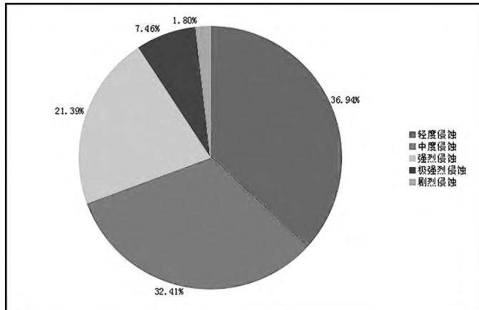

# 某铝土矿区水土流失防治措施

□徐 凡1 吴 卿1 石卫东2 李洧旻2 刘 彬1 陈子韶1（1华北水水利水电大学；2三门峡市水利局）

摘 要：文章以三门峡市铝土矿区为研究对象，在对三门峡市铝土矿区分布规律进行调查分析的基础上，指出铝土矿区集中位于三门峡市黄土丘陵沟壑土壤保持区，并根据该区水土流失特点提出影响铝土矿区水土流失的主要因素可分为自然因素和人为因素两部分。针对影响因素提出具体的防治措施是：搞好专项水土保持规划；控制敏感区铝土矿开发；强化公众水土保持意识；严格涉矿水土流失监督检查机制；保证水土流失防治工作开展；开展铝土矿水土流失防治科学研究和推动水土保持治理示范区建设。关键词：铝土矿区；水土流失；防治措施；三门峡

中图分类号：S157.1

文献标识码：A

文章编号：1673-8853（2018）11-0016-03

## 0 引言

三门峡市是1957年随着黄河上第一座水利枢纽工程—三门峡水利枢纽的兴建而崛起的一座新兴工业城市，位于河南省的西部，豫、晋、陕三省交界处，地处东经110°21′42″～112°0124″，北纬 33°31′24″～35°05′48″之间。东临洛阳，西接陕西，北隔黄河与山西相望，南连伏牛山与南阳接壤。东西长153 km，南北宽132 km，国土总面积10 496 km2，占河南省总面积的6.30%。根据国家的战略部署，三门峡市与山西运城、陕西渭南联合，共同创建国家中部地区的能源、原材料供应基地。

近年来，由矿产资源市场回暖及各级财政投入的增加，国家对铝土矿勘察投入增大，三门峡市在陕县—渑池—新安一带有重大发现，在著名的陕—渑铝（粘）土矿成矿带发现一系列大型铝土矿区，铝土矿产资源开发蓬勃兴起，为振兴三门峡市经济起到了很大作用。与此同时，铝土矿的过度开发和无序开采对生态环境产生的负面影响也与日俱增，造成严重的水土流失危害。文章通过对三门峡市铝土矿分布规律、水土流失现状和水土流失影响因素的研究，提出三门峡市铝土矿区水土流失的防治措施。

## 1 铝土矿区分布规律

三门峡市铝土矿产集中产区按照其空间分布属于陕县—渑池—新安成矿区，该成矿区是河南省最重要的优质铝土矿成矿区，面积约30万hm2，包含3个成矿带，分别为七里沟—焦地—铝土矿带（西矿带）、杜家沟—郁山铝土矿带（中矿带）和张窑院—下冶铝土矿成矿带（东矿带），其中全部西矿带和大部分中

矿带位于三门峡市境内。

三门峡市铝土矿产资源空间分布特征主要表现为沿黄河以南、秦岭以北带状分布于湖滨区北部、陕县东部和渑池境内的沉积岩区，截止目前，三门峡市铝土矿查明矿产地45处，共有铝土矿山33个，其中中型8个，小型25个。湖滨区北部、陕县东北部和渑池西北部铝土矿区大部分沿黄河右岸集中连片分布，距离黄河主河道直线距离5 km以内的沿黄矿区有33个，其中有11个矿区紧邻黄河干流河道，位于三门峡黄河湿地自然保护区实验区范围内。

## 2 铝土矿区水土流失特点

三门峡市地处我国黄土高原的东南部边缘，在中国水土流失分布区上属于北方土石山区，在中国水土保持区划中，将三门峡市划分为北方土石山区（北方山地丘陵区）—豫西山地丘陵区—豫西黄土丘陵保土蓄水区。区内梁峁起伏，地形破碎，侵蚀沟发育活跃，水土流失严重。

根据《三门峡市水土保持规划》（2016-2030年）统计数据，截止2015年全市有34.12万hm2水土流失面积未治理，全部为水力侵蚀，占全市国土总面积的32.50%。按照侵蚀强度划分，轻度侵蚀 12.60 万 hm（2 36.94%），中度 11.06 万 hm（2 32.41%），强烈 7.30 万 hm（2 21.39%），极强烈 2.54 万 hm（2 7.46%），剧烈0.61万hm（2 1.80%）。三门峡市水土壤侵蚀类型是水力侵蚀，总体来看，土壤侵蚀强度以轻度和中度侵蚀为主，表现形式为沟蚀和面蚀，集中分布在丘陵沟壑区。三门峡市土壤侵蚀类型饼状图见图1。

铝土矿集中分布的陕县和渑池县属于伏牛山中条山国家级水土流失重点治理区和河南省豫西采矿重点监督区。在《三门峡市水土保持规划》（2016-2030年）中，铝土矿集中分布区基金项目：河南省水利科技攻关项目“豫西矿区水土流失特点及防治措施体系研究”（GS201720）

  
图1 三门峡市土壤侵蚀类型饼状图

域均位于黄土丘陵沟壑土壤保持区，该分区水土流失面积为11.94万hm2，占全市水土流失面积的35.01%。地貌类型主要以低山丘陵为主，海拔在252～800 m之间。地表岩性以安山岩、砾岩、砂岩及石灰岩为主。土壤类型主要有红粘土、褐土。区域内裂隙发育，干旱少雨，坡地面积大，沟壑纵横，山体破碎，植被覆盖率低，土质疏松，抗蚀力弱，沟深坡陡，地表破碎，水蚀严重，冲沟发育，大部分土地在17°以上的坡面上，坡度在10°以下约占18%，10～25°的占60%，25°以上的占2%，沟壑密度3.20～4.70 km/km2。再加上矿产资源开发等人类活动密集，引起区内局部生态退化，出现大量裸滩荒坡，地面支离破碎，加剧水土流失。土壤侵蚀表现形式主要以沟蚀为主，水土流失特点是面积大，分布广，强度高，威胁大。

## 3 影响水土流失的因素

## 3.1 自然因素

## 3.1.1 地形因素

铝土矿集中分布区域地貌类型均为山地、丘陵，地形起伏较大，自然冲沟发育，切割强烈，地面组成物质松散，大部分矿区临近黄河干流河道，矿山表面冲沟可直接注入黄河，水土流失易发，防治难度较大。

## 3.1.2 气候因素

区内多年平均降雨量约680 mm，降雨集中在7-9月份，占全年降水的60%以上。暴雨频发，雨量集中，降雨强度大，容易形成较大径流，引发水土流失。

## 3.1.3 土壤植被因素

矿山表层土壤主要为褐土和黄棕壤土，局部谷地存在红色黏土，但多为后期的黄土覆盖，由于黄土大面积分布，熟化程度偏低，土质疏松，粘性差，肥力低，涵养水源能力较差，影响植被生长，地表植被破坏后抗蚀能力较差；区域植被类型属于暖温带落叶阔叶林，适宜植被生长，但由于地形复杂，植被随海拔高度、土壤类型分布情况有明显差异，经现场调查，三门峡市铝土矿山综合植被覆盖率在20%以下。

## 3.2 人为因素

## 3.2.1 人类活动干扰频繁

铝土矿资源开发方式粗放，大部分矿区采用露天开采的方式，需要清理地表植被并铲除原生表土，使地面裸露，裸露的地面受到径流冲刷，造成土壤水力侵蚀，地表土层的营养元素流失，土壤肥力下降，引发土地退化；人类活动干扰，机械碾压等造成地表结皮破坏，降低区域内水土保持功能，加剧水土流失；同时，矿产资源开采产生大量废渣弃石，集中堆放占压土地，破坏地表植被，新形成的堆置体相对松散，成为引发水土流失的因素。

## 3.2.2 水土保持意识淡薄

一些建设单位水土保持意识淡薄，在开发建设铝土矿区前不及时编报水土保持方案；开采过程中未按照水土保持规范或相关设计文件要求布设防治措施，任意破坏植被，大量的弃渣、弃土石被随意倾倒在山沟和坡面上，受到暴雨径流影响，大量弃渣弃土顺水而下，占压良田，淤积河道，造成新的水土流失；在闭矿后未及时平整扰动土地，人工回覆腐殖土并恢复植被，矿区土地长期裸露，土壤营养大量流失，植被无法自然恢复，生态失衡。

## 3.2.3 水土流失防治措施配置不合理

实施水土流失防治措施是在铝土矿开发建设过程中减少水土流失的必要手段，一般在水土保持方案编制时确定配置模式。但是有些建设单位为了尽早获取行政许可开工建设，压缩方案编制单位的工作周期，水土保持方案编制存在严重的照搬照抄现象，水土流失防治措施配置也千篇一律，甚至基础资料都不能与项目对应，因地制宜、有针对性的指导水土流失防治更无从谈起。

## 3.2.4 水土保持后续设计落实不到位

由于行业规定差异，早期铝土矿开采项目后续设计报告一般缺少水土保持专章和施工图设计，水土保持方案落实缺少详细的后续设计，建设单位实施水土流失防治措施缺少设计文件指导；2013年发布的《有色金属矿山工程建设项目设计文件编制标准》（GB/T50951-2013）虽然明确了水土保持方案及其批复文件需要作为初步设计编制依据，并且将水土保持和环境保护一并纳入初步设计文件编制内容，但是要求比较简单，行业内重视程度不够，一般只是点到为止，后续设计落实无法到位。

## 4 水土流失防治措施

## 4.1 做好铝土矿区水土保持专项规划

在《三门峡市水土保持规划》的基础上，根据铝土矿区水土流失特点，有针对性地提出铝土矿区的水土流失防治要求，并且将铝土矿集中分布的黄土丘陵沟壑土壤保持区作为全市水土流失防治的重点进行专项规划，积极探索新的防治途径及措施体系布局。

## 4.2 控制生态脆弱区和环境敏感区铝土矿开发建设

严格执行矿产资源法、自然保护区管理条例和水土保持法等法律法规，对于生态脆弱区和环境敏感区的铝土矿开发建设行为进行限制，控制新增铝土矿开发建设项目；对于已经取得行政许可的矿区加大监督检查力度，提出高标准、严要求，在保证生态环境保护优先、水土流失防治至上的前提下，对生态脆弱区和环境敏感区的铝土矿权进行全面清理，依法有序安排全面退出。

## 4.3 加强宣传，强化全社会水土保持意识

结合“水土保持法”修订实施纪念、“世界水日”、“中国水周”等特殊时间节点，由水行政主管部门主办，邀请社会公众广泛参与进行专题普法活动，树立全社会水土保持意识，动员全社会参与水土流失防治工作；同时，针对水土流失防治参与各方组织专项教育培训，提高水土保持监督检查执法队伍行政水平和增强建设单位水土保持法制观念，优化执法环境，减少执法阻力。

## 4.4 严格铝土矿水土保持方案审批及监督检查机制

相关主管部门应当严格按照水土保持方案审批管理规定，确保铝土矿区水土保持方案能逐步走向正规化、制度化、标准化，方案基础资料真实可靠、符合工程实际，措施布局合理，能够有效防治水土流失；同时，抓好在建项目监督和执法检查，依法行政，强化落实生产建设项目水土保持措施的落实。

## 4.5 保证水铝土矿土保流失治工作顺利开展

积极推进水土保持体制和机制创新，形成政府引导、部门协作、全社会参与共同治理水土流失的新局面。由水利、林业、国土资源和环境保护等多个行政部门组建跨部门联合管理平台，对铝土矿区水土流失防治工作进行多角度、全方位的监督，对建设单位提供有效的技术指导，保证水土流失防治工作顺利进行。

## 4.6 开展铝土矿水土流失防治科学研究

针对铝土矿区水土流失防治进行专项研究，以科技促发展，强化水土保持关键技术攻关和示范推广。积极开展水土流失特点、水土流失规律和水土流失防治措施体系配置等基础理

（上接第 11页）

如门之处）。畚（běn）插如云声汹汹，风埃成雾气昏昏。已令访问津头路，行约青帘共一樽。“畚插如云”与“风埃成雾”可见其整治漕渠工程的规模之大。

熙宁四年（公元1071年）春天，黄庭坚到石塘河送已嫁于陈氏的妹妹回江南老家，写下《送陈氏女弟至石塘河》：“富贵常多覆族忧，贱贫骨肉不相收，独乘舟去值花雨，寄得书来应麦秋。行李淮山三四驿，风波春水一双鸥。人言离别悬难遣，今日真成始欲愁。”“独乘舟去”，“行李淮山”，从石塘河登上东下的行船就可以顺流而下进入淮河，也可从另一方面说明昔日石塘河的繁华。

## 6.2 无形的精神

敢于担当。嘉祐三年，正在实施疏浚的石塘河数万兵夫发生叛乱，时任京西转运使的陈希亮，只身前往处置这一群体事件，开展真诚对话，妥善化解矛盾。陈希亮居官清正，仗义执言，任职均有建树，深得群众爱戴，迁居叶县以后其后人一直居住在叶县，其子孙也多有作为，其长子陈忱进士及第，曾任京东路转运使，其曾孙陈与义南宋绍兴七年正月授参知政事（副宰相），宋史为其立传，对其褒奖有加，颂其“容状俨恪，不妄言笑，平居虽谦以接物，然内刚不可犯”。又曰：“尤长于诗，体物寓兴，清邃纡余，高举横厉，上下陶、谢、韦、柳之间”，有多部著述传世。陈希亮于治平二年去世后，名士苏东坡亲撰墓志铭，颂其功德。这种敢于担当的精神，值得后人学习。

论研究，针对生态脆弱区和环境敏感区铝土矿区生态系统恢复进行专项研究，同时探索矿山开采与水土保持生态建设的关系研究等，提高水土流失治理效率，保证经济社会可持续发展。

## 4.7 推动铝土矿区水土保持治理示范区建设

以沿黄湿地自然保护区铝土矿综合治理行动为契机，结合三门峡市绿色矿山建设，树立典型，推动和鼓励建设单位进行铝土矿山生态恢复，为全市乃至全省铝土矿生态恢复积累经验和提供示范样板，充分发挥示范辐射作用。总结成功经验，进一步加快铝土矿区水土流失防治步伐，实现水土资源可持续利用、经济发展与生态恢复相协调。

## 参考文献：

［1］三门峡市人民政府.三门峡市矿产资源总体规划（2016-2020 年）［Z］.2017-12.

［2］朱东晖.河南省铝土矿资源潜力评价与勘察开发战略研究［D］.中国地质大学（北京）博士学位论文，2010.

［3］徐健，李灿明，孙中峰等.气田开发工程水土流失特点与防治措施—以苏里格气田为例［J］.中国水土保持科学，2013，11（01）：103-108.

收稿日期：2018-8-30

编辑：刘长垠

务实为民。熙宁二年（1069年）王安石开始的变法，历史上褒贬不一，但从黄庭坚在叶县任县尉时与舞阳县官吏一起，深入偏僻的农村考察是否适宜修建可以灌溉的水库，的确是为民办事的典范，《按田》并序记载：“余与晁端国斯道，奉檄按马鞍山东港淃河稻田陂。官丁误引道左次。水泽山深，径危泥潦，坚冰长幹挟马，仅可以度。行五十里，遂不容马。步沮洳，虎迹新往来，乌鸟丛噪荆榛，尽日出入，乃至河上。集近山之农，告以献利者，皆以为濒水为舍居，旁治新田，果蓏（luǒ）有畦，桑枣成行，自山之东西，皆不可为陂”。这种披荆斩棘、长途跋涉，不把事情原委弄清楚誓不罢休的行为，这种真心为群众办事的精神，值得后人学习。

## 7 今日石塘河

北宋时繁华的石塘河随着金兵铁蹄的践踏淹没的在历史的长河之中，这条河流也逐渐更名为干江河，也有部分资料记为甘江河，但河名来源无考，只有在方城县志的记载似乎找到了答案，在《水经注》上为荥水如今称黄泥河的地方，在开挖河道时有大量如干姜样石块出土，人们俗称之为干姜河，后演化为干江河。

如今的干江河上，已修建了总库容9.25亿m3的大型水利枢纽工程燕山水库，干江河的洪灾隐患已得到彻底治理，其下游沿河的防洪标准达到了50a一遇。

收稿日期：2018-11-20

编辑：宋大春