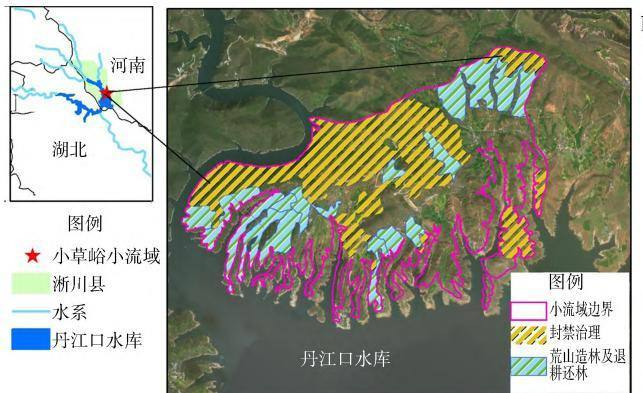

# 河南省水土保持碳汇交易实践

师现营，王 伟

（河南省水土保持监测总站，河南 郑州 450008）

摘 要： 水土保持碳汇交易试点是“绿水青山”转化为“金山银山”实践路径的前沿探索。 河南省统筹做好顶层设计，积极开展前期谋划，努力走上生态优先、绿色发展的新路子。 结合区域水土保持与碳汇资源特征，选定位于南水北调中线工程渠首和核心水源地的“淅川县马蹬镇小草峪小流域水土保持重点防治项目”开展河南省水土保持碳汇交易试点，完成河南省首单水土保持碳汇交易，为全省水土保持碳汇价值实现提供了宝贵经验和先进模式。 从项目筛选、碳汇核算与核证、统筹推进、示范引领等方面，系统梳理了河南省首单水土保持项目碳汇开发过程，总结了碳汇交易实践经验：①强化前期调研，加强统筹谋划； 找准区域特色，做好项目筛选； 政府调动多方参与，充分发挥示范效益。 从完善水土保持碳汇的价值实现及运行机制、提升区域水土保持碳汇信息化和数字化水平、探索水土保持碳汇可持续经营管理模式 3个方面提出了工作建议。

关键词： 水土保持；碳汇交易；河南省

中图分类号：S157

文献标识码： B

DOI：10．3969 ／ j．issn．1000－0941．2025．08．024

引用格式： 师现营，王伟．河南省水土保持碳汇交易实践［J］．中国水土保持，2025（8）：105－108

水土保持碳汇是巩固区域生态系统碳汇能力、提升生态系统碳汇增量的重要方面［1］，也是新时期水土保持高质量发展的主要工作之一［2］ 水土保持碳汇交易是将水土保持措施产生的碳汇量，经科学核算和第三方核证后作为交易产品，转让给需要抵消碳排放的单位或个人，从而实现生态产品价值变现的过程［3］ 水土保持碳汇交易是 两山 转化的重要途径也是践行习近平总书记 节水优先 空间均衡 系统治理、两手发力”治水思路的重要内容［4］。

河南省地跨长江、淮河、黄河、海河四大流域，长江经济带发展战略及黄河流域生态保护和高质量发展重大国家战略在河南叠加，还肩负南水北调中线水源区水质保障的重要职责［5］ 近年来 河南省深入贯彻习近平生态文明思想和习近平总书记关于治水重要论述，坚持山水林田湖草沙综合治理、系统治理、源头治理，扎实做好全省水土流失综合防治工作，全面提升水土保持功能和生态产品供给能力，水土保持生态建设取得显著成效［6－7］。 同时，河南省认真践行“绿水青山就是金山银山”理念，积极探索生态产品价值实现机制，努力走上生态优先、绿色发展的新路子［8］。2024 年 12 月，河南省结合省内水土保持碳汇资源现状，以位于南水北调中线工程渠首和核心水源地的“淅川县马蹬镇小草峪小流域水土保持重点防治项目”（以下简称“小草峪项目”）为试点，完成河南省首单水土保持碳汇交易，为全省水土保持碳汇价值实现提供了宝贵经验和先进模式 为系统总结水土保持碳汇交易的“河南路径”，探索生态价值转化的长效机制，笔者深入解析了河南省首单水土保持碳汇交易的关键环节与实施路径，以期为全国水土保持碳汇交易提供实践样本。

## 1 统筹做好顶层设计，积极开展前期谋划

## 1．1 加强政策学习，提升理论认识

2020 年9 月 22 日，国家主席习近平在第七十五届联合国大会上郑重宣布，中国二氧化碳排放力争于2030 年前达到峰值，努力争取 2060 年前实现碳中和。2021 年9 月，《中共中央 国务院关于完整准确全面贯彻新发展理念 做好碳达峰碳中和工作的意见》（中发〔2021〕36 号）中明确了实现碳达峰、碳中和的主要目标与重点任务，在“持续巩固提升碳汇能力”中要求巩固生态系统碳汇能力、提升生态系统碳汇增量。 党的二十大报告指出“完善碳排放统计核算制度，健全碳排放权市场交易制度，提升生态系统碳汇能力”。 为有力、有序、有效做好碳达峰工作，落实党中央、国务院工作部署，2023 年2 月，中共河南省委、河南省人民政府印发《河南省碳达峰实施方案》，明确提出通过碳汇能力提升行动，巩固生态系统固碳能力，提升生态

系统碳汇增量。

水土保持碳汇是提高陆地生态系统碳汇能力、助力实现“双碳” 目标的重要举措［9－10］ 。 2022 年 12 月，中共中央办公厅、国务院办公厅印发了《关于加强新时代水土保持工作的意见》，要求“围绕水土保持碳汇能力，加强基础研究和关键技术攻关”“研究将水土保持碳汇纳入温室气体自愿减排交易机制”“制定完善水土保持碳汇能力评价指标和核算方法”。 水土保持碳汇交易是生态效益转化为经济效益，推动“绿水青山”转化为“金山银山”实践路径的前沿探索。 水利部积极主动开展水土保持碳汇交易工作，组织水土保持碳汇相关理论研究，不断完善水土保持碳汇交易体制机制 并多次将水土保持碳汇交易列为年度亮点工作［11］。 2024 年9 月，水利部、国家发展改革委、中国人民银行联合印发了《关于建立健全生态清洁小流域水土保持生态产品价值实现机制的意见》 （水保〔2024〕249 号），进一步健全了水土保持碳汇价值实现机制。

## 1．2 积极开展前期调研，推动全省系统谋划

为响应和落实国家和水利部关于水土保持碳汇的相关要求，河南省水利水保部门积极组织、部署、谋划水土保持碳汇相关工作。

组织开展与水土保持碳汇相关的前期调查与研究：①开展碳排放权交易市场系统调研，厘清不同价值实现路径的适用范围与交易过程，科学选取合适的交易方式；②跟踪全国水土保持碳汇交易案例，调研试点项目在设计、实施、审定，以及碳汇计量、核证与交易等方面的典型实践，科学配置碳汇交易平台与相关团队；③面向全省开展交易试点征集，组织市县报送水土保持碳汇典型项目，遴选交易试点项目。

从全局出发 结合全省长远发展目标 系统谋划水土保持碳汇相关工作：①联合优势科研力量建立水土保持与碳过程科教融汇试验基地，加强河南省水土保持碳汇前沿科技难题攻关研究 开展河南省水土保持碳汇区域评估，探明河南省水土保持碳汇总量及其分布特征，明确全省水土保持碳汇交易潜力；③开展典型区域不同水土保持措施碳汇能力调查，组织优势力量针对典型区域编制水土保持碳汇方法学与核算技术手册，为水土保持碳汇交易提供技术支持。

## 2 小草峪项目碳汇开发与交易实践

## 2．1 项目筛选

2024 年初，河南省水利厅组织水土保持工作较突出的市县推荐水土保持典型项目，重点考察各项目属地、规模、治理年限、实施主体、水土保持措施等。 在调研全国水土保持碳汇交易试点的基础上，结合林业碳汇项目开发的相关要求，主要考察项目的 7 个方面 项目具备真实性 唯一性和额外性 项目边界内的土地权属清晰，项目实施主体明确；③项目建设时间相对集中，治理年限较为一致，治理措施布设位置相对集中于一个小流域内；④项目治理历史数据清晰、工程区边界清晰、水土保持措施维护良好并能充分发挥效益；⑤项目所在区域水土保持机构具有实施试点的强烈意愿和积极性，理解“双碳”战略的内涵；项目所在区域具有购买碳汇量 实现碳中和意愿的单位；⑦项目所在区域水土保持治理特色突出，具有显著的示范带动效果。 通过对各市县推荐的典型项目进行筛选 选定位于南水北调中线工程渠首和核心水源地的小草峪项目开展河南省首单水土保持碳汇交易试点。

小草峪项目位于淅川县马蹬镇西南部、丹江口水库北岸，东接内乡县（见图 1），流域面积 $1 9 . 8 0 ~ \mathrm { k m } ^ { 2 }$ 。项目区属北亚热带大陆性季风气候区，四季分明，雨量充沛，年均降水量 804 mm 且多集中在 6—9 月，降水年际分布不均，最大年降水量 1 140 mm、最小年降水量391 mm。 区内以水力侵蚀为主，属秦巴山山地区伏牛山低山丘陵中度水土流失区，植被稀少，是淅川县水土流失最严重的区域之一。 该项目2012 年启动，2013 年实施完成并投运。

  
图 1 小草峪项目位置及主要水土保持措施布设

小草峪项目坚持治沟与治坡、工程措施与生物措施、生态效益与经济效益相结合的原则开展综合治理、系统治理，其主要水土保持措施布设见图 1。 ①对坡度＜25°的水土流失园地，采取工程整地，修建“蓄、排、灌”设施，重点发展特色产业，以增加群众收入；②对疏幼林地及荒山荒坡，采取疏林补植和封育管护等措施，以加强生态修复；③对沟道、河道，采取修建谷坊、拦沙坝，疏溪固堤等措施，开展系统防护，以减少暴雨洪水冲刷所造成的水土流失。 项目共修建蓄水池、拦沙坝、谷坊等小型工程措施80 余处，营造水保林

$5 8 6 . 7 \ \mathrm { h m } ^ { 2 }$ ，栽植经果林 $2 0 0 \ \mathrm { h m } ^ { 2 }$ 。 项目实施后，流域内林草植被面积占流域面积的 70％以上，森林覆盖率提升到 年拦蓄泥沙 万 生态环境得到显著改善。

## 2．2 碳汇核算与核证

年 月 河南省水利厅组织南阳市水利局淅川县水利局、河南省水土保持监测总站、长江流域水土保持监测中心站和黄河水利科学研究院等单位，制定《河南省小流域水土保持碳汇核算方法》，以此为据开展小草峪项目碳汇核算与核证工作。

1）基线情景确定。 以水土保持治理项目实施前的土地利用与管理方式作为基线情景，根据小草峪项目设计报告，确定治理前小流域土地利用基线情景，并基于自然状态地块，调查重建基线情景。

2）核算单元划分。 根据核算对象土壤类型和质地、坡度、土地利用类型、水土保持措施类型等相对一致的原则划分多个核算单元。 核算单元划分因子确定如下：①主要分层因子。 包括项目实施前的立地条件，如土壤类型、坡度、坡向、土壤侵蚀程度、植被覆盖度等；造林区造林树种、种植密度及其混交方式（相同造林树种及混交方式的林地属同一层 封育区主要原生树种、植被覆盖度（主要原生树种相同，且植被覆盖度相近的林地属于同一层）；工程措施（受相同工程措施影响的区域属同一层）。 ②次要分层因子，仅水土保持措施实施时间一项。

边界确定 边界包括项目边界和措施边界 即实施水土流失综合治理区的地理范围和实施不同水土保持措施的地块范围 采取查看水土流失动态监测数据、设计图纸和实地查勘相结合的方法，进行现场勾绘确定，面积测定误差不得超过5％。

碳库核算与核证 小草峪项目以林草措施和沟道工程措施为主，不涉及耕作措施和坡面工程措施。 根据《河南省小流域水土保持碳汇核算方法》，经核算计入期（2013—2020 年） 可产生碳汇量 33 706 t（二氧化碳当量）。 由河南省水土保持监测总站、长江流域水土保持监测中心站开展项目水土保持碳汇核证工作，经核证，核算的碳汇量科学、合理，可作为交易标的量。

## 2．3 统筹推进

河南省水利厅高度重视小草峪项目碳汇交易试点工作，积极指导南阳市水利局和淅川县政府、县水利局统筹推进实施。

经淅川县政府、县水利局与项目涉及村集体协商，水土保持碳汇开发工作由河南淅富农业发展有限责任公司具体实施，该公司享有项目碳汇量持有、处置及交易的权利。 经广泛宣传，征集到多家单位作为受让方，综合评估受让方在区域水土流失治理、生产建设活动水土保持等方面的工作积极性 以及企业在国家战略方面的担当作为情况，最终选定中联水泥分公司河南省淅川水泥有限公司作为受让方。 在交易平台选择方面 借鉴国内现有水土保持碳汇交易实践经验，选择厦门产权交易中心（厦门市碳和排污权交易中心）作为交易平台。 在整个交易过程中，河南省水利厅及淅川县政府、县水利局统筹出让方、受让方、交易平台及技术支撑第三方，构建起完整、高效的水土保持碳汇交易链条，支撑完成河南省首单水土保持碳汇交易。

为确保交易资金分配 使用和监督等环节规划有效、公开透明，本次交易收益将在淅川县人民政府监督下专款专用，用于支持小草峪小流域后续水土流失综合治理和水土保持功能巩固提升，以进一步巩固和提升小流域生态系统的碳汇能力。

## 2．4 示范引领

为充分发挥小草峪项目碳汇交易的示范带动效果，省水利厅组织交易相关各方全面梳理、总结工作经验，并邀请《河南日报》、河南广播电视台和《南阳日报》等相关媒体，对河南省首单水土保持项目碳汇交易的工作经验、作用意义、实践成果及应用前景等开展宣传报道，进一步明确水土保持生态建设在“双碳”战略中的作用贡献，展现水土保持生态建设在“绿水青山”转化为“金山银山”中的实践担当。

## 3 主要经验

推进水土保持碳汇价值实现是当前生态文明建设的重要内容，河南省结合区域水土保持工作特色，推动完成了水土保持碳汇价值实现的省内实践，主要经验有：

1）强化前期调研，加强统筹谋划。 组织水土保持碳汇前期研究 开展典型区域不同水土保持措施碳汇能力调查，组织优势力量编制水土保持碳汇方法学，持续跟踪全国水土保持项目碳汇交易案例，做好省域水土保持碳汇统筹。

找准区域特色 做好项目筛选 充分梳理省内水土保持治理布局，调研省内水土保持碳汇资源，面向全省开展交易试点征集，结合区域特色选定南水北调水源区水土保持项目开展碳汇交易试点。

3）政府调动各方参与，充分发挥示范效益。 政府强化政策支持，支持央企和国企等受让方发挥履行社会责任、推动绿色转型的示范作用，支持第三方参与碳汇交易相关技术研究，监督出让方完成交易收益的

落实见效。

## 4 建议

在“双碳”战略背景下，当前碳汇市场不断拓展，各地水土保持项目碳汇交易持续开展，水土保持碳汇的基本理论 关键技术和核算方法也不断完善 水土保持碳汇具有广泛的市场前景，但区域水土保持碳汇管理面临新的机遇和挑战，建议：

1）完善水土保持碳汇的价值实现及运行机制。持续深化水土保持碳汇基础理论研究，完善具有区域特色的水土保持碳汇项目监测评价和计量核算体系；系统梳理水土保持项目碳汇交易案例，探索不同区域、不同类型水土保持项目碳汇交易途径与机制。

2）提升区域水土保持碳汇信息化与数字化水平。强化流域数字孪生技术在碳汇监测、核证与管理中的技术支撑作用，加强碳汇交易和碳资产管理的信息化建设，支持将水土保持碳汇管理接入智慧水土保持平台。

探索水土保持碳汇可持续经营管理模式 水土保持碳汇具有广泛的潜力 但其交易仍处于初步探索阶段。 要摸清区域现有碳汇资产底数，加强水土保持碳汇存量资产管理 强化水土保持碳汇的动态预测 科学优化配置水土保持措施 做大水土保持碳汇资产增量；科学统筹碳汇交易规模，做好碳汇资产有序调控。

## 参考文献：

［1］ 自然资源部，国家发展改革委，财政部，等．生态系统碳汇能力巩固提升实施方案［ Z／ OL］．（2023－ 04－ 24） ［2025－ 04－

（上接第 104 页）

［6］ 赵永军，马松增，罗志东，等．“十四五”时期智慧水土保持建设思路［J］．中国水土保持，2022（10）：74－78．

［7］ 赵永军，张红丽，程复．智慧水土保持数据底板建设的原则与分工［J］．中国水土保持，2023（10）：24－26．

［8］ 张红丽，赵永军，林丽萍，等．我国智慧水土保持数字化场景组成 及 其 设 计 探 讨 ［ J］． 水 利 信 息 化， 2023 （ 3）： 36 －39，51．

［9］ 张红丽，林丽萍，赵永军，等．智慧水利水土保持分系统构

01］．https： ／ ／ www．forestry．gov．cn ／ c ／ www／ zyxx ／ 367743．fhtml．

［2］ 中共中央办公厅 国务院办公厅印发《关于加强新时代水土保持工作的意见》［J］．中华人民共和国国务院公报，2023（2）：5－8．

［3］ 李智广，吴娟，钟小剑，等．全国首单水土保持项目碳汇成功交易主要做法［J］．中国水土保持，2024（3）：4－7．

［4］ 李国英．进一步全面深化水利改革 为推动水利高质量发展 保障我国水安全作出新的贡献 在 年全国水利工作会议上的讲话［J］．水利发展研究，2025，25（1）：1－12．

［5］ 申季维．加强新时代水土保持工作 谱写水生态文明建设河南篇章［J］．中国水土保持，2024（4）：1－3．

［6］ 中共河南省委办公厅，河南省人民政府办公厅．河南省加强新时代水土保持工作实施方案［Z／OL］．（2024－01－25）［2025－ 04 － 01］． https： ／ ／ www． henan． gov． cn ／ 2024 ／ 01 － 25 ／2892188．html．

［7］ 蔡玉靖．河南省水土保持40 年回顾与展望［J］．河南水利与南水北调，2024，53（3）：3，34．

［8］ 王伟，张聿锋，张静．河南省碳汇能力建设的探讨［J］．河南水利与南水北调，2024，53（3）：8－9．

［9］ 李智广，王海燕，王隽雄．碳达峰与碳中和目标下水土保持碳汇的机理、途径及特征［J］．水土保持通报，2022，42（3）：312－317，380．

［10］ 李智广，王隽雄，王海燕．区域水土保持碳汇能力评估的指标体系［J］．中国水土保持科学，2023，21（1）：64－72．

［11］ 生态环境部办公厅．关于印发《温室气体自愿减排项目方法学 造林碳汇（CCER－14－001－V01）》等 4 项方法学的通知：环办气候函〔2023〕343 号［Z］．北京：生态环境部办公厅，2023：4－6．

（责任编辑 张绪兰）

建及应用［J］．人民黄河，2023，45（增刊 2）：85－87．

［10］ 赵珏，余欣然，胡辰极．生态清洁小流域数字化应用场景体系初探［J］．水利技术监督，2025（1）：66－69．

［11］ 赵方莹，巩潇，鲁明辉，等．装配式径流小区研发与应用［J］．中国水土保持，2024（11）：37－41．

［12］ 赵方莹，巩潇，李枫，等．径流泥沙智慧监测系统研发与应用［J］．中国水土保持，2025（1）：41－44，50．

（责任编辑 杨傲秋）