# 基于低影响开发的矿坑废弃地生态景观改造设计—以新密市张沟村为例

付满意

(信阳农林学院 林学院，河南信阳464000)

摘要:指出了由于近年来对生态环境保护力度的加大，曾经为城市建设带来极大帮助的煤矿坑大多数都因停止采矿而荒废，如何修复废弃矿坑的生态环境已成为一个值得思考的议题。以新密张沟村矿坑废弃地改造为例，通过对改造地现有资源和场地内部工业遗留问题进行调研分析，在方案设计上以生态修复为主要方向，景观营造为主要手法，从自然、建筑、人文、农业4个方面入手，在保留原有地形地貌的同时对现有资源进行了改造利用，为张沟村发展提供一个绿色、长久的改造方案和发展出路。

关键词：矿坑废弃地；乡村；生态修复

中图分类号：TU986

文献标识码：A

文章编号：1674-9944(2021)05-0022-04

DOI:10.16663/j.cnki.1skj.2021.05.009

## 1 引言

20世纪80年代以来，随着国家对矿产资源的需求迅速增加和矿业经济的迅速发展，导致大规模的土地和植被遭到破坏，生态系统面临着严峻的发展挑战[1]。目前中国的城市化逐年提高，随着国际产业的转移趋势，各个地区都在积极的调整产业用地布局，改善经济结构。全国大大小小的矿业型地区转型后，如何对待曾经的废弃矿区，如何对待乡村几代人不能磨灭的工业时代的记忆，如何对待矿业废弃后的生态环境2,3]，是今后一个时期需要面对的迫切问题。

## 2 场地介绍与前期分析

## 2.1 场地区位

张沟村位于嵩山余脉的低山丘陵区，地理位置优越，是郑州二七区与新密市的接壤地，交通出行尤为便利(图1）。场所早期地形为山前洪积倾斜平原，后经流水切割形成岗丘状地貌。

## 2.2 历史发展

随着时代的进步，张沟村的主导产业由传统农业逐步转向采煤业，但环境也日益遭受破坏。2012年前后，伴随国家产业政策的调整，煤矿关停[5]，张沟村的发展遇到瓶颈与危机。

## 2.3 面临问题

张沟村现今发展主要面临三大问题。一是当地经济结构由传统农业转型为工业后，生态环境受到逐步破坏；二是由于政府政策调整，煤矿产业没落，经济下滑[4]；三是基础设施较差，缺乏完善。

## 2.4 场地资源

自然资源：场内自然资源丰富，植物生长良好，古树参天。场内有两条因为煤矿开采导致地质塌陷的深沟，经过自然演替和人工干扰，沟内遍植次生林，沟内有天

然泉眼，淌有溪水。

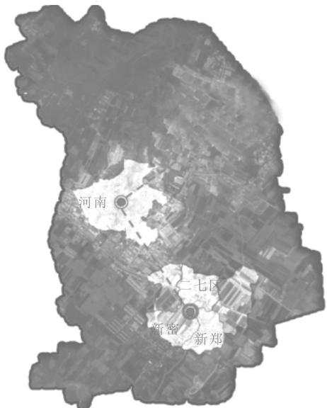  
图 1 研究区区位

文化资源：传统文化根基深厚，以忠孝礼仪为核心的儒家传统思想和传统文化在此得到延续和发扬，形成了村庄平和安宁的氛围。

建筑资源：民用老房屋建筑群聚，外观历史韵味浓厚，大部分可经过修缮用于旅游业生产。采矿遗留建筑零星散落，煤矿运输场临路而建。场地中心的张氏祠堂具有300年历史，是整个场所的建筑核心。

农业资源：村庄除了煤矿开采外，还保留着大片土地用于农作物生产。小麦，玉米，棉花等作物仍然是当地农业生产的主要经济来源。此外场地周边地区有成片果林种植，但场内果木较少且稀疏，缺乏统一管理。

## 2.5 场地分析

基于前期实地调查结果和场地现状资源的统计，概括出场地现状用地使用情况和植物覆盖度，场地先天绿化面积优良，除现状建筑等硬质用地以外，农田和人工

疏林占据主要面积(图2)。

村落临路呈线状分布，较为集中。现状矿场位置适用于活动广场建设。两条沟壑内植物层次丰富，动物物种较多。

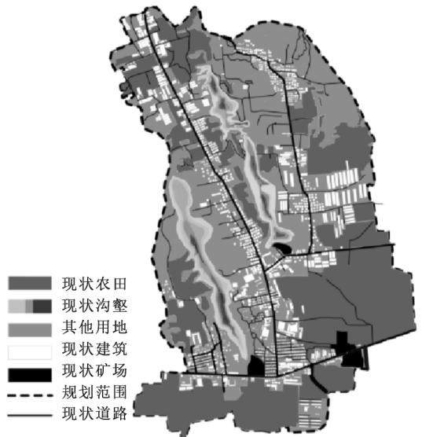  
图 2 现状用地

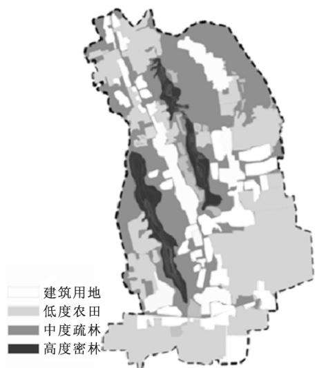  
图 3 物种丰富度

场地生态优良区域中的沟壑物种丰富度较高，且因为雨水汇集和天然泉眼致使沟内常年存有积水，可考虑改造成湿地系统。弥补该区域对人类活动较为敏感的短板。现状农田大面积保留用于农作物生产，部分农田改种油菜花一类的景观花田。人工疏林改造优化后用于造景游览(图3)。

环境影响度主要是周边居民对于两条沟壑的人为干扰，生态环境高敏感度的区域对其高度保护，轻度开发使其自然发展，加快自我调节。生态环境低敏感度的区域用于高度造景开发，通过人为干预加快调节。适宜中度开发区域用于增设农业旅游项目，加强场地经济结构(图4、5)。

## 3 新密张沟村改造设计方案

## 3.1 设计思路

针对张沟村现状和现存问题解决办法，以场地前期分析结果为设计基础，以充分利用场地现有资源为前提，对张沟村进行改造设计。设计思路主要从4个方向出发：对生态环境进行人工修复，自然保育；对人文进行继承和发展；对建筑进行修复保留，经济生产；对农业进行管理调整，发展观光农业。整个场地本着低影响开发的原则，以改造修复，调整优化为主，对现状做最大限度的保留，避免大面积工程施工，破坏村庄原有风貌。

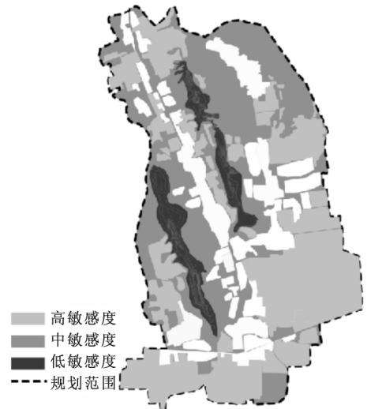  
图4 生态环境敏感度

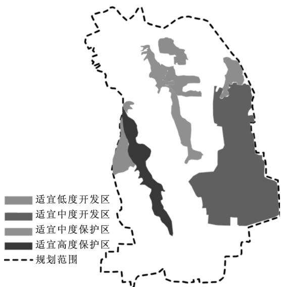  
图 5 适宜开发度

## 3.2 场地规划设计

改造方案中的道路设计主要以原有道路为一级道路，减少对村庄原有布局的破坏。围绕改造的不同区域设置二级三级道路，满足游人游览出行(图6）。

依据前期场地分析对张沟村规划出九大区域，各个区域功能明确又相互联系，为总体平面设计划分方向。规划农田区，体验开发区和生态开发区满足经济生产，规划村落区满足人们居住的同时可投入商业生产。景观农田区和重点保护区满足生态需求和造景需要(图7)。

## 3.3 总体设计

张沟村总体改造设计主要从4个方面开展。

自然资源上，通过采用植物造景对沟壑进行生态修复和景观营造，沟壑中的原有溪流和泉水进行湿地开发，建立湿地景观系统，加快生态修复，林业资源整合，

配以置石重构景观。

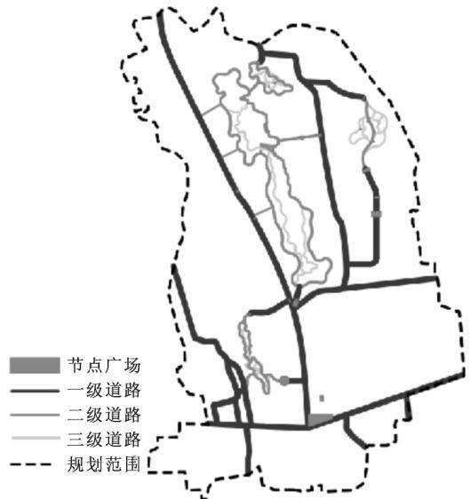  
图6 道路设计

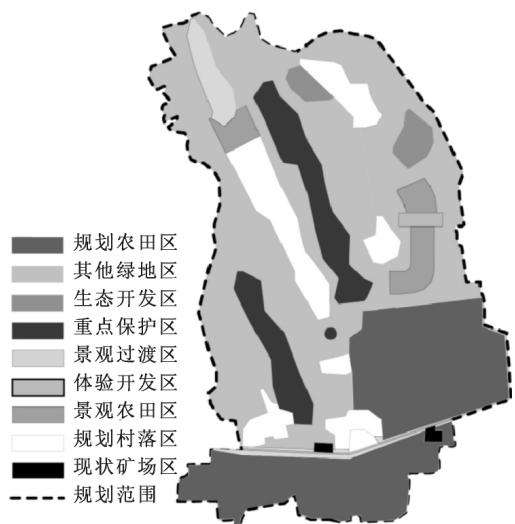  
图 7 区域规划

人文资源进行保留和发展，旅游旺季时期，可于广场举办灯火展，风俗文化展示等文娱活动，发扬文化，宣讲历史，打造当地特色文化名片。

建筑资源上，原有村落保留改造，祠堂古建修缮保护，道路系统升级。矿场改造成纪念广场用于举办活动。采矿时期塔楼修缮加固，改造成观景塔楼。其他采矿遗留设施进行改造美化，移至场地各处用作景观小品。升级改造原有居民建筑内外环境，为当地居民提供一个舒适，整洁的居住环境和经商场所。

农业资源中，原有农耕土地大部分保留生产，作为第二产业来应对旅游淡季。个别面积较小或较分散的农耕土地改造成花田，营造景观的同时也可对作物进行加工销售。原有果林统一管理，设立采摘区，供游客观光采摘(图8)。

## 3.4 核心景观设计

核心景观区域位于场地中东部地区，是场地原有的两条沟壑之一，因其受人类活动影响度较高，所以作为主要景观改造的核心区域。通过人为干预能够加快其生态修复。核心景观东部水量较大，改造成湿地系统。西部地势较低，水量较小，所以主要采用植物造景营造低谷景观。

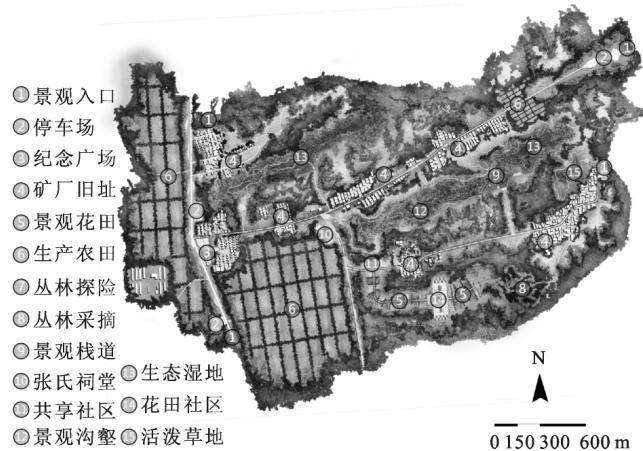  
图8 总平面

区域南部沿地形走势建造木栈道，栈道结合挑台用于游人游览观赏。区域内部有三处采煤时期遗留的瞭望塔，塔身完好，经过修缮之后作为登高观景塔。栈道内外两侧建有小广场，用于游人休憩，集散。栈道中部地势平坦处建造特色种植广场，加强景观效果。

区域北部以大小游步道依沟壑形状而建，环绕沟壑与栈道相连接，形成一个包围场地的完整环路(图9)。

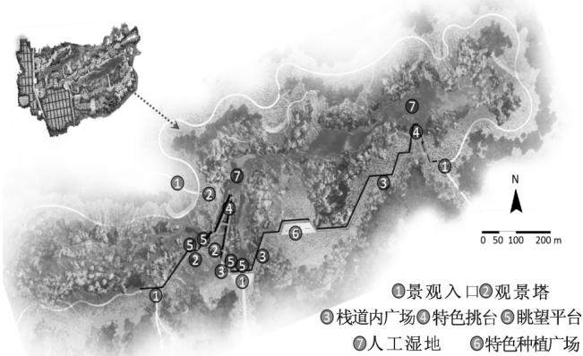  
图9 核心景观平面

核心景观中的木栈道基本串联所有节点景观，瞭望塔，内外广场，眺望台，特色挑台都是沿栈道依次建造，随着路线行进，逐渐看到全貌。考虑到地形原因给施工带来的困难和外伸挑台的布置，所以栈道采用折线型布置。观景平台和挑台是全园最佳观景点，视线开阔不受限制。可俯瞰沟壑景观，或眺望远方。核心景观区域除设置木栈道和改造景观塔之外，地形基本保持原貌，未做太大改动，避免大量土方施工带来的环境危害，同时也能减少支出成本。

由于地形原因，右侧栈道处的植物景观与观景塔形成对景，塔可观景也可做景。观景塔视线最佳，俯视角度不同景色也不同，还可平视窥看全园(图10)。

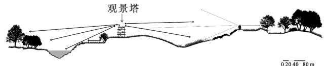  
图10 观景塔竖向视线分析

核心景观中，春夏季，沟壑汇集，水位上涨。春季踏青可满足人们亲水习性，开启发现之旅。沟壑两侧地势较低，两旁绿树成荫，场地形成小气候，夏季避暑游览，

感受凉意习习(图11)。

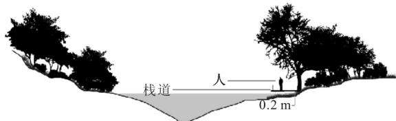  
图11 核心景观中春夏季人与环境关系

秋冬季节，水位下浅，水面离栈道较远，部分树木枝叶舒朗，秋风萧瑟，观树木萧条之美，营造清冷的意境(图12)。

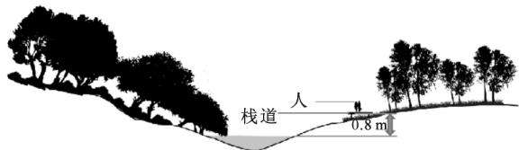  
图12 核心景观中秋冬季人与环境关系

## 3.5 种植设计

本地乡土树种虽然丰富，但是对于造景而言还不完善，本次设计提出乡土树种景观化并引进特色树种进行植物造景。但是造景设计中要考虑下、中、高层植物丰富景观特色，增加层次感。

植物种植设计中采用春、夏、秋、冬各季节观赏树木，营造四季有景、三季有花的特点[5]。避免因为季节更替导致没有可供观赏的景观植物。

造景选用树种应便于管理、能够体现乡野特色。上层植物主要以秋色叶树种为主营造秋天景观；中层树种主要以花树为主烘托春季及秋季景观；下层树木以粗放草花地被为主，体现乡野特色[6]。植物混植过程中要考虑习性，避免植物之间互相产生不良影响。

除造景需要之外还需要考虑引进浆果类、蜜源类、坚果类植物以吸引动物栖息，推动建立更加完善的生态系统。引进净化水质类植物，处理水体污染，便于后期的管理和养护。

## 4 结语

新密市张沟村矿坑废弃地生态景观改造项目是在总体把握项目现状及历史文化的背景下，借助设计美学、生态学等理论，为修复当地被破坏的生态环境，推动当地经济发展提供改造意见和建议。因地制宜的改造当地景观为当地乡民和游人提供休憩，游乐场所。

通过张沟村废弃矿区的景观再设计，生态意义上，可提高当地土壤的自身修复能力，利于该地生态系统的可持续发展，利于实现当地生态物种之间的循环流动性[7]。经济意义上，能有效提高资源利用率。合理发展新型产业，缓解因矿业遗产对该区域经济造成的负面影响，促进“绿色经济”发展。社会意义上，为当地人群提供户外活动场所，增加公共绿地面积，缓解城市绿地使用压力。文化意义上，矿区的改造保留，对于人们了解工业历史、传承当地文化、思考人与自然等方面有积极的作用。

## 参考文献：

[1]郭云帅. 煤矿废弃地环境重建与生态恢复[D].开封：河南大学,2017.

[2]毛旭阁.采煤废弃地景观再生与生态重建技术研究[J]. 煤炭工程，2018,50(7):111\~114.

3]荣琴.浅议煤矿利用矿山遗迹开发旅游项目的思考：煤矿废弃地景观重塑与工业遗产再利用[J].智能城市，2019，5(20)：129\~130.

4]姚 婷．论采矿权的法律性质及合法煤矿企业的权益保护从广东梅州关停全部煤矿引发的思考[C]//中国法学会环境资源法学研究会.资源节约型、环境友好型社会建设与环境资源法的热点问题研究2006年全国环境资源法学研讨会论文集(二).北京：中国法学会环境资源法学研究会，2006：276～280.

[5]孙芳芳.园林植物配置与植物造景分析[J].现代园艺，2020(6)：68\~69.

[6]黄春华，文卉，向苏娜.新乡土主义视野下新城镇景观设计研究：以湖南省茶县八旦村为例[J].美与时代(城市版)，2017(6)：6～7.

[7]李东咛. 生态学视角下矿业废弃地再生研究[D].北京：北京林业大学，2015.

# Ecological Landscape Renovation Design of Mine Abandoned Land Based on Low Impact Development

-Taking Zhanggou Village of Xinmi City as an Example

Fu Manyi

(Forestry College , Xinyang Agriculture and Forestry University , Xinyang, Henan 464000, China)

Abstract: Due to the increase in ecological protection in recent years, most of the coal pits that were once of great help to urban construction have been abandoned due to the cessation of mining. How to restore the ecological environ ment of abandoned pits has become a topic which is worthy of consideration. In this paper, the transformation of the abandoned mine pit in Zhanggou village of Xinmi city was taken as an example. Through the research and analysis of the existing resources and the industrial legacy of the site, ecological restoration is the main direction and landscape creation is the main method in the design of the project. The design is based on the four aspects of nature, architec ture, humanities and agriculture, to preserve the original topography and landform while transforming the existing resources to provide a green, long—term transformation plan and development path for the development of Zhanggou Village.

Key words: mine wasteland; villages; ecological restoration