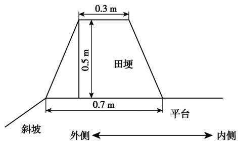
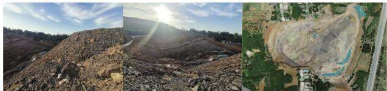
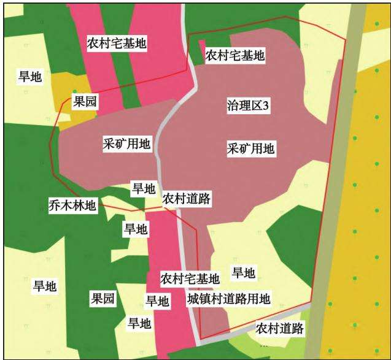
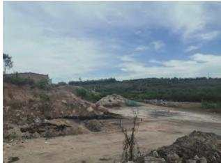
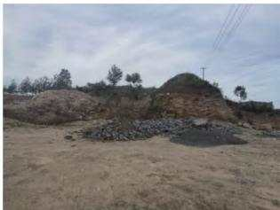
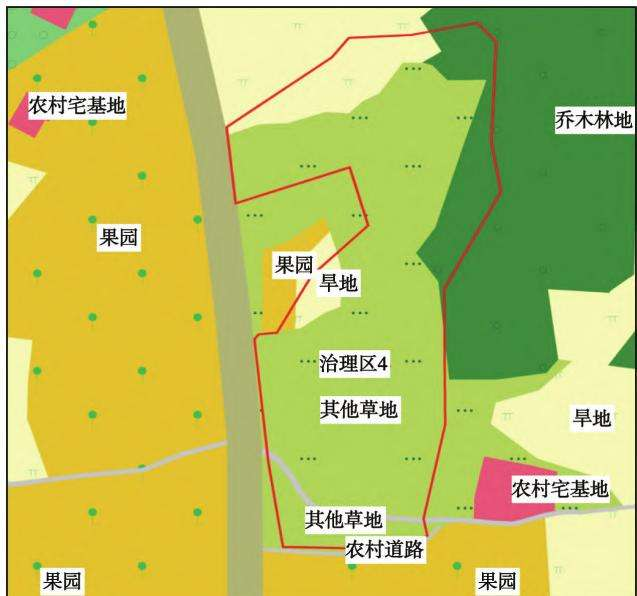

# 黄河流域新安县段历史遗留矿山生态修复技术研究

乔西鼎，禹志加 (河南省资源环境调查二院，河南洛阳 471023)

摘要：为了最大限度地改善黄河流域生态环境质量，降低区域矿山地质灾害的发生，保障区域生态安全，研究了黄河流域新安县段历史遗留矿山生态修复技术，研究区共分为7个治理大区，69个治理区，以矿种为类型分为铝土矿类和灰岩矿类，将铝土矿采坑(采场)和灰岩矿采坑(采场)治理工程进行统一部署。生态修复分项工程主要有挖填方工程、覆土及平整工程、田埂工程、土壤改良工程、拆除工程、绿化工程、养护工程和监测工程。其修复设计以南李村镇治理区为例，研究了主要地质环境问题、土地利用现状以及生态修复工作量。研究使治理区生态环境得到根本改变，实现了生态效益改善与地方经济发展的有效统一。

关键词：黄河流域；历史遗留矿山；生态修复；修复技术

中图分类号：TD167;X141

文献标志码：A

文章编号:1003-0506(2023)01-0096-08

# Research on ecological restoration technology of historical mines in Xin'an County section of Yellow River Basin

Qiao Xiding, Yu Zhijia

(The Second Institute of Henan Provincial Resources and Environment Survey,Luoyang 471023 , China)

Abstract: In order to improve the ecological environment quality of the Yellow River basin to the greatest extent , reduce the occurrence of regional mine geological disasters , and ensure regional ecological security , the ecological restoration technology of mines left over from history in Xin'an County section of the Yellow River basin has been studied. The research area is divided into 7 major control areas and 69 control areas, which are divided into bauxite and limestone based on the types of minerals. The treatment works of bauxite pit (stope) and limestone pit (stope) shall be uniformly deployed. The sub-projects of ecological restoration mainly include excavation and filling works , soil covering and leveling works , ridge works , soil improvement works, demolition works, greening works , maintenance works and monitoring works. The restoration design takes the Nanli village town governance area as an example to study the main geological environment problems ,land use status and ecological restoration workload. The research has fundamentally changed the ecological environment of the treated area , and realized the effective integration of ecological benefit improvement and local economic development.

Keywords: Yellow River basin; mines left over from history; ecological restoration;repair technology

2019年9月18日上午，习近平总书记在郑州召开的黄河流域生态保护和高质量发展座谈会上强调“治理黄河，重在保护，要在治理”。要坚持山水林田湖草综合治理、系统治理、源头治理，统筹推进各项工作，加强协同配合，推动黄河流域高质量发展[1-5]。新安县为加快推进沿黄河生态环境恢复治理工作，拟通过地质环境治理、生态修复治理等综合手段，按照“宜耕则耕、宜林则林、宜草则草、宜景则景”等原则，对辖区内69处历史遗留工矿废弃地露天矿山开展矿山生态环境修复绿化工作，最大限度减少裸露地面，增加绿化面积，使治理区生态环境得到根本改变，实现生态效益改善与地方经济发展的

有效统一[6-10]。

## 1 工程概况

洛阳市新安县沿黄河生态综合治理项目拟实施69处历史遗留的露天矿山环境综合整治工程，主要分布于新安县南李村镇(7处)、铁门镇(11处)、正村镇(2处)、青要山镇(1处)、石寺镇(6处)、北冶镇(32处)、石井镇(10处)7个乡镇。根据69处历史遗留露天矿山的分布情况，划分为南李村镇治理区、铁门镇治理区、正村镇治理区、青要山镇治理区、石寺镇治理区、北冶镇治理区、石井镇治理区，各镇矿区面积分别为22.55、85.91、4.47、4.68、21.95、194.47、135.43 hm²,共计 469.46 hm²。

通过实际调查，确定本次洛阳市新安县沿黄河生态综合治理项目面积为541hm²；确定治理区存在主要生态环境问题是地形地貌景观破坏、土地资源破坏和矿山地质灾害等。通过实际调查，治理区内存在崩塌隐患点13处，1处地质灾害危险性中等，其余地质灾害危险性小;形成69个露天采矿区域，形成十几个大小不等、高低不平的采坑，对地形地貌景观破坏严重，损毁土地541hm²。土地损毁方式为挖损和压占，损毁程度为重度，植被破坏严重、山体裸露、水土流失严重。南李村镇治理区位置地形测绘调查工作量统计见表1。

表1 南李村镇治理区位置地形测绘调查工作量  
Tab.1 Workload of topographic surveying and mapping survey in Nanli village and town governance area hm
<table><tr><td>治理区</td><td>矿山名称</td><td>矿区面积测绘面积</td><td>治理区面积</td></tr><tr><td>治理区1</td><td>懈寺村废弃铝土矿</td><td>1.79 10</td><td>3.04</td></tr><tr><td>治理区2</td><td>郁山村废弃灰岩矿</td><td>2.56 10</td><td>3.12</td></tr><tr><td>治理区3</td><td>郁山村废弃铝土矿</td><td>5.98 11</td><td>6.43</td></tr><tr><td>治理区4</td><td>郁山村废弃渣堆01</td><td>1.50 10</td><td>2.23</td></tr><tr><td>治理区5</td><td>青石岭废弃灰岩矿</td><td>4.00 10</td><td>4.62</td></tr><tr><td>治理区6</td><td>青石岭废弃采场</td><td>5.22 13</td><td>6.07</td></tr><tr><td>治理区7</td><td>郁山村废弃矿渣02</td><td>1.50 10</td><td>1.79</td></tr></table>

## 2 生态修复工程设计总体方案

## 2.1 总体部署

根据治理区存在的地质环境问题，结合当地发展规划和现有技术经济条件，按照以自然恢复为主、工程治理为辅的原则，达到恢复植被、消除地质灾害、改善地形地貌景观和修复生态的目的。鉴于69个治理区为露天开采，开采矿种多为铝土矿、建筑石料用灰岩矿、建筑石料用砂岩矿等，本次治理工程总体设计时，首先，以矿种为类型，说明总体治理方案；然后，根据各个治理小区的微地貌特征、土地利用现状、存在的地质环境问题、水土资源条件、区位优势进行治理方案论证和土地适宜性评价，恢复治理区生态环境[11-17]。

本项目共分为7个治理大区，69个治理区，以矿种为类型分为铝土矿类和灰岩矿类，将铝土矿采坑(采场)和灰岩矿采坑(采场)治理工程进行统一部署，总体设计如下。

(1)铝土矿采坑(采场)。在不破坏现有地形地貌景观的前提下，按照以自然恢复为主、工程治理为辅的原则，应确定采场边坡和坡度，确保不能发生崩塌、滑坡地质灾害；其次，根据采坑深度，分台阶放坡，确定台阶间高度，斜坡坡面应考虑坡度和物质成分，如果为废渣堆积的坡面坡角应小于45°，若是岩质边坡的坡面坡角可适量增大;最后，根据因地制宜设计原则，确定各治理区的复垦方向，恢复生态。

(2)灰岩矿采坑(采场)。在不破坏现有的地形地貌景观的前提下，根据以自然恢复为主、工程治理为辅的原则，首先，根据高陡边坡高度、采坑深度、土地利用类型及植物生长情况，确定是否分级开台阶放坡治理；其次，根据治理区是否在“三区两线”附近及可视范围以内，确定治理台阶高度，以“先上而下”治理思路先在坡面整形治理，对台阶和坡面进行生态修复；最后，对采坑底部平台进行综合治理，在不存积水且土源丰富地区优先复垦为耕地，靠近城镇优先复垦为建设用地，积水区域复垦为渔业用地。

## 2.2 生态修复工程分项工程

依据各个治理区的地形地貌条件，洛阳市新安县沿黄河生态综合治理项目布置的生态修复分项工程主要有挖填方工程、覆土及平整工程、田埂工程、土壤改良工程、拆除工程、绿化工程、养护工程和监测工程。

## 2.2.1 挖填方工程

矿山开采后形成高陡岩质边坡，以铝土矿、灰岩等为主，较坚硬、致密，发育多组陡倾节理、裂隙。由于表层风化强烈和开采的震动破坏作用，边坡表层坡面分割为块裂一碎裂状。在雨水淋滤、震动、风化作用等条件下坡体可能失稳，存在崩塌灾害隐患，需采取必要的防护措施。此次挖填方工程设计主要包括3个方面：①对于处于基本稳定或稳定状态的边坡，只需对坡顶或坡面上的悬挂岩块、松动岩石进行清除；对于处于欠稳定状态的边坡，除了对坡顶或坡面上的悬挂岩块、松动岩石进行清除外，还需要对局部突出部分及其他危险部分进行削坡。②边坡整理，使边坡整体平顺。③清理危岩体。对风化强烈、坡面破碎、存在较大安全隐患的边坡及危岩体实施削方工程，清除表层风化破碎岩体、悬空岩体、坡面堆积岩块等，消除崩塌灾害隐患，使坡面尽可能平整、稳定。治理区的岩质边坡，坡度大部分在70°左右，岩壁上较平直，没有台阶无法造穴绿化或小地块绿化。

危岩清理原则：危岩体进行清除，清除后兼顾治理周围的坡面，使坡面平整顺直。运用剖面法对马道及斜坡挖填方进行计算，剖面尽量垂直等高线布置，间距20\~50m，在斜坡拐弯处适当加密。

施工技术要求：(1对于边坡顶部的危岩和陡坎高度不大的，可以采用挖掘机的冲击锤进行清理：②对于边坡顶部基岩风化程度较大，裂隙发育，岩体较破碎，设计采用削坡清理，使用挖掘机、冲击锤施工；③削坡及开挖的石块，大小控制在30 cm以下，以便回填时比较密实，不出现较大的空隙。

## 2.2.2 场地平整及覆土工程

(1)场地平整。该分项设计主要是对治理区内高差不大的区域进行平整工作，为以后的覆土工程及生物工程打下良好基础。施工前，应清理现场，挖除杂填土残留的垃圾等，平整场地，严禁有尖锐突出物，对场地进行初步碾压，每200m检查4处，采用土质或土石混填料，粒径不大于50mm，分层压实，压实度不低于0.95。通过整平工程，使治理区内的地形地貌与周边环境协调。

施工技术要求：①认真熟悉现场的地理位置、工地条件、出入口位置及制定运输路线方案：②本工程规模大、工期短、任务较重，为了便于治理工程的施工管理，加快施工进度，保证工程顺利进行，需对本工程划分不同施工区域，分别组织施工；③施工区域前后各1名专职安全员，中间施工员负责现场安全，通信指挥用步话机联系，前后加强沟通；4施工过程中应安排专人对平台边缘进行实时监测，若发现地面有非正常变形或者位移，立刻停止施工并上报至相关部门采取措施解决问题，问题解决后才能继续施工，确保人员和机械安全；⑤人机不可立体交叉作业，机械作业时，在其回旋半径内不得有人工作业；⑥所有施工人员和驻场管理人员必须落实使用安全帽、安全带、口罩、防尘眼镜、工作鞋、手套、工作服等劳动安全防护用品，不准赤脚进行作业。

(2)覆土工程。该分项设计是在削坡、危岩清理和平台土地平整之后，对各层边坡和平台进行覆土，覆土之后将其复垦为旱地或林地，对恢复成旱地的区域覆土0.8m。为保证林地苗木成活率，对恢复成林地的区域下部覆渣0.3m，石渣粒径不大于50 mm，上部覆土0.5m，恢复成草地的区域覆土0.3m。为保障农作物与树木的成活率，覆土选用外购客土。

施工技术要求：①外购客土要求土壤质地、土壤理化性能指标、土壤无污染且肥力满足复垦需求，取土场位置选择经济合理的运土路线，运距不得超过5km，通过自卸汽车从取土场把土运到现场，在覆土过程中专人监督，保证覆土厚度；②覆土后采用人工对表面进行平整；③覆土过程一定要注意安全，特别是在斜坡上覆土时，因坡度较陡工人在施工中极易发生危险，应采取一定的防护措施，保障工人安全。

## 2.2.3 田埂工程

为防止治理后的各平台、马道及斜坡水土流失，决定在其外侧修筑保水田埂。根据平整区域特征，确定田埂为土质田埂，田埂修筑位置在各层平台、马道及斜坡外侧，充分利用天然降水，田埂横断面结构为等腰梯形(图1),顶宽0.3m,底宽0.7m,高0.5m,每延米工作量0.25 m³。

  
图1 田埂断面示意  
Fig.1 Schematic diagram of ridge section

施工技术要求：①认真熟悉现场的地理位置、工地条件、出入口位置及制定运输路线方案；②为了便于施工管理，加快施工进度，保证工程顺利进行，需对本工程划分不同施工区域，分别组织施工；③田埂修筑过程中，施工完一段应进行复测，发现不合格的地方及时进行整改。

## 2.2.4 土壤改良工程

根据“宜耕则耕，宜林则林，宜草则草”的原则，项目区内挖填平衡后将会产生大量平整的土地，有恢复成耕地的潜力，故在项目区内挖填平衡后选取符合恢复成耕地条件的平台，覆土、翻耕、培肥后可以恢复为旱地。培有机肥 $3 ~ 0 0 0 ~ \mathrm { k g / h m } ^ { 2 }$ O

## 2.2.5 拆除工程

利用0.6m³液压挖掘机对房屋进行机械拆除。在此过程中要注意拆除的顺序，先拆除最次要的受力构件，然后拆除次之受力构件，最后拆除主要受力构件。拆除顺序是房屋顶板→屋架或梁→承重砖墙或柱→基础，如此由上而下，一层一层往下拆。拆除建筑物的栏杆、楼梯和楼板等，应该和整体程度相配合，不能先行拆除；禁止数层同时拆除，建筑物的承重支柱和横梁，要等待它所承担的全部结构和荷重拆除后才可以拆除。砖墙拆除不许用推倒或拉倒的方法，而是由上而下拆除，如果必须采用推倒或拉倒的方法，必须有人统一指挥，待人员全部撤离到安全地方才可进行。建筑物完全解体后，用59kW推土机在现场进行建筑垃圾集中堆放，配合1.0m³液压挖掘机进行垃圾装载，装载至5t自卸汽车内进行垃圾清运，建筑垃圾清运到当地排土场。

## 2.2.6 绿化工程

此次绿化工程主要有种植树木、撒播草籽和种植爬藤植物。对治理区恢复为林地的种植树木及播撒草籽，恢复为草地的直接播撒草籽，在斜坡底部种植爬藤植物。恢复为林地的地块，树种选用侧柏或者刺槐，爬藤植物选用爬山虎。在治理区内道路两旁种植行道树，树种选用油松。对植物群落欠发育地块进行补植，补植播撒树籽和草籽。树木栽植后前3天，每天浇水1次，透墒，以保证树木成活。设计林地种植间距 $1 . 5 \mathrm { ~ m ~ } \times 1 . 5 \mathrm { ~ m ~ }$ ,行道树种植间距2m×2 m,坑穴标准为 0.8 m×0.8 m×0.8m。树木土球直径300mm，树木高度1.5m。植草撒播按等面积重复混播，草种选用黑麦草、艾草、白莲蒿、狗尾草等，其为多年生植物，耐阴性普遍较差，但在缺少光照条件下亦可生长，在乔木、灌木成林前可作为良好的地被植物，混种子 $3 0 ~ \mathrm { k g } / \mathrm { h m } ^ { 2 }$ 。斜坡底部种植爬山虎，改善周边生态环境，达到景观修复的目的，爬山虎株距0.5 m,植株长1.2 m 以上，直径2 cm。

## 2.2.7 养护工程

养护期为3年，养护用水为村庄的井水或周边河流用水。种植后第1个月，前3天每天浇水1次，第4—9天每3天浇水1次，第10—30天每10天浇水1次，共7次，先保证成活。第2—4个月，每20天浇水1次，以后每月浇水1次，共20次。

## 2.2.8 标志碑工程

标志碑根据自然资源厅规范要求制作。标志牌由碑体与基座组成，其中基座由混凝土预制而成，长2.10 m,宽0.8m,高0.6m;碑体由整块灰岩石板或钢筋混凝土板刻制而成，长1.6m，厚0.30m，高1.40m。基座埋设于地面以下0.3m，基座上部预制碑体镶嵌槽,槽长1.62m,宽0.32m,深0.2m。

## 2.2.9 监测工程

监测对象为治理后的挖填平衡区域，坡面、植被。监测内容为地形地貌、地质灾害隐患、植被健康状况、种植密度、高度、成活率、生长量等。设置监测点，在项目区内按采坑分布监测点。监测方法为定时检查法，采用观察、工具测量、统计等方法。监测频率为每2个月1次，暴雨或者雨季时增加监测频率，6—9月15天1次。监测期限为治理工作开始后的2年内。

## 2.2.10 警示工程

设计对地质灾害隐患点设置安全警示标志和生态保护宣传警示牌，提高附近活动人员安全防护意识，防止人畜跌落、边坡落石伤人，提高居民生态环境保护意识。

## 2.3 修复工程实施后土地利用变化情况

本研究共下发治理矿区69个，面积469.46hm²，根据现场实际破坏情况确定了本研究治理面积 541 hm²,恢复旱地 156.24 hm²,恢复林地 156.98hm²,恢复草地 $1 9 8 . 2 1 ~ \mathrm { h m } ^ { 2 }$ 。其中，新增旱地93.59hm²,新增林地 $3 2 . 6 8 ~ \mathrm { h m } ^ { 2 }$ ,新增草地 $1 4 9 . 2 7 ~ \mathrm { h m } ^ { 2 }$ ,修复工程实施后土地利用变化情况见表2。

## 3 生态修复设计

本文以南李村镇治理区(治理区3和治理区4)为例，研究了其生态修复设计，南李村镇治理区共包含7个治理分区，分别为治理区1至治理区7,治理区面积共 $2 7 . 3 0 \ \mathrm { h m } ^ { 2 }$ 。主要为黏土矿和砂岩矿露天开采区，治理区内有大量的废弃渣堆、露天采场，露天采坑挖损破坏土地资源，严重影响地形地貌景观。其中治理区1、治理区3为铝土矿，治理区2、治理区5为灰岩矿，治理区4、治理区6、治理区7为废弃渣堆。本次生态工程修复设计主要针对土地资源、地形地貌景观进行修复。对地质灾害进行治理和预防，对地貌景观进行修整，对土地功能进行恢复，从而达到治理目的。

表2 生态修复前后土地利用变化情况统计  
Tab. 2 Statistics of land use change before and after ecological restoration $\mathrm { h m } ^ { 2 }$
<table><tr><td>地类</td><td>损毁面积</td><td>治理后面积</td><td>变化面积</td></tr><tr><td>旱地</td><td>62.65</td><td>156.24</td><td>+93.59</td></tr><tr><td>园地</td><td>17.22</td><td>2.44</td><td>-14.78</td></tr><tr><td>工业用地</td><td>2.03</td><td>0.04</td><td>-1.99</td></tr><tr><td>有林地</td><td>100.52</td><td>147.41</td><td>+46.89</td></tr><tr><td>灌木林地</td><td>21.28</td><td>0.67</td><td>-20.61</td></tr><tr><td>其他林地</td><td>2.51</td><td>8.90</td><td>+6.39</td></tr><tr><td>草地</td><td>48.94</td><td>198.21</td><td>+149.27</td></tr><tr><td>采矿用地</td><td>257.31</td><td>0.66</td><td>-256.65</td></tr><tr><td>道路</td><td>3.16</td><td>20.26</td><td>+17.10</td></tr><tr><td>农村宅基地</td><td>2.48</td><td>0.62</td><td>-1.86</td></tr><tr><td>公路用地</td><td>2.35</td><td>0.00</td><td>-2.35</td></tr><tr><td>坑塘水面</td><td>2.50</td><td>0.00</td><td>-2.50</td></tr><tr><td>裸土地</td><td>8.99</td><td>0.00</td><td>-8.99</td></tr><tr><td>交通服务场站用地</td><td>0.19</td><td>0.00</td><td>-0.19</td></tr><tr><td>设施农用地</td><td>0.05</td><td>0.00</td><td>-0.05</td></tr><tr><td>河流水面</td><td>8.82</td><td>5.55</td><td>-3.27</td></tr><tr><td>总计</td><td>541.00</td><td>541.00</td><td></td></tr></table>

## 3.1 治理区3

## 3.1.1 主要地质环境问题

治理区3位于南李村郁山村火石沟组，经现场勘查，该治理区为露天开采的铝土矿，治理区面积$6 . 4 3 \ \mathrm { h m } ^ { 2 }$ ,共有1个采坑，整体呈垂直状分布，北部堆积有渣堆，边坡整体裂隙不发育、风化较轻，采坑底部裸露严重，没有植被覆盖。露天采坑四周形成高陡边坡，并破坏了原有土地利用类型。采坑四周有大量堆积的废渣，影响其周围的地貌景观。治理区3内共有1个露天开采铝土矿形成的采坑，露天开采挖损土地资源，使原始植被遭到破坏，基岩裸露，与周围原始地形地貌景观格格不入，严重破坏地形地貌景观，如图2所示。

  
(a) 位置1  
(b) 位置2  
(c) 位置3  
图2 治理区3主要地质环境问题  
Fig. 2 Main geological and environmental problems in No.3 treatment area

## 3.1.2 土地利用现状

治理区3土地利用现状如图3所示。

  
图3 治理区3土地利用现状  
Fig. 3 Current status of land use in governance area 3

现状条件下，南李村治理区3破坏地类主要为采矿用地。根据调查统计，治理区实际破坏各类土地面积合计 $6 . 4 5 \ \mathrm { h m } ^ { 2 }$ ,详见表3。

表3 治理区3土地利用现状与恢复土地类型统计对比  
Tab. 3 Statistical comparison of land use status and restoration land types in governance area 3 $\mathrm { h m } ^ { 2 }$
<table><tr><td rowspan="2">破坏 面积</td><td rowspan="2">治理后 面积</td><td rowspan="2">情况</td><td colspan="8">地类</td></tr><tr><td>旱地</td><td>乔木林地</td><td>采矿用地</td><td>农村道路</td><td>农村宅基地</td><td>果园</td><td>城镇道路用地</td><td>草地</td></tr><tr><td rowspan="3">6.45</td><td rowspan="3">6.45</td><td>破坏</td><td>1.56</td><td>0.55</td><td>3.82</td><td>0.05</td><td>0.56</td><td>0.18</td><td>0.03</td><td>0</td></tr><tr><td>恢复</td><td>1.31</td><td>2.98</td><td>0</td><td>0.22</td><td>0</td><td>0</td><td>0</td><td>1.94</td></tr><tr><td>新增</td><td>-0.15</td><td>+1.45</td><td>-3.82</td><td>+0.17</td><td>-0.56</td><td>-0.18</td><td>-0.03</td><td>+1.94</td></tr></table>

## 3.2 治理区4

## 3.2.1 主要地质环境问题

经现场勘查，治理区4位于南李村镇郁山村，为废弃渣堆，现已废弃，治理区面积 $2 . 2 3 \ \mathrm { h m } ^ { 2 }$ ,场地内整体平整，有5\~15m呈 $7 0 ^ { \circ } \sim 8 0 ^ { \circ }$ 黄土边坡，边坡稳定性好。该治理分区存在的主要地质环境问题有：

地形地貌景观破坏和土地资源挖损。根据调查结果将治理区内存在的各类地质环境问题分述如下：①1采矿活动形成的边坡，落差大，植被损毁，破坏了原有的地形地貌；②由于露天开采，植被和表层土层完全剥离，破坏了原有土地。治理区4主要地质环境问题如图4所示。

  
(a) 位置1

  
(b) 位置2  
图4 治理区4 主要地质环境问题  
Fig. 4 Main geological and environmental problems in No.4 treatment area

## 3.2.2 土地利用现状

治理区4土地利用现状如图5所示。

  
图 5 治理区4 土地利用现状  
Fig. 5 Current status of land use in governance area 4

现状条件下，南李村治理区4破坏地类主要为其他草地。根据调查统计，治理区实际破坏各类土地面积合计2.23 hm²,详见表4。

表4 治理区4土地利用现状与恢复土地类型统计对比  
Tab. 4 Statistical comparison of land use status and restoration land types in governance area 4 hm²
<table><tr><td colspan="4">破坏 治理后 情况 面积面积</td><td colspan="4">地类</td></tr><tr><td rowspan="3"></td><td rowspan="3"></td><td>旱地</td><td>乔木林地</td><td>其他草地</td><td>农村道路</td><td>果园</td></tr><tr><td>破坏 0.25</td><td>0.25</td><td>1.69</td><td>0.03</td><td>0.01</td></tr><tr><td>2.23 2.23 恢复 0</td><td>1.80</td><td>0.40</td><td>0.03</td><td>0</td></tr><tr><td></td><td>新增</td><td>-0.25</td><td>+1.55</td><td>-1.29</td><td>0</td><td>-0.01</td></tr></table>

## 4 效益分析

研究区位于洛阳市新安县境内，区内人口密集，工业、农业、矿业、文化、旅游等众多产业繁荣发达，特别是改革开放40多年，经济社会均发生了爆发性发展，城镇化进程突飞猛进，产业结构不断升级，成为中原地区人文底蕴深厚、经济发达、市场繁荣、人们社会生活最具活力的地区之一。这一系列的变化，也无不例外地激发了人与自然的剧烈矛盾，生态退化、环境水质恶化、雾霾及地质灾害频发、生命群落遭受严重威胁，环境承载能力弱化。为此，重视生态环境保护，加强生态环境修复，科学处理发展与生态环境保护的关系，成为辖区政府和人民的神圣责任和义务。生态环境是所有地球生命的载体，更是人类命运共同体，与人类物质、精神、文化生活的方方面面息息相关，开展洛阳市新安县沿黄河生态综合治理无疑将产生多方面的效益。

## 4.1 社会效益

生态环境深刻影响人们的社会生活，其保护与修复产生的社会效益是多方面、多层次的，主要表现在：①具有突出的政治价值。生态环境保护工作是党的十九大提出的重大发展目标，是党对我国经济社会进入中国特色社会主义新时代后国家未来发展作出的适时科学把握，是保证国家长治久安、民族兴旺发达、巩固党的执政根基的重要举措。②可极大地满足流域内社会文明进步的需求。生态环境保护与建设是我国建设小康社会的重要内容，是人民群众获得生存权、健康权、幸福权的基本条件，是对我国改革开放40多年以来经济高速发展后带来的负面影响的庄严宣战。生态环境保护与修复将产生巨大的社会效益。

## 4.2 生态效益

(1)构建生态安全屏障，保障区域生态安全。通过实施矿山生态环境治理工程，有效保护森林资源，建设水源涵养林，提高林种结构合理性，丰富林地景观类型，更好发挥森林吸尘、固土、调节气候、涵养水源、维持生物多样性作用，提高森林生态效益。治理项目实施后，可修复被破坏的地形地貌景观，可完成造林156.98 hm²。

根据《森林河南生态建设规划（2018—2027年)》的统计数据，每亩林地涵养水源142.8t，固土2.81 t,减少土壤肥力损失 119 kg，固定二氧化碳281 kg，释放氧气160 kg,增加土壤氮、磷、钾营养物质4.8kg，吸收二氧化硫、氟化物、氮氧化物及滞尘912kg，森林生态服务价值2750元。本项目实施后,可涵养水源 33 6251.16 t,固土6 616.71 t,减少土壤肥力损失280209.30kg，固定二氧化碳661 670.70 kg,释放氧气 376 752.00 kg,增加土壤氮、磷、钾营养物质11302.56kg，吸收二氧化硫、氟化物、氮氧化物及滞尘2147486.40 kg，可以产生6475425.00元的生态服务价值。通过植被绿化、地貌景观恢复，对无主废弃矿山修复整治等，可消除地质灾害隐患，改善矿区地貌景观，减轻对土地及地下水资源破坏，改善矿区及周边生产生活环境。通过工程的实施，可实现无主废弃矿山综合整治和历史遗留矿山地质环境问题治理，明显改善废弃矿区的地质和生态环境，有效消除滑坡崩塌等地质灾害隐患。通过建设水源涵养林和水土保持林，改善地表植被结构，降低地表径流冲刷，减少水土流失，改善土壤肥力，有效提高防治水土流失的能力，抑制扬尘，降低雾霾程度，构筑生态廊道和生态网络，为河南省及至华北平原地区提供生态安全屏障，打开区域生态安全格局，全面提升自然资源承载力和生态系统服务功能，实现自然资源保护与科学发展协调统一。

(2)加强区域生态示范作用，打造综合治理先行区。项目实施将严格贯彻“山水林田湖草是一个生命共同体”生态理念，统筹推进国土开发、保护与治理的新模式，开创打造美丽中国“河南样板”生态治理新局面。构建“以自然修复为主，工程治理为辅”的矿山地质环境恢复和综合治理模式，推进矿山地质环境恢复治理与城市建设、民生保障等产业融合发展。

## 4.3 经济效益

项目恢复旱地 156.24 hm²,小麦按亩产小麦400 kg、每500 g小麦1元算，理论上的总收入应在800.00元左右,物力投入大致在700.00元,纯利润在100.00元。玉米价格每斤大至在1.05元左右。如果按亩产500 kg计算的话，毛收入就是1 050.00元，物力投入大致在440.00元，一亩玉米的纯收入610.00元。一年一亩旱地两茬，小麦早、玉米晚。小麦的纯收入100.00元左右，玉米的纯收入610.00元左右,两茬相加710.00元左右，旱地年纯收入在1663956元左右。项目实施后，可为周边每年提供至少可靠的经济来源1663956元，精准扶贫效果明显。

矿山环境治理项目的实施，增加治理区农民就业岗位，推动了地方经济的发展，得到市政府的高度重视和群众的广泛支持，经济效益显著。总之，该环境综合整治工程的实施是一项利国利民、造福后代的民心工程，综合效益显著。

## 5 结语

研究是一项系统性工程，涉及生态保护、修复治理等，目的在于改善沿黄生态环境，促进城乡振兴和区域协调发展。通过矿山环境修复工程、生物多样性保护以及土地整治与土壤改良工程的实施，将促进产业结构调整，有利于调配经营规模和模式，有效缓解人地关系矛盾，优化区域经济发展结构，达到改善群众生产生活条件、提高居民收入的目的。偏远山区工程的实施，可以带动周边脱贫项目，契合乡村振兴战略的实施。

## 参考文献(References)：

[1] 曲彦明.山西省阳泉市黄河流域历史遗留矿山生态修复技术 分析[J]. 西部资源,2021(6):4-6. Qu Yanming. Analysis on ecological restoration technology of historical mines in the Yellow River Basin , Yangquan City, Shanxi Province[ J]. Western Resources ,2021 (6) :4-6.

[2] 杨帆，秦福锋，冯英明，等.矿山地质环境影响和土地损毁评估 研究[J].能源与环保,2021,43(4):23-29,36. Yang Fan , Qin Fufeng, Feng Yingming, et al. Research on mine geological environmental impact and land damage assessment [ J]. China Energy and Environmental Protection ,2021 ,43 (4) :23-29, 36.

[3] 刘慧芳，王志高，谢金亮，等.历史遗留废弃矿山生态修复与综 合开发利用模式探讨[J]. 有色冶金节能,2021,37(2):4-6， 15. Liu Huifang, Wang Zhigao , Xie Jinliang, et al. Discussion on ecological restoration and comprehensive development and utilization mode of historical abandoned mines[ J]. Energy Saving of Nonferrous Metallurgy ,2021,37(2) :4-6,15.

[4] 韩琳琳，张华，范旭光，等.矿山地质环境治理与土地复垦工程 设计研究[J]. 能源与环保,2021,43(4):30-36. Han Linlin ,Zhang Hua, Fan Xuguang, et al. Study on mine geological environment control and design of land reclamation engineering [J]. China Energy and Environmental Protection, 2021 ,43 (4): 30-36.

[5] 陈亮.基于安阳市矿山生态修复技术研究[J]. 低碳世界，2019,9(7):99-100.Chen Liang. Research on ecological restoration technology of minesin Anyang City[ J]. Low Carbon World ,2019 ,9(7) :99-100.

[6] 董永智，魏勇齐，霍瑜剑.城市建设用地地质环境适宜性评价 [J].能源与环保,2021,43(6):35-39,49. Dong Yongzhi , Wei Yongqi, Huo Yujian. Geological environmental suitability evaluation of urban construction land[ J]. China Energy and Environmental Protection ,2021 ,43 (6) :35-39,49.

[7]冯少华，陈炜，祁冉，等.矿山生态修复方法及工程措施研究 [J].科技创新导报,2016,13(23):26. Feng Shaohua , Chen Wei , Qi Ran , et al. Research on mine ecological restoration methods and engineering measures[ J]. Science and Technology Innovation Herald ,2016,13 (23) :26.

[8] 朱双燕，范旭光，王莹.基于综合判断法的矿山地质环境分区 评价[J].能源与环保,2019,41(5):62-65. Zhu Shuangyan , Fan Xuguang, Wang Ying. Partition evaluation of mine geological environment based on comprehensive judgment method[ J]. China Energy and Environmental Protection ,2019 ,41 (5):62-65.

[9] 刘宏磊，武强，赵海卿，等.矿业城市生态环境正效应资源开发 利用研究[J].能源与环保,2019,41(3):117-121. Liu Honglei , Wu Qiang, Zhao Haiqing, et al. Study on exploitation and utilization of positive effects of ecological and environmental resources in mining city[ J]. China Energy and Environmental Protection ,2019,41 (3) :117-121.

[10]阴静慧，邢茂林.陕北地区矿山地质环境评估方法与防治措施 [J].能源与环保,2019,41(9):48-51. Yin Jinghui, Xing Maolin. Assessment methods and prevention measures of mine geological environment in northern Shaanxi desert[ J]. China Energy and Environmental Protection ,2019 ,41 (9) : 48-51.

[11] 张庆晓，陈阳,张刚.矿山废弃地生态修复技术探究[J].生态 环境与保护,2020,3(5):27-28. Zhang Qingxiao , Chen Yang, Zhang Gang. Research on ecological restoration technology of mine abandoned land[ J]. Ecological Environment and Protection ,2020 ,3 (5) :27-28.

12] 周亚光.玉皇全采石场建筑石料用灰岩矿矿山地质环境治理工程设计[J].能源与环保,2020,42(9):45-49.

Zhou Yaguang. Design of the mine geological environment treatment project for limestone mines used for building stones in Yuhuangquan Quarry [ J]. China Energy and Environmental Protection,2020,42(9) :45-49.

[13]周金余，李平，张贺.黄河流域煤矿生态修复技术研究现状及 展望[J].中国矿业,2021,30(7):8-14. Zhou Jinyu , Li Ping, Zhang He. Research status and prospect of ecological restoration technology of coal mine in the Yellow River Basin[ J]. China Mining Magazine ,2021 ,30(7) :8-14.

[14] 张小连，张文炤，武成周，等.矿山地质环境治理工程技术[J]. 能源与环保,2020,42(10):1-6. Zhang Xiaolian ,Zhang Wenzhao , Wu Chengzhou , et al. Mine geological environment treatment engineering technology [ J]. China Energy and Environmental Protection ,2020 ,42(10) :1-6.

[15] 王迪.研究矿山生态修复工程及技术措施[J].中国金属通报，2020(10):239-240.Wang Di. Research on mine ecological restoration projects andtechnical measures [ J ]. China Metal Bulletin, 2020 (10) : 239-240.

[16] 李会杰，范旭光.矿山遗留废弃地特点及生态环境修复技术研 究[J].工程技术研究,2018(16):37-38. Li Huijie, Fan Xuguang. Research on the characteristics of mine leftover wasteland and ecological environment restoration technology[ J]. Engineering and Technological Research, 2018 (16) :37- 38.

[17] 李轶君.废弃矿山生态修复及再利用实例研究[J].四川建材， 2022,48(1):39-40. Li Yijun. Case study on ecological restoration and reuse of abandoned mine[ J]. Sichuan Building Materials ,2022 ,48(1) :39-40.