# 万安山周边采石场矿山地质环境恢复治理技术

刘鹏，张兴辉 (河南省资源环境调查二院，河南洛阳 471023)

摘要：针对以往矿山开采形成的高陡边坡、采坑及矿渣堆等进行平整、复绿、稳固，通过工程措施及生物措施恢复项目区原生地貌景观，使其与周边原生地质环境相协调、美观，同时消除地质灾害隐患。介绍了万安山周边采石场矿山地质环境条件，分析了主要矿山地质环境问题，针对治理区内地质环境问题，设计的总体思路是对地质灾害进行治理，对地貌景观进行修整，对土地功能进行恢复，主要治理工程为采场整理与覆土工程+排水渠工程+道路工程+生物工程+人文景观工程+取土场工程+标志碑工程。研究对保护该地区自然环境、推进生态文明建设意义重大。

关键词：矿山地质；恢复治理；采场整理；排水渠；生物工程

中图分类号：TD167;X141

文献标志码：A

文章编号:1003-0506(2023)01-0039-06

# Restoration and treatment technology of mine geological environment in quarries around Wan'an Mountain

Liu Peng, Zhang Xinghui (The Second Institute of Henan Provincial Resources and Environment Survey ,Luoyang 471023 , China)

Abstract: For the high and steep slopes , mining pits and slag piles formed in the past mining, it is necessary to level , restore green and stabilize , and restore the original landform landscape of the project area through engineering measures and biological measures , so that it is harmonious and beautiful with the surrounding original geological environment. At the same time , the hidden dangers of geological disasters are eliminated. This paper introduced the mine geological environment conditions of the quarries around Wan'an Mountain, and analyzed the main mine geological environment problems. The overall idea of the design is to control the geological disasters according to the geological environment problems in the treatment area , trim the geomorphic landscape , and restore the land function. The main control works are stope consolidation and earth covering works + drainage works + road works + biological works + human landscape works + borrow pit works + landmark works. The research is of great significance to protecting the natural environment of the region and promoting the construction of ecological civilization.

Keywords: mine geology; restoration and management ; stope finishing; drainage canal ; biological engineering

万安山周边采石场矿山地质环境恢复治理项目位于洛阳市伊川县北部郑少洛高速沿线一带，紧邻洛阳市万安山山顶公园景区，属于三区两线的全省重要景观区和重要交通干线直观可视范围内的废弃露天矿山，治理区内由于以往历史遗留及责任人灭失的露天矿山形成的大量采坑、高陡边坡及矿渣堆无人处理，造成高速公路沿线原生地貌景观严重破坏，高速公路进出洛阳市均能看到项目区内满目疮痍，严重影响洛阳市对外开放的良好形象。为此，本文以万安山周边采石场矿山，研究了该地区的主要矿山地质环境问题以及治理技术。研究有利于社会稳定，社会效益显著。

## 1 地质环境条件

## 1.1 地层岩性

此区处于华北地层区豫西地层分区西部，项目区内出露地层自老至新主要有太古界登封群(Ardn)、中元古界蓟县系汝阳群兵马沟组 $\left( \mathrm { P t } _ { 2 } ^ { 2 } \mathrm { b } \right)$ 、汝阳群云梦山组 $\left( \mathrm { P t } _ { 2 } ^ { 2 } \mathbf { y } \right)$ 、第四系(Q)，由老至新简述如下。

(1)太古界登封群(Ardn)。下部为黑云斜长片麻岩、二云斜长片岩夹角闪斜长片麻岩、角闪片岩。中部为灰绿斜长角闪岩、片麻岩，石榴角闪片岩与黑云斜长片麻岩互层。上部为云母片岩、石榴黑云片岩、云英片岩。大部受混合岩化作用成混合片麻岩、均质混合岩。区内在万安山东段及南侧大面积出露。区域厚2415\~3788m。

(2)汝阳群兵马沟组 $\left( \mathrm { P t } _ { 2 } ^ { 2 } \mathbf { b } \right)$ 。出露于万安山南坡兵马沟一带，下部为紫红色厚层状砾岩、砂砾岩，夹粉砂质页岩，砾石成分复杂，砾径大小不一，砂砾$0 . 2 \sim 5 0 . 0 ~ \mathrm { c m }$ ，不规则排列，磨圆度较好，胶结物主要为铁泥质；上部为暗紫色砂质页岩及粉砂岩互层，夹砂砾岩。该组出露厚约560m，呈角度不整合覆于登封群之上。

(3)汝阳群云梦山组 $\left( \mathrm { P t } _ { 2 } ^ { 2 } \mathbf { y } \right)$ 。底部砾岩层一般厚2\~10m，局部缺失。本组平行不整合于下伏兵马沟组。

(4)第四系(Q)。地层在区内广泛分布，与下伏地层呈不整合接触。岩性底部为近代河床及河漫滩冲积砂砾石、亚砂土，下部为棕红、红色砂质黏土，含较多钙质结核；中上部为浅黄色、褐黄色黄土质砂黏土、亚黏土，含少量钙质结核；顶部为耕植土。

## 1.2 区域地质构造

项目区大地构造位置处在华北板块南缘嵩箕构造区的西部，大致经历了嵩阳、中条、王屋山、晋宁、少林、加里东、海西、印支、燕山、喜马拉雅等构造运动，形成了褶曲、断裂等构造形迹。项目区主要褶曲为嵩山背斜，轴向近东西，核部为太古代地层，太元古代的变质岩系及元古代的花岗岩体。北翼地层保存较完整，据地表出露及钻孔揭露情况，岩层走向近东西，倾向北，倾角平缓 $( 1 0 ^ { \circ } \sim 2 5 ^ { \circ } )$ ，构造简单；南翼因受区域大构造—月湾断层破坏，地层残缺不全，倾角大于 $4 0 ^ { \circ }$ ，局部陡立，构造复杂。北西向断裂一草店断层 $\left( \operatorname { F } _ { 1 } \right)$ 自项目区西侧通过，该断层走向北西，倾向南西，倾角 $7 0 ^ { \circ } \sim 7 5 ^ { \circ }$ ,落差大于2000 m，地表断续出露。

## 1.3 水文地质条件

(1)地表水。治理区内地表水不发育，局部冲沟内仅在雨季有积水。

(2)地下水。根据区域地质资料，地下水埋深较深，在25.0m左右，属孔隙型潜水类型，地下水一般较清澈，无色、无味。地下水位随季节变化较大，受大气降水补给为主，根据洛阳市节水办对地下水位观测资料，地下水位年变幅为2.0\~3.0m。

## 1.4 工程地质条件

根据相邻区域的勘查资料显示，项目区地层有废渣、粉质黏土、碎石及汝阳群云梦山组石英砂岩5层，分述如下。

(1)废渣。主要为矿山开采废渣堆积而成，主要由砂岩碎石及粉质黏土组成，碎石含量20%\~30%,粒径在3\~10 cm，最大达40 cm。成分复杂，厚度变化大且松散，承载力差别较大，厚度0.3\~30.0 m。

(2)粉质黏土 $\big ( \mathrm { Q } _ { 4 } ^ { 2 \mathrm { d l } + \mathrm { p l } } \big )$ 。褐黄色、灰黄色；硬塑状，具少量针状孔隙，有白色菌丝状物质析出，见少量碳屑，夹有较多漂石，漂石最大直径50 cm，该层无摇振反应，切面稍有光泽，干强度中等，韧性中等，层厚7.7\~12.3m。

(3)碎石 $( \mathrm { Q } _ { 4 } ^ { \mathrm { 1 d l + p l } } )$ 。黄褐色、灰黄色；主要为粉质黏土夹碎 $\overline { { \mathcal { G } } } _ { \circ }$ 粉质黏土，可塑—硬塑状，见针虫孔。碎石直径0.3\~0.8cm，最大直径大于50 cm，层厚2.3\~2.6m。

(4)全风化石英砂岩 $\left( \mathrm { P t } _ { 2 } ^ { 2 } \mathbf { y } \right)$ 。紫红色、灰褐色，细粒结构，成分主要为石英、长石等，钙质胶结，产状$1 7 5 ^ { \circ } \angle 2 4 ^ { \circ }$ ,层厚2.2\~2.7m。岩石完整程度为破碎，岩体质量等级为Ⅳ级，单轴饱和抗压强度16.9$\mathrm { M P a }$

(5)中风化石英砂岩(Pt2y)。紫红色、灰褐色，细粒结构，成分主要为石英、长石等，钙质胶结，岩芯长5\~50cm，产状 $1 7 5 ^ { \circ } \angle 2 4 ^ { \circ }$ 。该地段为厚层状石英砂岩夹少量砂质页岩。岩石完整程度为较完整，岩体质量等级为Ⅱ级，单轴饱和抗压强度28.2$\mathrm { M P a }$

## 2 主要矿山地质环境问题分析

## 2.1 矿山开发历史及现状

彭婆镇马山寨、黄瓜山、冯家山一带的石英矿(硅石)早在20世纪70年代就已经零星开采，至1993年已经发展到采点70余处，随处可见石英砂矿的开采、加工、销售、利用。但也因其松散管理、粗放经营，技术原始、质量不稳定等难以取得较高的利润。后经过多次整合、改造，至现在，因多种原因，矿山已关闭。经过数十年的开采，该地区遗留下大量的高耸危岩、废石渣、采石坑等，矿山地质环境遭受到不同程度的破坏。

## 2.2 矿山地质环境问题

黄瓜山一带的石英砂岩采石场，位于赵沟村东侧200 m，郑少洛高速公路以北800 m处，周边多为农田。由于以往露天采石致使山体严重受损，植被严重破坏，在山体南部形成一个南北长120m、东西宽80 m、深约30 m的露天采坑，坑壁陡峭，岩体松散，极易发生崩塌；采坑周边矿渣堆放杂乱，无任何防护措施，雨天极易形成崩塌、滑坡等地质灾害，对当地居民生活、生产造成严重影响(图1)。

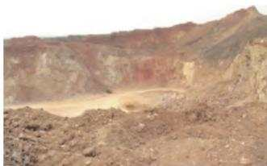  
(a) 采坑

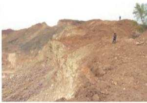  
(b) 矿渣  
图1 主要矿山地质环境问题  
Fig. 1 Major mine geological environment problems

马山寨一冯家山石英砂矿采石场，南距郑少洛高速公路2km，北邻洛阳市万安山山顶公园。以往露天开矿导致矿区内多个山头被挖断，形成了裸露、高耸、近乎直立的高陡边坡，让人望而生怯。高陡边坡自马山寨向南延伸至冯家山，南北向长约1.2km,山体下部矿坑连片，深20 m,东西宽50 m,采坑周围矿渣遍布。该地区的原生地貌、生态环境遭受到严重破坏(图2)，由此可能引发的崩塌、滑坡、泥石流等地质灾害也对周边人民的生命财产安全造成严重威胁。

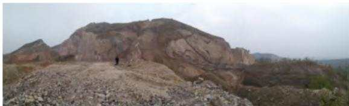  
图2 马山寨采石场现状  
Fig. 2 Status quo of Mashanzhai Quarry

## 3 治理技术

针对治理区内地质环境问题，总体设计思路是对地质灾害进行治理，对地貌景观进行修整，对土地

功能进行恢复。本次设计的治理工程主要为：采场整理与覆土工程+排水渠工程+道路工程+生物工程+人文景观工程+取土场工程+标志碑工程[1-5]。

## 3.1 采场整理与覆土工程

场地整治工程采用土石方挖填平衡整理方法，土石挖、填方计算利用MapGIS成图系统软件，采用计算机绘制地形底图，DTM法地形底图分析，方格网法土石方计算附场地设计断面图，辅以手工计算。针对各个采坑场地特点分别设计不同的方法进行场地整治[6-8]。

(1)K01采坑场地分台阶整治。整治成南北台阶状5级平台，最南部一级平台设计高程+385m，目前高程为+375\~+392m,以填方为主，填方土石方来源于采坑西侧堆放的废渣堆和其他台阶的挖方。第二级台阶平台位于一级平台的北部，设计高程 +395 m，目前高程 +386\~+402 m,以填方为主。第三级台阶位于一级和二级平台的北部，设计高程+405 m，目前高程 + 387\~ +412 m,以填方为主。第四级台阶位于三级平台的北部，设计高程+435m，目前高程+416\~+446m,以填方为主。第五级台阶位于四级平台的北部，设计高程+455m，目前高程+452\~+476m，以填方为主。整体以填方为主，土石方来源于采坑西侧堆放的废渣堆及所设定的取土场。台阶前缘的处理，填方时采用1:1进行放坡。

(2)K03采坑场地整治。以矿山采场平台平均高程为基准削高填低，倾向、坡降尽量与自然坡面一致，坡比0.5%\~7.5%，弃渣废石主要推向废弃采坑及缓坡低洼处。

(3)K08采坑场地整治。该处采坑开挖较深，通过计算设计回填高程为+370m，土石方来源于采坑周边堆放的废渣堆及所设定的取土场。Z01、Z02废渣堆清理至高程 +405 m,Z03、Z04废渣堆清理至高程 +395 m,Z05、Z06、Z07废渣堆清理至高程+385 m,Z09 废渣堆清理至高程 + 328 m,Z10 废渣堆清理至高程+350 m,Z11废渣堆清理至高程+376 m,Z12、Z13 废渣堆清理至高程 +360 m,清理出来的废渣全部推向废弃采坑。由于整治后的场地多为碎石，不利于植物生长，需对场地进行覆土，其中K02、K04、K05、K06、K07采场位于山坡或山顶处，此次设计对其进行平整后直接覆土，全部的废渣堆清理完成后全部覆土，一般覆土厚度为0.5m，土质为适宜植物生长所需理化性能的自然界中的土壤，含砂量不大于5%。土源可从治理区内采取，取土工作应注重保护生态环境，不可以形成新的生态环境问题。

## 3.2 排水渠工程

排水渠布置：为了减少雨水对回填土的冲刷，造成水土流失，设计在每阶平台内侧坡脚处修建排水渠[9-10]。根据边坡形态，排水渠采用直角矩形断面，具体尺寸见表1.材料采用M7.5水泥砂浆砌筑MU30片石，并采用M7.5水泥砂浆抹面厚2.0 cm。砌筑石料尺寸不小于20 cm，选用质地坚硬不易风化的岩石，砂选用洁净天然中砂，砂的最大粒径不应超过5mm。修筑排水渠时，应注意其顶面应和回填土高度一致，底面纵向坡度不小于2%o。另外，为避免雨水在矿区汇集，排水沟在边坡两端依据地形汇合，形成一个排水系统，利于坡体的水流及时排出。设计工程量见表2。

表1 排水渠尺寸  
Tab.1 Drain size
<table><tr><td rowspan="2">名称</td><td colspan="5">水渠断面尺寸/m</td></tr><tr><td>断面顶宽 (净宽)</td><td>断面 (净宽)</td><td>断面高度 (净高)</td><td>边墙 厚度</td><td>底板 厚度</td></tr><tr><td>平台排水沟</td><td>0.90</td><td>0.90</td><td>0.85</td><td>0.30</td><td>0.15</td></tr></table>

表2 排水沟工程量计算  
Tab. 2 Drainage quantity calculation
<table><tr><td>名称</td><td>工程量</td></tr><tr><td>长度/m</td><td>816</td></tr><tr><td>浆砌石/m³</td><td>526.32</td></tr></table>

## 3.3 道路工程

## 3.3.1 建设标准

农村干、支道相当于国家四级公路，因此施工道路建设标准上参照国家四级公路要求，实施时不超过国家四级公路标准，路面为低级路面。主要用于后期的护林工作。

## 3.3.2 路面设计

(1)路面宽度。根据调查资料，施工机械通行宽度一般为2.5\~3.0m，所以选择施工道路路面宽度为4m。

(2)路面平整度。施工道路为低级路面，路面平整度要求较低，一般不大于3cm。

(3)路面结构与材质。①施工道路面结构由面层、基层、底基层组成，如图3所示。②根据实际情况选用碎石路面，面层为厚40mm的砂砾层，基层为厚160 mm的泥结碎石层，底基层为厚500 mm的废渣压实层，压实系数0.95，路基开挖至设计标高后，采用原碎石进行回填压实，碎石粒径要进行分选，碎石粒径不能大于50mm，分层回填压实。

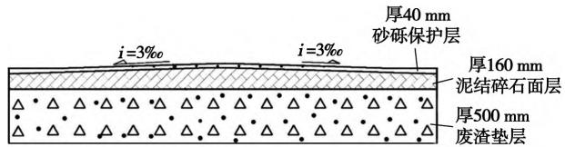  
图3 简易道路结构  
Fig. 3 Simple road structure

## 3.3.3 施工道路材质要求

泥结碎石中的碎砾石为轧制碎石、轧制砾石，石料等级不宜低于3级，碎石的最大粒径不大于40mm(以上为方孔筛);级配碎砾石组成按现行柔性路面设计规范中级配碎石的级配碎石的级配组确定，且须严格控制粒径0.5mm 以下的细料的含量与塑性指数，二者乘积应不大于 $1 2 0 { \ ; }$ 土的塑性指数以10\~12(76g平衡锥测定)为宜，用土量不大于混合料总量的15%。路基标高允许偏差 +10、-20mm,表面平整度允许偏差 ± 20 mm,宽度-10 cm 以上，横坡允许偏差±5%，压实系数≥0.95,分层厚度每50m测1处。

## 3.3.4 通行标准

设计道路宽度4m，日平均交通流量不超过20次，通行车辆为普通农用车，载重量2.5t以下，选择泥结碎石结构，设计泥结碎石面层厚度160mm、砂砾层40 mm。

## 3.3.5 工作量

治理区设计道路1条，长度816m，主要工作量见表3。

表3 道路工程主要工作量  
Tab. 3 Main workload of road engineering
<table><tr><td>项目</td><td>长度/ m</td><td>废渣垫层/ m3</td><td>碎石基层/ m³</td><td>路床压实/ m2</td><td>碎石路基/ m2</td></tr><tr><td>每延米量</td><td></td><td>2.00</td><td>0.64</td><td>4.00</td><td>4.00</td></tr><tr><td>工程量</td><td>816</td><td>1 632</td><td>522.24</td><td>3 264</td><td>3 264</td></tr></table>

## 3.4 生物工程

生物措施主要起到覆盖地表、绿化边坡、控制水土流失、改善矿区生态环境等作用。本次工作生物措施选择的总体原则是以适应当地生长的观赏树种和经济林，达到美化环境和增加经济收入的目的。

植物种类及规格：女贞树(胸径8cm）、核桃树、草种（狗牙根）。矿山治理区工程措施完成后，进行植树绿化，并根据实际情况在树间播撒草种种草，植被布置应根据现场情况而定，女贞树(间距)2m×(行距)2 m,核桃树(间距) $3 \mathrm { ~ m ~ } \times$ (行距)3m；为保证树苗成活率和植被恢复效果，栽树的同时，土中播入狗牙根草籽等，在一定的生长周期内，坡面逐步被乔灌草全覆盖，按 $2 0 ~ \mathrm { k g } / \mathrm { h m } ^ { 2 }$ 种植。设计绿化工作量见表4。

表4 平台复绿工程量计算  
Tab. 4 Calculation of quantity of platform restoration greening
<table><tr><td>名称</td><td>种植面积  $/ \mathrm { h m } ^ { 2 }$ </td><td>工程量</td></tr><tr><td>女贞树</td><td>15.06</td><td>37 650 株</td></tr><tr><td>核桃树</td><td>15.06</td><td>16 720 株</td></tr><tr><td>草种</td><td>30.13</td><td>602.60 kg</td></tr></table>

依据当地经验，一般每年每 $3 0 \ \mathrm { h m } ^ { 2 }$ 指派 1 名专门的管护人员，将管护任务落实到人，明确管护责任，本次治理工程需管护人员1人，管护3年。

## 3.5 人文景观工程

由于该地区临近万安山山顶公园及河南省重点文物保护单位范仲淹墓，结合当地旅游及人文历史景观，在区内山体开挖条件较好，岩壁较平整区域设置一景观工程，在峭壁面上刻上范仲淹著名词句，据市场调查，峭壁刻字需预算6万元。

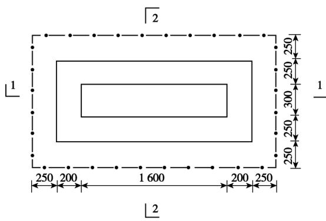  
(a)标志牌平面

## 3.6 取土场工程

依据计算，采坑共需填土石方量 $9 8 9 \ 5 4 4 . 5 \ \mathrm { m } ^ { 3 }$ 矿渣堆及采坑平整可产生土石方量 $7 6 5 \ 6 1 9 . 8 \ \mathrm { ~ m } ^ { 3 }$ 此次需取土石方量 $2 2 3 \ 9 2 4 . 7 \ \mathrm { m } ^ { 3 }$ ,覆土工程共需土源 $1 3 5 \ 5 7 3 . \ 3 3 \ \mathrm { ~ m } ^ { 3 }$ ，因此，共需土石方359498.03$\mathbf { m } ^ { 3 }$ 。本次拟选取3个取土场，根据现场调查取土场土源厚度3\~8m，平均5m,取土面积为 $8 . 0 0 \ \mathrm { h m } ^ { 2 }$ 可供土源40.00万 $\mathbf { m } ^ { 3 }$ ，此次剥离长5m，共剥离量359498.03万m³。

## 3.7 标志碑工程

在治理区内共设立标志碑3个。标志碑由碑体和基座组成，碑体用加筋混凝土制作，碑体规格1.6$\mathrm { m } \times 0 . 3 \ \mathrm { m } \times 1 . 4 \ \mathrm { m }$ ,基部采用二级M10浆砌石，台阶自上而下高0.6、0.5m,宽 $0 . 2 5 \mathrm { ~ m ~ } _ { \circ }$ 其中,0.50 m埋入地下，上部0.6m成杯形预留口与标志碑对接，标志碑内容包括地质环境保护标志、工程名称、工程简介、项目实施单位、承担单位、建碑日期等。标志碑施工设计如图4所示。

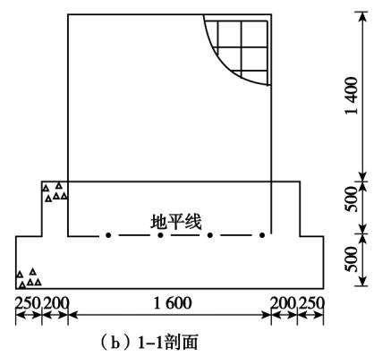  
图4 标志碑施工设计

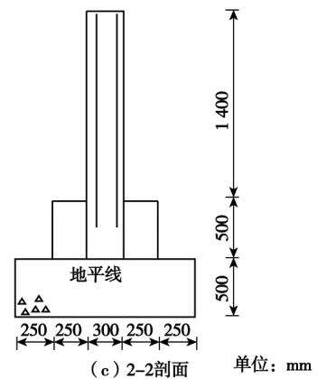  
Fig. 4 Sign monument construction design

## 4 治理效果

本项目通过工程手段和生物手段相结合，对项目区以往露天开采形成的不稳定边坡进行工程处理，对矿渣、采坑进行平复，以消除地质灾害危险隐患，进而通过生态复绿，最大限度地修复项目区的自然地貌景观，黄瓜山石英砂矿采石场治理效果如图5所示。马山寨—冯家山石英砂矿采石场治理效果

如图6所示。

## 5 减灾效益评价

项目区内采坑遍布，矿渣随处堆放，造成郑少洛高速沿线及万安山景区周边的地质景观严重破坏，与周围原生地貌极不协调的地质景观。研究区内采石、采砂均为露天开采，在生产过程中缺乏科学规划，废渣乱放，滥采乱挖，造成水土流失加剧，生态环境日益恶化，遗留的边坡、采坑及废渣存在极大的灾害隐患。

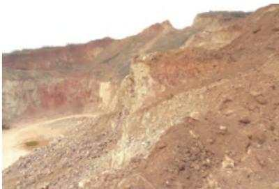

(a) 治理前  
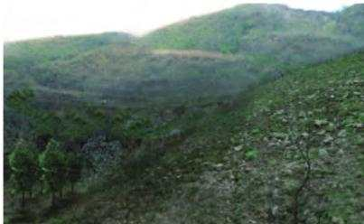  
(b) 治理后  
图5 黄瓜山石英砂矿采石场治理效果

Fig. 5 Quarry control effect of Huangguashan quartz placer mine  
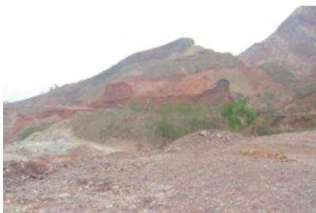  
(a) 治理前

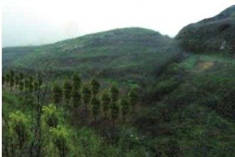  
(b) 治理后  
图6 马山寨一冯家山石英砂矿采石场治理效果  
Fig. 6 Treatment effect of Mashanzhai-Fengjiashan Quartz Mine

治理工程的实施，不仅使郑少洛高速沿线和万安山山顶公园地貌景观得到恢复，生态环境得到较大改善，也相应地消除了因不稳定边坡、矿坑、矿渣堆积等可能引发的各类地质灾害与环境地质问题。通过植被恢复治理工作，可美化当地及周边生态环境，提高人民生活环境质量，其减灾效果显著。

## 6 结语

项目区矿山地质环境治理恢复项目实施后，能促进周边万安山山顶公园公园的建设，有效增加林地数量，提高土地质量。矿区治理项目主要可产生万安山山顶公园旅游产业效益、林地增加效益、地质灾害治理效益、矿区环境治理效益。此外，项目实施对提高附近居民生态环境保护的意识起到一定的教育和宣传目的，推进了该地区生态文明建设，促进社会和谐发展。

## 参考文献(References)：

[1] 覃茂刚，伍德明,孙龙飞，等.海南小型露天采石场矿山地质环 境治理方法探讨：以日富石场为例[J].中国矿业，2021,30 (S1):89-93. Qin Maogang, Wu Deming, Sun Longfei , et al. Discussion on the management method of mine geological environment in Hainan small open-pit quarry: taking Rifu quarry as an example[ J]. China MiningMagazine,2021,30(S1) :89-93.

[2] 周亚光.玉皇全采石场建筑石料用灰岩矿矿山地质环境治理 工程设计[J].能源与环保,2020,42(9):45-49. Zhou Yaguang. Design of the mine geological environment treatment project for limestone mines used for building stones in Yuhuangquan Quarry [ J]. China Energy and Environmental Protection,2020,42(9) :45-49.

[3] 覃茂刚，黄仕锐，王子雯.废弃露天矿山地质环境治理方法研 究：以海南某废弃露天矿山为例[J].中国矿业,2020,29(S2)： 85-87,116. Qin Maogang, Huang Shirui , Wang Ziwen. Research on the geological environment treatment method of abandoned open-pit mine: a case study of an abandoned open-pit mine in Hainan [ J]. China Mining Magazine ,2020 ,29(S2) :85-87,116.

[4] 王小利，张志辉.铝土矿矿山地质环境恢复治理工程设计[J]. 能源与环保,2021,43(4):8-14. Wang Xiaoli , Zhang Zhihui. Engineering design for restoration and treatment of geological environment of bauxite mine[ J]. China Energy and Environmental Protection ,2021 ,43(4) :8-14.

[5] 王凤艳，赵明宇，王明常，等.无人机摄影测量在矿山地质环境 调查中的应用[J]. 吉林大学学报(地球科学版),2020,50 (3):866-874. Wang Fengyan , Zhao Mingyu , Wang Mingchang, et al. Application of UAV photogrammetry in mine geological environment investigation[ J]. Journal of Jilin University(Earth Science Edition) ,2020, 50(3):866-874.

[6] 李建中，张进德.我国矿山地质环境调查工作探讨[J].水文地 质工程地质,2018,45(4):169-172. Li Jianzhong, Zhang Jinde. Discussion on the investigation of mine geological environment in my country [ J]. Hydrogeology & Engineering Geology ,2018,45(4) :169-172.

(下转第51 页)

Earth Science Frontiers,2021 ,28(4) :83-89.

[10]卞正富，于昊辰，雷少刚，等.黄河流域煤炭资源开发战略研判 与生态修复策略思考[J].煤炭学报,2021,46(5):1378-1391. Bian Zhengfu , Yu Haochen , Lei Shaogang, et al. Study and judgment of coal resources development strategy and ecological restoration strategy in the Yellow River Basin[ J]. Journal of China Coal Society,2021,46(5):1378-1391.

[11]姜月华，倪化勇，周权平，等.长江经济带生态修复示范关键技 术及其应用[J].中国地质,2021,48(5):1305-1333. Jiang Yuehua , Ni Huayong, Zhou Quanping, et al. Key technologies and application of ecological restoration demonstration in the Yangtze River economic belt [ J]. Geology of China, 2021 , 48 (5) : 1305-1333.

12] 王红梅.基于层次分析法的煤矿矿山生态环境评价定量模型 研究[J].中国矿业,2020,29(7):70-75. Wang Hongmei. Study on quantitative model of coal mine ecological environment evaluation based on analytic hierarchy process [J]. China Mining Magazine ,2020 ,29(7) :70-75.

[13]韦宝玺,孙晓玲.矿山生态修复的利益相关者分析及共同参与 建议[J]. 中国矿业,2020,29(8):47-54. Wei Baoxi , Sun Xiaoling. Stakeholder analysis and joint participation suggestions for mine ecological restoration [ J]. China Mining Magazine,2020,29(8) :47-54.

[14]陈飞,尹炳,沈强，等.基于Citespace的矿业废弃地复垦与生态 修复研究热点和趋势分析[J]. 西南农业学报,2020,33(8)： 1806-1815. Chen Fei , Yin Bing, Shen Qiang, et al. Research hotspot and trend analysis of mining wasteland reclamation and ecological restoration based on Citespace [ J]. Southwest China Journal of Agricultural Sciences,2020,33(8) :1806-1815.

[15]蔡海生，陈艺，查东平，等.基于主导功能的国土空间生态修复 分区的原理与方法[J].农业工程学报,2020,36(15):261- 270,325. Cai Haisheng, Chen Yi, Zha Dongping, et al . Principle and method of land space ecological restoration zoning based on dominant function[ J]. Transactions of the Chinese Society of Agricultural Engi-

(上接第44页)

[7] 刘勇，王浩霖，李静静，等.巩义市历史遗留露天矿山地质环境 问题现状及治理对策[J].能源与环保,2021,43(4):15-22. Liu Yong, Wang Haolin , Li Jingjing, et al. Research on status quo of geological environmental problems of historic open-pit mines in Gongyi City and countermeasures[ J]. China Energy and Environmental Protection ,2021,43(4) :15-22.

8] 杨帆，秦福锋，冯英明，等.矿山地质环境影响和土地损毁评估 研究[J].能源与环保,2021,43(4):23-29,36. Yang Fan , Qin Fufeng, Feng Yingming, et al. Research on mine geological environmental impact and land damage assessment [ J]. China Energy and Environmental Protection ,2021,43 (4) :23-29,

neering,2020,36(15):261-270,325.

[16] 张进德，郗富瑞.我国废弃矿山生态修复研究[J].生态学报，2020,40(21):7921-7930.Zhang Jinde, Xi Furui. Study on ecological restoration of aban-doned mines in China[ J]. Acta Ecologica Sinica,2020 ,40 (21) :7921-7930.

[17]张中秋，劳燕玲，胡宝清，等.老少边山穷地区城镇化与国土空 间生态修复耦合协调机制研究[J].农业资源与环境学报， 2020,37(6) :882-893. Zhang Zhongqiu , Lao Yanling, Hu Baoqing, et al. Study on the coupling and coordination mechanism between urbanization and land space ecological restoration in mountainous and poor areas [ J]. Journal of Agricultural Resources and Environment ,2020 ,37(6) : 882-893.

[18]王涛，刘以珍，孔召玉，等.稀土矿山生态修复研究现状与热点——基于 CiteSpace的可视化分析[J]. 稀土,2021,42(6)：134-145.Wang Tao, Liu Yizhen , Kong Zhaoyu , et al. Research status andhotspot of ecological restoration of rare earth mines: visual analysisbased on CiteSpace[ J]. Chinese Rare Earths ,2021 ,42 (6) : 134-145.

[19]李丽，杨金中，陈栋，等.长江经济带江苏段废弃露天矿山分布 与生态修复遥感调查研究[J].水文地质工程地质，2022,49 (1):183-190. Li Li, Yang Jinzhong, Chen Dong, et al. Remote sensing investigation on the distribution and ecological restoration of abandoned open-pit mines in Jiangsu section of the Yangtze River economic belt[ J]. Hydrogeology & Engineering Geology ,2022 ,49 (1) : 183- 190.

[20]翟紫含，王立威，周妍，等.离子型稀土矿山生态保护修复思路 与实践——以赣江流域为例[J].有色金属工程,2022,12(1)： 137-143. Zhai Zihan , Wang Liwei ,Zhou Yan , et al. Thinking and practice of ecological protection and restoration of ion rare earth mines : taking Ganjiang River Basin as an example[ J]. Nonferrous Metal Engineering,2022,12(1):137-143.

36.

[9] 王琼，辜再元，周连碧.废弃采石场景观设计与植被恢复研究 [J]. 中国矿业,2010(6):57-59. Wang Qiong, Gu Zaiyuan , Zhou Lianbi. Research on landscape design and vegetation restoration of abandoned quarry [ J]. China Mining Magazine ,2010(6) :57-59.

[10]韩琳琳，张华，范旭光，等.矿山地质环境治理与土地复垦工程 设计研究[J].能源与环保,2021,43(4):30-36. Han Linlin , Zhang Hua, Fan Xuguang, et al. Study on mine geological environment control and design of land reclamation engineering [J]. China Energy and Environmental Protection , 2021 ,43 (4) : 30-36.