# 北冶镇裴岭村陈庄铝土矿矿山地质环境修复与综合治理

张志兴，高远方 (河南省资源环境调查二院，河南洛阳 471023)

摘要：针对矿山地质环境破坏、地质灾害、水土流失及土地功能退化、生物多样性受损等生态环境问题，以北冶镇裴岭村陈庄铝土矿为例，分析了矿山主要地质环境问题，主要是高陡边坡和采坑，提出了2套具有针对性的防治工程比选方案，并根据施工难度、工程量方面、对周边原生环境的保护和对附近居民影响等方面，选择方案1。依据研究区的地形地貌条件，此次治理研究区分项工程主要有挖填方工程、覆土及平整工程、田埂工程、土壤改良工程、绿化工程、养护工程和监测工程。研究最大程度改善矿山生态环境质量，降低地质灾害的发生，保障项目区及周边生态安全。

关键词：铝土矿；矿山地质环境；高陡边坡；采坑；综合治理

中图分类号：TD167;X141

文献标志码：A

文章编号:1003-0506(2023)01-0072-07

# Restoration and comprehensive management of geological environment of Chenzhuang bauxite mine in Peiling Village , Beiye Town

Zhang Zhixing , Gao Yuanfang

(The Second Institute of Henan Provincial Resources and Environment Survey ,Luoyang 471023 , China)

Abstract: In view of the ecological environment problems such as mine geological environment damage, geological disasters , soil erosion , land function degradation , and biodiversity damage , his paper took Chenzhuang bauxite mine in Peiling Village , Beiye Town as an example , and analyzed the main geological environmental problems of the mine. Mainly high and steep slopes and mining pits , two sets of targeted prevention and control engineering comparison and selection schemes were proposed , and according to the construction difficulty , engineering volume , protection of the surrounding original environment and impact on nearby residents , the first scheme was selected. According to the topographic and geomorphological conditions of the study area, the sub-projects in the treatment study area mainly include excavation and filling engineering, soil covering and leveling engineering, ridge engineering, soil improvement engineering, greening engineering, maintenance engineering and monitoring engineering. Research can maximize the quality of the mine ecological environment , reduce the occurrence of geological disasters , and ensure the ecological safety of the project area and surrounding areas.

Keywords: bauxite; mine geological environment; high and steep slopes ;mining pits ; comprehensive management

研究区位于洛阳市新安县境内，区内人口密集，工业、农业、矿业、文化、旅游等众多产业繁荣发达，特别是改革开放以来，经济社会发生了爆发性发展，城镇化进程突飞猛进，产业结构不断升级，从而成为中原地区人文底蕴深厚、经济发达、市场繁荣、人们社会生活最具活力的地区之一[1-5]。这一系列的变化，也无不例外地激发了人与自然的剧烈矛盾，生态退化、环境水质恶化、雾霾及地质灾害频发、生命群落遭受严重威胁，环境承载能力弱化。

为此，重视生态环境保护，加强生态环境修复，科学处理发展与生态环境保护的关系，成为辖区政府和人民的神圣责任和义务。生态环境是所有地球生命的载体，更是人类命运共同体，与人类物质、精神、文化生活等的方方面面都息息相关，开展矿山地质生态环境治理无疑将产生较好的社会效益、环境效益和经济效益[6-10]。

## 1 地质环境条件

## 1.1 地层岩性

(1)区域地层。研究区所在区域地层分区属华北区豫西地层分区，出露岩性以沉积岩为主，其次是火山岩。出露地层有长城系、蓟县系、青白口系、寒武系、奥陶系、石炭系、二叠系、三叠系、新近系及第四系。

(2)研究区地层。研究区内出露地层自上而下为第四系、二叠系、石炭系和奥陶系。详述如下：①第四系(Q)。研究区内第四系主要为更新统。上更新统马兰黄土( $\mathrm { \ Q p } _ { 3 } \mathrm { m } )$ 呈充填式不整合覆于 $\mathrm { Q p } _ { 2 }$ 等地层之上；中更新统离石黄土 $( \mathrm { Q p } _ { 2 } \mathrm { l } )$ 厚 $5 \sim 1 0 ~ \mathrm { m } ;$ 下更新统午城黄土 $( \mathrm { Q P } _ { 1 } \mathbf { w } )$ 棕红色粉质黏土，底部为钙质砂砾岩。②二叠系(P)。二叠系地层是一套陆相碎屑岩—砂质页岩互层。地层分为2个岩组：山西组、石盒子组，石盒子组地层在本区出露不全。在区内出露厚度约为 $5 0 \mathrm { ~ m ~ } _ { \mathrm { o } }$ 与上覆地层第四系呈不整合接触，与下伏地层石炭系呈假整合接触。③石炭系(C)。本区出露中石炭统 $\mathrm { C } _ { 2 } \mathrm { b }$ 本溪统铝质泥岩，上石炭统太原统 $\mathrm { C } _ { 3 } \mathrm { t }$ 石灰岩，总厚度约 $2 0 \mathrm { ~ m ~ } _ { \mathrm { c } }$ ④奥陶系(0)。出露于铝土矿层分布地段沟谷下部，分为 $0 _ { \ i }$ 奥陶系下统贾汪统泥质灰岩泥质白云岩。奥陶系地层和下伏寒武系地层呈整合接触关系。

## 1.2 地质构造与地震

(1)地质构造。研究区锁在区域构造位置分区处于华北地台区的渑临台坳，黛眉一西沃隆褶断区与义马凹陷带和洛阳凹陷带的交接部位。

(2)地震。新安县历史上未发生过5.0以上的地震，但小等级的地震较为频繁，1960年以来曾发生过多次弱震：①1960年3月1日21:20，新安县发生3.5级地震；②1987年12月25日新安县铁门镇发生2.9级地震；③2009年11月13日9:15,新安县发生2.7级地震。④2011年11月24日0:42，新安县发生2.7级地震。依据《中国地震动参数区划图》(GB18306—2015),县域内11个镇地震动峰值加速度为 $0 . 1 0 ~ g$ ，地震基本烈度为Ⅶ度。根据中国区域地壳稳定性研究成果，参照《工程地质调查规范(1:2.5万—1:5 万)》(DZ/T0097—1994)11.1.4.1要求，县域内地震动峰值加速度为0.1g，地震基本烈度值为Ⅶ，地壳属较稳定区。

## 2 主要地质环境问题

## 2.1 地质灾害

(1)高陡边坡。研究区内共发育4处高陡边坡，最小坡角约 $7 0 ^ { \circ }$ ,最大坡脚约为 $8 1 ^ { \circ }$ ，总面积约为$3 \ 8 9 1 . \ 4 2 \ \mathrm { ~ m ~ } ^ { 2 }$ 。①1处位于采坑南部边界处(图1(a)),坡角 $7 0 ^ { \circ } \sim 8 1 ^ { \circ }$ ,最大垂直高差约 $2 4 ~ \mathrm { m }$ ,总投影面积 $1 ~ 4 8 9 . 6 2 ~ \mathrm { m } ^ { 2 }$ 。边坡出露岩性顶部为第四系黄土层，上部为二叠系砂岩和泥岩互层。边坡因受采矿活动影响，表面节理发育，节理规模几厘米到几十厘米不等，形成危岩，稳定性差。②位于采坑西部与土路交接的地方(图1(b))，坡角约 $7 0 ^ { \circ }$ ,最大垂直高差约20m，总面积 $9 8 6 . 7 9 \mathrm { ~ m } ^ { 2 }$ O

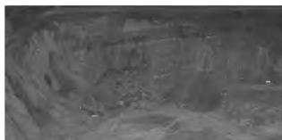  
(a）高陡边坡1（镜向西南）

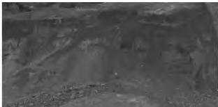  
(b）高陡边坡2（镜向西南）

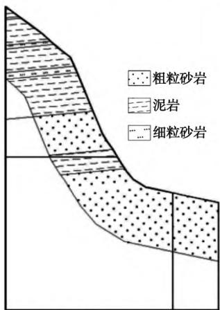

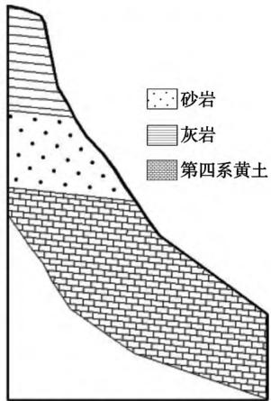  
（c）高陡边坡1剖面（垂直边坡）  
(d）高陡边坡2剖面（垂直边坡)  
图1 高陡边坡1 和边坡2  
Fig. 1 High and steep slopes 1 and 2

边坡上部为砂岩泥岩互层，下部为灰岩，边坡表面节理不发育，稳定性较好。第3处高陡边坡位于采坑东部与水泥路交接的地方，其坡角约 $7 0 ^ { \circ }$ ,最大垂直高差约 $2 0 \mathrm { ~ m ~ }$ ,总面积 $1 \ 0 6 2 . \ 3 6 \ \mathrm { m } ^ { 2 }$ ;边坡上部为砂岩泥岩互层，下部为灰岩，表面节理较发育，但规模较小，稳定性一般。第4处高陡边坡位于采坑北部，坡脚约 $8 0 ^ { \circ }$ ,最大垂直高差约为15m，总面积$3 5 2 . 6 5 \ \mathrm { m } ^ { 2 } \mathrm { ~ c ~ }$ 。该边坡为灰岩边坡，表面节理不发育，稳定性好。

(2)不稳定边坡。经勘查，研究区发育1处不稳定边坡，位于南部采坑南边界处，边坡整体高约

25 m,坡角 $3 5 ^ { \circ } \sim 7 0 ^ { \circ }$ ,总面积 $5 ~ 5 8 0 . 5 3 ~ \mathrm { m } ^ { 2 }$ ,边坡顶部已出现地裂缝，裂缝最宽处为8cm。边坡距离附近民宅较近(最近仅11m)，已严重破坏了周边部分居民居住条件，破坏了居民房屋地基的稳定性，使附近居民生命财产安全得不到保障。部分旱地表层耕植土经雨水冲刷已经滑到坡角处堆积。采坑东北部不稳定边坡照片如图2所示。

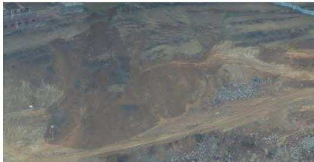  
图2 采坑东北部不稳定边坡照片  
Fig. 2 Photos of unstable slopes in the northeast of the mining pit

## 2.2 含水层破坏

研究区最低开采标高位于地下水以上，与区域含水层或地表水联系不密切。矿山开采不会改变地下水的运动规律，即采矿活动不会对地下含水层造成破坏。

## 2.3 水土流失

采矿活动将研究区内90%以上的植被完全破坏，使得研究区内水土流失加剧。植被破坏后，降雨对土壤的冲刷能力增强，水土流失加剧。同时土壤退化并使研究区内以及周边的地下水体富营养化。

## 2.4 地形地貌景观破坏

采矿活动将原始地貌破坏殆尽，形成凹凸不平的采坑，采坑内采面叠加，有高陡采面，有缓坡，碎石零落，采坑落差大，破坏了原始地形地貌景观。

## 2.5 土地资源破坏

研究区内土地资源的破坏主要表现为露天采矿活动已将原始地貌根本性改变，采坑现状满目疮痍，采坑内地势凹凸不平。由于露天开采，植被和表层土被完全剥离，原始地貌已不复存在，裸露的岩石及堆积的废渣使土地的种植功能几乎完全丧失，人工改造恢复植被非常困难(图3)。

根据现场勘查及土地利用图对比，确定土地资源破坏面积约为 $1 1 . 9 9 ~ \mathrm { h m } ^ { 2 }$ ,其中旱地占 $3 . 9 5 ~ \mathrm { h m } ^ { 2 }$ 林地 $1 . 4 8 \ \mathrm { h m } ^ { 2 }$ ，农村宅基地 $1 . 4 7 \ \mathrm { h m } ^ { 2 }$ ，农村道路$0 . 3 9 \ \mathrm { h m } ^ { 2 }$ ,采矿用地 $4 . 7 \ \mathrm { h m } ^ { 2 }$ 0

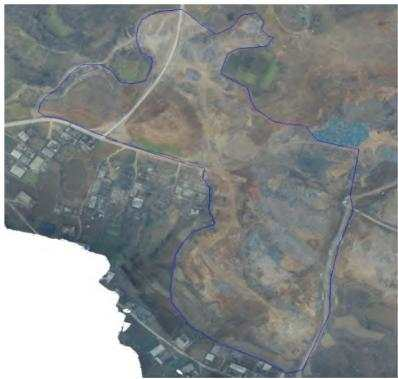  
图3 研究区整体俯瞰照片  
Fig. 3 Overall view of the study area

## 2.6 植被资源破坏

矿山开采造成了矿山表土剥离和大面积的植被破坏。开采区地表土质贫瘠，土层较浅，植物生长较缓慢，植被被破坏后，很难自然恢复。采坑内大面积基岩裸露，不具备植被生长的基本水土条件。弃渣掩埋了原始地表，加上结构松散，水土无法保持，植被难以生长。尤其露天采场大小不一、形状不尽相同、剥离岩体高度不等，采坑面积大且连续分布，由于基岩直接裸露，且坡度陡，表面植物生长十分困难，视觉效果极差。

## 3 治理设计

## 3.1 技术路线

坚持贯彻落实“山水林田湖草是生命共同体”的系统理念，以“格局优化、系统稳定、功能提升”为目标，统筹考虑研究区内及周边的生态系统的整体性、连通性等内在规律，坚持生态优先的原则。

## 3.2 治理工程设计方案

根据研究区矿山存在的地质环境问题、危害程度及环境地质条件，重点是对区内采坑危岩、土体、地形地貌景观及土地资源的破坏等采取一系列相应对策与措施，全方位多层次的进行防治，从而改善勘查区内的生态环境，使人们的生产生活与生态环境协调发展。

在确定了研究区土地复垦利用方向之后，综合考虑工作量、施工安排、资金投入、治理效果等方面的基础上，推荐最佳方案。因此，提出了两套具有针对性的防治工程比选方案。

## 3.2.1 方案1

## 3.2.1.1 总体思路

(1)对不稳定边坡的治理。首先，对研究区南部不稳定边坡通过挖方消除其上方荷载，清理不稳定岩体，然后在此位置修筑马道、平台和斜坡，斜坡坡度为1:1.5。

(2)对南部采坑的治理。对区内采坑均采取渣石回填的方法进行治理，将南部不稳定边坡挖方削坡卸载后的渣石，用以回填采坑。采坑回填至标高+394m，然后平整修筑成平台，覆土平整、土壤改良后恢复成旱地。

(3)对高陡边坡的治理。①高陡边坡1的治理。先清理掉边坡上不稳定的岩体和土体，然后从底部平台开始向上修筑2条马道，分别为马道4(标高+402 m)和马道5(标高+410 m)。马道之间由斜坡相连，斜坡坡度1:1\~1:1.5。马道覆土平整后恢复为林地，斜坡覆土后撒播草籽恢复为草地；并在马道内混播草籽(图4)，图中椭圆位置为边坡位置。②高陡边坡2的治理。先在标高+402处修筑一平台(平台10)，平台填筑完成后，以其为基准，向上6m修筑1条马道，总共向上修筑3条马道，分别为马道1(标高+420 m)、马道2(标高+414m)和马道3(标高+408m)，马道1之上修筑平台(平台8)，平台标高+428m。马道和马道以及马道和平台之间以斜坡相连，斜坡坡度1:1.5。马道覆土平整后恢复为林地，平台8经覆土平整后，开展土壤改良工程，将其恢复为旱地；斜坡覆土后撒播草籽恢复为草地；并在马道内混播草籽(图5)。③高陡边坡3的治理。高陡边坡3的治理思路与边坡2一样。从底部平台(平台12)向上6m处修筑一条马道(马道6)，马道标高+402m,宽4m,马道上下相连的斜坡坡角为1:1.5。马道覆土平整后恢复为林地并在马道内混播草籽，斜坡覆土后撒播草籽恢复为草地(图6)。④高陡边坡4的治理。高陡边坡4位于底部采坑的北部，此处高坡边坡在底部平台修筑是将其整体推平，渣石用于回填底部采坑(图7)。

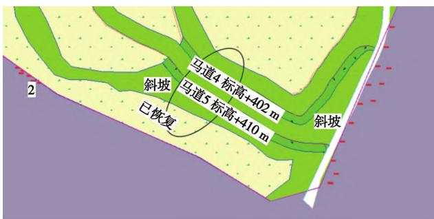  
图4 高陡边坡1 治理方案  
Fig. 4 High and steep slope 1 treatment plan

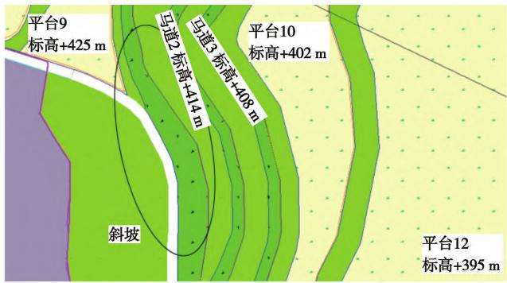  
图 5 高陡边坡 2 治理方案

Fig. 5 High and steep slope 2 treatment plan  
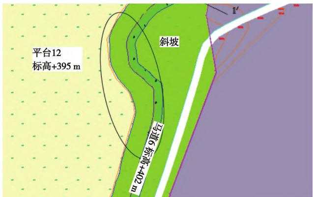  
图6 高陡边坡3治理方案

Fig. 6 High and steep slope 3 treatment plan  
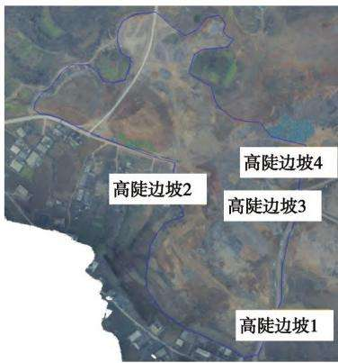  
图 7 高陡边坡4 治理方案  
Fig. 7 High and steep slope 4 treatment plan

## 3.2.1.2 部分分项工程设计

依据研究区现状地形地貌，以“顺坡就势”、“自然恢复为主，人工为辅”以及“宜林则林，宜耕则耕”的原则，以消除地质灾害、恢复土地功能、改善研究区及周边环境为目的，通过工程手段修筑平台14个，分别为平台1标高+434 m、平台2标高 +417m、平台3标高+420 m、平台4标高+414m、平台5标高+411m、平台6标高+420m、平台7标高为+414m、平台8标高 +420\~+430 m、平台9标高+425 m、平台10标高 +402 m、平台 11标高 +400m、平台 12 标高 + 396 m、平台 13 标高 + 402 m、平台14标高+410m，马道6个分别为马道1标高+420 m、马道2标高+414m、马道3标高+408m、马道4标高+402m、马道5标高+410m、马道6标高+402m，斜坡1个。依据原有的道路路基修筑3条泥结道路。

设计开展的工程手段为:挖填方工程、覆土及平整工程、土壤改良工程、田埂工程、道路工程、绿化工程、养护工程和监测工程。

## 3.2.2 方案2

## 3.2.2.1 总体思路

方案2的总体思路与方案1基本相同(对不稳定边坡和采坑的治理思路与方案1相同），仅在对南部高陡边坡的治理方案上有出入。对高陡边坡的治理，次方案采取的是以削坡为主，在采坑回填至标高+396m后，对高陡边坡通过挖方削坡，从底部平台向上每台身8m修筑1个马道，马道和马道之间相连的斜坡坡度为1:1\~1:1.5。覆土平整后平台恢复为旱地，马道恢复为林地，斜坡恢复为草地。

## 3.2.2.2 分部分项工程设计

方案2同样以消除地质灾害，恢复土地功能、改善研究区及周边生态环境为目的，通过工程手段同样修筑平台14个，分别为平台1标高+434m、平台2标高+417m、平台3标高+420 m、平台4标高为+414m、平台5标高+411m、平台6标高+420 m、平台7标高 +414m、平台8标高 +420\~430 m、平台9标高 +425m、平台10标高+402 m、平台11标高+400m、平台12标高+396m、平台13标高+402 m、平台14标高+410 m,马道6个分别为马道1标高+420m、马道2标高+414m、马道3标高+408m、马道4标高+402 m、马道5标高+410m、马道6标高+402m,斜坡1个。

设计开展的工程手段为:挖填方工程、覆土及平整工程、土壤改良工程、田埂工程、道路工程、绿化工程、养护工程和监测工程。

## 3.3 设计方案比选及推荐方案

对方案1和方案2进行比选可知,2个方案均能达到本次矿上环境治理的目的，且预计都能取得良好的成果。但相较而言，方案1在能达到同样目的的情况下，更经济实惠。方案2在高陡边坡的处理上稍有瑕疵，通过挖方修筑马道不仅增加了工程量还扩大了治理范围，对该处的原生植被造成了破坏，且研究区南边不远有群众居住，对高陡边坡1的开挖无疑扩大了研究区范围，对附近居民造成困扰。

故综上所述，方案1无论在施工难度、工程量方面还是对周边原生环境的保护和对附近居民影响等方面都优于方案2，故推荐方案1。

## 3.4 设计条件和相关参数选择

对采坑边坡实施台阶式削坡，形成14个平台和6个马道，马道宽4m，相邻平台之间落差为8m，相连的斜坡坡度为1:1\~1:1.5。覆渣覆土工程中，在平台、马道上覆渣覆土，平台覆土0.8m，恢复成旱地；马道覆土0.5m,恢复为林地；斜坡覆土0.3m，恢复为草地。林地种侧柏，在草地撒播草籽，混合草籽采用混合种子，为黑麦草、艾草、白莲蒿、狗尾草等种子混合后再加入本地生长较多的榆树、刺槐等乔木种子混合而成。对已恢复旱地周围建筑田埂，防止水土流失，田埂顶宽0.30m,底宽0.7m,高0.50m,每延米用土量0.25 m³。

为方便施工进出场，后期养护作，对区内现有道路进行拓宽、压实，与区内平台、马道相连接，道路宽4m，直接为碎石垫渣压实，碎石就地取材，厚度0.3m,道路长度1370 m。

绿化养护期为3年，浇水次数，苗木种植后第1个月，头3天每1天1次，4\~9天每3天1次，10\~30天，每10天1次，共7次，先保证成活。第2\~4个月，每月1次。总计10次。用水量：松树每次100L,爬山虎每次 15L。

## 3.5 分项设计

依据研究区的地形地貌条件，本次治理研究区分项工程主要有挖填方工程、覆土及平整工程、田埂工程、土壤改良工程、绿化工程、养护工程等。

## 3.5.1 挖填方工程

(1)施工方法。本次挖填方工程设计主要包括3个方面：①对于处于基本稳定或稳定状态的边坡，只需对坡顶或坡面上的悬挂岩块、松动岩石进行清除，对于处于欠稳定状态的边坡，除了对坡顶或坡面上的悬挂岩块、松动岩石进行清除外，还需要对局部突出部分及其它危险部分进行削坡；②边坡整理，使边坡整体平顺；③清理危岩体。对风化强烈、坡面破碎、存在较大安全隐患的边坡及危岩体实施削方工程，清除表层风化破碎岩体、悬空岩体、坡面堆积岩块等，消除崩塌灾害隐患，使坡面尽可能平整、稳定。本次治理工程挖填方工程设计挖方149785.44m³，填方 $1 4 9 \ 7 8 5 . 4 4 \ \mathrm { m } ^ { 3 }$ (包含修筑矿渣路面用矿渣方量），挖填平衡。

(2)设计工作量计算方法。运用南方 cass 软件对平台进行挖填方计算，首先将研究区进行网格划分，本次网格为 $1 0 \ \mathrm { m } \times 1 0 \ \mathrm { m }$ 间距。根据每个网格4个边角的设计高程求出单个网格的平均设计高程$H _ { \mathrm { p } }$ ,然后统计网格内的高于平均高程的高程点个数、平均高程 $H _ { \mathrm { g } }$ 、挖方面积 $S _ { \mathrm { g } }$ ,求出达到平均设计高程的挖方量 $V _ { \mathrm { g } }$ ,见下式： $: H _ { \mathrm { p } } = \left( x + y + z + w \right) / 4 , x \textmd { , } y .$ z、w为网格的4个边角设计高程； $V _ { \mathrm { _ g } } = S _ { \mathrm { _ g } } \times \left( \frac { } { } H _ { \mathrm { _ g } } \right. -$ $H _ { \mathrm { p } } )$ 。同样，可求出平均填方量 $V _ { \mathrm { d } } = S _ { \mathrm { d } } \times ( \textit { H } _ { \mathrm { p } } \mathrm { ~ - ~ }$ $H _ { \mathrm { d } } )$ 。每个表格的挖填方量合计 $V = V _ { \mathrm { g } } - V _ { \mathrm { d } }$ ,若为正数，说明该网格达到设计标高后，挖方量有结余，可将多余的挖方量就近运输至需要填方的区域；若为负数，则需填方。

## 3.5.2 覆土及平整工程

该分项设计是在削坡、危岩清理和平台土地平整之后，对各层边坡和平台马道进行客土作业并用机械将客土平整，客土平整之后将其复垦为耕地或林地，对恢复成耕地的区域覆土0.8m;对恢复成林地的区域为保证林地苗木成活率先在下部覆渣0.3m,石渣粒径不大于50mm，然后上部覆土0.5m;恢复成草地的区域覆土0.3m。为保障农作物与树木的成活率，覆土选用外购客土。本次治理工程共需客土 $7 4 ~ 0 2 3 . 0 2 ~ \mathrm { m } ^ { 3 }$ ,机械平土 $7 8 \ 4 5 9 . 3 2 \ \mathrm { m } ^ { 2 }$ 0

## 3.5.3 田埂工程

为防止治理后的各平台、马道及斜坡水土流失，决定在其外侧修筑保水田埂。根据平整区域特征，确定田埂为土质田埂，田埂修筑位置在各层平台、马道及斜坡外侧，充分利用天然降水，田埂横断面结构为等腰梯形（图8），顶宽0.30m，底宽0.7m，高0.50 m,每延米工作量0.25 m³。

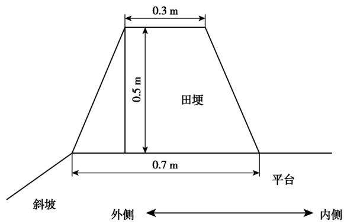  
图8 田埂断面示意  
Fig. 8 Schematic diagram of ridge section

## 3.5.4 土壤改良工程

根据“宜耕则耕，宜林则林，宜草则草”的原则，研究区内挖填平衡后将会产生大量平整的土地，有恢复成耕地的潜力，故在研究区内挖填平衡后选取符合恢复成耕地条件的平台，覆土、翻耕、培肥后可以恢复为旱地。培肥 $3 ~ 0 0 0 ~ \mathrm { k g / h m } ^ { 2 }$ 有机肥。

## 3.5.5 田间道路工程

为便于工程施工及后期养护工程的开展，需修筑施工便道和养护路。因研究区内原有运矿道路保存较好，此次道路工程以原有运矿道路为基础，在其上修筑矿渣路面。道路与各平台、马道相连通，路面宽4m，铺筑矿渣厚度0.3m。共计铺设路面1370m。详细工程量如下。

矿渣路面机械铺筑面积4 $3 8 3 . 5 5 \mathrm { ~ m } ^ { 2 }$ ,厚度0.3m;合计用渣 $1 \ 3 1 5 . 0 6 \ \mathrm { m } ^ { 3 }$ ,路基压实面积4383.55$\mathbf { m } ^ { 2 }$ 0

## 3.5.6 绿化工程

本次绿化工程主要有种植树木和撒播草籽。林地树种选用侧柏，树高1.5m以上；草籽采用混合种子，为黑麦草、艾草、白莲蒿、狗尾草等种子混合后再加入本地生长较多的榆树、刺槐等乔木种子。马道1—马道6及斜坡拟恢复为林地和草地，马道上苗木的种植间隔为 $1 . 5 \ \mathrm { m } \times 1 . 5 \ \mathrm { m }$ ,树坑规格为 0.8 m ×0.8m×0.8m;林地内撒播混合草种，每公顷播种混合种子30kg。树木栽植后前3天，每天浇水1次，透墒，以保证树木成活。斜坡恢复为草地，草籽撒播按等面积重复混播，每公顷播种混合种子 $3 0 ~ \mathrm { k g } .$ 。区内道路两旁种植行道树，树种选用白皮松，树高2m,种植间隔 $2 \mathrm { ~ m ~ } \times 2 \mathrm { ~ m ~ }$ 。本次治理工程共种植侧柏2146棵,种植白皮松1370棵,撒播草籽3.65 hm²。

## 3.5.7 养护工程

养护工程是对研究区内种植的苗木进行养护，养护期为3年，养护用水为附近村庄的生活用水，水量有保证。浇水次数，种植后第1个月，第1—3天每天1次，第4—9天每3天1次，第10—30天，每10天1次，共7次，先保证成活。第2—4个月，每20天1次，以后每月1次。共20次。此次树木养护面积为 $0 . 4 5 ~ \mathrm { h m } ^ { 2 }$ 0

## 3.5.8 监测工程

监测对象为治理工程修筑的平台、坡面及植被。监测内容为地形地貌、地质灾害隐患、植被健康状况、种植密度、高度、成活率、生长量等。在研究区内平台12及平台8分别布设1个监测点。监测方法为定时检查法，采用观察，工具测量，统计等方法。监测频率为每2个月1次，暴雨或者雨季时增加监测频率，6—9月15天1次。共计监测24点次，监测期限为治理工作完成后2年内。

## 3.6 工程实施后土地利用变化情况

根据现场实际破坏情况确定了本研究区治理面积11.99hm²，修复工程实施后土地利用变化情况见表1。

表1 治理前后土地利用变化情况统计  
Tab. 1 Statistics of land use change before and after treatment
<table><tr><td>地类</td><td>治理前/hm²</td><td>治理后/hm²</td><td>增减/hm²</td></tr><tr><td>旱地</td><td>3.95</td><td>7.89</td><td>+3.94</td></tr><tr><td>灌木林地</td><td>0.20</td><td>0.00</td><td>-0.20</td></tr><tr><td>乔木林地</td><td>1.28</td><td>0.45</td><td>-0.83</td></tr><tr><td>其他草地</td><td>0.00</td><td>3.20</td><td>+3.20</td></tr><tr><td>农村宅基地</td><td>1.47</td><td>0.00</td><td>-1.47</td></tr><tr><td>采矿用地</td><td>4.70</td><td>0.00</td><td>-4.70</td></tr><tr><td>农村道路</td><td>0.39</td><td>0.45</td><td>+0.06</td></tr><tr><td>合计</td><td>11.99</td><td>11.99</td><td>0.00</td></tr></table>

## 3.7 渣平衡分析

此次矿山地质环境修复治理研究区经测算总挖方量和总填方量相持平，均为149785.44m³,不用外购渣石或者外运渣石。

## 4 生态效益

(1)构建生态安全屏障，保障区域生态安全。通过实施矿山生态环境治理工程，有效保护森林资源，建设水源涵养林，提高林种结构合理性，丰富林地景观类型，更好发挥森林吸尘、固土、调节气候、涵养水源、维持生物多样性作用，提高森林生态效益。治理研究区实施后，可修复被破坏的地形地貌景观，可完成造林0.45hm²。有林地生态环境效益计算：根据《森林河南生态建设规划(2018—2027年)》的统计数据，每亩林地涵养水源 142.8 t,固土2.81 t，减少土壤肥力损失119 kg，固定二氧化碳281 kg，释放氧气160kg，增加土壤氮、磷、钾营养物质4.8kg，吸收二氧化硫、氟化物、氮氧化物及滞尘912kg，森林生态服务价值2750元。本研究区实施后，可涵养水源 963.9 t,固土 18.9 t,减少土壤肥力损失803.25 kg,固定二氧化碳1 896.75 kg,释放氧气为1 080 kg,增加土壤氮、磷、钾营养物质32.4 kg,吸收二氧化硫、氟化物、氮氧化物及滞尘6156kg，产生

18562.5元的生态服务价值。通过植被绿化、地貌景观恢复，对矿山环境修复整治等，可消除地质灾害隐患，改善研究区地貌景观，减轻对土地及地下水资源破坏，改善研究区及周边生产生活环境，通过工程的实施，可明显改善废弃研究区的地质和生态环境，有效消除滑坡崩塌等地质灾害隐患。通过建设水源涵养林和水土保持林，改善地表植被结构，降低地表径流冲刷，减少水土流失，改善土壤肥力，有效提高防治水土流失的能力，抑制扬尘，降低雾霾程度，构筑生态廊道和生态网络，为河南省及至华北平原地区提供生态安全屏障，找造区域生态安全格局，全面提升自然资源承载力和生态系统服务功能，实现自然资源保护与科学发展协调统一。

(2)加强区域生态示范作用，打造综合治理先行区。研究区实施将严格贯彻“山水林田湖草是一个生命共同体”生态理念，统筹推进国土开发、保护与治理的新模式，开创打造美丽中国“河南样板”生态治理新局面。构建“以自然修复为主，工程治理为辅”的矿山地质环境恢复和综合治理模式，推进矿山地质环境恢复治理与城市建设、民生保障等产业融合发展。

## 5 结语

研究区实施的目的在于改善新安县生态环境，促进城乡振兴和区域协调发展。通过矿山环境修复工程以及土地整治与土壤改良工程的实施，将促进产业结构调整，有利于调配经营规模和模式，有效缓解人地关系矛盾，优化区域经济发展结构，达到改善群众生产生活条件，提高居民收入的目的。工程的实施，可以增加周边百姓收入，改善矿山及周边生态环境，契合乡村振兴战略的实施。

## 参考文献(References)：

[1] 曹晓毅，田延哲.关中地区石灰岩废弃矿山地质环境恢复治理 探讨[J].煤炭技术,2020,39(3):50-53. Cao Xiaoyi, Tian Yanzhe. Discussion on restoration and management of geological environment of limestone abandoned mine in Guanzhong Area[ J]. Coal Technology ,2020 ,39 (3) :50-53.

[2] 蒙学礼，蒙发强，刘振龙，等.肃北县敖包沟金矿矿山地质环境 问题及恢复治理措施[J]. 能源与环保,2022,44(2):1-6,12. Meng Xueli , Meng Faqiang, Liu Zhenlong, et al. Mine geological environment problems and restoration measures of Aobaogou Gold Mine in Subei County[ J]. China Energy and Environmental Protection,2022,44(2) :1-6,12.

(下转第 87 页)

地质环境综合评价—以戈壁荒漠区某有色金属矿山为例[J]. 矿产勘查,2019,10(3):681-688. Sun Houyun , Wu Dingding, Mao Qigui , et al. Comprehensive evaluation of mine geological environment based on remote sensing interpretation and fuzzy mathematics : taking a nonferrous metal mine in gobi desert area as an example[ J]. Mineral Exploration ,2019 ,10 (3):681-688.

[5] 原振雷，肖荣阁，李明立，等.矿产资源开发区生态环境问题及 其防治[J].矿产保护与利用,2005(1):40-44. Yuan Zhenlei , Xiao Rongge , Li Mingli , et al. Ecological and environmental problems in mineral resource development zones and their prevention and control[ J]. Mineral Resources Protection and Utilization ,2005(1):40-44.

[6] 刘勇，王浩霖，李静静，等.巩义市历史遗留露天矿山地质环境 问题现状及治理对策[J]. 能源与环保.2021.43(4):15-22. Liu Yong, Wang Haolin , Li Jingjing, et al. Research on status quo of geological environmental problems of historic open-pit mines in Gongyi City and countermeasures[ J]. China Energy and Environ-

## (上接第78页)

[3] 赵芝法.浅析胶州市矿山地质环境综合治理现状[J].中国矿 业,2021,30(S2):117-119. Zhao Zhifa. Brief Analysis on the current situation of comprehensive management of mine geological environment in Jiaozhou City [J]. China Mining Magazine ,2021,30(S2) :117-119.

[4] 彭建阳，崔朋涛，朱文慧，等.山西省大同塔山煤矿地质环境问 题与治理对策研究[J].能源与环保,2022,44(2):13-17,23. Peng Jianyang, Cui Pengtao, Zhu Wenhui, et al. Research on geological environment problems and treatment countermeasures of Tashan Coal Mine in Datong, Shanxi Province[ J]. China Energy and Environmental Protection,2022,44(2) :13-17,23.

[5] 李凤明，丁鑫品，白国良，等.高原高寒露井联合矿区生态地质 环境综合治理模式[J].煤炭学报,2021,46(12):4033-4044. Li Fengming, Ding Xinpin, Bai Guoliang, et al. Comprehensive management model of ecological geological environment in plateau alpine open pit combined mining area [ J]. Journal of China Coal Society,2021,46(12):4033-4044.

6] 李超，樊子玉.灵丘县国营露天砂金矿矿山地质环境问题及治 理对策[J].能源与环保,2022,44(2):24-28,34. Li Chao, Fan Ziyu. Geological environment problems and control countermeasures of state-owned open-pit placer gold mine in Lingqiu County[ J]. China Energy and Environmental Protection,

mental Protection ,2021 ,43(4) :15-22.

[7] 张昊，张强，左小，等.生态环境保护性的采选充系统设计及应 用[J]. 中国矿业大学学报,2021,50(3):548-557. Zhang Hao , Zhang Qiang , Zuo Xiao , et al. Design and application of mining-separating-backfilling system for mining ecological and environmental protection[ J]. Journal of China University of Mining & Technology ,2021 ,50 (3) :548-557.

[8] 周亚光.玉皇全采石场建筑石料用灰岩矿矿山地质环境治理 工程设计[J].能源与环保,2020,42(9):45-49. Zhou Yaguang. Design of mine geological environment treatment engineering design for limestone mines used for building stones in Yuhuang Quan Quarry[J]. China Energy and Environmental Protection ,2020,42(9) :45-49.

[9] 武乐霞.矿山地质环境治理工程技术研究[J]. 能源与环保， 2020,42(4):46-51. Wu Yuexia. Study on engineering technology of mine geological environment control [ J]. China Energy and Environmental Protection ,2020,42(4) :46-51.

2022,44(2):24-28,34.

[7] 王丽伟，阎昆，杨延伟.河南报庄铝土矿矿山环境地质问题及 治理措施研究[J].中国锰业,2021,39(4):43-46. Wang Liwei, Yan Kun, Yang Yanwei. Research on environmental geological problems and control measures of Baozhuang bauxite mine in Henan[ J]. China Manganese Industry,2021,39 (4) :43- 46.

[8] 王让，崔朋涛，尚佳楠.滦平县宝财铁矿地质环境评估及恢复 治理研究[J].能源与环保,2022,44(2):35-40,46. Wang Rang, Cui Pengtao , Shang Jianan. Research on geological environment assessment and environmental restoration in Baocai Iron Mine , Luanping County[ J]. China Energy and Environmental Protection ,2022 ,44(2) :35-40 ,46.

[9] 李晨夕，陈静.露天矿山地质环境恢复与综合治理的探讨[J]. 低碳世界,2019,9(9):156-157. Li Chenxi, Chen Jing. Discussion on restoration and comprehensive treatment of geological environment of open-pit mine[ J] . Low Carbon World,2019,9(9) :156-157.

[10] 姚杰.露天石材矿山地质环境影响及生态恢复研究[J].能源 与环保,2022,44(2):47-53. Yao Jie. Study on geological environment influence and ecological restoration of open-pit stone mine[ J]. China Energy and Environmental Protection ,2022,44(2) :47-53.