# 废弃铝土矿主要地质环境问题与修复治理方案择选

张海军，周佑康 (河南省资源环境调查二院，河南洛阳 471023)

摘要：针对北冶镇裴岭村后岭废弃铝土矿主要地质环境问题，认为其地质灾害隐患主要由原采矿活动遗留的高陡边坡、采坑、不稳定边坡以及渣堆造成，并且导致含水层破坏、水土流失、地形地貌景观破坏等。提出了针对性的防治工程比选方案，对方案1和方案2进行比选可知，2个方案均能达到此次矿上环境治理的目的，且预计都能取得良好的成果。但相较而言，方案1在能达到同样目的的情况下，更经济实惠。采取挖填方工程、覆土及平整工程、田埂工程、土壤改良工程、绿化工程、养护工程等工程手段恢复研究区内土地功能，改善地形地貌环境、恢复植被，达到改善研究区整体生态环境条件的目的。

关键词：地质灾害隐患；含水层破坏；水土流失；地形地貌景观破坏；土壤改良

中图分类号：TD167;X141

文献标志码：A

文章编号:1003-0506(2023)01-0033-06

# Main geological environmental problems of abandoned bauxite and selection of remediation and treatment schemes

Zhang Haijun ,Zhou Youkang

(The Second Institute of Henan Provincial Resources and Environment Survey ,Luoyang 471023 , China)

Abstract: Aiming at the main geological environmental problems of Houling abandoned bauxite mine in Peiling Village , Beiye Town , the hidden dangers of geological disasters are mainly caused by the high and steep slopes , mining pits , unstable slopes and slag piles left by the original mining activities , and the damage to the aquifers , soil erosion , topography and landscape damage , etc. The comparison and selection scheme of targeted prevention and control projects was proposed. The comparison of scheme 1 and scheme 2 shows that both schemes can achieve the purpose of this mine environmental governance , and are expected to achieve good results. However, in comparison , scheme 1 is more economical when it can achieve the same purpose. Take excavation and filling engineering, soil covering and leveling engineering, ridge engineering, soil improvement engineering, greening engineering, maintenance engineering and other engineering methods to restore the land function in the study area , improve the topography and landform environment , and restore vegetation , so as to achieve and improve the overall ecological environment of the study area. the purpose of the condition.

Keywords: hidden dangers of geological disasters ;aquifer damage;soil erosion; topography and landscape damage; soil improvement

生态环境深刻影响人们的社会生活，矿山生态环境修复治理产生的社会效益是多方面、多层次的，主要表现在1-3]：①践行习近平生态文明思想的需要。党的十八大把生态文明建设纳入中国特色社会主义事业“五位一体”总体布局，习近平总书记提出了绿水青山就是金山银山，山水林田湖草是一个生命共同体等一系列科学论断，为环境综合整治提出了更高的标准和要求，要坚持经济发展和生态文明相辅相成、相得益彰，让良好环境成为人民生活质量的增长点，让绿水青山变为金山银山。②极大地满足流域内社会文明进步的需求。生态环境保护与建设是我国建设小康社会的重要内容，是人民群众获得生存权、健康权、幸福权的基本条件，是对我国改革开放以来经济高速发展后带来的负面影响的庄严宣战[4-7]。

生态环境保护与修复将产生巨大的社会效益，明显改善治理周边居民的生产生活环境。研究的实施，将直接推动城乡人居环境的改善和优化，城镇人居环境将更加方便舒适，通过矿山治理修复工程的实施，使得区域土壤理化性质得到改善，生态产品供给、保持水土的功能显著提升，促进土地利用结构的调整，提高区域基本农田比例，增加可利用土地，为林地、耕地占补平衡和工业建设用地提供后备资源。通过对废弃研究区的生态修复，可以极大地降低矿山地质灾害风险，有益于矿山及周边地区社会安定，减少矿山地质环境恶化对当地人民生命财产的危害。①全面系统改善自然环境格局，促进产业转型升级。改革开放以来，北冶镇工矿业开发力度迅速加大，各种工业门类迅猛发展，普遍存在生产方式落后，一味追求经济效益，忽视环境保护，积累了大量的生态环境问题。其中，矿山地质环境问题成为研究区内突出的生态环境问题，已经严重制约了经济发展。实施矿山环境治理研究，通过工程手段有效地消除地质灾害灾害隐患，保护区内人民生命财产安全；修复研究区地形地貌景观，修复植被，减少水土流失，提高林草覆盖率，全面改善生态环境。研究的实施，将使研究区内生态环境状况发生根本性的改善，从而显著改善营商环境，提高旅游区景观品质，为北冶镇产业升级及经济发展奠定自然环境基础[8-10]。②有利于缓解社会矛盾，促进和谐社会建立。研究区内生态环境的破坏经常引发程度不同的社会矛盾，有工农矛盾、政府与百姓的矛盾、百姓之间的矛盾等，有些生态环境问题甚至严重侵犯到公民的健康权与生存权，形成不可调和的社会矛盾。

## 1 土地利用现状

研究区面积 $3 2 . 9 4 ~ \mathrm { h m } ^ { 2 }$ ,按照土地权属划分，均属于新安县北冶镇裴岭村。区内土地类型按照新安县土地资源规划现状显示均为耕地、其他草地、其他林地、农村宅基地以及设施农用地。研究区土地利用现状如图1所示。旱地 $1 2 . 1 0 \ \mathrm { h m } ^ { 2 }$ ，其他林地$0 . 5 7 ~ \mathrm { h m } ^ { 2 }$ ,其他草地 $1 4 . 9 7 ~ \mathrm { h m } ^ { 2 }$ ,农村宅基地5.28$\mathrm { h m } ^ { 2 }$ ,设施农用地 $0 . 0 2 \ \mathrm { h m } ^ { 2 }$ C

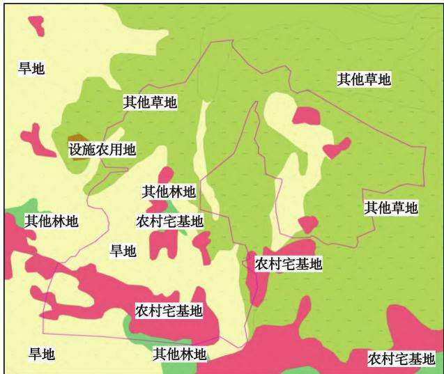  
图1 研究区土地利用现状  
Fig. 1 Current status of land use in the study area

## 2 主要地质环境问题

## 2.1 地质灾害隐患

经勘查，研究存在的地质灾害隐患主要由原采矿活动遗留的高陡边坡、采坑、不稳定边坡以及渣堆造成，其发育情况及特征见表1。

表1 地质灾害隐患统计  
Tab.1 Geological hazard hazard system
<table><tr><td>地质灾害隐患</td><td>特征情况</td></tr><tr><td>高陡边坡1</td><td>坡角  $7 0 ^ { \circ } \sim 8 1 ^ { \circ } ,$  最大垂直高差约24m，总投影面 积  $\mathrm { ~ l ~ } 4 8 9 . 6 2 \mathrm { ~ m } ^ { 2 }$ </td></tr><tr><td>高陡边坡2</td><td>坡角约70°，坡面倾向198°，最大垂直高差约20 m,总面积779.586 m²</td></tr><tr><td>高陡边坡 高陡边坡3</td><td>坡角约70°,倾向  $2 7 ^ { \circ }$  ,最大垂直高差约32 m,总 面积881.7 m²</td></tr><tr><td>高陡边坡4</td><td>坡角  $6 5 ^ { \circ } \sim 7 2 ^ { \circ }$  ,倾向西，最大垂直高差约61m， 总面积2676.03 m²</td></tr><tr><td>高陡边坡5</td><td>坡角  $6 0 ^ { \circ } \sim 7 1 ^ { \circ }$  ,倾向东，最大垂直高差约29m， 总面积4678.84m²</td></tr><tr><td>不稳定边坡</td><td>坡面长约170 m,垂直高差约 84 m,坡角 35°~ 55°,总投影面积15253.  $2 4 4 \mathrm { ~ m } ^ { 2 }$  ,边坡上部已出 现地裂缝，裂缝最宽处约10 cm</td></tr><tr><td>渣堆</td><td>渣堆5处，为废弃渣石堆积而成，规模较小，零星 堆放,共压占土地3608m2,估算方量2880 m³</td></tr><tr><td>采坑</td><td>采坑6处，总投影面积为  $6 8 \ 0 8 6 . \ 1 3 \ \mathrm { ~ m } ^ { 2 }$  ,容积约 为136 170 m³</td></tr></table>

(1)高陡边坡。研究区内共发育5处高陡边坡，最小坡角约 $7 0 ^ { \circ }$ ,最大坡角约 $8 2 ^ { \circ }$ ,总投影面积约$1 2 ~ 9 8 4 . ~ 1 5 ~ \mathrm { ~ m ~ } ^ { 2 }$ ,分别为高陡边坡1位于采坑西部边界处，坡角 $7 0 ^ { \circ } \sim 8 1 ^ { \circ }$ ,最大垂直高差约24m，总投影面积 $1 ~ 4 8 9 . 6 2 ~ \mathrm { m } ^ { 2 } \mathrm { ~ c ~ }$ 边坡出露岩性顶部为第四系黄土层，上部为二叠系砂岩和泥岩互层。边坡因受采矿活动影响，表面节理发育，节理规模几厘米到几十厘米不等，形成危岩，稳定性差。高陡边坡2位于采坑西部与土路交接的地方，坡角约70°，坡面倾向为198°,最大垂直高差约为20m，总面积 $7 7 9 . 5 8 6 \mathrm { ~ m } ^ { 2 }$ O边坡出露岩性上部为砂岩泥岩互层，下部为灰岩，边坡表面节理不发育，稳定性较好。高陡边坡3位于采坑2南部边界处(图2），其坡角约70°，倾向27°，最大垂直高差约32 m，总面积 $8 8 1 . 7 \mathrm { ~ m } ^ { 2 }$ ;边坡上部为砂岩泥岩互层，下部为灰岩，表面节理较发育，稳定性较好。高陡边坡4位于采坑2东部边界（图2),坡角 $6 5 ^ { \circ } \sim 7 2 ^ { \circ }$ ，倾向西，最大垂直高差约61m，总面积2 $6 7 6 . 0 3 \mathrm { ~ m } ^ { 2 }$ 。该边坡顶部为黄土，上部为砂岩泥岩互层，下部为灰岩，表面节理不发育，稳定性好。高陡边坡5位于渣堆4以东研究区边界处，坡角 $6 0 ^ { \circ } \sim 7 1 ^ { \circ }$ ,倾向东，最大垂直高差约29m，总面积$4 6 7 8 . 8 4 \mathrm { ~ m } ^ { 2 }$ 。该边坡顶部为黄土，土层较薄，上部为砂岩泥岩互层，下部出露为灰岩，表面节理不发育，稳定性好。

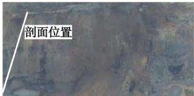  
(a)边坡3（镜向南西)

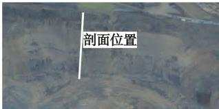  
(b）边坡4（镜向东南)

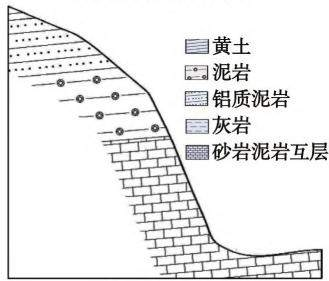  
(c) 边坡3剖面

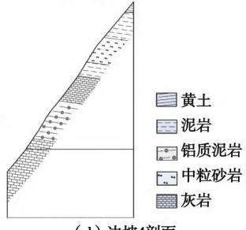  
图2 高陡边坡  
(d)边坡4剖面  
Fig. 2 High and steep slopes

(2)不稳定边坡。经勘查，研究区发育1处不稳定边坡，位于研究区北部边界处，边坡整体坡面长约170 m,垂直高差约84m,坡角 $3 5 ^ { \circ } \sim 5 5 ^ { \circ }$ ,总投影面积 $1 5 ~ 2 5 3 . 2 4 4 ~ \mathrm { m } ^ { 2 }$ ，边坡上部已出现地裂缝，裂缝最宽处约为 $1 0 \ \mathrm { c m } _ { \odot }$ 采坑东北部不稳定边坡照片如图3所示。

(3)采坑。研究区内共遗留有采坑6处，总投影面积 $6 8 ~ 0 8 6 . 1 3 ~ \mathrm { m } ^ { 2 }$ ,容积约 $1 3 6 \ 1 7 0 \ \mathrm { m } ^ { 3 }$ ;其中采坑1、采坑2面积较大(采坑1面积 $1 9 \ 0 1 8 \ \mathrm { ~ m ~ } ^ { 2 }$ ,采坑2面积 $2 9 5 9 3 \ \mathrm { m } ^ { 2 } )$ ,采坑4、采坑5次之(采坑4面积为 $8 \ 2 1 0 \ \mathrm { m } ^ { 2 }$ ,采坑5 面积 $5 5 4 3 \ \mathrm { m } ^ { 2 } )$ ,采坑3和采坑6面积较小。

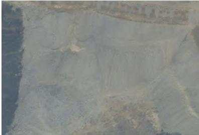  
图3 采坑东北部不稳定边坡照片  
Fig. 3 Photos of unstable slopes in the northeast of the mining pit

(4)渣堆。研究区内共遗留渣堆5处，渣堆为废弃渣石堆积而成，规模较小，零星堆放，共压占土地 $3 \ 6 0 8 \ \mathrm { m } ^ { 2 }$ ,估算方量 $2 8 8 0 \ \mathrm { m } ^ { 3 }$ 0

## 2.2 含水层破坏

研究区最低开采标高位于地下水以上，与区域含水层或地表水联系不密切。矿山开采不会改变地下水的运动规律，即采矿活动不会对地下含水层造成破坏。

## 2.3 水土流失

采矿活动将研究区内90%以上的原始植被完全破坏，使得研究区内水土流失加剧。植被破坏后，降雨对土壤的冲刷能力增强，水土流失加剧。同时土壤退化并使研究区内以及周边的地下水体富营养化。

## 2.4 地形地貌景观破坏

采矿活动将原始地貌破坏殆尽，形成凹凸不平的采坑，采坑内采面叠加，有高陡采面，有缓坡，碎石零落，采坑落差大，破坏了原始地形地貌景观。

## 2.5 土地资源破坏

研究区内土地资源的破坏主要表现为露天采矿活动已将原始地貌根本性改变，采坑现状满目疮痍，采坑内地势凹凸不平。由于露天开采，植被和表层土被完全剥离，原始地貌已不复存在，裸露的岩石及堆积的废渣使土地的种植功能几乎完全丧失，人工改造恢复植被非常困难。根据现场勘查及土地利用图对比，确定土地资源破坏面积约为 $3 2 . 9 4 ~ \mathrm { h m } ^ { 2 }$ ,其中旱地 $1 2 . 1 0 \ \mathrm { h m } ^ { 2 }$ ,其他林地 $0 . 5 7 \ \mathrm { h m } ^ { 2 }$ ,其他草地$1 4 . 9 7 ~ \mathrm { h m } ^ { 2 }$ ,农村宅基地 $5 . 2 8 \ \mathrm { h m } ^ { 2 }$ ,设施农用地0.02$ { \mathrm { h m } } ^ { 2 } \circ$ 土地权属为北冶镇裴岭村。

## 2.6 植被资源破坏

矿山开采造成了矿山表土剥离和大面积的植被破坏。开采区地表土质贫瘠，土层较浅，植物生长较缓慢，植被被破坏后，很难自然恢复。采坑内大面积基岩裸露，不具备植被生长的基本水土条件。弃渣掩埋了原始地表，加上结构松散，水土无法保持，植被难以生长。尤其露天采场大小不一、形状不尽相同、剥离岩体高度不等，采坑面积大且连续分布，由于基岩直接裸露，并且坡度陡，表面植物生长十分困难，视觉效果极差(图4)。

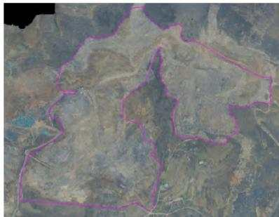  
图4 研究区整体俯瞰照片  
Fig. 4 Overall view of the study area

## 3 治理设计方案比选及推荐方案

根据研究区矿山存在的地质环境问题、危害程度及环境地质条件，重点是对区内采坑危岩、土体、地形地貌景观及土地资源的破坏等采取一系列相应对策与措施，全方位多层次的进行防治，从而改善勘查区内的生态环境，使人们的生产生活与生态环境协调发展。

在确定了研究区土地复垦利用方向之后，综合考虑工作量、施工安排、资金投入、治理效果等方面的基础上，推荐最佳方案。因此，提出了2套具有针对性的防治工程比选方案。

## 3.1 方案1

## 3.1.1 总体思路

针对研究区存在的地质环境问题，采取挖填方工程、覆土及平整工程、田埂工程、土壤改良工程、绿化工程、养护工程等工程手段恢复研究区内土地功能，改善地形地貌环境，恢复植被，从达到而改善研究区整体生态环境条件的目的。

(1)对不稳定边坡的治理。经勘查研究，造成北部边坡不稳定的因素为坡面过长(约170m），坡度较大。在本次对该边坡治理时，针对上述2点，通过采取挖填方手段在该边坡修筑马道，减小单个坡面长度，降低边坡度，使得边坡在力学结构上能保持稳定，并在边坡底部修建浆砌石挡墙，挡墙高5m，厚0.5m，长8m。然后在坡面覆土撒播草籽，在马道内种树以达到保水固土的效果。

(2)对采坑的治理。研究区内共遗留有采坑6个。其中，采坑1和采坑2面积较大，其他采坑面积相对较小。采坑1和采坑2因面积大，坑底较平整，故在对其进行治理时以场地平整为主，通过挖填方/覆土平整等手段，挖高填低，在采坑1位置修筑三级平台(平台1、平台2、平台3)如图5所示，将采坑2平整为一个大平台(平台5)对平台覆土0.8m后，修筑田埂并进行土壤改良治理成旱地；对其他面积相对较小的采坑以渣石回填为主，回填后平整覆土、土壤改良，同样治理成旱地。

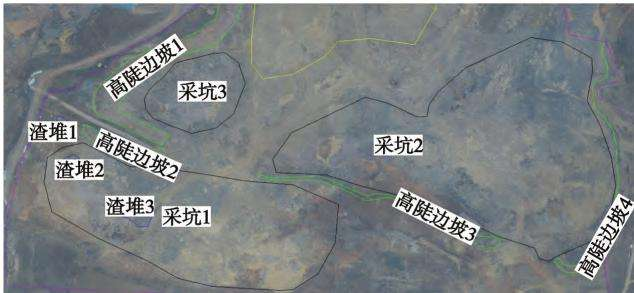  
(a) 治理前

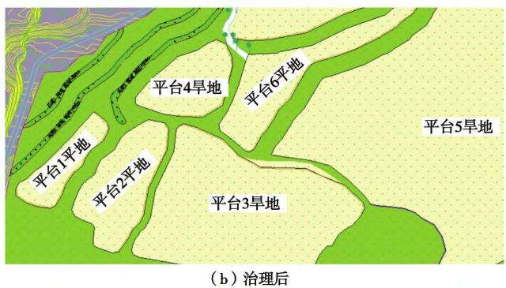  
图 5 采坑1—3 治理前后对照  
Fig. 5 Comparison of pits 1,2 ,and 3 before and after treatment

(3)对高陡边坡的治理。研究区共遗留高陡边坡5条，经勘查研究认为，除高陡边坡1和高陡边坡2外，其他边坡相对稳定，不易发生地质灾害，故本次对高陡边坡的治理可分成2种情况：高陡边坡1、2的治理：先清理掉边坡上不稳定的岩体和土体，然后从底部平台开始向上修筑2条马道，分别为马道4(标高 +402 m)和马道5(标高 +410 m)。马道之间由斜坡相连，斜坡坡度1:1.50\~1:1.75。马道覆土平整后恢复为林地，斜坡覆土后撒播草籽恢复为草地；并在马道内混播草籽(图6)。

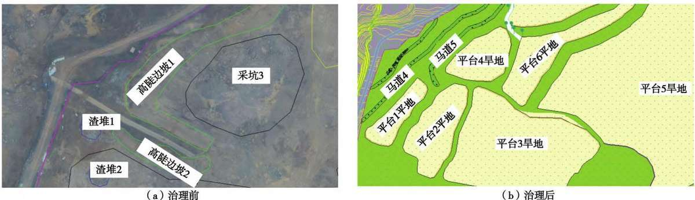  
图6 高陡边坡1、2治理前后对照  
Fig. 6 Comparison of high and steep slopes 1 and 2 before and after treatment

高陡边坡3—5的治理：高陡边坡3、高陡边坡4和高陡边坡5岩性基本相同，均为上部为砂岩泥岩互层，下部或出露灰岩或为砂岩，坡面倾向分别为27°、270°和90°，而研究区地层倾向为151°，地层倾向与坡面倾向向北，且坡面存在的时间较长，表面未发现有危岩，故认为这3个边坡较为稳定，本次治理本着避免二次破坏的思想，对此3个高陡边坡不进行削坡，在坡底沿边坡走向设计缓冲林带，林带宽2m，覆土、覆渣以及设计标高与相邻平台相同，林带内种植刺槐等高大乔木和爬山虎等爬藤类植物，并在设置警示牌防止人畜靠近，如图7所示。

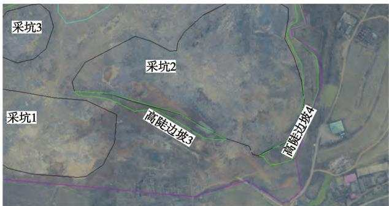  
(a) 治理前

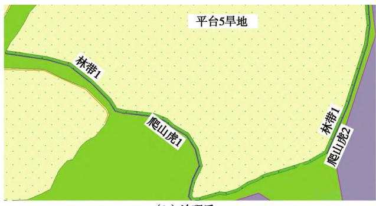  
(b) 治理后  
图7 高陡边坡3、4治理前后对照  
Fig. 7 Comparison before and after treatment of high and steep slopes 3 and 4

## 3.1.2 分项工程设计

依据研究区现状地形地貌，以“顺坡就势”、“自然恢复为主，人工为辅”以及“宜林则林，宜耕则耕”的原则，以消除地质灾害，恢复土地功能、改善研究区及周边生态环境为目的，通过工程手段修筑平台26个，马道9条,斜坡1个,坡角1:0.50\~1:1.75。

其中，平台覆土后开展土壤改良工程治理成旱地，马道除马道8和马道9外，均覆土治理成林地，马道8和马道9，因位于不稳定边坡中部，养护不便，故设计治理成草地。为施工便利以及后期养护工程的开展，对原有的运矿道路进行修缮，共修缮道路1100m。此次修缮只对路面进行平整，不另行投入治理资金。设计开展的工程手段为挖填方工程、覆土及平整工程、土壤改良工程、田埂工程、浆砌石、绿化工程、养护工程和监测工程。方案1预算费用为926.63万元。

## 3.2 方案2

## 3.2.1 总体思路

方案2与方案1总体思路基本相同，同样是通过挖填方工程、覆土及平整工程、田埂工程、土壤改良工程、绿化工程、养护工程等手段对研究区进行治理，恢复研究区内土地功能，改善地形地貌环境，恢复植被，从而改善研究区整体生态环境条件。仅在对研究东南部采坑1、采坑2、采坑3的治理思路上有出入。介于采坑1、采坑2和采坑3相距较近，欲将3个采坑连片治理，以研究区中北部已平整处为基准，将3个采坑回填至标高 +386 m处形成1个大平台，覆土后治理成旱地。覆土平整后平台恢复为旱地，马道恢复为林地，斜坡恢复为草地。

## 3.2.2 分部分项工程设计

方案2同样以消除地质灾害，恢复土地功能、改善研究区及周边生态环境为目的，通过工程手段同样修筑平台21个，马道9条，斜坡1个。设计开展的工程手段为:挖填方工程、覆土及平整工程、土壤改良工程、田埂工程、浆砌石、绿化工程、养护工程和监测工程。方案2预算费用为1166.21万元。

## 3.3 设计方案比选及推荐方案

对方案1和方案2进行比选可知，2个方案均能达到此次矿上环境治理的目的，且预计都能取得良好的成果。但相比较而言，方案1在能达到同样目的的情况下，更经济实惠。方案2在采坑1、采坑2和采坑3的治理方案虽然能获得更大面积的耕地，但是填方工程所需要的渣石方量巨大，研究区内及周边无法提供较多的填方渣料，需另行购买，增加治理成本，不够经济。

综上所述，方案1无论在施工难度、工程量、需投入资金方面还是对周边原生环境的保护和对附近居民影响等方面都优于方案2，故推荐方案1。

## 4 经济效益

研究区治理后，可以恢复旱地 $1 8 . 2 5 \ \mathrm { h m } ^ { 2 }$ ,小麦按产量 $6 ~ 0 0 0 ~ \mathrm { k g / h m } ^ { 2 }$ 、价格2元/kg计算，理论上总收入为 $1 2 0 0 0 \overline { { \mathcal { T } } } / \mathrm { h m } ^ { 2 }$ ,物力投入约 $1 0 \ 5 0 0 \ \overline { { \mathcal { T } } } \diagdown \mathrm { h m } ^ { 2 }$ 纯利润为1500元/hm²。玉米按产量 $7 ~ 5 0 0 ~ \mathrm { k g / h m } ^ { 2 }$ 价格2.1元/kg计算，毛收入为 $1 5 7 5 0 \textup { ‰}$ ,物力投入约 $6 ~ 6 0 0 ~ \overline { { \mathcal { T } } } / \mathrm { h m } ^ { 2 }$ ,纯收入为9 $1 5 0 \ \overline { { \mathcal { T } } } / \mathrm { h m } ^ { 2 } \circ \ \longrightarrow$ 年旱地可种两茬，小麦早、玉米晚，总收入为10650$\overrightarrow { \mathcal { T } } \mathrm { L } / \mathrm { h m } ^ { 2 } , 1 8 . 2 5 \mathrm { ~ h m } ^ { 2 }$ 旱地年纯收入为194362.5元左右。研究实施后，可为周边每年提供可靠的经济来源194362.5元,经济效益明显。

## 5 结语

矿山环境治理措施的实施，增加研究区农民就业岗位，推动了地方经济的发展，得到市政府的高度重视和群众的广泛支持，经济效益显著。总之，该环境综合整治工程的实施是一项利国利民、造福后代的民心工程，综合效益显著。

## 参考文献(References):

[1] 程宝成.露天铝土矿矿山地质环境综合评价与恢复治理研究

[D].北京：中国地质大学(北京),2015.

[2] 杜莉莉，刘文豪，莫志凯，等.废弃露天矿坑的生态修复方式及 发展[J]. 能源与环保,2022,44(2):54-59,65. Du Lili , Liu Wenhao , Mo Zhikai , et al. Ecological restoration patterns and development of abandoned open mine pits[ J]. China Energy and Environmental Protection ,2022,44(2) :54-59,65.

[3] 刘丹，杨琳，潘广灿，等.汝州车沟铝土矿地质环境问题分析与 治理探讨[J].河南科技,2015(4)139-140. Liu Dan , Yang Lin , Pan Guangcan , et al. Analysis and treatment of geological environmental problems in Chegou bauxite mine in Ruzhou[ J]. Henan Science and Technology ,2015(4)139-140.

[4] 郭立霞，樊子玉.宁武县南沟煤矿矿山地质环境现状及土地复 垦措施[J].能源与环保,2022,44(2):66-72,79. Guo Lixia , Fan Ziyu. Present situation of mine geological environment and land reclamation measures in Nangou Coal Mine of Ningwu County[ J]. China Energy and Environmental Protection ,2022 , 44(2):66-72,79.

[5] 王丽伟，阎昆，杨延伟.河南报庄铝土矿矿山环境地质问题及 治理措施研究[J].中国锰业,2021,39(4):43-46. Wang Liwei , Yan Kun , Yang Yanwei. Research on environmental geological problems and control measures of Baozhuang bauxite mine in Henan[ J]. China Manganese Industry ,2021 ,39(4) :43-46.

6] 刘世响，祝金峰，邓国成，等.登封市建筑用砂矿山地质环境特 征及生态恢复治理研究[J].能源与环保,2022,44(2):80-85. Liu Shixiang, Zhu Jinfeng, Deng Guocheng, et al. Study on geological environment characteristics and ecological restoration of construction sand mines in Dengfeng City[ J]. China Energy and Environmental Protection ,2022,44(2) :80-85.

[7] 史建儒.铝土矿地质勘查规范存在的问题探讨及修改建议 [J].华北国土资源,2017(5):20-21. Shi Jianru. Discussion on the problems existing in the geological exploration specification of bauxite and its revision and construction [J]. Huabei Land and Resources ,2017(5) :20-21.

[8] 王明丽.基于无人机摄影技术的矿山环境修复治理研究[J]. 能源与环保,2022,44(2):91-96. Wang Mingli. Research on mine environmental treatment and restoration based on UAV photography technology [ J]. China Energy and Environmental Protection ,2022 ,44(2) :91-96.

[9] 丁汉锋.矿区地质环境评价与治理恢复[D].开封：河南大学，2012.

[10] 肖家乐,徐家杰,薛鲲.鹤壁市誉达灰岩矿山地质环境影响评 估与恢复治理[J].能源与环保,2022,44(2):97-101. Xiao Jiale, Xu Jiajie, Xue Kun. Geological environmental impact assessment and restoration treatment of Yuda limestone Mine in Hebi City[ J]. China Energy and Environmental Protection ,2022 , 44(2):97-101.