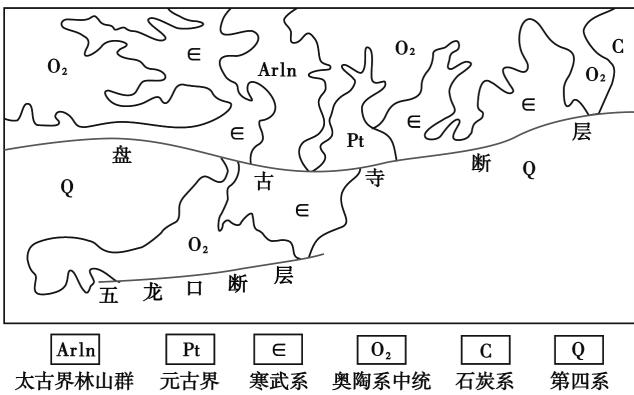
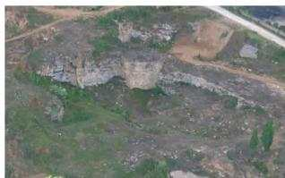
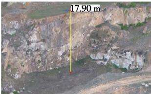
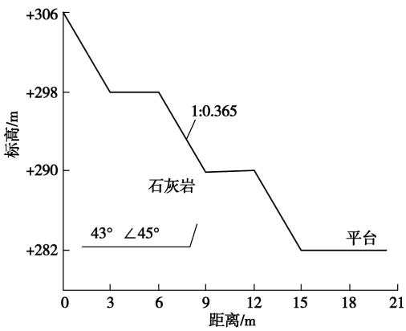
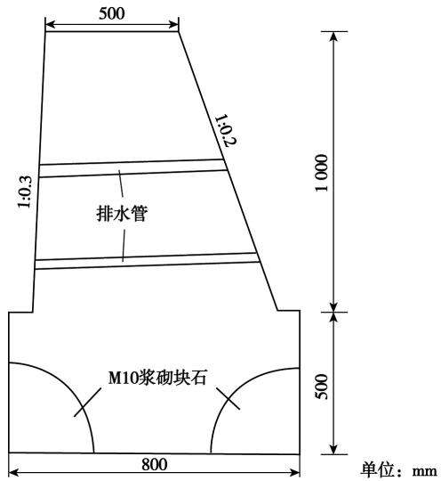

# 济源市某矿山生态环境地质问题及综合治理研究

李伟娅，秦莉旻(河南省地质矿产勘查开发局第四地质矿产调查院，河南郑州 450000)

摘要：济源市某矿山生态地质环境问题已经严重制约了当地经济社会的发展，甚至威胁到当地人民群众的生命财产安全，地质环境问题的治理已刻不容缓。通过对该矿山生态地质环境问题调查，认为矿区内主要以露天采坑、渣堆、废弃石料厂、废弃石灰窑、废弃建筑、陡坎、高陡边坡等地质环境问题为主。通过坡面清理、挖方削坡等工程手段，消除区内采矿形成的高陡边坡所引发的滑坡、崩塌等地质灾害隐患；通过回填、挖方、挡土墙等工程手段，实现采坑地貌形态修复；通过覆土、植树、道路等工程手段恢复治理区的土地功能，改善生态环境。研究可为相似矿山地质环境问题的治理提供了参考。

关键词：济源市；矿山地质环境问题；综合治理研究；环境效益

中图分类号：TD167;X141

文献标志码：A

文章编号:1003-0506(2023)01-0052-06

# Study on ecological environment geology problem and comprehensive management of a mine in Jiyuan City

Li Weiya,Qin Limin (No. 4 Institute of Geological & Mineral Resources Survey of Henan , Zhengzhou 450000 , China)

Abstract : The ecological geological environment problem of a mine in Jiyuan City has seriously restricted the development of local economy and society , and even threatened the safety of local people's life and property. The governance of geological environment problem has come to a point of no delay. Through the mine ecology geology environment investigation , the authors summarized the region mainly open-pit mining pit , slag heap , waste stone plant , waste lime kiln , and abandoned buildings , scarp , such problems as high and steep slope is given priority to , through the slope excavation engineering means such as cutting slope surface cleaning, eliminating mining in the area which caused by the formation of the high and steep slope landslide , collapse and other geological disasters. Through backfilling, excavation , retaining wall and other engineering means to achieve mining pit topography restoration , through soil covering, tree planting, road and other engineering means to restore the land function of the control area , improve the ecological environment. It provides reference for the treatment of similar mine geological environment problems.

Keywords:Jiyuan City; mine geological environment problems ;comprehensive management research ;environmental benefits

随着经济社会的快速发展，大规模的石灰岩开采活动，对区内的地质环境造成了较大的破坏，引发了一系列的地质环境问题[14]。不但破坏了原有土地、植被和地形地貌，还在地表形成了大量的规模较大的采坑，采坑后缘形成了直立的大型岩、土质高边坡，因边坡局部失稳而形成的崩塌、滑坡等地质灾害时有发生；采矿后遗留的废渣、废石就地沿斜坡、沟谷堆放，压占了土地、破坏了植被，还存在引发泥石流地质灾害的危险隐患。区内大量的石灰窑，在烧质的过程中会产生大量的有害气体排放，对当地的大气环境造成了一定的危害[5-11]。为了消除治理区内地质灾害隐患及影响，修复地形地貌景观，改善生态环境条件，最大限度地服务于济源市北部规划产业聚集区的开发建设，集中3个治理区，开展地质环境、地形地貌景观和生态环境恢复治理工作，通过坡面清理、挖方削坡、平硐封堵等工程手段消除区内采矿形成的高陡边坡所引发的滑坡、崩塌等地质灾害隐患，通过回填、挖方、挡土墙等工程手段实现采坑地貌形态修复，通过覆土、植树、道路等工程手段恢复治理区的土地功能，改善生态环境[2-9]。

## 1 地质环境概况

## 1.1 地形地貌

研究区位于太行山余脉，区域上呈北高南低、西高东低的地形特征，发育的地貌单元主要有侵蚀剥蚀低山、侵蚀剥蚀丘陵、坡洪积倾斜平原、冲积平缓平原和黄土丘陵地貌，区内标高+225\~+350m，最高点位于项目区东南角，最低点位于区内东北部，高差125m。地层岩性主要为奥陶系厚层状石灰岩，上部覆盖第四系残坡积黏土。由于石灰岩的开采，山体采坑、渣堆、陡崖遍布。

## 1.2 区域地质

(1)地质条件。区域构造位于华北盆地中的济源一开封凹陷内，在区内凹陷的基础上，形成了次一级凹陷圈闭区[1-2]。研究区构造受盘古寺断裂、五龙口断裂影响，构造形迹表现为近东西向构造为主。区内出露地层主要有太古界一元古界、寒武系、奥陶系中统及第四系(图1)。区内岩土介质可分为岩体、土体2大类，岩体又进一步划分为软弱层状砂(砾)岩、泥(灰)岩碎屑岩组和坚硬层状岩溶化石灰岩、白云岩碳酸盐岩组2个工程地质岩组；土体主要为黏性土砂砾层土工程地质岩组。

  
图1 济源市省庄地热区区域地质  
Fig. 1 Regional geological map of Shengzhuang geothermal field ,Jiyuan City , Henan Province

(2)水文地质条件。①含水岩组：治理区出露的基岩主要为奥陶系石灰岩、白云岩，其次为第四系覆盖层。因此，其含水岩组可划分为松散岩类孔隙含水岩组和碳酸盐岩裂隙岩溶含水岩组。②隔水岩组：治理区内缺失区域上隔水层所在的地层，因此无隔岩组分布。③地下水的补给、径流与排泄：区内地下水的补给途径主要来自于大气降水的渗透补给，次为地表水体的下渗补给。自高向低运移，在冲沟或其他地势较低的地段流出地表，最终汇入地表水体进行排泄。碳酸盐岩裂隙岩溶含水的径流方式主要沿溶洞、溶蚀裂隙及断层等通道运行，一般以泉和人工开采的方式进行排泄。

## 2 矿山生态环境地质问题

矿产资源的开采对治理区内的地质环境造成了极大的破坏，引发了一系列的地质环境问题[10-15]，主要表现为：①露天开挖形成采坑，造成了山体破损；②采矿弃渣随意堆放、废弃石灰窑、废弃石料厂分布导致地形地貌景观严重破坏；③高陡边坡失稳，引发崩塌等地质灾害，对区内居民生命财产安全构成了威胁(图2)。

  
(a) 露天采坑

  
(b) 高陡边坡  
图2露天采坑、高陡边坡  
Fig. 2 Open pit and high steep slope

## 2.1 NL4-2 西治理区矿山地质环境问题

NL4-2西区位于玉川大道南，玉川一号线东侧，东西最大宽度155m,南北最大长度约600 m，总面积 $0 . 0 5 ~ \mathrm { k m } ^ { 2 }$ 0

(1)地形地貌景观破坏。①采坑。治理区东北角有一个露天采坑，南北长20m，东西宽16m，占地面积 $3 2 0 \mathrm { ~ m ~ } _ { \mathrm { ~ o ~ } } ^ { 2 }$ ②废渣堆。治理区内发现废渣堆3处，分别为 ${ \bf Z } 1 { \bf \Delta } . { \bf Z } 2 { \bf \Delta } _ { \circ }$ 其中，Z1 占地面积 $3 9 7 ~ \mathrm { m } ^ { 2 }$ ,堆高$3 \ \mathrm { m } ; \mathrm { Z } 2$ 占地面积 $7 6 \mathrm { ~ m } ^ { 2 }$ ,堆高 $1 . 6 \mathrm { \ m } _ { \mathrm { ~ o ~ } }$ ③废弃建筑。通过现场调查发现治理区内有大量的废弃房屋压占土地，废弃房屋一共17处，29间，占地面积 $7 4 5 \mathrm { ~ m } ^ { 2 }$ i废弃石灰窑3处，占地面积 $4 0 7 ~ \mathrm { m } ^ { 2 }$ ,平均高17 m;废弃生产建筑5处，占地面积 $7 3 7 ~ \mathrm { m } ^ { 2 }$ O

(2)土地资源破坏。工业场地、废渣堆、房屋等破坏林地 $1 . 9 9 \ \mathrm { h m } ^ { 2 }$ ,占治理区面积的 23.85%。

## 2.2 NJ4 北治理区矿山地质环境问题

NJ4北区位于矿区西北部，东西长约255m，南北长约 63 m，面积 $0 . 0 1 \ \mathrm { k m } ^ { 2 } .$ 。由于矿产资源的开采，对区内的地质环境造成了极大的破坏，主要地质环境问题有陡坎、废弃平硐洞口、采空区、渣堆、凸起基岩等。区内共发育有陡坎1段、废弃平硐洞口1个、采空区1处、渣堆1处、凸起基岩1处。

(1)地质灾害。该区的地质灾害隐患主要为采矿形成的高陡边坡，其高差大于7m，且坡角普遍大于70°，长153.9m。高陡边坡上零散的分布有规模不等的危岩体，不稳定，存在以小型崩塌的形式发生失稳的可能性，需清除危岩体。

(2)地形地貌景观破坏。该区内共分布有废弃平硐洞口1个、采空区1处、渣堆1处、凸起基岩1处，破坏地形地貌景观面积6598.47m²。

(3)土地资源破坏。该区内原始土地类型为林 地,共计破坏林地面积6598.47m²。

## 2.3 NL6 东治理区矿山地质环境问题

NL6东治理区位于玉川大道南、拟建玉川三号线东侧，东西最大长度204m,南北最大宽度419m，总面积 0.06 km²。

(1)地质灾害。该区的地质灾害主要为采矿形成的高陡岩质边坡，边坡高10\~62m,坡角普遍大于70°，坡长230m。边坡局部有规模不等的危岩分布，部分地段有规模较大临空面，不稳定，以小型崩塌的形式发生失稳的可能性很大。

(2)地形地貌景观破坏。该区内共分布有露天 采矿平台1个，废渣堆2个，破坏地形地貌景观面积 $7 ~ 1 9 3 . 5 2 ~ \mathrm { m } ^ { 2 }$ ,为地形地貌破坏严重区。

(3)土地资源破坏。该区内原始土地类型为林地，露天采矿平台、废渣堆、高陡边坡等破坏林地面积总计16543.08m²，为土地资源破坏严重区。

## 3 生态地质环境综合治理研究

针对地质环境问题，对研究区内NL4-2西、NJ4北、NL6东3个区域开展地质环境、地形地貌景观和生态环境恢复治理[8-18],治理面积0.12 km²,恢复林地面积4.30hm²。治理区规模及措施见表1。

表1 治理区规模及措施  
Tab. 1 Scale and measures of administrative areas
<table><tr><td rowspan="2">治理区</td><td rowspan="2">地质环境问题</td><td colspan="3">规模</td><td rowspan="2">治理措施</td></tr><tr><td></td><td>东西宽/m 南北长/m 面积/km²</td><td></td></tr><tr><td>NL4-2 西</td><td>采坑1处，废弃渣堆2处，工 业场地7处，废弃石灰窑3 处，废弃房屋17处，废弃生产 建筑5处</td><td>155</td><td>600</td><td>0.05</td><td>①废渣堆治理。将废渣就地平整然后覆土种植树，恢复为林 地。②工业场地治理。先进行土地平整然后覆土种植果树， 恢复为林地。③废弃房屋治理。先拆除废弃房屋，将拆除的 建筑垃圾运至较近的工业场地平整后覆土植树恢复为林地。 ④石灰窑治理。拆除石灰窑，将拆除的建筑垃圾运至较近的 工业场地，平整后覆土植树恢复为林地</td></tr><tr><td>NJ4 北</td><td>区内共发育有陡坎1段、废弃 平硐洞口1个、采空区1处、 渣堆1处、凸起基岩1处</td><td>255</td><td>63</td><td>0.01</td><td>实施危岩体清除、平硐洞口封堵、渣堆清理、凸起基岩清理、场 地平整、绿化、设置警示牌等分项工程</td></tr><tr><td>NL6东</td><td>主要为采矿形成的高陡岩质 边坡，区内共分布有高陡边坡 1 段</td><td>204</td><td>419</td><td>0.06</td><td>首先对高陡边坡进行挖方削坡后，进行场地平整，结合周边现 状标高，开采平台场地平整最终设计标高为斜坡面，然后对原 有开采平台和削坡平台进行覆土、绿化等工程</td></tr></table>

## 3.1 NL4 -2 西治理区

(1)挖方削坡工程。拆除区内的石灰窑，进行削坡，最终形成30°的边坡。削坡面积合计992.29m²,削坡方量合计5771.65 m³。

(2)地表建筑物拆除工程。治理区内分布有大量的矿山开发时遗留下来的简易房子、设施等。经统计，拆除废弃残留的简易房屋29间，合计面积745m²，残留的生产建筑5处，合计面积 $7 3 7 \mathrm { ~ m } ^ { 2 }$ ,全区共计拆除地表建筑物 $1 \ 4 8 2 \ \mathrm { m } ^ { 2 }$ ,产生的建筑垃圾，就近回填至附近的工业场地低洼地带。

(3)挖填方平整工程。①采坑治理。调查区东北侧有1个露天采坑，东西宽16m，南北长20m，采坑东侧有1座废渣堆，经过测算渣堆量与采坑回填量基本一致，回填量3854.5m³。回填后覆土植树。②工业场地治理。工业场地有2处废渣堆，由于工业场地面积较大，2处废渣堆就地平整后覆土植树即可，平整量1191m³，覆土后植树。

(4)覆渣、覆土工程。本区的土壤资源相对短缺，为了减少植被恢复对土源的需求，首先回填厚0.5\~0.8m的碎石土层，当覆渣层回填完毕后分层覆土，为方便土壤改良，第1层压实厚度20cm、第2层压实厚度10 cm。本区共回填碎石层14 651.95m³,覆土 $5 ~ 1 3 9 . 3 ~ \mathrm { m } ^ { 3 }$ 。区域进行表层覆渣、覆土可满足植被生长的要求。

(5)生物工程。在本区房屋拆除、采坑、削坡及工业场地区域种植苗木和撒播草籽，种植方法为：第1排种植榆树、第2排种植椿树，种植间距2.0m×2.0m，品字型布株，植树的同时在下方撒播草籽狗牙根下方撒播草籽狗牙根，既保证绿化效果并且利于避免水土流失。此次生物工程选择榆树、椿树对本期进行造林绿化。本区共需种植榆树2165株、椿树2165株，撒播草籽狗牙根1.73 hm2。

## 3.2 NJ4 北治理区

(1)危岩体清除、平硐洞口封堵。为消除潜在的地质灾害隐患，需对零散分布的危岩体进行清除，根据现场调查，共有危岩 $8 0 0 ~ \mathrm { m } ^ { 3 }$ ,将清除的危岩体方量运送至治理区地势较低的区域就地平铺。对凸起的基岩进行石方开挖，凸起基岩长30.7m，平均宽1.9m,平均高出地面1.2m，并在有基岩的地方进行深1m的石方置换，共需开挖石方方量128.33m³，挖方量运送至治理区地势较低的区域就地平铺。

(2)根据现场调查，废弃平硐洞口高5.0m，宽5.0 m,面积 $2 5 . 0 0 \mathrm { ~ m } ^ { 2 }$ 。采用M10浆砌块石进行封堵，浆砌块石厚度取2.0m，则封堵需浆砌块石方量50.00m³。后在新增崩塌区增加废弃平硐封堵1座,方量 $1 0 0 ~ \mathrm { m } ^ { 3 }$ 0

(3)场地平整。场地平整区面积为6598.47m²，将清除的危岩体、渣堆和凸起基岩等，共计方量为1 334.31 m³运送至治理区地势较低的区域就地平铺，场地平整区平铺平均厚度0.20m，然后对场地平整区进行机械平整，为下一步覆土工作奠定基础。

(4)覆土。场地平整完成后，对平整好的工作面进行覆土，为方便土壤改良，第1层压实厚度为20 cm、第2层压实厚度为10 cm。本区覆土面积为6 598.47 m²,覆土厚度0.3 m,需土方量为1 979.54m³；在有基岩的地方进行石方置换，置换范围长30.7m,平均宽1.9m，置换深度1m,需土方量58.33 m³;则共需覆土量2 037.87 m³。

(5)生物工程。本区绿化工程树木选择榆树，陡坎底部选择爬山虎，撒播草籽选用狗牙根，爬山虎种植行距150mm,种植2行，高陡边坡长153.9m，共需种植爬山虎面积 $0 . 0 0 5 ~ \mathrm { h m } ^ { 2 }$ ;在场地平整区域种植榆树,株距2m×2 m,树坑规格为 0.5 m ×0.5m×0.5m,共需种植榆树1830棵。树木栽植完成后进行草籽撒播，平均每公顷需要草籽75kg，撒播面积即为场地平整面积 $6 ~ 5 9 8 . 4 7 ~ \mathrm { m } ^ { 2 }$ ,则共需要撒播草籽 49.50 kg。

## 3.3 NL6 东治理区

(1)削坡。为了消除采矿形成的高陡边坡引发地质灾害隐患，高陡边坡从标高+282m向上按每8m留设1道宽3m的平台，平台后按1:0.365的坡比与上一平台衔接的方式进行削坡。通过将直立式边坡削为70°边坡和对部分地段进行危岩体清除，治理区内的岩质边坡将达到基本稳定状态，消除崩塌地质灾害隐患(图3)。

  
图3 高陡边坡削坡示意  
Fig. 3 Schematic diagram of high and steep slope cutting

(2)挡土墙工程。为了保证回填碎石和覆土层的稳定，最大程度地减少水土流失，在回填区的前方设置1道浆砌石挡土墙，全区共设置挡土墙8段，分布于削坡区各平台和开采平台的前缘，长度合计为1 362.15m。挡土墙均采用M10浆砌石结构，基岩基底摩擦系数取0.7，墙后填土为碎石土矿渣，内摩擦角取值35°,挡土墙高1.50m,顶宽0.50m,底宽0.80m，面坡倾斜度1:0.20,背坡垂直，底面直接砌在平台(图4)。

(3)截排水工程。本区截、排水渠设计断面均选择为矩形断面，采用同类截排水渠中的平均纵坡值进行计算，渠道道糙率取0.012。截、排水渠转弯处弧形凹侧沟壁设置超高，超高高度P1类排水渠取0.03m，渠身、渠底均采用C20混凝土浇筑，厚度均为 0.2m,每隔10 m设1条宽为3 cm的沥青木板沉伸缝，外露部分全部为M10砂浆抹面，顶部用厚3cm的 M10 砂浆抹平。P2 类排水渠取 0.03 m，渠身、渠底均采用C20混凝土浇筑，厚度均为0.2m，每隔10m设1条宽为3 cm的沥青木板沉伸缝，外露部分全部为M10砂浆抹面，顶部和内侧用厚3cm的M10砂浆抹平。

  
图4 重力式挡土墙  
Fig. 4 Gravity slag retaining wall

(4)覆渣、覆土工程。在采坑、基岩裸露区、经场地平整后仍然无土方分布的区域，首先回填厚0.5m的碎石土层，以满足植被生长对土壤厚度的要求。当覆渣层回填完毕后，覆土厚度为自然沉实土壤0.5m，分层覆土，第1层压实厚度30 cm、第2层压实厚度20 cm。为防止边坡坡脚覆土被侵蚀，在边坡下部均设置截水措施。共设计覆渣5782.32m³,覆土 5 782.32 m³。

(5)生物工程。根据治理区及其周边现状条件下自然生长的植被情况，选择抗旱能力强、耐贫瘠、生长速度快的植物，以侧柏、椿树、爬山虎、结缕草、黑麦草等5种植物进行造林绿化。在削坡平台上种植侧柏、爬山虎及结缕草、黑麦草，种植间距为2.0m×2.0 m，靠近斜坡一侧撒播爬山虎籽，撒播密度为75kg/hm²。在开采平台区，种植侧柏、椿树及结缕草、黑麦草，其中侧柏、椿树种植间距为2.0m×2.0m,品字型布株。

## 4 效益分析

## 4.1 环境效益

通过矿山地质环境综合治理措施，有效消除了矿山地质灾害隐患，保护脆弱的矿山地质环境，增加绿化面积，美化环境，加快了生态功能修复，恢复其生态环境服务和利用功能，同时结合王屋山世界地质公园等风景名胜区，拉长济源市旅游产业链条。不仅会促进济源市受损生态系统的有效恢复和重建，还将使济源市城市生态安全和稳定性明显提高，也为社会经济的发展提供良好生态基础[15]。

## 4.2 社会效益

通过济源市区北部规划产业集聚区矿山地质环境治理工程，可有效消除各种地质灾害隐患，极大地减缓社会矛盾，促进社会稳定，营造和谐社会氛围，将有效地保护和恢复治理区内的地质环境，有力支持经济的发展，这将增加广大人民群众对党和政府的信任，增加发展经济、全面建设小康的信心，对促进济源市实现经济可持续发展具有重要的战略意义；以新兴旅游产业带动济源经济的迅速发展，促进第三产业的持续、快速增长，对于实现济源市全面建设小康社会具有重要意义[13]。

## 4.3 经济效益

矿山地质环境治理工程属于公益性和社会性项目，其价值效应具有长久性、间接性和潜在性特点。本标段治理工程的实施，有效预防了区内地质灾害隐患，恢复了生态环境、改善了人居环境，美化了地表形态，提升了产业聚集区的整体形象。为济源市区北部的总体规划，工程建设提供基础保障，潜在的经济效益不可估量[16-19]。

## 5 结语

(1)研究区内由于大规模的开采活动，引发了一系列的地质环境问题，主要表现为露天开挖形成的采坑，造成了山体破损：采矿弃渣随意堆放、废弃石灰窑、废弃石料厂分布导致地形地貌景观严重破坏；高陡边坡失稳，引发崩塌等地质灾害，对区内居民生命财产构成威胁。

(2)通过对 NL4-2 西治理区、NJ4 北治理区、NL6东治理区开展综合治理工程，综合治理面积0.12 km²,恢复林地面积4.30 hm²；增加草地面积3.758 hm²,增加苗木12 541 株。

(3)通过对济源市区北部规划产业集聚区矿山地质环境治理工程，有效消除了矿山地质灾害隐患，保护脆弱的矿山地质环境，极大地减缓社会矛盾，促进社会稳定，营造和谐社会氛围，可改善当地居民生态环境质量，为实现全面小康打下坚实的基础；为济源市区北部的总体规划，工程建设提供基础保障，为产业聚集区的快速发展服务。

## 参考文献(References)：

[1] 温久川.矿区生态环境问题及生态恢复研究[D].呼和浩特：

内蒙古大学,2012.

[2] 杨金中，许文佳，姚维岭，等.全国采矿损毁土地分布与治理状 况及存在问题[J].地学前缘,2021,28(4):83-89. Yang Jinzhong, Xu Wenjia, Yao Weiling, et al. Land destroyed by mining in China: damage distribution , rehabilitation status and existing problems[ J]. Earth Science Frontiers ,2021 ,28(4) : 83-89.

[3] 魏新力，刘淑芹，韩刚，等.河南省济源市玉川产业聚集区矿山 生态环境地质问题及治理对策[J].能源与环保,2021,43(4)： 37-43. Wei Xinli , Liu Shuqin , Han Gang, et al. Ecological environmental geological problems in industrial agglomeration area of Yuchuan, Jiyuan City, Henan Province and its countermeasures [ J]. China Energy and Environmental Protection ,2021 ,43(4) :37-43.

[4] 周亚光.玉皇全采石场建筑石料用灰岩矿矿山地质环境治理 工程设计[J].能源与环保,2020,42(9):45-49. Zhou Yaguang. Design of the mine geological environment treatment project for limestone mines used for building stones in Yuhuangquan Quarry[ J]. China Energy and Environmental Protection ,2020 ,42(9) :45-49.

[5] 庞绪成，张凯涛，赵少攀，等.豫西龙门店银矿成矿规律及深部 预测[J].矿物岩石地球化学通报,2016,35(2):272-278. Pang Xucheng, Zhang Kaitao , Zhao Shaopan , et al. Metallogenic regularities and deep prospecting of the Longmendian Silver Deposit in western Henan Province[ J]. Bulletin of Mineralogy. Petrology and Geochemistry ,2016,35(2) :272-278.

[6] 刘勇，王浩霖，李静静，等.巩义市历史遗留露天矿山地质环境 问题现状及治理对策[J].能源与环保,2021,43(4):15-22. Liu Yong, Wang Haolin, Li Jingjing, et al. Research on status quo of geological environmental problems of historic open-pit mines in Gongyi City and countermeasures[ J]. China Energy and Environmental Protection ,2021 ,43(4) :15-22.

[7] 原振雷，肖荣阁，李明立，等.矿产资源开发区生态环境问题及 其防治[J]. 矿产保护与利用,2005(1):40-44. Yuan Zhenlei , Xiao Rongge , Li Mingli , et al. Ecological and environmental problems in mineral resource development zones and their prevention and control[ J]. Mineral Resources Protection and Utilization ,2005(1) :40-44.

[8] 何芳,徐友宁,乔冈，等.中国矿山地质灾害分布特征[J].地质 通报,2012,31(2/3):476-485. He Fang, Xu Youning, Qiao Gao , et al. Distribution characteristics of mine geological hazards in China[ J]. Geological Bulletin of China,2012,31(2/3):476-485.

[9] 刘德成.京津冀矿山环境修复治理措施研究——以玉田县某 矿山为例[J].环境生态学,2020,2(11):69-73. Liu Decheng. Study on the measures of mine environment restoration in Beijing, Tianjin and Hebei: taking a mine in Yutian County as an example[ J]. Environmental Ecology ,2020 ,2(11) :69-73.

[10] 武乐霞.矿山地质环境治理工程技术研究[J]. 能源与环保， 2020,42(4):46-51. Wu Yuexia. Study on engineering technology of mine geological environment control [ J]. China Energy and Environmental Protec-

tion,2020,42(4) :46-51.

[11]徐莉，张军营，路东臣.河南矿山生态环境现状及其保护对策 [J]. 中国矿业,2004(4):34-37. Xu Li, Zhang Junying, Lu Dongchen. Current situation of Henan mine ecological environment and its protection countermeasures [J]. China Mining Magazine ,2004(4) :34-37.

[12] 徐振英.河南省矿山地质环境动态遥感监测分析研究[J].环 境科学与管理,2020,45(2):120-123. Xu Zhenying. Research on dynamic remote sensing monitoring and analysis of mine geological environment in Henan Province [ J]. Environmental Science and Management ,2020,45(2) :120-123.

[13] 张昊，张强，左小，等.生态环境保护性的采选充系统设计及应 用[J]. 中国矿业大学学报,2021,50(3):548-557. Zhang Hao , Zhang Qiang, Zuo Xiao , et al. Design and application of mining-separating-backfilling system for mining ecological and environmental protection[ J] . Journal of China University of Mining & Technology ,2021,50(3) :548-557.

[14] 孟瑞娜.某矿山地质环境恢复与治理工程施工勘查[J].西部 探矿工程,2014,26(6):145-147. Meng Ruina. Construction survey of a mine geological environment restoration and treatment project[ J]. West-China Exploration Engineering,2014,26(6):145-147.

[15] 黄栋良，梅金华，何卫平.湖南矿山地质环境破坏影响评价及 防治研究[J].矿业研究与开发,2021,41(9):118-124. Huang Dongliang , Mei Jinhua ,He Weiping. Impact evaluation and prevention research on mine geological environment destruction in Hunan [J]. Mining Research and Development ,2021 ,41 (9) :118-124.

[16] 张小连，张文炤，武成周，等.矿山地质环境治理工程技术[J]. 能源与环保,2020,42(10):1-6. Zhang Xiaolian , Zhang Wenzhao , Wu Chengzhou , et al. Mine geological environment treatment engineering technology [ J]. China Energy and Environmental Protection ,2020 ,42(10) :1-6.

[17] 孙小妹，陈菁菁，李金霞，等.施肥后青藏高原亚高寒草甸典型 物种生态化学计量特征及光合特性的变化[J].兰州大学学报 (自然科学版),2018,54(6):804-810. Sun Xiaomei , Chen Jingjing, Li Jinxia , et al. Effects of nutrient addition on ecological stoichiometric characteristics and photosynthesis of representative species in a sub-alpine meadow community [J]. Journal of Lanzhou University (Natural Sciences) , 2018, 54 (6) :804-810.

[18]束文圣，张志权，蓝崇钰.中国矿业废弃地的复垦对策研究 [J].生态科学,2000,19(2):24-29. Shu Wensheng, Zhang Zhiquan , Lan Chongyu. Strategies for restoration of mining wastelands in China[ J]. Ecologic Science ,2000 , 19(2) :24-29.

[19] 卫智军，李青丰，贾鲜艳，等.矿业废弃地的植被恢复与重建 [J].水土保持学报,2003,17(4)：172-175. Wei Zhijun , Li Qingfeng, Jia Xianyan , et al. Vegetation recovery on industrial mining disposal site[ J]. Journal of Soil and Water Conservation ,2003,17(4) :172-175.